<!-- markdownlint-capture -->
<!-- markdownlint-disable -->

# Code Metrics

This file is dynamically maintained by a bot, *please do not* edit this by hand. It represents various [code metrics](https://aka.ms/dotnet/code-metrics), such as cyclomatic complexity, maintainability index, and so on.

<div id='azurefunctiontier'></div>

## AzureFunctionTier :heavy_check_mark:

The *AzureFunctionTier.csproj* project file contains:

- 2 namespaces.
- 4 named types.
- 164 total lines of source code.
- Approximately 51 lines of executable code.
- The highest cyclomatic complexity is 7 :heavy_check_mark:.

<details>
<summary>
  <strong id="azurefunctiontier">
    AzureFunctionTier :heavy_check_mark:
  </strong>
</summary>
<br>

The `AzureFunctionTier` namespace contains 2 named types.

- 2 named types.
- 109 total lines of source code.
- Approximately 33 lines of executable code.
- The highest cyclomatic complexity is 7 :heavy_check_mark:.

<details>
<summary>
  <strong id="startup">
    Startup :heavy_check_mark:
  </strong>
</summary>
<br>

- The `Startup` contains 1 members.
- 15 total lines of source code.
- Approximately 4 lines of executable code.
- The highest cyclomatic complexity is 1 :heavy_check_mark:.

| Member kind | Line number | Maintainability index | Cyclomatic complexity | Depth of inheritance | Class coupling | Lines of source / executable code |
| :-: | :-: | :-: | :-: | :-: | :-: | :-: |
| Method | [12](https%3A%2F%2Fgithub.com%2FIEvangelist%2Fazure-cosmos-dotnet-repository%2Fblob%2Fmain%2Fsamples%2FAzureFunctionTier%2FStartup.cs%23L12 "void Startup.Configure(IFunctionsHostBuilder builder)") | 76 | 1 :heavy_check_mark: | 0 | 2 | 12 / 4 |

<a href="#Startup-class-diagram">:link: to `Startup` class diagram</a>

<a href="#azurefunctiontier">:top: back to AzureFunctionTier</a>

</details>

<details>
<summary>
  <strong id="usersapi">
    UsersApi :heavy_check_mark:
  </strong>
</summary>
<br>

- The `UsersApi` contains 5 members.
- 88 total lines of source code.
- Approximately 29 lines of executable code.
- The highest cyclomatic complexity is 7 :heavy_check_mark:.

| Member kind | Line number | Maintainability index | Cyclomatic complexity | Depth of inheritance | Class coupling | Lines of source / executable code |
| :-: | :-: | :-: | :-: | :-: | :-: | :-: |
| Field | [19](https%3A%2F%2Fgithub.com%2FIEvangelist%2Fazure-cosmos-dotnet-repository%2Fblob%2Fmain%2Fsamples%2FAzureFunctionTier%2FUsersApi.cs%23L19 "IRepository<User> UsersApi._repository") | 100 | 0 :heavy_check_mark: | 0 | 2 | 1 / 0 |
| Method | [21](https%3A%2F%2Fgithub.com%2FIEvangelist%2Fazure-cosmos-dotnet-repository%2Fblob%2Fmain%2Fsamples%2FAzureFunctionTier%2FUsersApi.cs%23L21 "UsersApi.UsersApi(IRepositoryFactory factory)") | 96 | 1 :heavy_check_mark: | 0 | 4 | 1 / 1 |
| Method | [49](https%3A%2F%2Fgithub.com%2FIEvangelist%2Fazure-cosmos-dotnet-repository%2Fblob%2Fmain%2Fsamples%2FAzureFunctionTier%2FUsersApi.cs%23L49 "Task<IActionResult> UsersApi.GetAllUsers(HttpRequest req, ILogger log, CancellationToken hostCancellationToken)") | 59 | 7 :heavy_check_mark: | 0 | 14 | 31 / 12 |
| Method | [25](https%3A%2F%2Fgithub.com%2FIEvangelist%2Fazure-cosmos-dotnet-repository%2Fblob%2Fmain%2Fsamples%2FAzureFunctionTier%2FUsersApi.cs%23L25 "Task<IActionResult> UsersApi.GetUsers(HttpRequest req, ILogger log, CancellationToken hostCancellationToken)") | 65 | 2 :heavy_check_mark: | 0 | 14 | 23 / 9 |
| Method | [87](https%3A%2F%2Fgithub.com%2FIEvangelist%2Fazure-cosmos-dotnet-repository%2Fblob%2Fmain%2Fsamples%2FAzureFunctionTier%2FUsersApi.cs%23L87 "Task<IActionResult> UsersApi.PostUser(HttpRequest req, ILogger log, CancellationToken hostCancellationToken)") | 68 | 1 :heavy_check_mark: | 0 | 14 | 25 / 7 |

<a href="#UsersApi-class-diagram">:link: to `UsersApi` class diagram</a>

<a href="#azurefunctiontier">:top: back to AzureFunctionTier</a>

</details>

</details>

<details>
<summary>
  <strong id="azurefunctiontier-model">
    AzureFunctionTier.Model :heavy_check_mark:
  </strong>
</summary>
<br>

The `AzureFunctionTier.Model` namespace contains 2 named types.

- 2 named types.
- 55 total lines of source code.
- Approximately 18 lines of executable code.
- The highest cyclomatic complexity is 4 :heavy_check_mark:.

<details>
<summary>
  <strong id="postuserrequest">
    PostUserRequest :heavy_check_mark:
  </strong>
</summary>
<br>

- The `PostUserRequest` contains 4 members.
- 27 total lines of source code.
- Approximately 7 lines of executable code.
- The highest cyclomatic complexity is 4 :heavy_check_mark:.

| Member kind | Line number | Maintainability index | Cyclomatic complexity | Depth of inheritance | Class coupling | Lines of source / executable code |
| :-: | :-: | :-: | :-: | :-: | :-: | :-: |
| Property | [14](https%3A%2F%2Fgithub.com%2FIEvangelist%2Fazure-cosmos-dotnet-repository%2Fblob%2Fmain%2Fsamples%2FAzureFunctionTier%2FModel%2FPostUserRequest.cs%23L14 "string PostUserRequest.EmailAddress") | 100 | 2 :heavy_check_mark: | 0 | 1 | 2 / 2 |
| Property | [8](https%3A%2F%2Fgithub.com%2FIEvangelist%2Fazure-cosmos-dotnet-repository%2Fblob%2Fmain%2Fsamples%2FAzureFunctionTier%2FModel%2FPostUserRequest.cs%23L8 "string PostUserRequest.FirstName") | 100 | 2 :heavy_check_mark: | 0 | 1 | 2 / 2 |
| Property | [11](https%3A%2F%2Fgithub.com%2FIEvangelist%2Fazure-cosmos-dotnet-repository%2Fblob%2Fmain%2Fsamples%2FAzureFunctionTier%2FModel%2FPostUserRequest.cs%23L11 "string PostUserRequest.LastName") | 100 | 2 :heavy_check_mark: | 0 | 1 | 2 / 2 |
| Method | [22](https%3A%2F%2Fgithub.com%2FIEvangelist%2Fazure-cosmos-dotnet-repository%2Fblob%2Fmain%2Fsamples%2FAzureFunctionTier%2FModel%2FPostUserRequest.cs%23L22 "PostUserRequest.implicit operator User(PostUserRequest postUserRequest)") | 87 | 4 :heavy_check_mark: | 0 | 2 | 13 / 1 |

<a href="#PostUserRequest-class-diagram">:link: to `PostUserRequest` class diagram</a>

<a href="#azurefunctiontier-model">:top: back to AzureFunctionTier.Model</a>

</details>

<details>
<summary>
  <strong id="user">
    User :heavy_check_mark:
  </strong>
</summary>
<br>

- The `User` contains 6 members.
- 22 total lines of source code.
- Approximately 11 lines of executable code.
- The highest cyclomatic complexity is 2 :heavy_check_mark:.

| Member kind | Line number | Maintainability index | Cyclomatic complexity | Depth of inheritance | Class coupling | Lines of source / executable code |
| :-: | :-: | :-: | :-: | :-: | :-: | :-: |
| Property | [21](https%3A%2F%2Fgithub.com%2FIEvangelist%2Fazure-cosmos-dotnet-repository%2Fblob%2Fmain%2Fsamples%2FAzureFunctionTier%2FModel%2FUser.cs%23L21 "string User.EmailAddress") | 100 | 2 :heavy_check_mark: | 0 | 1 | 2 / 2 |
| Property | [12](https%3A%2F%2Fgithub.com%2FIEvangelist%2Fazure-cosmos-dotnet-repository%2Fblob%2Fmain%2Fsamples%2FAzureFunctionTier%2FModel%2FUser.cs%23L12 "string User.FirstName") | 100 | 2 :heavy_check_mark: | 0 | 1 | 2 / 2 |
| Property | [18](https%3A%2F%2Fgithub.com%2FIEvangelist%2Fazure-cosmos-dotnet-repository%2Fblob%2Fmain%2Fsamples%2FAzureFunctionTier%2FModel%2FUser.cs%23L18 "string User.FullName") | 95 | 2 :heavy_check_mark: | 0 | 1 | 2 / 2 |
| Method | [23](https%3A%2F%2Fgithub.com%2FIEvangelist%2Fazure-cosmos-dotnet-repository%2Fblob%2Fmain%2Fsamples%2FAzureFunctionTier%2FModel%2FUser.cs%23L23 "string User.GetPartitionKeyValue()") | 100 | 1 :heavy_check_mark: | 0 | 0 | 4 / 1 |
| Property | [15](https%3A%2F%2Fgithub.com%2FIEvangelist%2Fazure-cosmos-dotnet-repository%2Fblob%2Fmain%2Fsamples%2FAzureFunctionTier%2FModel%2FUser.cs%23L15 "string User.LastName") | 100 | 2 :heavy_check_mark: | 0 | 1 | 2 / 2 |
| Property | [9](https%3A%2F%2Fgithub.com%2FIEvangelist%2Fazure-cosmos-dotnet-repository%2Fblob%2Fmain%2Fsamples%2FAzureFunctionTier%2FModel%2FUser.cs%23L9 "string User.Nickname") | 100 | 2 :heavy_check_mark: | 0 | 1 | 2 / 2 |

<a href="#User-class-diagram">:link: to `User` class diagram</a>

<a href="#azurefunctiontier-model">:top: back to AzureFunctionTier.Model</a>

</details>

</details>

<a href="#azurefunctiontier">:top: back to AzureFunctionTier</a>

<div id='changedfeedsamples-shared'></div>

## ChangedFeedSamples.Shared :heavy_check_mark:

The *ChangedFeedSamples.Shared.csproj* project file contains:

- 3 namespaces.
- 4 named types.
- 94 total lines of source code.
- Approximately 24 lines of executable code.
- The highest cyclomatic complexity is 2 :heavy_check_mark:.

<details>
<summary>
  <strong id="changedfeedsamples-shared-items">
    ChangedFeedSamples.Shared.Items :heavy_check_mark:
  </strong>
</summary>
<br>

The `ChangedFeedSamples.Shared.Items` namespace contains 2 named types.

- 2 named types.
- 56 total lines of source code.
- Approximately 16 lines of executable code.
- The highest cyclomatic complexity is 2 :heavy_check_mark:.

<details>
<summary>
  <strong id="book">
    Book :heavy_check_mark:
  </strong>
</summary>
<br>

- The `Book` contains 8 members.
- 31 total lines of source code.
- Approximately 10 lines of executable code.
- The highest cyclomatic complexity is 2 :heavy_check_mark:.

| Member kind | Line number | Maintainability index | Cyclomatic complexity | Depth of inheritance | Class coupling | Lines of source / executable code |
| :-: | :-: | :-: | :-: | :-: | :-: | :-: |
| Method | [11](https%3A%2F%2Fgithub.com%2FIEvangelist%2Fazure-cosmos-dotnet-repository%2Fblob%2Fmain%2Fsamples%2FChangedFeedSamples.Shared%2FItems%2FBook.cs%23L11 "Book.Book(string name, string author, string category)") | 75 | 1 :heavy_check_mark: | 0 | 0 | 7 / 4 |
| Method | [20](https%3A%2F%2Fgithub.com%2FIEvangelist%2Fazure-cosmos-dotnet-repository%2Fblob%2Fmain%2Fsamples%2FChangedFeedSamples.Shared%2FItems%2FBook.cs%23L20 "Book.Book(string name, string author, string category, string partitionKey)") | 75 | 1 :heavy_check_mark: | 0 | 1 | 8 / 4 |
| Property | [30](https%3A%2F%2Fgithub.com%2FIEvangelist%2Fazure-cosmos-dotnet-repository%2Fblob%2Fmain%2Fsamples%2FChangedFeedSamples.Shared%2FItems%2FBook.cs%23L30 "string Book.Author") | 100 | 2 :heavy_check_mark: | 0 | 0 | 1 / 0 |
| Property | [32](https%3A%2F%2Fgithub.com%2FIEvangelist%2Fazure-cosmos-dotnet-repository%2Fblob%2Fmain%2Fsamples%2FChangedFeedSamples.Shared%2FItems%2FBook.cs%23L32 "string Book.Category") | 100 | 2 :heavy_check_mark: | 0 | 0 | 1 / 0 |
| Method | [38](https%3A%2F%2Fgithub.com%2FIEvangelist%2Fazure-cosmos-dotnet-repository%2Fblob%2Fmain%2Fsamples%2FChangedFeedSamples.Shared%2FItems%2FBook.cs%23L38 "string Book.GetPartitionKeyValue()") | 100 | 1 :heavy_check_mark: | 0 | 0 | 1 / 1 |
| Property | [36](https%3A%2F%2Fgithub.com%2FIEvangelist%2Fazure-cosmos-dotnet-repository%2Fblob%2Fmain%2Fsamples%2FChangedFeedSamples.Shared%2FItems%2FBook.cs%23L36 "bool Book.HasBeenUpdated") | 100 | 2 :heavy_check_mark: | 0 | 0 | 1 / 1 |
| Property | [28](https%3A%2F%2Fgithub.com%2FIEvangelist%2Fazure-cosmos-dotnet-repository%2Fblob%2Fmain%2Fsamples%2FChangedFeedSamples.Shared%2FItems%2FBook.cs%23L28 "string Book.Name") | 100 | 2 :heavy_check_mark: | 0 | 0 | 1 / 0 |
| Property | [34](https%3A%2F%2Fgithub.com%2FIEvangelist%2Fazure-cosmos-dotnet-repository%2Fblob%2Fmain%2Fsamples%2FChangedFeedSamples.Shared%2FItems%2FBook.cs%23L34 "string Book.PartitionKey") | 100 | 2 :heavy_check_mark: | 0 | 0 | 1 / 0 |

<a href="#Book-class-diagram">:link: to `Book` class diagram</a>

<a href="#changedfeedsamples-shared-items">:top: back to ChangedFeedSamples.Shared.Items</a>

</details>

<details>
<summary>
  <strong id="bookbyidreference">
    BookByIdReference :heavy_check_mark:
  </strong>
</summary>
<br>

- The `BookByIdReference` contains 4 members.
- 21 total lines of source code.
- Approximately 6 lines of executable code.
- The highest cyclomatic complexity is 2 :heavy_check_mark:.

| Member kind | Line number | Maintainability index | Cyclomatic complexity | Depth of inheritance | Class coupling | Lines of source / executable code |
| :-: | :-: | :-: | :-: | :-: | :-: | :-: |
| Method | [11](https%3A%2F%2Fgithub.com%2FIEvangelist%2Fazure-cosmos-dotnet-repository%2Fblob%2Fmain%2Fsamples%2FChangedFeedSamples.Shared%2FItems%2FBookByIdReference.cs%23L11 "BookByIdReference.BookByIdReference(string id, string category)") | 80 | 1 :heavy_check_mark: | 0 | 1 | 6 / 3 |
| Method | [19](https%3A%2F%2Fgithub.com%2FIEvangelist%2Fazure-cosmos-dotnet-repository%2Fblob%2Fmain%2Fsamples%2FChangedFeedSamples.Shared%2FItems%2FBookByIdReference.cs%23L19 "BookByIdReference.BookByIdReference(string id, string category, string partitionKey)") | 80 | 1 :heavy_check_mark: | 0 | 2 | 7 / 3 |
| Property | [26](https%3A%2F%2Fgithub.com%2FIEvangelist%2Fazure-cosmos-dotnet-repository%2Fblob%2Fmain%2Fsamples%2FChangedFeedSamples.Shared%2FItems%2FBookByIdReference.cs%23L26 "string BookByIdReference.Category") | 100 | 2 :heavy_check_mark: | 0 | 0 | 1 / 0 |
| Property | [28](https%3A%2F%2Fgithub.com%2FIEvangelist%2Fazure-cosmos-dotnet-repository%2Fblob%2Fmain%2Fsamples%2FChangedFeedSamples.Shared%2FItems%2FBookByIdReference.cs%23L28 "string BookByIdReference.PartitionKey") | 100 | 2 :heavy_check_mark: | 0 | 0 | 1 / 0 |

<a href="#BookByIdReference-class-diagram">:link: to `BookByIdReference` class diagram</a>

<a href="#changedfeedsamples-shared-items">:top: back to ChangedFeedSamples.Shared.Items</a>

</details>

</details>

<details>
<summary>
  <strong id="changedfeedsamples-shared-processors">
    ChangedFeedSamples.Shared.Processors :heavy_check_mark:
  </strong>
</summary>
<br>

The `ChangedFeedSamples.Shared.Processors` namespace contains 1 named types.

- 1 named types.
- 28 total lines of source code.
- Approximately 6 lines of executable code.
- The highest cyclomatic complexity is 2 :heavy_check_mark:.

<details>
<summary>
  <strong id="bookchangefeedprocessor">
    BookChangeFeedProcessor :heavy_check_mark:
  </strong>
</summary>
<br>

- The `BookChangeFeedProcessor` contains 4 members.
- 26 total lines of source code.
- Approximately 6 lines of executable code.
- The highest cyclomatic complexity is 2 :heavy_check_mark:.

| Member kind | Line number | Maintainability index | Cyclomatic complexity | Depth of inheritance | Class coupling | Lines of source / executable code |
| :-: | :-: | :-: | :-: | :-: | :-: | :-: |
| Field | [14](https%3A%2F%2Fgithub.com%2FIEvangelist%2Fazure-cosmos-dotnet-repository%2Fblob%2Fmain%2Fsamples%2FChangedFeedSamples.Shared%2FProcessors%2FBookChangeFeedProcessor.cs%23L14 "IRepository<BookByIdReference> BookChangeFeedProcessor._bookByIdReferenceRepository") | 100 | 0 :heavy_check_mark: | 0 | 2 | 1 / 0 |
| Field | [13](https%3A%2F%2Fgithub.com%2FIEvangelist%2Fazure-cosmos-dotnet-repository%2Fblob%2Fmain%2Fsamples%2FChangedFeedSamples.Shared%2FProcessors%2FBookChangeFeedProcessor.cs%23L13 "ILogger<BookChangeFeedProcessor> BookChangeFeedProcessor._logger") | 100 | 0 :heavy_check_mark: | 0 | 1 | 1 / 0 |
| Method | [16](https%3A%2F%2Fgithub.com%2FIEvangelist%2Fazure-cosmos-dotnet-repository%2Fblob%2Fmain%2Fsamples%2FChangedFeedSamples.Shared%2FProcessors%2FBookChangeFeedProcessor.cs%23L16 "BookChangeFeedProcessor.BookChangeFeedProcessor(ILogger<BookChangeFeedProcessor> logger, IRepository<BookByIdReference> bookByIdReferenceRepository)") | 85 | 1 :heavy_check_mark: | 0 | 3 | 6 / 2 |
| Method | [23](https%3A%2F%2Fgithub.com%2FIEvangelist%2Fazure-cosmos-dotnet-repository%2Fblob%2Fmain%2Fsamples%2FChangedFeedSamples.Shared%2FProcessors%2FBookChangeFeedProcessor.cs%23L23 "ValueTask BookChangeFeedProcessor.HandleAsync(Book rating, CancellationToken cancellationToken)") | 74 | 2 :heavy_check_mark: | 0 | 7 | 13 / 4 |

<a href="#BookChangeFeedProcessor-class-diagram">:link: to `BookChangeFeedProcessor` class diagram</a>

<a href="#changedfeedsamples-shared-processors">:top: back to ChangedFeedSamples.Shared.Processors</a>

</details>

</details>

<details>
<summary>
  <strong id="changedfeedsamples-shared">
    ChangedFeedSamples.Shared :heavy_check_mark:
  </strong>
</summary>
<br>

The `ChangedFeedSamples.Shared` namespace contains 1 named types.

- 1 named types.
- 10 total lines of source code.
- Approximately 2 lines of executable code.
- The highest cyclomatic complexity is 0 :heavy_check_mark:.

<details>
<summary>
  <strong id="bookdemoconstants">
    BookDemoConstants :heavy_check_mark:
  </strong>
</summary>
<br>

- The `BookDemoConstants` contains 2 members.
- 6 total lines of source code.
- Approximately 2 lines of executable code.
- The highest cyclomatic complexity is 0 :heavy_check_mark:.

| Member kind | Line number | Maintainability index | Cyclomatic complexity | Depth of inheritance | Class coupling | Lines of source / executable code |
| :-: | :-: | :-: | :-: | :-: | :-: | :-: |
| Field | [8](https%3A%2F%2Fgithub.com%2FIEvangelist%2Fazure-cosmos-dotnet-repository%2Fblob%2Fmain%2Fsamples%2FChangedFeedSamples.Shared%2FBookDemoConstants.cs%23L8 "string BookDemoConstants.Container") | 93 | 0 :heavy_check_mark: | 0 | 0 | 1 / 1 |
| Field | [10](https%3A%2F%2Fgithub.com%2FIEvangelist%2Fazure-cosmos-dotnet-repository%2Fblob%2Fmain%2Fsamples%2FChangedFeedSamples.Shared%2FBookDemoConstants.cs%23L10 "string BookDemoConstants.PartitionKey") | 93 | 0 :heavy_check_mark: | 0 | 0 | 1 / 1 |

<a href="#BookDemoConstants-class-diagram">:link: to `BookDemoConstants` class diagram</a>

<a href="#changedfeedsamples-shared">:top: back to ChangedFeedSamples.Shared</a>

</details>

</details>

<a href="#changedfeedsamples-shared">:top: back to ChangedFeedSamples.Shared</a>

<div id='changefeedconsole'></div>

## ChangeFeedConsole :heavy_check_mark:

The *ChangeFeedConsole.csproj* project file contains:

- 1 namespaces.
- 1 named types.
- 63 total lines of source code.
- Approximately 62 lines of executable code.
- The highest cyclomatic complexity is 2 :heavy_check_mark:.

<details>
<summary>
  <strong id="global+namespace">
    &lt;global namespace&gt; :heavy_check_mark:
  </strong>
</summary>
<br>

The `<global namespace>` namespace contains 1 named types.

- 1 named types.
- 63 total lines of source code.
- Approximately 62 lines of executable code.
- The highest cyclomatic complexity is 2 :heavy_check_mark:.

<details>
<summary>
  <strong id="program$">
    &lt;Program&gt;$ :heavy_check_mark:
  </strong>
</summary>
<br>

- The `<Program>$` contains 1 members.
- 63 total lines of source code.
- Approximately 62 lines of executable code.
- The highest cyclomatic complexity is 2 :heavy_check_mark:.

| Member kind | Line number | Maintainability index | Cyclomatic complexity | Depth of inheritance | Class coupling | Lines of source / executable code |
| :-: | :-: | :-: | :-: | :-: | :-: | :-: |
| Method | [1](https%3A%2F%2Fgithub.com%2FIEvangelist%2Fazure-cosmos-dotnet-repository%2Fblob%2Fmain%2Fsamples%2FChangeFeedConsole%2FProgram.cs%23L1 "<top-level-statements-entry-point>") | 50 | 2 :heavy_check_mark: | 0 | 13 | 63 / 31 |

<a href="#global+namespace">:top: back to &lt;global namespace&gt;</a>

</details>

</details>

<a href="#changefeedconsole">:top: back to ChangeFeedConsole</a>

<div id='changefeedweb'></div>

## ChangeFeedWeb :heavy_check_mark:

The *ChangeFeedWeb.csproj* project file contains:

- 3 namespaces.
- 5 named types.
- 124 total lines of source code.
- Approximately 67 lines of executable code.
- The highest cyclomatic complexity is 1 :heavy_check_mark:.

<details>
<summary>
  <strong id="global+namespace">
    &lt;global namespace&gt; :heavy_check_mark:
  </strong>
</summary>
<br>

The `<global namespace>` namespace contains 1 named types.

- 1 named types.
- 46 total lines of source code.
- Approximately 46 lines of executable code.
- The highest cyclomatic complexity is 1 :heavy_check_mark:.

<details>
<summary>
  <strong id="program$">
    &lt;Program&gt;$ :heavy_check_mark:
  </strong>
</summary>
<br>

- The `<Program>$` contains 1 members.
- 46 total lines of source code.
- Approximately 46 lines of executable code.
- The highest cyclomatic complexity is 1 :heavy_check_mark:.

| Member kind | Line number | Maintainability index | Cyclomatic complexity | Depth of inheritance | Class coupling | Lines of source / executable code |
| :-: | :-: | :-: | :-: | :-: | :-: | :-: |
| Method | [1](https%3A%2F%2Fgithub.com%2FIEvangelist%2Fazure-cosmos-dotnet-repository%2Fblob%2Fmain%2Fsamples%2FChangeFeedWeb%2FProgram.cs%23L1 "<top-level-statements-entry-point>") | 56 | 1 :heavy_check_mark: | 0 | 5 | 46 / 23 |

<a href="#global+namespace">:top: back to &lt;global namespace&gt;</a>

</details>

</details>

<details>
<summary>
  <strong id="changefeedweb-dtos">
    ChangeFeedWeb.Dtos :heavy_check_mark:
  </strong>
</summary>
<br>

The `ChangeFeedWeb.Dtos` namespace contains 3 named types.

- 3 named types.
- 20 total lines of source code.
- Approximately 2 lines of executable code.
- The highest cyclomatic complexity is 1 :heavy_check_mark:.

<details>
<summary>
  <strong id="bookdto">
    BookDto :heavy_check_mark:
  </strong>
</summary>
<br>

- The `BookDto` contains 5 members.
- 1 total lines of source code.
- Approximately 0 lines of executable code.
- The highest cyclomatic complexity is 1 :heavy_check_mark:.

| Member kind | Line number | Maintainability index | Cyclomatic complexity | Depth of inheritance | Class coupling | Lines of source / executable code |
| :-: | :-: | :-: | :-: | :-: | :-: | :-: |
| Method | [6](https%3A%2F%2Fgithub.com%2FIEvangelist%2Fazure-cosmos-dotnet-repository%2Fblob%2Fmain%2Fsamples%2FChangeFeedWeb%2FDtos%2FBookDto.cs%23L6 "BookDto.BookDto(string Id, string Name, string Author, string Category)") | 100 | 1 :heavy_check_mark: | 0 | 0 | 1 / 0 |
| Property | [6](https%3A%2F%2Fgithub.com%2FIEvangelist%2Fazure-cosmos-dotnet-repository%2Fblob%2Fmain%2Fsamples%2FChangeFeedWeb%2FDtos%2FBookDto.cs%23L6 "string BookDto.Author") | 100 | 0 :heavy_check_mark: | 0 | 0 | 1 / 0 |
| Property | [6](https%3A%2F%2Fgithub.com%2FIEvangelist%2Fazure-cosmos-dotnet-repository%2Fblob%2Fmain%2Fsamples%2FChangeFeedWeb%2FDtos%2FBookDto.cs%23L6 "string BookDto.Category") | 100 | 0 :heavy_check_mark: | 0 | 0 | 1 / 0 |
| Property | [6](https%3A%2F%2Fgithub.com%2FIEvangelist%2Fazure-cosmos-dotnet-repository%2Fblob%2Fmain%2Fsamples%2FChangeFeedWeb%2FDtos%2FBookDto.cs%23L6 "string BookDto.Id") | 100 | 0 :heavy_check_mark: | 0 | 0 | 1 / 0 |
| Property | [6](https%3A%2F%2Fgithub.com%2FIEvangelist%2Fazure-cosmos-dotnet-repository%2Fblob%2Fmain%2Fsamples%2FChangeFeedWeb%2FDtos%2FBookDto.cs%23L6 "string BookDto.Name") | 100 | 0 :heavy_check_mark: | 0 | 0 | 1 / 0 |

<a href="#BookDto-class-diagram">:link: to `BookDto` class diagram</a>

<a href="#changefeedweb-dtos">:top: back to ChangeFeedWeb.Dtos</a>

</details>

<details>
<summary>
  <strong id="bookmappingextensions">
    BookMappingExtensions :heavy_check_mark:
  </strong>
</summary>
<br>

- The `BookMappingExtensions` contains 2 members.
- 8 total lines of source code.
- Approximately 2 lines of executable code.
- The highest cyclomatic complexity is 1 :heavy_check_mark:.

| Member kind | Line number | Maintainability index | Cyclomatic complexity | Depth of inheritance | Class coupling | Lines of source / executable code |
| :-: | :-: | :-: | :-: | :-: | :-: | :-: |
| Method | [10](https%3A%2F%2Fgithub.com%2FIEvangelist%2Fazure-cosmos-dotnet-repository%2Fblob%2Fmain%2Fsamples%2FChangeFeedWeb%2FDtos%2FBookMappingExtensions.cs%23L10 "Book BookMappingExtensions.ToBook(CreateBookDto createBookDto)") | 91 | 1 :heavy_check_mark: | 0 | 3 | 2 / 1 |
| Method | [13](https%3A%2F%2Fgithub.com%2FIEvangelist%2Fazure-cosmos-dotnet-repository%2Fblob%2Fmain%2Fsamples%2FChangeFeedWeb%2FDtos%2FBookMappingExtensions.cs%23L13 "BookDto BookMappingExtensions.ToBookDto(Book book)") | 100 | 1 :heavy_check_mark: | 0 | 3 | 2 / 1 |

<a href="#BookMappingExtensions-class-diagram">:link: to `BookMappingExtensions` class diagram</a>

<a href="#changefeedweb-dtos">:top: back to ChangeFeedWeb.Dtos</a>

</details>

<details>
<summary>
  <strong id="createbookdto">
    CreateBookDto :heavy_check_mark:
  </strong>
</summary>
<br>

- The `CreateBookDto` contains 4 members.
- 1 total lines of source code.
- Approximately 0 lines of executable code.
- The highest cyclomatic complexity is 1 :heavy_check_mark:.

| Member kind | Line number | Maintainability index | Cyclomatic complexity | Depth of inheritance | Class coupling | Lines of source / executable code |
| :-: | :-: | :-: | :-: | :-: | :-: | :-: |
| Method | [6](https%3A%2F%2Fgithub.com%2FIEvangelist%2Fazure-cosmos-dotnet-repository%2Fblob%2Fmain%2Fsamples%2FChangeFeedWeb%2FDtos%2FCreateBookDto.cs%23L6 "CreateBookDto.CreateBookDto(string Name, string Author, string Category)") | 100 | 1 :heavy_check_mark: | 0 | 0 | 1 / 0 |
| Property | [6](https%3A%2F%2Fgithub.com%2FIEvangelist%2Fazure-cosmos-dotnet-repository%2Fblob%2Fmain%2Fsamples%2FChangeFeedWeb%2FDtos%2FCreateBookDto.cs%23L6 "string CreateBookDto.Author") | 100 | 0 :heavy_check_mark: | 0 | 0 | 1 / 0 |
| Property | [6](https%3A%2F%2Fgithub.com%2FIEvangelist%2Fazure-cosmos-dotnet-repository%2Fblob%2Fmain%2Fsamples%2FChangeFeedWeb%2FDtos%2FCreateBookDto.cs%23L6 "string CreateBookDto.Category") | 100 | 0 :heavy_check_mark: | 0 | 0 | 1 / 0 |
| Property | [6](https%3A%2F%2Fgithub.com%2FIEvangelist%2Fazure-cosmos-dotnet-repository%2Fblob%2Fmain%2Fsamples%2FChangeFeedWeb%2FDtos%2FCreateBookDto.cs%23L6 "string CreateBookDto.Name") | 100 | 0 :heavy_check_mark: | 0 | 0 | 1 / 0 |

<a href="#CreateBookDto-class-diagram">:link: to `CreateBookDto` class diagram</a>

<a href="#changefeedweb-dtos">:top: back to ChangeFeedWeb.Dtos</a>

</details>

</details>

<details>
<summary>
  <strong id="changefeedweb-routes">
    ChangeFeedWeb.Routes :heavy_check_mark:
  </strong>
</summary>
<br>

The `ChangeFeedWeb.Routes` namespace contains 1 named types.

- 1 named types.
- 58 total lines of source code.
- Approximately 19 lines of executable code.
- The highest cyclomatic complexity is 1 :heavy_check_mark:.

<details>
<summary>
  <strong id="bookrouteextensions">
    BookRouteExtensions :heavy_check_mark:
  </strong>
</summary>
<br>

- The `BookRouteExtensions` contains 4 members.
- 56 total lines of source code.
- Approximately 19 lines of executable code.
- The highest cyclomatic complexity is 1 :heavy_check_mark:.

| Member kind | Line number | Maintainability index | Cyclomatic complexity | Depth of inheritance | Class coupling | Lines of source / executable code |
| :-: | :-: | :-: | :-: | :-: | :-: | :-: |
| Method | [23](https%3A%2F%2Fgithub.com%2FIEvangelist%2Fazure-cosmos-dotnet-repository%2Fblob%2Fmain%2Fsamples%2FChangeFeedWeb%2FRoutes%2FBookRouteExtensions.cs%23L23 "Task<BookDto> BookRouteExtensions.CreateBook(CreateBookDto createBookDto, IRepository<Book> bookRepository)") | 79 | 1 :heavy_check_mark: | 0 | 8 | 8 / 3 |
| Method | [41](https%3A%2F%2Fgithub.com%2FIEvangelist%2Fazure-cosmos-dotnet-repository%2Fblob%2Fmain%2Fsamples%2FChangeFeedWeb%2FRoutes%2FBookRouteExtensions.cs%23L41 "Task<IResult> BookRouteExtensions.GetBookById(string id, IRepository<Book> bookRepository, IRepository<BookByIdReference> bookByIdReferenceRepository)") | 67 | 1 :heavy_check_mark: | 0 | 9 | 27 / 8 |
| Method | [32](https%3A%2F%2Fgithub.com%2FIEvangelist%2Fazure-cosmos-dotnet-repository%2Fblob%2Fmain%2Fsamples%2FChangeFeedWeb%2FRoutes%2FBookRouteExtensions.cs%23L32 "Task<IEnumerable<BookDto>> BookRouteExtensions.GetBooksForAuthor(HttpContext context, IRepository<Book> bookRepository, string category)") | 77 | 1 :heavy_check_mark: | 0 | 8 | 8 / 4 |
| Method | [15](https%3A%2F%2Fgithub.com%2FIEvangelist%2Fazure-cosmos-dotnet-repository%2Fblob%2Fmain%2Fsamples%2FChangeFeedWeb%2FRoutes%2FBookRouteExtensions.cs%23L15 "IEndpointRouteBuilder BookRouteExtensions.MapBookRoutes(IEndpointRouteBuilder routes)") | 79 | 1 :heavy_check_mark: | 0 | 2 | 7 / 4 |

<a href="#BookRouteExtensions-class-diagram">:link: to `BookRouteExtensions` class diagram</a>

<a href="#changefeedweb-routes">:top: back to ChangeFeedWeb.Routes</a>

</details>

</details>

<a href="#changefeedweb">:top: back to ChangeFeedWeb</a>

<div id='inmemorywebtier'></div>

## InMemoryWebTier :heavy_check_mark:

The *InMemoryWebTier.csproj* project file contains:

- 4 namespaces.
- 5 named types.
- 104 total lines of source code.
- Approximately 36 lines of executable code.
- The highest cyclomatic complexity is 2 :heavy_check_mark:.

<details>
<summary>
  <strong id="global+namespace">
    &lt;global namespace&gt; :heavy_check_mark:
  </strong>
</summary>
<br>

The `<global namespace>` namespace contains 1 named types.

- 1 named types.
- 9 total lines of source code.
- Approximately 8 lines of executable code.
- The highest cyclomatic complexity is 1 :heavy_check_mark:.

<details>
<summary>
  <strong id="program$">
    &lt;Program&gt;$ :heavy_check_mark:
  </strong>
</summary>
<br>

- The `<Program>$` contains 1 members.
- 9 total lines of source code.
- Approximately 8 lines of executable code.
- The highest cyclomatic complexity is 1 :heavy_check_mark:.

| Member kind | Line number | Maintainability index | Cyclomatic complexity | Depth of inheritance | Class coupling | Lines of source / executable code |
| :-: | :-: | :-: | :-: | :-: | :-: | :-: |
| Method | [1](https%3A%2F%2Fgithub.com%2FIEvangelist%2Fazure-cosmos-dotnet-repository%2Fblob%2Fmain%2Fsamples%2FInMemoryWebTier%2FProgram.cs%23L1 "<top-level-statements-entry-point>") | 80 | 1 :heavy_check_mark: | 0 | 2 | 9 / 4 |

<a href="#global+namespace">:top: back to &lt;global namespace&gt;</a>

</details>

</details>

<details>
<summary>
  <strong id="inmemorywebtier-controllers">
    InMemoryWebTier.Controllers :heavy_check_mark:
  </strong>
</summary>
<br>

The `InMemoryWebTier.Controllers` namespace contains 1 named types.

- 1 named types.
- 34 total lines of source code.
- Approximately 14 lines of executable code.
- The highest cyclomatic complexity is 1 :heavy_check_mark:.

<details>
<summary>
  <strong id="parcelcontroller">
    ParcelController :heavy_check_mark:
  </strong>
</summary>
<br>

- The `ParcelController` contains 7 members.
- 31 total lines of source code.
- Approximately 14 lines of executable code.
- The highest cyclomatic complexity is 1 :heavy_check_mark:.

| Member kind | Line number | Maintainability index | Cyclomatic complexity | Depth of inheritance | Class coupling | Lines of source / executable code |
| :-: | :-: | :-: | :-: | :-: | :-: | :-: |
| Field | [17](https%3A%2F%2Fgithub.com%2FIEvangelist%2Fazure-cosmos-dotnet-repository%2Fblob%2Fmain%2Fsamples%2FInMemoryWebTier%2FControllers%2FParcelController.cs%23L17 "IRepository<Parcel> ParcelController._repository") | 100 | 0 :heavy_check_mark: | 0 | 2 | 1 / 0 |
| Method | [19](https%3A%2F%2Fgithub.com%2FIEvangelist%2Fazure-cosmos-dotnet-repository%2Fblob%2Fmain%2Fsamples%2FInMemoryWebTier%2FControllers%2FParcelController.cs%23L19 "ParcelController.ParcelController(IRepository<Parcel> repository)") | 96 | 1 :heavy_check_mark: | 0 | 2 | 4 / 1 |
| Method | [33](https%3A%2F%2Fgithub.com%2FIEvangelist%2Fazure-cosmos-dotnet-repository%2Fblob%2Fmain%2Fsamples%2FInMemoryWebTier%2FControllers%2FParcelController.cs%23L33 "ValueTask<IEnumerable<Parcel>> ParcelController.CreateParcels(params Parcel[] parcels)") | 87 | 1 :heavy_check_mark: | 0 | 7 | 3 / 2 |
| Method | [41](https%3A%2F%2Fgithub.com%2FIEvangelist%2Fazure-cosmos-dotnet-repository%2Fblob%2Fmain%2Fsamples%2FInMemoryWebTier%2FControllers%2FParcelController.cs%23L41 "ValueTask ParcelController.DeleteParcel(string id)") | 86 | 1 :heavy_check_mark: | 0 | 5 | 3 / 2 |
| Method | [29](https%3A%2F%2Fgithub.com%2FIEvangelist%2Fazure-cosmos-dotnet-repository%2Fblob%2Fmain%2Fsamples%2FInMemoryWebTier%2FControllers%2FParcelController.cs%23L29 "ValueTask<Parcel> ParcelController.GetParcel(string id)") | 86 | 1 :heavy_check_mark: | 0 | 5 | 3 / 2 |
| Method | [25](https%3A%2F%2Fgithub.com%2FIEvangelist%2Fazure-cosmos-dotnet-repository%2Fblob%2Fmain%2Fsamples%2FInMemoryWebTier%2FControllers%2FParcelController.cs%23L25 "ValueTask<IEnumerable<Parcel>> ParcelController.GetParcels()") | 81 | 1 :heavy_check_mark: | 0 | 6 | 3 / 3 |
| Method | [37](https%3A%2F%2Fgithub.com%2FIEvangelist%2Fazure-cosmos-dotnet-repository%2Fblob%2Fmain%2Fsamples%2FInMemoryWebTier%2FControllers%2FParcelController.cs%23L37 "ValueTask<Parcel> ParcelController.UpdateParcel(Parcel parcel)") | 87 | 1 :heavy_check_mark: | 0 | 6 | 3 / 2 |

<a href="#ParcelController-class-diagram">:link: to `ParcelController` class diagram</a>

<a href="#inmemorywebtier-controllers">:top: back to InMemoryWebTier.Controllers</a>

</details>

</details>

<details>
<summary>
  <strong id="inmemorywebtier">
    InMemoryWebTier :heavy_check_mark:
  </strong>
</summary>
<br>

The `InMemoryWebTier` namespace contains 1 named types.

- 1 named types.
- 37 total lines of source code.
- Approximately 14 lines of executable code.
- The highest cyclomatic complexity is 1 :heavy_check_mark:.

<details>
<summary>
  <strong id="startup">
    Startup :heavy_check_mark:
  </strong>
</summary>
<br>

- The `Startup` contains 2 members.
- 34 total lines of source code.
- Approximately 14 lines of executable code.
- The highest cyclomatic complexity is 1 :heavy_check_mark:.

| Member kind | Line number | Maintainability index | Cyclomatic complexity | Depth of inheritance | Class coupling | Lines of source / executable code |
| :-: | :-: | :-: | :-: | :-: | :-: | :-: |
| Method | [36](https%3A%2F%2Fgithub.com%2FIEvangelist%2Fazure-cosmos-dotnet-repository%2Fblob%2Fmain%2Fsamples%2FInMemoryWebTier%2FStartup.cs%23L36 "void Startup.Configure(IApplicationBuilder app, IWebHostEnvironment env)") | 69 | 1 :heavy_check_mark: | 0 | 3 | 13 / 9 |
| Method | [19](https%3A%2F%2Fgithub.com%2FIEvangelist%2Fazure-cosmos-dotnet-repository%2Fblob%2Fmain%2Fsamples%2FInMemoryWebTier%2FStartup.cs%23L19 "void Startup.ConfigureServices(IServiceCollection services)") | 75 | 1 :heavy_check_mark: | 0 | 4 | 17 / 5 |

<a href="#Startup-class-diagram">:link: to `Startup` class diagram</a>

<a href="#inmemorywebtier">:top: back to InMemoryWebTier</a>

</details>

</details>

<details>
<summary>
  <strong id="inmemorywebtier-models">
    InMemoryWebTier.Models :heavy_check_mark:
  </strong>
</summary>
<br>

The `InMemoryWebTier.Models` namespace contains 2 named types.

- 2 named types.
- 24 total lines of source code.
- Approximately 0 lines of executable code.
- The highest cyclomatic complexity is 2 :heavy_check_mark:.

<details>
<summary>
  <strong id="parcel">
    Parcel :heavy_check_mark:
  </strong>
</summary>
<br>

- The `Parcel` contains 3 members.
- 8 total lines of source code.
- Approximately 0 lines of executable code.
- The highest cyclomatic complexity is 2 :heavy_check_mark:.

| Member kind | Line number | Maintainability index | Cyclomatic complexity | Depth of inheritance | Class coupling | Lines of source / executable code |
| :-: | :-: | :-: | :-: | :-: | :-: | :-: |
| Property | [12](https%3A%2F%2Fgithub.com%2FIEvangelist%2Fazure-cosmos-dotnet-repository%2Fblob%2Fmain%2Fsamples%2FInMemoryWebTier%2FModels%2FParcel.cs%23L12 "Guid Parcel.CustomerId") | 100 | 2 :heavy_check_mark: | 0 | 1 | 1 / 0 |
| Property | [16](https%3A%2F%2Fgithub.com%2FIEvangelist%2Fazure-cosmos-dotnet-repository%2Fblob%2Fmain%2Fsamples%2FInMemoryWebTier%2FModels%2FParcel.cs%23L16 "List<ParcelItem> Parcel.Items") | 100 | 2 :heavy_check_mark: | 0 | 2 | 1 / 0 |
| Property | [14](https%3A%2F%2Fgithub.com%2FIEvangelist%2Fazure-cosmos-dotnet-repository%2Fblob%2Fmain%2Fsamples%2FInMemoryWebTier%2FModels%2FParcel.cs%23L14 "DateTime Parcel.PromisedBy") | 100 | 2 :heavy_check_mark: | 0 | 1 | 1 / 0 |

<a href="#Parcel-class-diagram">:link: to `Parcel` class diagram</a>

<a href="#inmemorywebtier-models">:top: back to InMemoryWebTier.Models</a>

</details>

<details>
<summary>
  <strong id="parcelitem">
    ParcelItem :heavy_check_mark:
  </strong>
</summary>
<br>

- The `ParcelItem` contains 3 members.
- 8 total lines of source code.
- Approximately 0 lines of executable code.
- The highest cyclomatic complexity is 2 :heavy_check_mark:.

| Member kind | Line number | Maintainability index | Cyclomatic complexity | Depth of inheritance | Class coupling | Lines of source / executable code |
| :-: | :-: | :-: | :-: | :-: | :-: | :-: |
| Property | [12](https%3A%2F%2Fgithub.com%2FIEvangelist%2Fazure-cosmos-dotnet-repository%2Fblob%2Fmain%2Fsamples%2FInMemoryWebTier%2FModels%2FParcelItem.cs%23L12 "string ParcelItem.Description") | 100 | 2 :heavy_check_mark: | 0 | 0 | 1 / 0 |
| Property | [10](https%3A%2F%2Fgithub.com%2FIEvangelist%2Fazure-cosmos-dotnet-repository%2Fblob%2Fmain%2Fsamples%2FInMemoryWebTier%2FModels%2FParcelItem.cs%23L10 "string ParcelItem.Sku") | 100 | 2 :heavy_check_mark: | 0 | 0 | 1 / 0 |
| Property | [8](https%3A%2F%2Fgithub.com%2FIEvangelist%2Fazure-cosmos-dotnet-repository%2Fblob%2Fmain%2Fsamples%2FInMemoryWebTier%2FModels%2FParcelItem.cs%23L8 "string ParcelItem.Upos") | 100 | 2 :heavy_check_mark: | 0 | 0 | 1 / 0 |

<a href="#ParcelItem-class-diagram">:link: to `ParcelItem` class diagram</a>

<a href="#inmemorywebtier-models">:top: back to InMemoryWebTier.Models</a>

</details>

</details>

<a href="#inmemorywebtier">:top: back to InMemoryWebTier</a>

<div id='optimisticconcurrencycontrol'></div>

## OptimisticConcurrencyControl :heavy_check_mark:

The *OptimisticConcurrencyControl.csproj* project file contains:

- 2 namespaces.
- 2 named types.
- 227 total lines of source code.
- Approximately 225 lines of executable code.
- The highest cyclomatic complexity is 2 :heavy_check_mark:.

<details>
<summary>
  <strong id="global+namespace">
    &lt;global namespace&gt; :heavy_check_mark:
  </strong>
</summary>
<br>

The `<global namespace>` namespace contains 1 named types.

- 1 named types.
- 203 total lines of source code.
- Approximately 216 lines of executable code.
- The highest cyclomatic complexity is 1 :heavy_check_mark:.

<details>
<summary>
  <strong id="program$">
    &lt;Program&gt;$ :heavy_check_mark:
  </strong>
</summary>
<br>

- The `<Program>$` contains 1 members.
- 203 total lines of source code.
- Approximately 216 lines of executable code.
- The highest cyclomatic complexity is 1 :heavy_check_mark:.

| Member kind | Line number | Maintainability index | Cyclomatic complexity | Depth of inheritance | Class coupling | Lines of source / executable code |
| :-: | :-: | :-: | :-: | :-: | :-: | :-: |
| Method | [1](https%3A%2F%2Fgithub.com%2FIEvangelist%2Fazure-cosmos-dotnet-repository%2Fblob%2Fmain%2Fsamples%2FOptimisticConcurrencyControl%2FProgram.cs%23L1 "<top-level-statements-entry-point>") | 32 | 1 :heavy_check_mark: | 0 | 9 | 203 / 108 |

<a href="#global+namespace">:top: back to &lt;global namespace&gt;</a>

</details>

</details>

<details>
<summary>
  <strong id="optimisticconcurrencycontrol">
    OptimisticConcurrencyControl :heavy_check_mark:
  </strong>
</summary>
<br>

The `OptimisticConcurrencyControl` namespace contains 1 named types.

- 1 named types.
- 24 total lines of source code.
- Approximately 9 lines of executable code.
- The highest cyclomatic complexity is 2 :heavy_check_mark:.

<details>
<summary>
  <strong id="bankaccount">
    BankAccount :heavy_check_mark:
  </strong>
</summary>
<br>

- The `BankAccount` contains 5 members.
- 22 total lines of source code.
- Approximately 9 lines of executable code.
- The highest cyclomatic complexity is 2 :heavy_check_mark:.

| Member kind | Line number | Maintainability index | Cyclomatic complexity | Depth of inheritance | Class coupling | Lines of source / executable code |
| :-: | :-: | :-: | :-: | :-: | :-: | :-: |
| Property | [14](https%3A%2F%2Fgithub.com%2FIEvangelist%2Fazure-cosmos-dotnet-repository%2Fblob%2Fmain%2Fsamples%2FOptimisticConcurrencyControl%2FBankAccount.cs%23L14 "double BankAccount.Balance") | 100 | 2 :heavy_check_mark: | 0 | 0 | 1 / 0 |
| Method | [23](https%3A%2F%2Fgithub.com%2FIEvangelist%2Fazure-cosmos-dotnet-repository%2Fblob%2Fmain%2Fsamples%2FOptimisticConcurrencyControl%2FBankAccount.cs%23L23 "void BankAccount.Deposit(double amount)") | 94 | 1 :heavy_check_mark: | 0 | 1 | 4 / 1 |
| Property | [13](https%3A%2F%2Fgithub.com%2FIEvangelist%2Fazure-cosmos-dotnet-repository%2Fblob%2Fmain%2Fsamples%2FOptimisticConcurrencyControl%2FBankAccount.cs%23L13 "string BankAccount.Name") | 100 | 2 :heavy_check_mark: | 0 | 1 | 1 / 1 |
| Method | [28](https%3A%2F%2Fgithub.com%2FIEvangelist%2Fazure-cosmos-dotnet-repository%2Fblob%2Fmain%2Fsamples%2FOptimisticConcurrencyControl%2FBankAccount.cs%23L28 "string BankAccount.ToString()") | 95 | 1 :heavy_check_mark: | 0 | 1 | 2 / 1 |
| Method | [16](https%3A%2F%2Fgithub.com%2FIEvangelist%2Fazure-cosmos-dotnet-repository%2Fblob%2Fmain%2Fsamples%2FOptimisticConcurrencyControl%2FBankAccount.cs%23L16 "void BankAccount.Withdraw(double amount)") | 82 | 2 :heavy_check_mark: | 0 | 3 | 6 / 2 |

<a href="#BankAccount-class-diagram">:link: to `BankAccount` class diagram</a>

<a href="#optimisticconcurrencycontrol">:top: back to OptimisticConcurrencyControl</a>

</details>

</details>

<a href="#optimisticconcurrencycontrol">:top: back to OptimisticConcurrencyControl</a>

<div id='paging'></div>

## Paging :heavy_check_mark:

The *Paging.csproj* project file contains:

- 1 namespaces.
- 2 named types.
- 113 total lines of source code.
- Approximately 107 lines of executable code.
- The highest cyclomatic complexity is 7 :heavy_check_mark:.

<details>
<summary>
  <strong id="global+namespace">
    &lt;global namespace&gt; :heavy_check_mark:
  </strong>
</summary>
<br>

The `<global namespace>` namespace contains 2 named types.

- 2 named types.
- 113 total lines of source code.
- Approximately 107 lines of executable code.
- The highest cyclomatic complexity is 7 :heavy_check_mark:.

<details>
<summary>
  <strong id="program$">
    &lt;Program&gt;$ :heavy_check_mark:
  </strong>
</summary>
<br>

- The `<Program>$` contains 1 members.
- 102 total lines of source code.
- Approximately 102 lines of executable code.
- The highest cyclomatic complexity is 7 :heavy_check_mark:.

| Member kind | Line number | Maintainability index | Cyclomatic complexity | Depth of inheritance | Class coupling | Lines of source / executable code |
| :-: | :-: | :-: | :-: | :-: | :-: | :-: |
| Method | [1](https%3A%2F%2Fgithub.com%2FIEvangelist%2Fazure-cosmos-dotnet-repository%2Fblob%2Fmain%2Fsamples%2FPaging%2FProgram.cs%23L1 "<top-level-statements-entry-point>") | 42 | 7 :heavy_check_mark: | 0 | 13 | 102 / 51 |

<a href="#global+namespace">:top: back to &lt;global namespace&gt;</a>

</details>

<details>
<summary>
  <strong id="person">
    Person :heavy_check_mark:
  </strong>
</summary>
<br>

- The `Person` contains 3 members.
- 11 total lines of source code.
- Approximately 5 lines of executable code.
- The highest cyclomatic complexity is 2 :heavy_check_mark:.

| Member kind | Line number | Maintainability index | Cyclomatic complexity | Depth of inheritance | Class coupling | Lines of source / executable code |
| :-: | :-: | :-: | :-: | :-: | :-: | :-: |
| Property | [13](https%3A%2F%2Fgithub.com%2FIEvangelist%2Fazure-cosmos-dotnet-repository%2Fblob%2Fmain%2Fsamples%2FPaging%2FPerson.cs%23L13 "int Person.Age") | 100 | 2 :heavy_check_mark: | 0 | 0 | 1 / 0 |
| Property | [11](https%3A%2F%2Fgithub.com%2FIEvangelist%2Fazure-cosmos-dotnet-repository%2Fblob%2Fmain%2Fsamples%2FPaging%2FPerson.cs%23L11 "string Person.Name") | 100 | 2 :heavy_check_mark: | 0 | 0 | 1 / 0 |
| Method | [15](https%3A%2F%2Fgithub.com%2FIEvangelist%2Fazure-cosmos-dotnet-repository%2Fblob%2Fmain%2Fsamples%2FPaging%2FPerson.cs%23L15 "string Person.ToString()") | 95 | 1 :heavy_check_mark: | 0 | 0 | 2 / 1 |

<a href="#Person-class-diagram">:link: to `Person` class diagram</a>

<a href="#global+namespace">:top: back to &lt;global namespace&gt;</a>

</details>

</details>

<a href="#paging">:top: back to Paging</a>

<div id='servicetier'></div>

## ServiceTier :heavy_check_mark:

The *ServiceTier.csproj* project file contains:

- 1 namespaces.
- 5 named types.
- 299 total lines of source code.
- Approximately 108 lines of executable code.
- The highest cyclomatic complexity is 2 :heavy_check_mark:.

<details>
<summary>
  <strong id="servicetier">
    ServiceTier :heavy_check_mark:
  </strong>
</summary>
<br>

The `ServiceTier` namespace contains 5 named types.

- 5 named types.
- 299 total lines of source code.
- Approximately 108 lines of executable code.
- The highest cyclomatic complexity is 2 :heavy_check_mark:.

<details>
<summary>
  <strong id="exampleservice">
    ExampleService :heavy_check_mark:
  </strong>
</summary>
<br>

- The `ExampleService` contains 8 members.
- 25 total lines of source code.
- Approximately 7 lines of executable code.
- The highest cyclomatic complexity is 1 :heavy_check_mark:.

| Member kind | Line number | Maintainability index | Cyclomatic complexity | Depth of inheritance | Class coupling | Lines of source / executable code |
| :-: | :-: | :-: | :-: | :-: | :-: | :-: |
| Field | [14](https%3A%2F%2Fgithub.com%2FIEvangelist%2Fazure-cosmos-dotnet-repository%2Fblob%2Fmain%2Fsamples%2FServiceTier%2FExampleService.cs%23L14 "IRepository<Person> ExampleService._personRepository") | 100 | 0 :heavy_check_mark: | 0 | 2 | 1 / 0 |
| Method | [16](https%3A%2F%2Fgithub.com%2FIEvangelist%2Fazure-cosmos-dotnet-repository%2Fblob%2Fmain%2Fsamples%2FServiceTier%2FExampleService.cs%23L16 "ExampleService.ExampleService(IRepository<Person> personRepository)") | 96 | 1 :heavy_check_mark: | 0 | 2 | 2 / 1 |
| Method | [19](https%3A%2F%2Fgithub.com%2FIEvangelist%2Fazure-cosmos-dotnet-repository%2Fblob%2Fmain%2Fsamples%2FServiceTier%2FExampleService.cs%23L19 "ValueTask<IEnumerable<Person>> ExampleService.AddPeopleAsync(IEnumerable<Person> people)") | 97 | 1 :heavy_check_mark: | 0 | 5 | 2 / 1 |
| Method | [22](https%3A%2F%2Fgithub.com%2FIEvangelist%2Fazure-cosmos-dotnet-repository%2Fblob%2Fmain%2Fsamples%2FServiceTier%2FExampleService.cs%23L22 "ValueTask<Person> ExampleService.AddPersonAsync(Person person)") | 97 | 1 :heavy_check_mark: | 0 | 4 | 2 / 1 |
| Method | [25](https%3A%2F%2Fgithub.com%2FIEvangelist%2Fazure-cosmos-dotnet-repository%2Fblob%2Fmain%2Fsamples%2FServiceTier%2FExampleService.cs%23L25 "ValueTask ExampleService.DeletePersonAsync(Person person)") | 97 | 1 :heavy_check_mark: | 0 | 4 | 2 / 1 |
| Method | [28](https%3A%2F%2Fgithub.com%2FIEvangelist%2Fazure-cosmos-dotnet-repository%2Fblob%2Fmain%2Fsamples%2FServiceTier%2FExampleService.cs%23L28 "ValueTask<IEnumerable<Person>> ExampleService.ReadPeopleAsync(Expression<Func<Person, bool>> matches)") | 97 | 1 :heavy_check_mark: | 0 | 7 | 2 / 1 |
| Method | [31](https%3A%2F%2Fgithub.com%2FIEvangelist%2Fazure-cosmos-dotnet-repository%2Fblob%2Fmain%2Fsamples%2FServiceTier%2FExampleService.cs%23L31 "ValueTask<Person> ExampleService.ReadPersonByIdAsync(string id, string partitionKey)") | 94 | 1 :heavy_check_mark: | 0 | 4 | 2 / 1 |
| Method | [34](https%3A%2F%2Fgithub.com%2FIEvangelist%2Fazure-cosmos-dotnet-repository%2Fblob%2Fmain%2Fsamples%2FServiceTier%2FExampleService.cs%23L34 "ValueTask<Person> ExampleService.UpdatePersonAsync(Person person)") | 97 | 1 :heavy_check_mark: | 0 | 4 | 2 / 1 |

<a href="#ExampleService-class-diagram">:link: to `ExampleService` class diagram</a>

<a href="#servicetier">:top: back to ServiceTier</a>

</details>

<details>
<summary>
  <strong id="iexampleservice">
    IExampleService :heavy_check_mark:
  </strong>
</summary>
<br>

- The `IExampleService` contains 6 members.
- 12 total lines of source code.
- Approximately 0 lines of executable code.
- The highest cyclomatic complexity is 1 :heavy_check_mark:.

| Member kind | Line number | Maintainability index | Cyclomatic complexity | Depth of inheritance | Class coupling | Lines of source / executable code |
| :-: | :-: | :-: | :-: | :-: | :-: | :-: |
| Method | [14](https%3A%2F%2Fgithub.com%2FIEvangelist%2Fazure-cosmos-dotnet-repository%2Fblob%2Fmain%2Fsamples%2FServiceTier%2FIExampleService.cs%23L14 "ValueTask<IEnumerable<Person>> IExampleService.AddPeopleAsync(IEnumerable<Person> people)") | 100 | 1 :heavy_check_mark: | 0 | 3 | 1 / 0 |
| Method | [13](https%3A%2F%2Fgithub.com%2FIEvangelist%2Fazure-cosmos-dotnet-repository%2Fblob%2Fmain%2Fsamples%2FServiceTier%2FIExampleService.cs%23L13 "ValueTask<Person> IExampleService.AddPersonAsync(Person person)") | 100 | 1 :heavy_check_mark: | 0 | 2 | 1 / 0 |
| Method | [21](https%3A%2F%2Fgithub.com%2FIEvangelist%2Fazure-cosmos-dotnet-repository%2Fblob%2Fmain%2Fsamples%2FServiceTier%2FIExampleService.cs%23L21 "ValueTask IExampleService.DeletePersonAsync(Person person)") | 100 | 1 :heavy_check_mark: | 0 | 2 | 1 / 0 |
| Method | [17](https%3A%2F%2Fgithub.com%2FIEvangelist%2Fazure-cosmos-dotnet-repository%2Fblob%2Fmain%2Fsamples%2FServiceTier%2FIExampleService.cs%23L17 "ValueTask<IEnumerable<Person>> IExampleService.ReadPeopleAsync(Expression<Func<Person, bool>> matches)") | 100 | 1 :heavy_check_mark: | 0 | 5 | 1 / 0 |
| Method | [16](https%3A%2F%2Fgithub.com%2FIEvangelist%2Fazure-cosmos-dotnet-repository%2Fblob%2Fmain%2Fsamples%2FServiceTier%2FIExampleService.cs%23L16 "ValueTask<Person> IExampleService.ReadPersonByIdAsync(string id, string partitionKey)") | 100 | 1 :heavy_check_mark: | 0 | 2 | 1 / 0 |
| Method | [19](https%3A%2F%2Fgithub.com%2FIEvangelist%2Fazure-cosmos-dotnet-repository%2Fblob%2Fmain%2Fsamples%2FServiceTier%2FIExampleService.cs%23L19 "ValueTask<Person> IExampleService.UpdatePersonAsync(Person person)") | 100 | 1 :heavy_check_mark: | 0 | 2 | 1 / 0 |

<a href="#IExampleService-class-diagram">:link: to `IExampleService` class diagram</a>

<a href="#servicetier">:top: back to ServiceTier</a>

</details>

<details>
<summary>
  <strong id="person">
    Person :heavy_check_mark:
  </strong>
</summary>
<br>

- The `Person` contains 8 members.
- 24 total lines of source code.
- Approximately 12 lines of executable code.
- The highest cyclomatic complexity is 2 :heavy_check_mark:.

| Member kind | Line number | Maintainability index | Cyclomatic complexity | Depth of inheritance | Class coupling | Lines of source / executable code |
| :-: | :-: | :-: | :-: | :-: | :-: | :-: |
| Property | [21](https%3A%2F%2Fgithub.com%2FIEvangelist%2Fazure-cosmos-dotnet-repository%2Fblob%2Fmain%2Fsamples%2FServiceTier%2FPerson.cs%23L21 "int Person.AgeInYears") | 94 | 2 :heavy_check_mark: | 0 | 3 | 3 / 2 |
| Property | [14](https%3A%2F%2Fgithub.com%2FIEvangelist%2Fazure-cosmos-dotnet-repository%2Fblob%2Fmain%2Fsamples%2FServiceTier%2FPerson.cs%23L14 "DateTime Person.BirthDate") | 100 | 2 :heavy_check_mark: | 0 | 1 | 1 / 0 |
| Property | [16](https%3A%2F%2Fgithub.com%2FIEvangelist%2Fazure-cosmos-dotnet-repository%2Fblob%2Fmain%2Fsamples%2FServiceTier%2FPerson.cs%23L16 "string Person.FirstName") | 100 | 2 :heavy_check_mark: | 0 | 0 | 1 / 1 |
| Method | [28](https%3A%2F%2Fgithub.com%2FIEvangelist%2Fazure-cosmos-dotnet-repository%2Fblob%2Fmain%2Fsamples%2FServiceTier%2FPerson.cs%23L28 "string Person.GetPartitionKeyValue()") | 100 | 1 :heavy_check_mark: | 0 | 0 | 1 / 1 |
| Property | [18](https%3A%2F%2Fgithub.com%2FIEvangelist%2Fazure-cosmos-dotnet-repository%2Fblob%2Fmain%2Fsamples%2FServiceTier%2FPerson.cs%23L18 "string Person.LastName") | 100 | 2 :heavy_check_mark: | 0 | 0 | 1 / 1 |
| Property | [17](https%3A%2F%2Fgithub.com%2FIEvangelist%2Fazure-cosmos-dotnet-repository%2Fblob%2Fmain%2Fsamples%2FServiceTier%2FPerson.cs%23L17 "string? Person.MiddleName") | 100 | 2 :heavy_check_mark: | 0 | 1 | 1 / 0 |
| Property | [25](https%3A%2F%2Fgithub.com%2FIEvangelist%2Fazure-cosmos-dotnet-repository%2Fblob%2Fmain%2Fsamples%2FServiceTier%2FPerson.cs%23L25 "string Person.SyntheticPartitionKey") | 95 | 2 :heavy_check_mark: | 0 | 1 | 3 / 4 |
| Method | [30](https%3A%2F%2Fgithub.com%2FIEvangelist%2Fazure-cosmos-dotnet-repository%2Fblob%2Fmain%2Fsamples%2FServiceTier%2FPerson.cs%23L30 "string Person.ToString()") | 87 | 2 :heavy_check_mark: | 0 | 2 | 4 / 1 |

<a href="#Person-class-diagram">:link: to `Person` class diagram</a>

<a href="#servicetier">:top: back to ServiceTier</a>

</details>

<details>
<summary>
  <strong id="program">
    Program :heavy_check_mark:
  </strong>
</summary>
<br>

- The `Program` contains 5 members.
- 215 total lines of source code.
- Approximately 86 lines of executable code.
- The highest cyclomatic complexity is 2 :heavy_check_mark:.

| Member kind | Line number | Maintainability index | Cyclomatic complexity | Depth of inheritance | Class coupling | Lines of source / executable code |
| :-: | :-: | :-: | :-: | :-: | :-: | :-: |
| Method | [37](https%3A%2F%2Fgithub.com%2FIEvangelist%2Fazure-cosmos-dotnet-repository%2Fblob%2Fmain%2Fsamples%2FServiceTier%2FProgram.cs%23L37 "IHostBuilder Program.CreateHostBuilder(string[] args)") | 65 | 1 :heavy_check_mark: | 0 | 2 | 21 / 10 |
| Method | [19](https%3A%2F%2Fgithub.com%2FIEvangelist%2Fazure-cosmos-dotnet-repository%2Fblob%2Fmain%2Fsamples%2FServiceTier%2FProgram.cs%23L19 "Task Program.Main(string[] args)") | 74 | 1 :heavy_check_mark: | 0 | 5 | 17 / 5 |
| Method | [59](https%3A%2F%2Fgithub.com%2FIEvangelist%2Fazure-cosmos-dotnet-repository%2Fblob%2Fmain%2Fsamples%2FServiceTier%2FProgram.cs%23L59 "Task Program.RawRepositoryExampleAsync(IRepository<Person> repository)") | 52 | 2 :heavy_check_mark: | 0 | 6 | 49 / 20 |
| Method | [109](https%3A%2F%2Fgithub.com%2FIEvangelist%2Fazure-cosmos-dotnet-repository%2Fblob%2Fmain%2Fsamples%2FServiceTier%2FProgram.cs%23L109 "Task Program.RawRepositoryExampleAsync(IRepository<Widget> repository)") | 48 | 2 :heavy_check_mark: | 0 | 8 | 72 / 31 |
| Method | [182](https%3A%2F%2Fgithub.com%2FIEvangelist%2Fazure-cosmos-dotnet-repository%2Fblob%2Fmain%2Fsamples%2FServiceTier%2FProgram.cs%23L182 "Task Program.ServiceExampleAsync(IExampleService service)") | 52 | 2 :heavy_check_mark: | 0 | 8 | 49 / 20 |

<a href="#Program-class-diagram">:link: to `Program` class diagram</a>

<a href="#servicetier">:top: back to ServiceTier</a>

</details>

<details>
<summary>
  <strong id="widget">
    Widget :heavy_check_mark:
  </strong>
</summary>
<br>

- The `Widget` contains 3 members.
- 8 total lines of source code.
- Approximately 3 lines of executable code.
- The highest cyclomatic complexity is 2 :heavy_check_mark:.

| Member kind | Line number | Maintainability index | Cyclomatic complexity | Depth of inheritance | Class coupling | Lines of source / executable code |
| :-: | :-: | :-: | :-: | :-: | :-: | :-: |
| Property | [13](https%3A%2F%2Fgithub.com%2FIEvangelist%2Fazure-cosmos-dotnet-repository%2Fblob%2Fmain%2Fsamples%2FServiceTier%2FWidget.cs%23L13 "DateTimeOffset Widget.CreatedOrUpdatedOn") | 100 | 2 :heavy_check_mark: | 0 | 2 | 1 / 1 |
| Property | [11](https%3A%2F%2Fgithub.com%2FIEvangelist%2Fazure-cosmos-dotnet-repository%2Fblob%2Fmain%2Fsamples%2FServiceTier%2FWidget.cs%23L11 "string Widget.Name") | 100 | 2 :heavy_check_mark: | 0 | 0 | 1 / 1 |
| Method | [15](https%3A%2F%2Fgithub.com%2FIEvangelist%2Fazure-cosmos-dotnet-repository%2Fblob%2Fmain%2Fsamples%2FServiceTier%2FWidget.cs%23L15 "string Widget.ToString()") | 95 | 1 :heavy_check_mark: | 0 | 1 | 1 / 1 |

<a href="#Widget-class-diagram">:link: to `Widget` class diagram</a>

<a href="#servicetier">:top: back to ServiceTier</a>

</details>

</details>

<a href="#servicetier">:top: back to ServiceTier</a>

<div id='specification'></div>

## Specification :heavy_check_mark:

The *Specification.csproj* project file contains:

- 2 namespaces.
- 12 named types.
- 320 total lines of source code.
- Approximately 165 lines of executable code.
- The highest cyclomatic complexity is 3 :heavy_check_mark:.

<details>
<summary>
  <strong id="global+namespace">
    &lt;global namespace&gt; :heavy_check_mark:
  </strong>
</summary>
<br>

The `<global namespace>` namespace contains 2 named types.

- 2 named types.
- 75 total lines of source code.
- Approximately 79 lines of executable code.
- The highest cyclomatic complexity is 2 :heavy_check_mark:.

<details>
<summary>
  <strong id="program$">
    &lt;Program&gt;$ :heavy_check_mark:
  </strong>
</summary>
<br>

- The `<Program>$` contains 1 members.
- 64 total lines of source code.
- Approximately 74 lines of executable code.
- The highest cyclomatic complexity is 2 :heavy_check_mark:.

| Member kind | Line number | Maintainability index | Cyclomatic complexity | Depth of inheritance | Class coupling | Lines of source / executable code |
| :-: | :-: | :-: | :-: | :-: | :-: | :-: |
| Method | [1](https%3A%2F%2Fgithub.com%2FIEvangelist%2Fazure-cosmos-dotnet-repository%2Fblob%2Fmain%2Fsamples%2FSpecification%2FProgram.cs%23L1 "<top-level-statements-entry-point>") | 46 | 2 :heavy_check_mark: | 0 | 15 | 64 / 37 |

<a href="#global+namespace">:top: back to &lt;global namespace&gt;</a>

</details>

<details>
<summary>
  <strong id="person">
    Person :heavy_check_mark:
  </strong>
</summary>
<br>

- The `Person` contains 3 members.
- 11 total lines of source code.
- Approximately 5 lines of executable code.
- The highest cyclomatic complexity is 2 :heavy_check_mark:.

| Member kind | Line number | Maintainability index | Cyclomatic complexity | Depth of inheritance | Class coupling | Lines of source / executable code |
| :-: | :-: | :-: | :-: | :-: | :-: | :-: |
| Property | [13](https%3A%2F%2Fgithub.com%2FIEvangelist%2Fazure-cosmos-dotnet-repository%2Fblob%2Fmain%2Fsamples%2FSpecification%2FPerson.cs%23L13 "int Person.Age") | 100 | 2 :heavy_check_mark: | 0 | 0 | 1 / 0 |
| Property | [11](https%3A%2F%2Fgithub.com%2FIEvangelist%2Fazure-cosmos-dotnet-repository%2Fblob%2Fmain%2Fsamples%2FSpecification%2FPerson.cs%23L11 "string Person.Name") | 100 | 2 :heavy_check_mark: | 0 | 0 | 1 / 0 |
| Method | [15](https%3A%2F%2Fgithub.com%2FIEvangelist%2Fazure-cosmos-dotnet-repository%2Fblob%2Fmain%2Fsamples%2FSpecification%2FPerson.cs%23L15 "string Person.ToString()") | 95 | 1 :heavy_check_mark: | 0 | 0 | 2 / 1 |

<a href="#Person-class-diagram">:link: to `Person` class diagram</a>

<a href="#global+namespace">:top: back to &lt;global namespace&gt;</a>

</details>

</details>

<details>
<summary>
  <strong id="specification">
    Specification :heavy_check_mark:
  </strong>
</summary>
<br>

The `Specification` namespace contains 10 named types.

- 10 named types.
- 245 total lines of source code.
- Approximately 86 lines of executable code.
- The highest cyclomatic complexity is 3 :heavy_check_mark:.

<details>
<summary>
  <strong id="specificationfiltersamples-allpersonsolderthanspecifciation">
    SpecificationFilterSamples.AllPersonsOlderThanSpecifciation :heavy_check_mark:
  </strong>
</summary>
<br>

- The `SpecificationFilterSamples.AllPersonsOlderThanSpecifciation` contains 1 members.
- 7 total lines of source code.
- Approximately 2 lines of executable code.
- The highest cyclomatic complexity is 1 :heavy_check_mark:.

| Member kind | Line number | Maintainability index | Cyclomatic complexity | Depth of inheritance | Class coupling | Lines of source / executable code |
| :-: | :-: | :-: | :-: | :-: | :-: | :-: |
| Method | [50](https%3A%2F%2Fgithub.com%2FIEvangelist%2Fazure-cosmos-dotnet-repository%2Fblob%2Fmain%2Fsamples%2FSpecification%2FSpecificationQueryUsage.cs%23L50 "AllPersonsOlderThanSpecifciation.AllPersonsOlderThanSpecifciation(int age)") | 89 | 1 :heavy_check_mark: | 0 | 1 | 4 / 2 |

<a href="#SpecificationFilterSamples.AllPersonsOlderThanSpecifciation-class-diagram">:link: to `SpecificationFilterSamples.AllPersonsOlderThanSpecifciation` class diagram</a>

<a href="#specification">:top: back to Specification</a>

</details>

<details>
<summary>
  <strong id="specificationfiltersamples-allpersonswithnamespecification">
    SpecificationFilterSamples.AllPersonsWithNameSpecification :heavy_check_mark:
  </strong>
</summary>
<br>

- The `SpecificationFilterSamples.AllPersonsWithNameSpecification` contains 1 members.
- 7 total lines of source code.
- Approximately 2 lines of executable code.
- The highest cyclomatic complexity is 1 :heavy_check_mark:.

| Member kind | Line number | Maintainability index | Cyclomatic complexity | Depth of inheritance | Class coupling | Lines of source / executable code |
| :-: | :-: | :-: | :-: | :-: | :-: | :-: |
| Method | [42](https%3A%2F%2Fgithub.com%2FIEvangelist%2Fazure-cosmos-dotnet-repository%2Fblob%2Fmain%2Fsamples%2FSpecification%2FSpecificationQueryUsage.cs%23L42 "AllPersonsWithNameSpecification.AllPersonsWithNameSpecification(string name)") | 89 | 1 :heavy_check_mark: | 0 | 1 | 4 / 2 |

<a href="#SpecificationFilterSamples.AllPersonsWithNameSpecification-class-diagram">:link: to `SpecificationFilterSamples.AllPersonsWithNameSpecification` class diagram</a>

<a href="#specification">:top: back to Specification</a>

</details>

<details>
<summary>
  <strong id="fullspecificationsamples">
    FullSpecificationSamples :heavy_check_mark:
  </strong>
</summary>
<br>

- The `FullSpecificationSamples` contains 4 members.
- 78 total lines of source code.
- Approximately 25 lines of executable code.
- The highest cyclomatic complexity is 3 :heavy_check_mark:.

| Member kind | Line number | Maintainability index | Cyclomatic complexity | Depth of inheritance | Class coupling | Lines of source / executable code |
| :-: | :-: | :-: | :-: | :-: | :-: | :-: |
| Field | [13](https%3A%2F%2Fgithub.com%2FIEvangelist%2Fazure-cosmos-dotnet-repository%2Fblob%2Fmain%2Fsamples%2FSpecification%2FFullSpecificationSamples.cs%23L13 "IRepository<Person> FullSpecificationSamples._repository") | 100 | 0 :heavy_check_mark: | 0 | 2 | 1 / 0 |
| Method | [15](https%3A%2F%2Fgithub.com%2FIEvangelist%2Fazure-cosmos-dotnet-repository%2Fblob%2Fmain%2Fsamples%2FSpecification%2FFullSpecificationSamples.cs%23L15 "FullSpecificationSamples.FullSpecificationSamples(IRepository<Person> repository)") | 96 | 1 :heavy_check_mark: | 0 | 2 | 4 / 1 |
| Method | [20](https%3A%2F%2Fgithub.com%2FIEvangelist%2Fazure-cosmos-dotnet-repository%2Fblob%2Fmain%2Fsamples%2FSpecification%2FFullSpecificationSamples.cs%23L20 "Task FullSpecificationSamples.FullContinuationTokenSpecificationAsync(int age)") | 61 | 3 :heavy_check_mark: | 0 | 6 | 24 / 12 |
| Method | [45](https%3A%2F%2Fgithub.com%2FIEvangelist%2Fazure-cosmos-dotnet-repository%2Fblob%2Fmain%2Fsamples%2FSpecification%2FFullSpecificationSamples.cs%23L45 "Task FullSpecificationSamples.FullPageNumberSpecificationAsync(int age)") | 62 | 3 :heavy_check_mark: | 0 | 6 | 22 / 12 |

<a href="#FullSpecificationSamples-class-diagram">:link: to `FullSpecificationSamples` class diagram</a>

<a href="#specification">:top: back to Specification</a>

</details>

<details>
<summary>
  <strong id="specificationordersamples-orderbymultiplefieldsspecification">
    SpecificationOrderSamples.OrderByMultipleFieldsSpecification :heavy_check_mark:
  </strong>
</summary>
<br>

- The `SpecificationOrderSamples.OrderByMultipleFieldsSpecification` contains 1 members.
- 8 total lines of source code.
- Approximately 3 lines of executable code.
- The highest cyclomatic complexity is 1 :heavy_check_mark:.

| Member kind | Line number | Maintainability index | Cyclomatic complexity | Depth of inheritance | Class coupling | Lines of source / executable code |
| :-: | :-: | :-: | :-: | :-: | :-: | :-: |
| Method | [70](https%3A%2F%2Fgithub.com%2FIEvangelist%2Fazure-cosmos-dotnet-repository%2Fblob%2Fmain%2Fsamples%2FSpecification%2FSpecificationOrderSamples.cs%23L70 "OrderByMultipleFieldsSpecification.OrderByMultipleFieldsSpecification()") | 87 | 1 :heavy_check_mark: | 0 | 1 | 5 / 3 |

<a href="#SpecificationOrderSamples.OrderByMultipleFieldsSpecification-class-diagram">:link: to `SpecificationOrderSamples.OrderByMultipleFieldsSpecification` class diagram</a>

<a href="#specification">:top: back to Specification</a>

</details>

<details>
<summary>
  <strong id="specificationordersamples-orderbynamespecification">
    SpecificationOrderSamples.OrderByNameSpecification :heavy_check_mark:
  </strong>
</summary>
<br>

- The `SpecificationOrderSamples.OrderByNameSpecification` contains 1 members.
- 7 total lines of source code.
- Approximately 2 lines of executable code.
- The highest cyclomatic complexity is 1 :heavy_check_mark:.

| Member kind | Line number | Maintainability index | Cyclomatic complexity | Depth of inheritance | Class coupling | Lines of source / executable code |
| :-: | :-: | :-: | :-: | :-: | :-: | :-: |
| Method | [61](https%3A%2F%2Fgithub.com%2FIEvangelist%2Fazure-cosmos-dotnet-repository%2Fblob%2Fmain%2Fsamples%2FSpecification%2FSpecificationOrderSamples.cs%23L61 "OrderByNameSpecification.OrderByNameSpecification()") | 93 | 1 :heavy_check_mark: | 0 | 1 | 4 / 2 |

<a href="#SpecificationOrderSamples.OrderByNameSpecification-class-diagram">:link: to `SpecificationOrderSamples.OrderByNameSpecification` class diagram</a>

<a href="#specification">:top: back to Specification</a>

</details>

<details>
<summary>
  <strong id="specificationfiltersamples">
    SpecificationFilterSamples :heavy_check_mark:
  </strong>
</summary>
<br>

- The `SpecificationFilterSamples` contains 3 members.
- 41 total lines of source code.
- Approximately 10 lines of executable code.
- The highest cyclomatic complexity is 1 :heavy_check_mark:.

| Member kind | Line number | Maintainability index | Cyclomatic complexity | Depth of inheritance | Class coupling | Lines of source / executable code |
| :-: | :-: | :-: | :-: | :-: | :-: | :-: |
| Field | [17](https%3A%2F%2Fgithub.com%2FIEvangelist%2Fazure-cosmos-dotnet-repository%2Fblob%2Fmain%2Fsamples%2FSpecification%2FSpecificationQueryUsage.cs%23L17 "IRepository<Person> SpecificationFilterSamples._repository") | 100 | 0 :heavy_check_mark: | 0 | 2 | 1 / 0 |
| Method | [19](https%3A%2F%2Fgithub.com%2FIEvangelist%2Fazure-cosmos-dotnet-repository%2Fblob%2Fmain%2Fsamples%2FSpecification%2FSpecificationQueryUsage.cs%23L19 "SpecificationFilterSamples.SpecificationFilterSamples(IRepository<Person> repository)") | 96 | 1 :heavy_check_mark: | 0 | 2 | 4 / 1 |
| Method | [24](https%3A%2F%2Fgithub.com%2FIEvangelist%2Fazure-cosmos-dotnet-repository%2Fblob%2Fmain%2Fsamples%2FSpecification%2FSpecificationQueryUsage.cs%23L24 "Task SpecificationFilterSamples.FilterSamples()") | 65 | 1 :heavy_check_mark: | 0 | 7 | 15 / 9 |

<a href="#SpecificationFilterSamples-class-diagram">:link: to `SpecificationFilterSamples` class diagram</a>

<a href="#specification">:top: back to Specification</a>

</details>

<details>
<summary>
  <strong id="specificationordersamples">
    SpecificationOrderSamples :heavy_check_mark:
  </strong>
</summary>
<br>

- The `SpecificationOrderSamples` contains 4 members.
- 61 total lines of source code.
- Approximately 9 lines of executable code.
- The highest cyclomatic complexity is 1 :heavy_check_mark:.

| Member kind | Line number | Maintainability index | Cyclomatic complexity | Depth of inheritance | Class coupling | Lines of source / executable code |
| :-: | :-: | :-: | :-: | :-: | :-: | :-: |
| Field | [18](https%3A%2F%2Fgithub.com%2FIEvangelist%2Fazure-cosmos-dotnet-repository%2Fblob%2Fmain%2Fsamples%2FSpecification%2FSpecificationOrderSamples.cs%23L18 "IRepository<Person> SpecificationOrderSamples._repository") | 100 | 0 :heavy_check_mark: | 0 | 2 | 1 / 0 |
| Method | [20](https%3A%2F%2Fgithub.com%2FIEvangelist%2Fazure-cosmos-dotnet-repository%2Fblob%2Fmain%2Fsamples%2FSpecification%2FSpecificationOrderSamples.cs%23L20 "SpecificationOrderSamples.SpecificationOrderSamples(IRepository<Person> repository)") | 96 | 1 :heavy_check_mark: | 0 | 2 | 4 / 1 |
| Method | [24](https%3A%2F%2Fgithub.com%2FIEvangelist%2Fazure-cosmos-dotnet-repository%2Fblob%2Fmain%2Fsamples%2FSpecification%2FSpecificationOrderSamples.cs%23L24 "Task SpecificationOrderSamples.BasicOrderAsync()") | 77 | 1 :heavy_check_mark: | 0 | 6 | 8 / 4 |
| Method | [50](https%3A%2F%2Fgithub.com%2FIEvangelist%2Fazure-cosmos-dotnet-repository%2Fblob%2Fmain%2Fsamples%2FSpecification%2FSpecificationOrderSamples.cs%23L50 "Task SpecificationOrderSamples.MultipleOrderByAsync()") | 77 | 1 :heavy_check_mark: | 0 | 6 | 25 / 4 |

<a href="#SpecificationOrderSamples-class-diagram">:link: to `SpecificationOrderSamples` class diagram</a>

<a href="#specification">:top: back to Specification</a>

</details>

<details>
<summary>
  <strong id="specificationpagingsamples">
    SpecificationPagingSamples :heavy_check_mark:
  </strong>
</summary>
<br>

- The `SpecificationPagingSamples` contains 4 members.
- 53 total lines of source code.
- Approximately 27 lines of executable code.
- The highest cyclomatic complexity is 3 :heavy_check_mark:.

| Member kind | Line number | Maintainability index | Cyclomatic complexity | Depth of inheritance | Class coupling | Lines of source / executable code |
| :-: | :-: | :-: | :-: | :-: | :-: | :-: |
| Field | [17](https%3A%2F%2Fgithub.com%2FIEvangelist%2Fazure-cosmos-dotnet-repository%2Fblob%2Fmain%2Fsamples%2FSpecification%2FSpecificationPagingSamples.cs%23L17 "IRepository<Person> SpecificationPagingSamples._repository") | 100 | 0 :heavy_check_mark: | 0 | 2 | 1 / 0 |
| Method | [19](https%3A%2F%2Fgithub.com%2FIEvangelist%2Fazure-cosmos-dotnet-repository%2Fblob%2Fmain%2Fsamples%2FSpecification%2FSpecificationPagingSamples.cs%23L19 "SpecificationPagingSamples.SpecificationPagingSamples(IRepository<Person> repository)") | 96 | 1 :heavy_check_mark: | 0 | 2 | 4 / 1 |
| Method | [23](https%3A%2F%2Fgithub.com%2FIEvangelist%2Fazure-cosmos-dotnet-repository%2Fblob%2Fmain%2Fsamples%2FSpecification%2FSpecificationPagingSamples.cs%23L23 "Task SpecificationPagingSamples.BasicPageAsync()") | 63 | 3 :heavy_check_mark: | 0 | 6 | 18 / 11 |
| Method | [43](https%3A%2F%2Fgithub.com%2FIEvangelist%2Fazure-cosmos-dotnet-repository%2Fblob%2Fmain%2Fsamples%2FSpecification%2FSpecificationPagingSamples.cs%23L43 "Task SpecificationPagingSamples.BasicScrollingAsync()") | 59 | 3 :heavy_check_mark: | 0 | 6 | 24 / 15 |

<a href="#SpecificationPagingSamples-class-diagram">:link: to `SpecificationPagingSamples` class diagram</a>

<a href="#specification">:top: back to Specification</a>

</details>

<details>
<summary>
  <strong id="fullspecificationsamples-usersorderbyageoffsetspecification">
    FullSpecificationSamples.UsersOrderByAgeOffsetSpecification :heavy_check_mark:
  </strong>
</summary>
<br>

- The `FullSpecificationSamples.UsersOrderByAgeOffsetSpecification` contains 1 members.
- 11 total lines of source code.
- Approximately 3 lines of executable code.
- The highest cyclomatic complexity is 1 :heavy_check_mark:.

| Member kind | Line number | Maintainability index | Cyclomatic complexity | Depth of inheritance | Class coupling | Lines of source / executable code |
| :-: | :-: | :-: | :-: | :-: | :-: | :-: |
| Method | [79](https%3A%2F%2Fgithub.com%2FIEvangelist%2Fazure-cosmos-dotnet-repository%2Fblob%2Fmain%2Fsamples%2FSpecification%2FFullSpecificationSamples.cs%23L79 "UsersOrderByAgeOffsetSpecification.UsersOrderByAgeOffsetSpecification(int age)") | 81 | 1 :heavy_check_mark: | 0 | 1 | 7 / 3 |

<a href="#FullSpecificationSamples.UsersOrderByAgeOffsetSpecification-class-diagram">:link: to `FullSpecificationSamples.UsersOrderByAgeOffsetSpecification` class diagram</a>

<a href="#specification">:top: back to Specification</a>

</details>

<details>
<summary>
  <strong id="fullspecificationsamples-usersorderbyagespecification">
    FullSpecificationSamples.UsersOrderByAgeSpecification :heavy_check_mark:
  </strong>
</summary>
<br>

- The `FullSpecificationSamples.UsersOrderByAgeSpecification` contains 1 members.
- 9 total lines of source code.
- Approximately 3 lines of executable code.
- The highest cyclomatic complexity is 1 :heavy_check_mark:.

| Member kind | Line number | Maintainability index | Cyclomatic complexity | Depth of inheritance | Class coupling | Lines of source / executable code |
| :-: | :-: | :-: | :-: | :-: | :-: | :-: |
| Method | [70](https%3A%2F%2Fgithub.com%2FIEvangelist%2Fazure-cosmos-dotnet-repository%2Fblob%2Fmain%2Fsamples%2FSpecification%2FFullSpecificationSamples.cs%23L70 "UsersOrderByAgeSpecification.UsersOrderByAgeSpecification(int age)") | 82 | 1 :heavy_check_mark: | 0 | 1 | 6 / 3 |

<a href="#FullSpecificationSamples.UsersOrderByAgeSpecification-class-diagram">:link: to `FullSpecificationSamples.UsersOrderByAgeSpecification` class diagram</a>

<a href="#specification">:top: back to Specification</a>

</details>

</details>

<a href="#specification">:top: back to Specification</a>

<div id='webtier-integration-tests'></div>

## WebTier.Integration.Tests :heavy_check_mark:

The *WebTier.Integration.Tests.csproj* project file contains:

- 2 namespaces.
- 3 named types.
- 86 total lines of source code.
- Approximately 17 lines of executable code.
- The highest cyclomatic complexity is 2 :heavy_check_mark:.

<details>
<summary>
  <strong id="webtier-integration-tests-factories">
    WebTier.Integration.Tests.Factories :heavy_check_mark:
  </strong>
</summary>
<br>

The `WebTier.Integration.Tests.Factories` namespace contains 1 named types.

- 1 named types.
- 16 total lines of source code.
- Approximately 3 lines of executable code.
- The highest cyclomatic complexity is 1 :heavy_check_mark:.

<details>
<summary>
  <strong id="webtierapplicationfactory">
    WebTierApplicationFactory :heavy_check_mark:
  </strong>
</summary>
<br>

- The `WebTierApplicationFactory` contains 1 members.
- 13 total lines of source code.
- Approximately 3 lines of executable code.
- The highest cyclomatic complexity is 1 :heavy_check_mark:.

| Member kind | Line number | Maintainability index | Cyclomatic complexity | Depth of inheritance | Class coupling | Lines of source / executable code |
| :-: | :-: | :-: | :-: | :-: | :-: | :-: |
| Method | [16](https%3A%2F%2Fgithub.com%2FIEvangelist%2Fazure-cosmos-dotnet-repository%2Fblob%2Fmain%2Fsamples%2FWebTier.Integration.Tests%2FFactories%2FWebTierApplicationFactory.cs%23L16 "void WebTierApplicationFactory.ConfigureWebHost(IWebHostBuilder builder)") | 86 | 1 :heavy_check_mark: | 0 | 4 | 10 / 3 |

<a href="#WebTierApplicationFactory-class-diagram">:link: to `WebTierApplicationFactory` class diagram</a>

<a href="#webtier-integration-tests-factories">:top: back to WebTier.Integration.Tests.Factories</a>

</details>

</details>

<details>
<summary>
  <strong id="webtier-integration-tests">
    WebTier.Integration.Tests :heavy_check_mark:
  </strong>
</summary>
<br>

The `WebTier.Integration.Tests` namespace contains 2 named types.

- 2 named types.
- 70 total lines of source code.
- Approximately 14 lines of executable code.
- The highest cyclomatic complexity is 2 :heavy_check_mark:.

<details>
<summary>
  <strong id="languagedto">
    LanguageDto :heavy_check_mark:
  </strong>
</summary>
<br>

- The `LanguageDto` contains 6 members.
- 14 total lines of source code.
- Approximately 0 lines of executable code.
- The highest cyclomatic complexity is 2 :heavy_check_mark:.

| Member kind | Line number | Maintainability index | Cyclomatic complexity | Depth of inheritance | Class coupling | Lines of source / executable code |
| :-: | :-: | :-: | :-: | :-: | :-: | :-: |
| Property | [15](https%3A%2F%2Fgithub.com%2FIEvangelist%2Fazure-cosmos-dotnet-repository%2Fblob%2Fmain%2Fsamples%2FWebTier.Integration.Tests%2FModels%2FLanguageDto.cs%23L15 "string[] LanguageDto.Aliases") | 100 | 2 :heavy_check_mark: | 0 | 0 | 1 / 0 |
| Property | [17](https%3A%2F%2Fgithub.com%2FIEvangelist%2Fazure-cosmos-dotnet-repository%2Fblob%2Fmain%2Fsamples%2FWebTier.Integration.Tests%2FModels%2FLanguageDto.cs%23L17 "string LanguageDto.Description") | 100 | 2 :heavy_check_mark: | 0 | 0 | 1 / 0 |
| Property | [11](https%3A%2F%2Fgithub.com%2FIEvangelist%2Fazure-cosmos-dotnet-repository%2Fblob%2Fmain%2Fsamples%2FWebTier.Integration.Tests%2FModels%2FLanguageDto.cs%23L11 "string LanguageDto.Id") | 100 | 2 :heavy_check_mark: | 0 | 0 | 1 / 0 |
| Property | [21](https%3A%2F%2Fgithub.com%2FIEvangelist%2Fazure-cosmos-dotnet-repository%2Fblob%2Fmain%2Fsamples%2FWebTier.Integration.Tests%2FModels%2FLanguageDto.cs%23L21 "DateTime LanguageDto.InitialReleaseDate") | 100 | 2 :heavy_check_mark: | 0 | 1 | 1 / 0 |
| Property | [13](https%3A%2F%2Fgithub.com%2FIEvangelist%2Fazure-cosmos-dotnet-repository%2Fblob%2Fmain%2Fsamples%2FWebTier.Integration.Tests%2FModels%2FLanguageDto.cs%23L13 "string LanguageDto.Name") | 100 | 2 :heavy_check_mark: | 0 | 0 | 1 / 0 |
| Property | [19](https%3A%2F%2Fgithub.com%2FIEvangelist%2Fazure-cosmos-dotnet-repository%2Fblob%2Fmain%2Fsamples%2FWebTier.Integration.Tests%2FModels%2FLanguageDto.cs%23L19 "ProgrammingStyle LanguageDto.PrimaryStyle") | 100 | 2 :heavy_check_mark: | 0 | 1 | 1 / 0 |

<a href="#LanguageDto-class-diagram">:link: to `LanguageDto` class diagram</a>

<a href="#webtier-integration-tests">:top: back to WebTier.Integration.Tests</a>

</details>

<details>
<summary>
  <strong id="languagescontrollertests">
    LanguagesControllerTests :heavy_check_mark:
  </strong>
</summary>
<br>

- The `LanguagesControllerTests` contains 4 members.
- 50 total lines of source code.
- Approximately 14 lines of executable code.
- The highest cyclomatic complexity is 1 :heavy_check_mark:.

| Member kind | Line number | Maintainability index | Cyclomatic complexity | Depth of inheritance | Class coupling | Lines of source / executable code |
| :-: | :-: | :-: | :-: | :-: | :-: | :-: |
| Field | [23](https%3A%2F%2Fgithub.com%2FIEvangelist%2Fazure-cosmos-dotnet-repository%2Fblob%2Fmain%2Fsamples%2FWebTier.Integration.Tests%2FLanguagesControllerTests.cs%23L23 "HttpClient LanguagesControllerTests._client") | 100 | 0 :heavy_check_mark: | 0 | 1 | 1 / 0 |
| Field | [24](https%3A%2F%2Fgithub.com%2FIEvangelist%2Fazure-cosmos-dotnet-repository%2Fblob%2Fmain%2Fsamples%2FWebTier.Integration.Tests%2FLanguagesControllerTests.cs%23L24 "IRepositoryFactory LanguagesControllerTests._repositoryFactory") | 100 | 0 :heavy_check_mark: | 0 | 1 | 1 / 0 |
| Method | [26](https%3A%2F%2Fgithub.com%2FIEvangelist%2Fazure-cosmos-dotnet-repository%2Fblob%2Fmain%2Fsamples%2FWebTier.Integration.Tests%2FLanguagesControllerTests.cs%23L26 "LanguagesControllerTests.LanguagesControllerTests(WebTierApplicationFactory factory)") | 86 | 1 :heavy_check_mark: | 0 | 4 | 5 / 2 |
| Method | [33](https%3A%2F%2Fgithub.com%2FIEvangelist%2Fazure-cosmos-dotnet-repository%2Fblob%2Fmain%2Fsamples%2FWebTier.Integration.Tests%2FLanguagesControllerTests.cs%23L33 "Task LanguagesControllerTests.Post_Always_Creates_A_Language()") | 59 | 1 :heavy_check_mark: | 0 | 14 | 38 / 12 |

<a href="#LanguagesControllerTests-class-diagram">:link: to `LanguagesControllerTests` class diagram</a>

<a href="#webtier-integration-tests">:top: back to WebTier.Integration.Tests</a>

</details>

</details>

<a href="#webtier-integration-tests">:top: back to WebTier.Integration.Tests</a>

<div id='webtier'></div>

## WebTier :heavy_check_mark:

The *WebTier.csproj* project file contains:

- 3 namespaces.
- 5 named types.
- 121 total lines of source code.
- Approximately 38 lines of executable code.
- The highest cyclomatic complexity is 2 :heavy_check_mark:.

<details>
<summary>
  <strong id="webtier-controllers">
    WebTier.Controllers :heavy_check_mark:
  </strong>
</summary>
<br>

The `WebTier.Controllers` namespace contains 1 named types.

- 1 named types.
- 47 total lines of source code.
- Approximately 21 lines of executable code.
- The highest cyclomatic complexity is 2 :heavy_check_mark:.

<details>
<summary>
  <strong id="languagecontroller">
    LanguageController :heavy_check_mark:
  </strong>
</summary>
<br>

- The `LanguageController` contains 8 members.
- 44 total lines of source code.
- Approximately 21 lines of executable code.
- The highest cyclomatic complexity is 2 :heavy_check_mark:.

| Member kind | Line number | Maintainability index | Cyclomatic complexity | Depth of inheritance | Class coupling | Lines of source / executable code |
| :-: | :-: | :-: | :-: | :-: | :-: | :-: |
| Field | [17](https%3A%2F%2Fgithub.com%2FIEvangelist%2Fazure-cosmos-dotnet-repository%2Fblob%2Fmain%2Fsamples%2FWebTier%2FControllers%2FLanguageController.cs%23L17 "IRepository<Language> LanguageController._repository") | 100 | 0 :heavy_check_mark: | 0 | 2 | 1 / 0 |
| Method | [19](https%3A%2F%2Fgithub.com%2FIEvangelist%2Fazure-cosmos-dotnet-repository%2Fblob%2Fmain%2Fsamples%2FWebTier%2FControllers%2FLanguageController.cs%23L19 "LanguageController.LanguageController(IRepositoryFactory factory)") | 96 | 1 :heavy_check_mark: | 0 | 4 | 2 / 1 |
| Method | [54](https%3A%2F%2Fgithub.com%2FIEvangelist%2Fazure-cosmos-dotnet-repository%2Fblob%2Fmain%2Fsamples%2FWebTier%2FControllers%2FLanguageController.cs%23L54 "ValueTask LanguageController.DeleteLanguage(string id)") | 86 | 1 :heavy_check_mark: | 0 | 5 | 3 / 2 |
| Method | [27](https%3A%2F%2Fgithub.com%2FIEvangelist%2Fazure-cosmos-dotnet-repository%2Fblob%2Fmain%2Fsamples%2FWebTier%2FControllers%2FLanguageController.cs%23L27 "ValueTask<Language> LanguageController.GetLanguageById(string id)") | 86 | 1 :heavy_check_mark: | 0 | 5 | 3 / 2 |
| Method | [23](https%3A%2F%2Fgithub.com%2FIEvangelist%2Fazure-cosmos-dotnet-repository%2Fblob%2Fmain%2Fsamples%2FWebTier%2FControllers%2FLanguageController.cs%23L23 "ValueTask<IEnumerable<Language>> LanguageController.GetLanguages()") | 80 | 1 :heavy_check_mark: | 0 | 7 | 3 / 3 |
| Method | [31](https%3A%2F%2Fgithub.com%2FIEvangelist%2Fazure-cosmos-dotnet-repository%2Fblob%2Fmain%2Fsamples%2FWebTier%2FControllers%2FLanguageController.cs%23L31 "ValueTask<IEnumerable<Language>> LanguageController.PostLanguages(params Language[] languages)") | 87 | 1 :heavy_check_mark: | 0 | 7 | 3 / 2 |
| Method | [35](https%3A%2F%2Fgithub.com%2FIEvangelist%2Fazure-cosmos-dotnet-repository%2Fblob%2Fmain%2Fsamples%2FWebTier%2FControllers%2FLanguageController.cs%23L35 "ValueTask<Language> LanguageController.PutLanguage(Language language)") | 87 | 1 :heavy_check_mark: | 0 | 6 | 3 / 2 |
| Method | [39](https%3A%2F%2Fgithub.com%2FIEvangelist%2Fazure-cosmos-dotnet-repository%2Fblob%2Fmain%2Fsamples%2FWebTier%2FControllers%2FLanguageController.cs%23L39 "ValueTask<IActionResult> LanguageController.UpdateName(string id, string name)") | 71 | 2 :heavy_check_mark: | 0 | 8 | 14 / 7 |

<a href="#LanguageController-class-diagram">:link: to `LanguageController` class diagram</a>

<a href="#webtier-controllers">:top: back to WebTier.Controllers</a>

</details>

</details>

<details>
<summary>
  <strong id="webtier-models">
    WebTier.Models :heavy_check_mark:
  </strong>
</summary>
<br>

The `WebTier.Models` namespace contains 2 named types.

- 2 named types.
- 28 total lines of source code.
- Approximately 0 lines of executable code.
- The highest cyclomatic complexity is 2 :heavy_check_mark:.

<details>
<summary>
  <strong id="language">
    Language :heavy_check_mark:
  </strong>
</summary>
<br>

- The `Language` contains 5 members.
- 12 total lines of source code.
- Approximately 0 lines of executable code.
- The highest cyclomatic complexity is 2 :heavy_check_mark:.

| Member kind | Line number | Maintainability index | Cyclomatic complexity | Depth of inheritance | Class coupling | Lines of source / executable code |
| :-: | :-: | :-: | :-: | :-: | :-: | :-: |
| Property | [13](https%3A%2F%2Fgithub.com%2FIEvangelist%2Fazure-cosmos-dotnet-repository%2Fblob%2Fmain%2Fsamples%2FWebTier%2FModels%2FLanguage.cs%23L13 "string[] Language.Aliases") | 100 | 2 :heavy_check_mark: | 0 | 0 | 1 / 0 |
| Property | [15](https%3A%2F%2Fgithub.com%2FIEvangelist%2Fazure-cosmos-dotnet-repository%2Fblob%2Fmain%2Fsamples%2FWebTier%2FModels%2FLanguage.cs%23L15 "string Language.Description") | 100 | 2 :heavy_check_mark: | 0 | 0 | 1 / 0 |
| Property | [19](https%3A%2F%2Fgithub.com%2FIEvangelist%2Fazure-cosmos-dotnet-repository%2Fblob%2Fmain%2Fsamples%2FWebTier%2FModels%2FLanguage.cs%23L19 "DateTime Language.InitialReleaseDate") | 100 | 2 :heavy_check_mark: | 0 | 1 | 1 / 0 |
| Property | [11](https%3A%2F%2Fgithub.com%2FIEvangelist%2Fazure-cosmos-dotnet-repository%2Fblob%2Fmain%2Fsamples%2FWebTier%2FModels%2FLanguage.cs%23L11 "string Language.Name") | 100 | 2 :heavy_check_mark: | 0 | 0 | 1 / 0 |
| Property | [17](https%3A%2F%2Fgithub.com%2FIEvangelist%2Fazure-cosmos-dotnet-repository%2Fblob%2Fmain%2Fsamples%2FWebTier%2FModels%2FLanguage.cs%23L17 "ProgrammingStyle Language.PrimaryStyle") | 100 | 2 :heavy_check_mark: | 0 | 1 | 1 / 0 |

<a href="#Language-class-diagram">:link: to `Language` class diagram</a>

<a href="#webtier-models">:top: back to WebTier.Models</a>

</details>

<details>
<summary>
  <strong id="programmingstyle">
    ProgrammingStyle :heavy_check_mark:
  </strong>
</summary>
<br>

- The `ProgrammingStyle` contains 5 members.
- 8 total lines of source code.
- Approximately 0 lines of executable code.
- The highest cyclomatic complexity is 0 :heavy_check_mark:.

| Member kind | Line number | Maintainability index | Cyclomatic complexity | Depth of inheritance | Class coupling | Lines of source / executable code |
| :-: | :-: | :-: | :-: | :-: | :-: | :-: |
| Field | [8](https%3A%2F%2Fgithub.com%2FIEvangelist%2Fazure-cosmos-dotnet-repository%2Fblob%2Fmain%2Fsamples%2FWebTier%2FModels%2FProgrammingStyle.cs%23L8 "ProgrammingStyle.Functional") | 100 | 0 :heavy_check_mark: | 0 | 0 | 1 / 0 |
| Field | [12](https%3A%2F%2Fgithub.com%2FIEvangelist%2Fazure-cosmos-dotnet-repository%2Fblob%2Fmain%2Fsamples%2FWebTier%2FModels%2FProgrammingStyle.cs%23L12 "ProgrammingStyle.Modular") | 100 | 0 :heavy_check_mark: | 0 | 0 | 1 / 0 |
| Field | [9](https%3A%2F%2Fgithub.com%2FIEvangelist%2Fazure-cosmos-dotnet-repository%2Fblob%2Fmain%2Fsamples%2FWebTier%2FModels%2FProgrammingStyle.cs%23L9 "ProgrammingStyle.ObjectOriented") | 100 | 0 :heavy_check_mark: | 0 | 0 | 1 / 0 |
| Field | [10](https%3A%2F%2Fgithub.com%2FIEvangelist%2Fazure-cosmos-dotnet-repository%2Fblob%2Fmain%2Fsamples%2FWebTier%2FModels%2FProgrammingStyle.cs%23L10 "ProgrammingStyle.Procedural") | 100 | 0 :heavy_check_mark: | 0 | 0 | 1 / 0 |
| Field | [11](https%3A%2F%2Fgithub.com%2FIEvangelist%2Fazure-cosmos-dotnet-repository%2Fblob%2Fmain%2Fsamples%2FWebTier%2FModels%2FProgrammingStyle.cs%23L11 "ProgrammingStyle.Script") | 100 | 0 :heavy_check_mark: | 0 | 0 | 1 / 0 |

<a href="#ProgrammingStyle-class-diagram">:link: to `ProgrammingStyle` class diagram</a>

<a href="#webtier-models">:top: back to WebTier.Models</a>

</details>

</details>

<details>
<summary>
  <strong id="webtier">
    WebTier :heavy_check_mark:
  </strong>
</summary>
<br>

The `WebTier` namespace contains 2 named types.

- 2 named types.
- 46 total lines of source code.
- Approximately 17 lines of executable code.
- The highest cyclomatic complexity is 1 :heavy_check_mark:.

<details>
<summary>
  <strong id="program">
    Program :heavy_check_mark:
  </strong>
</summary>
<br>

- The `Program` contains 2 members.
- 9 total lines of source code.
- Approximately 3 lines of executable code.
- The highest cyclomatic complexity is 1 :heavy_check_mark:.

| Member kind | Line number | Maintainability index | Cyclomatic complexity | Depth of inheritance | Class coupling | Lines of source / executable code |
| :-: | :-: | :-: | :-: | :-: | :-: | :-: |
| Method | [15](https%3A%2F%2Fgithub.com%2FIEvangelist%2Fazure-cosmos-dotnet-repository%2Fblob%2Fmain%2Fsamples%2FWebTier%2FProgram.cs%23L15 "IHostBuilder Program.CreateHostBuilder(string[] args)") | 91 | 1 :heavy_check_mark: | 0 | 2 | 3 / 2 |
| Method | [12](https%3A%2F%2Fgithub.com%2FIEvangelist%2Fazure-cosmos-dotnet-repository%2Fblob%2Fmain%2Fsamples%2FWebTier%2FProgram.cs%23L12 "Task Program.Main(string[] args)") | 97 | 1 :heavy_check_mark: | 0 | 3 | 2 / 1 |

<a href="#Program-class-diagram">:link: to `Program` class diagram</a>

<a href="#webtier">:top: back to WebTier</a>

</details>

<details>
<summary>
  <strong id="startup">
    Startup :heavy_check_mark:
  </strong>
</summary>
<br>

- The `Startup` contains 2 members.
- 31 total lines of source code.
- Approximately 14 lines of executable code.
- The highest cyclomatic complexity is 1 :heavy_check_mark:.

| Member kind | Line number | Maintainability index | Cyclomatic complexity | Depth of inheritance | Class coupling | Lines of source / executable code |
| :-: | :-: | :-: | :-: | :-: | :-: | :-: |
| Method | [30](https%3A%2F%2Fgithub.com%2FIEvangelist%2Fazure-cosmos-dotnet-repository%2Fblob%2Fmain%2Fsamples%2FWebTier%2FStartup.cs%23L30 "void Startup.Configure(IApplicationBuilder app, IWebHostEnvironment env)") | 69 | 1 :heavy_check_mark: | 0 | 3 | 12 / 9 |
| Method | [14](https%3A%2F%2Fgithub.com%2FIEvangelist%2Fazure-cosmos-dotnet-repository%2Fblob%2Fmain%2Fsamples%2FWebTier%2FStartup.cs%23L14 "void Startup.ConfigureServices(IServiceCollection services)") | 75 | 1 :heavy_check_mark: | 0 | 4 | 15 / 5 |

<a href="#Startup-class-diagram">:link: to `Startup` class diagram</a>

<a href="#webtier">:top: back to WebTier</a>

</details>

</details>

<a href="#webtier">:top: back to WebTier</a>

<div id='microsoft-azure-cosmosrepository-aspnetcore'></div>

## Microsoft.Azure.CosmosRepository.AspNetCore :heavy_check_mark:

The *Microsoft.Azure.CosmosRepository.AspNetCore.csproj* project file contains:

- 2 namespaces.
- 2 named types.
- 59 total lines of source code.
- Approximately 8 lines of executable code.
- The highest cyclomatic complexity is 1 :heavy_check_mark:.

<details>
<summary>
  <strong id="microsoft-azure-cosmosrepository-aspnetcore">
    Microsoft.Azure.CosmosRepository.AspNetCore :heavy_check_mark:
  </strong>
</summary>
<br>

The `Microsoft.Azure.CosmosRepository.AspNetCore` namespace contains 1 named types.

- 1 named types.
- 24 total lines of source code.
- Approximately 2 lines of executable code.
- The highest cyclomatic complexity is 1 :heavy_check_mark:.

<details>
<summary>
  <strong id="cosmosrepositorychangefeedhostedservice">
    CosmosRepositoryChangeFeedHostedService :heavy_check_mark:
  </strong>
</summary>
<br>

- The `CosmosRepositoryChangeFeedHostedService` contains 3 members.
- 22 total lines of source code.
- Approximately 2 lines of executable code.
- The highest cyclomatic complexity is 1 :heavy_check_mark:.

| Member kind | Line number | Maintainability index | Cyclomatic complexity | Depth of inheritance | Class coupling | Lines of source / executable code |
| :-: | :-: | :-: | :-: | :-: | :-: | :-: |
| Field | [16](https%3A%2F%2Fgithub.com%2FIEvangelist%2Fazure-cosmos-dotnet-repository%2Fblob%2Fmain%2Fsrc%2FMicrosoft.Azure.CosmosRepository.AspNetCore%2FCosmosRepositoryChangeFeedHostedService.cs%23L16 "IChangeFeedService CosmosRepositoryChangeFeedHostedService._changeFeedService") | 100 | 0 :heavy_check_mark: | 0 | 1 | 1 / 0 |
| Method | [22](https%3A%2F%2Fgithub.com%2FIEvangelist%2Fazure-cosmos-dotnet-repository%2Fblob%2Fmain%2Fsrc%2FMicrosoft.Azure.CosmosRepository.AspNetCore%2FCosmosRepositoryChangeFeedHostedService.cs%23L22 "CosmosRepositoryChangeFeedHostedService.CosmosRepositoryChangeFeedHostedService(IChangeFeedService changeFeedService)") | 96 | 1 :heavy_check_mark: | 0 | 1 | 6 / 1 |
| Method | [30](https%3A%2F%2Fgithub.com%2FIEvangelist%2Fazure-cosmos-dotnet-repository%2Fblob%2Fmain%2Fsrc%2FMicrosoft.Azure.CosmosRepository.AspNetCore%2FCosmosRepositoryChangeFeedHostedService.cs%23L30 "Task CosmosRepositoryChangeFeedHostedService.ExecuteAsync(CancellationToken stoppingToken)") | 96 | 1 :heavy_check_mark: | 0 | 4 | 7 / 1 |

<a href="#CosmosRepositoryChangeFeedHostedService-class-diagram">:link: to `CosmosRepositoryChangeFeedHostedService` class diagram</a>

<a href="#microsoft-azure-cosmosrepository-aspnetcore">:top: back to Microsoft.Azure.CosmosRepository.AspNetCore</a>

</details>

</details>

<details>
<summary>
  <strong id="microsoft-azure-cosmosrepository-aspnetcore-extensions">
    Microsoft.Azure.CosmosRepository.AspNetCore.Extensions :heavy_check_mark:
  </strong>
</summary>
<br>

The `Microsoft.Azure.CosmosRepository.AspNetCore.Extensions` namespace contains 1 named types.

- 1 named types.
- 35 total lines of source code.
- Approximately 6 lines of executable code.
- The highest cyclomatic complexity is 1 :heavy_check_mark:.

<details>
<summary>
  <strong id="servicecollectionextensions">
    ServiceCollectionExtensions :heavy_check_mark:
  </strong>
</summary>
<br>

- The `ServiceCollectionExtensions` contains 2 members.
- 33 total lines of source code.
- Approximately 6 lines of executable code.
- The highest cyclomatic complexity is 1 :heavy_check_mark:.

| Member kind | Line number | Maintainability index | Cyclomatic complexity | Depth of inheritance | Class coupling | Lines of source / executable code |
| :-: | :-: | :-: | :-: | :-: | :-: | :-: |
| Method | [21](https%3A%2F%2Fgithub.com%2FIEvangelist%2Fazure-cosmos-dotnet-repository%2Fblob%2Fmain%2Fsrc%2FMicrosoft.Azure.CosmosRepository.AspNetCore%2FExtensions%2FServiceCollectionExtensions.cs%23L21 "IServiceCollection ServiceCollectionExtensions.AddCosmosRepositoryChangeFeedHostedService(IServiceCollection services)") | 93 | 1 :heavy_check_mark: | 0 | 2 | 11 / 2 |
| Method | [33](https%3A%2F%2Fgithub.com%2FIEvangelist%2Fazure-cosmos-dotnet-repository%2Fblob%2Fmain%2Fsrc%2FMicrosoft.Azure.CosmosRepository.AspNetCore%2FExtensions%2FServiceCollectionExtensions.cs%23L33 "IServiceCollection ServiceCollectionExtensions.AddCosmosRepositoryItemChangeFeedProcessors(IServiceCollection services, params Assembly[] assemblies)") | 79 | 1 :heavy_check_mark: | 0 | 4 | 15 / 4 |

<a href="#ServiceCollectionExtensions-class-diagram">:link: to `ServiceCollectionExtensions` class diagram</a>

<a href="#microsoft-azure-cosmosrepository-aspnetcore-extensions">:top: back to Microsoft.Azure.CosmosRepository.AspNetCore.Extensions</a>

</details>

</details>

<a href="#microsoft-azure-cosmosrepository-aspnetcore">:top: back to Microsoft.Azure.CosmosRepository.AspNetCore</a>

<div id='microsoft-azure-cosmosrepository'></div>

## Microsoft.Azure.CosmosRepository :feelsgood:

The *Microsoft.Azure.CosmosRepository.csproj* project file contains:

- 20 namespaces.
- 106 named types.
- 4,799 total lines of source code.
- Approximately 1,021 lines of executable code.
- The highest cyclomatic complexity is 21 :feelsgood:.

<details>
<summary>
  <strong id="microsoft-azure-cosmosrepository-attributes">
    Microsoft.Azure.CosmosRepository.Attributes :heavy_check_mark:
  </strong>
</summary>
<br>

The `Microsoft.Azure.CosmosRepository.Attributes` namespace contains 3 named types.

- 3 named types.
- 86 total lines of source code.
- Approximately 13 lines of executable code.
- The highest cyclomatic complexity is 2 :heavy_check_mark:.

<details>
<summary>
  <strong id="containerattribute">
    ContainerAttribute :heavy_check_mark:
  </strong>
</summary>
<br>

- The `ContainerAttribute` contains 2 members.
- 20 total lines of source code.
- Approximately 3 lines of executable code.
- The highest cyclomatic complexity is 2 :heavy_check_mark:.

| Member kind | Line number | Maintainability index | Cyclomatic complexity | Depth of inheritance | Class coupling | Lines of source / executable code |
| :-: | :-: | :-: | :-: | :-: | :-: | :-: |
| Method | [26](https%3A%2F%2Fgithub.com%2FIEvangelist%2Fazure-cosmos-dotnet-repository%2Fblob%2Fmain%2Fsrc%2FMicrosoft.Azure.CosmosRepository%2FAttributes%2FContainerAttribute.cs%23L26 "ContainerAttribute.ContainerAttribute(string name)") | 91 | 2 :heavy_check_mark: | 0 | 3 | 6 / 1 |
| Property | [20](https%3A%2F%2Fgithub.com%2FIEvangelist%2Fazure-cosmos-dotnet-repository%2Fblob%2Fmain%2Fsrc%2FMicrosoft.Azure.CosmosRepository%2FAttributes%2FContainerAttribute.cs%23L20 "string ContainerAttribute.Name") | 100 | 1 :heavy_check_mark: | 0 | 0 | 4 / 0 |

<a href="#ContainerAttribute-class-diagram">:link: to `ContainerAttribute` class diagram</a>

<a href="#microsoft-azure-cosmosrepository-attributes">:top: back to Microsoft.Azure.CosmosRepository.Attributes</a>

</details>

<details>
<summary>
  <strong id="partitionkeypathattribute">
    PartitionKeyPathAttribute :heavy_check_mark:
  </strong>
</summary>
<br>

- The `PartitionKeyPathAttribute` contains 2 members.
- 26 total lines of source code.
- Approximately 4 lines of executable code.
- The highest cyclomatic complexity is 2 :heavy_check_mark:.

| Member kind | Line number | Maintainability index | Cyclomatic complexity | Depth of inheritance | Class coupling | Lines of source / executable code |
| :-: | :-: | :-: | :-: | :-: | :-: | :-: |
| Method | [31](https%3A%2F%2Fgithub.com%2FIEvangelist%2Fazure-cosmos-dotnet-repository%2Fblob%2Fmain%2Fsrc%2FMicrosoft.Azure.CosmosRepository%2FAttributes%2FPartitionKeyPathAttribute.cs%23L31 "PartitionKeyPathAttribute.PartitionKeyPathAttribute(string path)") | 91 | 2 :heavy_check_mark: | 0 | 3 | 6 / 1 |
| Property | [25](https%3A%2F%2Fgithub.com%2FIEvangelist%2Fazure-cosmos-dotnet-repository%2Fblob%2Fmain%2Fsrc%2FMicrosoft.Azure.CosmosRepository%2FAttributes%2FPartitionKeyPathAttribute.cs%23L25 "string PartitionKeyPathAttribute.Path") | 100 | 1 :heavy_check_mark: | 0 | 0 | 4 / 1 |

<a href="#PartitionKeyPathAttribute-class-diagram">:link: to `PartitionKeyPathAttribute` class diagram</a>

<a href="#microsoft-azure-cosmosrepository-attributes">:top: back to Microsoft.Azure.CosmosRepository.Attributes</a>

</details>

<details>
<summary>
  <strong id="uniquekeyattribute">
    UniqueKeyAttribute :heavy_check_mark:
  </strong>
</summary>
<br>

- The `UniqueKeyAttribute` contains 3 members.
- 31 total lines of source code.
- Approximately 6 lines of executable code.
- The highest cyclomatic complexity is 2 :heavy_check_mark:.

| Member kind | Line number | Maintainability index | Cyclomatic complexity | Depth of inheritance | Class coupling | Lines of source / executable code |
| :-: | :-: | :-: | :-: | :-: | :-: | :-: |
| Method | [33](https%3A%2F%2Fgithub.com%2FIEvangelist%2Fazure-cosmos-dotnet-repository%2Fblob%2Fmain%2Fsrc%2FMicrosoft.Azure.CosmosRepository%2FAttributes%2FUniqueKeyAttribute.cs%23L33 "UniqueKeyAttribute.UniqueKeyAttribute(string keyName = null, string propertyPath = null)") | 72 | 2 :heavy_check_mark: | 0 | 1 | 11 / 4 |
| Property | [20](https%3A%2F%2Fgithub.com%2FIEvangelist%2Fazure-cosmos-dotnet-repository%2Fblob%2Fmain%2Fsrc%2FMicrosoft.Azure.CosmosRepository%2FAttributes%2FUniqueKeyAttribute.cs%23L20 "string UniqueKeyAttribute.KeyName") | 100 | 1 :heavy_check_mark: | 0 | 0 | 5 / 0 |
| Property | [25](https%3A%2F%2Fgithub.com%2FIEvangelist%2Fazure-cosmos-dotnet-repository%2Fblob%2Fmain%2Fsrc%2FMicrosoft.Azure.CosmosRepository%2FAttributes%2FUniqueKeyAttribute.cs%23L25 "string UniqueKeyAttribute.PropertyPath") | 100 | 2 :heavy_check_mark: | 0 | 0 | 4 / 0 |

<a href="#UniqueKeyAttribute-class-diagram">:link: to `UniqueKeyAttribute` class diagram</a>

<a href="#microsoft-azure-cosmosrepository-attributes">:top: back to Microsoft.Azure.CosmosRepository.Attributes</a>

</details>

</details>

<details>
<summary>
  <strong id="microsoft-azure-cosmosrepository-specification-builder">
    Microsoft.Azure.CosmosRepository.Specification.Builder :heavy_check_mark:
  </strong>
</summary>
<br>

The `Microsoft.Azure.CosmosRepository.Specification.Builder` namespace contains 4 named types.

- 4 named types.
- 181 total lines of source code.
- Approximately 22 lines of executable code.
- The highest cyclomatic complexity is 2 :heavy_check_mark:.

<details>
<summary>
  <strong id="iorderedspecificationbuildertitem,+tresult">
    IOrderedSpecificationBuilder&lt;TItem, TResult&gt; :heavy_check_mark:
  </strong>
</summary>
<br>

- The `IOrderedSpecificationBuilder<TItem, TResult>` contains 2 members.
- 23 total lines of source code.
- Approximately 0 lines of executable code.
- The highest cyclomatic complexity is 1 :heavy_check_mark:.

| Member kind | Line number | Maintainability index | Cyclomatic complexity | Depth of inheritance | Class coupling | Lines of source / executable code |
| :-: | :-: | :-: | :-: | :-: | :-: | :-: |
| Method | [20](https%3A%2F%2Fgithub.com%2FIEvangelist%2Fazure-cosmos-dotnet-repository%2Fblob%2Fmain%2Fsrc%2FMicrosoft.Azure.CosmosRepository%2FSpecification%2FBuilder%2FIOrderedSpecificationBuilder.cs%23L20 "IOrderedSpecificationBuilder<TItem, TResult> IOrderedSpecificationBuilder<TItem, TResult>.ThenBy(Expression<Func<TItem, object>> orderExpression)") | 100 | 1 :heavy_check_mark: | 0 | 2 | 8 / 0 |
| Method | [29](https%3A%2F%2Fgithub.com%2FIEvangelist%2Fazure-cosmos-dotnet-repository%2Fblob%2Fmain%2Fsrc%2FMicrosoft.Azure.CosmosRepository%2FSpecification%2FBuilder%2FIOrderedSpecificationBuilder.cs%23L29 "IOrderedSpecificationBuilder<TItem, TResult> IOrderedSpecificationBuilder<TItem, TResult>.ThenByDescending(Expression<Func<TItem, object>> orderExpression)") | 100 | 1 :heavy_check_mark: | 0 | 2 | 8 / 0 |

<a href="#IOrderedSpecificationBuilder&lt;TItem, TResult&gt;-class-diagram">:link: to `IOrderedSpecificationBuilder&lt;TItem, TResult&gt;` class diagram</a>

<a href="#microsoft-azure-cosmosrepository-specification-builder">:top: back to Microsoft.Azure.CosmosRepository.Specification.Builder</a>

</details>

<details>
<summary>
  <strong id="ispecificationbuildertitem,+tresult">
    ISpecificationBuilder&lt;TItem, TResult&gt; :heavy_check_mark:
  </strong>
</summary>
<br>

- The `ISpecificationBuilder<TItem, TResult>` contains 7 members.
- 56 total lines of source code.
- Approximately 0 lines of executable code.
- The highest cyclomatic complexity is 1 :heavy_check_mark:.

| Member kind | Line number | Maintainability index | Cyclomatic complexity | Depth of inheritance | Class coupling | Lines of source / executable code |
| :-: | :-: | :-: | :-: | :-: | :-: | :-: |
| Method | [63](https%3A%2F%2Fgithub.com%2FIEvangelist%2Fazure-cosmos-dotnet-repository%2Fblob%2Fmain%2Fsrc%2FMicrosoft.Azure.CosmosRepository%2FSpecification%2FBuilder%2FISpecificationBuilder.cs%23L63 "ISpecificationBuilder<TItem, TResult> ISpecificationBuilder<TItem, TResult>.ContinuationToken(string continuationToken)") | 100 | 1 :heavy_check_mark: | 0 | 0 | 6 / 0 |
| Method | [35](https%3A%2F%2Fgithub.com%2FIEvangelist%2Fazure-cosmos-dotnet-repository%2Fblob%2Fmain%2Fsrc%2FMicrosoft.Azure.CosmosRepository%2FSpecification%2FBuilder%2FISpecificationBuilder.cs%23L35 "IOrderedSpecificationBuilder<TItem, TResult> ISpecificationBuilder<TItem, TResult>.OrderBy(Expression<Func<TItem, object>> orderExpression)") | 100 | 1 :heavy_check_mark: | 0 | 3 | 6 / 0 |
| Method | [42](https%3A%2F%2Fgithub.com%2FIEvangelist%2Fazure-cosmos-dotnet-repository%2Fblob%2Fmain%2Fsrc%2FMicrosoft.Azure.CosmosRepository%2FSpecification%2FBuilder%2FISpecificationBuilder.cs%23L42 "IOrderedSpecificationBuilder<TItem, TResult> ISpecificationBuilder<TItem, TResult>.OrderByDescending(Expression<Func<TItem, object>> orderExpression)") | 100 | 1 :heavy_check_mark: | 0 | 3 | 6 / 0 |
| Method | [56](https%3A%2F%2Fgithub.com%2FIEvangelist%2Fazure-cosmos-dotnet-repository%2Fblob%2Fmain%2Fsrc%2FMicrosoft.Azure.CosmosRepository%2FSpecification%2FBuilder%2FISpecificationBuilder.cs%23L56 "ISpecificationBuilder<TItem, TResult> ISpecificationBuilder<TItem, TResult>.PageNumber(int pageNumber)") | 100 | 1 :heavy_check_mark: | 0 | 0 | 6 / 0 |
| Method | [49](https%3A%2F%2Fgithub.com%2FIEvangelist%2Fazure-cosmos-dotnet-repository%2Fblob%2Fmain%2Fsrc%2FMicrosoft.Azure.CosmosRepository%2FSpecification%2FBuilder%2FISpecificationBuilder.cs%23L49 "ISpecificationBuilder<TItem, TResult> ISpecificationBuilder<TItem, TResult>.PageSize(int pageSize)") | 100 | 1 :heavy_check_mark: | 0 | 0 | 6 / 0 |
| Property | [21](https%3A%2F%2Fgithub.com%2FIEvangelist%2Fazure-cosmos-dotnet-repository%2Fblob%2Fmain%2Fsrc%2FMicrosoft.Azure.CosmosRepository%2FSpecification%2FBuilder%2FISpecificationBuilder.cs%23L21 "BaseSpecification<TItem, TResult> ISpecificationBuilder<TItem, TResult>.Specification") | 100 | 1 :heavy_check_mark: | 0 | 1 | 4 / 0 |
| Method | [28](https%3A%2F%2Fgithub.com%2FIEvangelist%2Fazure-cosmos-dotnet-repository%2Fblob%2Fmain%2Fsrc%2FMicrosoft.Azure.CosmosRepository%2FSpecification%2FBuilder%2FISpecificationBuilder.cs%23L28 "ISpecificationBuilder<TItem, TResult> ISpecificationBuilder<TItem, TResult>.Where(Expression<Func<TItem, bool>> expression)") | 100 | 1 :heavy_check_mark: | 0 | 2 | 6 / 0 |

<a href="#ISpecificationBuilder&lt;TItem, TResult&gt;-class-diagram">:link: to `ISpecificationBuilder&lt;TItem, TResult&gt;` class diagram</a>

<a href="#microsoft-azure-cosmosrepository-specification-builder">:top: back to Microsoft.Azure.CosmosRepository.Specification.Builder</a>

</details>

<details>
<summary>
  <strong id="orderedspecificationbuildertitem,+tresult">
    OrderedSpecificationBuilder&lt;TItem, TResult&gt; :heavy_check_mark:
  </strong>
</summary>
<br>

- The `OrderedSpecificationBuilder<TItem, TResult>` contains 3 members.
- 25 total lines of source code.
- Approximately 4 lines of executable code.
- The highest cyclomatic complexity is 1 :heavy_check_mark:.

| Member kind | Line number | Maintainability index | Cyclomatic complexity | Depth of inheritance | Class coupling | Lines of source / executable code |
| :-: | :-: | :-: | :-: | :-: | :-: | :-: |
| Method | [14](https%3A%2F%2Fgithub.com%2FIEvangelist%2Fazure-cosmos-dotnet-repository%2Fblob%2Fmain%2Fsrc%2FMicrosoft.Azure.CosmosRepository%2FSpecification%2FBuilder%2FOrderedSpecificationBuilder.cs%23L14 "OrderedSpecificationBuilder<TItem, TResult>.OrderedSpecificationBuilder(BaseSpecification<TItem, TResult> specification)") | 100 | 1 :heavy_check_mark: | 0 | 2 | 3 / 0 |
| Method | [19](https%3A%2F%2Fgithub.com%2FIEvangelist%2Fazure-cosmos-dotnet-repository%2Fblob%2Fmain%2Fsrc%2FMicrosoft.Azure.CosmosRepository%2FSpecification%2FBuilder%2FOrderedSpecificationBuilder.cs%23L19 "IOrderedSpecificationBuilder<TItem, TResult> OrderedSpecificationBuilder<TItem, TResult>.ThenBy(Expression<Func<TItem, object>> orderExpression)") | 85 | 1 :heavy_check_mark: | 0 | 6 | 7 / 2 |
| Method | [27](https%3A%2F%2Fgithub.com%2FIEvangelist%2Fazure-cosmos-dotnet-repository%2Fblob%2Fmain%2Fsrc%2FMicrosoft.Azure.CosmosRepository%2FSpecification%2FBuilder%2FOrderedSpecificationBuilder.cs%23L27 "IOrderedSpecificationBuilder<TItem, TResult> OrderedSpecificationBuilder<TItem, TResult>.ThenByDescending(Expression<Func<TItem, object>> orderExpression)") | 85 | 1 :heavy_check_mark: | 0 | 6 | 7 / 2 |

<a href="#OrderedSpecificationBuilder&lt;TItem, TResult&gt;-class-diagram">:link: to `OrderedSpecificationBuilder&lt;TItem, TResult&gt;` class diagram</a>

<a href="#microsoft-azure-cosmosrepository-specification-builder">:top: back to Microsoft.Azure.CosmosRepository.Specification.Builder</a>

</details>

<details>
<summary>
  <strong id="specificationbuildertitem,+tresult">
    SpecificationBuilder&lt;TItem, TResult&gt; :heavy_check_mark:
  </strong>
</summary>
<br>

- The `SpecificationBuilder<TItem, TResult>` contains 8 members.
- 65 total lines of source code.
- Approximately 18 lines of executable code.
- The highest cyclomatic complexity is 2 :heavy_check_mark:.

| Member kind | Line number | Maintainability index | Cyclomatic complexity | Depth of inheritance | Class coupling | Lines of source / executable code |
| :-: | :-: | :-: | :-: | :-: | :-: | :-: |
| Method | [15](https%3A%2F%2Fgithub.com%2FIEvangelist%2Fazure-cosmos-dotnet-repository%2Fblob%2Fmain%2Fsrc%2FMicrosoft.Azure.CosmosRepository%2FSpecification%2FBuilder%2FSpecificationBuilder.cs%23L15 "SpecificationBuilder<TItem, TResult>.SpecificationBuilder(BaseSpecification<TItem, TResult> specification)") | 96 | 1 :heavy_check_mark: | 0 | 1 | 2 / 1 |
| Method | [62](https%3A%2F%2Fgithub.com%2FIEvangelist%2Fazure-cosmos-dotnet-repository%2Fblob%2Fmain%2Fsrc%2FMicrosoft.Azure.CosmosRepository%2FSpecification%2FBuilder%2FSpecificationBuilder.cs%23L62 "ISpecificationBuilder<TItem, TResult> SpecificationBuilder<TItem, TResult>.ContinuationToken(string continuationToken)") | 75 | 2 :heavy_check_mark: | 0 | 4 | 12 / 4 |
| Method | [26](https%3A%2F%2Fgithub.com%2FIEvangelist%2Fazure-cosmos-dotnet-repository%2Fblob%2Fmain%2Fsrc%2FMicrosoft.Azure.CosmosRepository%2FSpecification%2FBuilder%2FSpecificationBuilder.cs%23L26 "IOrderedSpecificationBuilder<TItem, TResult> SpecificationBuilder<TItem, TResult>.OrderBy(Expression<Func<TItem, object>> orderExpression)") | 75 | 1 :heavy_check_mark: | 0 | 7 | 10 / 4 |
| Method | [37](https%3A%2F%2Fgithub.com%2FIEvangelist%2Fazure-cosmos-dotnet-repository%2Fblob%2Fmain%2Fsrc%2FMicrosoft.Azure.CosmosRepository%2FSpecification%2FBuilder%2FSpecificationBuilder.cs%23L37 "IOrderedSpecificationBuilder<TItem, TResult> SpecificationBuilder<TItem, TResult>.OrderByDescending(Expression<Func<TItem, object>> orderExpression)") | 78 | 1 :heavy_check_mark: | 0 | 7 | 10 / 3 |
| Method | [55](https%3A%2F%2Fgithub.com%2FIEvangelist%2Fazure-cosmos-dotnet-repository%2Fblob%2Fmain%2Fsrc%2FMicrosoft.Azure.CosmosRepository%2FSpecification%2FBuilder%2FSpecificationBuilder.cs%23L55 "ISpecificationBuilder<TItem, TResult> SpecificationBuilder<TItem, TResult>.PageNumber(int pageNumber)") | 86 | 1 :heavy_check_mark: | 0 | 3 | 5 / 2 |
| Method | [48](https%3A%2F%2Fgithub.com%2FIEvangelist%2Fazure-cosmos-dotnet-repository%2Fblob%2Fmain%2Fsrc%2FMicrosoft.Azure.CosmosRepository%2FSpecification%2FBuilder%2FSpecificationBuilder.cs%23L48 "ISpecificationBuilder<TItem, TResult> SpecificationBuilder<TItem, TResult>.PageSize(int pageSize)") | 86 | 1 :heavy_check_mark: | 0 | 2 | 6 / 2 |
| Property | [13](https%3A%2F%2Fgithub.com%2FIEvangelist%2Fazure-cosmos-dotnet-repository%2Fblob%2Fmain%2Fsrc%2FMicrosoft.Azure.CosmosRepository%2FSpecification%2FBuilder%2FSpecificationBuilder.cs%23L13 "BaseSpecification<TItem, TResult> SpecificationBuilder<TItem, TResult>.Specification") | 100 | 1 :heavy_check_mark: | 0 | 1 | 1 / 0 |
| Method | [19](https%3A%2F%2Fgithub.com%2FIEvangelist%2Fazure-cosmos-dotnet-repository%2Fblob%2Fmain%2Fsrc%2FMicrosoft.Azure.CosmosRepository%2FSpecification%2FBuilder%2FSpecificationBuilder.cs%23L19 "ISpecificationBuilder<TItem, TResult> SpecificationBuilder<TItem, TResult>.Where(Expression<Func<TItem, bool>> expression)") | 86 | 1 :heavy_check_mark: | 0 | 5 | 6 / 2 |

<a href="#SpecificationBuilder&lt;TItem, TResult&gt;-class-diagram">:link: to `SpecificationBuilder&lt;TItem, TResult&gt;` class diagram</a>

<a href="#microsoft-azure-cosmosrepository-specification-builder">:top: back to Microsoft.Azure.CosmosRepository.Specification.Builder</a>

</details>

</details>

<details>
<summary>
  <strong id="microsoft-azure-cosmosrepository-builders">
    Microsoft.Azure.CosmosRepository.Builders :heavy_check_mark:
  </strong>
</summary>
<br>

The `Microsoft.Azure.CosmosRepository.Builders` namespace contains 5 named types.

- 5 named types.
- 287 total lines of source code.
- Approximately 57 lines of executable code.
- The highest cyclomatic complexity is 4 :heavy_check_mark:.

<details>
<summary>
  <strong id="containeroptionsbuilder">
    ContainerOptionsBuilder :heavy_check_mark:
  </strong>
</summary>
<br>

- The `ContainerOptionsBuilder` contains 18 members.
- 176 total lines of source code.
- Approximately 33 lines of executable code.
- The highest cyclomatic complexity is 3 :heavy_check_mark:.

| Member kind | Line number | Maintainability index | Cyclomatic complexity | Depth of inheritance | Class coupling | Lines of source / executable code |
| :-: | :-: | :-: | :-: | :-: | :-: | :-: |
| Method | [24](https%3A%2F%2Fgithub.com%2FIEvangelist%2Fazure-cosmos-dotnet-repository%2Fblob%2Fmain%2Fsrc%2FMicrosoft.Azure.CosmosRepository%2FBuilders%2FContainerOptionsBuilder.cs%23L24 "ContainerOptionsBuilder.ContainerOptionsBuilder(Type type)") | 96 | 1 :heavy_check_mark: | 0 | 1 | 5 / 1 |
| Property | [54](https%3A%2F%2Fgithub.com%2FIEvangelist%2Fazure-cosmos-dotnet-repository%2Fblob%2Fmain%2Fsrc%2FMicrosoft.Azure.CosmosRepository%2FBuilders%2FContainerOptionsBuilder.cs%23L54 "ChangeFeedOptions ContainerOptionsBuilder.ChangeFeedOptions") | 100 | 2 :heavy_check_mark: | 0 | 1 | 1 / 1 |
| Property | [40](https%3A%2F%2Fgithub.com%2FIEvangelist%2Fazure-cosmos-dotnet-repository%2Fblob%2Fmain%2Fsrc%2FMicrosoft.Azure.CosmosRepository%2FBuilders%2FContainerOptionsBuilder.cs%23L40 "TimeSpan? ContainerOptionsBuilder.ContainerDefaultTimeToLive") | 100 | 2 :heavy_check_mark: | 0 | 2 | 5 / 0 |
| Property | [29](https%3A%2F%2Fgithub.com%2FIEvangelist%2Fazure-cosmos-dotnet-repository%2Fblob%2Fmain%2Fsrc%2FMicrosoft.Azure.CosmosRepository%2FBuilders%2FContainerOptionsBuilder.cs%23L29 "string ContainerOptionsBuilder.Name") | 100 | 2 :heavy_check_mark: | 0 | 0 | 4 / 0 |
| Property | [34](https%3A%2F%2Fgithub.com%2FIEvangelist%2Fazure-cosmos-dotnet-repository%2Fblob%2Fmain%2Fsrc%2FMicrosoft.Azure.CosmosRepository%2FBuilders%2FContainerOptionsBuilder.cs%23L34 "string ContainerOptionsBuilder.PartitionKey") | 100 | 2 :heavy_check_mark: | 0 | 0 | 4 / 0 |
| Property | [46](https%3A%2F%2Fgithub.com%2FIEvangelist%2Fazure-cosmos-dotnet-repository%2Fblob%2Fmain%2Fsrc%2FMicrosoft.Azure.CosmosRepository%2FBuilders%2FContainerOptionsBuilder.cs%23L46 "bool ContainerOptionsBuilder.SyncContainerProperties") | 100 | 2 :heavy_check_mark: | 0 | 0 | 5 / 0 |
| Property | [52](https%3A%2F%2Fgithub.com%2FIEvangelist%2Fazure-cosmos-dotnet-repository%2Fblob%2Fmain%2Fsrc%2FMicrosoft.Azure.CosmosRepository%2FBuilders%2FContainerOptionsBuilder.cs%23L52 "ThroughputProperties ContainerOptionsBuilder.ThroughputProperties") | 100 | 2 :heavy_check_mark: | 0 | 2 | 5 / 1 |
| Property | [18](https%3A%2F%2Fgithub.com%2FIEvangelist%2Fazure-cosmos-dotnet-repository%2Fblob%2Fmain%2Fsrc%2FMicrosoft.Azure.CosmosRepository%2FBuilders%2FContainerOptionsBuilder.cs%23L18 "Type ContainerOptionsBuilder.Type") | 100 | 1 :heavy_check_mark: | 0 | 1 | 4 / 0 |
| Property | [56](https%3A%2F%2Fgithub.com%2FIEvangelist%2Fazure-cosmos-dotnet-repository%2Fblob%2Fmain%2Fsrc%2FMicrosoft.Azure.CosmosRepository%2FBuilders%2FContainerOptionsBuilder.cs%23L56 "bool ContainerOptionsBuilder.UseStrictTypeChecking") | 100 | 2 :heavy_check_mark: | 0 | 0 | 1 / 1 |
| Method | [127](https%3A%2F%2Fgithub.com%2FIEvangelist%2Fazure-cosmos-dotnet-repository%2Fblob%2Fmain%2Fsrc%2FMicrosoft.Azure.CosmosRepository%2FBuilders%2FContainerOptionsBuilder.cs%23L127 "ContainerOptionsBuilder ContainerOptionsBuilder.WithAutoscaleThroughput(int maxAutoScaleThroughput = 4000)") | 67 | 3 :heavy_check_mark: | 0 | 5 | 23 / 7 |
| Method | [164](https%3A%2F%2Fgithub.com%2FIEvangelist%2Fazure-cosmos-dotnet-repository%2Fblob%2Fmain%2Fsrc%2FMicrosoft.Azure.CosmosRepository%2FBuilders%2FContainerOptionsBuilder.cs%23L164 "ContainerOptionsBuilder ContainerOptionsBuilder.WithChangeFeedMonitoring(Action<ChangeFeedOptions> optionsActions = null)") | 72 | 2 :heavy_check_mark: | 0 | 4 | 16 / 5 |
| Method | [74](https%3A%2F%2Fgithub.com%2FIEvangelist%2Fazure-cosmos-dotnet-repository%2Fblob%2Fmain%2Fsrc%2FMicrosoft.Azure.CosmosRepository%2FBuilders%2FContainerOptionsBuilder.cs%23L74 "ContainerOptionsBuilder ContainerOptionsBuilder.WithContainer(string name)") | 85 | 2 :heavy_check_mark: | 0 | 3 | 11 / 2 |
| Method | [62](https%3A%2F%2Fgithub.com%2FIEvangelist%2Fazure-cosmos-dotnet-repository%2Fblob%2Fmain%2Fsrc%2FMicrosoft.Azure.CosmosRepository%2FBuilders%2FContainerOptionsBuilder.cs%23L62 "ContainerOptionsBuilder ContainerOptionsBuilder.WithContainerDefaultTimeToLive(TimeSpan containerDefaultTimeToLive)") | 88 | 1 :heavy_check_mark: | 0 | 2 | 9 / 2 |
| Method | [110](https%3A%2F%2Fgithub.com%2FIEvangelist%2Fazure-cosmos-dotnet-repository%2Fblob%2Fmain%2Fsrc%2FMicrosoft.Azure.CosmosRepository%2FBuilders%2FContainerOptionsBuilder.cs%23L110 "ContainerOptionsBuilder ContainerOptionsBuilder.WithManualThroughput(int throughput = 400)") | 72 | 2 :heavy_check_mark: | 0 | 4 | 18 / 5 |
| Method | [180](https%3A%2F%2Fgithub.com%2FIEvangelist%2Fazure-cosmos-dotnet-repository%2Fblob%2Fmain%2Fsrc%2FMicrosoft.Azure.CosmosRepository%2FBuilders%2FContainerOptionsBuilder.cs%23L180 "ContainerOptionsBuilder ContainerOptionsBuilder.WithoutStrictTypeChecking()") | 88 | 1 :heavy_check_mark: | 0 | 0 | 10 / 2 |
| Method | [86](https%3A%2F%2Fgithub.com%2FIEvangelist%2Fazure-cosmos-dotnet-repository%2Fblob%2Fmain%2Fsrc%2FMicrosoft.Azure.CosmosRepository%2FBuilders%2FContainerOptionsBuilder.cs%23L86 "ContainerOptionsBuilder ContainerOptionsBuilder.WithPartitionKey(string partitionKey)") | 85 | 2 :heavy_check_mark: | 0 | 3 | 11 / 2 |
| Method | [152](https%3A%2F%2Fgithub.com%2FIEvangelist%2Fazure-cosmos-dotnet-repository%2Fblob%2Fmain%2Fsrc%2FMicrosoft.Azure.CosmosRepository%2FBuilders%2FContainerOptionsBuilder.cs%23L152 "ContainerOptionsBuilder ContainerOptionsBuilder.WithServerlessThroughput()") | 88 | 1 :heavy_check_mark: | 0 | 1 | 12 / 2 |
| Method | [96](https%3A%2F%2Fgithub.com%2FIEvangelist%2Fazure-cosmos-dotnet-repository%2Fblob%2Fmain%2Fsrc%2FMicrosoft.Azure.CosmosRepository%2FBuilders%2FContainerOptionsBuilder.cs%23L96 "ContainerOptionsBuilder ContainerOptionsBuilder.WithSyncableContainerProperties()") | 88 | 1 :heavy_check_mark: | 0 | 0 | 9 / 2 |

<a href="#ContainerOptionsBuilder-class-diagram">:link: to `ContainerOptionsBuilder` class diagram</a>

<a href="#microsoft-azure-cosmosrepository-builders">:top: back to Microsoft.Azure.CosmosRepository.Builders</a>

</details>

<details>
<summary>
  <strong id="defaultitemcontainerbuilder">
    DefaultItemContainerBuilder :heavy_check_mark:
  </strong>
</summary>
<br>

- The `DefaultItemContainerBuilder` contains 3 members.
- 20 total lines of source code.
- Approximately 8 lines of executable code.
- The highest cyclomatic complexity is 2 :heavy_check_mark:.

| Member kind | Line number | Maintainability index | Cyclomatic complexity | Depth of inheritance | Class coupling | Lines of source / executable code |
| :-: | :-: | :-: | :-: | :-: | :-: | :-: |
| Field | [14](https%3A%2F%2Fgithub.com%2FIEvangelist%2Fazure-cosmos-dotnet-repository%2Fblob%2Fmain%2Fsrc%2FMicrosoft.Azure.CosmosRepository%2FBuilders%2FDefaultItemContainerBuilder.cs%23L14 "List<ContainerOptionsBuilder> DefaultItemContainerBuilder._options") | 93 | 0 :heavy_check_mark: | 0 | 2 | 1 / 1 |
| Method | [18](https%3A%2F%2Fgithub.com%2FIEvangelist%2Fazure-cosmos-dotnet-repository%2Fblob%2Fmain%2Fsrc%2FMicrosoft.Azure.CosmosRepository%2FBuilders%2FDefaultItemContainerBuilder.cs%23L18 "IItemContainerBuilder DefaultItemContainerBuilder.Configure<TItem>(Action<ContainerOptionsBuilder> containerOptions)") | 74 | 2 :heavy_check_mark: | 0 | 8 | 12 / 5 |
| Property | [16](https%3A%2F%2Fgithub.com%2FIEvangelist%2Fazure-cosmos-dotnet-repository%2Fblob%2Fmain%2Fsrc%2FMicrosoft.Azure.CosmosRepository%2FBuilders%2FDefaultItemContainerBuilder.cs%23L16 "IReadOnlyList<ContainerOptionsBuilder> DefaultItemContainerBuilder.Options") | 100 | 2 :heavy_check_mark: | 0 | 3 | 1 / 2 |

<a href="#DefaultItemContainerBuilder-class-diagram">:link: to `DefaultItemContainerBuilder` class diagram</a>

<a href="#microsoft-azure-cosmosrepository-builders">:top: back to Microsoft.Azure.CosmosRepository.Builders</a>

</details>

<details>
<summary>
  <strong id="iitemcontainerbuilder">
    IItemContainerBuilder :heavy_check_mark:
  </strong>
</summary>
<br>

- The `IItemContainerBuilder` contains 2 members.
- 17 total lines of source code.
- Approximately 0 lines of executable code.
- The highest cyclomatic complexity is 1 :heavy_check_mark:.

| Member kind | Line number | Maintainability index | Cyclomatic complexity | Depth of inheritance | Class coupling | Lines of source / executable code |
| :-: | :-: | :-: | :-: | :-: | :-: | :-: |
| Method | [26](https%3A%2F%2Fgithub.com%2FIEvangelist%2Fazure-cosmos-dotnet-repository%2Fblob%2Fmain%2Fsrc%2FMicrosoft.Azure.CosmosRepository%2FBuilders%2FIItemContainerBuilder.cs%23L26 "IItemContainerBuilder IItemContainerBuilder.Configure<TItem>(Action<ContainerOptionsBuilder> containerOptions)") | 100 | 1 :heavy_check_mark: | 0 | 3 | 6 / 0 |
| Property | [19](https%3A%2F%2Fgithub.com%2FIEvangelist%2Fazure-cosmos-dotnet-repository%2Fblob%2Fmain%2Fsrc%2FMicrosoft.Azure.CosmosRepository%2FBuilders%2FIItemContainerBuilder.cs%23L19 "IReadOnlyList<ContainerOptionsBuilder> IItemContainerBuilder.Options") | 100 | 1 :heavy_check_mark: | 0 | 2 | 4 / 0 |

<a href="#IItemContainerBuilder-class-diagram">:link: to `IItemContainerBuilder` class diagram</a>

<a href="#microsoft-azure-cosmosrepository-builders">:top: back to Microsoft.Azure.CosmosRepository.Builders</a>

</details>

<details>
<summary>
  <strong id="ipatchoperationbuildertitem">
    IPatchOperationBuilder&lt;TItem&gt; :heavy_check_mark:
  </strong>
</summary>
<br>

- The `IPatchOperationBuilder<TItem>` contains 2 members.
- 21 total lines of source code.
- Approximately 0 lines of executable code.
- The highest cyclomatic complexity is 1 :heavy_check_mark:.

| Member kind | Line number | Maintainability index | Cyclomatic complexity | Depth of inheritance | Class coupling | Lines of source / executable code |
| :-: | :-: | :-: | :-: | :-: | :-: | :-: |
| Property | [19](https%3A%2F%2Fgithub.com%2FIEvangelist%2Fazure-cosmos-dotnet-repository%2Fblob%2Fmain%2Fsrc%2FMicrosoft.Azure.CosmosRepository%2FBuilders%2FIPatchOperationBuilder.cs%23L19 "IReadOnlyList<PatchOperation> IPatchOperationBuilder<TItem>.PatchOperations") | 100 | 1 :heavy_check_mark: | 0 | 2 | 4 / 0 |
| Method | [30](https%3A%2F%2Fgithub.com%2FIEvangelist%2Fazure-cosmos-dotnet-repository%2Fblob%2Fmain%2Fsrc%2FMicrosoft.Azure.CosmosRepository%2FBuilders%2FIPatchOperationBuilder.cs%23L30 "IPatchOperationBuilder<TItem> IPatchOperationBuilder<TItem>.Replace<TValue>(Expression<Func<TItem, TValue>> expression, TValue value)") | 100 | 1 :heavy_check_mark: | 0 | 2 | 10 / 0 |

<a href="#IPatchOperationBuilder&lt;TItem&gt;-class-diagram">:link: to `IPatchOperationBuilder&lt;TItem&gt;` class diagram</a>

<a href="#microsoft-azure-cosmosrepository-builders">:top: back to Microsoft.Azure.CosmosRepository.Builders</a>

</details>

<details>
<summary>
  <strong id="patchoperationbuildertitem">
    PatchOperationBuilder&lt;TItem&gt; :heavy_check_mark:
  </strong>
</summary>
<br>

- The `PatchOperationBuilder<TItem>` contains 6 members.
- 38 total lines of source code.
- Approximately 16 lines of executable code.
- The highest cyclomatic complexity is 4 :heavy_check_mark:.

| Member kind | Line number | Maintainability index | Cyclomatic complexity | Depth of inheritance | Class coupling | Lines of source / executable code |
| :-: | :-: | :-: | :-: | :-: | :-: | :-: |
| Field | [20](https%3A%2F%2Fgithub.com%2FIEvangelist%2Fazure-cosmos-dotnet-repository%2Fblob%2Fmain%2Fsrc%2FMicrosoft.Azure.CosmosRepository%2FBuilders%2FPatchOperationBuilder.cs%23L20 "CamelCaseNamingStrategy PatchOperationBuilder<TItem>._namingStrategy") | 93 | 0 :heavy_check_mark: | 0 | 1 | 1 / 1 |
| Field | [19](https%3A%2F%2Fgithub.com%2FIEvangelist%2Fazure-cosmos-dotnet-repository%2Fblob%2Fmain%2Fsrc%2FMicrosoft.Azure.CosmosRepository%2FBuilders%2FPatchOperationBuilder.cs%23L19 "List<PatchOperation> PatchOperationBuilder<TItem>._patchOperations") | 93 | 0 :heavy_check_mark: | 0 | 2 | 1 / 1 |
| Field | [22](https%3A%2F%2Fgithub.com%2FIEvangelist%2Fazure-cosmos-dotnet-repository%2Fblob%2Fmain%2Fsrc%2FMicrosoft.Azure.CosmosRepository%2FBuilders%2FPatchOperationBuilder.cs%23L22 "List<InternalPatchOperation> PatchOperationBuilder<TItem>._rawPatchOperations") | 93 | 0 :heavy_check_mark: | 0 | 2 | 1 / 1 |
| Method | [35](https%3A%2F%2Fgithub.com%2FIEvangelist%2Fazure-cosmos-dotnet-repository%2Fblob%2Fmain%2Fsrc%2FMicrosoft.Azure.CosmosRepository%2FBuilders%2FPatchOperationBuilder.cs%23L35 "string PatchOperationBuilder<TItem>.GetPropertyToReplace(PropertyInfo propertyInfo)") | 68 | 4 :heavy_check_mark: | 0 | 4 | 19 / 7 |
| Property | [24](https%3A%2F%2Fgithub.com%2FIEvangelist%2Fazure-cosmos-dotnet-repository%2Fblob%2Fmain%2Fsrc%2FMicrosoft.Azure.CosmosRepository%2FBuilders%2FPatchOperationBuilder.cs%23L24 "IReadOnlyList<PatchOperation> PatchOperationBuilder<TItem>.PatchOperations") | 100 | 2 :heavy_check_mark: | 0 | 3 | 1 / 2 |
| Method | [26](https%3A%2F%2Fgithub.com%2FIEvangelist%2Fazure-cosmos-dotnet-repository%2Fblob%2Fmain%2Fsrc%2FMicrosoft.Azure.CosmosRepository%2FBuilders%2FPatchOperationBuilder.cs%23L26 "IPatchOperationBuilder<TItem> PatchOperationBuilder<TItem>.Replace<TValue>(Expression<Func<TItem, TValue>> expression, TValue value)") | 73 | 1 :heavy_check_mark: | 0 | 8 | 8 / 5 |

<a href="#PatchOperationBuilder&lt;TItem&gt;-class-diagram">:link: to `PatchOperationBuilder&lt;TItem&gt;` class diagram</a>

<a href="#microsoft-azure-cosmosrepository-builders">:top: back to Microsoft.Azure.CosmosRepository.Builders</a>

</details>

</details>

<details>
<summary>
  <strong id="microsoft-azure-cosmosrepository-changefeed">
    Microsoft.Azure.CosmosRepository.ChangeFeed :heavy_check_mark:
  </strong>
</summary>
<br>

The `Microsoft.Azure.CosmosRepository.ChangeFeed` namespace contains 6 named types.

- 6 named types.
- 265 total lines of source code.
- Approximately 61 lines of executable code.
- The highest cyclomatic complexity is 4 :heavy_check_mark:.

<details>
<summary>
  <strong id="changefeedoptions">
    ChangeFeedOptions :heavy_check_mark:
  </strong>
</summary>
<br>

- The `ChangeFeedOptions` contains 6 members.
- 32 total lines of source code.
- Approximately 4 lines of executable code.
- The highest cyclomatic complexity is 3 :heavy_check_mark:.

| Member kind | Line number | Maintainability index | Cyclomatic complexity | Depth of inheritance | Class coupling | Lines of source / executable code |
| :-: | :-: | :-: | :-: | :-: | :-: | :-: |
| Method | [15](https%3A%2F%2Fgithub.com%2FIEvangelist%2Fazure-cosmos-dotnet-repository%2Fblob%2Fmain%2Fsrc%2FMicrosoft.Azure.CosmosRepository%2FChangeFeed%2FChangeFeedOptions.cs%23L15 "ChangeFeedOptions.ChangeFeedOptions(Type itemType)") | 96 | 1 :heavy_check_mark: | 0 | 1 | 4 / 1 |
| Property | [23](https%3A%2F%2Fgithub.com%2FIEvangelist%2Fazure-cosmos-dotnet-repository%2Fblob%2Fmain%2Fsrc%2FMicrosoft.Azure.CosmosRepository%2FChangeFeed%2FChangeFeedOptions.cs%23L23 "string ChangeFeedOptions.InstanceName") | 100 | 2 :heavy_check_mark: | 0 | 0 | 4 / 1 |
| Method | [35](https%3A%2F%2Fgithub.com%2FIEvangelist%2Fazure-cosmos-dotnet-repository%2Fblob%2Fmain%2Fsrc%2FMicrosoft.Azure.CosmosRepository%2FChangeFeed%2FChangeFeedOptions.cs%23L35 "bool ChangeFeedOptions.IsTheSameAs(ChangeFeedOptions options)") | 87 | 3 :heavy_check_mark: | 0 | 2 | 4 / 1 |
| Property | [13](https%3A%2F%2Fgithub.com%2FIEvangelist%2Fazure-cosmos-dotnet-repository%2Fblob%2Fmain%2Fsrc%2FMicrosoft.Azure.CosmosRepository%2FChangeFeed%2FChangeFeedOptions.cs%23L13 "Type ChangeFeedOptions.ItemType") | 100 | 1 :heavy_check_mark: | 0 | 1 | 1 / 0 |
| Property | [28](https%3A%2F%2Fgithub.com%2FIEvangelist%2Fazure-cosmos-dotnet-repository%2Fblob%2Fmain%2Fsrc%2FMicrosoft.Azure.CosmosRepository%2FChangeFeed%2FChangeFeedOptions.cs%23L28 "TimeSpan? ChangeFeedOptions.PollInterval") | 100 | 2 :heavy_check_mark: | 0 | 2 | 4 / 0 |
| Property | [33](https%3A%2F%2Fgithub.com%2FIEvangelist%2Fazure-cosmos-dotnet-repository%2Fblob%2Fmain%2Fsrc%2FMicrosoft.Azure.CosmosRepository%2FChangeFeed%2FChangeFeedOptions.cs%23L33 "string ChangeFeedOptions.ProcessorName") | 100 | 2 :heavy_check_mark: | 0 | 0 | 4 / 1 |

<a href="#ChangeFeedOptions-class-diagram">:link: to `ChangeFeedOptions` class diagram</a>

<a href="#microsoft-azure-cosmosrepository-changefeed">:top: back to Microsoft.Azure.CosmosRepository.ChangeFeed</a>

</details>

<details>
<summary>
  <strong id="defaultchangefeedservice">
    DefaultChangeFeedService :heavy_check_mark:
  </strong>
</summary>
<br>

- The `DefaultChangeFeedService` contains 5 members.
- 33 total lines of source code.
- Approximately 10 lines of executable code.
- The highest cyclomatic complexity is 3 :heavy_check_mark:.

| Member kind | Line number | Maintainability index | Cyclomatic complexity | Depth of inheritance | Class coupling | Lines of source / executable code |
| :-: | :-: | :-: | :-: | :-: | :-: | :-: |
| Field | [15](https%3A%2F%2Fgithub.com%2FIEvangelist%2Fazure-cosmos-dotnet-repository%2Fblob%2Fmain%2Fsrc%2FMicrosoft.Azure.CosmosRepository%2FChangeFeed%2FDefaultChangeFeedService.cs%23L15 "IChangeFeedContainerProcessorProvider DefaultChangeFeedService._changeFeedContainerProcessorProvider") | 100 | 0 :heavy_check_mark: | 0 | 1 | 1 / 0 |
| Field | [16](https%3A%2F%2Fgithub.com%2FIEvangelist%2Fazure-cosmos-dotnet-repository%2Fblob%2Fmain%2Fsrc%2FMicrosoft.Azure.CosmosRepository%2FChangeFeed%2FDefaultChangeFeedService.cs%23L16 "IEnumerable<IContainerChangeFeedProcessor> DefaultChangeFeedService._processors") | 100 | 0 :heavy_check_mark: | 0 | 2 | 1 / 0 |
| Method | [18](https%3A%2F%2Fgithub.com%2FIEvangelist%2Fazure-cosmos-dotnet-repository%2Fblob%2Fmain%2Fsrc%2FMicrosoft.Azure.CosmosRepository%2FChangeFeed%2FDefaultChangeFeedService.cs%23L18 "DefaultChangeFeedService.DefaultChangeFeedService(IChangeFeedContainerProcessorProvider changeFeedContainerProcessorProvider)") | 86 | 1 :heavy_check_mark: | 0 | 4 | 5 / 2 |
| Method | [24](https%3A%2F%2Fgithub.com%2FIEvangelist%2Fazure-cosmos-dotnet-repository%2Fblob%2Fmain%2Fsrc%2FMicrosoft.Azure.CosmosRepository%2FChangeFeed%2FDefaultChangeFeedService.cs%23L24 "Task DefaultChangeFeedService.StartAsync(CancellationToken cancellationToken)") | 73 | 1 :heavy_check_mark: | 0 | 6 | 10 / 5 |
| Method | [35](https%3A%2F%2Fgithub.com%2FIEvangelist%2Fazure-cosmos-dotnet-repository%2Fblob%2Fmain%2Fsrc%2FMicrosoft.Azure.CosmosRepository%2FChangeFeed%2FDefaultChangeFeedService.cs%23L35 "Task DefaultChangeFeedService.StopAsync()") | 80 | 3 :heavy_check_mark: | 0 | 4 | 10 / 3 |

<a href="#DefaultChangeFeedService-class-diagram">:link: to `DefaultChangeFeedService` class diagram</a>

<a href="#microsoft-azure-cosmosrepository-changefeed">:top: back to Microsoft.Azure.CosmosRepository.ChangeFeed</a>

</details>

<details>
<summary>
  <strong id="defaultcontainerchangefeedprocessor">
    DefaultContainerChangeFeedProcessor :heavy_check_mark:
  </strong>
</summary>
<br>

- The `DefaultContainerChangeFeedProcessor` contains 14 members.
- 142 total lines of source code.
- Approximately 47 lines of executable code.
- The highest cyclomatic complexity is 4 :heavy_check_mark:.

| Member kind | Line number | Maintainability index | Cyclomatic complexity | Depth of inheritance | Class coupling | Lines of source / executable code |
| :-: | :-: | :-: | :-: | :-: | :-: | :-: |
| Field | [24](https%3A%2F%2Fgithub.com%2FIEvangelist%2Fazure-cosmos-dotnet-repository%2Fblob%2Fmain%2Fsrc%2FMicrosoft.Azure.CosmosRepository%2FChangeFeed%2FDefaultConatinerChangeFeedProcessor.cs%23L24 "ChangeFeedOptions DefaultContainerChangeFeedProcessor._changeFeedOptions") | 100 | 0 :heavy_check_mark: | 0 | 1 | 1 / 0 |
| Field | [22](https%3A%2F%2Fgithub.com%2FIEvangelist%2Fazure-cosmos-dotnet-repository%2Fblob%2Fmain%2Fsrc%2FMicrosoft.Azure.CosmosRepository%2FChangeFeed%2FDefaultConatinerChangeFeedProcessor.cs%23L22 "ICosmosContainerService DefaultContainerChangeFeedProcessor._containerService") | 100 | 0 :heavy_check_mark: | 0 | 1 | 1 / 0 |
| Field | [23](https%3A%2F%2Fgithub.com%2FIEvangelist%2Fazure-cosmos-dotnet-repository%2Fblob%2Fmain%2Fsrc%2FMicrosoft.Azure.CosmosRepository%2FChangeFeed%2FDefaultConatinerChangeFeedProcessor.cs%23L23 "ILeaseContainerProvider DefaultContainerChangeFeedProcessor._leaseContainerProvider") | 100 | 0 :heavy_check_mark: | 0 | 1 | 1 / 0 |
| Field | [25](https%3A%2F%2Fgithub.com%2FIEvangelist%2Fazure-cosmos-dotnet-repository%2Fblob%2Fmain%2Fsrc%2FMicrosoft.Azure.CosmosRepository%2FChangeFeed%2FDefaultConatinerChangeFeedProcessor.cs%23L25 "ILogger<DefaultContainerChangeFeedProcessor> DefaultContainerChangeFeedProcessor._logger") | 100 | 0 :heavy_check_mark: | 0 | 1 | 1 / 0 |
| Field | [27](https%3A%2F%2Fgithub.com%2FIEvangelist%2Fazure-cosmos-dotnet-repository%2Fblob%2Fmain%2Fsrc%2FMicrosoft.Azure.CosmosRepository%2FChangeFeed%2FDefaultConatinerChangeFeedProcessor.cs%23L27 "ChangeFeedProcessor DefaultContainerChangeFeedProcessor._processor") | 100 | 0 :heavy_check_mark: | 0 | 1 | 1 / 0 |
| Field | [26](https%3A%2F%2Fgithub.com%2FIEvangelist%2Fazure-cosmos-dotnet-repository%2Fblob%2Fmain%2Fsrc%2FMicrosoft.Azure.CosmosRepository%2FChangeFeed%2FDefaultConatinerChangeFeedProcessor.cs%23L26 "IServiceProvider DefaultContainerChangeFeedProcessor._serviceProvider") | 100 | 0 :heavy_check_mark: | 0 | 1 | 1 / 0 |
| Method | [30](https%3A%2F%2Fgithub.com%2FIEvangelist%2Fazure-cosmos-dotnet-repository%2Fblob%2Fmain%2Fsrc%2FMicrosoft.Azure.CosmosRepository%2FChangeFeed%2FDefaultConatinerChangeFeedProcessor.cs%23L30 "DefaultContainerChangeFeedProcessor.DefaultContainerChangeFeedProcessor(ICosmosContainerService containerService, IReadOnlyList<Type> itemTypes, ILeaseContainerProvider leaseContainerProvider, ChangeFeedOptions changeFeedOptions, ILogger<DefaultContainerChangeFeedProcessor> logger, IServiceProvider serviceProvider)") | 68 | 1 :heavy_check_mark: | 0 | 8 | 16 / 7 |
| Field | [28](https%3A%2F%2Fgithub.com%2FIEvangelist%2Fazure-cosmos-dotnet-repository%2Fblob%2Fmain%2Fsrc%2FMicrosoft.Azure.CosmosRepository%2FChangeFeed%2FDefaultConatinerChangeFeedProcessor.cs%23L28 "ConcurrentDictionary<Type, Type> DefaultContainerChangeFeedProcessor.Handlers") | 93 | 0 :heavy_check_mark: | 0 | 2 | 1 / 1 |
| Method | [107](https%3A%2F%2Fgithub.com%2FIEvangelist%2Fazure-cosmos-dotnet-repository%2Fblob%2Fmain%2Fsrc%2FMicrosoft.Azure.CosmosRepository%2FChangeFeed%2FDefaultConatinerChangeFeedProcessor.cs%23L107 "Task DefaultContainerChangeFeedProcessor.InvokeHandlerAsync(Type itemType, JObject instance, CancellationToken cancellationToken)") | 57 | 4 :heavy_check_mark: | 0 | 12 | 44 / 15 |
| Property | [47](https%3A%2F%2Fgithub.com%2FIEvangelist%2Fazure-cosmos-dotnet-repository%2Fblob%2Fmain%2Fsrc%2FMicrosoft.Azure.CosmosRepository%2FChangeFeed%2FDefaultConatinerChangeFeedProcessor.cs%23L47 "IReadOnlyList<Type> DefaultContainerChangeFeedProcessor.ItemTypes") | 100 | 1 :heavy_check_mark: | 0 | 2 | 1 / 0 |
| Method | [76](https%3A%2F%2Fgithub.com%2FIEvangelist%2Fazure-cosmos-dotnet-repository%2Fblob%2Fmain%2Fsrc%2FMicrosoft.Azure.CosmosRepository%2FChangeFeed%2FDefaultConatinerChangeFeedProcessor.cs%23L76 "Task DefaultContainerChangeFeedProcessor.OnChangesAsync(IReadOnlyCollection<JObject> changes, CancellationToken cancellationToken, string containerName)") | 63 | 4 :heavy_check_mark: | 0 | 9 | 30 / 10 |
| Method | [152](https%3A%2F%2Fgithub.com%2FIEvangelist%2Fazure-cosmos-dotnet-repository%2Fblob%2Fmain%2Fsrc%2FMicrosoft.Azure.CosmosRepository%2FChangeFeed%2FDefaultConatinerChangeFeedProcessor.cs%23L152 "Task DefaultContainerChangeFeedProcessor.OnErrorAsync(Exception exception, string containerName)") | 86 | 1 :heavy_check_mark: | 0 | 4 | 6 / 2 |
| Method | [49](https%3A%2F%2Fgithub.com%2FIEvangelist%2Fazure-cosmos-dotnet-repository%2Fblob%2Fmain%2Fsrc%2FMicrosoft.Azure.CosmosRepository%2FChangeFeed%2FDefaultConatinerChangeFeedProcessor.cs%23L49 "Task DefaultContainerChangeFeedProcessor.StartAsync()") | 60 | 2 :heavy_check_mark: | 0 | 14 | 26 / 11 |
| Method | [159](https%3A%2F%2Fgithub.com%2FIEvangelist%2Fazure-cosmos-dotnet-repository%2Fblob%2Fmain%2Fsrc%2FMicrosoft.Azure.CosmosRepository%2FChangeFeed%2FDefaultConatinerChangeFeedProcessor.cs%23L159 "Task DefaultContainerChangeFeedProcessor.StopAsync()") | 100 | 3 :heavy_check_mark: | 0 | 3 | 2 / 1 |

<a href="#DefaultContainerChangeFeedProcessor-class-diagram">:link: to `DefaultContainerChangeFeedProcessor` class diagram</a>

<a href="#microsoft-azure-cosmosrepository-changefeed">:top: back to Microsoft.Azure.CosmosRepository.ChangeFeed</a>

</details>

<details>
<summary>
  <strong id="ichangefeedservice">
    IChangeFeedService :heavy_check_mark:
  </strong>
</summary>
<br>

- The `IChangeFeedService` contains 2 members.
- 18 total lines of source code.
- Approximately 0 lines of executable code.
- The highest cyclomatic complexity is 1 :heavy_check_mark:.

| Member kind | Line number | Maintainability index | Cyclomatic complexity | Depth of inheritance | Class coupling | Lines of source / executable code |
| :-: | :-: | :-: | :-: | :-: | :-: | :-: |
| Method | [19](https%3A%2F%2Fgithub.com%2FIEvangelist%2Fazure-cosmos-dotnet-repository%2Fblob%2Fmain%2Fsrc%2FMicrosoft.Azure.CosmosRepository%2FChangeFeed%2FIChangeFeedService.cs%23L19 "Task IChangeFeedService.StartAsync(CancellationToken cancellationToken)") | 100 | 1 :heavy_check_mark: | 0 | 2 | 6 / 0 |
| Method | [25](https%3A%2F%2Fgithub.com%2FIEvangelist%2Fazure-cosmos-dotnet-repository%2Fblob%2Fmain%2Fsrc%2FMicrosoft.Azure.CosmosRepository%2FChangeFeed%2FIChangeFeedService.cs%23L25 "Task IChangeFeedService.StopAsync()") | 100 | 1 :heavy_check_mark: | 0 | 1 | 5 / 0 |

<a href="#IChangeFeedService-class-diagram">:link: to `IChangeFeedService` class diagram</a>

<a href="#microsoft-azure-cosmosrepository-changefeed">:top: back to Microsoft.Azure.CosmosRepository.ChangeFeed</a>

</details>

<details>
<summary>
  <strong id="icontainerchangefeedprocessor">
    IContainerChangeFeedProcessor :heavy_check_mark:
  </strong>
</summary>
<br>

- The `IContainerChangeFeedProcessor` contains 3 members.
- 8 total lines of source code.
- Approximately 0 lines of executable code.
- The highest cyclomatic complexity is 1 :heavy_check_mark:.

| Member kind | Line number | Maintainability index | Cyclomatic complexity | Depth of inheritance | Class coupling | Lines of source / executable code |
| :-: | :-: | :-: | :-: | :-: | :-: | :-: |
| Property | [17](https%3A%2F%2Fgithub.com%2FIEvangelist%2Fazure-cosmos-dotnet-repository%2Fblob%2Fmain%2Fsrc%2FMicrosoft.Azure.CosmosRepository%2FChangeFeed%2FIContainerChangeFeedProcessor.cs%23L17 "IReadOnlyList<Type> IContainerChangeFeedProcessor.ItemTypes") | 100 | 1 :heavy_check_mark: | 0 | 2 | 1 / 0 |
| Method | [13](https%3A%2F%2Fgithub.com%2FIEvangelist%2Fazure-cosmos-dotnet-repository%2Fblob%2Fmain%2Fsrc%2FMicrosoft.Azure.CosmosRepository%2FChangeFeed%2FIContainerChangeFeedProcessor.cs%23L13 "Task IContainerChangeFeedProcessor.StartAsync()") | 100 | 1 :heavy_check_mark: | 0 | 1 | 1 / 0 |
| Method | [15](https%3A%2F%2Fgithub.com%2FIEvangelist%2Fazure-cosmos-dotnet-repository%2Fblob%2Fmain%2Fsrc%2FMicrosoft.Azure.CosmosRepository%2FChangeFeed%2FIContainerChangeFeedProcessor.cs%23L15 "Task IContainerChangeFeedProcessor.StopAsync()") | 100 | 1 :heavy_check_mark: | 0 | 1 | 1 / 0 |

<a href="#IContainerChangeFeedProcessor-class-diagram">:link: to `IContainerChangeFeedProcessor` class diagram</a>

<a href="#microsoft-azure-cosmosrepository-changefeed">:top: back to Microsoft.Azure.CosmosRepository.ChangeFeed</a>

</details>

<details>
<summary>
  <strong id="iitemchangefeedprocessortitem">
    IItemChangeFeedProcessor&lt;TItem&gt; :heavy_check_mark:
  </strong>
</summary>
<br>

- The `IItemChangeFeedProcessor<TItem>` contains 1 members.
- 14 total lines of source code.
- Approximately 0 lines of executable code.
- The highest cyclomatic complexity is 1 :heavy_check_mark:.

| Member kind | Line number | Maintainability index | Cyclomatic complexity | Depth of inheritance | Class coupling | Lines of source / executable code |
| :-: | :-: | :-: | :-: | :-: | :-: | :-: |
| Method | [21](https%3A%2F%2Fgithub.com%2FIEvangelist%2Fazure-cosmos-dotnet-repository%2Fblob%2Fmain%2Fsrc%2FMicrosoft.Azure.CosmosRepository%2FChangeFeed%2FIItemChangeFeedProcessor.cs%23L21 "ValueTask IItemChangeFeedProcessor<TItem>.HandleAsync(TItem item, CancellationToken cancellationToken)") | 100 | 1 :heavy_check_mark: | 0 | 2 | 7 / 0 |

<a href="#IItemChangeFeedProcessor&lt;TItem&gt;-class-diagram">:link: to `IItemChangeFeedProcessor&lt;TItem&gt;` class diagram</a>

<a href="#microsoft-azure-cosmosrepository-changefeed">:top: back to Microsoft.Azure.CosmosRepository.ChangeFeed</a>

</details>

</details>

<details>
<summary>
  <strong id="microsoft-azure-cosmosrepository">
    Microsoft.Azure.CosmosRepository :radioactive:
  </strong>
</summary>
<br>

The `Microsoft.Azure.CosmosRepository` namespace contains 16 named types.

- 16 named types.
- 1,569 total lines of source code.
- Approximately 436 lines of executable code.
- The highest cyclomatic complexity is 10 :radioactive:.

<details>
<summary>
  <strong id="defaultrepositorytitem">
    DefaultRepository&lt;TItem&gt; :heavy_check_mark:
  </strong>
</summary>
<br>

- The `DefaultRepository<TItem>` contains 32 members.
- 476 total lines of source code.
- Approximately 180 lines of executable code.
- The highest cyclomatic complexity is 5 :heavy_check_mark:.

| Member kind | Line number | Maintainability index | Cyclomatic complexity | Depth of inheritance | Class coupling | Lines of source / executable code |
| :-: | :-: | :-: | :-: | :-: | :-: | :-: |
| Field | [30](https%3A%2F%2Fgithub.com%2FIEvangelist%2Fazure-cosmos-dotnet-repository%2Fblob%2Fmain%2Fsrc%2FMicrosoft.Azure.CosmosRepository%2FDefaultRepository.cs%23L30 "ICosmosContainerProvider<TItem> DefaultRepository<TItem>._containerProvider") | 100 | 0 :heavy_check_mark: | 0 | 1 | 1 / 0 |
| Field | [33](https%3A%2F%2Fgithub.com%2FIEvangelist%2Fazure-cosmos-dotnet-repository%2Fblob%2Fmain%2Fsrc%2FMicrosoft.Azure.CosmosRepository%2FDefaultRepository.cs%23L33 "ICosmosQueryableProcessor DefaultRepository<TItem>._cosmosQueryableProcessor") | 100 | 0 :heavy_check_mark: | 0 | 1 | 1 / 0 |
| Field | [32](https%3A%2F%2Fgithub.com%2FIEvangelist%2Fazure-cosmos-dotnet-repository%2Fblob%2Fmain%2Fsrc%2FMicrosoft.Azure.CosmosRepository%2FDefaultRepository.cs%23L32 "ILogger<DefaultRepository<TItem>> DefaultRepository<TItem>._logger") | 100 | 0 :heavy_check_mark: | 0 | 1 | 1 / 0 |
| Field | [31](https%3A%2F%2Fgithub.com%2FIEvangelist%2Fazure-cosmos-dotnet-repository%2Fblob%2Fmain%2Fsrc%2FMicrosoft.Azure.CosmosRepository%2FDefaultRepository.cs%23L31 "IOptionsMonitor<RepositoryOptions> DefaultRepository<TItem>._optionsMonitor") | 100 | 0 :heavy_check_mark: | 0 | 2 | 1 / 0 |
| Field | [34](https%3A%2F%2Fgithub.com%2FIEvangelist%2Fazure-cosmos-dotnet-repository%2Fblob%2Fmain%2Fsrc%2FMicrosoft.Azure.CosmosRepository%2FDefaultRepository.cs%23L34 "IRepositoryExpressionProvider DefaultRepository<TItem>._repositoryExpressionProvider") | 100 | 0 :heavy_check_mark: | 0 | 1 | 1 / 0 |
| Field | [35](https%3A%2F%2Fgithub.com%2FIEvangelist%2Fazure-cosmos-dotnet-repository%2Fblob%2Fmain%2Fsrc%2FMicrosoft.Azure.CosmosRepository%2FDefaultRepository.cs%23L35 "ISpecificationEvaluator DefaultRepository<TItem>._specificationEvaluator") | 100 | 0 :heavy_check_mark: | 0 | 1 | 1 / 0 |
| Method | [43](https%3A%2F%2Fgithub.com%2FIEvangelist%2Fazure-cosmos-dotnet-repository%2Fblob%2Fmain%2Fsrc%2FMicrosoft.Azure.CosmosRepository%2FDefaultRepository.cs%23L43 "DefaultRepository<TItem>.DefaultRepository(IOptionsMonitor<RepositoryOptions> optionsMonitor, ICosmosContainerProvider<TItem> containerProvider, ILogger<DefaultRepository<TItem>> logger, ICosmosQueryableProcessor cosmosQueryableProcessor, IRepositoryExpressionProvider repositoryExpressionProvider, ISpecificationEvaluator specificationEvaluator)") | 87 | 1 :heavy_check_mark: | 0 | 8 | 9 / 1 |
| Method | [319](https%3A%2F%2Fgithub.com%2FIEvangelist%2Fazure-cosmos-dotnet-repository%2Fblob%2Fmain%2Fsrc%2FMicrosoft.Azure.CosmosRepository%2FDefaultRepository.cs%23L319 "ValueTask<int> DefaultRepository<TItem>.CountAsync(CancellationToken cancellationToken = null)") | 69 | 1 :heavy_check_mark: | 0 | 9 | 12 / 6 |
| Method | [331](https%3A%2F%2Fgithub.com%2FIEvangelist%2Fazure-cosmos-dotnet-repository%2Fblob%2Fmain%2Fsrc%2FMicrosoft.Azure.CosmosRepository%2FDefaultRepository.cs%23L331 "ValueTask<Response<int>> DefaultRepository<TItem>.CountAsync<TResult>(ISpecification<TItem, TResult> specification, CancellationToken cancellationToken = null)") | 67 | 1 :heavy_check_mark: | 0 | 11 | 13 / 7 |
| Method | [346](https%3A%2F%2Fgithub.com%2FIEvangelist%2Fazure-cosmos-dotnet-repository%2Fblob%2Fmain%2Fsrc%2FMicrosoft.Azure.CosmosRepository%2FDefaultRepository.cs%23L346 "ValueTask<int> DefaultRepository<TItem>.CountAsync(Expression<Func<TItem, bool>> predicate, CancellationToken cancellationToken = null)") | 68 | 1 :heavy_check_mark: | 0 | 12 | 16 / 6 |
| Method | [138](https%3A%2F%2Fgithub.com%2FIEvangelist%2Fazure-cosmos-dotnet-repository%2Fblob%2Fmain%2Fsrc%2FMicrosoft.Azure.CosmosRepository%2FDefaultRepository.cs%23L138 "ValueTask<TItem> DefaultRepository<TItem>.CreateAsync(TItem value, CancellationToken cancellationToken = null)") | 64 | 2 :heavy_check_mark: | 0 | 12 | 22 / 8 |
| Method | [161](https%3A%2F%2Fgithub.com%2FIEvangelist%2Fazure-cosmos-dotnet-repository%2Fblob%2Fmain%2Fsrc%2FMicrosoft.Azure.CosmosRepository%2FDefaultRepository.cs%23L161 "ValueTask<IEnumerable<TItem>> DefaultRepository<TItem>.CreateAsync(IEnumerable<TItem> values, CancellationToken cancellationToken = null)") | 71 | 1 :heavy_check_mark: | 0 | 5 | 13 / 6 |
| Method | [238](https%3A%2F%2Fgithub.com%2FIEvangelist%2Fazure-cosmos-dotnet-repository%2Fblob%2Fmain%2Fsrc%2FMicrosoft.Azure.CosmosRepository%2FDefaultRepository.cs%23L238 "ValueTask DefaultRepository<TItem>.DeleteAsync(TItem value, CancellationToken cancellationToken = null)") | 80 | 1 :heavy_check_mark: | 0 | 2 | 5 / 2 |
| Method | [244](https%3A%2F%2Fgithub.com%2FIEvangelist%2Fazure-cosmos-dotnet-repository%2Fblob%2Fmain%2Fsrc%2FMicrosoft.Azure.CosmosRepository%2FDefaultRepository.cs%23L244 "ValueTask DefaultRepository<TItem>.DeleteAsync(string id, string partitionKeyValue = null, CancellationToken cancellationToken = null)") | 76 | 2 :heavy_check_mark: | 0 | 4 | 6 / 3 |
| Method | [251](https%3A%2F%2Fgithub.com%2FIEvangelist%2Fazure-cosmos-dotnet-repository%2Fblob%2Fmain%2Fsrc%2FMicrosoft.Azure.CosmosRepository%2FDefaultRepository.cs%23L251 "ValueTask DefaultRepository<TItem>.DeleteAsync(string id, PartitionKey partitionKey, CancellationToken cancellationToken = null)") | 65 | 2 :heavy_check_mark: | 0 | 10 | 19 / 8 |
| Method | [271](https%3A%2F%2Fgithub.com%2FIEvangelist%2Fazure-cosmos-dotnet-repository%2Fblob%2Fmain%2Fsrc%2FMicrosoft.Azure.CosmosRepository%2FDefaultRepository.cs%23L271 "ValueTask<bool> DefaultRepository<TItem>.ExistsAsync(string id, string partitionKeyValue = null, CancellationToken cancellationToken = null)") | 76 | 2 :heavy_check_mark: | 0 | 4 | 4 / 3 |
| Method | [276](https%3A%2F%2Fgithub.com%2FIEvangelist%2Fazure-cosmos-dotnet-repository%2Fblob%2Fmain%2Fsrc%2FMicrosoft.Azure.CosmosRepository%2FDefaultRepository.cs%23L276 "ValueTask<bool> DefaultRepository<TItem>.ExistsAsync(string id, PartitionKey partitionKey, CancellationToken cancellationToken = null)") | 65 | 2 :heavy_check_mark: | 0 | 8 | 25 / 8 |
| Method | [302](https%3A%2F%2Fgithub.com%2FIEvangelist%2Fazure-cosmos-dotnet-repository%2Fblob%2Fmain%2Fsrc%2FMicrosoft.Azure.CosmosRepository%2FDefaultRepository.cs%23L302 "ValueTask<bool> DefaultRepository<TItem>.ExistsAsync(Expression<Func<TItem, bool>> predicate, CancellationToken cancellationToken = null)") | 66 | 1 :heavy_check_mark: | 0 | 12 | 16 / 7 |
| Method | [470](https%3A%2F%2Fgithub.com%2FIEvangelist%2Fazure-cosmos-dotnet-repository%2Fblob%2Fmain%2Fsrc%2FMicrosoft.Azure.CosmosRepository%2FDefaultRepository.cs%23L470 "Task<(List<TItem> items, double charge, string continuationToken)> DefaultRepository<TItem>.GetAllItemsAsync(IQueryable<TItem> query, int pageSize, CancellationToken cancellationToken = null)") | 57 | 5 :heavy_check_mark: | 0 | 8 | 31 / 16 |
| Method | [54](https%3A%2F%2Fgithub.com%2FIEvangelist%2Fazure-cosmos-dotnet-repository%2Fblob%2Fmain%2Fsrc%2FMicrosoft.Azure.CosmosRepository%2FDefaultRepository.cs%23L54 "ValueTask<TItem> DefaultRepository<TItem>.GetAsync(string id, string partitionKeyValue = null, CancellationToken cancellationToken = null)") | 76 | 2 :heavy_check_mark: | 0 | 4 | 6 / 3 |
| Method | [61](https%3A%2F%2Fgithub.com%2FIEvangelist%2Fazure-cosmos-dotnet-repository%2Fblob%2Fmain%2Fsrc%2FMicrosoft.Azure.CosmosRepository%2FDefaultRepository.cs%23L61 "ValueTask<TItem> DefaultRepository<TItem>.GetAsync(string id, PartitionKey partitionKey, CancellationToken cancellationToken = null)") | 62 | 2 :heavy_check_mark: | 0 | 10 | 27 / 10 |
| Method | [89](https%3A%2F%2Fgithub.com%2FIEvangelist%2Fazure-cosmos-dotnet-repository%2Fblob%2Fmain%2Fsrc%2FMicrosoft.Azure.CosmosRepository%2FDefaultRepository.cs%23L89 "ValueTask<IEnumerable<TItem>> DefaultRepository<TItem>.GetAsync(Expression<Func<TItem, bool>> predicate, CancellationToken cancellationToken = null)") | 66 | 1 :heavy_check_mark: | 0 | 14 | 21 / 7 |
| Method | [111](https%3A%2F%2Fgithub.com%2FIEvangelist%2Fazure-cosmos-dotnet-repository%2Fblob%2Fmain%2Fsrc%2FMicrosoft.Azure.CosmosRepository%2FDefaultRepository.cs%23L111 "ValueTask<IEnumerable<TItem>> DefaultRepository<TItem>.GetByQueryAsync(string query, CancellationToken cancellationToken = null)") | 69 | 1 :heavy_check_mark: | 0 | 10 | 13 / 6 |
| Method | [125](https%3A%2F%2Fgithub.com%2FIEvangelist%2Fazure-cosmos-dotnet-repository%2Fblob%2Fmain%2Fsrc%2FMicrosoft.Azure.CosmosRepository%2FDefaultRepository.cs%23L125 "ValueTask<IEnumerable<TItem>> DefaultRepository<TItem>.GetByQueryAsync(QueryDefinition queryDefinition, CancellationToken cancellationToken = null)") | 71 | 1 :heavy_check_mark: | 0 | 10 | 12 / 5 |
| Method | [363](https%3A%2F%2Fgithub.com%2FIEvangelist%2Fazure-cosmos-dotnet-repository%2Fblob%2Fmain%2Fsrc%2FMicrosoft.Azure.CosmosRepository%2FDefaultRepository.cs%23L363 "ValueTask<IPage<TItem>> DefaultRepository<TItem>.PageAsync(Expression<Func<TItem, bool>> predicate = null, int pageSize = 25, string continuationToken = null, CancellationToken cancellationToken = null)") | 57 | 1 :heavy_check_mark: | 0 | 17 | 34 / 12 |
| Method | [398](https%3A%2F%2Fgithub.com%2FIEvangelist%2Fazure-cosmos-dotnet-repository%2Fblob%2Fmain%2Fsrc%2FMicrosoft.Azure.CosmosRepository%2FDefaultRepository.cs%23L398 "ValueTask<IPageQueryResult<TItem>> DefaultRepository<TItem>.PageAsync(Expression<Func<TItem, bool>> predicate = null, int pageNumber = 1, int pageSize = 25, CancellationToken cancellationToken = null)") | 57 | 1 :heavy_check_mark: | 0 | 16 | 33 / 12 |
| Method | [432](https%3A%2F%2Fgithub.com%2FIEvangelist%2Fazure-cosmos-dotnet-repository%2Fblob%2Fmain%2Fsrc%2FMicrosoft.Azure.CosmosRepository%2FDefaultRepository.cs%23L432 "ValueTask<TResult> DefaultRepository<TItem>.QueryAsync<TResult>(ISpecification<TItem, TResult> specification, CancellationToken cancellationToken = null)") | 58 | 2 :heavy_check_mark: | 0 | 17 | 30 / 12 |
| Property | [37](https%3A%2F%2Fgithub.com%2FIEvangelist%2Fazure-cosmos-dotnet-repository%2Fblob%2Fmain%2Fsrc%2FMicrosoft.Azure.CosmosRepository%2FDefaultRepository.cs%23L37 "(bool OptimizeBandwidth, ItemRequestOptions Options) DefaultRepository<TItem>.RequestOptions") | 100 | 2 :heavy_check_mark: | 0 | 5 | 5 / 2 |
| Method | [462](https%3A%2F%2Fgithub.com%2FIEvangelist%2Fazure-cosmos-dotnet-repository%2Fblob%2Fmain%2Fsrc%2FMicrosoft.Azure.CosmosRepository%2FDefaultRepository.cs%23L462 "void DefaultRepository<TItem>.TryLogDebugDetails(ILogger logger, Func<string> getMessage)") | 86 | 4 :heavy_check_mark: | 0 | 3 | 7 / 2 |
| Method | [175](https%3A%2F%2Fgithub.com%2FIEvangelist%2Fazure-cosmos-dotnet-repository%2Fblob%2Fmain%2Fsrc%2FMicrosoft.Azure.CosmosRepository%2FDefaultRepository.cs%23L175 "ValueTask<TItem> DefaultRepository<TItem>.UpdateAsync(TItem value, CancellationToken cancellationToken = null, bool ignoreEtag = false)") | 60 | 5 :heavy_check_mark: | 0 | 12 | 23 / 10 |
| Method | [199](https%3A%2F%2Fgithub.com%2FIEvangelist%2Fazure-cosmos-dotnet-repository%2Fblob%2Fmain%2Fsrc%2FMicrosoft.Azure.CosmosRepository%2FDefaultRepository.cs%23L199 "ValueTask<IEnumerable<TItem>> DefaultRepository<TItem>.UpdateAsync(IEnumerable<TItem> values, CancellationToken cancellationToken = null, bool ignoreEtag = false)") | 68 | 1 :heavy_check_mark: | 0 | 5 | 14 / 7 |
| Method | [213](https%3A%2F%2Fgithub.com%2FIEvangelist%2Fazure-cosmos-dotnet-repository%2Fblob%2Fmain%2Fsrc%2FMicrosoft.Azure.CosmosRepository%2FDefaultRepository.cs%23L213 "ValueTask DefaultRepository<TItem>.UpdateAsync(string id, Action<IPatchOperationBuilder<TItem>> builder, string partitionKeyValue = null, CancellationToken cancellationToken = null, string etag = null)") | 60 | 3 :heavy_check_mark: | 0 | 13 | 23 / 11 |

<a href="#DefaultRepository&lt;TItem&gt;-class-diagram">:link: to `DefaultRepository&lt;TItem&gt;` class diagram</a>

<a href="#microsoft-azure-cosmosrepository">:top: back to Microsoft.Azure.CosmosRepository</a>

</details>

<details>
<summary>
  <strong id="defaultrepositoryfactory">
    DefaultRepositoryFactory :heavy_check_mark:
  </strong>
</summary>
<br>

- The `DefaultRepositoryFactory` contains 3 members.
- 20 total lines of source code.
- Approximately 2 lines of executable code.
- The highest cyclomatic complexity is 2 :heavy_check_mark:.

| Member kind | Line number | Maintainability index | Cyclomatic complexity | Depth of inheritance | Class coupling | Lines of source / executable code |
| :-: | :-: | :-: | :-: | :-: | :-: | :-: |
| Field | [12](https%3A%2F%2Fgithub.com%2FIEvangelist%2Fazure-cosmos-dotnet-repository%2Fblob%2Fmain%2Fsrc%2FMicrosoft.Azure.CosmosRepository%2FDefaultRepositoryFactory.cs%23L12 "IServiceProvider DefaultRepositoryFactory._serviceProvider") | 100 | 0 :heavy_check_mark: | 0 | 1 | 1 / 0 |
| Method | [18](https%3A%2F%2Fgithub.com%2FIEvangelist%2Fazure-cosmos-dotnet-repository%2Fblob%2Fmain%2Fsrc%2FMicrosoft.Azure.CosmosRepository%2FDefaultRepositoryFactory.cs%23L18 "DefaultRepositoryFactory.DefaultRepositoryFactory(IServiceProvider serviceProvider)") | 91 | 2 :heavy_check_mark: | 0 | 4 | 9 / 1 |
| Method | [25](https%3A%2F%2Fgithub.com%2FIEvangelist%2Fazure-cosmos-dotnet-repository%2Fblob%2Fmain%2Fsrc%2FMicrosoft.Azure.CosmosRepository%2FDefaultRepositoryFactory.cs%23L25 "IRepository<TItem> DefaultRepositoryFactory.RepositoryOf<TItem>()") | 100 | 1 :heavy_check_mark: | 0 | 3 | 4 / 1 |

<a href="#DefaultRepositoryFactory-class-diagram">:link: to `DefaultRepositoryFactory` class diagram</a>

<a href="#microsoft-azure-cosmosrepository">:top: back to Microsoft.Azure.CosmosRepository</a>

</details>

<details>
<summary>
  <strong id="etagitem">
    EtagItem :heavy_check_mark:
  </strong>
</summary>
<br>

- The `EtagItem` contains 1 members.
- 31 total lines of source code.
- Approximately 2 lines of executable code.
- The highest cyclomatic complexity is 2 :heavy_check_mark:.

| Member kind | Line number | Maintainability index | Cyclomatic complexity | Depth of inheritance | Class coupling | Lines of source / executable code |
| :-: | :-: | :-: | :-: | :-: | :-: | :-: |
| Property | [39](https%3A%2F%2Fgithub.com%2FIEvangelist%2Fazure-cosmos-dotnet-repository%2Fblob%2Fmain%2Fsrc%2FMicrosoft.Azure.CosmosRepository%2FEtagItem.cs%23L39 "string EtagItem.Etag") | 100 | 2 :heavy_check_mark: | 0 | 1 | 5 / 2 |

<a href="#EtagItem-class-diagram">:link: to `EtagItem` class diagram</a>

<a href="#microsoft-azure-cosmosrepository">:top: back to Microsoft.Azure.CosmosRepository</a>

</details>

<details>
<summary>
  <strong id="fullitem">
    FullItem :heavy_check_mark:
  </strong>
</summary>
<br>

- The `FullItem` contains 6 members.
- 61 total lines of source code.
- Approximately 8 lines of executable code.
- The highest cyclomatic complexity is 6 :heavy_check_mark:.

| Member kind | Line number | Maintainability index | Cyclomatic complexity | Depth of inheritance | Class coupling | Lines of source / executable code |
| :-: | :-: | :-: | :-: | :-: | :-: | :-: |
| Field | [52](https%3A%2F%2Fgithub.com%2FIEvangelist%2Fazure-cosmos-dotnet-repository%2Fblob%2Fmain%2Fsrc%2FMicrosoft.Azure.CosmosRepository%2FFullItem.cs%23L52 "int? FullItem._timeToLive") | 100 | 0 :heavy_check_mark: | 0 | 3 | 1 / 1 |
| Property | [68](https%3A%2F%2Fgithub.com%2FIEvangelist%2Fazure-cosmos-dotnet-repository%2Fblob%2Fmain%2Fsrc%2FMicrosoft.Azure.CosmosRepository%2FFullItem.cs%23L68 "DateTime? FullItem.CreatedTimeUtc") | 100 | 2 :heavy_check_mark: | 0 | 3 | 3 / 0 |
| Property | [39](https%3A%2F%2Fgithub.com%2FIEvangelist%2Fazure-cosmos-dotnet-repository%2Fblob%2Fmain%2Fsrc%2FMicrosoft.Azure.CosmosRepository%2FFullItem.cs%23L39 "string FullItem.Etag") | 100 | 2 :heavy_check_mark: | 0 | 1 | 3 / 2 |
| Property | [60](https%3A%2F%2Fgithub.com%2FIEvangelist%2Fazure-cosmos-dotnet-repository%2Fblob%2Fmain%2Fsrc%2FMicrosoft.Azure.CosmosRepository%2FFullItem.cs%23L60 "long FullItem.LastUpdatedTimeRaw") | 100 | 2 :heavy_check_mark: | 0 | 1 | 7 / 2 |
| Property | [56](https%3A%2F%2Fgithub.com%2FIEvangelist%2Fazure-cosmos-dotnet-repository%2Fblob%2Fmain%2Fsrc%2FMicrosoft.Azure.CosmosRepository%2FFullItem.cs%23L56 "DateTime FullItem.LastUpdatedTimeUtc") | 100 | 2 :heavy_check_mark: | 0 | 3 | 3 / 2 |
| Property | [42](https%3A%2F%2Fgithub.com%2FIEvangelist%2Fazure-cosmos-dotnet-repository%2Fblob%2Fmain%2Fsrc%2FMicrosoft.Azure.CosmosRepository%2FFullItem.cs%23L42 "TimeSpan? FullItem.TimeToLive") | 92 | 6 :heavy_check_mark: | 0 | 3 | 9 / 2 |

<a href="#FullItem-class-diagram">:link: to `FullItem` class diagram</a>

<a href="#microsoft-azure-cosmosrepository">:top: back to Microsoft.Azure.CosmosRepository</a>

</details>

<details>
<summary>
  <strong id="iitem">
    IItem :heavy_check_mark:
  </strong>
</summary>
<br>

- The `IItem` contains 3 members.
- 20 total lines of source code.
- Approximately 0 lines of executable code.
- The highest cyclomatic complexity is 2 :heavy_check_mark:.

| Member kind | Line number | Maintainability index | Cyclomatic complexity | Depth of inheritance | Class coupling | Lines of source / executable code |
| :-: | :-: | :-: | :-: | :-: | :-: | :-: |
| Property | [14](https%3A%2F%2Fgithub.com%2FIEvangelist%2Fazure-cosmos-dotnet-repository%2Fblob%2Fmain%2Fsrc%2FMicrosoft.Azure.CosmosRepository%2FIItem.cs%23L14 "string IItem.Id") | 100 | 2 :heavy_check_mark: | 0 | 0 | 4 / 0 |
| Property | [24](https%3A%2F%2Fgithub.com%2FIEvangelist%2Fazure-cosmos-dotnet-repository%2Fblob%2Fmain%2Fsrc%2FMicrosoft.Azure.CosmosRepository%2FIItem.cs%23L24 "string IItem.PartitionKey") | 100 | 1 :heavy_check_mark: | 0 | 0 | 4 / 0 |
| Property | [19](https%3A%2F%2Fgithub.com%2FIEvangelist%2Fazure-cosmos-dotnet-repository%2Fblob%2Fmain%2Fsrc%2FMicrosoft.Azure.CosmosRepository%2FIItem.cs%23L19 "string IItem.Type") | 100 | 2 :heavy_check_mark: | 0 | 0 | 4 / 0 |

<a href="#IItem-class-diagram">:link: to `IItem` class diagram</a>

<a href="#microsoft-azure-cosmosrepository">:top: back to Microsoft.Azure.CosmosRepository</a>

</details>

<details>
<summary>
  <strong id="iitemwithetag">
    IItemWithEtag :heavy_check_mark:
  </strong>
</summary>
<br>

- The `IItemWithEtag` contains 1 members.
- 10 total lines of source code.
- Approximately 0 lines of executable code.
- The highest cyclomatic complexity is 1 :heavy_check_mark:.

| Member kind | Line number | Maintainability index | Cyclomatic complexity | Depth of inheritance | Class coupling | Lines of source / executable code |
| :-: | :-: | :-: | :-: | :-: | :-: | :-: |
| Property | [14](https%3A%2F%2Fgithub.com%2FIEvangelist%2Fazure-cosmos-dotnet-repository%2Fblob%2Fmain%2Fsrc%2FMicrosoft.Azure.CosmosRepository%2FIItemWithEtag.cs%23L14 "string IItemWithEtag.Etag") | 100 | 1 :heavy_check_mark: | 0 | 0 | 4 / 0 |

<a href="#IItemWithEtag-class-diagram">:link: to `IItemWithEtag` class diagram</a>

<a href="#microsoft-azure-cosmosrepository">:top: back to Microsoft.Azure.CosmosRepository</a>

</details>

<details>
<summary>
  <strong id="iitemwithtimestamps">
    IItemWithTimeStamps :heavy_check_mark:
  </strong>
</summary>
<br>

- The `IItemWithTimeStamps` contains 3 members.
- 29 total lines of source code.
- Approximately 0 lines of executable code.
- The highest cyclomatic complexity is 2 :heavy_check_mark:.

| Member kind | Line number | Maintainability index | Cyclomatic complexity | Depth of inheritance | Class coupling | Lines of source / executable code |
| :-: | :-: | :-: | :-: | :-: | :-: | :-: |
| Property | [17](https%3A%2F%2Fgithub.com%2FIEvangelist%2Fazure-cosmos-dotnet-repository%2Fblob%2Fmain%2Fsrc%2FMicrosoft.Azure.CosmosRepository%2FIItemWithTimeStamps.cs%23L17 "DateTime? IItemWithTimeStamps.CreatedTimeUtc") | 100 | 2 :heavy_check_mark: | 0 | 2 | 4 / 0 |
| Property | [36](https%3A%2F%2Fgithub.com%2FIEvangelist%2Fazure-cosmos-dotnet-repository%2Fblob%2Fmain%2Fsrc%2FMicrosoft.Azure.CosmosRepository%2FIItemWithTimeStamps.cs%23L36 "long IItemWithTimeStamps.LastUpdatedTimeRaw") | 100 | 1 :heavy_check_mark: | 0 | 0 | 10 / 0 |
| Property | [25](https%3A%2F%2Fgithub.com%2FIEvangelist%2Fazure-cosmos-dotnet-repository%2Fblob%2Fmain%2Fsrc%2FMicrosoft.Azure.CosmosRepository%2FIItemWithTimeStamps.cs%23L25 "DateTime IItemWithTimeStamps.LastUpdatedTimeUtc") | 100 | 1 :heavy_check_mark: | 0 | 1 | 7 / 0 |

<a href="#IItemWithTimeStamps-class-diagram">:link: to `IItemWithTimeStamps` class diagram</a>

<a href="#microsoft-azure-cosmosrepository">:top: back to Microsoft.Azure.CosmosRepository</a>

</details>

<details>
<summary>
  <strong id="iitemwithtimetolive">
    IItemWithTimeToLive :heavy_check_mark:
  </strong>
</summary>
<br>

- The `IItemWithTimeToLive` contains 1 members.
- 13 total lines of source code.
- Approximately 0 lines of executable code.
- The highest cyclomatic complexity is 2 :heavy_check_mark:.

| Member kind | Line number | Maintainability index | Cyclomatic complexity | Depth of inheritance | Class coupling | Lines of source / executable code |
| :-: | :-: | :-: | :-: | :-: | :-: | :-: |
| Property | [19](https%3A%2F%2Fgithub.com%2FIEvangelist%2Fazure-cosmos-dotnet-repository%2Fblob%2Fmain%2Fsrc%2FMicrosoft.Azure.CosmosRepository%2FIItemWithTimeToLive.cs%23L19 "TimeSpan? IItemWithTimeToLive.TimeToLive") | 100 | 2 :heavy_check_mark: | 0 | 2 | 7 / 0 |

<a href="#IItemWithTimeToLive-class-diagram">:link: to `IItemWithTimeToLive` class diagram</a>

<a href="#microsoft-azure-cosmosrepository">:top: back to Microsoft.Azure.CosmosRepository</a>

</details>

<details>
<summary>
  <strong id="inmemoryrepositorytitem">
    InMemoryRepository&lt;TItem&gt; :radioactive:
  </strong>
</summary>
<br>

- The `InMemoryRepository<TItem>` contains 35 members.
- 374 total lines of source code.
- Approximately 159 lines of executable code.
- The highest cyclomatic complexity is 10 :radioactive:.

| Member kind | Line number | Maintainability index | Cyclomatic complexity | Depth of inheritance | Class coupling | Lines of source / executable code |
| :-: | :-: | :-: | :-: | :-: | :-: | :-: |
| Field | [29](https%3A%2F%2Fgithub.com%2FIEvangelist%2Fazure-cosmos-dotnet-repository%2Fblob%2Fmain%2Fsrc%2FMicrosoft.Azure.CosmosRepository%2FInMemoryRepository.cs%23L29 "ISpecificationEvaluator InMemoryRepository<TItem>._specificationEvaluator") | 100 | 0 :heavy_check_mark: | 0 | 1 | 1 / 0 |
| Method | [34](https%3A%2F%2Fgithub.com%2FIEvangelist%2Fazure-cosmos-dotnet-repository%2Fblob%2Fmain%2Fsrc%2FMicrosoft.Azure.CosmosRepository%2FInMemoryRepository.cs%23L34 "InMemoryRepository<TItem>.InMemoryRepository()") | 100 | 1 :heavy_check_mark: | 0 | 2 | 2 / 1 |
| Method | [37](https%3A%2F%2Fgithub.com%2FIEvangelist%2Fazure-cosmos-dotnet-repository%2Fblob%2Fmain%2Fsrc%2FMicrosoft.Azure.CosmosRepository%2FInMemoryRepository.cs%23L37 "InMemoryRepository<TItem>.InMemoryRepository(ISpecificationEvaluator specificationEvaluator)") | 96 | 1 :heavy_check_mark: | 0 | 1 | 2 / 1 |
| Property | [32](https%3A%2F%2Fgithub.com%2FIEvangelist%2Fazure-cosmos-dotnet-repository%2Fblob%2Fmain%2Fsrc%2FMicrosoft.Azure.CosmosRepository%2FInMemoryRepository.cs%23L32 "Action<ChangeFeedItemArgs<TItem>> InMemoryRepository<TItem>.Changes") | 100 | 2 :heavy_check_mark: | 0 | 2 | 1 / 0 |
| Method | [395](https%3A%2F%2Fgithub.com%2FIEvangelist%2Fazure-cosmos-dotnet-repository%2Fblob%2Fmain%2Fsrc%2FMicrosoft.Azure.CosmosRepository%2FInMemoryRepository.cs%23L395 "void InMemoryRepository<TItem>.Conflict()") | 100 | 1 :heavy_check_mark: | 0 | 3 | 1 / 1 |
| Method | [316](https%3A%2F%2Fgithub.com%2FIEvangelist%2Fazure-cosmos-dotnet-repository%2Fblob%2Fmain%2Fsrc%2FMicrosoft.Azure.CosmosRepository%2FInMemoryRepository.cs%23L316 "ValueTask<int> InMemoryRepository<TItem>.CountAsync(CancellationToken cancellationToken = null)") | 77 | 1 :heavy_check_mark: | 0 | 5 | 6 / 4 |
| Method | [323](https%3A%2F%2Fgithub.com%2FIEvangelist%2Fazure-cosmos-dotnet-repository%2Fblob%2Fmain%2Fsrc%2FMicrosoft.Azure.CosmosRepository%2FInMemoryRepository.cs%23L323 "ValueTask<int> InMemoryRepository<TItem>.CountAsync(Expression<Func<TItem, bool>> predicate, CancellationToken cancellationToken = null)") | 76 | 1 :heavy_check_mark: | 0 | 7 | 8 / 4 |
| Method | [112](https%3A%2F%2Fgithub.com%2FIEvangelist%2Fazure-cosmos-dotnet-repository%2Fblob%2Fmain%2Fsrc%2FMicrosoft.Azure.CosmosRepository%2FInMemoryRepository.cs%23L112 "ValueTask<TItem> InMemoryRepository<TItem>.CreateAsync(TItem value, CancellationToken cancellationToken = null)") | 84 | 1 :heavy_check_mark: | 0 | 2 | 3 / 2 |
| Method | [116](https%3A%2F%2Fgithub.com%2FIEvangelist%2Fazure-cosmos-dotnet-repository%2Fblob%2Fmain%2Fsrc%2FMicrosoft.Azure.CosmosRepository%2FInMemoryRepository.cs%23L116 "ValueTask<IEnumerable<TItem>> InMemoryRepository<TItem>.CreateAsync(IEnumerable<TItem> values, CancellationToken cancellationToken = null)") | 66 | 3 :heavy_check_mark: | 0 | 7 | 18 / 8 |
| Method | [134](https%3A%2F%2Fgithub.com%2FIEvangelist%2Fazure-cosmos-dotnet-repository%2Fblob%2Fmain%2Fsrc%2FMicrosoft.Azure.CosmosRepository%2FInMemoryRepository.cs%23L134 "ValueTask<TItem> InMemoryRepository<TItem>.CreateAsync(TItem value, bool raiseChanges = false)") | 56 | 6 :heavy_check_mark: | 0 | 8 | 31 / 15 |
| Property | [30](https%3A%2F%2Fgithub.com%2FIEvangelist%2Fazure-cosmos-dotnet-repository%2Fblob%2Fmain%2Fsrc%2FMicrosoft.Azure.CosmosRepository%2FInMemoryRepository.cs%23L30 "long InMemoryRepository<TItem>.CurrentTs") | 100 | 2 :heavy_check_mark: | 0 | 1 | 1 / 2 |
| Method | [262](https%3A%2F%2Fgithub.com%2FIEvangelist%2Fazure-cosmos-dotnet-repository%2Fblob%2Fmain%2Fsrc%2FMicrosoft.Azure.CosmosRepository%2FInMemoryRepository.cs%23L262 "ValueTask InMemoryRepository<TItem>.DeleteAsync(TItem value, CancellationToken cancellationToken = null)") | 80 | 1 :heavy_check_mark: | 0 | 2 | 3 / 2 |
| Method | [266](https%3A%2F%2Fgithub.com%2FIEvangelist%2Fazure-cosmos-dotnet-repository%2Fblob%2Fmain%2Fsrc%2FMicrosoft.Azure.CosmosRepository%2FInMemoryRepository.cs%23L266 "ValueTask InMemoryRepository<TItem>.DeleteAsync(string id, string partitionKeyValue = null, CancellationToken cancellationToken = null)") | 77 | 1 :heavy_check_mark: | 0 | 3 | 4 / 3 |
| Method | [271](https%3A%2F%2Fgithub.com%2FIEvangelist%2Fazure-cosmos-dotnet-repository%2Fblob%2Fmain%2Fsrc%2FMicrosoft.Azure.CosmosRepository%2FInMemoryRepository.cs%23L271 "ValueTask InMemoryRepository<TItem>.DeleteAsync(string id, PartitionKey partitionKey, CancellationToken cancellationToken = null)") | 64 | 4 :heavy_check_mark: | 0 | 6 | 21 / 9 |
| Method | [56](https%3A%2F%2Fgithub.com%2FIEvangelist%2Fazure-cosmos-dotnet-repository%2Fblob%2Fmain%2Fsrc%2FMicrosoft.Azure.CosmosRepository%2FInMemoryRepository.cs%23L56 "TItem InMemoryRepository<TItem>.DeserializeItem(string jsonItem)") | 100 | 1 :heavy_check_mark: | 0 | 1 | 1 / 1 |
| Method | [58](https%3A%2F%2Fgithub.com%2FIEvangelist%2Fazure-cosmos-dotnet-repository%2Fblob%2Fmain%2Fsrc%2FMicrosoft.Azure.CosmosRepository%2FInMemoryRepository.cs%23L58 "TDeserializeTo InMemoryRepository<TItem>.DeserializeItem<TDeserializeTo>(string jsonItem)") | 100 | 1 :heavy_check_mark: | 0 | 1 | 2 / 1 |
| Method | [293](https%3A%2F%2Fgithub.com%2FIEvangelist%2Fazure-cosmos-dotnet-repository%2Fblob%2Fmain%2Fsrc%2FMicrosoft.Azure.CosmosRepository%2FInMemoryRepository.cs%23L293 "ValueTask<bool> InMemoryRepository<TItem>.ExistsAsync(string id, string partitionKeyValue = null, CancellationToken cancellationToken = null)") | 76 | 2 :heavy_check_mark: | 0 | 4 | 4 / 3 |
| Method | [298](https%3A%2F%2Fgithub.com%2FIEvangelist%2Fazure-cosmos-dotnet-repository%2Fblob%2Fmain%2Fsrc%2FMicrosoft.Azure.CosmosRepository%2FInMemoryRepository.cs%23L298 "ValueTask<bool> InMemoryRepository<TItem>.ExistsAsync(string id, PartitionKey partitionKey, CancellationToken cancellationToken = null)") | 73 | 2 :heavy_check_mark: | 0 | 5 | 8 / 4 |
| Method | [307](https%3A%2F%2Fgithub.com%2FIEvangelist%2Fazure-cosmos-dotnet-repository%2Fblob%2Fmain%2Fsrc%2FMicrosoft.Azure.CosmosRepository%2FInMemoryRepository.cs%23L307 "ValueTask<bool> InMemoryRepository<TItem>.ExistsAsync(Expression<Func<TItem, bool>> predicate, CancellationToken cancellationToken = null)") | 76 | 1 :heavy_check_mark: | 0 | 7 | 8 / 4 |
| Method | [62](https%3A%2F%2Fgithub.com%2FIEvangelist%2Fazure-cosmos-dotnet-repository%2Fblob%2Fmain%2Fsrc%2FMicrosoft.Azure.CosmosRepository%2FInMemoryRepository.cs%23L62 "ValueTask<TItem> InMemoryRepository<TItem>.GetAsync(string id, string partitionKeyValue = null, CancellationToken cancellationToken = null)") | 76 | 2 :heavy_check_mark: | 0 | 4 | 4 / 3 |
| Method | [67](https%3A%2F%2Fgithub.com%2FIEvangelist%2Fazure-cosmos-dotnet-repository%2Fblob%2Fmain%2Fsrc%2FMicrosoft.Azure.CosmosRepository%2FInMemoryRepository.cs%23L67 "ValueTask<TItem> InMemoryRepository<TItem>.GetAsync(string id, PartitionKey partitionKey, CancellationToken cancellationToken = null)") | 62 | 7 :heavy_check_mark: | 0 | 6 | 21 / 9 |
| Method | [89](https%3A%2F%2Fgithub.com%2FIEvangelist%2Fazure-cosmos-dotnet-repository%2Fblob%2Fmain%2Fsrc%2FMicrosoft.Azure.CosmosRepository%2FInMemoryRepository.cs%23L89 "ValueTask<IEnumerable<TItem>> InMemoryRepository<TItem>.GetAsync(Expression<Func<TItem, bool>> predicate, CancellationToken cancellationToken = null)") | 76 | 1 :heavy_check_mark: | 0 | 8 | 8 / 4 |
| Method | [98](https%3A%2F%2Fgithub.com%2FIEvangelist%2Fazure-cosmos-dotnet-repository%2Fblob%2Fmain%2Fsrc%2FMicrosoft.Azure.CosmosRepository%2FInMemoryRepository.cs%23L98 "ValueTask<IEnumerable<TItem>> InMemoryRepository<TItem>.GetByQueryAsync(string query, CancellationToken cancellationToken = null)") | 89 | 1 :heavy_check_mark: | 0 | 5 | 6 / 2 |
| Method | [105](https%3A%2F%2Fgithub.com%2FIEvangelist%2Fazure-cosmos-dotnet-repository%2Fblob%2Fmain%2Fsrc%2FMicrosoft.Azure.CosmosRepository%2FInMemoryRepository.cs%23L105 "ValueTask<IEnumerable<TItem>> InMemoryRepository<TItem>.GetByQueryAsync(QueryDefinition queryDefinition, CancellationToken cancellationToken = null)") | 89 | 1 :heavy_check_mark: | 0 | 6 | 6 / 2 |
| Property | [31](https%3A%2F%2Fgithub.com%2FIEvangelist%2Fazure-cosmos-dotnet-repository%2Fblob%2Fmain%2Fsrc%2FMicrosoft.Azure.CosmosRepository%2FInMemoryRepository.cs%23L31 "ConcurrentDictionary<string, string> InMemoryRepository<TItem>.Items") | 100 | 1 :heavy_check_mark: | 0 | 1 | 1 / 1 |
| Method | [397](https%3A%2F%2Fgithub.com%2FIEvangelist%2Fazure-cosmos-dotnet-repository%2Fblob%2Fmain%2Fsrc%2FMicrosoft.Azure.CosmosRepository%2FInMemoryRepository.cs%23L397 "void InMemoryRepository<TItem>.MismatchedEtags()") | 100 | 1 :heavy_check_mark: | 0 | 3 | 2 / 1 |
| Method | [394](https%3A%2F%2Fgithub.com%2FIEvangelist%2Fazure-cosmos-dotnet-repository%2Fblob%2Fmain%2Fsrc%2FMicrosoft.Azure.CosmosRepository%2FInMemoryRepository.cs%23L394 "void InMemoryRepository<TItem>.NotFound()") | 100 | 1 :heavy_check_mark: | 0 | 3 | 1 / 1 |
| Method | [332](https%3A%2F%2Fgithub.com%2FIEvangelist%2Fazure-cosmos-dotnet-repository%2Fblob%2Fmain%2Fsrc%2FMicrosoft.Azure.CosmosRepository%2FInMemoryRepository.cs%23L332 "ValueTask<IPage<TItem>> InMemoryRepository<TItem>.PageAsync(Expression<Func<TItem, bool>> predicate = null, int pageSize = 25, string continuationToken = null, CancellationToken cancellationToken = null)") | 75 | 1 :heavy_check_mark: | 0 | 7 | 9 / 5 |
| Method | [342](https%3A%2F%2Fgithub.com%2FIEvangelist%2Fazure-cosmos-dotnet-repository%2Fblob%2Fmain%2Fsrc%2FMicrosoft.Azure.CosmosRepository%2FInMemoryRepository.cs%23L342 "ValueTask<IPageQueryResult<TItem>> InMemoryRepository<TItem>.PageAsync(Expression<Func<TItem, bool>> predicate = null, int pageNumber = 1, int pageSize = 25, CancellationToken cancellationToken = null)") | 60 | 1 :heavy_check_mark: | 0 | 10 | 23 / 10 |
| Method | [365](https%3A%2F%2Fgithub.com%2FIEvangelist%2Fazure-cosmos-dotnet-repository%2Fblob%2Fmain%2Fsrc%2FMicrosoft.Azure.CosmosRepository%2FInMemoryRepository.cs%23L365 "ValueTask<TResult> InMemoryRepository<TItem>.QueryAsync<TResult>(ISpecification<TItem, TResult> specification, CancellationToken cancellationToken = null)") | 64 | 2 :heavy_check_mark: | 0 | 10 | 27 / 9 |
| Method | [40](https%3A%2F%2Fgithub.com%2FIEvangelist%2Fazure-cosmos-dotnet-repository%2Fblob%2Fmain%2Fsrc%2FMicrosoft.Azure.CosmosRepository%2FInMemoryRepository.cs%23L40 "string InMemoryRepository<TItem>.SerializeItem(TItem item, string etag = null, long? ts = null)") | 65 | 3 :heavy_check_mark: | 0 | 3 | 15 / 8 |
| Method | [166](https%3A%2F%2Fgithub.com%2FIEvangelist%2Fazure-cosmos-dotnet-repository%2Fblob%2Fmain%2Fsrc%2FMicrosoft.Azure.CosmosRepository%2FInMemoryRepository.cs%23L166 "ValueTask<TItem> InMemoryRepository<TItem>.UpdateAsync(TItem value, bool raiseChanges, bool ignoreEtag = false)") | 61 | 8 :warning: | 0 | 6 | 27 / 9 |
| Method | [195](https%3A%2F%2Fgithub.com%2FIEvangelist%2Fazure-cosmos-dotnet-repository%2Fblob%2Fmain%2Fsrc%2FMicrosoft.Azure.CosmosRepository%2FInMemoryRepository.cs%23L195 "ValueTask<TItem> InMemoryRepository<TItem>.UpdateAsync(TItem value, CancellationToken cancellationToken = null, bool ignoreEtag = false)") | 77 | 1 :heavy_check_mark: | 0 | 2 | 5 / 3 |
| Method | [201](https%3A%2F%2Fgithub.com%2FIEvangelist%2Fazure-cosmos-dotnet-repository%2Fblob%2Fmain%2Fsrc%2FMicrosoft.Azure.CosmosRepository%2FInMemoryRepository.cs%23L201 "ValueTask<IEnumerable<TItem>> InMemoryRepository<TItem>.UpdateAsync(IEnumerable<TItem> values, CancellationToken cancellationToken = null, bool ignoreEtag = false)") | 65 | 3 :heavy_check_mark: | 0 | 7 | 18 / 8 |
| Method | [220](https%3A%2F%2Fgithub.com%2FIEvangelist%2Fazure-cosmos-dotnet-repository%2Fblob%2Fmain%2Fsrc%2FMicrosoft.Azure.CosmosRepository%2FInMemoryRepository.cs%23L220 "ValueTask InMemoryRepository<TItem>.UpdateAsync(string id, Action<IPatchOperationBuilder<TItem>> builder, string partitionKeyValue = null, CancellationToken cancellationToken = null, string etag = null)") | 52 | 10 :radioactive: | 0 | 12 | 41 / 19 |

<a href="#InMemoryRepository&lt;TItem&gt;-class-diagram">:link: to `InMemoryRepository&lt;TItem&gt;` class diagram</a>

<a href="#microsoft-azure-cosmosrepository">:top: back to Microsoft.Azure.CosmosRepository</a>

</details>

<details>
<summary>
  <strong id="iqueryresulttitem">
    IQueryResult&lt;TItem&gt; :heavy_check_mark:
  </strong>
</summary>
<br>

- The `IQueryResult<TItem>` contains 2 members.
- 16 total lines of source code.
- Approximately 0 lines of executable code.
- The highest cyclomatic complexity is 1 :heavy_check_mark:.

| Member kind | Line number | Maintainability index | Cyclomatic complexity | Depth of inheritance | Class coupling | Lines of source / executable code |
| :-: | :-: | :-: | :-: | :-: | :-: | :-: |
| Property | [24](https%3A%2F%2Fgithub.com%2FIEvangelist%2Fazure-cosmos-dotnet-repository%2Fblob%2Fmain%2Fsrc%2FMicrosoft.Azure.CosmosRepository%2FIQueryResult.cs%23L24 "double IQueryResult<TItem>.Charge") | 100 | 1 :heavy_check_mark: | 0 | 0 | 4 / 0 |
| Property | [19](https%3A%2F%2Fgithub.com%2FIEvangelist%2Fazure-cosmos-dotnet-repository%2Fblob%2Fmain%2Fsrc%2FMicrosoft.Azure.CosmosRepository%2FIQueryResult.cs%23L19 "IReadOnlyList<TItem> IQueryResult<TItem>.Items") | 100 | 1 :heavy_check_mark: | 0 | 1 | 4 / 0 |

<a href="#IQueryResult&lt;TItem&gt;-class-diagram">:link: to `IQueryResult&lt;TItem&gt;` class diagram</a>

<a href="#microsoft-azure-cosmosrepository">:top: back to Microsoft.Azure.CosmosRepository</a>

</details>

<details>
<summary>
  <strong id="irepositorytitem">
    IRepository&lt;TItem&gt; :heavy_check_mark:
  </strong>
</summary>
<br>

- The `IRepository<TItem>` contains 21 members.
- 289 total lines of source code.
- Approximately 68 lines of executable code.
- The highest cyclomatic complexity is 1 :heavy_check_mark:.

| Member kind | Line number | Maintainability index | Cyclomatic complexity | Depth of inheritance | Class coupling | Lines of source / executable code |
| :-: | :-: | :-: | :-: | :-: | :-: | :-: |
| Method | [239](https%3A%2F%2Fgithub.com%2FIEvangelist%2Fazure-cosmos-dotnet-repository%2Fblob%2Fmain%2Fsrc%2FMicrosoft.Azure.CosmosRepository%2FIRepository.cs%23L239 "ValueTask<int> IRepository<TItem>.CountAsync(CancellationToken cancellationToken = null)") | 87 | 1 :heavy_check_mark: | 0 | 2 | 9 / 2 |
| Method | [250](https%3A%2F%2Fgithub.com%2FIEvangelist%2Fazure-cosmos-dotnet-repository%2Fblob%2Fmain%2Fsrc%2FMicrosoft.Azure.CosmosRepository%2FIRepository.cs%23L250 "ValueTask<int> IRepository<TItem>.CountAsync(Expression<Func<TItem, bool>> predicate, CancellationToken cancellationToken = null)") | 87 | 1 :heavy_check_mark: | 0 | 4 | 12 / 2 |
| Method | [109](https%3A%2F%2Fgithub.com%2FIEvangelist%2Fazure-cosmos-dotnet-repository%2Fblob%2Fmain%2Fsrc%2FMicrosoft.Azure.CosmosRepository%2FIRepository.cs%23L109 "ValueTask<TItem> IRepository<TItem>.CreateAsync(TItem value, CancellationToken cancellationToken = null)") | 87 | 1 :heavy_check_mark: | 0 | 2 | 9 / 2 |
| Method | [119](https%3A%2F%2Fgithub.com%2FIEvangelist%2Fazure-cosmos-dotnet-repository%2Fblob%2Fmain%2Fsrc%2FMicrosoft.Azure.CosmosRepository%2FIRepository.cs%23L119 "ValueTask<IEnumerable<TItem>> IRepository<TItem>.CreateAsync(IEnumerable<TItem> values, CancellationToken cancellationToken = null)") | 87 | 1 :heavy_check_mark: | 0 | 3 | 9 / 2 |
| Method | [170](https%3A%2F%2Fgithub.com%2FIEvangelist%2Fazure-cosmos-dotnet-repository%2Fblob%2Fmain%2Fsrc%2FMicrosoft.Azure.CosmosRepository%2FIRepository.cs%23L170 "ValueTask IRepository<TItem>.DeleteAsync(TItem value, CancellationToken cancellationToken = null)") | 87 | 1 :heavy_check_mark: | 0 | 2 | 9 / 2 |
| Method | [181](https%3A%2F%2Fgithub.com%2FIEvangelist%2Fazure-cosmos-dotnet-repository%2Fblob%2Fmain%2Fsrc%2FMicrosoft.Azure.CosmosRepository%2FIRepository.cs%23L181 "ValueTask IRepository<TItem>.DeleteAsync(string id, string partitionKeyValue = null, CancellationToken cancellationToken = null)") | 80 | 1 :heavy_check_mark: | 0 | 2 | 11 / 4 |
| Method | [193](https%3A%2F%2Fgithub.com%2FIEvangelist%2Fazure-cosmos-dotnet-repository%2Fblob%2Fmain%2Fsrc%2FMicrosoft.Azure.CosmosRepository%2FIRepository.cs%23L193 "ValueTask IRepository<TItem>.DeleteAsync(string id, PartitionKey partitionKey, CancellationToken cancellationToken = null)") | 87 | 1 :heavy_check_mark: | 0 | 3 | 11 / 2 |
| Method | [207](https%3A%2F%2Fgithub.com%2FIEvangelist%2Fazure-cosmos-dotnet-repository%2Fblob%2Fmain%2Fsrc%2FMicrosoft.Azure.CosmosRepository%2FIRepository.cs%23L207 "ValueTask<bool> IRepository<TItem>.ExistsAsync(string id, string partitionKeyValue = null, CancellationToken cancellationToken = null)") | 80 | 1 :heavy_check_mark: | 0 | 2 | 10 / 4 |
| Method | [218](https%3A%2F%2Fgithub.com%2FIEvangelist%2Fazure-cosmos-dotnet-repository%2Fblob%2Fmain%2Fsrc%2FMicrosoft.Azure.CosmosRepository%2FIRepository.cs%23L218 "ValueTask<bool> IRepository<TItem>.ExistsAsync(string id, PartitionKey partitionKey, CancellationToken cancellationToken = null)") | 87 | 1 :heavy_check_mark: | 0 | 3 | 10 / 2 |
| Method | [228](https%3A%2F%2Fgithub.com%2FIEvangelist%2Fazure-cosmos-dotnet-repository%2Fblob%2Fmain%2Fsrc%2FMicrosoft.Azure.CosmosRepository%2FIRepository.cs%23L228 "ValueTask<bool> IRepository<TItem>.ExistsAsync(Expression<Func<TItem, bool>> predicate, CancellationToken cancellationToken = null)") | 87 | 1 :heavy_check_mark: | 0 | 4 | 9 / 2 |
| Method | [47](https%3A%2F%2Fgithub.com%2FIEvangelist%2Fazure-cosmos-dotnet-repository%2Fblob%2Fmain%2Fsrc%2FMicrosoft.Azure.CosmosRepository%2FIRepository.cs%23L47 "ValueTask<TItem> IRepository<TItem>.GetAsync(string id, string partitionKeyValue = null, CancellationToken cancellationToken = null)") | 80 | 1 :heavy_check_mark: | 0 | 2 | 14 / 4 |
| Method | [62](https%3A%2F%2Fgithub.com%2FIEvangelist%2Fazure-cosmos-dotnet-repository%2Fblob%2Fmain%2Fsrc%2FMicrosoft.Azure.CosmosRepository%2FIRepository.cs%23L62 "ValueTask<TItem> IRepository<TItem>.GetAsync(string id, PartitionKey partitionKey, CancellationToken cancellationToken = null)") | 87 | 1 :heavy_check_mark: | 0 | 3 | 14 / 2 |
| Method | [77](https%3A%2F%2Fgithub.com%2FIEvangelist%2Fazure-cosmos-dotnet-repository%2Fblob%2Fmain%2Fsrc%2FMicrosoft.Azure.CosmosRepository%2FIRepository.cs%23L77 "ValueTask<IEnumerable<TItem>> IRepository<TItem>.GetAsync(Expression<Func<TItem, bool>> predicate, CancellationToken cancellationToken = null)") | 87 | 1 :heavy_check_mark: | 0 | 5 | 13 / 2 |
| Method | [88](https%3A%2F%2Fgithub.com%2FIEvangelist%2Fazure-cosmos-dotnet-repository%2Fblob%2Fmain%2Fsrc%2FMicrosoft.Azure.CosmosRepository%2FIRepository.cs%23L88 "ValueTask<IEnumerable<TItem>> IRepository<TItem>.GetByQueryAsync(string query, CancellationToken cancellationToken = null)") | 87 | 1 :heavy_check_mark: | 0 | 3 | 10 / 2 |
| Method | [99](https%3A%2F%2Fgithub.com%2FIEvangelist%2Fazure-cosmos-dotnet-repository%2Fblob%2Fmain%2Fsrc%2FMicrosoft.Azure.CosmosRepository%2FIRepository.cs%23L99 "ValueTask<IEnumerable<TItem>> IRepository<TItem>.GetByQueryAsync(QueryDefinition queryDefinition, CancellationToken cancellationToken = null)") | 87 | 1 :heavy_check_mark: | 0 | 4 | 10 / 2 |
| Method | [264](https%3A%2F%2Fgithub.com%2FIEvangelist%2Fazure-cosmos-dotnet-repository%2Fblob%2Fmain%2Fsrc%2FMicrosoft.Azure.CosmosRepository%2FIRepository.cs%23L264 "ValueTask<IPage<TItem>> IRepository<TItem>.PageAsync(Expression<Func<TItem, bool>> predicate = null, int pageSize = 25, string continuationToken = null, CancellationToken cancellationToken = null)") | 68 | 1 :heavy_check_mark: | 0 | 5 | 15 / 8 |
| Method | [299](https%3A%2F%2Fgithub.com%2FIEvangelist%2Fazure-cosmos-dotnet-repository%2Fblob%2Fmain%2Fsrc%2FMicrosoft.Azure.CosmosRepository%2FIRepository.cs%23L299 "ValueTask<IPageQueryResult<TItem>> IRepository<TItem>.PageAsync(Expression<Func<TItem, bool>> predicate = null, int pageNumber = 1, int pageSize = 25, CancellationToken cancellationToken = null)") | 67 | 1 :heavy_check_mark: | 0 | 5 | 16 / 8 |
| Method | [283](https%3A%2F%2Fgithub.com%2FIEvangelist%2Fazure-cosmos-dotnet-repository%2Fblob%2Fmain%2Fsrc%2FMicrosoft.Azure.CosmosRepository%2FIRepository.cs%23L283 "ValueTask<TResult> IRepository<TItem>.QueryAsync<TResult>(ISpecification<TItem, TResult> specification, CancellationToken cancellationToken = null)") | 87 | 1 :heavy_check_mark: | 0 | 4 | 17 / 2 |
| Method | [130](https%3A%2F%2Fgithub.com%2FIEvangelist%2Fazure-cosmos-dotnet-repository%2Fblob%2Fmain%2Fsrc%2FMicrosoft.Azure.CosmosRepository%2FIRepository.cs%23L130 "ValueTask<TItem> IRepository<TItem>.UpdateAsync(TItem value, CancellationToken cancellationToken = null, bool ignoreEtag = false)") | 80 | 1 :heavy_check_mark: | 0 | 2 | 11 / 4 |
| Method | [142](https%3A%2F%2Fgithub.com%2FIEvangelist%2Fazure-cosmos-dotnet-repository%2Fblob%2Fmain%2Fsrc%2FMicrosoft.Azure.CosmosRepository%2FIRepository.cs%23L142 "ValueTask<IEnumerable<TItem>> IRepository<TItem>.UpdateAsync(IEnumerable<TItem> values, CancellationToken cancellationToken = null, bool ignoreEtag = false)") | 80 | 1 :heavy_check_mark: | 0 | 3 | 11 / 4 |
| Method | [157](https%3A%2F%2Fgithub.com%2FIEvangelist%2Fazure-cosmos-dotnet-repository%2Fblob%2Fmain%2Fsrc%2FMicrosoft.Azure.CosmosRepository%2FIRepository.cs%23L157 "ValueTask IRepository<TItem>.UpdateAsync(string id, Action<IPatchOperationBuilder<TItem>> builder, string partitionKeyValue = null, CancellationToken cancellationToken = null, string etag = null)") | 76 | 1 :heavy_check_mark: | 0 | 4 | 15 / 6 |

<a href="#IRepository&lt;TItem&gt;-class-diagram">:link: to `IRepository&lt;TItem&gt;` class diagram</a>

<a href="#microsoft-azure-cosmosrepository">:top: back to Microsoft.Azure.CosmosRepository</a>

</details>

<details>
<summary>
  <strong id="irepositoryfactory">
    IRepositoryFactory :heavy_check_mark:
  </strong>
</summary>
<br>

- The `IRepositoryFactory` contains 1 members.
- 14 total lines of source code.
- Approximately 0 lines of executable code.
- The highest cyclomatic complexity is 1 :heavy_check_mark:.

| Member kind | Line number | Maintainability index | Cyclomatic complexity | Depth of inheritance | Class coupling | Lines of source / executable code |
| :-: | :-: | :-: | :-: | :-: | :-: | :-: |
| Method | [18](https%3A%2F%2Fgithub.com%2FIEvangelist%2Fazure-cosmos-dotnet-repository%2Fblob%2Fmain%2Fsrc%2FMicrosoft.Azure.CosmosRepository%2FIRepositoryFactory.cs%23L18 "IRepository<TItem> IRepositoryFactory.RepositoryOf<TItem>()") | 100 | 1 :heavy_check_mark: | 0 | 2 | 7 / 0 |

<a href="#IRepositoryFactory-class-diagram">:link: to `IRepositoryFactory` class diagram</a>

<a href="#microsoft-azure-cosmosrepository">:top: back to Microsoft.Azure.CosmosRepository</a>

</details>

<details>
<summary>
  <strong id="item">
    Item :heavy_check_mark:
  </strong>
</summary>
<br>

- The `Item` contains 5 members.
- 60 total lines of source code.
- Approximately 9 lines of executable code.
- The highest cyclomatic complexity is 2 :heavy_check_mark:.

| Member kind | Line number | Maintainability index | Cyclomatic complexity | Depth of inheritance | Class coupling | Lines of source / executable code |
| :-: | :-: | :-: | :-: | :-: | :-: | :-: |
| Method | [59](https%3A%2F%2Fgithub.com%2FIEvangelist%2Fazure-cosmos-dotnet-repository%2Fblob%2Fmain%2Fsrc%2FMicrosoft.Azure.CosmosRepository%2FItem.cs%23L59 "Item.Item()") | 100 | 1 :heavy_check_mark: | 0 | 1 | 4 / 1 |
| Method | [68](https%3A%2F%2Fgithub.com%2FIEvangelist%2Fazure-cosmos-dotnet-repository%2Fblob%2Fmain%2Fsrc%2FMicrosoft.Azure.CosmosRepository%2FItem.cs%23L68 "string Item.GetPartitionKeyValue()") | 100 | 1 :heavy_check_mark: | 0 | 0 | 8 / 1 |
| Property | [42](https%3A%2F%2Fgithub.com%2FIEvangelist%2Fazure-cosmos-dotnet-repository%2Fblob%2Fmain%2Fsrc%2FMicrosoft.Azure.CosmosRepository%2FItem.cs%23L42 "string Item.Id") | 100 | 2 :heavy_check_mark: | 0 | 2 | 8 / 3 |
| Property | [54](https%3A%2F%2Fgithub.com%2FIEvangelist%2Fazure-cosmos-dotnet-repository%2Fblob%2Fmain%2Fsrc%2FMicrosoft.Azure.CosmosRepository%2FItem.cs%23L54 "string Item.PartitionKey") | 100 | 2 :heavy_check_mark: | 0 | 1 | 5 / 2 |
| Property | [48](https%3A%2F%2Fgithub.com%2FIEvangelist%2Fazure-cosmos-dotnet-repository%2Fblob%2Fmain%2Fsrc%2FMicrosoft.Azure.CosmosRepository%2FItem.cs%23L48 "string Item.Type") | 100 | 2 :heavy_check_mark: | 0 | 1 | 5 / 2 |

<a href="#Item-class-diagram">:link: to `Item` class diagram</a>

<a href="#microsoft-azure-cosmosrepository">:top: back to Microsoft.Azure.CosmosRepository</a>

</details>

<details>
<summary>
  <strong id="queryresultt">
    QueryResult&lt;T&gt; :heavy_check_mark:
  </strong>
</summary>
<br>

- The `QueryResult<T>` contains 3 members.
- 26 total lines of source code.
- Approximately 2 lines of executable code.
- The highest cyclomatic complexity is 1 :heavy_check_mark:.

| Member kind | Line number | Maintainability index | Cyclomatic complexity | Depth of inheritance | Class coupling | Lines of source / executable code |
| :-: | :-: | :-: | :-: | :-: | :-: | :-: |
| Method | [22](https%3A%2F%2Fgithub.com%2FIEvangelist%2Fazure-cosmos-dotnet-repository%2Fblob%2Fmain%2Fsrc%2FMicrosoft.Azure.CosmosRepository%2FQueryResult.cs%23L22 "QueryResult<T>.QueryResult(IReadOnlyList<T> items, double charge)") | 85 | 1 :heavy_check_mark: | 0 | 1 | 10 / 2 |
| Property | [34](https%3A%2F%2Fgithub.com%2FIEvangelist%2Fazure-cosmos-dotnet-repository%2Fblob%2Fmain%2Fsrc%2FMicrosoft.Azure.CosmosRepository%2FQueryResult.cs%23L34 "double QueryResult<T>.Charge") | 100 | 1 :heavy_check_mark: | 0 | 0 | 4 / 0 |
| Property | [30](https%3A%2F%2Fgithub.com%2FIEvangelist%2Fazure-cosmos-dotnet-repository%2Fblob%2Fmain%2Fsrc%2FMicrosoft.Azure.CosmosRepository%2FQueryResult.cs%23L30 "IReadOnlyList<T> QueryResult<T>.Items") | 100 | 1 :heavy_check_mark: | 0 | 1 | 4 / 0 |

<a href="#QueryResult&lt;T&gt;-class-diagram">:link: to `QueryResult&lt;T&gt;` class diagram</a>

<a href="#microsoft-azure-cosmosrepository">:top: back to Microsoft.Azure.CosmosRepository</a>

</details>

<details>
<summary>
  <strong id="timestampeditem">
    TimeStampedItem :heavy_check_mark:
  </strong>
</summary>
<br>

- The `TimeStampedItem` contains 3 members.
- 37 total lines of source code.
- Approximately 4 lines of executable code.
- The highest cyclomatic complexity is 2 :heavy_check_mark:.

| Member kind | Line number | Maintainability index | Cyclomatic complexity | Depth of inheritance | Class coupling | Lines of source / executable code |
| :-: | :-: | :-: | :-: | :-: | :-: | :-: |
| Property | [36](https%3A%2F%2Fgithub.com%2FIEvangelist%2Fazure-cosmos-dotnet-repository%2Fblob%2Fmain%2Fsrc%2FMicrosoft.Azure.CosmosRepository%2FTimeStampedItem.cs%23L36 "DateTime? TimeStampedItem.CreatedTimeUtc") | 100 | 2 :heavy_check_mark: | 0 | 3 | 3 / 0 |
| Property | [44](https%3A%2F%2Fgithub.com%2FIEvangelist%2Fazure-cosmos-dotnet-repository%2Fblob%2Fmain%2Fsrc%2FMicrosoft.Azure.CosmosRepository%2FTimeStampedItem.cs%23L44 "long TimeStampedItem.LastUpdatedTimeRaw") | 100 | 1 :heavy_check_mark: | 0 | 1 | 3 / 2 |
| Property | [40](https%3A%2F%2Fgithub.com%2FIEvangelist%2Fazure-cosmos-dotnet-repository%2Fblob%2Fmain%2Fsrc%2FMicrosoft.Azure.CosmosRepository%2FTimeStampedItem.cs%23L40 "DateTime TimeStampedItem.LastUpdatedTimeUtc") | 100 | 2 :heavy_check_mark: | 0 | 3 | 3 / 2 |

<a href="#TimeStampedItem-class-diagram">:link: to `TimeStampedItem` class diagram</a>

<a href="#microsoft-azure-cosmosrepository">:top: back to Microsoft.Azure.CosmosRepository</a>

</details>

<details>
<summary>
  <strong id="timetoliveitem">
    TimeToLiveItem :heavy_check_mark:
  </strong>
</summary>
<br>

- The `TimeToLiveItem` contains 2 members.
- 38 total lines of source code.
- Approximately 2 lines of executable code.
- The highest cyclomatic complexity is 6 :heavy_check_mark:.

| Member kind | Line number | Maintainability index | Cyclomatic complexity | Depth of inheritance | Class coupling | Lines of source / executable code |
| :-: | :-: | :-: | :-: | :-: | :-: | :-: |
| Field | [45](https%3A%2F%2Fgithub.com%2FIEvangelist%2Fazure-cosmos-dotnet-repository%2Fblob%2Fmain%2Fsrc%2FMicrosoft.Azure.CosmosRepository%2FTimeToLiveItem.cs%23L45 "int? TimeToLiveItem._timeToLive") | 100 | 0 :heavy_check_mark: | 0 | 3 | 1 / 1 |
| Property | [35](https%3A%2F%2Fgithub.com%2FIEvangelist%2Fazure-cosmos-dotnet-repository%2Fblob%2Fmain%2Fsrc%2FMicrosoft.Azure.CosmosRepository%2FTimeToLiveItem.cs%23L35 "TimeSpan? TimeToLiveItem.TimeToLive") | 92 | 6 :heavy_check_mark: | 0 | 3 | 9 / 2 |

<a href="#TimeToLiveItem-class-diagram">:link: to `TimeToLiveItem` class diagram</a>

<a href="#microsoft-azure-cosmosrepository">:top: back to Microsoft.Azure.CosmosRepository</a>

</details>

</details>

<details>
<summary>
  <strong id="microsoft-extensions-dependencyinjection">
    Microsoft.Extensions.DependencyInjection :heavy_check_mark:
  </strong>
</summary>
<br>

The `Microsoft.Extensions.DependencyInjection` namespace contains 1 named types.

- 1 named types.
- 118 total lines of source code.
- Approximately 22 lines of executable code.
- The highest cyclomatic complexity is 3 :heavy_check_mark:.

<details>
<summary>
  <strong id="servicecollectionextensions">
    ServiceCollectionExtensions :heavy_check_mark:
  </strong>
</summary>
<br>

- The `ServiceCollectionExtensions` contains 4 members.
- 115 total lines of source code.
- Approximately 22 lines of executable code.
- The highest cyclomatic complexity is 3 :heavy_check_mark:.

| Member kind | Line number | Maintainability index | Cyclomatic complexity | Depth of inheritance | Class coupling | Lines of source / executable code |
| :-: | :-: | :-: | :-: | :-: | :-: | :-: |
| Method | [39](https%3A%2F%2Fgithub.com%2FIEvangelist%2Fazure-cosmos-dotnet-repository%2Fblob%2Fmain%2Fsrc%2FMicrosoft.Azure.CosmosRepository%2FExtensions%2FServiceCollectionExtensions.cs%23L39 "IServiceCollection ServiceCollectionExtensions.AddCosmosRepository(IServiceCollection services, Action<RepositoryOptions> setupAction = null, Action<CosmosClientOptions> additionSetupAction = null)") | 62 | 3 :heavy_check_mark: | 0 | 9 | 60 / 10 |
| Method | [135](https%3A%2F%2Fgithub.com%2FIEvangelist%2Fazure-cosmos-dotnet-repository%2Fblob%2Fmain%2Fsrc%2FMicrosoft.Azure.CosmosRepository%2FExtensions%2FServiceCollectionExtensions.cs%23L135 "IServiceCollection ServiceCollectionExtensions.AddCosmosRepository(IServiceCollection services, IConfiguration configuration, Action<RepositoryOptions> setupAction = null)") | 78 | 1 :heavy_check_mark: | 0 | 7 | 16 / 3 |
| Method | [97](https%3A%2F%2Fgithub.com%2FIEvangelist%2Fazure-cosmos-dotnet-repository%2Fblob%2Fmain%2Fsrc%2FMicrosoft.Azure.CosmosRepository%2FExtensions%2FServiceCollectionExtensions.cs%23L97 "IServiceCollection ServiceCollectionExtensions.AddInMemoryCosmosRepository(IServiceCollection services)") | 77 | 2 :heavy_check_mark: | 0 | 5 | 19 / 4 |
| Method | [117](https%3A%2F%2Fgithub.com%2FIEvangelist%2Fazure-cosmos-dotnet-repository%2Fblob%2Fmain%2Fsrc%2FMicrosoft.Azure.CosmosRepository%2FExtensions%2FServiceCollectionExtensions.cs%23L117 "IServiceCollection ServiceCollectionExtensions.RemoveCosmosRepositories(IServiceCollection services)") | 75 | 1 :heavy_check_mark: | 0 | 5 | 11 / 5 |

<a href="#ServiceCollectionExtensions-class-diagram">:link: to `ServiceCollectionExtensions` class diagram</a>

<a href="#microsoft-extensions-dependencyinjection">:top: back to Microsoft.Extensions.DependencyInjection</a>

</details>

</details>

<details>
<summary>
  <strong id="microsoft-azure-cosmosrepository-specification-evaluator">
    Microsoft.Azure.CosmosRepository.Specification.Evaluator :warning:
  </strong>
</summary>
<br>

The `Microsoft.Azure.CosmosRepository.Specification.Evaluator` namespace contains 6 named types.

- 6 named types.
- 159 total lines of source code.
- Approximately 34 lines of executable code.
- The highest cyclomatic complexity is 9 :warning:.

<details>
<summary>
  <strong id="ievaluator">
    IEvaluator :heavy_check_mark:
  </strong>
</summary>
<br>

- The `IEvaluator` contains 2 members.
- 10 total lines of source code.
- Approximately 0 lines of executable code.
- The highest cyclomatic complexity is 1 :heavy_check_mark:.

| Member kind | Line number | Maintainability index | Cyclomatic complexity | Depth of inheritance | Class coupling | Lines of source / executable code |
| :-: | :-: | :-: | :-: | :-: | :-: | :-: |
| Method | [12](https%3A%2F%2Fgithub.com%2FIEvangelist%2Fazure-cosmos-dotnet-repository%2Fblob%2Fmain%2Fsrc%2FMicrosoft.Azure.CosmosRepository%2FSpecification%2FEvaluator%2FIEvaluator.cs%23L12 "IQueryable<TItem> IEvaluator.GetQuery<TItem, TResult>(IQueryable<TItem> query, ISpecification<TItem, TResult> specification)") | 100 | 1 :heavy_check_mark: | 0 | 4 | 5 / 0 |
| Property | [10](https%3A%2F%2Fgithub.com%2FIEvangelist%2Fazure-cosmos-dotnet-repository%2Fblob%2Fmain%2Fsrc%2FMicrosoft.Azure.CosmosRepository%2FSpecification%2FEvaluator%2FIEvaluator.cs%23L10 "bool IEvaluator.IsFilterEvaluator") | 100 | 1 :heavy_check_mark: | 0 | 0 | 1 / 0 |

<a href="#IEvaluator-class-diagram">:link: to `IEvaluator` class diagram</a>

<a href="#microsoft-azure-cosmosrepository-specification-evaluator">:top: back to Microsoft.Azure.CosmosRepository.Specification.Evaluator</a>

</details>

<details>
<summary>
  <strong id="ispecificationevaluator">
    ISpecificationEvaluator :heavy_check_mark:
  </strong>
</summary>
<br>

- The `ISpecificationEvaluator` contains 2 members.
- 10 total lines of source code.
- Approximately 2 lines of executable code.
- The highest cyclomatic complexity is 1 :heavy_check_mark:.

| Member kind | Line number | Maintainability index | Cyclomatic complexity | Depth of inheritance | Class coupling | Lines of source / executable code |
| :-: | :-: | :-: | :-: | :-: | :-: | :-: |
| Method | [11](https%3A%2F%2Fgithub.com%2FIEvangelist%2Fazure-cosmos-dotnet-repository%2Fblob%2Fmain%2Fsrc%2FMicrosoft.Azure.CosmosRepository%2FSpecification%2FEvaluator%2FISpecificationEvaluator.cs%23L11 "IQueryable<TItem> ISpecificationEvaluator.GetQuery<TItem, TResult>(IQueryable<TItem> query, ISpecification<TItem, TResult> specification, bool evaluateCriteriaOnly = false)") | 87 | 1 :heavy_check_mark: | 0 | 4 | 3 / 2 |
| Method | [15](https%3A%2F%2Fgithub.com%2FIEvangelist%2Fazure-cosmos-dotnet-repository%2Fblob%2Fmain%2Fsrc%2FMicrosoft.Azure.CosmosRepository%2FSpecification%2FEvaluator%2FISpecificationEvaluator.cs%23L15 "TResult ISpecificationEvaluator.GetResult<TItem, TResult>(IReadOnlyList<TItem> res, ISpecification<TItem, TResult> specification, int totalCount, double charge, string continuationToken)") | 100 | 1 :heavy_check_mark: | 0 | 4 | 3 / 0 |

<a href="#ISpecificationEvaluator-class-diagram">:link: to `ISpecificationEvaluator` class diagram</a>

<a href="#microsoft-azure-cosmosrepository-specification-evaluator">:top: back to Microsoft.Azure.CosmosRepository.Specification.Evaluator</a>

</details>

<details>
<summary>
  <strong id="orderevaluator">
    OrderEvaluator :warning:
  </strong>
</summary>
<br>

- The `OrderEvaluator` contains 2 members.
- 52 total lines of source code.
- Approximately 13 lines of executable code.
- The highest cyclomatic complexity is 9 :warning:.

| Member kind | Line number | Maintainability index | Cyclomatic complexity | Depth of inheritance | Class coupling | Lines of source / executable code |
| :-: | :-: | :-: | :-: | :-: | :-: | :-: |
| Method | [15](https%3A%2F%2Fgithub.com%2FIEvangelist%2Fazure-cosmos-dotnet-repository%2Fblob%2Fmain%2Fsrc%2FMicrosoft.Azure.CosmosRepository%2FSpecification%2FEvaluator%2FOrderEvaluator.cs%23L15 "IQueryable<TItem> OrderEvaluator.GetQuery<TItem, TResult>(IQueryable<TItem> query, ISpecification<TItem, TResult> specification)") | 58 | 9 :warning: | 0 | 13 | 47 / 11 |
| Property | [13](https%3A%2F%2Fgithub.com%2FIEvangelist%2Fazure-cosmos-dotnet-repository%2Fblob%2Fmain%2Fsrc%2FMicrosoft.Azure.CosmosRepository%2FSpecification%2FEvaluator%2FOrderEvaluator.cs%23L13 "bool OrderEvaluator.IsFilterEvaluator") | 100 | 2 :heavy_check_mark: | 0 | 0 | 1 / 2 |

<a href="#OrderEvaluator-class-diagram">:link: to `OrderEvaluator` class diagram</a>

<a href="#microsoft-azure-cosmosrepository-specification-evaluator">:top: back to Microsoft.Azure.CosmosRepository.Specification.Evaluator</a>

</details>

<details>
<summary>
  <strong id="pagingevaluator">
    PagingEvaluator :heavy_check_mark:
  </strong>
</summary>
<br>

- The `PagingEvaluator` contains 2 members.
- 25 total lines of source code.
- Approximately 8 lines of executable code.
- The highest cyclomatic complexity is 4 :heavy_check_mark:.

| Member kind | Line number | Maintainability index | Cyclomatic complexity | Depth of inheritance | Class coupling | Lines of source / executable code |
| :-: | :-: | :-: | :-: | :-: | :-: | :-: |
| Method | [12](https%3A%2F%2Fgithub.com%2FIEvangelist%2Fazure-cosmos-dotnet-repository%2Fblob%2Fmain%2Fsrc%2FMicrosoft.Azure.CosmosRepository%2FSpecification%2FEvaluator%2FPagingEvaluator.cs%23L12 "IQueryable<TItem> PagingEvaluator.GetQuery<TItem, TResult>(IQueryable<TItem> query, ISpecification<TItem, TResult> specification)") | 68 | 4 :heavy_check_mark: | 0 | 4 | 20 / 6 |
| Property | [10](https%3A%2F%2Fgithub.com%2FIEvangelist%2Fazure-cosmos-dotnet-repository%2Fblob%2Fmain%2Fsrc%2FMicrosoft.Azure.CosmosRepository%2FSpecification%2FEvaluator%2FPagingEvaluator.cs%23L10 "bool PagingEvaluator.IsFilterEvaluator") | 100 | 2 :heavy_check_mark: | 0 | 0 | 1 / 2 |

<a href="#PagingEvaluator-class-diagram">:link: to `PagingEvaluator` class diagram</a>

<a href="#microsoft-azure-cosmosrepository-specification-evaluator">:top: back to Microsoft.Azure.CosmosRepository.Specification.Evaluator</a>

</details>

<details>
<summary>
  <strong id="specificationevaluator">
    SpecificationEvaluator :heavy_check_mark:
  </strong>
</summary>
<br>

- The `SpecificationEvaluator` contains 3 members.
- 33 total lines of source code.
- Approximately 7 lines of executable code.
- The highest cyclomatic complexity is 2 :heavy_check_mark:.

| Member kind | Line number | Maintainability index | Cyclomatic complexity | Depth of inheritance | Class coupling | Lines of source / executable code |
| :-: | :-: | :-: | :-: | :-: | :-: | :-: |
| Field | [13](https%3A%2F%2Fgithub.com%2FIEvangelist%2Fazure-cosmos-dotnet-repository%2Fblob%2Fmain%2Fsrc%2FMicrosoft.Azure.CosmosRepository%2FSpecification%2FEvaluator%2FSpecificationEvaluator.cs%23L13 "IEnumerable<IEvaluator> SpecificationEvaluator.Evaluators") | 93 | 0 :heavy_check_mark: | 0 | 5 | 5 / 1 |
| Method | [20](https%3A%2F%2Fgithub.com%2FIEvangelist%2Fazure-cosmos-dotnet-repository%2Fblob%2Fmain%2Fsrc%2FMicrosoft.Azure.CosmosRepository%2FSpecification%2FEvaluator%2FSpecificationEvaluator.cs%23L20 "IQueryable<TItem> SpecificationEvaluator.GetQuery<TItem, TResult>(IQueryable<TItem> query, ISpecification<TItem, TResult> specification, bool evaluateCriteriaOnly = false)") | 71 | 2 :heavy_check_mark: | 0 | 5 | 13 / 5 |
| Method | [34](https%3A%2F%2Fgithub.com%2FIEvangelist%2Fazure-cosmos-dotnet-repository%2Fblob%2Fmain%2Fsrc%2FMicrosoft.Azure.CosmosRepository%2FSpecification%2FEvaluator%2FSpecificationEvaluator.cs%23L34 "TResult SpecificationEvaluator.GetResult<TItem, TResult>(IReadOnlyList<TItem> res, ISpecification<TItem, TResult> specification, int totalCount, double charge, string continuationToken)") | 91 | 1 :heavy_check_mark: | 0 | 2 | 9 / 1 |

<a href="#SpecificationEvaluator-class-diagram">:link: to `SpecificationEvaluator` class diagram</a>

<a href="#microsoft-azure-cosmosrepository-specification-evaluator">:top: back to Microsoft.Azure.CosmosRepository.Specification.Evaluator</a>

</details>

<details>
<summary>
  <strong id="whereevaluator">
    WhereEvaluator :heavy_check_mark:
  </strong>
</summary>
<br>

- The `WhereEvaluator` contains 2 members.
- 11 total lines of source code.
- Approximately 4 lines of executable code.
- The highest cyclomatic complexity is 2 :heavy_check_mark:.

| Member kind | Line number | Maintainability index | Cyclomatic complexity | Depth of inheritance | Class coupling | Lines of source / executable code |
| :-: | :-: | :-: | :-: | :-: | :-: | :-: |
| Method | [15](https%3A%2F%2Fgithub.com%2FIEvangelist%2Fazure-cosmos-dotnet-repository%2Fblob%2Fmain%2Fsrc%2FMicrosoft.Azure.CosmosRepository%2FSpecification%2FEvaluator%2FWhereEvaluator.cs%23L15 "IQueryable<T> WhereEvaluator.GetQuery<T, TResult>(IQueryable<T> query, ISpecification<T, TResult> specification)") | 85 | 1 :heavy_check_mark: | 0 | 5 | 6 / 2 |
| Property | [13](https%3A%2F%2Fgithub.com%2FIEvangelist%2Fazure-cosmos-dotnet-repository%2Fblob%2Fmain%2Fsrc%2FMicrosoft.Azure.CosmosRepository%2FSpecification%2FEvaluator%2FWhereEvaluator.cs%23L13 "bool WhereEvaluator.IsFilterEvaluator") | 100 | 2 :heavy_check_mark: | 0 | 0 | 1 / 2 |

<a href="#WhereEvaluator-class-diagram">:link: to `WhereEvaluator` class diagram</a>

<a href="#microsoft-azure-cosmosrepository-specification-evaluator">:top: back to Microsoft.Azure.CosmosRepository.Specification.Evaluator</a>

</details>

</details>

<details>
<summary>
  <strong id="microsoft-azure-cosmosrepository-exceptions">
    Microsoft.Azure.CosmosRepository.Exceptions :heavy_check_mark:
  </strong>
</summary>
<br>

The `Microsoft.Azure.CosmosRepository.Exceptions` namespace contains 2 named types.

- 2 named types.
- 42 total lines of source code.
- Approximately 1 lines of executable code.
- The highest cyclomatic complexity is 1 :heavy_check_mark:.

<details>
<summary>
  <strong id="invalidetagconfigurationexception">
    InvalidEtagConfigurationException :heavy_check_mark:
  </strong>
</summary>
<br>

- The `InvalidEtagConfigurationException` contains 1 members.
- 16 total lines of source code.
- Approximately 0 lines of executable code.
- The highest cyclomatic complexity is 1 :heavy_check_mark:.

| Member kind | Line number | Maintainability index | Cyclomatic complexity | Depth of inheritance | Class coupling | Lines of source / executable code |
| :-: | :-: | :-: | :-: | :-: | :-: | :-: |
| Method | [20](https%3A%2F%2Fgithub.com%2FIEvangelist%2Fazure-cosmos-dotnet-repository%2Fblob%2Fmain%2Fsrc%2FMicrosoft.Azure.CosmosRepository%2FExceptions%2FInvalidEtagConfigurationException.cs%23L20 "InvalidEtagConfigurationException.InvalidEtagConfigurationException(string message)") | 100 | 1 :heavy_check_mark: | 0 | 1 | 7 / 0 |

<a href="#InvalidEtagConfigurationException-class-diagram">:link: to `InvalidEtagConfigurationException` class diagram</a>

<a href="#microsoft-azure-cosmosrepository-exceptions">:top: back to Microsoft.Azure.CosmosRepository.Exceptions</a>

</details>

<details>
<summary>
  <strong id="missmatchedchangefeedoptionsexception">
    MissMatchedChangeFeedOptionsException :heavy_check_mark:
  </strong>
</summary>
<br>

- The `MissMatchedChangeFeedOptionsException` contains 2 members.
- 20 total lines of source code.
- Approximately 1 lines of executable code.
- The highest cyclomatic complexity is 1 :heavy_check_mark:.

| Member kind | Line number | Maintainability index | Cyclomatic complexity | Depth of inheritance | Class coupling | Lines of source / executable code |
| :-: | :-: | :-: | :-: | :-: | :-: | :-: |
| Method | [24](https%3A%2F%2Fgithub.com%2FIEvangelist%2Fazure-cosmos-dotnet-repository%2Fblob%2Fmain%2Fsrc%2FMicrosoft.Azure.CosmosRepository%2FExceptions%2FMissMatchedChangeFeedOptionsException.cs%23L24 "MissMatchedChangeFeedOptionsException.MissMatchedChangeFeedOptionsException(string message, IReadOnlyList<Type> itemTypes)") | 94 | 1 :heavy_check_mark: | 0 | 3 | 9 / 1 |
| Property | [17](https%3A%2F%2Fgithub.com%2FIEvangelist%2Fazure-cosmos-dotnet-repository%2Fblob%2Fmain%2Fsrc%2FMicrosoft.Azure.CosmosRepository%2FExceptions%2FMissMatchedChangeFeedOptionsException.cs%23L17 "IReadOnlyList<Type> MissMatchedChangeFeedOptionsException.ItemTypes") | 100 | 1 :heavy_check_mark: | 0 | 2 | 4 / 0 |

<a href="#MissMatchedChangeFeedOptionsException-class-diagram">:link: to `MissMatchedChangeFeedOptionsException` class diagram</a>

<a href="#microsoft-azure-cosmosrepository-exceptions">:top: back to Microsoft.Azure.CosmosRepository.Exceptions</a>

</details>

</details>

<details>
<summary>
  <strong id="microsoft-azure-cosmosrepository-extensions">
    Microsoft.Azure.CosmosRepository.Extensions :heavy_check_mark:
  </strong>
</summary>
<br>

The `Microsoft.Azure.CosmosRepository.Extensions` namespace contains 3 named types.

- 3 named types.
- 97 total lines of source code.
- Approximately 22 lines of executable code.
- The highest cyclomatic complexity is 6 :heavy_check_mark:.

<details>
<summary>
  <strong id="expressionextensions">
    ExpressionExtensions :heavy_check_mark:
  </strong>
</summary>
<br>

- The `ExpressionExtensions` contains 5 members.
- 50 total lines of source code.
- Approximately 14 lines of executable code.
- The highest cyclomatic complexity is 6 :heavy_check_mark:.

| Member kind | Line number | Maintainability index | Cyclomatic complexity | Depth of inheritance | Class coupling | Lines of source / executable code |
| :-: | :-: | :-: | :-: | :-: | :-: | :-: |
| Method | [38](https%3A%2F%2Fgithub.com%2FIEvangelist%2Fazure-cosmos-dotnet-repository%2Fblob%2Fmain%2Fsrc%2FMicrosoft.Azure.CosmosRepository%2FExtensions%2FExpressionExtensions.cs%23L38 "Expression<Func<T, bool>> ExpressionExtensions.And<T>(Expression<Func<T, bool>> first, Expression<Func<T, bool>> second)") | 98 | 1 :heavy_check_mark: | 0 | 3 | 3 / 1 |
| Method | [34](https%3A%2F%2Fgithub.com%2FIEvangelist%2Fazure-cosmos-dotnet-repository%2Fblob%2Fmain%2Fsrc%2FMicrosoft.Azure.CosmosRepository%2FExtensions%2FExpressionExtensions.cs%23L34 "Expression<Func<T, bool>> ExpressionExtensions.AndAlso<T>(Expression<Func<T, bool>> first, Expression<Func<T, bool>> second)") | 98 | 1 :heavy_check_mark: | 0 | 3 | 3 / 1 |
| Method | [18](https%3A%2F%2Fgithub.com%2FIEvangelist%2Fazure-cosmos-dotnet-repository%2Fblob%2Fmain%2Fsrc%2FMicrosoft.Azure.CosmosRepository%2FExtensions%2FExpressionExtensions.cs%23L18 "Expression<T> ExpressionExtensions.Compose<T>(Expression<T> first, Expression<T> second, Func<Expression, Expression, Expression> merge)") | 71 | 1 :heavy_check_mark: | 0 | 7 | 15 / 6 |
| Method | [46](https%3A%2F%2Fgithub.com%2FIEvangelist%2Fazure-cosmos-dotnet-repository%2Fblob%2Fmain%2Fsrc%2FMicrosoft.Azure.CosmosRepository%2FExtensions%2FExpressionExtensions.cs%23L46 "PropertyInfo ExpressionExtensions.GetPropertyInfo<TSource, TProperty>(Expression<Func<TSource, TProperty>> propertyLambda)") | 70 | 6 :heavy_check_mark: | 0 | 9 | 15 / 5 |
| Method | [42](https%3A%2F%2Fgithub.com%2FIEvangelist%2Fazure-cosmos-dotnet-repository%2Fblob%2Fmain%2Fsrc%2FMicrosoft.Azure.CosmosRepository%2FExtensions%2FExpressionExtensions.cs%23L42 "Expression<Func<T, bool>> ExpressionExtensions.Or<T>(Expression<Func<T, bool>> first, Expression<Func<T, bool>> second)") | 98 | 1 :heavy_check_mark: | 0 | 3 | 3 / 1 |

<a href="#ExpressionExtensions-class-diagram">:link: to `ExpressionExtensions` class diagram</a>

<a href="#microsoft-azure-cosmosrepository-extensions">:top: back to Microsoft.Azure.CosmosRepository.Extensions</a>

</details>

<details>
<summary>
  <strong id="parameterrebinder">
    ParameterRebinder :heavy_check_mark:
  </strong>
</summary>
<br>

- The `ParameterRebinder` contains 4 members.
- 22 total lines of source code.
- Approximately 5 lines of executable code.
- The highest cyclomatic complexity is 2 :heavy_check_mark:.

| Member kind | Line number | Maintainability index | Cyclomatic complexity | Depth of inheritance | Class coupling | Lines of source / executable code |
| :-: | :-: | :-: | :-: | :-: | :-: | :-: |
| Field | [11](https%3A%2F%2Fgithub.com%2FIEvangelist%2Fazure-cosmos-dotnet-repository%2Fblob%2Fmain%2Fsrc%2FMicrosoft.Azure.CosmosRepository%2FExtensions%2FParameterRebinder.cs%23L11 "Dictionary<ParameterExpression, ParameterExpression> ParameterRebinder._map") | 100 | 0 :heavy_check_mark: | 0 | 2 | 1 / 0 |
| Method | [13](https%3A%2F%2Fgithub.com%2FIEvangelist%2Fazure-cosmos-dotnet-repository%2Fblob%2Fmain%2Fsrc%2FMicrosoft.Azure.CosmosRepository%2FExtensions%2FParameterRebinder.cs%23L13 "ParameterRebinder.ParameterRebinder(Dictionary<ParameterExpression, ParameterExpression> map)") | 95 | 2 :heavy_check_mark: | 0 | 3 | 2 / 1 |
| Method | [16](https%3A%2F%2Fgithub.com%2FIEvangelist%2Fazure-cosmos-dotnet-repository%2Fblob%2Fmain%2Fsrc%2FMicrosoft.Azure.CosmosRepository%2FExtensions%2FParameterRebinder.cs%23L16 "Expression ParameterRebinder.ReplaceParameters(Dictionary<ParameterExpression, ParameterExpression> map, Expression exp)") | 94 | 1 :heavy_check_mark: | 0 | 4 | 3 / 1 |
| Method | [21](https%3A%2F%2Fgithub.com%2FIEvangelist%2Fazure-cosmos-dotnet-repository%2Fblob%2Fmain%2Fsrc%2FMicrosoft.Azure.CosmosRepository%2FExtensions%2FParameterRebinder.cs%23L21 "Expression ParameterRebinder.VisitParameter(ParameterExpression parameter)") | 81 | 2 :heavy_check_mark: | 0 | 5 | 10 / 3 |

<a href="#ParameterRebinder-class-diagram">:link: to `ParameterRebinder` class diagram</a>

<a href="#microsoft-azure-cosmosrepository-extensions">:top: back to Microsoft.Azure.CosmosRepository.Extensions</a>

</details>

<details>
<summary>
  <strong id="typeextensions">
    TypeExtensions :heavy_check_mark:
  </strong>
</summary>
<br>

- The `TypeExtensions` contains 2 members.
- 16 total lines of source code.
- Approximately 3 lines of executable code.
- The highest cyclomatic complexity is 2 :heavy_check_mark:.

| Member kind | Line number | Maintainability index | Cyclomatic complexity | Depth of inheritance | Class coupling | Lines of source / executable code |
| :-: | :-: | :-: | :-: | :-: | :-: | :-: |
| Method | [20](https%3A%2F%2Fgithub.com%2FIEvangelist%2Fazure-cosmos-dotnet-repository%2Fblob%2Fmain%2Fsrc%2FMicrosoft.Azure.CosmosRepository%2FExtensions%2FTypeExtensions.cs%23L20 "void TypeExtensions.AreAllItems(IReadOnlyList<Type> types)") | 96 | 2 :heavy_check_mark: | 0 | 2 | 4 / 1 |
| Method | [11](https%3A%2F%2Fgithub.com%2FIEvangelist%2Fazure-cosmos-dotnet-repository%2Fblob%2Fmain%2Fsrc%2FMicrosoft.Azure.CosmosRepository%2FExtensions%2FTypeExtensions.cs%23L11 "void TypeExtensions.IsItem(Type type)") | 93 | 2 :heavy_check_mark: | 0 | 5 | 8 / 2 |

<a href="#TypeExtensions-class-diagram">:link: to `TypeExtensions` class diagram</a>

<a href="#microsoft-azure-cosmosrepository-extensions">:top: back to Microsoft.Azure.CosmosRepository.Extensions</a>

</details>

</details>

<details>
<summary>
  <strong id="microsoft-azure-cosmosrepository-changefeed-inmemory">
    Microsoft.Azure.CosmosRepository.ChangeFeed.InMemory :heavy_check_mark:
  </strong>
</summary>
<br>

The `Microsoft.Azure.CosmosRepository.ChangeFeed.InMemory` namespace contains 2 named types.

- 2 named types.
- 62 total lines of source code.
- Approximately 10 lines of executable code.
- The highest cyclomatic complexity is 4 :heavy_check_mark:.

<details>
<summary>
  <strong id="changefeeditemargstitem">
    ChangeFeedItemArgs&lt;TItem&gt; :heavy_check_mark:
  </strong>
</summary>
<br>

- The `ChangeFeedItemArgs<TItem>` contains 3 members.
- 10 total lines of source code.
- Approximately 2 lines of executable code.
- The highest cyclomatic complexity is 2 :heavy_check_mark:.

| Member kind | Line number | Maintainability index | Cyclomatic complexity | Depth of inheritance | Class coupling | Lines of source / executable code |
| :-: | :-: | :-: | :-: | :-: | :-: | :-: |
| Method | [12](https%3A%2F%2Fgithub.com%2FIEvangelist%2Fazure-cosmos-dotnet-repository%2Fblob%2Fmain%2Fsrc%2FMicrosoft.Azure.CosmosRepository%2FChangeFeed%2FInMemory%2FChangeFeedItemArgs.cs%23L12 "ChangeFeedItemArgs<TItem>.ChangeFeedItemArgs(IEnumerable<TItem> itemChanges)") | 96 | 1 :heavy_check_mark: | 0 | 1 | 2 / 1 |
| Method | [15](https%3A%2F%2Fgithub.com%2FIEvangelist%2Fazure-cosmos-dotnet-repository%2Fblob%2Fmain%2Fsrc%2FMicrosoft.Azure.CosmosRepository%2FChangeFeed%2FInMemory%2FChangeFeedItemArgs.cs%23L15 "ChangeFeedItemArgs<TItem>.ChangeFeedItemArgs(TItem item)") | 94 | 1 :heavy_check_mark: | 0 | 1 | 2 / 1 |
| Property | [10](https%3A%2F%2Fgithub.com%2FIEvangelist%2Fazure-cosmos-dotnet-repository%2Fblob%2Fmain%2Fsrc%2FMicrosoft.Azure.CosmosRepository%2FChangeFeed%2FInMemory%2FChangeFeedItemArgs.cs%23L10 "IEnumerable<TItem> ChangeFeedItemArgs<TItem>.ItemChanges") | 100 | 2 :heavy_check_mark: | 0 | 1 | 1 / 0 |

<a href="#ChangeFeedItemArgs&lt;TItem&gt;-class-diagram">:link: to `ChangeFeedItemArgs&lt;TItem&gt;` class diagram</a>

<a href="#microsoft-azure-cosmosrepository-changefeed-inmemory">:top: back to Microsoft.Azure.CosmosRepository.ChangeFeed.InMemory</a>

</details>

<details>
<summary>
  <strong id="inmemorychangefeedtitem">
    InMemoryChangeFeed&lt;TItem&gt; :heavy_check_mark:
  </strong>
</summary>
<br>

- The `InMemoryChangeFeed<TItem>` contains 4 members.
- 46 total lines of source code.
- Approximately 8 lines of executable code.
- The highest cyclomatic complexity is 4 :heavy_check_mark:.

| Member kind | Line number | Maintainability index | Cyclomatic complexity | Depth of inheritance | Class coupling | Lines of source / executable code |
| :-: | :-: | :-: | :-: | :-: | :-: | :-: |
| Field | [15](https%3A%2F%2Fgithub.com%2FIEvangelist%2Fazure-cosmos-dotnet-repository%2Fblob%2Fmain%2Fsrc%2FMicrosoft.Azure.CosmosRepository%2FChangeFeed%2FInMemory%2FInMemoryChangeFeed.cs%23L15 "IEnumerable<IItemChangeFeedProcessor<TItem>> InMemoryChangeFeed<TItem>._changeFeedProcessors") | 100 | 0 :heavy_check_mark: | 0 | 2 | 1 / 0 |
| Field | [14](https%3A%2F%2Fgithub.com%2FIEvangelist%2Fazure-cosmos-dotnet-repository%2Fblob%2Fmain%2Fsrc%2FMicrosoft.Azure.CosmosRepository%2FChangeFeed%2FInMemory%2FInMemoryChangeFeed.cs%23L14 "IRepository<TItem> InMemoryChangeFeed<TItem>._repository") | 100 | 0 :heavy_check_mark: | 0 | 1 | 1 / 0 |
| Method | [22](https%3A%2F%2Fgithub.com%2FIEvangelist%2Fazure-cosmos-dotnet-repository%2Fblob%2Fmain%2Fsrc%2FMicrosoft.Azure.CosmosRepository%2FChangeFeed%2FInMemory%2FInMemoryChangeFeed.cs%23L22 "InMemoryChangeFeed<TItem>.InMemoryChangeFeed(IRepository<TItem> repository, IEnumerable<IItemChangeFeedProcessor<TItem>> changeFeedProcessors)") | 85 | 1 :heavy_check_mark: | 0 | 3 | 11 / 2 |
| Method | [33](https%3A%2F%2Fgithub.com%2FIEvangelist%2Fazure-cosmos-dotnet-repository%2Fblob%2Fmain%2Fsrc%2FMicrosoft.Azure.CosmosRepository%2FChangeFeed%2FInMemory%2FInMemoryChangeFeed.cs%23L33 "void InMemoryChangeFeed<TItem>.Setup()") | 70 | 4 :heavy_check_mark: | 0 | 11 | 25 / 6 |

<a href="#InMemoryChangeFeed&lt;TItem&gt;-class-diagram">:link: to `InMemoryChangeFeed&lt;TItem&gt;` class diagram</a>

<a href="#microsoft-azure-cosmosrepository-changefeed-inmemory">:top: back to Microsoft.Azure.CosmosRepository.ChangeFeed.InMemory</a>

</details>

</details>

<details>
<summary>
  <strong id="microsoft-azure-cosmosrepository-internals">
    Microsoft.Azure.CosmosRepository.Internals :heavy_check_mark:
  </strong>
</summary>
<br>

The `Microsoft.Azure.CosmosRepository.Internals` namespace contains 2 named types.

- 2 named types.
- 27 total lines of source code.
- Approximately 4 lines of executable code.
- The highest cyclomatic complexity is 2 :heavy_check_mark:.

<details>
<summary>
  <strong id="cosmosclientoptionsmanipulator">
    CosmosClientOptionsManipulator :heavy_check_mark:
  </strong>
</summary>
<br>

- The `CosmosClientOptionsManipulator` contains 2 members.
- 7 total lines of source code.
- Approximately 1 lines of executable code.
- The highest cyclomatic complexity is 2 :heavy_check_mark:.

| Member kind | Line number | Maintainability index | Cyclomatic complexity | Depth of inheritance | Class coupling | Lines of source / executable code |
| :-: | :-: | :-: | :-: | :-: | :-: | :-: |
| Method | [13](https%3A%2F%2Fgithub.com%2FIEvangelist%2Fazure-cosmos-dotnet-repository%2Fblob%2Fmain%2Fsrc%2FMicrosoft.Azure.CosmosRepository%2FInternals%2FCosmosClientOptionsManipulator.cs%23L13 "CosmosClientOptionsManipulator.CosmosClientOptionsManipulator(Action<CosmosClientOptions> configure)") | 95 | 2 :heavy_check_mark: | 0 | 3 | 2 / 1 |
| Property | [11](https%3A%2F%2Fgithub.com%2FIEvangelist%2Fazure-cosmos-dotnet-repository%2Fblob%2Fmain%2Fsrc%2FMicrosoft.Azure.CosmosRepository%2FInternals%2FCosmosClientOptionsManipulator.cs%23L11 "Action<CosmosClientOptions> CosmosClientOptionsManipulator.Configure") | 100 | 1 :heavy_check_mark: | 0 | 2 | 1 / 0 |

<a href="#CosmosClientOptionsManipulator-class-diagram">:link: to `CosmosClientOptionsManipulator` class diagram</a>

<a href="#microsoft-azure-cosmosrepository-internals">:top: back to Microsoft.Azure.CosmosRepository.Internals</a>

</details>

<details>
<summary>
  <strong id="internalpatchoperation">
    InternalPatchOperation :heavy_check_mark:
  </strong>
</summary>
<br>

- The `InternalPatchOperation` contains 4 members.
- 14 total lines of source code.
- Approximately 3 lines of executable code.
- The highest cyclomatic complexity is 1 :heavy_check_mark:.

| Member kind | Line number | Maintainability index | Cyclomatic complexity | Depth of inheritance | Class coupling | Lines of source / executable code |
| :-: | :-: | :-: | :-: | :-: | :-: | :-: |
| Method | [16](https%3A%2F%2Fgithub.com%2FIEvangelist%2Fazure-cosmos-dotnet-repository%2Fblob%2Fmain%2Fsrc%2FMicrosoft.Azure.CosmosRepository%2FInternals%2FInternalPatchOperation.cs%23L16 "InternalPatchOperation.InternalPatchOperation(PropertyInfo propertyInfo, object newValue, PatchOperationType type)") | 79 | 1 :heavy_check_mark: | 0 | 2 | 6 / 3 |
| Property | [14](https%3A%2F%2Fgithub.com%2FIEvangelist%2Fazure-cosmos-dotnet-repository%2Fblob%2Fmain%2Fsrc%2FMicrosoft.Azure.CosmosRepository%2FInternals%2FInternalPatchOperation.cs%23L14 "object InternalPatchOperation.NewValue") | 100 | 1 :heavy_check_mark: | 0 | 0 | 1 / 0 |
| Property | [12](https%3A%2F%2Fgithub.com%2FIEvangelist%2Fazure-cosmos-dotnet-repository%2Fblob%2Fmain%2Fsrc%2FMicrosoft.Azure.CosmosRepository%2FInternals%2FInternalPatchOperation.cs%23L12 "PropertyInfo InternalPatchOperation.PropertyInfo") | 100 | 1 :heavy_check_mark: | 0 | 1 | 1 / 0 |
| Property | [11](https%3A%2F%2Fgithub.com%2FIEvangelist%2Fazure-cosmos-dotnet-repository%2Fblob%2Fmain%2Fsrc%2FMicrosoft.Azure.CosmosRepository%2FInternals%2FInternalPatchOperation.cs%23L11 "PatchOperationType InternalPatchOperation.Type") | 100 | 1 :heavy_check_mark: | 0 | 1 | 1 / 0 |

<a href="#InternalPatchOperation-class-diagram">:link: to `InternalPatchOperation` class diagram</a>

<a href="#microsoft-azure-cosmosrepository-internals">:top: back to Microsoft.Azure.CosmosRepository.Internals</a>

</details>

</details>

<details>
<summary>
  <strong id="microsoft-azure-cosmosrepository-logging">
    Microsoft.Azure.CosmosRepository.Logging :heavy_check_mark:
  </strong>
</summary>
<br>

The `Microsoft.Azure.CosmosRepository.Logging` namespace contains 3 named types.

- 3 named types.
- 103 total lines of source code.
- Approximately 11 lines of executable code.
- The highest cyclomatic complexity is 1 :heavy_check_mark:.

<details>
<summary>
  <strong id="eventids">
    EventIds :heavy_check_mark:
  </strong>
</summary>
<br>

- The `EventIds` contains 5 members.
- 24 total lines of source code.
- Approximately 3 lines of executable code.
- The highest cyclomatic complexity is 0 :heavy_check_mark:.

| Member kind | Line number | Maintainability index | Cyclomatic complexity | Depth of inheritance | Class coupling | Lines of source / executable code |
| :-: | :-: | :-: | :-: | :-: | :-: | :-: |
| Field | [12](https%3A%2F%2Fgithub.com%2FIEvangelist%2Fazure-cosmos-dotnet-repository%2Fblob%2Fmain%2Fsrc%2FMicrosoft.Azure.CosmosRepository%2FLogging%2FEventIds.cs%23L12 "EventId EventIds.CosmosItemRead") | 88 | 0 :heavy_check_mark: | 0 | 1 | 2 / 1 |
| Field | [21](https%3A%2F%2Fgithub.com%2FIEvangelist%2Fazure-cosmos-dotnet-repository%2Fblob%2Fmain%2Fsrc%2FMicrosoft.Azure.CosmosRepository%2FLogging%2FEventIds.cs%23L21 "EventId EventIds.CosmosPointReadExecuted") | 88 | 0 :heavy_check_mark: | 0 | 1 | 2 / 1 |
| Field | [17](https%3A%2F%2Fgithub.com%2FIEvangelist%2Fazure-cosmos-dotnet-repository%2Fblob%2Fmain%2Fsrc%2FMicrosoft.Azure.CosmosRepository%2FLogging%2FEventIds.cs%23L17 "EventId EventIds.CosmosPointReadStarted") | 88 | 0 :heavy_check_mark: | 0 | 1 | 2 / 1 |
| Field | [25](https%3A%2F%2Fgithub.com%2FIEvangelist%2Fazure-cosmos-dotnet-repository%2Fblob%2Fmain%2Fsrc%2FMicrosoft.Azure.CosmosRepository%2FLogging%2FEventIds.cs%23L25 "EventId EventIds.CosmosQueryConstructed") | 88 | 0 :heavy_check_mark: | 0 | 1 | 2 / 1 |
| Field | [29](https%3A%2F%2Fgithub.com%2FIEvangelist%2Fazure-cosmos-dotnet-repository%2Fblob%2Fmain%2Fsrc%2FMicrosoft.Azure.CosmosRepository%2FLogging%2FEventIds.cs%23L29 "EventId EventIds.CosmosQueryExecuted") | 88 | 0 :heavy_check_mark: | 0 | 1 | 2 / 1 |

<a href="#EventIds-class-diagram">:link: to `EventIds` class diagram</a>

<a href="#microsoft-azure-cosmosrepository-logging">:top: back to Microsoft.Azure.CosmosRepository.Logging</a>

</details>

<details>
<summary>
  <strong id="loggerextensions">
    LoggerExtensions :heavy_check_mark:
  </strong>
</summary>
<br>

- The `LoggerExtensions` contains 5 members.
- 32 total lines of source code.
- Approximately 5 lines of executable code.
- The highest cyclomatic complexity is 1 :heavy_check_mark:.

| Member kind | Line number | Maintainability index | Cyclomatic complexity | Depth of inheritance | Class coupling | Lines of source / executable code |
| :-: | :-: | :-: | :-: | :-: | :-: | :-: |
| Method | [13](https%3A%2F%2Fgithub.com%2FIEvangelist%2Fazure-cosmos-dotnet-repository%2Fblob%2Fmain%2Fsrc%2FMicrosoft.Azure.CosmosRepository%2FLogging%2FLoggerExtensions.cs%23L13 "void LoggerExtensions.LogItemRead<TItem>(ILogger logger, TItem item)") | 95 | 1 :heavy_check_mark: | 0 | 4 | 5 / 1 |
| Method | [26](https%3A%2F%2Fgithub.com%2FIEvangelist%2Fazure-cosmos-dotnet-repository%2Fblob%2Fmain%2Fsrc%2FMicrosoft.Azure.CosmosRepository%2FLogging%2FLoggerExtensions.cs%23L26 "void LoggerExtensions.LogPointReadExecuted<TItem>(ILogger logger, double ruCharge)") | 94 | 1 :heavy_check_mark: | 0 | 5 | 4 / 1 |
| Method | [20](https%3A%2F%2Fgithub.com%2FIEvangelist%2Fazure-cosmos-dotnet-repository%2Fblob%2Fmain%2Fsrc%2FMicrosoft.Azure.CosmosRepository%2FLogging%2FLoggerExtensions.cs%23L20 "void LoggerExtensions.LogPointReadStarted<TItem>(ILogger logger, string id, string partitionKey)") | 93 | 1 :heavy_check_mark: | 0 | 5 | 6 / 1 |
| Method | [31](https%3A%2F%2Fgithub.com%2FIEvangelist%2Fazure-cosmos-dotnet-repository%2Fblob%2Fmain%2Fsrc%2FMicrosoft.Azure.CosmosRepository%2FLogging%2FLoggerExtensions.cs%23L31 "void LoggerExtensions.LogQueryConstructed<TItem>(ILogger logger, IQueryable<TItem> queryable)") | 94 | 1 :heavy_check_mark: | 0 | 6 | 4 / 1 |
| Method | [36](https%3A%2F%2Fgithub.com%2FIEvangelist%2Fazure-cosmos-dotnet-repository%2Fblob%2Fmain%2Fsrc%2FMicrosoft.Azure.CosmosRepository%2FLogging%2FLoggerExtensions.cs%23L36 "void LoggerExtensions.LogQueryExecuted<TItem>(ILogger logger, IQueryable<TItem> queryable, double charge)") | 93 | 1 :heavy_check_mark: | 0 | 6 | 5 / 1 |

<a href="#LoggerExtensions-class-diagram">:link: to `LoggerExtensions` class diagram</a>

<a href="#microsoft-azure-cosmosrepository-logging">:top: back to Microsoft.Azure.CosmosRepository.Logging</a>

</details>

<details>
<summary>
  <strong id="loggermessagedefinitions">
    LoggerMessageDefinitions :heavy_check_mark:
  </strong>
</summary>
<br>

- The `LoggerMessageDefinitions` contains 5 members.
- 38 total lines of source code.
- Approximately 3 lines of executable code.
- The highest cyclomatic complexity is 0 :heavy_check_mark:.

| Member kind | Line number | Maintainability index | Cyclomatic complexity | Depth of inheritance | Class coupling | Lines of source / executable code |
| :-: | :-: | :-: | :-: | :-: | :-: | :-: |
| Field | [12](https%3A%2F%2Fgithub.com%2FIEvangelist%2Fazure-cosmos-dotnet-repository%2Fblob%2Fmain%2Fsrc%2FMicrosoft.Azure.CosmosRepository%2FLogging%2FLoggerMessageDefinitions.cs%23L12 "Action<ILogger, string, Exception> LoggerMessageDefinitions.ItemRead") | 90 | 0 :heavy_check_mark: | 0 | 6 | 4 / 1 |
| Field | [26](https%3A%2F%2Fgithub.com%2FIEvangelist%2Fazure-cosmos-dotnet-repository%2Fblob%2Fmain%2Fsrc%2FMicrosoft.Azure.CosmosRepository%2FLogging%2FLoggerMessageDefinitions.cs%23L26 "Action<ILogger, string, double, Exception> LoggerMessageDefinitions.PointReadExecuted") | 90 | 0 :heavy_check_mark: | 0 | 6 | 5 / 1 |
| Field | [19](https%3A%2F%2Fgithub.com%2FIEvangelist%2Fazure-cosmos-dotnet-repository%2Fblob%2Fmain%2Fsrc%2FMicrosoft.Azure.CosmosRepository%2FLogging%2FLoggerMessageDefinitions.cs%23L19 "Action<ILogger, string, string, string, Exception> LoggerMessageDefinitions.PointReadStarted") | 90 | 0 :heavy_check_mark: | 0 | 6 | 5 / 1 |
| Field | [33](https%3A%2F%2Fgithub.com%2FIEvangelist%2Fazure-cosmos-dotnet-repository%2Fblob%2Fmain%2Fsrc%2FMicrosoft.Azure.CosmosRepository%2FLogging%2FLoggerMessageDefinitions.cs%23L33 "Action<ILogger, string, string, Exception> LoggerMessageDefinitions.QueryConstructed") | 90 | 0 :heavy_check_mark: | 0 | 6 | 5 / 1 |
| Field | [40](https%3A%2F%2Fgithub.com%2FIEvangelist%2Fazure-cosmos-dotnet-repository%2Fblob%2Fmain%2Fsrc%2FMicrosoft.Azure.CosmosRepository%2FLogging%2FLoggerMessageDefinitions.cs%23L40 "Action<ILogger, string, double, string, Exception> LoggerMessageDefinitions.QueryExecuted") | 90 | 0 :heavy_check_mark: | 0 | 6 | 5 / 1 |

<a href="#LoggerMessageDefinitions-class-diagram">:link: to `LoggerMessageDefinitions` class diagram</a>

<a href="#microsoft-azure-cosmosrepository-logging">:top: back to Microsoft.Azure.CosmosRepository.Logging</a>

</details>

</details>

<details>
<summary>
  <strong id="microsoft-azure-cosmosrepository-options">
    Microsoft.Azure.CosmosRepository.Options :heavy_check_mark:
  </strong>
</summary>
<br>

The `Microsoft.Azure.CosmosRepository.Options` namespace contains 3 named types.

- 3 named types.
- 201 total lines of source code.
- Approximately 31 lines of executable code.
- The highest cyclomatic complexity is 2 :heavy_check_mark:.

<details>
<summary>
  <strong id="itemconfiguration">
    ItemConfiguration :heavy_check_mark:
  </strong>
</summary>
<br>

- The `ItemConfiguration` contains 10 members.
- 42 total lines of source code.
- Approximately 14 lines of executable code.
- The highest cyclomatic complexity is 1 :heavy_check_mark:.

| Member kind | Line number | Maintainability index | Cyclomatic complexity | Depth of inheritance | Class coupling | Lines of source / executable code |
| :-: | :-: | :-: | :-: | :-: | :-: | :-: |
| Method | [30](https%3A%2F%2Fgithub.com%2FIEvangelist%2Fazure-cosmos-dotnet-repository%2Fblob%2Fmain%2Fsrc%2FMicrosoft.Azure.CosmosRepository%2FOptions%2FItemConfiguration.cs%23L30 "ItemConfiguration.ItemConfiguration(Type type, string containerName, string partitionKeyPath, UniqueKeyPolicy uniqueKeyPolicy, ThroughputProperties throughputProperties, int defaultTimeToLive = null, bool syncContainerProperties = false, ChangeFeedOptions changeFeedOptions = null, bool useStrictTypeChecking = true)") | 57 | 1 :heavy_check_mark: | 0 | 5 | 21 / 13 |
| Property | [26](https%3A%2F%2Fgithub.com%2FIEvangelist%2Fazure-cosmos-dotnet-repository%2Fblob%2Fmain%2Fsrc%2FMicrosoft.Azure.CosmosRepository%2FOptions%2FItemConfiguration.cs%23L26 "ChangeFeedOptions ItemConfiguration.ChangeFeedOptions") | 100 | 1 :heavy_check_mark: | 0 | 1 | 1 / 1 |
| Property | [14](https%3A%2F%2Fgithub.com%2FIEvangelist%2Fazure-cosmos-dotnet-repository%2Fblob%2Fmain%2Fsrc%2FMicrosoft.Azure.CosmosRepository%2FOptions%2FItemConfiguration.cs%23L14 "string ItemConfiguration.ContainerName") | 100 | 1 :heavy_check_mark: | 0 | 0 | 1 / 0 |
| Property | [22](https%3A%2F%2Fgithub.com%2FIEvangelist%2Fazure-cosmos-dotnet-repository%2Fblob%2Fmain%2Fsrc%2FMicrosoft.Azure.CosmosRepository%2FOptions%2FItemConfiguration.cs%23L22 "int ItemConfiguration.DefaultTimeToLive") | 100 | 1 :heavy_check_mark: | 0 | 0 | 1 / 0 |
| Property | [16](https%3A%2F%2Fgithub.com%2FIEvangelist%2Fazure-cosmos-dotnet-repository%2Fblob%2Fmain%2Fsrc%2FMicrosoft.Azure.CosmosRepository%2FOptions%2FItemConfiguration.cs%23L16 "string ItemConfiguration.PartitionKeyPath") | 100 | 1 :heavy_check_mark: | 0 | 0 | 1 / 0 |
| Property | [24](https%3A%2F%2Fgithub.com%2FIEvangelist%2Fazure-cosmos-dotnet-repository%2Fblob%2Fmain%2Fsrc%2FMicrosoft.Azure.CosmosRepository%2FOptions%2FItemConfiguration.cs%23L24 "bool ItemConfiguration.SyncContainerProperties") | 100 | 1 :heavy_check_mark: | 0 | 0 | 1 / 0 |
| Property | [20](https%3A%2F%2Fgithub.com%2FIEvangelist%2Fazure-cosmos-dotnet-repository%2Fblob%2Fmain%2Fsrc%2FMicrosoft.Azure.CosmosRepository%2FOptions%2FItemConfiguration.cs%23L20 "ThroughputProperties ItemConfiguration.ThroughputProperties") | 100 | 1 :heavy_check_mark: | 0 | 1 | 1 / 0 |
| Property | [12](https%3A%2F%2Fgithub.com%2FIEvangelist%2Fazure-cosmos-dotnet-repository%2Fblob%2Fmain%2Fsrc%2FMicrosoft.Azure.CosmosRepository%2FOptions%2FItemConfiguration.cs%23L12 "Type ItemConfiguration.Type") | 100 | 1 :heavy_check_mark: | 0 | 1 | 1 / 0 |
| Property | [18](https%3A%2F%2Fgithub.com%2FIEvangelist%2Fazure-cosmos-dotnet-repository%2Fblob%2Fmain%2Fsrc%2FMicrosoft.Azure.CosmosRepository%2FOptions%2FItemConfiguration.cs%23L18 "UniqueKeyPolicy ItemConfiguration.UniqueKeyPolicy") | 100 | 1 :heavy_check_mark: | 0 | 1 | 1 / 0 |
| Property | [28](https%3A%2F%2Fgithub.com%2FIEvangelist%2Fazure-cosmos-dotnet-repository%2Fblob%2Fmain%2Fsrc%2FMicrosoft.Azure.CosmosRepository%2FOptions%2FItemConfiguration.cs%23L28 "bool ItemConfiguration.UseStrictTypeChecking") | 100 | 1 :heavy_check_mark: | 0 | 0 | 1 / 0 |

<a href="#ItemConfiguration-class-diagram">:link: to `ItemConfiguration` class diagram</a>

<a href="#microsoft-azure-cosmosrepository-options">:top: back to Microsoft.Azure.CosmosRepository.Options</a>

</details>

<details>
<summary>
  <strong id="repositoryoptions">
    RepositoryOptions :heavy_check_mark:
  </strong>
</summary>
<br>

- The `RepositoryOptions` contains 16 members.
- 125 total lines of source code.
- Approximately 16 lines of executable code.
- The highest cyclomatic complexity is 2 :heavy_check_mark:.

| Member kind | Line number | Maintainability index | Cyclomatic complexity | Depth of inheritance | Class coupling | Lines of source / executable code |
| :-: | :-: | :-: | :-: | :-: | :-: | :-: |
| Property | [31](https%3A%2F%2Fgithub.com%2FIEvangelist%2Fazure-cosmos-dotnet-repository%2Fblob%2Fmain%2Fsrc%2FMicrosoft.Azure.CosmosRepository%2FOptions%2FRepositoryOptions.cs%23L31 "string RepositoryOptions.AccountEndpoint") | 100 | 2 :heavy_check_mark: | 0 | 0 | 8 / 0 |
| Property | [80](https%3A%2F%2Fgithub.com%2FIEvangelist%2Fazure-cosmos-dotnet-repository%2Fblob%2Fmain%2Fsrc%2FMicrosoft.Azure.CosmosRepository%2FOptions%2FRepositoryOptions.cs%23L80 "bool RepositoryOptions.AllowBulkExecution") | 100 | 2 :heavy_check_mark: | 0 | 0 | 9 / 0 |
| Property | [103](https%3A%2F%2Fgithub.com%2FIEvangelist%2Fazure-cosmos-dotnet-repository%2Fblob%2Fmain%2Fsrc%2FMicrosoft.Azure.CosmosRepository%2FOptions%2FRepositoryOptions.cs%23L103 "IItemContainerBuilder RepositoryOptions.ContainerBuilder") | 100 | 1 :heavy_check_mark: | 0 | 2 | 5 / 1 |
| Property | [47](https%3A%2F%2Fgithub.com%2FIEvangelist%2Fazure-cosmos-dotnet-repository%2Fblob%2Fmain%2Fsrc%2FMicrosoft.Azure.CosmosRepository%2FOptions%2FRepositoryOptions.cs%23L47 "string RepositoryOptions.ContainerId") | 100 | 2 :heavy_check_mark: | 0 | 0 | 7 / 1 |
| Property | [108](https%3A%2F%2Fgithub.com%2FIEvangelist%2Fazure-cosmos-dotnet-repository%2Fblob%2Fmain%2Fsrc%2FMicrosoft.Azure.CosmosRepository%2FOptions%2FRepositoryOptions.cs%23L108 "IReadOnlyList<ContainerOptionsBuilder> RepositoryOptions.ContainerOptions") | 96 | 2 :heavy_check_mark: | 0 | 3 | 4 / 2 |
| Property | [69](https%3A%2F%2Fgithub.com%2FIEvangelist%2Fazure-cosmos-dotnet-repository%2Fblob%2Fmain%2Fsrc%2FMicrosoft.Azure.CosmosRepository%2FOptions%2FRepositoryOptions.cs%23L69 "bool RepositoryOptions.ContainerPerItemType") | 100 | 2 :heavy_check_mark: | 0 | 0 | 9 / 0 |
| Property | [22](https%3A%2F%2Fgithub.com%2FIEvangelist%2Fazure-cosmos-dotnet-repository%2Fblob%2Fmain%2Fsrc%2FMicrosoft.Azure.CosmosRepository%2FOptions%2FRepositoryOptions.cs%23L22 "string RepositoryOptions.CosmosConnectionString") | 100 | 2 :heavy_check_mark: | 0 | 0 | 4 / 0 |
| Property | [39](https%3A%2F%2Fgithub.com%2FIEvangelist%2Fazure-cosmos-dotnet-repository%2Fblob%2Fmain%2Fsrc%2FMicrosoft.Azure.CosmosRepository%2FOptions%2FRepositoryOptions.cs%23L39 "string RepositoryOptions.DatabaseId") | 100 | 2 :heavy_check_mark: | 0 | 0 | 7 / 1 |
| Method | [115](https%3A%2F%2Fgithub.com%2FIEvangelist%2Fazure-cosmos-dotnet-repository%2Fblob%2Fmain%2Fsrc%2FMicrosoft.Azure.CosmosRepository%2FOptions%2FRepositoryOptions.cs%23L115 "ContainerOptionsBuilder RepositoryOptions.GetContainerOptions<TItem>()") | 100 | 1 :heavy_check_mark: | 0 | 2 | 7 / 1 |
| Method | [118](https%3A%2F%2Fgithub.com%2FIEvangelist%2Fazure-cosmos-dotnet-repository%2Fblob%2Fmain%2Fsrc%2FMicrosoft.Azure.CosmosRepository%2FOptions%2FRepositoryOptions.cs%23L118 "ContainerOptionsBuilder RepositoryOptions.GetContainerOptions(Type itemType)") | 86 | 1 :heavy_check_mark: | 0 | 4 | 2 / 2 |
| Method | [126](https%3A%2F%2Fgithub.com%2FIEvangelist%2Fazure-cosmos-dotnet-repository%2Fblob%2Fmain%2Fsrc%2FMicrosoft.Azure.CosmosRepository%2FOptions%2FRepositoryOptions.cs%23L126 "IEnumerable<ContainerOptionsBuilder> RepositoryOptions.GetContainerSharedContainerOptions<TItem>()") | 79 | 2 :heavy_check_mark: | 0 | 5 | 10 / 3 |
| Method | [132](https%3A%2F%2Fgithub.com%2FIEvangelist%2Fazure-cosmos-dotnet-repository%2Fblob%2Fmain%2Fsrc%2FMicrosoft.Azure.CosmosRepository%2FOptions%2FRepositoryOptions.cs%23L132 "IEnumerable<ContainerOptionsBuilder> RepositoryOptions.GetContainerSharedContainerOptions(Type itemType)") | 78 | 2 :heavy_check_mark: | 0 | 6 | 5 / 3 |
| Property | [59](https%3A%2F%2Fgithub.com%2FIEvangelist%2Fazure-cosmos-dotnet-repository%2Fblob%2Fmain%2Fsrc%2FMicrosoft.Azure.CosmosRepository%2FOptions%2FRepositoryOptions.cs%23L59 "bool RepositoryOptions.OptimizeBandwidth") | 100 | 2 :heavy_check_mark: | 0 | 0 | 11 / 1 |
| Property | [92](https%3A%2F%2Fgithub.com%2FIEvangelist%2Fazure-cosmos-dotnet-repository%2Fblob%2Fmain%2Fsrc%2FMicrosoft.Azure.CosmosRepository%2FOptions%2FRepositoryOptions.cs%23L92 "RepositorySerializationOptions RepositoryOptions.SerializationOptions") | 100 | 2 :heavy_check_mark: | 0 | 1 | 4 / 0 |
| Property | [87](https%3A%2F%2Fgithub.com%2FIEvangelist%2Fazure-cosmos-dotnet-repository%2Fblob%2Fmain%2Fsrc%2FMicrosoft.Azure.CosmosRepository%2FOptions%2FRepositoryOptions.cs%23L87 "bool RepositoryOptions.SyncAllContainerProperties") | 100 | 2 :heavy_check_mark: | 0 | 0 | 6 / 0 |
| Property | [97](https%3A%2F%2Fgithub.com%2FIEvangelist%2Fazure-cosmos-dotnet-repository%2Fblob%2Fmain%2Fsrc%2FMicrosoft.Azure.CosmosRepository%2FOptions%2FRepositoryOptions.cs%23L97 "TokenCredential RepositoryOptions.TokenCredential") | 100 | 2 :heavy_check_mark: | 0 | 1 | 4 / 1 |

<a href="#RepositoryOptions-class-diagram">:link: to `RepositoryOptions` class diagram</a>

<a href="#microsoft-azure-cosmosrepository-options">:top: back to Microsoft.Azure.CosmosRepository.Options</a>

</details>

<details>
<summary>
  <strong id="repositoryserializationoptions">
    RepositorySerializationOptions :heavy_check_mark:
  </strong>
</summary>
<br>

- The `RepositorySerializationOptions` contains 3 members.
- 25 total lines of source code.
- Approximately 1 lines of executable code.
- The highest cyclomatic complexity is 2 :heavy_check_mark:.

| Member kind | Line number | Maintainability index | Cyclomatic complexity | Depth of inheritance | Class coupling | Lines of source / executable code |
| :-: | :-: | :-: | :-: | :-: | :-: | :-: |
| Property | [18](https%3A%2F%2Fgithub.com%2FIEvangelist%2Fazure-cosmos-dotnet-repository%2Fblob%2Fmain%2Fsrc%2FMicrosoft.Azure.CosmosRepository%2FOptions%2FRepositorySerializationOptions.cs%23L18 "bool RepositorySerializationOptions.IgnoreNullValues") | 100 | 2 :heavy_check_mark: | 0 | 0 | 5 / 0 |
| Property | [24](https%3A%2F%2Fgithub.com%2FIEvangelist%2Fazure-cosmos-dotnet-repository%2Fblob%2Fmain%2Fsrc%2FMicrosoft.Azure.CosmosRepository%2FOptions%2FRepositorySerializationOptions.cs%23L24 "bool RepositorySerializationOptions.Indented") | 100 | 2 :heavy_check_mark: | 0 | 0 | 5 / 0 |
| Property | [31](https%3A%2F%2Fgithub.com%2FIEvangelist%2Fazure-cosmos-dotnet-repository%2Fblob%2Fmain%2Fsrc%2FMicrosoft.Azure.CosmosRepository%2FOptions%2FRepositorySerializationOptions.cs%23L31 "CosmosPropertyNamingPolicy RepositorySerializationOptions.PropertyNamingPolicy") | 100 | 2 :heavy_check_mark: | 0 | 2 | 6 / 1 |

<a href="#RepositorySerializationOptions-class-diagram">:link: to `RepositorySerializationOptions` class diagram</a>

<a href="#microsoft-azure-cosmosrepository-options">:top: back to Microsoft.Azure.CosmosRepository.Options</a>

</details>

</details>

<details>
<summary>
  <strong id="microsoft-azure-cosmosrepository-paging">
    Microsoft.Azure.CosmosRepository.Paging :heavy_check_mark:
  </strong>
</summary>
<br>

The `Microsoft.Azure.CosmosRepository.Paging` namespace contains 4 named types.

- 4 named types.
- 187 total lines of source code.
- Approximately 22 lines of executable code.
- The highest cyclomatic complexity is 3 :heavy_check_mark:.

<details>
<summary>
  <strong id="ipaget">
    IPage&lt;T&gt; :heavy_check_mark:
  </strong>
</summary>
<br>

- The `IPage<T>` contains 3 members.
- 25 total lines of source code.
- Approximately 0 lines of executable code.
- The highest cyclomatic complexity is 1 :heavy_check_mark:.

| Member kind | Line number | Maintainability index | Cyclomatic complexity | Depth of inheritance | Class coupling | Lines of source / executable code |
| :-: | :-: | :-: | :-: | :-: | :-: | :-: |
| Property | [32](https%3A%2F%2Fgithub.com%2FIEvangelist%2Fazure-cosmos-dotnet-repository%2Fblob%2Fmain%2Fsrc%2FMicrosoft.Azure.CosmosRepository%2FPaging%2FIPage.cs%23L32 "string? IPage<T>.Continuation") | 100 | 1 :heavy_check_mark: | 0 | 1 | 5 / 0 |
| Property | [24](https%3A%2F%2Fgithub.com%2FIEvangelist%2Fazure-cosmos-dotnet-repository%2Fblob%2Fmain%2Fsrc%2FMicrosoft.Azure.CosmosRepository%2FPaging%2FIPage.cs%23L24 "int IPage<T>.Size") | 100 | 1 :heavy_check_mark: | 0 | 0 | 4 / 0 |
| Property | [19](https%3A%2F%2Fgithub.com%2FIEvangelist%2Fazure-cosmos-dotnet-repository%2Fblob%2Fmain%2Fsrc%2FMicrosoft.Azure.CosmosRepository%2FPaging%2FIPage.cs%23L19 "int IPage<T>.Total") | 100 | 1 :heavy_check_mark: | 0 | 0 | 4 / 0 |

<a href="#IPage&lt;T&gt;-class-diagram">:link: to `IPage&lt;T&gt;` class diagram</a>

<a href="#microsoft-azure-cosmosrepository-paging">:top: back to Microsoft.Azure.CosmosRepository.Paging</a>

</details>

<details>
<summary>
  <strong id="ipagequeryresultt">
    IPageQueryResult&lt;T&gt; :heavy_check_mark:
  </strong>
</summary>
<br>

- The `IPageQueryResult<T>` contains 6 members.
- 36 total lines of source code.
- Approximately 0 lines of executable code.
- The highest cyclomatic complexity is 1 :heavy_check_mark:.

| Member kind | Line number | Maintainability index | Cyclomatic complexity | Depth of inheritance | Class coupling | Lines of source / executable code |
| :-: | :-: | :-: | :-: | :-: | :-: | :-: |
| Property | [27](https%3A%2F%2Fgithub.com%2FIEvangelist%2Fazure-cosmos-dotnet-repository%2Fblob%2Fmain%2Fsrc%2FMicrosoft.Azure.CosmosRepository%2FPaging%2FIPageQueryResult.cs%23L27 "bool IPageQueryResult<T>.HasNextPage") | 100 | 1 :heavy_check_mark: | 0 | 0 | 4 / 0 |
| Property | [32](https%3A%2F%2Fgithub.com%2FIEvangelist%2Fazure-cosmos-dotnet-repository%2Fblob%2Fmain%2Fsrc%2FMicrosoft.Azure.CosmosRepository%2FPaging%2FIPageQueryResult.cs%23L32 "bool IPageQueryResult<T>.HasPreviousPage") | 100 | 1 :heavy_check_mark: | 0 | 0 | 4 / 0 |
| Property | [42](https%3A%2F%2Fgithub.com%2FIEvangelist%2Fazure-cosmos-dotnet-repository%2Fblob%2Fmain%2Fsrc%2FMicrosoft.Azure.CosmosRepository%2FPaging%2FIPageQueryResult.cs%23L42 "int IPageQueryResult<T>.NextPageNumber") | 100 | 1 :heavy_check_mark: | 0 | 0 | 4 / 0 |
| Property | [22](https%3A%2F%2Fgithub.com%2FIEvangelist%2Fazure-cosmos-dotnet-repository%2Fblob%2Fmain%2Fsrc%2FMicrosoft.Azure.CosmosRepository%2FPaging%2FIPageQueryResult.cs%23L22 "int? IPageQueryResult<T>.PageNumber") | 100 | 1 :heavy_check_mark: | 0 | 1 | 4 / 0 |
| Property | [37](https%3A%2F%2Fgithub.com%2FIEvangelist%2Fazure-cosmos-dotnet-repository%2Fblob%2Fmain%2Fsrc%2FMicrosoft.Azure.CosmosRepository%2FPaging%2FIPageQueryResult.cs%23L37 "int IPageQueryResult<T>.PreviousPageNumber") | 100 | 1 :heavy_check_mark: | 0 | 0 | 4 / 0 |
| Property | [17](https%3A%2F%2Fgithub.com%2FIEvangelist%2Fazure-cosmos-dotnet-repository%2Fblob%2Fmain%2Fsrc%2FMicrosoft.Azure.CosmosRepository%2FPaging%2FIPageQueryResult.cs%23L17 "int IPageQueryResult<T>.TotalPages") | 100 | 1 :heavy_check_mark: | 0 | 0 | 4 / 0 |

<a href="#IPageQueryResult&lt;T&gt;-class-diagram">:link: to `IPageQueryResult&lt;T&gt;` class diagram</a>

<a href="#microsoft-azure-cosmosrepository-paging">:top: back to Microsoft.Azure.CosmosRepository.Paging</a>

</details>

<details>
<summary>
  <strong id="paget">
    Page&lt;T&gt; :heavy_check_mark:
  </strong>
</summary>
<br>

- The `Page<T>` contains 6 members.
- 35 total lines of source code.
- Approximately 6 lines of executable code.
- The highest cyclomatic complexity is 1 :heavy_check_mark:.

| Member kind | Line number | Maintainability index | Cyclomatic complexity | Depth of inheritance | Class coupling | Lines of source / executable code |
| :-: | :-: | :-: | :-: | :-: | :-: | :-: |
| Method | [21](https%3A%2F%2Fgithub.com%2FIEvangelist%2Fazure-cosmos-dotnet-repository%2Fblob%2Fmain%2Fsrc%2FMicrosoft.Azure.CosmosRepository%2FPaging%2FPage.cs%23L21 "Page<T>.Page(int total, int size, IReadOnlyList<T> items, double charge, string? continuation = null)") | 68 | 1 :heavy_check_mark: | 0 | 2 | 16 / 6 |
| Property | [40](https%3A%2F%2Fgithub.com%2FIEvangelist%2Fazure-cosmos-dotnet-repository%2Fblob%2Fmain%2Fsrc%2FMicrosoft.Azure.CosmosRepository%2FPaging%2FPage.cs%23L40 "double Page<T>.Charge") | 100 | 1 :heavy_check_mark: | 0 | 0 | 2 / 0 |
| Property | [43](https%3A%2F%2Fgithub.com%2FIEvangelist%2Fazure-cosmos-dotnet-repository%2Fblob%2Fmain%2Fsrc%2FMicrosoft.Azure.CosmosRepository%2FPaging%2FPage.cs%23L43 "string? Page<T>.Continuation") | 100 | 1 :heavy_check_mark: | 0 | 1 | 2 / 0 |
| Property | [37](https%3A%2F%2Fgithub.com%2FIEvangelist%2Fazure-cosmos-dotnet-repository%2Fblob%2Fmain%2Fsrc%2FMicrosoft.Azure.CosmosRepository%2FPaging%2FPage.cs%23L37 "IReadOnlyList<T> Page<T>.Items") | 100 | 1 :heavy_check_mark: | 0 | 1 | 2 / 0 |
| Property | [34](https%3A%2F%2Fgithub.com%2FIEvangelist%2Fazure-cosmos-dotnet-repository%2Fblob%2Fmain%2Fsrc%2FMicrosoft.Azure.CosmosRepository%2FPaging%2FPage.cs%23L34 "int Page<T>.Size") | 100 | 1 :heavy_check_mark: | 0 | 0 | 2 / 0 |
| Property | [31](https%3A%2F%2Fgithub.com%2FIEvangelist%2Fazure-cosmos-dotnet-repository%2Fblob%2Fmain%2Fsrc%2FMicrosoft.Azure.CosmosRepository%2FPaging%2FPage.cs%23L31 "int Page<T>.Total") | 100 | 1 :heavy_check_mark: | 0 | 0 | 2 / 0 |

<a href="#Page&lt;T&gt;-class-diagram">:link: to `Page&lt;T&gt;` class diagram</a>

<a href="#microsoft-azure-cosmosrepository-paging">:top: back to Microsoft.Azure.CosmosRepository.Paging</a>

</details>

<details>
<summary>
  <strong id="pagequeryresultt">
    PageQueryResult&lt;T&gt; :heavy_check_mark:
  </strong>
</summary>
<br>

- The `PageQueryResult<T>` contains 11 members.
- 74 total lines of source code.
- Approximately 16 lines of executable code.
- The highest cyclomatic complexity is 3 :heavy_check_mark:.

| Member kind | Line number | Maintainability index | Cyclomatic complexity | Depth of inheritance | Class coupling | Lines of source / executable code |
| :-: | :-: | :-: | :-: | :-: | :-: | :-: |
| Method | [21](https%3A%2F%2Fgithub.com%2FIEvangelist%2Fazure-cosmos-dotnet-repository%2Fblob%2Fmain%2Fsrc%2FMicrosoft.Azure.CosmosRepository%2FPaging%2FPageQueryResult.cs%23L21 "PageQueryResult<T>.PageQueryResult(int total, int size, IReadOnlyList<T> items, double charge, string? continuation = null)") | 84 | 1 :heavy_check_mark: | 0 | 2 | 16 / 1 |
| Method | [39](https%3A%2F%2Fgithub.com%2FIEvangelist%2Fazure-cosmos-dotnet-repository%2Fblob%2Fmain%2Fsrc%2FMicrosoft.Azure.CosmosRepository%2FPaging%2FPageQueryResult.cs%23L39 "PageQueryResult<T>.PageQueryResult(int total, int? pageNumber, int size, IReadOnlyList<T> items, double charge, string? continuation = null)") | 79 | 1 :heavy_check_mark: | 0 | 3 | 20 / 2 |
| Method | [69](https%3A%2F%2Fgithub.com%2FIEvangelist%2Fazure-cosmos-dotnet-repository%2Fblob%2Fmain%2Fsrc%2FMicrosoft.Azure.CosmosRepository%2FPaging%2FPageQueryResult.cs%23L69 "int PageQueryResult<T>.GetNextPageNumber()") | 89 | 3 :heavy_check_mark: | 0 | 2 | 4 / 1 |
| Method | [79](https%3A%2F%2Fgithub.com%2FIEvangelist%2Fazure-cosmos-dotnet-repository%2Fblob%2Fmain%2Fsrc%2FMicrosoft.Azure.CosmosRepository%2FPaging%2FPageQueryResult.cs%23L79 "int PageQueryResult<T>.GetPreviousPageNumber()") | 89 | 3 :heavy_check_mark: | 0 | 2 | 4 / 1 |
| Method | [74](https%3A%2F%2Fgithub.com%2FIEvangelist%2Fazure-cosmos-dotnet-repository%2Fblob%2Fmain%2Fsrc%2FMicrosoft.Azure.CosmosRepository%2FPaging%2FPageQueryResult.cs%23L74 "int PageQueryResult<T>.GetTotalPages()") | 92 | 1 :heavy_check_mark: | 0 | 1 | 4 / 1 |
| Property | [61](https%3A%2F%2Fgithub.com%2FIEvangelist%2Fazure-cosmos-dotnet-repository%2Fblob%2Fmain%2Fsrc%2FMicrosoft.Azure.CosmosRepository%2FPaging%2FPageQueryResult.cs%23L61 "bool PageQueryResult<T>.HasNextPage") | 94 | 2 :heavy_check_mark: | 0 | 1 | 2 / 2 |
| Property | [58](https%3A%2F%2Fgithub.com%2FIEvangelist%2Fazure-cosmos-dotnet-repository%2Fblob%2Fmain%2Fsrc%2FMicrosoft.Azure.CosmosRepository%2FPaging%2FPageQueryResult.cs%23L58 "bool PageQueryResult<T>.HasPreviousPage") | 94 | 2 :heavy_check_mark: | 0 | 1 | 2 / 2 |
| Property | [67](https%3A%2F%2Fgithub.com%2FIEvangelist%2Fazure-cosmos-dotnet-repository%2Fblob%2Fmain%2Fsrc%2FMicrosoft.Azure.CosmosRepository%2FPaging%2FPageQueryResult.cs%23L67 "int PageQueryResult<T>.NextPageNumber") | 100 | 2 :heavy_check_mark: | 0 | 0 | 2 / 2 |
| Property | [55](https%3A%2F%2Fgithub.com%2FIEvangelist%2Fazure-cosmos-dotnet-repository%2Fblob%2Fmain%2Fsrc%2FMicrosoft.Azure.CosmosRepository%2FPaging%2FPageQueryResult.cs%23L55 "int? PageQueryResult<T>.PageNumber") | 100 | 1 :heavy_check_mark: | 0 | 1 | 2 / 0 |
| Property | [64](https%3A%2F%2Fgithub.com%2FIEvangelist%2Fazure-cosmos-dotnet-repository%2Fblob%2Fmain%2Fsrc%2FMicrosoft.Azure.CosmosRepository%2FPaging%2FPageQueryResult.cs%23L64 "int PageQueryResult<T>.PreviousPageNumber") | 100 | 2 :heavy_check_mark: | 0 | 0 | 2 / 2 |
| Property | [52](https%3A%2F%2Fgithub.com%2FIEvangelist%2Fazure-cosmos-dotnet-repository%2Fblob%2Fmain%2Fsrc%2FMicrosoft.Azure.CosmosRepository%2FPaging%2FPageQueryResult.cs%23L52 "int PageQueryResult<T>.TotalPages") | 100 | 2 :heavy_check_mark: | 0 | 0 | 2 / 2 |

<a href="#PageQueryResult&lt;T&gt;-class-diagram">:link: to `PageQueryResult&lt;T&gt;` class diagram</a>

<a href="#microsoft-azure-cosmosrepository-paging">:top: back to Microsoft.Azure.CosmosRepository.Paging</a>

</details>

</details>

<details>
<summary>
  <strong id="microsoft-azure-cosmosrepository-processors">
    Microsoft.Azure.CosmosRepository.Processors :heavy_check_mark:
  </strong>
</summary>
<br>

The `Microsoft.Azure.CosmosRepository.Processors` namespace contains 2 named types.

- 2 named types.
- 60 total lines of source code.
- Approximately 25 lines of executable code.
- The highest cyclomatic complexity is 3 :heavy_check_mark:.

<details>
<summary>
  <strong id="defaultcosmosqueryableprocessor">
    DefaultCosmosQueryableProcessor :heavy_check_mark:
  </strong>
</summary>
<br>

- The `DefaultCosmosQueryableProcessor` contains 3 members.
- 45 total lines of source code.
- Approximately 19 lines of executable code.
- The highest cyclomatic complexity is 3 :heavy_check_mark:.

| Member kind | Line number | Maintainability index | Cyclomatic complexity | Depth of inheritance | Class coupling | Lines of source / executable code |
| :-: | :-: | :-: | :-: | :-: | :-: | :-: |
| Method | [39](https%3A%2F%2Fgithub.com%2FIEvangelist%2Fazure-cosmos-dotnet-repository%2Fblob%2Fmain%2Fsrc%2FMicrosoft.Azure.CosmosRepository%2FProcessors%2FDefaultCosmosQueryableProcessor.cs%23L39 "ValueTask<int> DefaultCosmosQueryableProcessor.CountAsync<TItem>(IQueryable<TItem> queryable, CancellationToken cancellationToken = null)") | 86 | 1 :heavy_check_mark: | 0 | 4 | 2 / 2 |
| Method | [15](https%3A%2F%2Fgithub.com%2FIEvangelist%2Fazure-cosmos-dotnet-repository%2Fblob%2Fmain%2Fsrc%2FMicrosoft.Azure.CosmosRepository%2FProcessors%2FDefaultCosmosQueryableProcessor.cs%23L15 "ValueTask<(IEnumerable<TItem> items, double charge)> DefaultCosmosQueryableProcessor.IterateAsync<TItem>(IQueryable<TItem> queryable, CancellationToken cancellationToken = null)") | 63 | 3 :heavy_check_mark: | 0 | 9 | 23 / 10 |
| Method | [42](https%3A%2F%2Fgithub.com%2FIEvangelist%2Fazure-cosmos-dotnet-repository%2Fblob%2Fmain%2Fsrc%2FMicrosoft.Azure.CosmosRepository%2FProcessors%2FDefaultCosmosQueryableProcessor.cs%23L42 "ValueTask<IEnumerable<TItem>> DefaultCosmosQueryableProcessor.IterateAsync<TItem>(Container container, QueryDefinition queryDefinition, CancellationToken cancellationToken = null)") | 68 | 2 :heavy_check_mark: | 0 | 9 | 15 / 7 |

<a href="#DefaultCosmosQueryableProcessor-class-diagram">:link: to `DefaultCosmosQueryableProcessor` class diagram</a>

<a href="#microsoft-azure-cosmosrepository-processors">:top: back to Microsoft.Azure.CosmosRepository.Processors</a>

</details>

<details>
<summary>
  <strong id="icosmosqueryableprocessor">
    ICosmosQueryableProcessor :heavy_check_mark:
  </strong>
</summary>
<br>

- The `ICosmosQueryableProcessor` contains 3 members.
- 9 total lines of source code.
- Approximately 6 lines of executable code.
- The highest cyclomatic complexity is 1 :heavy_check_mark:.

| Member kind | Line number | Maintainability index | Cyclomatic complexity | Depth of inheritance | Class coupling | Lines of source / executable code |
| :-: | :-: | :-: | :-: | :-: | :-: | :-: |
| Method | [16](https%3A%2F%2Fgithub.com%2FIEvangelist%2Fazure-cosmos-dotnet-repository%2Fblob%2Fmain%2Fsrc%2FMicrosoft.Azure.CosmosRepository%2FProcessors%2FICosmosQueryableProcessor.cs%23L16 "ValueTask<int> ICosmosQueryableProcessor.CountAsync<TItem>(IQueryable<TItem> queryable, CancellationToken cancellationToken = null)") | 87 | 1 :heavy_check_mark: | 0 | 4 | 1 / 2 |
| Method | [14](https%3A%2F%2Fgithub.com%2FIEvangelist%2Fazure-cosmos-dotnet-repository%2Fblob%2Fmain%2Fsrc%2FMicrosoft.Azure.CosmosRepository%2FProcessors%2FICosmosQueryableProcessor.cs%23L14 "ValueTask<(IEnumerable<TItem> items, double charge)> ICosmosQueryableProcessor.IterateAsync<TItem>(IQueryable<TItem> queryable, CancellationToken cancellationToken = null)") | 87 | 1 :heavy_check_mark: | 0 | 6 | 1 / 2 |
| Method | [18](https%3A%2F%2Fgithub.com%2FIEvangelist%2Fazure-cosmos-dotnet-repository%2Fblob%2Fmain%2Fsrc%2FMicrosoft.Azure.CosmosRepository%2FProcessors%2FICosmosQueryableProcessor.cs%23L18 "ValueTask<IEnumerable<TItem>> ICosmosQueryableProcessor.IterateAsync<TItem>(Container container, QueryDefinition queryDefinition, CancellationToken cancellationToken = null)") | 87 | 1 :heavy_check_mark: | 0 | 6 | 2 / 2 |

<a href="#ICosmosQueryableProcessor-class-diagram">:link: to `ICosmosQueryableProcessor` class diagram</a>

<a href="#microsoft-azure-cosmosrepository-processors">:top: back to Microsoft.Azure.CosmosRepository.Processors</a>

</details>

</details>

<details>
<summary>
  <strong id="microsoft-azure-cosmosrepository-changefeed-providers">
    Microsoft.Azure.CosmosRepository.ChangeFeed.Providers :heavy_check_mark:
  </strong>
</summary>
<br>

The `Microsoft.Azure.CosmosRepository.ChangeFeed.Providers` namespace contains 6 named types.

- 6 named types.
- 137 total lines of source code.
- Approximately 33 lines of executable code.
- The highest cyclomatic complexity is 3 :heavy_check_mark:.

<details>
<summary>
  <strong id="defaultchangefeedcontainerprocessorprovider">
    DefaultChangeFeedContainerProcessorProvider :heavy_check_mark:
  </strong>
</summary>
<br>

- The `DefaultChangeFeedContainerProcessorProvider` contains 8 members.
- 48 total lines of source code.
- Approximately 14 lines of executable code.
- The highest cyclomatic complexity is 2 :heavy_check_mark:.

| Member kind | Line number | Maintainability index | Cyclomatic complexity | Depth of inheritance | Class coupling | Lines of source / executable code |
| :-: | :-: | :-: | :-: | :-: | :-: | :-: |
| Field | [23](https%3A%2F%2Fgithub.com%2FIEvangelist%2Fazure-cosmos-dotnet-repository%2Fblob%2Fmain%2Fsrc%2FMicrosoft.Azure.CosmosRepository%2FChangeFeed%2FProviders%2FDefaultChangeFeedContainerProcessorProvider.cs%23L23 "IChangeFeedOptionsProvider DefaultChangeFeedContainerProcessorProvider._changeFeedOptionsProvider") | 100 | 0 :heavy_check_mark: | 0 | 1 | 1 / 0 |
| Field | [19](https%3A%2F%2Fgithub.com%2FIEvangelist%2Fazure-cosmos-dotnet-repository%2Fblob%2Fmain%2Fsrc%2FMicrosoft.Azure.CosmosRepository%2FChangeFeed%2FProviders%2FDefaultChangeFeedContainerProcessorProvider.cs%23L19 "ICosmosContainerService DefaultChangeFeedContainerProcessorProvider._containerService") | 100 | 0 :heavy_check_mark: | 0 | 1 | 1 / 0 |
| Field | [20](https%3A%2F%2Fgithub.com%2FIEvangelist%2Fazure-cosmos-dotnet-repository%2Fblob%2Fmain%2Fsrc%2FMicrosoft.Azure.CosmosRepository%2FChangeFeed%2FProviders%2FDefaultChangeFeedContainerProcessorProvider.cs%23L20 "ILeaseContainerProvider DefaultChangeFeedContainerProcessorProvider._leaseContainerProvider") | 100 | 0 :heavy_check_mark: | 0 | 1 | 1 / 0 |
| Field | [21](https%3A%2F%2Fgithub.com%2FIEvangelist%2Fazure-cosmos-dotnet-repository%2Fblob%2Fmain%2Fsrc%2FMicrosoft.Azure.CosmosRepository%2FChangeFeed%2FProviders%2FDefaultChangeFeedContainerProcessorProvider.cs%23L21 "ILoggerFactory DefaultChangeFeedContainerProcessorProvider._loggerFactory") | 100 | 0 :heavy_check_mark: | 0 | 1 | 1 / 0 |
| Field | [18](https%3A%2F%2Fgithub.com%2FIEvangelist%2Fazure-cosmos-dotnet-repository%2Fblob%2Fmain%2Fsrc%2FMicrosoft.Azure.CosmosRepository%2FChangeFeed%2FProviders%2FDefaultChangeFeedContainerProcessorProvider.cs%23L18 "IOptionsMonitor<RepositoryOptions> DefaultChangeFeedContainerProcessorProvider._optionsMonitor") | 100 | 0 :heavy_check_mark: | 0 | 2 | 1 / 0 |
| Field | [22](https%3A%2F%2Fgithub.com%2FIEvangelist%2Fazure-cosmos-dotnet-repository%2Fblob%2Fmain%2Fsrc%2FMicrosoft.Azure.CosmosRepository%2FChangeFeed%2FProviders%2FDefaultChangeFeedContainerProcessorProvider.cs%23L22 "IServiceProvider DefaultChangeFeedContainerProcessorProvider._serviceProvider") | 100 | 0 :heavy_check_mark: | 0 | 1 | 1 / 0 |
| Method | [25](https%3A%2F%2Fgithub.com%2FIEvangelist%2Fazure-cosmos-dotnet-repository%2Fblob%2Fmain%2Fsrc%2FMicrosoft.Azure.CosmosRepository%2FChangeFeed%2FProviders%2FDefaultChangeFeedContainerProcessorProvider.cs%23L25 "DefaultChangeFeedContainerProcessorProvider.DefaultChangeFeedContainerProcessorProvider(IOptionsMonitor<RepositoryOptions> optionsMonitor, ICosmosContainerService containerService, ILeaseContainerProvider leaseContainerProvider, ILoggerFactory loggerFactory, IServiceProvider serviceProvider, IChangeFeedOptionsProvider changeFeedOptionsProvider)") | 69 | 1 :heavy_check_mark: | 0 | 7 | 15 / 6 |
| Method | [41](https%3A%2F%2Fgithub.com%2FIEvangelist%2Fazure-cosmos-dotnet-repository%2Fblob%2Fmain%2Fsrc%2FMicrosoft.Azure.CosmosRepository%2FChangeFeed%2FProviders%2FDefaultChangeFeedContainerProcessorProvider.cs%23L41 "IEnumerable<IContainerChangeFeedProcessor> DefaultChangeFeedContainerProcessorProvider.GetProcessors()") | 65 | 2 :heavy_check_mark: | 0 | 18 | 22 / 8 |

<a href="#DefaultChangeFeedContainerProcessorProvider-class-diagram">:link: to `DefaultChangeFeedContainerProcessorProvider` class diagram</a>

<a href="#microsoft-azure-cosmosrepository-changefeed-providers">:top: back to Microsoft.Azure.CosmosRepository.ChangeFeed.Providers</a>

</details>

<details>
<summary>
  <strong id="defaultchangefeedoptionsprovider">
    DefaultChangeFeedOptionsProvider :heavy_check_mark:
  </strong>
</summary>
<br>

- The `DefaultChangeFeedOptionsProvider` contains 3 members.
- 26 total lines of source code.
- Approximately 9 lines of executable code.
- The highest cyclomatic complexity is 3 :heavy_check_mark:.

| Member kind | Line number | Maintainability index | Cyclomatic complexity | Depth of inheritance | Class coupling | Lines of source / executable code |
| :-: | :-: | :-: | :-: | :-: | :-: | :-: |
| Field | [16](https%3A%2F%2Fgithub.com%2FIEvangelist%2Fazure-cosmos-dotnet-repository%2Fblob%2Fmain%2Fsrc%2FMicrosoft.Azure.CosmosRepository%2FChangeFeed%2FProviders%2FDefaultChangeFeedOptionsProvider.cs%23L16 "RepositoryOptions DefaultChangeFeedOptionsProvider._repositoryOptions") | 100 | 0 :heavy_check_mark: | 0 | 1 | 1 / 0 |
| Method | [18](https%3A%2F%2Fgithub.com%2FIEvangelist%2Fazure-cosmos-dotnet-repository%2Fblob%2Fmain%2Fsrc%2FMicrosoft.Azure.CosmosRepository%2FChangeFeed%2FProviders%2FDefaultChangeFeedOptionsProvider.cs%23L18 "DefaultChangeFeedOptionsProvider.DefaultChangeFeedOptionsProvider(IOptionsMonitor<RepositoryOptions> optionsMonitor)") | 96 | 1 :heavy_check_mark: | 0 | 3 | 2 / 1 |
| Method | [21](https%3A%2F%2Fgithub.com%2FIEvangelist%2Fazure-cosmos-dotnet-repository%2Fblob%2Fmain%2Fsrc%2FMicrosoft.Azure.CosmosRepository%2FChangeFeed%2FProviders%2FDefaultChangeFeedOptionsProvider.cs%23L21 "ChangeFeedOptions DefaultChangeFeedOptionsProvider.GetOptionsForItems(IReadOnlyList<Type> items)") | 65 | 3 :heavy_check_mark: | 0 | 10 | 18 / 8 |

<a href="#DefaultChangeFeedOptionsProvider-class-diagram">:link: to `DefaultChangeFeedOptionsProvider` class diagram</a>

<a href="#microsoft-azure-cosmosrepository-changefeed-providers">:top: back to Microsoft.Azure.CosmosRepository.ChangeFeed.Providers</a>

</details>

<details>
<summary>
  <strong id="defaultleasecontainerprovider">
    DefaultLeaseContainerProvider :heavy_check_mark:
  </strong>
</summary>
<br>

- The `DefaultLeaseContainerProvider` contains 8 members.
- 33 total lines of source code.
- Approximately 10 lines of executable code.
- The highest cyclomatic complexity is 1 :heavy_check_mark:.

| Member kind | Line number | Maintainability index | Cyclomatic complexity | Depth of inheritance | Class coupling | Lines of source / executable code |
| :-: | :-: | :-: | :-: | :-: | :-: | :-: |
| Field | [15](https%3A%2F%2Fgithub.com%2FIEvangelist%2Fazure-cosmos-dotnet-repository%2Fblob%2Fmain%2Fsrc%2FMicrosoft.Azure.CosmosRepository%2FChangeFeed%2FProviders%2FDefaultLeaseContainerProvider.cs%23L15 "ICosmosClientProvider DefaultLeaseContainerProvider._cosmosClientProvider") | 100 | 0 :heavy_check_mark: | 0 | 1 | 1 / 0 |
| Field | [16](https%3A%2F%2Fgithub.com%2FIEvangelist%2Fazure-cosmos-dotnet-repository%2Fblob%2Fmain%2Fsrc%2FMicrosoft.Azure.CosmosRepository%2FChangeFeed%2FProviders%2FDefaultLeaseContainerProvider.cs%23L16 "Lazy<Task<Container>> DefaultLeaseContainerProvider._lazyContainer") | 100 | 0 :heavy_check_mark: | 0 | 3 | 1 / 0 |
| Field | [17](https%3A%2F%2Fgithub.com%2FIEvangelist%2Fazure-cosmos-dotnet-repository%2Fblob%2Fmain%2Fsrc%2FMicrosoft.Azure.CosmosRepository%2FChangeFeed%2FProviders%2FDefaultLeaseContainerProvider.cs%23L17 "RepositoryOptions DefaultLeaseContainerProvider._repositoryOptions") | 100 | 0 :heavy_check_mark: | 0 | 1 | 1 / 0 |
| Method | [21](https%3A%2F%2Fgithub.com%2FIEvangelist%2Fazure-cosmos-dotnet-repository%2Fblob%2Fmain%2Fsrc%2FMicrosoft.Azure.CosmosRepository%2FChangeFeed%2FProviders%2FDefaultLeaseContainerProvider.cs%23L21 "DefaultLeaseContainerProvider.DefaultLeaseContainerProvider(ICosmosClientProvider cosmosClientProvider, IOptionsMonitor<RepositoryOptions> optionsMonitor)") | 80 | 1 :heavy_check_mark: | 0 | 7 | 8 / 3 |
| Method | [33](https%3A%2F%2Fgithub.com%2FIEvangelist%2Fazure-cosmos-dotnet-repository%2Fblob%2Fmain%2Fsrc%2FMicrosoft.Azure.CosmosRepository%2FChangeFeed%2FProviders%2FDefaultLeaseContainerProvider.cs%23L33 "Task<Container> DefaultLeaseContainerProvider.BuildLeaseContainer()") | 74 | 1 :heavy_check_mark: | 0 | 6 | 12 / 4 |
| Method | [30](https%3A%2F%2Fgithub.com%2FIEvangelist%2Fazure-cosmos-dotnet-repository%2Fblob%2Fmain%2Fsrc%2FMicrosoft.Azure.CosmosRepository%2FChangeFeed%2FProviders%2FDefaultLeaseContainerProvider.cs%23L30 "Task<Container> DefaultLeaseContainerProvider.GetLeaseContainerAsync()") | 100 | 1 :heavy_check_mark: | 0 | 4 | 2 / 1 |
| Field | [18](https%3A%2F%2Fgithub.com%2FIEvangelist%2Fazure-cosmos-dotnet-repository%2Fblob%2Fmain%2Fsrc%2FMicrosoft.Azure.CosmosRepository%2FChangeFeed%2FProviders%2FDefaultLeaseContainerProvider.cs%23L18 "string DefaultLeaseContainerProvider.LeaseContainerName") | 93 | 0 :heavy_check_mark: | 0 | 0 | 1 / 1 |
| Field | [19](https%3A%2F%2Fgithub.com%2FIEvangelist%2Fazure-cosmos-dotnet-repository%2Fblob%2Fmain%2Fsrc%2FMicrosoft.Azure.CosmosRepository%2FChangeFeed%2FProviders%2FDefaultLeaseContainerProvider.cs%23L19 "string DefaultLeaseContainerProvider.LeastContainerPartitionKey") | 93 | 0 :heavy_check_mark: | 0 | 0 | 1 / 1 |

<a href="#DefaultLeaseContainerProvider-class-diagram">:link: to `DefaultLeaseContainerProvider` class diagram</a>

<a href="#microsoft-azure-cosmosrepository-changefeed-providers">:top: back to Microsoft.Azure.CosmosRepository.ChangeFeed.Providers</a>

</details>

<details>
<summary>
  <strong id="ichangefeedcontainerprocessorprovider">
    IChangeFeedContainerProcessorProvider :heavy_check_mark:
  </strong>
</summary>
<br>

- The `IChangeFeedContainerProcessorProvider` contains 1 members.
- 4 total lines of source code.
- Approximately 0 lines of executable code.
- The highest cyclomatic complexity is 1 :heavy_check_mark:.

| Member kind | Line number | Maintainability index | Cyclomatic complexity | Depth of inheritance | Class coupling | Lines of source / executable code |
| :-: | :-: | :-: | :-: | :-: | :-: | :-: |
| Method | [10](https%3A%2F%2Fgithub.com%2FIEvangelist%2Fazure-cosmos-dotnet-repository%2Fblob%2Fmain%2Fsrc%2FMicrosoft.Azure.CosmosRepository%2FChangeFeed%2FProviders%2FIChangeFeedContainerProcessorProvider.cs%23L10 "IEnumerable<IContainerChangeFeedProcessor> IChangeFeedContainerProcessorProvider.GetProcessors()") | 100 | 1 :heavy_check_mark: | 0 | 2 | 1 / 0 |

<a href="#IChangeFeedContainerProcessorProvider-class-diagram">:link: to `IChangeFeedContainerProcessorProvider` class diagram</a>

<a href="#microsoft-azure-cosmosrepository-changefeed-providers">:top: back to Microsoft.Azure.CosmosRepository.ChangeFeed.Providers</a>

</details>

<details>
<summary>
  <strong id="ichangefeedoptionsprovider">
    IChangeFeedOptionsProvider :heavy_check_mark:
  </strong>
</summary>
<br>

- The `IChangeFeedOptionsProvider` contains 1 members.
- 4 total lines of source code.
- Approximately 0 lines of executable code.
- The highest cyclomatic complexity is 1 :heavy_check_mark:.

| Member kind | Line number | Maintainability index | Cyclomatic complexity | Depth of inheritance | Class coupling | Lines of source / executable code |
| :-: | :-: | :-: | :-: | :-: | :-: | :-: |
| Method | [11](https%3A%2F%2Fgithub.com%2FIEvangelist%2Fazure-cosmos-dotnet-repository%2Fblob%2Fmain%2Fsrc%2FMicrosoft.Azure.CosmosRepository%2FChangeFeed%2FProviders%2FIChangeFeedOptionsProvider.cs%23L11 "ChangeFeedOptions IChangeFeedOptionsProvider.GetOptionsForItems(IReadOnlyList<Type> items)") | 100 | 1 :heavy_check_mark: | 0 | 3 | 1 / 0 |

<a href="#IChangeFeedOptionsProvider-class-diagram">:link: to `IChangeFeedOptionsProvider` class diagram</a>

<a href="#microsoft-azure-cosmosrepository-changefeed-providers">:top: back to Microsoft.Azure.CosmosRepository.ChangeFeed.Providers</a>

</details>

<details>
<summary>
  <strong id="ileasecontainerprovider">
    ILeaseContainerProvider :heavy_check_mark:
  </strong>
</summary>
<br>

- The `ILeaseContainerProvider` contains 1 members.
- 4 total lines of source code.
- Approximately 0 lines of executable code.
- The highest cyclomatic complexity is 1 :heavy_check_mark:.

| Member kind | Line number | Maintainability index | Cyclomatic complexity | Depth of inheritance | Class coupling | Lines of source / executable code |
| :-: | :-: | :-: | :-: | :-: | :-: | :-: |
| Method | [11](https%3A%2F%2Fgithub.com%2FIEvangelist%2Fazure-cosmos-dotnet-repository%2Fblob%2Fmain%2Fsrc%2FMicrosoft.Azure.CosmosRepository%2FChangeFeed%2FProviders%2FILeaseContainerProvider.cs%23L11 "Task<Container> ILeaseContainerProvider.GetLeaseContainerAsync()") | 100 | 1 :heavy_check_mark: | 0 | 2 | 1 / 0 |

<a href="#ILeaseContainerProvider-class-diagram">:link: to `ILeaseContainerProvider` class diagram</a>

<a href="#microsoft-azure-cosmosrepository-changefeed-providers">:top: back to Microsoft.Azure.CosmosRepository.ChangeFeed.Providers</a>

</details>

</details>

<details>
<summary>
  <strong id="microsoft-azure-cosmosrepository-providers">
    Microsoft.Azure.CosmosRepository.Providers :warning:
  </strong>
</summary>
<br>

The `Microsoft.Azure.CosmosRepository.Providers` namespace contains 24 named types.

- 24 named types.
- 687 total lines of source code.
- Approximately 124 lines of executable code.
- The highest cyclomatic complexity is 8 :warning:.

<details>
<summary>
  <strong id="defaultcontainersynccontainerpropertiesprovider">
    DefaultContainerSyncContainerPropertiesProvider :heavy_check_mark:
  </strong>
</summary>
<br>

- The `DefaultContainerSyncContainerPropertiesProvider` contains 4 members.
- 23 total lines of source code.
- Approximately 6 lines of executable code.
- The highest cyclomatic complexity is 4 :heavy_check_mark:.

| Member kind | Line number | Maintainability index | Cyclomatic complexity | Depth of inheritance | Class coupling | Lines of source / executable code |
| :-: | :-: | :-: | :-: | :-: | :-: | :-: |
| Field | [14](https%3A%2F%2Fgithub.com%2FIEvangelist%2Fazure-cosmos-dotnet-repository%2Fblob%2Fmain%2Fsrc%2FMicrosoft.Azure.CosmosRepository%2FProviders%2FDefaultContainerSyncContainerPropertiesProvider.cs%23L14 "IOptions<RepositoryOptions> DefaultContainerSyncContainerPropertiesProvider._options") | 100 | 0 :heavy_check_mark: | 0 | 2 | 1 / 0 |
| Method | [16](https%3A%2F%2Fgithub.com%2FIEvangelist%2Fazure-cosmos-dotnet-repository%2Fblob%2Fmain%2Fsrc%2FMicrosoft.Azure.CosmosRepository%2FProviders%2FDefaultContainerSyncContainerPropertiesProvider.cs%23L16 "DefaultContainerSyncContainerPropertiesProvider.DefaultContainerSyncContainerPropertiesProvider(IOptions<RepositoryOptions> options)") | 96 | 1 :heavy_check_mark: | 0 | 2 | 1 / 1 |
| Method | [19](https%3A%2F%2Fgithub.com%2FIEvangelist%2Fazure-cosmos-dotnet-repository%2Fblob%2Fmain%2Fsrc%2FMicrosoft.Azure.CosmosRepository%2FProviders%2FDefaultContainerSyncContainerPropertiesProvider.cs%23L19 "bool DefaultContainerSyncContainerPropertiesProvider.GetWhetherToSyncContainerProperties<TItem>()") | 100 | 1 :heavy_check_mark: | 0 | 1 | 3 / 1 |
| Method | [22](https%3A%2F%2Fgithub.com%2FIEvangelist%2Fazure-cosmos-dotnet-repository%2Fblob%2Fmain%2Fsrc%2FMicrosoft.Azure.CosmosRepository%2FProviders%2FDefaultContainerSyncContainerPropertiesProvider.cs%23L22 "bool DefaultContainerSyncContainerPropertiesProvider.GetWhetherToSyncContainerProperties(Type itemType)") | 74 | 4 :heavy_check_mark: | 0 | 5 | 11 / 4 |

<a href="#DefaultContainerSyncContainerPropertiesProvider-class-diagram">:link: to `DefaultContainerSyncContainerPropertiesProvider` class diagram</a>

<a href="#microsoft-azure-cosmosrepository-providers">:top: back to Microsoft.Azure.CosmosRepository.Providers</a>

</details>

<details>
<summary>
  <strong id="defaultcosmosclientoptionsprovider">
    DefaultCosmosClientOptionsProvider :heavy_check_mark:
  </strong>
</summary>
<br>

- The `DefaultCosmosClientOptionsProvider` contains 5 members.
- 68 total lines of source code.
- Approximately 15 lines of executable code.
- The highest cyclomatic complexity is 7 :heavy_check_mark:.

| Member kind | Line number | Maintainability index | Cyclomatic complexity | Depth of inheritance | Class coupling | Lines of source / executable code |
| :-: | :-: | :-: | :-: | :-: | :-: | :-: |
| Field | [18](https%3A%2F%2Fgithub.com%2FIEvangelist%2Fazure-cosmos-dotnet-repository%2Fblob%2Fmain%2Fsrc%2FMicrosoft.Azure.CosmosRepository%2FProviders%2FDefaultCosmosClientOptionsProvider.cs%23L18 "Lazy<CosmosClientOptions> DefaultCosmosClientOptionsProvider._lazyClientOptions") | 100 | 0 :heavy_check_mark: | 0 | 2 | 1 / 0 |
| Method | [28](https%3A%2F%2Fgithub.com%2FIEvangelist%2Fazure-cosmos-dotnet-repository%2Fblob%2Fmain%2Fsrc%2FMicrosoft.Azure.CosmosRepository%2FProviders%2FDefaultCosmosClientOptionsProvider.cs%23L28 "DefaultCosmosClientOptionsProvider.DefaultCosmosClientOptionsProvider(IServiceProvider serviceProvider, IConfiguration configuration)") | 85 | 1 :heavy_check_mark: | 0 | 4 | 10 / 2 |
| Method | [66](https%3A%2F%2Fgithub.com%2FIEvangelist%2Fazure-cosmos-dotnet-repository%2Fblob%2Fmain%2Fsrc%2FMicrosoft.Azure.CosmosRepository%2FProviders%2FDefaultCosmosClientOptionsProvider.cs%23L66 "HttpClient DefaultCosmosClientOptionsProvider.ClientFactory(IServiceProvider serviceProvider)") | 78 | 1 :heavy_check_mark: | 0 | 3 | 16 / 4 |
| Property | [21](https%3A%2F%2Fgithub.com%2FIEvangelist%2Fazure-cosmos-dotnet-repository%2Fblob%2Fmain%2Fsrc%2FMicrosoft.Azure.CosmosRepository%2FProviders%2FDefaultCosmosClientOptionsProvider.cs%23L21 "CosmosClientOptions DefaultCosmosClientOptionsProvider.ClientOptions") | 100 | 2 :heavy_check_mark: | 0 | 3 | 2 / 2 |
| Method | [34](https%3A%2F%2Fgithub.com%2FIEvangelist%2Fazure-cosmos-dotnet-repository%2Fblob%2Fmain%2Fsrc%2FMicrosoft.Azure.CosmosRepository%2FProviders%2FDefaultCosmosClientOptionsProvider.cs%23L34 "CosmosClientOptions DefaultCosmosClientOptionsProvider.CreateCosmosClientOptions(IServiceProvider serviceProvider, IConfiguration configuration)") | 65 | 7 :heavy_check_mark: | 0 | 9 | 31 / 7 |

<a href="#DefaultCosmosClientOptionsProvider-class-diagram">:link: to `DefaultCosmosClientOptionsProvider` class diagram</a>

<a href="#microsoft-azure-cosmosrepository-providers">:top: back to Microsoft.Azure.CosmosRepository.Providers</a>

</details>

<details>
<summary>
  <strong id="defaultcosmosclientprovider">
    DefaultCosmosClientProvider :heavy_check_mark:
  </strong>
</summary>
<br>

- The `DefaultCosmosClientProvider` contains 8 members.
- 52 total lines of source code.
- Approximately 8 lines of executable code.
- The highest cyclomatic complexity is 6 :heavy_check_mark:.

| Member kind | Line number | Maintainability index | Cyclomatic complexity | Depth of inheritance | Class coupling | Lines of source / executable code |
| :-: | :-: | :-: | :-: | :-: | :-: | :-: |
| Field | [16](https%3A%2F%2Fgithub.com%2FIEvangelist%2Fazure-cosmos-dotnet-repository%2Fblob%2Fmain%2Fsrc%2FMicrosoft.Azure.CosmosRepository%2FProviders%2FDefaultCosmosClientProvider.cs%23L16 "CosmosClientOptions DefaultCosmosClientProvider._cosmosClientOptions") | 100 | 0 :heavy_check_mark: | 0 | 1 | 1 / 0 |
| Field | [15](https%3A%2F%2Fgithub.com%2FIEvangelist%2Fazure-cosmos-dotnet-repository%2Fblob%2Fmain%2Fsrc%2FMicrosoft.Azure.CosmosRepository%2FProviders%2FDefaultCosmosClientProvider.cs%23L15 "Lazy<CosmosClient> DefaultCosmosClientProvider._lazyCosmosClient") | 100 | 0 :heavy_check_mark: | 0 | 2 | 1 / 0 |
| Field | [17](https%3A%2F%2Fgithub.com%2FIEvangelist%2Fazure-cosmos-dotnet-repository%2Fblob%2Fmain%2Fsrc%2FMicrosoft.Azure.CosmosRepository%2FProviders%2FDefaultCosmosClientProvider.cs%23L17 "RepositoryOptions DefaultCosmosClientProvider._options") | 100 | 0 :heavy_check_mark: | 0 | 1 | 1 / 0 |
| Method | [20](https%3A%2F%2Fgithub.com%2FIEvangelist%2Fazure-cosmos-dotnet-repository%2Fblob%2Fmain%2Fsrc%2FMicrosoft.Azure.CosmosRepository%2FProviders%2FDefaultCosmosClientProvider.cs%23L20 "DefaultCosmosClientProvider.DefaultCosmosClientProvider(CosmosClientOptions cosmosClientOptions, IOptions<RepositoryOptions> options)") | 76 | 4 :heavy_check_mark: | 0 | 8 | 15 / 3 |
| Method | [43](https%3A%2F%2Fgithub.com%2FIEvangelist%2Fazure-cosmos-dotnet-repository%2Fblob%2Fmain%2Fsrc%2FMicrosoft.Azure.CosmosRepository%2FProviders%2FDefaultCosmosClientProvider.cs%23L43 "DefaultCosmosClientProvider.DefaultCosmosClientProvider(ICosmosClientOptionsProvider cosmosClientOptionsProvider, IOptions<RepositoryOptions> options)") | 89 | 3 :heavy_check_mark: | 0 | 7 | 8 / 1 |
| Method | [56](https%3A%2F%2Fgithub.com%2FIEvangelist%2Fazure-cosmos-dotnet-repository%2Fblob%2Fmain%2Fsrc%2FMicrosoft.Azure.CosmosRepository%2FProviders%2FDefaultCosmosClientProvider.cs%23L56 "void DefaultCosmosClientProvider.Dispose()") | 86 | 6 :heavy_check_mark: | 0 | 3 | 8 / 2 |
| Method | [35](https%3A%2F%2Fgithub.com%2FIEvangelist%2Fazure-cosmos-dotnet-repository%2Fblob%2Fmain%2Fsrc%2FMicrosoft.Azure.CosmosRepository%2FProviders%2FDefaultCosmosClientProvider.cs%23L35 "CosmosClient DefaultCosmosClientProvider.GetCosmoClient()") | 86 | 3 :heavy_check_mark: | 0 | 4 | 6 / 1 |
| Method | [52](https%3A%2F%2Fgithub.com%2FIEvangelist%2Fazure-cosmos-dotnet-repository%2Fblob%2Fmain%2Fsrc%2FMicrosoft.Azure.CosmosRepository%2FProviders%2FDefaultCosmosClientProvider.cs%23L52 "Task<T> DefaultCosmosClientProvider.UseClientAsync<T>(Func<CosmosClient, Task<T>> consume)") | 96 | 2 :heavy_check_mark: | 0 | 5 | 3 / 1 |

<a href="#DefaultCosmosClientProvider-class-diagram">:link: to `DefaultCosmosClientProvider` class diagram</a>

<a href="#microsoft-azure-cosmosrepository-providers">:top: back to Microsoft.Azure.CosmosRepository.Providers</a>

</details>

<details>
<summary>
  <strong id="defaultcosmoscontainerdefaulttimetoliveprovider">
    DefaultCosmosContainerDefaultTimeToLiveProvider :heavy_check_mark:
  </strong>
</summary>
<br>

- The `DefaultCosmosContainerDefaultTimeToLiveProvider` contains 4 members.
- 37 total lines of source code.
- Approximately 9 lines of executable code.
- The highest cyclomatic complexity is 7 :heavy_check_mark:.

| Member kind | Line number | Maintainability index | Cyclomatic complexity | Depth of inheritance | Class coupling | Lines of source / executable code |
| :-: | :-: | :-: | :-: | :-: | :-: | :-: |
| Field | [15](https%3A%2F%2Fgithub.com%2FIEvangelist%2Fazure-cosmos-dotnet-repository%2Fblob%2Fmain%2Fsrc%2FMicrosoft.Azure.CosmosRepository%2FProviders%2FDefaultCosmosContainerDefaultTimeToLiveProvider.cs%23L15 "IOptions<RepositoryOptions> DefaultCosmosContainerDefaultTimeToLiveProvider._options") | 100 | 0 :heavy_check_mark: | 0 | 2 | 1 / 0 |
| Method | [21](https%3A%2F%2Fgithub.com%2FIEvangelist%2Fazure-cosmos-dotnet-repository%2Fblob%2Fmain%2Fsrc%2FMicrosoft.Azure.CosmosRepository%2FProviders%2FDefaultCosmosContainerDefaultTimeToLiveProvider.cs%23L21 "DefaultCosmosContainerDefaultTimeToLiveProvider.DefaultCosmosContainerDefaultTimeToLiveProvider(IOptions<RepositoryOptions> options)") | 96 | 1 :heavy_check_mark: | 0 | 2 | 5 / 1 |
| Method | [24](https%3A%2F%2Fgithub.com%2FIEvangelist%2Fazure-cosmos-dotnet-repository%2Fblob%2Fmain%2Fsrc%2FMicrosoft.Azure.CosmosRepository%2FProviders%2FDefaultCosmosContainerDefaultTimeToLiveProvider.cs%23L24 "int DefaultCosmosContainerDefaultTimeToLiveProvider.GetDefaultTimeToLive<TItem>()") | 100 | 1 :heavy_check_mark: | 0 | 1 | 3 / 1 |
| Method | [27](https%3A%2F%2Fgithub.com%2FIEvangelist%2Fazure-cosmos-dotnet-repository%2Fblob%2Fmain%2Fsrc%2FMicrosoft.Azure.CosmosRepository%2FProviders%2FDefaultCosmosContainerDefaultTimeToLiveProvider.cs%23L27 "int DefaultCosmosContainerDefaultTimeToLiveProvider.GetDefaultTimeToLive(Type itemType)") | 64 | 7 :heavy_check_mark: | 0 | 9 | 21 / 7 |

<a href="#DefaultCosmosContainerDefaultTimeToLiveProvider-class-diagram">:link: to `DefaultCosmosContainerDefaultTimeToLiveProvider` class diagram</a>

<a href="#microsoft-azure-cosmosrepository-providers">:top: back to Microsoft.Azure.CosmosRepository.Providers</a>

</details>

<details>
<summary>
  <strong id="defaultcosmoscontainernameprovider">
    DefaultCosmosContainerNameProvider :heavy_check_mark:
  </strong>
</summary>
<br>

- The `DefaultCosmosContainerNameProvider` contains 4 members.
- 33 total lines of source code.
- Approximately 8 lines of executable code.
- The highest cyclomatic complexity is 4 :heavy_check_mark:.

| Member kind | Line number | Maintainability index | Cyclomatic complexity | Depth of inheritance | Class coupling | Lines of source / executable code |
| :-: | :-: | :-: | :-: | :-: | :-: | :-: |
| Field | [17](https%3A%2F%2Fgithub.com%2FIEvangelist%2Fazure-cosmos-dotnet-repository%2Fblob%2Fmain%2Fsrc%2FMicrosoft.Azure.CosmosRepository%2FProviders%2FDefaultCosmosContainerNameProvider.cs%23L17 "IOptions<RepositoryOptions> DefaultCosmosContainerNameProvider._options") | 100 | 0 :heavy_check_mark: | 0 | 2 | 1 / 0 |
| Method | [19](https%3A%2F%2Fgithub.com%2FIEvangelist%2Fazure-cosmos-dotnet-repository%2Fblob%2Fmain%2Fsrc%2FMicrosoft.Azure.CosmosRepository%2FProviders%2FDefaultCosmosContainerNameProvider.cs%23L19 "DefaultCosmosContainerNameProvider.DefaultCosmosContainerNameProvider(IOptions<RepositoryOptions> options)") | 92 | 2 :heavy_check_mark: | 0 | 5 | 4 / 1 |
| Method | [25](https%3A%2F%2Fgithub.com%2FIEvangelist%2Fazure-cosmos-dotnet-repository%2Fblob%2Fmain%2Fsrc%2FMicrosoft.Azure.CosmosRepository%2FProviders%2FDefaultCosmosContainerNameProvider.cs%23L25 "string DefaultCosmosContainerNameProvider.GetContainerName<TItem>()") | 100 | 1 :heavy_check_mark: | 0 | 1 | 3 / 1 |
| Method | [28](https%3A%2F%2Fgithub.com%2FIEvangelist%2Fazure-cosmos-dotnet-repository%2Fblob%2Fmain%2Fsrc%2FMicrosoft.Azure.CosmosRepository%2FProviders%2FDefaultCosmosContainerNameProvider.cs%23L28 "string DefaultCosmosContainerNameProvider.GetContainerName(Type itemType)") | 68 | 4 :heavy_check_mark: | 0 | 8 | 18 / 6 |

<a href="#DefaultCosmosContainerNameProvider-class-diagram">:link: to `DefaultCosmosContainerNameProvider` class diagram</a>

<a href="#microsoft-azure-cosmosrepository-providers">:top: back to Microsoft.Azure.CosmosRepository.Providers</a>

</details>

<details>
<summary>
  <strong id="defaultcosmoscontainerprovidertitem">
    DefaultCosmosContainerProvider&lt;TItem&gt; :heavy_check_mark:
  </strong>
</summary>
<br>

- The `DefaultCosmosContainerProvider<TItem>` contains 3 members.
- 12 total lines of source code.
- Approximately 3 lines of executable code.
- The highest cyclomatic complexity is 1 :heavy_check_mark:.

| Member kind | Line number | Maintainability index | Cyclomatic complexity | Depth of inheritance | Class coupling | Lines of source / executable code |
| :-: | :-: | :-: | :-: | :-: | :-: | :-: |
| Field | [20](https%3A%2F%2Fgithub.com%2FIEvangelist%2Fazure-cosmos-dotnet-repository%2Fblob%2Fmain%2Fsrc%2FMicrosoft.Azure.CosmosRepository%2FProviders%2FDefaultCosmosContainerProvider.cs%23L20 "Lazy<Task<Container>> DefaultCosmosContainerProvider<TItem>._lazyContainer") | 100 | 0 :heavy_check_mark: | 0 | 3 | 1 / 0 |
| Method | [22](https%3A%2F%2Fgithub.com%2FIEvangelist%2Fazure-cosmos-dotnet-repository%2Fblob%2Fmain%2Fsrc%2FMicrosoft.Azure.CosmosRepository%2FProviders%2FDefaultCosmosContainerProvider.cs%23L22 "DefaultCosmosContainerProvider<TItem>.DefaultCosmosContainerProvider(ICosmosContainerService containerService)") | 88 | 1 :heavy_check_mark: | 0 | 5 | 2 / 2 |
| Method | [26](https%3A%2F%2Fgithub.com%2FIEvangelist%2Fazure-cosmos-dotnet-repository%2Fblob%2Fmain%2Fsrc%2FMicrosoft.Azure.CosmosRepository%2FProviders%2FDefaultCosmosContainerProvider.cs%23L26 "Task<Container> DefaultCosmosContainerProvider<TItem>.GetContainerAsync()") | 100 | 1 :heavy_check_mark: | 0 | 4 | 2 / 1 |

<a href="#DefaultCosmosContainerProvider&lt;TItem&gt;-class-diagram">:link: to `DefaultCosmosContainerProvider&lt;TItem&gt;` class diagram</a>

<a href="#microsoft-azure-cosmosrepository-providers">:top: back to Microsoft.Azure.CosmosRepository.Providers</a>

</details>

<details>
<summary>
  <strong id="defaultcosmositemconfigurationprovider">
    DefaultCosmosItemConfigurationProvider :heavy_check_mark:
  </strong>
</summary>
<br>

- The `DefaultCosmosItemConfigurationProvider` contains 12 members.
- 60 total lines of source code.
- Approximately 19 lines of executable code.
- The highest cyclomatic complexity is 1 :heavy_check_mark:.

| Member kind | Line number | Maintainability index | Cyclomatic complexity | Depth of inheritance | Class coupling | Lines of source / executable code |
| :-: | :-: | :-: | :-: | :-: | :-: | :-: |
| Field | [19](https%3A%2F%2Fgithub.com%2FIEvangelist%2Fazure-cosmos-dotnet-repository%2Fblob%2Fmain%2Fsrc%2FMicrosoft.Azure.CosmosRepository%2FProviders%2FDefaultCosmosItemConfigurationProvider.cs%23L19 "ICosmosContainerDefaultTimeToLiveProvider DefaultCosmosItemConfigurationProvider._containerDefaultTimeToLiveProvider") | 100 | 0 :heavy_check_mark: | 0 | 1 | 1 / 0 |
| Field | [16](https%3A%2F%2Fgithub.com%2FIEvangelist%2Fazure-cosmos-dotnet-repository%2Fblob%2Fmain%2Fsrc%2FMicrosoft.Azure.CosmosRepository%2FProviders%2FDefaultCosmosItemConfigurationProvider.cs%23L16 "ICosmosContainerNameProvider DefaultCosmosItemConfigurationProvider._containerNameProvider") | 100 | 0 :heavy_check_mark: | 0 | 1 | 1 / 0 |
| Field | [17](https%3A%2F%2Fgithub.com%2FIEvangelist%2Fazure-cosmos-dotnet-repository%2Fblob%2Fmain%2Fsrc%2FMicrosoft.Azure.CosmosRepository%2FProviders%2FDefaultCosmosItemConfigurationProvider.cs%23L17 "ICosmosPartitionKeyPathProvider DefaultCosmosItemConfigurationProvider._cosmosPartitionKeyPathProvider") | 100 | 0 :heavy_check_mark: | 0 | 1 | 1 / 0 |
| Field | [22](https%3A%2F%2Fgithub.com%2FIEvangelist%2Fazure-cosmos-dotnet-repository%2Fblob%2Fmain%2Fsrc%2FMicrosoft.Azure.CosmosRepository%2FProviders%2FDefaultCosmosItemConfigurationProvider.cs%23L22 "ICosmosStrictTypeCheckingProvider DefaultCosmosItemConfigurationProvider._cosmosStrictTypeCheckingProvider") | 100 | 0 :heavy_check_mark: | 0 | 1 | 1 / 0 |
| Field | [21](https%3A%2F%2Fgithub.com%2FIEvangelist%2Fazure-cosmos-dotnet-repository%2Fblob%2Fmain%2Fsrc%2FMicrosoft.Azure.CosmosRepository%2FProviders%2FDefaultCosmosItemConfigurationProvider.cs%23L21 "ICosmosThroughputProvider DefaultCosmosItemConfigurationProvider._cosmosThroughputProvider") | 100 | 0 :heavy_check_mark: | 0 | 1 | 1 / 0 |
| Field | [18](https%3A%2F%2Fgithub.com%2FIEvangelist%2Fazure-cosmos-dotnet-repository%2Fblob%2Fmain%2Fsrc%2FMicrosoft.Azure.CosmosRepository%2FProviders%2FDefaultCosmosItemConfigurationProvider.cs%23L18 "ICosmosUniqueKeyPolicyProvider DefaultCosmosItemConfigurationProvider._cosmosUniqueKeyPolicyProvider") | 100 | 0 :heavy_check_mark: | 0 | 1 | 1 / 0 |
| Field | [14](https%3A%2F%2Fgithub.com%2FIEvangelist%2Fazure-cosmos-dotnet-repository%2Fblob%2Fmain%2Fsrc%2FMicrosoft.Azure.CosmosRepository%2FProviders%2FDefaultCosmosItemConfigurationProvider.cs%23L14 "ConcurrentDictionary<Type, ItemConfiguration> DefaultCosmosItemConfigurationProvider._itemOptionsMap") | 93 | 0 :heavy_check_mark: | 0 | 3 | 1 / 1 |
| Field | [20](https%3A%2F%2Fgithub.com%2FIEvangelist%2Fazure-cosmos-dotnet-repository%2Fblob%2Fmain%2Fsrc%2FMicrosoft.Azure.CosmosRepository%2FProviders%2FDefaultCosmosItemConfigurationProvider.cs%23L20 "ICosmosContainerSyncContainerPropertiesProvider DefaultCosmosItemConfigurationProvider._syncContainerPropertiesProvider") | 100 | 0 :heavy_check_mark: | 0 | 1 | 1 / 0 |
| Method | [24](https%3A%2F%2Fgithub.com%2FIEvangelist%2Fazure-cosmos-dotnet-repository%2Fblob%2Fmain%2Fsrc%2FMicrosoft.Azure.CosmosRepository%2FProviders%2FDefaultCosmosItemConfigurationProvider.cs%23L24 "DefaultCosmosItemConfigurationProvider.DefaultCosmosItemConfigurationProvider(ICosmosContainerNameProvider containerNameProvider, ICosmosPartitionKeyPathProvider cosmosPartitionKeyPathProvider, ICosmosUniqueKeyPolicyProvider cosmosUniqueKeyPolicyProvider, ICosmosContainerDefaultTimeToLiveProvider containerDefaultTimeToLiveProvider, ICosmosContainerSyncContainerPropertiesProvider syncContainerPropertiesProvider, ICosmosThroughputProvider cosmosThroughputProvider, ICosmosStrictTypeCheckingProvider cosmosStrictTypeCheckingProvider)") | 67 | 1 :heavy_check_mark: | 0 | 7 | 17 / 7 |
| Method | [49](https%3A%2F%2Fgithub.com%2FIEvangelist%2Fazure-cosmos-dotnet-repository%2Fblob%2Fmain%2Fsrc%2FMicrosoft.Azure.CosmosRepository%2FProviders%2FDefaultCosmosItemConfigurationProvider.cs%23L49 "ItemConfiguration DefaultCosmosItemConfigurationProvider.AddOptions(Type itemType)") | 62 | 1 :heavy_check_mark: | 0 | 13 | 22 / 9 |
| Method | [42](https%3A%2F%2Fgithub.com%2FIEvangelist%2Fazure-cosmos-dotnet-repository%2Fblob%2Fmain%2Fsrc%2FMicrosoft.Azure.CosmosRepository%2FProviders%2FDefaultCosmosItemConfigurationProvider.cs%23L42 "ItemConfiguration DefaultCosmosItemConfigurationProvider.GetItemConfiguration<TItem>()") | 100 | 1 :heavy_check_mark: | 0 | 2 | 2 / 1 |
| Method | [45](https%3A%2F%2Fgithub.com%2FIEvangelist%2Fazure-cosmos-dotnet-repository%2Fblob%2Fmain%2Fsrc%2FMicrosoft.Azure.CosmosRepository%2FProviders%2FDefaultCosmosItemConfigurationProvider.cs%23L45 "ItemConfiguration DefaultCosmosItemConfigurationProvider.GetItemConfiguration(Type itemType)") | 93 | 1 :heavy_check_mark: | 0 | 4 | 2 / 1 |

<a href="#DefaultCosmosItemConfigurationProvider-class-diagram">:link: to `DefaultCosmosItemConfigurationProvider` class diagram</a>

<a href="#microsoft-azure-cosmosrepository-providers">:top: back to Microsoft.Azure.CosmosRepository.Providers</a>

</details>

<details>
<summary>
  <strong id="defaultcosmospartitionkeypathprovider">
    DefaultCosmosPartitionKeyPathProvider :heavy_check_mark:
  </strong>
</summary>
<br>

- The `DefaultCosmosPartitionKeyPathProvider` contains 4 members.
- 32 total lines of source code.
- Approximately 7 lines of executable code.
- The highest cyclomatic complexity is 4 :heavy_check_mark:.

| Member kind | Line number | Maintainability index | Cyclomatic complexity | Depth of inheritance | Class coupling | Lines of source / executable code |
| :-: | :-: | :-: | :-: | :-: | :-: | :-: |
| Field | [17](https%3A%2F%2Fgithub.com%2FIEvangelist%2Fazure-cosmos-dotnet-repository%2Fblob%2Fmain%2Fsrc%2FMicrosoft.Azure.CosmosRepository%2FProviders%2FDefaultCosmosPartitionKeyPathProvider.cs%23L17 "IOptions<RepositoryOptions> DefaultCosmosPartitionKeyPathProvider._options") | 100 | 0 :heavy_check_mark: | 0 | 2 | 1 / 0 |
| Method | [19](https%3A%2F%2Fgithub.com%2FIEvangelist%2Fazure-cosmos-dotnet-repository%2Fblob%2Fmain%2Fsrc%2FMicrosoft.Azure.CosmosRepository%2FProviders%2FDefaultCosmosPartitionKeyPathProvider.cs%23L19 "DefaultCosmosPartitionKeyPathProvider.DefaultCosmosPartitionKeyPathProvider(IOptions<RepositoryOptions> options)") | 92 | 2 :heavy_check_mark: | 0 | 5 | 4 / 1 |
| Method | [25](https%3A%2F%2Fgithub.com%2FIEvangelist%2Fazure-cosmos-dotnet-repository%2Fblob%2Fmain%2Fsrc%2FMicrosoft.Azure.CosmosRepository%2FProviders%2FDefaultCosmosPartitionKeyPathProvider.cs%23L25 "string DefaultCosmosPartitionKeyPathProvider.GetPartitionKeyPath<TItem>()") | 100 | 1 :heavy_check_mark: | 0 | 1 | 3 / 1 |
| Method | [28](https%3A%2F%2Fgithub.com%2FIEvangelist%2Fazure-cosmos-dotnet-repository%2Fblob%2Fmain%2Fsrc%2FMicrosoft.Azure.CosmosRepository%2FProviders%2FDefaultCosmosPartitionKeyPathProvider.cs%23L28 "string DefaultCosmosPartitionKeyPathProvider.GetPartitionKeyPath(Type itemType)") | 70 | 4 :heavy_check_mark: | 0 | 7 | 16 / 5 |

<a href="#DefaultCosmosPartitionKeyPathProvider-class-diagram">:link: to `DefaultCosmosPartitionKeyPathProvider` class diagram</a>

<a href="#microsoft-azure-cosmosrepository-providers">:top: back to Microsoft.Azure.CosmosRepository.Providers</a>

</details>

<details>
<summary>
  <strong id="defaultcosmosstricttypecheckingprovider">
    DefaultCosmosStrictTypeCheckingProvider :heavy_check_mark:
  </strong>
</summary>
<br>

- The `DefaultCosmosStrictTypeCheckingProvider` contains 4 members.
- 17 total lines of source code.
- Approximately 4 lines of executable code.
- The highest cyclomatic complexity is 3 :heavy_check_mark:.

| Member kind | Line number | Maintainability index | Cyclomatic complexity | Depth of inheritance | Class coupling | Lines of source / executable code |
| :-: | :-: | :-: | :-: | :-: | :-: | :-: |
| Field | [13](https%3A%2F%2Fgithub.com%2FIEvangelist%2Fazure-cosmos-dotnet-repository%2Fblob%2Fmain%2Fsrc%2FMicrosoft.Azure.CosmosRepository%2FProviders%2FDefaultCosmosStrictTypeCheckingProvider.cs%23L13 "IOptions<RepositoryOptions> DefaultCosmosStrictTypeCheckingProvider._options") | 100 | 0 :heavy_check_mark: | 0 | 2 | 1 / 0 |
| Method | [15](https%3A%2F%2Fgithub.com%2FIEvangelist%2Fazure-cosmos-dotnet-repository%2Fblob%2Fmain%2Fsrc%2FMicrosoft.Azure.CosmosRepository%2FProviders%2FDefaultCosmosStrictTypeCheckingProvider.cs%23L15 "DefaultCosmosStrictTypeCheckingProvider.DefaultCosmosStrictTypeCheckingProvider(IOptions<RepositoryOptions> options)") | 96 | 1 :heavy_check_mark: | 0 | 2 | 2 / 1 |
| Method | [18](https%3A%2F%2Fgithub.com%2FIEvangelist%2Fazure-cosmos-dotnet-repository%2Fblob%2Fmain%2Fsrc%2FMicrosoft.Azure.CosmosRepository%2FProviders%2FDefaultCosmosStrictTypeCheckingProvider.cs%23L18 "bool DefaultCosmosStrictTypeCheckingProvider.UseStrictTypeChecking<TItem>()") | 100 | 1 :heavy_check_mark: | 0 | 1 | 2 / 1 |
| Method | [21](https%3A%2F%2Fgithub.com%2FIEvangelist%2Fazure-cosmos-dotnet-repository%2Fblob%2Fmain%2Fsrc%2FMicrosoft.Azure.CosmosRepository%2FProviders%2FDefaultCosmosStrictTypeCheckingProvider.cs%23L21 "bool DefaultCosmosStrictTypeCheckingProvider.UseStrictTypeChecking(Type itemType)") | 83 | 3 :heavy_check_mark: | 0 | 5 | 6 / 2 |

<a href="#DefaultCosmosStrictTypeCheckingProvider-class-diagram">:link: to `DefaultCosmosStrictTypeCheckingProvider` class diagram</a>

<a href="#microsoft-azure-cosmosrepository-providers">:top: back to Microsoft.Azure.CosmosRepository.Providers</a>

</details>

<details>
<summary>
  <strong id="defaultcosmosthroughputprovider">
    DefaultCosmosThroughputProvider :warning:
  </strong>
</summary>
<br>

- The `DefaultCosmosThroughputProvider` contains 4 members.
- 48 total lines of source code.
- Approximately 13 lines of executable code.
- The highest cyclomatic complexity is 8 :warning:.

| Member kind | Line number | Maintainability index | Cyclomatic complexity | Depth of inheritance | Class coupling | Lines of source / executable code |
| :-: | :-: | :-: | :-: | :-: | :-: | :-: |
| Field | [15](https%3A%2F%2Fgithub.com%2FIEvangelist%2Fazure-cosmos-dotnet-repository%2Fblob%2Fmain%2Fsrc%2FMicrosoft.Azure.CosmosRepository%2FProviders%2FDefaultCosmosThroughputProvider.cs%23L15 "IOptions<RepositoryOptions> DefaultCosmosThroughputProvider._options") | 100 | 0 :heavy_check_mark: | 0 | 2 | 1 / 0 |
| Method | [17](https%3A%2F%2Fgithub.com%2FIEvangelist%2Fazure-cosmos-dotnet-repository%2Fblob%2Fmain%2Fsrc%2FMicrosoft.Azure.CosmosRepository%2FProviders%2FDefaultCosmosThroughputProvider.cs%23L17 "DefaultCosmosThroughputProvider.DefaultCosmosThroughputProvider(IOptions<RepositoryOptions> options)") | 96 | 1 :heavy_check_mark: | 0 | 2 | 2 / 1 |
| Method | [21](https%3A%2F%2Fgithub.com%2FIEvangelist%2Fazure-cosmos-dotnet-repository%2Fblob%2Fmain%2Fsrc%2FMicrosoft.Azure.CosmosRepository%2FProviders%2FDefaultCosmosThroughputProvider.cs%23L21 "ThroughputProperties DefaultCosmosThroughputProvider.GetThroughputProperties<TItem>()") | 100 | 1 :heavy_check_mark: | 0 | 2 | 3 / 1 |
| Method | [24](https%3A%2F%2Fgithub.com%2FIEvangelist%2Fazure-cosmos-dotnet-repository%2Fblob%2Fmain%2Fsrc%2FMicrosoft.Azure.CosmosRepository%2FProviders%2FDefaultCosmosThroughputProvider.cs%23L24 "ThroughputProperties DefaultCosmosThroughputProvider.GetThroughputProperties(Type itemType)") | 58 | 8 :warning: | 0 | 8 | 35 / 11 |

<a href="#DefaultCosmosThroughputProvider-class-diagram">:link: to `DefaultCosmosThroughputProvider` class diagram</a>

<a href="#microsoft-azure-cosmosrepository-providers">:top: back to Microsoft.Azure.CosmosRepository.Providers</a>

</details>

<details>
<summary>
  <strong id="defaultcosmosuniquekeypolicyprovider">
    DefaultCosmosUniqueKeyPolicyProvider :heavy_check_mark:
  </strong>
</summary>
<br>

- The `DefaultCosmosUniqueKeyPolicyProvider` contains 2 members.
- 50 total lines of source code.
- Approximately 20 lines of executable code.
- The highest cyclomatic complexity is 7 :heavy_check_mark:.

| Member kind | Line number | Maintainability index | Cyclomatic complexity | Depth of inheritance | Class coupling | Lines of source / executable code |
| :-: | :-: | :-: | :-: | :-: | :-: | :-: |
| Method | [17](https%3A%2F%2Fgithub.com%2FIEvangelist%2Fazure-cosmos-dotnet-repository%2Fblob%2Fmain%2Fsrc%2FMicrosoft.Azure.CosmosRepository%2FProviders%2FDefaultCosmosUniqueKeyPolicyProvider.cs%23L17 "UniqueKeyPolicy DefaultCosmosUniqueKeyPolicyProvider.GetUniqueKeyPolicy<TItem>()") | 100 | 1 :heavy_check_mark: | 0 | 2 | 3 / 1 |
| Method | [20](https%3A%2F%2Fgithub.com%2FIEvangelist%2Fazure-cosmos-dotnet-repository%2Fblob%2Fmain%2Fsrc%2FMicrosoft.Azure.CosmosRepository%2FProviders%2FDefaultCosmosUniqueKeyPolicyProvider.cs%23L20 "UniqueKeyPolicy DefaultCosmosUniqueKeyPolicyProvider.GetUniqueKeyPolicy(Type itemType)") | 55 | 7 :heavy_check_mark: | 0 | 10 | 42 / 19 |

<a href="#DefaultCosmosUniqueKeyPolicyProvider-class-diagram">:link: to `DefaultCosmosUniqueKeyPolicyProvider` class diagram</a>

<a href="#microsoft-azure-cosmosrepository-providers">:top: back to Microsoft.Azure.CosmosRepository.Providers</a>

</details>

<details>
<summary>
  <strong id="defaultrepositoryexpressionprovider">
    DefaultRepositoryExpressionProvider :heavy_check_mark:
  </strong>
</summary>
<br>

- The `DefaultRepositoryExpressionProvider` contains 4 members.
- 35 total lines of source code.
- Approximately 12 lines of executable code.
- The highest cyclomatic complexity is 5 :heavy_check_mark:.

| Member kind | Line number | Maintainability index | Cyclomatic complexity | Depth of inheritance | Class coupling | Lines of source / executable code |
| :-: | :-: | :-: | :-: | :-: | :-: | :-: |
| Field | [14](https%3A%2F%2Fgithub.com%2FIEvangelist%2Fazure-cosmos-dotnet-repository%2Fblob%2Fmain%2Fsrc%2FMicrosoft.Azure.CosmosRepository%2FProviders%2FDefaultRepositoryExpressionProvider.cs%23L14 "ICosmosItemConfigurationProvider DefaultRepositoryExpressionProvider._itemConfigurationProvider") | 100 | 0 :heavy_check_mark: | 0 | 1 | 1 / 0 |
| Method | [16](https%3A%2F%2Fgithub.com%2FIEvangelist%2Fazure-cosmos-dotnet-repository%2Fblob%2Fmain%2Fsrc%2FMicrosoft.Azure.CosmosRepository%2FProviders%2FDefaultRepositoryExpressionProvider.cs%23L16 "DefaultRepositoryExpressionProvider.DefaultRepositoryExpressionProvider(ICosmosItemConfigurationProvider itemConfigurationProvider)") | 96 | 1 :heavy_check_mark: | 0 | 1 | 2 / 1 |
| Method | [19](https%3A%2F%2Fgithub.com%2FIEvangelist%2Fazure-cosmos-dotnet-repository%2Fblob%2Fmain%2Fsrc%2FMicrosoft.Azure.CosmosRepository%2FProviders%2FDefaultRepositoryExpressionProvider.cs%23L19 "Expression<Func<TItem, bool>> DefaultRepositoryExpressionProvider.Build<TItem>(Expression<Func<TItem, bool>> predicate = null)") | 66 | 5 :heavy_check_mark: | 0 | 6 | 15 / 7 |
| Method | [35](https%3A%2F%2Fgithub.com%2FIEvangelist%2Fazure-cosmos-dotnet-repository%2Fblob%2Fmain%2Fsrc%2FMicrosoft.Azure.CosmosRepository%2FProviders%2FDefaultRepositoryExpressionProvider.cs%23L35 "TItem DefaultRepositoryExpressionProvider.CheckItem<TItem>(TItem item)") | 73 | 4 :heavy_check_mark: | 0 | 4 | 11 / 4 |

<a href="#DefaultRepositoryExpressionProvider-class-diagram">:link: to `DefaultRepositoryExpressionProvider` class diagram</a>

<a href="#microsoft-azure-cosmosrepository-providers">:top: back to Microsoft.Azure.CosmosRepository.Providers</a>

</details>

<details>
<summary>
  <strong id="icosmosclientoptionsprovider">
    ICosmosClientOptionsProvider :heavy_check_mark:
  </strong>
</summary>
<br>

- The `ICosmosClientOptionsProvider` contains 1 members.
- 13 total lines of source code.
- Approximately 0 lines of executable code.
- The highest cyclomatic complexity is 1 :heavy_check_mark:.

| Member kind | Line number | Maintainability index | Cyclomatic complexity | Depth of inheritance | Class coupling | Lines of source / executable code |
| :-: | :-: | :-: | :-: | :-: | :-: | :-: |
| Property | [16](https%3A%2F%2Fgithub.com%2FIEvangelist%2Fazure-cosmos-dotnet-repository%2Fblob%2Fmain%2Fsrc%2FMicrosoft.Azure.CosmosRepository%2FProviders%2FICosmosClientOptionsProvider.cs%23L16 "CosmosClientOptions ICosmosClientOptionsProvider.ClientOptions") | 100 | 1 :heavy_check_mark: | 0 | 1 | 5 / 0 |

<a href="#ICosmosClientOptionsProvider-class-diagram">:link: to `ICosmosClientOptionsProvider` class diagram</a>

<a href="#microsoft-azure-cosmosrepository-providers">:top: back to Microsoft.Azure.CosmosRepository.Providers</a>

</details>

<details>
<summary>
  <strong id="icosmosclientprovider">
    ICosmosClientProvider :heavy_check_mark:
  </strong>
</summary>
<br>

- The `ICosmosClientProvider` contains 1 members.
- 9 total lines of source code.
- Approximately 0 lines of executable code.
- The highest cyclomatic complexity is 1 :heavy_check_mark:.

| Member kind | Line number | Maintainability index | Cyclomatic complexity | Depth of inheritance | Class coupling | Lines of source / executable code |
| :-: | :-: | :-: | :-: | :-: | :-: | :-: |
| Method | [19](https%3A%2F%2Fgithub.com%2FIEvangelist%2Fazure-cosmos-dotnet-repository%2Fblob%2Fmain%2Fsrc%2FMicrosoft.Azure.CosmosRepository%2FProviders%2FICosmosClientProvider.cs%23L19 "Task<T> ICosmosClientProvider.UseClientAsync<T>(Func<CosmosClient, Task<T>> consume)") | 100 | 1 :heavy_check_mark: | 0 | 3 | 1 / 0 |

<a href="#ICosmosClientProvider-class-diagram">:link: to `ICosmosClientProvider` class diagram</a>

<a href="#microsoft-azure-cosmosrepository-providers">:top: back to Microsoft.Azure.CosmosRepository.Providers</a>

</details>

<details>
<summary>
  <strong id="icosmoscontainerdefaulttimetoliveprovider">
    ICosmosContainerDefaultTimeToLiveProvider :heavy_check_mark:
  </strong>
</summary>
<br>

- The `ICosmosContainerDefaultTimeToLiveProvider` contains 2 members.
- 15 total lines of source code.
- Approximately 0 lines of executable code.
- The highest cyclomatic complexity is 1 :heavy_check_mark:.

| Member kind | Line number | Maintainability index | Cyclomatic complexity | Depth of inheritance | Class coupling | Lines of source / executable code |
| :-: | :-: | :-: | :-: | :-: | :-: | :-: |
| Method | [19](https%3A%2F%2Fgithub.com%2FIEvangelist%2Fazure-cosmos-dotnet-repository%2Fblob%2Fmain%2Fsrc%2FMicrosoft.Azure.CosmosRepository%2FProviders%2FICosmosContainerDefaultTimeToLiveProvider.cs%23L19 "int ICosmosContainerDefaultTimeToLiveProvider.GetDefaultTimeToLive<TItem>()") | 100 | 1 :heavy_check_mark: | 0 | 1 | 7 / 0 |
| Method | [21](https%3A%2F%2Fgithub.com%2FIEvangelist%2Fazure-cosmos-dotnet-repository%2Fblob%2Fmain%2Fsrc%2FMicrosoft.Azure.CosmosRepository%2FProviders%2FICosmosContainerDefaultTimeToLiveProvider.cs%23L21 "int ICosmosContainerDefaultTimeToLiveProvider.GetDefaultTimeToLive(Type itemType)") | 100 | 1 :heavy_check_mark: | 0 | 1 | 1 / 0 |

<a href="#ICosmosContainerDefaultTimeToLiveProvider-class-diagram">:link: to `ICosmosContainerDefaultTimeToLiveProvider` class diagram</a>

<a href="#microsoft-azure-cosmosrepository-providers">:top: back to Microsoft.Azure.CosmosRepository.Providers</a>

</details>

<details>
<summary>
  <strong id="icosmoscontainernameprovider">
    ICosmosContainerNameProvider :heavy_check_mark:
  </strong>
</summary>
<br>

- The `ICosmosContainerNameProvider` contains 2 members.
- 17 total lines of source code.
- Approximately 0 lines of executable code.
- The highest cyclomatic complexity is 1 :heavy_check_mark:.

| Member kind | Line number | Maintainability index | Cyclomatic complexity | Depth of inheritance | Class coupling | Lines of source / executable code |
| :-: | :-: | :-: | :-: | :-: | :-: | :-: |
| Method | [23](https%3A%2F%2Fgithub.com%2FIEvangelist%2Fazure-cosmos-dotnet-repository%2Fblob%2Fmain%2Fsrc%2FMicrosoft.Azure.CosmosRepository%2FProviders%2FICosmosContainerNameProvider.cs%23L23 "string ICosmosContainerNameProvider.GetContainerName<TItem>()") | 100 | 1 :heavy_check_mark: | 0 | 1 | 8 / 0 |
| Method | [25](https%3A%2F%2Fgithub.com%2FIEvangelist%2Fazure-cosmos-dotnet-repository%2Fblob%2Fmain%2Fsrc%2FMicrosoft.Azure.CosmosRepository%2FProviders%2FICosmosContainerNameProvider.cs%23L25 "string ICosmosContainerNameProvider.GetContainerName(Type itemType)") | 100 | 1 :heavy_check_mark: | 0 | 1 | 1 / 0 |

<a href="#ICosmosContainerNameProvider-class-diagram">:link: to `ICosmosContainerNameProvider` class diagram</a>

<a href="#microsoft-azure-cosmosrepository-providers">:top: back to Microsoft.Azure.CosmosRepository.Providers</a>

</details>

<details>
<summary>
  <strong id="icosmoscontainerprovidertitem">
    ICosmosContainerProvider&lt;TItem&gt; :heavy_check_mark:
  </strong>
</summary>
<br>

- The `ICosmosContainerProvider<TItem>` contains 1 members.
- 13 total lines of source code.
- Approximately 0 lines of executable code.
- The highest cyclomatic complexity is 1 :heavy_check_mark:.

| Member kind | Line number | Maintainability index | Cyclomatic complexity | Depth of inheritance | Class coupling | Lines of source / executable code |
| :-: | :-: | :-: | :-: | :-: | :-: | :-: |
| Method | [21](https%3A%2F%2Fgithub.com%2FIEvangelist%2Fazure-cosmos-dotnet-repository%2Fblob%2Fmain%2Fsrc%2FMicrosoft.Azure.CosmosRepository%2FProviders%2FICosmosContainerProvider.cs%23L21 "Task<Container> ICosmosContainerProvider<TItem>.GetContainerAsync()") | 100 | 1 :heavy_check_mark: | 0 | 2 | 6 / 0 |

<a href="#ICosmosContainerProvider&lt;TItem&gt;-class-diagram">:link: to `ICosmosContainerProvider&lt;TItem&gt;` class diagram</a>

<a href="#microsoft-azure-cosmosrepository-providers">:top: back to Microsoft.Azure.CosmosRepository.Providers</a>

</details>

<details>
<summary>
  <strong id="icosmoscontainersynccontainerpropertiesprovider">
    ICosmosContainerSyncContainerPropertiesProvider :heavy_check_mark:
  </strong>
</summary>
<br>

- The `ICosmosContainerSyncContainerPropertiesProvider` contains 2 members.
- 15 total lines of source code.
- Approximately 0 lines of executable code.
- The highest cyclomatic complexity is 1 :heavy_check_mark:.

| Member kind | Line number | Maintainability index | Cyclomatic complexity | Depth of inheritance | Class coupling | Lines of source / executable code |
| :-: | :-: | :-: | :-: | :-: | :-: | :-: |
| Method | [19](https%3A%2F%2Fgithub.com%2FIEvangelist%2Fazure-cosmos-dotnet-repository%2Fblob%2Fmain%2Fsrc%2FMicrosoft.Azure.CosmosRepository%2FProviders%2FICosmosContainerSyncContainerPropertiesProvider.cs%23L19 "bool ICosmosContainerSyncContainerPropertiesProvider.GetWhetherToSyncContainerProperties<TItem>()") | 100 | 1 :heavy_check_mark: | 0 | 1 | 7 / 0 |
| Method | [21](https%3A%2F%2Fgithub.com%2FIEvangelist%2Fazure-cosmos-dotnet-repository%2Fblob%2Fmain%2Fsrc%2FMicrosoft.Azure.CosmosRepository%2FProviders%2FICosmosContainerSyncContainerPropertiesProvider.cs%23L21 "bool ICosmosContainerSyncContainerPropertiesProvider.GetWhetherToSyncContainerProperties(Type itemType)") | 100 | 1 :heavy_check_mark: | 0 | 1 | 1 / 0 |

<a href="#ICosmosContainerSyncContainerPropertiesProvider-class-diagram">:link: to `ICosmosContainerSyncContainerPropertiesProvider` class diagram</a>

<a href="#microsoft-azure-cosmosrepository-providers">:top: back to Microsoft.Azure.CosmosRepository.Providers</a>

</details>

<details>
<summary>
  <strong id="icosmositemconfigurationprovider">
    ICosmosItemConfigurationProvider :heavy_check_mark:
  </strong>
</summary>
<br>

- The `ICosmosItemConfigurationProvider` contains 2 members.
- 9 total lines of source code.
- Approximately 0 lines of executable code.
- The highest cyclomatic complexity is 1 :heavy_check_mark:.

| Member kind | Line number | Maintainability index | Cyclomatic complexity | Depth of inheritance | Class coupling | Lines of source / executable code |
| :-: | :-: | :-: | :-: | :-: | :-: | :-: |
| Method | [14](https%3A%2F%2Fgithub.com%2FIEvangelist%2Fazure-cosmos-dotnet-repository%2Fblob%2Fmain%2Fsrc%2FMicrosoft.Azure.CosmosRepository%2FProviders%2FICosmosItemConfigurationProvider.cs%23L14 "ItemConfiguration ICosmosItemConfigurationProvider.GetItemConfiguration<TItem>()") | 100 | 1 :heavy_check_mark: | 0 | 2 | 1 / 0 |
| Method | [16](https%3A%2F%2Fgithub.com%2FIEvangelist%2Fazure-cosmos-dotnet-repository%2Fblob%2Fmain%2Fsrc%2FMicrosoft.Azure.CosmosRepository%2FProviders%2FICosmosItemConfigurationProvider.cs%23L16 "ItemConfiguration ICosmosItemConfigurationProvider.GetItemConfiguration(Type itemType)") | 100 | 1 :heavy_check_mark: | 0 | 2 | 1 / 0 |

<a href="#ICosmosItemConfigurationProvider-class-diagram">:link: to `ICosmosItemConfigurationProvider` class diagram</a>

<a href="#microsoft-azure-cosmosrepository-providers">:top: back to Microsoft.Azure.CosmosRepository.Providers</a>

</details>

<details>
<summary>
  <strong id="icosmospartitionkeypathprovider">
    ICosmosPartitionKeyPathProvider :heavy_check_mark:
  </strong>
</summary>
<br>

- The `ICosmosPartitionKeyPathProvider` contains 2 members.
- 15 total lines of source code.
- Approximately 0 lines of executable code.
- The highest cyclomatic complexity is 1 :heavy_check_mark:.

| Member kind | Line number | Maintainability index | Cyclomatic complexity | Depth of inheritance | Class coupling | Lines of source / executable code |
| :-: | :-: | :-: | :-: | :-: | :-: | :-: |
| Method | [19](https%3A%2F%2Fgithub.com%2FIEvangelist%2Fazure-cosmos-dotnet-repository%2Fblob%2Fmain%2Fsrc%2FMicrosoft.Azure.CosmosRepository%2FProviders%2FICosmosPartitionKeyPathProvider.cs%23L19 "string ICosmosPartitionKeyPathProvider.GetPartitionKeyPath<TItem>()") | 100 | 1 :heavy_check_mark: | 0 | 1 | 6 / 0 |
| Method | [21](https%3A%2F%2Fgithub.com%2FIEvangelist%2Fazure-cosmos-dotnet-repository%2Fblob%2Fmain%2Fsrc%2FMicrosoft.Azure.CosmosRepository%2FProviders%2FICosmosPartitionKeyPathProvider.cs%23L21 "string ICosmosPartitionKeyPathProvider.GetPartitionKeyPath(Type itemType)") | 100 | 1 :heavy_check_mark: | 0 | 1 | 1 / 0 |

<a href="#ICosmosPartitionKeyPathProvider-class-diagram">:link: to `ICosmosPartitionKeyPathProvider` class diagram</a>

<a href="#microsoft-azure-cosmosrepository-providers">:top: back to Microsoft.Azure.CosmosRepository.Providers</a>

</details>

<details>
<summary>
  <strong id="icosmosstricttypecheckingprovider">
    ICosmosStrictTypeCheckingProvider :heavy_check_mark:
  </strong>
</summary>
<br>

- The `ICosmosStrictTypeCheckingProvider` contains 2 members.
- 7 total lines of source code.
- Approximately 0 lines of executable code.
- The highest cyclomatic complexity is 1 :heavy_check_mark:.

| Member kind | Line number | Maintainability index | Cyclomatic complexity | Depth of inheritance | Class coupling | Lines of source / executable code |
| :-: | :-: | :-: | :-: | :-: | :-: | :-: |
| Method | [10](https%3A%2F%2Fgithub.com%2FIEvangelist%2Fazure-cosmos-dotnet-repository%2Fblob%2Fmain%2Fsrc%2FMicrosoft.Azure.CosmosRepository%2FProviders%2FICosmosStrictTypeCheckingProvider.cs%23L10 "bool ICosmosStrictTypeCheckingProvider.UseStrictTypeChecking<TItem>()") | 100 | 1 :heavy_check_mark: | 0 | 1 | 2 / 0 |
| Method | [13](https%3A%2F%2Fgithub.com%2FIEvangelist%2Fazure-cosmos-dotnet-repository%2Fblob%2Fmain%2Fsrc%2FMicrosoft.Azure.CosmosRepository%2FProviders%2FICosmosStrictTypeCheckingProvider.cs%23L13 "bool ICosmosStrictTypeCheckingProvider.UseStrictTypeChecking(Type itemType)") | 100 | 1 :heavy_check_mark: | 0 | 1 | 1 / 0 |

<a href="#ICosmosStrictTypeCheckingProvider-class-diagram">:link: to `ICosmosStrictTypeCheckingProvider` class diagram</a>

<a href="#microsoft-azure-cosmosrepository-providers">:top: back to Microsoft.Azure.CosmosRepository.Providers</a>

</details>

<details>
<summary>
  <strong id="icosmosthroughputprovider">
    ICosmosThroughputProvider :heavy_check_mark:
  </strong>
</summary>
<br>

- The `ICosmosThroughputProvider` contains 2 members.
- 14 total lines of source code.
- Approximately 0 lines of executable code.
- The highest cyclomatic complexity is 1 :heavy_check_mark:.

| Member kind | Line number | Maintainability index | Cyclomatic complexity | Depth of inheritance | Class coupling | Lines of source / executable code |
| :-: | :-: | :-: | :-: | :-: | :-: | :-: |
| Method | [19](https%3A%2F%2Fgithub.com%2FIEvangelist%2Fazure-cosmos-dotnet-repository%2Fblob%2Fmain%2Fsrc%2FMicrosoft.Azure.CosmosRepository%2FProviders%2FICosmosThroughputProvider.cs%23L19 "ThroughputProperties ICosmosThroughputProvider.GetThroughputProperties<TItem>()") | 100 | 1 :heavy_check_mark: | 0 | 2 | 6 / 0 |
| Method | [21](https%3A%2F%2Fgithub.com%2FIEvangelist%2Fazure-cosmos-dotnet-repository%2Fblob%2Fmain%2Fsrc%2FMicrosoft.Azure.CosmosRepository%2FProviders%2FICosmosThroughputProvider.cs%23L21 "ThroughputProperties ICosmosThroughputProvider.GetThroughputProperties(Type itemType)") | 100 | 1 :heavy_check_mark: | 0 | 2 | 1 / 0 |

<a href="#ICosmosThroughputProvider-class-diagram">:link: to `ICosmosThroughputProvider` class diagram</a>

<a href="#microsoft-azure-cosmosrepository-providers">:top: back to Microsoft.Azure.CosmosRepository.Providers</a>

</details>

<details>
<summary>
  <strong id="icosmosuniquekeypolicyprovider">
    ICosmosUniqueKeyPolicyProvider :heavy_check_mark:
  </strong>
</summary>
<br>

- The `ICosmosUniqueKeyPolicyProvider` contains 2 members.
- 15 total lines of source code.
- Approximately 0 lines of executable code.
- The highest cyclomatic complexity is 1 :heavy_check_mark:.

| Member kind | Line number | Maintainability index | Cyclomatic complexity | Depth of inheritance | Class coupling | Lines of source / executable code |
| :-: | :-: | :-: | :-: | :-: | :-: | :-: |
| Method | [20](https%3A%2F%2Fgithub.com%2FIEvangelist%2Fazure-cosmos-dotnet-repository%2Fblob%2Fmain%2Fsrc%2FMicrosoft.Azure.CosmosRepository%2FProviders%2FICosmosUniqueKeyPolicyProvider.cs%23L20 "UniqueKeyPolicy ICosmosUniqueKeyPolicyProvider.GetUniqueKeyPolicy<TItem>()") | 100 | 1 :heavy_check_mark: | 0 | 2 | 6 / 0 |
| Method | [22](https%3A%2F%2Fgithub.com%2FIEvangelist%2Fazure-cosmos-dotnet-repository%2Fblob%2Fmain%2Fsrc%2FMicrosoft.Azure.CosmosRepository%2FProviders%2FICosmosUniqueKeyPolicyProvider.cs%23L22 "UniqueKeyPolicy ICosmosUniqueKeyPolicyProvider.GetUniqueKeyPolicy(Type itemType)") | 100 | 1 :heavy_check_mark: | 0 | 2 | 1 / 0 |

<a href="#ICosmosUniqueKeyPolicyProvider-class-diagram">:link: to `ICosmosUniqueKeyPolicyProvider` class diagram</a>

<a href="#microsoft-azure-cosmosrepository-providers">:top: back to Microsoft.Azure.CosmosRepository.Providers</a>

</details>

<details>
<summary>
  <strong id="irepositoryexpressionprovider">
    IRepositoryExpressionProvider :heavy_check_mark:
  </strong>
</summary>
<br>

- The `IRepositoryExpressionProvider` contains 2 members.
- 6 total lines of source code.
- Approximately 0 lines of executable code.
- The highest cyclomatic complexity is 1 :heavy_check_mark:.

| Member kind | Line number | Maintainability index | Cyclomatic complexity | Depth of inheritance | Class coupling | Lines of source / executable code |
| :-: | :-: | :-: | :-: | :-: | :-: | :-: |
| Method | [11](https%3A%2F%2Fgithub.com%2FIEvangelist%2Fazure-cosmos-dotnet-repository%2Fblob%2Fmain%2Fsrc%2FMicrosoft.Azure.CosmosRepository%2FProviders%2FIRepositoryExpressionProvider.cs%23L11 "Expression<Func<TItem, bool>> IRepositoryExpressionProvider.Build<TItem>(Expression<Func<TItem, bool>> predicate)") | 100 | 1 :heavy_check_mark: | 0 | 3 | 1 / 0 |
| Method | [13](https%3A%2F%2Fgithub.com%2FIEvangelist%2Fazure-cosmos-dotnet-repository%2Fblob%2Fmain%2Fsrc%2FMicrosoft.Azure.CosmosRepository%2FProviders%2FIRepositoryExpressionProvider.cs%23L13 "TItem IRepositoryExpressionProvider.CheckItem<TItem>(TItem item)") | 100 | 1 :heavy_check_mark: | 0 | 1 | 1 / 0 |

<a href="#IRepositoryExpressionProvider-class-diagram">:link: to `IRepositoryExpressionProvider` class diagram</a>

<a href="#microsoft-azure-cosmosrepository-providers">:top: back to Microsoft.Azure.CosmosRepository.Providers</a>

</details>

</details>

<details>
<summary>
  <strong id="microsoft-azure-cosmosrepository-services">
    Microsoft.Azure.CosmosRepository.Services :heavy_check_mark:
  </strong>
</summary>
<br>

The `Microsoft.Azure.CosmosRepository.Services` namespace contains 4 named types.

- 4 named types.
- 143 total lines of source code.
- Approximately 36 lines of executable code.
- The highest cyclomatic complexity is 7 :heavy_check_mark:.

<details>
<summary>
  <strong id="defaultcosmoscontainerservice">
    DefaultCosmosContainerService :heavy_check_mark:
  </strong>
</summary>
<br>

- The `DefaultCosmosContainerService` contains 9 members.
- 90 total lines of source code.
- Approximately 32 lines of executable code.
- The highest cyclomatic complexity is 7 :heavy_check_mark:.

| Member kind | Line number | Maintainability index | Cyclomatic complexity | Depth of inheritance | Class coupling | Lines of source / executable code |
| :-: | :-: | :-: | :-: | :-: | :-: | :-: |
| Field | [24](https%3A%2F%2Fgithub.com%2FIEvangelist%2Fazure-cosmos-dotnet-repository%2Fblob%2Fmain%2Fsrc%2FMicrosoft.Azure.CosmosRepository%2FServices%2FDefaultCosmosContainerService.cs%23L24 "Dictionary<string, DateTime> DefaultCosmosContainerService._containerSyncLog") | 93 | 0 :heavy_check_mark: | 0 | 2 | 1 / 1 |
| Field | [21](https%3A%2F%2Fgithub.com%2FIEvangelist%2Fazure-cosmos-dotnet-repository%2Fblob%2Fmain%2Fsrc%2FMicrosoft.Azure.CosmosRepository%2FServices%2FDefaultCosmosContainerService.cs%23L21 "ICosmosClientProvider DefaultCosmosContainerService._cosmosClientProvider") | 100 | 0 :heavy_check_mark: | 0 | 1 | 1 / 0 |
| Field | [20](https%3A%2F%2Fgithub.com%2FIEvangelist%2Fazure-cosmos-dotnet-repository%2Fblob%2Fmain%2Fsrc%2FMicrosoft.Azure.CosmosRepository%2FServices%2FDefaultCosmosContainerService.cs%23L20 "ICosmosItemConfigurationProvider DefaultCosmosContainerService._cosmosItemConfigurationProvider") | 100 | 0 :heavy_check_mark: | 0 | 1 | 1 / 0 |
| Field | [22](https%3A%2F%2Fgithub.com%2FIEvangelist%2Fazure-cosmos-dotnet-repository%2Fblob%2Fmain%2Fsrc%2FMicrosoft.Azure.CosmosRepository%2FServices%2FDefaultCosmosContainerService.cs%23L22 "ILogger<DefaultCosmosContainerService> DefaultCosmosContainerService._logger") | 100 | 0 :heavy_check_mark: | 0 | 1 | 1 / 0 |
| Field | [23](https%3A%2F%2Fgithub.com%2FIEvangelist%2Fazure-cosmos-dotnet-repository%2Fblob%2Fmain%2Fsrc%2FMicrosoft.Azure.CosmosRepository%2FServices%2FDefaultCosmosContainerService.cs%23L23 "RepositoryOptions DefaultCosmosContainerService._options") | 100 | 0 :heavy_check_mark: | 0 | 1 | 1 / 0 |
| Method | [26](https%3A%2F%2Fgithub.com%2FIEvangelist%2Fazure-cosmos-dotnet-repository%2Fblob%2Fmain%2Fsrc%2FMicrosoft.Azure.CosmosRepository%2FServices%2FDefaultCosmosContainerService.cs%23L26 "DefaultCosmosContainerService.DefaultCosmosContainerService(ICosmosItemConfigurationProvider cosmosItemConfigurationProvider, ICosmosClientProvider cosmosClientProvider, IOptions<RepositoryOptions> options, ILogger<DefaultCosmosContainerService> logger, IRepositoryOptionsValidator repositoryOptionsValidator)") | 72 | 2 :heavy_check_mark: | 0 | 7 | 12 / 5 |
| Method | [39](https%3A%2F%2Fgithub.com%2FIEvangelist%2Fazure-cosmos-dotnet-repository%2Fblob%2Fmain%2Fsrc%2FMicrosoft.Azure.CosmosRepository%2FServices%2FDefaultCosmosContainerService.cs%23L39 "Task<Container> DefaultCosmosContainerService.GetContainerAsync<TItem>(bool forceContainerSync = false)") | 86 | 1 :heavy_check_mark: | 0 | 3 | 2 / 2 |
| Method | [42](https%3A%2F%2Fgithub.com%2FIEvangelist%2Fazure-cosmos-dotnet-repository%2Fblob%2Fmain%2Fsrc%2FMicrosoft.Azure.CosmosRepository%2FServices%2FDefaultCosmosContainerService.cs%23L42 "Task<Container> DefaultCosmosContainerService.GetContainerAsync(Type itemType, bool forceContainerSync = false)") | 54 | 7 :heavy_check_mark: | 0 | 16 | 45 / 15 |
| Method | [88](https%3A%2F%2Fgithub.com%2FIEvangelist%2Fazure-cosmos-dotnet-repository%2Fblob%2Fmain%2Fsrc%2FMicrosoft.Azure.CosmosRepository%2FServices%2FDefaultCosmosContainerService.cs%23L88 "Task<Container> DefaultCosmosContainerService.GetContainerAsync(IReadOnlyList<Type> itemTypes)") | 65 | 3 :heavy_check_mark: | 0 | 10 | 19 / 9 |

<a href="#DefaultCosmosContainerService-class-diagram">:link: to `DefaultCosmosContainerService` class diagram</a>

<a href="#microsoft-azure-cosmosrepository-services">:top: back to Microsoft.Azure.CosmosRepository.Services</a>

</details>

<details>
<summary>
  <strong id="defaultcosmoscontainersyncservice">
    DefaultCosmosContainerSyncService :heavy_check_mark:
  </strong>
</summary>
<br>

- The `DefaultCosmosContainerSyncService` contains 3 members.
- 9 total lines of source code.
- Approximately 2 lines of executable code.
- The highest cyclomatic complexity is 1 :heavy_check_mark:.

| Member kind | Line number | Maintainability index | Cyclomatic complexity | Depth of inheritance | Class coupling | Lines of source / executable code |
| :-: | :-: | :-: | :-: | :-: | :-: | :-: |
| Field | [14](https%3A%2F%2Fgithub.com%2FIEvangelist%2Fazure-cosmos-dotnet-repository%2Fblob%2Fmain%2Fsrc%2FMicrosoft.Azure.CosmosRepository%2FServices%2FDefaultCosmosContainerSyncService.cs%23L14 "ICosmosContainerService DefaultCosmosContainerSyncService._containerService") | 100 | 0 :heavy_check_mark: | 0 | 1 | 1 / 0 |
| Method | [16](https%3A%2F%2Fgithub.com%2FIEvangelist%2Fazure-cosmos-dotnet-repository%2Fblob%2Fmain%2Fsrc%2FMicrosoft.Azure.CosmosRepository%2FServices%2FDefaultCosmosContainerSyncService.cs%23L16 "DefaultCosmosContainerSyncService.DefaultCosmosContainerSyncService(ICosmosContainerService containerService)") | 96 | 1 :heavy_check_mark: | 0 | 1 | 1 / 1 |
| Method | [18](https%3A%2F%2Fgithub.com%2FIEvangelist%2Fazure-cosmos-dotnet-repository%2Fblob%2Fmain%2Fsrc%2FMicrosoft.Azure.CosmosRepository%2FServices%2FDefaultCosmosContainerSyncService.cs%23L18 "Task DefaultCosmosContainerSyncService.SyncContainerPropertiesAsync<TItem>()") | 97 | 1 :heavy_check_mark: | 0 | 4 | 1 / 1 |

<a href="#DefaultCosmosContainerSyncService-class-diagram">:link: to `DefaultCosmosContainerSyncService` class diagram</a>

<a href="#microsoft-azure-cosmosrepository-services">:top: back to Microsoft.Azure.CosmosRepository.Services</a>

</details>

<details>
<summary>
  <strong id="icosmoscontainerservice">
    ICosmosContainerService :heavy_check_mark:
  </strong>
</summary>
<br>

- The `ICosmosContainerService` contains 2 members.
- 20 total lines of source code.
- Approximately 2 lines of executable code.
- The highest cyclomatic complexity is 1 :heavy_check_mark:.

| Member kind | Line number | Maintainability index | Cyclomatic complexity | Depth of inheritance | Class coupling | Lines of source / executable code |
| :-: | :-: | :-: | :-: | :-: | :-: | :-: |
| Method | [21](https%3A%2F%2Fgithub.com%2FIEvangelist%2Fazure-cosmos-dotnet-repository%2Fblob%2Fmain%2Fsrc%2FMicrosoft.Azure.CosmosRepository%2FServices%2FICosmosContainerService.cs%23L21 "Task<Container> ICosmosContainerService.GetContainerAsync<TItem>(bool forceContainerSync = false)") | 87 | 1 :heavy_check_mark: | 0 | 3 | 6 / 2 |
| Method | [29](https%3A%2F%2Fgithub.com%2FIEvangelist%2Fazure-cosmos-dotnet-repository%2Fblob%2Fmain%2Fsrc%2FMicrosoft.Azure.CosmosRepository%2FServices%2FICosmosContainerService.cs%23L29 "Task<Container> ICosmosContainerService.GetContainerAsync(IReadOnlyList<Type> itemTypes)") | 100 | 1 :heavy_check_mark: | 0 | 4 | 7 / 0 |

<a href="#ICosmosContainerService-class-diagram">:link: to `ICosmosContainerService` class diagram</a>

<a href="#microsoft-azure-cosmosrepository-services">:top: back to Microsoft.Azure.CosmosRepository.Services</a>

</details>

<details>
<summary>
  <strong id="icosmoscontainersyncservice">
    ICosmosContainerSyncService :heavy_check_mark:
  </strong>
</summary>
<br>

- The `ICosmosContainerSyncService` contains 1 members.
- 12 total lines of source code.
- Approximately 0 lines of executable code.
- The highest cyclomatic complexity is 1 :heavy_check_mark:.

| Member kind | Line number | Maintainability index | Cyclomatic complexity | Depth of inheritance | Class coupling | Lines of source / executable code |
| :-: | :-: | :-: | :-: | :-: | :-: | :-: |
| Method | [18](https%3A%2F%2Fgithub.com%2FIEvangelist%2Fazure-cosmos-dotnet-repository%2Fblob%2Fmain%2Fsrc%2FMicrosoft.Azure.CosmosRepository%2FServices%2FICosmosContainerSyncService.cs%23L18 "Task ICosmosContainerSyncService.SyncContainerPropertiesAsync<TItem>()") | 100 | 1 :heavy_check_mark: | 0 | 2 | 6 / 0 |

<a href="#ICosmosContainerSyncService-class-diagram">:link: to `ICosmosContainerSyncService` class diagram</a>

<a href="#microsoft-azure-cosmosrepository-services">:top: back to Microsoft.Azure.CosmosRepository.Services</a>

</details>

</details>

<details>
<summary>
  <strong id="microsoft-azure-cosmosrepository-specification">
    Microsoft.Azure.CosmosRepository.Specification :heavy_check_mark:
  </strong>
</summary>
<br>

The `Microsoft.Azure.CosmosRepository.Specification` namespace contains 8 named types.

- 8 named types.
- 303 total lines of source code.
- Approximately 33 lines of executable code.
- The highest cyclomatic complexity is 2 :heavy_check_mark:.

<details>
<summary>
  <strong id="basespecificationtitem,+tresult">
    BaseSpecification&lt;TItem, TResult&gt; :heavy_check_mark:
  </strong>
</summary>
<br>

- The `BaseSpecification<TItem, TResult>` contains 13 members.
- 53 total lines of source code.
- Approximately 10 lines of executable code.
- The highest cyclomatic complexity is 2 :heavy_check_mark:.

| Member kind | Line number | Maintainability index | Cyclomatic complexity | Depth of inheritance | Class coupling | Lines of source / executable code |
| :-: | :-: | :-: | :-: | :-: | :-: | :-: |
| Field | [15](https%3A%2F%2Fgithub.com%2FIEvangelist%2Fazure-cosmos-dotnet-repository%2Fblob%2Fmain%2Fsrc%2FMicrosoft.Azure.CosmosRepository%2FSpecification%2FBaseSpecification.cs%23L15 "List<OrderExpressionInfo<TItem>> BaseSpecification<TItem, TResult>._orderExpressions") | 93 | 0 :heavy_check_mark: | 0 | 2 | 1 / 1 |
| Field | [14](https%3A%2F%2Fgithub.com%2FIEvangelist%2Fazure-cosmos-dotnet-repository%2Fblob%2Fmain%2Fsrc%2FMicrosoft.Azure.CosmosRepository%2FSpecification%2FBaseSpecification.cs%23L14 "List<WhereExpressionInfo<TItem>> BaseSpecification<TItem, TResult>._whereExpressions") | 93 | 0 :heavy_check_mark: | 0 | 2 | 1 / 1 |
| Method | [26](https%3A%2F%2Fgithub.com%2FIEvangelist%2Fazure-cosmos-dotnet-repository%2Fblob%2Fmain%2Fsrc%2FMicrosoft.Azure.CosmosRepository%2FSpecification%2FBaseSpecification.cs%23L26 "BaseSpecification<TItem, TResult>.BaseSpecification()") | 95 | 1 :heavy_check_mark: | 0 | 2 | 5 / 1 |
| Method | [29](https%3A%2F%2Fgithub.com%2FIEvangelist%2Fazure-cosmos-dotnet-repository%2Fblob%2Fmain%2Fsrc%2FMicrosoft.Azure.CosmosRepository%2FSpecification%2FBaseSpecification.cs%23L29 "void BaseSpecification<TItem, TResult>.Add(WhereExpressionInfo<TItem> expression)") | 97 | 1 :heavy_check_mark: | 0 | 3 | 2 / 1 |
| Method | [32](https%3A%2F%2Fgithub.com%2FIEvangelist%2Fazure-cosmos-dotnet-repository%2Fblob%2Fmain%2Fsrc%2FMicrosoft.Azure.CosmosRepository%2FSpecification%2FBaseSpecification.cs%23L32 "void BaseSpecification<TItem, TResult>.Add(OrderExpressionInfo<TItem> expression)") | 97 | 1 :heavy_check_mark: | 0 | 3 | 2 / 1 |
| Property | [44](https%3A%2F%2Fgithub.com%2FIEvangelist%2Fazure-cosmos-dotnet-repository%2Fblob%2Fmain%2Fsrc%2FMicrosoft.Azure.CosmosRepository%2FSpecification%2FBaseSpecification.cs%23L44 "string BaseSpecification<TItem, TResult>.ContinuationToken") | 100 | 2 :heavy_check_mark: | 0 | 0 | 2 / 0 |
| Property | [40](https%3A%2F%2Fgithub.com%2FIEvangelist%2Fazure-cosmos-dotnet-repository%2Fblob%2Fmain%2Fsrc%2FMicrosoft.Azure.CosmosRepository%2FSpecification%2FBaseSpecification.cs%23L40 "IReadOnlyList<OrderExpressionInfo<TItem>> BaseSpecification<TItem, TResult>.OrderExpressions") | 100 | 2 :heavy_check_mark: | 0 | 3 | 3 / 2 |
| Property | [47](https%3A%2F%2Fgithub.com%2FIEvangelist%2Fazure-cosmos-dotnet-repository%2Fblob%2Fmain%2Fsrc%2FMicrosoft.Azure.CosmosRepository%2FSpecification%2FBaseSpecification.cs%23L47 "int? BaseSpecification<TItem, TResult>.PageNumber") | 100 | 2 :heavy_check_mark: | 0 | 1 | 2 / 0 |
| Property | [50](https%3A%2F%2Fgithub.com%2FIEvangelist%2Fazure-cosmos-dotnet-repository%2Fblob%2Fmain%2Fsrc%2FMicrosoft.Azure.CosmosRepository%2FSpecification%2FBaseSpecification.cs%23L50 "int BaseSpecification<TItem, TResult>.PageSize") | 100 | 2 :heavy_check_mark: | 0 | 0 | 2 / 1 |
| Method | [56](https%3A%2F%2Fgithub.com%2FIEvangelist%2Fazure-cosmos-dotnet-repository%2Fblob%2Fmain%2Fsrc%2FMicrosoft.Azure.CosmosRepository%2FSpecification%2FBaseSpecification.cs%23L56 "TResult BaseSpecification<TItem, TResult>.PostProcessingAction(IReadOnlyList<TItem> queryResult, int totalCount, double charge, string continuationToken)") | 100 | 1 :heavy_check_mark: | 0 | 1 | 6 / 0 |
| Property | [21](https%3A%2F%2Fgithub.com%2FIEvangelist%2Fazure-cosmos-dotnet-repository%2Fblob%2Fmain%2Fsrc%2FMicrosoft.Azure.CosmosRepository%2FSpecification%2FBaseSpecification.cs%23L21 "ISpecificationBuilder<TItem, TResult> BaseSpecification<TItem, TResult>.Query") | 100 | 1 :heavy_check_mark: | 0 | 1 | 4 / 0 |
| Property | [53](https%3A%2F%2Fgithub.com%2FIEvangelist%2Fazure-cosmos-dotnet-repository%2Fblob%2Fmain%2Fsrc%2FMicrosoft.Azure.CosmosRepository%2FSpecification%2FBaseSpecification.cs%23L53 "bool BaseSpecification<TItem, TResult>.UseContinuationToken") | 100 | 2 :heavy_check_mark: | 0 | 0 | 2 / 0 |
| Property | [36](https%3A%2F%2Fgithub.com%2FIEvangelist%2Fazure-cosmos-dotnet-repository%2Fblob%2Fmain%2Fsrc%2FMicrosoft.Azure.CosmosRepository%2FSpecification%2FBaseSpecification.cs%23L36 "IReadOnlyList<WhereExpressionInfo<TItem>> BaseSpecification<TItem, TResult>.WhereExpressions") | 100 | 2 :heavy_check_mark: | 0 | 3 | 3 / 2 |

<a href="#BaseSpecification&lt;TItem, TResult&gt;-class-diagram">:link: to `BaseSpecification&lt;TItem, TResult&gt;` class diagram</a>

<a href="#microsoft-azure-cosmosrepository-specification">:top: back to Microsoft.Azure.CosmosRepository.Specification</a>

</details>

<details>
<summary>
  <strong id="continuationtokenspecificationtitem">
    ContinuationTokenSpecification&lt;TItem&gt; :heavy_check_mark:
  </strong>
</summary>
<br>

- The `ContinuationTokenSpecification<TItem>` contains 4 members.
- 37 total lines of source code.
- Approximately 6 lines of executable code.
- The highest cyclomatic complexity is 1 :heavy_check_mark:.

| Member kind | Line number | Maintainability index | Cyclomatic complexity | Depth of inheritance | Class coupling | Lines of source / executable code |
| :-: | :-: | :-: | :-: | :-: | :-: | :-: |
| Method | [17](https%3A%2F%2Fgithub.com%2FIEvangelist%2Fazure-cosmos-dotnet-repository%2Fblob%2Fmain%2Fsrc%2FMicrosoft.Azure.CosmosRepository%2FSpecification%2FContinuationTokenSpecification.cs%23L17 "ContinuationTokenSpecification<TItem>.ContinuationTokenSpecification()") | 96 | 1 :heavy_check_mark: | 0 | 0 | 5 / 1 |
| Method | [25](https%3A%2F%2Fgithub.com%2FIEvangelist%2Fazure-cosmos-dotnet-repository%2Fblob%2Fmain%2Fsrc%2FMicrosoft.Azure.CosmosRepository%2FSpecification%2FContinuationTokenSpecification.cs%23L25 "ContinuationTokenSpecification<TItem>.ContinuationTokenSpecification(string continuationToken, int pageSize)") | 78 | 1 :heavy_check_mark: | 0 | 2 | 11 / 3 |
| Method | [40](https%3A%2F%2Fgithub.com%2FIEvangelist%2Fazure-cosmos-dotnet-repository%2Fblob%2Fmain%2Fsrc%2FMicrosoft.Azure.CosmosRepository%2FSpecification%2FContinuationTokenSpecification.cs%23L40 "IPage<TItem> ContinuationTokenSpecification<TItem>.PostProcessingAction(IReadOnlyList<TItem> queryResult, int totalCount, double charge, string continuationToken)") | 92 | 1 :heavy_check_mark: | 0 | 3 | 7 / 1 |
| Method | [36](https%3A%2F%2Fgithub.com%2FIEvangelist%2Fazure-cosmos-dotnet-repository%2Fblob%2Fmain%2Fsrc%2FMicrosoft.Azure.CosmosRepository%2FSpecification%2FContinuationTokenSpecification.cs%23L36 "void ContinuationTokenSpecification<TItem>.UpdateContinuationToken(string continuationToken)") | 94 | 1 :heavy_check_mark: | 0 | 2 | 6 / 1 |

<a href="#ContinuationTokenSpecification&lt;TItem&gt;-class-diagram">:link: to `ContinuationTokenSpecification&lt;TItem&gt;` class diagram</a>

<a href="#microsoft-azure-cosmosrepository-specification">:top: back to Microsoft.Azure.CosmosRepository.Specification</a>

</details>

<details>
<summary>
  <strong id="defaultspecificationtitem">
    DefaultSpecification&lt;TItem&gt; :heavy_check_mark:
  </strong>
</summary>
<br>

- The `DefaultSpecification<TItem>` contains 1 members.
- 15 total lines of source code.
- Approximately 1 lines of executable code.
- The highest cyclomatic complexity is 1 :heavy_check_mark:.

| Member kind | Line number | Maintainability index | Cyclomatic complexity | Depth of inheritance | Class coupling | Lines of source / executable code |
| :-: | :-: | :-: | :-: | :-: | :-: | :-: |
| Method | [16](https%3A%2F%2Fgithub.com%2FIEvangelist%2Fazure-cosmos-dotnet-repository%2Fblob%2Fmain%2Fsrc%2FMicrosoft.Azure.CosmosRepository%2FSpecification%2FDefaultSpecification.cs%23L16 "IQueryResult<TItem> DefaultSpecification<TItem>.PostProcessingAction(IReadOnlyList<TItem> queryResult, int totalCount, double charge, string continuationToken)") | 94 | 1 :heavy_check_mark: | 0 | 3 | 7 / 1 |

<a href="#DefaultSpecification&lt;TItem&gt;-class-diagram">:link: to `DefaultSpecification&lt;TItem&gt;` class diagram</a>

<a href="#microsoft-azure-cosmosrepository-specification">:top: back to Microsoft.Azure.CosmosRepository.Specification</a>

</details>

<details>
<summary>
  <strong id="ispecificationtitem,+tresult">
    ISpecification&lt;TItem, TResult&gt; :heavy_check_mark:
  </strong>
</summary>
<br>

- The `ISpecification<TItem, TResult>` contains 7 members.
- 46 total lines of source code.
- Approximately 0 lines of executable code.
- The highest cyclomatic complexity is 1 :heavy_check_mark:.

| Member kind | Line number | Maintainability index | Cyclomatic complexity | Depth of inheritance | Class coupling | Lines of source / executable code |
| :-: | :-: | :-: | :-: | :-: | :-: | :-: |
| Property | [36](https%3A%2F%2Fgithub.com%2FIEvangelist%2Fazure-cosmos-dotnet-repository%2Fblob%2Fmain%2Fsrc%2FMicrosoft.Azure.CosmosRepository%2FSpecification%2FISpecification.cs%23L36 "string ISpecification<TItem, TResult>.ContinuationToken") | 100 | 1 :heavy_check_mark: | 0 | 0 | 4 / 0 |
| Property | [22](https%3A%2F%2Fgithub.com%2FIEvangelist%2Fazure-cosmos-dotnet-repository%2Fblob%2Fmain%2Fsrc%2FMicrosoft.Azure.CosmosRepository%2FSpecification%2FISpecification.cs%23L22 "IReadOnlyList<OrderExpressionInfo<TItem>> ISpecification<TItem, TResult>.OrderExpressions") | 100 | 1 :heavy_check_mark: | 0 | 2 | 4 / 0 |
| Property | [41](https%3A%2F%2Fgithub.com%2FIEvangelist%2Fazure-cosmos-dotnet-repository%2Fblob%2Fmain%2Fsrc%2FMicrosoft.Azure.CosmosRepository%2FSpecification%2FISpecification.cs%23L41 "int? ISpecification<TItem, TResult>.PageNumber") | 100 | 1 :heavy_check_mark: | 0 | 1 | 4 / 0 |
| Property | [47](https%3A%2F%2Fgithub.com%2FIEvangelist%2Fazure-cosmos-dotnet-repository%2Fblob%2Fmain%2Fsrc%2FMicrosoft.Azure.CosmosRepository%2FSpecification%2FISpecification.cs%23L47 "int ISpecification<TItem, TResult>.PageSize") | 100 | 1 :heavy_check_mark: | 0 | 0 | 4 / 0 |
| Method | [27](https%3A%2F%2Fgithub.com%2FIEvangelist%2Fazure-cosmos-dotnet-repository%2Fblob%2Fmain%2Fsrc%2FMicrosoft.Azure.CosmosRepository%2FSpecification%2FISpecification.cs%23L27 "TResult ISpecification<TItem, TResult>.PostProcessingAction(IReadOnlyList<TItem> queryResult, int totalCount, double charge, string continuationToken)") | 100 | 1 :heavy_check_mark: | 0 | 1 | 8 / 0 |
| Property | [52](https%3A%2F%2Fgithub.com%2FIEvangelist%2Fazure-cosmos-dotnet-repository%2Fblob%2Fmain%2Fsrc%2FMicrosoft.Azure.CosmosRepository%2FSpecification%2FISpecification.cs%23L52 "bool ISpecification<TItem, TResult>.UseContinuationToken") | 100 | 1 :heavy_check_mark: | 0 | 0 | 4 / 0 |
| Property | [18](https%3A%2F%2Fgithub.com%2FIEvangelist%2Fazure-cosmos-dotnet-repository%2Fblob%2Fmain%2Fsrc%2FMicrosoft.Azure.CosmosRepository%2FSpecification%2FISpecification.cs%23L18 "IReadOnlyList<WhereExpressionInfo<TItem>> ISpecification<TItem, TResult>.WhereExpressions") | 100 | 1 :heavy_check_mark: | 0 | 2 | 4 / 0 |

<a href="#ISpecification&lt;TItem, TResult&gt;-class-diagram">:link: to `ISpecification&lt;TItem, TResult&gt;` class diagram</a>

<a href="#microsoft-azure-cosmosrepository-specification">:top: back to Microsoft.Azure.CosmosRepository.Specification</a>

</details>

<details>
<summary>
  <strong id="offsetbypagenumberspecificationtitem">
    OffsetByPageNumberSpecification&lt;TItem&gt; :heavy_check_mark:
  </strong>
</summary>
<br>

- The `OffsetByPageNumberSpecification<TItem>` contains 4 members.
- 45 total lines of source code.
- Approximately 7 lines of executable code.
- The highest cyclomatic complexity is 2 :heavy_check_mark:.

| Member kind | Line number | Maintainability index | Cyclomatic complexity | Depth of inheritance | Class coupling | Lines of source / executable code |
| :-: | :-: | :-: | :-: | :-: | :-: | :-: |
| Method | [22](https%3A%2F%2Fgithub.com%2FIEvangelist%2Fazure-cosmos-dotnet-repository%2Fblob%2Fmain%2Fsrc%2FMicrosoft.Azure.CosmosRepository%2FSpecification%2FPageNumberPageSizeSpecification.cs%23L22 "OffsetByPageNumberSpecification<TItem>.OffsetByPageNumberSpecification(int pageNumber = 1, int pageSize = 25)") | 72 | 1 :heavy_check_mark: | 0 | 2 | 10 / 4 |
| Method | [31](https%3A%2F%2Fgithub.com%2FIEvangelist%2Fazure-cosmos-dotnet-repository%2Fblob%2Fmain%2Fsrc%2FMicrosoft.Azure.CosmosRepository%2FSpecification%2FPageNumberPageSizeSpecification.cs%23L31 "void OffsetByPageNumberSpecification<TItem>.NextPage()") | 91 | 2 :heavy_check_mark: | 0 | 4 | 5 / 1 |
| Method | [41](https%3A%2F%2Fgithub.com%2FIEvangelist%2Fazure-cosmos-dotnet-repository%2Fblob%2Fmain%2Fsrc%2FMicrosoft.Azure.CosmosRepository%2FSpecification%2FPageNumberPageSizeSpecification.cs%23L41 "IPageQueryResult<TItem> OffsetByPageNumberSpecification<TItem>.PostProcessingAction(IReadOnlyList<TItem> queryResult, int totalCount, double charge, string continuationToken)") | 90 | 1 :heavy_check_mark: | 0 | 4 | 14 / 1 |
| Method | [37](https%3A%2F%2Fgithub.com%2FIEvangelist%2Fazure-cosmos-dotnet-repository%2Fblob%2Fmain%2Fsrc%2FMicrosoft.Azure.CosmosRepository%2FSpecification%2FPageNumberPageSizeSpecification.cs%23L37 "void OffsetByPageNumberSpecification<TItem>.PreviousPage()") | 91 | 2 :heavy_check_mark: | 0 | 4 | 5 / 1 |

<a href="#OffsetByPageNumberSpecification&lt;TItem&gt;-class-diagram">:link: to `OffsetByPageNumberSpecification&lt;TItem&gt;` class diagram</a>

<a href="#microsoft-azure-cosmosrepository-specification">:top: back to Microsoft.Azure.CosmosRepository.Specification</a>

</details>

<details>
<summary>
  <strong id="orderexpressioninfotitem">
    OrderExpressionInfo&lt;TItem&gt; :heavy_check_mark:
  </strong>
</summary>
<br>

- The `OrderExpressionInfo<TItem>` contains 5 members.
- 40 total lines of source code.
- Approximately 6 lines of executable code.
- The highest cyclomatic complexity is 2 :heavy_check_mark:.

| Member kind | Line number | Maintainability index | Cyclomatic complexity | Depth of inheritance | Class coupling | Lines of source / executable code |
| :-: | :-: | :-: | :-: | :-: | :-: | :-: |
| Field | [16](https%3A%2F%2Fgithub.com%2FIEvangelist%2Fazure-cosmos-dotnet-repository%2Fblob%2Fmain%2Fsrc%2FMicrosoft.Azure.CosmosRepository%2FSpecification%2FOrderByExpressionInfo.cs%23L16 "Lazy<Func<TItem, object>> OrderExpressionInfo<TItem>._keySelectorFunc") | 100 | 0 :heavy_check_mark: | 0 | 2 | 1 / 0 |
| Method | [24](https%3A%2F%2Fgithub.com%2FIEvangelist%2Fazure-cosmos-dotnet-repository%2Fblob%2Fmain%2Fsrc%2FMicrosoft.Azure.CosmosRepository%2FSpecification%2FOrderByExpressionInfo.cs%23L24 "OrderExpressionInfo<TItem>.OrderExpressionInfo(Expression<Func<TItem, object>> keySelector, OrderTypeEnum orderType)") | 75 | 2 :heavy_check_mark: | 0 | 7 | 15 / 4 |
| Property | [37](https%3A%2F%2Fgithub.com%2FIEvangelist%2Fazure-cosmos-dotnet-repository%2Fblob%2Fmain%2Fsrc%2FMicrosoft.Azure.CosmosRepository%2FSpecification%2FOrderByExpressionInfo.cs%23L37 "Expression<Func<TItem, object>> OrderExpressionInfo<TItem>.KeySelector") | 100 | 1 :heavy_check_mark: | 0 | 2 | 4 / 0 |
| Property | [47](https%3A%2F%2Fgithub.com%2FIEvangelist%2Fazure-cosmos-dotnet-repository%2Fblob%2Fmain%2Fsrc%2FMicrosoft.Azure.CosmosRepository%2FSpecification%2FOrderByExpressionInfo.cs%23L47 "Func<TItem, object> OrderExpressionInfo<TItem>.KeySelectorFunc") | 100 | 2 :heavy_check_mark: | 0 | 3 | 4 / 2 |
| Property | [42](https%3A%2F%2Fgithub.com%2FIEvangelist%2Fazure-cosmos-dotnet-repository%2Fblob%2Fmain%2Fsrc%2FMicrosoft.Azure.CosmosRepository%2FSpecification%2FOrderByExpressionInfo.cs%23L42 "OrderTypeEnum OrderExpressionInfo<TItem>.OrderType") | 100 | 1 :heavy_check_mark: | 0 | 1 | 4 / 0 |

<a href="#OrderExpressionInfo&lt;TItem&gt;-class-diagram">:link: to `OrderExpressionInfo&lt;TItem&gt;` class diagram</a>

<a href="#microsoft-azure-cosmosrepository-specification">:top: back to Microsoft.Azure.CosmosRepository.Specification</a>

</details>

<details>
<summary>
  <strong id="ordertypeenum">
    OrderTypeEnum :heavy_check_mark:
  </strong>
</summary>
<br>

- The `OrderTypeEnum` contains 4 members.
- 22 total lines of source code.
- Approximately 2 lines of executable code.
- The highest cyclomatic complexity is 0 :heavy_check_mark:.

| Member kind | Line number | Maintainability index | Cyclomatic complexity | Depth of inheritance | Class coupling | Lines of source / executable code |
| :-: | :-: | :-: | :-: | :-: | :-: | :-: |
| Field | [14](https%3A%2F%2Fgithub.com%2FIEvangelist%2Fazure-cosmos-dotnet-repository%2Fblob%2Fmain%2Fsrc%2FMicrosoft.Azure.CosmosRepository%2FSpecification%2FOrderTypeEnum.cs%23L14 "OrderTypeEnum.OrderBy") | 93 | 0 :heavy_check_mark: | 0 | 0 | 3 / 1 |
| Field | [18](https%3A%2F%2Fgithub.com%2FIEvangelist%2Fazure-cosmos-dotnet-repository%2Fblob%2Fmain%2Fsrc%2FMicrosoft.Azure.CosmosRepository%2FSpecification%2FOrderTypeEnum.cs%23L18 "OrderTypeEnum.OrderByDescending") | 93 | 0 :heavy_check_mark: | 0 | 0 | 3 / 1 |
| Field | [22](https%3A%2F%2Fgithub.com%2FIEvangelist%2Fazure-cosmos-dotnet-repository%2Fblob%2Fmain%2Fsrc%2FMicrosoft.Azure.CosmosRepository%2FSpecification%2FOrderTypeEnum.cs%23L22 "OrderTypeEnum.ThenBy") | 93 | 0 :heavy_check_mark: | 0 | 0 | 3 / 1 |
| Field | [26](https%3A%2F%2Fgithub.com%2FIEvangelist%2Fazure-cosmos-dotnet-repository%2Fblob%2Fmain%2Fsrc%2FMicrosoft.Azure.CosmosRepository%2FSpecification%2FOrderTypeEnum.cs%23L26 "OrderTypeEnum.ThenByDescending") | 93 | 0 :heavy_check_mark: | 0 | 0 | 4 / 1 |

<a href="#OrderTypeEnum-class-diagram">:link: to `OrderTypeEnum` class diagram</a>

<a href="#microsoft-azure-cosmosrepository-specification">:top: back to Microsoft.Azure.CosmosRepository.Specification</a>

</details>

<details>
<summary>
  <strong id="whereexpressioninfotitem">
    WhereExpressionInfo&lt;TItem&gt; :heavy_check_mark:
  </strong>
</summary>
<br>

- The `WhereExpressionInfo<TItem>` contains 2 members.
- 18 total lines of source code.
- Approximately 1 lines of executable code.
- The highest cyclomatic complexity is 1 :heavy_check_mark:.

| Member kind | Line number | Maintainability index | Cyclomatic complexity | Depth of inheritance | Class coupling | Lines of source / executable code |
| :-: | :-: | :-: | :-: | :-: | :-: | :-: |
| Method | [19](https%3A%2F%2Fgithub.com%2FIEvangelist%2Fazure-cosmos-dotnet-repository%2Fblob%2Fmain%2Fsrc%2FMicrosoft.Azure.CosmosRepository%2FSpecification%2FWhereExpressionInfo.cs%23L19 "WhereExpressionInfo<TItem>.WhereExpressionInfo(Expression<Func<TItem, bool>> filter)") | 96 | 1 :heavy_check_mark: | 0 | 2 | 6 / 1 |
| Property | [25](https%3A%2F%2Fgithub.com%2FIEvangelist%2Fazure-cosmos-dotnet-repository%2Fblob%2Fmain%2Fsrc%2FMicrosoft.Azure.CosmosRepository%2FSpecification%2FWhereExpressionInfo.cs%23L25 "Expression<Func<TItem, bool>> WhereExpressionInfo<TItem>.Filter") | 100 | 1 :heavy_check_mark: | 0 | 2 | 4 / 0 |

<a href="#WhereExpressionInfo&lt;TItem&gt;-class-diagram">:link: to `WhereExpressionInfo&lt;TItem&gt;` class diagram</a>

<a href="#microsoft-azure-cosmosrepository-specification">:top: back to Microsoft.Azure.CosmosRepository.Specification</a>

</details>

</details>

<details>
<summary>
  <strong id="microsoft-azure-cosmosrepository-validators">
    Microsoft.Azure.CosmosRepository.Validators :feelsgood:
  </strong>
</summary>
<br>

The `Microsoft.Azure.CosmosRepository.Validators` namespace contains 2 named types.

- 2 named types.
- 85 total lines of source code.
- Approximately 24 lines of executable code.
- The highest cyclomatic complexity is 21 :feelsgood:.

<details>
<summary>
  <strong id="defaultrepositoryoptionsvalidator">
    DefaultRepositoryOptionsValidator :feelsgood:
  </strong>
</summary>
<br>

- The `DefaultRepositoryOptionsValidator` contains 3 members.
- 75 total lines of source code.
- Approximately 24 lines of executable code.
- The highest cyclomatic complexity is 21 :feelsgood:.

| Member kind | Line number | Maintainability index | Cyclomatic complexity | Depth of inheritance | Class coupling | Lines of source / executable code |
| :-: | :-: | :-: | :-: | :-: | :-: | :-: |
| Field | [14](https%3A%2F%2Fgithub.com%2FIEvangelist%2Fazure-cosmos-dotnet-repository%2Fblob%2Fmain%2Fsrc%2FMicrosoft.Azure.CosmosRepository%2FValidators%2FDefaultRepositoryOptionsValidator.cs%23L14 "string DefaultRepositoryOptionsValidator.PluralErrorMessage") | 93 | 0 :heavy_check_mark: | 0 | 0 | 1 / 1 |
| Field | [13](https%3A%2F%2Fgithub.com%2FIEvangelist%2Fazure-cosmos-dotnet-repository%2Fblob%2Fmain%2Fsrc%2FMicrosoft.Azure.CosmosRepository%2FValidators%2FDefaultRepositoryOptionsValidator.cs%23L13 "string DefaultRepositoryOptionsValidator.SingularErrorMessage") | 93 | 0 :heavy_check_mark: | 0 | 0 | 1 / 1 |
| Method | [16](https%3A%2F%2Fgithub.com%2FIEvangelist%2Fazure-cosmos-dotnet-repository%2Fblob%2Fmain%2Fsrc%2FMicrosoft.Azure.CosmosRepository%2FValidators%2FDefaultRepositoryOptionsValidator.cs%23L16 "void DefaultRepositoryOptionsValidator.ValidateForContainerCreation(IOptions<RepositoryOptions> options)") | 47 | 21 :feelsgood: | 0 | 11 | 69 / 22 |

<a href="#DefaultRepositoryOptionsValidator-class-diagram">:link: to `DefaultRepositoryOptionsValidator` class diagram</a>

<a href="#microsoft-azure-cosmosrepository-validators">:top: back to Microsoft.Azure.CosmosRepository.Validators</a>

</details>

<details>
<summary>
  <strong id="irepositoryoptionsvalidator">
    IRepositoryOptionsValidator :heavy_check_mark:
  </strong>
</summary>
<br>

- The `IRepositoryOptionsValidator` contains 1 members.
- 4 total lines of source code.
- Approximately 0 lines of executable code.
- The highest cyclomatic complexity is 1 :heavy_check_mark:.

| Member kind | Line number | Maintainability index | Cyclomatic complexity | Depth of inheritance | Class coupling | Lines of source / executable code |
| :-: | :-: | :-: | :-: | :-: | :-: | :-: |
| Method | [11](https%3A%2F%2Fgithub.com%2FIEvangelist%2Fazure-cosmos-dotnet-repository%2Fblob%2Fmain%2Fsrc%2FMicrosoft.Azure.CosmosRepository%2FValidators%2FIRepositoryOptionsValidator.cs%23L11 "void IRepositoryOptionsValidator.ValidateForContainerCreation(IOptions<RepositoryOptions> options)") | 100 | 1 :heavy_check_mark: | 0 | 2 | 1 / 0 |

<a href="#IRepositoryOptionsValidator-class-diagram">:link: to `IRepositoryOptionsValidator` class diagram</a>

<a href="#microsoft-azure-cosmosrepository-validators">:top: back to Microsoft.Azure.CosmosRepository.Validators</a>

</details>

</details>

<a href="#microsoft-azure-cosmosrepository">:top: back to Microsoft.Azure.CosmosRepository</a>

<div id='microsoft-azure-cosmosrepository-aspnetcoretests'></div>

## Microsoft.Azure.CosmosRepository.AspNetCoreTests :heavy_check_mark:

The *Microsoft.Azure.CosmosRepository.AspNetCoreTests.csproj* project file contains:

- 2 namespaces.
- 6 named types.
- 62 total lines of source code.
- Approximately 12 lines of executable code.
- The highest cyclomatic complexity is 1 :heavy_check_mark:.

<details>
<summary>
  <strong id="microsoft-azure-cosmosrepository-aspnetcoretests">
    Microsoft.Azure.CosmosRepository.AspNetCoreTests :heavy_check_mark:
  </strong>
</summary>
<br>

The `Microsoft.Azure.CosmosRepository.AspNetCoreTests` namespace contains 1 named types.

- 1 named types.
- 18 total lines of source code.
- Approximately 5 lines of executable code.
- The highest cyclomatic complexity is 1 :heavy_check_mark:.

<details>
<summary>
  <strong id="cosmosrepositorychangefeedhostedservicetests">
    CosmosRepositoryChangeFeedHostedServiceTests :heavy_check_mark:
  </strong>
</summary>
<br>

- The `CosmosRepositoryChangeFeedHostedServiceTests` contains 1 members.
- 16 total lines of source code.
- Approximately 5 lines of executable code.
- The highest cyclomatic complexity is 1 :heavy_check_mark:.

| Member kind | Line number | Maintainability index | Cyclomatic complexity | Depth of inheritance | Class coupling | Lines of source / executable code |
| :-: | :-: | :-: | :-: | :-: | :-: | :-: |
| Method | [16](https%3A%2F%2Fgithub.com%2FIEvangelist%2Fazure-cosmos-dotnet-repository%2Fblob%2Fmain%2Ftests%2FMicrosoft.Azure.CosmosRepository.AspNetCoreTests%2FCosmosRepositoryChangeFeedHostedServiceTests.cs%23L16 "Task CosmosRepositoryChangeFeedHostedServiceTests.ExecuteAsync_ChangeFeedService_StartsChangeFeedService()") | 77 | 1 :heavy_check_mark: | 0 | 6 | 13 / 5 |

<a href="#CosmosRepositoryChangeFeedHostedServiceTests-class-diagram">:link: to `CosmosRepositoryChangeFeedHostedServiceTests` class diagram</a>

<a href="#microsoft-azure-cosmosrepository-aspnetcoretests">:top: back to Microsoft.Azure.CosmosRepository.AspNetCoreTests</a>

</details>

</details>

<details>
<summary>
  <strong id="microsoft-azure-cosmosrepository-aspnetcoretests-extensions">
    Microsoft.Azure.CosmosRepository.AspNetCoreTests.Extensions :heavy_check_mark:
  </strong>
</summary>
<br>

The `Microsoft.Azure.CosmosRepository.AspNetCoreTests.Extensions` namespace contains 5 named types.

- 5 named types.
- 44 total lines of source code.
- Approximately 7 lines of executable code.
- The highest cyclomatic complexity is 1 :heavy_check_mark:.

<details>
<summary>
  <strong id="processor1">
    Processor1 :heavy_check_mark:
  </strong>
</summary>
<br>

- The `Processor1` contains 1 members.
- 7 total lines of source code.
- Approximately 1 lines of executable code.
- The highest cyclomatic complexity is 1 :heavy_check_mark:.

| Member kind | Line number | Maintainability index | Cyclomatic complexity | Depth of inheritance | Class coupling | Lines of source / executable code |
| :-: | :-: | :-: | :-: | :-: | :-: | :-: |
| Method | [25](https%3A%2F%2Fgithub.com%2FIEvangelist%2Fazure-cosmos-dotnet-repository%2Fblob%2Fmain%2Ftests%2FMicrosoft.Azure.CosmosRepository.AspNetCoreTests%2FExtensions%2FServiceCollectionExtensionsTests.cs%23L25 "ValueTask Processor1.HandleAsync(TestItem1 rating, CancellationToken cancellationToken)") | 100 | 1 :heavy_check_mark: | 0 | 5 | 4 / 1 |

<a href="#Processor1-class-diagram">:link: to `Processor1` class diagram</a>

<a href="#microsoft-azure-cosmosrepository-aspnetcoretests-extensions">:top: back to Microsoft.Azure.CosmosRepository.AspNetCoreTests.Extensions</a>

</details>

<details>
<summary>
  <strong id="processor2">
    Processor2 :heavy_check_mark:
  </strong>
</summary>
<br>

- The `Processor2` contains 1 members.
- 7 total lines of source code.
- Approximately 1 lines of executable code.
- The highest cyclomatic complexity is 1 :heavy_check_mark:.

| Member kind | Line number | Maintainability index | Cyclomatic complexity | Depth of inheritance | Class coupling | Lines of source / executable code |
| :-: | :-: | :-: | :-: | :-: | :-: | :-: |
| Method | [33](https%3A%2F%2Fgithub.com%2FIEvangelist%2Fazure-cosmos-dotnet-repository%2Fblob%2Fmain%2Ftests%2FMicrosoft.Azure.CosmosRepository.AspNetCoreTests%2FExtensions%2FServiceCollectionExtensionsTests.cs%23L33 "ValueTask Processor2.HandleAsync(TestItem2 rating, CancellationToken cancellationToken)") | 100 | 1 :heavy_check_mark: | 0 | 5 | 4 / 1 |

<a href="#Processor2-class-diagram">:link: to `Processor2` class diagram</a>

<a href="#microsoft-azure-cosmosrepository-aspnetcoretests-extensions">:top: back to Microsoft.Azure.CosmosRepository.AspNetCoreTests.Extensions</a>

</details>

<details>
<summary>
  <strong id="servicecollectionextensionstests">
    ServiceCollectionExtensionsTests :heavy_check_mark:
  </strong>
</summary>
<br>

- The `ServiceCollectionExtensionsTests` contains 1 members.
- 16 total lines of source code.
- Approximately 5 lines of executable code.
- The highest cyclomatic complexity is 1 :heavy_check_mark:.

| Member kind | Line number | Maintainability index | Cyclomatic complexity | Depth of inheritance | Class coupling | Lines of source / executable code |
| :-: | :-: | :-: | :-: | :-: | :-: | :-: |
| Method | [41](https%3A%2F%2Fgithub.com%2FIEvangelist%2Fazure-cosmos-dotnet-repository%2Fblob%2Fmain%2Ftests%2FMicrosoft.Azure.CosmosRepository.AspNetCoreTests%2FExtensions%2FServiceCollectionExtensionsTests.cs%23L41 "void ServiceCollectionExtensionsTests.AddCosmosRepositoryItemChangeFeedProcessors_AssemblyAddsProcessors()") | 78 | 1 :heavy_check_mark: | 0 | 4 | 13 / 5 |

<a href="#ServiceCollectionExtensionsTests-class-diagram">:link: to `ServiceCollectionExtensionsTests` class diagram</a>

<a href="#microsoft-azure-cosmosrepository-aspnetcoretests-extensions">:top: back to Microsoft.Azure.CosmosRepository.AspNetCoreTests.Extensions</a>

</details>

<details>
<summary>
  <strong id="testitem1">
    TestItem1 :question:
  </strong>
</summary>
<br>

- The `TestItem1` contains 0 members.
- 4 total lines of source code.
- Approximately 0 lines of executable code.
- The highest cyclomatic complexity is 0 :question:.

| Member kind | Line number | Maintainability index | Cyclomatic complexity | Depth of inheritance | Class coupling | Lines of source / executable code |
| :-: | :-: | :-: | :-: | :-: | :-: | :-: |

<a href="#TestItem1-class-diagram">:link: to `TestItem1` class diagram</a>

<a href="#microsoft-azure-cosmosrepository-aspnetcoretests-extensions">:top: back to Microsoft.Azure.CosmosRepository.AspNetCoreTests.Extensions</a>

</details>

<details>
<summary>
  <strong id="testitem2">
    TestItem2 :question:
  </strong>
</summary>
<br>

- The `TestItem2` contains 0 members.
- 4 total lines of source code.
- Approximately 0 lines of executable code.
- The highest cyclomatic complexity is 0 :question:.

| Member kind | Line number | Maintainability index | Cyclomatic complexity | Depth of inheritance | Class coupling | Lines of source / executable code |
| :-: | :-: | :-: | :-: | :-: | :-: | :-: |

<a href="#TestItem2-class-diagram">:link: to `TestItem2` class diagram</a>

<a href="#microsoft-azure-cosmosrepository-aspnetcoretests-extensions">:top: back to Microsoft.Azure.CosmosRepository.AspNetCoreTests.Extensions</a>

</details>

</details>

<a href="#microsoft-azure-cosmosrepository-aspnetcoretests">:top: back to Microsoft.Azure.CosmosRepository.AspNetCoreTests</a>

<div id='microsoft-azure-cosmosrepositoryacceptancetests'></div>

## Microsoft.Azure.CosmosRepositoryAcceptanceTests :heavy_check_mark:

The *Microsoft.Azure.CosmosRepositoryAcceptanceTests.csproj* project file contains:

- 3 namespaces.
- 23 named types.
- 961 total lines of source code.
- Approximately 374 lines of executable code.
- The highest cyclomatic complexity is 4 :heavy_check_mark:.

<details>
<summary>
  <strong id="microsoft-azure-cosmosrepositoryacceptancetests-changefeed">
    Microsoft.Azure.CosmosRepositoryAcceptanceTests.ChangeFeed :heavy_check_mark:
  </strong>
</summary>
<br>

The `Microsoft.Azure.CosmosRepositoryAcceptanceTests.ChangeFeed` namespace contains 1 named types.

- 1 named types.
- 30 total lines of source code.
- Approximately 6 lines of executable code.
- The highest cyclomatic complexity is 1 :heavy_check_mark:.

<details>
<summary>
  <strong id="ratingbycategorychangefeedprocessor">
    RatingByCategoryChangeFeedProcessor :heavy_check_mark:
  </strong>
</summary>
<br>

- The `RatingByCategoryChangeFeedProcessor` contains 4 members.
- 28 total lines of source code.
- Approximately 6 lines of executable code.
- The highest cyclomatic complexity is 1 :heavy_check_mark:.

| Member kind | Line number | Maintainability index | Cyclomatic complexity | Depth of inheritance | Class coupling | Lines of source / executable code |
| :-: | :-: | :-: | :-: | :-: | :-: | :-: |
| Field | [15](https%3A%2F%2Fgithub.com%2FIEvangelist%2Fazure-cosmos-dotnet-repository%2Fblob%2Fmain%2Ftests%2FMicrosoft.Azure.CosmosRepositoryAcceptanceTests%2FChangeFeed%2FRatingByCategoryChangeFeedProcessor.cs%23L15 "ILogger<RatingByCategoryChangeFeedProcessor> RatingByCategoryChangeFeedProcessor._logger") | 100 | 0 :heavy_check_mark: | 0 | 1 | 1 / 0 |
| Field | [16](https%3A%2F%2Fgithub.com%2FIEvangelist%2Fazure-cosmos-dotnet-repository%2Fblob%2Fmain%2Ftests%2FMicrosoft.Azure.CosmosRepositoryAcceptanceTests%2FChangeFeed%2FRatingByCategoryChangeFeedProcessor.cs%23L16 "IRepository<RatingByCategory> RatingByCategoryChangeFeedProcessor._ratingByCategoryRepository") | 100 | 0 :heavy_check_mark: | 0 | 2 | 1 / 0 |
| Method | [18](https%3A%2F%2Fgithub.com%2FIEvangelist%2Fazure-cosmos-dotnet-repository%2Fblob%2Fmain%2Ftests%2FMicrosoft.Azure.CosmosRepositoryAcceptanceTests%2FChangeFeed%2FRatingByCategoryChangeFeedProcessor.cs%23L18 "RatingByCategoryChangeFeedProcessor.RatingByCategoryChangeFeedProcessor(ILogger<RatingByCategoryChangeFeedProcessor> logger, IRepository<RatingByCategory> ratingByCategoryRepository)") | 85 | 1 :heavy_check_mark: | 0 | 3 | 7 / 2 |
| Method | [26](https%3A%2F%2Fgithub.com%2FIEvangelist%2Fazure-cosmos-dotnet-repository%2Fblob%2Fmain%2Ftests%2FMicrosoft.Azure.CosmosRepositoryAcceptanceTests%2FChangeFeed%2FRatingByCategoryChangeFeedProcessor.cs%23L26 "ValueTask RatingByCategoryChangeFeedProcessor.HandleAsync(Rating rating, CancellationToken cancellationToken)") | 73 | 1 :heavy_check_mark: | 0 | 7 | 14 / 4 |

<a href="#RatingByCategoryChangeFeedProcessor-class-diagram">:link: to `RatingByCategoryChangeFeedProcessor` class diagram</a>

<a href="#microsoft-azure-cosmosrepositoryacceptancetests-changefeed">:top: back to Microsoft.Azure.CosmosRepositoryAcceptanceTests.ChangeFeed</a>

</details>

</details>

<details>
<summary>
  <strong id="microsoft-azure-cosmosrepositoryacceptancetests">
    Microsoft.Azure.CosmosRepositoryAcceptanceTests :heavy_check_mark:
  </strong>
</summary>
<br>

The `Microsoft.Azure.CosmosRepositoryAcceptanceTests` namespace contains 14 named types.

- 14 named types.
- 760 total lines of source code.
- Approximately 315 lines of executable code.
- The highest cyclomatic complexity is 4 :heavy_check_mark:.

<details>
<summary>
  <strong id="changefeedbasictests">
    ChangeFeedBasicTests :heavy_check_mark:
  </strong>
</summary>
<br>

- The `ChangeFeedBasicTests` contains 5 members.
- 75 total lines of source code.
- Approximately 33 lines of executable code.
- The highest cyclomatic complexity is 2 :heavy_check_mark:.

| Member kind | Line number | Maintainability index | Cyclomatic complexity | Depth of inheritance | Class coupling | Lines of source / executable code |
| :-: | :-: | :-: | :-: | :-: | :-: | :-: |
| Field | [45](https%3A%2F%2Fgithub.com%2FIEvangelist%2Fazure-cosmos-dotnet-repository%2Fblob%2Fmain%2Ftests%2FMicrosoft.Azure.CosmosRepositoryAcceptanceTests%2FChangeFeedBasicTests.cs%23L45 "IChangeFeedService ChangeFeedBasicTests._changeFeedService") | 100 | 0 :heavy_check_mark: | 0 | 1 | 1 / 0 |
| Field | [44](https%3A%2F%2Fgithub.com%2FIEvangelist%2Fazure-cosmos-dotnet-repository%2Fblob%2Fmain%2Ftests%2FMicrosoft.Azure.CosmosRepositoryAcceptanceTests%2FChangeFeedBasicTests.cs%23L44 "IRepository<RatingByCategory> ChangeFeedBasicTests._ratingsByCategoryRepository") | 100 | 0 :heavy_check_mark: | 0 | 2 | 1 / 0 |
| Method | [47](https%3A%2F%2Fgithub.com%2FIEvangelist%2Fazure-cosmos-dotnet-repository%2Fblob%2Fmain%2Ftests%2FMicrosoft.Azure.CosmosRepositoryAcceptanceTests%2FChangeFeedBasicTests.cs%23L47 "ChangeFeedBasicTests.ChangeFeedBasicTests(ITestOutputHelper testOutputHelper)") | 83 | 1 :heavy_check_mark: | 0 | 8 | 5 / 2 |
| Field | [23](https%3A%2F%2Fgithub.com%2FIEvangelist%2Fazure-cosmos-dotnet-repository%2Fblob%2Fmain%2Ftests%2FMicrosoft.Azure.CosmosRepositoryAcceptanceTests%2FChangeFeedBasicTests.cs%23L23 "Action<RepositoryOptions> ChangeFeedBasicTests.ChangeFeedTestOptions") | 61 | 0 :heavy_check_mark: | 0 | 4 | 19 / 13 |
| Method | [54](https%3A%2F%2Fgithub.com%2FIEvangelist%2Fazure-cosmos-dotnet-repository%2Fblob%2Fmain%2Ftests%2FMicrosoft.Azure.CosmosRepositoryAcceptanceTests%2FChangeFeedBasicTests.cs%23L54 "Task ChangeFeedBasicTests.Create_Rating_For_Product_Is_Replicated_To_Be_Partitioned_By_Category()") | 58 | 2 :heavy_check_mark: | 0 | 12 | 40 / 14 |

<a href="#ChangeFeedBasicTests-class-diagram">:link: to `ChangeFeedBasicTests` class diagram</a>

<a href="#microsoft-azure-cosmosrepositoryacceptancetests">:top: back to Microsoft.Azure.CosmosRepositoryAcceptanceTests</a>

</details>

<details>
<summary>
  <strong id="containercreationtests">
    ContainerCreationTests :heavy_check_mark:
  </strong>
</summary>
<br>

- The `ContainerCreationTests` contains 5 members.
- 78 total lines of source code.
- Approximately 37 lines of executable code.
- The highest cyclomatic complexity is 4 :heavy_check_mark:.

| Member kind | Line number | Maintainability index | Cyclomatic complexity | Depth of inheritance | Class coupling | Lines of source / executable code |
| :-: | :-: | :-: | :-: | :-: | :-: | :-: |
| Method | [41](https%3A%2F%2Fgithub.com%2FIEvangelist%2Fazure-cosmos-dotnet-repository%2Fblob%2Fmain%2Ftests%2FMicrosoft.Azure.CosmosRepositoryAcceptanceTests%2FUniqueKeyPolicyTests.cs%23L41 "ContainerCreationTests.ContainerCreationTests(ITestOutputHelper testOutputHelper)") | 100 | 1 :heavy_check_mark: | 0 | 1 | 3 / 0 |
| Method | [46](https%3A%2F%2Fgithub.com%2FIEvangelist%2Fazure-cosmos-dotnet-repository%2Fblob%2Fmain%2Ftests%2FMicrosoft.Azure.CosmosRepositoryAcceptanceTests%2FUniqueKeyPolicyTests.cs%23L46 "Task ContainerCreationTests.Startup_ContainerWithUniqueKeyPolicy_CreatesContainerCorrectly()") | 50 | 4 :heavy_check_mark: | 0 | 13 | 53 / 26 |
| Method | [28](https%3A%2F%2Fgithub.com%2FIEvangelist%2Fazure-cosmos-dotnet-repository%2Fblob%2Fmain%2Ftests%2FMicrosoft.Azure.CosmosRepositoryAcceptanceTests%2FUniqueKeyPolicyTests.cs%23L28 "void ContainerCreationTests.UniqueKeyOptionsBuilder(RepositoryOptions options)") | 72 | 1 :heavy_check_mark: | 0 | 3 | 12 / 5 |
| Field | [26](https%3A%2F%2Fgithub.com%2FIEvangelist%2Fazure-cosmos-dotnet-repository%2Fblob%2Fmain%2Ftests%2FMicrosoft.Azure.CosmosRepositoryAcceptanceTests%2FUniqueKeyPolicyTests.cs%23L26 "string ContainerCreationTests.UniqueKeyPolicyContainerName") | 93 | 0 :heavy_check_mark: | 0 | 0 | 1 / 1 |
| Field | [25](https%3A%2F%2Fgithub.com%2FIEvangelist%2Fazure-cosmos-dotnet-repository%2Fblob%2Fmain%2Ftests%2FMicrosoft.Azure.CosmosRepositoryAcceptanceTests%2FUniqueKeyPolicyTests.cs%23L25 "string ContainerCreationTests.UniquePolicyDb") | 93 | 0 :heavy_check_mark: | 0 | 0 | 1 / 1 |

<a href="#ContainerCreationTests-class-diagram">:link: to `ContainerCreationTests` class diagram</a>

<a href="#microsoft-azure-cosmosrepositoryacceptancetests">:top: back to Microsoft.Azure.CosmosRepositoryAcceptanceTests</a>

</details>

<details>
<summary>
  <strong id="cosmosrepositoryacceptancetest">
    CosmosRepositoryAcceptanceTest :heavy_check_mark:
  </strong>
</summary>
<br>

- The `CosmosRepositoryAcceptanceTest` contains 21 members.
- 161 total lines of source code.
- Approximately 71 lines of executable code.
- The highest cyclomatic complexity is 4 :heavy_check_mark:.

| Member kind | Line number | Maintainability index | Cyclomatic complexity | Depth of inheritance | Class coupling | Lines of source / executable code |
| :-: | :-: | :-: | :-: | :-: | :-: | :-: |
| Field | [33](https%3A%2F%2Fgithub.com%2FIEvangelist%2Fazure-cosmos-dotnet-repository%2Fblob%2Fmain%2Ftests%2FMicrosoft.Azure.CosmosRepositoryAcceptanceTests%2FCosmosRepositoryAcceptanceTest.cs%23L33 "ILogger<CosmosRepositoryAcceptanceTest> CosmosRepositoryAcceptanceTest._logger") | 100 | 0 :heavy_check_mark: | 0 | 1 | 1 / 0 |
| Field | [31](https%3A%2F%2Fgithub.com%2FIEvangelist%2Fazure-cosmos-dotnet-repository%2Fblob%2Fmain%2Ftests%2FMicrosoft.Azure.CosmosRepositoryAcceptanceTests%2FCosmosRepositoryAcceptanceTest.cs%23L31 "IRepository<Product> CosmosRepositoryAcceptanceTest._productsRepository") | 100 | 0 :heavy_check_mark: | 0 | 2 | 1 / 0 |
| Field | [30](https%3A%2F%2Fgithub.com%2FIEvangelist%2Fazure-cosmos-dotnet-repository%2Fblob%2Fmain%2Ftests%2FMicrosoft.Azure.CosmosRepositoryAcceptanceTests%2FCosmosRepositoryAcceptanceTest.cs%23L30 "ServiceProvider CosmosRepositoryAcceptanceTest._provider") | 100 | 0 :heavy_check_mark: | 0 | 1 | 1 / 0 |
| Field | [32](https%3A%2F%2Fgithub.com%2FIEvangelist%2Fazure-cosmos-dotnet-repository%2Fblob%2Fmain%2Ftests%2FMicrosoft.Azure.CosmosRepositoryAcceptanceTests%2FCosmosRepositoryAcceptanceTest.cs%23L32 "IRepository<Rating> CosmosRepositoryAcceptanceTest._ratingsRepository") | 100 | 0 :heavy_check_mark: | 0 | 2 | 1 / 0 |
| Method | [46](https%3A%2F%2Fgithub.com%2FIEvangelist%2Fazure-cosmos-dotnet-repository%2Fblob%2Fmain%2Ftests%2FMicrosoft.Azure.CosmosRepositoryAcceptanceTests%2FCosmosRepositoryAcceptanceTest.cs%23L46 "CosmosRepositoryAcceptanceTest.CosmosRepositoryAcceptanceTest(ITestOutputHelper testOutputHelper, Action<RepositoryOptions>? builderOptions = null)") | 56 | 2 :heavy_check_mark: | 0 | 14 | 34 / 18 |
| Field | [28](https%3A%2F%2Fgithub.com%2FIEvangelist%2Fazure-cosmos-dotnet-repository%2Fblob%2Fmain%2Ftests%2FMicrosoft.Azure.CosmosRepositoryAcceptanceTests%2FCosmosRepositoryAcceptanceTest.cs%23L28 "string CosmosRepositoryAcceptanceTest.AcceptanceTestsDatabaseSuffix") | 93 | 0 :heavy_check_mark: | 0 | 0 | 1 / 1 |
| Method | [179](https%3A%2F%2Fgithub.com%2FIEvangelist%2Fazure-cosmos-dotnet-repository%2Fblob%2Fmain%2Ftests%2FMicrosoft.Azure.CosmosRepositoryAcceptanceTests%2FCosmosRepositoryAcceptanceTest.cs%23L179 "string CosmosRepositoryAcceptanceTest.BuildDatabaseName(string prefix)") | 96 | 1 :heavy_check_mark: | 0 | 0 | 2 / 1 |
| Field | [110](https%3A%2F%2Fgithub.com%2FIEvangelist%2Fazure-cosmos-dotnet-repository%2Fblob%2Fmain%2Ftests%2FMicrosoft.Azure.CosmosRepositoryAcceptanceTests%2FCosmosRepositoryAcceptanceTest.cs%23L110 "Action<RepositoryOptions> CosmosRepositoryAcceptanceTest.ConfigureDatabaseSettings") | 72 | 0 :heavy_check_mark: | 0 | 3 | 7 / 5 |
| Field | [119](https%3A%2F%2Fgithub.com%2FIEvangelist%2Fazure-cosmos-dotnet-repository%2Fblob%2Fmain%2Ftests%2FMicrosoft.Azure.CosmosRepositoryAcceptanceTests%2FCosmosRepositoryAcceptanceTest.cs%23L119 "Action<RepositoryOptions> CosmosRepositoryAcceptanceTest.ConfigureProducts") | 74 | 0 :heavy_check_mark: | 0 | 3 | 8 / 5 |
| Field | [129](https%3A%2F%2Fgithub.com%2FIEvangelist%2Fazure-cosmos-dotnet-repository%2Fblob%2Fmain%2Ftests%2FMicrosoft.Azure.CosmosRepositoryAcceptanceTests%2FCosmosRepositoryAcceptanceTest.cs%23L129 "Action<RepositoryOptions> CosmosRepositoryAcceptanceTest.ConfigureRatings") | 74 | 0 :heavy_check_mark: | 0 | 3 | 8 / 5 |
| Field | [26](https%3A%2F%2Fgithub.com%2FIEvangelist%2Fazure-cosmos-dotnet-repository%2Fblob%2Fmain%2Ftests%2FMicrosoft.Azure.CosmosRepositoryAcceptanceTests%2FCosmosRepositoryAcceptanceTest.cs%23L26 "string CosmosRepositoryAcceptanceTest.DefaultPartitionKey") | 93 | 0 :heavy_check_mark: | 0 | 0 | 1 / 1 |
| Method | [35](https%3A%2F%2Fgithub.com%2FIEvangelist%2Fazure-cosmos-dotnet-repository%2Fblob%2Fmain%2Ftests%2FMicrosoft.Azure.CosmosRepositoryAcceptanceTests%2FCosmosRepositoryAcceptanceTest.cs%23L35 "EquivalencyAssertionOptions<Product> CosmosRepositoryAcceptanceTest.DefaultProductEquivalencyOptions(EquivalencyAssertionOptions<Product> options)") | 69 | 1 :heavy_check_mark: | 0 | 3 | 10 / 9 |
| Field | [98](https%3A%2F%2Fgithub.com%2FIEvangelist%2Fazure-cosmos-dotnet-repository%2Fblob%2Fmain%2Ftests%2FMicrosoft.Azure.CosmosRepositoryAcceptanceTests%2FCosmosRepositoryAcceptanceTest.cs%23L98 "Action<RepositoryOptions> CosmosRepositoryAcceptanceTest.DefaultTestRepositoryOptions") | 68 | 0 :heavy_check_mark: | 0 | 3 | 10 / 7 |
| Method | [92](https%3A%2F%2Fgithub.com%2FIEvangelist%2Fazure-cosmos-dotnet-repository%2Fblob%2Fmain%2Ftests%2FMicrosoft.Azure.CosmosRepositoryAcceptanceTests%2FCosmosRepositoryAcceptanceTest.cs%23L92 "ICosmosClientProvider CosmosRepositoryAcceptanceTest.GetClient()") | 100 | 1 :heavy_check_mark: | 0 | 3 | 2 / 1 |
| Method | [160](https%3A%2F%2Fgithub.com%2FIEvangelist%2Fazure-cosmos-dotnet-repository%2Fblob%2Fmain%2Ftests%2FMicrosoft.Azure.CosmosRepositoryAcceptanceTests%2FCosmosRepositoryAcceptanceTest.cs%23L160 "Task<ContainerProperties?> CosmosRepositoryAcceptanceTest.GetContainerProperties(Database database, string containerName)") | 71 | 4 :heavy_check_mark: | 0 | 6 | 18 / 6 |
| Method | [95](https%3A%2F%2Fgithub.com%2FIEvangelist%2Fazure-cosmos-dotnet-repository%2Fblob%2Fmain%2Ftests%2FMicrosoft.Azure.CosmosRepositoryAcceptanceTests%2FCosmosRepositoryAcceptanceTest.cs%23L95 "string CosmosRepositoryAcceptanceTest.GetCosmosConnectionString()") | 100 | 1 :heavy_check_mark: | 0 | 1 | 2 / 1 |
| Field | [25](https%3A%2F%2Fgithub.com%2FIEvangelist%2Fazure-cosmos-dotnet-repository%2Fblob%2Fmain%2Ftests%2FMicrosoft.Azure.CosmosRepositoryAcceptanceTests%2FCosmosRepositoryAcceptanceTest.cs%23L25 "string CosmosRepositoryAcceptanceTest.ProductsDatabase") | 93 | 0 :heavy_check_mark: | 0 | 0 | 1 / 1 |
| Field | [24](https%3A%2F%2Fgithub.com%2FIEvangelist%2Fazure-cosmos-dotnet-repository%2Fblob%2Fmain%2Ftests%2FMicrosoft.Azure.CosmosRepositoryAcceptanceTests%2FCosmosRepositoryAcceptanceTest.cs%23L24 "string CosmosRepositoryAcceptanceTest.ProductsInfoContainer") | 93 | 0 :heavy_check_mark: | 0 | 0 | 1 / 1 |
| Method | [140](https%3A%2F%2Fgithub.com%2FIEvangelist%2Fazure-cosmos-dotnet-repository%2Fblob%2Fmain%2Ftests%2FMicrosoft.Azure.CosmosRepositoryAcceptanceTests%2FCosmosRepositoryAcceptanceTest.cs%23L140 "Task<ContainerProperties?> CosmosRepositoryAcceptanceTest.PruneDatabases(CosmosClient client)") | 69 | 4 :heavy_check_mark: | 0 | 8 | 19 / 7 |
| Field | [27](https%3A%2F%2Fgithub.com%2FIEvangelist%2Fazure-cosmos-dotnet-repository%2Fblob%2Fmain%2Ftests%2FMicrosoft.Azure.CosmosRepositoryAcceptanceTests%2FCosmosRepositoryAcceptanceTest.cs%23L27 "string CosmosRepositoryAcceptanceTest.TechnologyCategoryId") | 93 | 0 :heavy_check_mark: | 0 | 0 | 1 / 1 |
| Method | [81](https%3A%2F%2Fgithub.com%2FIEvangelist%2Fazure-cosmos-dotnet-repository%2Fblob%2Fmain%2Ftests%2FMicrosoft.Azure.CosmosRepositoryAcceptanceTests%2FCosmosRepositoryAcceptanceTest.cs%23L81 "Task CosmosRepositoryAcceptanceTest.WaitFor(int seconds)") | 77 | 2 :heavy_check_mark: | 0 | 2 | 10 / 4 |

<a href="#CosmosRepositoryAcceptanceTest-class-diagram">:link: to `CosmosRepositoryAcceptanceTest` class diagram</a>

<a href="#microsoft-azure-cosmosrepositoryacceptancetests">:top: back to Microsoft.Azure.CosmosRepositoryAcceptanceTests</a>

</details>

<details>
<summary>
  <strong id="disabledoffer">
    DisabledOffer :heavy_check_mark:
  </strong>
</summary>
<br>

- The `DisabledOffer` contains 1 members.
- 9 total lines of source code.
- Approximately 0 lines of executable code.
- The highest cyclomatic complexity is 1 :heavy_check_mark:.

| Member kind | Line number | Maintainability index | Cyclomatic complexity | Depth of inheritance | Class coupling | Lines of source / executable code |
| :-: | :-: | :-: | :-: | :-: | :-: | :-: |
| Method | [23](https%3A%2F%2Fgithub.com%2FIEvangelist%2Fazure-cosmos-dotnet-repository%2Fblob%2Fmain%2Ftests%2FMicrosoft.Azure.CosmosRepositoryAcceptanceTests%2FDisabledStrictTypeCheckingTests.cs%23L23 "DisabledOffer.DisabledOffer(string offerType, string createdBy)") | 97 | 1 :heavy_check_mark: | 0 | 1 | 3 / 0 |

<a href="#DisabledOffer-class-diagram">:link: to `DisabledOffer` class diagram</a>

<a href="#microsoft-azure-cosmosrepositoryacceptancetests">:top: back to Microsoft.Azure.CosmosRepositoryAcceptanceTests</a>

</details>

<details>
<summary>
  <strong id="disabledstricttypecheckingtests">
    DisabledStrictTypeCheckingTests :heavy_check_mark:
  </strong>
</summary>
<br>

- The `DisabledStrictTypeCheckingTests` contains 6 members.
- 80 total lines of source code.
- Approximately 39 lines of executable code.
- The highest cyclomatic complexity is 2 :heavy_check_mark:.

| Member kind | Line number | Maintainability index | Cyclomatic complexity | Depth of inheritance | Class coupling | Lines of source / executable code |
| :-: | :-: | :-: | :-: | :-: | :-: | :-: |
| Method | [104](https%3A%2F%2Fgithub.com%2FIEvangelist%2Fazure-cosmos-dotnet-repository%2Fblob%2Fmain%2Ftests%2FMicrosoft.Azure.CosmosRepositoryAcceptanceTests%2FDisabledStrictTypeCheckingTests.cs%23L104 "DisabledStrictTypeCheckingTests.DisabledStrictTypeCheckingTests(ITestOutputHelper testOutputHelper)") | 97 | 1 :heavy_check_mark: | 0 | 3 | 3 / 0 |
| Field | [36](https%3A%2F%2Fgithub.com%2FIEvangelist%2Fazure-cosmos-dotnet-repository%2Fblob%2Fmain%2Ftests%2FMicrosoft.Azure.CosmosRepositoryAcceptanceTests%2FDisabledStrictTypeCheckingTests.cs%23L36 "Action<RepositoryOptions> DisabledStrictTypeCheckingTests.DisabledStrictTypeCheckingOptions") | 58 | 0 :heavy_check_mark: | 0 | 4 | 27 / 17 |
| Method | [66](https%3A%2F%2Fgithub.com%2FIEvangelist%2Fazure-cosmos-dotnet-repository%2Fblob%2Fmain%2Ftests%2FMicrosoft.Azure.CosmosRepositoryAcceptanceTests%2FDisabledStrictTypeCheckingTests.cs%23L66 "Task DisabledStrictTypeCheckingTests.GetAsync_BaseClassSetupWithoutStrictTypeChecking_ReturnSubClassesOnlyDeserializedIntoBaseType()") | 56 | 2 :heavy_check_mark: | 0 | 11 | 38 / 17 |
| Field | [33](https%3A%2F%2Fgithub.com%2FIEvangelist%2Fazure-cosmos-dotnet-repository%2Fblob%2Fmain%2Ftests%2FMicrosoft.Azure.CosmosRepositoryAcceptanceTests%2FDisabledStrictTypeCheckingTests.cs%23L33 "string DisabledStrictTypeCheckingTests.OffersContainerName") | 93 | 0 :heavy_check_mark: | 0 | 0 | 1 / 1 |
| Field | [32](https%3A%2F%2Fgithub.com%2FIEvangelist%2Fazure-cosmos-dotnet-repository%2Fblob%2Fmain%2Ftests%2FMicrosoft.Azure.CosmosRepositoryAcceptanceTests%2FDisabledStrictTypeCheckingTests.cs%23L32 "string DisabledStrictTypeCheckingTests.OffersDatabaseName") | 93 | 0 :heavy_check_mark: | 0 | 0 | 1 / 1 |
| Field | [34](https%3A%2F%2Fgithub.com%2FIEvangelist%2Fazure-cosmos-dotnet-repository%2Fblob%2Fmain%2Ftests%2FMicrosoft.Azure.CosmosRepositoryAcceptanceTests%2FDisabledStrictTypeCheckingTests.cs%23L34 "string DisabledStrictTypeCheckingTests.OffersPartitionKeyPath") | 93 | 0 :heavy_check_mark: | 0 | 0 | 1 / 1 |

<a href="#DisabledStrictTypeCheckingTests-class-diagram">:link: to `DisabledStrictTypeCheckingTests` class diagram</a>

<a href="#microsoft-azure-cosmosrepositoryacceptancetests">:top: back to Microsoft.Azure.CosmosRepositoryAcceptanceTests</a>

</details>

<details>
<summary>
  <strong id="enabledoffer">
    EnabledOffer :heavy_check_mark:
  </strong>
</summary>
<br>

- The `EnabledOffer` contains 1 members.
- 9 total lines of source code.
- Approximately 0 lines of executable code.
- The highest cyclomatic complexity is 1 :heavy_check_mark:.

| Member kind | Line number | Maintainability index | Cyclomatic complexity | Depth of inheritance | Class coupling | Lines of source / executable code |
| :-: | :-: | :-: | :-: | :-: | :-: | :-: |
| Method | [25](https%3A%2F%2Fgithub.com%2FIEvangelist%2Fazure-cosmos-dotnet-repository%2Fblob%2Fmain%2Ftests%2FMicrosoft.Azure.CosmosRepositoryAcceptanceTests%2FEnabledStrictTypeCheckingTests.cs%23L25 "EnabledOffer.EnabledOffer(string offerType, string createdBy)") | 97 | 1 :heavy_check_mark: | 0 | 1 | 3 / 0 |

<a href="#EnabledOffer-class-diagram">:link: to `EnabledOffer` class diagram</a>

<a href="#microsoft-azure-cosmosrepositoryacceptancetests">:top: back to Microsoft.Azure.CosmosRepositoryAcceptanceTests</a>

</details>

<details>
<summary>
  <strong id="enabledstricttypecheckingtests">
    EnabledStrictTypeCheckingTests :heavy_check_mark:
  </strong>
</summary>
<br>

- The `EnabledStrictTypeCheckingTests` contains 6 members.
- 80 total lines of source code.
- Approximately 38 lines of executable code.
- The highest cyclomatic complexity is 2 :heavy_check_mark:.

| Member kind | Line number | Maintainability index | Cyclomatic complexity | Depth of inheritance | Class coupling | Lines of source / executable code |
| :-: | :-: | :-: | :-: | :-: | :-: | :-: |
| Method | [106](https%3A%2F%2Fgithub.com%2FIEvangelist%2Fazure-cosmos-dotnet-repository%2Fblob%2Fmain%2Ftests%2FMicrosoft.Azure.CosmosRepositoryAcceptanceTests%2FEnabledStrictTypeCheckingTests.cs%23L106 "EnabledStrictTypeCheckingTests.EnabledStrictTypeCheckingTests(ITestOutputHelper testOutputHelper)") | 97 | 1 :heavy_check_mark: | 0 | 3 | 3 / 0 |
| Field | [38](https%3A%2F%2Fgithub.com%2FIEvangelist%2Fazure-cosmos-dotnet-repository%2Fblob%2Fmain%2Ftests%2FMicrosoft.Azure.CosmosRepositoryAcceptanceTests%2FEnabledStrictTypeCheckingTests.cs%23L38 "Action<RepositoryOptions> EnabledStrictTypeCheckingTests.EnabledStrictTypeCheckingOptions") | 58 | 0 :heavy_check_mark: | 0 | 4 | 26 / 16 |
| Method | [67](https%3A%2F%2Fgithub.com%2FIEvangelist%2Fazure-cosmos-dotnet-repository%2Fblob%2Fmain%2Ftests%2FMicrosoft.Azure.CosmosRepositoryAcceptanceTests%2FEnabledStrictTypeCheckingTests.cs%23L67 "Task EnabledStrictTypeCheckingTests.GetAsync_BaseClassSetupWithStrictTypeChecking_ReturnSubClassesOnlyDeserializedIntoBaseType()") | 56 | 2 :heavy_check_mark: | 0 | 11 | 39 / 17 |
| Field | [35](https%3A%2F%2Fgithub.com%2FIEvangelist%2Fazure-cosmos-dotnet-repository%2Fblob%2Fmain%2Ftests%2FMicrosoft.Azure.CosmosRepositoryAcceptanceTests%2FEnabledStrictTypeCheckingTests.cs%23L35 "string EnabledStrictTypeCheckingTests.OffersContainerName") | 93 | 0 :heavy_check_mark: | 0 | 0 | 1 / 1 |
| Field | [34](https%3A%2F%2Fgithub.com%2FIEvangelist%2Fazure-cosmos-dotnet-repository%2Fblob%2Fmain%2Ftests%2FMicrosoft.Azure.CosmosRepositoryAcceptanceTests%2FEnabledStrictTypeCheckingTests.cs%23L34 "string EnabledStrictTypeCheckingTests.OffersDatabaseName") | 93 | 0 :heavy_check_mark: | 0 | 0 | 1 / 1 |
| Field | [36](https%3A%2F%2Fgithub.com%2FIEvangelist%2Fazure-cosmos-dotnet-repository%2Fblob%2Fmain%2Ftests%2FMicrosoft.Azure.CosmosRepositoryAcceptanceTests%2FEnabledStrictTypeCheckingTests.cs%23L36 "string EnabledStrictTypeCheckingTests.OffersPartitionKeyPath") | 93 | 0 :heavy_check_mark: | 0 | 0 | 1 / 1 |

<a href="#EnabledStrictTypeCheckingTests-class-diagram">:link: to `EnabledStrictTypeCheckingTests` class diagram</a>

<a href="#microsoft-azure-cosmosrepositoryacceptancetests">:top: back to Microsoft.Azure.CosmosRepositoryAcceptanceTests</a>

</details>

<details>
<summary>
  <strong id="specificationquerytests-productsincategorylowesttohighestpagedusingtokens">
    SpecificationQueryTests.ProductsInCategoryLowestToHighestPagedUsingTokens :heavy_check_mark:
  </strong>
</summary>
<br>

- The `SpecificationQueryTests.ProductsInCategoryLowestToHighestPagedUsingTokens` contains 1 members.
- 7 total lines of source code.
- Approximately 4 lines of executable code.
- The highest cyclomatic complexity is 1 :heavy_check_mark:.

| Member kind | Line number | Maintainability index | Cyclomatic complexity | Depth of inheritance | Class coupling | Lines of source / executable code |
| :-: | :-: | :-: | :-: | :-: | :-: | :-: |
| Method | [207](https%3A%2F%2Fgithub.com%2FIEvangelist%2Fazure-cosmos-dotnet-repository%2Fblob%2Fmain%2Ftests%2FMicrosoft.Azure.CosmosRepositoryAcceptanceTests%2FSpecificationQueryTests.cs%23L207 "ProductsInCategoryLowestToHighestPagedUsingTokens.ProductsInCategoryLowestToHighestPagedUsingTokens(string category, int pageSize = 2)") | 76 | 1 :heavy_check_mark: | 0 | 1 | 4 / 4 |

<a href="#SpecificationQueryTests.ProductsInCategoryLowestToHighestPagedUsingTokens-class-diagram">:link: to `SpecificationQueryTests.ProductsInCategoryLowestToHighestPagedUsingTokens` class diagram</a>

<a href="#microsoft-azure-cosmosrepositoryacceptancetests">:top: back to Microsoft.Azure.CosmosRepositoryAcceptanceTests</a>

</details>

<details>
<summary>
  <strong id="specificationquerytests-productspricehighesttolowest">
    SpecificationQueryTests.ProductsPriceHighestToLowest :heavy_check_mark:
  </strong>
</summary>
<br>

- The `SpecificationQueryTests.ProductsPriceHighestToLowest` contains 1 members.
- 5 total lines of source code.
- Approximately 2 lines of executable code.
- The highest cyclomatic complexity is 1 :heavy_check_mark:.

| Member kind | Line number | Maintainability index | Cyclomatic complexity | Depth of inheritance | Class coupling | Lines of source / executable code |
| :-: | :-: | :-: | :-: | :-: | :-: | :-: |
| Method | [188](https%3A%2F%2Fgithub.com%2FIEvangelist%2Fazure-cosmos-dotnet-repository%2Fblob%2Fmain%2Ftests%2FMicrosoft.Azure.CosmosRepositoryAcceptanceTests%2FSpecificationQueryTests.cs%23L188 "ProductsPriceHighestToLowest.ProductsPriceHighestToLowest()") | 93 | 1 :heavy_check_mark: | 0 | 1 | 2 / 2 |

<a href="#SpecificationQueryTests.ProductsPriceHighestToLowest-class-diagram">:link: to `SpecificationQueryTests.ProductsPriceHighestToLowest` class diagram</a>

<a href="#microsoft-azure-cosmosrepositoryacceptancetests">:top: back to Microsoft.Azure.CosmosRepositoryAcceptanceTests</a>

</details>

<details>
<summary>
  <strong id="specificationquerytests-productspricelowesttohighest">
    SpecificationQueryTests.ProductsPriceLowestToHighest :heavy_check_mark:
  </strong>
</summary>
<br>

- The `SpecificationQueryTests.ProductsPriceLowestToHighest` contains 1 members.
- 5 total lines of source code.
- Approximately 2 lines of executable code.
- The highest cyclomatic complexity is 1 :heavy_check_mark:.

| Member kind | Line number | Maintainability index | Cyclomatic complexity | Depth of inheritance | Class coupling | Lines of source / executable code |
| :-: | :-: | :-: | :-: | :-: | :-: | :-: |
| Method | [194](https%3A%2F%2Fgithub.com%2FIEvangelist%2Fazure-cosmos-dotnet-repository%2Fblob%2Fmain%2Ftests%2FMicrosoft.Azure.CosmosRepositoryAcceptanceTests%2FSpecificationQueryTests.cs%23L194 "ProductsPriceLowestToHighest.ProductsPriceLowestToHighest()") | 93 | 1 :heavy_check_mark: | 0 | 1 | 2 / 2 |

<a href="#SpecificationQueryTests.ProductsPriceLowestToHighest-class-diagram">:link: to `SpecificationQueryTests.ProductsPriceLowestToHighest` class diagram</a>

<a href="#microsoft-azure-cosmosrepositoryacceptancetests">:top: back to Microsoft.Azure.CosmosRepositoryAcceptanceTests</a>

</details>

<details>
<summary>
  <strong id="specificationquerytests-productspricelowesttohighestincategory">
    SpecificationQueryTests.ProductsPriceLowestToHighestInCategory :heavy_check_mark:
  </strong>
</summary>
<br>

- The `SpecificationQueryTests.ProductsPriceLowestToHighestInCategory` contains 1 members.
- 6 total lines of source code.
- Approximately 3 lines of executable code.
- The highest cyclomatic complexity is 1 :heavy_check_mark:.

| Member kind | Line number | Maintainability index | Cyclomatic complexity | Depth of inheritance | Class coupling | Lines of source / executable code |
| :-: | :-: | :-: | :-: | :-: | :-: | :-: |
| Method | [200](https%3A%2F%2Fgithub.com%2FIEvangelist%2Fazure-cosmos-dotnet-repository%2Fblob%2Fmain%2Ftests%2FMicrosoft.Azure.CosmosRepositoryAcceptanceTests%2FSpecificationQueryTests.cs%23L200 "ProductsPriceLowestToHighestInCategory.ProductsPriceLowestToHighestInCategory(string categoryId)") | 83 | 1 :heavy_check_mark: | 0 | 1 | 3 / 3 |

<a href="#SpecificationQueryTests.ProductsPriceLowestToHighestInCategory-class-diagram">:link: to `SpecificationQueryTests.ProductsPriceLowestToHighestInCategory` class diagram</a>

<a href="#microsoft-azure-cosmosrepositoryacceptancetests">:top: back to Microsoft.Azure.CosmosRepositoryAcceptanceTests</a>

</details>

<details>
<summary>
  <strong id="repositorybasicstests">
    RepositoryBasicsTests :heavy_check_mark:
  </strong>
</summary>
<br>

- The `RepositoryBasicsTests` contains 2 members.
- 50 total lines of source code.
- Approximately 24 lines of executable code.
- The highest cyclomatic complexity is 1 :heavy_check_mark:.

| Member kind | Line number | Maintainability index | Cyclomatic complexity | Depth of inheritance | Class coupling | Lines of source / executable code |
| :-: | :-: | :-: | :-: | :-: | :-: | :-: |
| Method | [19](https%3A%2F%2Fgithub.com%2FIEvangelist%2Fazure-cosmos-dotnet-repository%2Fblob%2Fmain%2Ftests%2FMicrosoft.Azure.CosmosRepositoryAcceptanceTests%2FRepositoryBasicsTests.cs%23L19 "RepositoryBasicsTests.RepositoryBasicsTests(ITestOutputHelper testOutputHelper)") | 97 | 1 :heavy_check_mark: | 0 | 4 | 3 / 0 |
| Method | [24](https%3A%2F%2Fgithub.com%2FIEvangelist%2Fazure-cosmos-dotnet-repository%2Fblob%2Fmain%2Ftests%2FMicrosoft.Azure.CosmosRepositoryAcceptanceTests%2FRepositoryBasicsTests.cs%23L24 "Task RepositoryBasicsTests.ProductRepository_BasicCRUDOperations_WorksCorrectly()") | 54 | 1 :heavy_check_mark: | 0 | 10 | 41 / 20 |

<a href="#RepositoryBasicsTests-class-diagram">:link: to `RepositoryBasicsTests` class diagram</a>

<a href="#microsoft-azure-cosmosrepositoryacceptancetests">:top: back to Microsoft.Azure.CosmosRepositoryAcceptanceTests</a>

</details>

<details>
<summary>
  <strong id="specificationquerytests-simplepagingproductsorderedbyname">
    SpecificationQueryTests.SimplePagingProductsOrderedByName :heavy_check_mark:
  </strong>
</summary>
<br>

- The `SpecificationQueryTests.SimplePagingProductsOrderedByName` contains 1 members.
- 7 total lines of source code.
- Approximately 2 lines of executable code.
- The highest cyclomatic complexity is 1 :heavy_check_mark:.

| Member kind | Line number | Maintainability index | Cyclomatic complexity | Depth of inheritance | Class coupling | Lines of source / executable code |
| :-: | :-: | :-: | :-: | :-: | :-: | :-: |
| Method | [215](https%3A%2F%2Fgithub.com%2FIEvangelist%2Fazure-cosmos-dotnet-repository%2Fblob%2Fmain%2Ftests%2FMicrosoft.Azure.CosmosRepositoryAcceptanceTests%2FSpecificationQueryTests.cs%23L215 "SimplePagingProductsOrderedByName.SimplePagingProductsOrderedByName()") | 89 | 1 :heavy_check_mark: | 0 | 1 | 4 / 2 |

<a href="#SpecificationQueryTests.SimplePagingProductsOrderedByName-class-diagram">:link: to `SpecificationQueryTests.SimplePagingProductsOrderedByName` class diagram</a>

<a href="#microsoft-azure-cosmosrepositoryacceptancetests">:top: back to Microsoft.Azure.CosmosRepositoryAcceptanceTests</a>

</details>

<details>
<summary>
  <strong id="specificationquerytests">
    SpecificationQueryTests :heavy_check_mark:
  </strong>
</summary>
<br>

- The `SpecificationQueryTests` contains 8 members.
- 202 total lines of source code.
- Approximately 60 lines of executable code.
- The highest cyclomatic complexity is 1 :heavy_check_mark:.

| Member kind | Line number | Maintainability index | Cyclomatic complexity | Depth of inheritance | Class coupling | Lines of source / executable code |
| :-: | :-: | :-: | :-: | :-: | :-: | :-: |
| Field | [23](https%3A%2F%2Fgithub.com%2FIEvangelist%2Fazure-cosmos-dotnet-repository%2Fblob%2Fmain%2Ftests%2FMicrosoft.Azure.CosmosRepositoryAcceptanceTests%2FSpecificationQueryTests.cs%23L23 "List<Product> SpecificationQueryTests._products") | 78 | 0 :heavy_check_mark: | 0 | 5 | 7 / 1 |
| Method | [34](https%3A%2F%2Fgithub.com%2FIEvangelist%2Fazure-cosmos-dotnet-repository%2Fblob%2Fmain%2Ftests%2FMicrosoft.Azure.CosmosRepositoryAcceptanceTests%2FSpecificationQueryTests.cs%23L34 "SpecificationQueryTests.SpecificationQueryTests(ITestOutputHelper testOutputHelper)") | 97 | 1 :heavy_check_mark: | 0 | 4 | 4 / 0 |
| Method | [145](https%3A%2F%2Fgithub.com%2FIEvangelist%2Fazure-cosmos-dotnet-repository%2Fblob%2Fmain%2Ftests%2FMicrosoft.Azure.CosmosRepositoryAcceptanceTests%2FSpecificationQueryTests.cs%23L145 "Task SpecificationQueryTests.Query_SpecificationSkipTakePaging_PagesCorrectly()") | 58 | 1 :heavy_check_mark: | 0 | 9 | 41 / 16 |
| Method | [63](https%3A%2F%2Fgithub.com%2FIEvangelist%2Fazure-cosmos-dotnet-repository%2Fblob%2Fmain%2Ftests%2FMicrosoft.Azure.CosmosRepositoryAcceptanceTests%2FSpecificationQueryTests.cs%23L63 "Task SpecificationQueryTests.Query_SpecificationWithOrderBy_OrdersItemsCorrectly()") | 69 | 1 :heavy_check_mark: | 0 | 9 | 22 / 7 |
| Method | [86](https%3A%2F%2Fgithub.com%2FIEvangelist%2Fazure-cosmos-dotnet-repository%2Fblob%2Fmain%2Ftests%2FMicrosoft.Azure.CosmosRepositoryAcceptanceTests%2FSpecificationQueryTests.cs%23L86 "Task SpecificationQueryTests.Query_SpecificationWithOrderByAndFilter_OrdersItemsCorrectly()") | 66 | 1 :heavy_check_mark: | 0 | 9 | 22 / 8 |
| Method | [109](https%3A%2F%2Fgithub.com%2FIEvangelist%2Fazure-cosmos-dotnet-repository%2Fblob%2Fmain%2Ftests%2FMicrosoft.Azure.CosmosRepositoryAcceptanceTests%2FSpecificationQueryTests.cs%23L109 "Task SpecificationQueryTests.Query_SpecificationWithOrderByAndFilterAndPagingUsingContinuationTokens_BehavesCorrectly()") | 59 | 1 :heavy_check_mark: | 0 | 9 | 35 / 15 |
| Method | [40](https%3A%2F%2Fgithub.com%2FIEvangelist%2Fazure-cosmos-dotnet-repository%2Fblob%2Fmain%2Ftests%2FMicrosoft.Azure.CosmosRepositoryAcceptanceTests%2FSpecificationQueryTests.cs%23L40 "Task SpecificationQueryTests.Query_SpecificationWithOrderByDescending_OrdersItemsCorrectly()") | 69 | 1 :heavy_check_mark: | 0 | 9 | 22 / 7 |
| Method | [32](https%3A%2F%2Fgithub.com%2FIEvangelist%2Fazure-cosmos-dotnet-repository%2Fblob%2Fmain%2Ftests%2FMicrosoft.Azure.CosmosRepositoryAcceptanceTests%2FSpecificationQueryTests.cs%23L32 "StockInformation SpecificationQueryTests.Stock(int count = 2)") | 87 | 1 :heavy_check_mark: | 0 | 2 | 1 / 2 |

<a href="#SpecificationQueryTests-class-diagram">:link: to `SpecificationQueryTests` class diagram</a>

<a href="#microsoft-azure-cosmosrepositoryacceptancetests">:top: back to Microsoft.Azure.CosmosRepositoryAcceptanceTests</a>

</details>

</details>

<details>
<summary>
  <strong id="microsoft-azure-cosmosrepositoryacceptancetests-models">
    Microsoft.Azure.CosmosRepositoryAcceptanceTests.Models :heavy_check_mark:
  </strong>
</summary>
<br>

The `Microsoft.Azure.CosmosRepositoryAcceptanceTests.Models` namespace contains 8 named types.

- 8 named types.
- 171 total lines of source code.
- Approximately 53 lines of executable code.
- The highest cyclomatic complexity is 2 :heavy_check_mark:.

<details>
<summary>
  <strong id="buyonegetonefreeoffer">
    BuyOneGetOneFreeOffer :heavy_check_mark:
  </strong>
</summary>
<br>

- The `BuyOneGetOneFreeOffer` contains 1 members.
- 6 total lines of source code.
- Approximately 0 lines of executable code.
- The highest cyclomatic complexity is 1 :heavy_check_mark:.

| Member kind | Line number | Maintainability index | Cyclomatic complexity | Depth of inheritance | Class coupling | Lines of source / executable code |
| :-: | :-: | :-: | :-: | :-: | :-: | :-: |
| Method | [29](https%3A%2F%2Fgithub.com%2FIEvangelist%2Fazure-cosmos-dotnet-repository%2Fblob%2Fmain%2Ftests%2FMicrosoft.Azure.CosmosRepositoryAcceptanceTests%2FModels%2FOffer.cs%23L29 "BuyOneGetOneFreeOffer.BuyOneGetOneFreeOffer(string createdBy)") | 97 | 1 :heavy_check_mark: | 0 | 1 | 3 / 0 |

<a href="#BuyOneGetOneFreeOffer-class-diagram">:link: to `BuyOneGetOneFreeOffer` class diagram</a>

<a href="#microsoft-azure-cosmosrepositoryacceptancetests-models">:top: back to Microsoft.Azure.CosmosRepositoryAcceptanceTests.Models</a>

</details>

<details>
<summary>
  <strong id="discountof20percent">
    DiscountOf20Percent :heavy_check_mark:
  </strong>
</summary>
<br>

- The `DiscountOf20Percent` contains 1 members.
- 6 total lines of source code.
- Approximately 0 lines of executable code.
- The highest cyclomatic complexity is 1 :heavy_check_mark:.

| Member kind | Line number | Maintainability index | Cyclomatic complexity | Depth of inheritance | Class coupling | Lines of source / executable code |
| :-: | :-: | :-: | :-: | :-: | :-: | :-: |
| Method | [36](https%3A%2F%2Fgithub.com%2FIEvangelist%2Fazure-cosmos-dotnet-repository%2Fblob%2Fmain%2Ftests%2FMicrosoft.Azure.CosmosRepositoryAcceptanceTests%2FModels%2FOffer.cs%23L36 "DiscountOf20Percent.DiscountOf20Percent(string createdBy)") | 97 | 1 :heavy_check_mark: | 0 | 1 | 3 / 0 |

<a href="#DiscountOf20Percent-class-diagram">:link: to `DiscountOf20Percent` class diagram</a>

<a href="#microsoft-azure-cosmosrepositoryacceptancetests-models">:top: back to Microsoft.Azure.CosmosRepositoryAcceptanceTests.Models</a>

</details>

<details>
<summary>
  <strong id="offer">
    Offer :heavy_check_mark:
  </strong>
</summary>
<br>

- The `Offer` contains 5 members.
- 18 total lines of source code.
- Approximately 4 lines of executable code.
- The highest cyclomatic complexity is 1 :heavy_check_mark:.

| Member kind | Line number | Maintainability index | Cyclomatic complexity | Depth of inheritance | Class coupling | Lines of source / executable code |
| :-: | :-: | :-: | :-: | :-: | :-: | :-: |
| Method | [19](https%3A%2F%2Fgithub.com%2FIEvangelist%2Fazure-cosmos-dotnet-repository%2Fblob%2Fmain%2Ftests%2FMicrosoft.Azure.CosmosRepositoryAcceptanceTests%2FModels%2FOffer.cs%23L19 "Offer.Offer(string offerType, string createdBy)") | 79 | 1 :heavy_check_mark: | 0 | 0 | 6 / 3 |
| Property | [12](https%3A%2F%2Fgithub.com%2FIEvangelist%2Fazure-cosmos-dotnet-repository%2Fblob%2Fmain%2Ftests%2FMicrosoft.Azure.CosmosRepositoryAcceptanceTests%2FModels%2FOffer.cs%23L12 "string Offer.CreatedBy") | 100 | 1 :heavy_check_mark: | 0 | 0 | 1 / 0 |
| Method | [16](https%3A%2F%2Fgithub.com%2FIEvangelist%2Fazure-cosmos-dotnet-repository%2Fblob%2Fmain%2Ftests%2FMicrosoft.Azure.CosmosRepositoryAcceptanceTests%2FModels%2FOffer.cs%23L16 "string Offer.GetPartitionKeyValue()") | 100 | 1 :heavy_check_mark: | 0 | 0 | 2 / 1 |
| Property | [10](https%3A%2F%2Fgithub.com%2FIEvangelist%2Fazure-cosmos-dotnet-repository%2Fblob%2Fmain%2Ftests%2FMicrosoft.Azure.CosmosRepositoryAcceptanceTests%2FModels%2FOffer.cs%23L10 "string Offer.OfferType") | 100 | 1 :heavy_check_mark: | 0 | 0 | 1 / 0 |
| Property | [14](https%3A%2F%2Fgithub.com%2FIEvangelist%2Fazure-cosmos-dotnet-repository%2Fblob%2Fmain%2Ftests%2FMicrosoft.Azure.CosmosRepositoryAcceptanceTests%2FModels%2FOffer.cs%23L14 "string Offer.PartitionKey") | 100 | 1 :heavy_check_mark: | 0 | 0 | 1 / 0 |

<a href="#Offer-class-diagram">:link: to `Offer` class diagram</a>

<a href="#microsoft-azure-cosmosrepositoryacceptancetests-models">:top: back to Microsoft.Azure.CosmosRepositoryAcceptanceTests.Models</a>

</details>

<details>
<summary>
  <strong id="product">
    Product :heavy_check_mark:
  </strong>
</summary>
<br>

- The `Product` contains 9 members.
- 37 total lines of source code.
- Approximately 12 lines of executable code.
- The highest cyclomatic complexity is 2 :heavy_check_mark:.

| Member kind | Line number | Maintainability index | Cyclomatic complexity | Depth of inheritance | Class coupling | Lines of source / executable code |
| :-: | :-: | :-: | :-: | :-: | :-: | :-: |
| Method | [27](https%3A%2F%2Fgithub.com%2FIEvangelist%2Fazure-cosmos-dotnet-repository%2Fblob%2Fmain%2Ftests%2FMicrosoft.Azure.CosmosRepositoryAcceptanceTests%2FModels%2FProduct.cs%23L27 "Product.Product(string name, string categoryId, double price, StockInformation stock)") | 72 | 1 :heavy_check_mark: | 0 | 1 | 8 / 5 |
| Method | [37](https%3A%2F%2Fgithub.com%2FIEvangelist%2Fazure-cosmos-dotnet-repository%2Fblob%2Fmain%2Ftests%2FMicrosoft.Azure.CosmosRepositoryAcceptanceTests%2FModels%2FProduct.cs%23L37 "Product.Product(string name, string categoryId, string partitionKey, double price, StockInformation stock)") | 72 | 1 :heavy_check_mark: | 0 | 2 | 9 / 5 |
| Method | [24](https%3A%2F%2Fgithub.com%2FIEvangelist%2Fazure-cosmos-dotnet-repository%2Fblob%2Fmain%2Ftests%2FMicrosoft.Azure.CosmosRepositoryAcceptanceTests%2FModels%2FProduct.cs%23L24 "void Product.ApplySaleDiscount(double salePercentage)") | 91 | 1 :heavy_check_mark: | 0 | 1 | 2 / 1 |
| Property | [13](https%3A%2F%2Fgithub.com%2FIEvangelist%2Fazure-cosmos-dotnet-repository%2Fblob%2Fmain%2Ftests%2FMicrosoft.Azure.CosmosRepositoryAcceptanceTests%2FModels%2FProduct.cs%23L13 "string Product.CategoryId") | 100 | 2 :heavy_check_mark: | 0 | 0 | 1 / 0 |
| Method | [21](https%3A%2F%2Fgithub.com%2FIEvangelist%2Fazure-cosmos-dotnet-repository%2Fblob%2Fmain%2Ftests%2FMicrosoft.Azure.CosmosRepositoryAcceptanceTests%2FModels%2FProduct.cs%23L21 "string Product.GetPartitionKeyValue()") | 100 | 1 :heavy_check_mark: | 0 | 0 | 2 / 1 |
| Property | [11](https%3A%2F%2Fgithub.com%2FIEvangelist%2Fazure-cosmos-dotnet-repository%2Fblob%2Fmain%2Ftests%2FMicrosoft.Azure.CosmosRepositoryAcceptanceTests%2FModels%2FProduct.cs%23L11 "string Product.Name") | 100 | 2 :heavy_check_mark: | 0 | 0 | 1 / 0 |
| Property | [15](https%3A%2F%2Fgithub.com%2FIEvangelist%2Fazure-cosmos-dotnet-repository%2Fblob%2Fmain%2Ftests%2FMicrosoft.Azure.CosmosRepositoryAcceptanceTests%2FModels%2FProduct.cs%23L15 "string Product.PartitionKey") | 100 | 2 :heavy_check_mark: | 0 | 0 | 1 / 0 |
| Property | [17](https%3A%2F%2Fgithub.com%2FIEvangelist%2Fazure-cosmos-dotnet-repository%2Fblob%2Fmain%2Ftests%2FMicrosoft.Azure.CosmosRepositoryAcceptanceTests%2FModels%2FProduct.cs%23L17 "double Product.Price") | 100 | 2 :heavy_check_mark: | 0 | 0 | 1 / 0 |
| Property | [19](https%3A%2F%2Fgithub.com%2FIEvangelist%2Fazure-cosmos-dotnet-repository%2Fblob%2Fmain%2Ftests%2FMicrosoft.Azure.CosmosRepositoryAcceptanceTests%2FModels%2FProduct.cs%23L19 "StockInformation Product.Stock") | 100 | 2 :heavy_check_mark: | 0 | 1 | 1 / 0 |

<a href="#Product-class-diagram">:link: to `Product` class diagram</a>

<a href="#microsoft-azure-cosmosrepositoryacceptancetests-models">:top: back to Microsoft.Azure.CosmosRepositoryAcceptanceTests.Models</a>

</details>

<details>
<summary>
  <strong id="rating">
    Rating :heavy_check_mark:
  </strong>
</summary>
<br>

- The `Rating` contains 8 members.
- 33 total lines of source code.
- Approximately 11 lines of executable code.
- The highest cyclomatic complexity is 1 :heavy_check_mark:.

| Member kind | Line number | Maintainability index | Cyclomatic complexity | Depth of inheritance | Class coupling | Lines of source / executable code |
| :-: | :-: | :-: | :-: | :-: | :-: | :-: |
| Method | [23](https%3A%2F%2Fgithub.com%2FIEvangelist%2Fazure-cosmos-dotnet-repository%2Fblob%2Fmain%2Ftests%2FMicrosoft.Azure.CosmosRepositoryAcceptanceTests%2FModels%2FRating.cs%23L23 "Rating.Rating(string productId, int stars, string text, string categoryId)") | 72 | 1 :heavy_check_mark: | 0 | 0 | 8 / 5 |
| Method | [33](https%3A%2F%2Fgithub.com%2FIEvangelist%2Fazure-cosmos-dotnet-repository%2Fblob%2Fmain%2Ftests%2FMicrosoft.Azure.CosmosRepositoryAcceptanceTests%2FModels%2FRating.cs%23L33 "Rating.Rating(string productId, string partitionKey, int stars, string text, string categoryId)") | 72 | 1 :heavy_check_mark: | 0 | 1 | 9 / 5 |
| Property | [18](https%3A%2F%2Fgithub.com%2FIEvangelist%2Fazure-cosmos-dotnet-repository%2Fblob%2Fmain%2Ftests%2FMicrosoft.Azure.CosmosRepositoryAcceptanceTests%2FModels%2FRating.cs%23L18 "string Rating.CategoryId") | 100 | 1 :heavy_check_mark: | 0 | 0 | 1 / 0 |
| Method | [20](https%3A%2F%2Fgithub.com%2FIEvangelist%2Fazure-cosmos-dotnet-repository%2Fblob%2Fmain%2Ftests%2FMicrosoft.Azure.CosmosRepositoryAcceptanceTests%2FModels%2FRating.cs%23L20 "string Rating.GetPartitionKeyValue()") | 100 | 1 :heavy_check_mark: | 0 | 0 | 2 / 1 |
| Property | [13](https%3A%2F%2Fgithub.com%2FIEvangelist%2Fazure-cosmos-dotnet-repository%2Fblob%2Fmain%2Ftests%2FMicrosoft.Azure.CosmosRepositoryAcceptanceTests%2FModels%2FRating.cs%23L13 "string Rating.PartitionKey") | 100 | 1 :heavy_check_mark: | 0 | 0 | 1 / 0 |
| Property | [11](https%3A%2F%2Fgithub.com%2FIEvangelist%2Fazure-cosmos-dotnet-repository%2Fblob%2Fmain%2Ftests%2FMicrosoft.Azure.CosmosRepositoryAcceptanceTests%2FModels%2FRating.cs%23L11 "string Rating.ProductId") | 100 | 1 :heavy_check_mark: | 0 | 0 | 1 / 0 |
| Property | [15](https%3A%2F%2Fgithub.com%2FIEvangelist%2Fazure-cosmos-dotnet-repository%2Fblob%2Fmain%2Ftests%2FMicrosoft.Azure.CosmosRepositoryAcceptanceTests%2FModels%2FRating.cs%23L15 "int Rating.Stars") | 100 | 1 :heavy_check_mark: | 0 | 0 | 1 / 0 |
| Property | [17](https%3A%2F%2Fgithub.com%2FIEvangelist%2Fazure-cosmos-dotnet-repository%2Fblob%2Fmain%2Ftests%2FMicrosoft.Azure.CosmosRepositoryAcceptanceTests%2FModels%2FRating.cs%23L17 "string Rating.Text") | 100 | 1 :heavy_check_mark: | 0 | 0 | 1 / 0 |

<a href="#Rating-class-diagram">:link: to `Rating` class diagram</a>

<a href="#microsoft-azure-cosmosrepositoryacceptancetests-models">:top: back to Microsoft.Azure.CosmosRepositoryAcceptanceTests.Models</a>

</details>

<details>
<summary>
  <strong id="ratingbycategory">
    RatingByCategory :heavy_check_mark:
  </strong>
</summary>
<br>

- The `RatingByCategory` contains 8 members.
- 33 total lines of source code.
- Approximately 11 lines of executable code.
- The highest cyclomatic complexity is 1 :heavy_check_mark:.

| Member kind | Line number | Maintainability index | Cyclomatic complexity | Depth of inheritance | Class coupling | Lines of source / executable code |
| :-: | :-: | :-: | :-: | :-: | :-: | :-: |
| Method | [23](https%3A%2F%2Fgithub.com%2FIEvangelist%2Fazure-cosmos-dotnet-repository%2Fblob%2Fmain%2Ftests%2FMicrosoft.Azure.CosmosRepositoryAcceptanceTests%2FModels%2FRatingByCategory.cs%23L23 "RatingByCategory.RatingByCategory(string productId, int stars, string text, string categoryId)") | 72 | 1 :heavy_check_mark: | 0 | 0 | 8 / 5 |
| Method | [33](https%3A%2F%2Fgithub.com%2FIEvangelist%2Fazure-cosmos-dotnet-repository%2Fblob%2Fmain%2Ftests%2FMicrosoft.Azure.CosmosRepositoryAcceptanceTests%2FModels%2FRatingByCategory.cs%23L33 "RatingByCategory.RatingByCategory(string productId, string partitionKey, int stars, string text, string categoryId)") | 72 | 1 :heavy_check_mark: | 0 | 1 | 9 / 5 |
| Property | [18](https%3A%2F%2Fgithub.com%2FIEvangelist%2Fazure-cosmos-dotnet-repository%2Fblob%2Fmain%2Ftests%2FMicrosoft.Azure.CosmosRepositoryAcceptanceTests%2FModels%2FRatingByCategory.cs%23L18 "string RatingByCategory.CategoryId") | 100 | 1 :heavy_check_mark: | 0 | 0 | 1 / 0 |
| Method | [20](https%3A%2F%2Fgithub.com%2FIEvangelist%2Fazure-cosmos-dotnet-repository%2Fblob%2Fmain%2Ftests%2FMicrosoft.Azure.CosmosRepositoryAcceptanceTests%2FModels%2FRatingByCategory.cs%23L20 "string RatingByCategory.GetPartitionKeyValue()") | 100 | 1 :heavy_check_mark: | 0 | 0 | 2 / 1 |
| Property | [13](https%3A%2F%2Fgithub.com%2FIEvangelist%2Fazure-cosmos-dotnet-repository%2Fblob%2Fmain%2Ftests%2FMicrosoft.Azure.CosmosRepositoryAcceptanceTests%2FModels%2FRatingByCategory.cs%23L13 "string RatingByCategory.PartitionKey") | 100 | 1 :heavy_check_mark: | 0 | 0 | 1 / 0 |
| Property | [11](https%3A%2F%2Fgithub.com%2FIEvangelist%2Fazure-cosmos-dotnet-repository%2Fblob%2Fmain%2Ftests%2FMicrosoft.Azure.CosmosRepositoryAcceptanceTests%2FModels%2FRatingByCategory.cs%23L11 "string RatingByCategory.ProductId") | 100 | 1 :heavy_check_mark: | 0 | 0 | 1 / 0 |
| Property | [15](https%3A%2F%2Fgithub.com%2FIEvangelist%2Fazure-cosmos-dotnet-repository%2Fblob%2Fmain%2Ftests%2FMicrosoft.Azure.CosmosRepositoryAcceptanceTests%2FModels%2FRatingByCategory.cs%23L15 "int RatingByCategory.Stars") | 100 | 1 :heavy_check_mark: | 0 | 0 | 1 / 0 |
| Property | [17](https%3A%2F%2Fgithub.com%2FIEvangelist%2Fazure-cosmos-dotnet-repository%2Fblob%2Fmain%2Ftests%2FMicrosoft.Azure.CosmosRepositoryAcceptanceTests%2FModels%2FRatingByCategory.cs%23L17 "string RatingByCategory.Text") | 100 | 1 :heavy_check_mark: | 0 | 0 | 1 / 0 |

<a href="#RatingByCategory-class-diagram">:link: to `RatingByCategory` class diagram</a>

<a href="#microsoft-azure-cosmosrepositoryacceptancetests-models">:top: back to Microsoft.Azure.CosmosRepositoryAcceptanceTests.Models</a>

</details>

<details>
<summary>
  <strong id="stockinformation">
    StockInformation :heavy_check_mark:
  </strong>
</summary>
<br>

- The `StockInformation` contains 4 members.
- 1 total lines of source code.
- Approximately 4 lines of executable code.
- The highest cyclomatic complexity is 1 :heavy_check_mark:.

| Member kind | Line number | Maintainability index | Cyclomatic complexity | Depth of inheritance | Class coupling | Lines of source / executable code |
| :-: | :-: | :-: | :-: | :-: | :-: | :-: |
| Method | [8](https%3A%2F%2Fgithub.com%2FIEvangelist%2Fazure-cosmos-dotnet-repository%2Fblob%2Fmain%2Ftests%2FMicrosoft.Azure.CosmosRepositoryAcceptanceTests%2FModels%2FStockInformation.cs%23L8 "StockInformation.StockInformation(int Count, DateTime LastReplenishedUtc, DateTime? DueReplenishmentUtc = null)") | 87 | 1 :heavy_check_mark: | 0 | 2 | 1 / 2 |
| Property | [8](https%3A%2F%2Fgithub.com%2FIEvangelist%2Fazure-cosmos-dotnet-repository%2Fblob%2Fmain%2Ftests%2FMicrosoft.Azure.CosmosRepositoryAcceptanceTests%2FModels%2FStockInformation.cs%23L8 "int StockInformation.Count") | 100 | 0 :heavy_check_mark: | 0 | 0 | 1 / 0 |
| Property | [8](https%3A%2F%2Fgithub.com%2FIEvangelist%2Fazure-cosmos-dotnet-repository%2Fblob%2Fmain%2Ftests%2FMicrosoft.Azure.CosmosRepositoryAcceptanceTests%2FModels%2FStockInformation.cs%23L8 "DateTime? StockInformation.DueReplenishmentUtc") | 100 | 0 :heavy_check_mark: | 0 | 2 | 1 / 1 |
| Property | [8](https%3A%2F%2Fgithub.com%2FIEvangelist%2Fazure-cosmos-dotnet-repository%2Fblob%2Fmain%2Ftests%2FMicrosoft.Azure.CosmosRepositoryAcceptanceTests%2FModels%2FStockInformation.cs%23L8 "DateTime StockInformation.LastReplenishedUtc") | 100 | 0 :heavy_check_mark: | 0 | 1 | 1 / 0 |

<a href="#StockInformation-class-diagram">:link: to `StockInformation` class diagram</a>

<a href="#microsoft-azure-cosmosrepositoryacceptancetests-models">:top: back to Microsoft.Azure.CosmosRepositoryAcceptanceTests.Models</a>

</details>

<details>
<summary>
  <strong id="uniquekeypolicyitem">
    UniqueKeyPolicyItem :heavy_check_mark:
  </strong>
</summary>
<br>

- The `UniqueKeyPolicyItem` contains 6 members.
- 23 total lines of source code.
- Approximately 11 lines of executable code.
- The highest cyclomatic complexity is 2 :heavy_check_mark:.

| Member kind | Line number | Maintainability index | Cyclomatic complexity | Depth of inheritance | Class coupling | Lines of source / executable code |
| :-: | :-: | :-: | :-: | :-: | :-: | :-: |
| Method | [24](https%3A%2F%2Fgithub.com%2FIEvangelist%2Fazure-cosmos-dotnet-repository%2Fblob%2Fmain%2Ftests%2FMicrosoft.Azure.CosmosRepositoryAcceptanceTests%2FModels%2FUniqueKeyPolicyItem.cs%23L24 "UniqueKeyPolicyItem.UniqueKeyPolicyItem(string firstName, int age, string county, string favouriteColor)") | 75 | 1 :heavy_check_mark: | 0 | 0 | 7 / 4 |
| Property | [15](https%3A%2F%2Fgithub.com%2FIEvangelist%2Fazure-cosmos-dotnet-repository%2Fblob%2Fmain%2Ftests%2FMicrosoft.Azure.CosmosRepositoryAcceptanceTests%2FModels%2FUniqueKeyPolicyItem.cs%23L15 "int UniqueKeyPolicyItem.Age") | 100 | 2 :heavy_check_mark: | 0 | 1 | 2 / 2 |
| Property | [17](https%3A%2F%2Fgithub.com%2FIEvangelist%2Fazure-cosmos-dotnet-repository%2Fblob%2Fmain%2Ftests%2FMicrosoft.Azure.CosmosRepositoryAcceptanceTests%2FModels%2FUniqueKeyPolicyItem.cs%23L17 "string UniqueKeyPolicyItem.County") | 100 | 2 :heavy_check_mark: | 0 | 0 | 1 / 0 |
| Property | [20](https%3A%2F%2Fgithub.com%2FIEvangelist%2Fazure-cosmos-dotnet-repository%2Fblob%2Fmain%2Ftests%2FMicrosoft.Azure.CosmosRepositoryAcceptanceTests%2FModels%2FUniqueKeyPolicyItem.cs%23L20 "string UniqueKeyPolicyItem.FavouriteColor") | 100 | 2 :heavy_check_mark: | 0 | 1 | 2 / 2 |
| Property | [12](https%3A%2F%2Fgithub.com%2FIEvangelist%2Fazure-cosmos-dotnet-repository%2Fblob%2Fmain%2Ftests%2FMicrosoft.Azure.CosmosRepositoryAcceptanceTests%2FModels%2FUniqueKeyPolicyItem.cs%23L12 "string UniqueKeyPolicyItem.FirstName") | 100 | 2 :heavy_check_mark: | 0 | 1 | 2 / 2 |
| Method | [22](https%3A%2F%2Fgithub.com%2FIEvangelist%2Fazure-cosmos-dotnet-repository%2Fblob%2Fmain%2Ftests%2FMicrosoft.Azure.CosmosRepositoryAcceptanceTests%2FModels%2FUniqueKeyPolicyItem.cs%23L22 "string UniqueKeyPolicyItem.GetPartitionKeyValue()") | 100 | 1 :heavy_check_mark: | 0 | 0 | 1 / 1 |

<a href="#UniqueKeyPolicyItem-class-diagram">:link: to `UniqueKeyPolicyItem` class diagram</a>

<a href="#microsoft-azure-cosmosrepositoryacceptancetests-models">:top: back to Microsoft.Azure.CosmosRepositoryAcceptanceTests.Models</a>

</details>

</details>

<a href="#microsoft-azure-cosmosrepositoryacceptancetests">:top: back to Microsoft.Azure.CosmosRepositoryAcceptanceTests</a>

<div id='microsoft-azure-cosmosrepositorytests'></div>

## Microsoft.Azure.CosmosRepositoryTests :heavy_check_mark:

The *Microsoft.Azure.CosmosRepositoryTests.csproj* project file contains:

- 14 namespaces.
- 66 named types.
- 3,705 total lines of source code.
- Approximately 1,556 lines of executable code.
- The highest cyclomatic complexity is 5 :heavy_check_mark:.

<details>
<summary>
  <strong id="microsoft-azure-cosmosrepositorytests-abstractions">
    Microsoft.Azure.CosmosRepositoryTests.Abstractions :heavy_check_mark:
  </strong>
</summary>
<br>

The `Microsoft.Azure.CosmosRepositoryTests.Abstractions` namespace contains 1 named types.

- 1 named types.
- 15 total lines of source code.
- Approximately 4 lines of executable code.
- The highest cyclomatic complexity is 1 :heavy_check_mark:.

<details>
<summary>
  <strong id="withrepositoryoptions">
    WithRepositoryOptions :heavy_check_mark:
  </strong>
</summary>
<br>

- The `WithRepositoryOptions` contains 3 members.
- 12 total lines of source code.
- Approximately 4 lines of executable code.
- The highest cyclomatic complexity is 1 :heavy_check_mark:.

| Member kind | Line number | Maintainability index | Cyclomatic complexity | Depth of inheritance | Class coupling | Lines of source / executable code |
| :-: | :-: | :-: | :-: | :-: | :-: | :-: |
| Field | [12](https%3A%2F%2Fgithub.com%2FIEvangelist%2Fazure-cosmos-dotnet-repository%2Fblob%2Fmain%2Ftests%2FMicrosoft.Azure.CosmosRepositoryTests%2FAbstractions%2FWithRepositoryOptions.cs%23L12 "Mock<IOptions<RepositoryOptions>> WithRepositoryOptions._options") | 100 | 0 :heavy_check_mark: | 0 | 3 | 1 / 0 |
| Field | [13](https%3A%2F%2Fgithub.com%2FIEvangelist%2Fazure-cosmos-dotnet-repository%2Fblob%2Fmain%2Ftests%2FMicrosoft.Azure.CosmosRepositoryTests%2FAbstractions%2FWithRepositoryOptions.cs%23L13 "RepositoryOptions WithRepositoryOptions._repositoryOptions") | 100 | 0 :heavy_check_mark: | 0 | 1 | 1 / 0 |
| Method | [15](https%3A%2F%2Fgithub.com%2FIEvangelist%2Fazure-cosmos-dotnet-repository%2Fblob%2Fmain%2Ftests%2FMicrosoft.Azure.CosmosRepositoryTests%2FAbstractions%2FWithRepositoryOptions.cs%23L15 "WithRepositoryOptions.WithRepositoryOptions()") | 78 | 1 :heavy_check_mark: | 0 | 4 | 6 / 4 |

<a href="#WithRepositoryOptions-class-diagram">:link: to `WithRepositoryOptions` class diagram</a>

<a href="#microsoft-azure-cosmosrepositorytests-abstractions">:top: back to Microsoft.Azure.CosmosRepositoryTests.Abstractions</a>

</details>

</details>

<details>
<summary>
  <strong id="microsoft-azure-cosmosrepositorytests-builders">
    Microsoft.Azure.CosmosRepositoryTests.Builders :heavy_check_mark:
  </strong>
</summary>
<br>

The `Microsoft.Azure.CosmosRepositoryTests.Builders` namespace contains 4 named types.

- 4 named types.
- 86 total lines of source code.
- Approximately 28 lines of executable code.
- The highest cyclomatic complexity is 2 :heavy_check_mark:.

<details>
<summary>
  <strong id="item1">
    Item1 :heavy_check_mark:
  </strong>
</summary>
<br>

- The `Item1` contains 2 members.
- 7 total lines of source code.
- Approximately 2 lines of executable code.
- The highest cyclomatic complexity is 2 :heavy_check_mark:.

| Member kind | Line number | Maintainability index | Cyclomatic complexity | Depth of inheritance | Class coupling | Lines of source / executable code |
| :-: | :-: | :-: | :-: | :-: | :-: | :-: |
| Property | [19](https%3A%2F%2Fgithub.com%2FIEvangelist%2Fazure-cosmos-dotnet-repository%2Fblob%2Fmain%2Ftests%2FMicrosoft.Azure.CosmosRepositoryTests%2FBuilders%2FPatchOperationBuilderTests.cs%23L19 "int Item1.TestIntProperty") | 100 | 2 :heavy_check_mark: | 0 | 0 | 1 / 0 |
| Property | [17](https%3A%2F%2Fgithub.com%2FIEvangelist%2Fazure-cosmos-dotnet-repository%2Fblob%2Fmain%2Ftests%2FMicrosoft.Azure.CosmosRepositoryTests%2FBuilders%2FPatchOperationBuilderTests.cs%23L17 "string Item1.TestProperty") | 100 | 2 :heavy_check_mark: | 0 | 1 | 2 / 2 |

<a href="#Item1-class-diagram">:link: to `Item1` class diagram</a>

<a href="#microsoft-azure-cosmosrepositorytests-builders">:top: back to Microsoft.Azure.CosmosRepositoryTests.Builders</a>

</details>

<details>
<summary>
  <strong id="patchoperationbuildertests">
    PatchOperationBuilderTests :heavy_check_mark:
  </strong>
</summary>
<br>

- The `PatchOperationBuilderTests` contains 4 members.
- 62 total lines of source code.
- Approximately 24 lines of executable code.
- The highest cyclomatic complexity is 1 :heavy_check_mark:.

| Member kind | Line number | Maintainability index | Cyclomatic complexity | Depth of inheritance | Class coupling | Lines of source / executable code |
| :-: | :-: | :-: | :-: | :-: | :-: | :-: |
| Method | [38](https%3A%2F%2Fgithub.com%2FIEvangelist%2Fazure-cosmos-dotnet-repository%2Fblob%2Fmain%2Ftests%2FMicrosoft.Azure.CosmosRepositoryTests%2FBuilders%2FPatchOperationBuilderTests.cs%23L38 "void PatchOperationBuilderTests.ReplaceGivenPropertyValueWithJsonAttributeSetsCorrectReplaceValue()") | 73 | 1 :heavy_check_mark: | 0 | 6 | 14 / 6 |
| Method | [53](https%3A%2F%2Fgithub.com%2FIEvangelist%2Fazure-cosmos-dotnet-repository%2Fblob%2Fmain%2Ftests%2FMicrosoft.Azure.CosmosRepositoryTests%2FBuilders%2FPatchOperationBuilderTests.cs%23L53 "void PatchOperationBuilderTests.ReplaceGivenPropertyWithNoAttributesSetsCorrectPatchOperation()") | 73 | 1 :heavy_check_mark: | 0 | 6 | 14 / 6 |
| Method | [83](https%3A%2F%2Fgithub.com%2FIEvangelist%2Fazure-cosmos-dotnet-repository%2Fblob%2Fmain%2Ftests%2FMicrosoft.Azure.CosmosRepositoryTests%2FBuilders%2FPatchOperationBuilderTests.cs%23L83 "void PatchOperationBuilderTests.ReplaceGivenPropertyWithRequiredAndJsonAttributesSetsCorrectPatchOperation()") | 73 | 1 :heavy_check_mark: | 0 | 6 | 14 / 6 |
| Method | [68](https%3A%2F%2Fgithub.com%2FIEvangelist%2Fazure-cosmos-dotnet-repository%2Fblob%2Fmain%2Ftests%2FMicrosoft.Azure.CosmosRepositoryTests%2FBuilders%2FPatchOperationBuilderTests.cs%23L68 "void PatchOperationBuilderTests.ReplaceGivenPropertyWithRequiredAttributeSetsCorrectPatchOperation()") | 73 | 1 :heavy_check_mark: | 0 | 6 | 14 / 6 |

<a href="#PatchOperationBuilderTests-class-diagram">:link: to `PatchOperationBuilderTests` class diagram</a>

<a href="#microsoft-azure-cosmosrepositorytests-builders">:top: back to Microsoft.Azure.CosmosRepositoryTests.Builders</a>

</details>

<details>
<summary>
  <strong id="requiredandjsonitem">
    RequiredAndJsonItem :heavy_check_mark:
  </strong>
</summary>
<br>

- The `RequiredAndJsonItem` contains 1 members.
- 6 total lines of source code.
- Approximately 2 lines of executable code.
- The highest cyclomatic complexity is 2 :heavy_check_mark:.

| Member kind | Line number | Maintainability index | Cyclomatic complexity | Depth of inheritance | Class coupling | Lines of source / executable code |
| :-: | :-: | :-: | :-: | :-: | :-: | :-: |
| Property | [32](https%3A%2F%2Fgithub.com%2FIEvangelist%2Fazure-cosmos-dotnet-repository%2Fblob%2Fmain%2Ftests%2FMicrosoft.Azure.CosmosRepositoryTests%2FBuilders%2FPatchOperationBuilderTests.cs%23L32 "string RequiredAndJsonItem.TestProperty") | 100 | 2 :heavy_check_mark: | 0 | 2 | 3 / 2 |

<a href="#RequiredAndJsonItem-class-diagram">:link: to `RequiredAndJsonItem` class diagram</a>

<a href="#microsoft-azure-cosmosrepositorytests-builders">:top: back to Microsoft.Azure.CosmosRepositoryTests.Builders</a>

</details>

<details>
<summary>
  <strong id="requireditem">
    RequiredItem :heavy_check_mark:
  </strong>
</summary>
<br>

- The `RequiredItem` contains 1 members.
- 5 total lines of source code.
- Approximately 0 lines of executable code.
- The highest cyclomatic complexity is 2 :heavy_check_mark:.

| Member kind | Line number | Maintainability index | Cyclomatic complexity | Depth of inheritance | Class coupling | Lines of source / executable code |
| :-: | :-: | :-: | :-: | :-: | :-: | :-: |
| Property | [25](https%3A%2F%2Fgithub.com%2FIEvangelist%2Fazure-cosmos-dotnet-repository%2Fblob%2Fmain%2Ftests%2FMicrosoft.Azure.CosmosRepositoryTests%2FBuilders%2FPatchOperationBuilderTests.cs%23L25 "string RequiredItem.TestProperty") | 100 | 2 :heavy_check_mark: | 0 | 1 | 2 / 0 |

<a href="#RequiredItem-class-diagram">:link: to `RequiredItem` class diagram</a>

<a href="#microsoft-azure-cosmosrepositorytests-builders">:top: back to Microsoft.Azure.CosmosRepositoryTests.Builders</a>

</details>

</details>

<details>
<summary>
  <strong id="microsoft-azure-cosmosrepositorytests-changefeed">
    Microsoft.Azure.CosmosRepositoryTests.ChangeFeed :heavy_check_mark:
  </strong>
</summary>
<br>

The `Microsoft.Azure.CosmosRepositoryTests.ChangeFeed` namespace contains 3 named types.

- 3 named types.
- 160 total lines of source code.
- Approximately 51 lines of executable code.
- The highest cyclomatic complexity is 4 :heavy_check_mark:.

<details>
<summary>
  <strong id="defaultchangefeedcontainerprocessorprovidertests">
    DefaultChangeFeedContainerProcessorProviderTests :heavy_check_mark:
  </strong>
</summary>
<br>

- The `DefaultChangeFeedContainerProcessorProviderTests` contains 8 members.
- 75 total lines of source code.
- Approximately 26 lines of executable code.
- The highest cyclomatic complexity is 4 :heavy_check_mark:.

| Member kind | Line number | Maintainability index | Cyclomatic complexity | Depth of inheritance | Class coupling | Lines of source / executable code |
| :-: | :-: | :-: | :-: | :-: | :-: | :-: |
| Field | [27](https%3A%2F%2Fgithub.com%2FIEvangelist%2Fazure-cosmos-dotnet-repository%2Fblob%2Fmain%2Ftests%2FMicrosoft.Azure.CosmosRepositoryTests%2FChangeFeed%2FDefaultChangeFeedContainerProcessorProviderTests.cs%23L27 "Mock<IChangeFeedOptionsProvider> DefaultChangeFeedContainerProcessorProviderTests._changeFeedOptionsProvider") | 93 | 0 :heavy_check_mark: | 0 | 2 | 1 / 1 |
| Field | [23](https%3A%2F%2Fgithub.com%2FIEvangelist%2Fazure-cosmos-dotnet-repository%2Fblob%2Fmain%2Ftests%2FMicrosoft.Azure.CosmosRepositoryTests%2FChangeFeed%2FDefaultChangeFeedContainerProcessorProviderTests.cs%23L23 "Mock<ICosmosContainerService> DefaultChangeFeedContainerProcessorProviderTests._containerService") | 93 | 0 :heavy_check_mark: | 0 | 2 | 1 / 1 |
| Field | [24](https%3A%2F%2Fgithub.com%2FIEvangelist%2Fazure-cosmos-dotnet-repository%2Fblob%2Fmain%2Ftests%2FMicrosoft.Azure.CosmosRepositoryTests%2FChangeFeed%2FDefaultChangeFeedContainerProcessorProviderTests.cs%23L24 "Mock<ILeaseContainerProvider> DefaultChangeFeedContainerProcessorProviderTests._leaseContainerProvider") | 93 | 0 :heavy_check_mark: | 0 | 2 | 1 / 1 |
| Field | [25](https%3A%2F%2Fgithub.com%2FIEvangelist%2Fazure-cosmos-dotnet-repository%2Fblob%2Fmain%2Ftests%2FMicrosoft.Azure.CosmosRepositoryTests%2FChangeFeed%2FDefaultChangeFeedContainerProcessorProviderTests.cs%23L25 "Mock<ILoggerFactory> DefaultChangeFeedContainerProcessorProviderTests._loggerFactory") | 93 | 0 :heavy_check_mark: | 0 | 2 | 1 / 1 |
| Field | [22](https%3A%2F%2Fgithub.com%2FIEvangelist%2Fazure-cosmos-dotnet-repository%2Fblob%2Fmain%2Ftests%2FMicrosoft.Azure.CosmosRepositoryTests%2FChangeFeed%2FDefaultChangeFeedContainerProcessorProviderTests.cs%23L22 "RepositoryOptions DefaultChangeFeedContainerProcessorProviderTests._repositoryOptions") | 93 | 0 :heavy_check_mark: | 0 | 1 | 1 / 1 |
| Field | [26](https%3A%2F%2Fgithub.com%2FIEvangelist%2Fazure-cosmos-dotnet-repository%2Fblob%2Fmain%2Ftests%2FMicrosoft.Azure.CosmosRepositoryTests%2FChangeFeed%2FDefaultChangeFeedContainerProcessorProviderTests.cs%23L26 "Mock<IServiceProvider> DefaultChangeFeedContainerProcessorProviderTests._serviceProvider") | 93 | 0 :heavy_check_mark: | 0 | 2 | 1 / 1 |
| Method | [29](https%3A%2F%2Fgithub.com%2FIEvangelist%2Fazure-cosmos-dotnet-repository%2Fblob%2Fmain%2Ftests%2FMicrosoft.Azure.CosmosRepositoryTests%2FChangeFeed%2FDefaultChangeFeedContainerProcessorProviderTests.cs%23L29 "IChangeFeedContainerProcessorProvider DefaultChangeFeedContainerProcessorProviderTests.CreateSut()") | 75 | 1 :heavy_check_mark: | 0 | 11 | 14 / 4 |
| Method | [45](https%3A%2F%2Fgithub.com%2FIEvangelist%2Fazure-cosmos-dotnet-repository%2Fblob%2Fmain%2Ftests%2FMicrosoft.Azure.CosmosRepositoryTests%2FChangeFeed%2FDefaultChangeFeedContainerProcessorProviderTests.cs%23L45 "void DefaultChangeFeedContainerProcessorProviderTests.GetProcessors_ItemSetupForTheChangeFeed_ReturnsCorrectProcessors()") | 55 | 4 :heavy_check_mark: | 0 | 7 | 50 / 20 |

<a href="#DefaultChangeFeedContainerProcessorProviderTests-class-diagram">:link: to `DefaultChangeFeedContainerProcessorProviderTests` class diagram</a>

<a href="#microsoft-azure-cosmosrepositorytests-changefeed">:top: back to Microsoft.Azure.CosmosRepositoryTests.ChangeFeed</a>

</details>

<details>
<summary>
  <strong id="defaultchangefeedoptionsprovidertests">
    DefaultChangeFeedOptionsProviderTests :heavy_check_mark:
  </strong>
</summary>
<br>

- The `DefaultChangeFeedOptionsProviderTests` contains 4 members.
- 63 total lines of source code.
- Approximately 21 lines of executable code.
- The highest cyclomatic complexity is 1 :heavy_check_mark:.

| Member kind | Line number | Maintainability index | Cyclomatic complexity | Depth of inheritance | Class coupling | Lines of source / executable code |
| :-: | :-: | :-: | :-: | :-: | :-: | :-: |
| Field | [19](https%3A%2F%2Fgithub.com%2FIEvangelist%2Fazure-cosmos-dotnet-repository%2Fblob%2Fmain%2Ftests%2FMicrosoft.Azure.CosmosRepositoryTests%2FChangeFeed%2FDefaultChangeFeedOptionsProviderTests.cs%23L19 "RepositoryOptions DefaultChangeFeedOptionsProviderTests._repositoryOptions") | 93 | 0 :heavy_check_mark: | 0 | 1 | 1 / 1 |
| Method | [21](https%3A%2F%2Fgithub.com%2FIEvangelist%2Fazure-cosmos-dotnet-repository%2Fblob%2Fmain%2Ftests%2FMicrosoft.Azure.CosmosRepositoryTests%2FChangeFeed%2FDefaultChangeFeedOptionsProviderTests.cs%23L21 "IChangeFeedOptionsProvider DefaultChangeFeedOptionsProviderTests.CreateSut()") | 79 | 1 :heavy_check_mark: | 0 | 6 | 8 / 4 |
| Method | [31](https%3A%2F%2Fgithub.com%2FIEvangelist%2Fazure-cosmos-dotnet-repository%2Fblob%2Fmain%2Ftests%2FMicrosoft.Azure.CosmosRepositoryTests%2FChangeFeed%2FDefaultChangeFeedOptionsProviderTests.cs%23L31 "void DefaultChangeFeedOptionsProviderTests.GetOptionsForItems_ItemTypes_GetsChangeFeedOptions()") | 69 | 1 :heavy_check_mark: | 0 | 6 | 22 / 7 |
| Method | [54](https%3A%2F%2Fgithub.com%2FIEvangelist%2Fazure-cosmos-dotnet-repository%2Fblob%2Fmain%2Ftests%2FMicrosoft.Azure.CosmosRepositoryTests%2FChangeFeed%2FDefaultChangeFeedOptionsProviderTests.cs%23L54 "void DefaultChangeFeedOptionsProviderTests.GetOptionsForItems_ItemTypesWithDifferentChangeFeedOptions_ThrowsMissMatchedChangeFeedOptionsException()") | 66 | 1 :heavy_check_mark: | 0 | 7 | 26 / 9 |

<a href="#DefaultChangeFeedOptionsProviderTests-class-diagram">:link: to `DefaultChangeFeedOptionsProviderTests` class diagram</a>

<a href="#microsoft-azure-cosmosrepositorytests-changefeed">:top: back to Microsoft.Azure.CosmosRepositoryTests.ChangeFeed</a>

</details>

<details>
<summary>
  <strong id="testitemchangefeedprocessor">
    TestItemChangeFeedProcessor :heavy_check_mark:
  </strong>
</summary>
<br>

- The `TestItemChangeFeedProcessor` contains 3 members.
- 13 total lines of source code.
- Approximately 4 lines of executable code.
- The highest cyclomatic complexity is 2 :heavy_check_mark:.

| Member kind | Line number | Maintainability index | Cyclomatic complexity | Depth of inheritance | Class coupling | Lines of source / executable code |
| :-: | :-: | :-: | :-: | :-: | :-: | :-: |
| Property | [16](https%3A%2F%2Fgithub.com%2FIEvangelist%2Fazure-cosmos-dotnet-repository%2Fblob%2Fmain%2Ftests%2FMicrosoft.Azure.CosmosRepositoryTests%2FChangeFeed%2FTestItemChangeFeedProcessor.cs%23L16 "List<TestItem> TestItemChangeFeedProcessor.ChangedItems") | 100 | 1 :heavy_check_mark: | 0 | 2 | 1 / 1 |
| Method | [18](https%3A%2F%2Fgithub.com%2FIEvangelist%2Fazure-cosmos-dotnet-repository%2Fblob%2Fmain%2Ftests%2FMicrosoft.Azure.CosmosRepositoryTests%2FChangeFeed%2FTestItemChangeFeedProcessor.cs%23L18 "ValueTask TestItemChangeFeedProcessor.HandleAsync(TestItem rating, CancellationToken cancellationToken)") | 82 | 1 :heavy_check_mark: | 0 | 5 | 6 / 3 |
| Property | [14](https%3A%2F%2Fgithub.com%2FIEvangelist%2Fazure-cosmos-dotnet-repository%2Fblob%2Fmain%2Ftests%2FMicrosoft.Azure.CosmosRepositoryTests%2FChangeFeed%2FTestItemChangeFeedProcessor.cs%23L14 "int TestItemChangeFeedProcessor.InvocationCount") | 100 | 2 :heavy_check_mark: | 0 | 0 | 1 / 0 |

<a href="#TestItemChangeFeedProcessor-class-diagram">:link: to `TestItemChangeFeedProcessor` class diagram</a>

<a href="#microsoft-azure-cosmosrepositorytests-changefeed">:top: back to Microsoft.Azure.CosmosRepositoryTests.ChangeFeed</a>

</details>

</details>

<details>
<summary>
  <strong id="microsoft-azure-cosmosrepositorytests">
    Microsoft.Azure.CosmosRepositoryTests :heavy_check_mark:
  </strong>
</summary>
<br>

The `Microsoft.Azure.CosmosRepositoryTests` namespace contains 18 named types.

- 18 named types.
- 1,637 total lines of source code.
- Approximately 672 lines of executable code.
- The highest cyclomatic complexity is 5 :heavy_check_mark:.

<details>
<summary>
  <strong id="andacustomentity">
    AndACustomEntity :question:
  </strong>
</summary>
<br>

- The `AndACustomEntity` contains 0 members.
- 1 total lines of source code.
- Approximately 0 lines of executable code.
- The highest cyclomatic complexity is 0 :question:.

| Member kind | Line number | Maintainability index | Cyclomatic complexity | Depth of inheritance | Class coupling | Lines of source / executable code |
| :-: | :-: | :-: | :-: | :-: | :-: | :-: |

<a href="#AndACustomEntity-class-diagram">:link: to `AndACustomEntity` class diagram</a>

<a href="#microsoft-azure-cosmosrepositorytests">:top: back to Microsoft.Azure.CosmosRepositoryTests</a>

</details>

<details>
<summary>
  <strong id="andanotheritem">
    AndAnotherItem :question:
  </strong>
</summary>
<br>

- The `AndAnotherItem` contains 0 members.
- 1 total lines of source code.
- Approximately 0 lines of executable code.
- The highest cyclomatic complexity is 0 :question:.

| Member kind | Line number | Maintainability index | Cyclomatic complexity | Depth of inheritance | Class coupling | Lines of source / executable code |
| :-: | :-: | :-: | :-: | :-: | :-: | :-: |

<a href="#AndAnotherItem-class-diagram">:link: to `AndAnotherItem` class diagram</a>

<a href="#microsoft-azure-cosmosrepositorytests">:top: back to Microsoft.Azure.CosmosRepositoryTests</a>

</details>

<details>
<summary>
  <strong id="anothertestitem">
    AnotherTestItem :question:
  </strong>
</summary>
<br>

- The `AnotherTestItem` contains 0 members.
- 1 total lines of source code.
- Approximately 0 lines of executable code.
- The highest cyclomatic complexity is 0 :question:.

| Member kind | Line number | Maintainability index | Cyclomatic complexity | Depth of inheritance | Class coupling | Lines of source / executable code |
| :-: | :-: | :-: | :-: | :-: | :-: | :-: |

<a href="#AnotherTestItem-class-diagram">:link: to `AnotherTestItem` class diagram</a>

<a href="#microsoft-azure-cosmosrepositorytests">:top: back to Microsoft.Azure.CosmosRepositoryTests</a>

</details>

<details>
<summary>
  <strong id="customentitybase">
    CustomEntityBase :heavy_check_mark:
  </strong>
</summary>
<br>

- The `CustomEntityBase` contains 8 members.
- 26 total lines of source code.
- Approximately 15 lines of executable code.
- The highest cyclomatic complexity is 2 :heavy_check_mark:.

| Member kind | Line number | Maintainability index | Cyclomatic complexity | Depth of inheritance | Class coupling | Lines of source / executable code |
| :-: | :-: | :-: | :-: | :-: | :-: | :-: |
| Method | [96](https%3A%2F%2Fgithub.com%2FIEvangelist%2Fazure-cosmos-dotnet-repository%2Fblob%2Fmain%2Ftests%2FMicrosoft.Azure.CosmosRepositoryTests%2FDefaultRepositoryFactoryTests.cs%23L96 "CustomEntityBase.CustomEntityBase()") | 100 | 1 :heavy_check_mark: | 0 | 1 | 1 / 1 |
| Property | [92](https%3A%2F%2Fgithub.com%2FIEvangelist%2Fazure-cosmos-dotnet-repository%2Fblob%2Fmain%2Ftests%2FMicrosoft.Azure.CosmosRepositoryTests%2FDefaultRepositoryFactoryTests.cs%23L92 "string CustomEntityBase.FavoriteColor") | 100 | 2 :heavy_check_mark: | 0 | 1 | 2 / 2 |
| Method | [98](https%3A%2F%2Fgithub.com%2FIEvangelist%2Fazure-cosmos-dotnet-repository%2Fblob%2Fmain%2Ftests%2FMicrosoft.Azure.CosmosRepositoryTests%2FDefaultRepositoryFactoryTests.cs%23L98 "string CustomEntityBase.GetPartitionKeyValue()") | 100 | 1 :heavy_check_mark: | 0 | 0 | 1 / 1 |
| Property | [80](https%3A%2F%2Fgithub.com%2FIEvangelist%2Fazure-cosmos-dotnet-repository%2Fblob%2Fmain%2Ftests%2FMicrosoft.Azure.CosmosRepositoryTests%2FDefaultRepositoryFactoryTests.cs%23L80 "string CustomEntityBase.Id") | 100 | 2 :heavy_check_mark: | 0 | 2 | 2 / 3 |
| Property | [94](https%3A%2F%2Fgithub.com%2FIEvangelist%2Fazure-cosmos-dotnet-repository%2Fblob%2Fmain%2Ftests%2FMicrosoft.Azure.CosmosRepositoryTests%2FDefaultRepositoryFactoryTests.cs%23L94 "string CustomEntityBase.PartitionKey") | 100 | 2 :heavy_check_mark: | 0 | 1 | 1 / 2 |
| Property | [86](https%3A%2F%2Fgithub.com%2FIEvangelist%2Fazure-cosmos-dotnet-repository%2Fblob%2Fmain%2Ftests%2FMicrosoft.Azure.CosmosRepositoryTests%2FDefaultRepositoryFactoryTests.cs%23L86 "string CustomEntityBase.Name") | 100 | 2 :heavy_check_mark: | 0 | 1 | 2 / 2 |
| Property | [89](https%3A%2F%2Fgithub.com%2FIEvangelist%2Fazure-cosmos-dotnet-repository%2Fblob%2Fmain%2Ftests%2FMicrosoft.Azure.CosmosRepositoryTests%2FDefaultRepositoryFactoryTests.cs%23L89 "string CustomEntityBase.Quest") | 100 | 2 :heavy_check_mark: | 0 | 1 | 2 / 2 |
| Property | [83](https%3A%2F%2Fgithub.com%2FIEvangelist%2Fazure-cosmos-dotnet-repository%2Fblob%2Fmain%2Ftests%2FMicrosoft.Azure.CosmosRepositoryTests%2FDefaultRepositoryFactoryTests.cs%23L83 "string CustomEntityBase.Type") | 100 | 2 :heavy_check_mark: | 0 | 1 | 2 / 2 |

<a href="#CustomEntityBase-class-diagram">:link: to `CustomEntityBase` class diagram</a>

<a href="#microsoft-azure-cosmosrepositorytests">:top: back to Microsoft.Azure.CosmosRepositoryTests</a>

</details>

<details>
<summary>
  <strong id="defaultrepositoryfactorytests">
    DefaultRepositoryFactoryTests :heavy_check_mark:
  </strong>
</summary>
<br>

- The `DefaultRepositoryFactoryTests` contains 3 members.
- 56 total lines of source code.
- Approximately 21 lines of executable code.
- The highest cyclomatic complexity is 1 :heavy_check_mark:.

| Member kind | Line number | Maintainability index | Cyclomatic complexity | Depth of inheritance | Class coupling | Lines of source / executable code |
| :-: | :-: | :-: | :-: | :-: | :-: | :-: |
| Method | [16](https%3A%2F%2Fgithub.com%2FIEvangelist%2Fazure-cosmos-dotnet-repository%2Fblob%2Fmain%2Ftests%2FMicrosoft.Azure.CosmosRepositoryTests%2FDefaultRepositoryFactoryTests.cs%23L16 "void DefaultRepositoryFactoryTests.NewRepositoryFactoryThrowsWithNullServiceProvider()") | 93 | 1 :heavy_check_mark: | 0 | 3 | 4 / 2 |
| Method | [21](https%3A%2F%2Fgithub.com%2FIEvangelist%2Fazure-cosmos-dotnet-repository%2Fblob%2Fmain%2Ftests%2FMicrosoft.Azure.CosmosRepositoryTests%2FDefaultRepositoryFactoryTests.cs%23L21 "void DefaultRepositoryFactoryTests.RepositoryFactoryCorrectlyGetsRepositoryUsingConnectionStringTest()") | 67 | 1 :heavy_check_mark: | 0 | 9 | 22 / 9 |
| Method | [44](https%3A%2F%2Fgithub.com%2FIEvangelist%2Fazure-cosmos-dotnet-repository%2Fblob%2Fmain%2Ftests%2FMicrosoft.Azure.CosmosRepositoryTests%2FDefaultRepositoryFactoryTests.cs%23L44 "void DefaultRepositoryFactoryTests.RepositoryFactoryCorrectlyGetsRepositoryUsingTokenCredentialAuthenticationTest()") | 66 | 1 :heavy_check_mark: | 0 | 10 | 25 / 10 |

<a href="#DefaultRepositoryFactoryTests-class-diagram">:link: to `DefaultRepositoryFactoryTests` class diagram</a>

<a href="#microsoft-azure-cosmosrepositorytests">:top: back to Microsoft.Azure.CosmosRepositoryTests</a>

</details>

<details>
<summary>
  <strong id="defaultrepositorytests">
    DefaultRepositoryTests :heavy_check_mark:
  </strong>
</summary>
<br>

- The `DefaultRepositoryTests` contains 28 members.
- 455 total lines of source code.
- Approximately 184 lines of executable code.
- The highest cyclomatic complexity is 2 :heavy_check_mark:.

| Member kind | Line number | Maintainability index | Cyclomatic complexity | Depth of inheritance | Class coupling | Lines of source / executable code |
| :-: | :-: | :-: | :-: | :-: | :-: | :-: |
| Field | [34](https%3A%2F%2Fgithub.com%2FIEvangelist%2Fazure-cosmos-dotnet-repository%2Fblob%2Fmain%2Ftests%2FMicrosoft.Azure.CosmosRepositoryTests%2FDefaultRepositoryTests.cs%23L34 "Mock<Container> DefaultRepositoryTests._container") | 93 | 0 :heavy_check_mark: | 0 | 2 | 1 / 1 |
| Field | [30](https%3A%2F%2Fgithub.com%2FIEvangelist%2Fazure-cosmos-dotnet-repository%2Fblob%2Fmain%2Ftests%2FMicrosoft.Azure.CosmosRepositoryTests%2FDefaultRepositoryTests.cs%23L30 "Mock<ICosmosContainerProvider<TestItem>> DefaultRepositoryTests._containerProviderForTestItem") | 93 | 0 :heavy_check_mark: | 0 | 3 | 1 / 1 |
| Field | [29](https%3A%2F%2Fgithub.com%2FIEvangelist%2Fazure-cosmos-dotnet-repository%2Fblob%2Fmain%2Ftests%2FMicrosoft.Azure.CosmosRepositoryTests%2FDefaultRepositoryTests.cs%23L29 "Mock<ICosmosContainerProvider<TestItemWithEtag>> DefaultRepositoryTests._containerProviderForTestItemWithETag") | 93 | 0 :heavy_check_mark: | 0 | 3 | 1 / 1 |
| Field | [35](https%3A%2F%2Fgithub.com%2FIEvangelist%2Fazure-cosmos-dotnet-repository%2Fblob%2Fmain%2Ftests%2FMicrosoft.Azure.CosmosRepositoryTests%2FDefaultRepositoryTests.cs%23L35 "IRepositoryExpressionProvider DefaultRepositoryTests._expressionProvider") | 93 | 0 :heavy_check_mark: | 0 | 2 | 1 / 1 |
| Field | [32](https%3A%2F%2Fgithub.com%2FIEvangelist%2Fazure-cosmos-dotnet-repository%2Fblob%2Fmain%2Ftests%2FMicrosoft.Azure.CosmosRepositoryTests%2FDefaultRepositoryTests.cs%23L32 "Mock<IOptionsMonitor<RepositoryOptions>> DefaultRepositoryTests._options") | 93 | 0 :heavy_check_mark: | 0 | 3 | 1 / 1 |
| Field | [31](https%3A%2F%2Fgithub.com%2FIEvangelist%2Fazure-cosmos-dotnet-repository%2Fblob%2Fmain%2Ftests%2FMicrosoft.Azure.CosmosRepositoryTests%2FDefaultRepositoryTests.cs%23L31 "Mock<ICosmosQueryableProcessor> DefaultRepositoryTests._queryableProcessor") | 93 | 0 :heavy_check_mark: | 0 | 2 | 1 / 1 |
| Field | [33](https%3A%2F%2Fgithub.com%2FIEvangelist%2Fazure-cosmos-dotnet-repository%2Fblob%2Fmain%2Ftests%2FMicrosoft.Azure.CosmosRepositoryTests%2FDefaultRepositoryTests.cs%23L33 "RepositoryOptions DefaultRepositoryTests._repositoryOptions") | 93 | 0 :heavy_check_mark: | 0 | 1 | 1 / 1 |
| Field | [36](https%3A%2F%2Fgithub.com%2FIEvangelist%2Fazure-cosmos-dotnet-repository%2Fblob%2Fmain%2Ftests%2FMicrosoft.Azure.CosmosRepositoryTests%2FDefaultRepositoryTests.cs%23L36 "ISpecificationEvaluator DefaultRepositoryTests._specificationEvaluator") | 93 | 0 :heavy_check_mark: | 0 | 2 | 1 / 1 |
| Method | [37](https%3A%2F%2Fgithub.com%2FIEvangelist%2Fazure-cosmos-dotnet-repository%2Fblob%2Fmain%2Ftests%2FMicrosoft.Azure.CosmosRepositoryTests%2FDefaultRepositoryTests.cs%23L37 "DefaultRepositoryTests.DefaultRepositoryTests()") | 87 | 1 :heavy_check_mark: | 0 | 4 | 4 / 2 |
| Method | [143](https%3A%2F%2Fgithub.com%2FIEvangelist%2Fazure-cosmos-dotnet-repository%2Fblob%2Fmain%2Ftests%2FMicrosoft.Azure.CosmosRepositoryTests%2FDefaultRepositoryTests.cs%23L143 "Task DefaultRepositoryTests.CreateAsync_SingleItemWithTimeStamps_WhenCreatedTimeStampHasAlreadyBeenSet_ShouldNotSetCreatedTimeStamp()") | 66 | 1 :heavy_check_mark: | 0 | 10 | 21 / 9 |
| Method | [125](https%3A%2F%2Fgithub.com%2FIEvangelist%2Fazure-cosmos-dotnet-repository%2Fblob%2Fmain%2Ftests%2FMicrosoft.Azure.CosmosRepositoryTests%2FDefaultRepositoryTests.cs%23L125 "Task DefaultRepositoryTests.CreateAsync_SingleItemWithTimeStamps_WhenCreatedTimeStampHasNotBeenSet_ShouldSetCreatedTimeStamp()") | 68 | 1 :heavy_check_mark: | 0 | 9 | 17 / 8 |
| Method | [92](https%3A%2F%2Fgithub.com%2FIEvangelist%2Fazure-cosmos-dotnet-repository%2Fblob%2Fmain%2Ftests%2FMicrosoft.Azure.CosmosRepositoryTests%2FDefaultRepositoryTests.cs%23L92 "Task DefaultRepositoryTests.ExistsAsyncGivenExpressionQueriesContainerCorrectly()") | 57 | 2 :heavy_check_mark: | 0 | 14 | 32 / 15 |
| Method | [59](https%3A%2F%2Fgithub.com%2FIEvangelist%2Fazure-cosmos-dotnet-repository%2Fblob%2Fmain%2Ftests%2FMicrosoft.Azure.CosmosRepositoryTests%2FDefaultRepositoryTests.cs%23L59 "Task DefaultRepositoryTests.GetAsyncGivenExpressionQueriesContainerCorrectly()") | 57 | 2 :heavy_check_mark: | 0 | 16 | 32 / 15 |
| Property | [42](https%3A%2F%2Fgithub.com%2FIEvangelist%2Fazure-cosmos-dotnet-repository%2Fblob%2Fmain%2Ftests%2FMicrosoft.Azure.CosmosRepositoryTests%2FDefaultRepositoryTests.cs%23L42 "DefaultRepository<TestItemWithEtag> DefaultRepositoryTests.RepositoryForItemWithETag") | 90 | 2 :heavy_check_mark: | 0 | 11 | 7 / 2 |
| Property | [50](https%3A%2F%2Fgithub.com%2FIEvangelist%2Fazure-cosmos-dotnet-repository%2Fblob%2Fmain%2Ftests%2FMicrosoft.Azure.CosmosRepositoryTests%2FDefaultRepositoryTests.cs%23L50 "DefaultRepository<TestItem> DefaultRepositoryTests.RepositoryForItemWithoutETag") | 90 | 2 :heavy_check_mark: | 0 | 11 | 7 / 2 |
| Method | [371](https%3A%2F%2Fgithub.com%2FIEvangelist%2Fazure-cosmos-dotnet-repository%2Fblob%2Fmain%2Ftests%2FMicrosoft.Azure.CosmosRepositoryTests%2FDefaultRepositoryTests.cs%23L371 "Task DefaultRepositoryTests.UpdateAsync_MultipleItems_WhenIgnoreEtagIsFalseAndAEtagIsNull_UseDefaultEtagValueInUpsertOptions()") | 61 | 1 :heavy_check_mark: | 0 | 10 | 36 / 12 |
| Method | [244](https%3A%2F%2Fgithub.com%2FIEvangelist%2Fazure-cosmos-dotnet-repository%2Fblob%2Fmain%2Ftests%2FMicrosoft.Azure.CosmosRepositoryTests%2FDefaultRepositoryTests.cs%23L244 "Task DefaultRepositoryTests.UpdateAsync_MultipleItems_WhenIgnoreEtagIsFalseAndEtagIsProvided_UseEtagInUpsertOptions()") | 61 | 1 :heavy_check_mark: | 0 | 10 | 30 / 12 |
| Method | [304](https%3A%2F%2Fgithub.com%2FIEvangelist%2Fazure-cosmos-dotnet-repository%2Fblob%2Fmain%2Ftests%2FMicrosoft.Azure.CosmosRepositoryTests%2FDefaultRepositoryTests.cs%23L304 "Task DefaultRepositoryTests.UpdateAsync_MultipleItems_WhenIgnoreEtagIsFalseAndItemTypeIsNotAssignableToIItemWithEtag_UseDefaultEtagValueInUpsertOptions()") | 60 | 1 :heavy_check_mark: | 0 | 10 | 29 / 14 |
| Method | [334](https%3A%2F%2Fgithub.com%2FIEvangelist%2Fazure-cosmos-dotnet-repository%2Fblob%2Fmain%2Ftests%2FMicrosoft.Azure.CosmosRepositoryTests%2FDefaultRepositoryTests.cs%23L334 "Task DefaultRepositoryTests.UpdateAsync_MultipleItems_WhenIgnoreEtagIsTrueAndEtagIsNull_UseDefaultEtagValueInUpsertOptions()") | 59 | 1 :heavy_check_mark: | 0 | 10 | 36 / 14 |
| Method | [274](https%3A%2F%2Fgithub.com%2FIEvangelist%2Fazure-cosmos-dotnet-repository%2Fblob%2Fmain%2Ftests%2FMicrosoft.Azure.CosmosRepositoryTests%2FDefaultRepositoryTests.cs%23L274 "Task DefaultRepositoryTests.UpdateAsync_MultipleItems_WhenIgnoreEtagIsTrueAndItemTypeIsNotAssignableToIItemWithEtag_UseDefaultEtagValueInUpsertOptions()") | 60 | 1 :heavy_check_mark: | 0 | 10 | 29 / 14 |
| Method | [408](https%3A%2F%2Fgithub.com%2FIEvangelist%2Fazure-cosmos-dotnet-repository%2Fblob%2Fmain%2Ftests%2FMicrosoft.Azure.CosmosRepositoryTests%2FDefaultRepositoryTests.cs%23L408 "Task DefaultRepositoryTests.UpdateAsync_Patch_WhenEtagIsDefault_UseDefaultEtagValueInPatchOptions()") | 68 | 1 :heavy_check_mark: | 0 | 9 | 17 / 8 |
| Method | [426](https%3A%2F%2Fgithub.com%2FIEvangelist%2Fazure-cosmos-dotnet-repository%2Fblob%2Fmain%2Ftests%2FMicrosoft.Azure.CosmosRepositoryTests%2FDefaultRepositoryTests.cs%23L426 "Task DefaultRepositoryTests.UpdateAsync_Patch_WhenEtagIsEmpty_UseDefaultEtagValueInPatchOptions()") | 66 | 1 :heavy_check_mark: | 0 | 9 | 18 / 9 |
| Method | [464](https%3A%2F%2Fgithub.com%2FIEvangelist%2Fazure-cosmos-dotnet-repository%2Fblob%2Fmain%2Ftests%2FMicrosoft.Azure.CosmosRepositoryTests%2FDefaultRepositoryTests.cs%23L464 "Task DefaultRepositoryTests.UpdateAsync_Patch_WhenEtagIsSet_UseSetEtagValueInPatchOptions()") | 65 | 1 :heavy_check_mark: | 0 | 9 | 18 / 9 |
| Method | [445](https%3A%2F%2Fgithub.com%2FIEvangelist%2Fazure-cosmos-dotnet-repository%2Fblob%2Fmain%2Ftests%2FMicrosoft.Azure.CosmosRepositoryTests%2FDefaultRepositoryTests.cs%23L445 "Task DefaultRepositoryTests.UpdateAsync_Patch_WhenEtagIsWhiteSpace_UseDefaultEtagValueInPatchOptions()") | 65 | 1 :heavy_check_mark: | 0 | 9 | 18 / 9 |
| Method | [201](https%3A%2F%2Fgithub.com%2FIEvangelist%2Fazure-cosmos-dotnet-repository%2Fblob%2Fmain%2Ftests%2FMicrosoft.Azure.CosmosRepositoryTests%2FDefaultRepositoryTests.cs%23L201 "Task DefaultRepositoryTests.UpdateAsync_SingleItem_WhenIgnoreEtagIsFalseAndEtagIsNull_UseDefaultEtagValueInUpsertOptions()") | 68 | 1 :heavy_check_mark: | 0 | 9 | 20 / 7 |
| Method | [165](https%3A%2F%2Fgithub.com%2FIEvangelist%2Fazure-cosmos-dotnet-repository%2Fblob%2Fmain%2Ftests%2FMicrosoft.Azure.CosmosRepositoryTests%2FDefaultRepositoryTests.cs%23L165 "Task DefaultRepositoryTests.UpdateAsync_SingleItem_WhenIgnoreEtagIsFalseAndEtagIsProvided_UseEtagInUpsertOptions()") | 68 | 1 :heavy_check_mark: | 0 | 9 | 17 / 7 |
| Method | [183](https%3A%2F%2Fgithub.com%2FIEvangelist%2Fazure-cosmos-dotnet-repository%2Fblob%2Fmain%2Ftests%2FMicrosoft.Azure.CosmosRepositoryTests%2FDefaultRepositoryTests.cs%23L183 "Task DefaultRepositoryTests.UpdateAsync_SingleItem_WhenIgnoreEtagIsFalseAndItemTypeIsNotAssignableToIItemWithEtag_UseDefaultEtagValueInUpsertOptions()") | 69 | 1 :heavy_check_mark: | 0 | 9 | 17 / 7 |
| Method | [222](https%3A%2F%2Fgithub.com%2FIEvangelist%2Fazure-cosmos-dotnet-repository%2Fblob%2Fmain%2Ftests%2FMicrosoft.Azure.CosmosRepositoryTests%2FDefaultRepositoryTests.cs%23L222 "Task DefaultRepositoryTests.UpdateAsync_SingleItem_WhenIgnoreEtagIsTrueAndEtagIsNull_UseDefaultEtagValueInUpsertOptions()") | 68 | 1 :heavy_check_mark: | 0 | 9 | 20 / 7 |

<a href="#DefaultRepositoryTests-class-diagram">:link: to `DefaultRepositoryTests` class diagram</a>

<a href="#microsoft-azure-cosmosrepositorytests">:top: back to Microsoft.Azure.CosmosRepositoryTests</a>

</details>

<details>
<summary>
  <strong id="dog">
    Dog :heavy_check_mark:
  </strong>
</summary>
<br>

- The `Dog` contains 4 members.
- 14 total lines of source code.
- Approximately 4 lines of executable code.
- The highest cyclomatic complexity is 2 :heavy_check_mark:.

| Member kind | Line number | Maintainability index | Cyclomatic complexity | Depth of inheritance | Class coupling | Lines of source / executable code |
| :-: | :-: | :-: | :-: | :-: | :-: | :-: |
| Method | [43](https%3A%2F%2Fgithub.com%2FIEvangelist%2Fazure-cosmos-dotnet-repository%2Fblob%2Fmain%2Ftests%2FMicrosoft.Azure.CosmosRepositoryTests%2FInMemoryRepositoryTests.cs%23L43 "Dog.Dog(string breed, string name = "dasher")") | 77 | 1 :heavy_check_mark: | 0 | 0 | 5 / 3 |
| Property | [37](https%3A%2F%2Fgithub.com%2FIEvangelist%2Fazure-cosmos-dotnet-repository%2Fblob%2Fmain%2Ftests%2FMicrosoft.Azure.CosmosRepositoryTests%2FInMemoryRepositoryTests.cs%23L37 "string Dog.Breed") | 100 | 1 :heavy_check_mark: | 0 | 0 | 1 / 0 |
| Method | [40](https%3A%2F%2Fgithub.com%2FIEvangelist%2Fazure-cosmos-dotnet-repository%2Fblob%2Fmain%2Ftests%2FMicrosoft.Azure.CosmosRepositoryTests%2FInMemoryRepositoryTests.cs%23L40 "string Dog.GetPartitionKeyValue()") | 100 | 1 :heavy_check_mark: | 0 | 0 | 1 / 1 |
| Property | [38](https%3A%2F%2Fgithub.com%2FIEvangelist%2Fazure-cosmos-dotnet-repository%2Fblob%2Fmain%2Ftests%2FMicrosoft.Azure.CosmosRepositoryTests%2FInMemoryRepositoryTests.cs%23L38 "string Dog.Name") | 100 | 2 :heavy_check_mark: | 0 | 0 | 1 / 0 |

<a href="#Dog-class-diagram">:link: to `Dog` class diagram</a>

<a href="#microsoft-azure-cosmosrepositorytests">:top: back to Microsoft.Azure.CosmosRepositoryTests</a>

</details>

<details>
<summary>
  <strong id="dogcomparer">
    DogComparer :heavy_check_mark:
  </strong>
</summary>
<br>

- The `DogComparer` contains 2 members.
- 12 total lines of source code.
- Approximately 2 lines of executable code.
- The highest cyclomatic complexity is 3 :heavy_check_mark:.

| Member kind | Line number | Maintainability index | Cyclomatic complexity | Depth of inheritance | Class coupling | Lines of source / executable code |
| :-: | :-: | :-: | :-: | :-: | :-: | :-: |
| Method | [52](https%3A%2F%2Fgithub.com%2FIEvangelist%2Fazure-cosmos-dotnet-repository%2Fblob%2Fmain%2Ftests%2FMicrosoft.Azure.CosmosRepositoryTests%2FInMemoryRepositoryTests.cs%23L52 "bool DogComparer.Equals(Dog x, Dog y)") | 94 | 1 :heavy_check_mark: | 0 | 3 | 4 / 1 |
| Method | [57](https%3A%2F%2Fgithub.com%2FIEvangelist%2Fazure-cosmos-dotnet-repository%2Fblob%2Fmain%2Ftests%2FMicrosoft.Azure.CosmosRepositoryTests%2FInMemoryRepositoryTests.cs%23L57 "int DogComparer.GetHashCode(Dog obj)") | 95 | 3 :heavy_check_mark: | 0 | 3 | 4 / 1 |

<a href="#DogComparer-class-diagram">:link: to `DogComparer` class diagram</a>

<a href="#microsoft-azure-cosmosrepositorytests">:top: back to Microsoft.Azure.CosmosRepositoryTests</a>

</details>

<details>
<summary>
  <strong id="inmemoryrepositorytests-dogspecification">
    InMemoryRepositoryTests.DogSpecification :heavy_check_mark:
  </strong>
</summary>
<br>

- The `InMemoryRepositoryTests.DogSpecification` contains 1 members.
- 9 total lines of source code.
- Approximately 4 lines of executable code.
- The highest cyclomatic complexity is 1 :heavy_check_mark:.

| Member kind | Line number | Maintainability index | Cyclomatic complexity | Depth of inheritance | Class coupling | Lines of source / executable code |
| :-: | :-: | :-: | :-: | :-: | :-: | :-: |
| Method | [1,089](https%3A%2F%2Fgithub.com%2FIEvangelist%2Fazure-cosmos-dotnet-repository%2Fblob%2Fmain%2Ftests%2FMicrosoft.Azure.CosmosRepositoryTests%2FInMemoryRepositoryTests.cs%23L1089 "DogSpecification.DogSpecification(string breed, int pageNumber, int pageSize)") | 79 | 1 :heavy_check_mark: | 0 | 1 | 6 / 4 |

<a href="#InMemoryRepositoryTests.DogSpecification-class-diagram">:link: to `InMemoryRepositoryTests.DogSpecification` class diagram</a>

<a href="#microsoft-azure-cosmosrepositorytests">:top: back to Microsoft.Azure.CosmosRepositoryTests</a>

</details>

<details>
<summary>
  <strong id="inmemoryrepositorytests">
    InMemoryRepositoryTests :heavy_check_mark:
  </strong>
</summary>
<br>

- The `InMemoryRepositoryTests` contains 50 members.
- 978 total lines of source code.
- Approximately 431 lines of executable code.
- The highest cyclomatic complexity is 5 :heavy_check_mark:.

| Member kind | Line number | Maintainability index | Cyclomatic complexity | Depth of inheritance | Class coupling | Lines of source / executable code |
| :-: | :-: | :-: | :-: | :-: | :-: | :-: |
| Field | [122](https%3A%2F%2Fgithub.com%2FIEvangelist%2Fazure-cosmos-dotnet-repository%2Fblob%2Fmain%2Ftests%2FMicrosoft.Azure.CosmosRepositoryTests%2FInMemoryRepositoryTests.cs%23L122 "InMemoryRepository<Dog> InMemoryRepositoryTests._dogRepository") | 100 | 0 :heavy_check_mark: | 0 | 2 | 1 / 0 |
| Field | [124](https%3A%2F%2Fgithub.com%2FIEvangelist%2Fazure-cosmos-dotnet-repository%2Fblob%2Fmain%2Ftests%2FMicrosoft.Azure.CosmosRepositoryTests%2FInMemoryRepositoryTests.cs%23L124 "InMemoryRepository<InvalidSerialisable> InMemoryRepositoryTests._invalidSerialisableRepository") | 100 | 0 :heavy_check_mark: | 0 | 2 | 1 / 0 |
| Field | [121](https%3A%2F%2Fgithub.com%2FIEvangelist%2Fazure-cosmos-dotnet-repository%2Fblob%2Fmain%2Ftests%2FMicrosoft.Azure.CosmosRepositoryTests%2FInMemoryRepositoryTests.cs%23L121 "InMemoryRepository<Person> InMemoryRepositoryTests._personRepository") | 100 | 0 :heavy_check_mark: | 0 | 2 | 1 / 0 |
| Field | [123](https%3A%2F%2Fgithub.com%2FIEvangelist%2Fazure-cosmos-dotnet-repository%2Fblob%2Fmain%2Ftests%2FMicrosoft.Azure.CosmosRepositoryTests%2FInMemoryRepositoryTests.cs%23L123 "InMemoryRepository<RootObject> InMemoryRepositoryTests._rootObjectRepository") | 100 | 0 :heavy_check_mark: | 0 | 2 | 1 / 0 |
| Method | [126](https%3A%2F%2Fgithub.com%2FIEvangelist%2Fazure-cosmos-dotnet-repository%2Fblob%2Fmain%2Ftests%2FMicrosoft.Azure.CosmosRepositoryTests%2FInMemoryRepositoryTests.cs%23L126 "InMemoryRepositoryTests.InMemoryRepositoryTests()") | 77 | 1 :heavy_check_mark: | 0 | 5 | 7 / 4 |
| Method | [740](https%3A%2F%2Fgithub.com%2FIEvangelist%2Fazure-cosmos-dotnet-repository%2Fblob%2Fmain%2Ftests%2FMicrosoft.Azure.CosmosRepositoryTests%2FInMemoryRepositoryTests.cs%23L740 "Task InMemoryRepositoryTests.CountAsync_CountAllItems_ReturnsTotal()") | 66 | 1 :heavy_check_mark: | 0 | 5 | 18 / 8 |
| Method | [759](https%3A%2F%2Fgithub.com%2FIEvangelist%2Fazure-cosmos-dotnet-repository%2Fblob%2Fmain%2Ftests%2FMicrosoft.Azure.CosmosRepositoryTests%2FInMemoryRepositoryTests.cs%23L759 "Task InMemoryRepositoryTests.CountAsync_CountAllOnEmptyContainer_ReturnsZero()") | 86 | 1 :heavy_check_mark: | 0 | 5 | 9 / 2 |
| Method | [788](https%3A%2F%2Fgithub.com%2FIEvangelist%2Fazure-cosmos-dotnet-repository%2Fblob%2Fmain%2Ftests%2FMicrosoft.Azure.CosmosRepositoryTests%2FInMemoryRepositoryTests.cs%23L788 "Task InMemoryRepositoryTests.CountAsync_CountQueryWithItemsThatDoNotMatch_ReturnsZero()") | 64 | 1 :heavy_check_mark: | 0 | 5 | 18 / 9 |
| Method | [769](https%3A%2F%2Fgithub.com%2FIEvangelist%2Fazure-cosmos-dotnet-repository%2Fblob%2Fmain%2Ftests%2FMicrosoft.Azure.CosmosRepositoryTests%2FInMemoryRepositoryTests.cs%23L769 "Task InMemoryRepositoryTests.CountAsync_CountQueryWithItemsThatMatch_ReturnsTotal()") | 64 | 1 :heavy_check_mark: | 0 | 5 | 18 / 9 |
| Method | [361](https%3A%2F%2Fgithub.com%2FIEvangelist%2Fazure-cosmos-dotnet-repository%2Fblob%2Fmain%2Ftests%2FMicrosoft.Azure.CosmosRepositoryTests%2FInMemoryRepositoryTests.cs%23L361 "Task InMemoryRepositoryTests.CreateAsync_Item_CreatesItem()") | 62 | 2 :heavy_check_mark: | 0 | 5 | 21 / 10 |
| Method | [282](https%3A%2F%2Fgithub.com%2FIEvangelist%2Fazure-cosmos-dotnet-repository%2Fblob%2Fmain%2Ftests%2FMicrosoft.Azure.CosmosRepositoryTests%2FInMemoryRepositoryTests.cs%23L282 "Task InMemoryRepositoryTests.CreateAsync_ItemWhereIdAlreadyExists_ThrowsCosmosException()") | 72 | 1 :heavy_check_mark: | 0 | 6 | 13 / 5 |
| Method | [383](https%3A%2F%2Fgithub.com%2FIEvangelist%2Fazure-cosmos-dotnet-repository%2Fblob%2Fmain%2Ftests%2FMicrosoft.Azure.CosmosRepositoryTests%2FInMemoryRepositoryTests.cs%23L383 "Task InMemoryRepositoryTests.CreateAsync_ManyItems_CreatesAllItems()") | 58 | 3 :heavy_check_mark: | 0 | 7 | 30 / 14 |
| Method | [415](https%3A%2F%2Fgithub.com%2FIEvangelist%2Fazure-cosmos-dotnet-repository%2Fblob%2Fmain%2Ftests%2FMicrosoft.Azure.CosmosRepositoryTests%2FInMemoryRepositoryTests.cs%23L415 "Task InMemoryRepositoryTests.CreateAsync_ManyItemsWhereOneHasIdThatAlreadyExists_CreatesInitalItemsThenThrowsCosmosException()") | 57 | 3 :heavy_check_mark: | 0 | 7 | 32 / 14 |
| Method | [324](https%3A%2F%2Fgithub.com%2FIEvangelist%2Fazure-cosmos-dotnet-repository%2Fblob%2Fmain%2Ftests%2FMicrosoft.Azure.CosmosRepositoryTests%2FInMemoryRepositoryTests.cs%23L324 "Task InMemoryRepositoryTests.CreateAsync_SingleItemWithTimeStamps_WhenCreatedTimeStampHasAlreadyBeenSet_ShouldNotSetCreatedTimeStamp()") | 54 | 1 :heavy_check_mark: | 0 | 6 | 36 / 20 |
| Method | [296](https%3A%2F%2Fgithub.com%2FIEvangelist%2Fazure-cosmos-dotnet-repository%2Fblob%2Fmain%2Ftests%2FMicrosoft.Azure.CosmosRepositoryTests%2FInMemoryRepositoryTests.cs%23L296 "Task InMemoryRepositoryTests.CreateAsync_SingleItemWithTimeStamps_WhenCreatedTimeStampHasNotBeenSet_ShouldSetCreatedTimeStamp()") | 59 | 1 :heavy_check_mark: | 0 | 5 | 27 / 15 |
| Method | [266](https%3A%2F%2Fgithub.com%2FIEvangelist%2Fazure-cosmos-dotnet-repository%2Fblob%2Fmain%2Ftests%2FMicrosoft.Azure.CosmosRepositoryTests%2FInMemoryRepositoryTests.cs%23L266 "Task InMemoryRepositoryTests.CreateAsync_WhenTypeCannotBeDeserialised_StoresTheRecordAndThrowsCosmosException()") | 67 | 1 :heavy_check_mark: | 0 | 6 | 15 / 7 |
| Method | [461](https%3A%2F%2Fgithub.com%2FIEvangelist%2Fazure-cosmos-dotnet-repository%2Fblob%2Fmain%2Ftests%2FMicrosoft.Azure.CosmosRepositoryTests%2FInMemoryRepositoryTests.cs%23L461 "Task InMemoryRepositoryTests.DeleteAsync_IdPartitionKeyThatDoesNotExist_ThrowsCosmosException()") | 82 | 1 :heavy_check_mark: | 0 | 7 | 11 / 3 |
| Method | [448](https%3A%2F%2Fgithub.com%2FIEvangelist%2Fazure-cosmos-dotnet-repository%2Fblob%2Fmain%2Ftests%2FMicrosoft.Azure.CosmosRepositoryTests%2FInMemoryRepositoryTests.cs%23L448 "Task InMemoryRepositoryTests.DeleteAsync_IdThatDoesNotExist_ThrowsCosmosException()") | 82 | 1 :heavy_check_mark: | 0 | 6 | 12 / 3 |
| Method | [487](https%3A%2F%2Fgithub.com%2FIEvangelist%2Fazure-cosmos-dotnet-repository%2Fblob%2Fmain%2Ftests%2FMicrosoft.Azure.CosmosRepositoryTests%2FInMemoryRepositoryTests.cs%23L487 "Task InMemoryRepositoryTests.DeleteAsync_ItemWithIdAndPartitionKeyThatExists_DeletesItem()") | 75 | 1 :heavy_check_mark: | 0 | 5 | 13 / 4 |
| Method | [473](https%3A%2F%2Fgithub.com%2FIEvangelist%2Fazure-cosmos-dotnet-repository%2Fblob%2Fmain%2Ftests%2FMicrosoft.Azure.CosmosRepositoryTests%2FInMemoryRepositoryTests.cs%23L473 "Task InMemoryRepositoryTests.DeleteAsync_ItemWithIdThatExists_DeletesItem()") | 76 | 1 :heavy_check_mark: | 0 | 5 | 13 / 4 |
| Method | [721](https%3A%2F%2Fgithub.com%2FIEvangelist%2Fazure-cosmos-dotnet-repository%2Fblob%2Fmain%2Ftests%2FMicrosoft.Azure.CosmosRepositoryTests%2FInMemoryRepositoryTests.cs%23L721 "Task InMemoryRepositoryTests.ExistsAsync_CountQueryWithItemsThatMatch_ReturnsTrue()") | 64 | 2 :heavy_check_mark: | 0 | 5 | 18 / 9 |
| Method | [705](https%3A%2F%2Fgithub.com%2FIEvangelist%2Fazure-cosmos-dotnet-repository%2Fblob%2Fmain%2Ftests%2FMicrosoft.Azure.CosmosRepositoryTests%2FInMemoryRepositoryTests.cs%23L705 "Task InMemoryRepositoryTests.ExistsAsync_PointReadWhenDoesNotItemsExists_ReturnsFalse()") | 75 | 1 :heavy_check_mark: | 0 | 5 | 14 / 4 |
| Method | [676](https%3A%2F%2Fgithub.com%2FIEvangelist%2Fazure-cosmos-dotnet-repository%2Fblob%2Fmain%2Ftests%2FMicrosoft.Azure.CosmosRepositoryTests%2FInMemoryRepositoryTests.cs%23L676 "Task InMemoryRepositoryTests.ExistsAsync_PointReadWhenItemsExists_ReturnsTrue()") | 76 | 1 :heavy_check_mark: | 0 | 5 | 14 / 4 |
| Method | [691](https%3A%2F%2Fgithub.com%2FIEvangelist%2Fazure-cosmos-dotnet-repository%2Fblob%2Fmain%2Ftests%2FMicrosoft.Azure.CosmosRepositoryTests%2FInMemoryRepositoryTests.cs%23L691 "Task InMemoryRepositoryTests.ExistsAsync_PointReadWithPartitionKeyItemsExists_ReturnsTrue()") | 75 | 1 :heavy_check_mark: | 0 | 5 | 13 / 4 |
| Method | [218](https%3A%2F%2Fgithub.com%2FIEvangelist%2Fazure-cosmos-dotnet-repository%2Fblob%2Fmain%2Ftests%2FMicrosoft.Azure.CosmosRepositoryTests%2FInMemoryRepositoryTests.cs%23L218 "Task InMemoryRepositoryTests.GetAsync_IdAndPartitionKeyObjectExists_GetsItem()") | 69 | 1 :heavy_check_mark: | 0 | 6 | 14 / 6 |
| Method | [173](https%3A%2F%2Fgithub.com%2FIEvangelist%2Fazure-cosmos-dotnet-repository%2Fblob%2Fmain%2Ftests%2FMicrosoft.Azure.CosmosRepositoryTests%2FInMemoryRepositoryTests.cs%23L173 "Task InMemoryRepositoryTests.GetAsync_IdAndPartitionKeyObjectNotFound_ThrowsCosmosException()") | 82 | 1 :heavy_check_mark: | 0 | 7 | 11 / 3 |
| Method | [202](https%3A%2F%2Fgithub.com%2FIEvangelist%2Fazure-cosmos-dotnet-repository%2Fblob%2Fmain%2Ftests%2FMicrosoft.Azure.CosmosRepositoryTests%2FInMemoryRepositoryTests.cs%23L202 "Task InMemoryRepositoryTests.GetAsync_IdAndPartitionKeyStringExists_GetsItem()") | 69 | 1 :heavy_check_mark: | 0 | 5 | 15 / 6 |
| Method | [161](https%3A%2F%2Fgithub.com%2FIEvangelist%2Fazure-cosmos-dotnet-repository%2Fblob%2Fmain%2Ftests%2FMicrosoft.Azure.CosmosRepositoryTests%2FInMemoryRepositoryTests.cs%23L161 "Task InMemoryRepositoryTests.GetAsync_IdAndPartitionKeyStringNotFound_ThrowsCosmosException()") | 82 | 1 :heavy_check_mark: | 0 | 6 | 11 / 3 |
| Method | [149](https%3A%2F%2Fgithub.com%2FIEvangelist%2Fazure-cosmos-dotnet-repository%2Fblob%2Fmain%2Ftests%2FMicrosoft.Azure.CosmosRepositoryTests%2FInMemoryRepositoryTests.cs%23L149 "Task InMemoryRepositoryTests.GetAsync_IdThatDoesNotExist_ThrowsCosmosException()") | 84 | 1 :heavy_check_mark: | 0 | 6 | 11 / 3 |
| Method | [185](https%3A%2F%2Fgithub.com%2FIEvangelist%2Fazure-cosmos-dotnet-repository%2Fblob%2Fmain%2Ftests%2FMicrosoft.Azure.CosmosRepositoryTests%2FInMemoryRepositoryTests.cs%23L185 "Task InMemoryRepositoryTests.GetAsync_IdThatExists_GetsItem()") | 70 | 1 :heavy_check_mark: | 0 | 5 | 16 / 6 |
| Method | [135](https%3A%2F%2Fgithub.com%2FIEvangelist%2Fazure-cosmos-dotnet-repository%2Fblob%2Fmain%2Ftests%2FMicrosoft.Azure.CosmosRepositoryTests%2FInMemoryRepositoryTests.cs%23L135 "Task InMemoryRepositoryTests.GetAsync_InvalidSerializable_ThrowsNullException()") | 72 | 1 :heavy_check_mark: | 0 | 6 | 13 / 5 |
| Method | [247](https%3A%2F%2Fgithub.com%2FIEvangelist%2Fazure-cosmos-dotnet-repository%2Fblob%2Fmain%2Ftests%2FMicrosoft.Azure.CosmosRepositoryTests%2FInMemoryRepositoryTests.cs%23L247 "Task InMemoryRepositoryTests.GetAsync_PredicateThatDoesMatch_ReturnsItemInList()") | 64 | 1 :heavy_check_mark: | 0 | 7 | 18 / 10 |
| Method | [233](https%3A%2F%2Fgithub.com%2FIEvangelist%2Fazure-cosmos-dotnet-repository%2Fblob%2Fmain%2Ftests%2FMicrosoft.Azure.CosmosRepositoryTests%2FInMemoryRepositoryTests.cs%23L233 "Task InMemoryRepositoryTests.GetAsync_PredicateThatDoesNotMatch_ReturnsEmptyList()") | 72 | 1 :heavy_check_mark: | 0 | 6 | 13 / 5 |
| Method | [987](https%3A%2F%2Fgithub.com%2FIEvangelist%2Fazure-cosmos-dotnet-repository%2Fblob%2Fmain%2Ftests%2FMicrosoft.Azure.CosmosRepositoryTests%2FInMemoryRepositoryTests.cs%23L987 "Task InMemoryRepositoryTests.PageAsync_PredicateThatDoesMatch_ReturnsItemInList()") | 49 | 1 :heavy_check_mark: | 0 | 8 | 40 / 29 |
| Method | [966](https%3A%2F%2Fgithub.com%2FIEvangelist%2Fazure-cosmos-dotnet-repository%2Fblob%2Fmain%2Ftests%2FMicrosoft.Azure.CosmosRepositoryTests%2FInMemoryRepositoryTests.cs%23L966 "Task InMemoryRepositoryTests.PageAsync_PredicateThatDoesNotMatch_ReturnsEmptyList()") | 61 | 1 :heavy_check_mark: | 0 | 7 | 20 / 12 |
| Method | [1,051](https%3A%2F%2Fgithub.com%2FIEvangelist%2Fazure-cosmos-dotnet-repository%2Fblob%2Fmain%2Ftests%2FMicrosoft.Azure.CosmosRepositoryTests%2FInMemoryRepositoryTests.cs%23L1051 "Task InMemoryRepositoryTests.PageAsync_SpecificationThatDoesMatch_ReturnsItemInList()") | 51 | 1 :heavy_check_mark: | 0 | 9 | 36 / 24 |
| Method | [1,028](https%3A%2F%2Fgithub.com%2FIEvangelist%2Fazure-cosmos-dotnet-repository%2Fblob%2Fmain%2Ftests%2FMicrosoft.Azure.CosmosRepositoryTests%2FInMemoryRepositoryTests.cs%23L1028 "Task InMemoryRepositoryTests.PageAsync_SpecificationThatDoesNotMatch_ReturnsEmptyList()") | 59 | 1 :heavy_check_mark: | 0 | 8 | 22 / 13 |
| Method | [501](https%3A%2F%2Fgithub.com%2FIEvangelist%2Fazure-cosmos-dotnet-repository%2Fblob%2Fmain%2Ftests%2FMicrosoft.Azure.CosmosRepositoryTests%2FInMemoryRepositoryTests.cs%23L501 "Task InMemoryRepositoryTests.UpdateAsync_ItemThatDoesNotExist_AddsItem()") | 62 | 2 :heavy_check_mark: | 0 | 5 | 21 / 10 |
| Method | [646](https%3A%2F%2Fgithub.com%2FIEvangelist%2Fazure-cosmos-dotnet-repository%2Fblob%2Fmain%2Ftests%2FMicrosoft.Azure.CosmosRepositoryTests%2FInMemoryRepositoryTests.cs%23L646 "Task InMemoryRepositoryTests.UpdateAsync_ItemThatExists_UpdatesItem()") | 55 | 3 :heavy_check_mark: | 0 | 6 | 29 / 17 |
| Method | [565](https%3A%2F%2Fgithub.com%2FIEvangelist%2Fazure-cosmos-dotnet-repository%2Fblob%2Fmain%2Ftests%2FMicrosoft.Azure.CosmosRepositoryTests%2FInMemoryRepositoryTests.cs%23L565 "Task InMemoryRepositoryTests.UpdateAsync_ManyItems_UpdatesAllItems()") | 49 | 5 :heavy_check_mark: | 0 | 7 | 50 / 25 |
| Method | [616](https%3A%2F%2Fgithub.com%2FIEvangelist%2Fazure-cosmos-dotnet-repository%2Fblob%2Fmain%2Ftests%2FMicrosoft.Azure.CosmosRepositoryTests%2FInMemoryRepositoryTests.cs%23L616 "Task InMemoryRepositoryTests.UpdateAsync_ManyItemsWhereEtagsDontMatch_ThrowsCosmosException()") | 63 | 2 :heavy_check_mark: | 0 | 6 | 29 / 9 |
| Method | [933](https%3A%2F%2Fgithub.com%2FIEvangelist%2Fazure-cosmos-dotnet-repository%2Fblob%2Fmain%2Ftests%2FMicrosoft.Azure.CosmosRepositoryTests%2FInMemoryRepositoryTests.cs%23L933 "Task InMemoryRepositoryTests.UpdateAsync_NestedObjectToPatch_UpdatesValues()") | 61 | 1 :heavy_check_mark: | 0 | 6 | 32 / 10 |
| Method | [807](https%3A%2F%2Fgithub.com%2FIEvangelist%2Fazure-cosmos-dotnet-repository%2Fblob%2Fmain%2Ftests%2FMicrosoft.Azure.CosmosRepositoryTests%2FInMemoryRepositoryTests.cs%23L807 "Task InMemoryRepositoryTests.UpdateAsync_PropertiesToPatch_UpdatesValues()") | 60 | 1 :heavy_check_mark: | 0 | 6 | 19 / 11 |
| Method | [912](https%3A%2F%2Fgithub.com%2FIEvangelist%2Fazure-cosmos-dotnet-repository%2Fblob%2Fmain%2Ftests%2FMicrosoft.Azure.CosmosRepositoryTests%2FInMemoryRepositoryTests.cs%23L912 "Task InMemoryRepositoryTests.UpdateAsync_PropertiesToPatch_WhenEtagDoesNotMatch_ThrowsCosmosException()") | 62 | 1 :heavy_check_mark: | 0 | 6 | 20 / 11 |
| Method | [870](https%3A%2F%2Fgithub.com%2FIEvangelist%2Fazure-cosmos-dotnet-repository%2Fblob%2Fmain%2Ftests%2FMicrosoft.Azure.CosmosRepositoryTests%2FInMemoryRepositoryTests.cs%23L870 "Task InMemoryRepositoryTests.UpdateAsync_PropertiesToPatch_WhenEtagIsEmpty_UpdatesValues()") | 62 | 3 :heavy_check_mark: | 0 | 5 | 20 / 10 |
| Method | [848](https%3A%2F%2Fgithub.com%2FIEvangelist%2Fazure-cosmos-dotnet-repository%2Fblob%2Fmain%2Ftests%2FMicrosoft.Azure.CosmosRepositoryTests%2FInMemoryRepositoryTests.cs%23L848 "Task InMemoryRepositoryTests.UpdateAsync_PropertiesToPatch_WhenEtagIsNull_UpdatesValues()") | 62 | 3 :heavy_check_mark: | 0 | 5 | 20 / 10 |
| Method | [891](https%3A%2F%2Fgithub.com%2FIEvangelist%2Fazure-cosmos-dotnet-repository%2Fblob%2Fmain%2Ftests%2FMicrosoft.Azure.CosmosRepositoryTests%2FInMemoryRepositoryTests.cs%23L891 "Task InMemoryRepositoryTests.UpdateAsync_PropertiesToPatch_WhenEtagIsWhiteSpace_UpdatesValues()") | 62 | 3 :heavy_check_mark: | 0 | 5 | 20 / 10 |
| Method | [827](https%3A%2F%2Fgithub.com%2FIEvangelist%2Fazure-cosmos-dotnet-repository%2Fblob%2Fmain%2Ftests%2FMicrosoft.Azure.CosmosRepositoryTests%2FInMemoryRepositoryTests.cs%23L827 "Task InMemoryRepositoryTests.UpdateAsync_PropertiesToPatch_WhenEtagMatches_UpdatesValues()") | 62 | 3 :heavy_check_mark: | 0 | 5 | 20 / 10 |
| Method | [548](https%3A%2F%2Fgithub.com%2FIEvangelist%2Fazure-cosmos-dotnet-repository%2Fblob%2Fmain%2Ftests%2FMicrosoft.Azure.CosmosRepositoryTests%2FInMemoryRepositoryTests.cs%23L548 "Task InMemoryRepositoryTests.UpdateAsync_WhereEtagsDontMatch_ThrowsCosmosException()") | 65 | 1 :heavy_check_mark: | 0 | 6 | 16 / 8 |
| Method | [523](https%3A%2F%2Fgithub.com%2FIEvangelist%2Fazure-cosmos-dotnet-repository%2Fblob%2Fmain%2Ftests%2FMicrosoft.Azure.CosmosRepositoryTests%2FInMemoryRepositoryTests.cs%23L523 "Task InMemoryRepositoryTests.UpdateAsync_WhereEtagsMatch_Updates()") | 58 | 3 :heavy_check_mark: | 0 | 5 | 24 / 13 |

<a href="#InMemoryRepositoryTests-class-diagram">:link: to `InMemoryRepositoryTests` class diagram</a>

<a href="#microsoft-azure-cosmosrepositorytests">:top: back to Microsoft.Azure.CosmosRepositoryTests</a>

</details>

<details>
<summary>
  <strong id="invalidserialisable">
    InvalidSerialisable :heavy_check_mark:
  </strong>
</summary>
<br>

- The `InvalidSerialisable` contains 2 members.
- 9 total lines of source code.
- Approximately 1 lines of executable code.
- The highest cyclomatic complexity is 1 :heavy_check_mark:.

| Member kind | Line number | Maintainability index | Cyclomatic complexity | Depth of inheritance | Class coupling | Lines of source / executable code |
| :-: | :-: | :-: | :-: | :-: | :-: | :-: |
| Method | [91](https%3A%2F%2Fgithub.com%2FIEvangelist%2Fazure-cosmos-dotnet-repository%2Fblob%2Fmain%2Ftests%2FMicrosoft.Azure.CosmosRepositoryTests%2FInMemoryRepositoryTests.cs%23L91 "InvalidSerialisable.InvalidSerialisable(InvalidSerialisableArguments args)") | 91 | 1 :heavy_check_mark: | 0 | 2 | 4 / 1 |
| Property | [96](https%3A%2F%2Fgithub.com%2FIEvangelist%2Fazure-cosmos-dotnet-repository%2Fblob%2Fmain%2Ftests%2FMicrosoft.Azure.CosmosRepositoryTests%2FInMemoryRepositoryTests.cs%23L96 "string InvalidSerialisable.Property1") | 100 | 1 :heavy_check_mark: | 0 | 0 | 1 / 0 |

<a href="#InvalidSerialisable-class-diagram">:link: to `InvalidSerialisable` class diagram</a>

<a href="#microsoft-azure-cosmosrepositorytests">:top: back to Microsoft.Azure.CosmosRepositoryTests</a>

</details>

<details>
<summary>
  <strong id="invalidserialisablearguments">
    InvalidSerialisableArguments :heavy_check_mark:
  </strong>
</summary>
<br>

- The `InvalidSerialisableArguments` contains 3 members.
- 11 total lines of source code.
- Approximately 2 lines of executable code.
- The highest cyclomatic complexity is 1 :heavy_check_mark:.

| Member kind | Line number | Maintainability index | Cyclomatic complexity | Depth of inheritance | Class coupling | Lines of source / executable code |
| :-: | :-: | :-: | :-: | :-: | :-: | :-: |
| Method | [79](https%3A%2F%2Fgithub.com%2FIEvangelist%2Fazure-cosmos-dotnet-repository%2Fblob%2Fmain%2Ftests%2FMicrosoft.Azure.CosmosRepositoryTests%2FInMemoryRepositoryTests.cs%23L79 "InvalidSerialisableArguments.InvalidSerialisableArguments(string partitionKey, string property1)") | 85 | 1 :heavy_check_mark: | 0 | 0 | 5 / 2 |
| Property | [85](https%3A%2F%2Fgithub.com%2FIEvangelist%2Fazure-cosmos-dotnet-repository%2Fblob%2Fmain%2Ftests%2FMicrosoft.Azure.CosmosRepositoryTests%2FInMemoryRepositoryTests.cs%23L85 "string InvalidSerialisableArguments.PartitionKey") | 100 | 1 :heavy_check_mark: | 0 | 0 | 1 / 0 |
| Property | [86](https%3A%2F%2Fgithub.com%2FIEvangelist%2Fazure-cosmos-dotnet-repository%2Fblob%2Fmain%2Ftests%2FMicrosoft.Azure.CosmosRepositoryTests%2FInMemoryRepositoryTests.cs%23L86 "string InvalidSerialisableArguments.Property1") | 100 | 1 :heavy_check_mark: | 0 | 0 | 1 / 0 |

<a href="#InvalidSerialisableArguments-class-diagram">:link: to `InvalidSerialisableArguments` class diagram</a>

<a href="#microsoft-azure-cosmosrepositorytests">:top: back to Microsoft.Azure.CosmosRepositoryTests</a>

</details>

<details>
<summary>
  <strong id="invalidserialisablebase">
    InvalidSerialisableBase :heavy_check_mark:
  </strong>
</summary>
<br>

- The `InvalidSerialisableBase` contains 2 members.
- 9 total lines of source code.
- Approximately 1 lines of executable code.
- The highest cyclomatic complexity is 1 :heavy_check_mark:.

| Member kind | Line number | Maintainability index | Cyclomatic complexity | Depth of inheritance | Class coupling | Lines of source / executable code |
| :-: | :-: | :-: | :-: | :-: | :-: | :-: |
| Method | [111](https%3A%2F%2Fgithub.com%2FIEvangelist%2Fazure-cosmos-dotnet-repository%2Fblob%2Fmain%2Ftests%2FMicrosoft.Azure.CosmosRepositoryTests%2FInMemoryRepositoryTests.cs%23L111 "InvalidSerialisableBase.InvalidSerialisableBase(string id)") | 96 | 1 :heavy_check_mark: | 0 | 0 | 4 / 1 |
| Property | [116](https%3A%2F%2Fgithub.com%2FIEvangelist%2Fazure-cosmos-dotnet-repository%2Fblob%2Fmain%2Ftests%2FMicrosoft.Azure.CosmosRepositoryTests%2FInMemoryRepositoryTests.cs%23L116 "string InvalidSerialisableBase.PartitionKey") | 100 | 1 :heavy_check_mark: | 0 | 0 | 1 / 0 |

<a href="#InvalidSerialisableBase-class-diagram">:link: to `InvalidSerialisableBase` class diagram</a>

<a href="#microsoft-azure-cosmosrepositorytests">:top: back to Microsoft.Azure.CosmosRepositoryTests</a>

</details>

<details>
<summary>
  <strong id="mockexpressionprovider">
    MockExpressionProvider :heavy_check_mark:
  </strong>
</summary>
<br>

- The `MockExpressionProvider` contains 2 members.
- 10 total lines of source code.
- Approximately 3 lines of executable code.
- The highest cyclomatic complexity is 1 :heavy_check_mark:.

| Member kind | Line number | Maintainability index | Cyclomatic complexity | Depth of inheritance | Class coupling | Lines of source / executable code |
| :-: | :-: | :-: | :-: | :-: | :-: | :-: |
| Method | [485](https%3A%2F%2Fgithub.com%2FIEvangelist%2Fazure-cosmos-dotnet-repository%2Fblob%2Fmain%2Ftests%2FMicrosoft.Azure.CosmosRepositoryTests%2FDefaultRepositoryTests.cs%23L485 "Expression<Func<TItem, bool>> MockExpressionProvider.Build<TItem>(Expression<Func<TItem, bool>> predicate)") | 88 | 1 :heavy_check_mark: | 0 | 4 | 2 / 2 |
| Method | [488](https%3A%2F%2Fgithub.com%2FIEvangelist%2Fazure-cosmos-dotnet-repository%2Fblob%2Fmain%2Ftests%2FMicrosoft.Azure.CosmosRepositoryTests%2FDefaultRepositoryTests.cs%23L488 "TItem MockExpressionProvider.CheckItem<TItem>(TItem item)") | 100 | 1 :heavy_check_mark: | 0 | 2 | 4 / 1 |

<a href="#MockExpressionProvider-class-diagram">:link: to `MockExpressionProvider` class diagram</a>

<a href="#microsoft-azure-cosmosrepositorytests">:top: back to Microsoft.Azure.CosmosRepositoryTests</a>

</details>

<details>
<summary>
  <strong id="nestedobject">
    NestedObject :heavy_check_mark:
  </strong>
</summary>
<br>

- The `NestedObject` contains 2 members.
- 6 total lines of source code.
- Approximately 0 lines of executable code.
- The highest cyclomatic complexity is 2 :heavy_check_mark:.

| Member kind | Line number | Maintainability index | Cyclomatic complexity | Depth of inheritance | Class coupling | Lines of source / executable code |
| :-: | :-: | :-: | :-: | :-: | :-: | :-: |
| Property | [72](https%3A%2F%2Fgithub.com%2FIEvangelist%2Fazure-cosmos-dotnet-repository%2Fblob%2Fmain%2Ftests%2FMicrosoft.Azure.CosmosRepositoryTests%2FInMemoryRepositoryTests.cs%23L72 "string NestedObject.Property1") | 100 | 2 :heavy_check_mark: | 0 | 0 | 1 / 0 |
| Property | [74](https%3A%2F%2Fgithub.com%2FIEvangelist%2Fazure-cosmos-dotnet-repository%2Fblob%2Fmain%2Ftests%2FMicrosoft.Azure.CosmosRepositoryTests%2FInMemoryRepositoryTests.cs%23L74 "int NestedObject.Property2") | 100 | 2 :heavy_check_mark: | 0 | 0 | 1 / 0 |

<a href="#NestedObject-class-diagram">:link: to `NestedObject` class diagram</a>

<a href="#microsoft-azure-cosmosrepositorytests">:top: back to Microsoft.Azure.CosmosRepositoryTests</a>

</details>

<details>
<summary>
  <strong id="person">
    Person :heavy_check_mark:
  </strong>
</summary>
<br>

- The `Person` contains 3 members.
- 12 total lines of source code.
- Approximately 3 lines of executable code.
- The highest cyclomatic complexity is 2 :heavy_check_mark:.

| Member kind | Line number | Maintainability index | Cyclomatic complexity | Depth of inheritance | Class coupling | Lines of source / executable code |
| :-: | :-: | :-: | :-: | :-: | :-: | :-: |
| Method | [29](https%3A%2F%2Fgithub.com%2FIEvangelist%2Fazure-cosmos-dotnet-repository%2Fblob%2Fmain%2Ftests%2FMicrosoft.Azure.CosmosRepositoryTests%2FInMemoryRepositoryTests.cs%23L29 "Person.Person(string name)") | 96 | 1 :heavy_check_mark: | 0 | 0 | 4 / 1 |
| Property | [25](https%3A%2F%2Fgithub.com%2FIEvangelist%2Fazure-cosmos-dotnet-repository%2Fblob%2Fmain%2Ftests%2FMicrosoft.Azure.CosmosRepositoryTests%2FInMemoryRepositoryTests.cs%23L25 "string Person.Etag") | 100 | 2 :heavy_check_mark: | 0 | 1 | 2 / 2 |
| Property | [27](https%3A%2F%2Fgithub.com%2FIEvangelist%2Fazure-cosmos-dotnet-repository%2Fblob%2Fmain%2Ftests%2FMicrosoft.Azure.CosmosRepositoryTests%2FInMemoryRepositoryTests.cs%23L27 "string Person.Name") | 100 | 2 :heavy_check_mark: | 0 | 0 | 1 / 0 |

<a href="#Person-class-diagram">:link: to `Person` class diagram</a>

<a href="#microsoft-azure-cosmosrepositorytests">:top: back to Microsoft.Azure.CosmosRepositoryTests</a>

</details>

<details>
<summary>
  <strong id="rootobject">
    RootObject :heavy_check_mark:
  </strong>
</summary>
<br>

- The `RootObject` contains 2 members.
- 6 total lines of source code.
- Approximately 0 lines of executable code.
- The highest cyclomatic complexity is 2 :heavy_check_mark:.

| Member kind | Line number | Maintainability index | Cyclomatic complexity | Depth of inheritance | Class coupling | Lines of source / executable code |
| :-: | :-: | :-: | :-: | :-: | :-: | :-: |
| Property | [67](https%3A%2F%2Fgithub.com%2FIEvangelist%2Fazure-cosmos-dotnet-repository%2Fblob%2Fmain%2Ftests%2FMicrosoft.Azure.CosmosRepositoryTests%2FInMemoryRepositoryTests.cs%23L67 "NestedObject RootObject.NestedObject") | 100 | 2 :heavy_check_mark: | 0 | 1 | 1 / 0 |
| Property | [65](https%3A%2F%2Fgithub.com%2FIEvangelist%2Fazure-cosmos-dotnet-repository%2Fblob%2Fmain%2Ftests%2FMicrosoft.Azure.CosmosRepositoryTests%2FInMemoryRepositoryTests.cs%23L65 "string RootObject.Type1") | 100 | 2 :heavy_check_mark: | 0 | 0 | 1 / 0 |

<a href="#RootObject-class-diagram">:link: to `RootObject` class diagram</a>

<a href="#microsoft-azure-cosmosrepositorytests">:top: back to Microsoft.Azure.CosmosRepositoryTests</a>

</details>

<details>
<summary>
  <strong id="validinvalidserialisable">
    ValidInvalidSerialisable :heavy_check_mark:
  </strong>
</summary>
<br>

- The `ValidInvalidSerialisable` contains 2 members.
- 9 total lines of source code.
- Approximately 1 lines of executable code.
- The highest cyclomatic complexity is 1 :heavy_check_mark:.

| Member kind | Line number | Maintainability index | Cyclomatic complexity | Depth of inheritance | Class coupling | Lines of source / executable code |
| :-: | :-: | :-: | :-: | :-: | :-: | :-: |
| Method | [101](https%3A%2F%2Fgithub.com%2FIEvangelist%2Fazure-cosmos-dotnet-repository%2Fblob%2Fmain%2Ftests%2FMicrosoft.Azure.CosmosRepositoryTests%2FInMemoryRepositoryTests.cs%23L101 "ValidInvalidSerialisable.ValidInvalidSerialisable(string partitionKey, string property1)") | 93 | 1 :heavy_check_mark: | 0 | 1 | 4 / 1 |
| Property | [106](https%3A%2F%2Fgithub.com%2FIEvangelist%2Fazure-cosmos-dotnet-repository%2Fblob%2Fmain%2Ftests%2FMicrosoft.Azure.CosmosRepositoryTests%2FInMemoryRepositoryTests.cs%23L106 "string ValidInvalidSerialisable.Property1") | 100 | 1 :heavy_check_mark: | 0 | 0 | 1 / 0 |

<a href="#ValidInvalidSerialisable-class-diagram">:link: to `ValidInvalidSerialisable` class diagram</a>

<a href="#microsoft-azure-cosmosrepositorytests">:top: back to Microsoft.Azure.CosmosRepositoryTests</a>

</details>

</details>

<details>
<summary>
  <strong id="microsoft-azure-cosmosrepositorytests-extensions">
    Microsoft.Azure.CosmosRepositoryTests.Extensions :heavy_check_mark:
  </strong>
</summary>
<br>

The `Microsoft.Azure.CosmosRepositoryTests.Extensions` namespace contains 3 named types.

- 3 named types.
- 50 total lines of source code.
- Approximately 13 lines of executable code.
- The highest cyclomatic complexity is 2 :heavy_check_mark:.

<details>
<summary>
  <strong id="concurrentdictionaryextensions">
    ConcurrentDictionaryExtensions :heavy_check_mark:
  </strong>
</summary>
<br>

- The `ConcurrentDictionaryExtensions` contains 1 members.
- 7 total lines of source code.
- Approximately 1 lines of executable code.
- The highest cyclomatic complexity is 1 :heavy_check_mark:.

| Member kind | Line number | Maintainability index | Cyclomatic complexity | Depth of inheritance | Class coupling | Lines of source / executable code |
| :-: | :-: | :-: | :-: | :-: | :-: | :-: |
| Method | [12](https%3A%2F%2Fgithub.com%2FIEvangelist%2Fazure-cosmos-dotnet-repository%2Fblob%2Fmain%2Ftests%2FMicrosoft.Azure.CosmosRepositoryTests%2FExtensions%2FConcurrentDictionaryExtensions.cs%23L12 "bool ConcurrentDictionaryExtensions.TryAddAsJson<TItem>(ConcurrentDictionary<string, string> items, string id, TItem item)") | 94 | 1 :heavy_check_mark: | 0 | 2 | 4 / 1 |

<a href="#ConcurrentDictionaryExtensions-class-diagram">:link: to `ConcurrentDictionaryExtensions` class diagram</a>

<a href="#microsoft-azure-cosmosrepositorytests-extensions">:top: back to Microsoft.Azure.CosmosRepositoryTests.Extensions</a>

</details>

<details>
<summary>
  <strong id="expressionextensiontests">
    ExpressionExtensionTests :heavy_check_mark:
  </strong>
</summary>
<br>

- The `ExpressionExtensionTests` contains 2 members.
- 22 total lines of source code.
- Approximately 8 lines of executable code.
- The highest cyclomatic complexity is 2 :heavy_check_mark:.

| Member kind | Line number | Maintainability index | Cyclomatic complexity | Depth of inheritance | Class coupling | Lines of source / executable code |
| :-: | :-: | :-: | :-: | :-: | :-: | :-: |
| Method | [25](https%3A%2F%2Fgithub.com%2FIEvangelist%2Fazure-cosmos-dotnet-repository%2Fblob%2Fmain%2Ftests%2FMicrosoft.Azure.CosmosRepositoryTests%2FExtensions%2FExpressionExtensionTests.cs%23L25 "void ExpressionExtensionTests.ComposeCorrectlyAccountsForBothExpressions(DateTime arg, bool expected)") | 70 | 1 :heavy_check_mark: | 0 | 7 | 12 / 6 |
| Property | [14](https%3A%2F%2Fgithub.com%2FIEvangelist%2Fazure-cosmos-dotnet-repository%2Fblob%2Fmain%2Ftests%2FMicrosoft.Azure.CosmosRepositoryTests%2FExtensions%2FExpressionExtensionTests.cs%23L14 "IEnumerable<object[]> ExpressionExtensionTests.CompositionInput") | 89 | 2 :heavy_check_mark: | 0 | 3 | 6 / 2 |

<a href="#ExpressionExtensionTests-class-diagram">:link: to `ExpressionExtensionTests` class diagram</a>

<a href="#microsoft-azure-cosmosrepositorytests-extensions">:top: back to Microsoft.Azure.CosmosRepositoryTests.Extensions</a>

</details>

<details>
<summary>
  <strong id="servicecollectionextensionstests">
    ServiceCollectionExtensionsTests :heavy_check_mark:
  </strong>
</summary>
<br>

- The `ServiceCollectionExtensionsTests` contains 2 members.
- 12 total lines of source code.
- Approximately 4 lines of executable code.
- The highest cyclomatic complexity is 1 :heavy_check_mark:.

| Member kind | Line number | Maintainability index | Cyclomatic complexity | Depth of inheritance | Class coupling | Lines of source / executable code |
| :-: | :-: | :-: | :-: | :-: | :-: | :-: |
| Method | [13](https%3A%2F%2Fgithub.com%2FIEvangelist%2Fazure-cosmos-dotnet-repository%2Fblob%2Fmain%2Ftests%2FMicrosoft.Azure.CosmosRepositoryTests%2FExtensions%2FServiceCollectionExtensionsTests.cs%23L13 "void ServiceCollectionExtensionsTests.AddCosmosRepositoryThrowsWithNullServiceCollection()") | 93 | 1 :heavy_check_mark: | 0 | 3 | 4 / 2 |
| Method | [18](https%3A%2F%2Fgithub.com%2FIEvangelist%2Fazure-cosmos-dotnet-repository%2Fblob%2Fmain%2Ftests%2FMicrosoft.Azure.CosmosRepositoryTests%2FExtensions%2FServiceCollectionExtensionsTests.cs%23L18 "void ServiceCollectionExtensionsTests.AddInMemoryCosmosRepositoryThrowsWithNullServiceCollection()") | 93 | 1 :heavy_check_mark: | 0 | 3 | 4 / 2 |

<a href="#ServiceCollectionExtensionsTests-class-diagram">:link: to `ServiceCollectionExtensionsTests` class diagram</a>

<a href="#microsoft-azure-cosmosrepositorytests-extensions">:top: back to Microsoft.Azure.CosmosRepositoryTests.Extensions</a>

</details>

</details>

<details>
<summary>
  <strong id="microsoft-azure-cosmosrepositorytests-changefeed-inmemory">
    Microsoft.Azure.CosmosRepositoryTests.ChangeFeed.InMemory :heavy_check_mark:
  </strong>
</summary>
<br>

The `Microsoft.Azure.CosmosRepositoryTests.ChangeFeed.InMemory` namespace contains 1 named types.

- 1 named types.
- 137 total lines of source code.
- Approximately 41 lines of executable code.
- The highest cyclomatic complexity is 1 :heavy_check_mark:.

<details>
<summary>
  <strong id="inmemorychangefeedtests">
    InMemoryChangeFeedTests :heavy_check_mark:
  </strong>
</summary>
<br>

- The `InMemoryChangeFeedTests` contains 10 members.
- 134 total lines of source code.
- Approximately 41 lines of executable code.
- The highest cyclomatic complexity is 1 :heavy_check_mark:.

| Member kind | Line number | Maintainability index | Cyclomatic complexity | Depth of inheritance | Class coupling | Lines of source / executable code |
| :-: | :-: | :-: | :-: | :-: | :-: | :-: |
| Field | [18](https%3A%2F%2Fgithub.com%2FIEvangelist%2Fazure-cosmos-dotnet-repository%2Fblob%2Fmain%2Ftests%2FMicrosoft.Azure.CosmosRepositoryTests%2FChangeFeed%2FInMemory%2FInMemoryChangeFeedTests.cs%23L18 "TestItemChangeFeedProcessor InMemoryChangeFeedTests._testItemChangeFeedProcessor") | 100 | 0 :heavy_check_mark: | 0 | 1 | 1 / 0 |
| Field | [19](https%3A%2F%2Fgithub.com%2FIEvangelist%2Fazure-cosmos-dotnet-repository%2Fblob%2Fmain%2Ftests%2FMicrosoft.Azure.CosmosRepositoryTests%2FChangeFeed%2FInMemory%2FInMemoryChangeFeedTests.cs%23L19 "IRepository<TestItem> InMemoryChangeFeedTests._testItemRepository") | 100 | 0 :heavy_check_mark: | 0 | 2 | 1 / 0 |
| Method | [21](https%3A%2F%2Fgithub.com%2FIEvangelist%2Fazure-cosmos-dotnet-repository%2Fblob%2Fmain%2Ftests%2FMicrosoft.Azure.CosmosRepositoryTests%2FChangeFeed%2FInMemory%2FInMemoryChangeFeedTests.cs%23L21 "InMemoryChangeFeedTests.InMemoryChangeFeedTests()") | 78 | 1 :heavy_check_mark: | 0 | 6 | 11 / 4 |
| Method | [69](https%3A%2F%2Fgithub.com%2FIEvangelist%2Fazure-cosmos-dotnet-repository%2Fblob%2Fmain%2Ftests%2FMicrosoft.Azure.CosmosRepositoryTests%2FChangeFeed%2FInMemory%2FInMemoryChangeFeedTests.cs%23L69 "Task InMemoryChangeFeedTests.CreateAsync_CollectionOfItems_InvokesChangeFeedProcessor()") | 71 | 1 :heavy_check_mark: | 0 | 7 | 16 / 6 |
| Method | [34](https%3A%2F%2Fgithub.com%2FIEvangelist%2Fazure-cosmos-dotnet-repository%2Fblob%2Fmain%2Ftests%2FMicrosoft.Azure.CosmosRepositoryTests%2FChangeFeed%2FInMemory%2FInMemoryChangeFeedTests.cs%23L34 "Task InMemoryChangeFeedTests.CreateAsync_Item_InvokesChangeFeedProcessor()") | 80 | 1 :heavy_check_mark: | 0 | 6 | 12 / 3 |
| Method | [47](https%3A%2F%2Fgithub.com%2FIEvangelist%2Fazure-cosmos-dotnet-repository%2Fblob%2Fmain%2Ftests%2FMicrosoft.Azure.CosmosRepositoryTests%2FChangeFeed%2FInMemory%2FInMemoryChangeFeedTests.cs%23L47 "Task InMemoryChangeFeedTests.CreateAsync_ItemThatConflicts_DoesNotInvokesChangeFeedProcessor()") | 74 | 1 :heavy_check_mark: | 0 | 6 | 21 / 5 |
| Method | [114](https%3A%2F%2Fgithub.com%2FIEvangelist%2Fazure-cosmos-dotnet-repository%2Fblob%2Fmain%2Ftests%2FMicrosoft.Azure.CosmosRepositoryTests%2FChangeFeed%2FInMemory%2FInMemoryChangeFeedTests.cs%23L114 "Task InMemoryChangeFeedTests.UpdateAsync_CollectionOfItemWhereSomeExist_InvokesChangeFeedProcessor()") | 66 | 1 :heavy_check_mark: | 0 | 7 | 19 / 8 |
| Method | [86](https%3A%2F%2Fgithub.com%2FIEvangelist%2Fazure-cosmos-dotnet-repository%2Fblob%2Fmain%2Ftests%2FMicrosoft.Azure.CosmosRepositoryTests%2FChangeFeed%2FInMemory%2FInMemoryChangeFeedTests.cs%23L86 "Task InMemoryChangeFeedTests.UpdateAsync_Item_InvokesChangeFeedProcessor()") | 80 | 1 :heavy_check_mark: | 0 | 6 | 12 / 3 |
| Method | [99](https%3A%2F%2Fgithub.com%2FIEvangelist%2Fazure-cosmos-dotnet-repository%2Fblob%2Fmain%2Ftests%2FMicrosoft.Azure.CosmosRepositoryTests%2FChangeFeed%2FInMemory%2FInMemoryChangeFeedTests.cs%23L99 "Task InMemoryChangeFeedTests.UpdateAsync_ItemThatExists_InvokesChangeFeedProcessor()") | 76 | 1 :heavy_check_mark: | 0 | 6 | 14 / 4 |
| Method | [134](https%3A%2F%2Fgithub.com%2FIEvangelist%2Fazure-cosmos-dotnet-repository%2Fblob%2Fmain%2Ftests%2FMicrosoft.Azure.CosmosRepositoryTests%2FChangeFeed%2FInMemory%2FInMemoryChangeFeedTests.cs%23L134 "Task InMemoryChangeFeedTests.UpdateAsync_PatchUpdate_InvokesChangeFeedProcessor()") | 66 | 1 :heavy_check_mark: | 0 | 7 | 15 / 8 |

<a href="#InMemoryChangeFeedTests-class-diagram">:link: to `InMemoryChangeFeedTests` class diagram</a>

<a href="#microsoft-azure-cosmosrepositorytests-changefeed-inmemory">:top: back to Microsoft.Azure.CosmosRepositoryTests.ChangeFeed.InMemory</a>

</details>

</details>

<details>
<summary>
  <strong id="microsoft-azure-cosmosrepositorytests-options">
    Microsoft.Azure.CosmosRepositoryTests.Options :heavy_check_mark:
  </strong>
</summary>
<br>

The `Microsoft.Azure.CosmosRepositoryTests.Options` namespace contains 2 named types.

- 2 named types.
- 56 total lines of source code.
- Approximately 29 lines of executable code.
- The highest cyclomatic complexity is 1 :heavy_check_mark:.

<details>
<summary>
  <strong id="product">
    Product :question:
  </strong>
</summary>
<br>

- The `Product` contains 0 members.
- 4 total lines of source code.
- Approximately 0 lines of executable code.
- The highest cyclomatic complexity is 0 :question:.

| Member kind | Line number | Maintainability index | Cyclomatic complexity | Depth of inheritance | Class coupling | Lines of source / executable code |
| :-: | :-: | :-: | :-: | :-: | :-: | :-: |

<a href="#Product-class-diagram">:link: to `Product` class diagram</a>

<a href="#microsoft-azure-cosmosrepositorytests-options">:top: back to Microsoft.Azure.CosmosRepositoryTests.Options</a>

</details>

<details>
<summary>
  <strong id="repositoryoptionstests">
    RepositoryOptionsTests :heavy_check_mark:
  </strong>
</summary>
<br>

- The `RepositoryOptionsTests` contains 7 members.
- 48 total lines of source code.
- Approximately 29 lines of executable code.
- The highest cyclomatic complexity is 1 :heavy_check_mark:.

| Member kind | Line number | Maintainability index | Cyclomatic complexity | Depth of inheritance | Class coupling | Lines of source / executable code |
| :-: | :-: | :-: | :-: | :-: | :-: | :-: |
| Method | [15](https%3A%2F%2Fgithub.com%2FIEvangelist%2Fazure-cosmos-dotnet-repository%2Fblob%2Fmain%2Ftests%2FMicrosoft.Azure.CosmosRepositoryTests%2FOptions%2FRepositoryOptionsTests.cs%23L15 "void RepositoryOptionsTests.RepositoryOptionsBuilderConfiguresItemCorrectly()") | 72 | 1 :heavy_check_mark: | 0 | 3 | 14 / 6 |
| Method | [38](https%3A%2F%2Fgithub.com%2FIEvangelist%2Fazure-cosmos-dotnet-repository%2Fblob%2Fmain%2Ftests%2FMicrosoft.Azure.CosmosRepositoryTests%2FOptions%2FRepositoryOptionsTests.cs%23L38 "void RepositoryOptionsTests.RepositoryOptionsBuilderThrowsArgumentNullExceptionWhenContainerBuilderActionIsNull()") | 93 | 1 :heavy_check_mark: | 0 | 3 | 3 / 2 |
| Method | [30](https%3A%2F%2Fgithub.com%2FIEvangelist%2Fazure-cosmos-dotnet-repository%2Fblob%2Fmain%2Ftests%2FMicrosoft.Azure.CosmosRepositoryTests%2FOptions%2FRepositoryOptionsTests.cs%23L30 "void RepositoryOptionsTests.RepositoryOptionsBuilderThrowsArgumentNullExceptionWhenContainerNameIsNull()") | 87 | 1 :heavy_check_mark: | 0 | 3 | 3 / 3 |
| Method | [34](https%3A%2F%2Fgithub.com%2FIEvangelist%2Fazure-cosmos-dotnet-repository%2Fblob%2Fmain%2Ftests%2FMicrosoft.Azure.CosmosRepositoryTests%2FOptions%2FRepositoryOptionsTests.cs%23L34 "void RepositoryOptionsTests.RepositoryOptionsBuilderThrowsArgumentNullExceptionWhenPartitionKeyIsNull()") | 87 | 1 :heavy_check_mark: | 0 | 3 | 3 / 3 |
| Method | [50](https%3A%2F%2Fgithub.com%2FIEvangelist%2Fazure-cosmos-dotnet-repository%2Fblob%2Fmain%2Ftests%2FMicrosoft.Azure.CosmosRepositoryTests%2FOptions%2FRepositoryOptionsTests.cs%23L50 "void RepositoryOptionsTests.RepositoryOptionsBuilderThrowsInvalidOperationExceptionWhenAutoscaleThroughputNotAMultipleOf1000(int throughput)") | 78 | 1 :heavy_check_mark: | 0 | 4 | 5 / 5 |
| Method | [44](https%3A%2F%2Fgithub.com%2FIEvangelist%2Fazure-cosmos-dotnet-repository%2Fblob%2Fmain%2Ftests%2FMicrosoft.Azure.CosmosRepositoryTests%2FOptions%2FRepositoryOptionsTests.cs%23L44 "void RepositoryOptionsTests.RepositoryOptionsBuilderThrowsOutOfRangeExceptionWhenAutoscaleThroughputIsOutOfRange(int throughput)") | 78 | 1 :heavy_check_mark: | 0 | 4 | 5 / 5 |
| Method | [57](https%3A%2F%2Fgithub.com%2FIEvangelist%2Fazure-cosmos-dotnet-repository%2Fblob%2Fmain%2Ftests%2FMicrosoft.Azure.CosmosRepositoryTests%2FOptions%2FRepositoryOptionsTests.cs%23L57 "void RepositoryOptionsTests.RepositoryOptionsBuilderThrowsOutOfRangeExceptionWhenManualThroughputIsOutOfRange(int throughput)") | 78 | 1 :heavy_check_mark: | 0 | 4 | 5 / 5 |

<a href="#RepositoryOptionsTests-class-diagram">:link: to `RepositoryOptionsTests` class diagram</a>

<a href="#microsoft-azure-cosmosrepositorytests-options">:top: back to Microsoft.Azure.CosmosRepositoryTests.Options</a>

</details>

</details>

<details>
<summary>
  <strong id="microsoft-azure-cosmosrepositorytests-paging">
    Microsoft.Azure.CosmosRepositoryTests.Paging :heavy_check_mark:
  </strong>
</summary>
<br>

The `Microsoft.Azure.CosmosRepositoryTests.Paging` namespace contains 2 named types.

- 2 named types.
- 276 total lines of source code.
- Approximately 176 lines of executable code.
- The highest cyclomatic complexity is 2 :heavy_check_mark:.

<details>
<summary>
  <strong id="dog">
    Dog :heavy_check_mark:
  </strong>
</summary>
<br>

- The `Dog` contains 4 members.
- 14 total lines of source code.
- Approximately 4 lines of executable code.
- The highest cyclomatic complexity is 2 :heavy_check_mark:.

| Member kind | Line number | Maintainability index | Cyclomatic complexity | Depth of inheritance | Class coupling | Lines of source / executable code |
| :-: | :-: | :-: | :-: | :-: | :-: | :-: |
| Method | [22](https%3A%2F%2Fgithub.com%2FIEvangelist%2Fazure-cosmos-dotnet-repository%2Fblob%2Fmain%2Ftests%2FMicrosoft.Azure.CosmosRepositoryTests%2FPaging%2FPagingTests.cs%23L22 "Dog.Dog(string breed, string name = "dasher")") | 77 | 1 :heavy_check_mark: | 0 | 0 | 5 / 3 |
| Property | [16](https%3A%2F%2Fgithub.com%2FIEvangelist%2Fazure-cosmos-dotnet-repository%2Fblob%2Fmain%2Ftests%2FMicrosoft.Azure.CosmosRepositoryTests%2FPaging%2FPagingTests.cs%23L16 "string Dog.Breed") | 100 | 1 :heavy_check_mark: | 0 | 0 | 1 / 0 |
| Method | [19](https%3A%2F%2Fgithub.com%2FIEvangelist%2Fazure-cosmos-dotnet-repository%2Fblob%2Fmain%2Ftests%2FMicrosoft.Azure.CosmosRepositoryTests%2FPaging%2FPagingTests.cs%23L19 "string Dog.GetPartitionKeyValue()") | 100 | 1 :heavy_check_mark: | 0 | 0 | 1 / 1 |
| Property | [17](https%3A%2F%2Fgithub.com%2FIEvangelist%2Fazure-cosmos-dotnet-repository%2Fblob%2Fmain%2Ftests%2FMicrosoft.Azure.CosmosRepositoryTests%2FPaging%2FPagingTests.cs%23L17 "string Dog.Name") | 100 | 2 :heavy_check_mark: | 0 | 0 | 1 / 0 |

<a href="#Dog-class-diagram">:link: to `Dog` class diagram</a>

<a href="#microsoft-azure-cosmosrepositorytests-paging">:top: back to Microsoft.Azure.CosmosRepositoryTests.Paging</a>

</details>

<details>
<summary>
  <strong id="pagingtests">
    PagingTests :heavy_check_mark:
  </strong>
</summary>
<br>

- The `PagingTests` contains 8 members.
- 258 total lines of source code.
- Approximately 172 lines of executable code.
- The highest cyclomatic complexity is 1 :heavy_check_mark:.

| Member kind | Line number | Maintainability index | Cyclomatic complexity | Depth of inheritance | Class coupling | Lines of source / executable code |
| :-: | :-: | :-: | :-: | :-: | :-: | :-: |
| Method | [54](https%3A%2F%2Fgithub.com%2FIEvangelist%2Fazure-cosmos-dotnet-repository%2Fblob%2Fmain%2Ftests%2FMicrosoft.Azure.CosmosRepositoryTests%2FPaging%2FPagingTests.cs%23L54 "void PagingTests.Page_InitializedConstructorWithRequiredAndNonRequiredValues_FillProperties()") | 60 | 1 :heavy_check_mark: | 0 | 5 | 22 / 13 |
| Method | [32](https%3A%2F%2Fgithub.com%2FIEvangelist%2Fazure-cosmos-dotnet-repository%2Fblob%2Fmain%2Ftests%2FMicrosoft.Azure.CosmosRepositoryTests%2FPaging%2FPagingTests.cs%23L32 "void PagingTests.Page_InitializedConstructorWithRequiredValues_FillProperties()") | 61 | 1 :heavy_check_mark: | 0 | 5 | 21 / 12 |
| Method | [125](https%3A%2F%2Fgithub.com%2FIEvangelist%2Fazure-cosmos-dotnet-repository%2Fblob%2Fmain%2Ftests%2FMicrosoft.Azure.CosmosRepositoryTests%2FPaging%2FPagingTests.cs%23L125 "void PagingTests.PageExtended_InitializedConstructorWithFirstPage_FillProperties()") | 49 | 1 :heavy_check_mark: | 0 | 5 | 38 / 29 |
| Method | [204](https%3A%2F%2Fgithub.com%2FIEvangelist%2Fazure-cosmos-dotnet-repository%2Fblob%2Fmain%2Ftests%2FMicrosoft.Azure.CosmosRepositoryTests%2FPaging%2FPagingTests.cs%23L204 "void PagingTests.PageExtended_InitializedConstructorWithIntermediatePage_FillProperties()") | 48 | 1 :heavy_check_mark: | 0 | 5 | 40 / 31 |
| Method | [164](https%3A%2F%2Fgithub.com%2FIEvangelist%2Fazure-cosmos-dotnet-repository%2Fblob%2Fmain%2Ftests%2FMicrosoft.Azure.CosmosRepositoryTests%2FPaging%2FPagingTests.cs%23L164 "void PagingTests.PageExtended_InitializedConstructorWithLastPage_FillProperties()") | 49 | 1 :heavy_check_mark: | 0 | 5 | 38 / 29 |
| Method | [100](https%3A%2F%2Fgithub.com%2FIEvangelist%2Fazure-cosmos-dotnet-repository%2Fblob%2Fmain%2Ftests%2FMicrosoft.Azure.CosmosRepositoryTests%2FPaging%2FPagingTests.cs%23L100 "void PagingTests.PageExtended_InitializedConstructorWithRequiredAndNonRequiredValues_FillProperties()") | 58 | 1 :heavy_check_mark: | 0 | 5 | 24 / 15 |
| Method | [77](https%3A%2F%2Fgithub.com%2FIEvangelist%2Fazure-cosmos-dotnet-repository%2Fblob%2Fmain%2Ftests%2FMicrosoft.Azure.CosmosRepositoryTests%2FPaging%2FPagingTests.cs%23L77 "void PagingTests.PageExtended_InitializedConstructorWithRequiredValues_FillProperties()") | 61 | 1 :heavy_check_mark: | 0 | 5 | 22 / 13 |
| Method | [247](https%3A%2F%2Fgithub.com%2FIEvangelist%2Fazure-cosmos-dotnet-repository%2Fblob%2Fmain%2Ftests%2FMicrosoft.Azure.CosmosRepositoryTests%2FPaging%2FPagingTests.cs%23L247 "void PagingTests.PageExtended_InitializedConstructorWithWithoutPageNumber_NextPageIsLastPageAndPreviousPageIsFirstPage()") | 49 | 1 :heavy_check_mark: | 0 | 5 | 39 / 30 |

<a href="#PagingTests-class-diagram">:link: to `PagingTests` class diagram</a>

<a href="#microsoft-azure-cosmosrepositorytests-paging">:top: back to Microsoft.Azure.CosmosRepositoryTests.Paging</a>

</details>

</details>

<details>
<summary>
  <strong id="microsoft-azure-cosmosrepositorytests-changefeed-processors">
    Microsoft.Azure.CosmosRepositoryTests.ChangeFeed.Processors :heavy_check_mark:
  </strong>
</summary>
<br>

The `Microsoft.Azure.CosmosRepositoryTests.ChangeFeed.Processors` namespace contains 1 named types.

- 1 named types.
- 76 total lines of source code.
- Approximately 18 lines of executable code.
- The highest cyclomatic complexity is 1 :heavy_check_mark:.

<details>
<summary>
  <strong id="defaultchangefeedcontainerprocessortests">
    DefaultChangeFeedContainerProcessorTests :heavy_check_mark:
  </strong>
</summary>
<br>

- The `DefaultChangeFeedContainerProcessorTests` contains 11 members.
- 73 total lines of source code.
- Approximately 18 lines of executable code.
- The highest cyclomatic complexity is 1 :heavy_check_mark:.

| Member kind | Line number | Maintainability index | Cyclomatic complexity | Depth of inheritance | Class coupling | Lines of source / executable code |
| :-: | :-: | :-: | :-: | :-: | :-: | :-: |
| Field | [26](https%3A%2F%2Fgithub.com%2FIEvangelist%2Fazure-cosmos-dotnet-repository%2Fblob%2Fmain%2Ftests%2FMicrosoft.Azure.CosmosRepositoryTests%2FChangeFeed%2FProcessors%2FDefaultChangeFeedContainerProcessorTests.cs%23L26 "ChangeFeedOptions DefaultChangeFeedContainerProcessorTests._changeFeedOptions") | 93 | 0 :heavy_check_mark: | 0 | 2 | 1 / 1 |
| Field | [21](https%3A%2F%2Fgithub.com%2FIEvangelist%2Fazure-cosmos-dotnet-repository%2Fblob%2Fmain%2Ftests%2FMicrosoft.Azure.CosmosRepositoryTests%2FChangeFeed%2FProcessors%2FDefaultChangeFeedContainerProcessorTests.cs%23L21 "Mock<ICosmosContainerService> DefaultChangeFeedContainerProcessorTests._containerService") | 93 | 0 :heavy_check_mark: | 0 | 2 | 1 / 1 |
| Field | [24](https%3A%2F%2Fgithub.com%2FIEvangelist%2Fazure-cosmos-dotnet-repository%2Fblob%2Fmain%2Ftests%2FMicrosoft.Azure.CosmosRepositoryTests%2FChangeFeed%2FProcessors%2FDefaultChangeFeedContainerProcessorTests.cs%23L24 "List<Type> DefaultChangeFeedContainerProcessorTests._itemTypes") | 93 | 0 :heavy_check_mark: | 0 | 4 | 1 / 1 |
| Field | [22](https%3A%2F%2Fgithub.com%2FIEvangelist%2Fazure-cosmos-dotnet-repository%2Fblob%2Fmain%2Ftests%2FMicrosoft.Azure.CosmosRepositoryTests%2FChangeFeed%2FProcessors%2FDefaultChangeFeedContainerProcessorTests.cs%23L22 "Mock<ILeaseContainerProvider> DefaultChangeFeedContainerProcessorTests._leaseContainerProvider") | 93 | 0 :heavy_check_mark: | 0 | 2 | 1 / 1 |
| Field | [23](https%3A%2F%2Fgithub.com%2FIEvangelist%2Fazure-cosmos-dotnet-repository%2Fblob%2Fmain%2Ftests%2FMicrosoft.Azure.CosmosRepositoryTests%2FChangeFeed%2FProcessors%2FDefaultChangeFeedContainerProcessorTests.cs%23L23 "IServiceProvider DefaultChangeFeedContainerProcessorTests._serviceProvider") | 100 | 0 :heavy_check_mark: | 0 | 1 | 1 / 0 |
| Field | [25](https%3A%2F%2Fgithub.com%2FIEvangelist%2Fazure-cosmos-dotnet-repository%2Fblob%2Fmain%2Ftests%2FMicrosoft.Azure.CosmosRepositoryTests%2FChangeFeed%2FProcessors%2FDefaultChangeFeedContainerProcessorTests.cs%23L25 "TestItemChangeFeedProcessor DefaultChangeFeedContainerProcessorTests._testItemChangeFeedChangeFeedProcessor") | 100 | 0 :heavy_check_mark: | 0 | 1 | 1 / 0 |
| Method | [28](https%3A%2F%2Fgithub.com%2FIEvangelist%2Fazure-cosmos-dotnet-repository%2Fblob%2Fmain%2Ftests%2FMicrosoft.Azure.CosmosRepositoryTests%2FChangeFeed%2FProcessors%2FDefaultChangeFeedContainerProcessorTests.cs%23L28 "DefaultChangeFeedContainerProcessorTests.DefaultChangeFeedContainerProcessorTests()") | 87 | 1 :heavy_check_mark: | 0 | 4 | 8 / 2 |
| Method | [37](https%3A%2F%2Fgithub.com%2FIEvangelist%2Fazure-cosmos-dotnet-repository%2Fblob%2Fmain%2Ftests%2FMicrosoft.Azure.CosmosRepositoryTests%2FChangeFeed%2FProcessors%2FDefaultChangeFeedContainerProcessorTests.cs%23L37 "DefaultContainerChangeFeedProcessor DefaultChangeFeedContainerProcessorTests.CreateSut()") | 90 | 1 :heavy_check_mark: | 0 | 10 | 7 / 1 |
| Method | [46](https%3A%2F%2Fgithub.com%2FIEvangelist%2Fazure-cosmos-dotnet-repository%2Fblob%2Fmain%2Ftests%2FMicrosoft.Azure.CosmosRepositoryTests%2FChangeFeed%2FProcessors%2FDefaultChangeFeedContainerProcessorTests.cs%23L46 "Task DefaultChangeFeedContainerProcessorTests.OnChanges_ItemThatHasChanged_InvokesHandler()") | 72 | 1 :heavy_check_mark: | 0 | 8 | 16 / 5 |
| Method | [63](https%3A%2F%2Fgithub.com%2FIEvangelist%2Fazure-cosmos-dotnet-repository%2Fblob%2Fmain%2Ftests%2FMicrosoft.Azure.CosmosRepositoryTests%2FChangeFeed%2FProcessors%2FDefaultChangeFeedContainerProcessorTests.cs%23L63 "Task DefaultChangeFeedContainerProcessorTests.OnChanges_ItemThatHasNoRegisteredType_DoesNotInvokesHandler()") | 74 | 1 :heavy_check_mark: | 0 | 7 | 14 / 4 |
| Method | [78](https%3A%2F%2Fgithub.com%2FIEvangelist%2Fazure-cosmos-dotnet-repository%2Fblob%2Fmain%2Ftests%2FMicrosoft.Azure.CosmosRepositoryTests%2FChangeFeed%2FProcessors%2FDefaultChangeFeedContainerProcessorTests.cs%23L78 "Task DefaultChangeFeedContainerProcessorTests.OnChanges_TypeFieldNotFound_DoesNotInvokesHandler()") | 74 | 1 :heavy_check_mark: | 0 | 7 | 14 / 4 |

<a href="#DefaultChangeFeedContainerProcessorTests-class-diagram">:link: to `DefaultChangeFeedContainerProcessorTests` class diagram</a>

<a href="#microsoft-azure-cosmosrepositorytests-changefeed-processors">:top: back to Microsoft.Azure.CosmosRepositoryTests.ChangeFeed.Processors</a>

</details>

</details>

<details>
<summary>
  <strong id="microsoft-azure-cosmosrepositorytests-providers">
    Microsoft.Azure.CosmosRepositoryTests.Providers :heavy_check_mark:
  </strong>
</summary>
<br>

The `Microsoft.Azure.CosmosRepositoryTests.Providers` namespace contains 22 named types.

- 22 named types.
- 559 total lines of source code.
- Approximately 218 lines of executable code.
- The highest cyclomatic complexity is 2 :heavy_check_mark:.

<details>
<summary>
  <strong id="anotherperson">
    AnotherPerson :question:
  </strong>
</summary>
<br>

- The `AnotherPerson` contains 0 members.
- 5 total lines of source code.
- Approximately 2 lines of executable code.
- The highest cyclomatic complexity is 0 :question:.

| Member kind | Line number | Maintainability index | Cyclomatic complexity | Depth of inheritance | Class coupling | Lines of source / executable code |
| :-: | :-: | :-: | :-: | :-: | :-: | :-: |

<a href="#AnotherPerson-class-diagram">:link: to `AnotherPerson` class diagram</a>

<a href="#microsoft-azure-cosmosrepositorytests-providers">:top: back to Microsoft.Azure.CosmosRepositoryTests.Providers</a>

</details>

<details>
<summary>
  <strong id="customcontainernameitem">
    CustomContainerNameItem :question:
  </strong>
</summary>
<br>

- The `CustomContainerNameItem` contains 0 members.
- 4 total lines of source code.
- Approximately 2 lines of executable code.
- The highest cyclomatic complexity is 0 :question:.

| Member kind | Line number | Maintainability index | Cyclomatic complexity | Depth of inheritance | Class coupling | Lines of source / executable code |
| :-: | :-: | :-: | :-: | :-: | :-: | :-: |

<a href="#CustomContainerNameItem-class-diagram">:link: to `CustomContainerNameItem` class diagram</a>

<a href="#microsoft-azure-cosmosrepositorytests-providers">:top: back to Microsoft.Azure.CosmosRepositoryTests.Providers</a>

</details>

<details>
<summary>
  <strong id="customtypeoverridenbyoptions">
    CustomTypeOverridenByOptions :question:
  </strong>
</summary>
<br>

- The `CustomTypeOverridenByOptions` contains 0 members.
- 4 total lines of source code.
- Approximately 2 lines of executable code.
- The highest cyclomatic complexity is 0 :question:.

| Member kind | Line number | Maintainability index | Cyclomatic complexity | Depth of inheritance | Class coupling | Lines of source / executable code |
| :-: | :-: | :-: | :-: | :-: | :-: | :-: |

<a href="#CustomTypeOverridenByOptions-class-diagram">:link: to `CustomTypeOverridenByOptions` class diagram</a>

<a href="#microsoft-azure-cosmosrepositorytests-providers">:top: back to Microsoft.Azure.CosmosRepositoryTests.Providers</a>

</details>

<details>
<summary>
  <strong id="defaultcontainersynccontainerpropertiesprovidertests">
    DefaultContainerSyncContainerPropertiesProviderTests :heavy_check_mark:
  </strong>
</summary>
<br>

- The `DefaultContainerSyncContainerPropertiesProviderTests` contains 6 members.
- 32 total lines of source code.
- Approximately 9 lines of executable code.
- The highest cyclomatic complexity is 1 :heavy_check_mark:.

| Member kind | Line number | Maintainability index | Cyclomatic complexity | Depth of inheritance | Class coupling | Lines of source / executable code |
| :-: | :-: | :-: | :-: | :-: | :-: | :-: |
| Field | [13](https%3A%2F%2Fgithub.com%2FIEvangelist%2Fazure-cosmos-dotnet-repository%2Fblob%2Fmain%2Ftests%2FMicrosoft.Azure.CosmosRepositoryTests%2FProviders%2FDefaultContainerSyncContainerPropertiesProviderTests.cs%23L13 "DefaultContainerSyncContainerPropertiesProvider DefaultContainerSyncContainerPropertiesProviderTests._provider") | 100 | 0 :heavy_check_mark: | 0 | 1 | 1 / 0 |
| Method | [15](https%3A%2F%2Fgithub.com%2FIEvangelist%2Fazure-cosmos-dotnet-repository%2Fblob%2Fmain%2Ftests%2FMicrosoft.Azure.CosmosRepositoryTests%2FProviders%2FDefaultContainerSyncContainerPropertiesProviderTests.cs%23L15 "DefaultContainerSyncContainerPropertiesProviderTests.DefaultContainerSyncContainerPropertiesProviderTests()") | 95 | 1 :heavy_check_mark: | 0 | 5 | 1 / 1 |
| Method | [26](https%3A%2F%2Fgithub.com%2FIEvangelist%2Fazure-cosmos-dotnet-repository%2Fblob%2Fmain%2Ftests%2FMicrosoft.Azure.CosmosRepositoryTests%2FProviders%2FDefaultContainerSyncContainerPropertiesProviderTests.cs%23L26 "void DefaultContainerSyncContainerPropertiesProviderTests.GetWhetherToSyncContainerPropertiesWhenNoOptionsForItemReturnsFalse()") | 100 | 1 :heavy_check_mark: | 0 | 3 | 3 / 1 |
| Method | [37](https%3A%2F%2Fgithub.com%2FIEvangelist%2Fazure-cosmos-dotnet-repository%2Fblob%2Fmain%2Ftests%2FMicrosoft.Azure.CosmosRepositoryTests%2FProviders%2FDefaultContainerSyncContainerPropertiesProviderTests.cs%23L37 "void DefaultContainerSyncContainerPropertiesProviderTests.GetWhetherToSyncContainerPropertiesWhenOptionsToSyncIsFalse()") | 89 | 1 :heavy_check_mark: | 0 | 4 | 6 / 2 |
| Method | [30](https%3A%2F%2Fgithub.com%2FIEvangelist%2Fazure-cosmos-dotnet-repository%2Fblob%2Fmain%2Ftests%2FMicrosoft.Azure.CosmosRepositoryTests%2FProviders%2FDefaultContainerSyncContainerPropertiesProviderTests.cs%23L30 "void DefaultContainerSyncContainerPropertiesProviderTests.GetWhetherToSyncContainerPropertiesWhenOptionsToSyncIsTrue()") | 83 | 1 :heavy_check_mark: | 0 | 4 | 6 / 3 |
| Method | [18](https%3A%2F%2Fgithub.com%2FIEvangelist%2Fazure-cosmos-dotnet-repository%2Fblob%2Fmain%2Ftests%2FMicrosoft.Azure.CosmosRepositoryTests%2FProviders%2FDefaultContainerSyncContainerPropertiesProviderTests.cs%23L18 "void DefaultContainerSyncContainerPropertiesProviderTests.GetWhetherToSyncContainerPropertiesWhenSyncAllContainerPropertiesIsSetReturnsTrue()") | 86 | 1 :heavy_check_mark: | 0 | 4 | 7 / 2 |

<a href="#DefaultContainerSyncContainerPropertiesProviderTests-class-diagram">:link: to `DefaultContainerSyncContainerPropertiesProviderTests` class diagram</a>

<a href="#microsoft-azure-cosmosrepositorytests-providers">:top: back to Microsoft.Azure.CosmosRepositoryTests.Providers</a>

</details>

<details>
<summary>
  <strong id="defaultcosmosclientprovidertests">
    DefaultCosmosClientProviderTests :heavy_check_mark:
  </strong>
</summary>
<br>

- The `DefaultCosmosClientProviderTests` contains 5 members.
- 74 total lines of source code.
- Approximately 22 lines of executable code.
- The highest cyclomatic complexity is 1 :heavy_check_mark:.

| Member kind | Line number | Maintainability index | Cyclomatic complexity | Depth of inheritance | Class coupling | Lines of source / executable code |
| :-: | :-: | :-: | :-: | :-: | :-: | :-: |
| Method | [50](https%3A%2F%2Fgithub.com%2FIEvangelist%2Fazure-cosmos-dotnet-repository%2Fblob%2Fmain%2Ftests%2FMicrosoft.Azure.CosmosRepositoryTests%2FProviders%2FDefaultCosmosClientProviderTests.cs%23L50 "void DefaultCosmosClientProviderTests.DefaultCosmosClientProviderCorrectlyDisposesOverloadWithConnectionString()") | 70 | 1 :heavy_check_mark: | 0 | 8 | 19 / 8 |
| Method | [70](https%3A%2F%2Fgithub.com%2FIEvangelist%2Fazure-cosmos-dotnet-repository%2Fblob%2Fmain%2Ftests%2FMicrosoft.Azure.CosmosRepositoryTests%2FProviders%2FDefaultCosmosClientProviderTests.cs%23L70 "void DefaultCosmosClientProviderTests.DefaultCosmosClientProviderCorrectlyDisposesOverloadWithTokenCredential()") | 70 | 1 :heavy_check_mark: | 0 | 9 | 19 / 8 |
| Method | [18](https%3A%2F%2Fgithub.com%2FIEvangelist%2Fazure-cosmos-dotnet-repository%2Fblob%2Fmain%2Ftests%2FMicrosoft.Azure.CosmosRepositoryTests%2FProviders%2FDefaultCosmosClientProviderTests.cs%23L18 "void DefaultCosmosClientProviderTests.NewDefaultCosmosClientProviderThrowsWithNullCosmosClientOptionsProviderAndValidConnectionStringOptions()") | 85 | 1 :heavy_check_mark: | 0 | 5 | 11 / 2 |
| Method | [30](https%3A%2F%2Fgithub.com%2FIEvangelist%2Fazure-cosmos-dotnet-repository%2Fblob%2Fmain%2Ftests%2FMicrosoft.Azure.CosmosRepositoryTests%2FProviders%2FDefaultCosmosClientProviderTests.cs%23L30 "void DefaultCosmosClientProviderTests.NewDefaultCosmosClientProviderThrowsWithNullCosmosClientOptionsProviderAndValidTokenCredentialOptions()") | 85 | 1 :heavy_check_mark: | 0 | 6 | 12 / 2 |
| Method | [43](https%3A%2F%2Fgithub.com%2FIEvangelist%2Fazure-cosmos-dotnet-repository%2Fblob%2Fmain%2Ftests%2FMicrosoft.Azure.CosmosRepositoryTests%2FProviders%2FDefaultCosmosClientProviderTests.cs%23L43 "void DefaultCosmosClientProviderTests.NewDefaultCosmosClientProviderThrowsWithNullRepositoryOptionsOverload()") | 93 | 1 :heavy_check_mark: | 0 | 5 | 6 / 2 |

<a href="#DefaultCosmosClientProviderTests-class-diagram">:link: to `DefaultCosmosClientProviderTests` class diagram</a>

<a href="#microsoft-azure-cosmosrepositorytests-providers">:top: back to Microsoft.Azure.CosmosRepositoryTests.Providers</a>

</details>

<details>
<summary>
  <strong id="defaultcosmoscontainerdefaulttimetoliveprovidertests">
    DefaultCosmosContainerDefaultTimeToLiveProviderTests :heavy_check_mark:
  </strong>
</summary>
<br>

- The `DefaultCosmosContainerDefaultTimeToLiveProviderTests` contains 6 members.
- 43 total lines of source code.
- Approximately 16 lines of executable code.
- The highest cyclomatic complexity is 1 :heavy_check_mark:.

| Member kind | Line number | Maintainability index | Cyclomatic complexity | Depth of inheritance | Class coupling | Lines of source / executable code |
| :-: | :-: | :-: | :-: | :-: | :-: | :-: |
| Field | [14](https%3A%2F%2Fgithub.com%2FIEvangelist%2Fazure-cosmos-dotnet-repository%2Fblob%2Fmain%2Ftests%2FMicrosoft.Azure.CosmosRepositoryTests%2FProviders%2FDefaultCosmosContainerDefaultTimeToLiveProviderTests.cs%23L14 "DefaultCosmosContainerDefaultTimeToLiveProvider DefaultCosmosContainerDefaultTimeToLiveProviderTests._provider") | 100 | 0 :heavy_check_mark: | 0 | 1 | 1 / 0 |
| Method | [16](https%3A%2F%2Fgithub.com%2FIEvangelist%2Fazure-cosmos-dotnet-repository%2Fblob%2Fmain%2Ftests%2FMicrosoft.Azure.CosmosRepositoryTests%2FProviders%2FDefaultCosmosContainerDefaultTimeToLiveProviderTests.cs%23L16 "DefaultCosmosContainerDefaultTimeToLiveProviderTests.DefaultCosmosContainerDefaultTimeToLiveProviderTests()") | 95 | 1 :heavy_check_mark: | 0 | 5 | 2 / 1 |
| Method | [20](https%3A%2F%2Fgithub.com%2FIEvangelist%2Fazure-cosmos-dotnet-repository%2Fblob%2Fmain%2Ftests%2FMicrosoft.Azure.CosmosRepositoryTests%2FProviders%2FDefaultCosmosContainerDefaultTimeToLiveProviderTests.cs%23L20 "void DefaultCosmosContainerDefaultTimeToLiveProviderTests.GetDefaultTimeToLiveItemWithNoOptionsReturnsMinus1()") | 96 | 1 :heavy_check_mark: | 0 | 3 | 3 / 1 |
| Method | [44](https%3A%2F%2Fgithub.com%2FIEvangelist%2Fazure-cosmos-dotnet-repository%2Fblob%2Fmain%2Ftests%2FMicrosoft.Azure.CosmosRepositoryTests%2FProviders%2FDefaultCosmosContainerDefaultTimeToLiveProviderTests.cs%23L44 "void DefaultCosmosContainerDefaultTimeToLiveProviderTests.GetDefaultTimeToLiveItemWithOptionsThatShareAContainerNameAndHaveConflictingValuesThrows()") | 72 | 1 :heavy_check_mark: | 0 | 4 | 11 / 6 |
| Method | [32](https%3A%2F%2Fgithub.com%2FIEvangelist%2Fazure-cosmos-dotnet-repository%2Fblob%2Fmain%2Ftests%2FMicrosoft.Azure.CosmosRepositoryTests%2FProviders%2FDefaultCosmosContainerDefaultTimeToLiveProviderTests.cs%23L32 "void DefaultCosmosContainerDefaultTimeToLiveProviderTests.GetDefaultTimeToLiveItemWithOptionsThatShareAContainerNameWithEqualValues()") | 73 | 1 :heavy_check_mark: | 0 | 4 | 11 / 5 |
| Method | [24](https%3A%2F%2Fgithub.com%2FIEvangelist%2Fazure-cosmos-dotnet-repository%2Fblob%2Fmain%2Ftests%2FMicrosoft.Azure.CosmosRepositoryTests%2FProviders%2FDefaultCosmosContainerDefaultTimeToLiveProviderTests.cs%23L24 "void DefaultCosmosContainerDefaultTimeToLiveProviderTests.GetDefaultTimeToLiveItemWithOptionsUsesThatTimeToLive()") | 81 | 1 :heavy_check_mark: | 0 | 4 | 7 / 3 |

<a href="#DefaultCosmosContainerDefaultTimeToLiveProviderTests-class-diagram">:link: to `DefaultCosmosContainerDefaultTimeToLiveProviderTests` class diagram</a>

<a href="#microsoft-azure-cosmosrepositorytests-providers">:top: back to Microsoft.Azure.CosmosRepositoryTests.Providers</a>

</details>

<details>
<summary>
  <strong id="defaultcosmoscontainernameprovidertests">
    DefaultCosmosContainerNameProviderTests :heavy_check_mark:
  </strong>
</summary>
<br>

- The `DefaultCosmosContainerNameProviderTests` contains 7 members.
- 52 total lines of source code.
- Approximately 20 lines of executable code.
- The highest cyclomatic complexity is 1 :heavy_check_mark:.

| Member kind | Line number | Maintainability index | Cyclomatic complexity | Depth of inheritance | Class coupling | Lines of source / executable code |
| :-: | :-: | :-: | :-: | :-: | :-: | :-: |
| Field | [17](https%3A%2F%2Fgithub.com%2FIEvangelist%2Fazure-cosmos-dotnet-repository%2Fblob%2Fmain%2Ftests%2FMicrosoft.Azure.CosmosRepositoryTests%2FProviders%2FDefaultCosmosContainerNameProviderTests.cs%23L17 "Mock<IOptions<RepositoryOptions>> DefaultCosmosContainerNameProviderTests._options") | 100 | 0 :heavy_check_mark: | 0 | 3 | 1 / 0 |
| Field | [18](https%3A%2F%2Fgithub.com%2FIEvangelist%2Fazure-cosmos-dotnet-repository%2Fblob%2Fmain%2Ftests%2FMicrosoft.Azure.CosmosRepositoryTests%2FProviders%2FDefaultCosmosContainerNameProviderTests.cs%23L18 "RepositoryOptions DefaultCosmosContainerNameProviderTests._repositoryOptions") | 100 | 0 :heavy_check_mark: | 0 | 1 | 1 / 0 |
| Method | [20](https%3A%2F%2Fgithub.com%2FIEvangelist%2Fazure-cosmos-dotnet-repository%2Fblob%2Fmain%2Ftests%2FMicrosoft.Azure.CosmosRepositoryTests%2FProviders%2FDefaultCosmosContainerNameProviderTests.cs%23L20 "DefaultCosmosContainerNameProviderTests.DefaultCosmosContainerNameProviderTests()") | 78 | 1 :heavy_check_mark: | 0 | 4 | 6 / 4 |
| Method | [57](https%3A%2F%2Fgithub.com%2FIEvangelist%2Fazure-cosmos-dotnet-repository%2Fblob%2Fmain%2Ftests%2FMicrosoft.Azure.CosmosRepositoryTests%2FProviders%2FDefaultCosmosContainerNameProviderTests.cs%23L57 "void DefaultCosmosContainerNameProviderTests.CosmosContainerNameProviderGetsNameForTypeWhenEmptyStringProvidedByOptions()") | 74 | 1 :heavy_check_mark: | 0 | 7 | 10 / 5 |
| Method | [46](https%3A%2F%2Fgithub.com%2FIEvangelist%2Fazure-cosmos-dotnet-repository%2Fblob%2Fmain%2Ftests%2FMicrosoft.Azure.CosmosRepositoryTests%2FProviders%2FDefaultCosmosContainerNameProviderTests.cs%23L46 "void DefaultCosmosContainerNameProviderTests.CosmosContainerNameProviderGetsNameForTypeWhenProvidedByOptions()") | 74 | 1 :heavy_check_mark: | 0 | 7 | 10 / 5 |
| Method | [28](https%3A%2F%2Fgithub.com%2FIEvangelist%2Fazure-cosmos-dotnet-repository%2Fblob%2Fmain%2Ftests%2FMicrosoft.Azure.CosmosRepositoryTests%2FProviders%2FDefaultCosmosContainerNameProviderTests.cs%23L28 "void DefaultCosmosContainerNameProviderTests.CosmosContainerNameProviderGetsNameFromAttribute()") | 81 | 1 :heavy_check_mark: | 0 | 7 | 8 / 3 |
| Method | [37](https%3A%2F%2Fgithub.com%2FIEvangelist%2Fazure-cosmos-dotnet-repository%2Fblob%2Fmain%2Ftests%2FMicrosoft.Azure.CosmosRepositoryTests%2FProviders%2FDefaultCosmosContainerNameProviderTests.cs%23L37 "void DefaultCosmosContainerNameProviderTests.CosmosContainerNameProviderGetsNameFromType()") | 81 | 1 :heavy_check_mark: | 0 | 7 | 8 / 3 |

<a href="#DefaultCosmosContainerNameProviderTests-class-diagram">:link: to `DefaultCosmosContainerNameProviderTests` class diagram</a>

<a href="#microsoft-azure-cosmosrepositorytests-providers">:top: back to Microsoft.Azure.CosmosRepositoryTests.Providers</a>

</details>

<details>
<summary>
  <strong id="defaultcosmoscontainerprovidertests">
    DefaultCosmosContainerProviderTests :heavy_check_mark:
  </strong>
</summary>
<br>

- The `DefaultCosmosContainerProviderTests` contains 3 members.
- 17 total lines of source code.
- Approximately 7 lines of executable code.
- The highest cyclomatic complexity is 1 :heavy_check_mark:.

| Member kind | Line number | Maintainability index | Cyclomatic complexity | Depth of inheritance | Class coupling | Lines of source / executable code |
| :-: | :-: | :-: | :-: | :-: | :-: | :-: |
| Field | [16](https%3A%2F%2Fgithub.com%2FIEvangelist%2Fazure-cosmos-dotnet-repository%2Fblob%2Fmain%2Ftests%2FMicrosoft.Azure.CosmosRepositoryTests%2FProviders%2FDefaultCosmosContainerProviderTests.cs%23L16 "Mock<Container> DefaultCosmosContainerProviderTests._container") | 93 | 0 :heavy_check_mark: | 0 | 2 | 1 / 1 |
| Field | [15](https%3A%2F%2Fgithub.com%2FIEvangelist%2Fazure-cosmos-dotnet-repository%2Fblob%2Fmain%2Ftests%2FMicrosoft.Azure.CosmosRepositoryTests%2FProviders%2FDefaultCosmosContainerProviderTests.cs%23L15 "Mock<ICosmosContainerService> DefaultCosmosContainerProviderTests._cosmosContainerService") | 93 | 0 :heavy_check_mark: | 0 | 2 | 1 / 1 |
| Method | [19](https%3A%2F%2Fgithub.com%2FIEvangelist%2Fazure-cosmos-dotnet-repository%2Fblob%2Fmain%2Ftests%2FMicrosoft.Azure.CosmosRepositoryTests%2FProviders%2FDefaultCosmosContainerProviderTests.cs%23L19 "Task DefaultCosmosContainerProviderTests.GetContainerAsyncGetsCorrectContainer()") | 73 | 1 :heavy_check_mark: | 0 | 9 | 11 / 5 |

<a href="#DefaultCosmosContainerProviderTests-class-diagram">:link: to `DefaultCosmosContainerProviderTests` class diagram</a>

<a href="#microsoft-azure-cosmosrepositorytests-providers">:top: back to Microsoft.Azure.CosmosRepositoryTests.Providers</a>

</details>

<details>
<summary>
  <strong id="defaultcosmositemconfigurationprovidertests">
    DefaultCosmosItemConfigurationProviderTests :heavy_check_mark:
  </strong>
</summary>
<br>

- The `DefaultCosmosItemConfigurationProviderTests` contains 8 members.
- 47 total lines of source code.
- Approximately 24 lines of executable code.
- The highest cyclomatic complexity is 1 :heavy_check_mark:.

| Member kind | Line number | Maintainability index | Cyclomatic complexity | Depth of inheritance | Class coupling | Lines of source / executable code |
| :-: | :-: | :-: | :-: | :-: | :-: | :-: |
| Field | [15](https%3A%2F%2Fgithub.com%2FIEvangelist%2Fazure-cosmos-dotnet-repository%2Fblob%2Fmain%2Ftests%2FMicrosoft.Azure.CosmosRepositoryTests%2FProviders%2FDefaultCosmosItemConfigurationProviderTests.cs%23L15 "Mock<ICosmosContainerNameProvider> DefaultCosmosItemConfigurationProviderTests._containerNameProvider") | 93 | 0 :heavy_check_mark: | 0 | 2 | 1 / 1 |
| Field | [18](https%3A%2F%2Fgithub.com%2FIEvangelist%2Fazure-cosmos-dotnet-repository%2Fblob%2Fmain%2Ftests%2FMicrosoft.Azure.CosmosRepositoryTests%2FProviders%2FDefaultCosmosItemConfigurationProviderTests.cs%23L18 "Mock<ICosmosContainerDefaultTimeToLiveProvider> DefaultCosmosItemConfigurationProviderTests._defaultTimeToLiveProvider") | 93 | 0 :heavy_check_mark: | 0 | 2 | 1 / 1 |
| Field | [16](https%3A%2F%2Fgithub.com%2FIEvangelist%2Fazure-cosmos-dotnet-repository%2Fblob%2Fmain%2Ftests%2FMicrosoft.Azure.CosmosRepositoryTests%2FProviders%2FDefaultCosmosItemConfigurationProviderTests.cs%23L16 "Mock<ICosmosPartitionKeyPathProvider> DefaultCosmosItemConfigurationProviderTests._partitionKeyPathProvider") | 93 | 0 :heavy_check_mark: | 0 | 2 | 1 / 1 |
| Field | [21](https%3A%2F%2Fgithub.com%2FIEvangelist%2Fazure-cosmos-dotnet-repository%2Fblob%2Fmain%2Ftests%2FMicrosoft.Azure.CosmosRepositoryTests%2FProviders%2FDefaultCosmosItemConfigurationProviderTests.cs%23L21 "Mock<ICosmosStrictTypeCheckingProvider> DefaultCosmosItemConfigurationProviderTests._strictTypeCheckingProvider") | 93 | 0 :heavy_check_mark: | 0 | 2 | 1 / 1 |
| Field | [19](https%3A%2F%2Fgithub.com%2FIEvangelist%2Fazure-cosmos-dotnet-repository%2Fblob%2Fmain%2Ftests%2FMicrosoft.Azure.CosmosRepositoryTests%2FProviders%2FDefaultCosmosItemConfigurationProviderTests.cs%23L19 "Mock<ICosmosContainerSyncContainerPropertiesProvider> DefaultCosmosItemConfigurationProviderTests._syncContainerPropertiesProvider") | 93 | 0 :heavy_check_mark: | 0 | 2 | 1 / 1 |
| Field | [20](https%3A%2F%2Fgithub.com%2FIEvangelist%2Fazure-cosmos-dotnet-repository%2Fblob%2Fmain%2Ftests%2FMicrosoft.Azure.CosmosRepositoryTests%2FProviders%2FDefaultCosmosItemConfigurationProviderTests.cs%23L20 "Mock<ICosmosThroughputProvider> DefaultCosmosItemConfigurationProviderTests._throughputProvider") | 93 | 0 :heavy_check_mark: | 0 | 2 | 1 / 1 |
| Field | [17](https%3A%2F%2Fgithub.com%2FIEvangelist%2Fazure-cosmos-dotnet-repository%2Fblob%2Fmain%2Ftests%2FMicrosoft.Azure.CosmosRepositoryTests%2FProviders%2FDefaultCosmosItemConfigurationProviderTests.cs%23L17 "Mock<ICosmosUniqueKeyPolicyProvider> DefaultCosmosItemConfigurationProviderTests._uniqueKeyPolicyProvider") | 93 | 0 :heavy_check_mark: | 0 | 2 | 1 / 1 |
| Method | [24](https%3A%2F%2Fgithub.com%2FIEvangelist%2Fazure-cosmos-dotnet-repository%2Fblob%2Fmain%2Ftests%2FMicrosoft.Azure.CosmosRepositoryTests%2FProviders%2FDefaultCosmosItemConfigurationProviderTests.cs%23L24 "void DefaultCosmosItemConfigurationProviderTests.GetOptionsAlwaysGetOptionsForItem()") | 53 | 1 :heavy_check_mark: | 0 | 16 | 31 / 22 |

<a href="#DefaultCosmosItemConfigurationProviderTests-class-diagram">:link: to `DefaultCosmosItemConfigurationProviderTests` class diagram</a>

<a href="#microsoft-azure-cosmosrepositorytests-providers">:top: back to Microsoft.Azure.CosmosRepositoryTests.Providers</a>

</details>

<details>
<summary>
  <strong id="defaultcosmospartitionkeypathprovidertests">
    DefaultCosmosPartitionKeyPathProviderTests :heavy_check_mark:
  </strong>
</summary>
<br>

- The `DefaultCosmosPartitionKeyPathProviderTests` contains 6 members.
- 44 total lines of source code.
- Approximately 18 lines of executable code.
- The highest cyclomatic complexity is 1 :heavy_check_mark:.

| Member kind | Line number | Maintainability index | Cyclomatic complexity | Depth of inheritance | Class coupling | Lines of source / executable code |
| :-: | :-: | :-: | :-: | :-: | :-: | :-: |
| Field | [17](https%3A%2F%2Fgithub.com%2FIEvangelist%2Fazure-cosmos-dotnet-repository%2Fblob%2Fmain%2Ftests%2FMicrosoft.Azure.CosmosRepositoryTests%2FProviders%2FDefaultCosmosPartitionKeyPathProviderTests.cs%23L17 "Mock<IOptions<RepositoryOptions>> DefaultCosmosPartitionKeyPathProviderTests._options") | 100 | 0 :heavy_check_mark: | 0 | 3 | 1 / 0 |
| Field | [18](https%3A%2F%2Fgithub.com%2FIEvangelist%2Fazure-cosmos-dotnet-repository%2Fblob%2Fmain%2Ftests%2FMicrosoft.Azure.CosmosRepositoryTests%2FProviders%2FDefaultCosmosPartitionKeyPathProviderTests.cs%23L18 "RepositoryOptions DefaultCosmosPartitionKeyPathProviderTests._repositoryOptions") | 100 | 0 :heavy_check_mark: | 0 | 1 | 1 / 0 |
| Method | [20](https%3A%2F%2Fgithub.com%2FIEvangelist%2Fazure-cosmos-dotnet-repository%2Fblob%2Fmain%2Ftests%2FMicrosoft.Azure.CosmosRepositoryTests%2FProviders%2FDefaultCosmosPartitionKeyPathProviderTests.cs%23L20 "DefaultCosmosPartitionKeyPathProviderTests.DefaultCosmosPartitionKeyPathProviderTests()") | 78 | 1 :heavy_check_mark: | 0 | 4 | 6 / 4 |
| Method | [28](https%3A%2F%2Fgithub.com%2FIEvangelist%2Fazure-cosmos-dotnet-repository%2Fblob%2Fmain%2Ftests%2FMicrosoft.Azure.CosmosRepositoryTests%2FProviders%2FDefaultCosmosPartitionKeyPathProviderTests.cs%23L28 "void DefaultCosmosPartitionKeyPathProviderTests.CosmosCosmosPartitionKeyPathProviderCorrectlyGetsPathWhenOptionsAreDefined()") | 74 | 1 :heavy_check_mark: | 0 | 7 | 10 / 5 |
| Method | [39](https%3A%2F%2Fgithub.com%2FIEvangelist%2Fazure-cosmos-dotnet-repository%2Fblob%2Fmain%2Ftests%2FMicrosoft.Azure.CosmosRepositoryTests%2FProviders%2FDefaultCosmosPartitionKeyPathProviderTests.cs%23L39 "void DefaultCosmosPartitionKeyPathProviderTests.CosmosCosmosPartitionKeyPathProviderCorrectlyGetsPathWhenOptionsAreDefinedButNull()") | 74 | 1 :heavy_check_mark: | 0 | 7 | 10 / 5 |
| Method | [50](https%3A%2F%2Fgithub.com%2FIEvangelist%2Fazure-cosmos-dotnet-repository%2Fblob%2Fmain%2Ftests%2FMicrosoft.Azure.CosmosRepositoryTests%2FProviders%2FDefaultCosmosPartitionKeyPathProviderTests.cs%23L50 "void DefaultCosmosPartitionKeyPathProviderTests.CosmosPartitionKeyPathProviderCorrectlyGetsPathWhenAttributeIsDefined()") | 77 | 1 :heavy_check_mark: | 0 | 10 | 9 / 4 |

<a href="#DefaultCosmosPartitionKeyPathProviderTests-class-diagram">:link: to `DefaultCosmosPartitionKeyPathProviderTests` class diagram</a>

<a href="#microsoft-azure-cosmosrepositorytests-providers">:top: back to Microsoft.Azure.CosmosRepositoryTests.Providers</a>

</details>

<details>
<summary>
  <strong id="defaultcosmosthroughputprovidertests">
    DefaultCosmosThroughputProviderTests :heavy_check_mark:
  </strong>
</summary>
<br>

- The `DefaultCosmosThroughputProviderTests` contains 8 members.
- 75 total lines of source code.
- Approximately 34 lines of executable code.
- The highest cyclomatic complexity is 1 :heavy_check_mark:.

| Member kind | Line number | Maintainability index | Cyclomatic complexity | Depth of inheritance | Class coupling | Lines of source / executable code |
| :-: | :-: | :-: | :-: | :-: | :-: | :-: |
| Field | [15](https%3A%2F%2Fgithub.com%2FIEvangelist%2Fazure-cosmos-dotnet-repository%2Fblob%2Fmain%2Ftests%2FMicrosoft.Azure.CosmosRepositoryTests%2FProviders%2FDefaultCosmosThroughputProviderTests.cs%23L15 "DefaultCosmosThroughputProvider DefaultCosmosThroughputProviderTests._provider") | 100 | 0 :heavy_check_mark: | 0 | 1 | 1 / 0 |
| Method | [17](https%3A%2F%2Fgithub.com%2FIEvangelist%2Fazure-cosmos-dotnet-repository%2Fblob%2Fmain%2Ftests%2FMicrosoft.Azure.CosmosRepositoryTests%2FProviders%2FDefaultCosmosThroughputProviderTests.cs%23L17 "DefaultCosmosThroughputProviderTests.DefaultCosmosThroughputProviderTests()") | 95 | 1 :heavy_check_mark: | 0 | 5 | 2 / 1 |
| Method | [78](https%3A%2F%2Fgithub.com%2FIEvangelist%2Fazure-cosmos-dotnet-repository%2Fblob%2Fmain%2Ftests%2FMicrosoft.Azure.CosmosRepositoryTests%2FProviders%2FDefaultCosmosThroughputProviderTests.cs%23L78 "void DefaultCosmosThroughputProviderTests.GetThroughputPropertiesContainerWithServerlessConfiguration()") | 78 | 1 :heavy_check_mark: | 0 | 5 | 10 / 4 |
| Method | [21](https%3A%2F%2Fgithub.com%2FIEvangelist%2Fazure-cosmos-dotnet-repository%2Fblob%2Fmain%2Ftests%2FMicrosoft.Azure.CosmosRepositoryTests%2FProviders%2FDefaultCosmosThroughputProviderTests.cs%23L21 "void DefaultCosmosThroughputProviderTests.GetThroughputPropertiesGivenItemWithNoSettingsReturnManualThroughputPropertiesSetTo400RUs()") | 82 | 1 :heavy_check_mark: | 0 | 4 | 8 / 3 |
| Method | [30](https%3A%2F%2Fgithub.com%2FIEvangelist%2Fazure-cosmos-dotnet-repository%2Fblob%2Fmain%2Ftests%2FMicrosoft.Azure.CosmosRepositoryTests%2FProviders%2FDefaultCosmosThroughputProviderTests.cs%23L30 "void DefaultCosmosThroughputProviderTests.GetThroughputPropertiesItemAutoscaleThroughputProperties()") | 75 | 1 :heavy_check_mark: | 0 | 5 | 9 / 5 |
| Method | [40](https%3A%2F%2Fgithub.com%2FIEvangelist%2Fazure-cosmos-dotnet-repository%2Fblob%2Fmain%2Ftests%2FMicrosoft.Azure.CosmosRepositoryTests%2FProviders%2FDefaultCosmosThroughputProviderTests.cs%23L40 "void DefaultCosmosThroughputProviderTests.GetThroughputPropertiesItemManualThroughputProperties()") | 75 | 1 :heavy_check_mark: | 0 | 5 | 9 / 5 |
| Method | [50](https%3A%2F%2Fgithub.com%2FIEvangelist%2Fazure-cosmos-dotnet-repository%2Fblob%2Fmain%2Ftests%2FMicrosoft.Azure.CosmosRepositoryTests%2FProviders%2FDefaultCosmosThroughputProviderTests.cs%23L50 "void DefaultCosmosThroughputProviderTests.GetThroughputPropertiesItemsWithConflictingAutoscaleValues()") | 68 | 1 :heavy_check_mark: | 0 | 5 | 13 / 8 |
| Method | [64](https%3A%2F%2Fgithub.com%2FIEvangelist%2Fazure-cosmos-dotnet-repository%2Fblob%2Fmain%2Ftests%2FMicrosoft.Azure.CosmosRepositoryTests%2FProviders%2FDefaultCosmosThroughputProviderTests.cs%23L64 "void DefaultCosmosThroughputProviderTests.GetThroughputPropertiesItemsWithConflictingManualValues()") | 68 | 1 :heavy_check_mark: | 0 | 5 | 13 / 8 |

<a href="#DefaultCosmosThroughputProviderTests-class-diagram">:link: to `DefaultCosmosThroughputProviderTests` class diagram</a>

<a href="#microsoft-azure-cosmosrepositorytests-providers">:top: back to Microsoft.Azure.CosmosRepositoryTests.Providers</a>

</details>

<details>
<summary>
  <strong id="defaultcosmosuniquekeypolicyprovidertests">
    DefaultCosmosUniqueKeyPolicyProviderTests :heavy_check_mark:
  </strong>
</summary>
<br>

- The `DefaultCosmosUniqueKeyPolicyProviderTests` contains 5 members.
- 57 total lines of source code.
- Approximately 25 lines of executable code.
- The highest cyclomatic complexity is 1 :heavy_check_mark:.

| Member kind | Line number | Maintainability index | Cyclomatic complexity | Depth of inheritance | Class coupling | Lines of source / executable code |
| :-: | :-: | :-: | :-: | :-: | :-: | :-: |
| Method | [53](https%3A%2F%2Fgithub.com%2FIEvangelist%2Fazure-cosmos-dotnet-repository%2Fblob%2Fmain%2Ftests%2FMicrosoft.Azure.CosmosRepositoryTests%2FProviders%2FDefaultCosmosUniqueKeyPolicyProviderTests.cs%23L53 "void DefaultCosmosUniqueKeyPolicyProviderTests.CosmosUniqueKeyPolicyProviderCorrectlyGetsNullWhenNoAttributesAreApplied()") | 84 | 1 :heavy_check_mark: | 0 | 5 | 8 / 3 |
| Method | [16](https%3A%2F%2Fgithub.com%2FIEvangelist%2Fazure-cosmos-dotnet-repository%2Fblob%2Fmain%2Ftests%2FMicrosoft.Azure.CosmosRepositoryTests%2FProviders%2FDefaultCosmosUniqueKeyPolicyProviderTests.cs%23L16 "void DefaultCosmosUniqueKeyPolicyProviderTests.CosmosUniqueKeyPolicyProviderCorrectlyGetsOneUniqueKey()") | 82 | 1 :heavy_check_mark: | 0 | 5 | 8 / 3 |
| Method | [62](https%3A%2F%2Fgithub.com%2FIEvangelist%2Fazure-cosmos-dotnet-repository%2Fblob%2Fmain%2Ftests%2FMicrosoft.Azure.CosmosRepositoryTests%2FProviders%2FDefaultCosmosUniqueKeyPolicyProviderTests.cs%23L62 "void DefaultCosmosUniqueKeyPolicyProviderTests.CosmosUniqueKeyPolicyProviderCorrectlyGetsOneUniqueKeyAndPropertyPath()") | 82 | 1 :heavy_check_mark: | 0 | 5 | 8 / 3 |
| Method | [36](https%3A%2F%2Fgithub.com%2FIEvangelist%2Fazure-cosmos-dotnet-repository%2Fblob%2Fmain%2Ftests%2FMicrosoft.Azure.CosmosRepositoryTests%2FProviders%2FDefaultCosmosUniqueKeyPolicyProviderTests.cs%23L36 "void DefaultCosmosUniqueKeyPolicyProviderTests.CosmosUniqueKeyPolicyProviderCorrectlyGetsTwoUniqueKeys()") | 63 | 1 :heavy_check_mark: | 0 | 6 | 16 / 11 |
| Method | [25](https%3A%2F%2Fgithub.com%2FIEvangelist%2Fazure-cosmos-dotnet-repository%2Fblob%2Fmain%2Ftests%2FMicrosoft.Azure.CosmosRepositoryTests%2FProviders%2FDefaultCosmosUniqueKeyPolicyProviderTests.cs%23L25 "void DefaultCosmosUniqueKeyPolicyProviderTests.CosmosUniqueKeyPolicyProviderCorrectlyGetsUniqueKeysWithTwoPaths()") | 75 | 1 :heavy_check_mark: | 0 | 5 | 10 / 5 |

<a href="#DefaultCosmosUniqueKeyPolicyProviderTests-class-diagram">:link: to `DefaultCosmosUniqueKeyPolicyProviderTests` class diagram</a>

<a href="#microsoft-azure-cosmosrepositorytests-providers">:top: back to Microsoft.Azure.CosmosRepositoryTests.Providers</a>

</details>

<details>
<summary>
  <strong id="defaultcosmositemconfigurationprovidertests-item1">
    DefaultCosmosItemConfigurationProviderTests.Item1 :question:
  </strong>
</summary>
<br>

- The `DefaultCosmosItemConfigurationProviderTests.Item1` contains 0 members.
- 4 total lines of source code.
- Approximately 0 lines of executable code.
- The highest cyclomatic complexity is 0 :question:.

| Member kind | Line number | Maintainability index | Cyclomatic complexity | Depth of inheritance | Class coupling | Lines of source / executable code |
| :-: | :-: | :-: | :-: | :-: | :-: | :-: |

<a href="#DefaultCosmosItemConfigurationProviderTests.Item1-class-diagram">:link: to `DefaultCosmosItemConfigurationProviderTests.Item1` class diagram</a>

<a href="#microsoft-azure-cosmosrepositorytests-providers">:top: back to Microsoft.Azure.CosmosRepositoryTests.Providers</a>

</details>

<details>
<summary>
  <strong id="person">
    Person :question:
  </strong>
</summary>
<br>

- The `Person` contains 0 members.
- 5 total lines of source code.
- Approximately 2 lines of executable code.
- The highest cyclomatic complexity is 0 :question:.

| Member kind | Line number | Maintainability index | Cyclomatic complexity | Depth of inheritance | Class coupling | Lines of source / executable code |
| :-: | :-: | :-: | :-: | :-: | :-: | :-: |

<a href="#Person-class-diagram">:link: to `Person` class diagram</a>

<a href="#microsoft-azure-cosmosrepositorytests-providers">:top: back to Microsoft.Azure.CosmosRepositoryTests.Providers</a>

</details>

<details>
<summary>
  <strong id="picklechipsitem">
    PickleChipsItem :heavy_check_mark:
  </strong>
</summary>
<br>

- The `PickleChipsItem` contains 2 members.
- 8 total lines of source code.
- Approximately 6 lines of executable code.
- The highest cyclomatic complexity is 2 :heavy_check_mark:.

| Member kind | Line number | Maintainability index | Cyclomatic complexity | Depth of inheritance | Class coupling | Lines of source / executable code |
| :-: | :-: | :-: | :-: | :-: | :-: | :-: |
| Method | [78](https%3A%2F%2Fgithub.com%2FIEvangelist%2Fazure-cosmos-dotnet-repository%2Fblob%2Fmain%2Ftests%2FMicrosoft.Azure.CosmosRepositoryTests%2FProviders%2FDefaultCosmosPartitionKeyPathProviderTests.cs%23L78 "string PickleChipsItem.GetPartitionKeyValue()") | 100 | 1 :heavy_check_mark: | 0 | 0 | 1 / 1 |
| Property | [76](https%3A%2F%2Fgithub.com%2FIEvangelist%2Fazure-cosmos-dotnet-repository%2Fblob%2Fmain%2Ftests%2FMicrosoft.Azure.CosmosRepositoryTests%2FProviders%2FDefaultCosmosPartitionKeyPathProviderTests.cs%23L76 "string PickleChipsItem.PartitionBits") | 100 | 2 :heavy_check_mark: | 0 | 2 | 2 / 3 |

<a href="#PickleChipsItem-class-diagram">:link: to `PickleChipsItem` class diagram</a>

<a href="#microsoft-azure-cosmosrepositorytests-providers">:top: back to Microsoft.Azure.CosmosRepositoryTests.Providers</a>

</details>

<details>
<summary>
  <strong id="someinterestingclass">
    SomeInterestingClass :heavy_check_mark:
  </strong>
</summary>
<br>

- The `SomeInterestingClass` contains 3 members.
- 8 total lines of source code.
- Approximately 5 lines of executable code.
- The highest cyclomatic complexity is 2 :heavy_check_mark:.

| Member kind | Line number | Maintainability index | Cyclomatic complexity | Depth of inheritance | Class coupling | Lines of source / executable code |
| :-: | :-: | :-: | :-: | :-: | :-: | :-: |
| Property | [74](https%3A%2F%2Fgithub.com%2FIEvangelist%2Fazure-cosmos-dotnet-repository%2Fblob%2Fmain%2Ftests%2FMicrosoft.Azure.CosmosRepositoryTests%2FProviders%2FDefaultCosmosUniqueKeyPolicyProviderTests.cs%23L74 "string SomeInterestingClass.HouseNumber") | 100 | 2 :heavy_check_mark: | 0 | 0 | 1 / 1 |
| Property | [77](https%3A%2F%2Fgithub.com%2FIEvangelist%2Fazure-cosmos-dotnet-repository%2Fblob%2Fmain%2Ftests%2FMicrosoft.Azure.CosmosRepositoryTests%2FProviders%2FDefaultCosmosUniqueKeyPolicyProviderTests.cs%23L77 "string SomeInterestingClass.Name") | 100 | 2 :heavy_check_mark: | 0 | 1 | 2 / 3 |
| Property | [73](https%3A%2F%2Fgithub.com%2FIEvangelist%2Fazure-cosmos-dotnet-repository%2Fblob%2Fmain%2Ftests%2FMicrosoft.Azure.CosmosRepositoryTests%2FProviders%2FDefaultCosmosUniqueKeyPolicyProviderTests.cs%23L73 "string SomeInterestingClass.Street") | 100 | 2 :heavy_check_mark: | 0 | 0 | 1 / 1 |

<a href="#SomeInterestingClass-class-diagram">:link: to `SomeInterestingClass` class diagram</a>

<a href="#microsoft-azure-cosmosrepositorytests-providers">:top: back to Microsoft.Azure.CosmosRepositoryTests.Providers</a>

</details>

<details>
<summary>
  <strong id="someinterestingclass2">
    SomeInterestingClass2 :heavy_check_mark:
  </strong>
</summary>
<br>

- The `SomeInterestingClass2` contains 3 members.
- 10 total lines of source code.
- Approximately 7 lines of executable code.
- The highest cyclomatic complexity is 2 :heavy_check_mark:.

| Member kind | Line number | Maintainability index | Cyclomatic complexity | Depth of inheritance | Class coupling | Lines of source / executable code |
| :-: | :-: | :-: | :-: | :-: | :-: | :-: |
| Property | [86](https%3A%2F%2Fgithub.com%2FIEvangelist%2Fazure-cosmos-dotnet-repository%2Fblob%2Fmain%2Ftests%2FMicrosoft.Azure.CosmosRepositoryTests%2FProviders%2FDefaultCosmosUniqueKeyPolicyProviderTests.cs%23L86 "string SomeInterestingClass2.HouseNumber") | 100 | 2 :heavy_check_mark: | 0 | 1 | 2 / 3 |
| Property | [88](https%3A%2F%2Fgithub.com%2FIEvangelist%2Fazure-cosmos-dotnet-repository%2Fblob%2Fmain%2Ftests%2FMicrosoft.Azure.CosmosRepositoryTests%2FProviders%2FDefaultCosmosUniqueKeyPolicyProviderTests.cs%23L88 "string SomeInterestingClass2.Name") | 100 | 2 :heavy_check_mark: | 0 | 0 | 1 / 1 |
| Property | [83](https%3A%2F%2Fgithub.com%2FIEvangelist%2Fazure-cosmos-dotnet-repository%2Fblob%2Fmain%2Ftests%2FMicrosoft.Azure.CosmosRepositoryTests%2FProviders%2FDefaultCosmosUniqueKeyPolicyProviderTests.cs%23L83 "string SomeInterestingClass2.Street") | 100 | 2 :heavy_check_mark: | 0 | 1 | 2 / 3 |

<a href="#SomeInterestingClass2-class-diagram">:link: to `SomeInterestingClass2` class diagram</a>

<a href="#microsoft-azure-cosmosrepositorytests-providers">:top: back to Microsoft.Azure.CosmosRepositoryTests.Providers</a>

</details>

<details>
<summary>
  <strong id="someinterestingclass3">
    SomeInterestingClass3 :heavy_check_mark:
  </strong>
</summary>
<br>

- The `SomeInterestingClass3` contains 3 members.
- 11 total lines of source code.
- Approximately 9 lines of executable code.
- The highest cyclomatic complexity is 2 :heavy_check_mark:.

| Member kind | Line number | Maintainability index | Cyclomatic complexity | Depth of inheritance | Class coupling | Lines of source / executable code |
| :-: | :-: | :-: | :-: | :-: | :-: | :-: |
| Property | [97](https%3A%2F%2Fgithub.com%2FIEvangelist%2Fazure-cosmos-dotnet-repository%2Fblob%2Fmain%2Ftests%2FMicrosoft.Azure.CosmosRepositoryTests%2FProviders%2FDefaultCosmosUniqueKeyPolicyProviderTests.cs%23L97 "string SomeInterestingClass3.HouseNumber") | 100 | 2 :heavy_check_mark: | 0 | 1 | 2 / 3 |
| Property | [100](https%3A%2F%2Fgithub.com%2FIEvangelist%2Fazure-cosmos-dotnet-repository%2Fblob%2Fmain%2Ftests%2FMicrosoft.Azure.CosmosRepositoryTests%2FProviders%2FDefaultCosmosUniqueKeyPolicyProviderTests.cs%23L100 "string SomeInterestingClass3.Name") | 100 | 2 :heavy_check_mark: | 0 | 1 | 2 / 3 |
| Property | [94](https%3A%2F%2Fgithub.com%2FIEvangelist%2Fazure-cosmos-dotnet-repository%2Fblob%2Fmain%2Ftests%2FMicrosoft.Azure.CosmosRepositoryTests%2FProviders%2FDefaultCosmosUniqueKeyPolicyProviderTests.cs%23L94 "string SomeInterestingClass3.Street") | 100 | 2 :heavy_check_mark: | 0 | 1 | 2 / 3 |

<a href="#SomeInterestingClass3-class-diagram">:link: to `SomeInterestingClass3` class diagram</a>

<a href="#microsoft-azure-cosmosrepositorytests-providers">:top: back to Microsoft.Azure.CosmosRepositoryTests.Providers</a>

</details>

<details>
<summary>
  <strong id="someinterestingclass4">
    SomeInterestingClass4 :heavy_check_mark:
  </strong>
</summary>
<br>

- The `SomeInterestingClass4` contains 3 members.
- 8 total lines of source code.
- Approximately 3 lines of executable code.
- The highest cyclomatic complexity is 2 :heavy_check_mark:.

| Member kind | Line number | Maintainability index | Cyclomatic complexity | Depth of inheritance | Class coupling | Lines of source / executable code |
| :-: | :-: | :-: | :-: | :-: | :-: | :-: |
| Property | [107](https%3A%2F%2Fgithub.com%2FIEvangelist%2Fazure-cosmos-dotnet-repository%2Fblob%2Fmain%2Ftests%2FMicrosoft.Azure.CosmosRepositoryTests%2FProviders%2FDefaultCosmosUniqueKeyPolicyProviderTests.cs%23L107 "string SomeInterestingClass4.HouseNumber") | 100 | 2 :heavy_check_mark: | 0 | 0 | 1 / 1 |
| Property | [109](https%3A%2F%2Fgithub.com%2FIEvangelist%2Fazure-cosmos-dotnet-repository%2Fblob%2Fmain%2Ftests%2FMicrosoft.Azure.CosmosRepositoryTests%2FProviders%2FDefaultCosmosUniqueKeyPolicyProviderTests.cs%23L109 "string SomeInterestingClass4.Name") | 100 | 2 :heavy_check_mark: | 0 | 0 | 1 / 1 |
| Property | [105](https%3A%2F%2Fgithub.com%2FIEvangelist%2Fazure-cosmos-dotnet-repository%2Fblob%2Fmain%2Ftests%2FMicrosoft.Azure.CosmosRepositoryTests%2FProviders%2FDefaultCosmosUniqueKeyPolicyProviderTests.cs%23L105 "string SomeInterestingClass4.Street") | 100 | 2 :heavy_check_mark: | 0 | 0 | 1 / 1 |

<a href="#SomeInterestingClass4-class-diagram">:link: to `SomeInterestingClass4` class diagram</a>

<a href="#microsoft-azure-cosmosrepositorytests-providers">:top: back to Microsoft.Azure.CosmosRepositoryTests.Providers</a>

</details>

<details>
<summary>
  <strong id="someinterestingclass5">
    SomeInterestingClass5 :heavy_check_mark:
  </strong>
</summary>
<br>

- The `SomeInterestingClass5` contains 3 members.
- 9 total lines of source code.
- Approximately 5 lines of executable code.
- The highest cyclomatic complexity is 2 :heavy_check_mark:.

| Member kind | Line number | Maintainability index | Cyclomatic complexity | Depth of inheritance | Class coupling | Lines of source / executable code |
| :-: | :-: | :-: | :-: | :-: | :-: | :-: |
| Property | [116](https%3A%2F%2Fgithub.com%2FIEvangelist%2Fazure-cosmos-dotnet-repository%2Fblob%2Fmain%2Ftests%2FMicrosoft.Azure.CosmosRepositoryTests%2FProviders%2FDefaultCosmosUniqueKeyPolicyProviderTests.cs%23L116 "string SomeInterestingClass5.HouseNumber") | 100 | 2 :heavy_check_mark: | 0 | 0 | 1 / 1 |
| Property | [119](https%3A%2F%2Fgithub.com%2FIEvangelist%2Fazure-cosmos-dotnet-repository%2Fblob%2Fmain%2Ftests%2FMicrosoft.Azure.CosmosRepositoryTests%2FProviders%2FDefaultCosmosUniqueKeyPolicyProviderTests.cs%23L119 "string SomeInterestingClass5.Name") | 100 | 2 :heavy_check_mark: | 0 | 1 | 2 / 3 |
| Property | [114](https%3A%2F%2Fgithub.com%2FIEvangelist%2Fazure-cosmos-dotnet-repository%2Fblob%2Fmain%2Ftests%2FMicrosoft.Azure.CosmosRepositoryTests%2FProviders%2FDefaultCosmosUniqueKeyPolicyProviderTests.cs%23L114 "string SomeInterestingClass5.Street") | 100 | 2 :heavy_check_mark: | 0 | 0 | 1 / 1 |

<a href="#SomeInterestingClass5-class-diagram">:link: to `SomeInterestingClass5` class diagram</a>

<a href="#microsoft-azure-cosmosrepositorytests-providers">:top: back to Microsoft.Azure.CosmosRepositoryTests.Providers</a>

</details>

<details>
<summary>
  <strong id="someotheritem">
    SomeOtherItem :question:
  </strong>
</summary>
<br>

- The `SomeOtherItem` contains 0 members.
- 4 total lines of source code.
- Approximately 0 lines of executable code.
- The highest cyclomatic complexity is 0 :question:.

| Member kind | Line number | Maintainability index | Cyclomatic complexity | Depth of inheritance | Class coupling | Lines of source / executable code |
| :-: | :-: | :-: | :-: | :-: | :-: | :-: |

<a href="#SomeOtherItem-class-diagram">:link: to `SomeOtherItem` class diagram</a>

<a href="#microsoft-azure-cosmosrepositorytests-providers">:top: back to Microsoft.Azure.CosmosRepositoryTests.Providers</a>

</details>

<details>
<summary>
  <strong id="somethingitem">
    SomethingItem :question:
  </strong>
</summary>
<br>

- The `SomethingItem` contains 0 members.
- 3 total lines of source code.
- Approximately 0 lines of executable code.
- The highest cyclomatic complexity is 0 :question:.

| Member kind | Line number | Maintainability index | Cyclomatic complexity | Depth of inheritance | Class coupling | Lines of source / executable code |
| :-: | :-: | :-: | :-: | :-: | :-: | :-: |

<a href="#SomethingItem-class-diagram">:link: to `SomethingItem` class diagram</a>

<a href="#microsoft-azure-cosmosrepositorytests-providers">:top: back to Microsoft.Azure.CosmosRepositoryTests.Providers</a>

</details>

</details>

<details>
<summary>
  <strong id="microsoft-azure-cosmosrepositorytests-services">
    Microsoft.Azure.CosmosRepositoryTests.Services :heavy_check_mark:
  </strong>
</summary>
<br>

The `Microsoft.Azure.CosmosRepositoryTests.Services` namespace contains 2 named types.

- 2 named types.
- 278 total lines of source code.
- Approximately 130 lines of executable code.
- The highest cyclomatic complexity is 3 :heavy_check_mark:.

<details>
<summary>
  <strong id="defaultcosmoscontainerservicetests">
    DefaultCosmosContainerServiceTests :heavy_check_mark:
  </strong>
</summary>
<br>

- The `DefaultCosmosContainerServiceTests` contains 19 members.
- 254 total lines of source code.
- Approximately 125 lines of executable code.
- The highest cyclomatic complexity is 3 :heavy_check_mark:.

| Member kind | Line number | Maintainability index | Cyclomatic complexity | Depth of inheritance | Class coupling | Lines of source / executable code |
| :-: | :-: | :-: | :-: | :-: | :-: | :-: |
| Field | [26](https%3A%2F%2Fgithub.com%2FIEvangelist%2Fazure-cosmos-dotnet-repository%2Fblob%2Fmain%2Ftests%2FMicrosoft.Azure.CosmosRepositoryTests%2FServices%2FDefaultCosmosContainerServiceTests.cs%23L26 "Mock<Container> DefaultCosmosContainerServiceTests._container") | 93 | 0 :heavy_check_mark: | 0 | 2 | 1 / 1 |
| Field | [28](https%3A%2F%2Fgithub.com%2FIEvangelist%2Fazure-cosmos-dotnet-repository%2Fblob%2Fmain%2Ftests%2FMicrosoft.Azure.CosmosRepositoryTests%2FServices%2FDefaultCosmosContainerServiceTests.cs%23L28 "Mock<ContainerResponse> DefaultCosmosContainerServiceTests._containerResponse") | 93 | 0 :heavy_check_mark: | 0 | 2 | 1 / 1 |
| Field | [24](https%3A%2F%2Fgithub.com%2FIEvangelist%2Fazure-cosmos-dotnet-repository%2Fblob%2Fmain%2Ftests%2FMicrosoft.Azure.CosmosRepositoryTests%2FServices%2FDefaultCosmosContainerServiceTests.cs%23L24 "Mock<CosmosClient> DefaultCosmosContainerServiceTests._cosmosClient") | 93 | 0 :heavy_check_mark: | 0 | 2 | 1 / 1 |
| Field | [25](https%3A%2F%2Fgithub.com%2FIEvangelist%2Fazure-cosmos-dotnet-repository%2Fblob%2Fmain%2Ftests%2FMicrosoft.Azure.CosmosRepositoryTests%2FServices%2FDefaultCosmosContainerServiceTests.cs%23L25 "Mock<Database> DefaultCosmosContainerServiceTests._database") | 93 | 0 :heavy_check_mark: | 0 | 2 | 1 / 1 |
| Field | [27](https%3A%2F%2Fgithub.com%2FIEvangelist%2Fazure-cosmos-dotnet-repository%2Fblob%2Fmain%2Ftests%2FMicrosoft.Azure.CosmosRepositoryTests%2FServices%2FDefaultCosmosContainerServiceTests.cs%23L27 "Mock<DatabaseResponse> DefaultCosmosContainerServiceTests._databaseResponse") | 93 | 0 :heavy_check_mark: | 0 | 2 | 1 / 1 |
| Field | [22](https%3A%2F%2Fgithub.com%2FIEvangelist%2Fazure-cosmos-dotnet-repository%2Fblob%2Fmain%2Ftests%2FMicrosoft.Azure.CosmosRepositoryTests%2FServices%2FDefaultCosmosContainerServiceTests.cs%23L22 "Mock<ICosmosItemConfigurationProvider> DefaultCosmosContainerServiceTests._itemConfigurationProvider") | 93 | 0 :heavy_check_mark: | 0 | 2 | 1 / 1 |
| Field | [21](https%3A%2F%2Fgithub.com%2FIEvangelist%2Fazure-cosmos-dotnet-repository%2Fblob%2Fmain%2Ftests%2FMicrosoft.Azure.CosmosRepositoryTests%2FServices%2FDefaultCosmosContainerServiceTests.cs%23L21 "Mock<IOptions<RepositoryOptions>> DefaultCosmosContainerServiceTests._options") | 93 | 0 :heavy_check_mark: | 0 | 3 | 1 / 1 |
| Field | [29](https%3A%2F%2Fgithub.com%2FIEvangelist%2Fazure-cosmos-dotnet-repository%2Fblob%2Fmain%2Ftests%2FMicrosoft.Azure.CosmosRepositoryTests%2FServices%2FDefaultCosmosContainerServiceTests.cs%23L29 "RepositoryOptions DefaultCosmosContainerServiceTests._repositoryOptions") | 93 | 0 :heavy_check_mark: | 0 | 1 | 1 / 1 |
| Field | [23](https%3A%2F%2Fgithub.com%2FIEvangelist%2Fazure-cosmos-dotnet-repository%2Fblob%2Fmain%2Ftests%2FMicrosoft.Azure.CosmosRepositoryTests%2FServices%2FDefaultCosmosContainerServiceTests.cs%23L23 "Mock<IRepositoryOptionsValidator> DefaultCosmosContainerServiceTests._repositoryOptionsValidator") | 93 | 0 :heavy_check_mark: | 0 | 2 | 1 / 1 |
| Method | [31](https%3A%2F%2Fgithub.com%2FIEvangelist%2Fazure-cosmos-dotnet-repository%2Fblob%2Fmain%2Ftests%2FMicrosoft.Azure.CosmosRepositoryTests%2FServices%2FDefaultCosmosContainerServiceTests.cs%23L31 "DefaultCosmosContainerServiceTests.DefaultCosmosContainerServiceTests()") | 67 | 1 :heavy_check_mark: | 0 | 8 | 7 / 8 |
| Method | [42](https%3A%2F%2Fgithub.com%2FIEvangelist%2Fazure-cosmos-dotnet-repository%2Fblob%2Fmain%2Ftests%2FMicrosoft.Azure.CosmosRepositoryTests%2FServices%2FDefaultCosmosContainerServiceTests.cs%23L42 "DefaultCosmosContainerService DefaultCosmosContainerServiceTests.CreateDefaultCosmosContainerService()") | 91 | 1 :heavy_check_mark: | 0 | 9 | 7 / 1 |
| Method | [39](https%3A%2F%2Fgithub.com%2FIEvangelist%2Fazure-cosmos-dotnet-repository%2Fblob%2Fmain%2Ftests%2FMicrosoft.Azure.CosmosRepositoryTests%2FServices%2FDefaultCosmosContainerServiceTests.cs%23L39 "ICosmosClientProvider DefaultCosmosContainerServiceTests.GetClientProvider()") | 100 | 1 :heavy_check_mark: | 0 | 5 | 2 / 1 |
| Method | [52](https%3A%2F%2Fgithub.com%2FIEvangelist%2Fazure-cosmos-dotnet-repository%2Fblob%2Fmain%2Ftests%2FMicrosoft.Azure.CosmosRepositoryTests%2FServices%2FDefaultCosmosContainerServiceTests.cs%23L52 "Task DefaultCosmosContainerServiceTests.GetContainerAsyncWhenContainerPerItemTypeIsNotSetGetsCorrectContainer()") | 56 | 2 :heavy_check_mark: | 0 | 16 | 38 / 17 |
| Method | [91](https%3A%2F%2Fgithub.com%2FIEvangelist%2Fazure-cosmos-dotnet-repository%2Fblob%2Fmain%2Ftests%2FMicrosoft.Azure.CosmosRepositoryTests%2FServices%2FDefaultCosmosContainerServiceTests.cs%23L91 "Task DefaultCosmosContainerServiceTests.GetContainerAsyncWhenContainerPerItemTypeIsSetGetsCorrectContainer()") | 56 | 3 :heavy_check_mark: | 0 | 16 | 33 / 16 |
| Method | [160](https%3A%2F%2Fgithub.com%2FIEvangelist%2Fazure-cosmos-dotnet-repository%2Fblob%2Fmain%2Ftests%2FMicrosoft.Azure.CosmosRepositoryTests%2FServices%2FDefaultCosmosContainerServiceTests.cs%23L160 "Task DefaultCosmosContainerServiceTests.GetContainerAsyncWhenSyncContainerPropertiesIsFalseButForceIsSetContainerProperties()") | 56 | 1 :heavy_check_mark: | 0 | 16 | 32 / 17 |
| Method | [193](https%3A%2F%2Fgithub.com%2FIEvangelist%2Fazure-cosmos-dotnet-repository%2Fblob%2Fmain%2Ftests%2FMicrosoft.Azure.CosmosRepositoryTests%2FServices%2FDefaultCosmosContainerServiceTests.cs%23L193 "Task DefaultCosmosContainerServiceTests.GetContainerAsyncWhenSyncContainerPropertiesIsSetAndConatinerHasAlreadyBeenSyncDoesNotSyncContainerAgain()") | 54 | 1 :heavy_check_mark: | 0 | 16 | 35 / 20 |
| Method | [229](https%3A%2F%2Fgithub.com%2FIEvangelist%2Fazure-cosmos-dotnet-repository%2Fblob%2Fmain%2Ftests%2FMicrosoft.Azure.CosmosRepositoryTests%2FServices%2FDefaultCosmosContainerServiceTests.cs%23L229 "Task DefaultCosmosContainerServiceTests.GetContainerAsyncWhenSyncContainerPropertiesIsSetAndContainerHasAlreadyBeenSyncByItemSharingTheContainerDoesNotSyncContainerAgain()") | 52 | 1 :heavy_check_mark: | 0 | 16 | 38 / 23 |
| Method | [125](https%3A%2F%2Fgithub.com%2FIEvangelist%2Fazure-cosmos-dotnet-repository%2Fblob%2Fmain%2Ftests%2FMicrosoft.Azure.CosmosRepositoryTests%2FServices%2FDefaultCosmosContainerServiceTests.cs%23L125 "Task DefaultCosmosContainerServiceTests.GetContainerAsyncWhenSyncContainerPropertiesIsSetReplacesContainerProperties()") | 55 | 1 :heavy_check_mark: | 0 | 16 | 34 / 19 |
| Method | [267](https%3A%2F%2Fgithub.com%2FIEvangelist%2Fazure-cosmos-dotnet-repository%2Fblob%2Fmain%2Ftests%2FMicrosoft.Azure.CosmosRepositoryTests%2FServices%2FDefaultCosmosContainerServiceTests.cs%23L267 "bool DefaultCosmosContainerServiceTests.ValidateContainerProperties(ContainerProperties properties)") | 89 | 3 :heavy_check_mark: | 0 | 2 | 4 / 1 |

<a href="#DefaultCosmosContainerServiceTests-class-diagram">:link: to `DefaultCosmosContainerServiceTests` class diagram</a>

<a href="#microsoft-azure-cosmosrepositorytests-services">:top: back to Microsoft.Azure.CosmosRepositoryTests.Services</a>

</details>

<details>
<summary>
  <strong id="defaultcosmoscontainersyncservicetests">
    DefaultCosmosContainerSyncServiceTests :heavy_check_mark:
  </strong>
</summary>
<br>

- The `DefaultCosmosContainerSyncServiceTests` contains 4 members.
- 18 total lines of source code.
- Approximately 5 lines of executable code.
- The highest cyclomatic complexity is 1 :heavy_check_mark:.

| Member kind | Line number | Maintainability index | Cyclomatic complexity | Depth of inheritance | Class coupling | Lines of source / executable code |
| :-: | :-: | :-: | :-: | :-: | :-: | :-: |
| Field | [14](https%3A%2F%2Fgithub.com%2FIEvangelist%2Fazure-cosmos-dotnet-repository%2Fblob%2Fmain%2Ftests%2FMicrosoft.Azure.CosmosRepositoryTests%2FServices%2FDefaultCosmosContainerSyncServiceTests.cs%23L14 "Mock<ICosmosContainerService> DefaultCosmosContainerSyncServiceTests._containerService") | 93 | 0 :heavy_check_mark: | 0 | 2 | 1 / 1 |
| Field | [15](https%3A%2F%2Fgithub.com%2FIEvangelist%2Fazure-cosmos-dotnet-repository%2Fblob%2Fmain%2Ftests%2FMicrosoft.Azure.CosmosRepositoryTests%2FServices%2FDefaultCosmosContainerSyncServiceTests.cs%23L15 "DefaultCosmosContainerSyncService DefaultCosmosContainerSyncServiceTests._syncService") | 100 | 0 :heavy_check_mark: | 0 | 1 | 1 / 0 |
| Method | [17](https%3A%2F%2Fgithub.com%2FIEvangelist%2Fazure-cosmos-dotnet-repository%2Fblob%2Fmain%2Ftests%2FMicrosoft.Azure.CosmosRepositoryTests%2FServices%2FDefaultCosmosContainerSyncServiceTests.cs%23L17 "DefaultCosmosContainerSyncServiceTests.DefaultCosmosContainerSyncServiceTests()") | 95 | 1 :heavy_check_mark: | 0 | 4 | 4 / 1 |
| Method | [23](https%3A%2F%2Fgithub.com%2FIEvangelist%2Fazure-cosmos-dotnet-repository%2Fblob%2Fmain%2Ftests%2FMicrosoft.Azure.CosmosRepositoryTests%2FServices%2FDefaultCosmosContainerSyncServiceTests.cs%23L23 "Task DefaultCosmosContainerSyncServiceTests.SyncContainerPropertiesAsync_Item_SyncsItem()") | 81 | 1 :heavy_check_mark: | 0 | 6 | 7 / 3 |

<a href="#DefaultCosmosContainerSyncServiceTests-class-diagram">:link: to `DefaultCosmosContainerSyncServiceTests` class diagram</a>

<a href="#microsoft-azure-cosmosrepositorytests-services">:top: back to Microsoft.Azure.CosmosRepositoryTests.Services</a>

</details>

</details>

<details>
<summary>
  <strong id="microsoft-azure-cosmosrepositorytests-specifications">
    Microsoft.Azure.CosmosRepositoryTests.Specifications :heavy_check_mark:
  </strong>
</summary>
<br>

The `Microsoft.Azure.CosmosRepositoryTests.Specifications` namespace contains 1 named types.

- 1 named types.
- 37 total lines of source code.
- Approximately 22 lines of executable code.
- The highest cyclomatic complexity is 1 :heavy_check_mark:.

<details>
<summary>
  <strong id="specificationbuildertests">
    SpecificationBuilderTests :heavy_check_mark:
  </strong>
</summary>
<br>

- The `SpecificationBuilderTests` contains 2 members.
- 34 total lines of source code.
- Approximately 22 lines of executable code.
- The highest cyclomatic complexity is 1 :heavy_check_mark:.

| Member kind | Line number | Maintainability index | Cyclomatic complexity | Depth of inheritance | Class coupling | Lines of source / executable code |
| :-: | :-: | :-: | :-: | :-: | :-: | :-: |
| Method | [16](https%3A%2F%2Fgithub.com%2FIEvangelist%2Fazure-cosmos-dotnet-repository%2Fblob%2Fmain%2Ftests%2FMicrosoft.Azure.CosmosRepositoryTests%2FSpecifications%2FSpecificationBuilderTests.cs%23L16 "void SpecificationBuilderTests.SpecificationBuilder_Query_BuildsCorrectExpressions()") | 63 | 1 :heavy_check_mark: | 0 | 6 | 16 / 12 |
| Method | [33](https%3A%2F%2Fgithub.com%2FIEvangelist%2Fazure-cosmos-dotnet-repository%2Fblob%2Fmain%2Ftests%2FMicrosoft.Azure.CosmosRepositoryTests%2FSpecifications%2FSpecificationBuilderTests.cs%23L33 "void SpecificationBuilderTests.SpecificationBuilder_QueryWithOrderByAndThenBy_BuildsCorrectExpressions()") | 66 | 1 :heavy_check_mark: | 0 | 6 | 14 / 10 |

<a href="#SpecificationBuilderTests-class-diagram">:link: to `SpecificationBuilderTests` class diagram</a>

<a href="#microsoft-azure-cosmosrepositorytests-specifications">:top: back to Microsoft.Azure.CosmosRepositoryTests.Specifications</a>

</details>

</details>

<details>
<summary>
  <strong id="microsoft-azure-cosmosrepositorytests-stubs">
    Microsoft.Azure.CosmosRepositoryTests.Stubs :heavy_check_mark:
  </strong>
</summary>
<br>

The `Microsoft.Azure.CosmosRepositoryTests.Stubs` namespace contains 5 named types.

- 5 named types.
- 52 total lines of source code.
- Approximately 7 lines of executable code.
- The highest cyclomatic complexity is 2 :heavy_check_mark:.

<details>
<summary>
  <strong id="anothertestitem">
    AnotherTestItem :question:
  </strong>
</summary>
<br>

- The `AnotherTestItem` contains 0 members.
- 3 total lines of source code.
- Approximately 0 lines of executable code.
- The highest cyclomatic complexity is 0 :question:.

| Member kind | Line number | Maintainability index | Cyclomatic complexity | Depth of inheritance | Class coupling | Lines of source / executable code |
| :-: | :-: | :-: | :-: | :-: | :-: | :-: |

<a href="#AnotherTestItem-class-diagram">:link: to `AnotherTestItem` class diagram</a>

<a href="#microsoft-azure-cosmosrepositorytests-stubs">:top: back to Microsoft.Azure.CosmosRepositoryTests.Stubs</a>

</details>

<details>
<summary>
  <strong id="testcosmosclientprovider">
    TestCosmosClientProvider :heavy_check_mark:
  </strong>
</summary>
<br>

- The `TestCosmosClientProvider` contains 3 members.
- 10 total lines of source code.
- Approximately 2 lines of executable code.
- The highest cyclomatic complexity is 2 :heavy_check_mark:.

| Member kind | Line number | Maintainability index | Cyclomatic complexity | Depth of inheritance | Class coupling | Lines of source / executable code |
| :-: | :-: | :-: | :-: | :-: | :-: | :-: |
| Field | [13](https%3A%2F%2Fgithub.com%2FIEvangelist%2Fazure-cosmos-dotnet-repository%2Fblob%2Fmain%2Ftests%2FMicrosoft.Azure.CosmosRepositoryTests%2FStubs%2FTestCosmosClientProvider.cs%23L13 "CosmosClient TestCosmosClientProvider._cosmosClient") | 100 | 0 :heavy_check_mark: | 0 | 1 | 1 / 0 |
| Method | [15](https%3A%2F%2Fgithub.com%2FIEvangelist%2Fazure-cosmos-dotnet-repository%2Fblob%2Fmain%2Ftests%2FMicrosoft.Azure.CosmosRepositoryTests%2FStubs%2FTestCosmosClientProvider.cs%23L15 "TestCosmosClientProvider.TestCosmosClientProvider(CosmosClient cosmosClient)") | 96 | 1 :heavy_check_mark: | 0 | 1 | 2 / 1 |
| Method | [18](https%3A%2F%2Fgithub.com%2FIEvangelist%2Fazure-cosmos-dotnet-repository%2Fblob%2Fmain%2Ftests%2FMicrosoft.Azure.CosmosRepositoryTests%2FStubs%2FTestCosmosClientProvider.cs%23L18 "Task<T> TestCosmosClientProvider.UseClientAsync<T>(Func<CosmosClient, Task<T>> consume)") | 92 | 2 :heavy_check_mark: | 0 | 6 | 2 / 1 |

<a href="#TestCosmosClientProvider-class-diagram">:link: to `TestCosmosClientProvider` class diagram</a>

<a href="#microsoft-azure-cosmosrepositorytests-stubs">:top: back to Microsoft.Azure.CosmosRepositoryTests.Stubs</a>

</details>

<details>
<summary>
  <strong id="testitem">
    TestItem :heavy_check_mark:
  </strong>
</summary>
<br>

- The `TestItem` contains 1 members.
- 4 total lines of source code.
- Approximately 1 lines of executable code.
- The highest cyclomatic complexity is 2 :heavy_check_mark:.

| Member kind | Line number | Maintainability index | Cyclomatic complexity | Depth of inheritance | Class coupling | Lines of source / executable code |
| :-: | :-: | :-: | :-: | :-: | :-: | :-: |
| Property | [13](https%3A%2F%2Fgithub.com%2FIEvangelist%2Fazure-cosmos-dotnet-repository%2Fblob%2Fmain%2Ftests%2FMicrosoft.Azure.CosmosRepositoryTests%2FStubs%2FTestItem.cs%23L13 "string TestItem.Property") | 100 | 2 :heavy_check_mark: | 0 | 0 | 1 / 1 |

<a href="#TestItem-class-diagram">:link: to `TestItem` class diagram</a>

<a href="#microsoft-azure-cosmosrepositorytests-stubs">:top: back to Microsoft.Azure.CosmosRepositoryTests.Stubs</a>

</details>

<details>
<summary>
  <strong id="testitemwithetag">
    TestItemWithEtag :heavy_check_mark:
  </strong>
</summary>
<br>

- The `TestItemWithEtag` contains 1 members.
- 8 total lines of source code.
- Approximately 2 lines of executable code.
- The highest cyclomatic complexity is 2 :heavy_check_mark:.

| Member kind | Line number | Maintainability index | Cyclomatic complexity | Depth of inheritance | Class coupling | Lines of source / executable code |
| :-: | :-: | :-: | :-: | :-: | :-: | :-: |
| Property | [15](https%3A%2F%2Fgithub.com%2FIEvangelist%2Fazure-cosmos-dotnet-repository%2Fblob%2Fmain%2Ftests%2FMicrosoft.Azure.CosmosRepositoryTests%2FStubs%2FTestItemWithEtag.cs%23L15 "string TestItemWithEtag.Etag") | 100 | 2 :heavy_check_mark: | 0 | 1 | 5 / 2 |

<a href="#TestItemWithEtag-class-diagram">:link: to `TestItemWithEtag` class diagram</a>

<a href="#microsoft-azure-cosmosrepositorytests-stubs">:top: back to Microsoft.Azure.CosmosRepositoryTests.Stubs</a>

</details>

<details>
<summary>
  <strong id="testtokencredential">
    TestTokenCredential :heavy_check_mark:
  </strong>
</summary>
<br>

- The `TestTokenCredential` contains 2 members.
- 12 total lines of source code.
- Approximately 2 lines of executable code.
- The highest cyclomatic complexity is 1 :heavy_check_mark:.

| Member kind | Line number | Maintainability index | Cyclomatic complexity | Depth of inheritance | Class coupling | Lines of source / executable code |
| :-: | :-: | :-: | :-: | :-: | :-: | :-: |
| Method | [13](https%3A%2F%2Fgithub.com%2FIEvangelist%2Fazure-cosmos-dotnet-repository%2Fblob%2Fmain%2Ftests%2FMicrosoft.Azure.CosmosRepositoryTests%2FStubs%2FTestTokenCredential.cs%23L13 "AccessToken TestTokenCredential.GetToken(TokenRequestContext requestContext, CancellationToken cancellationToken)") | 100 | 1 :heavy_check_mark: | 0 | 5 | 4 / 1 |
| Method | [18](https%3A%2F%2Fgithub.com%2FIEvangelist%2Fazure-cosmos-dotnet-repository%2Fblob%2Fmain%2Ftests%2FMicrosoft.Azure.CosmosRepositoryTests%2FStubs%2FTestTokenCredential.cs%23L18 "ValueTask<AccessToken> TestTokenCredential.GetTokenAsync(TokenRequestContext requestContext, CancellationToken cancellationToken)") | 100 | 1 :heavy_check_mark: | 0 | 6 | 4 / 1 |

<a href="#TestTokenCredential-class-diagram">:link: to `TestTokenCredential` class diagram</a>

<a href="#microsoft-azure-cosmosrepositorytests-stubs">:top: back to Microsoft.Azure.CosmosRepositoryTests.Stubs</a>

</details>

</details>

<details>
<summary>
  <strong id="microsoft-azure-cosmosrepositorytests-validators">
    Microsoft.Azure.CosmosRepositoryTests.Validators :heavy_check_mark:
  </strong>
</summary>
<br>

The `Microsoft.Azure.CosmosRepositoryTests.Validators` namespace contains 1 named types.

- 1 named types.
- 286 total lines of source code.
- Approximately 147 lines of executable code.
- The highest cyclomatic complexity is 1 :heavy_check_mark:.

<details>
<summary>
  <strong id="defaultrepositoryoptionsvalidatortests">
    DefaultRepositoryOptionsValidatorTests :heavy_check_mark:
  </strong>
</summary>
<br>

- The `DefaultRepositoryOptionsValidatorTests` contains 22 members.
- 283 total lines of source code.
- Approximately 147 lines of executable code.
- The highest cyclomatic complexity is 1 :heavy_check_mark:.

| Member kind | Line number | Maintainability index | Cyclomatic complexity | Depth of inheritance | Class coupling | Lines of source / executable code |
| :-: | :-: | :-: | :-: | :-: | :-: | :-: |
| Field | [19](https%3A%2F%2Fgithub.com%2FIEvangelist%2Fazure-cosmos-dotnet-repository%2Fblob%2Fmain%2Ftests%2FMicrosoft.Azure.CosmosRepositoryTests%2FValidators%2FDefaultRepositoryOptionsValidatorTests.cs%23L19 "Mock<IOptions<RepositoryOptions>> DefaultRepositoryOptionsValidatorTests._options") | 93 | 0 :heavy_check_mark: | 0 | 3 | 1 / 1 |
| Field | [21](https%3A%2F%2Fgithub.com%2FIEvangelist%2Fazure-cosmos-dotnet-repository%2Fblob%2Fmain%2Ftests%2FMicrosoft.Azure.CosmosRepositoryTests%2FValidators%2FDefaultRepositoryOptionsValidatorTests.cs%23L21 "RepositoryOptions DefaultRepositoryOptionsValidatorTests._repositoryOptions") | 93 | 0 :heavy_check_mark: | 0 | 1 | 1 / 1 |
| Field | [23](https%3A%2F%2Fgithub.com%2FIEvangelist%2Fazure-cosmos-dotnet-repository%2Fblob%2Fmain%2Ftests%2FMicrosoft.Azure.CosmosRepositoryTests%2FValidators%2FDefaultRepositoryOptionsValidatorTests.cs%23L23 "DefaultRepositoryOptionsValidator DefaultRepositoryOptionsValidatorTests._validator") | 93 | 0 :heavy_check_mark: | 0 | 1 | 1 / 1 |
| Method | [128](https%3A%2F%2Fgithub.com%2FIEvangelist%2Fazure-cosmos-dotnet-repository%2Fblob%2Fmain%2Ftests%2FMicrosoft.Azure.CosmosRepositoryTests%2FValidators%2FDefaultRepositoryOptionsValidatorTests.cs%23L128 "void DefaultRepositoryOptionsValidatorTests.NotNullAccountEndpointProvidedWithNullTokenCredentialThrowsAggregateException()") | 64 | 1 :heavy_check_mark: | 0 | 6 | 17 / 10 |
| Method | [83](https%3A%2F%2Fgithub.com%2FIEvangelist%2Fazure-cosmos-dotnet-repository%2Fblob%2Fmain%2Ftests%2FMicrosoft.Azure.CosmosRepositoryTests%2FValidators%2FDefaultRepositoryOptionsValidatorTests.cs%23L83 "void DefaultRepositoryOptionsValidatorTests.NotNullConnectionStringAndNotNullTokenCredentialAndNotNullAccountEndpointProvidedThrowsAggregateException()") | 69 | 1 :heavy_check_mark: | 0 | 7 | 14 / 7 |
| Method | [113](https%3A%2F%2Fgithub.com%2FIEvangelist%2Fazure-cosmos-dotnet-repository%2Fblob%2Fmain%2Ftests%2FMicrosoft.Azure.CosmosRepositoryTests%2FValidators%2FDefaultRepositoryOptionsValidatorTests.cs%23L113 "void DefaultRepositoryOptionsValidatorTests.NotNullConnectionStringAndNotNullTokenCredentialAndNullAccountEndpointProvidedThrowsAggregateException()") | 69 | 1 :heavy_check_mark: | 0 | 7 | 14 / 7 |
| Method | [98](https%3A%2F%2Fgithub.com%2FIEvangelist%2Fazure-cosmos-dotnet-repository%2Fblob%2Fmain%2Ftests%2FMicrosoft.Azure.CosmosRepositoryTests%2FValidators%2FDefaultRepositoryOptionsValidatorTests.cs%23L98 "void DefaultRepositoryOptionsValidatorTests.NotNullConnectionStringAndNullTokenCredentialAndNotNullAccountEndpointProvidedThrowsAggregateException()") | 69 | 1 :heavy_check_mark: | 0 | 6 | 14 / 7 |
| Method | [146](https%3A%2F%2Fgithub.com%2FIEvangelist%2Fazure-cosmos-dotnet-repository%2Fblob%2Fmain%2Ftests%2FMicrosoft.Azure.CosmosRepositoryTests%2FValidators%2FDefaultRepositoryOptionsValidatorTests.cs%23L146 "void DefaultRepositoryOptionsValidatorTests.NotNullTokenCredentialProvidedWithNullAccountEndpointThrowsAggregateException()") | 64 | 1 :heavy_check_mark: | 0 | 7 | 17 / 10 |
| Method | [229](https%3A%2F%2Fgithub.com%2FIEvangelist%2Fazure-cosmos-dotnet-repository%2Fblob%2Fmain%2Ftests%2FMicrosoft.Azure.CosmosRepositoryTests%2FValidators%2FDefaultRepositoryOptionsValidatorTests.cs%23L229 "void DefaultRepositoryOptionsValidatorTests.NullAccountEndpointWhenUsingTokenCredentialAuthenticationThrowsAggregateException()") | 66 | 1 :heavy_check_mark: | 0 | 7 | 15 / 9 |
| Method | [179](https%3A%2F%2Fgithub.com%2FIEvangelist%2Fazure-cosmos-dotnet-repository%2Fblob%2Fmain%2Ftests%2FMicrosoft.Azure.CosmosRepositoryTests%2FValidators%2FDefaultRepositoryOptionsValidatorTests.cs%23L179 "void DefaultRepositoryOptionsValidatorTests.NullContainerIdWhenUsingConnectionStringAuthenticationAndItemPerContainerTypeThrowsArgumentNullException()") | 64 | 1 :heavy_check_mark: | 0 | 6 | 16 / 10 |
| Method | [212](https%3A%2F%2Fgithub.com%2FIEvangelist%2Fazure-cosmos-dotnet-repository%2Fblob%2Fmain%2Ftests%2FMicrosoft.Azure.CosmosRepositoryTests%2FValidators%2FDefaultRepositoryOptionsValidatorTests.cs%23L212 "void DefaultRepositoryOptionsValidatorTests.NullContainerIdWhenUsingTokenCredentialAuthenticationAndItemPerContainerTypeThrowsArgumentNullException()") | 64 | 1 :heavy_check_mark: | 0 | 7 | 16 / 10 |
| Method | [68](https%3A%2F%2Fgithub.com%2FIEvangelist%2Fazure-cosmos-dotnet-repository%2Fblob%2Fmain%2Ftests%2FMicrosoft.Azure.CosmosRepositoryTests%2FValidators%2FDefaultRepositoryOptionsValidatorTests.cs%23L68 "void DefaultRepositoryOptionsValidatorTests.NullCosmosConnectionStringAndNullTokenCredentialAndNullAccountEndpointProvidedThrowsAggregateException()") | 70 | 1 :heavy_check_mark: | 0 | 6 | 14 / 7 |
| Method | [54](https%3A%2F%2Fgithub.com%2FIEvangelist%2Fazure-cosmos-dotnet-repository%2Fblob%2Fmain%2Ftests%2FMicrosoft.Azure.CosmosRepositoryTests%2FValidators%2FDefaultRepositoryOptionsValidatorTests.cs%23L54 "void DefaultRepositoryOptionsValidatorTests.NullCosmosConnectionStringAndTokenCredentialThrowsAggregateException()") | 72 | 1 :heavy_check_mark: | 0 | 6 | 12 / 6 |
| Method | [30](https%3A%2F%2Fgithub.com%2FIEvangelist%2Fazure-cosmos-dotnet-repository%2Fblob%2Fmain%2Ftests%2FMicrosoft.Azure.CosmosRepositoryTests%2FValidators%2FDefaultRepositoryOptionsValidatorTests.cs%23L30 "void DefaultRepositoryOptionsValidatorTests.NullCosmosConnectionStringThrowsAggregateException()") | 74 | 1 :heavy_check_mark: | 0 | 6 | 11 / 5 |
| Method | [163](https%3A%2F%2Fgithub.com%2FIEvangelist%2Fazure-cosmos-dotnet-repository%2Fblob%2Fmain%2Ftests%2FMicrosoft.Azure.CosmosRepositoryTests%2FValidators%2FDefaultRepositoryOptionsValidatorTests.cs%23L163 "void DefaultRepositoryOptionsValidatorTests.NullDatabaseIdWhenUsingConnectionStringAuthenticationAndItemPerContainerTypeThrowsArgumentNullException()") | 66 | 1 :heavy_check_mark: | 0 | 6 | 15 / 9 |
| Method | [196](https%3A%2F%2Fgithub.com%2FIEvangelist%2Fazure-cosmos-dotnet-repository%2Fblob%2Fmain%2Ftests%2FMicrosoft.Azure.CosmosRepositoryTests%2FValidators%2FDefaultRepositoryOptionsValidatorTests.cs%23L196 "void DefaultRepositoryOptionsValidatorTests.NullDatabaseIdWhenUsingTokenCredentialAuthenticationAndItemPerContainerTypeThrowsArgumentNullException()") | 66 | 1 :heavy_check_mark: | 0 | 7 | 15 / 9 |
| Method | [26](https%3A%2F%2Fgithub.com%2FIEvangelist%2Fazure-cosmos-dotnet-repository%2Fblob%2Fmain%2Ftests%2FMicrosoft.Azure.CosmosRepositoryTests%2FValidators%2FDefaultRepositoryOptionsValidatorTests.cs%23L26 "void DefaultRepositoryOptionsValidatorTests.NullIOptionsThrowsArgumentNullException()") | 90 | 1 :heavy_check_mark: | 0 | 3 | 3 / 2 |
| Method | [42](https%3A%2F%2Fgithub.com%2FIEvangelist%2Fazure-cosmos-dotnet-repository%2Fblob%2Fmain%2Ftests%2FMicrosoft.Azure.CosmosRepositoryTests%2FValidators%2FDefaultRepositoryOptionsValidatorTests.cs%23L42 "void DefaultRepositoryOptionsValidatorTests.NullTokenCredentialThrowsAggregateException()") | 74 | 1 :heavy_check_mark: | 0 | 6 | 11 / 5 |
| Method | [245](https%3A%2F%2Fgithub.com%2FIEvangelist%2Fazure-cosmos-dotnet-repository%2Fblob%2Fmain%2Ftests%2FMicrosoft.Azure.CosmosRepositoryTests%2FValidators%2FDefaultRepositoryOptionsValidatorTests.cs%23L245 "void DefaultRepositoryOptionsValidatorTests.ValidSettingsUsingConnectionStringAuthenticationWithItemPerContainerTimeDoesNotThrow()") | 69 | 1 :heavy_check_mark: | 0 | 6 | 12 / 7 |
| Method | [258](https%3A%2F%2Fgithub.com%2FIEvangelist%2Fazure-cosmos-dotnet-repository%2Fblob%2Fmain%2Ftests%2FMicrosoft.Azure.CosmosRepositoryTests%2FValidators%2FDefaultRepositoryOptionsValidatorTests.cs%23L258 "void DefaultRepositoryOptionsValidatorTests.ValidSettingsUsingConnectionStringAuthenticationWithoutItemPerContainerTimeDoesNotThrow()") | 65 | 1 :heavy_check_mark: | 0 | 6 | 14 / 9 |
| Method | [273](https%3A%2F%2Fgithub.com%2FIEvangelist%2Fazure-cosmos-dotnet-repository%2Fblob%2Fmain%2Ftests%2FMicrosoft.Azure.CosmosRepositoryTests%2FValidators%2FDefaultRepositoryOptionsValidatorTests.cs%23L273 "void DefaultRepositoryOptionsValidatorTests.ValidSettingsUsingTokenCredentialAuthenticationWithItemPerContainerTimeDoesNotThrow()") | 69 | 1 :heavy_check_mark: | 0 | 7 | 12 / 7 |
| Method | [286](https%3A%2F%2Fgithub.com%2FIEvangelist%2Fazure-cosmos-dotnet-repository%2Fblob%2Fmain%2Ftests%2FMicrosoft.Azure.CosmosRepositoryTests%2FValidators%2FDefaultRepositoryOptionsValidatorTests.cs%23L286 "void DefaultRepositoryOptionsValidatorTests.ValidSettingsUsingTokenCredentialAuthenticationWithoutItemPerContainerTimeDoesNotThrow()") | 65 | 1 :heavy_check_mark: | 0 | 7 | 14 / 9 |

<a href="#DefaultRepositoryOptionsValidatorTests-class-diagram">:link: to `DefaultRepositoryOptionsValidatorTests` class diagram</a>

<a href="#microsoft-azure-cosmosrepositorytests-validators">:top: back to Microsoft.Azure.CosmosRepositoryTests.Validators</a>

</details>

</details>

<a href="#microsoft-azure-cosmosrepositorytests">:top: back to Microsoft.Azure.CosmosRepositoryTests</a>

<div id='cosmostesthelper'></div>

## CosmosTestHelper :heavy_check_mark:

The *CosmosTestHelper.csproj* project file contains:

- 1 namespaces.
- 1 named types.
- 28 total lines of source code.
- Approximately 26 lines of executable code.
- The highest cyclomatic complexity is 3 :heavy_check_mark:.

<details>
<summary>
  <strong id="global+namespace">
    &lt;global namespace&gt; :heavy_check_mark:
  </strong>
</summary>
<br>

The `<global namespace>` namespace contains 1 named types.

- 1 named types.
- 28 total lines of source code.
- Approximately 26 lines of executable code.
- The highest cyclomatic complexity is 3 :heavy_check_mark:.

<details>
<summary>
  <strong id="program$">
    &lt;Program&gt;$ :heavy_check_mark:
  </strong>
</summary>
<br>

- The `<Program>$` contains 1 members.
- 28 total lines of source code.
- Approximately 26 lines of executable code.
- The highest cyclomatic complexity is 3 :heavy_check_mark:.

| Member kind | Line number | Maintainability index | Cyclomatic complexity | Depth of inheritance | Class coupling | Lines of source / executable code |
| :-: | :-: | :-: | :-: | :-: | :-: | :-: |
| Method | [1](https%3A%2F%2Fgithub.com%2FIEvangelist%2Fazure-cosmos-dotnet-repository%2Fblob%2Fmain%2Ftools%2FCosmosTestHelper%2FProgram.cs%23L1 "<top-level-statements-entry-point>") | 61 | 3 :heavy_check_mark: | 0 | 7 | 28 / 13 |

<a href="#global+namespace">:top: back to &lt;global namespace&gt;</a>

</details>

</details>

<a href="#cosmostesthelper">:top: back to CosmosTestHelper</a>

## Metric definitions

  - **Maintainability index**: Measures ease of code maintenance. Higher values are better.
  - **Cyclomatic complexity**: Measures the number of branches. Lower values are better.
  - **Depth of inheritance**: Measures length of object inheritance hierarchy. Lower values are better.
  - **Class coupling**: Measures the number of classes that are referenced. Lower values are better.
  - **Lines of source code**: Exact number of lines of source code. Lower values are better.
  - **Lines of executable code**: Approximates the lines of executable code. Lower values are better.

## Mermaid class diagrams

<div id="Startup-class-diagram"></div>

##### `Startup` class diagram

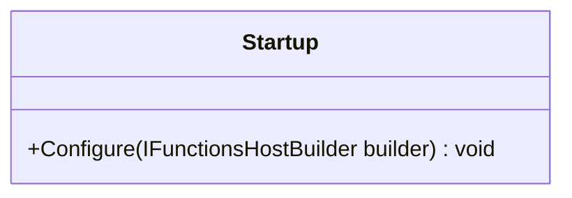

<div id="UsersApi-class-diagram"></div>

##### `UsersApi` class diagram

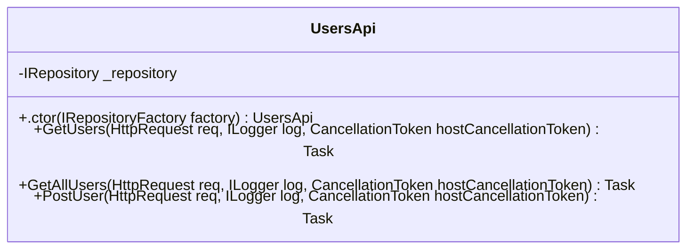

<div id="PostUserRequest-class-diagram"></div>

##### `PostUserRequest` class diagram

```mermaid
classDiagram
class PostUserRequest{
    +string FirstName
    +string LastName
    +string EmailAddress
    +stUserRequest postUserRequest)$ PostUserRequest.implicit
}

```

<div id="User-class-diagram"></div>

##### `User` class diagram

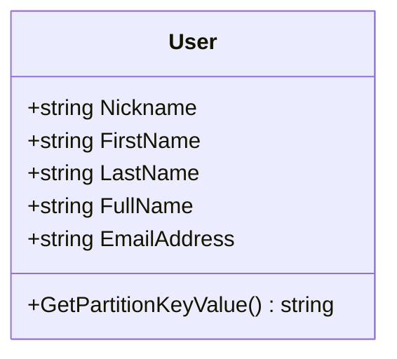

<div id="Book-class-diagram"></div>

##### `Book` class diagram

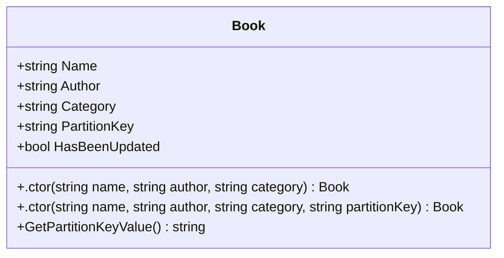

<div id="BookByIdReference-class-diagram"></div>

##### `BookByIdReference` class diagram

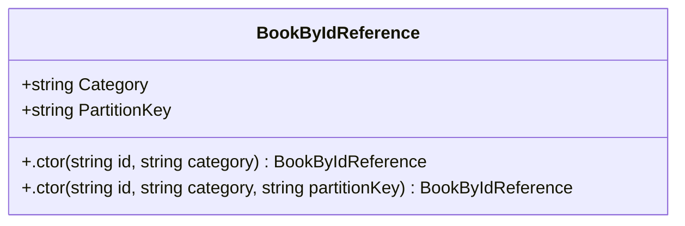

<div id="BookChangeFeedProcessor-class-diagram"></div>

##### `BookChangeFeedProcessor` class diagram

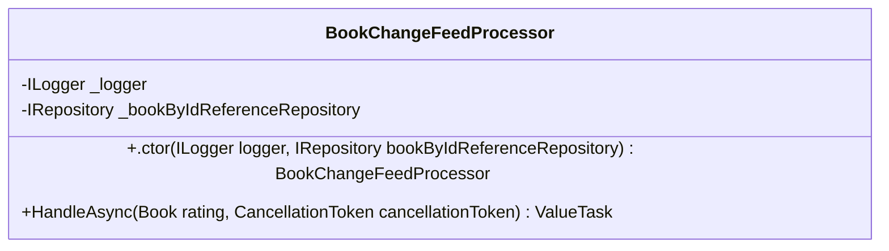

<div id="BookDemoConstants-class-diagram"></div>

##### `BookDemoConstants` class diagram

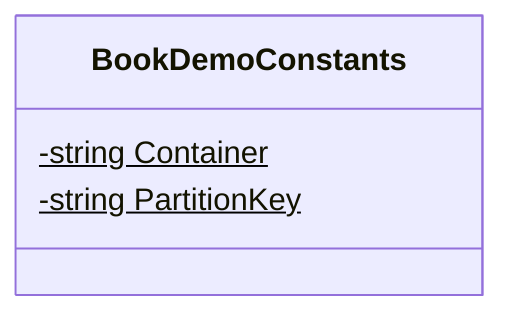

<div id="BookDto-class-diagram"></div>

##### `BookDto` class diagram

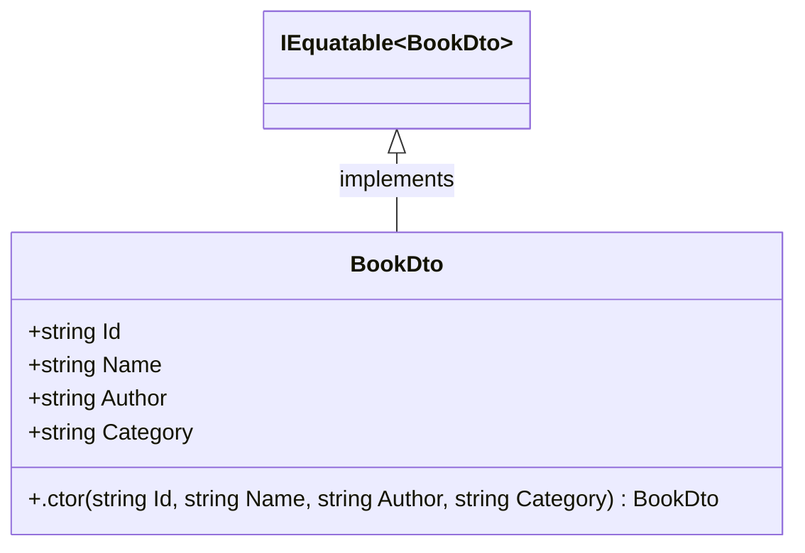

<div id="BookMappingExtensions-class-diagram"></div>

##### `BookMappingExtensions` class diagram

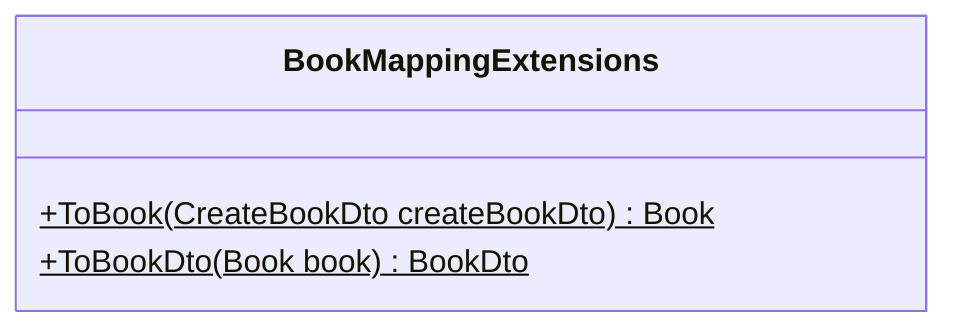

<div id="CreateBookDto-class-diagram"></div>

##### `CreateBookDto` class diagram

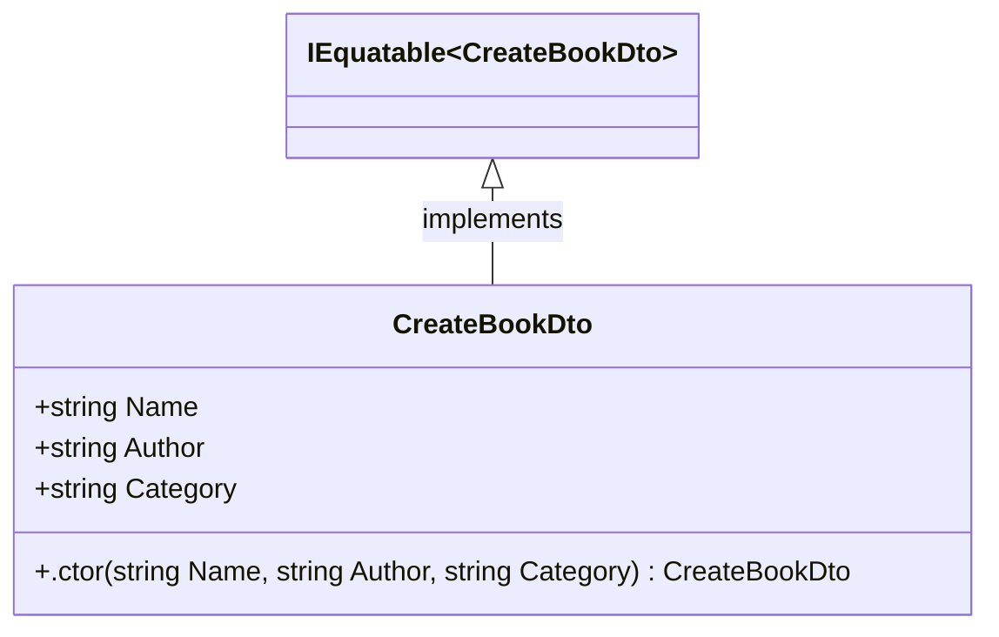

<div id="BookRouteExtensions-class-diagram"></div>

##### `BookRouteExtensions` class diagram

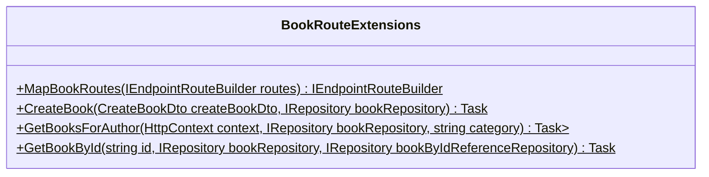

<div id="ParcelController-class-diagram"></div>

##### `ParcelController` class diagram

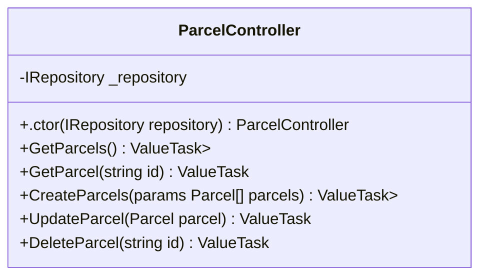

<div id="Startup-class-diagram"></div>

##### `Startup` class diagram

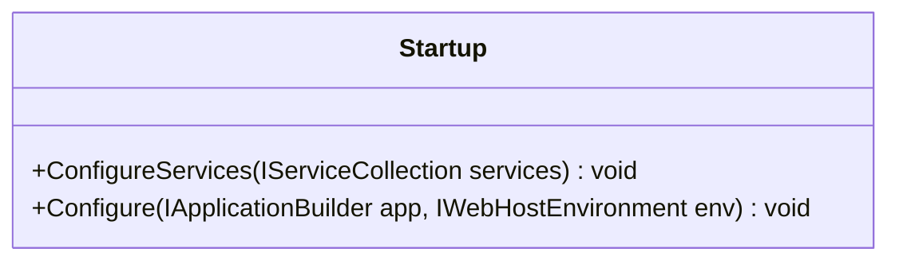

<div id="Parcel-class-diagram"></div>

##### `Parcel` class diagram

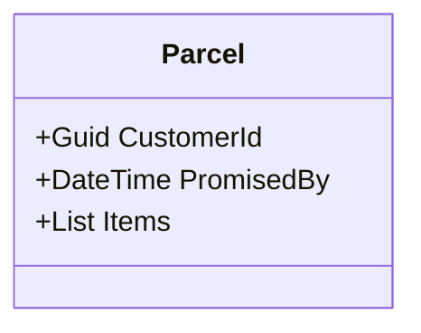

<div id="ParcelItem-class-diagram"></div>

##### `ParcelItem` class diagram

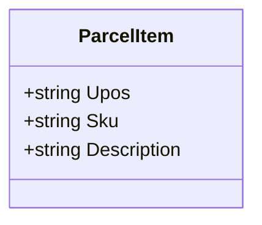

<div id="BankAccount-class-diagram"></div>

##### `BankAccount` class diagram


<div id="Person-class-diagram"></div>

##### `Person` class diagram

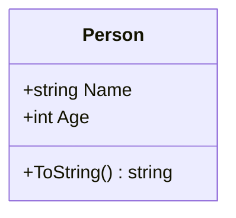

<div id="ExampleService-class-diagram"></div>

##### `ExampleService` class diagram

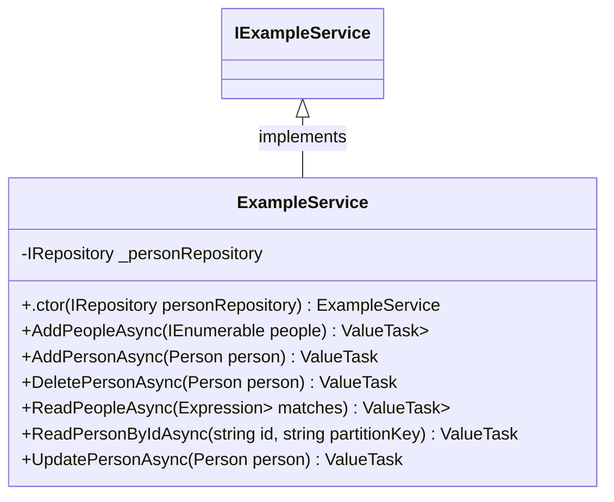

<div id="IExampleService-class-diagram"></div>

##### `IExampleService` class diagram

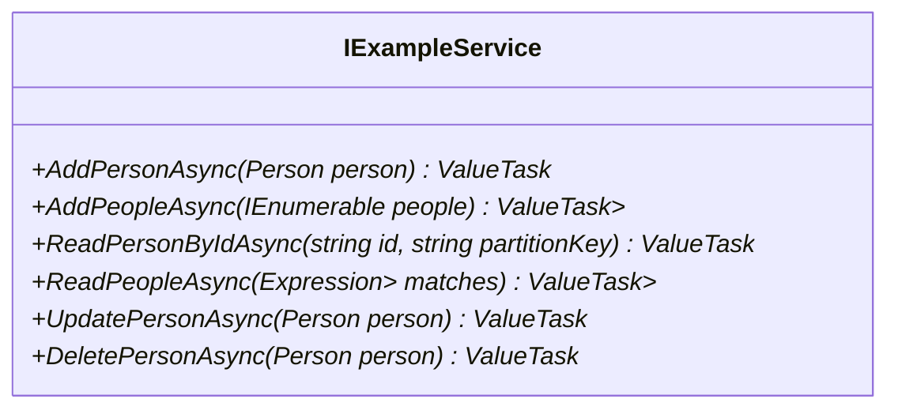

<div id="Person-class-diagram"></div>

##### `Person` class diagram

```mermaid
classDiagram
class Person{
    +DateTime BirthDate
    +string FirstName
    +string? MiddleName
    +string LastName
    +int AgeInYears
    +string SyntheticPartitionKey
    +GetPartitionKeyValue() string
    +ToString() string
}

```

<div id="Program-class-diagram"></div>

##### `Program` class diagram

```mermaid
classDiagram
class Program{
    +Main(string[] args)$ Task
    +CreateHostBuilder(string[] args)$ IHostBuilder
    +RawRepositoryExampleAsync(IRepository<Person> repository)$ Task
    +RawRepositoryExampleAsync(IRepository<Widget> repository)$ Task
    +ServiceExampleAsync(IExampleService service)$ Task
}

```

<div id="Widget-class-diagram"></div>

##### `Widget` class diagram

```mermaid
classDiagram
class Widget{
    +string Name
    +DateTimeOffset CreatedOrUpdatedOn
    +ToString() string
}

```

<div id="Person-class-diagram"></div>

##### `Person` class diagram

```mermaid
classDiagram
class Person{
    +string Name
    +int Age
    +ToString() string
}

```

<div id="SpecificationFilterSamples.AllPersonsOlderThanSpecifciation-class-diagram"></div>

##### `SpecificationFilterSamples.AllPersonsOlderThanSpecifciation` class diagram

```mermaid
classDiagram
class AllPersonsOlderThanSpecifciation{
    +.ctor(int age) AllPersonsOlderThanSpecifciation
}

```

<div id="SpecificationFilterSamples.AllPersonsWithNameSpecification-class-diagram"></div>

##### `SpecificationFilterSamples.AllPersonsWithNameSpecification` class diagram

```mermaid
classDiagram
class AllPersonsWithNameSpecification{
    +.ctor(string name) AllPersonsWithNameSpecification
}

```

<div id="FullSpecificationSamples-class-diagram"></div>

##### `FullSpecificationSamples` class diagram

```mermaid
classDiagram
class FullSpecificationSamples{
    -IRepository<Person> _repository
    +.ctor(IRepository<Person> repository) FullSpecificationSamples
    +FullContinuationTokenSpecificationAsync(int age) Task
    +FullPageNumberSpecificationAsync(int age) Task
}

```

<div id="SpecificationOrderSamples.OrderByMultipleFieldsSpecification-class-diagram"></div>

##### `SpecificationOrderSamples.OrderByMultipleFieldsSpecification` class diagram

```mermaid
classDiagram
class OrderByMultipleFieldsSpecification{
    +.ctor() OrderByMultipleFieldsSpecification
}

```

<div id="SpecificationOrderSamples.OrderByNameSpecification-class-diagram"></div>

##### `SpecificationOrderSamples.OrderByNameSpecification` class diagram

```mermaid
classDiagram
class OrderByNameSpecification{
    +.ctor() OrderByNameSpecification
}

```

<div id="SpecificationFilterSamples-class-diagram"></div>

##### `SpecificationFilterSamples` class diagram

```mermaid
classDiagram
class SpecificationFilterSamples{
    -IRepository<Person> _repository
    +.ctor(IRepository<Person> repository) SpecificationFilterSamples
    +FilterSamples() Task
}

```

<div id="SpecificationOrderSamples-class-diagram"></div>

##### `SpecificationOrderSamples` class diagram

```mermaid
classDiagram
class SpecificationOrderSamples{
    -IRepository<Person> _repository
    +.ctor(IRepository<Person> repository) SpecificationOrderSamples
    +BasicOrderAsync() Task
    +MultipleOrderByAsync() Task
}

```

<div id="SpecificationPagingSamples-class-diagram"></div>

##### `SpecificationPagingSamples` class diagram

```mermaid
classDiagram
class SpecificationPagingSamples{
    -IRepository<Person> _repository
    +.ctor(IRepository<Person> repository) SpecificationPagingSamples
    +BasicPageAsync() Task
    +BasicScrollingAsync() Task
}

```

<div id="FullSpecificationSamples.UsersOrderByAgeOffsetSpecification-class-diagram"></div>

##### `FullSpecificationSamples.UsersOrderByAgeOffsetSpecification` class diagram

```mermaid
classDiagram
class UsersOrderByAgeOffsetSpecification{
    +.ctor(int age) UsersOrderByAgeOffsetSpecification
}

```

<div id="FullSpecificationSamples.UsersOrderByAgeSpecification-class-diagram"></div>

##### `FullSpecificationSamples.UsersOrderByAgeSpecification` class diagram

```mermaid
classDiagram
class UsersOrderByAgeSpecification{
    +.ctor(int age) UsersOrderByAgeSpecification
}

```

<div id="WebTierApplicationFactory-class-diagram"></div>

##### `WebTierApplicationFactory` class diagram

```mermaid
classDiagram
class WebTierApplicationFactory{
    +ConfigureWebHost(IWebHostBuilder builder) void
}

```

<div id="LanguageDto-class-diagram"></div>

##### `LanguageDto` class diagram

```mermaid
classDiagram
class LanguageDto{
    +string Id
    +string Name
    +string[] Aliases
    +string Description
    +ProgrammingStyle PrimaryStyle
    +DateTime InitialReleaseDate
}

```

<div id="LanguagesControllerTests-class-diagram"></div>

##### `LanguagesControllerTests` class diagram

```mermaid
classDiagram
class LanguagesControllerTests{
    -HttpClient _client
    -IRepositoryFactory _repositoryFactory
    +.ctor(WebTierApplicationFactory factory) LanguagesControllerTests
    +Post_Always_Creates_A_Language() Task
}

```

<div id="LanguageController-class-diagram"></div>

##### `LanguageController` class diagram

```mermaid
classDiagram
class LanguageController{
    -IRepository<Language> _repository
    +.ctor(IRepositoryFactory factory) LanguageController
    +GetLanguages() ValueTask<IEnumerable<Language>>
    +GetLanguageById(string id) ValueTask<Language>
    +PostLanguages(params Language[] languages) ValueTask<IEnumerable<Language>>
    +PutLanguage(Language language) ValueTask<Language>
    +UpdateName(string id, string name) ValueTask<IActionResult>
    +DeleteLanguage(string id) ValueTask
}

```

<div id="Language-class-diagram"></div>

##### `Language` class diagram

```mermaid
classDiagram
class Language{
    +string Name
    +string[] Aliases
    +string Description
    +ProgrammingStyle PrimaryStyle
    +DateTime InitialReleaseDate
}

```

<div id="ProgrammingStyle-class-diagram"></div>

##### `ProgrammingStyle` class diagram

```mermaid
classDiagram
class ProgrammingStyle{
    -Functional$
    -ObjectOriented$
    -Procedural$
    -Script$
    -Modular$
}

```

<div id="Program-class-diagram"></div>

##### `Program` class diagram

```mermaid
classDiagram
class Program{
    +Main(string[] args)$ Task
    +CreateHostBuilder(string[] args)$ IHostBuilder
}

```

<div id="Startup-class-diagram"></div>

##### `Startup` class diagram

```mermaid
classDiagram
class Startup{
    +ConfigureServices(IServiceCollection services) void
    +Configure(IApplicationBuilder app, IWebHostEnvironment env) void
}

```

<div id="CosmosRepositoryChangeFeedHostedService-class-diagram"></div>

##### `CosmosRepositoryChangeFeedHostedService` class diagram

```mermaid
classDiagram
class CosmosRepositoryChangeFeedHostedService{
    -IChangeFeedService _changeFeedService
    +.ctor(IChangeFeedService changeFeedService) CosmosRepositoryChangeFeedHostedService
    +ExecuteAsync(CancellationToken stoppingToken) Task
}

```

<div id="ServiceCollectionExtensions-class-diagram"></div>

##### `ServiceCollectionExtensions` class diagram

```mermaid
classDiagram
class ServiceCollectionExtensions{
    +AddCosmosRepositoryChangeFeedHostedService(IServiceCollection services)$ IServiceCollection
    +AddCosmosRepositoryItemChangeFeedProcessors(IServiceCollection services, params Assembly[] assemblies)$ IServiceCollection
}

```

<div id="ContainerAttribute-class-diagram"></div>

##### `ContainerAttribute` class diagram

```mermaid
classDiagram
class ContainerAttribute{
    +string Name
    +.ctor(string name) ContainerAttribute
}

```

<div id="PartitionKeyPathAttribute-class-diagram"></div>

##### `PartitionKeyPathAttribute` class diagram

```mermaid
classDiagram
class PartitionKeyPathAttribute{
    +string Path
    +.ctor(string path) PartitionKeyPathAttribute
}

```

<div id="UniqueKeyAttribute-class-diagram"></div>

##### `UniqueKeyAttribute` class diagram

```mermaid
classDiagram
class UniqueKeyAttribute{
    +string KeyName
    +string PropertyPath
    +.ctor(string keyName = null, string propertyPath = null) UniqueKeyAttribute
}

```

<div id="IOrderedSpecificationBuilder&lt;TItem, TResult&gt;-class-diagram"></div>

##### `IOrderedSpecificationBuilder<TItem, TResult>` class diagram

```mermaid
classDiagram
ISpecificationBuilder~TItem,TResult~ <|-- IOrderedSpecificationBuilder<TItem, TResult> : implements
class IOrderedSpecificationBuilder<TItem, TResult>{
    +TResult>.ThenBy(Expression<Func<TItem, object>> orderExpression)* IOrderedSpecificationBuilder<TItem,
    +TResult>.ThenByDescending(Expression<Func<TItem, object>> orderExpression)* IOrderedSpecificationBuilder<TItem,
}

```

<div id="ISpecificationBuilder&lt;TItem, TResult&gt;-class-diagram"></div>

##### `ISpecificationBuilder<TItem, TResult>` class diagram

```mermaid
classDiagram
class ISpecificationBuilder<TItem, TResult>{
    +BaseSpecification<TItem, TResult> Specification*
    +TResult>.Where(Expression<Func<TItem, bool>> expression)* ISpecificationBuilder<TItem,
    +TResult>.OrderBy(Expression<Func<TItem, object>> orderExpression)* IOrderedSpecificationBuilder<TItem,
    +TResult>.OrderByDescending(Expression<Func<TItem, object>> orderExpression)* IOrderedSpecificationBuilder<TItem,
    +TResult>.PageSize(int pageSize)* ISpecificationBuilder<TItem,
    +TResult>.PageNumber(int pageNumber)* ISpecificationBuilder<TItem,
    +TResult>.ContinuationToken(string continuationToken)* ISpecificationBuilder<TItem,
}

```

<div id="OrderedSpecificationBuilder&lt;TItem, TResult&gt;-class-diagram"></div>

##### `OrderedSpecificationBuilder<TItem, TResult>` class diagram

```mermaid
classDiagram
IOrderedSpecificationBuilder~TItem,TResult~ <|-- OrderedSpecificationBuilder<TItem, TResult> : implements
class OrderedSpecificationBuilder<TItem, TResult>{
    +edSpecificationBuilder(BaseSpecification<TItem, TResult> specification) void
    +TResult>.ThenBy(Expression<Func<TItem, object>> orderExpression) IOrderedSpecificationBuilder<TItem,
    +TResult>.ThenByDescending(Expression<Func<TItem, object>> orderExpression) IOrderedSpecificationBuilder<TItem,
}

```

<div id="SpecificationBuilder&lt;TItem, TResult&gt;-class-diagram"></div>

##### `SpecificationBuilder<TItem, TResult>` class diagram

```mermaid
classDiagram
ISpecificationBuilder~TItem,TResult~ <|-- SpecificationBuilder<TItem, TResult> : implements
class SpecificationBuilder<TItem, TResult>{
    +BaseSpecification<TItem, TResult> Specification
    +ficationBuilder(BaseSpecification<TItem, TResult> specification) void
    +TResult>.Where(Expression<Func<TItem, bool>> expression) ISpecificationBuilder<TItem,
    +TResult>.OrderBy(Expression<Func<TItem, object>> orderExpression) IOrderedSpecificationBuilder<TItem,
    +TResult>.OrderByDescending(Expression<Func<TItem, object>> orderExpression) IOrderedSpecificationBuilder<TItem,
    +TResult>.PageSize(int pageSize) ISpecificationBuilder<TItem,
    +TResult>.PageNumber(int pageNumber) ISpecificationBuilder<TItem,
    +TResult>.ContinuationToken(string continuationToken) ISpecificationBuilder<TItem,
}

```

<div id="ContainerOptionsBuilder-class-diagram"></div>

##### `ContainerOptionsBuilder` class diagram

```mermaid
classDiagram
class ContainerOptionsBuilder{
    +Type Type
    +string Name
    +string PartitionKey
    +TimeSpan? ContainerDefaultTimeToLive
    +bool SyncContainerProperties
    +ThroughputProperties ThroughputProperties
    +ChangeFeedOptions ChangeFeedOptions
    +bool UseStrictTypeChecking
    +.ctor(Type type) ContainerOptionsBuilder
    +WithContainerDefaultTimeToLive(TimeSpan containerDefaultTimeToLive) ContainerOptionsBuilder
    +WithContainer(string name) ContainerOptionsBuilder
    +WithPartitionKey(string partitionKey) ContainerOptionsBuilder
    +WithSyncableContainerProperties() ContainerOptionsBuilder
    +WithManualThroughput(int throughput = 400) ContainerOptionsBuilder
    +WithAutoscaleThroughput(int maxAutoScaleThroughput = 4000) ContainerOptionsBuilder
    +WithServerlessThroughput() ContainerOptionsBuilder
    +WithChangeFeedMonitoring(Action<ChangeFeedOptions> optionsActions = null) ContainerOptionsBuilder
    +WithoutStrictTypeChecking() ContainerOptionsBuilder
}

```

<div id="DefaultItemContainerBuilder-class-diagram"></div>

##### `DefaultItemContainerBuilder` class diagram

```mermaid
classDiagram
IItemContainerBuilder <|-- DefaultItemContainerBuilder : implements
class DefaultItemContainerBuilder{
    -List<ContainerOptionsBuilder> _options
    +IReadOnlyList<ContainerOptionsBuilder> Options
    +Configure<TItem>(Action<ContainerOptionsBuilder> containerOptions) IItemContainerBuilder
}

```

<div id="IItemContainerBuilder-class-diagram"></div>

##### `IItemContainerBuilder` class diagram

```mermaid
classDiagram
class IItemContainerBuilder{
    +IReadOnlyList<ContainerOptionsBuilder> Options*
    +Configure<TItem>(Action<ContainerOptionsBuilder> containerOptions)* IItemContainerBuilder
}

```

<div id="IPatchOperationBuilder&lt;TItem&gt;-class-diagram"></div>

##### `IPatchOperationBuilder<TItem>` class diagram

```mermaid
classDiagram
class IPatchOperationBuilder<TItem>{
    +IReadOnlyList<PatchOperation> PatchOperations*
    +Replace<TValue>(Expression<Func<TItem, TValue>> expression, TValue value)* IPatchOperationBuilder<TItem>
}

```

<div id="PatchOperationBuilder&lt;TItem&gt;-class-diagram"></div>

##### `PatchOperationBuilder<TItem>` class diagram

```mermaid
classDiagram
IPatchOperationBuilder~TItem~ <|-- PatchOperationBuilder<TItem> : implements
class PatchOperationBuilder<TItem>{
    -List<PatchOperation> _patchOperations
    -CamelCaseNamingStrategy _namingStrategy
    -List<InternalPatchOperation> _rawPatchOperations
    +IReadOnlyList<PatchOperation> PatchOperations
    +Replace<TValue>(Expression<Func<TItem, TValue>> expression, TValue value) IPatchOperationBuilder<TItem>
    +GetPropertyToReplace(PropertyInfo propertyInfo) string
}

```

<div id="ChangeFeedOptions-class-diagram"></div>

##### `ChangeFeedOptions` class diagram

```mermaid
classDiagram
class ChangeFeedOptions{
    +Type ItemType
    +string InstanceName
    +TimeSpan? PollInterval
    +string ProcessorName
    +.ctor(Type itemType) ChangeFeedOptions
    +IsTheSameAs(ChangeFeedOptions options) bool
}

```

<div id="DefaultChangeFeedService-class-diagram"></div>

##### `DefaultChangeFeedService` class diagram

```mermaid
classDiagram
IChangeFeedService <|-- DefaultChangeFeedService : implements
class DefaultChangeFeedService{
    -IChangeFeedContainerProcessorProvider _changeFeedContainerProcessorProvider
    -IEnumerable<IContainerChangeFeedProcessor> _processors
    +.ctor(IChangeFeedContainerProcessorProvider changeFeedContainerProcessorProvider) DefaultChangeFeedService
    +StartAsync(CancellationToken cancellationToken) Task
    +StopAsync() Task
}

```

<div id="DefaultContainerChangeFeedProcessor-class-diagram"></div>

##### `DefaultContainerChangeFeedProcessor` class diagram

```mermaid
classDiagram
IContainerChangeFeedProcessor <|-- DefaultContainerChangeFeedProcessor : implements
class DefaultContainerChangeFeedProcessor{
    -ICosmosContainerService _containerService
    -ILeaseContainerProvider _leaseContainerProvider
    -ChangeFeedOptions _changeFeedOptions
    -ILogger<DefaultContainerChangeFeedProcessor> _logger
    -IServiceProvider _serviceProvider
    -ChangeFeedProcessor _processor
    -ConcurrentDictionary<Type, Type> Handlers$
    +IReadOnlyList<Type> ItemTypes
    +.ctor(ICosmosContainerService containerService, IReadOnlyList<Type> itemTypes, ILeaseContainerProvider leaseContainerProvider, ChangeFeedOptions changeFeedOptions, ILogger<DefaultContainerChangeFeedProcessor> logger, IServiceProvider serviceProvider) DefaultContainerChangeFeedProcessor
    +StartAsync() Task
    +OnChangesAsync(IReadOnlyCollection<JObject> changes, CancellationToken cancellationToken, string containerName) Task
    +InvokeHandlerAsync(Type itemType, JObject instance, CancellationToken cancellationToken) Task
    +OnErrorAsync(Exception exception, string containerName) Task
    +StopAsync() Task
}

```

<div id="IChangeFeedService-class-diagram"></div>

##### `IChangeFeedService` class diagram

```mermaid
classDiagram
class IChangeFeedService{
    +StartAsync(CancellationToken cancellationToken)* Task
    +StopAsync()* Task
}

```

<div id="IContainerChangeFeedProcessor-class-diagram"></div>

##### `IContainerChangeFeedProcessor` class diagram

```mermaid
classDiagram
class IContainerChangeFeedProcessor{
    +IReadOnlyList<Type> ItemTypes*
    +StartAsync()* Task
    +StopAsync()* Task
}

```

<div id="IItemChangeFeedProcessor&lt;TItem&gt;-class-diagram"></div>

##### `IItemChangeFeedProcessor<TItem>` class diagram

```mermaid
classDiagram
class IItemChangeFeedProcessor<TItem>{
    +HandleAsync(TItem item, CancellationToken cancellationToken)* ValueTask
}

```

<div id="DefaultRepository&lt;TItem&gt;-class-diagram"></div>

##### `DefaultRepository<TItem>` class diagram

```mermaid
classDiagram
IRepository~TItem~ <|-- DefaultRepository<TItem> : implements
class DefaultRepository<TItem>{
    -ICosmosContainerProvider<TItem> _containerProvider
    -IOptionsMonitor<RepositoryOptions> _optionsMonitor
    -ILogger<DefaultRepository<TItem>> _logger
    -ICosmosQueryableProcessor _cosmosQueryableProcessor
    -IRepositoryExpressionProvider _repositoryExpressionProvider
    -ISpecificationEvaluator _specificationEvaluator
    +(bool OptimizeBandwidth, ItemRequestOptions Options) RequestOptions
    +ltRepository(IOptionsMonitor<RepositoryOptions> optionsMonitor, ICosmosContainerProvider<TItem> containerProvider, ILogger<DefaultRepository<TItem>> logger, ICosmosQueryableProcessor cosmosQueryableProcessor, IRepositoryExpressionProvider repositoryExpressionProvider, ISpecificationEvaluator specificationEvaluator) void
    +GetAsync(string id, string partitionKeyValue = null, CancellationToken cancellationToken = null) ValueTask<TItem>
    +GetAsync(string id, PartitionKey partitionKey, CancellationToken cancellationToken = null) ValueTask<TItem>
    +GetAsync(Expression<Func<TItem, bool>> predicate, CancellationToken cancellationToken = null) ValueTask<IEnumerable<TItem>>
    +GetByQueryAsync(string query, CancellationToken cancellationToken = null) ValueTask<IEnumerable<TItem>>
    +GetByQueryAsync(QueryDefinition queryDefinition, CancellationToken cancellationToken = null) ValueTask<IEnumerable<TItem>>
    +CreateAsync(TItem value, CancellationToken cancellationToken = null) ValueTask<TItem>
    +CreateAsync(IEnumerable<TItem> values, CancellationToken cancellationToken = null) ValueTask<IEnumerable<TItem>>
    +UpdateAsync(TItem value, CancellationToken cancellationToken = null, bool ignoreEtag = false) ValueTask<TItem>
    +UpdateAsync(IEnumerable<TItem> values, CancellationToken cancellationToken = null, bool ignoreEtag = false) ValueTask<IEnumerable<TItem>>
    +UpdateAsync(string id, Action<IPatchOperationBuilder<TItem>> builder, string partitionKeyValue = null, CancellationToken cancellationToken = null, string etag = null) ValueTask
    +DeleteAsync(TItem value, CancellationToken cancellationToken = null) ValueTask
    +DeleteAsync(string id, string partitionKeyValue = null, CancellationToken cancellationToken = null) ValueTask
    +DeleteAsync(string id, PartitionKey partitionKey, CancellationToken cancellationToken = null) ValueTask
    +ExistsAsync(string id, string partitionKeyValue = null, CancellationToken cancellationToken = null) ValueTask<bool>
    +ExistsAsync(string id, PartitionKey partitionKey, CancellationToken cancellationToken = null) ValueTask<bool>
    +ExistsAsync(Expression<Func<TItem, bool>> predicate, CancellationToken cancellationToken = null) ValueTask<bool>
    +CountAsync(CancellationToken cancellationToken = null) ValueTask<int>
    +CountAsync<TResult>(ISpecification<TItem, TResult> specification, CancellationToken cancellationToken = null) ValueTask<Response<int>>
    +CountAsync(Expression<Func<TItem, bool>> predicate, CancellationToken cancellationToken = null) ValueTask<int>
    +PageAsync(Expression<Func<TItem, bool>> predicate = null, int pageSize = 25, string continuationToken = null, CancellationToken cancellationToken = null) ValueTask<IPage<TItem>>
    +PageAsync(Expression<Func<TItem, bool>> predicate = null, int pageNumber = 1, int pageSize = 25, CancellationToken cancellationToken = null) ValueTask<IPageQueryResult<TItem>>
    +QueryAsync<TResult>(ISpecification<TItem, TResult> specification, CancellationToken cancellationToken = null) ValueTask<TResult>
    +TryLogDebugDetails(ILogger logger, Func<string> getMessage)$ void
    +GetAllItemsAsync(IQueryable<TItem> query, int pageSize, CancellationToken cancellationToken = null)$ Task<(List<TItem> items, double charge, string continuationToken)>
}

```

<div id="DefaultRepositoryFactory-class-diagram"></div>

##### `DefaultRepositoryFactory` class diagram

```mermaid
classDiagram
IRepositoryFactory <|-- DefaultRepositoryFactory : implements
class DefaultRepositoryFactory{
    -IServiceProvider _serviceProvider
    +.ctor(IServiceProvider serviceProvider) DefaultRepositoryFactory
    +RepositoryOf<TItem>() IRepository<TItem>
}

```

<div id="EtagItem-class-diagram"></div>

##### `EtagItem` class diagram

```mermaid
classDiagram
IItemWithEtag <|-- EtagItem : implements
class EtagItem{
    +string Etag
}

```

<div id="FullItem-class-diagram"></div>

##### `FullItem` class diagram

```mermaid
classDiagram
IItemWithEtag <|-- FullItem : implements
IItemWithTimeToLive <|-- FullItem : implements
IItemWithTimeStamps <|-- FullItem : implements
class FullItem{
    -int? _timeToLive
    +string Etag
    +TimeSpan? TimeToLive
    +DateTime LastUpdatedTimeUtc
    +long LastUpdatedTimeRaw
    +DateTime? CreatedTimeUtc
}

```

<div id="IItem-class-diagram"></div>

##### `IItem` class diagram

```mermaid
classDiagram
class IItem{
    +string Id*
    +string Type*
    +string PartitionKey*
}

```

<div id="IItemWithEtag-class-diagram"></div>

##### `IItemWithEtag` class diagram

```mermaid
classDiagram
IItem <|-- IItemWithEtag : implements
class IItemWithEtag{
    +string Etag*
}

```

<div id="IItemWithTimeStamps-class-diagram"></div>

##### `IItemWithTimeStamps` class diagram

```mermaid
classDiagram
IItem <|-- IItemWithTimeStamps : implements
class IItemWithTimeStamps{
    +DateTime? CreatedTimeUtc*
    +DateTime LastUpdatedTimeUtc*
    +long LastUpdatedTimeRaw*
}

```

<div id="IItemWithTimeToLive-class-diagram"></div>

##### `IItemWithTimeToLive` class diagram

```mermaid
classDiagram
IItem <|-- IItemWithTimeToLive : implements
class IItemWithTimeToLive{
    +TimeSpan? TimeToLive*
}

```

<div id="InMemoryRepository&lt;TItem&gt;-class-diagram"></div>

##### `InMemoryRepository<TItem>` class diagram

```mermaid
classDiagram
IRepository~TItem~ <|-- InMemoryRepository<TItem> : implements
class InMemoryRepository<TItem>{
    -ISpecificationEvaluator _specificationEvaluator
    +long CurrentTs
    +ConcurrentDictionary<string, string> Items
    +Action<ChangeFeedItemArgs<TItem>> Changes
    +oryRepository() void
    +oryRepository(ISpecificationEvaluator specificationEvaluator) void
    +SerializeItem(TItem item, string etag = null, long? ts = null) string
    +DeserializeItem(string jsonItem) TItem
    +DeserializeItem<TDeserializeTo>(string jsonItem) TDeserializeTo
    +GetAsync(string id, string partitionKeyValue = null, CancellationToken cancellationToken = null) ValueTask<TItem>
    +GetAsync(string id, PartitionKey partitionKey, CancellationToken cancellationToken = null) ValueTask<TItem>
    +GetAsync(Expression<Func<TItem, bool>> predicate, CancellationToken cancellationToken = null) ValueTask<IEnumerable<TItem>>
    +GetByQueryAsync(string query, CancellationToken cancellationToken = null) ValueTask<IEnumerable<TItem>>
    +GetByQueryAsync(QueryDefinition queryDefinition, CancellationToken cancellationToken = null) ValueTask<IEnumerable<TItem>>
    +CreateAsync(TItem value, CancellationToken cancellationToken = null) ValueTask<TItem>
    +CreateAsync(IEnumerable<TItem> values, CancellationToken cancellationToken = null) ValueTask<IEnumerable<TItem>>
    +CreateAsync(TItem value, bool raiseChanges = false) ValueTask<TItem>
    +UpdateAsync(TItem value, bool raiseChanges, bool ignoreEtag = false) ValueTask<TItem>
    +UpdateAsync(TItem value, CancellationToken cancellationToken = null, bool ignoreEtag = false) ValueTask<TItem>
    +UpdateAsync(IEnumerable<TItem> values, CancellationToken cancellationToken = null, bool ignoreEtag = false) ValueTask<IEnumerable<TItem>>
    +UpdateAsync(string id, Action<IPatchOperationBuilder<TItem>> builder, string partitionKeyValue = null, CancellationToken cancellationToken = null, string etag = null) ValueTask
    +DeleteAsync(TItem value, CancellationToken cancellationToken = null) ValueTask
    +DeleteAsync(string id, string partitionKeyValue = null, CancellationToken cancellationToken = null) ValueTask
    +DeleteAsync(string id, PartitionKey partitionKey, CancellationToken cancellationToken = null) ValueTask
    +ExistsAsync(string id, string partitionKeyValue = null, CancellationToken cancellationToken = null) ValueTask<bool>
    +ExistsAsync(string id, PartitionKey partitionKey, CancellationToken cancellationToken = null) ValueTask<bool>
    +ExistsAsync(Expression<Func<TItem, bool>> predicate, CancellationToken cancellationToken = null) ValueTask<bool>
    +CountAsync(CancellationToken cancellationToken = null) ValueTask<int>
    +CountAsync(Expression<Func<TItem, bool>> predicate, CancellationToken cancellationToken = null) ValueTask<int>
    +PageAsync(Expression<Func<TItem, bool>> predicate = null, int pageSize = 25, string continuationToken = null, CancellationToken cancellationToken = null) ValueTask<IPage<TItem>>
    +PageAsync(Expression<Func<TItem, bool>> predicate = null, int pageNumber = 1, int pageSize = 25, CancellationToken cancellationToken = null) ValueTask<IPageQueryResult<TItem>>
    +QueryAsync<TResult>(ISpecification<TItem, TResult> specification, CancellationToken cancellationToken = null) ValueTask<TResult>
    +NotFound() void
    +Conflict() void
    +MismatchedEtags() void
}

```

<div id="IQueryResult&lt;TItem&gt;-class-diagram"></div>

##### `IQueryResult<TItem>` class diagram

```mermaid
classDiagram
class IQueryResult<TItem>{
    +IReadOnlyList<TItem> Items*
    +double Charge*
}

```

<div id="IRepository&lt;TItem&gt;-class-diagram"></div>

##### `IRepository<TItem>` class diagram

```mermaid
classDiagram
class IRepository<TItem>{
    +GetAsync(string id, string partitionKeyValue = null, CancellationToken cancellationToken = null)* ValueTask<TItem>
    +GetAsync(string id, PartitionKey partitionKey, CancellationToken cancellationToken = null)* ValueTask<TItem>
    +GetAsync(Expression<Func<TItem, bool>> predicate, CancellationToken cancellationToken = null)* ValueTask<IEnumerable<TItem>>
    +GetByQueryAsync(string query, CancellationToken cancellationToken = null)* ValueTask<IEnumerable<TItem>>
    +GetByQueryAsync(QueryDefinition queryDefinition, CancellationToken cancellationToken = null)* ValueTask<IEnumerable<TItem>>
    +CreateAsync(TItem value, CancellationToken cancellationToken = null)* ValueTask<TItem>
    +CreateAsync(IEnumerable<TItem> values, CancellationToken cancellationToken = null)* ValueTask<IEnumerable<TItem>>
    +UpdateAsync(TItem value, CancellationToken cancellationToken = null, bool ignoreEtag = false)* ValueTask<TItem>
    +UpdateAsync(IEnumerable<TItem> values, CancellationToken cancellationToken = null, bool ignoreEtag = false)* ValueTask<IEnumerable<TItem>>
    +UpdateAsync(string id, Action<IPatchOperationBuilder<TItem>> builder, string partitionKeyValue = null, CancellationToken cancellationToken = null, string etag = null)* ValueTask
    +DeleteAsync(TItem value, CancellationToken cancellationToken = null)* ValueTask
    +DeleteAsync(string id, string partitionKeyValue = null, CancellationToken cancellationToken = null)* ValueTask
    +DeleteAsync(string id, PartitionKey partitionKey, CancellationToken cancellationToken = null)* ValueTask
    +ExistsAsync(string id, string partitionKeyValue = null, CancellationToken cancellationToken = null)* ValueTask<bool>
    +ExistsAsync(string id, PartitionKey partitionKey, CancellationToken cancellationToken = null)* ValueTask<bool>
    +ExistsAsync(Expression<Func<TItem, bool>> predicate, CancellationToken cancellationToken = null)* ValueTask<bool>
    +CountAsync(CancellationToken cancellationToken = null)* ValueTask<int>
    +CountAsync(Expression<Func<TItem, bool>> predicate, CancellationToken cancellationToken = null)* ValueTask<int>
    +PageAsync(Expression<Func<TItem, bool>> predicate = null, int pageSize = 25, string continuationToken = null, CancellationToken cancellationToken = null)* ValueTask<IPage<TItem>>
    +QueryAsync<TResult>(ISpecification<TItem, TResult> specification, CancellationToken cancellationToken = null)* ValueTask<TResult>
    +PageAsync(Expression<Func<TItem, bool>> predicate = null, int pageNumber = 1, int pageSize = 25, CancellationToken cancellationToken = null)* ValueTask<IPageQueryResult<TItem>>
}

```

<div id="IRepositoryFactory-class-diagram"></div>

##### `IRepositoryFactory` class diagram

```mermaid
classDiagram
class IRepositoryFactory{
    +RepositoryOf<TItem>()* IRepository<TItem>
}

```

<div id="Item-class-diagram"></div>

##### `Item` class diagram

```mermaid
classDiagram
IItem <|-- Item : implements
class Item{
    +string Id
    +string Type
    +string PartitionKey
    +.ctor() Item
    +GetPartitionKeyValue() string
}

```

<div id="QueryResult&lt;T&gt;-class-diagram"></div>

##### `QueryResult<T>` class diagram

```mermaid
classDiagram
IQueryResult~T~ <|-- QueryResult<T> : implements
class QueryResult<T>{
    +IReadOnlyList<T> Items
    +double Charge
    +Result(IReadOnlyList<T> items, double charge) void
}

```

<div id="TimeStampedItem-class-diagram"></div>

##### `TimeStampedItem` class diagram

```mermaid
classDiagram
IItemWithTimeStamps <|-- TimeStampedItem : implements
class TimeStampedItem{
    +DateTime? CreatedTimeUtc
    +DateTime LastUpdatedTimeUtc
    +long LastUpdatedTimeRaw
}

```

<div id="TimeToLiveItem-class-diagram"></div>

##### `TimeToLiveItem` class diagram

```mermaid
classDiagram
IItemWithTimeToLive <|-- TimeToLiveItem : implements
class TimeToLiveItem{
    -int? _timeToLive
    +TimeSpan? TimeToLive
}

```

<div id="ServiceCollectionExtensions-class-diagram"></div>

##### `ServiceCollectionExtensions` class diagram

```mermaid
classDiagram
class ServiceCollectionExtensions{
    +AddCosmosRepository(IServiceCollection services, Action<RepositoryOptions> setupAction = null, Action<CosmosClientOptions> additionSetupAction = null)$ IServiceCollection
    +AddInMemoryCosmosRepository(IServiceCollection services)$ IServiceCollection
    +RemoveCosmosRepositories(IServiceCollection services)$ IServiceCollection
    +AddCosmosRepository(IServiceCollection services, IConfiguration configuration, Action<RepositoryOptions> setupAction = null)$ IServiceCollection
}

```

<div id="IEvaluator-class-diagram"></div>

##### `IEvaluator` class diagram

```mermaid
classDiagram
class IEvaluator{
    +bool IsFilterEvaluator*
    +GetQuery<TItem, TResult>(IQueryable<TItem> query, ISpecification<TItem, TResult> specification)* IQueryable<TItem>
}

```

<div id="ISpecificationEvaluator-class-diagram"></div>

##### `ISpecificationEvaluator` class diagram

```mermaid
classDiagram
class ISpecificationEvaluator{
    +GetQuery<TItem, TResult>(IQueryable<TItem> query, ISpecification<TItem, TResult> specification, bool evaluateCriteriaOnly = false)* IQueryable<TItem>
    +GetResult<TItem, TResult>(IReadOnlyList<TItem> res, ISpecification<TItem, TResult> specification, int totalCount, double charge, string continuationToken)* TResult
}

```

<div id="OrderEvaluator-class-diagram"></div>

##### `OrderEvaluator` class diagram

```mermaid
classDiagram
IEvaluator <|-- OrderEvaluator : implements
class OrderEvaluator{
    +bool IsFilterEvaluator
    +GetQuery<TItem, TResult>(IQueryable<TItem> query, ISpecification<TItem, TResult> specification) IQueryable<TItem>
}

```

<div id="PagingEvaluator-class-diagram"></div>

##### `PagingEvaluator` class diagram

```mermaid
classDiagram
IEvaluator <|-- PagingEvaluator : implements
class PagingEvaluator{
    +bool IsFilterEvaluator
    +GetQuery<TItem, TResult>(IQueryable<TItem> query, ISpecification<TItem, TResult> specification) IQueryable<TItem>
}

```

<div id="SpecificationEvaluator-class-diagram"></div>

##### `SpecificationEvaluator` class diagram

```mermaid
classDiagram
ISpecificationEvaluator <|-- SpecificationEvaluator : implements
class SpecificationEvaluator{
    -IEnumerable<IEvaluator> Evaluators$
    +GetQuery<TItem, TResult>(IQueryable<TItem> query, ISpecification<TItem, TResult> specification, bool evaluateCriteriaOnly = false) IQueryable<TItem>
    +GetResult<TItem, TResult>(IReadOnlyList<TItem> res, ISpecification<TItem, TResult> specification, int totalCount, double charge, string continuationToken) TResult
}

```

<div id="WhereEvaluator-class-diagram"></div>

##### `WhereEvaluator` class diagram

```mermaid
classDiagram
IEvaluator <|-- WhereEvaluator : implements
class WhereEvaluator{
    +bool IsFilterEvaluator
    +GetQuery<T, TResult>(IQueryable<T> query, ISpecification<T, TResult> specification) IQueryable<T>
}

```

<div id="InvalidEtagConfigurationException-class-diagram"></div>

##### `InvalidEtagConfigurationException` class diagram

```mermaid
classDiagram
class InvalidEtagConfigurationException{
    +.ctor(string message) InvalidEtagConfigurationException
}

```

<div id="MissMatchedChangeFeedOptionsException-class-diagram"></div>

##### `MissMatchedChangeFeedOptionsException` class diagram

```mermaid
classDiagram
class MissMatchedChangeFeedOptionsException{
    +IReadOnlyList<Type> ItemTypes
    +.ctor(string message, IReadOnlyList<Type> itemTypes) MissMatchedChangeFeedOptionsException
}

```

<div id="ExpressionExtensions-class-diagram"></div>

##### `ExpressionExtensions` class diagram

```mermaid
classDiagram
class ExpressionExtensions{
    +Compose<T>(Expression<T> first, Expression<T> second, Func<Expression, Expression, Expression> merge)$ Expression<T>
    +AndAlso<T>(Expression<Func<T, bool>> first, Expression<Func<T, bool>> second)$ Expression<Func<T, bool>>
    +And<T>(Expression<Func<T, bool>> first, Expression<Func<T, bool>> second)$ Expression<Func<T, bool>>
    +Or<T>(Expression<Func<T, bool>> first, Expression<Func<T, bool>> second)$ Expression<Func<T, bool>>
    +GetPropertyInfo<TSource, TProperty>(Expression<Func<TSource, TProperty>> propertyLambda)$ PropertyInfo
}

```

<div id="ParameterRebinder-class-diagram"></div>

##### `ParameterRebinder` class diagram

```mermaid
classDiagram
class ParameterRebinder{
    -Dictionary<ParameterExpression, ParameterExpression> _map
    +.ctor(Dictionary<ParameterExpression, ParameterExpression> map) ParameterRebinder
    +ReplaceParameters(Dictionary<ParameterExpression, ParameterExpression> map, Expression exp)$ Expression
    +VisitParameter(ParameterExpression parameter) Expression
}

```

<div id="TypeExtensions-class-diagram"></div>

##### `TypeExtensions` class diagram

```mermaid
classDiagram
class TypeExtensions{
    +IsItem(Type type)$ void
    +AreAllItems(IReadOnlyList<Type> types)$ void
}

```

<div id="ChangeFeedItemArgs&lt;TItem&gt;-class-diagram"></div>

##### `ChangeFeedItemArgs<TItem>` class diagram

```mermaid
classDiagram
class ChangeFeedItemArgs<TItem>{
    +IEnumerable<TItem> ItemChanges
    +eFeedItemArgs(IEnumerable<TItem> itemChanges) void
    +eFeedItemArgs(TItem item) void
}

```

<div id="InMemoryChangeFeed&lt;TItem&gt;-class-diagram"></div>

##### `InMemoryChangeFeed<TItem>` class diagram

```mermaid
classDiagram
class InMemoryChangeFeed<TItem>{
    -IRepository<TItem> _repository
    -IEnumerable<IItemChangeFeedProcessor<TItem>> _changeFeedProcessors
    +oryChangeFeed(IRepository<TItem> repository, IEnumerable<IItemChangeFeedProcessor<TItem>> changeFeedProcessors) void
    +Setup() void
}

```

<div id="CosmosClientOptionsManipulator-class-diagram"></div>

##### `CosmosClientOptionsManipulator` class diagram

```mermaid
classDiagram
class CosmosClientOptionsManipulator{
    +Action<CosmosClientOptions> Configure
    +.ctor(Action<CosmosClientOptions> configure) CosmosClientOptionsManipulator
}

```

<div id="InternalPatchOperation-class-diagram"></div>

##### `InternalPatchOperation` class diagram

```mermaid
classDiagram
class InternalPatchOperation{
    +PatchOperationType Type
    +PropertyInfo PropertyInfo
    +object NewValue
    +.ctor(PropertyInfo propertyInfo, object newValue, PatchOperationType type) InternalPatchOperation
}

```

<div id="EventIds-class-diagram"></div>

##### `EventIds` class diagram

```mermaid
classDiagram
class EventIds{
    -EventId CosmosItemRead$
    -EventId CosmosPointReadStarted$
    -EventId CosmosPointReadExecuted$
    -EventId CosmosQueryConstructed$
    -EventId CosmosQueryExecuted$
}

```

<div id="LoggerExtensions-class-diagram"></div>

##### `LoggerExtensions` class diagram

```mermaid
classDiagram
class LoggerExtensions{
    +LogItemRead<TItem>(ILogger logger, TItem item)$ void
    +LogPointReadStarted<TItem>(ILogger logger, string id, string partitionKey)$ void
    +LogPointReadExecuted<TItem>(ILogger logger, double ruCharge)$ void
    +LogQueryConstructed<TItem>(ILogger logger, IQueryable<TItem> queryable)$ void
    +LogQueryExecuted<TItem>(ILogger logger, IQueryable<TItem> queryable, double charge)$ void
}

```

<div id="LoggerMessageDefinitions-class-diagram"></div>

##### `LoggerMessageDefinitions` class diagram

```mermaid
classDiagram
class LoggerMessageDefinitions{
    -Action<ILogger, string, Exception> ItemRead$
    -Action<ILogger, string, string, string, Exception> PointReadStarted$
    -Action<ILogger, string, double, Exception> PointReadExecuted$
    -Action<ILogger, string, string, Exception> QueryConstructed$
    -Action<ILogger, string, double, string, Exception> QueryExecuted$
}

```

<div id="ItemConfiguration-class-diagram"></div>

##### `ItemConfiguration` class diagram

```mermaid
classDiagram
class ItemConfiguration{
    +Type Type
    +string ContainerName
    +string PartitionKeyPath
    +UniqueKeyPolicy UniqueKeyPolicy
    +ThroughputProperties ThroughputProperties
    +int DefaultTimeToLive
    +bool SyncContainerProperties
    +ChangeFeedOptions ChangeFeedOptions
    +bool UseStrictTypeChecking
    +.ctor(Type type, string containerName, string partitionKeyPath, UniqueKeyPolicy uniqueKeyPolicy, ThroughputProperties throughputProperties, int defaultTimeToLive = null, bool syncContainerProperties = false, ChangeFeedOptions changeFeedOptions = null, bool useStrictTypeChecking = true) ItemConfiguration
}

```

<div id="RepositoryOptions-class-diagram"></div>

##### `RepositoryOptions` class diagram

```mermaid
classDiagram
class RepositoryOptions{
    +string CosmosConnectionString
    +string AccountEndpoint
    +string DatabaseId
    +string ContainerId
    +bool OptimizeBandwidth
    +bool ContainerPerItemType
    +bool AllowBulkExecution
    +bool SyncAllContainerProperties
    +RepositorySerializationOptions SerializationOptions
    +TokenCredential TokenCredential
    +IItemContainerBuilder ContainerBuilder
    +IReadOnlyList<ContainerOptionsBuilder> ContainerOptions
    +GetContainerOptions<TItem>() ContainerOptionsBuilder
    +GetContainerOptions(Type itemType) ContainerOptionsBuilder
    +GetContainerSharedContainerOptions<TItem>() IEnumerable<ContainerOptionsBuilder>
    +GetContainerSharedContainerOptions(Type itemType) IEnumerable<ContainerOptionsBuilder>
}

```

<div id="RepositorySerializationOptions-class-diagram"></div>

##### `RepositorySerializationOptions` class diagram

```mermaid
classDiagram
class RepositorySerializationOptions{
    +bool IgnoreNullValues
    +bool Indented
    +CosmosPropertyNamingPolicy PropertyNamingPolicy
}

```

<div id="IPage&lt;T&gt;-class-diagram"></div>

##### `IPage<T>` class diagram

```mermaid
classDiagram
IQueryResult~T~ <|-- IPage<T> : implements
class IPage<T>{
    +int Total*
    +int Size*
    +string? Continuation*
}

```

<div id="IPageQueryResult&lt;T&gt;-class-diagram"></div>

##### `IPageQueryResult<T>` class diagram

```mermaid
classDiagram
IPage~T~ <|-- IPageQueryResult<T> : implements
class IPageQueryResult<T>{
    +int TotalPages*
    +int? PageNumber*
    +bool HasNextPage*
    +bool HasPreviousPage*
    +int PreviousPageNumber*
    +int NextPageNumber*
}

```

<div id="Page&lt;T&gt;-class-diagram"></div>

##### `Page<T>` class diagram

```mermaid
classDiagram
IPage~T~ <|-- Page<T> : implements
class Page<T>{
    +int Total
    +int Size
    +IReadOnlyList<T> Items
    +double Charge
    +string? Continuation
    +int total, int size, IReadOnlyList<T> items, double charge, string? continuation = null) void
}

```

<div id="PageQueryResult&lt;T&gt;-class-diagram"></div>

##### `PageQueryResult<T>` class diagram

```mermaid
classDiagram
IPageQueryResult~T~ <|-- PageQueryResult<T> : implements
class PageQueryResult<T>{
    +int TotalPages
    +int? PageNumber
    +bool HasPreviousPage
    +bool HasNextPage
    +int PreviousPageNumber
    +int NextPageNumber
    +ueryResult(int total, int size, IReadOnlyList<T> items, double charge, string? continuation = null) void
    +ueryResult(int total, int? pageNumber, int size, IReadOnlyList<T> items, double charge, string? continuation = null) void
    +GetNextPageNumber() int
    +GetTotalPages() int
    +GetPreviousPageNumber() int
}

```

<div id="DefaultCosmosQueryableProcessor-class-diagram"></div>

##### `DefaultCosmosQueryableProcessor` class diagram

```mermaid
classDiagram
ICosmosQueryableProcessor <|-- DefaultCosmosQueryableProcessor : implements
class DefaultCosmosQueryableProcessor{
    +IterateAsync<TItem>(IQueryable<TItem> queryable, CancellationToken cancellationToken = null) ValueTask<(IEnumerable<TItem> items, double charge)>
    +CountAsync<TItem>(IQueryable<TItem> queryable, CancellationToken cancellationToken = null) ValueTask<int>
    +IterateAsync<TItem>(Container container, QueryDefinition queryDefinition, CancellationToken cancellationToken = null) ValueTask<IEnumerable<TItem>>
}

```

<div id="ICosmosQueryableProcessor-class-diagram"></div>

##### `ICosmosQueryableProcessor` class diagram

```mermaid
classDiagram
class ICosmosQueryableProcessor{
    +IterateAsync<TItem>(IQueryable<TItem> queryable, CancellationToken cancellationToken = null)* ValueTask<(IEnumerable<TItem> items, double charge)>
    +CountAsync<TItem>(IQueryable<TItem> queryable, CancellationToken cancellationToken = null)* ValueTask<int>
    +IterateAsync<TItem>(Container container, QueryDefinition queryDefinition, CancellationToken cancellationToken = null)* ValueTask<IEnumerable<TItem>>
}

```

<div id="DefaultChangeFeedContainerProcessorProvider-class-diagram"></div>

##### `DefaultChangeFeedContainerProcessorProvider` class diagram

```mermaid
classDiagram
IChangeFeedContainerProcessorProvider <|-- DefaultChangeFeedContainerProcessorProvider : implements
class DefaultChangeFeedContainerProcessorProvider{
    -IOptionsMonitor<RepositoryOptions> _optionsMonitor
    -ICosmosContainerService _containerService
    -ILeaseContainerProvider _leaseContainerProvider
    -ILoggerFactory _loggerFactory
    -IServiceProvider _serviceProvider
    -IChangeFeedOptionsProvider _changeFeedOptionsProvider
    +.ctor(IOptionsMonitor<RepositoryOptions> optionsMonitor, ICosmosContainerService containerService, ILeaseContainerProvider leaseContainerProvider, ILoggerFactory loggerFactory, IServiceProvider serviceProvider, IChangeFeedOptionsProvider changeFeedOptionsProvider) DefaultChangeFeedContainerProcessorProvider
    +GetProcessors() IEnumerable<IContainerChangeFeedProcessor>
}

```

<div id="DefaultChangeFeedOptionsProvider-class-diagram"></div>

##### `DefaultChangeFeedOptionsProvider` class diagram

```mermaid
classDiagram
IChangeFeedOptionsProvider <|-- DefaultChangeFeedOptionsProvider : implements
class DefaultChangeFeedOptionsProvider{
    -RepositoryOptions _repositoryOptions
    +.ctor(IOptionsMonitor<RepositoryOptions> optionsMonitor) DefaultChangeFeedOptionsProvider
    +GetOptionsForItems(IReadOnlyList<Type> items) ChangeFeedOptions
}

```

<div id="DefaultLeaseContainerProvider-class-diagram"></div>

##### `DefaultLeaseContainerProvider` class diagram

```mermaid
classDiagram
ILeaseContainerProvider <|-- DefaultLeaseContainerProvider : implements
class DefaultLeaseContainerProvider{
    -ICosmosClientProvider _cosmosClientProvider
    -Lazy<Task<Container>> _lazyContainer
    -RepositoryOptions _repositoryOptions
    -string LeaseContainerName$
    -string LeastContainerPartitionKey$
    +.ctor(ICosmosClientProvider cosmosClientProvider, IOptionsMonitor<RepositoryOptions> optionsMonitor) DefaultLeaseContainerProvider
    +GetLeaseContainerAsync() Task<Container>
    +BuildLeaseContainer() Task<Container>
}

```

<div id="IChangeFeedContainerProcessorProvider-class-diagram"></div>

##### `IChangeFeedContainerProcessorProvider` class diagram

```mermaid
classDiagram
class IChangeFeedContainerProcessorProvider{
    +GetProcessors()* IEnumerable<IContainerChangeFeedProcessor>
}

```

<div id="IChangeFeedOptionsProvider-class-diagram"></div>

##### `IChangeFeedOptionsProvider` class diagram

```mermaid
classDiagram
class IChangeFeedOptionsProvider{
    +GetOptionsForItems(IReadOnlyList<Type> items)* ChangeFeedOptions
}

```

<div id="ILeaseContainerProvider-class-diagram"></div>

##### `ILeaseContainerProvider` class diagram

```mermaid
classDiagram
class ILeaseContainerProvider{
    +GetLeaseContainerAsync()* Task<Container>
}

```

<div id="DefaultContainerSyncContainerPropertiesProvider-class-diagram"></div>

##### `DefaultContainerSyncContainerPropertiesProvider` class diagram

```mermaid
classDiagram
ICosmosContainerSyncContainerPropertiesProvider <|-- DefaultContainerSyncContainerPropertiesProvider : implements
class DefaultContainerSyncContainerPropertiesProvider{
    -IOptions<RepositoryOptions> _options
    +.ctor(IOptions<RepositoryOptions> options) DefaultContainerSyncContainerPropertiesProvider
    +GetWhetherToSyncContainerProperties<TItem>() bool
    +GetWhetherToSyncContainerProperties(Type itemType) bool
}

```

<div id="DefaultCosmosClientOptionsProvider-class-diagram"></div>

##### `DefaultCosmosClientOptionsProvider` class diagram

```mermaid
classDiagram
ICosmosClientOptionsProvider <|-- DefaultCosmosClientOptionsProvider : implements
class DefaultCosmosClientOptionsProvider{
    -Lazy<CosmosClientOptions> _lazyClientOptions
    +CosmosClientOptions ClientOptions
    +.ctor(IServiceProvider serviceProvider, IConfiguration configuration) DefaultCosmosClientOptionsProvider
    +CreateCosmosClientOptions(IServiceProvider serviceProvider, IConfiguration configuration) CosmosClientOptions
    +ClientFactory(IServiceProvider serviceProvider)$ HttpClient
}

```

<div id="DefaultCosmosClientProvider-class-diagram"></div>

##### `DefaultCosmosClientProvider` class diagram

```mermaid
classDiagram
ICosmosClientProvider <|-- DefaultCosmosClientProvider : implements
IDisposable <|-- DefaultCosmosClientProvider : implements
class DefaultCosmosClientProvider{
    -Lazy<CosmosClient> _lazyCosmosClient
    -CosmosClientOptions _cosmosClientOptions
    -RepositoryOptions _options
    +.ctor(CosmosClientOptions cosmosClientOptions, IOptions<RepositoryOptions> options) DefaultCosmosClientProvider
    +GetCosmoClient() CosmosClient
    +.ctor(ICosmosClientOptionsProvider cosmosClientOptionsProvider, IOptions<RepositoryOptions> options) DefaultCosmosClientProvider
    +UseClientAsync<T>(Func<CosmosClient, Task<T>> consume) Task<T>
    +Dispose() void
}

```

<div id="DefaultCosmosContainerDefaultTimeToLiveProvider-class-diagram"></div>

##### `DefaultCosmosContainerDefaultTimeToLiveProvider` class diagram

```mermaid
classDiagram
ICosmosContainerDefaultTimeToLiveProvider <|-- DefaultCosmosContainerDefaultTimeToLiveProvider : implements
class DefaultCosmosContainerDefaultTimeToLiveProvider{
    -IOptions<RepositoryOptions> _options
    +.ctor(IOptions<RepositoryOptions> options) DefaultCosmosContainerDefaultTimeToLiveProvider
    +GetDefaultTimeToLive<TItem>() int
    +GetDefaultTimeToLive(Type itemType) int
}

```

<div id="DefaultCosmosContainerNameProvider-class-diagram"></div>

##### `DefaultCosmosContainerNameProvider` class diagram

```mermaid
classDiagram
ICosmosContainerNameProvider <|-- DefaultCosmosContainerNameProvider : implements
class DefaultCosmosContainerNameProvider{
    -IOptions<RepositoryOptions> _options
    +.ctor(IOptions<RepositoryOptions> options) DefaultCosmosContainerNameProvider
    +GetContainerName<TItem>() string
    +GetContainerName(Type itemType) string
}

```

<div id="DefaultCosmosContainerProvider&lt;TItem&gt;-class-diagram"></div>

##### `DefaultCosmosContainerProvider<TItem>` class diagram

```mermaid
classDiagram
ICosmosContainerProvider~TItem~ <|-- DefaultCosmosContainerProvider<TItem> : implements
class DefaultCosmosContainerProvider<TItem>{
    -Lazy<Task<Container>> _lazyContainer
    +ltCosmosContainerProvider(ICosmosContainerService containerService) void
    +GetContainerAsync() Task<Container>
}

```

<div id="DefaultCosmosItemConfigurationProvider-class-diagram"></div>

##### `DefaultCosmosItemConfigurationProvider` class diagram

```mermaid
classDiagram
ICosmosItemConfigurationProvider <|-- DefaultCosmosItemConfigurationProvider : implements
class DefaultCosmosItemConfigurationProvider{
    -ConcurrentDictionary<Type, ItemConfiguration> _itemOptionsMap$
    -ICosmosContainerNameProvider _containerNameProvider
    -ICosmosPartitionKeyPathProvider _cosmosPartitionKeyPathProvider
    -ICosmosUniqueKeyPolicyProvider _cosmosUniqueKeyPolicyProvider
    -ICosmosContainerDefaultTimeToLiveProvider _containerDefaultTimeToLiveProvider
    -ICosmosContainerSyncContainerPropertiesProvider _syncContainerPropertiesProvider
    -ICosmosThroughputProvider _cosmosThroughputProvider
    -ICosmosStrictTypeCheckingProvider _cosmosStrictTypeCheckingProvider
    +.ctor(ICosmosContainerNameProvider containerNameProvider, ICosmosPartitionKeyPathProvider cosmosPartitionKeyPathProvider, ICosmosUniqueKeyPolicyProvider cosmosUniqueKeyPolicyProvider, ICosmosContainerDefaultTimeToLiveProvider containerDefaultTimeToLiveProvider, ICosmosContainerSyncContainerPropertiesProvider syncContainerPropertiesProvider, ICosmosThroughputProvider cosmosThroughputProvider, ICosmosStrictTypeCheckingProvider cosmosStrictTypeCheckingProvider) DefaultCosmosItemConfigurationProvider
    +GetItemConfiguration<TItem>() ItemConfiguration
    +GetItemConfiguration(Type itemType) ItemConfiguration
    +AddOptions(Type itemType) ItemConfiguration
}

```

<div id="DefaultCosmosPartitionKeyPathProvider-class-diagram"></div>

##### `DefaultCosmosPartitionKeyPathProvider` class diagram

```mermaid
classDiagram
ICosmosPartitionKeyPathProvider <|-- DefaultCosmosPartitionKeyPathProvider : implements
class DefaultCosmosPartitionKeyPathProvider{
    -IOptions<RepositoryOptions> _options
    +.ctor(IOptions<RepositoryOptions> options) DefaultCosmosPartitionKeyPathProvider
    +GetPartitionKeyPath<TItem>() string
    +GetPartitionKeyPath(Type itemType) string
}

```

<div id="DefaultCosmosStrictTypeCheckingProvider-class-diagram"></div>

##### `DefaultCosmosStrictTypeCheckingProvider` class diagram

```mermaid
classDiagram
ICosmosStrictTypeCheckingProvider <|-- DefaultCosmosStrictTypeCheckingProvider : implements
class DefaultCosmosStrictTypeCheckingProvider{
    -IOptions<RepositoryOptions> _options
    +.ctor(IOptions<RepositoryOptions> options) DefaultCosmosStrictTypeCheckingProvider
    +UseStrictTypeChecking<TItem>() bool
    +UseStrictTypeChecking(Type itemType) bool
}

```

<div id="DefaultCosmosThroughputProvider-class-diagram"></div>

##### `DefaultCosmosThroughputProvider` class diagram

```mermaid
classDiagram
ICosmosThroughputProvider <|-- DefaultCosmosThroughputProvider : implements
class DefaultCosmosThroughputProvider{
    -IOptions<RepositoryOptions> _options
    +.ctor(IOptions<RepositoryOptions> options) DefaultCosmosThroughputProvider
    +GetThroughputProperties<TItem>() ThroughputProperties
    +GetThroughputProperties(Type itemType) ThroughputProperties
}

```

<div id="DefaultCosmosUniqueKeyPolicyProvider-class-diagram"></div>

##### `DefaultCosmosUniqueKeyPolicyProvider` class diagram

```mermaid
classDiagram
ICosmosUniqueKeyPolicyProvider <|-- DefaultCosmosUniqueKeyPolicyProvider : implements
class DefaultCosmosUniqueKeyPolicyProvider{
    +GetUniqueKeyPolicy<TItem>() UniqueKeyPolicy
    +GetUniqueKeyPolicy(Type itemType) UniqueKeyPolicy
}

```

<div id="DefaultRepositoryExpressionProvider-class-diagram"></div>

##### `DefaultRepositoryExpressionProvider` class diagram

```mermaid
classDiagram
IRepositoryExpressionProvider <|-- DefaultRepositoryExpressionProvider : implements
class DefaultRepositoryExpressionProvider{
    -ICosmosItemConfigurationProvider _itemConfigurationProvider
    +.ctor(ICosmosItemConfigurationProvider itemConfigurationProvider) DefaultRepositoryExpressionProvider
    +Build<TItem>(Expression<Func<TItem, bool>> predicate = null) Expression<Func<TItem, bool>>
    +CheckItem<TItem>(TItem item) TItem
}

```

<div id="ICosmosClientOptionsProvider-class-diagram"></div>

##### `ICosmosClientOptionsProvider` class diagram

```mermaid
classDiagram
class ICosmosClientOptionsProvider{
    +CosmosClientOptions ClientOptions*
}

```

<div id="ICosmosClientProvider-class-diagram"></div>

##### `ICosmosClientProvider` class diagram

```mermaid
classDiagram
class ICosmosClientProvider{
    +UseClientAsync<T>(Func<CosmosClient, Task<T>> consume)* Task<T>
}

```

<div id="ICosmosContainerDefaultTimeToLiveProvider-class-diagram"></div>

##### `ICosmosContainerDefaultTimeToLiveProvider` class diagram

```mermaid
classDiagram
class ICosmosContainerDefaultTimeToLiveProvider{
    +GetDefaultTimeToLive<TItem>()* int
    +GetDefaultTimeToLive(Type itemType)* int
}

```

<div id="ICosmosContainerNameProvider-class-diagram"></div>

##### `ICosmosContainerNameProvider` class diagram

```mermaid
classDiagram
class ICosmosContainerNameProvider{
    +GetContainerName<TItem>()* string
    +GetContainerName(Type itemType)* string
}

```

<div id="ICosmosContainerProvider&lt;TItem&gt;-class-diagram"></div>

##### `ICosmosContainerProvider<TItem>` class diagram

```mermaid
classDiagram
class ICosmosContainerProvider<TItem>{
    +GetContainerAsync()* Task<Container>
}

```

<div id="ICosmosContainerSyncContainerPropertiesProvider-class-diagram"></div>

##### `ICosmosContainerSyncContainerPropertiesProvider` class diagram

```mermaid
classDiagram
class ICosmosContainerSyncContainerPropertiesProvider{
    +GetWhetherToSyncContainerProperties<TItem>()* bool
    +GetWhetherToSyncContainerProperties(Type itemType)* bool
}

```

<div id="ICosmosItemConfigurationProvider-class-diagram"></div>

##### `ICosmosItemConfigurationProvider` class diagram

```mermaid
classDiagram
class ICosmosItemConfigurationProvider{
    +GetItemConfiguration<TItem>()* ItemConfiguration
    +GetItemConfiguration(Type itemType)* ItemConfiguration
}

```

<div id="ICosmosPartitionKeyPathProvider-class-diagram"></div>

##### `ICosmosPartitionKeyPathProvider` class diagram

```mermaid
classDiagram
class ICosmosPartitionKeyPathProvider{
    +GetPartitionKeyPath<TItem>()* string
    +GetPartitionKeyPath(Type itemType)* string
}

```

<div id="ICosmosStrictTypeCheckingProvider-class-diagram"></div>

##### `ICosmosStrictTypeCheckingProvider` class diagram

```mermaid
classDiagram
class ICosmosStrictTypeCheckingProvider{
    +UseStrictTypeChecking<TItem>()* bool
    +UseStrictTypeChecking(Type itemType)* bool
}

```

<div id="ICosmosThroughputProvider-class-diagram"></div>

##### `ICosmosThroughputProvider` class diagram

```mermaid
classDiagram
class ICosmosThroughputProvider{
    +GetThroughputProperties<TItem>()* ThroughputProperties
    +GetThroughputProperties(Type itemType)* ThroughputProperties
}

```

<div id="ICosmosUniqueKeyPolicyProvider-class-diagram"></div>

##### `ICosmosUniqueKeyPolicyProvider` class diagram

```mermaid
classDiagram
class ICosmosUniqueKeyPolicyProvider{
    +GetUniqueKeyPolicy<TItem>()* UniqueKeyPolicy
    +GetUniqueKeyPolicy(Type itemType)* UniqueKeyPolicy
}

```

<div id="IRepositoryExpressionProvider-class-diagram"></div>

##### `IRepositoryExpressionProvider` class diagram

```mermaid
classDiagram
class IRepositoryExpressionProvider{
    +Build<TItem>(Expression<Func<TItem, bool>> predicate)* Expression<Func<TItem, bool>>
    +CheckItem<TItem>(TItem item)* TItem
}

```

<div id="DefaultCosmosContainerService-class-diagram"></div>

##### `DefaultCosmosContainerService` class diagram

```mermaid
classDiagram
ICosmosContainerService <|-- DefaultCosmosContainerService : implements
class DefaultCosmosContainerService{
    -ICosmosItemConfigurationProvider _cosmosItemConfigurationProvider
    -ICosmosClientProvider _cosmosClientProvider
    -ILogger<DefaultCosmosContainerService> _logger
    -RepositoryOptions _options
    -Dictionary<string, DateTime> _containerSyncLog
    +.ctor(ICosmosItemConfigurationProvider cosmosItemConfigurationProvider, ICosmosClientProvider cosmosClientProvider, IOptions<RepositoryOptions> options, ILogger<DefaultCosmosContainerService> logger, IRepositoryOptionsValidator repositoryOptionsValidator) DefaultCosmosContainerService
    +GetContainerAsync<TItem>(bool forceContainerSync = false) Task<Container>
    +GetContainerAsync(Type itemType, bool forceContainerSync = false) Task<Container>
    +GetContainerAsync(IReadOnlyList<Type> itemTypes) Task<Container>
}

```

<div id="DefaultCosmosContainerSyncService-class-diagram"></div>

##### `DefaultCosmosContainerSyncService` class diagram

```mermaid
classDiagram
ICosmosContainerSyncService <|-- DefaultCosmosContainerSyncService : implements
class DefaultCosmosContainerSyncService{
    -ICosmosContainerService _containerService
    +.ctor(ICosmosContainerService containerService) DefaultCosmosContainerSyncService
    +SyncContainerPropertiesAsync<TItem>() Task
}

```

<div id="ICosmosContainerService-class-diagram"></div>

##### `ICosmosContainerService` class diagram

```mermaid
classDiagram
class ICosmosContainerService{
    +GetContainerAsync<TItem>(bool forceContainerSync = false)* Task<Container>
    +GetContainerAsync(IReadOnlyList<Type> itemTypes)* Task<Container>
}

```

<div id="ICosmosContainerSyncService-class-diagram"></div>

##### `ICosmosContainerSyncService` class diagram

```mermaid
classDiagram
class ICosmosContainerSyncService{
    +SyncContainerPropertiesAsync<TItem>()* Task
}

```

<div id="BaseSpecification&lt;TItem, TResult&gt;-class-diagram"></div>

##### `BaseSpecification<TItem, TResult>` class diagram

```mermaid
classDiagram
ISpecification~TItem,TResult~ <|-- BaseSpecification<TItem, TResult> : implements
class BaseSpecification<TItem, TResult>{
    -List<WhereExpressionInfo<TItem>> _whereExpressions
    -List<OrderExpressionInfo<TItem>> _orderExpressions
    +ISpecificationBuilder<TItem, TResult> Query
    +IReadOnlyList<WhereExpressionInfo<TItem>> WhereExpressions
    +IReadOnlyList<OrderExpressionInfo<TItem>> OrderExpressions
    +string ContinuationToken
    +int? PageNumber
    +int PageSize
    +bool UseContinuationToken
    +pecification() void
    +Add(WhereExpressionInfo<TItem> expression) void
    +Add(OrderExpressionInfo<TItem> expression) void
    +PostProcessingAction(IReadOnlyList<TItem> queryResult, int totalCount, double charge, string continuationToken)* TResult
}

```

<div id="ContinuationTokenSpecification&lt;TItem&gt;-class-diagram"></div>

##### `ContinuationTokenSpecification<TItem>` class diagram

```mermaid
classDiagram
class ContinuationTokenSpecification<TItem>{
    +nuationTokenSpecification() void
    +nuationTokenSpecification(string continuationToken, int pageSize) void
    +UpdateContinuationToken(string continuationToken) void
    +PostProcessingAction(IReadOnlyList<TItem> queryResult, int totalCount, double charge, string continuationToken) IPage<TItem>
}

```

<div id="DefaultSpecification&lt;TItem&gt;-class-diagram"></div>

##### `DefaultSpecification<TItem>` class diagram

```mermaid
classDiagram
class DefaultSpecification<TItem>{
    +PostProcessingAction(IReadOnlyList<TItem> queryResult, int totalCount, double charge, string continuationToken) IQueryResult<TItem>
}

```

<div id="ISpecification&lt;TItem, TResult&gt;-class-diagram"></div>

##### `ISpecification<TItem, TResult>` class diagram

```mermaid
classDiagram
class ISpecification<TItem, TResult>{
    +IReadOnlyList<WhereExpressionInfo<TItem>> WhereExpressions*
    +IReadOnlyList<OrderExpressionInfo<TItem>> OrderExpressions*
    +string ContinuationToken*
    +int? PageNumber*
    +int PageSize*
    +bool UseContinuationToken*
    +PostProcessingAction(IReadOnlyList<TItem> queryResult, int totalCount, double charge, string continuationToken)* TResult
}

```

<div id="OffsetByPageNumberSpecification&lt;TItem&gt;-class-diagram"></div>

##### `OffsetByPageNumberSpecification<TItem>` class diagram

```mermaid
classDiagram
class OffsetByPageNumberSpecification<TItem>{
    +tByPageNumberSpecification(int pageNumber = 1, int pageSize = 25) void
    +NextPage() void
    +PreviousPage() void
    +PostProcessingAction(IReadOnlyList<TItem> queryResult, int totalCount, double charge, string continuationToken) IPageQueryResult<TItem>
}

```

<div id="OrderExpressionInfo&lt;TItem&gt;-class-diagram"></div>

##### `OrderExpressionInfo<TItem>` class diagram

```mermaid
classDiagram
class OrderExpressionInfo<TItem>{
    -Lazy<Func<TItem, object>> _keySelectorFunc
    +Expression<Func<TItem, object>> KeySelector
    +OrderTypeEnum OrderType
    +Func<TItem, object> KeySelectorFunc
    +ExpressionInfo(Expression<Func<TItem, object>> keySelector, OrderTypeEnum orderType) void
}

```

<div id="OrderTypeEnum-class-diagram"></div>

##### `OrderTypeEnum` class diagram

```mermaid
classDiagram
class OrderTypeEnum{
    -OrderBy$
    -OrderByDescending$
    -ThenBy$
    -ThenByDescending$
}

```

<div id="WhereExpressionInfo&lt;TItem&gt;-class-diagram"></div>

##### `WhereExpressionInfo<TItem>` class diagram

```mermaid
classDiagram
class WhereExpressionInfo<TItem>{
    +Expression<Func<TItem, bool>> Filter
    +ExpressionInfo(Expression<Func<TItem, bool>> filter) void
}

```

<div id="DefaultRepositoryOptionsValidator-class-diagram"></div>

##### `DefaultRepositoryOptionsValidator` class diagram

```mermaid
classDiagram
IRepositoryOptionsValidator <|-- DefaultRepositoryOptionsValidator : implements
class DefaultRepositoryOptionsValidator{
    -string SingularErrorMessage$
    -string PluralErrorMessage$
    +ValidateForContainerCreation(IOptions<RepositoryOptions> options) void
}

```

<div id="IRepositoryOptionsValidator-class-diagram"></div>

##### `IRepositoryOptionsValidator` class diagram

```mermaid
classDiagram
class IRepositoryOptionsValidator{
    +ValidateForContainerCreation(IOptions<RepositoryOptions> options)* void
}

```

<div id="CosmosRepositoryChangeFeedHostedServiceTests-class-diagram"></div>

##### `CosmosRepositoryChangeFeedHostedServiceTests` class diagram

```mermaid
classDiagram
class CosmosRepositoryChangeFeedHostedServiceTests{
    +ExecuteAsync_ChangeFeedService_StartsChangeFeedService() Task
}

```

<div id="Processor1-class-diagram"></div>

##### `Processor1` class diagram

```mermaid
classDiagram
class Processor1{
    +HandleAsync(TestItem1 rating, CancellationToken cancellationToken) ValueTask
}

```

<div id="Processor2-class-diagram"></div>

##### `Processor2` class diagram

```mermaid
classDiagram
class Processor2{
    +HandleAsync(TestItem2 rating, CancellationToken cancellationToken) ValueTask
}

```

<div id="ServiceCollectionExtensionsTests-class-diagram"></div>

##### `ServiceCollectionExtensionsTests` class diagram

```mermaid
classDiagram
class ServiceCollectionExtensionsTests{
    +AddCosmosRepositoryItemChangeFeedProcessors_AssemblyAddsProcessors() void
}

```

<div id="TestItem1-class-diagram"></div>

##### `TestItem1` class diagram

```mermaid
classDiagram
class TestItem1{
}

```

<div id="TestItem2-class-diagram"></div>

##### `TestItem2` class diagram

```mermaid
classDiagram
class TestItem2{
}

```

<div id="RatingByCategoryChangeFeedProcessor-class-diagram"></div>

##### `RatingByCategoryChangeFeedProcessor` class diagram

```mermaid
classDiagram
class RatingByCategoryChangeFeedProcessor{
    -ILogger<RatingByCategoryChangeFeedProcessor> _logger
    -IRepository<RatingByCategory> _ratingByCategoryRepository
    +.ctor(ILogger<RatingByCategoryChangeFeedProcessor> logger, IRepository<RatingByCategory> ratingByCategoryRepository) RatingByCategoryChangeFeedProcessor
    +HandleAsync(Rating rating, CancellationToken cancellationToken) ValueTask
}

```

<div id="ChangeFeedBasicTests-class-diagram"></div>

##### `ChangeFeedBasicTests` class diagram

```mermaid
classDiagram
class ChangeFeedBasicTests{
    -Action<RepositoryOptions> ChangeFeedTestOptions$
    -IRepository<RatingByCategory> _ratingsByCategoryRepository
    -IChangeFeedService _changeFeedService
    +.ctor(ITestOutputHelper testOutputHelper) ChangeFeedBasicTests
    +Create_Rating_For_Product_Is_Replicated_To_Be_Partitioned_By_Category() Task
}

```

<div id="ContainerCreationTests-class-diagram"></div>

##### `ContainerCreationTests` class diagram

```mermaid
classDiagram
class ContainerCreationTests{
    -string UniquePolicyDb$
    -string UniqueKeyPolicyContainerName$
    +UniqueKeyOptionsBuilder(RepositoryOptions options)$ void
    +.ctor(ITestOutputHelper testOutputHelper) ContainerCreationTests
    +Startup_ContainerWithUniqueKeyPolicy_CreatesContainerCorrectly() Task
}

```

<div id="CosmosRepositoryAcceptanceTest-class-diagram"></div>

##### `CosmosRepositoryAcceptanceTest` class diagram

```mermaid
classDiagram
class CosmosRepositoryAcceptanceTest{
    -string ProductsInfoContainer$
    -string ProductsDatabase$
    -string DefaultPartitionKey$
    -string TechnologyCategoryId$
    -string AcceptanceTestsDatabaseSuffix$
    -ServiceProvider _provider
    -IRepository<Product> _productsRepository
    -IRepository<Rating> _ratingsRepository
    -ILogger<CosmosRepositoryAcceptanceTest> _logger
    -Action<RepositoryOptions> DefaultTestRepositoryOptions$
    -Action<RepositoryOptions> ConfigureDatabaseSettings$
    -Action<RepositoryOptions> ConfigureProducts$
    -Action<RepositoryOptions> ConfigureRatings$
    +DefaultProductEquivalencyOptions(EquivalencyAssertionOptions<Product> options) EquivalencyAssertionOptions<Product>
    +.ctor(ITestOutputHelper testOutputHelper, Action<RepositoryOptions>? builderOptions = null) CosmosRepositoryAcceptanceTest
    +WaitFor(int seconds)$ Task
    +GetClient() ICosmosClientProvider
    +GetCosmosConnectionString()$ string
    +PruneDatabases(CosmosClient client) Task<ContainerProperties?>
    +GetContainerProperties(Database database, string containerName)$ Task<ContainerProperties?>
    +BuildDatabaseName(string prefix)$ string
}

```

<div id="DisabledOffer-class-diagram"></div>

##### `DisabledOffer` class diagram

```mermaid
classDiagram
class DisabledOffer{
    +.ctor(string offerType, string createdBy) DisabledOffer
}

```

<div id="DisabledStrictTypeCheckingTests-class-diagram"></div>

##### `DisabledStrictTypeCheckingTests` class diagram

```mermaid
classDiagram
class DisabledStrictTypeCheckingTests{
    -string OffersDatabaseName$
    -string OffersContainerName$
    -string OffersPartitionKeyPath$
    -Action<RepositoryOptions> DisabledStrictTypeCheckingOptions$
    +GetAsync_BaseClassSetupWithoutStrictTypeChecking_ReturnSubClassesOnlyDeserializedIntoBaseType() Task
    +.ctor(ITestOutputHelper testOutputHelper) DisabledStrictTypeCheckingTests
}

```

<div id="EnabledOffer-class-diagram"></div>

##### `EnabledOffer` class diagram

```mermaid
classDiagram
class EnabledOffer{
    +.ctor(string offerType, string createdBy) EnabledOffer
}

```

<div id="EnabledStrictTypeCheckingTests-class-diagram"></div>

##### `EnabledStrictTypeCheckingTests` class diagram

```mermaid
classDiagram
class EnabledStrictTypeCheckingTests{
    -string OffersDatabaseName$
    -string OffersContainerName$
    -string OffersPartitionKeyPath$
    -Action<RepositoryOptions> EnabledStrictTypeCheckingOptions$
    +GetAsync_BaseClassSetupWithStrictTypeChecking_ReturnSubClassesOnlyDeserializedIntoBaseType() Task
    +.ctor(ITestOutputHelper testOutputHelper) EnabledStrictTypeCheckingTests
}

```

<div id="SpecificationQueryTests.ProductsInCategoryLowestToHighestPagedUsingTokens-class-diagram"></div>

##### `SpecificationQueryTests.ProductsInCategoryLowestToHighestPagedUsingTokens` class diagram

```mermaid
classDiagram
class ProductsInCategoryLowestToHighestPagedUsingTokens{
    +.ctor(string category, int pageSize = 2) ProductsInCategoryLowestToHighestPagedUsingTokens
}

```

<div id="SpecificationQueryTests.ProductsPriceHighestToLowest-class-diagram"></div>

##### `SpecificationQueryTests.ProductsPriceHighestToLowest` class diagram

```mermaid
classDiagram
class ProductsPriceHighestToLowest{
    +.ctor() ProductsPriceHighestToLowest
}

```

<div id="SpecificationQueryTests.ProductsPriceLowestToHighest-class-diagram"></div>

##### `SpecificationQueryTests.ProductsPriceLowestToHighest` class diagram

```mermaid
classDiagram
class ProductsPriceLowestToHighest{
    +.ctor() ProductsPriceLowestToHighest
}

```

<div id="SpecificationQueryTests.ProductsPriceLowestToHighestInCategory-class-diagram"></div>

##### `SpecificationQueryTests.ProductsPriceLowestToHighestInCategory` class diagram

```mermaid
classDiagram
class ProductsPriceLowestToHighestInCategory{
    +.ctor(string categoryId) ProductsPriceLowestToHighestInCategory
}

```

<div id="RepositoryBasicsTests-class-diagram"></div>

##### `RepositoryBasicsTests` class diagram

```mermaid
classDiagram
class RepositoryBasicsTests{
    +.ctor(ITestOutputHelper testOutputHelper) RepositoryBasicsTests
    +ProductRepository_BasicCRUDOperations_WorksCorrectly() Task
}

```

<div id="SpecificationQueryTests.SimplePagingProductsOrderedByName-class-diagram"></div>

##### `SpecificationQueryTests.SimplePagingProductsOrderedByName` class diagram

```mermaid
classDiagram
class SimplePagingProductsOrderedByName{
    +.ctor() SimplePagingProductsOrderedByName
}

```

<div id="SpecificationQueryTests-class-diagram"></div>

##### `SpecificationQueryTests` class diagram

```mermaid
classDiagram
class SpecificationQueryTests{
    -List<Product> _products
    +Stock(int count = 2)$ StockInformation
    +.ctor(ITestOutputHelper testOutputHelper) SpecificationQueryTests
    +Query_SpecificationWithOrderByDescending_OrdersItemsCorrectly() Task
    +Query_SpecificationWithOrderBy_OrdersItemsCorrectly() Task
    +Query_SpecificationWithOrderByAndFilter_OrdersItemsCorrectly() Task
    +Query_SpecificationWithOrderByAndFilterAndPagingUsingContinuationTokens_BehavesCorrectly() Task
    +Query_SpecificationSkipTakePaging_PagesCorrectly() Task
}

```

<div id="BuyOneGetOneFreeOffer-class-diagram"></div>

##### `BuyOneGetOneFreeOffer` class diagram

```mermaid
classDiagram
class BuyOneGetOneFreeOffer{
    +.ctor(string createdBy) BuyOneGetOneFreeOffer
}

```

<div id="DiscountOf20Percent-class-diagram"></div>

##### `DiscountOf20Percent` class diagram

```mermaid
classDiagram
class DiscountOf20Percent{
    +.ctor(string createdBy) DiscountOf20Percent
}

```

<div id="Offer-class-diagram"></div>

##### `Offer` class diagram

```mermaid
classDiagram
class Offer{
    +string OfferType
    +string CreatedBy
    +string PartitionKey
    +GetPartitionKeyValue() string
    +.ctor(string offerType, string createdBy) Offer
}

```

<div id="Product-class-diagram"></div>

##### `Product` class diagram

```mermaid
classDiagram
class Product{
    +string Name
    +string CategoryId
    +string PartitionKey
    +double Price
    +StockInformation Stock
    +GetPartitionKeyValue() string
    +ApplySaleDiscount(double salePercentage) void
    +.ctor(string name, string categoryId, double price, StockInformation stock) Product
    +.ctor(string name, string categoryId, string partitionKey, double price, StockInformation stock) Product
}

```

<div id="Rating-class-diagram"></div>

##### `Rating` class diagram

```mermaid
classDiagram
class Rating{
    +string ProductId
    +string PartitionKey
    +int Stars
    +string Text
    +string CategoryId
    +GetPartitionKeyValue() string
    +.ctor(string productId, int stars, string text, string categoryId) Rating
    +.ctor(string productId, string partitionKey, int stars, string text, string categoryId) Rating
}

```

<div id="RatingByCategory-class-diagram"></div>

##### `RatingByCategory` class diagram

```mermaid
classDiagram
class RatingByCategory{
    +string ProductId
    +string PartitionKey
    +int Stars
    +string Text
    +string CategoryId
    +GetPartitionKeyValue() string
    +.ctor(string productId, int stars, string text, string categoryId) RatingByCategory
    +.ctor(string productId, string partitionKey, int stars, string text, string categoryId) RatingByCategory
}

```

<div id="StockInformation-class-diagram"></div>

##### `StockInformation` class diagram

```mermaid
classDiagram
IEquatable~StockInformation~ <|-- StockInformation : implements
class StockInformation{
    +int Count
    +DateTime LastReplenishedUtc
    +DateTime? DueReplenishmentUtc
    +.ctor(int Count, DateTime LastReplenishedUtc, DateTime? DueReplenishmentUtc = null) StockInformation
}

```

<div id="UniqueKeyPolicyItem-class-diagram"></div>

##### `UniqueKeyPolicyItem` class diagram

```mermaid
classDiagram
class UniqueKeyPolicyItem{
    +string FirstName
    +int Age
    +string County
    +string FavouriteColor
    +GetPartitionKeyValue() string
    +.ctor(string firstName, int age, string county, string favouriteColor) UniqueKeyPolicyItem
}

```

<div id="WithRepositoryOptions-class-diagram"></div>

##### `WithRepositoryOptions` class diagram

```mermaid
classDiagram
class WithRepositoryOptions{
    -Mock<IOptions<RepositoryOptions>> _options
    -RepositoryOptions _repositoryOptions
    +.ctor() WithRepositoryOptions
}

```

<div id="Item1-class-diagram"></div>

##### `Item1` class diagram

```mermaid
classDiagram
class Item1{
    +string TestProperty
    +int TestIntProperty
}

```

<div id="PatchOperationBuilderTests-class-diagram"></div>

##### `PatchOperationBuilderTests` class diagram

```mermaid
classDiagram
class PatchOperationBuilderTests{
    +ReplaceGivenPropertyValueWithJsonAttributeSetsCorrectReplaceValue() void
    +ReplaceGivenPropertyWithNoAttributesSetsCorrectPatchOperation() void
    +ReplaceGivenPropertyWithRequiredAttributeSetsCorrectPatchOperation() void
    +ReplaceGivenPropertyWithRequiredAndJsonAttributesSetsCorrectPatchOperation() void
}

```

<div id="RequiredAndJsonItem-class-diagram"></div>

##### `RequiredAndJsonItem` class diagram

```mermaid
classDiagram
class RequiredAndJsonItem{
    +string TestProperty
}

```

<div id="RequiredItem-class-diagram"></div>

##### `RequiredItem` class diagram

```mermaid
classDiagram
class RequiredItem{
    +string TestProperty
}

```

<div id="DefaultChangeFeedContainerProcessorProviderTests-class-diagram"></div>

##### `DefaultChangeFeedContainerProcessorProviderTests` class diagram

```mermaid
classDiagram
class DefaultChangeFeedContainerProcessorProviderTests{
    -RepositoryOptions _repositoryOptions
    -Mock<ICosmosContainerService> _containerService
    -Mock<ILeaseContainerProvider> _leaseContainerProvider
    -Mock<ILoggerFactory> _loggerFactory
    -Mock<IServiceProvider> _serviceProvider
    -Mock<IChangeFeedOptionsProvider> _changeFeedOptionsProvider
    +CreateSut() IChangeFeedContainerProcessorProvider
    +GetProcessors_ItemSetupForTheChangeFeed_ReturnsCorrectProcessors() void
}

```

<div id="DefaultChangeFeedOptionsProviderTests-class-diagram"></div>

##### `DefaultChangeFeedOptionsProviderTests` class diagram

```mermaid
classDiagram
class DefaultChangeFeedOptionsProviderTests{
    -RepositoryOptions _repositoryOptions
    +CreateSut() IChangeFeedOptionsProvider
    +GetOptionsForItems_ItemTypes_GetsChangeFeedOptions() void
    +GetOptionsForItems_ItemTypesWithDifferentChangeFeedOptions_ThrowsMissMatchedChangeFeedOptionsException() void
}

```

<div id="TestItemChangeFeedProcessor-class-diagram"></div>

##### `TestItemChangeFeedProcessor` class diagram

```mermaid
classDiagram
class TestItemChangeFeedProcessor{
    +int InvocationCount
    +List<TestItem> ChangedItems
    +HandleAsync(TestItem rating, CancellationToken cancellationToken) ValueTask
}

```

<div id="AndACustomEntity-class-diagram"></div>

##### `AndACustomEntity` class diagram

```mermaid
classDiagram
class AndACustomEntity{
}

```

<div id="AndAnotherItem-class-diagram"></div>

##### `AndAnotherItem` class diagram

```mermaid
classDiagram
class AndAnotherItem{
}

```

<div id="AnotherTestItem-class-diagram"></div>

##### `AnotherTestItem` class diagram

```mermaid
classDiagram
class AnotherTestItem{
}

```

<div id="CustomEntityBase-class-diagram"></div>

##### `CustomEntityBase` class diagram

```mermaid
classDiagram
class CustomEntityBase{
    +string Id
    +string Type
    +string Name
    +string Quest
    +string FavoriteColor
    +string PartitionKey
    +.ctor() CustomEntityBase
    +GetPartitionKeyValue() string
}

```

<div id="DefaultRepositoryFactoryTests-class-diagram"></div>

##### `DefaultRepositoryFactoryTests` class diagram

```mermaid
classDiagram
class DefaultRepositoryFactoryTests{
    +NewRepositoryFactoryThrowsWithNullServiceProvider() void
    +RepositoryFactoryCorrectlyGetsRepositoryUsingConnectionStringTest() void
    +RepositoryFactoryCorrectlyGetsRepositoryUsingTokenCredentialAuthenticationTest() void
}

```

<div id="DefaultRepositoryTests-class-diagram"></div>

##### `DefaultRepositoryTests` class diagram

```mermaid
classDiagram
class DefaultRepositoryTests{
    -Mock<ICosmosContainerProvider<TestItemWithEtag>> _containerProviderForTestItemWithETag
    -Mock<ICosmosContainerProvider<TestItem>> _containerProviderForTestItem
    -Mock<ICosmosQueryableProcessor> _queryableProcessor
    -Mock<IOptionsMonitor<RepositoryOptions>> _options
    -RepositoryOptions _repositoryOptions
    -Mock<Container> _container
    -IRepositoryExpressionProvider _expressionProvider
    -ISpecificationEvaluator _specificationEvaluator
    +DefaultRepository<TestItemWithEtag> RepositoryForItemWithETag
    +DefaultRepository<TestItem> RepositoryForItemWithoutETag
    +.ctor() DefaultRepositoryTests
    +GetAsyncGivenExpressionQueriesContainerCorrectly() Task
    +ExistsAsyncGivenExpressionQueriesContainerCorrectly() Task
    +CreateAsync_SingleItemWithTimeStamps_WhenCreatedTimeStampHasNotBeenSet_ShouldSetCreatedTimeStamp() Task
    +CreateAsync_SingleItemWithTimeStamps_WhenCreatedTimeStampHasAlreadyBeenSet_ShouldNotSetCreatedTimeStamp() Task
    +UpdateAsync_SingleItem_WhenIgnoreEtagIsFalseAndEtagIsProvided_UseEtagInUpsertOptions() Task
    +UpdateAsync_SingleItem_WhenIgnoreEtagIsFalseAndItemTypeIsNotAssignableToIItemWithEtag_UseDefaultEtagValueInUpsertOptions() Task
    +UpdateAsync_SingleItem_WhenIgnoreEtagIsFalseAndEtagIsNull_UseDefaultEtagValueInUpsertOptions() Task
    +UpdateAsync_SingleItem_WhenIgnoreEtagIsTrueAndEtagIsNull_UseDefaultEtagValueInUpsertOptions() Task
    +UpdateAsync_MultipleItems_WhenIgnoreEtagIsFalseAndEtagIsProvided_UseEtagInUpsertOptions() Task
    +UpdateAsync_MultipleItems_WhenIgnoreEtagIsTrueAndItemTypeIsNotAssignableToIItemWithEtag_UseDefaultEtagValueInUpsertOptions() Task
    +UpdateAsync_MultipleItems_WhenIgnoreEtagIsFalseAndItemTypeIsNotAssignableToIItemWithEtag_UseDefaultEtagValueInUpsertOptions() Task
    +UpdateAsync_MultipleItems_WhenIgnoreEtagIsTrueAndEtagIsNull_UseDefaultEtagValueInUpsertOptions() Task
    +UpdateAsync_MultipleItems_WhenIgnoreEtagIsFalseAndAEtagIsNull_UseDefaultEtagValueInUpsertOptions() Task
    +UpdateAsync_Patch_WhenEtagIsDefault_UseDefaultEtagValueInPatchOptions() Task
    +UpdateAsync_Patch_WhenEtagIsEmpty_UseDefaultEtagValueInPatchOptions() Task
    +UpdateAsync_Patch_WhenEtagIsWhiteSpace_UseDefaultEtagValueInPatchOptions() Task
    +UpdateAsync_Patch_WhenEtagIsSet_UseSetEtagValueInPatchOptions() Task
}

```

<div id="Dog-class-diagram"></div>

##### `Dog` class diagram

```mermaid
classDiagram
class Dog{
    +string Breed
    +string Name
    +GetPartitionKeyValue() string
    +.ctor(string breed, string name = "dasher") Dog
}

```

<div id="DogComparer-class-diagram"></div>

##### `DogComparer` class diagram

```mermaid
classDiagram
class DogComparer{
    +Equals(Dog x, Dog y) bool
    +GetHashCode(Dog obj) int
}

```

<div id="InMemoryRepositoryTests.DogSpecification-class-diagram"></div>

##### `InMemoryRepositoryTests.DogSpecification` class diagram

```mermaid
classDiagram
class DogSpecification{
    +.ctor(string breed, int pageNumber, int pageSize) DogSpecification
}

```

<div id="InMemoryRepositoryTests-class-diagram"></div>

##### `InMemoryRepositoryTests` class diagram

```mermaid
classDiagram
class InMemoryRepositoryTests{
    -InMemoryRepository<Person> _personRepository
    -InMemoryRepository<Dog> _dogRepository
    -InMemoryRepository<RootObject> _rootObjectRepository
    -InMemoryRepository<InvalidSerialisable> _invalidSerialisableRepository
    +.ctor() InMemoryRepositoryTests
    +GetAsync_InvalidSerializable_ThrowsNullException() Task
    +GetAsync_IdThatDoesNotExist_ThrowsCosmosException() Task
    +GetAsync_IdAndPartitionKeyStringNotFound_ThrowsCosmosException() Task
    +GetAsync_IdAndPartitionKeyObjectNotFound_ThrowsCosmosException() Task
    +GetAsync_IdThatExists_GetsItem() Task
    +GetAsync_IdAndPartitionKeyStringExists_GetsItem() Task
    +GetAsync_IdAndPartitionKeyObjectExists_GetsItem() Task
    +GetAsync_PredicateThatDoesNotMatch_ReturnsEmptyList() Task
    +GetAsync_PredicateThatDoesMatch_ReturnsItemInList() Task
    +CreateAsync_WhenTypeCannotBeDeserialised_StoresTheRecordAndThrowsCosmosException() Task
    +CreateAsync_ItemWhereIdAlreadyExists_ThrowsCosmosException() Task
    +CreateAsync_SingleItemWithTimeStamps_WhenCreatedTimeStampHasNotBeenSet_ShouldSetCreatedTimeStamp() Task
    +CreateAsync_SingleItemWithTimeStamps_WhenCreatedTimeStampHasAlreadyBeenSet_ShouldNotSetCreatedTimeStamp() Task
    +CreateAsync_Item_CreatesItem() Task
    +CreateAsync_ManyItems_CreatesAllItems() Task
    +CreateAsync_ManyItemsWhereOneHasIdThatAlreadyExists_CreatesInitalItemsThenThrowsCosmosException() Task
    +DeleteAsync_IdThatDoesNotExist_ThrowsCosmosException() Task
    +DeleteAsync_IdPartitionKeyThatDoesNotExist_ThrowsCosmosException() Task
    +DeleteAsync_ItemWithIdThatExists_DeletesItem() Task
    +DeleteAsync_ItemWithIdAndPartitionKeyThatExists_DeletesItem() Task
    +UpdateAsync_ItemThatDoesNotExist_AddsItem() Task
    +UpdateAsync_WhereEtagsMatch_Updates() Task
    +UpdateAsync_WhereEtagsDontMatch_ThrowsCosmosException() Task
    +UpdateAsync_ManyItems_UpdatesAllItems() Task
    +UpdateAsync_ManyItemsWhereEtagsDontMatch_ThrowsCosmosException() Task
    +UpdateAsync_ItemThatExists_UpdatesItem() Task
    +ExistsAsync_PointReadWhenItemsExists_ReturnsTrue() Task
    +ExistsAsync_PointReadWithPartitionKeyItemsExists_ReturnsTrue() Task
    +ExistsAsync_PointReadWhenDoesNotItemsExists_ReturnsFalse() Task
    +ExistsAsync_CountQueryWithItemsThatMatch_ReturnsTrue() Task
    +CountAsync_CountAllItems_ReturnsTotal() Task
    +CountAsync_CountAllOnEmptyContainer_ReturnsZero() Task
    +CountAsync_CountQueryWithItemsThatMatch_ReturnsTotal() Task
    +CountAsync_CountQueryWithItemsThatDoNotMatch_ReturnsZero() Task
    +UpdateAsync_PropertiesToPatch_UpdatesValues() Task
    +UpdateAsync_PropertiesToPatch_WhenEtagMatches_UpdatesValues() Task
    +UpdateAsync_PropertiesToPatch_WhenEtagIsNull_UpdatesValues() Task
    +UpdateAsync_PropertiesToPatch_WhenEtagIsEmpty_UpdatesValues() Task
    +UpdateAsync_PropertiesToPatch_WhenEtagIsWhiteSpace_UpdatesValues() Task
    +UpdateAsync_PropertiesToPatch_WhenEtagDoesNotMatch_ThrowsCosmosException() Task
    +UpdateAsync_NestedObjectToPatch_UpdatesValues() Task
    +PageAsync_PredicateThatDoesNotMatch_ReturnsEmptyList() Task
    +PageAsync_PredicateThatDoesMatch_ReturnsItemInList() Task
    +PageAsync_SpecificationThatDoesNotMatch_ReturnsEmptyList() Task
    +PageAsync_SpecificationThatDoesMatch_ReturnsItemInList() Task
}

```

<div id="InvalidSerialisable-class-diagram"></div>

##### `InvalidSerialisable` class diagram

```mermaid
classDiagram
class InvalidSerialisable{
    +string Property1
    +.ctor(InvalidSerialisableArguments args) InvalidSerialisable
}

```

<div id="InvalidSerialisableArguments-class-diagram"></div>

##### `InvalidSerialisableArguments` class diagram

```mermaid
classDiagram
class InvalidSerialisableArguments{
    +string PartitionKey
    +string Property1
    +.ctor(string partitionKey, string property1) InvalidSerialisableArguments
}

```

<div id="InvalidSerialisableBase-class-diagram"></div>

##### `InvalidSerialisableBase` class diagram

```mermaid
classDiagram
class InvalidSerialisableBase{
    +string PartitionKey
    +.ctor(string id) InvalidSerialisableBase
}

```

<div id="MockExpressionProvider-class-diagram"></div>

##### `MockExpressionProvider` class diagram

```mermaid
classDiagram
class MockExpressionProvider{
    +Build<TItem>(Expression<Func<TItem, bool>> predicate) Expression<Func<TItem, bool>>
    +CheckItem<TItem>(TItem item) TItem
}

```

<div id="NestedObject-class-diagram"></div>

##### `NestedObject` class diagram

```mermaid
classDiagram
class NestedObject{
    +string Property1
    +int Property2
}

```

<div id="Person-class-diagram"></div>

##### `Person` class diagram

```mermaid
classDiagram
IItemWithEtag <|-- Person : implements
class Person{
    +string Etag
    +string Name
    +.ctor(string name) Person
}

```

<div id="RootObject-class-diagram"></div>

##### `RootObject` class diagram

```mermaid
classDiagram
class RootObject{
    +string Type1
    +NestedObject NestedObject
}

```

<div id="ValidInvalidSerialisable-class-diagram"></div>

##### `ValidInvalidSerialisable` class diagram

```mermaid
classDiagram
class ValidInvalidSerialisable{
    +string Property1
    +.ctor(string partitionKey, string property1) ValidInvalidSerialisable
}

```

<div id="ConcurrentDictionaryExtensions-class-diagram"></div>

##### `ConcurrentDictionaryExtensions` class diagram

```mermaid
classDiagram
class ConcurrentDictionaryExtensions{
    +TryAddAsJson<TItem>(ConcurrentDictionary<string, string> items, string id, TItem item)$ bool
}

```

<div id="ExpressionExtensionTests-class-diagram"></div>

##### `ExpressionExtensionTests` class diagram

```mermaid
classDiagram
class ExpressionExtensionTests{
    +IEnumerable<object[]> CompositionInput$
    +ComposeCorrectlyAccountsForBothExpressions(DateTime arg, bool expected) void
}

```

<div id="ServiceCollectionExtensionsTests-class-diagram"></div>

##### `ServiceCollectionExtensionsTests` class diagram

```mermaid
classDiagram
class ServiceCollectionExtensionsTests{
    +AddCosmosRepositoryThrowsWithNullServiceCollection() void
    +AddInMemoryCosmosRepositoryThrowsWithNullServiceCollection() void
}

```

<div id="InMemoryChangeFeedTests-class-diagram"></div>

##### `InMemoryChangeFeedTests` class diagram

```mermaid
classDiagram
class InMemoryChangeFeedTests{
    -TestItemChangeFeedProcessor _testItemChangeFeedProcessor
    -IRepository<TestItem> _testItemRepository
    +.ctor() InMemoryChangeFeedTests
    +CreateAsync_Item_InvokesChangeFeedProcessor() Task
    +CreateAsync_ItemThatConflicts_DoesNotInvokesChangeFeedProcessor() Task
    +CreateAsync_CollectionOfItems_InvokesChangeFeedProcessor() Task
    +UpdateAsync_Item_InvokesChangeFeedProcessor() Task
    +UpdateAsync_ItemThatExists_InvokesChangeFeedProcessor() Task
    +UpdateAsync_CollectionOfItemWhereSomeExist_InvokesChangeFeedProcessor() Task
    +UpdateAsync_PatchUpdate_InvokesChangeFeedProcessor() Task
}

```

<div id="Product-class-diagram"></div>

##### `Product` class diagram

```mermaid
classDiagram
class Product{
}

```

<div id="RepositoryOptionsTests-class-diagram"></div>

##### `RepositoryOptionsTests` class diagram

```mermaid
classDiagram
class RepositoryOptionsTests{
    +RepositoryOptionsBuilderConfiguresItemCorrectly() void
    +RepositoryOptionsBuilderThrowsArgumentNullExceptionWhenContainerNameIsNull() void
    +RepositoryOptionsBuilderThrowsArgumentNullExceptionWhenPartitionKeyIsNull() void
    +RepositoryOptionsBuilderThrowsArgumentNullExceptionWhenContainerBuilderActionIsNull() void
    +RepositoryOptionsBuilderThrowsOutOfRangeExceptionWhenAutoscaleThroughputIsOutOfRange(int throughput) void
    +RepositoryOptionsBuilderThrowsInvalidOperationExceptionWhenAutoscaleThroughputNotAMultipleOf1000(int throughput) void
    +RepositoryOptionsBuilderThrowsOutOfRangeExceptionWhenManualThroughputIsOutOfRange(int throughput) void
}

```

<div id="Dog-class-diagram"></div>

##### `Dog` class diagram

```mermaid
classDiagram
class Dog{
    +string Breed
    +string Name
    +GetPartitionKeyValue() string
    +.ctor(string breed, string name = "dasher") Dog
}

```

<div id="PagingTests-class-diagram"></div>

##### `PagingTests` class diagram

```mermaid
classDiagram
class PagingTests{
    +Page_InitializedConstructorWithRequiredValues_FillProperties() void
    +Page_InitializedConstructorWithRequiredAndNonRequiredValues_FillProperties() void
    +PageExtended_InitializedConstructorWithRequiredValues_FillProperties() void
    +PageExtended_InitializedConstructorWithRequiredAndNonRequiredValues_FillProperties() void
    +PageExtended_InitializedConstructorWithFirstPage_FillProperties() void
    +PageExtended_InitializedConstructorWithLastPage_FillProperties() void
    +PageExtended_InitializedConstructorWithIntermediatePage_FillProperties() void
    +PageExtended_InitializedConstructorWithWithoutPageNumber_NextPageIsLastPageAndPreviousPageIsFirstPage() void
}

```

<div id="DefaultChangeFeedContainerProcessorTests-class-diagram"></div>

##### `DefaultChangeFeedContainerProcessorTests` class diagram

```mermaid
classDiagram
class DefaultChangeFeedContainerProcessorTests{
    -Mock<ICosmosContainerService> _containerService
    -Mock<ILeaseContainerProvider> _leaseContainerProvider
    -IServiceProvider _serviceProvider
    -List<Type> _itemTypes
    -TestItemChangeFeedProcessor _testItemChangeFeedChangeFeedProcessor
    -ChangeFeedOptions _changeFeedOptions
    +.ctor() DefaultChangeFeedContainerProcessorTests
    +CreateSut() DefaultContainerChangeFeedProcessor
    +OnChanges_ItemThatHasChanged_InvokesHandler() Task
    +OnChanges_ItemThatHasNoRegisteredType_DoesNotInvokesHandler() Task
    +OnChanges_TypeFieldNotFound_DoesNotInvokesHandler() Task
}

```

<div id="AnotherPerson-class-diagram"></div>

##### `AnotherPerson` class diagram

```mermaid
classDiagram
class AnotherPerson{
}

```

<div id="CustomContainerNameItem-class-diagram"></div>

##### `CustomContainerNameItem` class diagram

```mermaid
classDiagram
class CustomContainerNameItem{
}

```

<div id="CustomTypeOverridenByOptions-class-diagram"></div>

##### `CustomTypeOverridenByOptions` class diagram

```mermaid
classDiagram
class CustomTypeOverridenByOptions{
}

```

<div id="DefaultContainerSyncContainerPropertiesProviderTests-class-diagram"></div>

##### `DefaultContainerSyncContainerPropertiesProviderTests` class diagram

```mermaid
classDiagram
class DefaultContainerSyncContainerPropertiesProviderTests{
    -DefaultContainerSyncContainerPropertiesProvider _provider
    +.ctor() DefaultContainerSyncContainerPropertiesProviderTests
    +GetWhetherToSyncContainerPropertiesWhenSyncAllContainerPropertiesIsSetReturnsTrue() void
    +GetWhetherToSyncContainerPropertiesWhenNoOptionsForItemReturnsFalse() void
    +GetWhetherToSyncContainerPropertiesWhenOptionsToSyncIsTrue() void
    +GetWhetherToSyncContainerPropertiesWhenOptionsToSyncIsFalse() void
}

```

<div id="DefaultCosmosClientProviderTests-class-diagram"></div>

##### `DefaultCosmosClientProviderTests` class diagram

```mermaid
classDiagram
class DefaultCosmosClientProviderTests{
    +NewDefaultCosmosClientProviderThrowsWithNullCosmosClientOptionsProviderAndValidConnectionStringOptions() void
    +NewDefaultCosmosClientProviderThrowsWithNullCosmosClientOptionsProviderAndValidTokenCredentialOptions() void
    +NewDefaultCosmosClientProviderThrowsWithNullRepositoryOptionsOverload() void
    +DefaultCosmosClientProviderCorrectlyDisposesOverloadWithConnectionString() void
    +DefaultCosmosClientProviderCorrectlyDisposesOverloadWithTokenCredential() void
}

```

<div id="DefaultCosmosContainerDefaultTimeToLiveProviderTests-class-diagram"></div>

##### `DefaultCosmosContainerDefaultTimeToLiveProviderTests` class diagram

```mermaid
classDiagram
class DefaultCosmosContainerDefaultTimeToLiveProviderTests{
    -DefaultCosmosContainerDefaultTimeToLiveProvider _provider
    +.ctor() DefaultCosmosContainerDefaultTimeToLiveProviderTests
    +GetDefaultTimeToLiveItemWithNoOptionsReturnsMinus1() void
    +GetDefaultTimeToLiveItemWithOptionsUsesThatTimeToLive() void
    +GetDefaultTimeToLiveItemWithOptionsThatShareAContainerNameWithEqualValues() void
    +GetDefaultTimeToLiveItemWithOptionsThatShareAContainerNameAndHaveConflictingValuesThrows() void
}

```

<div id="DefaultCosmosContainerNameProviderTests-class-diagram"></div>

##### `DefaultCosmosContainerNameProviderTests` class diagram

```mermaid
classDiagram
class DefaultCosmosContainerNameProviderTests{
    -Mock<IOptions<RepositoryOptions>> _options
    -RepositoryOptions _repositoryOptions
    +.ctor() DefaultCosmosContainerNameProviderTests
    +CosmosContainerNameProviderGetsNameFromAttribute() void
    +CosmosContainerNameProviderGetsNameFromType() void
    +CosmosContainerNameProviderGetsNameForTypeWhenProvidedByOptions() void
    +CosmosContainerNameProviderGetsNameForTypeWhenEmptyStringProvidedByOptions() void
}

```

<div id="DefaultCosmosContainerProviderTests-class-diagram"></div>

##### `DefaultCosmosContainerProviderTests` class diagram

```mermaid
classDiagram
class DefaultCosmosContainerProviderTests{
    -Mock<ICosmosContainerService> _cosmosContainerService
    -Mock<Container> _container
    +GetContainerAsyncGetsCorrectContainer() Task
}

```

<div id="DefaultCosmosItemConfigurationProviderTests-class-diagram"></div>

##### `DefaultCosmosItemConfigurationProviderTests` class diagram

```mermaid
classDiagram
class DefaultCosmosItemConfigurationProviderTests{
    -Mock<ICosmosContainerNameProvider> _containerNameProvider
    -Mock<ICosmosPartitionKeyPathProvider> _partitionKeyPathProvider
    -Mock<ICosmosUniqueKeyPolicyProvider> _uniqueKeyPolicyProvider
    -Mock<ICosmosContainerDefaultTimeToLiveProvider> _defaultTimeToLiveProvider
    -Mock<ICosmosContainerSyncContainerPropertiesProvider> _syncContainerPropertiesProvider
    -Mock<ICosmosThroughputProvider> _throughputProvider
    -Mock<ICosmosStrictTypeCheckingProvider> _strictTypeCheckingProvider
    +GetOptionsAlwaysGetOptionsForItem() void
}

```

<div id="DefaultCosmosPartitionKeyPathProviderTests-class-diagram"></div>

##### `DefaultCosmosPartitionKeyPathProviderTests` class diagram

```mermaid
classDiagram
class DefaultCosmosPartitionKeyPathProviderTests{
    -Mock<IOptions<RepositoryOptions>> _options
    -RepositoryOptions _repositoryOptions
    +.ctor() DefaultCosmosPartitionKeyPathProviderTests
    +CosmosCosmosPartitionKeyPathProviderCorrectlyGetsPathWhenOptionsAreDefined() void
    +CosmosCosmosPartitionKeyPathProviderCorrectlyGetsPathWhenOptionsAreDefinedButNull() void
    +CosmosPartitionKeyPathProviderCorrectlyGetsPathWhenAttributeIsDefined() void
}

```

<div id="DefaultCosmosThroughputProviderTests-class-diagram"></div>

##### `DefaultCosmosThroughputProviderTests` class diagram

```mermaid
classDiagram
class DefaultCosmosThroughputProviderTests{
    -DefaultCosmosThroughputProvider _provider
    +.ctor() DefaultCosmosThroughputProviderTests
    +GetThroughputPropertiesGivenItemWithNoSettingsReturnManualThroughputPropertiesSetTo400RUs() void
    +GetThroughputPropertiesItemAutoscaleThroughputProperties() void
    +GetThroughputPropertiesItemManualThroughputProperties() void
    +GetThroughputPropertiesItemsWithConflictingAutoscaleValues() void
    +GetThroughputPropertiesItemsWithConflictingManualValues() void
    +GetThroughputPropertiesContainerWithServerlessConfiguration() void
}

```

<div id="DefaultCosmosUniqueKeyPolicyProviderTests-class-diagram"></div>

##### `DefaultCosmosUniqueKeyPolicyProviderTests` class diagram

```mermaid
classDiagram
class DefaultCosmosUniqueKeyPolicyProviderTests{
    +CosmosUniqueKeyPolicyProviderCorrectlyGetsOneUniqueKey() void
    +CosmosUniqueKeyPolicyProviderCorrectlyGetsUniqueKeysWithTwoPaths() void
    +CosmosUniqueKeyPolicyProviderCorrectlyGetsTwoUniqueKeys() void
    +CosmosUniqueKeyPolicyProviderCorrectlyGetsNullWhenNoAttributesAreApplied() void
    +CosmosUniqueKeyPolicyProviderCorrectlyGetsOneUniqueKeyAndPropertyPath() void
}

```

<div id="DefaultCosmosItemConfigurationProviderTests.Item1-class-diagram"></div>

##### `DefaultCosmosItemConfigurationProviderTests.Item1` class diagram

```mermaid
classDiagram
class Item1{
}

```

<div id="Person-class-diagram"></div>

##### `Person` class diagram

```mermaid
classDiagram
class Person{
}

```

<div id="PickleChipsItem-class-diagram"></div>

##### `PickleChipsItem` class diagram

```mermaid
classDiagram
class PickleChipsItem{
    +string PartitionBits
    +GetPartitionKeyValue() string
}

```

<div id="SomeInterestingClass-class-diagram"></div>

##### `SomeInterestingClass` class diagram

```mermaid
classDiagram
class SomeInterestingClass{
    +string Street
    +string HouseNumber
    +string Name
}

```

<div id="SomeInterestingClass2-class-diagram"></div>

##### `SomeInterestingClass2` class diagram

```mermaid
classDiagram
class SomeInterestingClass2{
    +string Street
    +string HouseNumber
    +string Name
}

```

<div id="SomeInterestingClass3-class-diagram"></div>

##### `SomeInterestingClass3` class diagram

```mermaid
classDiagram
class SomeInterestingClass3{
    +string Street
    +string HouseNumber
    +string Name
}

```

<div id="SomeInterestingClass4-class-diagram"></div>

##### `SomeInterestingClass4` class diagram

```mermaid
classDiagram
class SomeInterestingClass4{
    +string Street
    +string HouseNumber
    +string Name
}

```

<div id="SomeInterestingClass5-class-diagram"></div>

##### `SomeInterestingClass5` class diagram

```mermaid
classDiagram
class SomeInterestingClass5{
    +string Street
    +string HouseNumber
    +string Name
}

```

<div id="SomeOtherItem-class-diagram"></div>

##### `SomeOtherItem` class diagram

```mermaid
classDiagram
class SomeOtherItem{
}

```

<div id="SomethingItem-class-diagram"></div>

##### `SomethingItem` class diagram

```mermaid
classDiagram
class SomethingItem{
}

```

<div id="DefaultCosmosContainerServiceTests-class-diagram"></div>

##### `DefaultCosmosContainerServiceTests` class diagram

```mermaid
classDiagram
class DefaultCosmosContainerServiceTests{
    -Mock<IOptions<RepositoryOptions>> _options
    -Mock<ICosmosItemConfigurationProvider> _itemConfigurationProvider
    -Mock<IRepositoryOptionsValidator> _repositoryOptionsValidator
    -Mock<CosmosClient> _cosmosClient
    -Mock<Database> _database
    -Mock<Container> _container
    -Mock<DatabaseResponse> _databaseResponse
    -Mock<ContainerResponse> _containerResponse
    -RepositoryOptions _repositoryOptions
    +.ctor() DefaultCosmosContainerServiceTests
    +GetClientProvider() ICosmosClientProvider
    +CreateDefaultCosmosContainerService() DefaultCosmosContainerService
    +GetContainerAsyncWhenContainerPerItemTypeIsNotSetGetsCorrectContainer() Task
    +GetContainerAsyncWhenContainerPerItemTypeIsSetGetsCorrectContainer() Task
    +GetContainerAsyncWhenSyncContainerPropertiesIsSetReplacesContainerProperties() Task
    +GetContainerAsyncWhenSyncContainerPropertiesIsFalseButForceIsSetContainerProperties() Task
    +GetContainerAsyncWhenSyncContainerPropertiesIsSetAndConatinerHasAlreadyBeenSyncDoesNotSyncContainerAgain() Task
    +GetContainerAsyncWhenSyncContainerPropertiesIsSetAndContainerHasAlreadyBeenSyncByItemSharingTheContainerDoesNotSyncContainerAgain() Task
    +ValidateContainerProperties(ContainerProperties properties)$ bool
}

```

<div id="DefaultCosmosContainerSyncServiceTests-class-diagram"></div>

##### `DefaultCosmosContainerSyncServiceTests` class diagram

```mermaid
classDiagram
class DefaultCosmosContainerSyncServiceTests{
    -Mock<ICosmosContainerService> _containerService
    -DefaultCosmosContainerSyncService _syncService
    +.ctor() DefaultCosmosContainerSyncServiceTests
    +SyncContainerPropertiesAsync_Item_SyncsItem() Task
}

```

<div id="SpecificationBuilderTests-class-diagram"></div>

##### `SpecificationBuilderTests` class diagram

```mermaid
classDiagram
class SpecificationBuilderTests{
    +SpecificationBuilder_Query_BuildsCorrectExpressions() void
    +SpecificationBuilder_QueryWithOrderByAndThenBy_BuildsCorrectExpressions() void
}

```

<div id="AnotherTestItem-class-diagram"></div>

##### `AnotherTestItem` class diagram

```mermaid
classDiagram
class AnotherTestItem{
}

```

<div id="TestCosmosClientProvider-class-diagram"></div>

##### `TestCosmosClientProvider` class diagram

```mermaid
classDiagram
class TestCosmosClientProvider{
    -CosmosClient _cosmosClient
    +.ctor(CosmosClient cosmosClient) TestCosmosClientProvider
    +UseClientAsync<T>(Func<CosmosClient, Task<T>> consume) Task<T>
}

```

<div id="TestItem-class-diagram"></div>

##### `TestItem` class diagram

```mermaid
classDiagram
class TestItem{
    +string Property
}

```

<div id="TestItemWithEtag-class-diagram"></div>

##### `TestItemWithEtag` class diagram

```mermaid
classDiagram
IItemWithEtag <|-- TestItemWithEtag : implements
class TestItemWithEtag{
    +string Etag
}

```

<div id="TestTokenCredential-class-diagram"></div>

##### `TestTokenCredential` class diagram

```mermaid
classDiagram
class TestTokenCredential{
    +GetToken(TokenRequestContext requestContext, CancellationToken cancellationToken) AccessToken
    +GetTokenAsync(TokenRequestContext requestContext, CancellationToken cancellationToken) ValueTask<AccessToken>
}

```

<div id="DefaultRepositoryOptionsValidatorTests-class-diagram"></div>

##### `DefaultRepositoryOptionsValidatorTests` class diagram

```mermaid
classDiagram
class DefaultRepositoryOptionsValidatorTests{
    -Mock<IOptions<RepositoryOptions>> _options
    -RepositoryOptions _repositoryOptions
    -DefaultRepositoryOptionsValidator _validator
    +NullIOptionsThrowsArgumentNullException() void
    +NullCosmosConnectionStringThrowsAggregateException() void
    +NullTokenCredentialThrowsAggregateException() void
    +NullCosmosConnectionStringAndTokenCredentialThrowsAggregateException() void
    +NullCosmosConnectionStringAndNullTokenCredentialAndNullAccountEndpointProvidedThrowsAggregateException() void
    +NotNullConnectionStringAndNotNullTokenCredentialAndNotNullAccountEndpointProvidedThrowsAggregateException() void
    +NotNullConnectionStringAndNullTokenCredentialAndNotNullAccountEndpointProvidedThrowsAggregateException() void
    +NotNullConnectionStringAndNotNullTokenCredentialAndNullAccountEndpointProvidedThrowsAggregateException() void
    +NotNullAccountEndpointProvidedWithNullTokenCredentialThrowsAggregateException() void
    +NotNullTokenCredentialProvidedWithNullAccountEndpointThrowsAggregateException() void
    +NullDatabaseIdWhenUsingConnectionStringAuthenticationAndItemPerContainerTypeThrowsArgumentNullException() void
    +NullContainerIdWhenUsingConnectionStringAuthenticationAndItemPerContainerTypeThrowsArgumentNullException() void
    +NullDatabaseIdWhenUsingTokenCredentialAuthenticationAndItemPerContainerTypeThrowsArgumentNullException() void
    +NullContainerIdWhenUsingTokenCredentialAuthenticationAndItemPerContainerTypeThrowsArgumentNullException() void
    +NullAccountEndpointWhenUsingTokenCredentialAuthenticationThrowsAggregateException() void
    +ValidSettingsUsingConnectionStringAuthenticationWithItemPerContainerTimeDoesNotThrow() void
    +ValidSettingsUsingConnectionStringAuthenticationWithoutItemPerContainerTimeDoesNotThrow() void
    +ValidSettingsUsingTokenCredentialAuthenticationWithItemPerContainerTimeDoesNotThrow() void
    +ValidSettingsUsingTokenCredentialAuthenticationWithoutItemPerContainerTimeDoesNotThrow() void
}

```

*This file is maintained by a bot.*

<!-- markdownlint-restore -->
