<!-- markdownlint-capture -->
<!-- markdownlint-disable -->

# Code Metrics

This file is dynamically maintained by a bot, *please do not* edit this by hand. It represents various [code metrics](https://aka.ms/dotnet/code-metrics), such as cyclomatic complexity, maintainability index, and so on.

<div id='basiceventsourcingsample'></div>

## BasicEventSourcingSample :heavy_check_mark:

The *BasicEventSourcingSample.csproj* project file contains:

- 5 namespaces.
- 21 named types.
- 500 total lines of source code.
- Approximately 214 lines of executable code.
- The highest cyclomatic complexity is 7 :heavy_check_mark:.

<details>
<summary>
  <strong id="global+namespace">
    &lt;global namespace&gt; :heavy_check_mark:
  </strong>
</summary>
<br>

The `<global namespace>` namespace contains 4 named types.

- 4 named types.
- 153 total lines of source code.
- Approximately 138 lines of executable code.
- The highest cyclomatic complexity is 2 :heavy_check_mark:.

<details>
<summary>
  <strong id="program$">
    &lt;Program&gt;$ :heavy_check_mark:
  </strong>
</summary>
<br>

- The `<Program>$` contains 1 members.
- 150 total lines of source code.
- Approximately 138 lines of executable code.
- The highest cyclomatic complexity is 2 :heavy_check_mark:.

| Member kind | Line number | Maintainability index | Cyclomatic complexity | Depth of inheritance | Class coupling | Lines of source / executable code |
| :-: | :-: | :-: | :-: | :-: | :-: | :-: |
| Method | <a href='https://github.com/IEvangelist/azure-cosmos-dotnet-repository/blob/main/samples/Microsoft.Azure.CosmosEventSourcing/BasicEventSourcingSample/Program.cs#L4' title='<top-level-statements-entry-point>'>4</a> | 38 | 2 :heavy_check_mark: | 0 | 26 | 150 / 69 |

<a href="#global+namespace">:top: back to &lt;global namespace&gt;</a>

</details>

<details>
<summary>
  <strong id="createship">
    CreateShip :heavy_check_mark:
  </strong>
</summary>
<br>

- The `CreateShip` contains 3 members.
- 1 total lines of source code.
- Approximately 0 lines of executable code.
- The highest cyclomatic complexity is 1 :heavy_check_mark:.

| Member kind | Line number | Maintainability index | Cyclomatic complexity | Depth of inheritance | Class coupling | Lines of source / executable code |
| :-: | :-: | :-: | :-: | :-: | :-: | :-: |
| Method | <a href='https://github.com/IEvangelist/azure-cosmos-dotnet-repository/blob/main/samples/Microsoft.Azure.CosmosEventSourcing/BasicEventSourcingSample/Program.cs#L147' title='CreateShip.CreateShip(string Name, DateTime Commissioned)'>147</a> | 100 | 1 :heavy_check_mark: | 0 | 1 | 1 / 0 |
| Property | <a href='https://github.com/IEvangelist/azure-cosmos-dotnet-repository/blob/main/samples/Microsoft.Azure.CosmosEventSourcing/BasicEventSourcingSample/Program.cs#L147' title='DateTime CreateShip.Commissioned'>147</a> | 100 | 0 :heavy_check_mark: | 0 | 1 | 1 / 0 |
| Property | <a href='https://github.com/IEvangelist/azure-cosmos-dotnet-repository/blob/main/samples/Microsoft.Azure.CosmosEventSourcing/BasicEventSourcingSample/Program.cs#L147' title='string CreateShip.Name'>147</a> | 100 | 0 :heavy_check_mark: | 0 | 0 | 1 / 0 |

<a href="#CreateShip-class-diagram">:link: to `CreateShip` class diagram</a>

<a href="#global+namespace">:top: back to &lt;global namespace&gt;</a>

</details>

<details>
<summary>
  <strong id="shipdeparturedto">
    ShipDepartureDto :heavy_check_mark:
  </strong>
</summary>
<br>

- The `ShipDepartureDto` contains 4 members.
- 1 total lines of source code.
- Approximately 0 lines of executable code.
- The highest cyclomatic complexity is 1 :heavy_check_mark:.

| Member kind | Line number | Maintainability index | Cyclomatic complexity | Depth of inheritance | Class coupling | Lines of source / executable code |
| :-: | :-: | :-: | :-: | :-: | :-: | :-: |
| Method | <a href='https://github.com/IEvangelist/azure-cosmos-dotnet-repository/blob/main/samples/Microsoft.Azure.CosmosEventSourcing/BasicEventSourcingSample/Program.cs#L149' title='ShipDepartureDto.ShipDepartureDto(string Name, string Port, DateTime OccuredUtc)'>149</a> | 100 | 1 :heavy_check_mark: | 0 | 1 | 1 / 0 |
| Property | <a href='https://github.com/IEvangelist/azure-cosmos-dotnet-repository/blob/main/samples/Microsoft.Azure.CosmosEventSourcing/BasicEventSourcingSample/Program.cs#L149' title='string ShipDepartureDto.Name'>149</a> | 100 | 0 :heavy_check_mark: | 0 | 0 | 1 / 0 |
| Property | <a href='https://github.com/IEvangelist/azure-cosmos-dotnet-repository/blob/main/samples/Microsoft.Azure.CosmosEventSourcing/BasicEventSourcingSample/Program.cs#L149' title='DateTime ShipDepartureDto.OccuredUtc'>149</a> | 100 | 0 :heavy_check_mark: | 0 | 1 | 1 / 0 |
| Property | <a href='https://github.com/IEvangelist/azure-cosmos-dotnet-repository/blob/main/samples/Microsoft.Azure.CosmosEventSourcing/BasicEventSourcingSample/Program.cs#L149' title='string ShipDepartureDto.Port'>149</a> | 100 | 0 :heavy_check_mark: | 0 | 0 | 1 / 0 |

<a href="#ShipDepartureDto-class-diagram">:link: to `ShipDepartureDto` class diagram</a>

<a href="#global+namespace">:top: back to &lt;global namespace&gt;</a>

</details>

<details>
<summary>
  <strong id="shipinfodto">
    ShipInfoDto :heavy_check_mark:
  </strong>
</summary>
<br>

- The `ShipInfoDto` contains 5 members.
- 1 total lines of source code.
- Approximately 0 lines of executable code.
- The highest cyclomatic complexity is 1 :heavy_check_mark:.

| Member kind | Line number | Maintainability index | Cyclomatic complexity | Depth of inheritance | Class coupling | Lines of source / executable code |
| :-: | :-: | :-: | :-: | :-: | :-: | :-: |
| Method | <a href='https://github.com/IEvangelist/azure-cosmos-dotnet-repository/blob/main/samples/Microsoft.Azure.CosmosEventSourcing/BasicEventSourcingSample/Program.cs#L151' title='ShipInfoDto.ShipInfoDto(string Name, DateTime Commissioned, string? LatestPort, double? LatestCargoWeight)'>151</a> | 100 | 1 :heavy_check_mark: | 0 | 2 | 1 / 0 |
| Property | <a href='https://github.com/IEvangelist/azure-cosmos-dotnet-repository/blob/main/samples/Microsoft.Azure.CosmosEventSourcing/BasicEventSourcingSample/Program.cs#L151' title='DateTime ShipInfoDto.Commissioned'>151</a> | 100 | 0 :heavy_check_mark: | 0 | 1 | 1 / 0 |
| Property | <a href='https://github.com/IEvangelist/azure-cosmos-dotnet-repository/blob/main/samples/Microsoft.Azure.CosmosEventSourcing/BasicEventSourcingSample/Program.cs#L151' title='double? ShipInfoDto.LatestCargoWeight'>151</a> | 100 | 0 :heavy_check_mark: | 0 | 1 | 1 / 0 |
| Property | <a href='https://github.com/IEvangelist/azure-cosmos-dotnet-repository/blob/main/samples/Microsoft.Azure.CosmosEventSourcing/BasicEventSourcingSample/Program.cs#L151' title='string? ShipInfoDto.LatestPort'>151</a> | 100 | 0 :heavy_check_mark: | 0 | 1 | 1 / 0 |
| Property | <a href='https://github.com/IEvangelist/azure-cosmos-dotnet-repository/blob/main/samples/Microsoft.Azure.CosmosEventSourcing/BasicEventSourcingSample/Program.cs#L151' title='string ShipInfoDto.Name'>151</a> | 100 | 0 :heavy_check_mark: | 0 | 0 | 1 / 0 |

<a href="#ShipInfoDto-class-diagram">:link: to `ShipInfoDto` class diagram</a>

<a href="#global+namespace">:top: back to &lt;global namespace&gt;</a>

</details>

</details>

<details>
<summary>
  <strong id="basiceventsourcingsample-core">
    BasicEventSourcingSample.Core :heavy_check_mark:
  </strong>
</summary>
<br>

The `BasicEventSourcingSample.Core` namespace contains 9 named types.

- 9 named types.
- 179 total lines of source code.
- Approximately 36 lines of executable code.
- The highest cyclomatic complexity is 7 :heavy_check_mark:.

<details>
<summary>
  <strong id="shipevents-departed">
    ShipEvents.Departed :heavy_check_mark:
  </strong>
</summary>
<br>

- The `ShipEvents.Departed` contains 3 members.
- 1 total lines of source code.
- Approximately 0 lines of executable code.
- The highest cyclomatic complexity is 1 :heavy_check_mark:.

| Member kind | Line number | Maintainability index | Cyclomatic complexity | Depth of inheritance | Class coupling | Lines of source / executable code |
| :-: | :-: | :-: | :-: | :-: | :-: | :-: |
| Method | <a href='https://github.com/IEvangelist/azure-cosmos-dotnet-repository/blob/main/samples/Microsoft.Azure.CosmosEventSourcing/BasicEventSourcingSample/Core/ShipTrackingEvents.cs#L18' title='Departed.Departed(string Name, string Port)'>18</a> | 100 | 1 :heavy_check_mark: | 0 | 1 | 1 / 0 |
| Property | <a href='https://github.com/IEvangelist/azure-cosmos-dotnet-repository/blob/main/samples/Microsoft.Azure.CosmosEventSourcing/BasicEventSourcingSample/Core/ShipTrackingEvents.cs#L18' title='string Departed.Name'>18</a> | 100 | 0 :heavy_check_mark: | 0 | 0 | 1 / 0 |
| Property | <a href='https://github.com/IEvangelist/azure-cosmos-dotnet-repository/blob/main/samples/Microsoft.Azure.CosmosEventSourcing/BasicEventSourcingSample/Core/ShipTrackingEvents.cs#L18' title='string Departed.Port'>18</a> | 100 | 0 :heavy_check_mark: | 0 | 0 | 1 / 0 |

<a href="#ShipEvents.Departed-class-diagram">:link: to `ShipEvents.Departed` class diagram</a>

<a href="#basiceventsourcingsample-core">:top: back to BasicEventSourcingSample.Core</a>

</details>

<details>
<summary>
  <strong id="shipevents-dockedinport">
    ShipEvents.DockedInPort :heavy_check_mark:
  </strong>
</summary>
<br>

- The `ShipEvents.DockedInPort` contains 3 members.
- 1 total lines of source code.
- Approximately 0 lines of executable code.
- The highest cyclomatic complexity is 1 :heavy_check_mark:.

| Member kind | Line number | Maintainability index | Cyclomatic complexity | Depth of inheritance | Class coupling | Lines of source / executable code |
| :-: | :-: | :-: | :-: | :-: | :-: | :-: |
| Method | <a href='https://github.com/IEvangelist/azure-cosmos-dotnet-repository/blob/main/samples/Microsoft.Azure.CosmosEventSourcing/BasicEventSourcingSample/Core/ShipTrackingEvents.cs#L12' title='DockedInPort.DockedInPort(string Name, string Port)'>12</a> | 100 | 1 :heavy_check_mark: | 0 | 1 | 1 / 0 |
| Property | <a href='https://github.com/IEvangelist/azure-cosmos-dotnet-repository/blob/main/samples/Microsoft.Azure.CosmosEventSourcing/BasicEventSourcingSample/Core/ShipTrackingEvents.cs#L12' title='string DockedInPort.Name'>12</a> | 100 | 0 :heavy_check_mark: | 0 | 0 | 1 / 0 |
| Property | <a href='https://github.com/IEvangelist/azure-cosmos-dotnet-repository/blob/main/samples/Microsoft.Azure.CosmosEventSourcing/BasicEventSourcingSample/Core/ShipTrackingEvents.cs#L12' title='string DockedInPort.Port'>12</a> | 100 | 0 :heavy_check_mark: | 0 | 0 | 1 / 0 |

<a href="#ShipEvents.DockedInPort-class-diagram">:link: to `ShipEvents.DockedInPort` class diagram</a>

<a href="#basiceventsourcingsample-core">:top: back to BasicEventSourcingSample.Core</a>

</details>

<details>
<summary>
  <strong id="ishiprepository">
    IShipRepository :heavy_check_mark:
  </strong>
</summary>
<br>

- The `IShipRepository` contains 4 members.
- 7 total lines of source code.
- Approximately 0 lines of executable code.
- The highest cyclomatic complexity is 1 :heavy_check_mark:.

| Member kind | Line number | Maintainability index | Cyclomatic complexity | Depth of inheritance | Class coupling | Lines of source / executable code |
| :-: | :-: | :-: | :-: | :-: | :-: | :-: |
| Method | <a href='https://github.com/IEvangelist/azure-cosmos-dotnet-repository/blob/main/samples/Microsoft.Azure.CosmosEventSourcing/BasicEventSourcingSample/Core/IShipRepository.cs#L10' title='ValueTask<Ship> IShipRepository.FindAsync(string shipName)'>10</a> | 100 | 1 :heavy_check_mark: | 0 | 2 | 1 / 0 |
| Method | <a href='https://github.com/IEvangelist/azure-cosmos-dotnet-repository/blob/main/samples/Microsoft.Azure.CosmosEventSourcing/BasicEventSourcingSample/Core/IShipRepository.cs#L13' title='ValueTask<ShipInformation?> IShipRepository.GetInformationAsync(string name)'>13</a> | 100 | 1 :heavy_check_mark: | 0 | 2 | 1 / 0 |
| Method | <a href='https://github.com/IEvangelist/azure-cosmos-dotnet-repository/blob/main/samples/Microsoft.Azure.CosmosEventSourcing/BasicEventSourcingSample/Core/IShipRepository.cs#L12' title='Task<IEnumerable<string>> IShipRepository.GetShipNamesAsync()'>12</a> | 100 | 1 :heavy_check_mark: | 0 | 2 | 1 / 0 |
| Method | <a href='https://github.com/IEvangelist/azure-cosmos-dotnet-repository/blob/main/samples/Microsoft.Azure.CosmosEventSourcing/BasicEventSourcingSample/Core/IShipRepository.cs#L11' title='ValueTask IShipRepository.SaveAsync(Ship ship)'>11</a> | 100 | 1 :heavy_check_mark: | 0 | 2 | 1 / 0 |

<a href="#IShipRepository-class-diagram">:link: to `IShipRepository` class diagram</a>

<a href="#basiceventsourcingsample-core">:top: back to BasicEventSourcingSample.Core</a>

</details>

<details>
<summary>
  <strong id="shipevents-loaded">
    ShipEvents.Loaded :heavy_check_mark:
  </strong>
</summary>
<br>

- The `ShipEvents.Loaded` contains 4 members.
- 1 total lines of source code.
- Approximately 0 lines of executable code.
- The highest cyclomatic complexity is 1 :heavy_check_mark:.

| Member kind | Line number | Maintainability index | Cyclomatic complexity | Depth of inheritance | Class coupling | Lines of source / executable code |
| :-: | :-: | :-: | :-: | :-: | :-: | :-: |
| Method | <a href='https://github.com/IEvangelist/azure-cosmos-dotnet-repository/blob/main/samples/Microsoft.Azure.CosmosEventSourcing/BasicEventSourcingSample/Core/ShipTrackingEvents.cs#L16' title='Loaded.Loaded(string Name, string Port, double CargoWeight)'>16</a> | 100 | 1 :heavy_check_mark: | 0 | 1 | 1 / 0 |
| Property | <a href='https://github.com/IEvangelist/azure-cosmos-dotnet-repository/blob/main/samples/Microsoft.Azure.CosmosEventSourcing/BasicEventSourcingSample/Core/ShipTrackingEvents.cs#L16' title='double Loaded.CargoWeight'>16</a> | 100 | 0 :heavy_check_mark: | 0 | 0 | 1 / 0 |
| Property | <a href='https://github.com/IEvangelist/azure-cosmos-dotnet-repository/blob/main/samples/Microsoft.Azure.CosmosEventSourcing/BasicEventSourcingSample/Core/ShipTrackingEvents.cs#L16' title='string Loaded.Name'>16</a> | 100 | 0 :heavy_check_mark: | 0 | 0 | 1 / 0 |
| Property | <a href='https://github.com/IEvangelist/azure-cosmos-dotnet-repository/blob/main/samples/Microsoft.Azure.CosmosEventSourcing/BasicEventSourcingSample/Core/ShipTrackingEvents.cs#L16' title='string Loaded.Port'>16</a> | 100 | 0 :heavy_check_mark: | 0 | 0 | 1 / 0 |

<a href="#ShipEvents.Loaded-class-diagram">:link: to `ShipEvents.Loaded` class diagram</a>

<a href="#basiceventsourcingsample-core">:top: back to BasicEventSourcingSample.Core</a>

</details>

<details>
<summary>
  <strong id="shipevents-loading">
    ShipEvents.Loading :heavy_check_mark:
  </strong>
</summary>
<br>

- The `ShipEvents.Loading` contains 3 members.
- 1 total lines of source code.
- Approximately 0 lines of executable code.
- The highest cyclomatic complexity is 1 :heavy_check_mark:.

| Member kind | Line number | Maintainability index | Cyclomatic complexity | Depth of inheritance | Class coupling | Lines of source / executable code |
| :-: | :-: | :-: | :-: | :-: | :-: | :-: |
| Method | <a href='https://github.com/IEvangelist/azure-cosmos-dotnet-repository/blob/main/samples/Microsoft.Azure.CosmosEventSourcing/BasicEventSourcingSample/Core/ShipTrackingEvents.cs#L14' title='Loading.Loading(string Name, string Port)'>14</a> | 100 | 1 :heavy_check_mark: | 0 | 1 | 1 / 0 |
| Property | <a href='https://github.com/IEvangelist/azure-cosmos-dotnet-repository/blob/main/samples/Microsoft.Azure.CosmosEventSourcing/BasicEventSourcingSample/Core/ShipTrackingEvents.cs#L14' title='string Loading.Name'>14</a> | 100 | 0 :heavy_check_mark: | 0 | 0 | 1 / 0 |
| Property | <a href='https://github.com/IEvangelist/azure-cosmos-dotnet-repository/blob/main/samples/Microsoft.Azure.CosmosEventSourcing/BasicEventSourcingSample/Core/ShipTrackingEvents.cs#L14' title='string Loading.Port'>14</a> | 100 | 0 :heavy_check_mark: | 0 | 0 | 1 / 0 |

<a href="#ShipEvents.Loading-class-diagram">:link: to `ShipEvents.Loading` class diagram</a>

<a href="#basiceventsourcingsample-core">:top: back to BasicEventSourcingSample.Core</a>

</details>

<details>
<summary>
  <strong id="ship">
    Ship :heavy_check_mark:
  </strong>
</summary>
<br>

- The `Ship` contains 19 members.
- 140 total lines of source code.
- Approximately 36 lines of executable code.
- The highest cyclomatic complexity is 7 :heavy_check_mark:.

| Member kind | Line number | Maintainability index | Cyclomatic complexity | Depth of inheritance | Class coupling | Lines of source / executable code |
| :-: | :-: | :-: | :-: | :-: | :-: | :-: |
| Method | <a href='https://github.com/IEvangelist/azure-cosmos-dotnet-repository/blob/main/samples/Microsoft.Azure.CosmosEventSourcing/BasicEventSourcingSample/Core/Ship.Applys.cs#L10' title='Ship.Ship()'>10</a> | 100 | 1 :heavy_check_mark: | 0 | 0 | 1 / 0 |
| Method | <a href='https://github.com/IEvangelist/azure-cosmos-dotnet-repository/blob/main/samples/Microsoft.Azure.CosmosEventSourcing/BasicEventSourcingSample/Core/Ship.Definition.cs#L19' title='Ship.Ship(string name, DateTime commissioned, DateTime? createdAt = null)'>19</a> | 76 | 2 :heavy_check_mark: | 0 | 6 | 9 / 4 |
| Method | <a href='https://github.com/IEvangelist/azure-cosmos-dotnet-repository/blob/main/samples/Microsoft.Azure.CosmosEventSourcing/BasicEventSourcingSample/Core/Ship.Applys.cs#L19' title='void Ship.Apply(ShipCreated shipCreated)'>19</a> | 79 | 1 :heavy_check_mark: | 0 | 6 | 6 / 3 |
| Method | <a href='https://github.com/IEvangelist/azure-cosmos-dotnet-repository/blob/main/samples/Microsoft.Azure.CosmosEventSourcing/BasicEventSourcingSample/Core/Ship.Applys.cs#L26' title='void Ship.Apply(DockedInPort dockedInPort)'>26</a> | 84 | 1 :heavy_check_mark: | 0 | 4 | 5 / 2 |
| Method | <a href='https://github.com/IEvangelist/azure-cosmos-dotnet-repository/blob/main/samples/Microsoft.Azure.CosmosEventSourcing/BasicEventSourcingSample/Core/Ship.Applys.cs#L32' title='void Ship.Apply(Loading _)'>32</a> | 96 | 1 :heavy_check_mark: | 0 | 3 | 2 / 1 |
| Method | <a href='https://github.com/IEvangelist/azure-cosmos-dotnet-repository/blob/main/samples/Microsoft.Azure.CosmosEventSourcing/BasicEventSourcingSample/Core/Ship.Applys.cs#L35' title='void Ship.Apply(Loaded loaded)'>35</a> | 84 | 1 :heavy_check_mark: | 0 | 4 | 5 / 2 |
| Method | <a href='https://github.com/IEvangelist/azure-cosmos-dotnet-repository/blob/main/samples/Microsoft.Azure.CosmosEventSourcing/BasicEventSourcingSample/Core/Ship.Applys.cs#L41' title='void Ship.Apply(Departed _)'>41</a> | 96 | 1 :heavy_check_mark: | 0 | 3 | 2 / 1 |
| Method | <a href='https://github.com/IEvangelist/azure-cosmos-dotnet-repository/blob/main/samples/Microsoft.Azure.CosmosEventSourcing/BasicEventSourcingSample/Core/Ship.Applys.cs#L44' title='void Ship.Apply(DomainEvent domainEvent)'>44</a> | 86 | 7 :heavy_check_mark: | 0 | 9 | 25 / 1 |
| Method | <a href='https://github.com/IEvangelist/azure-cosmos-dotnet-repository/blob/main/samples/Microsoft.Azure.CosmosEventSourcing/BasicEventSourcingSample/Core/Ship.Applys.cs#L12' title='Ship Ship.Build(List<DomainEvent> persistedEvents)'>12</a> | 82 | 1 :heavy_check_mark: | 0 | 2 | 6 / 3 |
| Property | <a href='https://github.com/IEvangelist/azure-cosmos-dotnet-repository/blob/main/samples/Microsoft.Azure.CosmosEventSourcing/BasicEventSourcingSample/Core/Ship.Definition.cs#L17' title='double? Ship.CargoWeight'>17</a> | 100 | 2 :heavy_check_mark: | 0 | 1 | 1 / 0 |
| Property | <a href='https://github.com/IEvangelist/azure-cosmos-dotnet-repository/blob/main/samples/Microsoft.Azure.CosmosEventSourcing/BasicEventSourcingSample/Core/Ship.Definition.cs#L12' title='DateTime Ship.Commissioned'>12</a> | 100 | 2 :heavy_check_mark: | 0 | 1 | 1 / 0 |
| Property | <a href='https://github.com/IEvangelist/azure-cosmos-dotnet-repository/blob/main/samples/Microsoft.Azure.CosmosEventSourcing/BasicEventSourcingSample/Core/Ship.Definition.cs#L14' title='DateTime Ship.CreatedAt'>14</a> | 100 | 2 :heavy_check_mark: | 0 | 1 | 1 / 0 |
| Method | <a href='https://github.com/IEvangelist/azure-cosmos-dotnet-repository/blob/main/samples/Microsoft.Azure.CosmosEventSourcing/BasicEventSourcingSample/Core/Ship.Definition.cs#L71' title='void Ship.Depart(string port)'>71</a> | 71 | 3 :heavy_check_mark: | 0 | 6 | 15 / 5 |
| Method | <a href='https://github.com/IEvangelist/azure-cosmos-dotnet-repository/blob/main/samples/Microsoft.Azure.CosmosEventSourcing/BasicEventSourcingSample/Core/Ship.Definition.cs#L29' title='void Ship.Dock(string port)'>29</a> | 78 | 2 :heavy_check_mark: | 0 | 5 | 9 / 3 |
| Method | <a href='https://github.com/IEvangelist/azure-cosmos-dotnet-repository/blob/main/samples/Microsoft.Azure.CosmosEventSourcing/BasicEventSourcingSample/Core/Ship.Definition.cs#L55' title='void Ship.FinishLoading(string port, double cargoWeight)'>55</a> | 71 | 3 :heavy_check_mark: | 0 | 6 | 15 / 5 |
| Property | <a href='https://github.com/IEvangelist/azure-cosmos-dotnet-repository/blob/main/samples/Microsoft.Azure.CosmosEventSourcing/BasicEventSourcingSample/Core/Ship.Definition.cs#L11' title='string Ship.Name'>11</a> | 100 | 2 :heavy_check_mark: | 0 | 0 | 1 / 1 |
| Property | <a href='https://github.com/IEvangelist/azure-cosmos-dotnet-repository/blob/main/samples/Microsoft.Azure.CosmosEventSourcing/BasicEventSourcingSample/Core/Ship.Definition.cs#L16' title='string? Ship.Port'>16</a> | 100 | 2 :heavy_check_mark: | 0 | 1 | 1 / 0 |
| Method | <a href='https://github.com/IEvangelist/azure-cosmos-dotnet-repository/blob/main/samples/Microsoft.Azure.CosmosEventSourcing/BasicEventSourcingSample/Core/Ship.Definition.cs#L39' title='void Ship.StartLoading(string port)'>39</a> | 71 | 3 :heavy_check_mark: | 0 | 6 | 15 / 5 |
| Property | <a href='https://github.com/IEvangelist/azure-cosmos-dotnet-repository/blob/main/samples/Microsoft.Azure.CosmosEventSourcing/BasicEventSourcingSample/Core/Ship.Definition.cs#L15' title='ShipStatus Ship.Status'>15</a> | 100 | 2 :heavy_check_mark: | 0 | 1 | 1 / 0 |

<a href="#Ship-class-diagram">:link: to `Ship` class diagram</a>

<a href="#basiceventsourcingsample-core">:top: back to BasicEventSourcingSample.Core</a>

</details>

<details>
<summary>
  <strong id="shipevents-shipcreated">
    ShipEvents.ShipCreated :heavy_check_mark:
  </strong>
</summary>
<br>

- The `ShipEvents.ShipCreated` contains 3 members.
- 1 total lines of source code.
- Approximately 0 lines of executable code.
- The highest cyclomatic complexity is 1 :heavy_check_mark:.

| Member kind | Line number | Maintainability index | Cyclomatic complexity | Depth of inheritance | Class coupling | Lines of source / executable code |
| :-: | :-: | :-: | :-: | :-: | :-: | :-: |
| Method | <a href='https://github.com/IEvangelist/azure-cosmos-dotnet-repository/blob/main/samples/Microsoft.Azure.CosmosEventSourcing/BasicEventSourcingSample/Core/ShipTrackingEvents.cs#L10' title='ShipCreated.ShipCreated(string Name, DateTime Commissioned)'>10</a> | 100 | 1 :heavy_check_mark: | 0 | 2 | 1 / 0 |
| Property | <a href='https://github.com/IEvangelist/azure-cosmos-dotnet-repository/blob/main/samples/Microsoft.Azure.CosmosEventSourcing/BasicEventSourcingSample/Core/ShipTrackingEvents.cs#L10' title='DateTime ShipCreated.Commissioned'>10</a> | 100 | 0 :heavy_check_mark: | 0 | 1 | 1 / 0 |
| Property | <a href='https://github.com/IEvangelist/azure-cosmos-dotnet-repository/blob/main/samples/Microsoft.Azure.CosmosEventSourcing/BasicEventSourcingSample/Core/ShipTrackingEvents.cs#L10' title='string ShipCreated.Name'>10</a> | 100 | 0 :heavy_check_mark: | 0 | 0 | 1 / 0 |

<a href="#ShipEvents.ShipCreated-class-diagram">:link: to `ShipEvents.ShipCreated` class diagram</a>

<a href="#basiceventsourcingsample-core">:top: back to BasicEventSourcingSample.Core</a>

</details>

<details>
<summary>
  <strong id="shipevents">
    ShipEvents :question:
  </strong>
</summary>
<br>

- The `ShipEvents` contains 0 members.
- 12 total lines of source code.
- Approximately 0 lines of executable code.
- The highest cyclomatic complexity is 0 :question:.

| Member kind | Line number | Maintainability index | Cyclomatic complexity | Depth of inheritance | Class coupling | Lines of source / executable code |
| :-: | :-: | :-: | :-: | :-: | :-: | :-: |

<a href="#ShipEvents-class-diagram">:link: to `ShipEvents` class diagram</a>

<a href="#basiceventsourcingsample-core">:top: back to BasicEventSourcingSample.Core</a>

</details>

<details>
<summary>
  <strong id="shipstatus">
    ShipStatus :heavy_check_mark:
  </strong>
</summary>
<br>

- The `ShipStatus` contains 5 members.
- 8 total lines of source code.
- Approximately 0 lines of executable code.
- The highest cyclomatic complexity is 0 :heavy_check_mark:.

| Member kind | Line number | Maintainability index | Cyclomatic complexity | Depth of inheritance | Class coupling | Lines of source / executable code |
| :-: | :-: | :-: | :-: | :-: | :-: | :-: |
| Field | <a href='https://github.com/IEvangelist/azure-cosmos-dotnet-repository/blob/main/samples/Microsoft.Azure.CosmosEventSourcing/BasicEventSourcingSample/Core/ShipStatus.cs#L12' title='ShipStatus.AtSea'>12</a> | 100 | 0 :heavy_check_mark: | 0 | 0 | 1 / 0 |
| Field | <a href='https://github.com/IEvangelist/azure-cosmos-dotnet-repository/blob/main/samples/Microsoft.Azure.CosmosEventSourcing/BasicEventSourcingSample/Core/ShipStatus.cs#L11' title='ShipStatus.AwaitingDeparture'>11</a> | 100 | 0 :heavy_check_mark: | 0 | 0 | 1 / 0 |
| Field | <a href='https://github.com/IEvangelist/azure-cosmos-dotnet-repository/blob/main/samples/Microsoft.Azure.CosmosEventSourcing/BasicEventSourcingSample/Core/ShipStatus.cs#L9' title='ShipStatus.Docked'>9</a> | 100 | 0 :heavy_check_mark: | 0 | 0 | 1 / 0 |
| Field | <a href='https://github.com/IEvangelist/azure-cosmos-dotnet-repository/blob/main/samples/Microsoft.Azure.CosmosEventSourcing/BasicEventSourcingSample/Core/ShipStatus.cs#L10' title='ShipStatus.Loading'>10</a> | 100 | 0 :heavy_check_mark: | 0 | 0 | 1 / 0 |
| Field | <a href='https://github.com/IEvangelist/azure-cosmos-dotnet-repository/blob/main/samples/Microsoft.Azure.CosmosEventSourcing/BasicEventSourcingSample/Core/ShipStatus.cs#L8' title='ShipStatus.UnUsed'>8</a> | 100 | 0 :heavy_check_mark: | 0 | 0 | 1 / 0 |

<a href="#ShipStatus-class-diagram">:link: to `ShipStatus` class diagram</a>

<a href="#basiceventsourcingsample-core">:top: back to BasicEventSourcingSample.Core</a>

</details>

</details>

<details>
<summary>
  <strong id="basiceventsourcingsample-infrastructure">
    BasicEventSourcingSample.Infrastructure :heavy_check_mark:
  </strong>
</summary>
<br>

The `BasicEventSourcingSample.Infrastructure` namespace contains 2 named types.

- 2 named types.
- 61 total lines of source code.
- Approximately 17 lines of executable code.
- The highest cyclomatic complexity is 1 :heavy_check_mark:.

<details>
<summary>
  <strong id="shipeventitem">
    ShipEventItem :heavy_check_mark:
  </strong>
</summary>
<br>

- The `ShipEventItem` contains 1 members.
- 10 total lines of source code.
- Approximately 2 lines of executable code.
- The highest cyclomatic complexity is 1 :heavy_check_mark:.

| Member kind | Line number | Maintainability index | Cyclomatic complexity | Depth of inheritance | Class coupling | Lines of source / executable code |
| :-: | :-: | :-: | :-: | :-: | :-: | :-: |
| Method | <a href='https://github.com/IEvangelist/azure-cosmos-dotnet-repository/blob/main/samples/Microsoft.Azure.CosmosEventSourcing/BasicEventSourcingSample/Infrastructure/ShipEventItem.cs#L11' title='ShipEventItem.ShipEventItem(DomainEvent domainEvent, string partitionKey)'>11</a> | 89 | 1 :heavy_check_mark: | 0 | 2 | 7 / 2 |

<a href="#ShipEventItem-class-diagram">:link: to `ShipEventItem` class diagram</a>

<a href="#basiceventsourcingsample-infrastructure">:top: back to BasicEventSourcingSample.Infrastructure</a>

</details>

<details>
<summary>
  <strong id="shiprepository">
    ShipRepository :heavy_check_mark:
  </strong>
</summary>
<br>

- The `ShipRepository` contains 7 members.
- 47 total lines of source code.
- Approximately 15 lines of executable code.
- The highest cyclomatic complexity is 1 :heavy_check_mark:.

| Member kind | Line number | Maintainability index | Cyclomatic complexity | Depth of inheritance | Class coupling | Lines of source / executable code |
| :-: | :-: | :-: | :-: | :-: | :-: | :-: |
| Field | <a href='https://github.com/IEvangelist/azure-cosmos-dotnet-repository/blob/main/samples/Microsoft.Azure.CosmosEventSourcing/BasicEventSourcingSample/Infrastructure/ShipRepository.cs#L14' title='IRepository<ShipInformation> ShipRepository._shipInformationRepository'>14</a> | 100 | 0 :heavy_check_mark: | 0 | 2 | 1 / 0 |
| Field | <a href='https://github.com/IEvangelist/azure-cosmos-dotnet-repository/blob/main/samples/Microsoft.Azure.CosmosEventSourcing/BasicEventSourcingSample/Infrastructure/ShipRepository.cs#L13' title='IEventStore<ShipEventItem> ShipRepository._store'>13</a> | 100 | 0 :heavy_check_mark: | 0 | 2 | 1 / 0 |
| Method | <a href='https://github.com/IEvangelist/azure-cosmos-dotnet-repository/blob/main/samples/Microsoft.Azure.CosmosEventSourcing/BasicEventSourcingSample/Infrastructure/ShipRepository.cs#L16' title='ShipRepository.ShipRepository(IEventStore<ShipEventItem> store, IRepository<ShipInformation> shipInformationRepository)'>16</a> | 85 | 1 :heavy_check_mark: | 0 | 4 | 7 / 2 |
| Method | <a href='https://github.com/IEvangelist/azure-cosmos-dotnet-repository/blob/main/samples/Microsoft.Azure.CosmosEventSourcing/BasicEventSourcingSample/Infrastructure/ShipRepository.cs#L24' title='ValueTask<Ship> ShipRepository.FindAsync(string shipName)'>24</a> | 77 | 1 :heavy_check_mark: | 0 | 6 | 9 / 4 |
| Method | <a href='https://github.com/IEvangelist/azure-cosmos-dotnet-repository/blob/main/samples/Microsoft.Azure.CosmosEventSourcing/BasicEventSourcingSample/Infrastructure/ShipRepository.cs#L55' title='ValueTask<ShipInformation?> ShipRepository.GetInformationAsync(string name)'>55</a> | 94 | 1 :heavy_check_mark: | 0 | 4 | 2 / 1 |
| Method | <a href='https://github.com/IEvangelist/azure-cosmos-dotnet-repository/blob/main/samples/Microsoft.Azure.CosmosEventSourcing/BasicEventSourcingSample/Infrastructure/ShipRepository.cs#L47' title='Task<IEnumerable<string>> ShipRepository.GetShipNamesAsync()'>47</a> | 77 | 1 :heavy_check_mark: | 0 | 5 | 7 / 4 |
| Method | <a href='https://github.com/IEvangelist/azure-cosmos-dotnet-repository/blob/main/samples/Microsoft.Azure.CosmosEventSourcing/BasicEventSourcingSample/Infrastructure/ShipRepository.cs#L34' title='ValueTask ShipRepository.SaveAsync(Ship ship)'>34</a> | 76 | 1 :heavy_check_mark: | 0 | 5 | 12 / 4 |

<a href="#ShipRepository-class-diagram">:link: to `ShipRepository` class diagram</a>

<a href="#basiceventsourcingsample-infrastructure">:top: back to BasicEventSourcingSample.Infrastructure</a>

</details>

</details>

<details>
<summary>
  <strong id="basiceventsourcingsample-projections-models">
    BasicEventSourcingSample.Projections.Models :heavy_check_mark:
  </strong>
</summary>
<br>

The `BasicEventSourcingSample.Projections.Models` namespace contains 1 named types.

- 1 named types.
- 29 total lines of source code.
- Approximately 6 lines of executable code.
- The highest cyclomatic complexity is 2 :heavy_check_mark:.

<details>
<summary>
  <strong id="shipinformation">
    ShipInformation :heavy_check_mark:
  </strong>
</summary>
<br>

- The `ShipInformation` contains 8 members.
- 27 total lines of source code.
- Approximately 6 lines of executable code.
- The highest cyclomatic complexity is 2 :heavy_check_mark:.

| Member kind | Line number | Maintainability index | Cyclomatic complexity | Depth of inheritance | Class coupling | Lines of source / executable code |
| :-: | :-: | :-: | :-: | :-: | :-: | :-: |
| Method | <a href='https://github.com/IEvangelist/azure-cosmos-dotnet-repository/blob/main/samples/Microsoft.Azure.CosmosEventSourcing/BasicEventSourcingSample/Projections/Models/ShipInformation.cs#L23' title='ShipInformation.ShipInformation(string name, DateTime commissioned, DateTime createdAt)'>23</a> | 73 | 1 :heavy_check_mark: | 0 | 2 | 11 / 5 |
| Property | <a href='https://github.com/IEvangelist/azure-cosmos-dotnet-repository/blob/main/samples/Microsoft.Azure.CosmosEventSourcing/BasicEventSourcingSample/Projections/Models/ShipInformation.cs#L11' title='DateTime ShipInformation.Commissioned'>11</a> | 100 | 2 :heavy_check_mark: | 0 | 1 | 1 / 0 |
| Property | <a href='https://github.com/IEvangelist/azure-cosmos-dotnet-repository/blob/main/samples/Microsoft.Azure.CosmosEventSourcing/BasicEventSourcingSample/Projections/Models/ShipInformation.cs#L13' title='DateTime ShipInformation.CreatedAt'>13</a> | 100 | 2 :heavy_check_mark: | 0 | 1 | 1 / 0 |
| Method | <a href='https://github.com/IEvangelist/azure-cosmos-dotnet-repository/blob/main/samples/Microsoft.Azure.CosmosEventSourcing/BasicEventSourcingSample/Projections/Models/ShipInformation.cs#L20' title='string ShipInformation.GetPartitionKeyValue()'>20</a> | 100 | 1 :heavy_check_mark: | 0 | 0 | 2 / 1 |
| Property | <a href='https://github.com/IEvangelist/azure-cosmos-dotnet-repository/blob/main/samples/Microsoft.Azure.CosmosEventSourcing/BasicEventSourcingSample/Projections/Models/ShipInformation.cs#L17' title='double? ShipInformation.LatestCargoWeight'>17</a> | 100 | 2 :heavy_check_mark: | 0 | 1 | 1 / 0 |
| Property | <a href='https://github.com/IEvangelist/azure-cosmos-dotnet-repository/blob/main/samples/Microsoft.Azure.CosmosEventSourcing/BasicEventSourcingSample/Projections/Models/ShipInformation.cs#L15' title='string? ShipInformation.LatestPort'>15</a> | 100 | 2 :heavy_check_mark: | 0 | 1 | 1 / 0 |
| Property | <a href='https://github.com/IEvangelist/azure-cosmos-dotnet-repository/blob/main/samples/Microsoft.Azure.CosmosEventSourcing/BasicEventSourcingSample/Projections/Models/ShipInformation.cs#L10' title='string ShipInformation.Name'>10</a> | 100 | 2 :heavy_check_mark: | 0 | 0 | 1 / 0 |
| Property | <a href='https://github.com/IEvangelist/azure-cosmos-dotnet-repository/blob/main/samples/Microsoft.Azure.CosmosEventSourcing/BasicEventSourcingSample/Projections/Models/ShipInformation.cs#L18' title='string ShipInformation.PartitionKey'>18</a> | 100 | 2 :heavy_check_mark: | 0 | 0 | 1 / 0 |

<a href="#ShipInformation-class-diagram">:link: to `ShipInformation` class diagram</a>

<a href="#basiceventsourcingsample-projections-models">:top: back to BasicEventSourcingSample.Projections.Models</a>

</details>

</details>

<details>
<summary>
  <strong id="basiceventsourcingsample-projections">
    BasicEventSourcingSample.Projections :heavy_check_mark:
  </strong>
</summary>
<br>

The `BasicEventSourcingSample.Projections` namespace contains 5 named types.

- 5 named types.
- 78 total lines of source code.
- Approximately 17 lines of executable code.
- The highest cyclomatic complexity is 1 :heavy_check_mark:.

<details>
<summary>
  <strong id="shipinformationprojections-shipcreated">
    ShipInformationProjections.ShipCreated :heavy_check_mark:
  </strong>
</summary>
<br>

- The `ShipInformationProjections.ShipCreated` contains 3 members.
- 20 total lines of source code.
- Approximately 4 lines of executable code.
- The highest cyclomatic complexity is 1 :heavy_check_mark:.

| Member kind | Line number | Maintainability index | Cyclomatic complexity | Depth of inheritance | Class coupling | Lines of source / executable code |
| :-: | :-: | :-: | :-: | :-: | :-: | :-: |
| Field | <a href='https://github.com/IEvangelist/azure-cosmos-dotnet-repository/blob/main/samples/Microsoft.Azure.CosmosEventSourcing/BasicEventSourcingSample/Projections/ShipInformationProjections.cs#L18' title='IRepository<ShipInformation> ShipCreated._repository'>18</a> | 100 | 0 :heavy_check_mark: | 0 | 2 | 1 / 0 |
| Method | <a href='https://github.com/IEvangelist/azure-cosmos-dotnet-repository/blob/main/samples/Microsoft.Azure.CosmosEventSourcing/BasicEventSourcingSample/Projections/ShipInformationProjections.cs#L20' title='ShipCreated.ShipCreated(IRepository<ShipInformation> repository)'>20</a> | 96 | 1 :heavy_check_mark: | 0 | 2 | 2 / 1 |
| Method | <a href='https://github.com/IEvangelist/azure-cosmos-dotnet-repository/blob/main/samples/Microsoft.Azure.CosmosEventSourcing/BasicEventSourcingSample/Projections/ShipInformationProjections.cs#L23' title='ValueTask ShipCreated.HandleAsync(ShipCreated domainEvent, ShipEventItem eventItem, CancellationToken cancellationToken = null)'>23</a> | 76 | 1 :heavy_check_mark: | 0 | 9 | 12 / 3 |

<a href="#ShipInformationProjections.ShipCreated-class-diagram">:link: to `ShipInformationProjections.ShipCreated` class diagram</a>

<a href="#basiceventsourcingsample-projections">:top: back to BasicEventSourcingSample.Projections</a>

</details>

<details>
<summary>
  <strong id="shipinformationprojections-shipdocked">
    ShipInformationProjections.ShipDocked :heavy_check_mark:
  </strong>
</summary>
<br>

- The `ShipInformationProjections.ShipDocked` contains 3 members.
- 24 total lines of source code.
- Approximately 6 lines of executable code.
- The highest cyclomatic complexity is 1 :heavy_check_mark:.

| Member kind | Line number | Maintainability index | Cyclomatic complexity | Depth of inheritance | Class coupling | Lines of source / executable code |
| :-: | :-: | :-: | :-: | :-: | :-: | :-: |
| Field | <a href='https://github.com/IEvangelist/azure-cosmos-dotnet-repository/blob/main/samples/Microsoft.Azure.CosmosEventSourcing/BasicEventSourcingSample/Projections/ShipInformationProjections.cs#L39' title='IRepository<ShipInformation> ShipDocked._repository'>39</a> | 100 | 0 :heavy_check_mark: | 0 | 2 | 1 / 0 |
| Method | <a href='https://github.com/IEvangelist/azure-cosmos-dotnet-repository/blob/main/samples/Microsoft.Azure.CosmosEventSourcing/BasicEventSourcingSample/Projections/ShipInformationProjections.cs#L41' title='ShipDocked.ShipDocked(IRepository<ShipInformation> repository)'>41</a> | 96 | 1 :heavy_check_mark: | 0 | 2 | 2 / 1 |
| Method | <a href='https://github.com/IEvangelist/azure-cosmos-dotnet-repository/blob/main/samples/Microsoft.Azure.CosmosEventSourcing/BasicEventSourcingSample/Projections/ShipInformationProjections.cs#L44' title='ValueTask ShipDocked.HandleAsync(DockedInPort domainEvent, ShipEventItem eventItem, CancellationToken cancellationToken = null)'>44</a> | 70 | 1 :heavy_check_mark: | 0 | 11 | 16 / 5 |

<a href="#ShipInformationProjections.ShipDocked-class-diagram">:link: to `ShipInformationProjections.ShipDocked` class diagram</a>

<a href="#basiceventsourcingsample-projections">:top: back to BasicEventSourcingSample.Projections</a>

</details>

<details>
<summary>
  <strong id="shipinformationprojectionkey">
    ShipInformationProjectionKey :question:
  </strong>
</summary>
<br>

- The `ShipInformationProjectionKey` contains 0 members.
- 1 total lines of source code.
- Approximately 0 lines of executable code.
- The highest cyclomatic complexity is 0 :question:.

| Member kind | Line number | Maintainability index | Cyclomatic complexity | Depth of inheritance | Class coupling | Lines of source / executable code |
| :-: | :-: | :-: | :-: | :-: | :-: | :-: |

<a href="#ShipInformationProjectionKey-class-diagram">:link: to `ShipInformationProjectionKey` class diagram</a>

<a href="#basiceventsourcingsample-projections">:top: back to BasicEventSourcingSample.Projections</a>

</details>

<details>
<summary>
  <strong id="shipinformationprojections">
    ShipInformationProjections :question:
  </strong>
</summary>
<br>

- The `ShipInformationProjections` contains 0 members.
- 74 total lines of source code.
- Approximately 0 lines of executable code.
- The highest cyclomatic complexity is 0 :question:.

| Member kind | Line number | Maintainability index | Cyclomatic complexity | Depth of inheritance | Class coupling | Lines of source / executable code |
| :-: | :-: | :-: | :-: | :-: | :-: | :-: |

<a href="#ShipInformationProjections-class-diagram">:link: to `ShipInformationProjections` class diagram</a>

<a href="#basiceventsourcingsample-projections">:top: back to BasicEventSourcingSample.Projections</a>

</details>

<details>
<summary>
  <strong id="shipinformationprojections-shiploaded">
    ShipInformationProjections.ShipLoaded :heavy_check_mark:
  </strong>
</summary>
<br>

- The `ShipInformationProjections.ShipLoaded` contains 3 members.
- 25 total lines of source code.
- Approximately 7 lines of executable code.
- The highest cyclomatic complexity is 1 :heavy_check_mark:.

| Member kind | Line number | Maintainability index | Cyclomatic complexity | Depth of inheritance | Class coupling | Lines of source / executable code |
| :-: | :-: | :-: | :-: | :-: | :-: | :-: |
| Field | <a href='https://github.com/IEvangelist/azure-cosmos-dotnet-repository/blob/main/samples/Microsoft.Azure.CosmosEventSourcing/BasicEventSourcingSample/Projections/ShipInformationProjections.cs#L64' title='IRepository<ShipInformation> ShipLoaded._repository'>64</a> | 100 | 0 :heavy_check_mark: | 0 | 2 | 1 / 0 |
| Method | <a href='https://github.com/IEvangelist/azure-cosmos-dotnet-repository/blob/main/samples/Microsoft.Azure.CosmosEventSourcing/BasicEventSourcingSample/Projections/ShipInformationProjections.cs#L66' title='ShipLoaded.ShipLoaded(IRepository<ShipInformation> repository)'>66</a> | 96 | 1 :heavy_check_mark: | 0 | 2 | 2 / 1 |
| Method | <a href='https://github.com/IEvangelist/azure-cosmos-dotnet-repository/blob/main/samples/Microsoft.Azure.CosmosEventSourcing/BasicEventSourcingSample/Projections/ShipInformationProjections.cs#L69' title='ValueTask ShipLoaded.HandleAsync(Loaded domainEvent, ShipEventItem eventItem, CancellationToken cancellationToken = null)'>69</a> | 68 | 1 :heavy_check_mark: | 0 | 11 | 17 / 6 |

<a href="#ShipInformationProjections.ShipLoaded-class-diagram">:link: to `ShipInformationProjections.ShipLoaded` class diagram</a>

<a href="#basiceventsourcingsample-projections">:top: back to BasicEventSourcingSample.Projections</a>

</details>

</details>

<a href="#basiceventsourcingsample">:top: back to BasicEventSourcingSample</a>

<div id='eventsourcingcustomeraccount'></div>

## EventSourcingCustomerAccount :heavy_check_mark:

The *EventSourcingCustomerAccount.csproj* project file contains:

- 8 namespaces.
- 15 named types.
- 405 total lines of source code.
- Approximately 97 lines of executable code.
- The highest cyclomatic complexity is 3 :heavy_check_mark:.

<details>
<summary>
  <strong id="global+namespace">
    &lt;global namespace&gt; :heavy_check_mark:
  </strong>
</summary>
<br>

The `<global namespace>` namespace contains 1 named types.

- 1 named types.
- 105 total lines of source code.
- Approximately 56 lines of executable code.
- The highest cyclomatic complexity is 1 :heavy_check_mark:.

<details>
<summary>
  <strong id="program$">
    &lt;Program&gt;$ :heavy_check_mark:
  </strong>
</summary>
<br>

- The `<Program>$` contains 1 members.
- 105 total lines of source code.
- Approximately 56 lines of executable code.
- The highest cyclomatic complexity is 1 :heavy_check_mark:.

| Member kind | Line number | Maintainability index | Cyclomatic complexity | Depth of inheritance | Class coupling | Lines of source / executable code |
| :-: | :-: | :-: | :-: | :-: | :-: | :-: |
| Method | <a href='https://github.com/IEvangelist/azure-cosmos-dotnet-repository/blob/main/samples/Microsoft.Azure.CosmosEventSourcing/EventSourcingCustomerAccount/Program.cs#L4' title='<top-level-statements-entry-point>'>4</a> | 49 | 1 :heavy_check_mark: | 0 | 10 | 105 / 28 |

<a href="#global+namespace">:top: back to &lt;global namespace&gt;</a>

</details>

</details>

<details>
<summary>
  <strong id="eventsourcingcustomeraccount-aggregates">
    EventSourcingCustomerAccount.Aggregates :heavy_check_mark:
  </strong>
</summary>
<br>

The `EventSourcingCustomerAccount.Aggregates` namespace contains 1 named types.

- 1 named types.
- 83 total lines of source code.
- Approximately 15 lines of executable code.
- The highest cyclomatic complexity is 3 :heavy_check_mark:.

<details>
<summary>
  <strong id="customeraccount">
    CustomerAccount :heavy_check_mark:
  </strong>
</summary>
<br>

- The `CustomerAccount` contains 12 members.
- 81 total lines of source code.
- Approximately 15 lines of executable code.
- The highest cyclomatic complexity is 3 :heavy_check_mark:.

| Member kind | Line number | Maintainability index | Cyclomatic complexity | Depth of inheritance | Class coupling | Lines of source / executable code |
| :-: | :-: | :-: | :-: | :-: | :-: | :-: |
| Method | <a href='https://github.com/IEvangelist/azure-cosmos-dotnet-repository/blob/main/samples/Microsoft.Azure.CosmosEventSourcing/EventSourcingCustomerAccount/Aggregates/CustomerAccount.cs#L23' title='CustomerAccount.CustomerAccount(string username, string email, string firstName, string surname)'>23</a> | 92 | 1 :heavy_check_mark: | 0 | 2 | 12 / 1 |
| Method | <a href='https://github.com/IEvangelist/azure-cosmos-dotnet-repository/blob/main/samples/Microsoft.Azure.CosmosEventSourcing/EventSourcingCustomerAccount/Aggregates/CustomerAccount.cs#L87' title='CustomerAccount.CustomerAccount()'>87</a> | 100 | 1 :heavy_check_mark: | 0 | 0 | 4 / 0 |
| Property | <a href='https://github.com/IEvangelist/azure-cosmos-dotnet-repository/blob/main/samples/Microsoft.Azure.CosmosEventSourcing/EventSourcingCustomerAccount/Aggregates/CustomerAccount.cs#L21' title='CustomerAddress? CustomerAccount.Address'>21</a> | 100 | 2 :heavy_check_mark: | 0 | 1 | 1 / 0 |
| Method | <a href='https://github.com/IEvangelist/azure-cosmos-dotnet-repository/blob/main/samples/Microsoft.Azure.CosmosEventSourcing/EventSourcingCustomerAccount/Aggregates/CustomerAccount.cs#L52' title='void CustomerAccount.Apply(DomainEvent domainEvent)'>52</a> | 92 | 3 :heavy_check_mark: | 0 | 3 | 12 / 1 |
| Method | <a href='https://github.com/IEvangelist/azure-cosmos-dotnet-repository/blob/main/samples/Microsoft.Azure.CosmosEventSourcing/EventSourcingCustomerAccount/Aggregates/CustomerAccount.cs#L65' title='void CustomerAccount.Apply(CustomerAccountAddressAssigned addressAssigned)'>65</a> | 87 | 1 :heavy_check_mark: | 0 | 2 | 6 / 1 |
| Method | <a href='https://github.com/IEvangelist/azure-cosmos-dotnet-repository/blob/main/samples/Microsoft.Azure.CosmosEventSourcing/EventSourcingCustomerAccount/Aggregates/CustomerAccount.cs#L72' title='void CustomerAccount.Apply(CustomerAccountCreated created)'>72</a> | 74 | 1 :heavy_check_mark: | 0 | 1 | 7 / 4 |
| Method | <a href='https://github.com/IEvangelist/azure-cosmos-dotnet-repository/blob/main/samples/Microsoft.Azure.CosmosEventSourcing/EventSourcingCustomerAccount/Aggregates/CustomerAccount.cs#L36' title='void CustomerAccount.AssignAddress(string addressLine1, string addressLine2, string city, string country, string postCode)'>36</a> | 90 | 1 :heavy_check_mark: | 0 | 2 | 15 / 1 |
| Property | <a href='https://github.com/IEvangelist/azure-cosmos-dotnet-repository/blob/main/samples/Microsoft.Azure.CosmosEventSourcing/EventSourcingCustomerAccount/Aggregates/CustomerAccount.cs#L15' title='string CustomerAccount.Email'>15</a> | 100 | 2 :heavy_check_mark: | 0 | 0 | 1 / 1 |
| Property | <a href='https://github.com/IEvangelist/azure-cosmos-dotnet-repository/blob/main/samples/Microsoft.Azure.CosmosEventSourcing/EventSourcingCustomerAccount/Aggregates/CustomerAccount.cs#L17' title='string CustomerAccount.FirstName'>17</a> | 100 | 2 :heavy_check_mark: | 0 | 0 | 1 / 1 |
| Method | <a href='https://github.com/IEvangelist/azure-cosmos-dotnet-repository/blob/main/samples/Microsoft.Azure.CosmosEventSourcing/EventSourcingCustomerAccount/Aggregates/CustomerAccount.cs#L80' title='CustomerAccount CustomerAccount.Replay(List<DomainEvent> events)'>80</a> | 82 | 1 :heavy_check_mark: | 0 | 2 | 6 / 3 |
| Property | <a href='https://github.com/IEvangelist/azure-cosmos-dotnet-repository/blob/main/samples/Microsoft.Azure.CosmosEventSourcing/EventSourcingCustomerAccount/Aggregates/CustomerAccount.cs#L19' title='string CustomerAccount.Surname'>19</a> | 100 | 2 :heavy_check_mark: | 0 | 0 | 1 / 1 |
| Property | <a href='https://github.com/IEvangelist/azure-cosmos-dotnet-repository/blob/main/samples/Microsoft.Azure.CosmosEventSourcing/EventSourcingCustomerAccount/Aggregates/CustomerAccount.cs#L13' title='string CustomerAccount.Username'>13</a> | 100 | 2 :heavy_check_mark: | 0 | 0 | 1 / 1 |

<a href="#CustomerAccount-class-diagram">:link: to `CustomerAccount` class diagram</a>

<a href="#eventsourcingcustomeraccount-aggregates">:top: back to EventSourcingCustomerAccount.Aggregates</a>

</details>

</details>

<details>
<summary>
  <strong id="eventsourcingcustomeraccount-events">
    EventSourcingCustomerAccount.Events :heavy_check_mark:
  </strong>
</summary>
<br>

The `EventSourcingCustomerAccount.Events` namespace contains 2 named types.

- 2 named types.
- 16 total lines of source code.
- Approximately 0 lines of executable code.
- The highest cyclomatic complexity is 1 :heavy_check_mark:.

<details>
<summary>
  <strong id="customeraccountaddressassigned">
    CustomerAccountAddressAssigned :heavy_check_mark:
  </strong>
</summary>
<br>

- The `CustomerAccountAddressAssigned` contains 7 members.
- 7 total lines of source code.
- Approximately 0 lines of executable code.
- The highest cyclomatic complexity is 1 :heavy_check_mark:.

| Member kind | Line number | Maintainability index | Cyclomatic complexity | Depth of inheritance | Class coupling | Lines of source / executable code |
| :-: | :-: | :-: | :-: | :-: | :-: | :-: |
| Method | <a href='https://github.com/IEvangelist/azure-cosmos-dotnet-repository/blob/main/samples/Microsoft.Azure.CosmosEventSourcing/EventSourcingCustomerAccount/Events/CustomerAccountAddressAssigned.cs#L8' title='CustomerAccountAddressAssigned.CustomerAccountAddressAssigned(string Username, string AddressLine1, string AddressLine2, string City, string Country, string PostCode)'>8</a> | 100 | 1 :heavy_check_mark: | 0 | 1 | 7 / 0 |
| Property | <a href='https://github.com/IEvangelist/azure-cosmos-dotnet-repository/blob/main/samples/Microsoft.Azure.CosmosEventSourcing/EventSourcingCustomerAccount/Events/CustomerAccountAddressAssigned.cs#L10' title='string CustomerAccountAddressAssigned.AddressLine1'>10</a> | 100 | 0 :heavy_check_mark: | 0 | 0 | 1 / 0 |
| Property | <a href='https://github.com/IEvangelist/azure-cosmos-dotnet-repository/blob/main/samples/Microsoft.Azure.CosmosEventSourcing/EventSourcingCustomerAccount/Events/CustomerAccountAddressAssigned.cs#L11' title='string CustomerAccountAddressAssigned.AddressLine2'>11</a> | 100 | 0 :heavy_check_mark: | 0 | 0 | 1 / 0 |
| Property | <a href='https://github.com/IEvangelist/azure-cosmos-dotnet-repository/blob/main/samples/Microsoft.Azure.CosmosEventSourcing/EventSourcingCustomerAccount/Events/CustomerAccountAddressAssigned.cs#L12' title='string CustomerAccountAddressAssigned.City'>12</a> | 100 | 0 :heavy_check_mark: | 0 | 0 | 1 / 0 |
| Property | <a href='https://github.com/IEvangelist/azure-cosmos-dotnet-repository/blob/main/samples/Microsoft.Azure.CosmosEventSourcing/EventSourcingCustomerAccount/Events/CustomerAccountAddressAssigned.cs#L13' title='string CustomerAccountAddressAssigned.Country'>13</a> | 100 | 0 :heavy_check_mark: | 0 | 0 | 1 / 0 |
| Property | <a href='https://github.com/IEvangelist/azure-cosmos-dotnet-repository/blob/main/samples/Microsoft.Azure.CosmosEventSourcing/EventSourcingCustomerAccount/Events/CustomerAccountAddressAssigned.cs#L14' title='string CustomerAccountAddressAssigned.PostCode'>14</a> | 100 | 0 :heavy_check_mark: | 0 | 0 | 1 / 0 |
| Property | <a href='https://github.com/IEvangelist/azure-cosmos-dotnet-repository/blob/main/samples/Microsoft.Azure.CosmosEventSourcing/EventSourcingCustomerAccount/Events/CustomerAccountAddressAssigned.cs#L9' title='string CustomerAccountAddressAssigned.Username'>9</a> | 100 | 0 :heavy_check_mark: | 0 | 0 | 1 / 0 |

<a href="#CustomerAccountAddressAssigned-class-diagram">:link: to `CustomerAccountAddressAssigned` class diagram</a>

<a href="#eventsourcingcustomeraccount-events">:top: back to EventSourcingCustomerAccount.Events</a>

</details>

<details>
<summary>
  <strong id="customeraccountcreated">
    CustomerAccountCreated :heavy_check_mark:
  </strong>
</summary>
<br>

- The `CustomerAccountCreated` contains 5 members.
- 5 total lines of source code.
- Approximately 0 lines of executable code.
- The highest cyclomatic complexity is 1 :heavy_check_mark:.

| Member kind | Line number | Maintainability index | Cyclomatic complexity | Depth of inheritance | Class coupling | Lines of source / executable code |
| :-: | :-: | :-: | :-: | :-: | :-: | :-: |
| Method | <a href='https://github.com/IEvangelist/azure-cosmos-dotnet-repository/blob/main/samples/Microsoft.Azure.CosmosEventSourcing/EventSourcingCustomerAccount/Events/CustomerAccountCreated.cs#L8' title='CustomerAccountCreated.CustomerAccountCreated(string Username, string Email, string FirstName, string Surname)'>8</a> | 100 | 1 :heavy_check_mark: | 0 | 1 | 5 / 0 |
| Property | <a href='https://github.com/IEvangelist/azure-cosmos-dotnet-repository/blob/main/samples/Microsoft.Azure.CosmosEventSourcing/EventSourcingCustomerAccount/Events/CustomerAccountCreated.cs#L10' title='string CustomerAccountCreated.Email'>10</a> | 100 | 0 :heavy_check_mark: | 0 | 0 | 1 / 0 |
| Property | <a href='https://github.com/IEvangelist/azure-cosmos-dotnet-repository/blob/main/samples/Microsoft.Azure.CosmosEventSourcing/EventSourcingCustomerAccount/Events/CustomerAccountCreated.cs#L11' title='string CustomerAccountCreated.FirstName'>11</a> | 100 | 0 :heavy_check_mark: | 0 | 0 | 1 / 0 |
| Property | <a href='https://github.com/IEvangelist/azure-cosmos-dotnet-repository/blob/main/samples/Microsoft.Azure.CosmosEventSourcing/EventSourcingCustomerAccount/Events/CustomerAccountCreated.cs#L12' title='string CustomerAccountCreated.Surname'>12</a> | 100 | 0 :heavy_check_mark: | 0 | 0 | 1 / 0 |
| Property | <a href='https://github.com/IEvangelist/azure-cosmos-dotnet-repository/blob/main/samples/Microsoft.Azure.CosmosEventSourcing/EventSourcingCustomerAccount/Events/CustomerAccountCreated.cs#L9' title='string CustomerAccountCreated.Username'>9</a> | 100 | 0 :heavy_check_mark: | 0 | 0 | 1 / 0 |

<a href="#CustomerAccountCreated-class-diagram">:link: to `CustomerAccountCreated` class diagram</a>

<a href="#eventsourcingcustomeraccount-events">:top: back to EventSourcingCustomerAccount.Events</a>

</details>

</details>

<details>
<summary>
  <strong id="eventsourcingcustomeraccount-items">
    EventSourcingCustomerAccount.Items :heavy_check_mark:
  </strong>
</summary>
<br>

The `EventSourcingCustomerAccount.Items` namespace contains 2 named types.

- 2 named types.
- 42 total lines of source code.
- Approximately 8 lines of executable code.
- The highest cyclomatic complexity is 2 :heavy_check_mark:.

<details>
<summary>
  <strong id="customeraccounteventitem">
    CustomerAccountEventItem :heavy_check_mark:
  </strong>
</summary>
<br>

- The `CustomerAccountEventItem` contains 1 members.
- 10 total lines of source code.
- Approximately 2 lines of executable code.
- The highest cyclomatic complexity is 1 :heavy_check_mark:.

| Member kind | Line number | Maintainability index | Cyclomatic complexity | Depth of inheritance | Class coupling | Lines of source / executable code |
| :-: | :-: | :-: | :-: | :-: | :-: | :-: |
| Method | <a href='https://github.com/IEvangelist/azure-cosmos-dotnet-repository/blob/main/samples/Microsoft.Azure.CosmosEventSourcing/EventSourcingCustomerAccount/Items/CustomerAccountEventItem.cs#L11' title='CustomerAccountEventItem.CustomerAccountEventItem(string username, DomainEvent domainEvent)'>11</a> | 89 | 1 :heavy_check_mark: | 0 | 2 | 7 / 2 |

<a href="#CustomerAccountEventItem-class-diagram">:link: to `CustomerAccountEventItem` class diagram</a>

<a href="#eventsourcingcustomeraccount-items">:top: back to EventSourcingCustomerAccount.Items</a>

</details>

<details>
<summary>
  <strong id="customeraccountreaditem">
    CustomerAccountReadItem :heavy_check_mark:
  </strong>
</summary>
<br>

- The `CustomerAccountReadItem` contains 7 members.
- 28 total lines of source code.
- Approximately 6 lines of executable code.
- The highest cyclomatic complexity is 2 :heavy_check_mark:.

| Member kind | Line number | Maintainability index | Cyclomatic complexity | Depth of inheritance | Class coupling | Lines of source / executable code |
| :-: | :-: | :-: | :-: | :-: | :-: | :-: |
| Method | <a href='https://github.com/IEvangelist/azure-cosmos-dotnet-repository/blob/main/samples/Microsoft.Azure.CosmosEventSourcing/EventSourcingCustomerAccount/Items/CustomerAccountReadItem.cs#L24' title='CustomerAccountReadItem.CustomerAccountReadItem(string username, string email, string firstName, string surname)'>24</a> | 72 | 1 :heavy_check_mark: | 0 | 1 | 12 / 5 |
| Property | <a href='https://github.com/IEvangelist/azure-cosmos-dotnet-repository/blob/main/samples/Microsoft.Azure.CosmosEventSourcing/EventSourcingCustomerAccount/Items/CustomerAccountReadItem.cs#L19' title='CustomerAddress? CustomerAccountReadItem.Address'>19</a> | 100 | 2 :heavy_check_mark: | 0 | 1 | 1 / 0 |
| Property | <a href='https://github.com/IEvangelist/azure-cosmos-dotnet-repository/blob/main/samples/Microsoft.Azure.CosmosEventSourcing/EventSourcingCustomerAccount/Items/CustomerAccountReadItem.cs#L13' title='string CustomerAccountReadItem.Email'>13</a> | 100 | 1 :heavy_check_mark: | 0 | 0 | 1 / 0 |
| Property | <a href='https://github.com/IEvangelist/azure-cosmos-dotnet-repository/blob/main/samples/Microsoft.Azure.CosmosEventSourcing/EventSourcingCustomerAccount/Items/CustomerAccountReadItem.cs#L15' title='string CustomerAccountReadItem.FirstName'>15</a> | 100 | 1 :heavy_check_mark: | 0 | 0 | 1 / 0 |
| Method | <a href='https://github.com/IEvangelist/azure-cosmos-dotnet-repository/blob/main/samples/Microsoft.Azure.CosmosEventSourcing/EventSourcingCustomerAccount/Items/CustomerAccountReadItem.cs#L21' title='string CustomerAccountReadItem.GetPartitionKeyValue()'>21</a> | 100 | 1 :heavy_check_mark: | 0 | 0 | 2 / 1 |
| Property | <a href='https://github.com/IEvangelist/azure-cosmos-dotnet-repository/blob/main/samples/Microsoft.Azure.CosmosEventSourcing/EventSourcingCustomerAccount/Items/CustomerAccountReadItem.cs#L17' title='string CustomerAccountReadItem.Surname'>17</a> | 100 | 1 :heavy_check_mark: | 0 | 0 | 1 / 0 |
| Property | <a href='https://github.com/IEvangelist/azure-cosmos-dotnet-repository/blob/main/samples/Microsoft.Azure.CosmosEventSourcing/EventSourcingCustomerAccount/Items/CustomerAccountReadItem.cs#L11' title='string CustomerAccountReadItem.Username'>11</a> | 100 | 1 :heavy_check_mark: | 0 | 0 | 1 / 0 |

<a href="#CustomerAccountReadItem-class-diagram">:link: to `CustomerAccountReadItem` class diagram</a>

<a href="#eventsourcingcustomeraccount-items">:top: back to EventSourcingCustomerAccount.Items</a>

</details>

</details>

<details>
<summary>
  <strong id="eventsourcingcustomeraccount-models">
    EventSourcingCustomerAccount.Models :heavy_check_mark:
  </strong>
</summary>
<br>

The `EventSourcingCustomerAccount.Models` namespace contains 1 named types.

- 1 named types.
- 10 total lines of source code.
- Approximately 0 lines of executable code.
- The highest cyclomatic complexity is 1 :heavy_check_mark:.

<details>
<summary>
  <strong id="customeraddress">
    CustomerAddress :heavy_check_mark:
  </strong>
</summary>
<br>

- The `CustomerAddress` contains 6 members.
- 6 total lines of source code.
- Approximately 0 lines of executable code.
- The highest cyclomatic complexity is 1 :heavy_check_mark:.

| Member kind | Line number | Maintainability index | Cyclomatic complexity | Depth of inheritance | Class coupling | Lines of source / executable code |
| :-: | :-: | :-: | :-: | :-: | :-: | :-: |
| Method | <a href='https://github.com/IEvangelist/azure-cosmos-dotnet-repository/blob/main/samples/Microsoft.Azure.CosmosEventSourcing/EventSourcingCustomerAccount/Models/CustomerAddress.cs#L6' title='CustomerAddress.CustomerAddress(string AddressLine1, string AddressLine2, string City, string Country, string PostCode)'>6</a> | 100 | 1 :heavy_check_mark: | 0 | 0 | 6 / 0 |
| Property | <a href='https://github.com/IEvangelist/azure-cosmos-dotnet-repository/blob/main/samples/Microsoft.Azure.CosmosEventSourcing/EventSourcingCustomerAccount/Models/CustomerAddress.cs#L7' title='string CustomerAddress.AddressLine1'>7</a> | 100 | 0 :heavy_check_mark: | 0 | 0 | 1 / 0 |
| Property | <a href='https://github.com/IEvangelist/azure-cosmos-dotnet-repository/blob/main/samples/Microsoft.Azure.CosmosEventSourcing/EventSourcingCustomerAccount/Models/CustomerAddress.cs#L8' title='string CustomerAddress.AddressLine2'>8</a> | 100 | 0 :heavy_check_mark: | 0 | 0 | 1 / 0 |
| Property | <a href='https://github.com/IEvangelist/azure-cosmos-dotnet-repository/blob/main/samples/Microsoft.Azure.CosmosEventSourcing/EventSourcingCustomerAccount/Models/CustomerAddress.cs#L9' title='string CustomerAddress.City'>9</a> | 100 | 0 :heavy_check_mark: | 0 | 0 | 1 / 0 |
| Property | <a href='https://github.com/IEvangelist/azure-cosmos-dotnet-repository/blob/main/samples/Microsoft.Azure.CosmosEventSourcing/EventSourcingCustomerAccount/Models/CustomerAddress.cs#L10' title='string CustomerAddress.Country'>10</a> | 100 | 0 :heavy_check_mark: | 0 | 0 | 1 / 0 |
| Property | <a href='https://github.com/IEvangelist/azure-cosmos-dotnet-repository/blob/main/samples/Microsoft.Azure.CosmosEventSourcing/EventSourcingCustomerAccount/Models/CustomerAddress.cs#L11' title='string CustomerAddress.PostCode'>11</a> | 100 | 0 :heavy_check_mark: | 0 | 0 | 1 / 0 |

<a href="#CustomerAddress-class-diagram">:link: to `CustomerAddress` class diagram</a>

<a href="#eventsourcingcustomeraccount-models">:top: back to EventSourcingCustomerAccount.Models</a>

</details>

</details>

<details>
<summary>
  <strong id="eventsourcingcustomeraccount-projections">
    EventSourcingCustomerAccount.Projections :heavy_check_mark:
  </strong>
</summary>
<br>

The `EventSourcingCustomerAccount.Projections` namespace contains 4 named types.

- 4 named types.
- 99 total lines of source code.
- Approximately 15 lines of executable code.
- The highest cyclomatic complexity is 3 :heavy_check_mark:.

<details>
<summary>
  <strong id="customeraccountreadprojection">
    CustomerAccountReadProjection :heavy_check_mark:
  </strong>
</summary>
<br>

- The `CustomerAccountReadProjection` contains 5 members.
- 52 total lines of source code.
- Approximately 8 lines of executable code.
- The highest cyclomatic complexity is 3 :heavy_check_mark:.

| Member kind | Line number | Maintainability index | Cyclomatic complexity | Depth of inheritance | Class coupling | Lines of source / executable code |
| :-: | :-: | :-: | :-: | :-: | :-: | :-: |
| Field | <a href='https://github.com/IEvangelist/azure-cosmos-dotnet-repository/blob/main/samples/Microsoft.Azure.CosmosEventSourcing/EventSourcingCustomerAccount/Projections/CustomerAccountReadProjection.cs#L17' title='IRepository<CustomerAccountReadItem> CustomerAccountReadProjection._repository'>17</a> | 100 | 0 :heavy_check_mark: | 0 | 2 | 1 / 0 |
| Method | <a href='https://github.com/IEvangelist/azure-cosmos-dotnet-repository/blob/main/samples/Microsoft.Azure.CosmosEventSourcing/EventSourcingCustomerAccount/Projections/CustomerAccountReadProjection.cs#L19' title='CustomerAccountReadProjection.CustomerAccountReadProjection(IRepository<CustomerAccountReadItem> repository)'>19</a> | 96 | 1 :heavy_check_mark: | 0 | 2 | 3 / 1 |
| Method | <a href='https://github.com/IEvangelist/azure-cosmos-dotnet-repository/blob/main/samples/Microsoft.Azure.CosmosEventSourcing/EventSourcingCustomerAccount/Projections/CustomerAccountReadProjection.cs#L50' title='Task CustomerAccountReadProjection.AssignAddressToProjection(CustomerAccountAddressAssigned addressAssigned)'>50</a> | 75 | 1 :heavy_check_mark: | 0 | 6 | 15 / 3 |
| Method | <a href='https://github.com/IEvangelist/azure-cosmos-dotnet-repository/blob/main/samples/Microsoft.Azure.CosmosEventSourcing/EventSourcingCustomerAccount/Projections/CustomerAccountReadProjection.cs#L38' title='Task CustomerAccountReadProjection.CreateProjection(CustomerAccountCreated created)'>38</a> | 81 | 1 :heavy_check_mark: | 0 | 5 | 11 / 2 |
| Method | <a href='https://github.com/IEvangelist/azure-cosmos-dotnet-repository/blob/main/samples/Microsoft.Azure.CosmosEventSourcing/EventSourcingCustomerAccount/Projections/CustomerAccountReadProjection.cs#L23' title='ValueTask CustomerAccountReadProjection.ProjectAsync(CustomerAccountEventItem eventItem, CancellationToken cancellationToken = null)'>23</a> | 79 | 3 :heavy_check_mark: | 0 | 7 | 14 / 2 |

<a href="#CustomerAccountReadProjection-class-diagram">:link: to `CustomerAccountReadProjection` class diagram</a>

<a href="#eventsourcingcustomeraccount-projections">:top: back to EventSourcingCustomerAccount.Projections</a>

</details>

<details>
<summary>
  <strong id="readprojectionkey">
    ReadProjectionKey :question:
  </strong>
</summary>
<br>

- The `ReadProjectionKey` contains 0 members.
- 1 total lines of source code.
- Approximately 0 lines of executable code.
- The highest cyclomatic complexity is 0 :question:.

| Member kind | Line number | Maintainability index | Cyclomatic complexity | Depth of inheritance | Class coupling | Lines of source / executable code |
| :-: | :-: | :-: | :-: | :-: | :-: | :-: |

<a href="#ReadProjectionKey-class-diagram">:link: to `ReadProjectionKey` class diagram</a>

<a href="#eventsourcingcustomeraccount-projections">:top: back to EventSourcingCustomerAccount.Projections</a>

</details>

<details>
<summary>
  <strong id="welcomeletterprojection">
    WelcomeLetterProjection :heavy_check_mark:
  </strong>
</summary>
<br>

- The `WelcomeLetterProjection` contains 4 members.
- 39 total lines of source code.
- Approximately 7 lines of executable code.
- The highest cyclomatic complexity is 3 :heavy_check_mark:.

| Member kind | Line number | Maintainability index | Cyclomatic complexity | Depth of inheritance | Class coupling | Lines of source / executable code |
| :-: | :-: | :-: | :-: | :-: | :-: | :-: |
| Field | <a href='https://github.com/IEvangelist/azure-cosmos-dotnet-repository/blob/main/samples/Microsoft.Azure.CosmosEventSourcing/EventSourcingCustomerAccount/Projections/WelcomeLetterProjection.cs#L19' title='IPostalService WelcomeLetterProjection._postalService'>19</a> | 100 | 0 :heavy_check_mark: | 0 | 1 | 1 / 0 |
| Field | <a href='https://github.com/IEvangelist/azure-cosmos-dotnet-repository/blob/main/samples/Microsoft.Azure.CosmosEventSourcing/EventSourcingCustomerAccount/Projections/WelcomeLetterProjection.cs#L18' title='IReadOnlyRepository<CustomerAccountReadItem> WelcomeLetterProjection._repository'>18</a> | 100 | 0 :heavy_check_mark: | 0 | 2 | 1 / 0 |
| Method | <a href='https://github.com/IEvangelist/azure-cosmos-dotnet-repository/blob/main/samples/Microsoft.Azure.CosmosEventSourcing/EventSourcingCustomerAccount/Projections/WelcomeLetterProjection.cs#L21' title='WelcomeLetterProjection.WelcomeLetterProjection(IReadOnlyRepository<CustomerAccountReadItem> repository, IPostalService postalService)'>21</a> | 85 | 1 :heavy_check_mark: | 0 | 3 | 7 / 2 |
| Method | <a href='https://github.com/IEvangelist/azure-cosmos-dotnet-repository/blob/main/samples/Microsoft.Azure.CosmosEventSourcing/EventSourcingCustomerAccount/Projections/WelcomeLetterProjection.cs#L29' title='ValueTask WelcomeLetterProjection.ProjectAsync(CustomerAccountEventItem eventItem, CancellationToken cancellationToken = null)'>29</a> | 67 | 3 :heavy_check_mark: | 0 | 9 | 24 / 5 |

<a href="#WelcomeLetterProjection-class-diagram">:link: to `WelcomeLetterProjection` class diagram</a>

<a href="#eventsourcingcustomeraccount-projections">:top: back to EventSourcingCustomerAccount.Projections</a>

</details>

<details>
<summary>
  <strong id="welcomeletterprojectionkey">
    WelcomeLetterProjectionKey :question:
  </strong>
</summary>
<br>

- The `WelcomeLetterProjectionKey` contains 0 members.
- 1 total lines of source code.
- Approximately 0 lines of executable code.
- The highest cyclomatic complexity is 0 :question:.

| Member kind | Line number | Maintainability index | Cyclomatic complexity | Depth of inheritance | Class coupling | Lines of source / executable code |
| :-: | :-: | :-: | :-: | :-: | :-: | :-: |

<a href="#WelcomeLetterProjectionKey-class-diagram">:link: to `WelcomeLetterProjectionKey` class diagram</a>

<a href="#eventsourcingcustomeraccount-projections">:top: back to EventSourcingCustomerAccount.Projections</a>

</details>

</details>

<details>
<summary>
  <strong id="eventsourcingcustomeraccount-requests">
    EventSourcingCustomerAccount.Requests :heavy_check_mark:
  </strong>
</summary>
<br>

The `EventSourcingCustomerAccount.Requests` namespace contains 2 named types.

- 2 named types.
- 20 total lines of source code.
- Approximately 0 lines of executable code.
- The highest cyclomatic complexity is 1 :heavy_check_mark:.

<details>
<summary>
  <strong id="assigncustomersaccountaddressrequest">
    AssignCustomersAccountAddressRequest :heavy_check_mark:
  </strong>
</summary>
<br>

- The `AssignCustomersAccountAddressRequest` contains 7 members.
- 7 total lines of source code.
- Approximately 0 lines of executable code.
- The highest cyclomatic complexity is 1 :heavy_check_mark:.

| Member kind | Line number | Maintainability index | Cyclomatic complexity | Depth of inheritance | Class coupling | Lines of source / executable code |
| :-: | :-: | :-: | :-: | :-: | :-: | :-: |
| Method | <a href='https://github.com/IEvangelist/azure-cosmos-dotnet-repository/blob/main/samples/Microsoft.Azure.CosmosEventSourcing/EventSourcingCustomerAccount/Requests/AssignCustomersAccountAddressRequest.cs#L6' title='AssignCustomersAccountAddressRequest.AssignCustomersAccountAddressRequest(string Username, string AddressLine1, string AddressLine2, string City, string Country, string PostCode)'>6</a> | 100 | 1 :heavy_check_mark: | 0 | 0 | 7 / 0 |
| Property | <a href='https://github.com/IEvangelist/azure-cosmos-dotnet-repository/blob/main/samples/Microsoft.Azure.CosmosEventSourcing/EventSourcingCustomerAccount/Requests/AssignCustomersAccountAddressRequest.cs#L8' title='string AssignCustomersAccountAddressRequest.AddressLine1'>8</a> | 100 | 0 :heavy_check_mark: | 0 | 0 | 1 / 0 |
| Property | <a href='https://github.com/IEvangelist/azure-cosmos-dotnet-repository/blob/main/samples/Microsoft.Azure.CosmosEventSourcing/EventSourcingCustomerAccount/Requests/AssignCustomersAccountAddressRequest.cs#L9' title='string AssignCustomersAccountAddressRequest.AddressLine2'>9</a> | 100 | 0 :heavy_check_mark: | 0 | 0 | 1 / 0 |
| Property | <a href='https://github.com/IEvangelist/azure-cosmos-dotnet-repository/blob/main/samples/Microsoft.Azure.CosmosEventSourcing/EventSourcingCustomerAccount/Requests/AssignCustomersAccountAddressRequest.cs#L10' title='string AssignCustomersAccountAddressRequest.City'>10</a> | 100 | 0 :heavy_check_mark: | 0 | 0 | 1 / 0 |
| Property | <a href='https://github.com/IEvangelist/azure-cosmos-dotnet-repository/blob/main/samples/Microsoft.Azure.CosmosEventSourcing/EventSourcingCustomerAccount/Requests/AssignCustomersAccountAddressRequest.cs#L11' title='string AssignCustomersAccountAddressRequest.Country'>11</a> | 100 | 0 :heavy_check_mark: | 0 | 0 | 1 / 0 |
| Property | <a href='https://github.com/IEvangelist/azure-cosmos-dotnet-repository/blob/main/samples/Microsoft.Azure.CosmosEventSourcing/EventSourcingCustomerAccount/Requests/AssignCustomersAccountAddressRequest.cs#L12' title='string AssignCustomersAccountAddressRequest.PostCode'>12</a> | 100 | 0 :heavy_check_mark: | 0 | 0 | 1 / 0 |
| Property | <a href='https://github.com/IEvangelist/azure-cosmos-dotnet-repository/blob/main/samples/Microsoft.Azure.CosmosEventSourcing/EventSourcingCustomerAccount/Requests/AssignCustomersAccountAddressRequest.cs#L7' title='string AssignCustomersAccountAddressRequest.Username'>7</a> | 100 | 0 :heavy_check_mark: | 0 | 0 | 1 / 0 |

<a href="#AssignCustomersAccountAddressRequest-class-diagram">:link: to `AssignCustomersAccountAddressRequest` class diagram</a>

<a href="#eventsourcingcustomeraccount-requests">:top: back to EventSourcingCustomerAccount.Requests</a>

</details>

<details>
<summary>
  <strong id="createcustomeraccountrequest">
    CreateCustomerAccountRequest :heavy_check_mark:
  </strong>
</summary>
<br>

- The `CreateCustomerAccountRequest` contains 5 members.
- 5 total lines of source code.
- Approximately 0 lines of executable code.
- The highest cyclomatic complexity is 1 :heavy_check_mark:.

| Member kind | Line number | Maintainability index | Cyclomatic complexity | Depth of inheritance | Class coupling | Lines of source / executable code |
| :-: | :-: | :-: | :-: | :-: | :-: | :-: |
| Method | <a href='https://github.com/IEvangelist/azure-cosmos-dotnet-repository/blob/main/samples/Microsoft.Azure.CosmosEventSourcing/EventSourcingCustomerAccount/Requests/CreateCustomerAccountRequest.cs#L6' title='CreateCustomerAccountRequest.CreateCustomerAccountRequest(string Username, string Email, string FirstName, string Surname)'>6</a> | 100 | 1 :heavy_check_mark: | 0 | 0 | 5 / 0 |
| Property | <a href='https://github.com/IEvangelist/azure-cosmos-dotnet-repository/blob/main/samples/Microsoft.Azure.CosmosEventSourcing/EventSourcingCustomerAccount/Requests/CreateCustomerAccountRequest.cs#L8' title='string CreateCustomerAccountRequest.Email'>8</a> | 100 | 0 :heavy_check_mark: | 0 | 0 | 1 / 0 |
| Property | <a href='https://github.com/IEvangelist/azure-cosmos-dotnet-repository/blob/main/samples/Microsoft.Azure.CosmosEventSourcing/EventSourcingCustomerAccount/Requests/CreateCustomerAccountRequest.cs#L9' title='string CreateCustomerAccountRequest.FirstName'>9</a> | 100 | 0 :heavy_check_mark: | 0 | 0 | 1 / 0 |
| Property | <a href='https://github.com/IEvangelist/azure-cosmos-dotnet-repository/blob/main/samples/Microsoft.Azure.CosmosEventSourcing/EventSourcingCustomerAccount/Requests/CreateCustomerAccountRequest.cs#L10' title='string CreateCustomerAccountRequest.Surname'>10</a> | 100 | 0 :heavy_check_mark: | 0 | 0 | 1 / 0 |
| Property | <a href='https://github.com/IEvangelist/azure-cosmos-dotnet-repository/blob/main/samples/Microsoft.Azure.CosmosEventSourcing/EventSourcingCustomerAccount/Requests/CreateCustomerAccountRequest.cs#L7' title='string CreateCustomerAccountRequest.Username'>7</a> | 100 | 0 :heavy_check_mark: | 0 | 0 | 1 / 0 |

<a href="#CreateCustomerAccountRequest-class-diagram">:link: to `CreateCustomerAccountRequest` class diagram</a>

<a href="#eventsourcingcustomeraccount-requests">:top: back to EventSourcingCustomerAccount.Requests</a>

</details>

</details>

<details>
<summary>
  <strong id="eventsourcingcustomeraccount-services">
    EventSourcingCustomerAccount.Services :heavy_check_mark:
  </strong>
</summary>
<br>

The `EventSourcingCustomerAccount.Services` namespace contains 2 named types.

- 2 named types.
- 30 total lines of source code.
- Approximately 3 lines of executable code.
- The highest cyclomatic complexity is 1 :heavy_check_mark:.

<details>
<summary>
  <strong id="defaultpostalservice">
    DefaultPostalService :heavy_check_mark:
  </strong>
</summary>
<br>

- The `DefaultPostalService` contains 3 members.
- 19 total lines of source code.
- Approximately 3 lines of executable code.
- The highest cyclomatic complexity is 1 :heavy_check_mark:.

| Member kind | Line number | Maintainability index | Cyclomatic complexity | Depth of inheritance | Class coupling | Lines of source / executable code |
| :-: | :-: | :-: | :-: | :-: | :-: | :-: |
| Field | <a href='https://github.com/IEvangelist/azure-cosmos-dotnet-repository/blob/main/samples/Microsoft.Azure.CosmosEventSourcing/EventSourcingCustomerAccount/Services/DefaultPostalService.cs#L10' title='ILogger<DefaultPostalService> DefaultPostalService._logger'>10</a> | 100 | 0 :heavy_check_mark: | 0 | 1 | 1 / 0 |
| Method | <a href='https://github.com/IEvangelist/azure-cosmos-dotnet-repository/blob/main/samples/Microsoft.Azure.CosmosEventSourcing/EventSourcingCustomerAccount/Services/DefaultPostalService.cs#L12' title='DefaultPostalService.DefaultPostalService(ILogger<DefaultPostalService> logger)'>12</a> | 96 | 1 :heavy_check_mark: | 0 | 1 | 2 / 1 |
| Method | <a href='https://github.com/IEvangelist/azure-cosmos-dotnet-repository/blob/main/samples/Microsoft.Azure.CosmosEventSourcing/EventSourcingCustomerAccount/Services/DefaultPostalService.cs#L15' title='ValueTask DefaultPostalService.SendWelcomeLetterAsync(string firstName, string surname, CustomerAddress customerAddress)'>15</a> | 84 | 1 :heavy_check_mark: | 0 | 4 | 11 / 2 |

<a href="#DefaultPostalService-class-diagram">:link: to `DefaultPostalService` class diagram</a>

<a href="#eventsourcingcustomeraccount-services">:top: back to EventSourcingCustomerAccount.Services</a>

</details>

<details>
<summary>
  <strong id="ipostalservice">
    IPostalService :heavy_check_mark:
  </strong>
</summary>
<br>

- The `IPostalService` contains 1 members.
- 7 total lines of source code.
- Approximately 0 lines of executable code.
- The highest cyclomatic complexity is 1 :heavy_check_mark:.

| Member kind | Line number | Maintainability index | Cyclomatic complexity | Depth of inheritance | Class coupling | Lines of source / executable code |
| :-: | :-: | :-: | :-: | :-: | :-: | :-: |
| Method | <a href='https://github.com/IEvangelist/azure-cosmos-dotnet-repository/blob/main/samples/Microsoft.Azure.CosmosEventSourcing/EventSourcingCustomerAccount/Services/IPostalService.cs#L10' title='ValueTask IPostalService.SendWelcomeLetterAsync(string firstName, string surname, CustomerAddress customerAddress)'>10</a> | 100 | 1 :heavy_check_mark: | 0 | 2 | 4 / 0 |

<a href="#IPostalService-class-diagram">:link: to `IPostalService` class diagram</a>

<a href="#eventsourcingcustomeraccount-services">:top: back to EventSourcingCustomerAccount.Services</a>

</details>

</details>

<a href="#eventsourcingcustomeraccount">:top: back to EventSourcingCustomerAccount</a>

<div id='eventsourcingjobstracker'></div>

## EventSourcingJobsTracker :heavy_check_mark:

The *EventSourcingJobsTracker.csproj* project file contains:

- 14 namespaces.
- 27 named types.
- 749 total lines of source code.
- Approximately 187 lines of executable code.
- The highest cyclomatic complexity is 5 :heavy_check_mark:.

<details>
<summary>
  <strong id="global+namespace">
    &lt;global namespace&gt; :heavy_check_mark:
  </strong>
</summary>
<br>

The `<global namespace>` namespace contains 1 named types.

- 1 named types.
- 67 total lines of source code.
- Approximately 46 lines of executable code.
- The highest cyclomatic complexity is 1 :heavy_check_mark:.

<details>
<summary>
  <strong id="program$">
    &lt;Program&gt;$ :heavy_check_mark:
  </strong>
</summary>
<br>

- The `<Program>$` contains 1 members.
- 67 total lines of source code.
- Approximately 46 lines of executable code.
- The highest cyclomatic complexity is 1 :heavy_check_mark:.

| Member kind | Line number | Maintainability index | Cyclomatic complexity | Depth of inheritance | Class coupling | Lines of source / executable code |
| :-: | :-: | :-: | :-: | :-: | :-: | :-: |
| Method | <a href='https://github.com/IEvangelist/azure-cosmos-dotnet-repository/blob/main/samples/Microsoft.Azure.CosmosEventSourcing/EventSourcingJobsTracker/Program.cs#L4' title='<top-level-statements-entry-point>'>4</a> | 55 | 1 :heavy_check_mark: | 0 | 5 | 67 / 23 |

<a href="#global+namespace">:top: back to &lt;global namespace&gt;</a>

</details>

</details>

<details>
<summary>
  <strong id="eventsourcingjobstracker-core-aggregates">
    EventSourcingJobsTracker.Core.Aggregates :heavy_check_mark:
  </strong>
</summary>
<br>

The `EventSourcingJobsTracker.Core.Aggregates` namespace contains 1 named types.

- 1 named types.
- 117 total lines of source code.
- Approximately 34 lines of executable code.
- The highest cyclomatic complexity is 5 :heavy_check_mark:.

<details>
<summary>
  <strong id="jobslist">
    JobsList :heavy_check_mark:
  </strong>
</summary>
<br>

- The `JobsList` contains 15 members.
- 115 total lines of source code.
- Approximately 34 lines of executable code.
- The highest cyclomatic complexity is 5 :heavy_check_mark:.

| Member kind | Line number | Maintainability index | Cyclomatic complexity | Depth of inheritance | Class coupling | Lines of source / executable code |
| :-: | :-: | :-: | :-: | :-: | :-: | :-: |
| Field | <a href='https://github.com/IEvangelist/azure-cosmos-dotnet-repository/blob/main/samples/Microsoft.Azure.CosmosEventSourcing/EventSourcingJobsTracker/Core/Aggregates/JobList.cs#L15' title='List<Job> JobsList._jobs'>15</a> | 93 | 0 :heavy_check_mark: | 0 | 2 | 1 / 1 |
| Method | <a href='https://github.com/IEvangelist/azure-cosmos-dotnet-repository/blob/main/samples/Microsoft.Azure.CosmosEventSourcing/EventSourcingJobsTracker/Core/Aggregates/JobList.cs#L25' title='JobsList.JobsList(string name, string category, string username)'>25</a> | 71 | 4 :heavy_check_mark: | 0 | 4 | 22 / 7 |
| Method | <a href='https://github.com/IEvangelist/azure-cosmos-dotnet-repository/blob/main/samples/Microsoft.Azure.CosmosEventSourcing/EventSourcingJobsTracker/Core/Aggregates/JobList.cs#L123' title='JobsList.JobsList()'>123</a> | 100 | 1 :heavy_check_mark: | 0 | 0 | 4 / 0 |
| Method | <a href='https://github.com/IEvangelist/azure-cosmos-dotnet-repository/blob/main/samples/Microsoft.Azure.CosmosEventSourcing/EventSourcingJobsTracker/Core/Aggregates/JobList.cs#L48' title='void JobsList.AddJob(string title, DateTime due)'>48</a> | 81 | 2 :heavy_check_mark: | 0 | 6 | 10 / 3 |
| Method | <a href='https://github.com/IEvangelist/azure-cosmos-dotnet-repository/blob/main/samples/Microsoft.Azure.CosmosEventSourcing/EventSourcingJobsTracker/Core/Aggregates/JobList.cs#L80' title='void JobsList.Apply(JobListCreatedEvent evt)'>80</a> | 74 | 1 :heavy_check_mark: | 0 | 2 | 7 / 4 |
| Method | <a href='https://github.com/IEvangelist/azure-cosmos-dotnet-repository/blob/main/samples/Microsoft.Azure.CosmosEventSourcing/EventSourcingJobsTracker/Core/Aggregates/JobList.cs#L88' title='void JobsList.Apply(JobAddedEvent evt)'>88</a> | 89 | 1 :heavy_check_mark: | 0 | 6 | 2 / 1 |
| Method | <a href='https://github.com/IEvangelist/azure-cosmos-dotnet-repository/blob/main/samples/Microsoft.Azure.CosmosEventSourcing/EventSourcingJobsTracker/Core/Aggregates/JobList.cs#L91' title='void JobsList.Apply(JobCompletedEvent evt)'>91</a> | 84 | 1 :heavy_check_mark: | 0 | 5 | 4 / 2 |
| Method | <a href='https://github.com/IEvangelist/azure-cosmos-dotnet-repository/blob/main/samples/Microsoft.Azure.CosmosEventSourcing/EventSourcingJobsTracker/Core/Aggregates/JobList.cs#L96' title='void JobsList.Apply(DomainEvent domainEvent)'>96</a> | 88 | 5 :heavy_check_mark: | 0 | 7 | 19 / 1 |
| Property | <a href='https://github.com/IEvangelist/azure-cosmos-dotnet-repository/blob/main/samples/Microsoft.Azure.CosmosEventSourcing/EventSourcingJobsTracker/Core/Aggregates/JobList.cs#L21' title='string JobsList.Category'>21</a> | 100 | 2 :heavy_check_mark: | 0 | 0 | 1 / 1 |
| Method | <a href='https://github.com/IEvangelist/azure-cosmos-dotnet-repository/blob/main/samples/Microsoft.Azure.CosmosEventSourcing/EventSourcingJobsTracker/Core/Aggregates/JobList.cs#L59' title='void JobsList.CompleteJob(Guid id)'>59</a> | 67 | 3 :heavy_check_mark: | 0 | 11 | 17 / 7 |
| Property | <a href='https://github.com/IEvangelist/azure-cosmos-dotnet-repository/blob/main/samples/Microsoft.Azure.CosmosEventSourcing/EventSourcingJobsTracker/Core/Aggregates/JobList.cs#L17' title='Guid JobsList.Id'>17</a> | 100 | 2 :heavy_check_mark: | 0 | 1 | 1 / 0 |
| Property | <a href='https://github.com/IEvangelist/azure-cosmos-dotnet-repository/blob/main/samples/Microsoft.Azure.CosmosEventSourcing/EventSourcingJobsTracker/Core/Aggregates/JobList.cs#L77' title='JobListInfo JobsList.JobListInfo'>77</a> | 90 | 2 :heavy_check_mark: | 0 | 2 | 2 / 2 |
| Property | <a href='https://github.com/IEvangelist/azure-cosmos-dotnet-repository/blob/main/samples/Microsoft.Azure.CosmosEventSourcing/EventSourcingJobsTracker/Core/Aggregates/JobList.cs#L19' title='string JobsList.Name'>19</a> | 100 | 2 :heavy_check_mark: | 0 | 0 | 1 / 1 |
| Method | <a href='https://github.com/IEvangelist/azure-cosmos-dotnet-repository/blob/main/samples/Microsoft.Azure.CosmosEventSourcing/EventSourcingJobsTracker/Core/Aggregates/JobList.cs#L116' title='JobsList JobsList.Replay(List<DomainEvent> domainEvents)'>116</a> | 82 | 1 :heavy_check_mark: | 0 | 2 | 6 / 3 |
| Property | <a href='https://github.com/IEvangelist/azure-cosmos-dotnet-repository/blob/main/samples/Microsoft.Azure.CosmosEventSourcing/EventSourcingJobsTracker/Core/Aggregates/JobList.cs#L23' title='string JobsList.Username'>23</a> | 100 | 2 :heavy_check_mark: | 0 | 0 | 1 / 1 |

<a href="#JobsList-class-diagram">:link: to `JobsList` class diagram</a>

<a href="#eventsourcingjobstracker-core-aggregates">:top: back to EventSourcingJobsTracker.Core.Aggregates</a>

</details>

</details>

<details>
<summary>
  <strong id="eventsourcingjobstracker-api-dtos">
    EventSourcingJobsTracker.API.DTOs :heavy_check_mark:
  </strong>
</summary>
<br>

The `EventSourcingJobsTracker.API.DTOs` namespace contains 2 named types.

- 2 named types.
- 22 total lines of source code.
- Approximately 6 lines of executable code.
- The highest cyclomatic complexity is 2 :heavy_check_mark:.

<details>
<summary>
  <strong id="jobdto">
    JobDto :heavy_check_mark:
  </strong>
</summary>
<br>

- The `JobDto` contains 6 members.
- 10 total lines of source code.
- Approximately 6 lines of executable code.
- The highest cyclomatic complexity is 2 :heavy_check_mark:.

| Member kind | Line number | Maintainability index | Cyclomatic complexity | Depth of inheritance | Class coupling | Lines of source / executable code |
| :-: | :-: | :-: | :-: | :-: | :-: | :-: |
| Method | <a href='https://github.com/IEvangelist/azure-cosmos-dotnet-repository/blob/main/samples/Microsoft.Azure.CosmosEventSourcing/EventSourcingJobsTracker/API/DTOs/JobDto.cs#L6' title='JobDto.JobDto(string Id, string Title, DateTime Due, DateTime? CompletedAt = null)'>6</a> | 87 | 1 :heavy_check_mark: | 0 | 2 | 10 / 2 |
| Property | <a href='https://github.com/IEvangelist/azure-cosmos-dotnet-repository/blob/main/samples/Microsoft.Azure.CosmosEventSourcing/EventSourcingJobsTracker/API/DTOs/JobDto.cs#L10' title='DateTime? JobDto.CompletedAt'>10</a> | 100 | 0 :heavy_check_mark: | 0 | 2 | 1 / 1 |
| Property | <a href='https://github.com/IEvangelist/azure-cosmos-dotnet-repository/blob/main/samples/Microsoft.Azure.CosmosEventSourcing/EventSourcingJobsTracker/API/DTOs/JobDto.cs#L9' title='DateTime JobDto.Due'>9</a> | 100 | 0 :heavy_check_mark: | 0 | 1 | 1 / 0 |
| Property | <a href='https://github.com/IEvangelist/azure-cosmos-dotnet-repository/blob/main/samples/Microsoft.Azure.CosmosEventSourcing/EventSourcingJobsTracker/API/DTOs/JobDto.cs#L7' title='string JobDto.Id'>7</a> | 100 | 0 :heavy_check_mark: | 0 | 0 | 1 / 0 |
| Property | <a href='https://github.com/IEvangelist/azure-cosmos-dotnet-repository/blob/main/samples/Microsoft.Azure.CosmosEventSourcing/EventSourcingJobsTracker/API/DTOs/JobDto.cs#L13' title='bool JobDto.IsComplete'>13</a> | 96 | 2 :heavy_check_mark: | 0 | 2 | 2 / 2 |
| Property | <a href='https://github.com/IEvangelist/azure-cosmos-dotnet-repository/blob/main/samples/Microsoft.Azure.CosmosEventSourcing/EventSourcingJobsTracker/API/DTOs/JobDto.cs#L8' title='string JobDto.Title'>8</a> | 100 | 0 :heavy_check_mark: | 0 | 0 | 1 / 0 |

<a href="#JobDto-class-diagram">:link: to `JobDto` class diagram</a>

<a href="#eventsourcingjobstracker-api-dtos">:top: back to EventSourcingJobsTracker.API.DTOs</a>

</details>

<details>
<summary>
  <strong id="jobslistdto">
    JobsListDto :heavy_check_mark:
  </strong>
</summary>
<br>

- The `JobsListDto` contains 5 members.
- 4 total lines of source code.
- Approximately 0 lines of executable code.
- The highest cyclomatic complexity is 1 :heavy_check_mark:.

| Member kind | Line number | Maintainability index | Cyclomatic complexity | Depth of inheritance | Class coupling | Lines of source / executable code |
| :-: | :-: | :-: | :-: | :-: | :-: | :-: |
| Method | <a href='https://github.com/IEvangelist/azure-cosmos-dotnet-repository/blob/main/samples/Microsoft.Azure.CosmosEventSourcing/EventSourcingJobsTracker/API/DTOs/JobsListDto.cs#L6' title='JobsListDto.JobsListDto(string Id, string Username, string Category, DateTime Created)'>6</a> | 100 | 1 :heavy_check_mark: | 0 | 1 | 4 / 0 |
| Property | <a href='https://github.com/IEvangelist/azure-cosmos-dotnet-repository/blob/main/samples/Microsoft.Azure.CosmosEventSourcing/EventSourcingJobsTracker/API/DTOs/JobsListDto.cs#L8' title='string JobsListDto.Category'>8</a> | 100 | 0 :heavy_check_mark: | 0 | 0 | 1 / 0 |
| Property | <a href='https://github.com/IEvangelist/azure-cosmos-dotnet-repository/blob/main/samples/Microsoft.Azure.CosmosEventSourcing/EventSourcingJobsTracker/API/DTOs/JobsListDto.cs#L9' title='DateTime JobsListDto.Created'>9</a> | 100 | 0 :heavy_check_mark: | 0 | 1 | 1 / 0 |
| Property | <a href='https://github.com/IEvangelist/azure-cosmos-dotnet-repository/blob/main/samples/Microsoft.Azure.CosmosEventSourcing/EventSourcingJobsTracker/API/DTOs/JobsListDto.cs#L6' title='string JobsListDto.Id'>6</a> | 100 | 0 :heavy_check_mark: | 0 | 0 | 1 / 0 |
| Property | <a href='https://github.com/IEvangelist/azure-cosmos-dotnet-repository/blob/main/samples/Microsoft.Azure.CosmosEventSourcing/EventSourcingJobsTracker/API/DTOs/JobsListDto.cs#L7' title='string JobsListDto.Username'>7</a> | 100 | 0 :heavy_check_mark: | 0 | 0 | 1 / 0 |

<a href="#JobsListDto-class-diagram">:link: to `JobsListDto` class diagram</a>

<a href="#eventsourcingjobstracker-api-dtos">:top: back to EventSourcingJobsTracker.API.DTOs</a>

</details>

</details>

<details>
<summary>
  <strong id="eventsourcingjobstracker-endpoints">
    EventSourcingJobsTracker.Endpoints :heavy_check_mark:
  </strong>
</summary>
<br>

The `EventSourcingJobsTracker.Endpoints` namespace contains 2 named types.

- 2 named types.
- 126 total lines of source code.
- Approximately 31 lines of executable code.
- The highest cyclomatic complexity is 3 :heavy_check_mark:.

<details>
<summary>
  <strong id="jobendpoints">
    JobEndpoints :heavy_check_mark:
  </strong>
</summary>
<br>

- The `JobEndpoints` contains 2 members.
- 60 total lines of source code.
- Approximately 15 lines of executable code.
- The highest cyclomatic complexity is 2 :heavy_check_mark:.

| Member kind | Line number | Maintainability index | Cyclomatic complexity | Depth of inheritance | Class coupling | Lines of source / executable code |
| :-: | :-: | :-: | :-: | :-: | :-: | :-: |
| Method | <a href='https://github.com/IEvangelist/azure-cosmos-dotnet-repository/blob/main/samples/Microsoft.Azure.CosmosEventSourcing/EventSourcingJobsTracker/Endpoints/JobEndpoints.cs#L15' title='IEndpointRouteBuilder JobEndpoints.MapJobEndpoints(IEndpointRouteBuilder builder)'>15</a> | 58 | 2 :heavy_check_mark: | 0 | 14 | 56 / 14 |
| Field | <a href='https://github.com/IEvangelist/azure-cosmos-dotnet-repository/blob/main/samples/Microsoft.Azure.CosmosEventSourcing/EventSourcingJobsTracker/Endpoints/JobEndpoints.cs#L14' title='string JobEndpoints.Tag'>14</a> | 93 | 0 :heavy_check_mark: | 0 | 0 | 1 / 1 |

<a href="#JobEndpoints-class-diagram">:link: to `JobEndpoints` class diagram</a>

<a href="#eventsourcingjobstracker-endpoints">:top: back to EventSourcingJobsTracker.Endpoints</a>

</details>

<details>
<summary>
  <strong id="jobslistsendpoints">
    JobsListsEndpoints :heavy_check_mark:
  </strong>
</summary>
<br>

- The `JobsListsEndpoints` contains 2 members.
- 62 total lines of source code.
- Approximately 16 lines of executable code.
- The highest cyclomatic complexity is 3 :heavy_check_mark:.

| Member kind | Line number | Maintainability index | Cyclomatic complexity | Depth of inheritance | Class coupling | Lines of source / executable code |
| :-: | :-: | :-: | :-: | :-: | :-: | :-: |
| Method | <a href='https://github.com/IEvangelist/azure-cosmos-dotnet-repository/blob/main/samples/Microsoft.Azure.CosmosEventSourcing/EventSourcingJobsTracker/Endpoints/JobsListsEndpoints.cs#L16' title='IEndpointRouteBuilder JobsListsEndpoints.MapJobsListsEndpoints(IEndpointRouteBuilder builder)'>16</a> | 58 | 3 :heavy_check_mark: | 0 | 11 | 57 / 15 |
| Field | <a href='https://github.com/IEvangelist/azure-cosmos-dotnet-repository/blob/main/samples/Microsoft.Azure.CosmosEventSourcing/EventSourcingJobsTracker/Endpoints/JobsListsEndpoints.cs#L14' title='string JobsListsEndpoints.Tag'>14</a> | 93 | 0 :heavy_check_mark: | 0 | 0 | 1 / 1 |

<a href="#JobsListsEndpoints-class-diagram">:link: to `JobsListsEndpoints` class diagram</a>

<a href="#eventsourcingjobstracker-endpoints">:top: back to EventSourcingJobsTracker.Endpoints</a>

</details>

</details>

<details>
<summary>
  <strong id="eventsourcingjobstracker-core-entities">
    EventSourcingJobsTracker.Core.Entities :heavy_check_mark:
  </strong>
</summary>
<br>

The `EventSourcingJobsTracker.Core.Entities` namespace contains 1 named types.

- 1 named types.
- 24 total lines of source code.
- Approximately 6 lines of executable code.
- The highest cyclomatic complexity is 2 :heavy_check_mark:.

<details>
<summary>
  <strong id="job">
    Job :heavy_check_mark:
  </strong>
</summary>
<br>

- The `Job` contains 7 members.
- 20 total lines of source code.
- Approximately 6 lines of executable code.
- The highest cyclomatic complexity is 2 :heavy_check_mark:.

| Member kind | Line number | Maintainability index | Cyclomatic complexity | Depth of inheritance | Class coupling | Lines of source / executable code |
| :-: | :-: | :-: | :-: | :-: | :-: | :-: |
| Method | <a href='https://github.com/IEvangelist/azure-cosmos-dotnet-repository/blob/main/samples/Microsoft.Azure.CosmosEventSourcing/EventSourcingJobsTracker/Core/Entities/Job.cs#L17' title='Job.Job(Guid id, string title, DateTime due)'>17</a> | 79 | 1 :heavy_check_mark: | 0 | 2 | 6 / 3 |
| Method | <a href='https://github.com/IEvangelist/azure-cosmos-dotnet-repository/blob/main/samples/Microsoft.Azure.CosmosEventSourcing/EventSourcingJobsTracker/Core/Entities/Job.cs#L24' title='void Job.Complete(DateTime at)'>24</a> | 96 | 1 :heavy_check_mark: | 0 | 2 | 1 / 1 |
| Property | <a href='https://github.com/IEvangelist/azure-cosmos-dotnet-repository/blob/main/samples/Microsoft.Azure.CosmosEventSourcing/EventSourcingJobsTracker/Core/Entities/Job.cs#L12' title='DateTime? Job.CompletedAt'>12</a> | 100 | 2 :heavy_check_mark: | 0 | 2 | 1 / 0 |
| Property | <a href='https://github.com/IEvangelist/azure-cosmos-dotnet-repository/blob/main/samples/Microsoft.Azure.CosmosEventSourcing/EventSourcingJobsTracker/Core/Entities/Job.cs#L10' title='DateTime Job.Due'>10</a> | 100 | 1 :heavy_check_mark: | 0 | 1 | 1 / 0 |
| Property | <a href='https://github.com/IEvangelist/azure-cosmos-dotnet-repository/blob/main/samples/Microsoft.Azure.CosmosEventSourcing/EventSourcingJobsTracker/Core/Entities/Job.cs#L8' title='Guid Job.Id'>8</a> | 100 | 1 :heavy_check_mark: | 0 | 1 | 1 / 0 |
| Property | <a href='https://github.com/IEvangelist/azure-cosmos-dotnet-repository/blob/main/samples/Microsoft.Azure.CosmosEventSourcing/EventSourcingJobsTracker/Core/Entities/Job.cs#L14' title='bool Job.IsComplete'>14</a> | 96 | 2 :heavy_check_mark: | 0 | 2 | 2 / 2 |
| Property | <a href='https://github.com/IEvangelist/azure-cosmos-dotnet-repository/blob/main/samples/Microsoft.Azure.CosmosEventSourcing/EventSourcingJobsTracker/Core/Entities/Job.cs#L9' title='string Job.Title'>9</a> | 100 | 1 :heavy_check_mark: | 0 | 0 | 1 / 0 |

<a href="#Job-class-diagram">:link: to `Job` class diagram</a>

<a href="#eventsourcingjobstracker-core-entities">:top: back to EventSourcingJobsTracker.Core.Entities</a>

</details>

</details>

<details>
<summary>
  <strong id="eventsourcingjobstracker-core-events">
    EventSourcingJobsTracker.Core.Events :heavy_check_mark:
  </strong>
</summary>
<br>

The `EventSourcingJobsTracker.Core.Events` namespace contains 3 named types.

- 3 named types.
- 20 total lines of source code.
- Approximately 0 lines of executable code.
- The highest cyclomatic complexity is 1 :heavy_check_mark:.

<details>
<summary>
  <strong id="jobaddedevent">
    JobAddedEvent :heavy_check_mark:
  </strong>
</summary>
<br>

- The `JobAddedEvent` contains 5 members.
- 5 total lines of source code.
- Approximately 0 lines of executable code.
- The highest cyclomatic complexity is 1 :heavy_check_mark:.

| Member kind | Line number | Maintainability index | Cyclomatic complexity | Depth of inheritance | Class coupling | Lines of source / executable code |
| :-: | :-: | :-: | :-: | :-: | :-: | :-: |
| Method | <a href='https://github.com/IEvangelist/azure-cosmos-dotnet-repository/blob/main/samples/Microsoft.Azure.CosmosEventSourcing/EventSourcingJobsTracker/Core/Events/JobAddedEvent.cs#L9' title='JobAddedEvent.JobAddedEvent(Guid Id, string Title, DateTime Due, JobListInfo JobListInfo)'>9</a> | 100 | 1 :heavy_check_mark: | 0 | 4 | 5 / 0 |
| Property | <a href='https://github.com/IEvangelist/azure-cosmos-dotnet-repository/blob/main/samples/Microsoft.Azure.CosmosEventSourcing/EventSourcingJobsTracker/Core/Events/JobAddedEvent.cs#L12' title='DateTime JobAddedEvent.Due'>12</a> | 100 | 0 :heavy_check_mark: | 0 | 1 | 1 / 0 |
| Property | <a href='https://github.com/IEvangelist/azure-cosmos-dotnet-repository/blob/main/samples/Microsoft.Azure.CosmosEventSourcing/EventSourcingJobsTracker/Core/Events/JobAddedEvent.cs#L10' title='Guid JobAddedEvent.Id'>10</a> | 100 | 0 :heavy_check_mark: | 0 | 1 | 1 / 0 |
| Property | <a href='https://github.com/IEvangelist/azure-cosmos-dotnet-repository/blob/main/samples/Microsoft.Azure.CosmosEventSourcing/EventSourcingJobsTracker/Core/Events/JobAddedEvent.cs#L13' title='JobListInfo JobAddedEvent.JobListInfo'>13</a> | 100 | 0 :heavy_check_mark: | 0 | 1 | 1 / 0 |
| Property | <a href='https://github.com/IEvangelist/azure-cosmos-dotnet-repository/blob/main/samples/Microsoft.Azure.CosmosEventSourcing/EventSourcingJobsTracker/Core/Events/JobAddedEvent.cs#L11' title='string JobAddedEvent.Title'>11</a> | 100 | 0 :heavy_check_mark: | 0 | 0 | 1 / 0 |

<a href="#JobAddedEvent-class-diagram">:link: to `JobAddedEvent` class diagram</a>

<a href="#eventsourcingjobstracker-core-events">:top: back to EventSourcingJobsTracker.Core.Events</a>

</details>

<details>
<summary>
  <strong id="jobcompletedevent">
    JobCompletedEvent :heavy_check_mark:
  </strong>
</summary>
<br>

- The `JobCompletedEvent` contains 4 members.
- 4 total lines of source code.
- Approximately 0 lines of executable code.
- The highest cyclomatic complexity is 1 :heavy_check_mark:.

| Member kind | Line number | Maintainability index | Cyclomatic complexity | Depth of inheritance | Class coupling | Lines of source / executable code |
| :-: | :-: | :-: | :-: | :-: | :-: | :-: |
| Method | <a href='https://github.com/IEvangelist/azure-cosmos-dotnet-repository/blob/main/samples/Microsoft.Azure.CosmosEventSourcing/EventSourcingJobsTracker/Core/Events/JobCompletedEvent.cs#L9' title='JobCompletedEvent.JobCompletedEvent(Guid Id, string Title, JobListInfo JobListInfo)'>9</a> | 100 | 1 :heavy_check_mark: | 0 | 3 | 4 / 0 |
| Property | <a href='https://github.com/IEvangelist/azure-cosmos-dotnet-repository/blob/main/samples/Microsoft.Azure.CosmosEventSourcing/EventSourcingJobsTracker/Core/Events/JobCompletedEvent.cs#L10' title='Guid JobCompletedEvent.Id'>10</a> | 100 | 0 :heavy_check_mark: | 0 | 1 | 1 / 0 |
| Property | <a href='https://github.com/IEvangelist/azure-cosmos-dotnet-repository/blob/main/samples/Microsoft.Azure.CosmosEventSourcing/EventSourcingJobsTracker/Core/Events/JobCompletedEvent.cs#L12' title='JobListInfo JobCompletedEvent.JobListInfo'>12</a> | 100 | 0 :heavy_check_mark: | 0 | 1 | 1 / 0 |
| Property | <a href='https://github.com/IEvangelist/azure-cosmos-dotnet-repository/blob/main/samples/Microsoft.Azure.CosmosEventSourcing/EventSourcingJobsTracker/Core/Events/JobCompletedEvent.cs#L11' title='string JobCompletedEvent.Title'>11</a> | 100 | 0 :heavy_check_mark: | 0 | 0 | 1 / 0 |

<a href="#JobCompletedEvent-class-diagram">:link: to `JobCompletedEvent` class diagram</a>

<a href="#eventsourcingjobstracker-core-events">:top: back to EventSourcingJobsTracker.Core.Events</a>

</details>

<details>
<summary>
  <strong id="joblistcreatedevent">
    JobListCreatedEvent :heavy_check_mark:
  </strong>
</summary>
<br>

- The `JobListCreatedEvent` contains 5 members.
- 5 total lines of source code.
- Approximately 0 lines of executable code.
- The highest cyclomatic complexity is 1 :heavy_check_mark:.

| Member kind | Line number | Maintainability index | Cyclomatic complexity | Depth of inheritance | Class coupling | Lines of source / executable code |
| :-: | :-: | :-: | :-: | :-: | :-: | :-: |
| Method | <a href='https://github.com/IEvangelist/azure-cosmos-dotnet-repository/blob/main/samples/Microsoft.Azure.CosmosEventSourcing/EventSourcingJobsTracker/Core/Events/JobListCreatedEvent.cs#L8' title='JobListCreatedEvent.JobListCreatedEvent(Guid Id, string Name, string Category, string Username)'>8</a> | 100 | 1 :heavy_check_mark: | 0 | 2 | 5 / 0 |
| Property | <a href='https://github.com/IEvangelist/azure-cosmos-dotnet-repository/blob/main/samples/Microsoft.Azure.CosmosEventSourcing/EventSourcingJobsTracker/Core/Events/JobListCreatedEvent.cs#L11' title='string JobListCreatedEvent.Category'>11</a> | 100 | 0 :heavy_check_mark: | 0 | 0 | 1 / 0 |
| Property | <a href='https://github.com/IEvangelist/azure-cosmos-dotnet-repository/blob/main/samples/Microsoft.Azure.CosmosEventSourcing/EventSourcingJobsTracker/Core/Events/JobListCreatedEvent.cs#L9' title='Guid JobListCreatedEvent.Id'>9</a> | 100 | 0 :heavy_check_mark: | 0 | 1 | 1 / 0 |
| Property | <a href='https://github.com/IEvangelist/azure-cosmos-dotnet-repository/blob/main/samples/Microsoft.Azure.CosmosEventSourcing/EventSourcingJobsTracker/Core/Events/JobListCreatedEvent.cs#L10' title='string JobListCreatedEvent.Name'>10</a> | 100 | 0 :heavy_check_mark: | 0 | 0 | 1 / 0 |
| Property | <a href='https://github.com/IEvangelist/azure-cosmos-dotnet-repository/blob/main/samples/Microsoft.Azure.CosmosEventSourcing/EventSourcingJobsTracker/Core/Events/JobListCreatedEvent.cs#L12' title='string JobListCreatedEvent.Username'>12</a> | 100 | 0 :heavy_check_mark: | 0 | 0 | 1 / 0 |

<a href="#JobListCreatedEvent-class-diagram">:link: to `JobListCreatedEvent` class diagram</a>

<a href="#eventsourcingjobstracker-core-events">:top: back to EventSourcingJobsTracker.Core.Events</a>

</details>

</details>

<details>
<summary>
  <strong id="eventsourcingjobstracker-application-infrastructure">
    EventSourcingJobsTracker.Application.Infrastructure :heavy_check_mark:
  </strong>
</summary>
<br>

The `EventSourcingJobsTracker.Application.Infrastructure` namespace contains 1 named types.

- 1 named types.
- 8 total lines of source code.
- Approximately 0 lines of executable code.
- The highest cyclomatic complexity is 1 :heavy_check_mark:.

<details>
<summary>
  <strong id="ijoblistrepository">
    IJobListRepository :heavy_check_mark:
  </strong>
</summary>
<br>

- The `IJobListRepository` contains 2 members.
- 6 total lines of source code.
- Approximately 0 lines of executable code.
- The highest cyclomatic complexity is 1 :heavy_check_mark:.

| Member kind | Line number | Maintainability index | Cyclomatic complexity | Depth of inheritance | Class coupling | Lines of source / executable code |
| :-: | :-: | :-: | :-: | :-: | :-: | :-: |
| Method | <a href='https://github.com/IEvangelist/azure-cosmos-dotnet-repository/blob/main/samples/Microsoft.Azure.CosmosEventSourcing/EventSourcingJobsTracker/Application/Infrastructure/IJobListRepository.cs#L12' title='ValueTask<JobsList> IJobListRepository.ReadAsync(Guid jobListId)'>12</a> | 100 | 1 :heavy_check_mark: | 0 | 3 | 1 / 0 |
| Method | <a href='https://github.com/IEvangelist/azure-cosmos-dotnet-repository/blob/main/samples/Microsoft.Azure.CosmosEventSourcing/EventSourcingJobsTracker/Application/Infrastructure/IJobListRepository.cs#L10' title='ValueTask IJobListRepository.SaveAsync(JobsList jobList)'>10</a> | 100 | 1 :heavy_check_mark: | 0 | 2 | 1 / 0 |

<a href="#IJobListRepository-class-diagram">:link: to `IJobListRepository` class diagram</a>

<a href="#eventsourcingjobstracker-application-infrastructure">:top: back to EventSourcingJobsTracker.Application.Infrastructure</a>

</details>

</details>

<details>
<summary>
  <strong id="eventsourcingjobstracker-infrastructure-items">
    EventSourcingJobsTracker.Infrastructure.Items :heavy_check_mark:
  </strong>
</summary>
<br>

The `EventSourcingJobsTracker.Infrastructure.Items` namespace contains 3 named types.

- 3 named types.
- 74 total lines of source code.
- Approximately 16 lines of executable code.
- The highest cyclomatic complexity is 2 :heavy_check_mark:.

<details>
<summary>
  <strong id="jobitem">
    JobItem :heavy_check_mark:
  </strong>
</summary>
<br>

- The `JobItem` contains 7 members.
- 28 total lines of source code.
- Approximately 8 lines of executable code.
- The highest cyclomatic complexity is 2 :heavy_check_mark:.

| Member kind | Line number | Maintainability index | Cyclomatic complexity | Depth of inheritance | Class coupling | Lines of source / executable code |
| :-: | :-: | :-: | :-: | :-: | :-: | :-: |
| Method | <a href='https://github.com/IEvangelist/azure-cosmos-dotnet-repository/blob/main/samples/Microsoft.Azure.CosmosEventSourcing/EventSourcingJobsTracker/Infrastructure/Items/JobItem.cs#L19' title='JobItem.JobItem(string id, string jobListId, string title, DateTime due, DateTime? completedAt = null)'>19</a> | 69 | 1 :heavy_check_mark: | 0 | 3 | 13 / 6 |
| Method | <a href='https://github.com/IEvangelist/azure-cosmos-dotnet-repository/blob/main/samples/Microsoft.Azure.CosmosEventSourcing/EventSourcingJobsTracker/Infrastructure/Items/JobItem.cs#L33' title='void JobItem.Complete(DateTime at)'>33</a> | 96 | 1 :heavy_check_mark: | 0 | 2 | 2 / 1 |
| Property | <a href='https://github.com/IEvangelist/azure-cosmos-dotnet-repository/blob/main/samples/Microsoft.Azure.CosmosEventSourcing/EventSourcingJobsTracker/Infrastructure/Items/JobItem.cs#L12' title='DateTime? JobItem.CompletedAt'>12</a> | 100 | 2 :heavy_check_mark: | 0 | 2 | 1 / 0 |
| Property | <a href='https://github.com/IEvangelist/azure-cosmos-dotnet-repository/blob/main/samples/Microsoft.Azure.CosmosEventSourcing/EventSourcingJobsTracker/Infrastructure/Items/JobItem.cs#L11' title='DateTime JobItem.Due'>11</a> | 100 | 1 :heavy_check_mark: | 0 | 1 | 1 / 0 |
| Method | <a href='https://github.com/IEvangelist/azure-cosmos-dotnet-repository/blob/main/samples/Microsoft.Azure.CosmosEventSourcing/EventSourcingJobsTracker/Infrastructure/Items/JobItem.cs#L16' title='string JobItem.GetPartitionKeyValue()'>16</a> | 100 | 1 :heavy_check_mark: | 0 | 0 | 2 / 1 |
| Property | <a href='https://github.com/IEvangelist/azure-cosmos-dotnet-repository/blob/main/samples/Microsoft.Azure.CosmosEventSourcing/EventSourcingJobsTracker/Infrastructure/Items/JobItem.cs#L14' title='string JobItem.PartitionKey'>14</a> | 100 | 2 :heavy_check_mark: | 0 | 0 | 1 / 0 |
| Property | <a href='https://github.com/IEvangelist/azure-cosmos-dotnet-repository/blob/main/samples/Microsoft.Azure.CosmosEventSourcing/EventSourcingJobsTracker/Infrastructure/Items/JobItem.cs#L10' title='string JobItem.Title'>10</a> | 100 | 1 :heavy_check_mark: | 0 | 0 | 1 / 0 |

<a href="#JobItem-class-diagram">:link: to `JobItem` class diagram</a>

<a href="#eventsourcingjobstracker-infrastructure-items">:top: back to EventSourcingJobsTracker.Infrastructure.Items</a>

</details>

<details>
<summary>
  <strong id="jobslisteventitem">
    JobsListEventItem :heavy_check_mark:
  </strong>
</summary>
<br>

- The `JobsListEventItem` contains 2 members.
- 17 total lines of source code.
- Approximately 2 lines of executable code.
- The highest cyclomatic complexity is 1 :heavy_check_mark:.

| Member kind | Line number | Maintainability index | Cyclomatic complexity | Depth of inheritance | Class coupling | Lines of source / executable code |
| :-: | :-: | :-: | :-: | :-: | :-: | :-: |
| Method | <a href='https://github.com/IEvangelist/azure-cosmos-dotnet-repository/blob/main/samples/Microsoft.Azure.CosmosEventSourcing/EventSourcingJobsTracker/Infrastructure/Items/JobsListEventItem.cs#L12' title='JobsListEventItem.JobsListEventItem(DomainEvent domainDomainEvent, Guid id)'>12</a> | 89 | 1 :heavy_check_mark: | 0 | 3 | 8 / 2 |
| Method | <a href='https://github.com/IEvangelist/azure-cosmos-dotnet-repository/blob/main/samples/Microsoft.Azure.CosmosEventSourcing/EventSourcingJobsTracker/Infrastructure/Items/JobsListEventItem.cs#L22' title='JobsListEventItem.JobsListEventItem()'>22</a> | 100 | 1 :heavy_check_mark: | 0 | 1 | 5 / 0 |

<a href="#JobsListEventItem-class-diagram">:link: to `JobsListEventItem` class diagram</a>

<a href="#eventsourcingjobstracker-infrastructure-items">:top: back to EventSourcingJobsTracker.Infrastructure.Items</a>

</details>

<details>
<summary>
  <strong id="jobslistreaditem">
    JobsListReadItem :heavy_check_mark:
  </strong>
</summary>
<br>

- The `JobsListReadItem` contains 6 members.
- 23 total lines of source code.
- Approximately 6 lines of executable code.
- The highest cyclomatic complexity is 2 :heavy_check_mark:.

| Member kind | Line number | Maintainability index | Cyclomatic complexity | Depth of inheritance | Class coupling | Lines of source / executable code |
| :-: | :-: | :-: | :-: | :-: | :-: | :-: |
| Method | <a href='https://github.com/IEvangelist/azure-cosmos-dotnet-repository/blob/main/samples/Microsoft.Azure.CosmosEventSourcing/EventSourcingJobsTracker/Infrastructure/Items/JobsListReadItem.cs#L18' title='JobsListReadItem.JobsListReadItem(string id, string name, string username, string category)'>18</a> | 72 | 1 :heavy_check_mark: | 0 | 1 | 12 / 5 |
| Property | <a href='https://github.com/IEvangelist/azure-cosmos-dotnet-repository/blob/main/samples/Microsoft.Azure.CosmosEventSourcing/EventSourcingJobsTracker/Infrastructure/Items/JobsListReadItem.cs#L12' title='string JobsListReadItem.Category'>12</a> | 100 | 1 :heavy_check_mark: | 0 | 0 | 1 / 0 |
| Method | <a href='https://github.com/IEvangelist/azure-cosmos-dotnet-repository/blob/main/samples/Microsoft.Azure.CosmosEventSourcing/EventSourcingJobsTracker/Infrastructure/Items/JobsListReadItem.cs#L15' title='string JobsListReadItem.GetPartitionKeyValue()'>15</a> | 100 | 1 :heavy_check_mark: | 0 | 0 | 2 / 1 |
| Property | <a href='https://github.com/IEvangelist/azure-cosmos-dotnet-repository/blob/main/samples/Microsoft.Azure.CosmosEventSourcing/EventSourcingJobsTracker/Infrastructure/Items/JobsListReadItem.cs#L10' title='string JobsListReadItem.Name'>10</a> | 100 | 1 :heavy_check_mark: | 0 | 0 | 1 / 0 |
| Property | <a href='https://github.com/IEvangelist/azure-cosmos-dotnet-repository/blob/main/samples/Microsoft.Azure.CosmosEventSourcing/EventSourcingJobsTracker/Infrastructure/Items/JobsListReadItem.cs#L13' title='string JobsListReadItem.PartitionKey'>13</a> | 100 | 2 :heavy_check_mark: | 0 | 0 | 1 / 0 |
| Property | <a href='https://github.com/IEvangelist/azure-cosmos-dotnet-repository/blob/main/samples/Microsoft.Azure.CosmosEventSourcing/EventSourcingJobsTracker/Infrastructure/Items/JobsListReadItem.cs#L11' title='string JobsListReadItem.Username'>11</a> | 100 | 1 :heavy_check_mark: | 0 | 0 | 1 / 0 |

<a href="#JobsListReadItem-class-diagram">:link: to `JobsListReadItem` class diagram</a>

<a href="#eventsourcingjobstracker-infrastructure-items">:top: back to EventSourcingJobsTracker.Infrastructure.Items</a>

</details>

</details>

<details>
<summary>
  <strong id="eventsourcingjobstracker-infrastructure-projections-keys">
    EventSourcingJobsTracker.Infrastructure.Projections.Keys :question:
  </strong>
</summary>
<br>

The `EventSourcingJobsTracker.Infrastructure.Projections.Keys` namespace contains 1 named types.

- 1 named types.
- 3 total lines of source code.
- Approximately 0 lines of executable code.
- The highest cyclomatic complexity is 0 :question:.

<details>
<summary>
  <strong id="jobslistprojectionkey">
    JobsListProjectionKey :question:
  </strong>
</summary>
<br>

- The `JobsListProjectionKey` contains 0 members.
- 1 total lines of source code.
- Approximately 0 lines of executable code.
- The highest cyclomatic complexity is 0 :question:.

| Member kind | Line number | Maintainability index | Cyclomatic complexity | Depth of inheritance | Class coupling | Lines of source / executable code |
| :-: | :-: | :-: | :-: | :-: | :-: | :-: |

<a href="#JobsListProjectionKey-class-diagram">:link: to `JobsListProjectionKey` class diagram</a>

<a href="#eventsourcingjobstracker-infrastructure-projections-keys">:top: back to EventSourcingJobsTracker.Infrastructure.Projections.Keys</a>

</details>

</details>

<details>
<summary>
  <strong id="eventsourcingjobstracker-infrastructure-projections">
    EventSourcingJobsTracker.Infrastructure.Projections :heavy_check_mark:
  </strong>
</summary>
<br>

The `EventSourcingJobsTracker.Infrastructure.Projections` namespace contains 3 named types.

- 3 named types.
- 84 total lines of source code.
- Approximately 16 lines of executable code.
- The highest cyclomatic complexity is 1 :heavy_check_mark:.

<details>
<summary>
  <strong id="jobslistjobaddedprojection">
    JobsListJobAddedProjection :heavy_check_mark:
  </strong>
</summary>
<br>

- The `JobsListJobAddedProjection` contains 3 members.
- 25 total lines of source code.
- Approximately 5 lines of executable code.
- The highest cyclomatic complexity is 1 :heavy_check_mark:.

| Member kind | Line number | Maintainability index | Cyclomatic complexity | Depth of inheritance | Class coupling | Lines of source / executable code |
| :-: | :-: | :-: | :-: | :-: | :-: | :-: |
| Field | <a href='https://github.com/IEvangelist/azure-cosmos-dotnet-repository/blob/main/samples/Microsoft.Azure.CosmosEventSourcing/EventSourcingJobsTracker/Infrastructure/Projections/JobsListJobAddedProjection.cs#L15' title='IWriteOnlyRepository<JobItem> JobsListJobAddedProjection._repository'>15</a> | 100 | 0 :heavy_check_mark: | 0 | 2 | 1 / 0 |
| Method | <a href='https://github.com/IEvangelist/azure-cosmos-dotnet-repository/blob/main/samples/Microsoft.Azure.CosmosEventSourcing/EventSourcingJobsTracker/Infrastructure/Projections/JobsListJobAddedProjection.cs#L17' title='JobsListJobAddedProjection.JobsListJobAddedProjection(IWriteOnlyRepository<JobItem> repository)'>17</a> | 96 | 1 :heavy_check_mark: | 0 | 2 | 2 / 1 |
| Method | <a href='https://github.com/IEvangelist/azure-cosmos-dotnet-repository/blob/main/samples/Microsoft.Azure.CosmosEventSourcing/EventSourcingJobsTracker/Infrastructure/Projections/JobsListJobAddedProjection.cs#L20' title='ValueTask JobsListJobAddedProjection.HandleAsync(JobAddedEvent domainEvent, JobsListEventItem eventItem, CancellationToken cancellationToken = null)'>20</a> | 72 | 1 :heavy_check_mark: | 0 | 12 | 17 / 4 |

<a href="#JobsListJobAddedProjection-class-diagram">:link: to `JobsListJobAddedProjection` class diagram</a>

<a href="#eventsourcingjobstracker-infrastructure-projections">:top: back to EventSourcingJobsTracker.Infrastructure.Projections</a>

</details>

<details>
<summary>
  <strong id="jobslistjobcompletedprojection">
    JobsListJobCompletedProjection :heavy_check_mark:
  </strong>
</summary>
<br>

- The `JobsListJobCompletedProjection` contains 3 members.
- 28 total lines of source code.
- Approximately 6 lines of executable code.
- The highest cyclomatic complexity is 1 :heavy_check_mark:.

| Member kind | Line number | Maintainability index | Cyclomatic complexity | Depth of inheritance | Class coupling | Lines of source / executable code |
| :-: | :-: | :-: | :-: | :-: | :-: | :-: |
| Field | <a href='https://github.com/IEvangelist/azure-cosmos-dotnet-repository/blob/main/samples/Microsoft.Azure.CosmosEventSourcing/EventSourcingJobsTracker/Infrastructure/Projections/JobsListJobCompletedProjection.cs#L15' title='IRepository<JobItem> JobsListJobCompletedProjection._repository'>15</a> | 100 | 0 :heavy_check_mark: | 0 | 2 | 1 / 0 |
| Method | <a href='https://github.com/IEvangelist/azure-cosmos-dotnet-repository/blob/main/samples/Microsoft.Azure.CosmosEventSourcing/EventSourcingJobsTracker/Infrastructure/Projections/JobsListJobCompletedProjection.cs#L17' title='JobsListJobCompletedProjection.JobsListJobCompletedProjection(IRepository<JobItem> repository)'>17</a> | 96 | 1 :heavy_check_mark: | 0 | 2 | 4 / 1 |
| Method | <a href='https://github.com/IEvangelist/azure-cosmos-dotnet-repository/blob/main/samples/Microsoft.Azure.CosmosEventSourcing/EventSourcingJobsTracker/Infrastructure/Projections/JobsListJobCompletedProjection.cs#L22' title='ValueTask JobsListJobCompletedProjection.HandleAsync(JobCompletedEvent domainEvent, JobsListEventItem eventItem, CancellationToken cancellationToken = null)'>22</a> | 70 | 1 :heavy_check_mark: | 0 | 11 | 18 / 5 |

<a href="#JobsListJobCompletedProjection-class-diagram">:link: to `JobsListJobCompletedProjection` class diagram</a>

<a href="#eventsourcingjobstracker-infrastructure-projections">:top: back to EventSourcingJobsTracker.Infrastructure.Projections</a>

</details>

<details>
<summary>
  <strong id="usersjobslistprojection">
    UsersJobsListProjection :heavy_check_mark:
  </strong>
</summary>
<br>

- The `UsersJobsListProjection` contains 3 members.
- 25 total lines of source code.
- Approximately 5 lines of executable code.
- The highest cyclomatic complexity is 1 :heavy_check_mark:.

| Member kind | Line number | Maintainability index | Cyclomatic complexity | Depth of inheritance | Class coupling | Lines of source / executable code |
| :-: | :-: | :-: | :-: | :-: | :-: | :-: |
| Field | <a href='https://github.com/IEvangelist/azure-cosmos-dotnet-repository/blob/main/samples/Microsoft.Azure.CosmosEventSourcing/EventSourcingJobsTracker/Infrastructure/Projections/UsersJobsListProjection.cs#L14' title='IWriteOnlyRepository<JobsListReadItem> UsersJobsListProjection._repository'>14</a> | 100 | 0 :heavy_check_mark: | 0 | 2 | 1 / 0 |
| Method | <a href='https://github.com/IEvangelist/azure-cosmos-dotnet-repository/blob/main/samples/Microsoft.Azure.CosmosEventSourcing/EventSourcingJobsTracker/Infrastructure/Projections/UsersJobsListProjection.cs#L16' title='UsersJobsListProjection.UsersJobsListProjection(IWriteOnlyRepository<JobsListReadItem> repository)'>16</a> | 96 | 1 :heavy_check_mark: | 0 | 2 | 2 / 1 |
| Method | <a href='https://github.com/IEvangelist/azure-cosmos-dotnet-repository/blob/main/samples/Microsoft.Azure.CosmosEventSourcing/EventSourcingJobsTracker/Infrastructure/Projections/UsersJobsListProjection.cs#L19' title='ValueTask UsersJobsListProjection.HandleAsync(JobListCreatedEvent domainEvent, JobsListEventItem eventItem, CancellationToken cancellationToken = null)'>19</a> | 72 | 1 :heavy_check_mark: | 0 | 10 | 17 / 4 |

<a href="#UsersJobsListProjection-class-diagram">:link: to `UsersJobsListProjection` class diagram</a>

<a href="#eventsourcingjobstracker-infrastructure-projections">:top: back to EventSourcingJobsTracker.Infrastructure.Projections</a>

</details>

</details>

<details>
<summary>
  <strong id="eventsourcingjobstracker-infrastructure-repositories">
    EventSourcingJobsTracker.Infrastructure.Repositories :heavy_check_mark:
  </strong>
</summary>
<br>

The `EventSourcingJobsTracker.Infrastructure.Repositories` namespace contains 1 named types.

- 1 named types.
- 41 total lines of source code.
- Approximately 10 lines of executable code.
- The highest cyclomatic complexity is 2 :heavy_check_mark:.

<details>
<summary>
  <strong id="defaultjoblistrepository">
    DefaultJobListRepository :heavy_check_mark:
  </strong>
</summary>
<br>

- The `DefaultJobListRepository` contains 4 members.
- 39 total lines of source code.
- Approximately 10 lines of executable code.
- The highest cyclomatic complexity is 2 :heavy_check_mark:.

| Member kind | Line number | Maintainability index | Cyclomatic complexity | Depth of inheritance | Class coupling | Lines of source / executable code |
| :-: | :-: | :-: | :-: | :-: | :-: | :-: |
| Field | <a href='https://github.com/IEvangelist/azure-cosmos-dotnet-repository/blob/main/samples/Microsoft.Azure.CosmosEventSourcing/EventSourcingJobsTracker/Infrastructure/Repositories/DefaultJobListRepository.cs#L15' title='IEventStore<JobsListEventItem> DefaultJobListRepository._eventStore'>15</a> | 100 | 0 :heavy_check_mark: | 0 | 2 | 1 / 0 |
| Method | <a href='https://github.com/IEvangelist/azure-cosmos-dotnet-repository/blob/main/samples/Microsoft.Azure.CosmosEventSourcing/EventSourcingJobsTracker/Infrastructure/Repositories/DefaultJobListRepository.cs#L17' title='DefaultJobListRepository.DefaultJobListRepository(IEventStore<JobsListEventItem> eventStore)'>17</a> | 96 | 1 :heavy_check_mark: | 0 | 2 | 2 / 1 |
| Method | <a href='https://github.com/IEvangelist/azure-cosmos-dotnet-repository/blob/main/samples/Microsoft.Azure.CosmosEventSourcing/EventSourcingJobsTracker/Infrastructure/Repositories/DefaultJobListRepository.cs#L37' title='ValueTask<JobsList> DefaultJobListRepository.ReadAsync(Guid jobListId)'>37</a> | 74 | 2 :heavy_check_mark: | 0 | 9 | 14 / 5 |
| Method | <a href='https://github.com/IEvangelist/azure-cosmos-dotnet-repository/blob/main/samples/Microsoft.Azure.CosmosEventSourcing/EventSourcingJobsTracker/Infrastructure/Repositories/DefaultJobListRepository.cs#L20' title='ValueTask DefaultJobListRepository.SaveAsync(JobsList jobList)'>20</a> | 76 | 1 :heavy_check_mark: | 0 | 6 | 16 / 4 |

<a href="#DefaultJobListRepository-class-diagram">:link: to `DefaultJobListRepository` class diagram</a>

<a href="#eventsourcingjobstracker-infrastructure-repositories">:top: back to EventSourcingJobsTracker.Infrastructure.Repositories</a>

</details>

</details>

<details>
<summary>
  <strong id="eventsourcingjobstracker-api-requests">
    EventSourcingJobsTracker.API.Requests :heavy_check_mark:
  </strong>
</summary>
<br>

The `EventSourcingJobsTracker.API.Requests` namespace contains 3 named types.

- 3 named types.
- 23 total lines of source code.
- Approximately 0 lines of executable code.
- The highest cyclomatic complexity is 1 :heavy_check_mark:.

<details>
<summary>
  <strong id="completejob">
    CompleteJob :heavy_check_mark:
  </strong>
</summary>
<br>

- The `CompleteJob` contains 3 members.
- 3 total lines of source code.
- Approximately 0 lines of executable code.
- The highest cyclomatic complexity is 1 :heavy_check_mark:.

| Member kind | Line number | Maintainability index | Cyclomatic complexity | Depth of inheritance | Class coupling | Lines of source / executable code |
| :-: | :-: | :-: | :-: | :-: | :-: | :-: |
| Method | <a href='https://github.com/IEvangelist/azure-cosmos-dotnet-repository/blob/main/samples/Microsoft.Azure.CosmosEventSourcing/EventSourcingJobsTracker/API/Requests/CompleteJob.cs#L6' title='CompleteJob.CompleteJob(Guid JobListId, Guid JobId)'>6</a> | 100 | 1 :heavy_check_mark: | 0 | 1 | 3 / 0 |
| Property | <a href='https://github.com/IEvangelist/azure-cosmos-dotnet-repository/blob/main/samples/Microsoft.Azure.CosmosEventSourcing/EventSourcingJobsTracker/API/Requests/CompleteJob.cs#L8' title='Guid CompleteJob.JobId'>8</a> | 100 | 0 :heavy_check_mark: | 0 | 1 | 1 / 0 |
| Property | <a href='https://github.com/IEvangelist/azure-cosmos-dotnet-repository/blob/main/samples/Microsoft.Azure.CosmosEventSourcing/EventSourcingJobsTracker/API/Requests/CompleteJob.cs#L7' title='Guid CompleteJob.JobListId'>7</a> | 100 | 0 :heavy_check_mark: | 0 | 1 | 1 / 0 |

<a href="#CompleteJob-class-diagram">:link: to `CompleteJob` class diagram</a>

<a href="#eventsourcingjobstracker-api-requests">:top: back to EventSourcingJobsTracker.API.Requests</a>

</details>

<details>
<summary>
  <strong id="createjob">
    CreateJob :heavy_check_mark:
  </strong>
</summary>
<br>

- The `CreateJob` contains 4 members.
- 4 total lines of source code.
- Approximately 0 lines of executable code.
- The highest cyclomatic complexity is 1 :heavy_check_mark:.

| Member kind | Line number | Maintainability index | Cyclomatic complexity | Depth of inheritance | Class coupling | Lines of source / executable code |
| :-: | :-: | :-: | :-: | :-: | :-: | :-: |
| Method | <a href='https://github.com/IEvangelist/azure-cosmos-dotnet-repository/blob/main/samples/Microsoft.Azure.CosmosEventSourcing/EventSourcingJobsTracker/API/Requests/CreateJob.cs#L6' title='CreateJob.CreateJob(Guid JobListId, string Title, DateTime Due)'>6</a> | 100 | 1 :heavy_check_mark: | 0 | 2 | 4 / 0 |
| Property | <a href='https://github.com/IEvangelist/azure-cosmos-dotnet-repository/blob/main/samples/Microsoft.Azure.CosmosEventSourcing/EventSourcingJobsTracker/API/Requests/CreateJob.cs#L9' title='DateTime CreateJob.Due'>9</a> | 100 | 0 :heavy_check_mark: | 0 | 1 | 1 / 0 |
| Property | <a href='https://github.com/IEvangelist/azure-cosmos-dotnet-repository/blob/main/samples/Microsoft.Azure.CosmosEventSourcing/EventSourcingJobsTracker/API/Requests/CreateJob.cs#L7' title='Guid CreateJob.JobListId'>7</a> | 100 | 0 :heavy_check_mark: | 0 | 1 | 1 / 0 |
| Property | <a href='https://github.com/IEvangelist/azure-cosmos-dotnet-repository/blob/main/samples/Microsoft.Azure.CosmosEventSourcing/EventSourcingJobsTracker/API/Requests/CreateJob.cs#L8' title='string CreateJob.Title'>8</a> | 100 | 0 :heavy_check_mark: | 0 | 0 | 1 / 0 |

<a href="#CreateJob-class-diagram">:link: to `CreateJob` class diagram</a>

<a href="#eventsourcingjobstracker-api-requests">:top: back to EventSourcingJobsTracker.API.Requests</a>

</details>

<details>
<summary>
  <strong id="createjoblist">
    CreateJobList :heavy_check_mark:
  </strong>
</summary>
<br>

- The `CreateJobList` contains 4 members.
- 4 total lines of source code.
- Approximately 0 lines of executable code.
- The highest cyclomatic complexity is 1 :heavy_check_mark:.

| Member kind | Line number | Maintainability index | Cyclomatic complexity | Depth of inheritance | Class coupling | Lines of source / executable code |
| :-: | :-: | :-: | :-: | :-: | :-: | :-: |
| Method | <a href='https://github.com/IEvangelist/azure-cosmos-dotnet-repository/blob/main/samples/Microsoft.Azure.CosmosEventSourcing/EventSourcingJobsTracker/API/Requests/CreateJobList.cs#L6' title='CreateJobList.CreateJobList(string Name, string Category, string Username)'>6</a> | 100 | 1 :heavy_check_mark: | 0 | 0 | 4 / 0 |
| Property | <a href='https://github.com/IEvangelist/azure-cosmos-dotnet-repository/blob/main/samples/Microsoft.Azure.CosmosEventSourcing/EventSourcingJobsTracker/API/Requests/CreateJobList.cs#L8' title='string CreateJobList.Category'>8</a> | 100 | 0 :heavy_check_mark: | 0 | 0 | 1 / 0 |
| Property | <a href='https://github.com/IEvangelist/azure-cosmos-dotnet-repository/blob/main/samples/Microsoft.Azure.CosmosEventSourcing/EventSourcingJobsTracker/API/Requests/CreateJobList.cs#L7' title='string CreateJobList.Name'>7</a> | 100 | 0 :heavy_check_mark: | 0 | 0 | 1 / 0 |
| Property | <a href='https://github.com/IEvangelist/azure-cosmos-dotnet-repository/blob/main/samples/Microsoft.Azure.CosmosEventSourcing/EventSourcingJobsTracker/API/Requests/CreateJobList.cs#L9' title='string CreateJobList.Username'>9</a> | 100 | 0 :heavy_check_mark: | 0 | 0 | 1 / 0 |

<a href="#CreateJobList-class-diagram">:link: to `CreateJobList` class diagram</a>

<a href="#eventsourcingjobstracker-api-requests">:top: back to EventSourcingJobsTracker.API.Requests</a>

</details>

</details>

<details>
<summary>
  <strong id="eventsourcingjobstracker-application-services">
    EventSourcingJobsTracker.Application.Services :heavy_check_mark:
  </strong>
</summary>
<br>

The `EventSourcingJobsTracker.Application.Services` namespace contains 4 named types.

- 4 named types.
- 131 total lines of source code.
- Approximately 22 lines of executable code.
- The highest cyclomatic complexity is 2 :heavy_check_mark:.

<details>
<summary>
  <strong id="defaultjobstrackerservice">
    DefaultJobsTrackerService :heavy_check_mark:
  </strong>
</summary>
<br>

- The `DefaultJobsTrackerService` contains 5 members.
- 42 total lines of source code.
- Approximately 10 lines of executable code.
- The highest cyclomatic complexity is 1 :heavy_check_mark:.

| Member kind | Line number | Maintainability index | Cyclomatic complexity | Depth of inheritance | Class coupling | Lines of source / executable code |
| :-: | :-: | :-: | :-: | :-: | :-: | :-: |
| Field | <a href='https://github.com/IEvangelist/azure-cosmos-dotnet-repository/blob/main/samples/Microsoft.Azure.CosmosEventSourcing/EventSourcingJobsTracker/Application/Services/DefaultJobsTrackerService.cs#L11' title='IJobListRepository DefaultJobsTrackerService._jobListRepository'>11</a> | 100 | 0 :heavy_check_mark: | 0 | 1 | 1 / 0 |
| Method | <a href='https://github.com/IEvangelist/azure-cosmos-dotnet-repository/blob/main/samples/Microsoft.Azure.CosmosEventSourcing/EventSourcingJobsTracker/Application/Services/DefaultJobsTrackerService.cs#L13' title='DefaultJobsTrackerService.DefaultJobsTrackerService(IJobListRepository jobListRepository)'>13</a> | 96 | 1 :heavy_check_mark: | 0 | 1 | 2 / 1 |
| Method | <a href='https://github.com/IEvangelist/azure-cosmos-dotnet-repository/blob/main/samples/Microsoft.Azure.CosmosEventSourcing/EventSourcingJobsTracker/Application/Services/DefaultJobsTrackerService.cs#L28' title='ValueTask DefaultJobsTrackerService.AddJobAsync(Guid jobListId, string title, DateTime due)'>28</a> | 78 | 1 :heavy_check_mark: | 0 | 7 | 11 / 3 |
| Method | <a href='https://github.com/IEvangelist/azure-cosmos-dotnet-repository/blob/main/samples/Microsoft.Azure.CosmosEventSourcing/EventSourcingJobsTracker/Application/Services/DefaultJobsTrackerService.cs#L40' title='ValueTask DefaultJobsTrackerService.CompleteJobAsync(Guid jobListId, Guid jobId)'>40</a> | 78 | 1 :heavy_check_mark: | 0 | 6 | 10 / 3 |
| Method | <a href='https://github.com/IEvangelist/azure-cosmos-dotnet-repository/blob/main/samples/Microsoft.Azure.CosmosEventSourcing/EventSourcingJobsTracker/Application/Services/DefaultJobsTrackerService.cs#L16' title='ValueTask<Guid> DefaultJobsTrackerService.CreateJobListAsync(string name, string category, string username)'>16</a> | 78 | 1 :heavy_check_mark: | 0 | 6 | 11 / 3 |

<a href="#DefaultJobsTrackerService-class-diagram">:link: to `DefaultJobsTrackerService` class diagram</a>

<a href="#eventsourcingjobstracker-application-services">:top: back to EventSourcingJobsTracker.Application.Services</a>

</details>

<details>
<summary>
  <strong id="defaultjobtrackerreadservice">
    DefaultJobTrackerReadService :heavy_check_mark:
  </strong>
</summary>
<br>

- The `DefaultJobTrackerReadService` contains 6 members.
- 54 total lines of source code.
- Approximately 12 lines of executable code.
- The highest cyclomatic complexity is 2 :heavy_check_mark:.

| Member kind | Line number | Maintainability index | Cyclomatic complexity | Depth of inheritance | Class coupling | Lines of source / executable code |
| :-: | :-: | :-: | :-: | :-: | :-: | :-: |
| Field | <a href='https://github.com/IEvangelist/azure-cosmos-dotnet-repository/blob/main/samples/Microsoft.Azure.CosmosEventSourcing/EventSourcingJobsTracker/Application/Services/DefaultJobTrackerReadService.cs#L12' title='IReadOnlyRepository<JobsListReadItem> DefaultJobTrackerReadService._jobsListRepository'>12</a> | 100 | 0 :heavy_check_mark: | 0 | 2 | 1 / 0 |
| Field | <a href='https://github.com/IEvangelist/azure-cosmos-dotnet-repository/blob/main/samples/Microsoft.Azure.CosmosEventSourcing/EventSourcingJobsTracker/Application/Services/DefaultJobTrackerReadService.cs#L13' title='IReadOnlyRepository<JobItem> DefaultJobTrackerReadService._jobsRepository'>13</a> | 100 | 0 :heavy_check_mark: | 0 | 2 | 1 / 0 |
| Method | <a href='https://github.com/IEvangelist/azure-cosmos-dotnet-repository/blob/main/samples/Microsoft.Azure.CosmosEventSourcing/EventSourcingJobsTracker/Application/Services/DefaultJobTrackerReadService.cs#L15' title='DefaultJobTrackerReadService.DefaultJobTrackerReadService(IReadOnlyRepository<JobsListReadItem> jobsListRepository, IReadOnlyRepository<JobItem> jobsRepository)'>15</a> | 85 | 1 :heavy_check_mark: | 0 | 3 | 7 / 2 |
| Method | <a href='https://github.com/IEvangelist/azure-cosmos-dotnet-repository/blob/main/samples/Microsoft.Azure.CosmosEventSourcing/EventSourcingJobsTracker/Application/Services/DefaultJobTrackerReadService.cs#L40' title='ValueTask<IEnumerable<JobDto>> DefaultJobTrackerReadService.FindJobsForJobsListAsync(Guid jobListId)'>40</a> | 76 | 1 :heavy_check_mark: | 0 | 7 | 11 / 4 |
| Method | <a href='https://github.com/IEvangelist/azure-cosmos-dotnet-repository/blob/main/samples/Microsoft.Azure.CosmosEventSourcing/EventSourcingJobsTracker/Application/Services/DefaultJobTrackerReadService.cs#L23' title='ValueTask<JobsListDto?> DefaultJobTrackerReadService.FindJobsListAsync(Guid id, string username)'>23</a> | 81 | 2 :heavy_check_mark: | 0 | 6 | 16 / 2 |
| Method | <a href='https://github.com/IEvangelist/azure-cosmos-dotnet-repository/blob/main/samples/Microsoft.Azure.CosmosEventSourcing/EventSourcingJobsTracker/Application/Services/DefaultJobTrackerReadService.cs#L52' title='Task<IEnumerable<JobsListDto>> DefaultJobTrackerReadService.FindJobsListAsync(string username)'>52</a> | 76 | 1 :heavy_check_mark: | 0 | 6 | 11 / 4 |

<a href="#DefaultJobTrackerReadService-class-diagram">:link: to `DefaultJobTrackerReadService` class diagram</a>

<a href="#eventsourcingjobstracker-application-services">:top: back to EventSourcingJobsTracker.Application.Services</a>

</details>

<details>
<summary>
  <strong id="ijobstrackerservice">
    IJobsTrackerService :heavy_check_mark:
  </strong>
</summary>
<br>

- The `IJobsTrackerService` contains 3 members.
- 16 total lines of source code.
- Approximately 0 lines of executable code.
- The highest cyclomatic complexity is 1 :heavy_check_mark:.

| Member kind | Line number | Maintainability index | Cyclomatic complexity | Depth of inheritance | Class coupling | Lines of source / executable code |
| :-: | :-: | :-: | :-: | :-: | :-: | :-: |
| Method | <a href='https://github.com/IEvangelist/azure-cosmos-dotnet-repository/blob/main/samples/Microsoft.Azure.CosmosEventSourcing/EventSourcingJobsTracker/Application/Services/IJobsTrackerService.cs#L13' title='ValueTask IJobsTrackerService.AddJobAsync(Guid jobListId, string title, DateTime due)'>13</a> | 100 | 1 :heavy_check_mark: | 0 | 3 | 4 / 0 |
| Method | <a href='https://github.com/IEvangelist/azure-cosmos-dotnet-repository/blob/main/samples/Microsoft.Azure.CosmosEventSourcing/EventSourcingJobsTracker/Application/Services/IJobsTrackerService.cs#L18' title='ValueTask IJobsTrackerService.CompleteJobAsync(Guid jobListId, Guid jobId)'>18</a> | 100 | 1 :heavy_check_mark: | 0 | 2 | 3 / 0 |
| Method | <a href='https://github.com/IEvangelist/azure-cosmos-dotnet-repository/blob/main/samples/Microsoft.Azure.CosmosEventSourcing/EventSourcingJobsTracker/Application/Services/IJobsTrackerService.cs#L8' title='ValueTask<Guid> IJobsTrackerService.CreateJobListAsync(string name, string category, string username)'>8</a> | 100 | 1 :heavy_check_mark: | 0 | 2 | 4 / 0 |

<a href="#IJobsTrackerService-class-diagram">:link: to `IJobsTrackerService` class diagram</a>

<a href="#eventsourcingjobstracker-application-services">:top: back to EventSourcingJobsTracker.Application.Services</a>

</details>

<details>
<summary>
  <strong id="ijobtrackerreadservice">
    IJobTrackerReadService :heavy_check_mark:
  </strong>
</summary>
<br>

- The `IJobTrackerReadService` contains 3 members.
- 9 total lines of source code.
- Approximately 0 lines of executable code.
- The highest cyclomatic complexity is 1 :heavy_check_mark:.

| Member kind | Line number | Maintainability index | Cyclomatic complexity | Depth of inheritance | Class coupling | Lines of source / executable code |
| :-: | :-: | :-: | :-: | :-: | :-: | :-: |
| Method | <a href='https://github.com/IEvangelist/azure-cosmos-dotnet-repository/blob/main/samples/Microsoft.Azure.CosmosEventSourcing/EventSourcingJobsTracker/Application/Services/IJobTrackerReadService.cs#L14' title='ValueTask<IEnumerable<JobDto>> IJobTrackerReadService.FindJobsForJobsListAsync(Guid jobListId)'>14</a> | 100 | 1 :heavy_check_mark: | 0 | 4 | 1 / 0 |
| Method | <a href='https://github.com/IEvangelist/azure-cosmos-dotnet-repository/blob/main/samples/Microsoft.Azure.CosmosEventSourcing/EventSourcingJobsTracker/Application/Services/IJobTrackerReadService.cs#L10' title='ValueTask<JobsListDto?> IJobTrackerReadService.FindJobsListAsync(Guid id, string username)'>10</a> | 100 | 1 :heavy_check_mark: | 0 | 3 | 3 / 0 |
| Method | <a href='https://github.com/IEvangelist/azure-cosmos-dotnet-repository/blob/main/samples/Microsoft.Azure.CosmosEventSourcing/EventSourcingJobsTracker/Application/Services/IJobTrackerReadService.cs#L15' title='Task<IEnumerable<JobsListDto>> IJobTrackerReadService.FindJobsListAsync(string username)'>15</a> | 100 | 1 :heavy_check_mark: | 0 | 3 | 1 / 0 |

<a href="#IJobTrackerReadService-class-diagram">:link: to `IJobTrackerReadService` class diagram</a>

<a href="#eventsourcingjobstracker-application-services">:top: back to EventSourcingJobsTracker.Application.Services</a>

</details>

</details>

<details>
<summary>
  <strong id="eventsourcingjobstracker-core-valueobjects">
    EventSourcingJobsTracker.Core.ValueObjects :heavy_check_mark:
  </strong>
</summary>
<br>

The `EventSourcingJobsTracker.Core.ValueObjects` namespace contains 1 named types.

- 1 named types.
- 9 total lines of source code.
- Approximately 0 lines of executable code.
- The highest cyclomatic complexity is 1 :heavy_check_mark:.

<details>
<summary>
  <strong id="joblistinfo">
    JobListInfo :heavy_check_mark:
  </strong>
</summary>
<br>

- The `JobListInfo` contains 5 members.
- 5 total lines of source code.
- Approximately 0 lines of executable code.
- The highest cyclomatic complexity is 1 :heavy_check_mark:.

| Member kind | Line number | Maintainability index | Cyclomatic complexity | Depth of inheritance | Class coupling | Lines of source / executable code |
| :-: | :-: | :-: | :-: | :-: | :-: | :-: |
| Method | <a href='https://github.com/IEvangelist/azure-cosmos-dotnet-repository/blob/main/samples/Microsoft.Azure.CosmosEventSourcing/EventSourcingJobsTracker/Core/ValueObjects/JobListInfo.cs#L6' title='JobListInfo.JobListInfo(Guid Id, string Name, string Category, string Username)'>6</a> | 100 | 1 :heavy_check_mark: | 0 | 1 | 5 / 0 |
| Property | <a href='https://github.com/IEvangelist/azure-cosmos-dotnet-repository/blob/main/samples/Microsoft.Azure.CosmosEventSourcing/EventSourcingJobsTracker/Core/ValueObjects/JobListInfo.cs#L9' title='string JobListInfo.Category'>9</a> | 100 | 0 :heavy_check_mark: | 0 | 0 | 1 / 0 |
| Property | <a href='https://github.com/IEvangelist/azure-cosmos-dotnet-repository/blob/main/samples/Microsoft.Azure.CosmosEventSourcing/EventSourcingJobsTracker/Core/ValueObjects/JobListInfo.cs#L7' title='Guid JobListInfo.Id'>7</a> | 100 | 0 :heavy_check_mark: | 0 | 1 | 1 / 0 |
| Property | <a href='https://github.com/IEvangelist/azure-cosmos-dotnet-repository/blob/main/samples/Microsoft.Azure.CosmosEventSourcing/EventSourcingJobsTracker/Core/ValueObjects/JobListInfo.cs#L8' title='string JobListInfo.Name'>8</a> | 100 | 0 :heavy_check_mark: | 0 | 0 | 1 / 0 |
| Property | <a href='https://github.com/IEvangelist/azure-cosmos-dotnet-repository/blob/main/samples/Microsoft.Azure.CosmosEventSourcing/EventSourcingJobsTracker/Core/ValueObjects/JobListInfo.cs#L10' title='string JobListInfo.Username'>10</a> | 100 | 0 :heavy_check_mark: | 0 | 0 | 1 / 0 |

<a href="#JobListInfo-class-diagram">:link: to `JobListInfo` class diagram</a>

<a href="#eventsourcingjobstracker-core-valueobjects">:top: back to EventSourcingJobsTracker.Core.ValueObjects</a>

</details>

</details>

<a href="#eventsourcingjobstracker">:top: back to EventSourcingJobsTracker</a>

<div id='changedfeedsamples-shared'></div>

## ChangedFeedSamples.Shared :heavy_check_mark:

The *ChangedFeedSamples.Shared.csproj* project file contains:

- 3 namespaces.
- 4 named types.
- 85 total lines of source code.
- Approximately 18 lines of executable code.
- The highest cyclomatic complexity is 2 :heavy_check_mark:.

<details>
<summary>
  <strong id="changedfeedsamples-shared-items">
    ChangedFeedSamples.Shared.Items :heavy_check_mark:
  </strong>
</summary>
<br>

The `ChangedFeedSamples.Shared.Items` namespace contains 2 named types.

- 2 named types.
- 56 total lines of source code.
- Approximately 16 lines of executable code.
- The highest cyclomatic complexity is 2 :heavy_check_mark:.

<details>
<summary>
  <strong id="book">
    Book :heavy_check_mark:
  </strong>
</summary>
<br>

- The `Book` contains 8 members.
- 31 total lines of source code.
- Approximately 10 lines of executable code.
- The highest cyclomatic complexity is 2 :heavy_check_mark:.

| Member kind | Line number | Maintainability index | Cyclomatic complexity | Depth of inheritance | Class coupling | Lines of source / executable code |
| :-: | :-: | :-: | :-: | :-: | :-: | :-: |
| Method | <a href='https://github.com/IEvangelist/azure-cosmos-dotnet-repository/blob/main/samples/Microsoft.Azure.CosmosRepository.AspNetCore/ChangedFeedSamples.Shared/Items/Book.cs#L11' title='Book.Book(string name, string author, string category)'>11</a> | 75 | 1 :heavy_check_mark: | 0 | 0 | 7 / 4 |
| Method | <a href='https://github.com/IEvangelist/azure-cosmos-dotnet-repository/blob/main/samples/Microsoft.Azure.CosmosRepository.AspNetCore/ChangedFeedSamples.Shared/Items/Book.cs#L20' title='Book.Book(string name, string author, string category, string partitionKey)'>20</a> | 75 | 1 :heavy_check_mark: | 0 | 1 | 8 / 4 |
| Property | <a href='https://github.com/IEvangelist/azure-cosmos-dotnet-repository/blob/main/samples/Microsoft.Azure.CosmosRepository.AspNetCore/ChangedFeedSamples.Shared/Items/Book.cs#L30' title='string Book.Author'>30</a> | 100 | 2 :heavy_check_mark: | 0 | 0 | 1 / 0 |
| Property | <a href='https://github.com/IEvangelist/azure-cosmos-dotnet-repository/blob/main/samples/Microsoft.Azure.CosmosRepository.AspNetCore/ChangedFeedSamples.Shared/Items/Book.cs#L32' title='string Book.Category'>32</a> | 100 | 2 :heavy_check_mark: | 0 | 0 | 1 / 0 |
| Method | <a href='https://github.com/IEvangelist/azure-cosmos-dotnet-repository/blob/main/samples/Microsoft.Azure.CosmosRepository.AspNetCore/ChangedFeedSamples.Shared/Items/Book.cs#L38' title='string Book.GetPartitionKeyValue()'>38</a> | 100 | 1 :heavy_check_mark: | 0 | 0 | 1 / 1 |
| Property | <a href='https://github.com/IEvangelist/azure-cosmos-dotnet-repository/blob/main/samples/Microsoft.Azure.CosmosRepository.AspNetCore/ChangedFeedSamples.Shared/Items/Book.cs#L36' title='bool Book.HasBeenUpdated'>36</a> | 100 | 2 :heavy_check_mark: | 0 | 0 | 1 / 1 |
| Property | <a href='https://github.com/IEvangelist/azure-cosmos-dotnet-repository/blob/main/samples/Microsoft.Azure.CosmosRepository.AspNetCore/ChangedFeedSamples.Shared/Items/Book.cs#L28' title='string Book.Name'>28</a> | 100 | 2 :heavy_check_mark: | 0 | 0 | 1 / 0 |
| Property | <a href='https://github.com/IEvangelist/azure-cosmos-dotnet-repository/blob/main/samples/Microsoft.Azure.CosmosRepository.AspNetCore/ChangedFeedSamples.Shared/Items/Book.cs#L34' title='string Book.PartitionKey'>34</a> | 100 | 2 :heavy_check_mark: | 0 | 0 | 1 / 0 |

<a href="#Book-class-diagram">:link: to `Book` class diagram</a>

<a href="#changedfeedsamples-shared-items">:top: back to ChangedFeedSamples.Shared.Items</a>

</details>

<details>
<summary>
  <strong id="bookbyidreference">
    BookByIdReference :heavy_check_mark:
  </strong>
</summary>
<br>

- The `BookByIdReference` contains 4 members.
- 21 total lines of source code.
- Approximately 6 lines of executable code.
- The highest cyclomatic complexity is 2 :heavy_check_mark:.

| Member kind | Line number | Maintainability index | Cyclomatic complexity | Depth of inheritance | Class coupling | Lines of source / executable code |
| :-: | :-: | :-: | :-: | :-: | :-: | :-: |
| Method | <a href='https://github.com/IEvangelist/azure-cosmos-dotnet-repository/blob/main/samples/Microsoft.Azure.CosmosRepository.AspNetCore/ChangedFeedSamples.Shared/Items/BookByIdReference.cs#L11' title='BookByIdReference.BookByIdReference(string id, string category)'>11</a> | 80 | 1 :heavy_check_mark: | 0 | 1 | 6 / 3 |
| Method | <a href='https://github.com/IEvangelist/azure-cosmos-dotnet-repository/blob/main/samples/Microsoft.Azure.CosmosRepository.AspNetCore/ChangedFeedSamples.Shared/Items/BookByIdReference.cs#L19' title='BookByIdReference.BookByIdReference(string id, string category, string partitionKey)'>19</a> | 80 | 1 :heavy_check_mark: | 0 | 2 | 7 / 3 |
| Property | <a href='https://github.com/IEvangelist/azure-cosmos-dotnet-repository/blob/main/samples/Microsoft.Azure.CosmosRepository.AspNetCore/ChangedFeedSamples.Shared/Items/BookByIdReference.cs#L26' title='string BookByIdReference.Category'>26</a> | 100 | 2 :heavy_check_mark: | 0 | 0 | 1 / 0 |
| Property | <a href='https://github.com/IEvangelist/azure-cosmos-dotnet-repository/blob/main/samples/Microsoft.Azure.CosmosRepository.AspNetCore/ChangedFeedSamples.Shared/Items/BookByIdReference.cs#L28' title='string BookByIdReference.PartitionKey'>28</a> | 100 | 2 :heavy_check_mark: | 0 | 0 | 1 / 0 |

<a href="#BookByIdReference-class-diagram">:link: to `BookByIdReference` class diagram</a>

<a href="#changedfeedsamples-shared-items">:top: back to ChangedFeedSamples.Shared.Items</a>

</details>

</details>

<details>
<summary>
  <strong id="changedfeedsamples-shared-processors">
    ChangedFeedSamples.Shared.Processors :question:
  </strong>
</summary>
<br>

The `ChangedFeedSamples.Shared.Processors` namespace contains 1 named types.

- 1 named types.
- 19 total lines of source code.
- Approximately 0 lines of executable code.
- The highest cyclomatic complexity is 0 :question:.

<details>
<summary>
  <strong id="bookchangefeedprocessor">
    BookChangeFeedProcessor :question:
  </strong>
</summary>
<br>

- The `BookChangeFeedProcessor` contains 0 members.
- 1 total lines of source code.
- Approximately 0 lines of executable code.
- The highest cyclomatic complexity is 0 :question:.

| Member kind | Line number | Maintainability index | Cyclomatic complexity | Depth of inheritance | Class coupling | Lines of source / executable code |
| :-: | :-: | :-: | :-: | :-: | :-: | :-: |

<a href="#BookChangeFeedProcessor-class-diagram">:link: to `BookChangeFeedProcessor` class diagram</a>

<a href="#changedfeedsamples-shared-processors">:top: back to ChangedFeedSamples.Shared.Processors</a>

</details>

</details>

<details>
<summary>
  <strong id="changedfeedsamples-shared">
    ChangedFeedSamples.Shared :heavy_check_mark:
  </strong>
</summary>
<br>

The `ChangedFeedSamples.Shared` namespace contains 1 named types.

- 1 named types.
- 10 total lines of source code.
- Approximately 2 lines of executable code.
- The highest cyclomatic complexity is 0 :heavy_check_mark:.

<details>
<summary>
  <strong id="bookdemoconstants">
    BookDemoConstants :heavy_check_mark:
  </strong>
</summary>
<br>

- The `BookDemoConstants` contains 2 members.
- 6 total lines of source code.
- Approximately 2 lines of executable code.
- The highest cyclomatic complexity is 0 :heavy_check_mark:.

| Member kind | Line number | Maintainability index | Cyclomatic complexity | Depth of inheritance | Class coupling | Lines of source / executable code |
| :-: | :-: | :-: | :-: | :-: | :-: | :-: |
| Field | <a href='https://github.com/IEvangelist/azure-cosmos-dotnet-repository/blob/main/samples/Microsoft.Azure.CosmosRepository.AspNetCore/ChangedFeedSamples.Shared/BookDemoConstants.cs#L8' title='string BookDemoConstants.Container'>8</a> | 93 | 0 :heavy_check_mark: | 0 | 0 | 1 / 1 |
| Field | <a href='https://github.com/IEvangelist/azure-cosmos-dotnet-repository/blob/main/samples/Microsoft.Azure.CosmosRepository.AspNetCore/ChangedFeedSamples.Shared/BookDemoConstants.cs#L10' title='string BookDemoConstants.PartitionKey'>10</a> | 93 | 0 :heavy_check_mark: | 0 | 0 | 1 / 1 |

<a href="#BookDemoConstants-class-diagram">:link: to `BookDemoConstants` class diagram</a>

<a href="#changedfeedsamples-shared">:top: back to ChangedFeedSamples.Shared</a>

</details>

</details>

<a href="#changedfeedsamples-shared">:top: back to ChangedFeedSamples.Shared</a>

<div id='changefeedconsole'></div>

## ChangeFeedConsole :heavy_check_mark:

The *ChangeFeedConsole.csproj* project file contains:

- 1 namespaces.
- 1 named types.
- 66 total lines of source code.
- Approximately 62 lines of executable code.
- The highest cyclomatic complexity is 2 :heavy_check_mark:.

<details>
<summary>
  <strong id="global+namespace">
    &lt;global namespace&gt; :heavy_check_mark:
  </strong>
</summary>
<br>

The `<global namespace>` namespace contains 1 named types.

- 1 named types.
- 66 total lines of source code.
- Approximately 62 lines of executable code.
- The highest cyclomatic complexity is 2 :heavy_check_mark:.

<details>
<summary>
  <strong id="program$">
    &lt;Program&gt;$ :heavy_check_mark:
  </strong>
</summary>
<br>

- The `<Program>$` contains 1 members.
- 66 total lines of source code.
- Approximately 62 lines of executable code.
- The highest cyclomatic complexity is 2 :heavy_check_mark:.

| Member kind | Line number | Maintainability index | Cyclomatic complexity | Depth of inheritance | Class coupling | Lines of source / executable code |
| :-: | :-: | :-: | :-: | :-: | :-: | :-: |
| Method | <a href='https://github.com/IEvangelist/azure-cosmos-dotnet-repository/blob/main/samples/Microsoft.Azure.CosmosRepository.AspNetCore/ChangeFeedConsole/Program.cs#L4' title='<top-level-statements-entry-point>'>4</a> | 50 | 2 :heavy_check_mark: | 0 | 13 | 66 / 31 |

<a href="#global+namespace">:top: back to &lt;global namespace&gt;</a>

</details>

</details>

<a href="#changefeedconsole">:top: back to ChangeFeedConsole</a>

<div id='changefeedweb'></div>

## ChangeFeedWeb :heavy_check_mark:

The *ChangeFeedWeb.csproj* project file contains:

- 3 namespaces.
- 5 named types.
- 127 total lines of source code.
- Approximately 67 lines of executable code.
- The highest cyclomatic complexity is 1 :heavy_check_mark:.

<details>
<summary>
  <strong id="global+namespace">
    &lt;global namespace&gt; :heavy_check_mark:
  </strong>
</summary>
<br>

The `<global namespace>` namespace contains 1 named types.

- 1 named types.
- 49 total lines of source code.
- Approximately 46 lines of executable code.
- The highest cyclomatic complexity is 1 :heavy_check_mark:.

<details>
<summary>
  <strong id="program$">
    &lt;Program&gt;$ :heavy_check_mark:
  </strong>
</summary>
<br>

- The `<Program>$` contains 1 members.
- 49 total lines of source code.
- Approximately 46 lines of executable code.
- The highest cyclomatic complexity is 1 :heavy_check_mark:.

| Member kind | Line number | Maintainability index | Cyclomatic complexity | Depth of inheritance | Class coupling | Lines of source / executable code |
| :-: | :-: | :-: | :-: | :-: | :-: | :-: |
| Method | <a href='https://github.com/IEvangelist/azure-cosmos-dotnet-repository/blob/main/samples/Microsoft.Azure.CosmosRepository.AspNetCore/ChangeFeedWeb/Program.cs#L4' title='<top-level-statements-entry-point>'>4</a> | 56 | 1 :heavy_check_mark: | 0 | 5 | 49 / 23 |

<a href="#global+namespace">:top: back to &lt;global namespace&gt;</a>

</details>

</details>

<details>
<summary>
  <strong id="changefeedweb-dtos">
    ChangeFeedWeb.Dtos :heavy_check_mark:
  </strong>
</summary>
<br>

The `ChangeFeedWeb.Dtos` namespace contains 3 named types.

- 3 named types.
- 20 total lines of source code.
- Approximately 2 lines of executable code.
- The highest cyclomatic complexity is 1 :heavy_check_mark:.

<details>
<summary>
  <strong id="bookdto">
    BookDto :heavy_check_mark:
  </strong>
</summary>
<br>

- The `BookDto` contains 5 members.
- 1 total lines of source code.
- Approximately 0 lines of executable code.
- The highest cyclomatic complexity is 1 :heavy_check_mark:.

| Member kind | Line number | Maintainability index | Cyclomatic complexity | Depth of inheritance | Class coupling | Lines of source / executable code |
| :-: | :-: | :-: | :-: | :-: | :-: | :-: |
| Method | <a href='https://github.com/IEvangelist/azure-cosmos-dotnet-repository/blob/main/samples/Microsoft.Azure.CosmosRepository.AspNetCore/ChangeFeedWeb/Dtos/BookDto.cs#L6' title='BookDto.BookDto(string Id, string Name, string Author, string Category)'>6</a> | 100 | 1 :heavy_check_mark: | 0 | 0 | 1 / 0 |
| Property | <a href='https://github.com/IEvangelist/azure-cosmos-dotnet-repository/blob/main/samples/Microsoft.Azure.CosmosRepository.AspNetCore/ChangeFeedWeb/Dtos/BookDto.cs#L6' title='string BookDto.Author'>6</a> | 100 | 0 :heavy_check_mark: | 0 | 0 | 1 / 0 |
| Property | <a href='https://github.com/IEvangelist/azure-cosmos-dotnet-repository/blob/main/samples/Microsoft.Azure.CosmosRepository.AspNetCore/ChangeFeedWeb/Dtos/BookDto.cs#L6' title='string BookDto.Category'>6</a> | 100 | 0 :heavy_check_mark: | 0 | 0 | 1 / 0 |
| Property | <a href='https://github.com/IEvangelist/azure-cosmos-dotnet-repository/blob/main/samples/Microsoft.Azure.CosmosRepository.AspNetCore/ChangeFeedWeb/Dtos/BookDto.cs#L6' title='string BookDto.Id'>6</a> | 100 | 0 :heavy_check_mark: | 0 | 0 | 1 / 0 |
| Property | <a href='https://github.com/IEvangelist/azure-cosmos-dotnet-repository/blob/main/samples/Microsoft.Azure.CosmosRepository.AspNetCore/ChangeFeedWeb/Dtos/BookDto.cs#L6' title='string BookDto.Name'>6</a> | 100 | 0 :heavy_check_mark: | 0 | 0 | 1 / 0 |

<a href="#BookDto-class-diagram">:link: to `BookDto` class diagram</a>

<a href="#changefeedweb-dtos">:top: back to ChangeFeedWeb.Dtos</a>

</details>

<details>
<summary>
  <strong id="bookmappingextensions">
    BookMappingExtensions :heavy_check_mark:
  </strong>
</summary>
<br>

- The `BookMappingExtensions` contains 2 members.
- 8 total lines of source code.
- Approximately 2 lines of executable code.
- The highest cyclomatic complexity is 1 :heavy_check_mark:.

| Member kind | Line number | Maintainability index | Cyclomatic complexity | Depth of inheritance | Class coupling | Lines of source / executable code |
| :-: | :-: | :-: | :-: | :-: | :-: | :-: |
| Method | <a href='https://github.com/IEvangelist/azure-cosmos-dotnet-repository/blob/main/samples/Microsoft.Azure.CosmosRepository.AspNetCore/ChangeFeedWeb/Dtos/BookMappingExtensions.cs#L10' title='Book BookMappingExtensions.ToBook(CreateBookDto createBookDto)'>10</a> | 91 | 1 :heavy_check_mark: | 0 | 3 | 2 / 1 |
| Method | <a href='https://github.com/IEvangelist/azure-cosmos-dotnet-repository/blob/main/samples/Microsoft.Azure.CosmosRepository.AspNetCore/ChangeFeedWeb/Dtos/BookMappingExtensions.cs#L13' title='BookDto BookMappingExtensions.ToBookDto(Book book)'>13</a> | 100 | 1 :heavy_check_mark: | 0 | 3 | 2 / 1 |

<a href="#BookMappingExtensions-class-diagram">:link: to `BookMappingExtensions` class diagram</a>

<a href="#changefeedweb-dtos">:top: back to ChangeFeedWeb.Dtos</a>

</details>

<details>
<summary>
  <strong id="createbookdto">
    CreateBookDto :heavy_check_mark:
  </strong>
</summary>
<br>

- The `CreateBookDto` contains 4 members.
- 1 total lines of source code.
- Approximately 0 lines of executable code.
- The highest cyclomatic complexity is 1 :heavy_check_mark:.

| Member kind | Line number | Maintainability index | Cyclomatic complexity | Depth of inheritance | Class coupling | Lines of source / executable code |
| :-: | :-: | :-: | :-: | :-: | :-: | :-: |
| Method | <a href='https://github.com/IEvangelist/azure-cosmos-dotnet-repository/blob/main/samples/Microsoft.Azure.CosmosRepository.AspNetCore/ChangeFeedWeb/Dtos/CreateBookDto.cs#L6' title='CreateBookDto.CreateBookDto(string Name, string Author, string Category)'>6</a> | 100 | 1 :heavy_check_mark: | 0 | 0 | 1 / 0 |
| Property | <a href='https://github.com/IEvangelist/azure-cosmos-dotnet-repository/blob/main/samples/Microsoft.Azure.CosmosRepository.AspNetCore/ChangeFeedWeb/Dtos/CreateBookDto.cs#L6' title='string CreateBookDto.Author'>6</a> | 100 | 0 :heavy_check_mark: | 0 | 0 | 1 / 0 |
| Property | <a href='https://github.com/IEvangelist/azure-cosmos-dotnet-repository/blob/main/samples/Microsoft.Azure.CosmosRepository.AspNetCore/ChangeFeedWeb/Dtos/CreateBookDto.cs#L6' title='string CreateBookDto.Category'>6</a> | 100 | 0 :heavy_check_mark: | 0 | 0 | 1 / 0 |
| Property | <a href='https://github.com/IEvangelist/azure-cosmos-dotnet-repository/blob/main/samples/Microsoft.Azure.CosmosRepository.AspNetCore/ChangeFeedWeb/Dtos/CreateBookDto.cs#L6' title='string CreateBookDto.Name'>6</a> | 100 | 0 :heavy_check_mark: | 0 | 0 | 1 / 0 |

<a href="#CreateBookDto-class-diagram">:link: to `CreateBookDto` class diagram</a>

<a href="#changefeedweb-dtos">:top: back to ChangeFeedWeb.Dtos</a>

</details>

</details>

<details>
<summary>
  <strong id="changefeedweb-routes">
    ChangeFeedWeb.Routes :heavy_check_mark:
  </strong>
</summary>
<br>

The `ChangeFeedWeb.Routes` namespace contains 1 named types.

- 1 named types.
- 58 total lines of source code.
- Approximately 19 lines of executable code.
- The highest cyclomatic complexity is 1 :heavy_check_mark:.

<details>
<summary>
  <strong id="bookrouteextensions">
    BookRouteExtensions :heavy_check_mark:
  </strong>
</summary>
<br>

- The `BookRouteExtensions` contains 4 members.
- 56 total lines of source code.
- Approximately 19 lines of executable code.
- The highest cyclomatic complexity is 1 :heavy_check_mark:.

| Member kind | Line number | Maintainability index | Cyclomatic complexity | Depth of inheritance | Class coupling | Lines of source / executable code |
| :-: | :-: | :-: | :-: | :-: | :-: | :-: |
| Method | <a href='https://github.com/IEvangelist/azure-cosmos-dotnet-repository/blob/main/samples/Microsoft.Azure.CosmosRepository.AspNetCore/ChangeFeedWeb/Routes/BookRouteExtensions.cs#L23' title='Task<BookDto> BookRouteExtensions.CreateBook(CreateBookDto createBookDto, IRepository<Book> bookRepository)'>23</a> | 79 | 1 :heavy_check_mark: | 0 | 8 | 8 / 3 |
| Method | <a href='https://github.com/IEvangelist/azure-cosmos-dotnet-repository/blob/main/samples/Microsoft.Azure.CosmosRepository.AspNetCore/ChangeFeedWeb/Routes/BookRouteExtensions.cs#L41' title='Task<IResult> BookRouteExtensions.GetBookById(string id, IRepository<Book> bookRepository, IRepository<BookByIdReference> bookByIdReferenceRepository)'>41</a> | 67 | 1 :heavy_check_mark: | 0 | 9 | 27 / 8 |
| Method | <a href='https://github.com/IEvangelist/azure-cosmos-dotnet-repository/blob/main/samples/Microsoft.Azure.CosmosRepository.AspNetCore/ChangeFeedWeb/Routes/BookRouteExtensions.cs#L32' title='Task<IEnumerable<BookDto>> BookRouteExtensions.GetBooksForAuthor(HttpContext context, IRepository<Book> bookRepository, string category)'>32</a> | 77 | 1 :heavy_check_mark: | 0 | 8 | 8 / 4 |
| Method | <a href='https://github.com/IEvangelist/azure-cosmos-dotnet-repository/blob/main/samples/Microsoft.Azure.CosmosRepository.AspNetCore/ChangeFeedWeb/Routes/BookRouteExtensions.cs#L15' title='IEndpointRouteBuilder BookRouteExtensions.MapBookRoutes(IEndpointRouteBuilder routes)'>15</a> | 79 | 1 :heavy_check_mark: | 0 | 2 | 7 / 4 |

<a href="#BookRouteExtensions-class-diagram">:link: to `BookRouteExtensions` class diagram</a>

<a href="#changefeedweb-routes">:top: back to ChangeFeedWeb.Routes</a>

</details>

</details>

<a href="#changefeedweb">:top: back to ChangeFeedWeb</a>

<div id='azurefunctiontier'></div>

## AzureFunctionTier :heavy_check_mark:

The *AzureFunctionTier.csproj* project file contains:

- 2 namespaces.
- 4 named types.
- 163 total lines of source code.
- Approximately 51 lines of executable code.
- The highest cyclomatic complexity is 7 :heavy_check_mark:.

<details>
<summary>
  <strong id="azurefunctiontier">
    AzureFunctionTier :heavy_check_mark:
  </strong>
</summary>
<br>

The `AzureFunctionTier` namespace contains 2 named types.

- 2 named types.
- 112 total lines of source code.
- Approximately 33 lines of executable code.
- The highest cyclomatic complexity is 7 :heavy_check_mark:.

<details>
<summary>
  <strong id="startup">
    Startup :heavy_check_mark:
  </strong>
</summary>
<br>

- The `Startup` contains 1 members.
- 15 total lines of source code.
- Approximately 4 lines of executable code.
- The highest cyclomatic complexity is 1 :heavy_check_mark:.

| Member kind | Line number | Maintainability index | Cyclomatic complexity | Depth of inheritance | Class coupling | Lines of source / executable code |
| :-: | :-: | :-: | :-: | :-: | :-: | :-: |
| Method | <a href='https://github.com/IEvangelist/azure-cosmos-dotnet-repository/blob/main/samples/Microsoft.Azure.CosmosRepository/AzureFunctionTier/Startup.cs#L9' title='void Startup.Configure(IFunctionsHostBuilder builder)'>9</a> | 76 | 1 :heavy_check_mark: | 0 | 2 | 12 / 4 |

<a href="#Startup-class-diagram">:link: to `Startup` class diagram</a>

<a href="#azurefunctiontier">:top: back to AzureFunctionTier</a>

</details>

<details>
<summary>
  <strong id="usersapi">
    UsersApi :heavy_check_mark:
  </strong>
</summary>
<br>

- The `UsersApi` contains 5 members.
- 90 total lines of source code.
- Approximately 29 lines of executable code.
- The highest cyclomatic complexity is 7 :heavy_check_mark:.

| Member kind | Line number | Maintainability index | Cyclomatic complexity | Depth of inheritance | Class coupling | Lines of source / executable code |
| :-: | :-: | :-: | :-: | :-: | :-: | :-: |
| Field | <a href='https://github.com/IEvangelist/azure-cosmos-dotnet-repository/blob/main/samples/Microsoft.Azure.CosmosRepository/AzureFunctionTier/UsersApi.cs#L8' title='IRepository<User> UsersApi._repository'>8</a> | 100 | 0 :heavy_check_mark: | 0 | 2 | 1 / 0 |
| Method | <a href='https://github.com/IEvangelist/azure-cosmos-dotnet-repository/blob/main/samples/Microsoft.Azure.CosmosRepository/AzureFunctionTier/UsersApi.cs#L10' title='UsersApi.UsersApi(IRepositoryFactory factory)'>10</a> | 96 | 1 :heavy_check_mark: | 0 | 4 | 1 / 1 |
| Method | <a href='https://github.com/IEvangelist/azure-cosmos-dotnet-repository/blob/main/samples/Microsoft.Azure.CosmosRepository/AzureFunctionTier/UsersApi.cs#L38' title='Task<IActionResult> UsersApi.GetAllUsers(HttpRequest req, ILogger log, CancellationToken hostCancellationToken)'>38</a> | 59 | 7 :heavy_check_mark: | 0 | 14 | 31 / 12 |
| Method | <a href='https://github.com/IEvangelist/azure-cosmos-dotnet-repository/blob/main/samples/Microsoft.Azure.CosmosRepository/AzureFunctionTier/UsersApi.cs#L14' title='Task<IActionResult> UsersApi.GetUsers(HttpRequest req, ILogger log, CancellationToken hostCancellationToken)'>14</a> | 65 | 2 :heavy_check_mark: | 0 | 13 | 23 / 9 |
| Method | <a href='https://github.com/IEvangelist/azure-cosmos-dotnet-repository/blob/main/samples/Microsoft.Azure.CosmosRepository/AzureFunctionTier/UsersApi.cs#L76' title='Task<IActionResult> UsersApi.PostUser(HttpRequest req, ILogger log, CancellationToken hostCancellationToken)'>76</a> | 67 | 2 :heavy_check_mark: | 0 | 13 | 27 / 7 |

<a href="#UsersApi-class-diagram">:link: to `UsersApi` class diagram</a>

<a href="#azurefunctiontier">:top: back to AzureFunctionTier</a>

</details>

</details>

<details>
<summary>
  <strong id="azurefunctiontier-model">
    AzureFunctionTier.Model :heavy_check_mark:
  </strong>
</summary>
<br>

The `AzureFunctionTier.Model` namespace contains 2 named types.

- 2 named types.
- 51 total lines of source code.
- Approximately 18 lines of executable code.
- The highest cyclomatic complexity is 4 :heavy_check_mark:.

<details>
<summary>
  <strong id="postuserrequest">
    PostUserRequest :heavy_check_mark:
  </strong>
</summary>
<br>

- The `PostUserRequest` contains 4 members.
- 23 total lines of source code.
- Approximately 7 lines of executable code.
- The highest cyclomatic complexity is 4 :heavy_check_mark:.

| Member kind | Line number | Maintainability index | Cyclomatic complexity | Depth of inheritance | Class coupling | Lines of source / executable code |
| :-: | :-: | :-: | :-: | :-: | :-: | :-: |
| Property | <a href='https://github.com/IEvangelist/azure-cosmos-dotnet-repository/blob/main/samples/Microsoft.Azure.CosmosRepository/AzureFunctionTier/Model/PostUserRequest.cs#L15' title='string PostUserRequest.EmailAddress'>15</a> | 100 | 2 :heavy_check_mark: | 0 | 1 | 2 / 2 |
| Property | <a href='https://github.com/IEvangelist/azure-cosmos-dotnet-repository/blob/main/samples/Microsoft.Azure.CosmosRepository/AzureFunctionTier/Model/PostUserRequest.cs#L9' title='string PostUserRequest.FirstName'>9</a> | 100 | 2 :heavy_check_mark: | 0 | 1 | 2 / 2 |
| Property | <a href='https://github.com/IEvangelist/azure-cosmos-dotnet-repository/blob/main/samples/Microsoft.Azure.CosmosRepository/AzureFunctionTier/Model/PostUserRequest.cs#L12' title='string PostUserRequest.LastName'>12</a> | 100 | 2 :heavy_check_mark: | 0 | 1 | 2 / 2 |
| Method | <a href='https://github.com/IEvangelist/azure-cosmos-dotnet-repository/blob/main/samples/Microsoft.Azure.CosmosRepository/AzureFunctionTier/Model/PostUserRequest.cs#L21' title='PostUserRequest.implicit operator User(PostUserRequest postUserRequest)'>21</a> | 87 | 4 :heavy_check_mark: | 0 | 2 | 11 / 1 |

<a href="#PostUserRequest-class-diagram">:link: to `PostUserRequest` class diagram</a>

<a href="#azurefunctiontier-model">:top: back to AzureFunctionTier.Model</a>

</details>

<details>
<summary>
  <strong id="user">
    User :heavy_check_mark:
  </strong>
</summary>
<br>

- The `User` contains 6 members.
- 19 total lines of source code.
- Approximately 11 lines of executable code.
- The highest cyclomatic complexity is 2 :heavy_check_mark:.

| Member kind | Line number | Maintainability index | Cyclomatic complexity | Depth of inheritance | Class coupling | Lines of source / executable code |
| :-: | :-: | :-: | :-: | :-: | :-: | :-: |
| Property | <a href='https://github.com/IEvangelist/azure-cosmos-dotnet-repository/blob/main/samples/Microsoft.Azure.CosmosRepository/AzureFunctionTier/Model/User.cs#L21' title='string User.EmailAddress'>21</a> | 100 | 2 :heavy_check_mark: | 0 | 1 | 2 / 2 |
| Property | <a href='https://github.com/IEvangelist/azure-cosmos-dotnet-repository/blob/main/samples/Microsoft.Azure.CosmosRepository/AzureFunctionTier/Model/User.cs#L12' title='string User.FirstName'>12</a> | 100 | 2 :heavy_check_mark: | 0 | 1 | 2 / 2 |
| Property | <a href='https://github.com/IEvangelist/azure-cosmos-dotnet-repository/blob/main/samples/Microsoft.Azure.CosmosRepository/AzureFunctionTier/Model/User.cs#L18' title='string User.FullName'>18</a> | 95 | 2 :heavy_check_mark: | 0 | 1 | 2 / 2 |
| Method | <a href='https://github.com/IEvangelist/azure-cosmos-dotnet-repository/blob/main/samples/Microsoft.Azure.CosmosRepository/AzureFunctionTier/Model/User.cs#L23' title='string User.GetPartitionKeyValue()'>23</a> | 100 | 1 :heavy_check_mark: | 0 | 0 | 1 / 1 |
| Property | <a href='https://github.com/IEvangelist/azure-cosmos-dotnet-repository/blob/main/samples/Microsoft.Azure.CosmosRepository/AzureFunctionTier/Model/User.cs#L15' title='string User.LastName'>15</a> | 100 | 2 :heavy_check_mark: | 0 | 1 | 2 / 2 |
| Property | <a href='https://github.com/IEvangelist/azure-cosmos-dotnet-repository/blob/main/samples/Microsoft.Azure.CosmosRepository/AzureFunctionTier/Model/User.cs#L9' title='string User.Nickname'>9</a> | 100 | 2 :heavy_check_mark: | 0 | 1 | 2 / 2 |

<a href="#User-class-diagram">:link: to `User` class diagram</a>

<a href="#azurefunctiontier-model">:top: back to AzureFunctionTier.Model</a>

</details>

</details>

<a href="#azurefunctiontier">:top: back to AzureFunctionTier</a>

<div id='inmemorywebtier'></div>

## InMemoryWebTier :heavy_check_mark:

The *InMemoryWebTier.csproj* project file contains:

- 4 namespaces.
- 5 named types.
- 104 total lines of source code.
- Approximately 34 lines of executable code.
- The highest cyclomatic complexity is 2 :heavy_check_mark:.

<details>
<summary>
  <strong id="global+namespace">
    &lt;global namespace&gt; :heavy_check_mark:
  </strong>
</summary>
<br>

The `<global namespace>` namespace contains 1 named types.

- 1 named types.
- 12 total lines of source code.
- Approximately 6 lines of executable code.
- The highest cyclomatic complexity is 1 :heavy_check_mark:.

<details>
<summary>
  <strong id="program$">
    &lt;Program&gt;$ :heavy_check_mark:
  </strong>
</summary>
<br>

- The `<Program>$` contains 1 members.
- 12 total lines of source code.
- Approximately 6 lines of executable code.
- The highest cyclomatic complexity is 1 :heavy_check_mark:.

| Member kind | Line number | Maintainability index | Cyclomatic complexity | Depth of inheritance | Class coupling | Lines of source / executable code |
| :-: | :-: | :-: | :-: | :-: | :-: | :-: |
| Method | <a href='https://github.com/IEvangelist/azure-cosmos-dotnet-repository/blob/main/samples/Microsoft.Azure.CosmosRepository/InMemoryWebTier/Program.cs#L4' title='<top-level-statements-entry-point>'>4</a> | 83 | 1 :heavy_check_mark: | 0 | 3 | 12 / 3 |

<a href="#global+namespace">:top: back to &lt;global namespace&gt;</a>

</details>

</details>

<details>
<summary>
  <strong id="inmemorywebtier-controllers">
    InMemoryWebTier.Controllers :heavy_check_mark:
  </strong>
</summary>
<br>

The `InMemoryWebTier.Controllers` namespace contains 1 named types.

- 1 named types.
- 33 total lines of source code.
- Approximately 14 lines of executable code.
- The highest cyclomatic complexity is 1 :heavy_check_mark:.

<details>
<summary>
  <strong id="parcelcontroller">
    ParcelController :heavy_check_mark:
  </strong>
</summary>
<br>

- The `ParcelController` contains 7 members.
- 31 total lines of source code.
- Approximately 14 lines of executable code.
- The highest cyclomatic complexity is 1 :heavy_check_mark:.

| Member kind | Line number | Maintainability index | Cyclomatic complexity | Depth of inheritance | Class coupling | Lines of source / executable code |
| :-: | :-: | :-: | :-: | :-: | :-: | :-: |
| Field | <a href='https://github.com/IEvangelist/azure-cosmos-dotnet-repository/blob/main/samples/Microsoft.Azure.CosmosRepository/InMemoryWebTier/Controllers/ParcelController.cs#L16' title='IRepository<Parcel> ParcelController._repository'>16</a> | 100 | 0 :heavy_check_mark: | 0 | 2 | 1 / 0 |
| Method | <a href='https://github.com/IEvangelist/azure-cosmos-dotnet-repository/blob/main/samples/Microsoft.Azure.CosmosRepository/InMemoryWebTier/Controllers/ParcelController.cs#L18' title='ParcelController.ParcelController(IRepository<Parcel> repository)'>18</a> | 96 | 1 :heavy_check_mark: | 0 | 2 | 4 / 1 |
| Method | <a href='https://github.com/IEvangelist/azure-cosmos-dotnet-repository/blob/main/samples/Microsoft.Azure.CosmosRepository/InMemoryWebTier/Controllers/ParcelController.cs#L32' title='ValueTask<IEnumerable<Parcel>> ParcelController.CreateParcels(params Parcel[] parcels)'>32</a> | 87 | 1 :heavy_check_mark: | 0 | 7 | 3 / 2 |
| Method | <a href='https://github.com/IEvangelist/azure-cosmos-dotnet-repository/blob/main/samples/Microsoft.Azure.CosmosRepository/InMemoryWebTier/Controllers/ParcelController.cs#L40' title='ValueTask ParcelController.DeleteParcel(string id)'>40</a> | 86 | 1 :heavy_check_mark: | 0 | 5 | 3 / 2 |
| Method | <a href='https://github.com/IEvangelist/azure-cosmos-dotnet-repository/blob/main/samples/Microsoft.Azure.CosmosRepository/InMemoryWebTier/Controllers/ParcelController.cs#L28' title='ValueTask<Parcel> ParcelController.GetParcel(string id)'>28</a> | 86 | 1 :heavy_check_mark: | 0 | 5 | 3 / 2 |
| Method | <a href='https://github.com/IEvangelist/azure-cosmos-dotnet-repository/blob/main/samples/Microsoft.Azure.CosmosRepository/InMemoryWebTier/Controllers/ParcelController.cs#L24' title='ValueTask<IEnumerable<Parcel>> ParcelController.GetParcels()'>24</a> | 81 | 1 :heavy_check_mark: | 0 | 6 | 3 / 3 |
| Method | <a href='https://github.com/IEvangelist/azure-cosmos-dotnet-repository/blob/main/samples/Microsoft.Azure.CosmosRepository/InMemoryWebTier/Controllers/ParcelController.cs#L36' title='ValueTask<Parcel> ParcelController.UpdateParcel(Parcel parcel)'>36</a> | 87 | 1 :heavy_check_mark: | 0 | 6 | 3 / 2 |

<a href="#ParcelController-class-diagram">:link: to `ParcelController` class diagram</a>

<a href="#inmemorywebtier-controllers">:top: back to InMemoryWebTier.Controllers</a>

</details>

</details>

<details>
<summary>
  <strong id="inmemorywebtier">
    InMemoryWebTier :heavy_check_mark:
  </strong>
</summary>
<br>

The `InMemoryWebTier` namespace contains 1 named types.

- 1 named types.
- 36 total lines of source code.
- Approximately 14 lines of executable code.
- The highest cyclomatic complexity is 1 :heavy_check_mark:.

<details>
<summary>
  <strong id="startup">
    Startup :heavy_check_mark:
  </strong>
</summary>
<br>

- The `Startup` contains 2 members.
- 34 total lines of source code.
- Approximately 14 lines of executable code.
- The highest cyclomatic complexity is 1 :heavy_check_mark:.

| Member kind | Line number | Maintainability index | Cyclomatic complexity | Depth of inheritance | Class coupling | Lines of source / executable code |
| :-: | :-: | :-: | :-: | :-: | :-: | :-: |
| Method | <a href='https://github.com/IEvangelist/azure-cosmos-dotnet-repository/blob/main/samples/Microsoft.Azure.CosmosRepository/InMemoryWebTier/Startup.cs#L33' title='void Startup.Configure(IApplicationBuilder app, IWebHostEnvironment env)'>33</a> | 69 | 1 :heavy_check_mark: | 0 | 3 | 13 / 9 |
| Method | <a href='https://github.com/IEvangelist/azure-cosmos-dotnet-repository/blob/main/samples/Microsoft.Azure.CosmosRepository/InMemoryWebTier/Startup.cs#L16' title='void Startup.ConfigureServices(IServiceCollection services)'>16</a> | 75 | 1 :heavy_check_mark: | 0 | 4 | 17 / 5 |

<a href="#Startup-class-diagram">:link: to `Startup` class diagram</a>

<a href="#inmemorywebtier">:top: back to InMemoryWebTier</a>

</details>

</details>

<details>
<summary>
  <strong id="inmemorywebtier-models">
    InMemoryWebTier.Models :heavy_check_mark:
  </strong>
</summary>
<br>

The `InMemoryWebTier.Models` namespace contains 2 named types.

- 2 named types.
- 23 total lines of source code.
- Approximately 0 lines of executable code.
- The highest cyclomatic complexity is 2 :heavy_check_mark:.

<details>
<summary>
  <strong id="parcel">
    Parcel :heavy_check_mark:
  </strong>
</summary>
<br>

- The `Parcel` contains 3 members.
- 8 total lines of source code.
- Approximately 0 lines of executable code.
- The highest cyclomatic complexity is 2 :heavy_check_mark:.

| Member kind | Line number | Maintainability index | Cyclomatic complexity | Depth of inheritance | Class coupling | Lines of source / executable code |
| :-: | :-: | :-: | :-: | :-: | :-: | :-: |
| Property | <a href='https://github.com/IEvangelist/azure-cosmos-dotnet-repository/blob/main/samples/Microsoft.Azure.CosmosRepository/InMemoryWebTier/Models/Parcel.cs#L12' title='Guid Parcel.CustomerId'>12</a> | 100 | 2 :heavy_check_mark: | 0 | 1 | 1 / 0 |
| Property | <a href='https://github.com/IEvangelist/azure-cosmos-dotnet-repository/blob/main/samples/Microsoft.Azure.CosmosRepository/InMemoryWebTier/Models/Parcel.cs#L16' title='List<ParcelItem> Parcel.Items'>16</a> | 100 | 2 :heavy_check_mark: | 0 | 2 | 1 / 0 |
| Property | <a href='https://github.com/IEvangelist/azure-cosmos-dotnet-repository/blob/main/samples/Microsoft.Azure.CosmosRepository/InMemoryWebTier/Models/Parcel.cs#L14' title='DateTime Parcel.PromisedBy'>14</a> | 100 | 2 :heavy_check_mark: | 0 | 1 | 1 / 0 |

<a href="#Parcel-class-diagram">:link: to `Parcel` class diagram</a>

<a href="#inmemorywebtier-models">:top: back to InMemoryWebTier.Models</a>

</details>

<details>
<summary>
  <strong id="parcelitem">
    ParcelItem :heavy_check_mark:
  </strong>
</summary>
<br>

- The `ParcelItem` contains 3 members.
- 8 total lines of source code.
- Approximately 0 lines of executable code.
- The highest cyclomatic complexity is 2 :heavy_check_mark:.

| Member kind | Line number | Maintainability index | Cyclomatic complexity | Depth of inheritance | Class coupling | Lines of source / executable code |
| :-: | :-: | :-: | :-: | :-: | :-: | :-: |
| Property | <a href='https://github.com/IEvangelist/azure-cosmos-dotnet-repository/blob/main/samples/Microsoft.Azure.CosmosRepository/InMemoryWebTier/Models/ParcelItem.cs#L12' title='string ParcelItem.Description'>12</a> | 100 | 2 :heavy_check_mark: | 0 | 0 | 1 / 0 |
| Property | <a href='https://github.com/IEvangelist/azure-cosmos-dotnet-repository/blob/main/samples/Microsoft.Azure.CosmosRepository/InMemoryWebTier/Models/ParcelItem.cs#L10' title='string ParcelItem.Sku'>10</a> | 100 | 2 :heavy_check_mark: | 0 | 0 | 1 / 0 |
| Property | <a href='https://github.com/IEvangelist/azure-cosmos-dotnet-repository/blob/main/samples/Microsoft.Azure.CosmosRepository/InMemoryWebTier/Models/ParcelItem.cs#L8' title='string ParcelItem.Upos'>8</a> | 100 | 2 :heavy_check_mark: | 0 | 0 | 1 / 0 |

<a href="#ParcelItem-class-diagram">:link: to `ParcelItem` class diagram</a>

<a href="#inmemorywebtier-models">:top: back to InMemoryWebTier.Models</a>

</details>

</details>

<a href="#inmemorywebtier">:top: back to InMemoryWebTier</a>

<div id='optimisticconcurrencycontrol'></div>

## OptimisticConcurrencyControl :heavy_check_mark:

The *OptimisticConcurrencyControl.csproj* project file contains:

- 2 namespaces.
- 2 named types.
- 226 total lines of source code.
- Approximately 225 lines of executable code.
- The highest cyclomatic complexity is 2 :heavy_check_mark:.

<details>
<summary>
  <strong id="global+namespace">
    &lt;global namespace&gt; :heavy_check_mark:
  </strong>
</summary>
<br>

The `<global namespace>` namespace contains 1 named types.

- 1 named types.
- 205 total lines of source code.
- Approximately 216 lines of executable code.
- The highest cyclomatic complexity is 1 :heavy_check_mark:.

<details>
<summary>
  <strong id="program$">
    &lt;Program&gt;$ :heavy_check_mark:
  </strong>
</summary>
<br>

- The `<Program>$` contains 1 members.
- 205 total lines of source code.
- Approximately 216 lines of executable code.
- The highest cyclomatic complexity is 1 :heavy_check_mark:.

| Member kind | Line number | Maintainability index | Cyclomatic complexity | Depth of inheritance | Class coupling | Lines of source / executable code |
| :-: | :-: | :-: | :-: | :-: | :-: | :-: |
| Method | <a href='https://github.com/IEvangelist/azure-cosmos-dotnet-repository/blob/main/samples/Microsoft.Azure.CosmosRepository/OptimisticConcurrencyControl/Program.cs#L4' title='<top-level-statements-entry-point>'>4</a> | 32 | 1 :heavy_check_mark: | 0 | 9 | 205 / 108 |

<a href="#global+namespace">:top: back to &lt;global namespace&gt;</a>

</details>

</details>

<details>
<summary>
  <strong id="optimisticconcurrencycontrol">
    OptimisticConcurrencyControl :heavy_check_mark:
  </strong>
</summary>
<br>

The `OptimisticConcurrencyControl` namespace contains 1 named types.

- 1 named types.
- 21 total lines of source code.
- Approximately 9 lines of executable code.
- The highest cyclomatic complexity is 2 :heavy_check_mark:.

<details>
<summary>
  <strong id="bankaccount">
    BankAccount :heavy_check_mark:
  </strong>
</summary>
<br>

- The `BankAccount` contains 5 members.
- 19 total lines of source code.
- Approximately 9 lines of executable code.
- The highest cyclomatic complexity is 2 :heavy_check_mark:.

| Member kind | Line number | Maintainability index | Cyclomatic complexity | Depth of inheritance | Class coupling | Lines of source / executable code |
| :-: | :-: | :-: | :-: | :-: | :-: | :-: |
| Property | <a href='https://github.com/IEvangelist/azure-cosmos-dotnet-repository/blob/main/samples/Microsoft.Azure.CosmosRepository/OptimisticConcurrencyControl/BankAccount.cs#L14' title='double BankAccount.Balance'>14</a> | 100 | 2 :heavy_check_mark: | 0 | 0 | 1 / 0 |
| Method | <a href='https://github.com/IEvangelist/azure-cosmos-dotnet-repository/blob/main/samples/Microsoft.Azure.CosmosRepository/OptimisticConcurrencyControl/BankAccount.cs#L23' title='void BankAccount.Deposit(double amount)'>23</a> | 94 | 1 :heavy_check_mark: | 0 | 1 | 1 / 1 |
| Property | <a href='https://github.com/IEvangelist/azure-cosmos-dotnet-repository/blob/main/samples/Microsoft.Azure.CosmosRepository/OptimisticConcurrencyControl/BankAccount.cs#L13' title='string BankAccount.Name'>13</a> | 100 | 2 :heavy_check_mark: | 0 | 1 | 1 / 1 |
| Method | <a href='https://github.com/IEvangelist/azure-cosmos-dotnet-repository/blob/main/samples/Microsoft.Azure.CosmosRepository/OptimisticConcurrencyControl/BankAccount.cs#L25' title='string BankAccount.ToString()'>25</a> | 95 | 1 :heavy_check_mark: | 0 | 1 | 2 / 1 |
| Method | <a href='https://github.com/IEvangelist/azure-cosmos-dotnet-repository/blob/main/samples/Microsoft.Azure.CosmosRepository/OptimisticConcurrencyControl/BankAccount.cs#L16' title='void BankAccount.Withdraw(double amount)'>16</a> | 82 | 2 :heavy_check_mark: | 0 | 3 | 6 / 2 |

<a href="#BankAccount-class-diagram">:link: to `BankAccount` class diagram</a>

<a href="#optimisticconcurrencycontrol">:top: back to OptimisticConcurrencyControl</a>

</details>

</details>

<a href="#optimisticconcurrencycontrol">:top: back to OptimisticConcurrencyControl</a>

<div id='paging'></div>

## Paging :warning:

The *Paging.csproj* project file contains:

- 1 namespaces.
- 2 named types.
- 115 total lines of source code.
- Approximately 107 lines of executable code.
- The highest cyclomatic complexity is 8 :warning:.

<details>
<summary>
  <strong id="global+namespace">
    &lt;global namespace&gt; :warning:
  </strong>
</summary>
<br>

The `<global namespace>` namespace contains 2 named types.

- 2 named types.
- 115 total lines of source code.
- Approximately 107 lines of executable code.
- The highest cyclomatic complexity is 8 :warning:.

<details>
<summary>
  <strong id="program$">
    &lt;Program&gt;$ :warning:
  </strong>
</summary>
<br>

- The `<Program>$` contains 1 members.
- 104 total lines of source code.
- Approximately 102 lines of executable code.
- The highest cyclomatic complexity is 8 :warning:.

| Member kind | Line number | Maintainability index | Cyclomatic complexity | Depth of inheritance | Class coupling | Lines of source / executable code |
| :-: | :-: | :-: | :-: | :-: | :-: | :-: |
| Method | <a href='https://github.com/IEvangelist/azure-cosmos-dotnet-repository/blob/main/samples/Microsoft.Azure.CosmosRepository/Paging/Program.cs#L4' title='<top-level-statements-entry-point>'>4</a> | 42 | 8 :warning: | 0 | 13 | 104 / 51 |

<a href="#global+namespace">:top: back to &lt;global namespace&gt;</a>

</details>

<details>
<summary>
  <strong id="person">
    Person :heavy_check_mark:
  </strong>
</summary>
<br>

- The `Person` contains 3 members.
- 11 total lines of source code.
- Approximately 5 lines of executable code.
- The highest cyclomatic complexity is 2 :heavy_check_mark:.

| Member kind | Line number | Maintainability index | Cyclomatic complexity | Depth of inheritance | Class coupling | Lines of source / executable code |
| :-: | :-: | :-: | :-: | :-: | :-: | :-: |
| Property | <a href='https://github.com/IEvangelist/azure-cosmos-dotnet-repository/blob/main/samples/Microsoft.Azure.CosmosRepository/Paging/Person.cs#L13' title='int Person.Age'>13</a> | 100 | 2 :heavy_check_mark: | 0 | 0 | 1 / 0 |
| Property | <a href='https://github.com/IEvangelist/azure-cosmos-dotnet-repository/blob/main/samples/Microsoft.Azure.CosmosRepository/Paging/Person.cs#L11' title='string Person.Name'>11</a> | 100 | 2 :heavy_check_mark: | 0 | 0 | 1 / 0 |
| Method | <a href='https://github.com/IEvangelist/azure-cosmos-dotnet-repository/blob/main/samples/Microsoft.Azure.CosmosRepository/Paging/Person.cs#L15' title='string Person.ToString()'>15</a> | 95 | 1 :heavy_check_mark: | 0 | 0 | 2 / 1 |

<a href="#Person-class-diagram">:link: to `Person` class diagram</a>

<a href="#global+namespace">:top: back to &lt;global namespace&gt;</a>

</details>

</details>

<a href="#paging">:top: back to Paging</a>

<div id='servicetier'></div>

## ServiceTier :heavy_check_mark:

The *ServiceTier.csproj* project file contains:

- 2 namespaces.
- 5 named types.
- 296 total lines of source code.
- Approximately 198 lines of executable code.
- The highest cyclomatic complexity is 4 :heavy_check_mark:.

<details>
<summary>
  <strong id="global+namespace">
    &lt;global namespace&gt; :heavy_check_mark:
  </strong>
</summary>
<br>

The `<global namespace>` namespace contains 1 named types.

- 1 named types.
- 216 total lines of source code.
- Approximately 176 lines of executable code.
- The highest cyclomatic complexity is 4 :heavy_check_mark:.

<details>
<summary>
  <strong id="program$">
    &lt;Program&gt;$ :heavy_check_mark:
  </strong>
</summary>
<br>

- The `<Program>$` contains 1 members.
- 216 total lines of source code.
- Approximately 176 lines of executable code.
- The highest cyclomatic complexity is 4 :heavy_check_mark:.

| Member kind | Line number | Maintainability index | Cyclomatic complexity | Depth of inheritance | Class coupling | Lines of source / executable code |
| :-: | :-: | :-: | :-: | :-: | :-: | :-: |
| Method | <a href='https://github.com/IEvangelist/azure-cosmos-dotnet-repository/blob/main/samples/Microsoft.Azure.CosmosRepository/ServiceTier/Program.cs#L4' title='<top-level-statements-entry-point>'>4</a> | 33 | 4 :heavy_check_mark: | 0 | 15 | 216 / 88 |

<a href="#global+namespace">:top: back to &lt;global namespace&gt;</a>

</details>

</details>

<details>
<summary>
  <strong id="servicetier">
    ServiceTier :heavy_check_mark:
  </strong>
</summary>
<br>

The `ServiceTier` namespace contains 4 named types.

- 4 named types.
- 80 total lines of source code.
- Approximately 22 lines of executable code.
- The highest cyclomatic complexity is 2 :heavy_check_mark:.

<details>
<summary>
  <strong id="exampleservice">
    ExampleService :heavy_check_mark:
  </strong>
</summary>
<br>

- The `ExampleService` contains 8 members.
- 25 total lines of source code.
- Approximately 7 lines of executable code.
- The highest cyclomatic complexity is 1 :heavy_check_mark:.

| Member kind | Line number | Maintainability index | Cyclomatic complexity | Depth of inheritance | Class coupling | Lines of source / executable code |
| :-: | :-: | :-: | :-: | :-: | :-: | :-: |
| Field | <a href='https://github.com/IEvangelist/azure-cosmos-dotnet-repository/blob/main/samples/Microsoft.Azure.CosmosRepository/ServiceTier/ExampleService.cs#L11' title='IRepository<Person> ExampleService._personRepository'>11</a> | 100 | 0 :heavy_check_mark: | 0 | 2 | 1 / 0 |
| Method | <a href='https://github.com/IEvangelist/azure-cosmos-dotnet-repository/blob/main/samples/Microsoft.Azure.CosmosRepository/ServiceTier/ExampleService.cs#L13' title='ExampleService.ExampleService(IRepository<Person> personRepository)'>13</a> | 96 | 1 :heavy_check_mark: | 0 | 2 | 2 / 1 |
| Method | <a href='https://github.com/IEvangelist/azure-cosmos-dotnet-repository/blob/main/samples/Microsoft.Azure.CosmosRepository/ServiceTier/ExampleService.cs#L16' title='ValueTask<IEnumerable<Person>> ExampleService.AddPeopleAsync(IEnumerable<Person> people)'>16</a> | 97 | 1 :heavy_check_mark: | 0 | 5 | 2 / 1 |
| Method | <a href='https://github.com/IEvangelist/azure-cosmos-dotnet-repository/blob/main/samples/Microsoft.Azure.CosmosRepository/ServiceTier/ExampleService.cs#L19' title='ValueTask<Person> ExampleService.AddPersonAsync(Person person)'>19</a> | 97 | 1 :heavy_check_mark: | 0 | 4 | 2 / 1 |
| Method | <a href='https://github.com/IEvangelist/azure-cosmos-dotnet-repository/blob/main/samples/Microsoft.Azure.CosmosRepository/ServiceTier/ExampleService.cs#L22' title='ValueTask ExampleService.DeletePersonAsync(Person person)'>22</a> | 97 | 1 :heavy_check_mark: | 0 | 4 | 2 / 1 |
| Method | <a href='https://github.com/IEvangelist/azure-cosmos-dotnet-repository/blob/main/samples/Microsoft.Azure.CosmosRepository/ServiceTier/ExampleService.cs#L25' title='ValueTask<IEnumerable<Person>> ExampleService.ReadPeopleAsync(Expression<Func<Person, bool>> matches)'>25</a> | 97 | 1 :heavy_check_mark: | 0 | 7 | 2 / 1 |
| Method | <a href='https://github.com/IEvangelist/azure-cosmos-dotnet-repository/blob/main/samples/Microsoft.Azure.CosmosRepository/ServiceTier/ExampleService.cs#L28' title='ValueTask<Person> ExampleService.ReadPersonByIdAsync(string id, string partitionKey)'>28</a> | 94 | 1 :heavy_check_mark: | 0 | 4 | 2 / 1 |
| Method | <a href='https://github.com/IEvangelist/azure-cosmos-dotnet-repository/blob/main/samples/Microsoft.Azure.CosmosRepository/ServiceTier/ExampleService.cs#L31' title='ValueTask<Person> ExampleService.UpdatePersonAsync(Person person)'>31</a> | 97 | 1 :heavy_check_mark: | 0 | 4 | 2 / 1 |

<a href="#ExampleService-class-diagram">:link: to `ExampleService` class diagram</a>

<a href="#servicetier">:top: back to ServiceTier</a>

</details>

<details>
<summary>
  <strong id="iexampleservice">
    IExampleService :heavy_check_mark:
  </strong>
</summary>
<br>

- The `IExampleService` contains 6 members.
- 12 total lines of source code.
- Approximately 0 lines of executable code.
- The highest cyclomatic complexity is 1 :heavy_check_mark:.

| Member kind | Line number | Maintainability index | Cyclomatic complexity | Depth of inheritance | Class coupling | Lines of source / executable code |
| :-: | :-: | :-: | :-: | :-: | :-: | :-: |
| Method | <a href='https://github.com/IEvangelist/azure-cosmos-dotnet-repository/blob/main/samples/Microsoft.Azure.CosmosRepository/ServiceTier/IExampleService.cs#L11' title='ValueTask<IEnumerable<Person>> IExampleService.AddPeopleAsync(IEnumerable<Person> people)'>11</a> | 100 | 1 :heavy_check_mark: | 0 | 3 | 1 / 0 |
| Method | <a href='https://github.com/IEvangelist/azure-cosmos-dotnet-repository/blob/main/samples/Microsoft.Azure.CosmosRepository/ServiceTier/IExampleService.cs#L10' title='ValueTask<Person> IExampleService.AddPersonAsync(Person person)'>10</a> | 100 | 1 :heavy_check_mark: | 0 | 2 | 1 / 0 |
| Method | <a href='https://github.com/IEvangelist/azure-cosmos-dotnet-repository/blob/main/samples/Microsoft.Azure.CosmosRepository/ServiceTier/IExampleService.cs#L18' title='ValueTask IExampleService.DeletePersonAsync(Person person)'>18</a> | 100 | 1 :heavy_check_mark: | 0 | 2 | 1 / 0 |
| Method | <a href='https://github.com/IEvangelist/azure-cosmos-dotnet-repository/blob/main/samples/Microsoft.Azure.CosmosRepository/ServiceTier/IExampleService.cs#L14' title='ValueTask<IEnumerable<Person>> IExampleService.ReadPeopleAsync(Expression<Func<Person, bool>> matches)'>14</a> | 100 | 1 :heavy_check_mark: | 0 | 5 | 1 / 0 |
| Method | <a href='https://github.com/IEvangelist/azure-cosmos-dotnet-repository/blob/main/samples/Microsoft.Azure.CosmosRepository/ServiceTier/IExampleService.cs#L13' title='ValueTask<Person> IExampleService.ReadPersonByIdAsync(string id, string partitionKey)'>13</a> | 100 | 1 :heavy_check_mark: | 0 | 2 | 1 / 0 |
| Method | <a href='https://github.com/IEvangelist/azure-cosmos-dotnet-repository/blob/main/samples/Microsoft.Azure.CosmosRepository/ServiceTier/IExampleService.cs#L16' title='ValueTask<Person> IExampleService.UpdatePersonAsync(Person person)'>16</a> | 100 | 1 :heavy_check_mark: | 0 | 2 | 1 / 0 |

<a href="#IExampleService-class-diagram">:link: to `IExampleService` class diagram</a>

<a href="#servicetier">:top: back to ServiceTier</a>

</details>

<details>
<summary>
  <strong id="person">
    Person :heavy_check_mark:
  </strong>
</summary>
<br>

- The `Person` contains 8 members.
- 24 total lines of source code.
- Approximately 12 lines of executable code.
- The highest cyclomatic complexity is 2 :heavy_check_mark:.

| Member kind | Line number | Maintainability index | Cyclomatic complexity | Depth of inheritance | Class coupling | Lines of source / executable code |
| :-: | :-: | :-: | :-: | :-: | :-: | :-: |
| Property | <a href='https://github.com/IEvangelist/azure-cosmos-dotnet-repository/blob/main/samples/Microsoft.Azure.CosmosRepository/ServiceTier/Person.cs#L20' title='int Person.AgeInYears'>20</a> | 94 | 2 :heavy_check_mark: | 0 | 3 | 3 / 2 |
| Property | <a href='https://github.com/IEvangelist/azure-cosmos-dotnet-repository/blob/main/samples/Microsoft.Azure.CosmosRepository/ServiceTier/Person.cs#L13' title='DateTime Person.BirthDate'>13</a> | 100 | 2 :heavy_check_mark: | 0 | 1 | 1 / 0 |
| Property | <a href='https://github.com/IEvangelist/azure-cosmos-dotnet-repository/blob/main/samples/Microsoft.Azure.CosmosRepository/ServiceTier/Person.cs#L15' title='string Person.FirstName'>15</a> | 100 | 2 :heavy_check_mark: | 0 | 0 | 1 / 1 |
| Method | <a href='https://github.com/IEvangelist/azure-cosmos-dotnet-repository/blob/main/samples/Microsoft.Azure.CosmosRepository/ServiceTier/Person.cs#L27' title='string Person.GetPartitionKeyValue()'>27</a> | 100 | 1 :heavy_check_mark: | 0 | 0 | 1 / 1 |
| Property | <a href='https://github.com/IEvangelist/azure-cosmos-dotnet-repository/blob/main/samples/Microsoft.Azure.CosmosRepository/ServiceTier/Person.cs#L17' title='string Person.LastName'>17</a> | 100 | 2 :heavy_check_mark: | 0 | 0 | 1 / 1 |
| Property | <a href='https://github.com/IEvangelist/azure-cosmos-dotnet-repository/blob/main/samples/Microsoft.Azure.CosmosRepository/ServiceTier/Person.cs#L16' title='string? Person.MiddleName'>16</a> | 100 | 2 :heavy_check_mark: | 0 | 1 | 1 / 0 |
| Property | <a href='https://github.com/IEvangelist/azure-cosmos-dotnet-repository/blob/main/samples/Microsoft.Azure.CosmosRepository/ServiceTier/Person.cs#L24' title='string Person.SyntheticPartitionKey'>24</a> | 95 | 2 :heavy_check_mark: | 0 | 1 | 3 / 4 |
| Method | <a href='https://github.com/IEvangelist/azure-cosmos-dotnet-repository/blob/main/samples/Microsoft.Azure.CosmosRepository/ServiceTier/Person.cs#L29' title='string Person.ToString()'>29</a> | 87 | 2 :heavy_check_mark: | 0 | 2 | 4 / 1 |

<a href="#Person-class-diagram">:link: to `Person` class diagram</a>

<a href="#servicetier">:top: back to ServiceTier</a>

</details>

<details>
<summary>
  <strong id="widget">
    Widget :heavy_check_mark:
  </strong>
</summary>
<br>

- The `Widget` contains 3 members.
- 8 total lines of source code.
- Approximately 3 lines of executable code.
- The highest cyclomatic complexity is 2 :heavy_check_mark:.

| Member kind | Line number | Maintainability index | Cyclomatic complexity | Depth of inheritance | Class coupling | Lines of source / executable code |
| :-: | :-: | :-: | :-: | :-: | :-: | :-: |
| Property | <a href='https://github.com/IEvangelist/azure-cosmos-dotnet-repository/blob/main/samples/Microsoft.Azure.CosmosRepository/ServiceTier/Widget.cs#L12' title='DateTimeOffset Widget.CreatedOrUpdatedOn'>12</a> | 100 | 2 :heavy_check_mark: | 0 | 2 | 1 / 1 |
| Property | <a href='https://github.com/IEvangelist/azure-cosmos-dotnet-repository/blob/main/samples/Microsoft.Azure.CosmosRepository/ServiceTier/Widget.cs#L10' title='string Widget.Name'>10</a> | 100 | 2 :heavy_check_mark: | 0 | 0 | 1 / 1 |
| Method | <a href='https://github.com/IEvangelist/azure-cosmos-dotnet-repository/blob/main/samples/Microsoft.Azure.CosmosRepository/ServiceTier/Widget.cs#L14' title='string Widget.ToString()'>14</a> | 95 | 1 :heavy_check_mark: | 0 | 1 | 1 / 1 |

<a href="#Widget-class-diagram">:link: to `Widget` class diagram</a>

<a href="#servicetier">:top: back to ServiceTier</a>

</details>

</details>

<a href="#servicetier">:top: back to ServiceTier</a>

<div id='specification'></div>

## Specification :heavy_check_mark:

The *Specification.csproj* project file contains:

- 2 namespaces.
- 12 named types.
- 323 total lines of source code.
- Approximately 165 lines of executable code.
- The highest cyclomatic complexity is 4 :heavy_check_mark:.

<details>
<summary>
  <strong id="global+namespace">
    &lt;global namespace&gt; :heavy_check_mark:
  </strong>
</summary>
<br>

The `<global namespace>` namespace contains 2 named types.

- 2 named types.
- 78 total lines of source code.
- Approximately 79 lines of executable code.
- The highest cyclomatic complexity is 2 :heavy_check_mark:.

<details>
<summary>
  <strong id="program$">
    &lt;Program&gt;$ :heavy_check_mark:
  </strong>
</summary>
<br>

- The `<Program>$` contains 1 members.
- 67 total lines of source code.
- Approximately 74 lines of executable code.
- The highest cyclomatic complexity is 2 :heavy_check_mark:.

| Member kind | Line number | Maintainability index | Cyclomatic complexity | Depth of inheritance | Class coupling | Lines of source / executable code |
| :-: | :-: | :-: | :-: | :-: | :-: | :-: |
| Method | <a href='https://github.com/IEvangelist/azure-cosmos-dotnet-repository/blob/main/samples/Microsoft.Azure.CosmosRepository/Specification/Program.cs#L4' title='<top-level-statements-entry-point>'>4</a> | 46 | 2 :heavy_check_mark: | 0 | 15 | 67 / 37 |

<a href="#global+namespace">:top: back to &lt;global namespace&gt;</a>

</details>

<details>
<summary>
  <strong id="person">
    Person :heavy_check_mark:
  </strong>
</summary>
<br>

- The `Person` contains 3 members.
- 11 total lines of source code.
- Approximately 5 lines of executable code.
- The highest cyclomatic complexity is 2 :heavy_check_mark:.

| Member kind | Line number | Maintainability index | Cyclomatic complexity | Depth of inheritance | Class coupling | Lines of source / executable code |
| :-: | :-: | :-: | :-: | :-: | :-: | :-: |
| Property | <a href='https://github.com/IEvangelist/azure-cosmos-dotnet-repository/blob/main/samples/Microsoft.Azure.CosmosRepository/Specification/Person.cs#L13' title='int Person.Age'>13</a> | 100 | 2 :heavy_check_mark: | 0 | 0 | 1 / 0 |
| Property | <a href='https://github.com/IEvangelist/azure-cosmos-dotnet-repository/blob/main/samples/Microsoft.Azure.CosmosRepository/Specification/Person.cs#L11' title='string Person.Name'>11</a> | 100 | 2 :heavy_check_mark: | 0 | 0 | 1 / 0 |
| Method | <a href='https://github.com/IEvangelist/azure-cosmos-dotnet-repository/blob/main/samples/Microsoft.Azure.CosmosRepository/Specification/Person.cs#L15' title='string Person.ToString()'>15</a> | 95 | 1 :heavy_check_mark: | 0 | 0 | 2 / 1 |

<a href="#Person-class-diagram">:link: to `Person` class diagram</a>

<a href="#global+namespace">:top: back to &lt;global namespace&gt;</a>

</details>

</details>

<details>
<summary>
  <strong id="specification">
    Specification :heavy_check_mark:
  </strong>
</summary>
<br>

The `Specification` namespace contains 10 named types.

- 10 named types.
- 245 total lines of source code.
- Approximately 86 lines of executable code.
- The highest cyclomatic complexity is 4 :heavy_check_mark:.

<details>
<summary>
  <strong id="specificationfiltersamples-allpersonsolderthanspecifciation">
    SpecificationFilterSamples.AllPersonsOlderThanSpecifciation :heavy_check_mark:
  </strong>
</summary>
<br>

- The `SpecificationFilterSamples.AllPersonsOlderThanSpecifciation` contains 1 members.
- 7 total lines of source code.
- Approximately 2 lines of executable code.
- The highest cyclomatic complexity is 1 :heavy_check_mark:.

| Member kind | Line number | Maintainability index | Cyclomatic complexity | Depth of inheritance | Class coupling | Lines of source / executable code |
| :-: | :-: | :-: | :-: | :-: | :-: | :-: |
| Method | <a href='https://github.com/IEvangelist/azure-cosmos-dotnet-repository/blob/main/samples/Microsoft.Azure.CosmosRepository/Specification/SpecificationQueryUsage.cs#L44' title='AllPersonsOlderThanSpecifciation.AllPersonsOlderThanSpecifciation(int age)'>44</a> | 89 | 1 :heavy_check_mark: | 0 | 1 | 4 / 2 |

<a href="#SpecificationFilterSamples.AllPersonsOlderThanSpecifciation-class-diagram">:link: to `SpecificationFilterSamples.AllPersonsOlderThanSpecifciation` class diagram</a>

<a href="#specification">:top: back to Specification</a>

</details>

<details>
<summary>
  <strong id="specificationfiltersamples-allpersonswithnamespecification">
    SpecificationFilterSamples.AllPersonsWithNameSpecification :heavy_check_mark:
  </strong>
</summary>
<br>

- The `SpecificationFilterSamples.AllPersonsWithNameSpecification` contains 1 members.
- 7 total lines of source code.
- Approximately 2 lines of executable code.
- The highest cyclomatic complexity is 1 :heavy_check_mark:.

| Member kind | Line number | Maintainability index | Cyclomatic complexity | Depth of inheritance | Class coupling | Lines of source / executable code |
| :-: | :-: | :-: | :-: | :-: | :-: | :-: |
| Method | <a href='https://github.com/IEvangelist/azure-cosmos-dotnet-repository/blob/main/samples/Microsoft.Azure.CosmosRepository/Specification/SpecificationQueryUsage.cs#L36' title='AllPersonsWithNameSpecification.AllPersonsWithNameSpecification(string name)'>36</a> | 89 | 1 :heavy_check_mark: | 0 | 1 | 4 / 2 |

<a href="#SpecificationFilterSamples.AllPersonsWithNameSpecification-class-diagram">:link: to `SpecificationFilterSamples.AllPersonsWithNameSpecification` class diagram</a>

<a href="#specification">:top: back to Specification</a>

</details>

<details>
<summary>
  <strong id="fullspecificationsamples">
    FullSpecificationSamples :heavy_check_mark:
  </strong>
</summary>
<br>

- The `FullSpecificationSamples` contains 4 members.
- 78 total lines of source code.
- Approximately 25 lines of executable code.
- The highest cyclomatic complexity is 4 :heavy_check_mark:.

| Member kind | Line number | Maintainability index | Cyclomatic complexity | Depth of inheritance | Class coupling | Lines of source / executable code |
| :-: | :-: | :-: | :-: | :-: | :-: | :-: |
| Field | <a href='https://github.com/IEvangelist/azure-cosmos-dotnet-repository/blob/main/samples/Microsoft.Azure.CosmosRepository/Specification/FullSpecificationSamples.cs#L12' title='IRepository<Person> FullSpecificationSamples._repository'>12</a> | 100 | 0 :heavy_check_mark: | 0 | 2 | 1 / 0 |
| Method | <a href='https://github.com/IEvangelist/azure-cosmos-dotnet-repository/blob/main/samples/Microsoft.Azure.CosmosRepository/Specification/FullSpecificationSamples.cs#L14' title='FullSpecificationSamples.FullSpecificationSamples(IRepository<Person> repository)'>14</a> | 96 | 1 :heavy_check_mark: | 0 | 2 | 4 / 1 |
| Method | <a href='https://github.com/IEvangelist/azure-cosmos-dotnet-repository/blob/main/samples/Microsoft.Azure.CosmosRepository/Specification/FullSpecificationSamples.cs#L19' title='Task FullSpecificationSamples.FullContinuationTokenSpecificationAsync(int age)'>19</a> | 61 | 3 :heavy_check_mark: | 0 | 6 | 24 / 12 |
| Method | <a href='https://github.com/IEvangelist/azure-cosmos-dotnet-repository/blob/main/samples/Microsoft.Azure.CosmosRepository/Specification/FullSpecificationSamples.cs#L44' title='Task FullSpecificationSamples.FullPageNumberSpecificationAsync(int age)'>44</a> | 61 | 4 :heavy_check_mark: | 0 | 6 | 22 / 12 |

<a href="#FullSpecificationSamples-class-diagram">:link: to `FullSpecificationSamples` class diagram</a>

<a href="#specification">:top: back to Specification</a>

</details>

<details>
<summary>
  <strong id="specificationordersamples-orderbymultiplefieldsspecification">
    SpecificationOrderSamples.OrderByMultipleFieldsSpecification :heavy_check_mark:
  </strong>
</summary>
<br>

- The `SpecificationOrderSamples.OrderByMultipleFieldsSpecification` contains 1 members.
- 8 total lines of source code.
- Approximately 3 lines of executable code.
- The highest cyclomatic complexity is 1 :heavy_check_mark:.

| Member kind | Line number | Maintainability index | Cyclomatic complexity | Depth of inheritance | Class coupling | Lines of source / executable code |
| :-: | :-: | :-: | :-: | :-: | :-: | :-: |
| Method | <a href='https://github.com/IEvangelist/azure-cosmos-dotnet-repository/blob/main/samples/Microsoft.Azure.CosmosRepository/Specification/SpecificationOrderSamples.cs#L63' title='OrderByMultipleFieldsSpecification.OrderByMultipleFieldsSpecification()'>63</a> | 87 | 1 :heavy_check_mark: | 0 | 1 | 5 / 3 |

<a href="#SpecificationOrderSamples.OrderByMultipleFieldsSpecification-class-diagram">:link: to `SpecificationOrderSamples.OrderByMultipleFieldsSpecification` class diagram</a>

<a href="#specification">:top: back to Specification</a>

</details>

<details>
<summary>
  <strong id="specificationordersamples-orderbynamespecification">
    SpecificationOrderSamples.OrderByNameSpecification :heavy_check_mark:
  </strong>
</summary>
<br>

- The `SpecificationOrderSamples.OrderByNameSpecification` contains 1 members.
- 7 total lines of source code.
- Approximately 2 lines of executable code.
- The highest cyclomatic complexity is 1 :heavy_check_mark:.

| Member kind | Line number | Maintainability index | Cyclomatic complexity | Depth of inheritance | Class coupling | Lines of source / executable code |
| :-: | :-: | :-: | :-: | :-: | :-: | :-: |
| Method | <a href='https://github.com/IEvangelist/azure-cosmos-dotnet-repository/blob/main/samples/Microsoft.Azure.CosmosRepository/Specification/SpecificationOrderSamples.cs#L54' title='OrderByNameSpecification.OrderByNameSpecification()'>54</a> | 93 | 1 :heavy_check_mark: | 0 | 1 | 4 / 2 |

<a href="#SpecificationOrderSamples.OrderByNameSpecification-class-diagram">:link: to `SpecificationOrderSamples.OrderByNameSpecification` class diagram</a>

<a href="#specification">:top: back to Specification</a>

</details>

<details>
<summary>
  <strong id="specificationfiltersamples">
    SpecificationFilterSamples :heavy_check_mark:
  </strong>
</summary>
<br>

- The `SpecificationFilterSamples` contains 3 members.
- 41 total lines of source code.
- Approximately 10 lines of executable code.
- The highest cyclomatic complexity is 1 :heavy_check_mark:.

| Member kind | Line number | Maintainability index | Cyclomatic complexity | Depth of inheritance | Class coupling | Lines of source / executable code |
| :-: | :-: | :-: | :-: | :-: | :-: | :-: |
| Field | <a href='https://github.com/IEvangelist/azure-cosmos-dotnet-repository/blob/main/samples/Microsoft.Azure.CosmosRepository/Specification/SpecificationQueryUsage.cs#L11' title='IRepository<Person> SpecificationFilterSamples._repository'>11</a> | 100 | 0 :heavy_check_mark: | 0 | 2 | 1 / 0 |
| Method | <a href='https://github.com/IEvangelist/azure-cosmos-dotnet-repository/blob/main/samples/Microsoft.Azure.CosmosRepository/Specification/SpecificationQueryUsage.cs#L13' title='SpecificationFilterSamples.SpecificationFilterSamples(IRepository<Person> repository)'>13</a> | 96 | 1 :heavy_check_mark: | 0 | 2 | 4 / 1 |
| Method | <a href='https://github.com/IEvangelist/azure-cosmos-dotnet-repository/blob/main/samples/Microsoft.Azure.CosmosRepository/Specification/SpecificationQueryUsage.cs#L18' title='Task SpecificationFilterSamples.FilterSamples()'>18</a> | 65 | 1 :heavy_check_mark: | 0 | 7 | 15 / 9 |

<a href="#SpecificationFilterSamples-class-diagram">:link: to `SpecificationFilterSamples` class diagram</a>

<a href="#specification">:top: back to Specification</a>

</details>

<details>
<summary>
  <strong id="specificationordersamples">
    SpecificationOrderSamples :heavy_check_mark:
  </strong>
</summary>
<br>

- The `SpecificationOrderSamples` contains 4 members.
- 61 total lines of source code.
- Approximately 9 lines of executable code.
- The highest cyclomatic complexity is 1 :heavy_check_mark:.

| Member kind | Line number | Maintainability index | Cyclomatic complexity | Depth of inheritance | Class coupling | Lines of source / executable code |
| :-: | :-: | :-: | :-: | :-: | :-: | :-: |
| Field | <a href='https://github.com/IEvangelist/azure-cosmos-dotnet-repository/blob/main/samples/Microsoft.Azure.CosmosRepository/Specification/SpecificationOrderSamples.cs#L11' title='IRepository<Person> SpecificationOrderSamples._repository'>11</a> | 100 | 0 :heavy_check_mark: | 0 | 2 | 1 / 0 |
| Method | <a href='https://github.com/IEvangelist/azure-cosmos-dotnet-repository/blob/main/samples/Microsoft.Azure.CosmosRepository/Specification/SpecificationOrderSamples.cs#L13' title='SpecificationOrderSamples.SpecificationOrderSamples(IRepository<Person> repository)'>13</a> | 96 | 1 :heavy_check_mark: | 0 | 2 | 4 / 1 |
| Method | <a href='https://github.com/IEvangelist/azure-cosmos-dotnet-repository/blob/main/samples/Microsoft.Azure.CosmosRepository/Specification/SpecificationOrderSamples.cs#L17' title='Task SpecificationOrderSamples.BasicOrderAsync()'>17</a> | 76 | 1 :heavy_check_mark: | 0 | 6 | 8 / 4 |
| Method | <a href='https://github.com/IEvangelist/azure-cosmos-dotnet-repository/blob/main/samples/Microsoft.Azure.CosmosRepository/Specification/SpecificationOrderSamples.cs#L43' title='Task SpecificationOrderSamples.MultipleOrderByAsync()'>43</a> | 76 | 1 :heavy_check_mark: | 0 | 6 | 25 / 4 |

<a href="#SpecificationOrderSamples-class-diagram">:link: to `SpecificationOrderSamples` class diagram</a>

<a href="#specification">:top: back to Specification</a>

</details>

<details>
<summary>
  <strong id="specificationpagingsamples">
    SpecificationPagingSamples :heavy_check_mark:
  </strong>
</summary>
<br>

- The `SpecificationPagingSamples` contains 4 members.
- 53 total lines of source code.
- Approximately 27 lines of executable code.
- The highest cyclomatic complexity is 4 :heavy_check_mark:.

| Member kind | Line number | Maintainability index | Cyclomatic complexity | Depth of inheritance | Class coupling | Lines of source / executable code |
| :-: | :-: | :-: | :-: | :-: | :-: | :-: |
| Field | <a href='https://github.com/IEvangelist/azure-cosmos-dotnet-repository/blob/main/samples/Microsoft.Azure.CosmosRepository/Specification/SpecificationPagingSamples.cs#L12' title='IRepository<Person> SpecificationPagingSamples._repository'>12</a> | 100 | 0 :heavy_check_mark: | 0 | 2 | 1 / 0 |
| Method | <a href='https://github.com/IEvangelist/azure-cosmos-dotnet-repository/blob/main/samples/Microsoft.Azure.CosmosRepository/Specification/SpecificationPagingSamples.cs#L14' title='SpecificationPagingSamples.SpecificationPagingSamples(IRepository<Person> repository)'>14</a> | 96 | 1 :heavy_check_mark: | 0 | 2 | 4 / 1 |
| Method | <a href='https://github.com/IEvangelist/azure-cosmos-dotnet-repository/blob/main/samples/Microsoft.Azure.CosmosRepository/Specification/SpecificationPagingSamples.cs#L18' title='Task SpecificationPagingSamples.BasicPageAsync()'>18</a> | 62 | 4 :heavy_check_mark: | 0 | 6 | 18 / 11 |
| Method | <a href='https://github.com/IEvangelist/azure-cosmos-dotnet-repository/blob/main/samples/Microsoft.Azure.CosmosRepository/Specification/SpecificationPagingSamples.cs#L38' title='Task SpecificationPagingSamples.BasicScrollingAsync()'>38</a> | 59 | 3 :heavy_check_mark: | 0 | 6 | 24 / 15 |

<a href="#SpecificationPagingSamples-class-diagram">:link: to `SpecificationPagingSamples` class diagram</a>

<a href="#specification">:top: back to Specification</a>

</details>

<details>
<summary>
  <strong id="fullspecificationsamples-usersorderbyageoffsetspecification">
    FullSpecificationSamples.UsersOrderByAgeOffsetSpecification :heavy_check_mark:
  </strong>
</summary>
<br>

- The `FullSpecificationSamples.UsersOrderByAgeOffsetSpecification` contains 1 members.
- 11 total lines of source code.
- Approximately 3 lines of executable code.
- The highest cyclomatic complexity is 1 :heavy_check_mark:.

| Member kind | Line number | Maintainability index | Cyclomatic complexity | Depth of inheritance | Class coupling | Lines of source / executable code |
| :-: | :-: | :-: | :-: | :-: | :-: | :-: |
| Method | <a href='https://github.com/IEvangelist/azure-cosmos-dotnet-repository/blob/main/samples/Microsoft.Azure.CosmosRepository/Specification/FullSpecificationSamples.cs#L78' title='UsersOrderByAgeOffsetSpecification.UsersOrderByAgeOffsetSpecification(int age)'>78</a> | 81 | 1 :heavy_check_mark: | 0 | 1 | 7 / 3 |

<a href="#FullSpecificationSamples.UsersOrderByAgeOffsetSpecification-class-diagram">:link: to `FullSpecificationSamples.UsersOrderByAgeOffsetSpecification` class diagram</a>

<a href="#specification">:top: back to Specification</a>

</details>

<details>
<summary>
  <strong id="fullspecificationsamples-usersorderbyagespecification">
    FullSpecificationSamples.UsersOrderByAgeSpecification :heavy_check_mark:
  </strong>
</summary>
<br>

- The `FullSpecificationSamples.UsersOrderByAgeSpecification` contains 1 members.
- 9 total lines of source code.
- Approximately 3 lines of executable code.
- The highest cyclomatic complexity is 1 :heavy_check_mark:.

| Member kind | Line number | Maintainability index | Cyclomatic complexity | Depth of inheritance | Class coupling | Lines of source / executable code |
| :-: | :-: | :-: | :-: | :-: | :-: | :-: |
| Method | <a href='https://github.com/IEvangelist/azure-cosmos-dotnet-repository/blob/main/samples/Microsoft.Azure.CosmosRepository/Specification/FullSpecificationSamples.cs#L69' title='UsersOrderByAgeSpecification.UsersOrderByAgeSpecification(int age)'>69</a> | 82 | 1 :heavy_check_mark: | 0 | 1 | 6 / 3 |

<a href="#FullSpecificationSamples.UsersOrderByAgeSpecification-class-diagram">:link: to `FullSpecificationSamples.UsersOrderByAgeSpecification` class diagram</a>

<a href="#specification">:top: back to Specification</a>

</details>

</details>

<a href="#specification">:top: back to Specification</a>

<div id='webtier-integration-tests'></div>

## WebTier.Integration.Tests :heavy_check_mark:

The *WebTier.Integration.Tests.csproj* project file contains:

- 2 namespaces.
- 3 named types.
- 81 total lines of source code.
- Approximately 18 lines of executable code.
- The highest cyclomatic complexity is 2 :heavy_check_mark:.

<details>
<summary>
  <strong id="webtier-integration-tests-factories">
    WebTier.Integration.Tests.Factories :heavy_check_mark:
  </strong>
</summary>
<br>

The `WebTier.Integration.Tests.Factories` namespace contains 1 named types.

- 1 named types.
- 12 total lines of source code.
- Approximately 3 lines of executable code.
- The highest cyclomatic complexity is 1 :heavy_check_mark:.

<details>
<summary>
  <strong id="webtierapplicationfactory">
    WebTierApplicationFactory :heavy_check_mark:
  </strong>
</summary>
<br>

- The `WebTierApplicationFactory` contains 1 members.
- 10 total lines of source code.
- Approximately 3 lines of executable code.
- The highest cyclomatic complexity is 1 :heavy_check_mark:.

| Member kind | Line number | Maintainability index | Cyclomatic complexity | Depth of inheritance | Class coupling | Lines of source / executable code |
| :-: | :-: | :-: | :-: | :-: | :-: | :-: |
| Method | <a href='https://github.com/IEvangelist/azure-cosmos-dotnet-repository/blob/main/samples/Microsoft.Azure.CosmosRepository/WebTier.Integration.Tests/Factories/WebTierApplicationFactory.cs#L13' title='void WebTierApplicationFactory.ConfigureWebHost(IWebHostBuilder builder)'>13</a> | 86 | 1 :heavy_check_mark: | 0 | 4 | 7 / 3 |

<a href="#WebTierApplicationFactory-class-diagram">:link: to `WebTierApplicationFactory` class diagram</a>

<a href="#webtier-integration-tests-factories">:top: back to WebTier.Integration.Tests.Factories</a>

</details>

</details>

<details>
<summary>
  <strong id="webtier-integration-tests">
    WebTier.Integration.Tests :heavy_check_mark:
  </strong>
</summary>
<br>

The `WebTier.Integration.Tests` namespace contains 2 named types.

- 2 named types.
- 69 total lines of source code.
- Approximately 15 lines of executable code.
- The highest cyclomatic complexity is 2 :heavy_check_mark:.

<details>
<summary>
  <strong id="languagedto">
    LanguageDto :heavy_check_mark:
  </strong>
</summary>
<br>

- The `LanguageDto` contains 6 members.
- 14 total lines of source code.
- Approximately 1 lines of executable code.
- The highest cyclomatic complexity is 2 :heavy_check_mark:.

| Member kind | Line number | Maintainability index | Cyclomatic complexity | Depth of inheritance | Class coupling | Lines of source / executable code |
| :-: | :-: | :-: | :-: | :-: | :-: | :-: |
| Property | <a href='https://github.com/IEvangelist/azure-cosmos-dotnet-repository/blob/main/samples/Microsoft.Azure.CosmosRepository/WebTier.Integration.Tests/Models/LanguageDto.cs#L15' title='string[] LanguageDto.Aliases'>15</a> | 100 | 2 :heavy_check_mark: | 0 | 0 | 1 / 0 |
| Property | <a href='https://github.com/IEvangelist/azure-cosmos-dotnet-repository/blob/main/samples/Microsoft.Azure.CosmosRepository/WebTier.Integration.Tests/Models/LanguageDto.cs#L17' title='string LanguageDto.Description'>17</a> | 100 | 2 :heavy_check_mark: | 0 | 0 | 1 / 0 |
| Property | <a href='https://github.com/IEvangelist/azure-cosmos-dotnet-repository/blob/main/samples/Microsoft.Azure.CosmosRepository/WebTier.Integration.Tests/Models/LanguageDto.cs#L11' title='string LanguageDto.Id'>11</a> | 100 | 2 :heavy_check_mark: | 0 | 0 | 1 / 1 |
| Property | <a href='https://github.com/IEvangelist/azure-cosmos-dotnet-repository/blob/main/samples/Microsoft.Azure.CosmosRepository/WebTier.Integration.Tests/Models/LanguageDto.cs#L21' title='DateTime LanguageDto.InitialReleaseDate'>21</a> | 100 | 2 :heavy_check_mark: | 0 | 1 | 1 / 0 |
| Property | <a href='https://github.com/IEvangelist/azure-cosmos-dotnet-repository/blob/main/samples/Microsoft.Azure.CosmosRepository/WebTier.Integration.Tests/Models/LanguageDto.cs#L13' title='string LanguageDto.Name'>13</a> | 100 | 2 :heavy_check_mark: | 0 | 0 | 1 / 0 |
| Property | <a href='https://github.com/IEvangelist/azure-cosmos-dotnet-repository/blob/main/samples/Microsoft.Azure.CosmosRepository/WebTier.Integration.Tests/Models/LanguageDto.cs#L19' title='ProgrammingStyle LanguageDto.PrimaryStyle'>19</a> | 100 | 2 :heavy_check_mark: | 0 | 1 | 1 / 0 |

<a href="#LanguageDto-class-diagram">:link: to `LanguageDto` class diagram</a>

<a href="#webtier-integration-tests">:top: back to WebTier.Integration.Tests</a>

</details>

<details>
<summary>
  <strong id="languagescontrollertests">
    LanguagesControllerTests :heavy_check_mark:
  </strong>
</summary>
<br>

- The `LanguagesControllerTests` contains 4 members.
- 51 total lines of source code.
- Approximately 14 lines of executable code.
- The highest cyclomatic complexity is 1 :heavy_check_mark:.

| Member kind | Line number | Maintainability index | Cyclomatic complexity | Depth of inheritance | Class coupling | Lines of source / executable code |
| :-: | :-: | :-: | :-: | :-: | :-: | :-: |
| Field | <a href='https://github.com/IEvangelist/azure-cosmos-dotnet-repository/blob/main/samples/Microsoft.Azure.CosmosRepository/WebTier.Integration.Tests/LanguagesControllerTests.cs#L22' title='HttpClient LanguagesControllerTests._client'>22</a> | 100 | 0 :heavy_check_mark: | 0 | 1 | 1 / 0 |
| Field | <a href='https://github.com/IEvangelist/azure-cosmos-dotnet-repository/blob/main/samples/Microsoft.Azure.CosmosRepository/WebTier.Integration.Tests/LanguagesControllerTests.cs#L23' title='IRepositoryFactory LanguagesControllerTests._repositoryFactory'>23</a> | 100 | 0 :heavy_check_mark: | 0 | 1 | 1 / 0 |
| Method | <a href='https://github.com/IEvangelist/azure-cosmos-dotnet-repository/blob/main/samples/Microsoft.Azure.CosmosRepository/WebTier.Integration.Tests/LanguagesControllerTests.cs#L25' title='LanguagesControllerTests.LanguagesControllerTests(WebTierApplicationFactory factory)'>25</a> | 86 | 1 :heavy_check_mark: | 0 | 4 | 5 / 2 |
| Method | <a href='https://github.com/IEvangelist/azure-cosmos-dotnet-repository/blob/main/samples/Microsoft.Azure.CosmosRepository/WebTier.Integration.Tests/LanguagesControllerTests.cs#L32' title='Task LanguagesControllerTests.Post_Always_Creates_A_Language()'>32</a> | 59 | 1 :heavy_check_mark: | 0 | 14 | 39 / 12 |

<a href="#LanguagesControllerTests-class-diagram">:link: to `LanguagesControllerTests` class diagram</a>

<a href="#webtier-integration-tests">:top: back to WebTier.Integration.Tests</a>

</details>

</details>

<a href="#webtier-integration-tests">:top: back to WebTier.Integration.Tests</a>

<div id='webtier'></div>

## WebTier :heavy_check_mark:

The *WebTier.csproj* project file contains:

- 3 namespaces.
- 5 named types.
- 118 total lines of source code.
- Approximately 38 lines of executable code.
- The highest cyclomatic complexity is 2 :heavy_check_mark:.

<details>
<summary>
  <strong id="webtier-controllers">
    WebTier.Controllers :heavy_check_mark:
  </strong>
</summary>
<br>

The `WebTier.Controllers` namespace contains 1 named types.

- 1 named types.
- 46 total lines of source code.
- Approximately 21 lines of executable code.
- The highest cyclomatic complexity is 2 :heavy_check_mark:.

<details>
<summary>
  <strong id="languagecontroller">
    LanguageController :heavy_check_mark:
  </strong>
</summary>
<br>

- The `LanguageController` contains 8 members.
- 44 total lines of source code.
- Approximately 21 lines of executable code.
- The highest cyclomatic complexity is 2 :heavy_check_mark:.

| Member kind | Line number | Maintainability index | Cyclomatic complexity | Depth of inheritance | Class coupling | Lines of source / executable code |
| :-: | :-: | :-: | :-: | :-: | :-: | :-: |
| Field | <a href='https://github.com/IEvangelist/azure-cosmos-dotnet-repository/blob/main/samples/Microsoft.Azure.CosmosRepository/WebTier/Controllers/LanguageController.cs#L17' title='IRepository<Language> LanguageController._repository'>17</a> | 100 | 0 :heavy_check_mark: | 0 | 2 | 1 / 0 |
| Method | <a href='https://github.com/IEvangelist/azure-cosmos-dotnet-repository/blob/main/samples/Microsoft.Azure.CosmosRepository/WebTier/Controllers/LanguageController.cs#L19' title='LanguageController.LanguageController(IRepositoryFactory factory)'>19</a> | 96 | 1 :heavy_check_mark: | 0 | 4 | 2 / 1 |
| Method | <a href='https://github.com/IEvangelist/azure-cosmos-dotnet-repository/blob/main/samples/Microsoft.Azure.CosmosRepository/WebTier/Controllers/LanguageController.cs#L54' title='ValueTask LanguageController.DeleteLanguage(string id)'>54</a> | 86 | 1 :heavy_check_mark: | 0 | 5 | 3 / 2 |
| Method | <a href='https://github.com/IEvangelist/azure-cosmos-dotnet-repository/blob/main/samples/Microsoft.Azure.CosmosRepository/WebTier/Controllers/LanguageController.cs#L27' title='ValueTask<Language> LanguageController.GetLanguageById(string id)'>27</a> | 86 | 1 :heavy_check_mark: | 0 | 5 | 3 / 2 |
| Method | <a href='https://github.com/IEvangelist/azure-cosmos-dotnet-repository/blob/main/samples/Microsoft.Azure.CosmosRepository/WebTier/Controllers/LanguageController.cs#L23' title='ValueTask<IEnumerable<Language>> LanguageController.GetLanguages()'>23</a> | 80 | 1 :heavy_check_mark: | 0 | 7 | 3 / 3 |
| Method | <a href='https://github.com/IEvangelist/azure-cosmos-dotnet-repository/blob/main/samples/Microsoft.Azure.CosmosRepository/WebTier/Controllers/LanguageController.cs#L31' title='ValueTask<IEnumerable<Language>> LanguageController.PostLanguages(params Language[] languages)'>31</a> | 87 | 1 :heavy_check_mark: | 0 | 7 | 3 / 2 |
| Method | <a href='https://github.com/IEvangelist/azure-cosmos-dotnet-repository/blob/main/samples/Microsoft.Azure.CosmosRepository/WebTier/Controllers/LanguageController.cs#L35' title='ValueTask<Language> LanguageController.PutLanguage(Language language)'>35</a> | 87 | 1 :heavy_check_mark: | 0 | 6 | 3 / 2 |
| Method | <a href='https://github.com/IEvangelist/azure-cosmos-dotnet-repository/blob/main/samples/Microsoft.Azure.CosmosRepository/WebTier/Controllers/LanguageController.cs#L39' title='ValueTask<IActionResult> LanguageController.UpdateName(string id, string name)'>39</a> | 71 | 2 :heavy_check_mark: | 0 | 8 | 14 / 7 |

<a href="#LanguageController-class-diagram">:link: to `LanguageController` class diagram</a>

<a href="#webtier-controllers">:top: back to WebTier.Controllers</a>

</details>

</details>

<details>
<summary>
  <strong id="webtier-models">
    WebTier.Models :heavy_check_mark:
  </strong>
</summary>
<br>

The `WebTier.Models` namespace contains 2 named types.

- 2 named types.
- 26 total lines of source code.
- Approximately 0 lines of executable code.
- The highest cyclomatic complexity is 2 :heavy_check_mark:.

<details>
<summary>
  <strong id="language">
    Language :heavy_check_mark:
  </strong>
</summary>
<br>

- The `Language` contains 5 members.
- 12 total lines of source code.
- Approximately 0 lines of executable code.
- The highest cyclomatic complexity is 2 :heavy_check_mark:.

| Member kind | Line number | Maintainability index | Cyclomatic complexity | Depth of inheritance | Class coupling | Lines of source / executable code |
| :-: | :-: | :-: | :-: | :-: | :-: | :-: |
| Property | <a href='https://github.com/IEvangelist/azure-cosmos-dotnet-repository/blob/main/samples/Microsoft.Azure.CosmosRepository/WebTier/Models/Language.cs#L13' title='string[] Language.Aliases'>13</a> | 100 | 2 :heavy_check_mark: | 0 | 0 | 1 / 0 |
| Property | <a href='https://github.com/IEvangelist/azure-cosmos-dotnet-repository/blob/main/samples/Microsoft.Azure.CosmosRepository/WebTier/Models/Language.cs#L15' title='string Language.Description'>15</a> | 100 | 2 :heavy_check_mark: | 0 | 0 | 1 / 0 |
| Property | <a href='https://github.com/IEvangelist/azure-cosmos-dotnet-repository/blob/main/samples/Microsoft.Azure.CosmosRepository/WebTier/Models/Language.cs#L19' title='DateTime Language.InitialReleaseDate'>19</a> | 100 | 2 :heavy_check_mark: | 0 | 1 | 1 / 0 |
| Property | <a href='https://github.com/IEvangelist/azure-cosmos-dotnet-repository/blob/main/samples/Microsoft.Azure.CosmosRepository/WebTier/Models/Language.cs#L11' title='string Language.Name'>11</a> | 100 | 2 :heavy_check_mark: | 0 | 0 | 1 / 0 |
| Property | <a href='https://github.com/IEvangelist/azure-cosmos-dotnet-repository/blob/main/samples/Microsoft.Azure.CosmosRepository/WebTier/Models/Language.cs#L17' title='ProgrammingStyle Language.PrimaryStyle'>17</a> | 100 | 2 :heavy_check_mark: | 0 | 1 | 1 / 0 |

<a href="#Language-class-diagram">:link: to `Language` class diagram</a>

<a href="#webtier-models">:top: back to WebTier.Models</a>

</details>

<details>
<summary>
  <strong id="programmingstyle">
    ProgrammingStyle :heavy_check_mark:
  </strong>
</summary>
<br>

- The `ProgrammingStyle` contains 5 members.
- 8 total lines of source code.
- Approximately 0 lines of executable code.
- The highest cyclomatic complexity is 0 :heavy_check_mark:.

| Member kind | Line number | Maintainability index | Cyclomatic complexity | Depth of inheritance | Class coupling | Lines of source / executable code |
| :-: | :-: | :-: | :-: | :-: | :-: | :-: |
| Field | <a href='https://github.com/IEvangelist/azure-cosmos-dotnet-repository/blob/main/samples/Microsoft.Azure.CosmosRepository/WebTier/Models/ProgrammingStyle.cs#L8' title='ProgrammingStyle.Functional'>8</a> | 100 | 0 :heavy_check_mark: | 0 | 0 | 1 / 0 |
| Field | <a href='https://github.com/IEvangelist/azure-cosmos-dotnet-repository/blob/main/samples/Microsoft.Azure.CosmosRepository/WebTier/Models/ProgrammingStyle.cs#L12' title='ProgrammingStyle.Modular'>12</a> | 100 | 0 :heavy_check_mark: | 0 | 0 | 1 / 0 |
| Field | <a href='https://github.com/IEvangelist/azure-cosmos-dotnet-repository/blob/main/samples/Microsoft.Azure.CosmosRepository/WebTier/Models/ProgrammingStyle.cs#L9' title='ProgrammingStyle.ObjectOriented'>9</a> | 100 | 0 :heavy_check_mark: | 0 | 0 | 1 / 0 |
| Field | <a href='https://github.com/IEvangelist/azure-cosmos-dotnet-repository/blob/main/samples/Microsoft.Azure.CosmosRepository/WebTier/Models/ProgrammingStyle.cs#L10' title='ProgrammingStyle.Procedural'>10</a> | 100 | 0 :heavy_check_mark: | 0 | 0 | 1 / 0 |
| Field | <a href='https://github.com/IEvangelist/azure-cosmos-dotnet-repository/blob/main/samples/Microsoft.Azure.CosmosRepository/WebTier/Models/ProgrammingStyle.cs#L11' title='ProgrammingStyle.Script'>11</a> | 100 | 0 :heavy_check_mark: | 0 | 0 | 1 / 0 |

<a href="#ProgrammingStyle-class-diagram">:link: to `ProgrammingStyle` class diagram</a>

<a href="#webtier-models">:top: back to WebTier.Models</a>

</details>

</details>

<details>
<summary>
  <strong id="webtier">
    WebTier :heavy_check_mark:
  </strong>
</summary>
<br>

The `WebTier` namespace contains 2 named types.

- 2 named types.
- 46 total lines of source code.
- Approximately 17 lines of executable code.
- The highest cyclomatic complexity is 1 :heavy_check_mark:.

<details>
<summary>
  <strong id="program">
    Program :heavy_check_mark:
  </strong>
</summary>
<br>

- The `Program` contains 2 members.
- 9 total lines of source code.
- Approximately 3 lines of executable code.
- The highest cyclomatic complexity is 1 :heavy_check_mark:.

| Member kind | Line number | Maintainability index | Cyclomatic complexity | Depth of inheritance | Class coupling | Lines of source / executable code |
| :-: | :-: | :-: | :-: | :-: | :-: | :-: |
| Method | <a href='https://github.com/IEvangelist/azure-cosmos-dotnet-repository/blob/main/samples/Microsoft.Azure.CosmosRepository/WebTier/Program.cs#L15' title='IHostBuilder Program.CreateHostBuilder(string[] args)'>15</a> | 91 | 1 :heavy_check_mark: | 0 | 2 | 3 / 2 |
| Method | <a href='https://github.com/IEvangelist/azure-cosmos-dotnet-repository/blob/main/samples/Microsoft.Azure.CosmosRepository/WebTier/Program.cs#L12' title='Task Program.Main(string[] args)'>12</a> | 97 | 1 :heavy_check_mark: | 0 | 3 | 2 / 1 |

<a href="#Program-class-diagram">:link: to `Program` class diagram</a>

<a href="#webtier">:top: back to WebTier</a>

</details>

<details>
<summary>
  <strong id="startup">
    Startup :heavy_check_mark:
  </strong>
</summary>
<br>

- The `Startup` contains 2 members.
- 31 total lines of source code.
- Approximately 14 lines of executable code.
- The highest cyclomatic complexity is 1 :heavy_check_mark:.

| Member kind | Line number | Maintainability index | Cyclomatic complexity | Depth of inheritance | Class coupling | Lines of source / executable code |
| :-: | :-: | :-: | :-: | :-: | :-: | :-: |
| Method | <a href='https://github.com/IEvangelist/azure-cosmos-dotnet-repository/blob/main/samples/Microsoft.Azure.CosmosRepository/WebTier/Startup.cs#L30' title='void Startup.Configure(IApplicationBuilder app, IWebHostEnvironment env)'>30</a> | 69 | 1 :heavy_check_mark: | 0 | 3 | 12 / 9 |
| Method | <a href='https://github.com/IEvangelist/azure-cosmos-dotnet-repository/blob/main/samples/Microsoft.Azure.CosmosRepository/WebTier/Startup.cs#L14' title='void Startup.ConfigureServices(IServiceCollection services)'>14</a> | 75 | 1 :heavy_check_mark: | 0 | 4 | 15 / 5 |

<a href="#Startup-class-diagram">:link: to `Startup` class diagram</a>

<a href="#webtier">:top: back to WebTier</a>

</details>

</details>

<a href="#webtier">:top: back to WebTier</a>

<div id='microsoft-azure-cosmoseventsourcing'></div>

## Microsoft.Azure.CosmosEventSourcing :heavy_check_mark:

The *Microsoft.Azure.CosmosEventSourcing.csproj* project file contains:

- 16 namespaces.
- 47 named types.
- 1,698 total lines of source code.
- Approximately 222 lines of executable code.
- The highest cyclomatic complexity is 6 :heavy_check_mark:.

<details>
<summary>
  <strong id="microsoft-azure-cosmoseventsourcing-aggregates">
    Microsoft.Azure.CosmosEventSourcing.Aggregates :heavy_check_mark:
  </strong>
</summary>
<br>

The `Microsoft.Azure.CosmosEventSourcing.Aggregates` namespace contains 3 named types.

- 3 named types.
- 179 total lines of source code.
- Approximately 30 lines of executable code.
- The highest cyclomatic complexity is 4 :heavy_check_mark:.

<details>
<summary>
  <strong id="aggregateroot">
    AggregateRoot :heavy_check_mark:
  </strong>
</summary>
<br>

- The `AggregateRoot` contains 11 members.
- 134 total lines of source code.
- Approximately 30 lines of executable code.
- The highest cyclomatic complexity is 4 :heavy_check_mark:.

| Member kind | Line number | Maintainability index | Cyclomatic complexity | Depth of inheritance | Class coupling | Lines of source / executable code |
| :-: | :-: | :-: | :-: | :-: | :-: | :-: |
| Field | <a href='https://github.com/IEvangelist/azure-cosmos-dotnet-repository/blob/main/src/Microsoft.Azure.CosmosEventSourcing/Aggregates/AggregateRoot.cs#L14' title='AtomicEvent? AggregateRoot._atomicEvent'>14</a> | 100 | 0 :heavy_check_mark: | 0 | 1 | 1 / 0 |
| Field | <a href='https://github.com/IEvangelist/azure-cosmos-dotnet-repository/blob/main/src/Microsoft.Azure.CosmosEventSourcing/Aggregates/AggregateRoot.cs#L12' title='List<DomainEvent> AggregateRoot._events'>12</a> | 93 | 0 :heavy_check_mark: | 0 | 2 | 1 / 1 |
| Field | <a href='https://github.com/IEvangelist/azure-cosmos-dotnet-repository/blob/main/src/Microsoft.Azure.CosmosEventSourcing/Aggregates/AggregateRoot.cs#L13' title='List<DomainEvent> AggregateRoot._newEvents'>13</a> | 93 | 0 :heavy_check_mark: | 0 | 2 | 1 / 1 |
| Method | <a href='https://github.com/IEvangelist/azure-cosmos-dotnet-repository/blob/main/src/Microsoft.Azure.CosmosEventSourcing/Aggregates/AggregateRoot.cs#L34' title='void AggregateRoot.AddEvent(DomainEvent domainEvent)'>34</a> | 65 | 3 :heavy_check_mark: | 0 | 5 | 28 / 8 |
| Method | <a href='https://github.com/IEvangelist/azure-cosmos-dotnet-repository/blob/main/src/Microsoft.Azure.CosmosEventSourcing/Aggregates/AggregateRoot.cs#L63' title='void AggregateRoot.Apply(List<DomainEvent> domainEvents)'>63</a> | 65 | 3 :heavy_check_mark: | 0 | 7 | 24 / 10 |
| Method | <a href='https://github.com/IEvangelist/azure-cosmos-dotnet-repository/blob/main/src/Microsoft.Azure.CosmosEventSourcing/Aggregates/AggregateRoot.cs#L122' title='void AggregateRoot.Apply(DomainEvent domainEvent)'>122</a> | 100 | 1 :heavy_check_mark: | 0 | 1 | 40 / 0 |
| Property | <a href='https://github.com/IEvangelist/azure-cosmos-dotnet-repository/blob/main/src/Microsoft.Azure.CosmosEventSourcing/Aggregates/AggregateRoot.cs#L26' title='AtomicEvent AggregateRoot.AtomicEvent'>26</a> | 100 | 4 :heavy_check_mark: | 0 | 4 | 3 / 2 |
| Method | <a href='https://github.com/IEvangelist/azure-cosmos-dotnet-repository/blob/main/src/Microsoft.Azure.CosmosEventSourcing/Aggregates/AggregateRoot.cs#L124' title='void AggregateRoot.CreateAtomicMarkerEvent()'>124</a> | 90 | 1 :heavy_check_mark: | 0 | 3 | 5 / 1 |
| Property | <a href='https://github.com/IEvangelist/azure-cosmos-dotnet-repository/blob/main/src/Microsoft.Azure.CosmosEventSourcing/Aggregates/AggregateRoot.cs#L21' title='IReadOnlyList<DomainEvent> AggregateRoot.Events'>21</a> | 100 | 2 :heavy_check_mark: | 0 | 3 | 3 / 2 |
| Property | <a href='https://github.com/IEvangelist/azure-cosmos-dotnet-repository/blob/main/src/Microsoft.Azure.CosmosEventSourcing/Aggregates/AggregateRoot.cs#L17' title='IReadOnlyList<DomainEvent> AggregateRoot.NewEvents'>17</a> | 100 | 2 :heavy_check_mark: | 0 | 3 | 3 / 2 |
| Method | <a href='https://github.com/IEvangelist/azure-cosmos-dotnet-repository/blob/main/src/Microsoft.Azure.CosmosEventSourcing/Aggregates/AggregateRoot.cs#L130' title='void AggregateRoot.UpdateAtomicMarkerEvent()'>130</a> | 80 | 2 :heavy_check_mark: | 0 | 5 | 12 / 3 |

<a href="#AggregateRoot-class-diagram">:link: to `AggregateRoot` class diagram</a>

<a href="#microsoft-azure-cosmoseventsourcing-aggregates">:top: back to Microsoft.Azure.CosmosEventSourcing.Aggregates</a>

</details>

<details>
<summary>
  <strong id="iaggregateroot">
    IAggregateRoot :heavy_check_mark:
  </strong>
</summary>
<br>

- The `IAggregateRoot` contains 3 members.
- 21 total lines of source code.
- Approximately 0 lines of executable code.
- The highest cyclomatic complexity is 1 :heavy_check_mark:.

| Member kind | Line number | Maintainability index | Cyclomatic complexity | Depth of inheritance | Class coupling | Lines of source / executable code |
| :-: | :-: | :-: | :-: | :-: | :-: | :-: |
| Property | <a href='https://github.com/IEvangelist/azure-cosmos-dotnet-repository/blob/main/src/Microsoft.Azure.CosmosEventSourcing/Aggregates/IAggregateRoot.cs#L27' title='AtomicEvent IAggregateRoot.AtomicEvent'>27</a> | 100 | 1 :heavy_check_mark: | 0 | 1 | 4 / 0 |
| Property | <a href='https://github.com/IEvangelist/azure-cosmos-dotnet-repository/blob/main/src/Microsoft.Azure.CosmosEventSourcing/Aggregates/IAggregateRoot.cs#L22' title='IReadOnlyList<DomainEvent> IAggregateRoot.Events'>22</a> | 100 | 1 :heavy_check_mark: | 0 | 2 | 4 / 0 |
| Property | <a href='https://github.com/IEvangelist/azure-cosmos-dotnet-repository/blob/main/src/Microsoft.Azure.CosmosEventSourcing/Aggregates/IAggregateRoot.cs#L17' title='IReadOnlyList<DomainEvent> IAggregateRoot.NewEvents'>17</a> | 100 | 1 :heavy_check_mark: | 0 | 2 | 4 / 0 |

<a href="#IAggregateRoot-class-diagram">:link: to `IAggregateRoot` class diagram</a>

<a href="#microsoft-azure-cosmoseventsourcing-aggregates">:top: back to Microsoft.Azure.CosmosEventSourcing.Aggregates</a>

</details>

<details>
<summary>
  <strong id="iaggregaterootmappertaggregateroot,+teventitem">
    IAggregateRootMapper&lt;TAggregateRoot, TEventItem&gt; :heavy_check_mark:
  </strong>
</summary>
<br>

- The `IAggregateRootMapper<TAggregateRoot, TEventItem>` contains 2 members.
- 18 total lines of source code.
- Approximately 0 lines of executable code.
- The highest cyclomatic complexity is 1 :heavy_check_mark:.

| Member kind | Line number | Maintainability index | Cyclomatic complexity | Depth of inheritance | Class coupling | Lines of source / executable code |
| :-: | :-: | :-: | :-: | :-: | :-: | :-: |
| Method | <a href='https://github.com/IEvangelist/azure-cosmos-dotnet-repository/blob/main/src/Microsoft.Azure.CosmosEventSourcing/Aggregates/IAggregateRootMapper.cs#L20' title='IEnumerable<TEventItem> IAggregateRootMapper<TAggregateRoot, TEventItem>.MapFrom(TAggregateRoot aggregateRoot)'>20</a> | 100 | 1 :heavy_check_mark: | 0 | 1 | 5 / 0 |
| Method | <a href='https://github.com/IEvangelist/azure-cosmos-dotnet-repository/blob/main/src/Microsoft.Azure.CosmosEventSourcing/Aggregates/IAggregateRootMapper.cs#L25' title='TAggregateRoot IAggregateRootMapper<TAggregateRoot, TEventItem>.MapTo(IEnumerable<TEventItem> events)'>25</a> | 100 | 1 :heavy_check_mark: | 0 | 1 | 4 / 0 |

<a href="#IAggregateRootMapper&lt;TAggregateRoot, TEventItem&gt;-class-diagram">:link: to `IAggregateRootMapper&lt;TAggregateRoot, TEventItem&gt;` class diagram</a>

<a href="#microsoft-azure-cosmoseventsourcing-aggregates">:top: back to Microsoft.Azure.CosmosEventSourcing.Aggregates</a>

</details>

</details>

<details>
<summary>
  <strong id="microsoft-azure-cosmoseventsourcing-attributes">
    Microsoft.Azure.CosmosEventSourcing.Attributes :question:
  </strong>
</summary>
<br>

The `Microsoft.Azure.CosmosEventSourcing.Attributes` namespace contains 1 named types.

- 1 named types.
- 12 total lines of source code.
- Approximately 2 lines of executable code.
- The highest cyclomatic complexity is 0 :question:.

<details>
<summary>
  <strong id="eventitempartitionkeyattribute">
    EventItemPartitionKeyAttribute :question:
  </strong>
</summary>
<br>

- The `EventItemPartitionKeyAttribute` contains 0 members.
- 8 total lines of source code.
- Approximately 2 lines of executable code.
- The highest cyclomatic complexity is 0 :question:.

| Member kind | Line number | Maintainability index | Cyclomatic complexity | Depth of inheritance | Class coupling | Lines of source / executable code |
| :-: | :-: | :-: | :-: | :-: | :-: | :-: |

<a href="#EventItemPartitionKeyAttribute-class-diagram">:link: to `EventItemPartitionKeyAttribute` class diagram</a>

<a href="#microsoft-azure-cosmoseventsourcing-attributes">:top: back to Microsoft.Azure.CosmosEventSourcing.Attributes</a>

</details>

</details>

<details>
<summary>
  <strong id="microsoft-azure-cosmoseventsourcing-builders">
    Microsoft.Azure.CosmosEventSourcing.Builders :heavy_check_mark:
  </strong>
</summary>
<br>

The `Microsoft.Azure.CosmosEventSourcing.Builders` namespace contains 4 named types.

- 4 named types.
- 188 total lines of source code.
- Approximately 10 lines of executable code.
- The highest cyclomatic complexity is 1 :heavy_check_mark:.

<details>
<summary>
  <strong id="defaultcosmoseventsourcingbuilder">
    DefaultCosmosEventSourcingBuilder :question:
  </strong>
</summary>
<br>

- The `DefaultCosmosEventSourcingBuilder` contains 0 members.
- 1 total lines of source code.
- Approximately 0 lines of executable code.
- The highest cyclomatic complexity is 0 :question:.

| Member kind | Line number | Maintainability index | Cyclomatic complexity | Depth of inheritance | Class coupling | Lines of source / executable code |
| :-: | :-: | :-: | :-: | :-: | :-: | :-: |

<a href="#DefaultCosmosEventSourcingBuilder-class-diagram">:link: to `DefaultCosmosEventSourcingBuilder` class diagram</a>

<a href="#microsoft-azure-cosmoseventsourcing-builders">:top: back to Microsoft.Azure.CosmosEventSourcing.Builders</a>

</details>

<details>
<summary>
  <strong id="eventitemprojectionbuilderteventitem,+tprojectionkey">
    EventItemProjectionBuilder&lt;TEventItem, TProjectionKey&gt; :question:
  </strong>
</summary>
<br>

- The `EventItemProjectionBuilder<TEventItem, TProjectionKey>` contains 0 members.
- 1 total lines of source code.
- Approximately 0 lines of executable code.
- The highest cyclomatic complexity is 0 :question:.

| Member kind | Line number | Maintainability index | Cyclomatic complexity | Depth of inheritance | Class coupling | Lines of source / executable code |
| :-: | :-: | :-: | :-: | :-: | :-: | :-: |

<a href="#EventItemProjectionBuilder&lt;TEventItem, TProjectionKey&gt;-class-diagram">:link: to `EventItemProjectionBuilder&lt;TEventItem, TProjectionKey&gt;` class diagram</a>

<a href="#microsoft-azure-cosmoseventsourcing-builders">:top: back to Microsoft.Azure.CosmosEventSourcing.Builders</a>

</details>

<details>
<summary>
  <strong id="icosmoseventsourcingbuilder">
    ICosmosEventSourcingBuilder :heavy_check_mark:
  </strong>
</summary>
<br>

- The `ICosmosEventSourcingBuilder` contains 5 members.
- 58 total lines of source code.
- Approximately 8 lines of executable code.
- The highest cyclomatic complexity is 1 :heavy_check_mark:.

| Member kind | Line number | Maintainability index | Cyclomatic complexity | Depth of inheritance | Class coupling | Lines of source / executable code |
| :-: | :-: | :-: | :-: | :-: | :-: | :-: |
| Method | <a href='https://github.com/IEvangelist/azure-cosmos-dotnet-repository/blob/main/src/Microsoft.Azure.CosmosEventSourcing/Builders/ICosmosEventSourcingBuilder.cs#L69' title='ICosmosEventSourcingBuilder ICosmosEventSourcingBuilder.AddCosmosRepository(Action<RepositoryOptions>? setupAction = null, Action<CosmosClientOptions>? additionSetupAction = null)'>69</a> | 80 | 1 :heavy_check_mark: | 0 | 4 | 10 / 4 |
| Method | <a href='https://github.com/IEvangelist/azure-cosmos-dotnet-repository/blob/main/src/Microsoft.Azure.CosmosEventSourcing/Builders/ICosmosEventSourcingBuilder.cs#L41' title='ICosmosEventSourcingBuilder ICosmosEventSourcingBuilder.AddDefaultDomainEventProjection<TEventItem, TProjectionKey>(Action<EventSourcingProcessorOptions<TEventItem, TProjectionKey>>? optionsAction = null)'>41</a> | 87 | 1 :heavy_check_mark: | 0 | 5 | 11 / 2 |
| Method | <a href='https://github.com/IEvangelist/azure-cosmos-dotnet-repository/blob/main/src/Microsoft.Azure.CosmosEventSourcing/Builders/ICosmosEventSourcingBuilder.cs#L59' title='ICosmosEventSourcingBuilder ICosmosEventSourcingBuilder.AddDomainEventProjectionHandlers(params Assembly[] assemblies)'>59</a> | 100 | 1 :heavy_check_mark: | 0 | 1 | 7 / 0 |
| Method | <a href='https://github.com/IEvangelist/azure-cosmos-dotnet-repository/blob/main/src/Microsoft.Azure.CosmosEventSourcing/Builders/ICosmosEventSourcingBuilder.cs#L51' title='ICosmosEventSourcingBuilder ICosmosEventSourcingBuilder.AddDomainEventTypes(params Assembly[] assemblies)'>51</a> | 100 | 1 :heavy_check_mark: | 0 | 1 | 7 / 0 |
| Method | <a href='https://github.com/IEvangelist/azure-cosmos-dotnet-repository/blob/main/src/Microsoft.Azure.CosmosEventSourcing/Builders/ICosmosEventSourcingBuilder.cs#L28' title='IEventItemProjectionBuilder<TEventItem, TProjectionKey> ICosmosEventSourcingBuilder.AddEventItemProjection<TEventItem, TProjectionKey, TProjection>(Action<EventSourcingProcessorOptions<TEventItem, TProjectionKey>>? optionsAction = null)'>28</a> | 87 | 1 :heavy_check_mark: | 0 | 7 | 13 / 2 |

<a href="#ICosmosEventSourcingBuilder-class-diagram">:link: to `ICosmosEventSourcingBuilder` class diagram</a>

<a href="#microsoft-azure-cosmoseventsourcing-builders">:top: back to Microsoft.Azure.CosmosEventSourcing.Builders</a>

</details>

<details>
<summary>
  <strong id="ieventitemprojectionbuilderteventitem,+tprojectionkey">
    IEventItemProjectionBuilder&lt;TEventItem, TProjectionKey&gt; :heavy_check_mark:
  </strong>
</summary>
<br>

- The `IEventItemProjectionBuilder<TEventItem, TProjectionKey>` contains 2 members.
- 19 total lines of source code.
- Approximately 2 lines of executable code.
- The highest cyclomatic complexity is 1 :heavy_check_mark:.

| Member kind | Line number | Maintainability index | Cyclomatic complexity | Depth of inheritance | Class coupling | Lines of source / executable code |
| :-: | :-: | :-: | :-: | :-: | :-: | :-: |
| Property | <a href='https://github.com/IEvangelist/azure-cosmos-dotnet-repository/blob/main/src/Microsoft.Azure.CosmosEventSourcing/Builders/IEventItemProjectionBuilder.cs#L20' title='ICosmosEventSourcingBuilder IEventItemProjectionBuilder<TEventItem, TProjectionKey>.EventSourcingBuilder'>20</a> | 100 | 1 :heavy_check_mark: | 0 | 1 | 4 / 0 |
| Method | <a href='https://github.com/IEvangelist/azure-cosmos-dotnet-repository/blob/main/src/Microsoft.Azure.CosmosEventSourcing/Builders/IEventItemProjectionBuilder.cs#L26' title='IEventItemProjectionBuilder<TEventItem, TProjectionKey> IEventItemProjectionBuilder<TEventItem, TProjectionKey>.WithDeadLetterDecorator(Action<DeadLetterOptions<TEventItem, TProjectionKey>>? optionsAction = null)'>26</a> | 87 | 1 :heavy_check_mark: | 0 | 3 | 6 / 2 |

<a href="#IEventItemProjectionBuilder&lt;TEventItem, TProjectionKey&gt;-class-diagram">:link: to `IEventItemProjectionBuilder&lt;TEventItem, TProjectionKey&gt;` class diagram</a>

<a href="#microsoft-azure-cosmoseventsourcing-builders">:top: back to Microsoft.Azure.CosmosEventSourcing.Builders</a>

</details>

</details>

<details>
<summary>
  <strong id="microsoft-azure-cosmoseventsourcing-changefeed">
    Microsoft.Azure.CosmosEventSourcing.ChangeFeed :question:
  </strong>
</summary>
<br>

The `Microsoft.Azure.CosmosEventSourcing.ChangeFeed` namespace contains 3 named types.

- 3 named types.
- 103 total lines of source code.
- Approximately 0 lines of executable code.
- The highest cyclomatic complexity is 0 :question:.

<details>
<summary>
  <strong id="defaulteventsourcingprocessortsourcedevent,+tprojectionkey">
    DefaultEventSourcingProcessor&lt;TSourcedEvent, TProjectionKey&gt; :question:
  </strong>
</summary>
<br>

- The `DefaultEventSourcingProcessor<TSourcedEvent, TProjectionKey>` contains 0 members.
- 1 total lines of source code.
- Approximately 0 lines of executable code.
- The highest cyclomatic complexity is 0 :question:.

| Member kind | Line number | Maintainability index | Cyclomatic complexity | Depth of inheritance | Class coupling | Lines of source / executable code |
| :-: | :-: | :-: | :-: | :-: | :-: | :-: |

<a href="#DefaultEventSourcingProcessor&lt;TSourcedEvent, TProjectionKey&gt;-class-diagram">:link: to `DefaultEventSourcingProcessor&lt;TSourcedEvent, TProjectionKey&gt;` class diagram</a>

<a href="#microsoft-azure-cosmoseventsourcing-changefeed">:top: back to Microsoft.Azure.CosmosEventSourcing.ChangeFeed</a>

</details>

<details>
<summary>
  <strong id="defaulteventsourcingprovider">
    DefaultEventSourcingProvider :question:
  </strong>
</summary>
<br>

- The `DefaultEventSourcingProvider` contains 0 members.
- 1 total lines of source code.
- Approximately 0 lines of executable code.
- The highest cyclomatic complexity is 0 :question:.

| Member kind | Line number | Maintainability index | Cyclomatic complexity | Depth of inheritance | Class coupling | Lines of source / executable code |
| :-: | :-: | :-: | :-: | :-: | :-: | :-: |

<a href="#DefaultEventSourcingProvider-class-diagram">:link: to `DefaultEventSourcingProvider` class diagram</a>

<a href="#microsoft-azure-cosmoseventsourcing-changefeed">:top: back to Microsoft.Azure.CosmosEventSourcing.ChangeFeed</a>

</details>

<details>
<summary>
  <strong id="ieventsourcingprocessor">
    IEventSourcingProcessor :question:
  </strong>
</summary>
<br>

- The `IEventSourcingProcessor` contains 0 members.
- 7 total lines of source code.
- Approximately 0 lines of executable code.
- The highest cyclomatic complexity is 0 :question:.

| Member kind | Line number | Maintainability index | Cyclomatic complexity | Depth of inheritance | Class coupling | Lines of source / executable code |
| :-: | :-: | :-: | :-: | :-: | :-: | :-: |

<a href="#IEventSourcingProcessor-class-diagram">:link: to `IEventSourcingProcessor` class diagram</a>

<a href="#microsoft-azure-cosmoseventsourcing-changefeed">:top: back to Microsoft.Azure.CosmosEventSourcing.ChangeFeed</a>

</details>

</details>

<details>
<summary>
  <strong id="system-runtime-compilerservices">
    System.Runtime.CompilerServices :question:
  </strong>
</summary>
<br>

The `System.Runtime.CompilerServices` namespace contains 1 named types.

- 1 named types.
- 6 total lines of source code.
- Approximately 2 lines of executable code.
- The highest cyclomatic complexity is 0 :question:.

<details>
<summary>
  <strong id="isexternalinit">
    IsExternalInit :question:
  </strong>
</summary>
<br>

- The `IsExternalInit` contains 0 members.
- 4 total lines of source code.
- Approximately 2 lines of executable code.
- The highest cyclomatic complexity is 0 :question:.

| Member kind | Line number | Maintainability index | Cyclomatic complexity | Depth of inheritance | Class coupling | Lines of source / executable code |
| :-: | :-: | :-: | :-: | :-: | :-: | :-: |

<a href="#IsExternalInit-class-diagram">:link: to `IsExternalInit` class diagram</a>

<a href="#system-runtime-compilerservices">:top: back to System.Runtime.CompilerServices</a>

</details>

</details>

<details>
<summary>
  <strong id="system-runtime-compilerservices-context">
    System.Runtime.CompilerServices.Context :heavy_check_mark:
  </strong>
</summary>
<br>

The `System.Runtime.CompilerServices.Context` namespace contains 2 named types.

- 2 named types.
- 24 total lines of source code.
- Approximately 0 lines of executable code.
- The highest cyclomatic complexity is 2 :heavy_check_mark:.

<details>
<summary>
  <strong id="defaultcontextservice">
    DefaultContextService :heavy_check_mark:
  </strong>
</summary>
<br>

- The `DefaultContextService` contains 1 members.
- 6 total lines of source code.
- Approximately 0 lines of executable code.
- The highest cyclomatic complexity is 2 :heavy_check_mark:.

| Member kind | Line number | Maintainability index | Cyclomatic complexity | Depth of inheritance | Class coupling | Lines of source / executable code |
| :-: | :-: | :-: | :-: | :-: | :-: | :-: |
| Property | <a href='https://github.com/IEvangelist/azure-cosmos-dotnet-repository/blob/main/src/Microsoft.Azure.CosmosEventSourcing/Context/DefaultContextService.cs#L10' title='string? DefaultContextService.CorrelationId'>10</a> | 100 | 2 :heavy_check_mark: | 0 | 1 | 2 / 0 |

<a href="#DefaultContextService-class-diagram">:link: to `DefaultContextService` class diagram</a>

<a href="#system-runtime-compilerservices-context">:top: back to System.Runtime.CompilerServices.Context</a>

</details>

<details>
<summary>
  <strong id="icontextservice">
    IContextService :heavy_check_mark:
  </strong>
</summary>
<br>

- The `IContextService` contains 1 members.
- 10 total lines of source code.
- Approximately 0 lines of executable code.
- The highest cyclomatic complexity is 2 :heavy_check_mark:.

| Member kind | Line number | Maintainability index | Cyclomatic complexity | Depth of inheritance | Class coupling | Lines of source / executable code |
| :-: | :-: | :-: | :-: | :-: | :-: | :-: |
| Property | <a href='https://github.com/IEvangelist/azure-cosmos-dotnet-repository/blob/main/src/Microsoft.Azure.CosmosEventSourcing/Context/IContextService.cs#L14' title='string? IContextService.CorrelationId'>14</a> | 100 | 2 :heavy_check_mark: | 0 | 1 | 4 / 0 |

<a href="#IContextService-class-diagram">:link: to `IContextService` class diagram</a>

<a href="#system-runtime-compilerservices-context">:top: back to System.Runtime.CompilerServices.Context</a>

</details>

</details>

<details>
<summary>
  <strong id="microsoft-azure-cosmoseventsourcing-converters">
    Microsoft.Azure.CosmosEventSourcing.Converters :heavy_check_mark:
  </strong>
</summary>
<br>

The `Microsoft.Azure.CosmosEventSourcing.Converters` namespace contains 1 named types.

- 1 named types.
- 46 total lines of source code.
- Approximately 13 lines of executable code.
- The highest cyclomatic complexity is 5 :heavy_check_mark:.

<details>
<summary>
  <strong id="domaineventconverter">
    DomainEventConverter :heavy_check_mark:
  </strong>
</summary>
<br>

- The `DomainEventConverter` contains 4 members.
- 44 total lines of source code.
- Approximately 13 lines of executable code.
- The highest cyclomatic complexity is 5 :heavy_check_mark:.

| Member kind | Line number | Maintainability index | Cyclomatic complexity | Depth of inheritance | Class coupling | Lines of source / executable code |
| :-: | :-: | :-: | :-: | :-: | :-: | :-: |
| Method | <a href='https://github.com/IEvangelist/azure-cosmos-dotnet-repository/blob/main/src/Microsoft.Azure.CosmosEventSourcing/Converters/DomainEventConverter.cs#L51' title='bool DomainEventConverter.CanConvert(Type objectType)'>51</a> | 100 | 1 :heavy_check_mark: | 0 | 3 | 2 / 1 |
| Property | <a href='https://github.com/IEvangelist/azure-cosmos-dotnet-repository/blob/main/src/Microsoft.Azure.CosmosEventSourcing/Converters/DomainEventConverter.cs#L12' title='HashSet<Type> DomainEventConverter.ConvertableTypes'>12</a> | 100 | 1 :heavy_check_mark: | 0 | 2 | 1 / 1 |
| Method | <a href='https://github.com/IEvangelist/azure-cosmos-dotnet-repository/blob/main/src/Microsoft.Azure.CosmosEventSourcing/Converters/DomainEventConverter.cs#L17' title='object DomainEventConverter.ReadJson(JsonReader reader, Type objectType, object existingValue, JsonSerializer serializer)'>17</a> | 62 | 5 :heavy_check_mark: | 0 | 9 | 33 / 10 |
| Method | <a href='https://github.com/IEvangelist/azure-cosmos-dotnet-repository/blob/main/src/Microsoft.Azure.CosmosEventSourcing/Converters/DomainEventConverter.cs#L14' title='void DomainEventConverter.WriteJson(JsonWriter writer, object value, JsonSerializer serializer)'>14</a> | 94 | 1 :heavy_check_mark: | 0 | 3 | 2 / 1 |

<a href="#DomainEventConverter-class-diagram">:link: to `DomainEventConverter` class diagram</a>

<a href="#microsoft-azure-cosmoseventsourcing-converters">:top: back to Microsoft.Azure.CosmosEventSourcing.Converters</a>

</details>

</details>

<details>
<summary>
  <strong id="microsoft-azure-cosmoseventsourcing-projections-decorators">
    Microsoft.Azure.CosmosEventSourcing.Projections.Decorators :question:
  </strong>
</summary>
<br>

The `Microsoft.Azure.CosmosEventSourcing.Projections.Decorators` namespace contains 1 named types.

- 1 named types.
- 56 total lines of source code.
- Approximately 0 lines of executable code.
- The highest cyclomatic complexity is 0 :question:.

<details>
<summary>
  <strong id="deadletterprojectiondecoratorteventitem,+tprojectionkey">
    DeadLetterProjectionDecorator&lt;TEventItem, TProjectionKey&gt; :question:
  </strong>
</summary>
<br>

- The `DeadLetterProjectionDecorator<TEventItem, TProjectionKey>` contains 0 members.
- 1 total lines of source code.
- Approximately 0 lines of executable code.
- The highest cyclomatic complexity is 0 :question:.

| Member kind | Line number | Maintainability index | Cyclomatic complexity | Depth of inheritance | Class coupling | Lines of source / executable code |
| :-: | :-: | :-: | :-: | :-: | :-: | :-: |

<a href="#DeadLetterProjectionDecorator&lt;TEventItem, TProjectionKey&gt;-class-diagram">:link: to `DeadLetterProjectionDecorator&lt;TEventItem, TProjectionKey&gt;` class diagram</a>

<a href="#microsoft-azure-cosmoseventsourcing-projections-decorators">:top: back to Microsoft.Azure.CosmosEventSourcing.Projections.Decorators</a>

</details>

</details>

<details>
<summary>
  <strong id="microsoft-azure-cosmoseventsourcing-events">
    Microsoft.Azure.CosmosEventSourcing.Events :heavy_check_mark:
  </strong>
</summary>
<br>

The `Microsoft.Azure.CosmosEventSourcing.Events` namespace contains 5 named types.

- 5 named types.
- 100 total lines of source code.
- Approximately 7 lines of executable code.
- The highest cyclomatic complexity is 2 :heavy_check_mark:.

<details>
<summary>
  <strong id="">
     :question:
  </strong>
</summary>
<br>

- The `` contains 0 members.
- 5 total lines of source code.
- Approximately 0 lines of executable code.
- The highest cyclomatic complexity is 0 :question:.

| Member kind | Line number | Maintainability index | Cyclomatic complexity | Depth of inheritance | Class coupling | Lines of source / executable code |
| :-: | :-: | :-: | :-: | :-: | :-: | :-: |

<a href="#-class-diagram">:link: to `` class diagram</a>

<a href="#microsoft-azure-cosmoseventsourcing-events">:top: back to Microsoft.Azure.CosmosEventSourcing.Events</a>

</details>

<details>
<summary>
  <strong id="atomicevent">
    AtomicEvent :heavy_check_mark:
  </strong>
</summary>
<br>

- The `AtomicEvent` contains 2 members.
- 16 total lines of source code.
- Approximately 2 lines of executable code.
- The highest cyclomatic complexity is 2 :heavy_check_mark:.

| Member kind | Line number | Maintainability index | Cyclomatic complexity | Depth of inheritance | Class coupling | Lines of source / executable code |
| :-: | :-: | :-: | :-: | :-: | :-: | :-: |
| Method | <a href='https://github.com/IEvangelist/azure-cosmos-dotnet-repository/blob/main/src/Microsoft.Azure.CosmosEventSourcing/Events/AtomicEvent.cs#L22' title='AtomicEvent.AtomicEvent(string eventId, string eTag)'>22</a> | 85 | 1 :heavy_check_mark: | 0 | 1 | 11 / 2 |
| Property | <a href='https://github.com/IEvangelist/azure-cosmos-dotnet-repository/blob/main/src/Microsoft.Azure.CosmosEventSourcing/Events/AtomicEvent.cs#L29' title='string AtomicEvent.ETag'>29</a> | 100 | 2 :heavy_check_mark: | 0 | 1 | 2 / 0 |

<a href="#AtomicEvent-class-diagram">:link: to `AtomicEvent` class diagram</a>

<a href="#microsoft-azure-cosmoseventsourcing-events">:top: back to Microsoft.Azure.CosmosEventSourcing.Events</a>

</details>

<details>
<summary>
  <strong id="domainevent">
    DomainEvent :heavy_check_mark:
  </strong>
</summary>
<br>

- The `DomainEvent` contains 4 members.
- 17 total lines of source code.
- Approximately 3 lines of executable code.
- The highest cyclomatic complexity is 2 :heavy_check_mark:.

| Member kind | Line number | Maintainability index | Cyclomatic complexity | Depth of inheritance | Class coupling | Lines of source / executable code |
| :-: | :-: | :-: | :-: | :-: | :-: | :-: |
| Property | <a href='https://github.com/IEvangelist/azure-cosmos-dotnet-repository/blob/main/src/Microsoft.Azure.CosmosEventSourcing/Events/DomainEvent.cs#L12' title='string DomainEvent.EventId'>12</a> | 100 | 2 :heavy_check_mark: | 0 | 1 | 2 / 1 |
| Property | <a href='https://github.com/IEvangelist/azure-cosmos-dotnet-repository/blob/main/src/Microsoft.Azure.CosmosEventSourcing/Events/DomainEvent.cs#L15' title='string DomainEvent.EventName'>15</a> | 100 | 2 :heavy_check_mark: | 0 | 1 | 2 / 2 |
| Property | <a href='https://github.com/IEvangelist/azure-cosmos-dotnet-repository/blob/main/src/Microsoft.Azure.CosmosEventSourcing/Events/DomainEvent.cs#L21' title='DateTime DomainEvent.OccuredUtc'>21</a> | 100 | 2 :heavy_check_mark: | 0 | 1 | 2 / 0 |
| Property | <a href='https://github.com/IEvangelist/azure-cosmos-dotnet-repository/blob/main/src/Microsoft.Azure.CosmosEventSourcing/Events/DomainEvent.cs#L18' title='int DomainEvent.Sequence'>18</a> | 100 | 2 :heavy_check_mark: | 0 | 0 | 2 / 0 |

<a href="#DomainEvent-class-diagram">:link: to `DomainEvent` class diagram</a>

<a href="#microsoft-azure-cosmoseventsourcing-events">:top: back to Microsoft.Azure.CosmosEventSourcing.Events</a>

</details>

<details>
<summary>
  <strong id="idomainevent">
    IDomainEvent :heavy_check_mark:
  </strong>
</summary>
<br>

- The `IDomainEvent` contains 4 members.
- 25 total lines of source code.
- Approximately 0 lines of executable code.
- The highest cyclomatic complexity is 1 :heavy_check_mark:.

| Member kind | Line number | Maintainability index | Cyclomatic complexity | Depth of inheritance | Class coupling | Lines of source / executable code |
| :-: | :-: | :-: | :-: | :-: | :-: | :-: |
| Property | <a href='https://github.com/IEvangelist/azure-cosmos-dotnet-repository/blob/main/src/Microsoft.Azure.CosmosEventSourcing/Events/IDomainEvent.cs#L14' title='string IDomainEvent.EventId'>14</a> | 100 | 1 :heavy_check_mark: | 0 | 0 | 4 / 0 |
| Property | <a href='https://github.com/IEvangelist/azure-cosmos-dotnet-repository/blob/main/src/Microsoft.Azure.CosmosEventSourcing/Events/IDomainEvent.cs#L19' title='string IDomainEvent.EventName'>19</a> | 100 | 1 :heavy_check_mark: | 0 | 0 | 4 / 0 |
| Property | <a href='https://github.com/IEvangelist/azure-cosmos-dotnet-repository/blob/main/src/Microsoft.Azure.CosmosEventSourcing/Events/IDomainEvent.cs#L29' title='DateTime IDomainEvent.OccuredUtc'>29</a> | 100 | 1 :heavy_check_mark: | 0 | 1 | 4 / 0 |
| Property | <a href='https://github.com/IEvangelist/azure-cosmos-dotnet-repository/blob/main/src/Microsoft.Azure.CosmosEventSourcing/Events/IDomainEvent.cs#L24' title='int IDomainEvent.Sequence'>24</a> | 100 | 1 :heavy_check_mark: | 0 | 0 | 4 / 0 |

<a href="#IDomainEvent-class-diagram">:link: to `IDomainEvent` class diagram</a>

<a href="#microsoft-azure-cosmoseventsourcing-events">:top: back to Microsoft.Azure.CosmosEventSourcing.Events</a>

</details>

<details>
<summary>
  <strong id="nondeserializableevent">
    NonDeserializableEvent :heavy_check_mark:
  </strong>
</summary>
<br>

- The `NonDeserializableEvent` contains 4 members.
- 25 total lines of source code.
- Approximately 2 lines of executable code.
- The highest cyclomatic complexity is 2 :heavy_check_mark:.

| Member kind | Line number | Maintainability index | Cyclomatic complexity | Depth of inheritance | Class coupling | Lines of source / executable code |
| :-: | :-: | :-: | :-: | :-: | :-: | :-: |
| Property | <a href='https://github.com/IEvangelist/azure-cosmos-dotnet-repository/blob/main/src/Microsoft.Azure.CosmosEventSourcing/Events/NonDeserializableEvent.cs#L27' title='Exception? NonDeserializableEvent.Exception'>27</a> | 100 | 2 :heavy_check_mark: | 0 | 2 | 4 / 0 |
| Property | <a href='https://github.com/IEvangelist/azure-cosmos-dotnet-repository/blob/main/src/Microsoft.Azure.CosmosEventSourcing/Events/NonDeserializableEvent.cs#L32' title='JsonReader? NonDeserializableEvent.JsonReader'>32</a> | 100 | 2 :heavy_check_mark: | 0 | 2 | 4 / 0 |
| Property | <a href='https://github.com/IEvangelist/azure-cosmos-dotnet-repository/blob/main/src/Microsoft.Azure.CosmosEventSourcing/Events/NonDeserializableEvent.cs#L17' title='string NonDeserializableEvent.Name'>17</a> | 100 | 2 :heavy_check_mark: | 0 | 0 | 4 / 1 |
| Property | <a href='https://github.com/IEvangelist/azure-cosmos-dotnet-repository/blob/main/src/Microsoft.Azure.CosmosEventSourcing/Events/NonDeserializableEvent.cs#L22' title='JObject NonDeserializableEvent.Payload'>22</a> | 100 | 2 :heavy_check_mark: | 0 | 2 | 4 / 1 |

<a href="#NonDeserializableEvent-class-diagram">:link: to `NonDeserializableEvent` class diagram</a>

<a href="#microsoft-azure-cosmoseventsourcing-events">:top: back to Microsoft.Azure.CosmosEventSourcing.Events</a>

</details>

</details>

<details>
<summary>
  <strong id="microsoft-azure-cosmoseventsourcing-exceptions">
    Microsoft.Azure.CosmosEventSourcing.Exceptions :heavy_check_mark:
  </strong>
</summary>
<br>

The `Microsoft.Azure.CosmosEventSourcing.Exceptions` namespace contains 7 named types.

- 7 named types.
- 104 total lines of source code.
- Approximately 0 lines of executable code.
- The highest cyclomatic complexity is 1 :heavy_check_mark:.

<details>
<summary>
  <strong id="atomiceventetagrequiredexception">
    AtomicEventEtagRequiredException :heavy_check_mark:
  </strong>
</summary>
<br>

- The `AtomicEventEtagRequiredException` contains 1 members.
- 13 total lines of source code.
- Approximately 0 lines of executable code.
- The highest cyclomatic complexity is 1 :heavy_check_mark:.

| Member kind | Line number | Maintainability index | Cyclomatic complexity | Depth of inheritance | Class coupling | Lines of source / executable code |
| :-: | :-: | :-: | :-: | :-: | :-: | :-: |
| Method | <a href='https://github.com/IEvangelist/azure-cosmos-dotnet-repository/blob/main/src/Microsoft.Azure.CosmosEventSourcing/Exceptions/AtomocEventEtagRequiredException.cs#L16' title='AtomicEventEtagRequiredException.AtomicEventEtagRequiredException()'>16</a> | 98 | 1 :heavy_check_mark: | 0 | 1 | 7 / 0 |

<a href="#AtomicEventEtagRequiredException-class-diagram">:link: to `AtomicEventEtagRequiredException` class diagram</a>

<a href="#microsoft-azure-cosmoseventsourcing-exceptions">:top: back to Microsoft.Azure.CosmosEventSourcing.Exceptions</a>

</details>

<details>
<summary>
  <strong id="atomiceventrequiredexception">
    AtomicEventRequiredException :heavy_check_mark:
  </strong>
</summary>
<br>

- The `AtomicEventRequiredException` contains 2 members.
- 23 total lines of source code.
- Approximately 0 lines of executable code.
- The highest cyclomatic complexity is 1 :heavy_check_mark:.

| Member kind | Line number | Maintainability index | Cyclomatic complexity | Depth of inheritance | Class coupling | Lines of source / executable code |
| :-: | :-: | :-: | :-: | :-: | :-: | :-: |
| Method | <a href='https://github.com/IEvangelist/azure-cosmos-dotnet-repository/blob/main/src/Microsoft.Azure.CosmosEventSourcing/Exceptions/AtomicEventRequiredException.cs#L18' title='AtomicEventRequiredException.AtomicEventRequiredException(Type aggregateRootType)'>18</a> | 97 | 1 :heavy_check_mark: | 0 | 2 | 7 / 0 |
| Method | <a href='https://github.com/IEvangelist/azure-cosmos-dotnet-repository/blob/main/src/Microsoft.Azure.CosmosEventSourcing/Exceptions/AtomicEventRequiredException.cs#L26' title='AtomicEventRequiredException.AtomicEventRequiredException()'>26</a> | 100 | 1 :heavy_check_mark: | 0 | 1 | 7 / 0 |

<a href="#AtomicEventRequiredException-class-diagram">:link: to `AtomicEventRequiredException` class diagram</a>

<a href="#microsoft-azure-cosmoseventsourcing-exceptions">:top: back to Microsoft.Azure.CosmosEventSourcing.Exceptions</a>

</details>

<details>
<summary>
  <strong id="domaineventsrequiredexception">
    DomainEventsRequiredException :question:
  </strong>
</summary>
<br>

- The `DomainEventsRequiredException` contains 0 members.
- 8 total lines of source code.
- Approximately 0 lines of executable code.
- The highest cyclomatic complexity is 0 :question:.

| Member kind | Line number | Maintainability index | Cyclomatic complexity | Depth of inheritance | Class coupling | Lines of source / executable code |
| :-: | :-: | :-: | :-: | :-: | :-: | :-: |

<a href="#DomainEventsRequiredException-class-diagram">:link: to `DomainEventsRequiredException` class diagram</a>

<a href="#microsoft-azure-cosmoseventsourcing-exceptions">:top: back to Microsoft.Azure.CosmosEventSourcing.Exceptions</a>

</details>

<details>
<summary>
  <strong id="eventitempartitionkeyattributerequiredexception">
    EventItemPartitionKeyAttributeRequiredException :question:
  </strong>
</summary>
<br>

- The `EventItemPartitionKeyAttributeRequiredException` contains 0 members.
- 8 total lines of source code.
- Approximately 0 lines of executable code.
- The highest cyclomatic complexity is 0 :question:.

| Member kind | Line number | Maintainability index | Cyclomatic complexity | Depth of inheritance | Class coupling | Lines of source / executable code |
| :-: | :-: | :-: | :-: | :-: | :-: | :-: |

<a href="#EventItemPartitionKeyAttributeRequiredException-class-diagram">:link: to `EventItemPartitionKeyAttributeRequiredException` class diagram</a>

<a href="#microsoft-azure-cosmoseventsourcing-exceptions">:top: back to Microsoft.Azure.CosmosEventSourcing.Exceptions</a>

</details>

<details>
<summary>
  <strong id="invalideventitempartitionkeyattributecombinationexception">
    InvalidEventItemPartitionKeyAttributeCombinationException :question:
  </strong>
</summary>
<br>

- The `InvalidEventItemPartitionKeyAttributeCombinationException` contains 0 members.
- 8 total lines of source code.
- Approximately 0 lines of executable code.
- The highest cyclomatic complexity is 0 :question:.

| Member kind | Line number | Maintainability index | Cyclomatic complexity | Depth of inheritance | Class coupling | Lines of source / executable code |
| :-: | :-: | :-: | :-: | :-: | :-: | :-: |

<a href="#InvalidEventItemPartitionKeyAttributeCombinationException-class-diagram">:link: to `InvalidEventItemPartitionKeyAttributeCombinationException` class diagram</a>

<a href="#microsoft-azure-cosmoseventsourcing-exceptions">:top: back to Microsoft.Azure.CosmosEventSourcing.Exceptions</a>

</details>

<details>
<summary>
  <strong id="invalidpartitionkeyvalueexception">
    InvalidPartitionKeyValueException :question:
  </strong>
</summary>
<br>

- The `InvalidPartitionKeyValueException` contains 0 members.
- 9 total lines of source code.
- Approximately 0 lines of executable code.
- The highest cyclomatic complexity is 0 :question:.

| Member kind | Line number | Maintainability index | Cyclomatic complexity | Depth of inheritance | Class coupling | Lines of source / executable code |
| :-: | :-: | :-: | :-: | :-: | :-: | :-: |

<a href="#InvalidPartitionKeyValueException-class-diagram">:link: to `InvalidPartitionKeyValueException` class diagram</a>

<a href="#microsoft-azure-cosmoseventsourcing-exceptions">:top: back to Microsoft.Azure.CosmosEventSourcing.Exceptions</a>

</details>

<details>
<summary>
  <strong id="replaymethodnotdefinedexception">
    ReplayMethodNotDefinedException :question:
  </strong>
</summary>
<br>

- The `ReplayMethodNotDefinedException` contains 0 members.
- 7 total lines of source code.
- Approximately 0 lines of executable code.
- The highest cyclomatic complexity is 0 :question:.

| Member kind | Line number | Maintainability index | Cyclomatic complexity | Depth of inheritance | Class coupling | Lines of source / executable code |
| :-: | :-: | :-: | :-: | :-: | :-: | :-: |

<a href="#ReplayMethodNotDefinedException-class-diagram">:link: to `ReplayMethodNotDefinedException` class diagram</a>

<a href="#microsoft-azure-cosmoseventsourcing-exceptions">:top: back to Microsoft.Azure.CosmosEventSourcing.Exceptions</a>

</details>

</details>

<details>
<summary>
  <strong id="microsoft-azure-cosmoseventsourcing-extensions">
    Microsoft.Azure.CosmosEventSourcing.Extensions :heavy_check_mark:
  </strong>
</summary>
<br>

The `Microsoft.Azure.CosmosEventSourcing.Extensions` namespace contains 5 named types.

- 5 named types.
- 180 total lines of source code.
- Approximately 40 lines of executable code.
- The highest cyclomatic complexity is 2 :heavy_check_mark:.

<details>
<summary>
  <strong id="eventitemextensions">
    EventItemExtensions :heavy_check_mark:
  </strong>
</summary>
<br>

- The `EventItemExtensions` contains 2 members.
- 31 total lines of source code.
- Approximately 2 lines of executable code.
- The highest cyclomatic complexity is 1 :heavy_check_mark:.

| Member kind | Line number | Maintainability index | Cyclomatic complexity | Depth of inheritance | Class coupling | Lines of source / executable code |
| :-: | :-: | :-: | :-: | :-: | :-: | :-: |
| Method | <a href='https://github.com/IEvangelist/azure-cosmos-dotnet-repository/blob/main/src/Microsoft.Azure.CosmosEventSourcing/Extensions/EventItemExtensions.cs#L20' title='TEvent EventItemExtensions.GetEventPayload<TEvent>(EventItem eventItem)'>20</a> | 96 | 1 :heavy_check_mark: | 0 | 2 | 9 / 1 |
| Method | <a href='https://github.com/IEvangelist/azure-cosmos-dotnet-repository/blob/main/src/Microsoft.Azure.CosmosEventSourcing/Extensions/EventItemExtensions.cs#L31' title='TEvent? EventItemExtensions.TryGetEventPayload<TEvent>(EventItem eventItem)'>31</a> | 92 | 1 :heavy_check_mark: | 0 | 5 | 15 / 1 |

<a href="#EventItemExtensions-class-diagram">:link: to `EventItemExtensions` class diagram</a>

<a href="#microsoft-azure-cosmoseventsourcing-extensions">:top: back to Microsoft.Azure.CosmosEventSourcing.Extensions</a>

</details>

<details>
<summary>
  <strong id="expressionextensions">
    ExpressionExtensions :heavy_check_mark:
  </strong>
</summary>
<br>

- The `ExpressionExtensions` contains 1 members.
- 40 total lines of source code.
- Approximately 6 lines of executable code.
- The highest cyclomatic complexity is 1 :heavy_check_mark:.

| Member kind | Line number | Maintainability index | Cyclomatic complexity | Depth of inheritance | Class coupling | Lines of source / executable code |
| :-: | :-: | :-: | :-: | :-: | :-: | :-: |
| Method | <a href='https://github.com/IEvangelist/azure-cosmos-dotnet-repository/blob/main/src/Microsoft.Azure.CosmosEventSourcing/Extensions/ExpressionExtensions.cs#L10' title='Expression<T> ExpressionExtensions.Compose<T>(Expression<T> first, Expression<T> second, Func<Expression, Expression, Expression> merge)'>10</a> | 71 | 1 :heavy_check_mark: | 0 | 5 | 14 / 6 |

<a href="#ExpressionExtensions-class-diagram">:link: to `ExpressionExtensions` class diagram</a>

<a href="#microsoft-azure-cosmoseventsourcing-extensions">:top: back to Microsoft.Azure.CosmosEventSourcing.Extensions</a>

</details>

<details>
<summary>
  <strong id="itemcontainerbuilderextensions">
    ItemContainerBuilderExtensions :heavy_check_mark:
  </strong>
</summary>
<br>

- The `ItemContainerBuilderExtensions` contains 3 members.
- 75 total lines of source code.
- Approximately 18 lines of executable code.
- The highest cyclomatic complexity is 2 :heavy_check_mark:.

| Member kind | Line number | Maintainability index | Cyclomatic complexity | Depth of inheritance | Class coupling | Lines of source / executable code |
| :-: | :-: | :-: | :-: | :-: | :-: | :-: |
| Method | <a href='https://github.com/IEvangelist/azure-cosmos-dotnet-repository/blob/main/src/Microsoft.Azure.CosmosEventSourcing/Extensions/ItemContainerBuilderExtensions.cs#L71' title='IItemContainerBuilder ItemContainerBuilderExtensions.ConfigureDeadLetteredEventItemStore<TEventItem, TDeadLetteredEventItem>(IItemContainerBuilder containerBuilder, string containerName, string partitionKey = null, Action<ContainerOptionsBuilder>? containerOptionsBuilder = null)'>71</a> | 70 | 2 :heavy_check_mark: | 0 | 6 | 23 / 6 |
| Method | <a href='https://github.com/IEvangelist/azure-cosmos-dotnet-repository/blob/main/src/Microsoft.Azure.CosmosEventSourcing/Extensions/ItemContainerBuilderExtensions.cs#L23' title='IItemContainerBuilder ItemContainerBuilderExtensions.ConfigureEventItemStore<TEventItem>(IItemContainerBuilder containerBuilder, string containerName, Action<ContainerOptionsBuilder>? containerOptionsBuilder = null)'>23</a> | 71 | 2 :heavy_check_mark: | 0 | 6 | 23 / 6 |
| Method | <a href='https://github.com/IEvangelist/azure-cosmos-dotnet-repository/blob/main/src/Microsoft.Azure.CosmosEventSourcing/Extensions/ItemContainerBuilderExtensions.cs#L48' title='IItemContainerBuilder ItemContainerBuilderExtensions.ConfigureProjectionStore<TProjection>(IItemContainerBuilder containerBuilder, string containerName, string partitionKey = null, Action<ContainerOptionsBuilder>? containerOptionsBuilder = null)'>48</a> | 70 | 2 :heavy_check_mark: | 0 | 6 | 21 / 6 |

<a href="#ItemContainerBuilderExtensions-class-diagram">:link: to `ItemContainerBuilderExtensions` class diagram</a>

<a href="#microsoft-azure-cosmoseventsourcing-extensions">:top: back to Microsoft.Azure.CosmosEventSourcing.Extensions</a>

</details>

<details>
<summary>
  <strong id="expressionextensions-parameterrebinder">
    ExpressionExtensions.ParameterReBinder :heavy_check_mark:
  </strong>
</summary>
<br>

- The `ExpressionExtensions.ParameterReBinder` contains 4 members.
- 22 total lines of source code.
- Approximately 5 lines of executable code.
- The highest cyclomatic complexity is 2 :heavy_check_mark:.

| Member kind | Line number | Maintainability index | Cyclomatic complexity | Depth of inheritance | Class coupling | Lines of source / executable code |
| :-: | :-: | :-: | :-: | :-: | :-: | :-: |
| Field | <a href='https://github.com/IEvangelist/azure-cosmos-dotnet-repository/blob/main/src/Microsoft.Azure.CosmosEventSourcing/Extensions/ExpressionExtensions.cs#L27' title='Dictionary<ParameterExpression, ParameterExpression> ParameterReBinder._map'>27</a> | 100 | 0 :heavy_check_mark: | 0 | 2 | 1 / 0 |
| Method | <a href='https://github.com/IEvangelist/azure-cosmos-dotnet-repository/blob/main/src/Microsoft.Azure.CosmosEventSourcing/Extensions/ExpressionExtensions.cs#L29' title='ParameterReBinder.ParameterReBinder(Dictionary<ParameterExpression, ParameterExpression> map)'>29</a> | 95 | 2 :heavy_check_mark: | 0 | 3 | 2 / 1 |
| Method | <a href='https://github.com/IEvangelist/azure-cosmos-dotnet-repository/blob/main/src/Microsoft.Azure.CosmosEventSourcing/Extensions/ExpressionExtensions.cs#L32' title='Expression ParameterReBinder.ReplaceParameters(Dictionary<ParameterExpression, ParameterExpression> map, Expression exp)'>32</a> | 94 | 1 :heavy_check_mark: | 0 | 4 | 3 / 1 |
| Method | <a href='https://github.com/IEvangelist/azure-cosmos-dotnet-repository/blob/main/src/Microsoft.Azure.CosmosEventSourcing/Extensions/ExpressionExtensions.cs#L37' title='Expression ParameterReBinder.VisitParameter(ParameterExpression parameter)'>37</a> | 81 | 2 :heavy_check_mark: | 0 | 6 | 10 / 3 |

<a href="#ExpressionExtensions.ParameterReBinder-class-diagram">:link: to `ExpressionExtensions.ParameterReBinder` class diagram</a>

<a href="#microsoft-azure-cosmoseventsourcing-extensions">:top: back to Microsoft.Azure.CosmosEventSourcing.Extensions</a>

</details>

<details>
<summary>
  <strong id="servicecollectionextensions">
    ServiceCollectionExtensions :heavy_check_mark:
  </strong>
</summary>
<br>

- The `ServiceCollectionExtensions` contains 1 members.
- 26 total lines of source code.
- Approximately 9 lines of executable code.
- The highest cyclomatic complexity is 1 :heavy_check_mark:.

| Member kind | Line number | Maintainability index | Cyclomatic complexity | Depth of inheritance | Class coupling | Lines of source / executable code |
| :-: | :-: | :-: | :-: | :-: | :-: | :-: |
| Method | <a href='https://github.com/IEvangelist/azure-cosmos-dotnet-repository/blob/main/src/Microsoft.Azure.CosmosEventSourcing/Extensions/ServiceCollectionExtensions.cs#L26' title='IServiceCollection ServiceCollectionExtensions.AddCosmosEventSourcing(IServiceCollection services, Action<ICosmosEventSourcingBuilder> eventSourcingBuilder)'>26</a> | 68 | 1 :heavy_check_mark: | 0 | 9 | 20 / 9 |

<a href="#ServiceCollectionExtensions-class-diagram">:link: to `ServiceCollectionExtensions` class diagram</a>

<a href="#microsoft-azure-cosmoseventsourcing-extensions">:top: back to Microsoft.Azure.CosmosEventSourcing.Extensions</a>

</details>

</details>

<details>
<summary>
  <strong id="microsoft-azure-cosmoseventsourcing-items">
    Microsoft.Azure.CosmosEventSourcing.Items :heavy_check_mark:
  </strong>
</summary>
<br>

The `Microsoft.Azure.CosmosEventSourcing.Items` namespace contains 3 named types.

- 3 named types.
- 181 total lines of source code.
- Approximately 32 lines of executable code.
- The highest cyclomatic complexity is 5 :heavy_check_mark:.

<details>
<summary>
  <strong id="cosmoseventsourcingpartitionkeys">
    CosmosEventSourcingPartitionKeys :heavy_check_mark:
  </strong>
</summary>
<br>

- The `CosmosEventSourcingPartitionKeys` contains 1 members.
- 10 total lines of source code.
- Approximately 1 lines of executable code.
- The highest cyclomatic complexity is 0 :heavy_check_mark:.

| Member kind | Line number | Maintainability index | Cyclomatic complexity | Depth of inheritance | Class coupling | Lines of source / executable code |
| :-: | :-: | :-: | :-: | :-: | :-: | :-: |
| Field | <a href='https://github.com/IEvangelist/azure-cosmos-dotnet-repository/blob/main/src/Microsoft.Azure.CosmosEventSourcing/Items/CosmosEventSourcingPartitionKeys.cs#L14' title='string CosmosEventSourcingPartitionKeys.Default'>14</a> | 93 | 0 :heavy_check_mark: | 0 | 0 | 1 / 1 |

<a href="#CosmosEventSourcingPartitionKeys-class-diagram">:link: to `CosmosEventSourcingPartitionKeys` class diagram</a>

<a href="#microsoft-azure-cosmoseventsourcing-items">:top: back to Microsoft.Azure.CosmosEventSourcing.Items</a>

</details>

<details>
<summary>
  <strong id="deadletteredeventitemteventitem">
    DeadLetteredEventItem&lt;TEventItem&gt; :heavy_check_mark:
  </strong>
</summary>
<br>

- The `DeadLetteredEventItem<TEventItem>` contains 9 members.
- 68 total lines of source code.
- Approximately 8 lines of executable code.
- The highest cyclomatic complexity is 2 :heavy_check_mark:.

| Member kind | Line number | Maintainability index | Cyclomatic complexity | Depth of inheritance | Class coupling | Lines of source / executable code |
| :-: | :-: | :-: | :-: | :-: | :-: | :-: |
| Method | <a href='https://github.com/IEvangelist/azure-cosmos-dotnet-repository/blob/main/src/Microsoft.Azure.CosmosEventSourcing/Items/DeadLetteredEventItem.cs#L63' title='DeadLetteredEventItem<TEventItem>.DeadLetteredEventItem(TEventItem eventItem, string processorName, string instanceName, string projectionKeyName, ExceptionDetails exception)'>63</a> | 68 | 1 :heavy_check_mark: | 0 | 3 | 23 / 7 |
| Property | <a href='https://github.com/IEvangelist/azure-cosmos-dotnet-repository/blob/main/src/Microsoft.Azure.CosmosEventSourcing/Items/DeadLetteredEventItem.cs#L19' title='TEventItem DeadLetteredEventItem<TEventItem>.EventItem'>19</a> | 100 | 2 :heavy_check_mark: | 0 | 0 | 4 / 0 |
| Property | <a href='https://github.com/IEvangelist/azure-cosmos-dotnet-repository/blob/main/src/Microsoft.Azure.CosmosEventSourcing/Items/DeadLetteredEventItem.cs#L49' title='ExceptionDetails DeadLetteredEventItem<TEventItem>.Exception'>49</a> | 100 | 2 :heavy_check_mark: | 0 | 1 | 4 / 0 |
| Property | <a href='https://github.com/IEvangelist/azure-cosmos-dotnet-repository/blob/main/src/Microsoft.Azure.CosmosEventSourcing/Items/DeadLetteredEventItem.cs#L24' title='DateTime DeadLetteredEventItem<TEventItem>.FailedAtUtc'>24</a> | 100 | 2 :heavy_check_mark: | 0 | 1 | 4 / 0 |
| Method | <a href='https://github.com/IEvangelist/azure-cosmos-dotnet-repository/blob/main/src/Microsoft.Azure.CosmosEventSourcing/Items/DeadLetteredEventItem.cs#L52' title='string DeadLetteredEventItem<TEventItem>.GetPartitionKeyValue()'>52</a> | 100 | 1 :heavy_check_mark: | 0 | 0 | 3 / 1 |
| Property | <a href='https://github.com/IEvangelist/azure-cosmos-dotnet-repository/blob/main/src/Microsoft.Azure.CosmosEventSourcing/Items/DeadLetteredEventItem.cs#L34' title='string DeadLetteredEventItem<TEventItem>.InstanceName'>34</a> | 100 | 2 :heavy_check_mark: | 0 | 0 | 4 / 0 |
| Property | <a href='https://github.com/IEvangelist/azure-cosmos-dotnet-repository/blob/main/src/Microsoft.Azure.CosmosEventSourcing/Items/DeadLetteredEventItem.cs#L44' title='string DeadLetteredEventItem<TEventItem>.PartitionKey'>44</a> | 100 | 2 :heavy_check_mark: | 0 | 0 | 4 / 0 |
| Property | <a href='https://github.com/IEvangelist/azure-cosmos-dotnet-repository/blob/main/src/Microsoft.Azure.CosmosEventSourcing/Items/DeadLetteredEventItem.cs#L29' title='string DeadLetteredEventItem<TEventItem>.ProcessorName'>29</a> | 100 | 2 :heavy_check_mark: | 0 | 0 | 4 / 0 |
| Property | <a href='https://github.com/IEvangelist/azure-cosmos-dotnet-repository/blob/main/src/Microsoft.Azure.CosmosEventSourcing/Items/DeadLetteredEventItem.cs#L39' title='string DeadLetteredEventItem<TEventItem>.ProjectionKeyName'>39</a> | 100 | 2 :heavy_check_mark: | 0 | 0 | 4 / 0 |

<a href="#DeadLetteredEventItem&lt;TEventItem&gt;-class-diagram">:link: to `DeadLetteredEventItem&lt;TEventItem&gt;` class diagram</a>

<a href="#microsoft-azure-cosmoseventsourcing-items">:top: back to Microsoft.Azure.CosmosEventSourcing.Items</a>

</details>

<details>
<summary>
  <strong id="eventitem">
    EventItem :heavy_check_mark:
  </strong>
</summary>
<br>

- The `EventItem` contains 12 members.
- 95 total lines of source code.
- Approximately 23 lines of executable code.
- The highest cyclomatic complexity is 5 :heavy_check_mark:.

| Member kind | Line number | Maintainability index | Cyclomatic complexity | Depth of inheritance | Class coupling | Lines of source / executable code |
| :-: | :-: | :-: | :-: | :-: | :-: | :-: |
| Field | <a href='https://github.com/IEvangelist/azure-cosmos-dotnet-repository/blob/main/src/Microsoft.Azure.CosmosEventSourcing/Items/EventItem.cs#L21' title='DomainEvent EventItem._domainEvent'>21</a> | 93 | 0 :heavy_check_mark: | 0 | 1 | 1 / 1 |
| Field | <a href='https://github.com/IEvangelist/azure-cosmos-dotnet-repository/blob/main/src/Microsoft.Azure.CosmosEventSourcing/Items/EventItem.cs#L22' title='string? EventItem._etag'>22</a> | 100 | 0 :heavy_check_mark: | 0 | 1 | 1 / 0 |
| Field | <a href='https://github.com/IEvangelist/azure-cosmos-dotnet-repository/blob/main/src/Microsoft.Azure.CosmosEventSourcing/Items/EventItem.cs#L19' title='int? EventItem._timeToLive'>19</a> | 100 | 0 :heavy_check_mark: | 0 | 3 | 1 / 1 |
| Method | <a href='https://github.com/IEvangelist/azure-cosmos-dotnet-repository/blob/main/src/Microsoft.Azure.CosmosEventSourcing/Items/EventItem.cs#L101' title='EventItem.EventItem()'>101</a> | 88 | 1 :heavy_check_mark: | 0 | 1 | 8 / 2 |
| Property | <a href='https://github.com/IEvangelist/azure-cosmos-dotnet-repository/blob/main/src/Microsoft.Azure.CosmosEventSourcing/Items/EventItem.cs#L96' title='string? EventItem.CorrelationId'>96</a> | 100 | 2 :heavy_check_mark: | 0 | 1 | 4 / 0 |
| Property | <a href='https://github.com/IEvangelist/azure-cosmos-dotnet-repository/blob/main/src/Microsoft.Azure.CosmosEventSourcing/Items/EventItem.cs#L28' title='DomainEvent EventItem.DomainEvent'>28</a> | 77 | 5 :heavy_check_mark: | 0 | 6 | 27 / 8 |
| Property | <a href='https://github.com/IEvangelist/azure-cosmos-dotnet-repository/blob/main/src/Microsoft.Azure.CosmosEventSourcing/Items/EventItem.cs#L70' title='string? EventItem.Etag'>70</a> | 86 | 5 :heavy_check_mark: | 0 | 5 | 16 / 6 |
| Property | <a href='https://github.com/IEvangelist/azure-cosmos-dotnet-repository/blob/main/src/Microsoft.Azure.CosmosEventSourcing/Items/EventItem.cs#L66' title='string EventItem.EventName'>66</a> | 100 | 2 :heavy_check_mark: | 0 | 0 | 4 / 1 |
| Property | <a href='https://github.com/IEvangelist/azure-cosmos-dotnet-repository/blob/main/src/Microsoft.Azure.CosmosEventSourcing/Items/EventItem.cs#L53' title='string EventItem.Id'>53</a> | 100 | 2 :heavy_check_mark: | 0 | 0 | 2 / 0 |
| Property | <a href='https://github.com/IEvangelist/azure-cosmos-dotnet-repository/blob/main/src/Microsoft.Azure.CosmosEventSourcing/Items/EventItem.cs#L61' title='string EventItem.PartitionKey'>61</a> | 100 | 2 :heavy_check_mark: | 0 | 0 | 4 / 1 |
| Property | <a href='https://github.com/IEvangelist/azure-cosmos-dotnet-repository/blob/main/src/Microsoft.Azure.CosmosEventSourcing/Items/EventItem.cs#L87' title='TimeSpan? EventItem.TimeToLive'>87</a> | 94 | 4 :heavy_check_mark: | 0 | 4 | 7 / 4 |
| Property | <a href='https://github.com/IEvangelist/azure-cosmos-dotnet-repository/blob/main/src/Microsoft.Azure.CosmosEventSourcing/Items/EventItem.cs#L56' title='string EventItem.Type'>56</a> | 100 | 2 :heavy_check_mark: | 0 | 0 | 2 / 0 |

<a href="#EventItem-class-diagram">:link: to `EventItem` class diagram</a>

<a href="#microsoft-azure-cosmoseventsourcing-items">:top: back to Microsoft.Azure.CosmosEventSourcing.Items</a>

</details>

</details>

<details>
<summary>
  <strong id="microsoft-azure-cosmoseventsourcing-models">
    Microsoft.Azure.CosmosEventSourcing.Models :heavy_check_mark:
  </strong>
</summary>
<br>

The `Microsoft.Azure.CosmosEventSourcing.Models` namespace contains 1 named types.

- 1 named types.
- 12 total lines of source code.
- Approximately 0 lines of executable code.
- The highest cyclomatic complexity is 1 :heavy_check_mark:.

<details>
<summary>
  <strong id="exceptiondetails">
    ExceptionDetails :heavy_check_mark:
  </strong>
</summary>
<br>

- The `ExceptionDetails` contains 3 members.
- 8 total lines of source code.
- Approximately 0 lines of executable code.
- The highest cyclomatic complexity is 1 :heavy_check_mark:.

| Member kind | Line number | Maintainability index | Cyclomatic complexity | Depth of inheritance | Class coupling | Lines of source / executable code |
| :-: | :-: | :-: | :-: | :-: | :-: | :-: |
| Method | <a href='https://github.com/IEvangelist/azure-cosmos-dotnet-repository/blob/main/src/Microsoft.Azure.CosmosEventSourcing/Models/ExceptionDetails.cs#L11' title='ExceptionDetails.ExceptionDetails(string Type, string Message)'>11</a> | 100 | 1 :heavy_check_mark: | 0 | 0 | 8 / 0 |
| Property | <a href='https://github.com/IEvangelist/azure-cosmos-dotnet-repository/blob/main/src/Microsoft.Azure.CosmosEventSourcing/Models/ExceptionDetails.cs#L13' title='string ExceptionDetails.Message'>13</a> | 100 | 0 :heavy_check_mark: | 0 | 0 | 1 / 0 |
| Property | <a href='https://github.com/IEvangelist/azure-cosmos-dotnet-repository/blob/main/src/Microsoft.Azure.CosmosEventSourcing/Models/ExceptionDetails.cs#L12' title='string ExceptionDetails.Type'>12</a> | 100 | 0 :heavy_check_mark: | 0 | 0 | 1 / 0 |

<a href="#ExceptionDetails-class-diagram">:link: to `ExceptionDetails` class diagram</a>

<a href="#microsoft-azure-cosmoseventsourcing-models">:top: back to Microsoft.Azure.CosmosEventSourcing.Models</a>

</details>

</details>

<details>
<summary>
  <strong id="microsoft-azure-cosmoseventsourcing-options">
    Microsoft.Azure.CosmosEventSourcing.Options :heavy_check_mark:
  </strong>
</summary>
<br>

The `Microsoft.Azure.CosmosEventSourcing.Options` namespace contains 2 named types.

- 2 named types.
- 37 total lines of source code.
- Approximately 2 lines of executable code.
- The highest cyclomatic complexity is 2 :heavy_check_mark:.

<details>
<summary>
  <strong id="deadletteroptionsteventitem,+tprojectionkey">
    DeadLetterOptions&lt;TEventItem, TProjectionKey&gt; :question:
  </strong>
</summary>
<br>

- The `DeadLetterOptions<TEventItem, TProjectionKey>` contains 0 members.
- 9 total lines of source code.
- Approximately 0 lines of executable code.
- The highest cyclomatic complexity is 0 :question:.

| Member kind | Line number | Maintainability index | Cyclomatic complexity | Depth of inheritance | Class coupling | Lines of source / executable code |
| :-: | :-: | :-: | :-: | :-: | :-: | :-: |

<a href="#DeadLetterOptions&lt;TEventItem, TProjectionKey&gt;-class-diagram">:link: to `DeadLetterOptions&lt;TEventItem, TProjectionKey&gt;` class diagram</a>

<a href="#microsoft-azure-cosmoseventsourcing-options">:top: back to Microsoft.Azure.CosmosEventSourcing.Options</a>

</details>

<details>
<summary>
  <strong id="eventsourcingprocessoroptionsteventitem,+tprojectionkey">
    EventSourcingProcessorOptions&lt;TEventItem, TProjectionKey&gt; :heavy_check_mark:
  </strong>
</summary>
<br>

- The `EventSourcingProcessorOptions<TEventItem, TProjectionKey>` contains 3 members.
- 24 total lines of source code.
- Approximately 2 lines of executable code.
- The highest cyclomatic complexity is 2 :heavy_check_mark:.

| Member kind | Line number | Maintainability index | Cyclomatic complexity | Depth of inheritance | Class coupling | Lines of source / executable code |
| :-: | :-: | :-: | :-: | :-: | :-: | :-: |
| Property | <a href='https://github.com/IEvangelist/azure-cosmos-dotnet-repository/blob/main/src/Microsoft.Azure.CosmosEventSourcing/Options/EventSourcingProcessorOptions.cs#L21' title='string EventSourcingProcessorOptions<TEventItem, TProjectionKey>.InstanceName'>21</a> | 100 | 2 :heavy_check_mark: | 0 | 0 | 4 / 1 |
| Property | <a href='https://github.com/IEvangelist/azure-cosmos-dotnet-repository/blob/main/src/Microsoft.Azure.CosmosEventSourcing/Options/EventSourcingProcessorOptions.cs#L26' title='TimeSpan? EventSourcingProcessorOptions<TEventItem, TProjectionKey>.PollInterval'>26</a> | 100 | 2 :heavy_check_mark: | 0 | 2 | 4 / 0 |
| Property | <a href='https://github.com/IEvangelist/azure-cosmos-dotnet-repository/blob/main/src/Microsoft.Azure.CosmosEventSourcing/Options/EventSourcingProcessorOptions.cs#L31' title='string EventSourcingProcessorOptions<TEventItem, TProjectionKey>.ProcessorName'>31</a> | 100 | 2 :heavy_check_mark: | 0 | 0 | 4 / 1 |

<a href="#EventSourcingProcessorOptions&lt;TEventItem, TProjectionKey&gt;-class-diagram">:link: to `EventSourcingProcessorOptions&lt;TEventItem, TProjectionKey&gt;` class diagram</a>

<a href="#microsoft-azure-cosmoseventsourcing-options">:top: back to Microsoft.Azure.CosmosEventSourcing.Options</a>

</details>

</details>

<details>
<summary>
  <strong id="microsoft-azure-cosmoseventsourcing-projections">
    Microsoft.Azure.CosmosEventSourcing.Projections :heavy_check_mark:
  </strong>
</summary>
<br>

The `Microsoft.Azure.CosmosEventSourcing.Projections` namespace contains 4 named types.

- 4 named types.
- 121 total lines of source code.
- Approximately 4 lines of executable code.
- The highest cyclomatic complexity is 1 :heavy_check_mark:.

<details>
<summary>
  <strong id="defaultdomaineventprojectionteventitem,+tprojectionkey">
    DefaultDomainEventProjection&lt;TEventItem, TProjectionKey&gt; :question:
  </strong>
</summary>
<br>

- The `DefaultDomainEventProjection<TEventItem, TProjectionKey>` contains 0 members.
- 2 total lines of source code.
- Approximately 0 lines of executable code.
- The highest cyclomatic complexity is 0 :question:.

| Member kind | Line number | Maintainability index | Cyclomatic complexity | Depth of inheritance | Class coupling | Lines of source / executable code |
| :-: | :-: | :-: | :-: | :-: | :-: | :-: |

<a href="#DefaultDomainEventProjection&lt;TEventItem, TProjectionKey&gt;-class-diagram">:link: to `DefaultDomainEventProjection&lt;TEventItem, TProjectionKey&gt;` class diagram</a>

<a href="#microsoft-azure-cosmoseventsourcing-projections">:top: back to Microsoft.Azure.CosmosEventSourcing.Projections</a>

</details>

<details>
<summary>
  <strong id="idomaineventprojectiontevent,+teventitem,+tprojectionkey">
    IDomainEventProjection&lt;TEvent, TEventItem, TProjectionKey&gt; :heavy_check_mark:
  </strong>
</summary>
<br>

- The `IDomainEventProjection<TEvent, TEventItem, TProjectionKey>` contains 1 members.
- 24 total lines of source code.
- Approximately 2 lines of executable code.
- The highest cyclomatic complexity is 1 :heavy_check_mark:.

| Member kind | Line number | Maintainability index | Cyclomatic complexity | Depth of inheritance | Class coupling | Lines of source / executable code |
| :-: | :-: | :-: | :-: | :-: | :-: | :-: |
| Method | <a href='https://github.com/IEvangelist/azure-cosmos-dotnet-repository/blob/main/src/Microsoft.Azure.CosmosEventSourcing/Projections/IDomainEventProjection.cs#L28' title='ValueTask IDomainEventProjection<TEvent, TEventItem, TProjectionKey>.HandleAsync(TEvent domainEvent, TEventItem eventItem, CancellationToken cancellationToken = null)'>28</a> | 87 | 1 :heavy_check_mark: | 0 | 2 | 12 / 2 |

<a href="#IDomainEventProjection&lt;TEvent, TEventItem, TProjectionKey&gt;-class-diagram">:link: to `IDomainEventProjection&lt;TEvent, TEventItem, TProjectionKey&gt;` class diagram</a>

<a href="#microsoft-azure-cosmoseventsourcing-projections">:top: back to Microsoft.Azure.CosmosEventSourcing.Projections</a>

</details>

<details>
<summary>
  <strong id="ieventitemprojectionteventitem,+tprojectionkey">
    IEventItemProjection&lt;TEventItem, TProjectionKey&gt; :heavy_check_mark:
  </strong>
</summary>
<br>

- The `IEventItemProjection<TEventItem, TProjectionKey>` contains 1 members.
- 20 total lines of source code.
- Approximately 2 lines of executable code.
- The highest cyclomatic complexity is 1 :heavy_check_mark:.

| Member kind | Line number | Maintainability index | Cyclomatic complexity | Depth of inheritance | Class coupling | Lines of source / executable code |
| :-: | :-: | :-: | :-: | :-: | :-: | :-: |
| Method | <a href='https://github.com/IEvangelist/azure-cosmos-dotnet-repository/blob/main/src/Microsoft.Azure.CosmosEventSourcing/Projections/IEventItemProjection.cs#L24' title='ValueTask IEventItemProjection<TEventItem, TProjectionKey>.ProjectAsync(TEventItem eventItem, CancellationToken cancellationToken = null)'>24</a> | 87 | 1 :heavy_check_mark: | 0 | 2 | 10 / 2 |

<a href="#IEventItemProjection&lt;TEventItem, TProjectionKey&gt;-class-diagram">:link: to `IEventItemProjection&lt;TEventItem, TProjectionKey&gt;` class diagram</a>

<a href="#microsoft-azure-cosmoseventsourcing-projections">:top: back to Microsoft.Azure.CosmosEventSourcing.Projections</a>

</details>

<details>
<summary>
  <strong id="iprojectionkey">
    IProjectionKey :question:
  </strong>
</summary>
<br>

- The `IProjectionKey` contains 0 members.
- 7 total lines of source code.
- Approximately 0 lines of executable code.
- The highest cyclomatic complexity is 0 :question:.

| Member kind | Line number | Maintainability index | Cyclomatic complexity | Depth of inheritance | Class coupling | Lines of source / executable code |
| :-: | :-: | :-: | :-: | :-: | :-: | :-: |

<a href="#IProjectionKey-class-diagram">:link: to `IProjectionKey` class diagram</a>

<a href="#microsoft-azure-cosmoseventsourcing-projections">:top: back to Microsoft.Azure.CosmosEventSourcing.Projections</a>

</details>

</details>

<details>
<summary>
  <strong id="microsoft-azure-cosmoseventsourcing-stores">
    Microsoft.Azure.CosmosEventSourcing.Stores :heavy_check_mark:
  </strong>
</summary>
<br>

The `Microsoft.Azure.CosmosEventSourcing.Stores` namespace contains 4 named types.

- 4 named types.
- 349 total lines of source code.
- Approximately 80 lines of executable code.
- The highest cyclomatic complexity is 6 :heavy_check_mark:.

<details>
<summary>
  <strong id="defaulteventstoreteventitem">
    DefaultEventStore&lt;TEventItem&gt; :heavy_check_mark:
  </strong>
</summary>
<br>

- The `DefaultEventStore<TEventItem>` contains 12 members.
- 202 total lines of source code.
- Approximately 60 lines of executable code.
- The highest cyclomatic complexity is 6 :heavy_check_mark:.

| Member kind | Line number | Maintainability index | Cyclomatic complexity | Depth of inheritance | Class coupling | Lines of source / executable code |
| :-: | :-: | :-: | :-: | :-: | :-: | :-: |
| Method | <a href='https://github.com/IEvangelist/azure-cosmos-dotnet-repository/blob/main/src/Microsoft.Azure.CosmosEventSourcing/Stores/DefaultEventStore.Write.cs#L81' title='IEnumerable<TEventItem> DefaultEventStore<TEventItem>.BuildEvents(IAggregateRoot aggregateRoot, string partitionKey)'>81</a> | 71 | 2 :heavy_check_mark: | 0 | 9 | 22 / 5 |
| Method | <a href='https://github.com/IEvangelist/azure-cosmos-dotnet-repository/blob/main/src/Microsoft.Azure.CosmosEventSourcing/Stores/DefaultEventStore.Write.cs#L104' title='string DefaultEventStore<TEventItem>.GetEventItemPartitionKeyValue<TAggregate>(TAggregate aggregate)'>104</a> | 67 | 6 :heavy_check_mark: | 0 | 6 | 31 / 7 |
| Method | <a href='https://github.com/IEvangelist/azure-cosmos-dotnet-repository/blob/main/src/Microsoft.Azure.CosmosEventSourcing/Stores/DefaultEventStore.Write.cs#L15' title='ValueTask DefaultEventStore<TEventItem>.PersistAsync(IEnumerable<TEventItem> items, CancellationToken cancellationToken = null)'>15</a> | 68 | 3 :heavy_check_mark: | 0 | 6 | 19 / 7 |
| Method | <a href='https://github.com/IEvangelist/azure-cosmos-dotnet-repository/blob/main/src/Microsoft.Azure.CosmosEventSourcing/Stores/DefaultEventStore.Write.cs#L35' title='ValueTask DefaultEventStore<TEventItem>.PersistAsync(IAggregateRoot aggregateRoot, CancellationToken cancellationToken = null)'>35</a> | 81 | 1 :heavy_check_mark: | 0 | 4 | 7 / 2 |
| Method | <a href='https://github.com/IEvangelist/azure-cosmos-dotnet-repository/blob/main/src/Microsoft.Azure.CosmosEventSourcing/Stores/DefaultEventStore.Write.cs#L43' title='ValueTask DefaultEventStore<TEventItem>.PersistAsync<TAggregateRoot>(TAggregateRoot aggregateRoot, IAggregateRootMapper<TAggregateRoot, TEventItem> mapper, CancellationToken cancellationToken = null)'>43</a> | 82 | 1 :heavy_check_mark: | 0 | 5 | 8 / 2 |
| Method | <a href='https://github.com/IEvangelist/azure-cosmos-dotnet-repository/blob/main/src/Microsoft.Azure.CosmosEventSourcing/Stores/DefaultEventStore.Write.cs#L52' title='ValueTask DefaultEventStore<TEventItem>.PersistAsync(IAggregateRoot aggregateRoot, string partitionKeyValue, CancellationToken cancellationToken = null)'>52</a> | 81 | 1 :heavy_check_mark: | 0 | 5 | 7 / 2 |
| Method | <a href='https://github.com/IEvangelist/azure-cosmos-dotnet-repository/blob/main/src/Microsoft.Azure.CosmosEventSourcing/Stores/DefaultEventStore.Read.cs#L22' title='ValueTask<TAggregateRoot> DefaultEventStore<TEventItem>.ReadAggregateAsync<TAggregateRoot>(string partitionKey, CancellationToken cancellationToken = null)'>22</a> | 65 | 2 :heavy_check_mark: | 0 | 10 | 20 / 8 |
| Method | <a href='https://github.com/IEvangelist/azure-cosmos-dotnet-repository/blob/main/src/Microsoft.Azure.CosmosEventSourcing/Stores/DefaultEventStore.Read.cs#L43' title='ValueTask<TAggregateRoot> DefaultEventStore<TEventItem>.ReadAggregateAsync<TAggregateRoot>(string partitionKey, IAggregateRootMapper<TAggregateRoot, TEventItem> rootMapper, CancellationToken cancellationToken = null)'>43</a> | 74 | 1 :heavy_check_mark: | 0 | 5 | 11 / 4 |
| Method | <a href='https://github.com/IEvangelist/azure-cosmos-dotnet-repository/blob/main/src/Microsoft.Azure.CosmosEventSourcing/Stores/DefaultEventStore.Read.cs#L16' title='ValueTask<IEnumerable<TEventItem>> DefaultEventStore<TEventItem>.ReadAsync(string partitionKey, CancellationToken cancellationToken = null)'>16</a> | 80 | 1 :heavy_check_mark: | 0 | 4 | 5 / 3 |
| Method | <a href='https://github.com/IEvangelist/azure-cosmos-dotnet-repository/blob/main/src/Microsoft.Azure.CosmosEventSourcing/Stores/DefaultEventStore.Read.cs#L55' title='ValueTask<IEnumerable<TEventItem>> DefaultEventStore<TEventItem>.ReadAsync(string partitionKey, Expression<Func<TEventItem, bool>> predicate, CancellationToken cancellationToken = null)'>55</a> | 79 | 1 :heavy_check_mark: | 0 | 6 | 9 / 3 |
| Method | <a href='https://github.com/IEvangelist/azure-cosmos-dotnet-repository/blob/main/src/Microsoft.Azure.CosmosEventSourcing/Stores/DefaultEventStore.Write.cs#L60' title='IEnumerable<TEventItem> DefaultEventStore<TEventItem>.SetCorrelationId(IContextService contextService, IEnumerable<TEventItem> eventItems)'>60</a> | 68 | 5 :heavy_check_mark: | 0 | 4 | 20 / 7 |
| Method | <a href='https://github.com/IEvangelist/azure-cosmos-dotnet-repository/blob/main/src/Microsoft.Azure.CosmosEventSourcing/Stores/DefaultEventStore.Read.cs#L65' title='IAsyncEnumerable<TEventItem> DefaultEventStore<TEventItem>.StreamAsync(string partitionKey, int chunkSize = 25, CancellationToken cancellationToken = null)'>65</a> | 62 | 3 :heavy_check_mark: | 0 | 8 | 26 / 10 |

<a href="#DefaultEventStore&lt;TEventItem&gt;-class-diagram">:link: to `DefaultEventStore&lt;TEventItem&gt;` class diagram</a>

<a href="#microsoft-azure-cosmoseventsourcing-stores">:top: back to Microsoft.Azure.CosmosEventSourcing.Stores</a>

</details>

<details>
<summary>
  <strong id="ieventstoreteventitem">
    IEventStore&lt;TEventItem&gt; :question:
  </strong>
</summary>
<br>

- The `IEventStore<TEventItem>` contains 0 members.
- 10 total lines of source code.
- Approximately 0 lines of executable code.
- The highest cyclomatic complexity is 0 :question:.

| Member kind | Line number | Maintainability index | Cyclomatic complexity | Depth of inheritance | Class coupling | Lines of source / executable code |
| :-: | :-: | :-: | :-: | :-: | :-: | :-: |

<a href="#IEventStore&lt;TEventItem&gt;-class-diagram">:link: to `IEventStore&lt;TEventItem&gt;` class diagram</a>

<a href="#microsoft-azure-cosmoseventsourcing-stores">:top: back to Microsoft.Azure.CosmosEventSourcing.Stores</a>

</details>

<details>
<summary>
  <strong id="ireadonlyeventstoreteventitem">
    IReadOnlyEventStore&lt;TEventItem&gt; :heavy_check_mark:
  </strong>
</summary>
<br>

- The `IReadOnlyEventStore<TEventItem>` contains 5 members.
- 64 total lines of source code.
- Approximately 12 lines of executable code.
- The highest cyclomatic complexity is 1 :heavy_check_mark:.

| Member kind | Line number | Maintainability index | Cyclomatic complexity | Depth of inheritance | Class coupling | Lines of source / executable code |
| :-: | :-: | :-: | :-: | :-: | :-: | :-: |
| Method | <a href='https://github.com/IEvangelist/azure-cosmos-dotnet-repository/blob/main/src/Microsoft.Azure.CosmosEventSourcing/Stores/IReadOnlyEventStore.cs#L33' title='ValueTask<TAggregateRoot> IReadOnlyEventStore<TEventItem>.ReadAggregateAsync<TAggregateRoot>(string partitionKey, CancellationToken cancellationToken = null)'>33</a> | 87 | 1 :heavy_check_mark: | 0 | 3 | 11 / 2 |
| Method | <a href='https://github.com/IEvangelist/azure-cosmos-dotnet-repository/blob/main/src/Microsoft.Azure.CosmosEventSourcing/Stores/IReadOnlyEventStore.cs#L45' title='ValueTask<TAggregateRoot> IReadOnlyEventStore<TEventItem>.ReadAggregateAsync<TAggregateRoot>(string partitionKey, IAggregateRootMapper<TAggregateRoot, TEventItem> rootMapper, CancellationToken cancellationToken = null)'>45</a> | 87 | 1 :heavy_check_mark: | 0 | 4 | 12 / 2 |
| Method | <a href='https://github.com/IEvangelist/azure-cosmos-dotnet-repository/blob/main/src/Microsoft.Azure.CosmosEventSourcing/Stores/IReadOnlyEventStore.cs#L22' title='ValueTask<IEnumerable<TEventItem>> IReadOnlyEventStore<TEventItem>.ReadAsync(string partitionKey, CancellationToken cancellationToken = null)'>22</a> | 87 | 1 :heavy_check_mark: | 0 | 3 | 9 / 2 |
| Method | <a href='https://github.com/IEvangelist/azure-cosmos-dotnet-repository/blob/main/src/Microsoft.Azure.CosmosEventSourcing/Stores/IReadOnlyEventStore.cs#L58' title='ValueTask<IEnumerable<TEventItem>> IReadOnlyEventStore<TEventItem>.ReadAsync(string partitionKey, Expression<Func<TEventItem, bool>> predicate, CancellationToken cancellationToken = null)'>58</a> | 87 | 1 :heavy_check_mark: | 0 | 5 | 11 / 2 |
| Method | <a href='https://github.com/IEvangelist/azure-cosmos-dotnet-repository/blob/main/src/Microsoft.Azure.CosmosEventSourcing/Stores/IReadOnlyEventStore.cs#L70' title='IAsyncEnumerable<TEventItem> IReadOnlyEventStore<TEventItem>.StreamAsync(string partitionKey, int chunkSize = 25, CancellationToken cancellationToken = null)'>70</a> | 80 | 1 :heavy_check_mark: | 0 | 2 | 11 / 4 |

<a href="#IReadOnlyEventStore&lt;TEventItem&gt;-class-diagram">:link: to `IReadOnlyEventStore&lt;TEventItem&gt;` class diagram</a>

<a href="#microsoft-azure-cosmoseventsourcing-stores">:top: back to Microsoft.Azure.CosmosEventSourcing.Stores</a>

</details>

<details>
<summary>
  <strong id="iwriteonlyeventstoreteventitem">
    IWriteOnlyEventStore&lt;TEventItem&gt; :heavy_check_mark:
  </strong>
</summary>
<br>

- The `IWriteOnlyEventStore<TEventItem>` contains 4 members.
- 55 total lines of source code.
- Approximately 8 lines of executable code.
- The highest cyclomatic complexity is 1 :heavy_check_mark:.

| Member kind | Line number | Maintainability index | Cyclomatic complexity | Depth of inheritance | Class coupling | Lines of source / executable code |
| :-: | :-: | :-: | :-: | :-: | :-: | :-: |
| Method | <a href='https://github.com/IEvangelist/azure-cosmos-dotnet-repository/blob/main/src/Microsoft.Azure.CosmosEventSourcing/Stores/IWriteOnlyEventStore.cs#L20' title='ValueTask IWriteOnlyEventStore<TEventItem>.PersistAsync(IEnumerable<TEventItem> items, CancellationToken cancellationToken = null)'>20</a> | 87 | 1 :heavy_check_mark: | 0 | 3 | 8 / 2 |
| Method | <a href='https://github.com/IEvangelist/azure-cosmos-dotnet-repository/blob/main/src/Microsoft.Azure.CosmosEventSourcing/Stores/IWriteOnlyEventStore.cs#L35' title='ValueTask IWriteOnlyEventStore<TEventItem>.PersistAsync(IAggregateRoot aggregateRoot, CancellationToken cancellationToken = null)'>35</a> | 87 | 1 :heavy_check_mark: | 0 | 3 | 14 / 2 |
| Method | <a href='https://github.com/IEvangelist/azure-cosmos-dotnet-repository/blob/main/src/Microsoft.Azure.CosmosEventSourcing/Stores/IWriteOnlyEventStore.cs#L45' title='ValueTask IWriteOnlyEventStore<TEventItem>.PersistAsync<TAggregateRoot>(TAggregateRoot aggregateRoot, IAggregateRootMapper<TAggregateRoot, TEventItem> mapper, CancellationToken cancellationToken = null)'>45</a> | 87 | 1 :heavy_check_mark: | 0 | 4 | 11 / 2 |
| Method | <a href='https://github.com/IEvangelist/azure-cosmos-dotnet-repository/blob/main/src/Microsoft.Azure.CosmosEventSourcing/Stores/IWriteOnlyEventStore.cs#L60' title='ValueTask IWriteOnlyEventStore<TEventItem>.PersistAsync(IAggregateRoot aggregateRoot, string partitionKeyValue, CancellationToken cancellationToken = null)'>60</a> | 87 | 1 :heavy_check_mark: | 0 | 3 | 13 / 2 |

<a href="#IWriteOnlyEventStore&lt;TEventItem&gt;-class-diagram">:link: to `IWriteOnlyEventStore&lt;TEventItem&gt;` class diagram</a>

<a href="#microsoft-azure-cosmoseventsourcing-stores">:top: back to Microsoft.Azure.CosmosEventSourcing.Stores</a>

</details>

</details>

<a href="#microsoft-azure-cosmoseventsourcing">:top: back to Microsoft.Azure.CosmosEventSourcing</a>

<div id='microsoft-azure-cosmosrepository-aspnetcore'></div>

## Microsoft.Azure.CosmosRepository.AspNetCore :heavy_check_mark:

The *Microsoft.Azure.CosmosRepository.AspNetCore.csproj* project file contains:

- 2 namespaces.
- 2 named types.
- 55 total lines of source code.
- Approximately 6 lines of executable code.
- The highest cyclomatic complexity is 1 :heavy_check_mark:.

<details>
<summary>
  <strong id="microsoft-azure-cosmosrepository-aspnetcore">
    Microsoft.Azure.CosmosRepository.AspNetCore :question:
  </strong>
</summary>
<br>

The `Microsoft.Azure.CosmosRepository.AspNetCore` namespace contains 1 named types.

- 1 named types.
- 20 total lines of source code.
- Approximately 0 lines of executable code.
- The highest cyclomatic complexity is 0 :question:.

<details>
<summary>
  <strong id="cosmosrepositorychangefeedhostedservice">
    CosmosRepositoryChangeFeedHostedService :question:
  </strong>
</summary>
<br>

- The `CosmosRepositoryChangeFeedHostedService` contains 0 members.
- 8 total lines of source code.
- Approximately 0 lines of executable code.
- The highest cyclomatic complexity is 0 :question:.

| Member kind | Line number | Maintainability index | Cyclomatic complexity | Depth of inheritance | Class coupling | Lines of source / executable code |
| :-: | :-: | :-: | :-: | :-: | :-: | :-: |

<a href="#CosmosRepositoryChangeFeedHostedService-class-diagram">:link: to `CosmosRepositoryChangeFeedHostedService` class diagram</a>

<a href="#microsoft-azure-cosmosrepository-aspnetcore">:top: back to Microsoft.Azure.CosmosRepository.AspNetCore</a>

</details>

</details>

<details>
<summary>
  <strong id="microsoft-azure-cosmosrepository-aspnetcore-extensions">
    Microsoft.Azure.CosmosRepository.AspNetCore.Extensions :heavy_check_mark:
  </strong>
</summary>
<br>

The `Microsoft.Azure.CosmosRepository.AspNetCore.Extensions` namespace contains 1 named types.

- 1 named types.
- 35 total lines of source code.
- Approximately 6 lines of executable code.
- The highest cyclomatic complexity is 1 :heavy_check_mark:.

<details>
<summary>
  <strong id="servicecollectionextensions">
    ServiceCollectionExtensions :heavy_check_mark:
  </strong>
</summary>
<br>

- The `ServiceCollectionExtensions` contains 2 members.
- 33 total lines of source code.
- Approximately 6 lines of executable code.
- The highest cyclomatic complexity is 1 :heavy_check_mark:.

| Member kind | Line number | Maintainability index | Cyclomatic complexity | Depth of inheritance | Class coupling | Lines of source / executable code |
| :-: | :-: | :-: | :-: | :-: | :-: | :-: |
| Method | <a href='https://github.com/IEvangelist/azure-cosmos-dotnet-repository/blob/main/src/Microsoft.Azure.CosmosRepository.AspNetCore/Extensions/ServiceCollectionExtensions.cs#L21' title='IServiceCollection ServiceCollectionExtensions.AddCosmosRepositoryChangeFeedHostedService(IServiceCollection services)'>21</a> | 93 | 1 :heavy_check_mark: | 0 | 2 | 11 / 2 |
| Method | <a href='https://github.com/IEvangelist/azure-cosmos-dotnet-repository/blob/main/src/Microsoft.Azure.CosmosRepository.AspNetCore/Extensions/ServiceCollectionExtensions.cs#L33' title='IServiceCollection ServiceCollectionExtensions.AddCosmosRepositoryItemChangeFeedProcessors(IServiceCollection services, params Assembly[] assemblies)'>33</a> | 79 | 1 :heavy_check_mark: | 0 | 4 | 15 / 4 |

<a href="#ServiceCollectionExtensions-class-diagram">:link: to `ServiceCollectionExtensions` class diagram</a>

<a href="#microsoft-azure-cosmosrepository-aspnetcore-extensions">:top: back to Microsoft.Azure.CosmosRepository.AspNetCore.Extensions</a>

</details>

</details>

<a href="#microsoft-azure-cosmosrepository-aspnetcore">:top: back to Microsoft.Azure.CosmosRepository.AspNetCore</a>

<div id='microsoft-azure-cosmosrepository'></div>

## Microsoft.Azure.CosmosRepository :exploding_head:

The *Microsoft.Azure.CosmosRepository.csproj* project file contains:

- 20 namespaces.
- 114 named types.
- 5,650 total lines of source code.
- Approximately 889 lines of executable code.
- The highest cyclomatic complexity is 20 :exploding_head:.

<details>
<summary>
  <strong id="microsoft-azure-cosmosrepository-attributes">
    Microsoft.Azure.CosmosRepository.Attributes :question:
  </strong>
</summary>
<br>

The `Microsoft.Azure.CosmosRepository.Attributes` namespace contains 3 named types.

- 3 named types.
- 80 total lines of source code.
- Approximately 6 lines of executable code.
- The highest cyclomatic complexity is 0 :question:.

<details>
<summary>
  <strong id="containerattribute">
    ContainerAttribute :question:
  </strong>
</summary>
<br>

- The `ContainerAttribute` contains 0 members.
- 11 total lines of source code.
- Approximately 2 lines of executable code.
- The highest cyclomatic complexity is 0 :question:.

| Member kind | Line number | Maintainability index | Cyclomatic complexity | Depth of inheritance | Class coupling | Lines of source / executable code |
| :-: | :-: | :-: | :-: | :-: | :-: | :-: |

<a href="#ContainerAttribute-class-diagram">:link: to `ContainerAttribute` class diagram</a>

<a href="#microsoft-azure-cosmosrepository-attributes">:top: back to Microsoft.Azure.CosmosRepository.Attributes</a>

</details>

<details>
<summary>
  <strong id="partitionkeypathattribute">
    PartitionKeyPathAttribute :question:
  </strong>
</summary>
<br>

- The `PartitionKeyPathAttribute` contains 0 members.
- 17 total lines of source code.
- Approximately 2 lines of executable code.
- The highest cyclomatic complexity is 0 :question:.

| Member kind | Line number | Maintainability index | Cyclomatic complexity | Depth of inheritance | Class coupling | Lines of source / executable code |
| :-: | :-: | :-: | :-: | :-: | :-: | :-: |

<a href="#PartitionKeyPathAttribute-class-diagram">:link: to `PartitionKeyPathAttribute` class diagram</a>

<a href="#microsoft-azure-cosmosrepository-attributes">:top: back to Microsoft.Azure.CosmosRepository.Attributes</a>

</details>

<details>
<summary>
  <strong id="uniquekeyattribute">
    UniqueKeyAttribute :question:
  </strong>
</summary>
<br>

- The `UniqueKeyAttribute` contains 0 members.
- 13 total lines of source code.
- Approximately 2 lines of executable code.
- The highest cyclomatic complexity is 0 :question:.

| Member kind | Line number | Maintainability index | Cyclomatic complexity | Depth of inheritance | Class coupling | Lines of source / executable code |
| :-: | :-: | :-: | :-: | :-: | :-: | :-: |

<a href="#UniqueKeyAttribute-class-diagram">:link: to `UniqueKeyAttribute` class diagram</a>

<a href="#microsoft-azure-cosmosrepository-attributes">:top: back to Microsoft.Azure.CosmosRepository.Attributes</a>

</details>

</details>

<details>
<summary>
  <strong id="microsoft-azure-cosmosrepository-specification-builder">
    Microsoft.Azure.CosmosRepository.Specification.Builder :heavy_check_mark:
  </strong>
</summary>
<br>

The `Microsoft.Azure.CosmosRepository.Specification.Builder` namespace contains 4 named types.

- 4 named types.
- 185 total lines of source code.
- Approximately 4 lines of executable code.
- The highest cyclomatic complexity is 1 :heavy_check_mark:.

<details>
<summary>
  <strong id="iorderedspecificationbuildertitem,+tresult">
    IOrderedSpecificationBuilder&lt;TItem, TResult&gt; :heavy_check_mark:
  </strong>
</summary>
<br>

- The `IOrderedSpecificationBuilder<TItem, TResult>` contains 2 members.
- 23 total lines of source code.
- Approximately 0 lines of executable code.
- The highest cyclomatic complexity is 1 :heavy_check_mark:.

| Member kind | Line number | Maintainability index | Cyclomatic complexity | Depth of inheritance | Class coupling | Lines of source / executable code |
| :-: | :-: | :-: | :-: | :-: | :-: | :-: |
| Method | <a href='https://github.com/IEvangelist/azure-cosmos-dotnet-repository/blob/main/src/Microsoft.Azure.CosmosRepository/Specification/Builder/IOrderedSpecificationBuilder.cs#L17' title='IOrderedSpecificationBuilder<TItem, TResult> IOrderedSpecificationBuilder<TItem, TResult>.ThenBy(Expression<Func<TItem, object>> orderExpression)'>17</a> | 100 | 1 :heavy_check_mark: | 0 | 2 | 8 / 0 |
| Method | <a href='https://github.com/IEvangelist/azure-cosmos-dotnet-repository/blob/main/src/Microsoft.Azure.CosmosRepository/Specification/Builder/IOrderedSpecificationBuilder.cs#L26' title='IOrderedSpecificationBuilder<TItem, TResult> IOrderedSpecificationBuilder<TItem, TResult>.ThenByDescending(Expression<Func<TItem, object>> orderExpression)'>26</a> | 100 | 1 :heavy_check_mark: | 0 | 2 | 8 / 0 |

<a href="#IOrderedSpecificationBuilder&lt;TItem, TResult&gt;-class-diagram">:link: to `IOrderedSpecificationBuilder&lt;TItem, TResult&gt;` class diagram</a>

<a href="#microsoft-azure-cosmosrepository-specification-builder">:top: back to Microsoft.Azure.CosmosRepository.Specification.Builder</a>

</details>

<details>
<summary>
  <strong id="ispecificationbuildertitem,+tresult">
    ISpecificationBuilder&lt;TItem, TResult&gt; :heavy_check_mark:
  </strong>
</summary>
<br>

- The `ISpecificationBuilder<TItem, TResult>` contains 7 members.
- 56 total lines of source code.
- Approximately 0 lines of executable code.
- The highest cyclomatic complexity is 1 :heavy_check_mark:.

| Member kind | Line number | Maintainability index | Cyclomatic complexity | Depth of inheritance | Class coupling | Lines of source / executable code |
| :-: | :-: | :-: | :-: | :-: | :-: | :-: |
| Method | <a href='https://github.com/IEvangelist/azure-cosmos-dotnet-repository/blob/main/src/Microsoft.Azure.CosmosRepository/Specification/Builder/ISpecificationBuilder.cs#L60' title='ISpecificationBuilder<TItem, TResult> ISpecificationBuilder<TItem, TResult>.ContinuationToken(string continuationToken)'>60</a> | 100 | 1 :heavy_check_mark: | 0 | 0 | 6 / 0 |
| Method | <a href='https://github.com/IEvangelist/azure-cosmos-dotnet-repository/blob/main/src/Microsoft.Azure.CosmosRepository/Specification/Builder/ISpecificationBuilder.cs#L32' title='IOrderedSpecificationBuilder<TItem, TResult> ISpecificationBuilder<TItem, TResult>.OrderBy(Expression<Func<TItem, object>> orderExpression)'>32</a> | 100 | 1 :heavy_check_mark: | 0 | 3 | 6 / 0 |
| Method | <a href='https://github.com/IEvangelist/azure-cosmos-dotnet-repository/blob/main/src/Microsoft.Azure.CosmosRepository/Specification/Builder/ISpecificationBuilder.cs#L39' title='IOrderedSpecificationBuilder<TItem, TResult> ISpecificationBuilder<TItem, TResult>.OrderByDescending(Expression<Func<TItem, object>> orderExpression)'>39</a> | 100 | 1 :heavy_check_mark: | 0 | 3 | 6 / 0 |
| Method | <a href='https://github.com/IEvangelist/azure-cosmos-dotnet-repository/blob/main/src/Microsoft.Azure.CosmosRepository/Specification/Builder/ISpecificationBuilder.cs#L53' title='ISpecificationBuilder<TItem, TResult> ISpecificationBuilder<TItem, TResult>.PageNumber(int pageNumber)'>53</a> | 100 | 1 :heavy_check_mark: | 0 | 0 | 6 / 0 |
| Method | <a href='https://github.com/IEvangelist/azure-cosmos-dotnet-repository/blob/main/src/Microsoft.Azure.CosmosRepository/Specification/Builder/ISpecificationBuilder.cs#L46' title='ISpecificationBuilder<TItem, TResult> ISpecificationBuilder<TItem, TResult>.PageSize(int pageSize)'>46</a> | 100 | 1 :heavy_check_mark: | 0 | 0 | 6 / 0 |
| Property | <a href='https://github.com/IEvangelist/azure-cosmos-dotnet-repository/blob/main/src/Microsoft.Azure.CosmosRepository/Specification/Builder/ISpecificationBuilder.cs#L18' title='BaseSpecification<TItem, TResult> ISpecificationBuilder<TItem, TResult>.Specification'>18</a> | 100 | 1 :heavy_check_mark: | 0 | 1 | 4 / 0 |
| Method | <a href='https://github.com/IEvangelist/azure-cosmos-dotnet-repository/blob/main/src/Microsoft.Azure.CosmosRepository/Specification/Builder/ISpecificationBuilder.cs#L25' title='ISpecificationBuilder<TItem, TResult> ISpecificationBuilder<TItem, TResult>.Where(Expression<Func<TItem, bool>> expression)'>25</a> | 100 | 1 :heavy_check_mark: | 0 | 2 | 6 / 0 |

<a href="#ISpecificationBuilder&lt;TItem, TResult&gt;-class-diagram">:link: to `ISpecificationBuilder&lt;TItem, TResult&gt;` class diagram</a>

<a href="#microsoft-azure-cosmosrepository-specification-builder">:top: back to Microsoft.Azure.CosmosRepository.Specification.Builder</a>

</details>

<details>
<summary>
  <strong id="orderedspecificationbuildertitem,+tresult">
    OrderedSpecificationBuilder&lt;TItem, TResult&gt; :heavy_check_mark:
  </strong>
</summary>
<br>

- The `OrderedSpecificationBuilder<TItem, TResult>` contains 3 members.
- 26 total lines of source code.
- Approximately 4 lines of executable code.
- The highest cyclomatic complexity is 1 :heavy_check_mark:.

| Member kind | Line number | Maintainability index | Cyclomatic complexity | Depth of inheritance | Class coupling | Lines of source / executable code |
| :-: | :-: | :-: | :-: | :-: | :-: | :-: |
| Method | <a href='https://github.com/IEvangelist/azure-cosmos-dotnet-repository/blob/main/src/Microsoft.Azure.CosmosRepository/Specification/Builder/OrderedSpecificationBuilder.cs#L12' title='OrderedSpecificationBuilder<TItem, TResult>.OrderedSpecificationBuilder(BaseSpecification<TItem, TResult> specification)'>12</a> | 100 | 1 :heavy_check_mark: | 0 | 1 | 3 / 0 |
| Method | <a href='https://github.com/IEvangelist/azure-cosmos-dotnet-repository/blob/main/src/Microsoft.Azure.CosmosRepository/Specification/Builder/OrderedSpecificationBuilder.cs#L17' title='IOrderedSpecificationBuilder<TItem, TResult> OrderedSpecificationBuilder<TItem, TResult>.ThenBy(Expression<Func<TItem, object>> orderExpression)'>17</a> | 86 | 1 :heavy_check_mark: | 0 | 7 | 7 / 2 |
| Method | <a href='https://github.com/IEvangelist/azure-cosmos-dotnet-repository/blob/main/src/Microsoft.Azure.CosmosRepository/Specification/Builder/OrderedSpecificationBuilder.cs#L25' title='IOrderedSpecificationBuilder<TItem, TResult> OrderedSpecificationBuilder<TItem, TResult>.ThenByDescending(Expression<Func<TItem, object>> orderExpression)'>25</a> | 86 | 1 :heavy_check_mark: | 0 | 7 | 7 / 2 |

<a href="#OrderedSpecificationBuilder&lt;TItem, TResult&gt;-class-diagram">:link: to `OrderedSpecificationBuilder&lt;TItem, TResult&gt;` class diagram</a>

<a href="#microsoft-azure-cosmosrepository-specification-builder">:top: back to Microsoft.Azure.CosmosRepository.Specification.Builder</a>

</details>

<details>
<summary>
  <strong id="specificationbuildertitem,+tresult">
    SpecificationBuilder&lt;TItem, TResult&gt; :question:
  </strong>
</summary>
<br>

- The `SpecificationBuilder<TItem, TResult>` contains 0 members.
- 1 total lines of source code.
- Approximately 0 lines of executable code.
- The highest cyclomatic complexity is 0 :question:.

| Member kind | Line number | Maintainability index | Cyclomatic complexity | Depth of inheritance | Class coupling | Lines of source / executable code |
| :-: | :-: | :-: | :-: | :-: | :-: | :-: |

<a href="#SpecificationBuilder&lt;TItem, TResult&gt;-class-diagram">:link: to `SpecificationBuilder&lt;TItem, TResult&gt;` class diagram</a>

<a href="#microsoft-azure-cosmosrepository-specification-builder">:top: back to Microsoft.Azure.CosmosRepository.Specification.Builder</a>

</details>

</details>

<details>
<summary>
  <strong id="microsoft-azure-cosmosrepository-builders">
    Microsoft.Azure.CosmosRepository.Builders :heavy_check_mark:
  </strong>
</summary>
<br>

The `Microsoft.Azure.CosmosRepository.Builders` namespace contains 5 named types.

- 5 named types.
- 290 total lines of source code.
- Approximately 21 lines of executable code.
- The highest cyclomatic complexity is 2 :heavy_check_mark:.

<details>
<summary>
  <strong id="containeroptionsbuilder">
    ContainerOptionsBuilder :question:
  </strong>
</summary>
<br>

- The `ContainerOptionsBuilder` contains 0 members.
- 8 total lines of source code.
- Approximately 0 lines of executable code.
- The highest cyclomatic complexity is 0 :question:.

| Member kind | Line number | Maintainability index | Cyclomatic complexity | Depth of inheritance | Class coupling | Lines of source / executable code |
| :-: | :-: | :-: | :-: | :-: | :-: | :-: |

<a href="#ContainerOptionsBuilder-class-diagram">:link: to `ContainerOptionsBuilder` class diagram</a>

<a href="#microsoft-azure-cosmosrepository-builders">:top: back to Microsoft.Azure.CosmosRepository.Builders</a>

</details>

<details>
<summary>
  <strong id="defaultitemcontainerbuilder">
    DefaultItemContainerBuilder :heavy_check_mark:
  </strong>
</summary>
<br>

- The `DefaultItemContainerBuilder` contains 3 members.
- 20 total lines of source code.
- Approximately 8 lines of executable code.
- The highest cyclomatic complexity is 2 :heavy_check_mark:.

| Member kind | Line number | Maintainability index | Cyclomatic complexity | Depth of inheritance | Class coupling | Lines of source / executable code |
| :-: | :-: | :-: | :-: | :-: | :-: | :-: |
| Field | <a href='https://github.com/IEvangelist/azure-cosmos-dotnet-repository/blob/main/src/Microsoft.Azure.CosmosRepository/Builders/DefaultItemContainerBuilder.cs#L9' title='List<ContainerOptionsBuilder> DefaultItemContainerBuilder._options'>9</a> | 93 | 0 :heavy_check_mark: | 0 | 2 | 1 / 1 |
| Method | <a href='https://github.com/IEvangelist/azure-cosmos-dotnet-repository/blob/main/src/Microsoft.Azure.CosmosRepository/Builders/DefaultItemContainerBuilder.cs#L13' title='IItemContainerBuilder DefaultItemContainerBuilder.Configure<TItem>(Action<ContainerOptionsBuilder> containerOptions)'>13</a> | 74 | 2 :heavy_check_mark: | 0 | 8 | 12 / 5 |
| Property | <a href='https://github.com/IEvangelist/azure-cosmos-dotnet-repository/blob/main/src/Microsoft.Azure.CosmosRepository/Builders/DefaultItemContainerBuilder.cs#L11' title='IReadOnlyList<ContainerOptionsBuilder> DefaultItemContainerBuilder.Options'>11</a> | 100 | 2 :heavy_check_mark: | 0 | 3 | 1 / 2 |

<a href="#DefaultItemContainerBuilder-class-diagram">:link: to `DefaultItemContainerBuilder` class diagram</a>

<a href="#microsoft-azure-cosmosrepository-builders">:top: back to Microsoft.Azure.CosmosRepository.Builders</a>

</details>

<details>
<summary>
  <strong id="iitemcontainerbuilder">
    IItemContainerBuilder :heavy_check_mark:
  </strong>
</summary>
<br>

- The `IItemContainerBuilder` contains 2 members.
- 17 total lines of source code.
- Approximately 0 lines of executable code.
- The highest cyclomatic complexity is 1 :heavy_check_mark:.

| Member kind | Line number | Maintainability index | Cyclomatic complexity | Depth of inheritance | Class coupling | Lines of source / executable code |
| :-: | :-: | :-: | :-: | :-: | :-: | :-: |
| Method | <a href='https://github.com/IEvangelist/azure-cosmos-dotnet-repository/blob/main/src/Microsoft.Azure.CosmosRepository/Builders/IItemContainerBuilder.cs#L21' title='IItemContainerBuilder IItemContainerBuilder.Configure<TItem>(Action<ContainerOptionsBuilder> containerOptions)'>21</a> | 100 | 1 :heavy_check_mark: | 0 | 3 | 6 / 0 |
| Property | <a href='https://github.com/IEvangelist/azure-cosmos-dotnet-repository/blob/main/src/Microsoft.Azure.CosmosRepository/Builders/IItemContainerBuilder.cs#L14' title='IReadOnlyList<ContainerOptionsBuilder> IItemContainerBuilder.Options'>14</a> | 100 | 1 :heavy_check_mark: | 0 | 2 | 4 / 0 |

<a href="#IItemContainerBuilder-class-diagram">:link: to `IItemContainerBuilder` class diagram</a>

<a href="#microsoft-azure-cosmosrepository-builders">:top: back to Microsoft.Azure.CosmosRepository.Builders</a>

</details>

<details>
<summary>
  <strong id="ipatchoperationbuildertitem">
    IPatchOperationBuilder&lt;TItem&gt; :heavy_check_mark:
  </strong>
</summary>
<br>

- The `IPatchOperationBuilder<TItem>` contains 2 members.
- 21 total lines of source code.
- Approximately 0 lines of executable code.
- The highest cyclomatic complexity is 1 :heavy_check_mark:.

| Member kind | Line number | Maintainability index | Cyclomatic complexity | Depth of inheritance | Class coupling | Lines of source / executable code |
| :-: | :-: | :-: | :-: | :-: | :-: | :-: |
| Property | <a href='https://github.com/IEvangelist/azure-cosmos-dotnet-repository/blob/main/src/Microsoft.Azure.CosmosRepository/Builders/IPatchOperationBuilder.cs#L14' title='IReadOnlyList<PatchOperation> IPatchOperationBuilder<TItem>.PatchOperations'>14</a> | 100 | 1 :heavy_check_mark: | 0 | 2 | 4 / 0 |
| Method | <a href='https://github.com/IEvangelist/azure-cosmos-dotnet-repository/blob/main/src/Microsoft.Azure.CosmosRepository/Builders/IPatchOperationBuilder.cs#L25' title='IPatchOperationBuilder<TItem> IPatchOperationBuilder<TItem>.Replace<TValue>(Expression<Func<TItem, TValue>> expression, TValue? value)'>25</a> | 100 | 1 :heavy_check_mark: | 0 | 2 | 10 / 0 |

<a href="#IPatchOperationBuilder&lt;TItem&gt;-class-diagram">:link: to `IPatchOperationBuilder&lt;TItem&gt;` class diagram</a>

<a href="#microsoft-azure-cosmosrepository-builders">:top: back to Microsoft.Azure.CosmosRepository.Builders</a>

</details>

<details>
<summary>
  <strong id="patchoperationbuildertitem">
    PatchOperationBuilder&lt;TItem&gt; :heavy_check_mark:
  </strong>
</summary>
<br>

- The `PatchOperationBuilder<TItem>` contains 8 members.
- 36 total lines of source code.
- Approximately 13 lines of executable code.
- The highest cyclomatic complexity is 2 :heavy_check_mark:.

| Member kind | Line number | Maintainability index | Cyclomatic complexity | Depth of inheritance | Class coupling | Lines of source / executable code |
| :-: | :-: | :-: | :-: | :-: | :-: | :-: |
| Field | <a href='https://github.com/IEvangelist/azure-cosmos-dotnet-repository/blob/main/src/Microsoft.Azure.CosmosRepository/Builders/PatchOperationBuilder.cs#L9' title='NamingStrategy PatchOperationBuilder<TItem>._namingStrategy'>9</a> | 100 | 0 :heavy_check_mark: | 0 | 1 | 1 / 0 |
| Field | <a href='https://github.com/IEvangelist/azure-cosmos-dotnet-repository/blob/main/src/Microsoft.Azure.CosmosRepository/Builders/PatchOperationBuilder.cs#L8' title='List<PatchOperation> PatchOperationBuilder<TItem>._patchOperations'>8</a> | 93 | 0 :heavy_check_mark: | 0 | 2 | 1 / 1 |
| Field | <a href='https://github.com/IEvangelist/azure-cosmos-dotnet-repository/blob/main/src/Microsoft.Azure.CosmosRepository/Builders/PatchOperationBuilder.cs#L11' title='List<InternalPatchOperation> PatchOperationBuilder<TItem>._rawPatchOperations'>11</a> | 93 | 0 :heavy_check_mark: | 0 | 2 | 1 / 1 |
| Method | <a href='https://github.com/IEvangelist/azure-cosmos-dotnet-repository/blob/main/src/Microsoft.Azure.CosmosRepository/Builders/PatchOperationBuilder.cs#L15' title='PatchOperationBuilder<TItem>.PatchOperationBuilder()'>15</a> | 100 | 1 :heavy_check_mark: | 0 | 2 | 2 / 1 |
| Method | <a href='https://github.com/IEvangelist/azure-cosmos-dotnet-repository/blob/main/src/Microsoft.Azure.CosmosRepository/Builders/PatchOperationBuilder.cs#L18' title='PatchOperationBuilder<TItem>.PatchOperationBuilder(CosmosPropertyNamingPolicy? cosmosPropertyNamingPolicy)'>18</a> | 93 | 2 :heavy_check_mark: | 0 | 6 | 4 / 1 |
| Method | <a href='https://github.com/IEvangelist/azure-cosmos-dotnet-repository/blob/main/src/Microsoft.Azure.CosmosRepository/Builders/PatchOperationBuilder.cs#L32' title='string PatchOperationBuilder<TItem>.GetPropertyToReplace(MemberInfo propertyInfo)'>32</a> | 82 | 2 :heavy_check_mark: | 0 | 4 | 9 / 2 |
| Property | <a href='https://github.com/IEvangelist/azure-cosmos-dotnet-repository/blob/main/src/Microsoft.Azure.CosmosRepository/Builders/PatchOperationBuilder.cs#L13' title='IReadOnlyList<PatchOperation> PatchOperationBuilder<TItem>.PatchOperations'>13</a> | 100 | 2 :heavy_check_mark: | 0 | 3 | 1 / 2 |
| Method | <a href='https://github.com/IEvangelist/azure-cosmos-dotnet-repository/blob/main/src/Microsoft.Azure.CosmosRepository/Builders/PatchOperationBuilder.cs#L23' title='IPatchOperationBuilder<TItem> PatchOperationBuilder<TItem>.Replace<TValue>(Expression<Func<TItem, TValue>> expression, TValue? value)'>23</a> | 73 | 1 :heavy_check_mark: | 0 | 8 | 8 / 5 |

<a href="#PatchOperationBuilder&lt;TItem&gt;-class-diagram">:link: to `PatchOperationBuilder&lt;TItem&gt;` class diagram</a>

<a href="#microsoft-azure-cosmosrepository-builders">:top: back to Microsoft.Azure.CosmosRepository.Builders</a>

</details>

</details>

<details>
<summary>
  <strong id="microsoft-azure-cosmosrepository-changefeed">
    Microsoft.Azure.CosmosRepository.ChangeFeed :heavy_check_mark:
  </strong>
</summary>
<br>

The `Microsoft.Azure.CosmosRepository.ChangeFeed` namespace contains 6 named types.

- 6 named types.
- 284 total lines of source code.
- Approximately 51 lines of executable code.
- The highest cyclomatic complexity is 6 :heavy_check_mark:.

<details>
<summary>
  <strong id="changefeedoptions">
    ChangeFeedOptions :heavy_check_mark:
  </strong>
</summary>
<br>

- The `ChangeFeedOptions` contains 6 members.
- 37 total lines of source code.
- Approximately 4 lines of executable code.
- The highest cyclomatic complexity is 6 :heavy_check_mark:.

| Member kind | Line number | Maintainability index | Cyclomatic complexity | Depth of inheritance | Class coupling | Lines of source / executable code |
| :-: | :-: | :-: | :-: | :-: | :-: | :-: |
| Method | <a href='https://github.com/IEvangelist/azure-cosmos-dotnet-repository/blob/main/src/Microsoft.Azure.CosmosRepository/ChangeFeed/ChangeFeedOptions.cs#L18' title='ChangeFeedOptions.ChangeFeedOptions(Type itemType)'>18</a> | 96 | 1 :heavy_check_mark: | 0 | 1 | 4 / 1 |
| Property | <a href='https://github.com/IEvangelist/azure-cosmos-dotnet-repository/blob/main/src/Microsoft.Azure.CosmosRepository/ChangeFeed/ChangeFeedOptions.cs#L26' title='string ChangeFeedOptions.InstanceName'>26</a> | 100 | 2 :heavy_check_mark: | 0 | 0 | 4 / 1 |
| Method | <a href='https://github.com/IEvangelist/azure-cosmos-dotnet-repository/blob/main/src/Microsoft.Azure.CosmosRepository/ChangeFeed/ChangeFeedOptions.cs#L38' title='bool ChangeFeedOptions.IsTheSameAs(ChangeFeedOptions? options)'>38</a> | 87 | 6 :heavy_check_mark: | 0 | 3 | 4 / 1 |
| Property | <a href='https://github.com/IEvangelist/azure-cosmos-dotnet-repository/blob/main/src/Microsoft.Azure.CosmosRepository/ChangeFeed/ChangeFeedOptions.cs#L16' title='Type ChangeFeedOptions.ItemType'>16</a> | 100 | 1 :heavy_check_mark: | 0 | 1 | 6 / 0 |
| Property | <a href='https://github.com/IEvangelist/azure-cosmos-dotnet-repository/blob/main/src/Microsoft.Azure.CosmosRepository/ChangeFeed/ChangeFeedOptions.cs#L31' title='TimeSpan? ChangeFeedOptions.PollInterval'>31</a> | 100 | 2 :heavy_check_mark: | 0 | 2 | 4 / 0 |
| Property | <a href='https://github.com/IEvangelist/azure-cosmos-dotnet-repository/blob/main/src/Microsoft.Azure.CosmosRepository/ChangeFeed/ChangeFeedOptions.cs#L36' title='string ChangeFeedOptions.ProcessorName'>36</a> | 100 | 2 :heavy_check_mark: | 0 | 0 | 4 / 1 |

<a href="#ChangeFeedOptions-class-diagram">:link: to `ChangeFeedOptions` class diagram</a>

<a href="#microsoft-azure-cosmosrepository-changefeed">:top: back to Microsoft.Azure.CosmosRepository.ChangeFeed</a>

</details>

<details>
<summary>
  <strong id="defaultchangefeedservice">
    DefaultChangeFeedService :question:
  </strong>
</summary>
<br>

- The `DefaultChangeFeedService` contains 0 members.
- 1 total lines of source code.
- Approximately 0 lines of executable code.
- The highest cyclomatic complexity is 0 :question:.

| Member kind | Line number | Maintainability index | Cyclomatic complexity | Depth of inheritance | Class coupling | Lines of source / executable code |
| :-: | :-: | :-: | :-: | :-: | :-: | :-: |

<a href="#DefaultChangeFeedService-class-diagram">:link: to `DefaultChangeFeedService` class diagram</a>

<a href="#microsoft-azure-cosmosrepository-changefeed">:top: back to Microsoft.Azure.CosmosRepository.ChangeFeed</a>

</details>

<details>
<summary>
  <strong id="defaultcontainerchangefeedprocessor">
    DefaultContainerChangeFeedProcessor :heavy_check_mark:
  </strong>
</summary>
<br>

- The `DefaultContainerChangeFeedProcessor` contains 14 members.
- 142 total lines of source code.
- Approximately 47 lines of executable code.
- The highest cyclomatic complexity is 5 :heavy_check_mark:.

| Member kind | Line number | Maintainability index | Cyclomatic complexity | Depth of inheritance | Class coupling | Lines of source / executable code |
| :-: | :-: | :-: | :-: | :-: | :-: | :-: |
| Field | <a href='https://github.com/IEvangelist/azure-cosmos-dotnet-repository/blob/main/src/Microsoft.Azure.CosmosRepository/ChangeFeed/DefaultConatinerChangeFeedProcessor.cs#L10' title='ChangeFeedOptions DefaultContainerChangeFeedProcessor._changeFeedOptions'>10</a> | 100 | 0 :heavy_check_mark: | 0 | 1 | 1 / 0 |
| Field | <a href='https://github.com/IEvangelist/azure-cosmos-dotnet-repository/blob/main/src/Microsoft.Azure.CosmosRepository/ChangeFeed/DefaultConatinerChangeFeedProcessor.cs#L8' title='ICosmosContainerService DefaultContainerChangeFeedProcessor._containerService'>8</a> | 100 | 0 :heavy_check_mark: | 0 | 1 | 1 / 0 |
| Field | <a href='https://github.com/IEvangelist/azure-cosmos-dotnet-repository/blob/main/src/Microsoft.Azure.CosmosRepository/ChangeFeed/DefaultConatinerChangeFeedProcessor.cs#L9' title='ILeaseContainerProvider DefaultContainerChangeFeedProcessor._leaseContainerProvider'>9</a> | 100 | 0 :heavy_check_mark: | 0 | 1 | 1 / 0 |
| Field | <a href='https://github.com/IEvangelist/azure-cosmos-dotnet-repository/blob/main/src/Microsoft.Azure.CosmosRepository/ChangeFeed/DefaultConatinerChangeFeedProcessor.cs#L11' title='ILogger<DefaultContainerChangeFeedProcessor> DefaultContainerChangeFeedProcessor._logger'>11</a> | 100 | 0 :heavy_check_mark: | 0 | 1 | 1 / 0 |
| Field | <a href='https://github.com/IEvangelist/azure-cosmos-dotnet-repository/blob/main/src/Microsoft.Azure.CosmosRepository/ChangeFeed/DefaultConatinerChangeFeedProcessor.cs#L13' title='ChangeFeedProcessor? DefaultContainerChangeFeedProcessor._processor'>13</a> | 100 | 0 :heavy_check_mark: | 0 | 2 | 1 / 0 |
| Field | <a href='https://github.com/IEvangelist/azure-cosmos-dotnet-repository/blob/main/src/Microsoft.Azure.CosmosRepository/ChangeFeed/DefaultConatinerChangeFeedProcessor.cs#L12' title='IServiceProvider DefaultContainerChangeFeedProcessor._serviceProvider'>12</a> | 100 | 0 :heavy_check_mark: | 0 | 1 | 1 / 0 |
| Method | <a href='https://github.com/IEvangelist/azure-cosmos-dotnet-repository/blob/main/src/Microsoft.Azure.CosmosRepository/ChangeFeed/DefaultConatinerChangeFeedProcessor.cs#L16' title='DefaultContainerChangeFeedProcessor.DefaultContainerChangeFeedProcessor(ICosmosContainerService containerService, IReadOnlyList<Type> itemTypes, ILeaseContainerProvider leaseContainerProvider, ChangeFeedOptions changeFeedOptions, ILogger<DefaultContainerChangeFeedProcessor> logger, IServiceProvider serviceProvider)'>16</a> | 68 | 1 :heavy_check_mark: | 0 | 8 | 16 / 7 |
| Field | <a href='https://github.com/IEvangelist/azure-cosmos-dotnet-repository/blob/main/src/Microsoft.Azure.CosmosRepository/ChangeFeed/DefaultConatinerChangeFeedProcessor.cs#L14' title='ConcurrentDictionary<Type, Type> DefaultContainerChangeFeedProcessor.Handlers'>14</a> | 93 | 0 :heavy_check_mark: | 0 | 2 | 1 / 1 |
| Method | <a href='https://github.com/IEvangelist/azure-cosmos-dotnet-repository/blob/main/src/Microsoft.Azure.CosmosRepository/ChangeFeed/DefaultConatinerChangeFeedProcessor.cs#L93' title='Task DefaultContainerChangeFeedProcessor.InvokeHandlerAsync(Type itemType, JObject instance, CancellationToken cancellationToken)'>93</a> | 57 | 5 :heavy_check_mark: | 0 | 13 | 44 / 15 |
| Property | <a href='https://github.com/IEvangelist/azure-cosmos-dotnet-repository/blob/main/src/Microsoft.Azure.CosmosRepository/ChangeFeed/DefaultConatinerChangeFeedProcessor.cs#L33' title='IReadOnlyList<Type> DefaultContainerChangeFeedProcessor.ItemTypes'>33</a> | 100 | 1 :heavy_check_mark: | 0 | 2 | 1 / 0 |
| Method | <a href='https://github.com/IEvangelist/azure-cosmos-dotnet-repository/blob/main/src/Microsoft.Azure.CosmosRepository/ChangeFeed/DefaultConatinerChangeFeedProcessor.cs#L62' title='Task DefaultContainerChangeFeedProcessor.OnChangesAsync(IReadOnlyCollection<JObject> changes, string containerName, CancellationToken cancellationToken)'>62</a> | 63 | 4 :heavy_check_mark: | 0 | 10 | 30 / 10 |
| Method | <a href='https://github.com/IEvangelist/azure-cosmos-dotnet-repository/blob/main/src/Microsoft.Azure.CosmosRepository/ChangeFeed/DefaultConatinerChangeFeedProcessor.cs#L138' title='Task DefaultContainerChangeFeedProcessor.OnErrorAsync(Exception exception, string containerName)'>138</a> | 86 | 1 :heavy_check_mark: | 0 | 4 | 6 / 2 |
| Method | <a href='https://github.com/IEvangelist/azure-cosmos-dotnet-repository/blob/main/src/Microsoft.Azure.CosmosRepository/ChangeFeed/DefaultConatinerChangeFeedProcessor.cs#L35' title='Task DefaultContainerChangeFeedProcessor.StartAsync()'>35</a> | 60 | 2 :heavy_check_mark: | 0 | 13 | 26 / 11 |
| Method | <a href='https://github.com/IEvangelist/azure-cosmos-dotnet-repository/blob/main/src/Microsoft.Azure.CosmosRepository/ChangeFeed/DefaultConatinerChangeFeedProcessor.cs#L145' title='Task DefaultContainerChangeFeedProcessor.StopAsync()'>145</a> | 100 | 3 :heavy_check_mark: | 0 | 4 | 2 / 1 |

<a href="#DefaultContainerChangeFeedProcessor-class-diagram">:link: to `DefaultContainerChangeFeedProcessor` class diagram</a>

<a href="#microsoft-azure-cosmosrepository-changefeed">:top: back to Microsoft.Azure.CosmosRepository.ChangeFeed</a>

</details>

<details>
<summary>
  <strong id="ichangefeedservice">
    IChangeFeedService :heavy_check_mark:
  </strong>
</summary>
<br>

- The `IChangeFeedService` contains 2 members.
- 18 total lines of source code.
- Approximately 0 lines of executable code.
- The highest cyclomatic complexity is 1 :heavy_check_mark:.

| Member kind | Line number | Maintainability index | Cyclomatic complexity | Depth of inheritance | Class coupling | Lines of source / executable code |
| :-: | :-: | :-: | :-: | :-: | :-: | :-: |
| Method | <a href='https://github.com/IEvangelist/azure-cosmos-dotnet-repository/blob/main/src/Microsoft.Azure.CosmosRepository/ChangeFeed/IChangeFeedService.cs#L16' title='Task IChangeFeedService.StartAsync(CancellationToken cancellationToken)'>16</a> | 100 | 1 :heavy_check_mark: | 0 | 2 | 6 / 0 |
| Method | <a href='https://github.com/IEvangelist/azure-cosmos-dotnet-repository/blob/main/src/Microsoft.Azure.CosmosRepository/ChangeFeed/IChangeFeedService.cs#L22' title='Task IChangeFeedService.StopAsync()'>22</a> | 100 | 1 :heavy_check_mark: | 0 | 1 | 5 / 0 |

<a href="#IChangeFeedService-class-diagram">:link: to `IChangeFeedService` class diagram</a>

<a href="#microsoft-azure-cosmosrepository-changefeed">:top: back to Microsoft.Azure.CosmosRepository.ChangeFeed</a>

</details>

<details>
<summary>
  <strong id="icontainerchangefeedprocessor">
    IContainerChangeFeedProcessor :heavy_check_mark:
  </strong>
</summary>
<br>

- The `IContainerChangeFeedProcessor` contains 3 members.
- 22 total lines of source code.
- Approximately 0 lines of executable code.
- The highest cyclomatic complexity is 1 :heavy_check_mark:.

| Member kind | Line number | Maintainability index | Cyclomatic complexity | Depth of inheritance | Class coupling | Lines of source / executable code |
| :-: | :-: | :-: | :-: | :-: | :-: | :-: |
| Property | <a href='https://github.com/IEvangelist/azure-cosmos-dotnet-repository/blob/main/src/Microsoft.Azure.CosmosRepository/ChangeFeed/IContainerChangeFeedProcessor.cs#L26' title='IReadOnlyList<Type> IContainerChangeFeedProcessor.ItemTypes'>26</a> | 100 | 1 :heavy_check_mark: | 0 | 2 | 4 / 0 |
| Method | <a href='https://github.com/IEvangelist/azure-cosmos-dotnet-repository/blob/main/src/Microsoft.Azure.CosmosRepository/ChangeFeed/IContainerChangeFeedProcessor.cs#L15' title='Task IContainerChangeFeedProcessor.StartAsync()'>15</a> | 100 | 1 :heavy_check_mark: | 0 | 1 | 5 / 0 |
| Method | <a href='https://github.com/IEvangelist/azure-cosmos-dotnet-repository/blob/main/src/Microsoft.Azure.CosmosRepository/ChangeFeed/IContainerChangeFeedProcessor.cs#L21' title='Task IContainerChangeFeedProcessor.StopAsync()'>21</a> | 100 | 1 :heavy_check_mark: | 0 | 1 | 5 / 0 |

<a href="#IContainerChangeFeedProcessor-class-diagram">:link: to `IContainerChangeFeedProcessor` class diagram</a>

<a href="#microsoft-azure-cosmosrepository-changefeed">:top: back to Microsoft.Azure.CosmosRepository.ChangeFeed</a>

</details>

<details>
<summary>
  <strong id="iitemchangefeedprocessortitem">
    IItemChangeFeedProcessor&lt;TItem&gt; :heavy_check_mark:
  </strong>
</summary>
<br>

- The `IItemChangeFeedProcessor<TItem>` contains 1 members.
- 14 total lines of source code.
- Approximately 0 lines of executable code.
- The highest cyclomatic complexity is 1 :heavy_check_mark:.

| Member kind | Line number | Maintainability index | Cyclomatic complexity | Depth of inheritance | Class coupling | Lines of source / executable code |
| :-: | :-: | :-: | :-: | :-: | :-: | :-: |
| Method | <a href='https://github.com/IEvangelist/azure-cosmos-dotnet-repository/blob/main/src/Microsoft.Azure.CosmosRepository/ChangeFeed/IItemChangeFeedProcessor.cs#L18' title='ValueTask IItemChangeFeedProcessor<TItem>.HandleAsync(TItem item, CancellationToken cancellationToken)'>18</a> | 100 | 1 :heavy_check_mark: | 0 | 2 | 7 / 0 |

<a href="#IItemChangeFeedProcessor&lt;TItem&gt;-class-diagram">:link: to `IItemChangeFeedProcessor&lt;TItem&gt;` class diagram</a>

<a href="#microsoft-azure-cosmosrepository-changefeed">:top: back to Microsoft.Azure.CosmosRepository.ChangeFeed</a>

</details>

</details>

<details>
<summary>
  <strong id="microsoft-azure-cosmosrepository">
    Microsoft.Azure.CosmosRepository :warning:
  </strong>
</summary>
<br>

The `Microsoft.Azure.CosmosRepository` namespace contains 19 named types.

- 19 named types.
- 2,207 total lines of source code.
- Approximately 486 lines of executable code.
- The highest cyclomatic complexity is 9 :warning:.

<details>
<summary>
  <strong id="defaultrepositorytitem">
    DefaultRepository&lt;TItem&gt; :heavy_check_mark:
  </strong>
</summary>
<br>

- The `DefaultRepository<TItem>` contains 27 members.
- 595 total lines of source code.
- Approximately 208 lines of executable code.
- The highest cyclomatic complexity is 7 :heavy_check_mark:.

| Member kind | Line number | Maintainability index | Cyclomatic complexity | Depth of inheritance | Class coupling | Lines of source / executable code |
| :-: | :-: | :-: | :-: | :-: | :-: | :-: |
| Method | <a href='https://github.com/IEvangelist/azure-cosmos-dotnet-repository/blob/main/src/Microsoft.Azure.CosmosRepository/Repositories/DefaultRepository.Count.cs#L11' title='ValueTask<int> DefaultRepository<TItem>.CountAsync(CancellationToken cancellationToken = null)'>11</a> | 72 | 1 :heavy_check_mark: | 0 | 5 | 15 / 6 |
| Method | <a href='https://github.com/IEvangelist/azure-cosmos-dotnet-repository/blob/main/src/Microsoft.Azure.CosmosRepository/Repositories/DefaultRepository.Count.cs#L26' title='ValueTask<Response<int>> DefaultRepository<TItem>.CountAsync<TResult>(ISpecification<TItem, TResult> specification, CancellationToken cancellationToken = null)'>26</a> | 68 | 1 :heavy_check_mark: | 0 | 7 | 17 / 7 |
| Method | <a href='https://github.com/IEvangelist/azure-cosmos-dotnet-repository/blob/main/src/Microsoft.Azure.CosmosRepository/Repositories/DefaultRepository.Count.cs#L45' title='ValueTask<int> DefaultRepository<TItem>.CountAsync(Expression<Func<TItem, bool>> predicate, CancellationToken cancellationToken = null)'>45</a> | 71 | 1 :heavy_check_mark: | 0 | 7 | 19 / 6 |
| Method | <a href='https://github.com/IEvangelist/azure-cosmos-dotnet-repository/blob/main/src/Microsoft.Azure.CosmosRepository/Repositories/DefaultRepository.Batch.cs#L43' title='ValueTask DefaultRepository<TItem>.CreateAsBatchAsync(IEnumerable<TItem> items, CancellationToken cancellationToken = null)'>43</a> | 64 | 3 :heavy_check_mark: | 0 | 10 | 25 / 10 |
| Method | <a href='https://github.com/IEvangelist/azure-cosmos-dotnet-repository/blob/main/src/Microsoft.Azure.CosmosRepository/Repositories/DefaultRepository.Create.cs#L11' title='ValueTask<TItem> DefaultRepository<TItem>.CreateAsync(TItem value, CancellationToken cancellationToken = null)'>11</a> | 66 | 2 :heavy_check_mark: | 0 | 9 | 22 / 8 |
| Method | <a href='https://github.com/IEvangelist/azure-cosmos-dotnet-repository/blob/main/src/Microsoft.Azure.CosmosRepository/Repositories/DefaultRepository.Create.cs#L34' title='ValueTask<IEnumerable<TItem>> DefaultRepository<TItem>.CreateAsync(IEnumerable<TItem> values, CancellationToken cancellationToken = null)'>34</a> | 71 | 1 :heavy_check_mark: | 0 | 5 | 13 / 6 |
| Method | <a href='https://github.com/IEvangelist/azure-cosmos-dotnet-repository/blob/main/src/Microsoft.Azure.CosmosRepository/Repositories/DefaultRepository.Batch.cs#L68' title='ValueTask DefaultRepository<TItem>.DeleteAsBatchAsync(IEnumerable<TItem> items, CancellationToken cancellationToken = null)'>68</a> | 64 | 3 :heavy_check_mark: | 0 | 10 | 24 / 10 |
| Method | <a href='https://github.com/IEvangelist/azure-cosmos-dotnet-repository/blob/main/src/Microsoft.Azure.CosmosRepository/Repositories/DefaultRepository.Delete.cs#L11' title='ValueTask DefaultRepository<TItem>.DeleteAsync(TItem value, CancellationToken cancellationToken = null)'>11</a> | 86 | 1 :heavy_check_mark: | 0 | 3 | 5 / 2 |
| Method | <a href='https://github.com/IEvangelist/azure-cosmos-dotnet-repository/blob/main/src/Microsoft.Azure.CosmosRepository/Repositories/DefaultRepository.Delete.cs#L17' title='ValueTask DefaultRepository<TItem>.DeleteAsync(string id, string? partitionKeyValue = null, CancellationToken cancellationToken = null)'>17</a> | 76 | 2 :heavy_check_mark: | 0 | 5 | 6 / 3 |
| Method | <a href='https://github.com/IEvangelist/azure-cosmos-dotnet-repository/blob/main/src/Microsoft.Azure.CosmosRepository/Repositories/DefaultRepository.Delete.cs#L24' title='ValueTask DefaultRepository<TItem>.DeleteAsync(string id, PartitionKey partitionKey, CancellationToken cancellationToken = null)'>24</a> | 67 | 2 :heavy_check_mark: | 0 | 6 | 19 / 8 |
| Method | <a href='https://github.com/IEvangelist/azure-cosmos-dotnet-repository/blob/main/src/Microsoft.Azure.CosmosRepository/Repositories/DefaultRepository.Exists.cs#L11' title='ValueTask<bool> DefaultRepository<TItem>.ExistsAsync(string id, string? partitionKeyValue = null, CancellationToken cancellationToken = null)'>11</a> | 76 | 2 :heavy_check_mark: | 0 | 5 | 6 / 3 |
| Method | <a href='https://github.com/IEvangelist/azure-cosmos-dotnet-repository/blob/main/src/Microsoft.Azure.CosmosRepository/Repositories/DefaultRepository.Exists.cs#L18' title='ValueTask<bool> DefaultRepository<TItem>.ExistsAsync(string id, PartitionKey partitionKey, CancellationToken cancellationToken = null)'>18</a> | 66 | 2 :heavy_check_mark: | 0 | 6 | 26 / 8 |
| Method | <a href='https://github.com/IEvangelist/azure-cosmos-dotnet-repository/blob/main/src/Microsoft.Azure.CosmosRepository/Repositories/DefaultRepository.Exists.cs#L45' title='ValueTask<bool> DefaultRepository<TItem>.ExistsAsync(Expression<Func<TItem, bool>> predicate, CancellationToken cancellationToken = null)'>45</a> | 68 | 1 :heavy_check_mark: | 0 | 7 | 18 / 7 |
| Method | <a href='https://github.com/IEvangelist/azure-cosmos-dotnet-repository/blob/main/src/Microsoft.Azure.CosmosRepository/Repositories/DefaultRepository.Read.cs#L27' title='ValueTask<TItem> DefaultRepository<TItem>.GetAsync(string id, string? partitionKeyValue = null, CancellationToken cancellationToken = null)'>27</a> | 76 | 2 :heavy_check_mark: | 0 | 5 | 6 / 3 |
| Method | <a href='https://github.com/IEvangelist/azure-cosmos-dotnet-repository/blob/main/src/Microsoft.Azure.CosmosRepository/Repositories/DefaultRepository.Read.cs#L34' title='ValueTask<TItem> DefaultRepository<TItem>.GetAsync(string id, PartitionKey partitionKey, CancellationToken cancellationToken = null)'>34</a> | 64 | 2 :heavy_check_mark: | 0 | 6 | 27 / 10 |
| Method | <a href='https://github.com/IEvangelist/azure-cosmos-dotnet-repository/blob/main/src/Microsoft.Azure.CosmosRepository/Repositories/DefaultRepository.Read.cs#L62' title='ValueTask<IEnumerable<TItem>> DefaultRepository<TItem>.GetAsync(Expression<Func<TItem, bool>> predicate, CancellationToken cancellationToken = null)'>62</a> | 68 | 1 :heavy_check_mark: | 0 | 10 | 22 / 7 |
| Method | <a href='https://github.com/IEvangelist/azure-cosmos-dotnet-repository/blob/main/src/Microsoft.Azure.CosmosRepository/Repositories/DefaultRepository.Read.cs#L85' title='ValueTask<IEnumerable<TItem>> DefaultRepository<TItem>.GetByQueryAsync(string query, CancellationToken cancellationToken = null)'>85</a> | 71 | 1 :heavy_check_mark: | 0 | 6 | 13 / 6 |
| Method | <a href='https://github.com/IEvangelist/azure-cosmos-dotnet-repository/blob/main/src/Microsoft.Azure.CosmosRepository/Repositories/DefaultRepository.Read.cs#L99' title='ValueTask<IEnumerable<TItem>> DefaultRepository<TItem>.GetByQueryAsync(QueryDefinition queryDefinition, CancellationToken cancellationToken = null)'>99</a> | 73 | 1 :heavy_check_mark: | 0 | 6 | 12 / 5 |
| Method | <a href='https://github.com/IEvangelist/azure-cosmos-dotnet-repository/blob/main/src/Microsoft.Azure.CosmosRepository/Repositories/DefaultRepository.Batch.cs#L93' title='string DefaultRepository<TItem>.GetPartitionKeyValue(List<TItem> items)'>93</a> | 81 | 2 :heavy_check_mark: | 0 | 4 | 11 / 3 |
| Method | <a href='https://github.com/IEvangelist/azure-cosmos-dotnet-repository/blob/main/src/Microsoft.Azure.CosmosRepository/Repositories/DefaultRepository.Paging.cs#L11' title='ValueTask<IPage<TItem>> DefaultRepository<TItem>.PageAsync(Expression<Func<TItem, bool>>? predicate = null, int pageSize = 25, string? continuationToken = null, bool returnTotal = false, CancellationToken cancellationToken = null)'>11</a> | 54 | 7 :heavy_check_mark: | 0 | 15 | 46 / 15 |
| Method | <a href='https://github.com/IEvangelist/azure-cosmos-dotnet-repository/blob/main/src/Microsoft.Azure.CosmosRepository/Repositories/DefaultRepository.Paging.cs#L58' title='ValueTask<IPageQueryResult<TItem>> DefaultRepository<TItem>.PageAsync(Expression<Func<TItem, bool>>? predicate = null, int pageNumber = 1, int pageSize = 25, bool returnTotal = false, CancellationToken cancellationToken = null)'>58</a> | 54 | 7 :heavy_check_mark: | 0 | 14 | 42 / 15 |
| Method | <a href='https://github.com/IEvangelist/azure-cosmos-dotnet-repository/blob/main/src/Microsoft.Azure.CosmosRepository/Repositories/DefaultRepository.Specs.cs#L11' title='ValueTask<TResult> DefaultRepository<TItem>.QueryAsync<TResult>(ISpecification<TItem, TResult> specification, CancellationToken cancellationToken = null)'>11</a> | 60 | 2 :heavy_check_mark: | 0 | 11 | 40 / 12 |
| Method | <a href='https://github.com/IEvangelist/azure-cosmos-dotnet-repository/blob/main/src/Microsoft.Azure.CosmosRepository/Repositories/DefaultRepository.Read.cs#L10' title='ValueTask<TItem?> DefaultRepository<TItem>.TryGetAsync(string id, string? partitionKeyValue = null, CancellationToken cancellationToken = null)'>10</a> | 69 | 2 :heavy_check_mark: | 0 | 5 | 16 / 6 |
| Method | <a href='https://github.com/IEvangelist/azure-cosmos-dotnet-repository/blob/main/src/Microsoft.Azure.CosmosRepository/Repositories/DefaultRepository.Batch.cs#L10' title='ValueTask DefaultRepository<TItem>.UpdateAsBatchAsync(IEnumerable<TItem> items, CancellationToken cancellationToken = null)'>10</a> | 60 | 4 :heavy_check_mark: | 0 | 13 | 32 / 13 |
| Method | <a href='https://github.com/IEvangelist/azure-cosmos-dotnet-repository/blob/main/src/Microsoft.Azure.CosmosRepository/Repositories/DefaultRepository.Update.cs#L10' title='ValueTask<TItem> DefaultRepository<TItem>.UpdateAsync(TItem value, bool ignoreEtag = false, CancellationToken cancellationToken = null)'>10</a> | 61 | 5 :heavy_check_mark: | 0 | 11 | 27 / 10 |
| Method | <a href='https://github.com/IEvangelist/azure-cosmos-dotnet-repository/blob/main/src/Microsoft.Azure.CosmosRepository/Repositories/DefaultRepository.Update.cs#L38' title='ValueTask<IEnumerable<TItem>> DefaultRepository<TItem>.UpdateAsync(IEnumerable<TItem> values, bool ignoreEtag = false, CancellationToken cancellationToken = null)'>38</a> | 68 | 1 :heavy_check_mark: | 0 | 5 | 14 / 7 |
| Method | <a href='https://github.com/IEvangelist/azure-cosmos-dotnet-repository/blob/main/src/Microsoft.Azure.CosmosRepository/Repositories/DefaultRepository.Update.cs#L52' title='ValueTask DefaultRepository<TItem>.UpdateAsync(string id, Action<IPatchOperationBuilder<TItem>> builder, string? partitionKeyValue = null, string? etag = null, CancellationToken cancellationToken = null)'>52</a> | 59 | 4 :heavy_check_mark: | 0 | 11 | 25 / 12 |

<a href="#DefaultRepository&lt;TItem&gt;-class-diagram">:link: to `DefaultRepository&lt;TItem&gt;` class diagram</a>

<a href="#microsoft-azure-cosmosrepository">:top: back to Microsoft.Azure.CosmosRepository</a>

</details>

<details>
<summary>
  <strong id="defaultrepositoryfactory">
    DefaultRepositoryFactory :question:
  </strong>
</summary>
<br>

- The `DefaultRepositoryFactory` contains 0 members.
- 6 total lines of source code.
- Approximately 0 lines of executable code.
- The highest cyclomatic complexity is 0 :question:.

| Member kind | Line number | Maintainability index | Cyclomatic complexity | Depth of inheritance | Class coupling | Lines of source / executable code |
| :-: | :-: | :-: | :-: | :-: | :-: | :-: |

<a href="#DefaultRepositoryFactory-class-diagram">:link: to `DefaultRepositoryFactory` class diagram</a>

<a href="#microsoft-azure-cosmosrepository">:top: back to Microsoft.Azure.CosmosRepository</a>

</details>

<details>
<summary>
  <strong id="etagitem">
    EtagItem :heavy_check_mark:
  </strong>
</summary>
<br>

- The `EtagItem` contains 3 members.
- 47 total lines of source code.
- Approximately 4 lines of executable code.
- The highest cyclomatic complexity is 2 :heavy_check_mark:.

| Member kind | Line number | Maintainability index | Cyclomatic complexity | Depth of inheritance | Class coupling | Lines of source / executable code |
| :-: | :-: | :-: | :-: | :-: | :-: | :-: |
| Method | <a href='https://github.com/IEvangelist/azure-cosmos-dotnet-repository/blob/main/src/Microsoft.Azure.CosmosRepository/EtagItem.cs#L34' title='EtagItem.EtagItem()'>34</a> | 100 | 1 :heavy_check_mark: | 0 | 0 | 6 / 0 |
| Method | <a href='https://github.com/IEvangelist/azure-cosmos-dotnet-repository/blob/main/src/Microsoft.Azure.CosmosRepository/EtagItem.cs#L42' title='EtagItem.EtagItem(string etag)'>42</a> | 96 | 1 :heavy_check_mark: | 0 | 0 | 8 / 1 |
| Property | <a href='https://github.com/IEvangelist/azure-cosmos-dotnet-repository/blob/main/src/Microsoft.Azure.CosmosRepository/EtagItem.cs#L51' title='string EtagItem.Etag'>51</a> | 100 | 2 :heavy_check_mark: | 0 | 1 | 5 / 3 |

<a href="#EtagItem-class-diagram">:link: to `EtagItem` class diagram</a>

<a href="#microsoft-azure-cosmosrepository">:top: back to Microsoft.Azure.CosmosRepository</a>

</details>

<details>
<summary>
  <strong id="fullitem">
    FullItem :heavy_check_mark:
  </strong>
</summary>
<br>

- The `FullItem` contains 8 members.
- 76 total lines of source code.
- Approximately 11 lines of executable code.
- The highest cyclomatic complexity is 4 :heavy_check_mark:.

| Member kind | Line number | Maintainability index | Cyclomatic complexity | Depth of inheritance | Class coupling | Lines of source / executable code |
| :-: | :-: | :-: | :-: | :-: | :-: | :-: |
| Field | <a href='https://github.com/IEvangelist/azure-cosmos-dotnet-repository/blob/main/src/Microsoft.Azure.CosmosRepository/FullItem.cs#L64' title='int? FullItem._timeToLive'>64</a> | 100 | 0 :heavy_check_mark: | 0 | 3 | 1 / 1 |
| Method | <a href='https://github.com/IEvangelist/azure-cosmos-dotnet-repository/blob/main/src/Microsoft.Azure.CosmosRepository/FullItem.cs#L38' title='FullItem.FullItem()'>38</a> | 100 | 1 :heavy_check_mark: | 0 | 0 | 6 / 0 |
| Method | <a href='https://github.com/IEvangelist/azure-cosmos-dotnet-repository/blob/main/src/Microsoft.Azure.CosmosRepository/FullItem.cs#L46' title='FullItem.FullItem(string etag)'>46</a> | 96 | 1 :heavy_check_mark: | 0 | 1 | 8 / 1 |
| Property | <a href='https://github.com/IEvangelist/azure-cosmos-dotnet-repository/blob/main/src/Microsoft.Azure.CosmosRepository/FullItem.cs#L80' title='DateTime? FullItem.CreatedTimeUtc'>80</a> | 100 | 2 :heavy_check_mark: | 0 | 3 | 3 / 0 |
| Property | <a href='https://github.com/IEvangelist/azure-cosmos-dotnet-repository/blob/main/src/Microsoft.Azure.CosmosRepository/FullItem.cs#L53' title='string? FullItem.Etag'>53</a> | 100 | 2 :heavy_check_mark: | 0 | 2 | 3 / 2 |
| Property | <a href='https://github.com/IEvangelist/azure-cosmos-dotnet-repository/blob/main/src/Microsoft.Azure.CosmosRepository/FullItem.cs#L72' title='long FullItem.LastUpdatedTimeRaw'>72</a> | 100 | 2 :heavy_check_mark: | 0 | 1 | 7 / 2 |
| Property | <a href='https://github.com/IEvangelist/azure-cosmos-dotnet-repository/blob/main/src/Microsoft.Azure.CosmosRepository/FullItem.cs#L68' title='DateTime FullItem.LastUpdatedTimeUtc'>68</a> | 100 | 2 :heavy_check_mark: | 0 | 3 | 3 / 2 |
| Property | <a href='https://github.com/IEvangelist/azure-cosmos-dotnet-repository/blob/main/src/Microsoft.Azure.CosmosRepository/FullItem.cs#L57' title='TimeSpan? FullItem.TimeToLive'>57</a> | 94 | 4 :heavy_check_mark: | 0 | 4 | 7 / 4 |

<a href="#FullItem-class-diagram">:link: to `FullItem` class diagram</a>

<a href="#microsoft-azure-cosmosrepository">:top: back to Microsoft.Azure.CosmosRepository</a>

</details>

<details>
<summary>
  <strong id="ibatchrepositorytitem">
    IBatchRepository&lt;TItem&gt; :heavy_check_mark:
  </strong>
</summary>
<br>

- The `IBatchRepository<TItem>` contains 3 members.
- 56 total lines of source code.
- Approximately 6 lines of executable code.
- The highest cyclomatic complexity is 1 :heavy_check_mark:.

| Member kind | Line number | Maintainability index | Cyclomatic complexity | Depth of inheritance | Class coupling | Lines of source / executable code |
| :-: | :-: | :-: | :-: | :-: | :-: | :-: |
| Method | <a href='https://github.com/IEvangelist/azure-cosmos-dotnet-repository/blob/main/src/Microsoft.Azure.CosmosRepository/Repositories/IBatchRepository.cs#L49' title='ValueTask IBatchRepository<TItem>.CreateAsBatchAsync(IEnumerable<TItem> items, CancellationToken cancellationToken = null)'>49</a> | 87 | 1 :heavy_check_mark: | 0 | 3 | 10 / 2 |
| Method | <a href='https://github.com/IEvangelist/azure-cosmos-dotnet-repository/blob/main/src/Microsoft.Azure.CosmosRepository/Repositories/IBatchRepository.cs#L60' title='ValueTask IBatchRepository<TItem>.DeleteAsBatchAsync(IEnumerable<TItem> items, CancellationToken cancellationToken = null)'>60</a> | 87 | 1 :heavy_check_mark: | 0 | 3 | 10 / 2 |
| Method | <a href='https://github.com/IEvangelist/azure-cosmos-dotnet-repository/blob/main/src/Microsoft.Azure.CosmosRepository/Repositories/IBatchRepository.cs#L38' title='ValueTask IBatchRepository<TItem>.UpdateAsBatchAsync(IEnumerable<TItem> items, CancellationToken cancellationToken = null)'>38</a> | 87 | 1 :heavy_check_mark: | 0 | 3 | 10 / 2 |

<a href="#IBatchRepository&lt;TItem&gt;-class-diagram">:link: to `IBatchRepository&lt;TItem&gt;` class diagram</a>

<a href="#microsoft-azure-cosmosrepository">:top: back to Microsoft.Azure.CosmosRepository</a>

</details>

<details>
<summary>
  <strong id="iitem">
    IItem :heavy_check_mark:
  </strong>
</summary>
<br>

- The `IItem` contains 3 members.
- 20 total lines of source code.
- Approximately 0 lines of executable code.
- The highest cyclomatic complexity is 2 :heavy_check_mark:.

| Member kind | Line number | Maintainability index | Cyclomatic complexity | Depth of inheritance | Class coupling | Lines of source / executable code |
| :-: | :-: | :-: | :-: | :-: | :-: | :-: |
| Property | <a href='https://github.com/IEvangelist/azure-cosmos-dotnet-repository/blob/main/src/Microsoft.Azure.CosmosRepository/IItem.cs#L14' title='string IItem.Id'>14</a> | 100 | 2 :heavy_check_mark: | 0 | 0 | 4 / 0 |
| Property | <a href='https://github.com/IEvangelist/azure-cosmos-dotnet-repository/blob/main/src/Microsoft.Azure.CosmosRepository/IItem.cs#L24' title='string IItem.PartitionKey'>24</a> | 100 | 1 :heavy_check_mark: | 0 | 0 | 4 / 0 |
| Property | <a href='https://github.com/IEvangelist/azure-cosmos-dotnet-repository/blob/main/src/Microsoft.Azure.CosmosRepository/IItem.cs#L19' title='string IItem.Type'>19</a> | 100 | 2 :heavy_check_mark: | 0 | 0 | 4 / 0 |

<a href="#IItem-class-diagram">:link: to `IItem` class diagram</a>

<a href="#microsoft-azure-cosmosrepository">:top: back to Microsoft.Azure.CosmosRepository</a>

</details>

<details>
<summary>
  <strong id="iitemwithetag">
    IItemWithEtag :heavy_check_mark:
  </strong>
</summary>
<br>

- The `IItemWithEtag` contains 1 members.
- 10 total lines of source code.
- Approximately 0 lines of executable code.
- The highest cyclomatic complexity is 1 :heavy_check_mark:.

| Member kind | Line number | Maintainability index | Cyclomatic complexity | Depth of inheritance | Class coupling | Lines of source / executable code |
| :-: | :-: | :-: | :-: | :-: | :-: | :-: |
| Property | <a href='https://github.com/IEvangelist/azure-cosmos-dotnet-repository/blob/main/src/Microsoft.Azure.CosmosRepository/IItemWithEtag.cs#L14' title='string? IItemWithEtag.Etag'>14</a> | 100 | 1 :heavy_check_mark: | 0 | 1 | 4 / 0 |

<a href="#IItemWithEtag-class-diagram">:link: to `IItemWithEtag` class diagram</a>

<a href="#microsoft-azure-cosmosrepository">:top: back to Microsoft.Azure.CosmosRepository</a>

</details>

<details>
<summary>
  <strong id="iitemwithtimestamps">
    IItemWithTimeStamps :heavy_check_mark:
  </strong>
</summary>
<br>

- The `IItemWithTimeStamps` contains 3 members.
- 29 total lines of source code.
- Approximately 0 lines of executable code.
- The highest cyclomatic complexity is 2 :heavy_check_mark:.

| Member kind | Line number | Maintainability index | Cyclomatic complexity | Depth of inheritance | Class coupling | Lines of source / executable code |
| :-: | :-: | :-: | :-: | :-: | :-: | :-: |
| Property | <a href='https://github.com/IEvangelist/azure-cosmos-dotnet-repository/blob/main/src/Microsoft.Azure.CosmosRepository/IItemWithTimeStamps.cs#L14' title='DateTime? IItemWithTimeStamps.CreatedTimeUtc'>14</a> | 100 | 2 :heavy_check_mark: | 0 | 2 | 4 / 0 |
| Property | <a href='https://github.com/IEvangelist/azure-cosmos-dotnet-repository/blob/main/src/Microsoft.Azure.CosmosRepository/IItemWithTimeStamps.cs#L33' title='long IItemWithTimeStamps.LastUpdatedTimeRaw'>33</a> | 100 | 1 :heavy_check_mark: | 0 | 0 | 10 / 0 |
| Property | <a href='https://github.com/IEvangelist/azure-cosmos-dotnet-repository/blob/main/src/Microsoft.Azure.CosmosRepository/IItemWithTimeStamps.cs#L22' title='DateTime IItemWithTimeStamps.LastUpdatedTimeUtc'>22</a> | 100 | 1 :heavy_check_mark: | 0 | 1 | 7 / 0 |

<a href="#IItemWithTimeStamps-class-diagram">:link: to `IItemWithTimeStamps` class diagram</a>

<a href="#microsoft-azure-cosmosrepository">:top: back to Microsoft.Azure.CosmosRepository</a>

</details>

<details>
<summary>
  <strong id="iitemwithtimetolive">
    IItemWithTimeToLive :heavy_check_mark:
  </strong>
</summary>
<br>

- The `IItemWithTimeToLive` contains 1 members.
- 13 total lines of source code.
- Approximately 0 lines of executable code.
- The highest cyclomatic complexity is 2 :heavy_check_mark:.

| Member kind | Line number | Maintainability index | Cyclomatic complexity | Depth of inheritance | Class coupling | Lines of source / executable code |
| :-: | :-: | :-: | :-: | :-: | :-: | :-: |
| Property | <a href='https://github.com/IEvangelist/azure-cosmos-dotnet-repository/blob/main/src/Microsoft.Azure.CosmosRepository/IItemWithTimeToLive.cs#L17' title='TimeSpan? IItemWithTimeToLive.TimeToLive'>17</a> | 100 | 2 :heavy_check_mark: | 0 | 2 | 7 / 0 |

<a href="#IItemWithTimeToLive-class-diagram">:link: to `IItemWithTimeToLive` class diagram</a>

<a href="#microsoft-azure-cosmosrepository">:top: back to Microsoft.Azure.CosmosRepository</a>

</details>

<details>
<summary>
  <strong id="inmemoryrepositorytitem">
    InMemoryRepository&lt;TItem&gt; :warning:
  </strong>
</summary>
<br>

- The `InMemoryRepository<TItem>` contains 37 members.
- 475 total lines of source code.
- Approximately 166 lines of executable code.
- The highest cyclomatic complexity is 9 :warning:.

| Member kind | Line number | Maintainability index | Cyclomatic complexity | Depth of inheritance | Class coupling | Lines of source / executable code |
| :-: | :-: | :-: | :-: | :-: | :-: | :-: |
| Field | <a href='https://github.com/IEvangelist/azure-cosmos-dotnet-repository/blob/main/src/Microsoft.Azure.CosmosRepository/Repositories/InMemoryRepository.cs#L12' title='ISpecificationEvaluator InMemoryRepository<TItem>._specificationEvaluator'>12</a> | 100 | 0 :heavy_check_mark: | 0 | 1 | 1 / 0 |
| Method | <a href='https://github.com/IEvangelist/azure-cosmos-dotnet-repository/blob/main/src/Microsoft.Azure.CosmosRepository/Repositories/InMemoryRepository.cs#L17' title='InMemoryRepository<TItem>.InMemoryRepository()'>17</a> | 100 | 1 :heavy_check_mark: | 0 | 2 | 2 / 1 |
| Method | <a href='https://github.com/IEvangelist/azure-cosmos-dotnet-repository/blob/main/src/Microsoft.Azure.CosmosRepository/Repositories/InMemoryRepository.cs#L20' title='InMemoryRepository<TItem>.InMemoryRepository(ISpecificationEvaluator specificationEvaluator)'>20</a> | 96 | 1 :heavy_check_mark: | 0 | 1 | 2 / 1 |
| Property | <a href='https://github.com/IEvangelist/azure-cosmos-dotnet-repository/blob/main/src/Microsoft.Azure.CosmosRepository/Repositories/InMemoryRepository.cs#L15' title='Action<ChangeFeedItemArgs<TItem>>? InMemoryRepository<TItem>.Changes'>15</a> | 100 | 2 :heavy_check_mark: | 0 | 3 | 1 / 0 |
| Method | <a href='https://github.com/IEvangelist/azure-cosmos-dotnet-repository/blob/main/src/Microsoft.Azure.CosmosRepository/Repositories/InMemoryRepository.cs#L24' title='void InMemoryRepository<TItem>.Conflict()'>24</a> | 100 | 1 :heavy_check_mark: | 0 | 3 | 1 / 1 |
| Method | <a href='https://github.com/IEvangelist/azure-cosmos-dotnet-repository/blob/main/src/Microsoft.Azure.CosmosRepository/Repositories/InMemoryRepository.Count.cs#L11' title='ValueTask<int> InMemoryRepository<TItem>.CountAsync(CancellationToken cancellationToken = null)'>11</a> | 77 | 1 :heavy_check_mark: | 0 | 5 | 6 / 4 |
| Method | <a href='https://github.com/IEvangelist/azure-cosmos-dotnet-repository/blob/main/src/Microsoft.Azure.CosmosRepository/Repositories/InMemoryRepository.Count.cs#L18' title='ValueTask<int> InMemoryRepository<TItem>.CountAsync(Expression<Func<TItem, bool>> predicate, CancellationToken cancellationToken = null)'>18</a> | 76 | 1 :heavy_check_mark: | 0 | 7 | 8 / 4 |
| Method | <a href='https://github.com/IEvangelist/azure-cosmos-dotnet-repository/blob/main/src/Microsoft.Azure.CosmosRepository/Repositories/InMemoryRepository.Batch.cs#L9' title='ValueTask InMemoryRepository<TItem>.CreateAsBatchAsync(IEnumerable<TItem> items, CancellationToken cancellationToken = null)'>9</a> | 79 | 2 :heavy_check_mark: | 0 | 5 | 9 / 3 |
| Method | <a href='https://github.com/IEvangelist/azure-cosmos-dotnet-repository/blob/main/src/Microsoft.Azure.CosmosRepository/Repositories/InMemoryRepository.Create.cs#L11' title='ValueTask<TItem> InMemoryRepository<TItem>.CreateAsync(TItem value, CancellationToken cancellationToken = null)'>11</a> | 84 | 1 :heavy_check_mark: | 0 | 2 | 3 / 2 |
| Method | <a href='https://github.com/IEvangelist/azure-cosmos-dotnet-repository/blob/main/src/Microsoft.Azure.CosmosRepository/Repositories/InMemoryRepository.Create.cs#L15' title='ValueTask<IEnumerable<TItem>> InMemoryRepository<TItem>.CreateAsync(IEnumerable<TItem> values, CancellationToken cancellationToken = null)'>15</a> | 66 | 3 :heavy_check_mark: | 0 | 8 | 18 / 8 |
| Method | <a href='https://github.com/IEvangelist/azure-cosmos-dotnet-repository/blob/main/src/Microsoft.Azure.CosmosRepository/Repositories/InMemoryRepository.Create.cs#L33' title='ValueTask<TItem> InMemoryRepository<TItem>.CreateAsync(TItem value, bool raiseChanges = false)'>33</a> | 57 | 6 :heavy_check_mark: | 0 | 8 | 31 / 14 |
| Property | <a href='https://github.com/IEvangelist/azure-cosmos-dotnet-repository/blob/main/src/Microsoft.Azure.CosmosRepository/Repositories/InMemoryRepository.cs#L13' title='long InMemoryRepository<TItem>.CurrentTs'>13</a> | 100 | 2 :heavy_check_mark: | 0 | 1 | 1 / 2 |
| Method | <a href='https://github.com/IEvangelist/azure-cosmos-dotnet-repository/blob/main/src/Microsoft.Azure.CosmosRepository/Repositories/InMemoryRepository.Batch.cs#L29' title='ValueTask InMemoryRepository<TItem>.DeleteAsBatchAsync(IEnumerable<TItem> items, CancellationToken cancellationToken = null)'>29</a> | 79 | 2 :heavy_check_mark: | 0 | 4 | 9 / 3 |
| Method | <a href='https://github.com/IEvangelist/azure-cosmos-dotnet-repository/blob/main/src/Microsoft.Azure.CosmosRepository/Repositories/InMemoryRepository.Delete.cs#L11' title='ValueTask InMemoryRepository<TItem>.DeleteAsync(TItem value, CancellationToken cancellationToken = null)'>11</a> | 81 | 1 :heavy_check_mark: | 0 | 2 | 3 / 2 |
| Method | <a href='https://github.com/IEvangelist/azure-cosmos-dotnet-repository/blob/main/src/Microsoft.Azure.CosmosRepository/Repositories/InMemoryRepository.Delete.cs#L15' title='ValueTask InMemoryRepository<TItem>.DeleteAsync(string id, string? partitionKeyValue = null, CancellationToken cancellationToken = null)'>15</a> | 77 | 1 :heavy_check_mark: | 0 | 4 | 6 / 3 |
| Method | <a href='https://github.com/IEvangelist/azure-cosmos-dotnet-repository/blob/main/src/Microsoft.Azure.CosmosRepository/Repositories/InMemoryRepository.Delete.cs#L22' title='ValueTask InMemoryRepository<TItem>.DeleteAsync(string id, PartitionKey partitionKey, CancellationToken cancellationToken = null)'>22</a> | 64 | 4 :heavy_check_mark: | 0 | 6 | 25 / 9 |
| Method | <a href='https://github.com/IEvangelist/azure-cosmos-dotnet-repository/blob/main/src/Microsoft.Azure.CosmosRepository/Repositories/InMemoryRepository.Serialization.cs#L29' title='TItem InMemoryRepository<TItem>.DeserializeItem(string jsonItem)'>29</a> | 100 | 1 :heavy_check_mark: | 0 | 1 | 1 / 1 |
| Method | <a href='https://github.com/IEvangelist/azure-cosmos-dotnet-repository/blob/main/src/Microsoft.Azure.CosmosRepository/Repositories/InMemoryRepository.Serialization.cs#L31' title='TDeserializeTo InMemoryRepository<TItem>.DeserializeItem<TDeserializeTo>(string jsonItem)'>31</a> | 100 | 1 :heavy_check_mark: | 0 | 1 | 2 / 1 |
| Method | <a href='https://github.com/IEvangelist/azure-cosmos-dotnet-repository/blob/main/src/Microsoft.Azure.CosmosRepository/Repositories/InMemoryRepository.Exists.cs#L11' title='ValueTask<bool> InMemoryRepository<TItem>.ExistsAsync(string id, string? partitionKeyValue = null, CancellationToken cancellationToken = null)'>11</a> | 76 | 2 :heavy_check_mark: | 0 | 5 | 6 / 3 |
| Method | <a href='https://github.com/IEvangelist/azure-cosmos-dotnet-repository/blob/main/src/Microsoft.Azure.CosmosRepository/Repositories/InMemoryRepository.Exists.cs#L18' title='ValueTask<bool> InMemoryRepository<TItem>.ExistsAsync(string id, PartitionKey partitionKey, CancellationToken cancellationToken = null)'>18</a> | 73 | 2 :heavy_check_mark: | 0 | 5 | 16 / 4 |
| Method | <a href='https://github.com/IEvangelist/azure-cosmos-dotnet-repository/blob/main/src/Microsoft.Azure.CosmosRepository/Repositories/InMemoryRepository.Exists.cs#L35' title='ValueTask<bool> InMemoryRepository<TItem>.ExistsAsync(Expression<Func<TItem, bool>> predicate, CancellationToken cancellationToken = null)'>35</a> | 76 | 1 :heavy_check_mark: | 0 | 7 | 13 / 4 |
| Method | <a href='https://github.com/IEvangelist/azure-cosmos-dotnet-repository/blob/main/src/Microsoft.Azure.CosmosRepository/Repositories/InMemoryRepository.Read.cs#L24' title='ValueTask<TItem> InMemoryRepository<TItem>.GetAsync(string id, string? partitionKeyValue = null, CancellationToken cancellationToken = null)'>24</a> | 76 | 2 :heavy_check_mark: | 0 | 5 | 6 / 3 |
| Method | <a href='https://github.com/IEvangelist/azure-cosmos-dotnet-repository/blob/main/src/Microsoft.Azure.CosmosRepository/Repositories/InMemoryRepository.Read.cs#L31' title='ValueTask<TItem> InMemoryRepository<TItem>.GetAsync(string id, PartitionKey partitionKey, CancellationToken cancellationToken = null)'>31</a> | 63 | 4 :heavy_check_mark: | 0 | 5 | 26 / 10 |
| Field | <a href='https://github.com/IEvangelist/azure-cosmos-dotnet-repository/blob/main/src/Microsoft.Azure.CosmosRepository/Repositories/InMemoryRepository.Read.cs#L55' title='Name? InMemoryRepository<TItem>.item'>55</a> | 100 | 0 :heavy_check_mark: | 0 | 2 | 1 / 0 |
| Property | <a href='https://github.com/IEvangelist/azure-cosmos-dotnet-repository/blob/main/src/Microsoft.Azure.CosmosRepository/Repositories/InMemoryRepository.cs#L14' title='ConcurrentDictionary<string, string> InMemoryRepository<TItem>.Items'>14</a> | 100 | 1 :heavy_check_mark: | 0 | 1 | 1 / 1 |
| Method | <a href='https://github.com/IEvangelist/azure-cosmos-dotnet-repository/blob/main/src/Microsoft.Azure.CosmosRepository/Repositories/InMemoryRepository.Update.cs#L117' title='void InMemoryRepository<TItem>.MismatchedEtags()'>117</a> | 100 | 1 :heavy_check_mark: | 0 | 3 | 2 / 1 |
| Method | <a href='https://github.com/IEvangelist/azure-cosmos-dotnet-repository/blob/main/src/Microsoft.Azure.CosmosRepository/Repositories/InMemoryRepository.cs#L23' title='void InMemoryRepository<TItem>.NotFound()'>23</a> | 100 | 1 :heavy_check_mark: | 0 | 3 | 1 / 1 |
| Method | <a href='https://github.com/IEvangelist/azure-cosmos-dotnet-repository/blob/main/src/Microsoft.Azure.CosmosRepository/Repositories/InMemoryRepository.Paging.cs#L11' title='ValueTask<IPage<TItem>> InMemoryRepository<TItem>.PageAsync(Expression<Func<TItem, bool>>? predicate = null, int pageSize = 25, string? continuationToken = null, bool returnTotal = false, CancellationToken cancellationToken = null)'>11</a> | 71 | 1 :heavy_check_mark: | 0 | 9 | 7 / 6 |
| Method | <a href='https://github.com/IEvangelist/azure-cosmos-dotnet-repository/blob/main/src/Microsoft.Azure.CosmosRepository/Repositories/InMemoryRepository.Paging.cs#L19' title='ValueTask<IPageQueryResult<TItem>> InMemoryRepository<TItem>.PageAsync(Expression<Func<TItem, bool>>? predicate = null, int pageNumber = 1, int pageSize = 25, bool returnTotal = false, CancellationToken cancellationToken = null)'>19</a> | 56 | 3 :heavy_check_mark: | 0 | 11 | 38 / 13 |
| Method | <a href='https://github.com/IEvangelist/azure-cosmos-dotnet-repository/blob/main/src/Microsoft.Azure.CosmosRepository/Repositories/InMemoryRepository.Specs.cs#L10' title='ValueTask<TResult> InMemoryRepository<TItem>.QueryAsync<TResult>(ISpecification<TItem, TResult> specification, CancellationToken cancellationToken = null)'>10</a> | 64 | 2 :heavy_check_mark: | 0 | 10 | 31 / 9 |
| Method | <a href='https://github.com/IEvangelist/azure-cosmos-dotnet-repository/blob/main/src/Microsoft.Azure.CosmosRepository/Repositories/InMemoryRepository.Serialization.cs#L10' title='string InMemoryRepository<TItem>.SerializeItem(TItem item, string? etag = null, long? ts = null)'>10</a> | 65 | 3 :heavy_check_mark: | 0 | 2 | 18 / 8 |
| Method | <a href='https://github.com/IEvangelist/azure-cosmos-dotnet-repository/blob/main/src/Microsoft.Azure.CosmosRepository/Repositories/InMemoryRepository.Read.cs#L10' title='ValueTask<TItem?> InMemoryRepository<TItem>.TryGetAsync(string id, string? partitionKeyValue = null, CancellationToken cancellationToken = null)'>10</a> | 71 | 1 :heavy_check_mark: | 0 | 5 | 12 / 5 |
| Method | <a href='https://github.com/IEvangelist/azure-cosmos-dotnet-repository/blob/main/src/Microsoft.Azure.CosmosRepository/Repositories/InMemoryRepository.Batch.cs#L19' title='ValueTask InMemoryRepository<TItem>.UpdateAsBatchAsync(IEnumerable<TItem> items, CancellationToken cancellationToken = null)'>19</a> | 79 | 2 :heavy_check_mark: | 0 | 5 | 9 / 3 |
| Method | <a href='https://github.com/IEvangelist/azure-cosmos-dotnet-repository/blob/main/src/Microsoft.Azure.CosmosRepository/Repositories/InMemoryRepository.Update.cs#L10' title='ValueTask<TItem> InMemoryRepository<TItem>.UpdateAsync(TItem value, bool raiseChanges, bool ignoreEtag = false)'>10</a> | 61 | 9 :warning: | 0 | 7 | 32 / 9 |
| Method | <a href='https://github.com/IEvangelist/azure-cosmos-dotnet-repository/blob/main/src/Microsoft.Azure.CosmosRepository/Repositories/InMemoryRepository.Update.cs#L44' title='ValueTask<TItem> InMemoryRepository<TItem>.UpdateAsync(TItem value, bool ignoreEtag = false, CancellationToken cancellationToken = null)'>44</a> | 77 | 1 :heavy_check_mark: | 0 | 2 | 5 / 3 |
| Method | <a href='https://github.com/IEvangelist/azure-cosmos-dotnet-repository/blob/main/src/Microsoft.Azure.CosmosRepository/Repositories/InMemoryRepository.Update.cs#L50' title='ValueTask<IEnumerable<TItem>> InMemoryRepository<TItem>.UpdateAsync(IEnumerable<TItem> values, bool ignoreEtag = false, CancellationToken cancellationToken = null)'>50</a> | 65 | 3 :heavy_check_mark: | 0 | 8 | 18 / 8 |
| Method | <a href='https://github.com/IEvangelist/azure-cosmos-dotnet-repository/blob/main/src/Microsoft.Azure.CosmosRepository/Repositories/InMemoryRepository.Update.cs#L69' title='ValueTask InMemoryRepository<TItem>.UpdateAsync(string id, Action<IPatchOperationBuilder<TItem>> builder, string? partitionKeyValue = null, string? etag = null, CancellationToken cancellationToken = null)'>69</a> | 54 | 8 :warning: | 0 | 12 | 48 / 16 |

<a href="#InMemoryRepository&lt;TItem&gt;-class-diagram">:link: to `InMemoryRepository&lt;TItem&gt;` class diagram</a>

<a href="#microsoft-azure-cosmosrepository">:top: back to Microsoft.Azure.CosmosRepository</a>

</details>

<details>
<summary>
  <strong id="iqueryresulttitem">
    IQueryResult&lt;TItem&gt; :heavy_check_mark:
  </strong>
</summary>
<br>

- The `IQueryResult<TItem>` contains 2 members.
- 16 total lines of source code.
- Approximately 0 lines of executable code.
- The highest cyclomatic complexity is 1 :heavy_check_mark:.

| Member kind | Line number | Maintainability index | Cyclomatic complexity | Depth of inheritance | Class coupling | Lines of source / executable code |
| :-: | :-: | :-: | :-: | :-: | :-: | :-: |
| Property | <a href='https://github.com/IEvangelist/azure-cosmos-dotnet-repository/blob/main/src/Microsoft.Azure.CosmosRepository/IQueryResult.cs#L20' title='double IQueryResult<TItem>.Charge'>20</a> | 100 | 1 :heavy_check_mark: | 0 | 0 | 4 / 0 |
| Property | <a href='https://github.com/IEvangelist/azure-cosmos-dotnet-repository/blob/main/src/Microsoft.Azure.CosmosRepository/IQueryResult.cs#L15' title='IReadOnlyList<TItem> IQueryResult<TItem>.Items'>15</a> | 100 | 1 :heavy_check_mark: | 0 | 1 | 4 / 0 |

<a href="#IQueryResult&lt;TItem&gt;-class-diagram">:link: to `IQueryResult&lt;TItem&gt;` class diagram</a>

<a href="#microsoft-azure-cosmosrepository">:top: back to Microsoft.Azure.CosmosRepository</a>

</details>

<details>
<summary>
  <strong id="ireadonlyrepositorytitem">
    IReadOnlyRepository&lt;TItem&gt; :heavy_check_mark:
  </strong>
</summary>
<br>

- The `IReadOnlyRepository<TItem>` contains 14 members.
- 261 total lines of source code.
- Approximately 50 lines of executable code.
- The highest cyclomatic complexity is 1 :heavy_check_mark:.

| Member kind | Line number | Maintainability index | Cyclomatic complexity | Depth of inheritance | Class coupling | Lines of source / executable code |
| :-: | :-: | :-: | :-: | :-: | :-: | :-: |
| Method | <a href='https://github.com/IEvangelist/azure-cosmos-dotnet-repository/blob/main/src/Microsoft.Azure.CosmosRepository/Repositories/IReadOnlyRepository.cs#L153' title='ValueTask<int> IReadOnlyRepository<TItem>.CountAsync(CancellationToken cancellationToken = null)'>153</a> | 87 | 1 :heavy_check_mark: | 0 | 2 | 10 / 2 |
| Method | <a href='https://github.com/IEvangelist/azure-cosmos-dotnet-repository/blob/main/src/Microsoft.Azure.CosmosRepository/Repositories/IReadOnlyRepository.cs#L165' title='ValueTask<int> IReadOnlyRepository<TItem>.CountAsync(Expression<Func<TItem, bool>> predicate, CancellationToken cancellationToken = null)'>165</a> | 87 | 1 :heavy_check_mark: | 0 | 4 | 12 / 2 |
| Method | <a href='https://github.com/IEvangelist/azure-cosmos-dotnet-repository/blob/main/src/Microsoft.Azure.CosmosRepository/Repositories/IReadOnlyRepository.cs#L116' title='ValueTask<bool> IReadOnlyRepository<TItem>.ExistsAsync(string id, string? partitionKeyValue = null, CancellationToken cancellationToken = null)'>116</a> | 80 | 1 :heavy_check_mark: | 0 | 3 | 12 / 4 |
| Method | <a href='https://github.com/IEvangelist/azure-cosmos-dotnet-repository/blob/main/src/Microsoft.Azure.CosmosRepository/Repositories/IReadOnlyRepository.cs#L129' title='ValueTask<bool> IReadOnlyRepository<TItem>.ExistsAsync(string id, PartitionKey partitionKey, CancellationToken cancellationToken = null)'>129</a> | 87 | 1 :heavy_check_mark: | 0 | 3 | 12 / 2 |
| Method | <a href='https://github.com/IEvangelist/azure-cosmos-dotnet-repository/blob/main/src/Microsoft.Azure.CosmosRepository/Repositories/IReadOnlyRepository.cs#L141' title='ValueTask<bool> IReadOnlyRepository<TItem>.ExistsAsync(Expression<Func<TItem, bool>> predicate, CancellationToken cancellationToken = null)'>141</a> | 87 | 1 :heavy_check_mark: | 0 | 4 | 10 / 2 |
| Method | <a href='https://github.com/IEvangelist/azure-cosmos-dotnet-repository/blob/main/src/Microsoft.Azure.CosmosRepository/Repositories/IReadOnlyRepository.cs#L52' title='ValueTask<TItem> IReadOnlyRepository<TItem>.GetAsync(string id, string? partitionKeyValue = null, CancellationToken cancellationToken = null)'>52</a> | 80 | 1 :heavy_check_mark: | 0 | 3 | 14 / 4 |
| Method | <a href='https://github.com/IEvangelist/azure-cosmos-dotnet-repository/blob/main/src/Microsoft.Azure.CosmosRepository/Repositories/IReadOnlyRepository.cs#L67' title='ValueTask<TItem> IReadOnlyRepository<TItem>.GetAsync(string id, PartitionKey partitionKey, CancellationToken cancellationToken = null)'>67</a> | 87 | 1 :heavy_check_mark: | 0 | 3 | 14 / 2 |
| Method | <a href='https://github.com/IEvangelist/azure-cosmos-dotnet-repository/blob/main/src/Microsoft.Azure.CosmosRepository/Repositories/IReadOnlyRepository.cs#L82' title='ValueTask<IEnumerable<TItem>> IReadOnlyRepository<TItem>.GetAsync(Expression<Func<TItem, bool>> predicate, CancellationToken cancellationToken = null)'>82</a> | 87 | 1 :heavy_check_mark: | 0 | 5 | 13 / 2 |
| Method | <a href='https://github.com/IEvangelist/azure-cosmos-dotnet-repository/blob/main/src/Microsoft.Azure.CosmosRepository/Repositories/IReadOnlyRepository.cs#L93' title='ValueTask<IEnumerable<TItem>> IReadOnlyRepository<TItem>.GetByQueryAsync(string query, CancellationToken cancellationToken = null)'>93</a> | 87 | 1 :heavy_check_mark: | 0 | 3 | 10 / 2 |
| Method | <a href='https://github.com/IEvangelist/azure-cosmos-dotnet-repository/blob/main/src/Microsoft.Azure.CosmosRepository/Repositories/IReadOnlyRepository.cs#L104' title='ValueTask<IEnumerable<TItem>> IReadOnlyRepository<TItem>.GetByQueryAsync(QueryDefinition queryDefinition, CancellationToken cancellationToken = null)'>104</a> | 87 | 1 :heavy_check_mark: | 0 | 4 | 10 / 2 |
| Method | <a href='https://github.com/IEvangelist/azure-cosmos-dotnet-repository/blob/main/src/Microsoft.Azure.CosmosRepository/Repositories/IReadOnlyRepository.cs#L180' title='ValueTask<IPage<TItem>> IReadOnlyRepository<TItem>.PageAsync(Expression<Func<TItem, bool>>? predicate = null, int pageSize = 25, string? continuationToken = null, bool returnTotal = false, CancellationToken cancellationToken = null)'>180</a> | 64 | 1 :heavy_check_mark: | 0 | 6 | 17 / 10 |
| Method | <a href='https://github.com/IEvangelist/azure-cosmos-dotnet-repository/blob/main/src/Microsoft.Azure.CosmosRepository/Repositories/IReadOnlyRepository.cs#L216' title='ValueTask<IPageQueryResult<TItem>> IReadOnlyRepository<TItem>.PageAsync(Expression<Func<TItem, bool>>? predicate = null, int pageNumber = 1, int pageSize = 25, bool returnTotal = false, CancellationToken cancellationToken = null)'>216</a> | 63 | 1 :heavy_check_mark: | 0 | 6 | 17 / 10 |
| Method | <a href='https://github.com/IEvangelist/azure-cosmos-dotnet-repository/blob/main/src/Microsoft.Azure.CosmosRepository/Repositories/IReadOnlyRepository.cs#L200' title='ValueTask<TResult> IReadOnlyRepository<TItem>.QueryAsync<TResult>(ISpecification<TItem, TResult> specification, CancellationToken cancellationToken = null)'>200</a> | 87 | 1 :heavy_check_mark: | 0 | 4 | 17 / 2 |
| Method | <a href='https://github.com/IEvangelist/azure-cosmos-dotnet-repository/blob/main/src/Microsoft.Azure.CosmosRepository/Repositories/IReadOnlyRepository.cs#L37' title='ValueTask<TItem?> IReadOnlyRepository<TItem>.TryGetAsync(string id, string? partitionKeyValue = null, CancellationToken cancellationToken = null)'>37</a> | 80 | 1 :heavy_check_mark: | 0 | 3 | 13 / 4 |

<a href="#IReadOnlyRepository&lt;TItem&gt;-class-diagram">:link: to `IReadOnlyRepository&lt;TItem&gt;` class diagram</a>

<a href="#microsoft-azure-cosmosrepository">:top: back to Microsoft.Azure.CosmosRepository</a>

</details>

<details>
<summary>
  <strong id="irepositorytitem">
    IRepository&lt;TItem&gt; :question:
  </strong>
</summary>
<br>

- The `IRepository<TItem>` contains 0 members.
- 29 total lines of source code.
- Approximately 0 lines of executable code.
- The highest cyclomatic complexity is 0 :question:.

| Member kind | Line number | Maintainability index | Cyclomatic complexity | Depth of inheritance | Class coupling | Lines of source / executable code |
| :-: | :-: | :-: | :-: | :-: | :-: | :-: |

<a href="#IRepository&lt;TItem&gt;-class-diagram">:link: to `IRepository&lt;TItem&gt;` class diagram</a>

<a href="#microsoft-azure-cosmosrepository">:top: back to Microsoft.Azure.CosmosRepository</a>

</details>

<details>
<summary>
  <strong id="irepositoryfactory">
    IRepositoryFactory :heavy_check_mark:
  </strong>
</summary>
<br>

- The `IRepositoryFactory` contains 1 members.
- 14 total lines of source code.
- Approximately 0 lines of executable code.
- The highest cyclomatic complexity is 1 :heavy_check_mark:.

| Member kind | Line number | Maintainability index | Cyclomatic complexity | Depth of inheritance | Class coupling | Lines of source / executable code |
| :-: | :-: | :-: | :-: | :-: | :-: | :-: |
| Method | <a href='https://github.com/IEvangelist/azure-cosmos-dotnet-repository/blob/main/src/Microsoft.Azure.CosmosRepository/Factories/IRepositoryFactory.cs#L18' title='IRepository<TItem> IRepositoryFactory.RepositoryOf<TItem>()'>18</a> | 100 | 1 :heavy_check_mark: | 0 | 2 | 7 / 0 |

<a href="#IRepositoryFactory-class-diagram">:link: to `IRepositoryFactory` class diagram</a>

<a href="#microsoft-azure-cosmosrepository">:top: back to Microsoft.Azure.CosmosRepository</a>

</details>

<details>
<summary>
  <strong id="item">
    Item :heavy_check_mark:
  </strong>
</summary>
<br>

- The `Item` contains 5 members.
- 60 total lines of source code.
- Approximately 9 lines of executable code.
- The highest cyclomatic complexity is 2 :heavy_check_mark:.

| Member kind | Line number | Maintainability index | Cyclomatic complexity | Depth of inheritance | Class coupling | Lines of source / executable code |
| :-: | :-: | :-: | :-: | :-: | :-: | :-: |
| Method | <a href='https://github.com/IEvangelist/azure-cosmos-dotnet-repository/blob/main/src/Microsoft.Azure.CosmosRepository/Item.cs#L55' title='Item.Item()'>55</a> | 100 | 1 :heavy_check_mark: | 0 | 1 | 4 / 1 |
| Method | <a href='https://github.com/IEvangelist/azure-cosmos-dotnet-repository/blob/main/src/Microsoft.Azure.CosmosRepository/Item.cs#L64' title='string Item.GetPartitionKeyValue()'>64</a> | 100 | 1 :heavy_check_mark: | 0 | 0 | 8 / 1 |
| Property | <a href='https://github.com/IEvangelist/azure-cosmos-dotnet-repository/blob/main/src/Microsoft.Azure.CosmosRepository/Item.cs#L38' title='string Item.Id'>38</a> | 100 | 2 :heavy_check_mark: | 0 | 2 | 8 / 3 |
| Property | <a href='https://github.com/IEvangelist/azure-cosmos-dotnet-repository/blob/main/src/Microsoft.Azure.CosmosRepository/Item.cs#L50' title='string Item.PartitionKey'>50</a> | 100 | 2 :heavy_check_mark: | 0 | 1 | 5 / 2 |
| Property | <a href='https://github.com/IEvangelist/azure-cosmos-dotnet-repository/blob/main/src/Microsoft.Azure.CosmosRepository/Item.cs#L44' title='string Item.Type'>44</a> | 100 | 2 :heavy_check_mark: | 0 | 1 | 5 / 2 |

<a href="#Item-class-diagram">:link: to `Item` class diagram</a>

<a href="#microsoft-azure-cosmosrepository">:top: back to Microsoft.Azure.CosmosRepository</a>

</details>

<details>
<summary>
  <strong id="iwriteonlyrepositorytitem">
    IWriteOnlyRepository&lt;TItem&gt; :heavy_check_mark:
  </strong>
</summary>
<br>

- The `IWriteOnlyRepository<TItem>` contains 8 members.
- 116 total lines of source code.
- Approximately 26 lines of executable code.
- The highest cyclomatic complexity is 1 :heavy_check_mark:.

| Member kind | Line number | Maintainability index | Cyclomatic complexity | Depth of inheritance | Class coupling | Lines of source / executable code |
| :-: | :-: | :-: | :-: | :-: | :-: | :-: |
| Method | <a href='https://github.com/IEvangelist/azure-cosmos-dotnet-repository/blob/main/src/Microsoft.Azure.CosmosRepository/Repositories/IWriteOnlyRepository.cs#L34' title='ValueTask<TItem> IWriteOnlyRepository<TItem>.CreateAsync(TItem value, CancellationToken cancellationToken = null)'>34</a> | 87 | 1 :heavy_check_mark: | 0 | 2 | 9 / 2 |
| Method | <a href='https://github.com/IEvangelist/azure-cosmos-dotnet-repository/blob/main/src/Microsoft.Azure.CosmosRepository/Repositories/IWriteOnlyRepository.cs#L44' title='ValueTask<IEnumerable<TItem>> IWriteOnlyRepository<TItem>.CreateAsync(IEnumerable<TItem> values, CancellationToken cancellationToken = null)'>44</a> | 87 | 1 :heavy_check_mark: | 0 | 3 | 9 / 2 |
| Method | <a href='https://github.com/IEvangelist/azure-cosmos-dotnet-repository/blob/main/src/Microsoft.Azure.CosmosRepository/Repositories/IWriteOnlyRepository.cs#L94' title='ValueTask IWriteOnlyRepository<TItem>.DeleteAsync(TItem value, CancellationToken cancellationToken = null)'>94</a> | 87 | 1 :heavy_check_mark: | 0 | 2 | 9 / 2 |
| Method | <a href='https://github.com/IEvangelist/azure-cosmos-dotnet-repository/blob/main/src/Microsoft.Azure.CosmosRepository/Repositories/IWriteOnlyRepository.cs#L105' title='ValueTask IWriteOnlyRepository<TItem>.DeleteAsync(string id, string? partitionKeyValue = null, CancellationToken cancellationToken = null)'>105</a> | 80 | 1 :heavy_check_mark: | 0 | 3 | 11 / 4 |
| Method | <a href='https://github.com/IEvangelist/azure-cosmos-dotnet-repository/blob/main/src/Microsoft.Azure.CosmosRepository/Repositories/IWriteOnlyRepository.cs#L117' title='ValueTask IWriteOnlyRepository<TItem>.DeleteAsync(string id, PartitionKey partitionKey, CancellationToken cancellationToken = null)'>117</a> | 87 | 1 :heavy_check_mark: | 0 | 3 | 11 / 2 |
| Method | <a href='https://github.com/IEvangelist/azure-cosmos-dotnet-repository/blob/main/src/Microsoft.Azure.CosmosRepository/Repositories/IWriteOnlyRepository.cs#L55' title='ValueTask<TItem> IWriteOnlyRepository<TItem>.UpdateAsync(TItem value, bool ignoreEtag = false, CancellationToken cancellationToken = null)'>55</a> | 80 | 1 :heavy_check_mark: | 0 | 2 | 11 / 4 |
| Method | <a href='https://github.com/IEvangelist/azure-cosmos-dotnet-repository/blob/main/src/Microsoft.Azure.CosmosRepository/Repositories/IWriteOnlyRepository.cs#L67' title='ValueTask<IEnumerable<TItem>> IWriteOnlyRepository<TItem>.UpdateAsync(IEnumerable<TItem> values, bool ignoreEtag = false, CancellationToken cancellationToken = null)'>67</a> | 80 | 1 :heavy_check_mark: | 0 | 3 | 11 / 4 |
| Method | <a href='https://github.com/IEvangelist/azure-cosmos-dotnet-repository/blob/main/src/Microsoft.Azure.CosmosRepository/Repositories/IWriteOnlyRepository.cs#L81' title='ValueTask IWriteOnlyRepository<TItem>.UpdateAsync(string id, Action<IPatchOperationBuilder<TItem>> builder, string? partitionKeyValue = null, string? etag = null, CancellationToken cancellationToken = null)'>81</a> | 76 | 1 :heavy_check_mark: | 0 | 5 | 15 / 6 |

<a href="#IWriteOnlyRepository&lt;TItem&gt;-class-diagram">:link: to `IWriteOnlyRepository&lt;TItem&gt;` class diagram</a>

<a href="#microsoft-azure-cosmosrepository">:top: back to Microsoft.Azure.CosmosRepository</a>

</details>

<details>
<summary>
  <strong id="queryresultt">
    QueryResult&lt;T&gt; :question:
  </strong>
</summary>
<br>

- The `QueryResult<T>` contains 0 members.
- 10 total lines of source code.
- Approximately 0 lines of executable code.
- The highest cyclomatic complexity is 0 :question:.

| Member kind | Line number | Maintainability index | Cyclomatic complexity | Depth of inheritance | Class coupling | Lines of source / executable code |
| :-: | :-: | :-: | :-: | :-: | :-: | :-: |

<a href="#QueryResult&lt;T&gt;-class-diagram">:link: to `QueryResult&lt;T&gt;` class diagram</a>

<a href="#microsoft-azure-cosmosrepository">:top: back to Microsoft.Azure.CosmosRepository</a>

</details>

<details>
<summary>
  <strong id="timestampeditem">
    TimeStampedItem :heavy_check_mark:
  </strong>
</summary>
<br>

- The `TimeStampedItem` contains 3 members.
- 37 total lines of source code.
- Approximately 4 lines of executable code.
- The highest cyclomatic complexity is 2 :heavy_check_mark:.

| Member kind | Line number | Maintainability index | Cyclomatic complexity | Depth of inheritance | Class coupling | Lines of source / executable code |
| :-: | :-: | :-: | :-: | :-: | :-: | :-: |
| Property | <a href='https://github.com/IEvangelist/azure-cosmos-dotnet-repository/blob/main/src/Microsoft.Azure.CosmosRepository/TimeStampedItem.cs#L33' title='DateTime? TimeStampedItem.CreatedTimeUtc'>33</a> | 100 | 2 :heavy_check_mark: | 0 | 3 | 3 / 0 |
| Property | <a href='https://github.com/IEvangelist/azure-cosmos-dotnet-repository/blob/main/src/Microsoft.Azure.CosmosRepository/TimeStampedItem.cs#L41' title='long TimeStampedItem.LastUpdatedTimeRaw'>41</a> | 100 | 1 :heavy_check_mark: | 0 | 1 | 3 / 2 |
| Property | <a href='https://github.com/IEvangelist/azure-cosmos-dotnet-repository/blob/main/src/Microsoft.Azure.CosmosRepository/TimeStampedItem.cs#L37' title='DateTime TimeStampedItem.LastUpdatedTimeUtc'>37</a> | 100 | 2 :heavy_check_mark: | 0 | 3 | 3 / 2 |

<a href="#TimeStampedItem-class-diagram">:link: to `TimeStampedItem` class diagram</a>

<a href="#microsoft-azure-cosmosrepository">:top: back to Microsoft.Azure.CosmosRepository</a>

</details>

<details>
<summary>
  <strong id="timetoliveitem">
    TimeToLiveItem :heavy_check_mark:
  </strong>
</summary>
<br>

- The `TimeToLiveItem` contains 2 members.
- 35 total lines of source code.
- Approximately 2 lines of executable code.
- The highest cyclomatic complexity is 4 :heavy_check_mark:.

| Member kind | Line number | Maintainability index | Cyclomatic complexity | Depth of inheritance | Class coupling | Lines of source / executable code |
| :-: | :-: | :-: | :-: | :-: | :-: | :-: |
| Field | <a href='https://github.com/IEvangelist/azure-cosmos-dotnet-repository/blob/main/src/Microsoft.Azure.CosmosRepository/TimeToLiveItem.cs#L39' title='int? TimeToLiveItem._timeToLive'>39</a> | 100 | 0 :heavy_check_mark: | 0 | 3 | 1 / 1 |
| Property | <a href='https://github.com/IEvangelist/azure-cosmos-dotnet-repository/blob/main/src/Microsoft.Azure.CosmosRepository/TimeToLiveItem.cs#L32' title='TimeSpan? TimeToLiveItem.TimeToLive'>32</a> | 94 | 4 :heavy_check_mark: | 0 | 3 | 6 / 2 |

<a href="#TimeToLiveItem-class-diagram">:link: to `TimeToLiveItem` class diagram</a>

<a href="#microsoft-azure-cosmosrepository">:top: back to Microsoft.Azure.CosmosRepository</a>

</details>

</details>

<details>
<summary>
  <strong id="microsoft-extensions-dependencyinjection">
    Microsoft.Extensions.DependencyInjection :heavy_check_mark:
  </strong>
</summary>
<br>

The `Microsoft.Extensions.DependencyInjection` namespace contains 1 named types.

- 1 named types.
- 111 total lines of source code.
- Approximately 19 lines of executable code.
- The highest cyclomatic complexity is 3 :heavy_check_mark:.

<details>
<summary>
  <strong id="servicecollectionextensions">
    ServiceCollectionExtensions :heavy_check_mark:
  </strong>
</summary>
<br>

- The `ServiceCollectionExtensions` contains 3 members.
- 107 total lines of source code.
- Approximately 19 lines of executable code.
- The highest cyclomatic complexity is 3 :heavy_check_mark:.

| Member kind | Line number | Maintainability index | Cyclomatic complexity | Depth of inheritance | Class coupling | Lines of source / executable code |
| :-: | :-: | :-: | :-: | :-: | :-: | :-: |
| Method | <a href='https://github.com/IEvangelist/azure-cosmos-dotnet-repository/blob/main/src/Microsoft.Azure.CosmosRepository/Extensions/ServiceCollectionExtensions.cs#L19' title='IServiceCollection ServiceCollectionExtensions.AddCosmosRepository(IServiceCollection services, Action<RepositoryOptions>? setupAction = null, Action<CosmosClientOptions>? additionSetupAction = null)'>19</a> | 62 | 3 :heavy_check_mark: | 0 | 10 | 63 / 10 |
| Method | <a href='https://github.com/IEvangelist/azure-cosmos-dotnet-repository/blob/main/src/Microsoft.Azure.CosmosRepository/Extensions/ServiceCollectionExtensions.cs#L80' title='IServiceCollection ServiceCollectionExtensions.AddInMemoryCosmosRepository(IServiceCollection services)'>80</a> | 76 | 2 :heavy_check_mark: | 0 | 5 | 22 / 4 |
| Method | <a href='https://github.com/IEvangelist/azure-cosmos-dotnet-repository/blob/main/src/Microsoft.Azure.CosmosRepository/Extensions/ServiceCollectionExtensions.cs#L103' title='IServiceCollection ServiceCollectionExtensions.RemoveCosmosRepositories(IServiceCollection services)'>103</a> | 75 | 1 :heavy_check_mark: | 0 | 3 | 14 / 5 |

<a href="#ServiceCollectionExtensions-class-diagram">:link: to `ServiceCollectionExtensions` class diagram</a>

<a href="#microsoft-extensions-dependencyinjection">:top: back to Microsoft.Extensions.DependencyInjection</a>

</details>

</details>

<details>
<summary>
  <strong id="microsoft-azure-cosmosrepository-specification-evaluator">
    Microsoft.Azure.CosmosRepository.Specification.Evaluator :warning:
  </strong>
</summary>
<br>

The `Microsoft.Azure.CosmosRepository.Specification.Evaluator` namespace contains 6 named types.

- 6 named types.
- 167 total lines of source code.
- Approximately 34 lines of executable code.
- The highest cyclomatic complexity is 9 :warning:.

<details>
<summary>
  <strong id="ievaluator">
    IEvaluator :heavy_check_mark:
  </strong>
</summary>
<br>

- The `IEvaluator` contains 2 members.
- 10 total lines of source code.
- Approximately 0 lines of executable code.
- The highest cyclomatic complexity is 1 :heavy_check_mark:.

| Member kind | Line number | Maintainability index | Cyclomatic complexity | Depth of inheritance | Class coupling | Lines of source / executable code |
| :-: | :-: | :-: | :-: | :-: | :-: | :-: |
| Method | <a href='https://github.com/IEvangelist/azure-cosmos-dotnet-repository/blob/main/src/Microsoft.Azure.CosmosRepository/Specification/Evaluator/IEvaluator.cs#L10' title='IQueryable<TItem> IEvaluator.GetQuery<TItem, TResult>(IQueryable<TItem> query, ISpecification<TItem, TResult> specification)'>10</a> | 100 | 1 :heavy_check_mark: | 0 | 4 | 5 / 0 |
| Property | <a href='https://github.com/IEvangelist/azure-cosmos-dotnet-repository/blob/main/src/Microsoft.Azure.CosmosRepository/Specification/Evaluator/IEvaluator.cs#L8' title='bool IEvaluator.IsFilterEvaluator'>8</a> | 100 | 1 :heavy_check_mark: | 0 | 0 | 1 / 0 |

<a href="#IEvaluator-class-diagram">:link: to `IEvaluator` class diagram</a>

<a href="#microsoft-azure-cosmosrepository-specification-evaluator">:top: back to Microsoft.Azure.CosmosRepository.Specification.Evaluator</a>

</details>

<details>
<summary>
  <strong id="ispecificationevaluator">
    ISpecificationEvaluator :heavy_check_mark:
  </strong>
</summary>
<br>

- The `ISpecificationEvaluator` contains 2 members.
- 10 total lines of source code.
- Approximately 2 lines of executable code.
- The highest cyclomatic complexity is 1 :heavy_check_mark:.

| Member kind | Line number | Maintainability index | Cyclomatic complexity | Depth of inheritance | Class coupling | Lines of source / executable code |
| :-: | :-: | :-: | :-: | :-: | :-: | :-: |
| Method | <a href='https://github.com/IEvangelist/azure-cosmos-dotnet-repository/blob/main/src/Microsoft.Azure.CosmosRepository/Specification/Evaluator/ISpecificationEvaluator.cs#L8' title='IQueryable<TItem> ISpecificationEvaluator.GetQuery<TItem, TResult>(IQueryable<TItem> query, ISpecification<TItem, TResult> specification, bool evaluateCriteriaOnly = false)'>8</a> | 87 | 1 :heavy_check_mark: | 0 | 4 | 3 / 2 |
| Method | <a href='https://github.com/IEvangelist/azure-cosmos-dotnet-repository/blob/main/src/Microsoft.Azure.CosmosRepository/Specification/Evaluator/ISpecificationEvaluator.cs#L12' title='TResult ISpecificationEvaluator.GetResult<TItem, TResult>(IReadOnlyList<TItem> res, ISpecification<TItem, TResult> specification, int totalCount, double charge, string continuationToken)'>12</a> | 100 | 1 :heavy_check_mark: | 0 | 4 | 3 / 0 |

<a href="#ISpecificationEvaluator-class-diagram">:link: to `ISpecificationEvaluator` class diagram</a>

<a href="#microsoft-azure-cosmosrepository-specification-evaluator">:top: back to Microsoft.Azure.CosmosRepository.Specification.Evaluator</a>

</details>

<details>
<summary>
  <strong id="orderevaluator">
    OrderEvaluator :warning:
  </strong>
</summary>
<br>

- The `OrderEvaluator` contains 2 members.
- 52 total lines of source code.
- Approximately 13 lines of executable code.
- The highest cyclomatic complexity is 9 :warning:.

| Member kind | Line number | Maintainability index | Cyclomatic complexity | Depth of inheritance | Class coupling | Lines of source / executable code |
| :-: | :-: | :-: | :-: | :-: | :-: | :-: |
| Method | <a href='https://github.com/IEvangelist/azure-cosmos-dotnet-repository/blob/main/src/Microsoft.Azure.CosmosRepository/Specification/Evaluator/OrderEvaluator.cs#L10' title='IQueryable<TItem> OrderEvaluator.GetQuery<TItem, TResult>(IQueryable<TItem> query, ISpecification<TItem, TResult> specification)'>10</a> | 58 | 9 :warning: | 0 | 14 | 47 / 11 |
| Property | <a href='https://github.com/IEvangelist/azure-cosmos-dotnet-repository/blob/main/src/Microsoft.Azure.CosmosRepository/Specification/Evaluator/OrderEvaluator.cs#L8' title='bool OrderEvaluator.IsFilterEvaluator'>8</a> | 100 | 2 :heavy_check_mark: | 0 | 0 | 1 / 2 |

<a href="#OrderEvaluator-class-diagram">:link: to `OrderEvaluator` class diagram</a>

<a href="#microsoft-azure-cosmosrepository-specification-evaluator">:top: back to Microsoft.Azure.CosmosRepository.Specification.Evaluator</a>

</details>

<details>
<summary>
  <strong id="pagingevaluator">
    PagingEvaluator :heavy_check_mark:
  </strong>
</summary>
<br>

- The `PagingEvaluator` contains 2 members.
- 25 total lines of source code.
- Approximately 8 lines of executable code.
- The highest cyclomatic complexity is 4 :heavy_check_mark:.

| Member kind | Line number | Maintainability index | Cyclomatic complexity | Depth of inheritance | Class coupling | Lines of source / executable code |
| :-: | :-: | :-: | :-: | :-: | :-: | :-: |
| Method | <a href='https://github.com/IEvangelist/azure-cosmos-dotnet-repository/blob/main/src/Microsoft.Azure.CosmosRepository/Specification/Evaluator/PagingEvaluator.cs#L10' title='IQueryable<TItem> PagingEvaluator.GetQuery<TItem, TResult>(IQueryable<TItem> query, ISpecification<TItem, TResult> specification)'>10</a> | 68 | 4 :heavy_check_mark: | 0 | 4 | 20 / 6 |
| Property | <a href='https://github.com/IEvangelist/azure-cosmos-dotnet-repository/blob/main/src/Microsoft.Azure.CosmosRepository/Specification/Evaluator/PagingEvaluator.cs#L8' title='bool PagingEvaluator.IsFilterEvaluator'>8</a> | 100 | 2 :heavy_check_mark: | 0 | 0 | 1 / 2 |

<a href="#PagingEvaluator-class-diagram">:link: to `PagingEvaluator` class diagram</a>

<a href="#microsoft-azure-cosmosrepository-specification-evaluator">:top: back to Microsoft.Azure.CosmosRepository.Specification.Evaluator</a>

</details>

<details>
<summary>
  <strong id="specificationevaluator">
    SpecificationEvaluator :heavy_check_mark:
  </strong>
</summary>
<br>

- The `SpecificationEvaluator` contains 3 members.
- 33 total lines of source code.
- Approximately 7 lines of executable code.
- The highest cyclomatic complexity is 2 :heavy_check_mark:.

| Member kind | Line number | Maintainability index | Cyclomatic complexity | Depth of inheritance | Class coupling | Lines of source / executable code |
| :-: | :-: | :-: | :-: | :-: | :-: | :-: |
| Field | <a href='https://github.com/IEvangelist/azure-cosmos-dotnet-repository/blob/main/src/Microsoft.Azure.CosmosRepository/Specification/Evaluator/SpecificationEvaluator.cs#L8' title='IEnumerable<IEvaluator> SpecificationEvaluator.Evaluators'>8</a> | 93 | 0 :heavy_check_mark: | 0 | 5 | 5 / 1 |
| Method | <a href='https://github.com/IEvangelist/azure-cosmos-dotnet-repository/blob/main/src/Microsoft.Azure.CosmosRepository/Specification/Evaluator/SpecificationEvaluator.cs#L15' title='IQueryable<TItem> SpecificationEvaluator.GetQuery<TItem, TResult>(IQueryable<TItem> query, ISpecification<TItem, TResult> specification, bool evaluateCriteriaOnly = false)'>15</a> | 71 | 2 :heavy_check_mark: | 0 | 5 | 13 / 5 |
| Method | <a href='https://github.com/IEvangelist/azure-cosmos-dotnet-repository/blob/main/src/Microsoft.Azure.CosmosRepository/Specification/Evaluator/SpecificationEvaluator.cs#L29' title='TResult SpecificationEvaluator.GetResult<TItem, TResult>(IReadOnlyList<TItem> res, ISpecification<TItem, TResult> specification, int totalCount, double charge, string continuationToken)'>29</a> | 92 | 1 :heavy_check_mark: | 0 | 2 | 9 / 1 |

<a href="#SpecificationEvaluator-class-diagram">:link: to `SpecificationEvaluator` class diagram</a>

<a href="#microsoft-azure-cosmosrepository-specification-evaluator">:top: back to Microsoft.Azure.CosmosRepository.Specification.Evaluator</a>

</details>

<details>
<summary>
  <strong id="whereevaluator">
    WhereEvaluator :heavy_check_mark:
  </strong>
</summary>
<br>

- The `WhereEvaluator` contains 2 members.
- 11 total lines of source code.
- Approximately 4 lines of executable code.
- The highest cyclomatic complexity is 2 :heavy_check_mark:.

| Member kind | Line number | Maintainability index | Cyclomatic complexity | Depth of inheritance | Class coupling | Lines of source / executable code |
| :-: | :-: | :-: | :-: | :-: | :-: | :-: |
| Method | <a href='https://github.com/IEvangelist/azure-cosmos-dotnet-repository/blob/main/src/Microsoft.Azure.CosmosRepository/Specification/Evaluator/WhereEvaluator.cs#L10' title='IQueryable<T> WhereEvaluator.GetQuery<T, TResult>(IQueryable<T> query, ISpecification<T, TResult> specification)'>10</a> | 85 | 1 :heavy_check_mark: | 0 | 5 | 6 / 2 |
| Property | <a href='https://github.com/IEvangelist/azure-cosmos-dotnet-repository/blob/main/src/Microsoft.Azure.CosmosRepository/Specification/Evaluator/WhereEvaluator.cs#L8' title='bool WhereEvaluator.IsFilterEvaluator'>8</a> | 100 | 2 :heavy_check_mark: | 0 | 0 | 1 / 2 |

<a href="#WhereEvaluator-class-diagram">:link: to `WhereEvaluator` class diagram</a>

<a href="#microsoft-azure-cosmosrepository-specification-evaluator">:top: back to Microsoft.Azure.CosmosRepository.Specification.Evaluator</a>

</details>

</details>

<details>
<summary>
  <strong id="microsoft-azure-cosmosrepository-exceptions">
    Microsoft.Azure.CosmosRepository.Exceptions :question:
  </strong>
</summary>
<br>

The `Microsoft.Azure.CosmosRepository.Exceptions` namespace contains 4 named types.

- 4 named types.
- 89 total lines of source code.
- Approximately 0 lines of executable code.
- The highest cyclomatic complexity is 0 :question:.

<details>
<summary>
  <strong id="batchoperationexceptiontitem">
    BatchOperationException&lt;TItem&gt; :question:
  </strong>
</summary>
<br>

- The `BatchOperationException<TItem>` contains 0 members.
- 9 total lines of source code.
- Approximately 0 lines of executable code.
- The highest cyclomatic complexity is 0 :question:.

| Member kind | Line number | Maintainability index | Cyclomatic complexity | Depth of inheritance | Class coupling | Lines of source / executable code |
| :-: | :-: | :-: | :-: | :-: | :-: | :-: |

<a href="#BatchOperationException&lt;TItem&gt;-class-diagram">:link: to `BatchOperationException&lt;TItem&gt;` class diagram</a>

<a href="#microsoft-azure-cosmosrepository-exceptions">:top: back to Microsoft.Azure.CosmosRepository.Exceptions</a>

</details>

<details>
<summary>
  <strong id="invalidetagconfigurationexception">
    InvalidEtagConfigurationException :question:
  </strong>
</summary>
<br>

- The `InvalidEtagConfigurationException` contains 0 members.
- 11 total lines of source code.
- Approximately 0 lines of executable code.
- The highest cyclomatic complexity is 0 :question:.

| Member kind | Line number | Maintainability index | Cyclomatic complexity | Depth of inheritance | Class coupling | Lines of source / executable code |
| :-: | :-: | :-: | :-: | :-: | :-: | :-: |

<a href="#InvalidEtagConfigurationException-class-diagram">:link: to `InvalidEtagConfigurationException` class diagram</a>

<a href="#microsoft-azure-cosmosrepository-exceptions">:top: back to Microsoft.Azure.CosmosRepository.Exceptions</a>

</details>

<details>
<summary>
  <strong id="missmatchedchangefeedoptionsexception">
    MissMatchedChangeFeedOptionsException :question:
  </strong>
</summary>
<br>

- The `MissMatchedChangeFeedOptionsException` contains 0 members.
- 9 total lines of source code.
- Approximately 0 lines of executable code.
- The highest cyclomatic complexity is 0 :question:.

| Member kind | Line number | Maintainability index | Cyclomatic complexity | Depth of inheritance | Class coupling | Lines of source / executable code |
| :-: | :-: | :-: | :-: | :-: | :-: | :-: |

<a href="#MissMatchedChangeFeedOptionsException-class-diagram">:link: to `MissMatchedChangeFeedOptionsException` class diagram</a>

<a href="#microsoft-azure-cosmosrepository-exceptions">:top: back to Microsoft.Azure.CosmosRepository.Exceptions</a>

</details>

<details>
<summary>
  <strong id="missmatchedtypediscriminatorexception">
    MissMatchedTypeDiscriminatorException :question:
  </strong>
</summary>
<br>

- The `MissMatchedTypeDiscriminatorException` contains 0 members.
- 9 total lines of source code.
- Approximately 0 lines of executable code.
- The highest cyclomatic complexity is 0 :question:.

| Member kind | Line number | Maintainability index | Cyclomatic complexity | Depth of inheritance | Class coupling | Lines of source / executable code |
| :-: | :-: | :-: | :-: | :-: | :-: | :-: |

<a href="#MissMatchedTypeDiscriminatorException-class-diagram">:link: to `MissMatchedTypeDiscriminatorException` class diagram</a>

<a href="#microsoft-azure-cosmosrepository-exceptions">:top: back to Microsoft.Azure.CosmosRepository.Exceptions</a>

</details>

</details>

<details>
<summary>
  <strong id="microsoft-azure-cosmosrepository-extensions">
    Microsoft.Azure.CosmosRepository.Extensions :heavy_check_mark:
  </strong>
</summary>
<br>

The `Microsoft.Azure.CosmosRepository.Extensions` namespace contains 5 named types.

- 5 named types.
- 198 total lines of source code.
- Approximately 34 lines of executable code.
- The highest cyclomatic complexity is 6 :heavy_check_mark:.

<details>
<summary>
  <strong id="configurationextensions">
    ConfigurationExtensions :heavy_check_mark:
  </strong>
</summary>
<br>

- The `ConfigurationExtensions` contains 2 members.
- 20 total lines of source code.
- Approximately 2 lines of executable code.
- The highest cyclomatic complexity is 1 :heavy_check_mark:.

| Member kind | Line number | Maintainability index | Cyclomatic complexity | Depth of inheritance | Class coupling | Lines of source / executable code |
| :-: | :-: | :-: | :-: | :-: | :-: | :-: |
| Method | <a href='https://github.com/IEvangelist/azure-cosmos-dotnet-repository/blob/main/src/Microsoft.Azure.CosmosRepository/Extensions/ConfigurationExtensions.cs#L15' title='string? ConfigurationExtensions.GetCosmosRepositoryConnectionString(IConfiguration configuration)'>15</a> | 100 | 1 :heavy_check_mark: | 0 | 3 | 7 / 1 |
| Method | <a href='https://github.com/IEvangelist/azure-cosmos-dotnet-repository/blob/main/src/Microsoft.Azure.CosmosRepository/Extensions/ConfigurationExtensions.cs#L23' title='string? ConfigurationExtensions.GetCosmosRepositoryDatabaseId(IConfiguration configuration)'>23</a> | 100 | 1 :heavy_check_mark: | 0 | 3 | 6 / 1 |

<a href="#ConfigurationExtensions-class-diagram">:link: to `ConfigurationExtensions` class diagram</a>

<a href="#microsoft-azure-cosmosrepository-extensions">:top: back to Microsoft.Azure.CosmosRepository.Extensions</a>

</details>

<details>
<summary>
  <strong id="expressionextensions">
    ExpressionExtensions :heavy_check_mark:
  </strong>
</summary>
<br>

- The `ExpressionExtensions` contains 5 members.
- 54 total lines of source code.
- Approximately 14 lines of executable code.
- The highest cyclomatic complexity is 6 :heavy_check_mark:.

| Member kind | Line number | Maintainability index | Cyclomatic complexity | Depth of inheritance | Class coupling | Lines of source / executable code |
| :-: | :-: | :-: | :-: | :-: | :-: | :-: |
| Method | <a href='https://github.com/IEvangelist/azure-cosmos-dotnet-repository/blob/main/src/Microsoft.Azure.CosmosRepository/Extensions/ExpressionExtensions.cs#L32' title='Expression<Func<T, bool>> ExpressionExtensions.And<T>(Expression<Func<T, bool>> first, Expression<Func<T, bool>> second)'>32</a> | 98 | 1 :heavy_check_mark: | 0 | 3 | 3 / 1 |
| Method | <a href='https://github.com/IEvangelist/azure-cosmos-dotnet-repository/blob/main/src/Microsoft.Azure.CosmosRepository/Extensions/ExpressionExtensions.cs#L28' title='Expression<Func<T, bool>> ExpressionExtensions.AndAlso<T>(Expression<Func<T, bool>> first, Expression<Func<T, bool>> second)'>28</a> | 98 | 1 :heavy_check_mark: | 0 | 3 | 3 / 1 |
| Method | <a href='https://github.com/IEvangelist/azure-cosmos-dotnet-repository/blob/main/src/Microsoft.Azure.CosmosRepository/Extensions/ExpressionExtensions.cs#L12' title='Expression<T> ExpressionExtensions.Compose<T>(Expression<T> first, Expression<T> second, Func<Expression, Expression, Expression> merge)'>12</a> | 71 | 1 :heavy_check_mark: | 0 | 5 | 15 / 6 |
| Method | <a href='https://github.com/IEvangelist/azure-cosmos-dotnet-repository/blob/main/src/Microsoft.Azure.CosmosRepository/Extensions/ExpressionExtensions.cs#L40' title='PropertyInfo ExpressionExtensions.GetPropertyInfo<TSource, TProperty>(Expression<Func<TSource, TProperty>> propertyLambda)'>40</a> | 70 | 6 :heavy_check_mark: | 0 | 9 | 19 / 5 |
| Method | <a href='https://github.com/IEvangelist/azure-cosmos-dotnet-repository/blob/main/src/Microsoft.Azure.CosmosRepository/Extensions/ExpressionExtensions.cs#L36' title='Expression<Func<T, bool>> ExpressionExtensions.Or<T>(Expression<Func<T, bool>> first, Expression<Func<T, bool>> second)'>36</a> | 98 | 1 :heavy_check_mark: | 0 | 3 | 3 / 1 |

<a href="#ExpressionExtensions-class-diagram">:link: to `ExpressionExtensions` class diagram</a>

<a href="#microsoft-azure-cosmosrepository-extensions">:top: back to Microsoft.Azure.CosmosRepository.Extensions</a>

</details>

<details>
<summary>
  <strong id="parameterrebinder">
    ParameterRebinder :heavy_check_mark:
  </strong>
</summary>
<br>

- The `ParameterRebinder` contains 4 members.
- 22 total lines of source code.
- Approximately 5 lines of executable code.
- The highest cyclomatic complexity is 2 :heavy_check_mark:.

| Member kind | Line number | Maintainability index | Cyclomatic complexity | Depth of inheritance | Class coupling | Lines of source / executable code |
| :-: | :-: | :-: | :-: | :-: | :-: | :-: |
| Field | <a href='https://github.com/IEvangelist/azure-cosmos-dotnet-repository/blob/main/src/Microsoft.Azure.CosmosRepository/Extensions/ParameterRebinder.cs#L8' title='Dictionary<ParameterExpression, ParameterExpression> ParameterRebinder._map'>8</a> | 100 | 0 :heavy_check_mark: | 0 | 2 | 1 / 0 |
| Method | <a href='https://github.com/IEvangelist/azure-cosmos-dotnet-repository/blob/main/src/Microsoft.Azure.CosmosRepository/Extensions/ParameterRebinder.cs#L10' title='ParameterRebinder.ParameterRebinder(Dictionary<ParameterExpression, ParameterExpression> map)'>10</a> | 95 | 2 :heavy_check_mark: | 0 | 3 | 2 / 1 |
| Method | <a href='https://github.com/IEvangelist/azure-cosmos-dotnet-repository/blob/main/src/Microsoft.Azure.CosmosRepository/Extensions/ParameterRebinder.cs#L13' title='Expression ParameterRebinder.ReplaceParameters(Dictionary<ParameterExpression, ParameterExpression> map, Expression exp)'>13</a> | 94 | 1 :heavy_check_mark: | 0 | 4 | 3 / 1 |
| Method | <a href='https://github.com/IEvangelist/azure-cosmos-dotnet-repository/blob/main/src/Microsoft.Azure.CosmosRepository/Extensions/ParameterRebinder.cs#L18' title='Expression ParameterRebinder.VisitParameter(ParameterExpression parameter)'>18</a> | 81 | 2 :heavy_check_mark: | 0 | 6 | 10 / 3 |

<a href="#ParameterRebinder-class-diagram">:link: to `ParameterRebinder` class diagram</a>

<a href="#microsoft-azure-cosmosrepository-extensions">:top: back to Microsoft.Azure.CosmosRepository.Extensions</a>

</details>

<details>
<summary>
  <strong id="typeextensions">
    TypeExtensions :heavy_check_mark:
  </strong>
</summary>
<br>

- The `TypeExtensions` contains 2 members.
- 16 total lines of source code.
- Approximately 3 lines of executable code.
- The highest cyclomatic complexity is 2 :heavy_check_mark:.

| Member kind | Line number | Maintainability index | Cyclomatic complexity | Depth of inheritance | Class coupling | Lines of source / executable code |
| :-: | :-: | :-: | :-: | :-: | :-: | :-: |
| Method | <a href='https://github.com/IEvangelist/azure-cosmos-dotnet-repository/blob/main/src/Microsoft.Azure.CosmosRepository/Extensions/TypeExtensions.cs#L17' title='void TypeExtensions.AreAllItems(IReadOnlyList<Type> types)'>17</a> | 96 | 2 :heavy_check_mark: | 0 | 2 | 4 / 1 |
| Method | <a href='https://github.com/IEvangelist/azure-cosmos-dotnet-repository/blob/main/src/Microsoft.Azure.CosmosRepository/Extensions/TypeExtensions.cs#L8' title='void TypeExtensions.IsItem(Type type)'>8</a> | 93 | 2 :heavy_check_mark: | 0 | 5 | 8 / 2 |

<a href="#TypeExtensions-class-diagram">:link: to `TypeExtensions` class diagram</a>

<a href="#microsoft-azure-cosmosrepository-extensions">:top: back to Microsoft.Azure.CosmosRepository.Extensions</a>

</details>

<details>
<summary>
  <strong id="valuetaskextensions">
    ValueTaskExtensions :heavy_check_mark:
  </strong>
</summary>
<br>

- The `ValueTaskExtensions` contains 5 members.
- 66 total lines of source code.
- Approximately 10 lines of executable code.
- The highest cyclomatic complexity is 1 :heavy_check_mark:.

| Member kind | Line number | Maintainability index | Cyclomatic complexity | Depth of inheritance | Class coupling | Lines of source / executable code |
| :-: | :-: | :-: | :-: | :-: | :-: | :-: |
| Method | <a href='https://github.com/IEvangelist/azure-cosmos-dotnet-repository/blob/main/src/Microsoft.Azure.CosmosRepository/Extensions/ValueTaskExtensions.cs#L41' title='ValueTask<T> ValueTaskExtensions.FirstAsync<T>(ValueTask<IEnumerable<T>> valueTask)'>41</a> | 88 | 1 :heavy_check_mark: | 0 | 3 | 12 / 2 |
| Method | <a href='https://github.com/IEvangelist/azure-cosmos-dotnet-repository/blob/main/src/Microsoft.Azure.CosmosRepository/Extensions/ValueTaskExtensions.cs#L28' title='ValueTask<T?> ValueTaskExtensions.FirstOrDefaultAsync<T>(ValueTask<IEnumerable<T>> valueTask)'>28</a> | 88 | 1 :heavy_check_mark: | 0 | 3 | 11 / 2 |
| Method | <a href='https://github.com/IEvangelist/azure-cosmos-dotnet-repository/blob/main/src/Microsoft.Azure.CosmosRepository/Extensions/ValueTaskExtensions.cs#L66' title='ValueTask<T> ValueTaskExtensions.LastAsync<T>(ValueTask<IEnumerable<T>> valueTask)'>66</a> | 88 | 1 :heavy_check_mark: | 0 | 3 | 12 / 2 |
| Method | <a href='https://github.com/IEvangelist/azure-cosmos-dotnet-repository/blob/main/src/Microsoft.Azure.CosmosRepository/Extensions/ValueTaskExtensions.cs#L53' title='ValueTask<T?> ValueTaskExtensions.LastOrDefaultAsync<T>(ValueTask<IEnumerable<T>> valueTask)'>53</a> | 88 | 1 :heavy_check_mark: | 0 | 3 | 11 / 2 |
| Method | <a href='https://github.com/IEvangelist/azure-cosmos-dotnet-repository/blob/main/src/Microsoft.Azure.CosmosRepository/Extensions/ValueTaskExtensions.cs#L16' title='ValueTask<List<T>> ValueTaskExtensions.ToListAsync<T>(ValueTask<IEnumerable<T>> valueTask)'>16</a> | 88 | 1 :heavy_check_mark: | 0 | 4 | 10 / 2 |

<a href="#ValueTaskExtensions-class-diagram">:link: to `ValueTaskExtensions` class diagram</a>

<a href="#microsoft-azure-cosmosrepository-extensions">:top: back to Microsoft.Azure.CosmosRepository.Extensions</a>

</details>

</details>

<details>
<summary>
  <strong id="microsoft-azure-cosmosrepository-changefeed-inmemory">
    Microsoft.Azure.CosmosRepository.ChangeFeed.InMemory :heavy_check_mark:
  </strong>
</summary>
<br>

The `Microsoft.Azure.CosmosRepository.ChangeFeed.InMemory` namespace contains 3 named types.

- 3 named types.
- 56 total lines of source code.
- Approximately 2 lines of executable code.
- The highest cyclomatic complexity is 2 :heavy_check_mark:.

<details>
<summary>
  <strong id="">
     :question:
  </strong>
</summary>
<br>

- The `` contains 0 members.
- 1 total lines of source code.
- Approximately 0 lines of executable code.
- The highest cyclomatic complexity is 0 :question:.

| Member kind | Line number | Maintainability index | Cyclomatic complexity | Depth of inheritance | Class coupling | Lines of source / executable code |
| :-: | :-: | :-: | :-: | :-: | :-: | :-: |

<a href="#-class-diagram">:link: to `` class diagram</a>

<a href="#microsoft-azure-cosmosrepository-changefeed-inmemory">:top: back to Microsoft.Azure.CosmosRepository.ChangeFeed.InMemory</a>

</details>

<details>
<summary>
  <strong id="changefeeditemargstitem">
    ChangeFeedItemArgs&lt;TItem&gt; :heavy_check_mark:
  </strong>
</summary>
<br>

- The `ChangeFeedItemArgs<TItem>` contains 3 members.
- 10 total lines of source code.
- Approximately 2 lines of executable code.
- The highest cyclomatic complexity is 2 :heavy_check_mark:.

| Member kind | Line number | Maintainability index | Cyclomatic complexity | Depth of inheritance | Class coupling | Lines of source / executable code |
| :-: | :-: | :-: | :-: | :-: | :-: | :-: |
| Method | <a href='https://github.com/IEvangelist/azure-cosmos-dotnet-repository/blob/main/src/Microsoft.Azure.CosmosRepository/ChangeFeed/InMemory/ChangeFeedItemArgs.cs#L10' title='ChangeFeedItemArgs<TItem>.ChangeFeedItemArgs(IEnumerable<TItem> itemChanges)'>10</a> | 96 | 1 :heavy_check_mark: | 0 | 1 | 2 / 1 |
| Method | <a href='https://github.com/IEvangelist/azure-cosmos-dotnet-repository/blob/main/src/Microsoft.Azure.CosmosRepository/ChangeFeed/InMemory/ChangeFeedItemArgs.cs#L13' title='ChangeFeedItemArgs<TItem>.ChangeFeedItemArgs(TItem item)'>13</a> | 94 | 1 :heavy_check_mark: | 0 | 1 | 2 / 1 |
| Property | <a href='https://github.com/IEvangelist/azure-cosmos-dotnet-repository/blob/main/src/Microsoft.Azure.CosmosRepository/ChangeFeed/InMemory/ChangeFeedItemArgs.cs#L8' title='IEnumerable<TItem> ChangeFeedItemArgs<TItem>.ItemChanges'>8</a> | 100 | 2 :heavy_check_mark: | 0 | 1 | 1 / 0 |

<a href="#ChangeFeedItemArgs&lt;TItem&gt;-class-diagram">:link: to `ChangeFeedItemArgs&lt;TItem&gt;` class diagram</a>

<a href="#microsoft-azure-cosmosrepository-changefeed-inmemory">:top: back to Microsoft.Azure.CosmosRepository.ChangeFeed.InMemory</a>

</details>

<details>
<summary>
  <strong id="inmemorychangefeedtitem">
    InMemoryChangeFeed&lt;TItem&gt; :question:
  </strong>
</summary>
<br>

- The `InMemoryChangeFeed<TItem>` contains 0 members.
- 9 total lines of source code.
- Approximately 0 lines of executable code.
- The highest cyclomatic complexity is 0 :question:.

| Member kind | Line number | Maintainability index | Cyclomatic complexity | Depth of inheritance | Class coupling | Lines of source / executable code |
| :-: | :-: | :-: | :-: | :-: | :-: | :-: |

<a href="#InMemoryChangeFeed&lt;TItem&gt;-class-diagram">:link: to `InMemoryChangeFeed&lt;TItem&gt;` class diagram</a>

<a href="#microsoft-azure-cosmosrepository-changefeed-inmemory">:top: back to Microsoft.Azure.CosmosRepository.ChangeFeed.InMemory</a>

</details>

</details>

<details>
<summary>
  <strong id="microsoft-azure-cosmosrepository-internals">
    Microsoft.Azure.CosmosRepository.Internals :heavy_check_mark:
  </strong>
</summary>
<br>

The `Microsoft.Azure.CosmosRepository.Internals` namespace contains 2 named types.

- 2 named types.
- 23 total lines of source code.
- Approximately 1 lines of executable code.
- The highest cyclomatic complexity is 2 :heavy_check_mark:.

<details>
<summary>
  <strong id="cosmosclientoptionsmanipulator">
    CosmosClientOptionsManipulator :heavy_check_mark:
  </strong>
</summary>
<br>

- The `CosmosClientOptionsManipulator` contains 2 members.
- 7 total lines of source code.
- Approximately 1 lines of executable code.
- The highest cyclomatic complexity is 2 :heavy_check_mark:.

| Member kind | Line number | Maintainability index | Cyclomatic complexity | Depth of inheritance | Class coupling | Lines of source / executable code |
| :-: | :-: | :-: | :-: | :-: | :-: | :-: |
| Method | <a href='https://github.com/IEvangelist/azure-cosmos-dotnet-repository/blob/main/src/Microsoft.Azure.CosmosRepository/Internals/CosmosClientOptionsManipulator.cs#L10' title='CosmosClientOptionsManipulator.CosmosClientOptionsManipulator(Action<CosmosClientOptions>? configure)'>10</a> | 95 | 2 :heavy_check_mark: | 0 | 4 | 2 / 1 |
| Property | <a href='https://github.com/IEvangelist/azure-cosmos-dotnet-repository/blob/main/src/Microsoft.Azure.CosmosRepository/Internals/CosmosClientOptionsManipulator.cs#L8' title='Action<CosmosClientOptions> CosmosClientOptionsManipulator.Configure'>8</a> | 100 | 1 :heavy_check_mark: | 0 | 2 | 1 / 0 |

<a href="#CosmosClientOptionsManipulator-class-diagram">:link: to `CosmosClientOptionsManipulator` class diagram</a>

<a href="#microsoft-azure-cosmosrepository-internals">:top: back to Microsoft.Azure.CosmosRepository.Internals</a>

</details>

<details>
<summary>
  <strong id="internalpatchoperation">
    InternalPatchOperation :question:
  </strong>
</summary>
<br>

- The `InternalPatchOperation` contains 0 members.
- 1 total lines of source code.
- Approximately 0 lines of executable code.
- The highest cyclomatic complexity is 0 :question:.

| Member kind | Line number | Maintainability index | Cyclomatic complexity | Depth of inheritance | Class coupling | Lines of source / executable code |
| :-: | :-: | :-: | :-: | :-: | :-: | :-: |

<a href="#InternalPatchOperation-class-diagram">:link: to `InternalPatchOperation` class diagram</a>

<a href="#microsoft-azure-cosmosrepository-internals">:top: back to Microsoft.Azure.CosmosRepository.Internals</a>

</details>

</details>

<details>
<summary>
  <strong id="microsoft-azure-cosmosrepository-logging">
    Microsoft.Azure.CosmosRepository.Logging :heavy_check_mark:
  </strong>
</summary>
<br>

The `Microsoft.Azure.CosmosRepository.Logging` namespace contains 3 named types.

- 3 named types.
- 123 total lines of source code.
- Approximately 12 lines of executable code.
- The highest cyclomatic complexity is 1 :heavy_check_mark:.

<details>
<summary>
  <strong id="eventids">
    EventIds :heavy_check_mark:
  </strong>
</summary>
<br>

- The `EventIds` contains 6 members.
- 28 total lines of source code.
- Approximately 3 lines of executable code.
- The highest cyclomatic complexity is 0 :heavy_check_mark:.

| Member kind | Line number | Maintainability index | Cyclomatic complexity | Depth of inheritance | Class coupling | Lines of source / executable code |
| :-: | :-: | :-: | :-: | :-: | :-: | :-: |
| Field | <a href='https://github.com/IEvangelist/azure-cosmos-dotnet-repository/blob/main/src/Microsoft.Azure.CosmosRepository/Logging/EventIds.cs#L9' title='EventId EventIds.CosmosItemRead'>9</a> | 88 | 0 :heavy_check_mark: | 0 | 1 | 2 / 1 |
| Field | <a href='https://github.com/IEvangelist/azure-cosmos-dotnet-repository/blob/main/src/Microsoft.Azure.CosmosRepository/Logging/EventIds.cs#L18' title='EventId EventIds.CosmosPointReadExecuted'>18</a> | 88 | 0 :heavy_check_mark: | 0 | 1 | 2 / 1 |
| Field | <a href='https://github.com/IEvangelist/azure-cosmos-dotnet-repository/blob/main/src/Microsoft.Azure.CosmosRepository/Logging/EventIds.cs#L14' title='EventId EventIds.CosmosPointReadStarted'>14</a> | 88 | 0 :heavy_check_mark: | 0 | 1 | 2 / 1 |
| Field | <a href='https://github.com/IEvangelist/azure-cosmos-dotnet-repository/blob/main/src/Microsoft.Azure.CosmosRepository/Logging/EventIds.cs#L22' title='EventId EventIds.CosmosQueryConstructed'>22</a> | 88 | 0 :heavy_check_mark: | 0 | 1 | 2 / 1 |
| Field | <a href='https://github.com/IEvangelist/azure-cosmos-dotnet-repository/blob/main/src/Microsoft.Azure.CosmosRepository/Logging/EventIds.cs#L26' title='EventId EventIds.CosmosQueryExecuted'>26</a> | 88 | 0 :heavy_check_mark: | 0 | 1 | 2 / 1 |
| Field | <a href='https://github.com/IEvangelist/azure-cosmos-dotnet-repository/blob/main/src/Microsoft.Azure.CosmosRepository/Logging/EventIds.cs#L30' title='EventId EventIds.ItemNotFoundHandled'>30</a> | 88 | 0 :heavy_check_mark: | 0 | 1 | 2 / 1 |

<a href="#EventIds-class-diagram">:link: to `EventIds` class diagram</a>

<a href="#microsoft-azure-cosmosrepository-logging">:top: back to Microsoft.Azure.CosmosRepository.Logging</a>

</details>

<details>
<summary>
  <strong id="loggerextensions">
    LoggerExtensions :heavy_check_mark:
  </strong>
</summary>
<br>

- The `LoggerExtensions` contains 6 members.
- 39 total lines of source code.
- Approximately 6 lines of executable code.
- The highest cyclomatic complexity is 1 :heavy_check_mark:.

| Member kind | Line number | Maintainability index | Cyclomatic complexity | Depth of inheritance | Class coupling | Lines of source / executable code |
| :-: | :-: | :-: | :-: | :-: | :-: | :-: |
| Method | <a href='https://github.com/IEvangelist/azure-cosmos-dotnet-repository/blob/main/src/Microsoft.Azure.CosmosRepository/Logging/LoggerExtensions.cs#L38' title='void LoggerExtensions.LogItemNotFoundHandled<TItem>(ILogger logger, string id, string partitionKey, CosmosException e)'>38</a> | 93 | 1 :heavy_check_mark: | 0 | 7 | 6 / 1 |
| Method | <a href='https://github.com/IEvangelist/azure-cosmos-dotnet-repository/blob/main/src/Microsoft.Azure.CosmosRepository/Logging/LoggerExtensions.cs#L9' title='void LoggerExtensions.LogItemRead<TItem>(ILogger logger, TItem item)'>9</a> | 95 | 1 :heavy_check_mark: | 0 | 5 | 5 / 1 |
| Method | <a href='https://github.com/IEvangelist/azure-cosmos-dotnet-repository/blob/main/src/Microsoft.Azure.CosmosRepository/Logging/LoggerExtensions.cs#L22' title='void LoggerExtensions.LogPointReadExecuted<TItem>(ILogger logger, double ruCharge)'>22</a> | 94 | 1 :heavy_check_mark: | 0 | 6 | 4 / 1 |
| Method | <a href='https://github.com/IEvangelist/azure-cosmos-dotnet-repository/blob/main/src/Microsoft.Azure.CosmosRepository/Logging/LoggerExtensions.cs#L16' title='void LoggerExtensions.LogPointReadStarted<TItem>(ILogger logger, string id, string partitionKey)'>16</a> | 93 | 1 :heavy_check_mark: | 0 | 6 | 6 / 1 |
| Method | <a href='https://github.com/IEvangelist/azure-cosmos-dotnet-repository/blob/main/src/Microsoft.Azure.CosmosRepository/Logging/LoggerExtensions.cs#L27' title='void LoggerExtensions.LogQueryConstructed<TItem>(ILogger logger, IQueryable<TItem> queryable)'>27</a> | 94 | 1 :heavy_check_mark: | 0 | 7 | 4 / 1 |
| Method | <a href='https://github.com/IEvangelist/azure-cosmos-dotnet-repository/blob/main/src/Microsoft.Azure.CosmosRepository/Logging/LoggerExtensions.cs#L32' title='void LoggerExtensions.LogQueryExecuted<TItem>(ILogger logger, IQueryable<TItem> queryable, double charge)'>32</a> | 93 | 1 :heavy_check_mark: | 0 | 7 | 5 / 1 |

<a href="#LoggerExtensions-class-diagram">:link: to `LoggerExtensions` class diagram</a>

<a href="#microsoft-azure-cosmosrepository-logging">:top: back to Microsoft.Azure.CosmosRepository.Logging</a>

</details>

<details>
<summary>
  <strong id="loggermessagedefinitions">
    LoggerMessageDefinitions :heavy_check_mark:
  </strong>
</summary>
<br>

- The `LoggerMessageDefinitions` contains 6 members.
- 44 total lines of source code.
- Approximately 3 lines of executable code.
- The highest cyclomatic complexity is 0 :heavy_check_mark:.

| Member kind | Line number | Maintainability index | Cyclomatic complexity | Depth of inheritance | Class coupling | Lines of source / executable code |
| :-: | :-: | :-: | :-: | :-: | :-: | :-: |
| Field | <a href='https://github.com/IEvangelist/azure-cosmos-dotnet-repository/blob/main/src/Microsoft.Azure.CosmosRepository/Logging/LoggerMessageDefinitions.cs#L43' title='Action<ILogger, string, string, string, Exception?> LoggerMessageDefinitions.ItemNotFoundHandled'>43</a> | 90 | 0 :heavy_check_mark: | 0 | 7 | 5 / 1 |
| Field | <a href='https://github.com/IEvangelist/azure-cosmos-dotnet-repository/blob/main/src/Microsoft.Azure.CosmosRepository/Logging/LoggerMessageDefinitions.cs#L9' title='Action<ILogger, string, Exception?> LoggerMessageDefinitions.ItemRead'>9</a> | 90 | 0 :heavy_check_mark: | 0 | 7 | 4 / 1 |
| Field | <a href='https://github.com/IEvangelist/azure-cosmos-dotnet-repository/blob/main/src/Microsoft.Azure.CosmosRepository/Logging/LoggerMessageDefinitions.cs#L23' title='Action<ILogger, string, double, Exception?> LoggerMessageDefinitions.PointReadExecuted'>23</a> | 90 | 0 :heavy_check_mark: | 0 | 7 | 5 / 1 |
| Field | <a href='https://github.com/IEvangelist/azure-cosmos-dotnet-repository/blob/main/src/Microsoft.Azure.CosmosRepository/Logging/LoggerMessageDefinitions.cs#L16' title='Action<ILogger, string, string, string, Exception?> LoggerMessageDefinitions.PointReadStarted'>16</a> | 90 | 0 :heavy_check_mark: | 0 | 7 | 5 / 1 |
| Field | <a href='https://github.com/IEvangelist/azure-cosmos-dotnet-repository/blob/main/src/Microsoft.Azure.CosmosRepository/Logging/LoggerMessageDefinitions.cs#L30' title='Action<ILogger, string, string?, Exception?> LoggerMessageDefinitions.QueryConstructed'>30</a> | 90 | 0 :heavy_check_mark: | 0 | 7 | 5 / 1 |
| Field | <a href='https://github.com/IEvangelist/azure-cosmos-dotnet-repository/blob/main/src/Microsoft.Azure.CosmosRepository/Logging/LoggerMessageDefinitions.cs#L37' title='Action<ILogger, string, double, string?, Exception?> LoggerMessageDefinitions.QueryExecuted'>37</a> | 90 | 0 :heavy_check_mark: | 0 | 7 | 4 / 1 |

<a href="#LoggerMessageDefinitions-class-diagram">:link: to `LoggerMessageDefinitions` class diagram</a>

<a href="#microsoft-azure-cosmosrepository-logging">:top: back to Microsoft.Azure.CosmosRepository.Logging</a>

</details>

</details>

<details>
<summary>
  <strong id="microsoft-azure-cosmosrepository-options">
    Microsoft.Azure.CosmosRepository.Options :heavy_check_mark:
  </strong>
</summary>
<br>

The `Microsoft.Azure.CosmosRepository.Options` namespace contains 3 named types.

- 3 named types.
- 232 total lines of source code.
- Approximately 22 lines of executable code.
- The highest cyclomatic complexity is 7 :heavy_check_mark:.

<details>
<summary>
  <strong id="itemconfiguration">
    ItemConfiguration :question:
  </strong>
</summary>
<br>

- The `ItemConfiguration` contains 0 members.
- 1 total lines of source code.
- Approximately 0 lines of executable code.
- The highest cyclomatic complexity is 0 :question:.

| Member kind | Line number | Maintainability index | Cyclomatic complexity | Depth of inheritance | Class coupling | Lines of source / executable code |
| :-: | :-: | :-: | :-: | :-: | :-: | :-: |

<a href="#ItemConfiguration-class-diagram">:link: to `ItemConfiguration` class diagram</a>

<a href="#microsoft-azure-cosmosrepository-options">:top: back to Microsoft.Azure.CosmosRepository.Options</a>

</details>

<details>
<summary>
  <strong id="repositoryoptions">
    RepositoryOptions :heavy_check_mark:
  </strong>
</summary>
<br>

- The `RepositoryOptions` contains 19 members.
- 140 total lines of source code.
- Approximately 19 lines of executable code.
- The highest cyclomatic complexity is 2 :heavy_check_mark:.

| Member kind | Line number | Maintainability index | Cyclomatic complexity | Depth of inheritance | Class coupling | Lines of source / executable code |
| :-: | :-: | :-: | :-: | :-: | :-: | :-: |
| Property | <a href='https://github.com/IEvangelist/azure-cosmos-dotnet-repository/blob/main/src/Microsoft.Azure.CosmosRepository/Options/RepositoryOptions.cs#L34' title='string? RepositoryOptions.AccountEndpoint'>34</a> | 100 | 2 :heavy_check_mark: | 0 | 1 | 8 / 0 |
| Property | <a href='https://github.com/IEvangelist/azure-cosmos-dotnet-repository/blob/main/src/Microsoft.Azure.CosmosRepository/Options/RepositoryOptions.cs#L82' title='bool RepositoryOptions.AllowBulkExecution'>82</a> | 100 | 2 :heavy_check_mark: | 0 | 0 | 9 / 0 |
| Property | <a href='https://github.com/IEvangelist/azure-cosmos-dotnet-repository/blob/main/src/Microsoft.Azure.CosmosRepository/Options/RepositoryOptions.cs#L105' title='IItemContainerBuilder RepositoryOptions.ContainerBuilder'>105</a> | 100 | 1 :heavy_check_mark: | 0 | 2 | 5 / 1 |
| Property | <a href='https://github.com/IEvangelist/azure-cosmos-dotnet-repository/blob/main/src/Microsoft.Azure.CosmosRepository/Options/RepositoryOptions.cs#L50' title='string RepositoryOptions.ContainerId'>50</a> | 100 | 2 :heavy_check_mark: | 0 | 0 | 7 / 1 |
| Property | <a href='https://github.com/IEvangelist/azure-cosmos-dotnet-repository/blob/main/src/Microsoft.Azure.CosmosRepository/Options/RepositoryOptions.cs#L116' title='IReadOnlyList<ContainerOptionsBuilder> RepositoryOptions.ContainerOptions'>116</a> | 100 | 2 :heavy_check_mark: | 0 | 4 | 4 / 2 |
| Property | <a href='https://github.com/IEvangelist/azure-cosmos-dotnet-repository/blob/main/src/Microsoft.Azure.CosmosRepository/Options/RepositoryOptions.cs#L72' title='bool RepositoryOptions.ContainerPerItemType'>72</a> | 100 | 2 :heavy_check_mark: | 0 | 0 | 9 / 0 |
| Property | <a href='https://github.com/IEvangelist/azure-cosmos-dotnet-repository/blob/main/src/Microsoft.Azure.CosmosRepository/Options/RepositoryOptions.cs#L25' title='string? RepositoryOptions.CosmosConnectionString'>25</a> | 100 | 2 :heavy_check_mark: | 0 | 1 | 4 / 0 |
| Field | <a href='https://github.com/IEvangelist/azure-cosmos-dotnet-repository/blob/main/src/Microsoft.Azure.CosmosRepository/Options/RepositoryOptions.cs#L15' title='string RepositoryOptions.CosmosConnectionStringConfigKey'>15</a> | 93 | 0 :heavy_check_mark: | 0 | 0 | 1 / 1 |
| Property | <a href='https://github.com/IEvangelist/azure-cosmos-dotnet-repository/blob/main/src/Microsoft.Azure.CosmosRepository/Options/RepositoryOptions.cs#L42' title='string RepositoryOptions.DatabaseId'>42</a> | 100 | 2 :heavy_check_mark: | 0 | 0 | 7 / 1 |
| Field | <a href='https://github.com/IEvangelist/azure-cosmos-dotnet-repository/blob/main/src/Microsoft.Azure.CosmosRepository/Options/RepositoryOptions.cs#L20' title='string RepositoryOptions.DatabaseIdConfigKey'>20</a> | 93 | 0 :heavy_check_mark: | 0 | 0 | 1 / 1 |
| Method | <a href='https://github.com/IEvangelist/azure-cosmos-dotnet-repository/blob/main/src/Microsoft.Azure.CosmosRepository/Options/RepositoryOptions.cs#L123' title='ContainerOptionsBuilder? RepositoryOptions.GetContainerOptions<TItem>()'>123</a> | 100 | 1 :heavy_check_mark: | 0 | 3 | 7 / 1 |
| Method | <a href='https://github.com/IEvangelist/azure-cosmos-dotnet-repository/blob/main/src/Microsoft.Azure.CosmosRepository/Options/RepositoryOptions.cs#L126' title='ContainerOptionsBuilder? RepositoryOptions.GetContainerOptions(Type itemType)'>126</a> | 86 | 1 :heavy_check_mark: | 0 | 5 | 2 / 2 |
| Method | <a href='https://github.com/IEvangelist/azure-cosmos-dotnet-repository/blob/main/src/Microsoft.Azure.CosmosRepository/Options/RepositoryOptions.cs#L134' title='IEnumerable<ContainerOptionsBuilder> RepositoryOptions.GetContainerSharedContainerOptions<TItem>()'>134</a> | 79 | 2 :heavy_check_mark: | 0 | 6 | 10 / 3 |
| Method | <a href='https://github.com/IEvangelist/azure-cosmos-dotnet-repository/blob/main/src/Microsoft.Azure.CosmosRepository/Options/RepositoryOptions.cs#L140' title='IEnumerable<ContainerOptionsBuilder> RepositoryOptions.GetContainerSharedContainerOptions(Type itemType)'>140</a> | 78 | 2 :heavy_check_mark: | 0 | 7 | 5 / 3 |
| Property | <a href='https://github.com/IEvangelist/azure-cosmos-dotnet-repository/blob/main/src/Microsoft.Azure.CosmosRepository/Options/RepositoryOptions.cs#L111' title='bool RepositoryOptions.IsAutoResourceCreationIfNotExistsEnabled'>111</a> | 100 | 2 :heavy_check_mark: | 0 | 0 | 5 / 1 |
| Property | <a href='https://github.com/IEvangelist/azure-cosmos-dotnet-repository/blob/main/src/Microsoft.Azure.CosmosRepository/Options/RepositoryOptions.cs#L62' title='bool RepositoryOptions.OptimizeBandwidth'>62</a> | 100 | 2 :heavy_check_mark: | 0 | 0 | 11 / 1 |
| Property | <a href='https://github.com/IEvangelist/azure-cosmos-dotnet-repository/blob/main/src/Microsoft.Azure.CosmosRepository/Options/RepositoryOptions.cs#L94' title='RepositorySerializationOptions? RepositoryOptions.SerializationOptions'>94</a> | 100 | 2 :heavy_check_mark: | 0 | 1 | 4 / 0 |
| Property | <a href='https://github.com/IEvangelist/azure-cosmos-dotnet-repository/blob/main/src/Microsoft.Azure.CosmosRepository/Options/RepositoryOptions.cs#L89' title='bool RepositoryOptions.SyncAllContainerProperties'>89</a> | 100 | 2 :heavy_check_mark: | 0 | 0 | 6 / 0 |
| Property | <a href='https://github.com/IEvangelist/azure-cosmos-dotnet-repository/blob/main/src/Microsoft.Azure.CosmosRepository/Options/RepositoryOptions.cs#L99' title='TokenCredential? RepositoryOptions.TokenCredential'>99</a> | 100 | 2 :heavy_check_mark: | 0 | 2 | 4 / 1 |

<a href="#RepositoryOptions-class-diagram">:link: to `RepositoryOptions` class diagram</a>

<a href="#microsoft-azure-cosmosrepository-options">:top: back to Microsoft.Azure.CosmosRepository.Options</a>

</details>

<details>
<summary>
  <strong id="repositoryserializationoptions">
    RepositorySerializationOptions :heavy_check_mark:
  </strong>
</summary>
<br>

- The `RepositorySerializationOptions` contains 5 members.
- 51 total lines of source code.
- Approximately 3 lines of executable code.
- The highest cyclomatic complexity is 7 :heavy_check_mark:.

| Member kind | Line number | Maintainability index | Cyclomatic complexity | Depth of inheritance | Class coupling | Lines of source / executable code |
| :-: | :-: | :-: | :-: | :-: | :-: | :-: |
| Property | <a href='https://github.com/IEvangelist/azure-cosmos-dotnet-repository/blob/main/src/Microsoft.Azure.CosmosRepository/Options/RepositorySerializationOptions.cs#L16' title='bool RepositorySerializationOptions.IgnoreNullValues'>16</a> | 100 | 2 :heavy_check_mark: | 0 | 0 | 5 / 0 |
| Property | <a href='https://github.com/IEvangelist/azure-cosmos-dotnet-repository/blob/main/src/Microsoft.Azure.CosmosRepository/Options/RepositorySerializationOptions.cs#L22' title='bool RepositorySerializationOptions.Indented'>22</a> | 100 | 2 :heavy_check_mark: | 0 | 0 | 5 / 0 |
| Method | <a href='https://github.com/IEvangelist/azure-cosmos-dotnet-repository/blob/main/src/Microsoft.Azure.CosmosRepository/Options/RepositorySerializationOptions.cs#L36' title='RepositorySerializationOptions.implicit operator CosmosSerializationOptions(RepositorySerializationOptions? options)'>36</a> | 87 | 7 :heavy_check_mark: | 0 | 3 | 13 / 1 |
| Method | <a href='https://github.com/IEvangelist/azure-cosmos-dotnet-repository/blob/main/src/Microsoft.Azure.CosmosRepository/Options/RepositorySerializationOptions.cs#L50' title='RepositorySerializationOptions.implicit operator CosmosLinqSerializerOptions(RepositorySerializationOptions? options)'>50</a> | 94 | 3 :heavy_check_mark: | 0 | 3 | 11 / 1 |
| Property | <a href='https://github.com/IEvangelist/azure-cosmos-dotnet-repository/blob/main/src/Microsoft.Azure.CosmosRepository/Options/RepositorySerializationOptions.cs#L29' title='CosmosPropertyNamingPolicy RepositorySerializationOptions.PropertyNamingPolicy'>29</a> | 100 | 2 :heavy_check_mark: | 0 | 2 | 6 / 1 |

<a href="#RepositorySerializationOptions-class-diagram">:link: to `RepositorySerializationOptions` class diagram</a>

<a href="#microsoft-azure-cosmosrepository-options">:top: back to Microsoft.Azure.CosmosRepository.Options</a>

</details>

</details>

<details>
<summary>
  <strong id="microsoft-azure-cosmosrepository-paging">
    Microsoft.Azure.CosmosRepository.Paging :heavy_check_mark:
  </strong>
</summary>
<br>

The `Microsoft.Azure.CosmosRepository.Paging` namespace contains 4 named types.

- 4 named types.
- 199 total lines of source code.
- Approximately 26 lines of executable code.
- The highest cyclomatic complexity is 5 :heavy_check_mark:.

<details>
<summary>
  <strong id="ipaget">
    IPage&lt;T&gt; :heavy_check_mark:
  </strong>
</summary>
<br>

- The `IPage<T>` contains 3 members.
- 23 total lines of source code.
- Approximately 0 lines of executable code.
- The highest cyclomatic complexity is 1 :heavy_check_mark:.

| Member kind | Line number | Maintainability index | Cyclomatic complexity | Depth of inheritance | Class coupling | Lines of source / executable code |
| :-: | :-: | :-: | :-: | :-: | :-: | :-: |
| Property | <a href='https://github.com/IEvangelist/azure-cosmos-dotnet-repository/blob/main/src/Microsoft.Azure.CosmosRepository/Paging/IPage.cs#L29' title='string? IPage<T>.Continuation'>29</a> | 100 | 1 :heavy_check_mark: | 0 | 1 | 5 / 0 |
| Property | <a href='https://github.com/IEvangelist/azure-cosmos-dotnet-repository/blob/main/src/Microsoft.Azure.CosmosRepository/Paging/IPage.cs#L23' title='int IPage<T>.Size'>23</a> | 100 | 1 :heavy_check_mark: | 0 | 0 | 4 / 0 |
| Property | <a href='https://github.com/IEvangelist/azure-cosmos-dotnet-repository/blob/main/src/Microsoft.Azure.CosmosRepository/Paging/IPage.cs#L18' title='int? IPage<T>.Total'>18</a> | 100 | 1 :heavy_check_mark: | 0 | 1 | 4 / 0 |

<a href="#IPage&lt;T&gt;-class-diagram">:link: to `IPage&lt;T&gt;` class diagram</a>

<a href="#microsoft-azure-cosmosrepository-paging">:top: back to Microsoft.Azure.CosmosRepository.Paging</a>

</details>

<details>
<summary>
  <strong id="ipagequeryresultt">
    IPageQueryResult&lt;T&gt; :heavy_check_mark:
  </strong>
</summary>
<br>

- The `IPageQueryResult<T>` contains 6 members.
- 36 total lines of source code.
- Approximately 0 lines of executable code.
- The highest cyclomatic complexity is 1 :heavy_check_mark:.

| Member kind | Line number | Maintainability index | Cyclomatic complexity | Depth of inheritance | Class coupling | Lines of source / executable code |
| :-: | :-: | :-: | :-: | :-: | :-: | :-: |
| Property | <a href='https://github.com/IEvangelist/azure-cosmos-dotnet-repository/blob/main/src/Microsoft.Azure.CosmosRepository/Paging/IPageQueryResult.cs#L27' title='bool? IPageQueryResult<T>.HasNextPage'>27</a> | 100 | 1 :heavy_check_mark: | 0 | 1 | 4 / 0 |
| Property | <a href='https://github.com/IEvangelist/azure-cosmos-dotnet-repository/blob/main/src/Microsoft.Azure.CosmosRepository/Paging/IPageQueryResult.cs#L32' title='bool IPageQueryResult<T>.HasPreviousPage'>32</a> | 100 | 1 :heavy_check_mark: | 0 | 0 | 4 / 0 |
| Property | <a href='https://github.com/IEvangelist/azure-cosmos-dotnet-repository/blob/main/src/Microsoft.Azure.CosmosRepository/Paging/IPageQueryResult.cs#L42' title='int? IPageQueryResult<T>.NextPageNumber'>42</a> | 100 | 1 :heavy_check_mark: | 0 | 1 | 4 / 0 |
| Property | <a href='https://github.com/IEvangelist/azure-cosmos-dotnet-repository/blob/main/src/Microsoft.Azure.CosmosRepository/Paging/IPageQueryResult.cs#L22' title='int? IPageQueryResult<T>.PageNumber'>22</a> | 100 | 1 :heavy_check_mark: | 0 | 1 | 4 / 0 |
| Property | <a href='https://github.com/IEvangelist/azure-cosmos-dotnet-repository/blob/main/src/Microsoft.Azure.CosmosRepository/Paging/IPageQueryResult.cs#L37' title='int IPageQueryResult<T>.PreviousPageNumber'>37</a> | 100 | 1 :heavy_check_mark: | 0 | 0 | 4 / 0 |
| Property | <a href='https://github.com/IEvangelist/azure-cosmos-dotnet-repository/blob/main/src/Microsoft.Azure.CosmosRepository/Paging/IPageQueryResult.cs#L17' title='int? IPageQueryResult<T>.TotalPages'>17</a> | 100 | 1 :heavy_check_mark: | 0 | 1 | 4 / 0 |

<a href="#IPageQueryResult&lt;T&gt;-class-diagram">:link: to `IPageQueryResult&lt;T&gt;` class diagram</a>

<a href="#microsoft-azure-cosmosrepository-paging">:top: back to Microsoft.Azure.CosmosRepository.Paging</a>

</details>

<details>
<summary>
  <strong id="paget">
    Page&lt;T&gt; :heavy_check_mark:
  </strong>
</summary>
<br>

- The `Page<T>` contains 6 members.
- 35 total lines of source code.
- Approximately 6 lines of executable code.
- The highest cyclomatic complexity is 1 :heavy_check_mark:.

| Member kind | Line number | Maintainability index | Cyclomatic complexity | Depth of inheritance | Class coupling | Lines of source / executable code |
| :-: | :-: | :-: | :-: | :-: | :-: | :-: |
| Method | <a href='https://github.com/IEvangelist/azure-cosmos-dotnet-repository/blob/main/src/Microsoft.Azure.CosmosRepository/Paging/Page.cs#L19' title='Page<T>.Page(int? total, int size, IReadOnlyList<T> items, double charge, string? continuation = null)'>19</a> | 68 | 1 :heavy_check_mark: | 0 | 2 | 16 / 6 |
| Property | <a href='https://github.com/IEvangelist/azure-cosmos-dotnet-repository/blob/main/src/Microsoft.Azure.CosmosRepository/Paging/Page.cs#L38' title='double Page<T>.Charge'>38</a> | 100 | 1 :heavy_check_mark: | 0 | 0 | 2 / 0 |
| Property | <a href='https://github.com/IEvangelist/azure-cosmos-dotnet-repository/blob/main/src/Microsoft.Azure.CosmosRepository/Paging/Page.cs#L41' title='string? Page<T>.Continuation'>41</a> | 100 | 1 :heavy_check_mark: | 0 | 1 | 2 / 0 |
| Property | <a href='https://github.com/IEvangelist/azure-cosmos-dotnet-repository/blob/main/src/Microsoft.Azure.CosmosRepository/Paging/Page.cs#L35' title='IReadOnlyList<T> Page<T>.Items'>35</a> | 100 | 1 :heavy_check_mark: | 0 | 1 | 2 / 0 |
| Property | <a href='https://github.com/IEvangelist/azure-cosmos-dotnet-repository/blob/main/src/Microsoft.Azure.CosmosRepository/Paging/Page.cs#L32' title='int Page<T>.Size'>32</a> | 100 | 1 :heavy_check_mark: | 0 | 0 | 2 / 0 |
| Property | <a href='https://github.com/IEvangelist/azure-cosmos-dotnet-repository/blob/main/src/Microsoft.Azure.CosmosRepository/Paging/Page.cs#L29' title='int? Page<T>.Total'>29</a> | 100 | 1 :heavy_check_mark: | 0 | 1 | 2 / 0 |

<a href="#Page&lt;T&gt;-class-diagram">:link: to `Page&lt;T&gt;` class diagram</a>

<a href="#microsoft-azure-cosmosrepository-paging">:top: back to Microsoft.Azure.CosmosRepository.Paging</a>

</details>

<details>
<summary>
  <strong id="pagequeryresultt">
    PageQueryResult&lt;T&gt; :heavy_check_mark:
  </strong>
</summary>
<br>

- The `PageQueryResult<T>` contains 11 members.
- 81 total lines of source code.
- Approximately 20 lines of executable code.
- The highest cyclomatic complexity is 5 :heavy_check_mark:.

| Member kind | Line number | Maintainability index | Cyclomatic complexity | Depth of inheritance | Class coupling | Lines of source / executable code |
| :-: | :-: | :-: | :-: | :-: | :-: | :-: |
| Method | <a href='https://github.com/IEvangelist/azure-cosmos-dotnet-repository/blob/main/src/Microsoft.Azure.CosmosRepository/Paging/PageQueryResult.cs#L19' title='PageQueryResult<T>.PageQueryResult(int? total, int size, IReadOnlyList<T> items, double charge, string? continuation = null)'>19</a> | 84 | 1 :heavy_check_mark: | 0 | 2 | 16 / 1 |
| Method | <a href='https://github.com/IEvangelist/azure-cosmos-dotnet-repository/blob/main/src/Microsoft.Azure.CosmosRepository/Paging/PageQueryResult.cs#L37' title='PageQueryResult<T>.PageQueryResult(int? total, int? pageNumber, int size, IReadOnlyList<T> items, double charge, string? continuation = null)'>37</a> | 79 | 1 :heavy_check_mark: | 0 | 3 | 20 / 2 |
| Method | <a href='https://github.com/IEvangelist/azure-cosmos-dotnet-repository/blob/main/src/Microsoft.Azure.CosmosRepository/Paging/PageQueryResult.cs#L67' title='int? PageQueryResult<T>.GetNextPageNumber()'>67</a> | 76 | 5 :heavy_check_mark: | 0 | 2 | 9 / 3 |
| Method | <a href='https://github.com/IEvangelist/azure-cosmos-dotnet-repository/blob/main/src/Microsoft.Azure.CosmosRepository/Paging/PageQueryResult.cs#L87' title='int PageQueryResult<T>.GetPreviousPageNumber()'>87</a> | 90 | 3 :heavy_check_mark: | 0 | 2 | 1 / 1 |
| Method | <a href='https://github.com/IEvangelist/azure-cosmos-dotnet-repository/blob/main/src/Microsoft.Azure.CosmosRepository/Paging/PageQueryResult.cs#L77' title='int? PageQueryResult<T>.GetTotalPages()'>77</a> | 79 | 2 :heavy_check_mark: | 0 | 2 | 9 / 3 |
| Property | <a href='https://github.com/IEvangelist/azure-cosmos-dotnet-repository/blob/main/src/Microsoft.Azure.CosmosRepository/Paging/PageQueryResult.cs#L59' title='bool? PageQueryResult<T>.HasNextPage'>59</a> | 91 | 4 :heavy_check_mark: | 0 | 1 | 2 / 2 |
| Property | <a href='https://github.com/IEvangelist/azure-cosmos-dotnet-repository/blob/main/src/Microsoft.Azure.CosmosRepository/Paging/PageQueryResult.cs#L56' title='bool PageQueryResult<T>.HasPreviousPage'>56</a> | 94 | 2 :heavy_check_mark: | 0 | 1 | 2 / 2 |
| Property | <a href='https://github.com/IEvangelist/azure-cosmos-dotnet-repository/blob/main/src/Microsoft.Azure.CosmosRepository/Paging/PageQueryResult.cs#L65' title='int? PageQueryResult<T>.NextPageNumber'>65</a> | 100 | 2 :heavy_check_mark: | 0 | 1 | 2 / 2 |
| Property | <a href='https://github.com/IEvangelist/azure-cosmos-dotnet-repository/blob/main/src/Microsoft.Azure.CosmosRepository/Paging/PageQueryResult.cs#L53' title='int? PageQueryResult<T>.PageNumber'>53</a> | 100 | 1 :heavy_check_mark: | 0 | 1 | 2 / 0 |
| Property | <a href='https://github.com/IEvangelist/azure-cosmos-dotnet-repository/blob/main/src/Microsoft.Azure.CosmosRepository/Paging/PageQueryResult.cs#L62' title='int PageQueryResult<T>.PreviousPageNumber'>62</a> | 100 | 2 :heavy_check_mark: | 0 | 0 | 2 / 2 |
| Property | <a href='https://github.com/IEvangelist/azure-cosmos-dotnet-repository/blob/main/src/Microsoft.Azure.CosmosRepository/Paging/PageQueryResult.cs#L50' title='int? PageQueryResult<T>.TotalPages'>50</a> | 100 | 2 :heavy_check_mark: | 0 | 1 | 2 / 2 |

<a href="#PageQueryResult&lt;T&gt;-class-diagram">:link: to `PageQueryResult&lt;T&gt;` class diagram</a>

<a href="#microsoft-azure-cosmosrepository-paging">:top: back to Microsoft.Azure.CosmosRepository.Paging</a>

</details>

</details>

<details>
<summary>
  <strong id="microsoft-azure-cosmosrepository-processors">
    Microsoft.Azure.CosmosRepository.Processors :heavy_check_mark:
  </strong>
</summary>
<br>

The `Microsoft.Azure.CosmosRepository.Processors` namespace contains 2 named types.

- 2 named types.
- 62 total lines of source code.
- Approximately 25 lines of executable code.
- The highest cyclomatic complexity is 3 :heavy_check_mark:.

<details>
<summary>
  <strong id="defaultcosmosqueryableprocessor">
    DefaultCosmosQueryableProcessor :heavy_check_mark:
  </strong>
</summary>
<br>

- The `DefaultCosmosQueryableProcessor` contains 3 members.
- 45 total lines of source code.
- Approximately 19 lines of executable code.
- The highest cyclomatic complexity is 3 :heavy_check_mark:.

| Member kind | Line number | Maintainability index | Cyclomatic complexity | Depth of inheritance | Class coupling | Lines of source / executable code |
| :-: | :-: | :-: | :-: | :-: | :-: | :-: |
| Method | <a href='https://github.com/IEvangelist/azure-cosmos-dotnet-repository/blob/main/src/Microsoft.Azure.CosmosRepository/Processors/DefaultCosmosQueryableProcessor.cs#L32' title='ValueTask<int> DefaultCosmosQueryableProcessor.CountAsync<TItem>(IQueryable<TItem> queryable, CancellationToken cancellationToken = null)'>32</a> | 86 | 1 :heavy_check_mark: | 0 | 4 | 2 / 2 |
| Method | <a href='https://github.com/IEvangelist/azure-cosmos-dotnet-repository/blob/main/src/Microsoft.Azure.CosmosRepository/Processors/DefaultCosmosQueryableProcessor.cs#L8' title='ValueTask<(IEnumerable<TItem> items, double charge)> DefaultCosmosQueryableProcessor.IterateAsync<TItem>(IQueryable<TItem> queryable, CancellationToken cancellationToken = null)'>8</a> | 63 | 3 :heavy_check_mark: | 0 | 8 | 23 / 10 |
| Method | <a href='https://github.com/IEvangelist/azure-cosmos-dotnet-repository/blob/main/src/Microsoft.Azure.CosmosRepository/Processors/DefaultCosmosQueryableProcessor.cs#L35' title='ValueTask<IEnumerable<TItem>> DefaultCosmosQueryableProcessor.IterateAsync<TItem>(Container container, QueryDefinition queryDefinition, CancellationToken cancellationToken = null)'>35</a> | 68 | 2 :heavy_check_mark: | 0 | 9 | 15 / 7 |

<a href="#DefaultCosmosQueryableProcessor-class-diagram">:link: to `DefaultCosmosQueryableProcessor` class diagram</a>

<a href="#microsoft-azure-cosmosrepository-processors">:top: back to Microsoft.Azure.CosmosRepository.Processors</a>

</details>

<details>
<summary>
  <strong id="icosmosqueryableprocessor">
    ICosmosQueryableProcessor :heavy_check_mark:
  </strong>
</summary>
<br>

- The `ICosmosQueryableProcessor` contains 3 members.
- 9 total lines of source code.
- Approximately 6 lines of executable code.
- The highest cyclomatic complexity is 1 :heavy_check_mark:.

| Member kind | Line number | Maintainability index | Cyclomatic complexity | Depth of inheritance | Class coupling | Lines of source / executable code |
| :-: | :-: | :-: | :-: | :-: | :-: | :-: |
| Method | <a href='https://github.com/IEvangelist/azure-cosmos-dotnet-repository/blob/main/src/Microsoft.Azure.CosmosRepository/Processors/ICosmosQueryableProcessor.cs#L10' title='ValueTask<int> ICosmosQueryableProcessor.CountAsync<TItem>(IQueryable<TItem> queryable, CancellationToken cancellationToken = null)'>10</a> | 87 | 1 :heavy_check_mark: | 0 | 4 | 1 / 2 |
| Method | <a href='https://github.com/IEvangelist/azure-cosmos-dotnet-repository/blob/main/src/Microsoft.Azure.CosmosRepository/Processors/ICosmosQueryableProcessor.cs#L8' title='ValueTask<(IEnumerable<TItem> items, double charge)> ICosmosQueryableProcessor.IterateAsync<TItem>(IQueryable<TItem> queryable, CancellationToken cancellationToken = null)'>8</a> | 87 | 1 :heavy_check_mark: | 0 | 6 | 1 / 2 |
| Method | <a href='https://github.com/IEvangelist/azure-cosmos-dotnet-repository/blob/main/src/Microsoft.Azure.CosmosRepository/Processors/ICosmosQueryableProcessor.cs#L12' title='ValueTask<IEnumerable<TItem>> ICosmosQueryableProcessor.IterateAsync<TItem>(Container container, QueryDefinition queryDefinition, CancellationToken cancellationToken = null)'>12</a> | 87 | 1 :heavy_check_mark: | 0 | 6 | 2 / 2 |

<a href="#ICosmosQueryableProcessor-class-diagram">:link: to `ICosmosQueryableProcessor` class diagram</a>

<a href="#microsoft-azure-cosmosrepository-processors">:top: back to Microsoft.Azure.CosmosRepository.Processors</a>

</details>

</details>

<details>
<summary>
  <strong id="microsoft-azure-cosmosrepository-changefeed-providers">
    Microsoft.Azure.CosmosRepository.ChangeFeed.Providers :heavy_check_mark:
  </strong>
</summary>
<br>

The `Microsoft.Azure.CosmosRepository.ChangeFeed.Providers` namespace contains 6 named types.

- 6 named types.
- 142 total lines of source code.
- Approximately 11 lines of executable code.
- The highest cyclomatic complexity is 3 :heavy_check_mark:.

<details>
<summary>
  <strong id="defaultchangefeedcontainerprocessorprovider">
    DefaultChangeFeedContainerProcessorProvider :question:
  </strong>
</summary>
<br>

- The `DefaultChangeFeedContainerProcessorProvider` contains 0 members.
- 1 total lines of source code.
- Approximately 0 lines of executable code.
- The highest cyclomatic complexity is 0 :question:.

| Member kind | Line number | Maintainability index | Cyclomatic complexity | Depth of inheritance | Class coupling | Lines of source / executable code |
| :-: | :-: | :-: | :-: | :-: | :-: | :-: |

<a href="#DefaultChangeFeedContainerProcessorProvider-class-diagram">:link: to `DefaultChangeFeedContainerProcessorProvider` class diagram</a>

<a href="#microsoft-azure-cosmosrepository-changefeed-providers">:top: back to Microsoft.Azure.CosmosRepository.ChangeFeed.Providers</a>

</details>

<details>
<summary>
  <strong id="defaultchangefeedoptionsprovider">
    DefaultChangeFeedOptionsProvider :question:
  </strong>
</summary>
<br>

- The `DefaultChangeFeedOptionsProvider` contains 0 members.
- 1 total lines of source code.
- Approximately 0 lines of executable code.
- The highest cyclomatic complexity is 0 :question:.

| Member kind | Line number | Maintainability index | Cyclomatic complexity | Depth of inheritance | Class coupling | Lines of source / executable code |
| :-: | :-: | :-: | :-: | :-: | :-: | :-: |

<a href="#DefaultChangeFeedOptionsProvider-class-diagram">:link: to `DefaultChangeFeedOptionsProvider` class diagram</a>

<a href="#microsoft-azure-cosmosrepository-changefeed-providers">:top: back to Microsoft.Azure.CosmosRepository.ChangeFeed.Providers</a>

</details>

<details>
<summary>
  <strong id="defaultleasecontainerprovider">
    DefaultLeaseContainerProvider :heavy_check_mark:
  </strong>
</summary>
<br>

- The `DefaultLeaseContainerProvider` contains 8 members.
- 40 total lines of source code.
- Approximately 11 lines of executable code.
- The highest cyclomatic complexity is 3 :heavy_check_mark:.

| Member kind | Line number | Maintainability index | Cyclomatic complexity | Depth of inheritance | Class coupling | Lines of source / executable code |
| :-: | :-: | :-: | :-: | :-: | :-: | :-: |
| Field | <a href='https://github.com/IEvangelist/azure-cosmos-dotnet-repository/blob/main/src/Microsoft.Azure.CosmosRepository/ChangeFeed/Providers/DefaultLeaseContainerProvider.cs#L8' title='ICosmosClientProvider DefaultLeaseContainerProvider._cosmosClientProvider'>8</a> | 100 | 0 :heavy_check_mark: | 0 | 1 | 1 / 0 |
| Field | <a href='https://github.com/IEvangelist/azure-cosmos-dotnet-repository/blob/main/src/Microsoft.Azure.CosmosRepository/ChangeFeed/Providers/DefaultLeaseContainerProvider.cs#L9' title='Lazy<Task<Container>> DefaultLeaseContainerProvider._lazyContainer'>9</a> | 100 | 0 :heavy_check_mark: | 0 | 3 | 1 / 0 |
| Field | <a href='https://github.com/IEvangelist/azure-cosmos-dotnet-repository/blob/main/src/Microsoft.Azure.CosmosRepository/ChangeFeed/Providers/DefaultLeaseContainerProvider.cs#L10' title='RepositoryOptions DefaultLeaseContainerProvider._repositoryOptions'>10</a> | 100 | 0 :heavy_check_mark: | 0 | 1 | 1 / 0 |
| Method | <a href='https://github.com/IEvangelist/azure-cosmos-dotnet-repository/blob/main/src/Microsoft.Azure.CosmosRepository/ChangeFeed/Providers/DefaultLeaseContainerProvider.cs#L14' title='DefaultLeaseContainerProvider.DefaultLeaseContainerProvider(ICosmosClientProvider cosmosClientProvider, IOptionsMonitor<RepositoryOptions> optionsMonitor)'>14</a> | 80 | 1 :heavy_check_mark: | 0 | 7 | 8 / 3 |
| Method | <a href='https://github.com/IEvangelist/azure-cosmos-dotnet-repository/blob/main/src/Microsoft.Azure.CosmosRepository/ChangeFeed/Providers/DefaultLeaseContainerProvider.cs#L26' title='Task<Container> DefaultLeaseContainerProvider.BuildLeaseContainer()'>26</a> | 70 | 3 :heavy_check_mark: | 0 | 6 | 19 / 5 |
| Method | <a href='https://github.com/IEvangelist/azure-cosmos-dotnet-repository/blob/main/src/Microsoft.Azure.CosmosRepository/ChangeFeed/Providers/DefaultLeaseContainerProvider.cs#L23' title='Task<Container> DefaultLeaseContainerProvider.GetLeaseContainerAsync()'>23</a> | 100 | 1 :heavy_check_mark: | 0 | 4 | 2 / 1 |
| Field | <a href='https://github.com/IEvangelist/azure-cosmos-dotnet-repository/blob/main/src/Microsoft.Azure.CosmosRepository/ChangeFeed/Providers/DefaultLeaseContainerProvider.cs#L11' title='string DefaultLeaseContainerProvider.LeaseContainerName'>11</a> | 93 | 0 :heavy_check_mark: | 0 | 0 | 1 / 1 |
| Field | <a href='https://github.com/IEvangelist/azure-cosmos-dotnet-repository/blob/main/src/Microsoft.Azure.CosmosRepository/ChangeFeed/Providers/DefaultLeaseContainerProvider.cs#L12' title='string DefaultLeaseContainerProvider.LeastContainerPartitionKey'>12</a> | 93 | 0 :heavy_check_mark: | 0 | 0 | 1 / 1 |

<a href="#DefaultLeaseContainerProvider-class-diagram">:link: to `DefaultLeaseContainerProvider` class diagram</a>

<a href="#microsoft-azure-cosmosrepository-changefeed-providers">:top: back to Microsoft.Azure.CosmosRepository.ChangeFeed.Providers</a>

</details>

<details>
<summary>
  <strong id="ichangefeedcontainerprocessorprovider">
    IChangeFeedContainerProcessorProvider :heavy_check_mark:
  </strong>
</summary>
<br>

- The `IChangeFeedContainerProcessorProvider` contains 1 members.
- 10 total lines of source code.
- Approximately 0 lines of executable code.
- The highest cyclomatic complexity is 1 :heavy_check_mark:.

| Member kind | Line number | Maintainability index | Cyclomatic complexity | Depth of inheritance | Class coupling | Lines of source / executable code |
| :-: | :-: | :-: | :-: | :-: | :-: | :-: |
| Method | <a href='https://github.com/IEvangelist/azure-cosmos-dotnet-repository/blob/main/src/Microsoft.Azure.CosmosRepository/ChangeFeed/Providers/IChangeFeedContainerProcessorProvider.cs#L14' title='IEnumerable<IContainerChangeFeedProcessor> IChangeFeedContainerProcessorProvider.GetProcessors()'>14</a> | 100 | 1 :heavy_check_mark: | 0 | 2 | 4 / 0 |

<a href="#IChangeFeedContainerProcessorProvider-class-diagram">:link: to `IChangeFeedContainerProcessorProvider` class diagram</a>

<a href="#microsoft-azure-cosmosrepository-changefeed-providers">:top: back to Microsoft.Azure.CosmosRepository.ChangeFeed.Providers</a>

</details>

<details>
<summary>
  <strong id="ichangefeedoptionsprovider">
    IChangeFeedOptionsProvider :heavy_check_mark:
  </strong>
</summary>
<br>

- The `IChangeFeedOptionsProvider` contains 1 members.
- 4 total lines of source code.
- Approximately 0 lines of executable code.
- The highest cyclomatic complexity is 1 :heavy_check_mark:.

| Member kind | Line number | Maintainability index | Cyclomatic complexity | Depth of inheritance | Class coupling | Lines of source / executable code |
| :-: | :-: | :-: | :-: | :-: | :-: | :-: |
| Method | <a href='https://github.com/IEvangelist/azure-cosmos-dotnet-repository/blob/main/src/Microsoft.Azure.CosmosRepository/ChangeFeed/Providers/IChangeFeedOptionsProvider.cs#L8' title='ChangeFeedOptions IChangeFeedOptionsProvider.GetOptionsForItems(IReadOnlyList<Type> items)'>8</a> | 100 | 1 :heavy_check_mark: | 0 | 3 | 1 / 0 |

<a href="#IChangeFeedOptionsProvider-class-diagram">:link: to `IChangeFeedOptionsProvider` class diagram</a>

<a href="#microsoft-azure-cosmosrepository-changefeed-providers">:top: back to Microsoft.Azure.CosmosRepository.ChangeFeed.Providers</a>

</details>

<details>
<summary>
  <strong id="ileasecontainerprovider">
    ILeaseContainerProvider :heavy_check_mark:
  </strong>
</summary>
<br>

- The `ILeaseContainerProvider` contains 1 members.
- 11 total lines of source code.
- Approximately 0 lines of executable code.
- The highest cyclomatic complexity is 1 :heavy_check_mark:.

| Member kind | Line number | Maintainability index | Cyclomatic complexity | Depth of inheritance | Class coupling | Lines of source / executable code |
| :-: | :-: | :-: | :-: | :-: | :-: | :-: |
| Method | <a href='https://github.com/IEvangelist/azure-cosmos-dotnet-repository/blob/main/src/Microsoft.Azure.CosmosRepository/ChangeFeed/Providers/ILeaseContainerProvider.cs#L15' title='Task<Container> ILeaseContainerProvider.GetLeaseContainerAsync()'>15</a> | 100 | 1 :heavy_check_mark: | 0 | 2 | 5 / 0 |

<a href="#ILeaseContainerProvider-class-diagram">:link: to `ILeaseContainerProvider` class diagram</a>

<a href="#microsoft-azure-cosmosrepository-changefeed-providers">:top: back to Microsoft.Azure.CosmosRepository.ChangeFeed.Providers</a>

</details>

</details>

<details>
<summary>
  <strong id="microsoft-azure-cosmosrepository-providers">
    Microsoft.Azure.CosmosRepository.Providers :radioactive:
  </strong>
</summary>
<br>

The `Microsoft.Azure.CosmosRepository.Providers` namespace contains 24 named types.

- 24 named types.
- 656 total lines of source code.
- Approximately 44 lines of executable code.
- The highest cyclomatic complexity is 10 :radioactive:.

<details>
<summary>
  <strong id="defaultcontainersynccontainerpropertiesprovider">
    DefaultContainerSyncContainerPropertiesProvider :question:
  </strong>
</summary>
<br>

- The `DefaultContainerSyncContainerPropertiesProvider` contains 0 members.
- 2 total lines of source code.
- Approximately 0 lines of executable code.
- The highest cyclomatic complexity is 0 :question:.

| Member kind | Line number | Maintainability index | Cyclomatic complexity | Depth of inheritance | Class coupling | Lines of source / executable code |
| :-: | :-: | :-: | :-: | :-: | :-: | :-: |

<a href="#DefaultContainerSyncContainerPropertiesProvider-class-diagram">:link: to `DefaultContainerSyncContainerPropertiesProvider` class diagram</a>

<a href="#microsoft-azure-cosmosrepository-providers">:top: back to Microsoft.Azure.CosmosRepository.Providers</a>

</details>

<details>
<summary>
  <strong id="defaultcosmosclientoptionsprovider">
    DefaultCosmosClientOptionsProvider :heavy_check_mark:
  </strong>
</summary>
<br>

- The `DefaultCosmosClientOptionsProvider` contains 5 members.
- 63 total lines of source code.
- Approximately 15 lines of executable code.
- The highest cyclomatic complexity is 3 :heavy_check_mark:.

| Member kind | Line number | Maintainability index | Cyclomatic complexity | Depth of inheritance | Class coupling | Lines of source / executable code |
| :-: | :-: | :-: | :-: | :-: | :-: | :-: |
| Field | <a href='https://github.com/IEvangelist/azure-cosmos-dotnet-repository/blob/main/src/Microsoft.Azure.CosmosRepository/Providers/DefaultCosmosClientOptionsProvider.cs#L9' title='Lazy<CosmosClientOptions> DefaultCosmosClientOptionsProvider._lazyClientOptions'>9</a> | 100 | 0 :heavy_check_mark: | 0 | 2 | 1 / 0 |
| Method | <a href='https://github.com/IEvangelist/azure-cosmos-dotnet-repository/blob/main/src/Microsoft.Azure.CosmosRepository/Providers/DefaultCosmosClientOptionsProvider.cs#L19' title='DefaultCosmosClientOptionsProvider.DefaultCosmosClientOptionsProvider(IServiceProvider serviceProvider, IConfiguration configuration)'>19</a> | 85 | 1 :heavy_check_mark: | 0 | 4 | 10 / 2 |
| Method | <a href='https://github.com/IEvangelist/azure-cosmos-dotnet-repository/blob/main/src/Microsoft.Azure.CosmosRepository/Providers/DefaultCosmosClientOptionsProvider.cs#L51' title='HttpClient DefaultCosmosClientOptionsProvider.ClientFactory(IServiceProvider serviceProvider)'>51</a> | 77 | 3 :heavy_check_mark: | 0 | 3 | 17 / 4 |
| Property | <a href='https://github.com/IEvangelist/azure-cosmos-dotnet-repository/blob/main/src/Microsoft.Azure.CosmosRepository/Providers/DefaultCosmosClientOptionsProvider.cs#L12' title='CosmosClientOptions DefaultCosmosClientOptionsProvider.ClientOptions'>12</a> | 100 | 2 :heavy_check_mark: | 0 | 3 | 2 / 2 |
| Method | <a href='https://github.com/IEvangelist/azure-cosmos-dotnet-repository/blob/main/src/Microsoft.Azure.CosmosRepository/Providers/DefaultCosmosClientOptionsProvider.cs#L25' title='CosmosClientOptions DefaultCosmosClientOptionsProvider.CreateCosmosClientOptions(IServiceProvider serviceProvider, IConfiguration configuration)'>25</a> | 69 | 1 :heavy_check_mark: | 0 | 7 | 25 / 7 |

<a href="#DefaultCosmosClientOptionsProvider-class-diagram">:link: to `DefaultCosmosClientOptionsProvider` class diagram</a>

<a href="#microsoft-azure-cosmosrepository-providers">:top: back to Microsoft.Azure.CosmosRepository.Providers</a>

</details>

<details>
<summary>
  <strong id="defaultcosmosclientprovider">
    DefaultCosmosClientProvider :heavy_check_mark:
  </strong>
</summary>
<br>

- The `DefaultCosmosClientProvider` contains 8 members.
- 43 total lines of source code.
- Approximately 8 lines of executable code.
- The highest cyclomatic complexity is 3 :heavy_check_mark:.

| Member kind | Line number | Maintainability index | Cyclomatic complexity | Depth of inheritance | Class coupling | Lines of source / executable code |
| :-: | :-: | :-: | :-: | :-: | :-: | :-: |
| Field | <a href='https://github.com/IEvangelist/azure-cosmos-dotnet-repository/blob/main/src/Microsoft.Azure.CosmosRepository/Providers/DefaultCosmosClientProvider.cs#L9' title='CosmosClientOptions DefaultCosmosClientProvider._cosmosClientOptions'>9</a> | 100 | 0 :heavy_check_mark: | 0 | 1 | 1 / 0 |
| Field | <a href='https://github.com/IEvangelist/azure-cosmos-dotnet-repository/blob/main/src/Microsoft.Azure.CosmosRepository/Providers/DefaultCosmosClientProvider.cs#L8' title='Lazy<CosmosClient> DefaultCosmosClientProvider._lazyCosmosClient'>8</a> | 100 | 0 :heavy_check_mark: | 0 | 2 | 1 / 0 |
| Field | <a href='https://github.com/IEvangelist/azure-cosmos-dotnet-repository/blob/main/src/Microsoft.Azure.CosmosRepository/Providers/DefaultCosmosClientProvider.cs#L10' title='RepositoryOptions DefaultCosmosClientProvider._options'>10</a> | 100 | 0 :heavy_check_mark: | 0 | 1 | 1 / 0 |
| Method | <a href='https://github.com/IEvangelist/azure-cosmos-dotnet-repository/blob/main/src/Microsoft.Azure.CosmosRepository/Providers/DefaultCosmosClientProvider.cs#L12' title='DefaultCosmosClientProvider.DefaultCosmosClientProvider(CosmosClientOptions cosmosClientOptions, IOptions<RepositoryOptions> options)'>12</a> | 80 | 1 :heavy_check_mark: | 0 | 6 | 10 / 3 |
| Method | <a href='https://github.com/IEvangelist/azure-cosmos-dotnet-repository/blob/main/src/Microsoft.Azure.CosmosRepository/Providers/DefaultCosmosClientProvider.cs#L28' title='DefaultCosmosClientProvider.DefaultCosmosClientProvider(ICosmosClientOptionsProvider cosmosClientOptionsProvider, IOptions<RepositoryOptions> options)'>28</a> | 90 | 2 :heavy_check_mark: | 0 | 7 | 8 / 1 |
| Method | <a href='https://github.com/IEvangelist/azure-cosmos-dotnet-repository/blob/main/src/Microsoft.Azure.CosmosRepository/Providers/DefaultCosmosClientProvider.cs#L41' title='void DefaultCosmosClientProvider.Dispose()'>41</a> | 93 | 3 :heavy_check_mark: | 0 | 3 | 8 / 2 |
| Method | <a href='https://github.com/IEvangelist/azure-cosmos-dotnet-repository/blob/main/src/Microsoft.Azure.CosmosRepository/Providers/DefaultCosmosClientProvider.cs#L23' title='CosmosClient DefaultCosmosClientProvider.GetCosmoClient()'>23</a> | 89 | 3 :heavy_check_mark: | 0 | 4 | 3 / 1 |
| Method | <a href='https://github.com/IEvangelist/azure-cosmos-dotnet-repository/blob/main/src/Microsoft.Azure.CosmosRepository/Providers/DefaultCosmosClientProvider.cs#L37' title='Task<T> DefaultCosmosClientProvider.UseClientAsync<T>(Func<CosmosClient, Task<T>> consume)'>37</a> | 97 | 1 :heavy_check_mark: | 0 | 5 | 3 / 1 |

<a href="#DefaultCosmosClientProvider-class-diagram">:link: to `DefaultCosmosClientProvider` class diagram</a>

<a href="#microsoft-azure-cosmosrepository-providers">:top: back to Microsoft.Azure.CosmosRepository.Providers</a>

</details>

<details>
<summary>
  <strong id="defaultcosmoscontainerdefaulttimetoliveprovider">
    DefaultCosmosContainerDefaultTimeToLiveProvider :question:
  </strong>
</summary>
<br>

- The `DefaultCosmosContainerDefaultTimeToLiveProvider` contains 0 members.
- 6 total lines of source code.
- Approximately 0 lines of executable code.
- The highest cyclomatic complexity is 0 :question:.

| Member kind | Line number | Maintainability index | Cyclomatic complexity | Depth of inheritance | Class coupling | Lines of source / executable code |
| :-: | :-: | :-: | :-: | :-: | :-: | :-: |

<a href="#DefaultCosmosContainerDefaultTimeToLiveProvider-class-diagram">:link: to `DefaultCosmosContainerDefaultTimeToLiveProvider` class diagram</a>

<a href="#microsoft-azure-cosmosrepository-providers">:top: back to Microsoft.Azure.CosmosRepository.Providers</a>

</details>

<details>
<summary>
  <strong id="defaultcosmoscontainernameprovider">
    DefaultCosmosContainerNameProvider :question:
  </strong>
</summary>
<br>

- The `DefaultCosmosContainerNameProvider` contains 0 members.
- 2 total lines of source code.
- Approximately 0 lines of executable code.
- The highest cyclomatic complexity is 0 :question:.

| Member kind | Line number | Maintainability index | Cyclomatic complexity | Depth of inheritance | Class coupling | Lines of source / executable code |
| :-: | :-: | :-: | :-: | :-: | :-: | :-: |

<a href="#DefaultCosmosContainerNameProvider-class-diagram">:link: to `DefaultCosmosContainerNameProvider` class diagram</a>

<a href="#microsoft-azure-cosmosrepository-providers">:top: back to Microsoft.Azure.CosmosRepository.Providers</a>

</details>

<details>
<summary>
  <strong id="defaultcosmoscontainerprovidertitem">
    DefaultCosmosContainerProvider&lt;TItem&gt; :question:
  </strong>
</summary>
<br>

- The `DefaultCosmosContainerProvider<TItem>` contains 0 members.
- 2 total lines of source code.
- Approximately 0 lines of executable code.
- The highest cyclomatic complexity is 0 :question:.

| Member kind | Line number | Maintainability index | Cyclomatic complexity | Depth of inheritance | Class coupling | Lines of source / executable code |
| :-: | :-: | :-: | :-: | :-: | :-: | :-: |

<a href="#DefaultCosmosContainerProvider&lt;TItem&gt;-class-diagram">:link: to `DefaultCosmosContainerProvider&lt;TItem&gt;` class diagram</a>

<a href="#microsoft-azure-cosmosrepository-providers">:top: back to Microsoft.Azure.CosmosRepository.Providers</a>

</details>

<details>
<summary>
  <strong id="defaultcosmositemconfigurationprovider">
    DefaultCosmosItemConfigurationProvider :question:
  </strong>
</summary>
<br>

- The `DefaultCosmosItemConfigurationProvider` contains 0 members.
- 1 total lines of source code.
- Approximately 0 lines of executable code.
- The highest cyclomatic complexity is 0 :question:.

| Member kind | Line number | Maintainability index | Cyclomatic complexity | Depth of inheritance | Class coupling | Lines of source / executable code |
| :-: | :-: | :-: | :-: | :-: | :-: | :-: |

<a href="#DefaultCosmosItemConfigurationProvider-class-diagram">:link: to `DefaultCosmosItemConfigurationProvider` class diagram</a>

<a href="#microsoft-azure-cosmosrepository-providers">:top: back to Microsoft.Azure.CosmosRepository.Providers</a>

</details>

<details>
<summary>
  <strong id="defaultcosmospartitionkeypathprovider">
    DefaultCosmosPartitionKeyPathProvider :question:
  </strong>
</summary>
<br>

- The `DefaultCosmosPartitionKeyPathProvider` contains 0 members.
- 2 total lines of source code.
- Approximately 0 lines of executable code.
- The highest cyclomatic complexity is 0 :question:.

| Member kind | Line number | Maintainability index | Cyclomatic complexity | Depth of inheritance | Class coupling | Lines of source / executable code |
| :-: | :-: | :-: | :-: | :-: | :-: | :-: |

<a href="#DefaultCosmosPartitionKeyPathProvider-class-diagram">:link: to `DefaultCosmosPartitionKeyPathProvider` class diagram</a>

<a href="#microsoft-azure-cosmosrepository-providers">:top: back to Microsoft.Azure.CosmosRepository.Providers</a>

</details>

<details>
<summary>
  <strong id="defaultcosmosstricttypecheckingprovider">
    DefaultCosmosStrictTypeCheckingProvider :question:
  </strong>
</summary>
<br>

- The `DefaultCosmosStrictTypeCheckingProvider` contains 0 members.
- 1 total lines of source code.
- Approximately 0 lines of executable code.
- The highest cyclomatic complexity is 0 :question:.

| Member kind | Line number | Maintainability index | Cyclomatic complexity | Depth of inheritance | Class coupling | Lines of source / executable code |
| :-: | :-: | :-: | :-: | :-: | :-: | :-: |

<a href="#DefaultCosmosStrictTypeCheckingProvider-class-diagram">:link: to `DefaultCosmosStrictTypeCheckingProvider` class diagram</a>

<a href="#microsoft-azure-cosmosrepository-providers">:top: back to Microsoft.Azure.CosmosRepository.Providers</a>

</details>

<details>
<summary>
  <strong id="defaultcosmosthroughputprovider">
    DefaultCosmosThroughputProvider :question:
  </strong>
</summary>
<br>

- The `DefaultCosmosThroughputProvider` contains 0 members.
- 2 total lines of source code.
- Approximately 0 lines of executable code.
- The highest cyclomatic complexity is 0 :question:.

| Member kind | Line number | Maintainability index | Cyclomatic complexity | Depth of inheritance | Class coupling | Lines of source / executable code |
| :-: | :-: | :-: | :-: | :-: | :-: | :-: |

<a href="#DefaultCosmosThroughputProvider-class-diagram">:link: to `DefaultCosmosThroughputProvider` class diagram</a>

<a href="#microsoft-azure-cosmosrepository-providers">:top: back to Microsoft.Azure.CosmosRepository.Providers</a>

</details>

<details>
<summary>
  <strong id="defaultcosmosuniquekeypolicyprovider">
    DefaultCosmosUniqueKeyPolicyProvider :radioactive:
  </strong>
</summary>
<br>

- The `DefaultCosmosUniqueKeyPolicyProvider` contains 3 members.
- 53 total lines of source code.
- Approximately 21 lines of executable code.
- The highest cyclomatic complexity is 10 :radioactive:.

| Member kind | Line number | Maintainability index | Cyclomatic complexity | Depth of inheritance | Class coupling | Lines of source / executable code |
| :-: | :-: | :-: | :-: | :-: | :-: | :-: |
| Method | <a href='https://github.com/IEvangelist/azure-cosmos-dotnet-repository/blob/main/src/Microsoft.Azure.CosmosRepository/Providers/DefaultCosmosUniqueKeyPolicyProvider.cs#L12' title='UniqueKeyPolicy? DefaultCosmosUniqueKeyPolicyProvider.GetUniqueKeyPolicy<TItem>()'>12</a> | 100 | 1 :heavy_check_mark: | 0 | 3 | 3 / 1 |
| Method | <a href='https://github.com/IEvangelist/azure-cosmos-dotnet-repository/blob/main/src/Microsoft.Azure.CosmosRepository/Providers/DefaultCosmosUniqueKeyPolicyProvider.cs#L15' title='UniqueKeyPolicy? DefaultCosmosUniqueKeyPolicyProvider.GetUniqueKeyPolicy(Type itemType)'>15</a> | 55 | 10 :radioactive: | 0 | 11 | 43 / 19 |
| Field | <a href='https://github.com/IEvangelist/azure-cosmos-dotnet-repository/blob/main/src/Microsoft.Azure.CosmosRepository/Providers/DefaultCosmosUniqueKeyPolicyProvider.cs#L9' title='Type DefaultCosmosUniqueKeyPolicyProvider.s_attributeType'>9</a> | 93 | 0 :heavy_check_mark: | 0 | 2 | 1 / 1 |

<a href="#DefaultCosmosUniqueKeyPolicyProvider-class-diagram">:link: to `DefaultCosmosUniqueKeyPolicyProvider` class diagram</a>

<a href="#microsoft-azure-cosmosrepository-providers">:top: back to Microsoft.Azure.CosmosRepository.Providers</a>

</details>

<details>
<summary>
  <strong id="defaultrepositoryexpressionprovider">
    DefaultRepositoryExpressionProvider :question:
  </strong>
</summary>
<br>

- The `DefaultRepositoryExpressionProvider` contains 0 members.
- 1 total lines of source code.
- Approximately 0 lines of executable code.
- The highest cyclomatic complexity is 0 :question:.

| Member kind | Line number | Maintainability index | Cyclomatic complexity | Depth of inheritance | Class coupling | Lines of source / executable code |
| :-: | :-: | :-: | :-: | :-: | :-: | :-: |

<a href="#DefaultRepositoryExpressionProvider-class-diagram">:link: to `DefaultRepositoryExpressionProvider` class diagram</a>

<a href="#microsoft-azure-cosmosrepository-providers">:top: back to Microsoft.Azure.CosmosRepository.Providers</a>

</details>

<details>
<summary>
  <strong id="icosmosclientoptionsprovider">
    ICosmosClientOptionsProvider :heavy_check_mark:
  </strong>
</summary>
<br>

- The `ICosmosClientOptionsProvider` contains 1 members.
- 13 total lines of source code.
- Approximately 0 lines of executable code.
- The highest cyclomatic complexity is 1 :heavy_check_mark:.

| Member kind | Line number | Maintainability index | Cyclomatic complexity | Depth of inheritance | Class coupling | Lines of source / executable code |
| :-: | :-: | :-: | :-: | :-: | :-: | :-: |
| Property | <a href='https://github.com/IEvangelist/azure-cosmos-dotnet-repository/blob/main/src/Microsoft.Azure.CosmosRepository/Providers/ICosmosClientOptionsProvider.cs#L17' title='CosmosClientOptions ICosmosClientOptionsProvider.ClientOptions'>17</a> | 100 | 1 :heavy_check_mark: | 0 | 1 | 5 / 0 |

<a href="#ICosmosClientOptionsProvider-class-diagram">:link: to `ICosmosClientOptionsProvider` class diagram</a>

<a href="#microsoft-azure-cosmosrepository-providers">:top: back to Microsoft.Azure.CosmosRepository.Providers</a>

</details>

<details>
<summary>
  <strong id="icosmosclientprovider">
    ICosmosClientProvider :heavy_check_mark:
  </strong>
</summary>
<br>

- The `ICosmosClientProvider` contains 1 members.
- 9 total lines of source code.
- Approximately 0 lines of executable code.
- The highest cyclomatic complexity is 1 :heavy_check_mark:.

| Member kind | Line number | Maintainability index | Cyclomatic complexity | Depth of inheritance | Class coupling | Lines of source / executable code |
| :-: | :-: | :-: | :-: | :-: | :-: | :-: |
| Method | <a href='https://github.com/IEvangelist/azure-cosmos-dotnet-repository/blob/main/src/Microsoft.Azure.CosmosRepository/Providers/ICosmosClientProvider.cs#L13' title='Task<T> ICosmosClientProvider.UseClientAsync<T>(Func<CosmosClient, Task<T>> consume)'>13</a> | 100 | 1 :heavy_check_mark: | 0 | 3 | 1 / 0 |

<a href="#ICosmosClientProvider-class-diagram">:link: to `ICosmosClientProvider` class diagram</a>

<a href="#microsoft-azure-cosmosrepository-providers">:top: back to Microsoft.Azure.CosmosRepository.Providers</a>

</details>

<details>
<summary>
  <strong id="icosmoscontainerdefaulttimetoliveprovider">
    ICosmosContainerDefaultTimeToLiveProvider :heavy_check_mark:
  </strong>
</summary>
<br>

- The `ICosmosContainerDefaultTimeToLiveProvider` contains 2 members.
- 15 total lines of source code.
- Approximately 0 lines of executable code.
- The highest cyclomatic complexity is 1 :heavy_check_mark:.

| Member kind | Line number | Maintainability index | Cyclomatic complexity | Depth of inheritance | Class coupling | Lines of source / executable code |
| :-: | :-: | :-: | :-: | :-: | :-: | :-: |
| Method | <a href='https://github.com/IEvangelist/azure-cosmos-dotnet-repository/blob/main/src/Microsoft.Azure.CosmosRepository/Providers/ICosmosContainerDefaultTimeToLiveProvider.cs#L17' title='int ICosmosContainerDefaultTimeToLiveProvider.GetDefaultTimeToLive<TItem>()'>17</a> | 100 | 1 :heavy_check_mark: | 0 | 1 | 7 / 0 |
| Method | <a href='https://github.com/IEvangelist/azure-cosmos-dotnet-repository/blob/main/src/Microsoft.Azure.CosmosRepository/Providers/ICosmosContainerDefaultTimeToLiveProvider.cs#L19' title='int ICosmosContainerDefaultTimeToLiveProvider.GetDefaultTimeToLive(Type itemType)'>19</a> | 100 | 1 :heavy_check_mark: | 0 | 1 | 1 / 0 |

<a href="#ICosmosContainerDefaultTimeToLiveProvider-class-diagram">:link: to `ICosmosContainerDefaultTimeToLiveProvider` class diagram</a>

<a href="#microsoft-azure-cosmosrepository-providers">:top: back to Microsoft.Azure.CosmosRepository.Providers</a>

</details>

<details>
<summary>
  <strong id="icosmoscontainernameprovider">
    ICosmosContainerNameProvider :heavy_check_mark:
  </strong>
</summary>
<br>

- The `ICosmosContainerNameProvider` contains 2 members.
- 17 total lines of source code.
- Approximately 0 lines of executable code.
- The highest cyclomatic complexity is 1 :heavy_check_mark:.

| Member kind | Line number | Maintainability index | Cyclomatic complexity | Depth of inheritance | Class coupling | Lines of source / executable code |
| :-: | :-: | :-: | :-: | :-: | :-: | :-: |
| Method | <a href='https://github.com/IEvangelist/azure-cosmos-dotnet-repository/blob/main/src/Microsoft.Azure.CosmosRepository/Providers/ICosmosContainerNameProvider.cs#L19' title='string ICosmosContainerNameProvider.GetContainerName<TItem>()'>19</a> | 100 | 1 :heavy_check_mark: | 0 | 1 | 8 / 0 |
| Method | <a href='https://github.com/IEvangelist/azure-cosmos-dotnet-repository/blob/main/src/Microsoft.Azure.CosmosRepository/Providers/ICosmosContainerNameProvider.cs#L21' title='string ICosmosContainerNameProvider.GetContainerName(Type itemType)'>21</a> | 100 | 1 :heavy_check_mark: | 0 | 1 | 1 / 0 |

<a href="#ICosmosContainerNameProvider-class-diagram">:link: to `ICosmosContainerNameProvider` class diagram</a>

<a href="#microsoft-azure-cosmosrepository-providers">:top: back to Microsoft.Azure.CosmosRepository.Providers</a>

</details>

<details>
<summary>
  <strong id="icosmoscontainerprovidertitem">
    ICosmosContainerProvider&lt;TItem&gt; :heavy_check_mark:
  </strong>
</summary>
<br>

- The `ICosmosContainerProvider<TItem>` contains 1 members.
- 13 total lines of source code.
- Approximately 0 lines of executable code.
- The highest cyclomatic complexity is 1 :heavy_check_mark:.

| Member kind | Line number | Maintainability index | Cyclomatic complexity | Depth of inheritance | Class coupling | Lines of source / executable code |
| :-: | :-: | :-: | :-: | :-: | :-: | :-: |
| Method | <a href='https://github.com/IEvangelist/azure-cosmos-dotnet-repository/blob/main/src/Microsoft.Azure.CosmosRepository/Providers/ICosmosContainerProvider.cs#L17' title='Task<Container> ICosmosContainerProvider<TItem>.GetContainerAsync()'>17</a> | 100 | 1 :heavy_check_mark: | 0 | 2 | 6 / 0 |

<a href="#ICosmosContainerProvider&lt;TItem&gt;-class-diagram">:link: to `ICosmosContainerProvider&lt;TItem&gt;` class diagram</a>

<a href="#microsoft-azure-cosmosrepository-providers">:top: back to Microsoft.Azure.CosmosRepository.Providers</a>

</details>

<details>
<summary>
  <strong id="icosmoscontainersynccontainerpropertiesprovider">
    ICosmosContainerSyncContainerPropertiesProvider :heavy_check_mark:
  </strong>
</summary>
<br>

- The `ICosmosContainerSyncContainerPropertiesProvider` contains 2 members.
- 15 total lines of source code.
- Approximately 0 lines of executable code.
- The highest cyclomatic complexity is 1 :heavy_check_mark:.

| Member kind | Line number | Maintainability index | Cyclomatic complexity | Depth of inheritance | Class coupling | Lines of source / executable code |
| :-: | :-: | :-: | :-: | :-: | :-: | :-: |
| Method | <a href='https://github.com/IEvangelist/azure-cosmos-dotnet-repository/blob/main/src/Microsoft.Azure.CosmosRepository/Providers/ICosmosContainerSyncContainerPropertiesProvider.cs#L17' title='bool ICosmosContainerSyncContainerPropertiesProvider.GetWhetherToSyncContainerProperties<TItem>()'>17</a> | 100 | 1 :heavy_check_mark: | 0 | 1 | 7 / 0 |
| Method | <a href='https://github.com/IEvangelist/azure-cosmos-dotnet-repository/blob/main/src/Microsoft.Azure.CosmosRepository/Providers/ICosmosContainerSyncContainerPropertiesProvider.cs#L19' title='bool ICosmosContainerSyncContainerPropertiesProvider.GetWhetherToSyncContainerProperties(Type itemType)'>19</a> | 100 | 1 :heavy_check_mark: | 0 | 1 | 1 / 0 |

<a href="#ICosmosContainerSyncContainerPropertiesProvider-class-diagram">:link: to `ICosmosContainerSyncContainerPropertiesProvider` class diagram</a>

<a href="#microsoft-azure-cosmosrepository-providers">:top: back to Microsoft.Azure.CosmosRepository.Providers</a>

</details>

<details>
<summary>
  <strong id="icosmositemconfigurationprovider">
    ICosmosItemConfigurationProvider :heavy_check_mark:
  </strong>
</summary>
<br>

- The `ICosmosItemConfigurationProvider` contains 2 members.
- 9 total lines of source code.
- Approximately 0 lines of executable code.
- The highest cyclomatic complexity is 1 :heavy_check_mark:.

| Member kind | Line number | Maintainability index | Cyclomatic complexity | Depth of inheritance | Class coupling | Lines of source / executable code |
| :-: | :-: | :-: | :-: | :-: | :-: | :-: |
| Method | <a href='https://github.com/IEvangelist/azure-cosmos-dotnet-repository/blob/main/src/Microsoft.Azure.CosmosRepository/Providers/ICosmosItemConfigurationProvider.cs#L11' title='ItemConfiguration ICosmosItemConfigurationProvider.GetItemConfiguration<TItem>()'>11</a> | 100 | 1 :heavy_check_mark: | 0 | 2 | 1 / 0 |
| Method | <a href='https://github.com/IEvangelist/azure-cosmos-dotnet-repository/blob/main/src/Microsoft.Azure.CosmosRepository/Providers/ICosmosItemConfigurationProvider.cs#L13' title='ItemConfiguration ICosmosItemConfigurationProvider.GetItemConfiguration(Type itemType)'>13</a> | 100 | 1 :heavy_check_mark: | 0 | 2 | 1 / 0 |

<a href="#ICosmosItemConfigurationProvider-class-diagram">:link: to `ICosmosItemConfigurationProvider` class diagram</a>

<a href="#microsoft-azure-cosmosrepository-providers">:top: back to Microsoft.Azure.CosmosRepository.Providers</a>

</details>

<details>
<summary>
  <strong id="icosmospartitionkeypathprovider">
    ICosmosPartitionKeyPathProvider :heavy_check_mark:
  </strong>
</summary>
<br>

- The `ICosmosPartitionKeyPathProvider` contains 2 members.
- 15 total lines of source code.
- Approximately 0 lines of executable code.
- The highest cyclomatic complexity is 1 :heavy_check_mark:.

| Member kind | Line number | Maintainability index | Cyclomatic complexity | Depth of inheritance | Class coupling | Lines of source / executable code |
| :-: | :-: | :-: | :-: | :-: | :-: | :-: |
| Method | <a href='https://github.com/IEvangelist/azure-cosmos-dotnet-repository/blob/main/src/Microsoft.Azure.CosmosRepository/Providers/ICosmosPartitionKeyPathProvider.cs#L17' title='string ICosmosPartitionKeyPathProvider.GetPartitionKeyPath<TItem>()'>17</a> | 100 | 1 :heavy_check_mark: | 0 | 1 | 6 / 0 |
| Method | <a href='https://github.com/IEvangelist/azure-cosmos-dotnet-repository/blob/main/src/Microsoft.Azure.CosmosRepository/Providers/ICosmosPartitionKeyPathProvider.cs#L19' title='string ICosmosPartitionKeyPathProvider.GetPartitionKeyPath(Type itemType)'>19</a> | 100 | 1 :heavy_check_mark: | 0 | 1 | 1 / 0 |

<a href="#ICosmosPartitionKeyPathProvider-class-diagram">:link: to `ICosmosPartitionKeyPathProvider` class diagram</a>

<a href="#microsoft-azure-cosmosrepository-providers">:top: back to Microsoft.Azure.CosmosRepository.Providers</a>

</details>

<details>
<summary>
  <strong id="icosmosstricttypecheckingprovider">
    ICosmosStrictTypeCheckingProvider :heavy_check_mark:
  </strong>
</summary>
<br>

- The `ICosmosStrictTypeCheckingProvider` contains 2 members.
- 7 total lines of source code.
- Approximately 0 lines of executable code.
- The highest cyclomatic complexity is 1 :heavy_check_mark:.

| Member kind | Line number | Maintainability index | Cyclomatic complexity | Depth of inheritance | Class coupling | Lines of source / executable code |
| :-: | :-: | :-: | :-: | :-: | :-: | :-: |
| Method | <a href='https://github.com/IEvangelist/azure-cosmos-dotnet-repository/blob/main/src/Microsoft.Azure.CosmosRepository/Providers/ICosmosStrictTypeCheckingProvider.cs#L8' title='bool ICosmosStrictTypeCheckingProvider.UseStrictTypeChecking<TItem>()'>8</a> | 100 | 1 :heavy_check_mark: | 0 | 1 | 2 / 0 |
| Method | <a href='https://github.com/IEvangelist/azure-cosmos-dotnet-repository/blob/main/src/Microsoft.Azure.CosmosRepository/Providers/ICosmosStrictTypeCheckingProvider.cs#L11' title='bool ICosmosStrictTypeCheckingProvider.UseStrictTypeChecking(Type itemType)'>11</a> | 100 | 1 :heavy_check_mark: | 0 | 1 | 1 / 0 |

<a href="#ICosmosStrictTypeCheckingProvider-class-diagram">:link: to `ICosmosStrictTypeCheckingProvider` class diagram</a>

<a href="#microsoft-azure-cosmosrepository-providers">:top: back to Microsoft.Azure.CosmosRepository.Providers</a>

</details>

<details>
<summary>
  <strong id="icosmosthroughputprovider">
    ICosmosThroughputProvider :heavy_check_mark:
  </strong>
</summary>
<br>

- The `ICosmosThroughputProvider` contains 2 members.
- 14 total lines of source code.
- Approximately 0 lines of executable code.
- The highest cyclomatic complexity is 1 :heavy_check_mark:.

| Member kind | Line number | Maintainability index | Cyclomatic complexity | Depth of inheritance | Class coupling | Lines of source / executable code |
| :-: | :-: | :-: | :-: | :-: | :-: | :-: |
| Method | <a href='https://github.com/IEvangelist/azure-cosmos-dotnet-repository/blob/main/src/Microsoft.Azure.CosmosRepository/Providers/ICosmosThroughputProvider.cs#L16' title='ThroughputProperties? ICosmosThroughputProvider.GetThroughputProperties<TItem>()'>16</a> | 100 | 1 :heavy_check_mark: | 0 | 3 | 6 / 0 |
| Method | <a href='https://github.com/IEvangelist/azure-cosmos-dotnet-repository/blob/main/src/Microsoft.Azure.CosmosRepository/Providers/ICosmosThroughputProvider.cs#L18' title='ThroughputProperties? ICosmosThroughputProvider.GetThroughputProperties(Type itemType)'>18</a> | 100 | 1 :heavy_check_mark: | 0 | 3 | 1 / 0 |

<a href="#ICosmosThroughputProvider-class-diagram">:link: to `ICosmosThroughputProvider` class diagram</a>

<a href="#microsoft-azure-cosmosrepository-providers">:top: back to Microsoft.Azure.CosmosRepository.Providers</a>

</details>

<details>
<summary>
  <strong id="icosmosuniquekeypolicyprovider">
    ICosmosUniqueKeyPolicyProvider :heavy_check_mark:
  </strong>
</summary>
<br>

- The `ICosmosUniqueKeyPolicyProvider` contains 2 members.
- 15 total lines of source code.
- Approximately 0 lines of executable code.
- The highest cyclomatic complexity is 1 :heavy_check_mark:.

| Member kind | Line number | Maintainability index | Cyclomatic complexity | Depth of inheritance | Class coupling | Lines of source / executable code |
| :-: | :-: | :-: | :-: | :-: | :-: | :-: |
| Method | <a href='https://github.com/IEvangelist/azure-cosmos-dotnet-repository/blob/main/src/Microsoft.Azure.CosmosRepository/Providers/ICosmosUniqueKeyPolicyProvider.cs#L17' title='UniqueKeyPolicy? ICosmosUniqueKeyPolicyProvider.GetUniqueKeyPolicy<TItem>()'>17</a> | 100 | 1 :heavy_check_mark: | 0 | 3 | 6 / 0 |
| Method | <a href='https://github.com/IEvangelist/azure-cosmos-dotnet-repository/blob/main/src/Microsoft.Azure.CosmosRepository/Providers/ICosmosUniqueKeyPolicyProvider.cs#L19' title='UniqueKeyPolicy? ICosmosUniqueKeyPolicyProvider.GetUniqueKeyPolicy(Type itemType)'>19</a> | 100 | 1 :heavy_check_mark: | 0 | 3 | 1 / 0 |

<a href="#ICosmosUniqueKeyPolicyProvider-class-diagram">:link: to `ICosmosUniqueKeyPolicyProvider` class diagram</a>

<a href="#microsoft-azure-cosmosrepository-providers">:top: back to Microsoft.Azure.CosmosRepository.Providers</a>

</details>

<details>
<summary>
  <strong id="irepositoryexpressionprovider">
    IRepositoryExpressionProvider :heavy_check_mark:
  </strong>
</summary>
<br>

- The `IRepositoryExpressionProvider` contains 3 members.
- 8 total lines of source code.
- Approximately 0 lines of executable code.
- The highest cyclomatic complexity is 1 :heavy_check_mark:.

| Member kind | Line number | Maintainability index | Cyclomatic complexity | Depth of inheritance | Class coupling | Lines of source / executable code |
| :-: | :-: | :-: | :-: | :-: | :-: | :-: |
| Method | <a href='https://github.com/IEvangelist/azure-cosmos-dotnet-repository/blob/main/src/Microsoft.Azure.CosmosRepository/Providers/IRepositoryExpressionProvider.cs#L8' title='Expression<Func<TItem, bool>> IRepositoryExpressionProvider.Build<TItem>(Expression<Func<TItem, bool>> predicate)'>8</a> | 100 | 1 :heavy_check_mark: | 0 | 3 | 1 / 0 |
| Method | <a href='https://github.com/IEvangelist/azure-cosmos-dotnet-repository/blob/main/src/Microsoft.Azure.CosmosRepository/Providers/IRepositoryExpressionProvider.cs#L12' title='TItem IRepositoryExpressionProvider.CheckItem<TItem>(TItem item)'>12</a> | 100 | 1 :heavy_check_mark: | 0 | 1 | 1 / 0 |
| Method | <a href='https://github.com/IEvangelist/azure-cosmos-dotnet-repository/blob/main/src/Microsoft.Azure.CosmosRepository/Providers/IRepositoryExpressionProvider.cs#L10' title='Expression<Func<TItem, bool>> IRepositoryExpressionProvider.Default<TItem>()'>10</a> | 100 | 1 :heavy_check_mark: | 0 | 3 | 1 / 0 |

<a href="#IRepositoryExpressionProvider-class-diagram">:link: to `IRepositoryExpressionProvider` class diagram</a>

<a href="#microsoft-azure-cosmosrepository-providers">:top: back to Microsoft.Azure.CosmosRepository.Providers</a>

</details>

</details>

<details>
<summary>
  <strong id="microsoft-azure-cosmosrepository-services">
    Microsoft.Azure.CosmosRepository.Services :warning:
  </strong>
</summary>
<br>

The `Microsoft.Azure.CosmosRepository.Services` namespace contains 4 named types.

- 4 named types.
- 152 total lines of source code.
- Approximately 35 lines of executable code.
- The highest cyclomatic complexity is 9 :warning:.

<details>
<summary>
  <strong id="defaultcosmoscontainerservice">
    DefaultCosmosContainerService :warning:
  </strong>
</summary>
<br>

- The `DefaultCosmosContainerService` contains 9 members.
- 98 total lines of source code.
- Approximately 33 lines of executable code.
- The highest cyclomatic complexity is 9 :warning:.

| Member kind | Line number | Maintainability index | Cyclomatic complexity | Depth of inheritance | Class coupling | Lines of source / executable code |
| :-: | :-: | :-: | :-: | :-: | :-: | :-: |
| Field | <a href='https://github.com/IEvangelist/azure-cosmos-dotnet-repository/blob/main/src/Microsoft.Azure.CosmosRepository/Services/DefaultCosmosContainerService.cs#L12' title='Dictionary<string, DateTime> DefaultCosmosContainerService._containerSyncLog'>12</a> | 93 | 0 :heavy_check_mark: | 0 | 2 | 1 / 1 |
| Field | <a href='https://github.com/IEvangelist/azure-cosmos-dotnet-repository/blob/main/src/Microsoft.Azure.CosmosRepository/Services/DefaultCosmosContainerService.cs#L9' title='ICosmosClientProvider DefaultCosmosContainerService._cosmosClientProvider'>9</a> | 100 | 0 :heavy_check_mark: | 0 | 1 | 1 / 0 |
| Field | <a href='https://github.com/IEvangelist/azure-cosmos-dotnet-repository/blob/main/src/Microsoft.Azure.CosmosRepository/Services/DefaultCosmosContainerService.cs#L8' title='ICosmosItemConfigurationProvider DefaultCosmosContainerService._cosmosItemConfigurationProvider'>8</a> | 100 | 0 :heavy_check_mark: | 0 | 1 | 1 / 0 |
| Field | <a href='https://github.com/IEvangelist/azure-cosmos-dotnet-repository/blob/main/src/Microsoft.Azure.CosmosRepository/Services/DefaultCosmosContainerService.cs#L10' title='ILogger<DefaultCosmosContainerService> DefaultCosmosContainerService._logger'>10</a> | 100 | 0 :heavy_check_mark: | 0 | 1 | 1 / 0 |
| Field | <a href='https://github.com/IEvangelist/azure-cosmos-dotnet-repository/blob/main/src/Microsoft.Azure.CosmosRepository/Services/DefaultCosmosContainerService.cs#L11' title='RepositoryOptions DefaultCosmosContainerService._options'>11</a> | 100 | 0 :heavy_check_mark: | 0 | 1 | 1 / 0 |
| Method | <a href='https://github.com/IEvangelist/azure-cosmos-dotnet-repository/blob/main/src/Microsoft.Azure.CosmosRepository/Services/DefaultCosmosContainerService.cs#L14' title='DefaultCosmosContainerService.DefaultCosmosContainerService(ICosmosItemConfigurationProvider cosmosItemConfigurationProvider, ICosmosClientProvider cosmosClientProvider, IOptions<RepositoryOptions> options, ILogger<DefaultCosmosContainerService> logger, IRepositoryOptionsValidator repositoryOptionsValidator)'>14</a> | 72 | 1 :heavy_check_mark: | 0 | 7 | 12 / 5 |
| Method | <a href='https://github.com/IEvangelist/azure-cosmos-dotnet-repository/blob/main/src/Microsoft.Azure.CosmosRepository/Services/DefaultCosmosContainerService.cs#L27' title='Task<Container> DefaultCosmosContainerService.GetContainerAsync<TItem>(bool forceContainerSync = false)'>27</a> | 86 | 1 :heavy_check_mark: | 0 | 3 | 2 / 2 |
| Method | <a href='https://github.com/IEvangelist/azure-cosmos-dotnet-repository/blob/main/src/Microsoft.Azure.CosmosRepository/Services/DefaultCosmosContainerService.cs#L30' title='Task<Container> DefaultCosmosContainerService.GetContainerAsync(Type itemType, bool forceContainerSync = false)'>30</a> | 54 | 9 :warning: | 0 | 14 | 51 / 16 |
| Method | <a href='https://github.com/IEvangelist/azure-cosmos-dotnet-repository/blob/main/src/Microsoft.Azure.CosmosRepository/Services/DefaultCosmosContainerService.cs#L82' title='Task<Container> DefaultCosmosContainerService.GetContainerAsync(IReadOnlyList<Type> itemTypes)'>82</a> | 65 | 3 :heavy_check_mark: | 0 | 8 | 21 / 9 |

<a href="#DefaultCosmosContainerService-class-diagram">:link: to `DefaultCosmosContainerService` class diagram</a>

<a href="#microsoft-azure-cosmosrepository-services">:top: back to Microsoft.Azure.CosmosRepository.Services</a>

</details>

<details>
<summary>
  <strong id="defaultcosmoscontainersyncservice">
    DefaultCosmosContainerSyncService :question:
  </strong>
</summary>
<br>

- The `DefaultCosmosContainerSyncService` contains 0 members.
- 2 total lines of source code.
- Approximately 0 lines of executable code.
- The highest cyclomatic complexity is 0 :question:.

| Member kind | Line number | Maintainability index | Cyclomatic complexity | Depth of inheritance | Class coupling | Lines of source / executable code |
| :-: | :-: | :-: | :-: | :-: | :-: | :-: |

<a href="#DefaultCosmosContainerSyncService-class-diagram">:link: to `DefaultCosmosContainerSyncService` class diagram</a>

<a href="#microsoft-azure-cosmosrepository-services">:top: back to Microsoft.Azure.CosmosRepository.Services</a>

</details>

<details>
<summary>
  <strong id="icosmoscontainerservice">
    ICosmosContainerService :heavy_check_mark:
  </strong>
</summary>
<br>

- The `ICosmosContainerService` contains 2 members.
- 20 total lines of source code.
- Approximately 2 lines of executable code.
- The highest cyclomatic complexity is 1 :heavy_check_mark:.

| Member kind | Line number | Maintainability index | Cyclomatic complexity | Depth of inheritance | Class coupling | Lines of source / executable code |
| :-: | :-: | :-: | :-: | :-: | :-: | :-: |
| Method | <a href='https://github.com/IEvangelist/azure-cosmos-dotnet-repository/blob/main/src/Microsoft.Azure.CosmosRepository/Services/ICosmosContainerService.cs#L16' title='Task<Container> ICosmosContainerService.GetContainerAsync<TItem>(bool forceContainerSync = false)'>16</a> | 87 | 1 :heavy_check_mark: | 0 | 3 | 6 / 2 |
| Method | <a href='https://github.com/IEvangelist/azure-cosmos-dotnet-repository/blob/main/src/Microsoft.Azure.CosmosRepository/Services/ICosmosContainerService.cs#L24' title='Task<Container> ICosmosContainerService.GetContainerAsync(IReadOnlyList<Type> itemTypes)'>24</a> | 100 | 1 :heavy_check_mark: | 0 | 4 | 7 / 0 |

<a href="#ICosmosContainerService-class-diagram">:link: to `ICosmosContainerService` class diagram</a>

<a href="#microsoft-azure-cosmosrepository-services">:top: back to Microsoft.Azure.CosmosRepository.Services</a>

</details>

<details>
<summary>
  <strong id="icosmoscontainersyncservice">
    ICosmosContainerSyncService :heavy_check_mark:
  </strong>
</summary>
<br>

- The `ICosmosContainerSyncService` contains 1 members.
- 12 total lines of source code.
- Approximately 0 lines of executable code.
- The highest cyclomatic complexity is 1 :heavy_check_mark:.

| Member kind | Line number | Maintainability index | Cyclomatic complexity | Depth of inheritance | Class coupling | Lines of source / executable code |
| :-: | :-: | :-: | :-: | :-: | :-: | :-: |
| Method | <a href='https://github.com/IEvangelist/azure-cosmos-dotnet-repository/blob/main/src/Microsoft.Azure.CosmosRepository/Services/ICosmosContainerSyncService.cs#L16' title='Task ICosmosContainerSyncService.SyncContainerPropertiesAsync<TItem>()'>16</a> | 100 | 1 :heavy_check_mark: | 0 | 2 | 6 / 0 |

<a href="#ICosmosContainerSyncService-class-diagram">:link: to `ICosmosContainerSyncService` class diagram</a>

<a href="#microsoft-azure-cosmosrepository-services">:top: back to Microsoft.Azure.CosmosRepository.Services</a>

</details>

</details>

<details>
<summary>
  <strong id="microsoft-azure-cosmosrepository-specification">
    Microsoft.Azure.CosmosRepository.Specification :heavy_check_mark:
  </strong>
</summary>
<br>

The `Microsoft.Azure.CosmosRepository.Specification` namespace contains 8 named types.

- 8 named types.
- 306 total lines of source code.
- Approximately 32 lines of executable code.
- The highest cyclomatic complexity is 2 :heavy_check_mark:.

<details>
<summary>
  <strong id="basespecificationtitem,+tresult">
    BaseSpecification&lt;TItem, TResult&gt; :heavy_check_mark:
  </strong>
</summary>
<br>

- The `BaseSpecification<TItem, TResult>` contains 13 members.
- 53 total lines of source code.
- Approximately 10 lines of executable code.
- The highest cyclomatic complexity is 2 :heavy_check_mark:.

| Member kind | Line number | Maintainability index | Cyclomatic complexity | Depth of inheritance | Class coupling | Lines of source / executable code |
| :-: | :-: | :-: | :-: | :-: | :-: | :-: |
| Field | <a href='https://github.com/IEvangelist/azure-cosmos-dotnet-repository/blob/main/src/Microsoft.Azure.CosmosRepository/Specification/BaseSpecification.cs#L12' title='List<OrderExpressionInfo<TItem>> BaseSpecification<TItem, TResult>._orderExpressions'>12</a> | 93 | 0 :heavy_check_mark: | 0 | 2 | 1 / 1 |
| Field | <a href='https://github.com/IEvangelist/azure-cosmos-dotnet-repository/blob/main/src/Microsoft.Azure.CosmosRepository/Specification/BaseSpecification.cs#L11' title='List<WhereExpressionInfo<TItem>> BaseSpecification<TItem, TResult>._whereExpressions'>11</a> | 93 | 0 :heavy_check_mark: | 0 | 2 | 1 / 1 |
| Method | <a href='https://github.com/IEvangelist/azure-cosmos-dotnet-repository/blob/main/src/Microsoft.Azure.CosmosRepository/Specification/BaseSpecification.cs#L23' title='BaseSpecification<TItem, TResult>.BaseSpecification()'>23</a> | 100 | 1 :heavy_check_mark: | 0 | 2 | 5 / 1 |
| Method | <a href='https://github.com/IEvangelist/azure-cosmos-dotnet-repository/blob/main/src/Microsoft.Azure.CosmosRepository/Specification/BaseSpecification.cs#L26' title='void BaseSpecification<TItem, TResult>.Add(WhereExpressionInfo<TItem> expression)'>26</a> | 97 | 1 :heavy_check_mark: | 0 | 3 | 2 / 1 |
| Method | <a href='https://github.com/IEvangelist/azure-cosmos-dotnet-repository/blob/main/src/Microsoft.Azure.CosmosRepository/Specification/BaseSpecification.cs#L29' title='void BaseSpecification<TItem, TResult>.Add(OrderExpressionInfo<TItem> expression)'>29</a> | 97 | 1 :heavy_check_mark: | 0 | 3 | 2 / 1 |
| Property | <a href='https://github.com/IEvangelist/azure-cosmos-dotnet-repository/blob/main/src/Microsoft.Azure.CosmosRepository/Specification/BaseSpecification.cs#L41' title='string? BaseSpecification<TItem, TResult>.ContinuationToken'>41</a> | 100 | 2 :heavy_check_mark: | 0 | 1 | 2 / 0 |
| Property | <a href='https://github.com/IEvangelist/azure-cosmos-dotnet-repository/blob/main/src/Microsoft.Azure.CosmosRepository/Specification/BaseSpecification.cs#L37' title='IReadOnlyList<OrderExpressionInfo<TItem>> BaseSpecification<TItem, TResult>.OrderExpressions'>37</a> | 100 | 2 :heavy_check_mark: | 0 | 3 | 3 / 2 |
| Property | <a href='https://github.com/IEvangelist/azure-cosmos-dotnet-repository/blob/main/src/Microsoft.Azure.CosmosRepository/Specification/BaseSpecification.cs#L44' title='int? BaseSpecification<TItem, TResult>.PageNumber'>44</a> | 100 | 2 :heavy_check_mark: | 0 | 1 | 2 / 0 |
| Property | <a href='https://github.com/IEvangelist/azure-cosmos-dotnet-repository/blob/main/src/Microsoft.Azure.CosmosRepository/Specification/BaseSpecification.cs#L47' title='int BaseSpecification<TItem, TResult>.PageSize'>47</a> | 100 | 2 :heavy_check_mark: | 0 | 0 | 2 / 1 |
| Method | <a href='https://github.com/IEvangelist/azure-cosmos-dotnet-repository/blob/main/src/Microsoft.Azure.CosmosRepository/Specification/BaseSpecification.cs#L53' title='TResult BaseSpecification<TItem, TResult>.PostProcessingAction(IReadOnlyList<TItem> queryResult, int totalCount, double charge, string? continuationToken)'>53</a> | 100 | 1 :heavy_check_mark: | 0 | 2 | 6 / 0 |
| Property | <a href='https://github.com/IEvangelist/azure-cosmos-dotnet-repository/blob/main/src/Microsoft.Azure.CosmosRepository/Specification/BaseSpecification.cs#L18' title='ISpecificationBuilder<TItem, TResult> BaseSpecification<TItem, TResult>.Query'>18</a> | 100 | 1 :heavy_check_mark: | 0 | 1 | 4 / 0 |
| Property | <a href='https://github.com/IEvangelist/azure-cosmos-dotnet-repository/blob/main/src/Microsoft.Azure.CosmosRepository/Specification/BaseSpecification.cs#L50' title='bool BaseSpecification<TItem, TResult>.UseContinuationToken'>50</a> | 100 | 2 :heavy_check_mark: | 0 | 0 | 2 / 0 |
| Property | <a href='https://github.com/IEvangelist/azure-cosmos-dotnet-repository/blob/main/src/Microsoft.Azure.CosmosRepository/Specification/BaseSpecification.cs#L33' title='IReadOnlyList<WhereExpressionInfo<TItem>> BaseSpecification<TItem, TResult>.WhereExpressions'>33</a> | 100 | 2 :heavy_check_mark: | 0 | 3 | 3 / 2 |

<a href="#BaseSpecification&lt;TItem, TResult&gt;-class-diagram">:link: to `BaseSpecification&lt;TItem, TResult&gt;` class diagram</a>

<a href="#microsoft-azure-cosmosrepository-specification">:top: back to Microsoft.Azure.CosmosRepository.Specification</a>

</details>

<details>
<summary>
  <strong id="continuationtokenspecificationtitem">
    ContinuationTokenSpecification&lt;TItem&gt; :heavy_check_mark:
  </strong>
</summary>
<br>

- The `ContinuationTokenSpecification<TItem>` contains 4 members.
- 37 total lines of source code.
- Approximately 6 lines of executable code.
- The highest cyclomatic complexity is 1 :heavy_check_mark:.

| Member kind | Line number | Maintainability index | Cyclomatic complexity | Depth of inheritance | Class coupling | Lines of source / executable code |
| :-: | :-: | :-: | :-: | :-: | :-: | :-: |
| Method | <a href='https://github.com/IEvangelist/azure-cosmos-dotnet-repository/blob/main/src/Microsoft.Azure.CosmosRepository/Specification/ContinuationTokenSpecification.cs#L13' title='ContinuationTokenSpecification<TItem>.ContinuationTokenSpecification()'>13</a> | 96 | 1 :heavy_check_mark: | 0 | 0 | 5 / 1 |
| Method | <a href='https://github.com/IEvangelist/azure-cosmos-dotnet-repository/blob/main/src/Microsoft.Azure.CosmosRepository/Specification/ContinuationTokenSpecification.cs#L21' title='ContinuationTokenSpecification<TItem>.ContinuationTokenSpecification(string continuationToken, int pageSize)'>21</a> | 80 | 1 :heavy_check_mark: | 0 | 3 | 11 / 3 |
| Method | <a href='https://github.com/IEvangelist/azure-cosmos-dotnet-repository/blob/main/src/Microsoft.Azure.CosmosRepository/Specification/ContinuationTokenSpecification.cs#L36' title='IPage<TItem> ContinuationTokenSpecification<TItem>.PostProcessingAction(IReadOnlyList<TItem> queryResult, int totalCount, double charge, string? continuationToken)'>36</a> | 92 | 1 :heavy_check_mark: | 0 | 4 | 7 / 1 |
| Method | <a href='https://github.com/IEvangelist/azure-cosmos-dotnet-repository/blob/main/src/Microsoft.Azure.CosmosRepository/Specification/ContinuationTokenSpecification.cs#L32' title='void ContinuationTokenSpecification<TItem>.UpdateContinuationToken(string continuationToken)'>32</a> | 97 | 1 :heavy_check_mark: | 0 | 3 | 6 / 1 |

<a href="#ContinuationTokenSpecification&lt;TItem&gt;-class-diagram">:link: to `ContinuationTokenSpecification&lt;TItem&gt;` class diagram</a>

<a href="#microsoft-azure-cosmosrepository-specification">:top: back to Microsoft.Azure.CosmosRepository.Specification</a>

</details>

<details>
<summary>
  <strong id="defaultspecificationtitem">
    DefaultSpecification&lt;TItem&gt; :heavy_check_mark:
  </strong>
</summary>
<br>

- The `DefaultSpecification<TItem>` contains 1 members.
- 15 total lines of source code.
- Approximately 1 lines of executable code.
- The highest cyclomatic complexity is 1 :heavy_check_mark:.

| Member kind | Line number | Maintainability index | Cyclomatic complexity | Depth of inheritance | Class coupling | Lines of source / executable code |
| :-: | :-: | :-: | :-: | :-: | :-: | :-: |
| Method | <a href='https://github.com/IEvangelist/azure-cosmos-dotnet-repository/blob/main/src/Microsoft.Azure.CosmosRepository/Specification/DefaultSpecification.cs#L14' title='IQueryResult<TItem> DefaultSpecification<TItem>.PostProcessingAction(IReadOnlyList<TItem> queryResult, int totalCount, double charge, string? continuationToken)'>14</a> | 98 | 1 :heavy_check_mark: | 0 | 4 | 7 / 1 |

<a href="#DefaultSpecification&lt;TItem&gt;-class-diagram">:link: to `DefaultSpecification&lt;TItem&gt;` class diagram</a>

<a href="#microsoft-azure-cosmosrepository-specification">:top: back to Microsoft.Azure.CosmosRepository.Specification</a>

</details>

<details>
<summary>
  <strong id="ispecificationtitem,+tresult">
    ISpecification&lt;TItem, TResult&gt; :heavy_check_mark:
  </strong>
</summary>
<br>

- The `ISpecification<TItem, TResult>` contains 7 members.
- 46 total lines of source code.
- Approximately 0 lines of executable code.
- The highest cyclomatic complexity is 1 :heavy_check_mark:.

| Member kind | Line number | Maintainability index | Cyclomatic complexity | Depth of inheritance | Class coupling | Lines of source / executable code |
| :-: | :-: | :-: | :-: | :-: | :-: | :-: |
| Property | <a href='https://github.com/IEvangelist/azure-cosmos-dotnet-repository/blob/main/src/Microsoft.Azure.CosmosRepository/Specification/ISpecification.cs#L34' title='string? ISpecification<TItem, TResult>.ContinuationToken'>34</a> | 100 | 1 :heavy_check_mark: | 0 | 1 | 4 / 0 |
| Property | <a href='https://github.com/IEvangelist/azure-cosmos-dotnet-repository/blob/main/src/Microsoft.Azure.CosmosRepository/Specification/ISpecification.cs#L20' title='IReadOnlyList<OrderExpressionInfo<TItem>> ISpecification<TItem, TResult>.OrderExpressions'>20</a> | 100 | 1 :heavy_check_mark: | 0 | 2 | 4 / 0 |
| Property | <a href='https://github.com/IEvangelist/azure-cosmos-dotnet-repository/blob/main/src/Microsoft.Azure.CosmosRepository/Specification/ISpecification.cs#L39' title='int? ISpecification<TItem, TResult>.PageNumber'>39</a> | 100 | 1 :heavy_check_mark: | 0 | 1 | 4 / 0 |
| Property | <a href='https://github.com/IEvangelist/azure-cosmos-dotnet-repository/blob/main/src/Microsoft.Azure.CosmosRepository/Specification/ISpecification.cs#L45' title='int ISpecification<TItem, TResult>.PageSize'>45</a> | 100 | 1 :heavy_check_mark: | 0 | 0 | 4 / 0 |
| Method | <a href='https://github.com/IEvangelist/azure-cosmos-dotnet-repository/blob/main/src/Microsoft.Azure.CosmosRepository/Specification/ISpecification.cs#L25' title='TResult ISpecification<TItem, TResult>.PostProcessingAction(IReadOnlyList<TItem> queryResult, int totalCount, double charge, string? continuationToken)'>25</a> | 100 | 1 :heavy_check_mark: | 0 | 2 | 8 / 0 |
| Property | <a href='https://github.com/IEvangelist/azure-cosmos-dotnet-repository/blob/main/src/Microsoft.Azure.CosmosRepository/Specification/ISpecification.cs#L50' title='bool ISpecification<TItem, TResult>.UseContinuationToken'>50</a> | 100 | 1 :heavy_check_mark: | 0 | 0 | 4 / 0 |
| Property | <a href='https://github.com/IEvangelist/azure-cosmos-dotnet-repository/blob/main/src/Microsoft.Azure.CosmosRepository/Specification/ISpecification.cs#L16' title='IReadOnlyList<WhereExpressionInfo<TItem>> ISpecification<TItem, TResult>.WhereExpressions'>16</a> | 100 | 1 :heavy_check_mark: | 0 | 2 | 4 / 0 |

<a href="#ISpecification&lt;TItem, TResult&gt;-class-diagram">:link: to `ISpecification&lt;TItem, TResult&gt;` class diagram</a>

<a href="#microsoft-azure-cosmosrepository-specification">:top: back to Microsoft.Azure.CosmosRepository.Specification</a>

</details>

<details>
<summary>
  <strong id="offsetbypagenumberspecificationtitem">
    OffsetByPageNumberSpecification&lt;TItem&gt; :heavy_check_mark:
  </strong>
</summary>
<br>

- The `OffsetByPageNumberSpecification<TItem>` contains 4 members.
- 42 total lines of source code.
- Approximately 7 lines of executable code.
- The highest cyclomatic complexity is 2 :heavy_check_mark:.

| Member kind | Line number | Maintainability index | Cyclomatic complexity | Depth of inheritance | Class coupling | Lines of source / executable code |
| :-: | :-: | :-: | :-: | :-: | :-: | :-: |
| Method | <a href='https://github.com/IEvangelist/azure-cosmos-dotnet-repository/blob/main/src/Microsoft.Azure.CosmosRepository/Specification/PageNumberPageSizeSpecification.cs#L18' title='OffsetByPageNumberSpecification<TItem>.OffsetByPageNumberSpecification(int pageNumber = 1, int pageSize = 25)'>18</a> | 74 | 1 :heavy_check_mark: | 0 | 3 | 10 / 4 |
| Method | <a href='https://github.com/IEvangelist/azure-cosmos-dotnet-repository/blob/main/src/Microsoft.Azure.CosmosRepository/Specification/PageNumberPageSizeSpecification.cs#L27' title='void OffsetByPageNumberSpecification<TItem>.NextPage()'>27</a> | 91 | 2 :heavy_check_mark: | 0 | 4 | 5 / 1 |
| Method | <a href='https://github.com/IEvangelist/azure-cosmos-dotnet-repository/blob/main/src/Microsoft.Azure.CosmosRepository/Specification/PageNumberPageSizeSpecification.cs#L37' title='IPageQueryResult<TItem> OffsetByPageNumberSpecification<TItem>.PostProcessingAction(IReadOnlyList<TItem> queryResult, int totalCount, double charge, string? continuationToken)'>37</a> | 91 | 1 :heavy_check_mark: | 0 | 4 | 11 / 1 |
| Method | <a href='https://github.com/IEvangelist/azure-cosmos-dotnet-repository/blob/main/src/Microsoft.Azure.CosmosRepository/Specification/PageNumberPageSizeSpecification.cs#L33' title='void OffsetByPageNumberSpecification<TItem>.PreviousPage()'>33</a> | 91 | 2 :heavy_check_mark: | 0 | 4 | 5 / 1 |

<a href="#OffsetByPageNumberSpecification&lt;TItem&gt;-class-diagram">:link: to `OffsetByPageNumberSpecification&lt;TItem&gt;` class diagram</a>

<a href="#microsoft-azure-cosmosrepository-specification">:top: back to Microsoft.Azure.CosmosRepository.Specification</a>

</details>

<details>
<summary>
  <strong id="orderexpressioninfotitem">
    OrderExpressionInfo&lt;TItem&gt; :heavy_check_mark:
  </strong>
</summary>
<br>

- The `OrderExpressionInfo<TItem>` contains 5 members.
- 40 total lines of source code.
- Approximately 6 lines of executable code.
- The highest cyclomatic complexity is 2 :heavy_check_mark:.

| Member kind | Line number | Maintainability index | Cyclomatic complexity | Depth of inheritance | Class coupling | Lines of source / executable code |
| :-: | :-: | :-: | :-: | :-: | :-: | :-: |
| Field | <a href='https://github.com/IEvangelist/azure-cosmos-dotnet-repository/blob/main/src/Microsoft.Azure.CosmosRepository/Specification/OrderByExpressionInfo.cs#L13' title='Lazy<Func<TItem, object>> OrderExpressionInfo<TItem>._keySelectorFunc'>13</a> | 100 | 0 :heavy_check_mark: | 0 | 2 | 1 / 0 |
| Method | <a href='https://github.com/IEvangelist/azure-cosmos-dotnet-repository/blob/main/src/Microsoft.Azure.CosmosRepository/Specification/OrderByExpressionInfo.cs#L21' title='OrderExpressionInfo<TItem>.OrderExpressionInfo(Expression<Func<TItem, object>> keySelector, OrderTypeEnum orderType)'>21</a> | 75 | 2 :heavy_check_mark: | 0 | 7 | 15 / 4 |
| Property | <a href='https://github.com/IEvangelist/azure-cosmos-dotnet-repository/blob/main/src/Microsoft.Azure.CosmosRepository/Specification/OrderByExpressionInfo.cs#L34' title='Expression<Func<TItem, object>> OrderExpressionInfo<TItem>.KeySelector'>34</a> | 100 | 1 :heavy_check_mark: | 0 | 2 | 4 / 0 |
| Property | <a href='https://github.com/IEvangelist/azure-cosmos-dotnet-repository/blob/main/src/Microsoft.Azure.CosmosRepository/Specification/OrderByExpressionInfo.cs#L44' title='Func<TItem, object> OrderExpressionInfo<TItem>.KeySelectorFunc'>44</a> | 100 | 2 :heavy_check_mark: | 0 | 3 | 4 / 2 |
| Property | <a href='https://github.com/IEvangelist/azure-cosmos-dotnet-repository/blob/main/src/Microsoft.Azure.CosmosRepository/Specification/OrderByExpressionInfo.cs#L39' title='OrderTypeEnum OrderExpressionInfo<TItem>.OrderType'>39</a> | 100 | 1 :heavy_check_mark: | 0 | 1 | 4 / 0 |

<a href="#OrderExpressionInfo&lt;TItem&gt;-class-diagram">:link: to `OrderExpressionInfo&lt;TItem&gt;` class diagram</a>

<a href="#microsoft-azure-cosmosrepository-specification">:top: back to Microsoft.Azure.CosmosRepository.Specification</a>

</details>

<details>
<summary>
  <strong id="ordertypeenum">
    OrderTypeEnum :heavy_check_mark:
  </strong>
</summary>
<br>

- The `OrderTypeEnum` contains 4 members.
- 22 total lines of source code.
- Approximately 2 lines of executable code.
- The highest cyclomatic complexity is 0 :heavy_check_mark:.

| Member kind | Line number | Maintainability index | Cyclomatic complexity | Depth of inheritance | Class coupling | Lines of source / executable code |
| :-: | :-: | :-: | :-: | :-: | :-: | :-: |
| Field | <a href='https://github.com/IEvangelist/azure-cosmos-dotnet-repository/blob/main/src/Microsoft.Azure.CosmosRepository/Specification/OrderTypeEnum.cs#L14' title='OrderTypeEnum.OrderBy'>14</a> | 93 | 0 :heavy_check_mark: | 0 | 0 | 3 / 1 |
| Field | <a href='https://github.com/IEvangelist/azure-cosmos-dotnet-repository/blob/main/src/Microsoft.Azure.CosmosRepository/Specification/OrderTypeEnum.cs#L18' title='OrderTypeEnum.OrderByDescending'>18</a> | 93 | 0 :heavy_check_mark: | 0 | 0 | 3 / 1 |
| Field | <a href='https://github.com/IEvangelist/azure-cosmos-dotnet-repository/blob/main/src/Microsoft.Azure.CosmosRepository/Specification/OrderTypeEnum.cs#L22' title='OrderTypeEnum.ThenBy'>22</a> | 93 | 0 :heavy_check_mark: | 0 | 0 | 3 / 1 |
| Field | <a href='https://github.com/IEvangelist/azure-cosmos-dotnet-repository/blob/main/src/Microsoft.Azure.CosmosRepository/Specification/OrderTypeEnum.cs#L26' title='OrderTypeEnum.ThenByDescending'>26</a> | 93 | 0 :heavy_check_mark: | 0 | 0 | 4 / 1 |

<a href="#OrderTypeEnum-class-diagram">:link: to `OrderTypeEnum` class diagram</a>

<a href="#microsoft-azure-cosmosrepository-specification">:top: back to Microsoft.Azure.CosmosRepository.Specification</a>

</details>

<details>
<summary>
  <strong id="whereexpressioninfotitem">
    WhereExpressionInfo&lt;TItem&gt; :question:
  </strong>
</summary>
<br>

- The `WhereExpressionInfo<TItem>` contains 0 members.
- 9 total lines of source code.
- Approximately 0 lines of executable code.
- The highest cyclomatic complexity is 0 :question:.

| Member kind | Line number | Maintainability index | Cyclomatic complexity | Depth of inheritance | Class coupling | Lines of source / executable code |
| :-: | :-: | :-: | :-: | :-: | :-: | :-: |

<a href="#WhereExpressionInfo&lt;TItem&gt;-class-diagram">:link: to `WhereExpressionInfo&lt;TItem&gt;` class diagram</a>

<a href="#microsoft-azure-cosmosrepository-specification">:top: back to Microsoft.Azure.CosmosRepository.Specification</a>

</details>

</details>

<details>
<summary>
  <strong id="microsoft-azure-cosmosrepository-validators">
    Microsoft.Azure.CosmosRepository.Validators :exploding_head:
  </strong>
</summary>
<br>

The `Microsoft.Azure.CosmosRepository.Validators` namespace contains 2 named types.

- 2 named types.
- 88 total lines of source code.
- Approximately 24 lines of executable code.
- The highest cyclomatic complexity is 20 :exploding_head:.

<details>
<summary>
  <strong id="defaultrepositoryoptionsvalidator">
    DefaultRepositoryOptionsValidator :exploding_head:
  </strong>
</summary>
<br>

- The `DefaultRepositoryOptionsValidator` contains 3 members.
- 76 total lines of source code.
- Approximately 24 lines of executable code.
- The highest cyclomatic complexity is 20 :exploding_head:.

| Member kind | Line number | Maintainability index | Cyclomatic complexity | Depth of inheritance | Class coupling | Lines of source / executable code |
| :-: | :-: | :-: | :-: | :-: | :-: | :-: |
| Field | <a href='https://github.com/IEvangelist/azure-cosmos-dotnet-repository/blob/main/src/Microsoft.Azure.CosmosRepository/Validators/DefaultRepositoryOptionsValidator.cs#L9' title='string DefaultRepositoryOptionsValidator.PluralErrorMessage'>9</a> | 93 | 0 :heavy_check_mark: | 0 | 0 | 1 / 1 |
| Field | <a href='https://github.com/IEvangelist/azure-cosmos-dotnet-repository/blob/main/src/Microsoft.Azure.CosmosRepository/Validators/DefaultRepositoryOptionsValidator.cs#L8' title='string DefaultRepositoryOptionsValidator.SingularErrorMessage'>8</a> | 93 | 0 :heavy_check_mark: | 0 | 0 | 1 / 1 |
| Method | <a href='https://github.com/IEvangelist/azure-cosmos-dotnet-repository/blob/main/src/Microsoft.Azure.CosmosRepository/Validators/DefaultRepositoryOptionsValidator.cs#L11' title='void DefaultRepositoryOptionsValidator.ValidateForContainerCreation(IOptions<RepositoryOptions> options)'>11</a> | 49 | 20 :exploding_head: | 0 | 12 | 70 / 22 |

<a href="#DefaultRepositoryOptionsValidator-class-diagram">:link: to `DefaultRepositoryOptionsValidator` class diagram</a>

<a href="#microsoft-azure-cosmosrepository-validators">:top: back to Microsoft.Azure.CosmosRepository.Validators</a>

</details>

<details>
<summary>
  <strong id="irepositoryoptionsvalidator">
    IRepositoryOptionsValidator :heavy_check_mark:
  </strong>
</summary>
<br>

- The `IRepositoryOptionsValidator` contains 1 members.
- 4 total lines of source code.
- Approximately 0 lines of executable code.
- The highest cyclomatic complexity is 1 :heavy_check_mark:.

| Member kind | Line number | Maintainability index | Cyclomatic complexity | Depth of inheritance | Class coupling | Lines of source / executable code |
| :-: | :-: | :-: | :-: | :-: | :-: | :-: |
| Method | <a href='https://github.com/IEvangelist/azure-cosmos-dotnet-repository/blob/main/src/Microsoft.Azure.CosmosRepository/Validators/IRepositoryOptionsValidator.cs#L8' title='void IRepositoryOptionsValidator.ValidateForContainerCreation(IOptions<RepositoryOptions> options)'>8</a> | 100 | 1 :heavy_check_mark: | 0 | 2 | 1 / 0 |

<a href="#IRepositoryOptionsValidator-class-diagram">:link: to `IRepositoryOptionsValidator` class diagram</a>

<a href="#microsoft-azure-cosmosrepository-validators">:top: back to Microsoft.Azure.CosmosRepository.Validators</a>

</details>

</details>

<a href="#microsoft-azure-cosmosrepository">:top: back to Microsoft.Azure.CosmosRepository</a>

<div id='microsoft-azure-cosmoseventsourcingacceptancetests'></div>

## Microsoft.Azure.CosmosEventSourcingAcceptanceTests :heavy_check_mark:

The *Microsoft.Azure.CosmosEventSourcingAcceptanceTests.csproj* project file contains:

- 8 namespaces.
- 20 named types.
- 599 total lines of source code.
- Approximately 207 lines of executable code.
- The highest cyclomatic complexity is 4 :heavy_check_mark:.

<details>
<summary>
  <strong id="microsoft-azure-cosmoseventsourcingacceptancetests-aggregates">
    Microsoft.Azure.CosmosEventSourcingAcceptanceTests.Aggregates :heavy_check_mark:
  </strong>
</summary>
<br>

The `Microsoft.Azure.CosmosEventSourcingAcceptanceTests.Aggregates` namespace contains 1 named types.

- 1 named types.
- 63 total lines of source code.
- Approximately 18 lines of executable code.
- The highest cyclomatic complexity is 4 :heavy_check_mark:.

<details>
<summary>
  <strong id="todolistaggregate">
    TodoListAggregate :heavy_check_mark:
  </strong>
</summary>
<br>

- The `TodoListAggregate` contains 12 members.
- 61 total lines of source code.
- Approximately 18 lines of executable code.
- The highest cyclomatic complexity is 4 :heavy_check_mark:.

| Member kind | Line number | Maintainability index | Cyclomatic complexity | Depth of inheritance | Class coupling | Lines of source / executable code |
| :-: | :-: | :-: | :-: | :-: | :-: | :-: |
| Field | <a href='https://github.com/IEvangelist/azure-cosmos-dotnet-repository/blob/main/tests/Microsoft.Azure.CosmosEventSourcingAcceptanceTests/Aggregates/TodoListAggregate.cs#L15' title='List<TodoItem> TodoListAggregate._items'>15</a> | 93 | 0 :heavy_check_mark: | 0 | 2 | 1 / 1 |
| Method | <a href='https://github.com/IEvangelist/azure-cosmos-dotnet-repository/blob/main/tests/Microsoft.Azure.CosmosEventSourcingAcceptanceTests/Aggregates/TodoListAggregate.cs#L21' title='TodoListAggregate.TodoListAggregate(string name)'>21</a> | 97 | 1 :heavy_check_mark: | 0 | 2 | 2 / 1 |
| Method | <a href='https://github.com/IEvangelist/azure-cosmos-dotnet-repository/blob/main/tests/Microsoft.Azure.CosmosEventSourcingAcceptanceTests/Aggregates/TodoListAggregate.cs#L34' title='TodoListAggregate.TodoListAggregate()'>34</a> | 100 | 1 :heavy_check_mark: | 0 | 0 | 4 / 0 |
| Method | <a href='https://github.com/IEvangelist/azure-cosmos-dotnet-repository/blob/main/tests/Microsoft.Azure.CosmosEventSourcingAcceptanceTests/Aggregates/TodoListAggregate.cs#L24' title='void TodoListAggregate.AddItem(string title)'>24</a> | 93 | 1 :heavy_check_mark: | 0 | 4 | 2 / 1 |
| Method | <a href='https://github.com/IEvangelist/azure-cosmos-dotnet-repository/blob/main/tests/Microsoft.Azure.CosmosEventSourcingAcceptanceTests/Aggregates/TodoListAggregate.cs#L46' title='void TodoListAggregate.Apply(DomainEvent domainEvent)'>46</a> | 90 | 4 :heavy_check_mark: | 0 | 4 | 15 / 1 |
| Method | <a href='https://github.com/IEvangelist/azure-cosmos-dotnet-repository/blob/main/tests/Microsoft.Azure.CosmosEventSourcingAcceptanceTests/Aggregates/TodoListAggregate.cs#L62' title='void TodoListAggregate.Apply(TodoListCreated created)'>62</a> | 93 | 1 :heavy_check_mark: | 0 | 1 | 2 / 1 |
| Method | <a href='https://github.com/IEvangelist/azure-cosmos-dotnet-repository/blob/main/tests/Microsoft.Azure.CosmosEventSourcingAcceptanceTests/Aggregates/TodoListAggregate.cs#L65' title='void TodoListAggregate.Apply(TodoItemAdded added)'>65</a> | 90 | 1 :heavy_check_mark: | 0 | 4 | 2 / 1 |
| Method | <a href='https://github.com/IEvangelist/azure-cosmos-dotnet-repository/blob/main/tests/Microsoft.Azure.CosmosEventSourcingAcceptanceTests/Aggregates/TodoListAggregate.cs#L68' title='void TodoListAggregate.Apply(TodoItemCompleted completed)'>68</a> | 79 | 1 :heavy_check_mark: | 0 | 4 | 5 / 3 |
| Method | <a href='https://github.com/IEvangelist/azure-cosmos-dotnet-repository/blob/main/tests/Microsoft.Azure.CosmosEventSourcingAcceptanceTests/Aggregates/TodoListAggregate.cs#L27' title='void TodoListAggregate.CompleteItem(int id)'>27</a> | 79 | 1 :heavy_check_mark: | 0 | 4 | 6 / 3 |
| Property | <a href='https://github.com/IEvangelist/azure-cosmos-dotnet-repository/blob/main/tests/Microsoft.Azure.CosmosEventSourcingAcceptanceTests/Aggregates/TodoListAggregate.cs#L17' title='IReadOnlyList<TodoItem> TodoListAggregate.Items'>17</a> | 100 | 2 :heavy_check_mark: | 0 | 3 | 1 / 2 |
| Property | <a href='https://github.com/IEvangelist/azure-cosmos-dotnet-repository/blob/main/tests/Microsoft.Azure.CosmosEventSourcingAcceptanceTests/Aggregates/TodoListAggregate.cs#L19' title='string TodoListAggregate.Name'>19</a> | 100 | 2 :heavy_check_mark: | 0 | 0 | 1 / 1 |
| Method | <a href='https://github.com/IEvangelist/azure-cosmos-dotnet-repository/blob/main/tests/Microsoft.Azure.CosmosEventSourcingAcceptanceTests/Aggregates/TodoListAggregate.cs#L39' title='TodoListAggregate TodoListAggregate.Replay(List<DomainEvent> domainEvents)'>39</a> | 82 | 1 :heavy_check_mark: | 0 | 2 | 6 / 3 |

<a href="#TodoListAggregate-class-diagram">:link: to `TodoListAggregate` class diagram</a>

<a href="#microsoft-azure-cosmoseventsourcingacceptancetests-aggregates">:top: back to Microsoft.Azure.CosmosEventSourcingAcceptanceTests.Aggregates</a>

</details>

</details>

<details>
<summary>
  <strong id="system-runtime-compilerservices">
    System.Runtime.CompilerServices :question:
  </strong>
</summary>
<br>

The `System.Runtime.CompilerServices` namespace contains 1 named types.

- 1 named types.
- 6 total lines of source code.
- Approximately 2 lines of executable code.
- The highest cyclomatic complexity is 0 :question:.

<details>
<summary>
  <strong id="isexternalinit">
    IsExternalInit :question:
  </strong>
</summary>
<br>

- The `IsExternalInit` contains 0 members.
- 4 total lines of source code.
- Approximately 2 lines of executable code.
- The highest cyclomatic complexity is 0 :question:.

| Member kind | Line number | Maintainability index | Cyclomatic complexity | Depth of inheritance | Class coupling | Lines of source / executable code |
| :-: | :-: | :-: | :-: | :-: | :-: | :-: |

<a href="#IsExternalInit-class-diagram">:link: to `IsExternalInit` class diagram</a>

<a href="#system-runtime-compilerservices">:top: back to System.Runtime.CompilerServices</a>

</details>

</details>

<details>
<summary>
  <strong id="microsoft-azure-cosmoseventsourcingacceptancetests">
    Microsoft.Azure.CosmosEventSourcingAcceptanceTests :heavy_check_mark:
  </strong>
</summary>
<br>

The `Microsoft.Azure.CosmosEventSourcingAcceptanceTests` namespace contains 2 named types.

- 2 named types.
- 287 total lines of source code.
- Approximately 142 lines of executable code.
- The highest cyclomatic complexity is 4 :heavy_check_mark:.

<details>
<summary>
  <strong id="acceptancetests">
    AcceptanceTests :heavy_check_mark:
  </strong>
</summary>
<br>

- The `AcceptanceTests` contains 21 members.
- 256 total lines of source code.
- Approximately 133 lines of executable code.
- The highest cyclomatic complexity is 4 :heavy_check_mark:.

| Member kind | Line number | Maintainability index | Cyclomatic complexity | Depth of inheritance | Class coupling | Lines of source / executable code |
| :-: | :-: | :-: | :-: | :-: | :-: | :-: |
| Field | <a href='https://github.com/IEvangelist/azure-cosmos-dotnet-repository/blob/main/tests/Microsoft.Azure.CosmosEventSourcingAcceptanceTests/AcceptanceTests.Execute.cs#L25' title='List<string> AcceptanceTests._atomicEventIds'>25</a> | 93 | 0 :heavy_check_mark: | 0 | 1 | 1 / 1 |
| Field | <a href='https://github.com/IEvangelist/azure-cosmos-dotnet-repository/blob/main/tests/Microsoft.Azure.CosmosEventSourcingAcceptanceTests/AcceptanceTests.Setup.cs#L33' title='IChangeFeedService AcceptanceTests._changeFeedService'>33</a> | 100 | 0 :heavy_check_mark: | 0 | 1 | 1 / 0 |
| Field | <a href='https://github.com/IEvangelist/azure-cosmos-dotnet-repository/blob/main/tests/Microsoft.Azure.CosmosEventSourcingAcceptanceTests/AcceptanceTests.Execute.cs#L27' title='AsyncPolicy AcceptanceTests._defaultPolicy'>27</a> | 83 | 0 :heavy_check_mark: | 0 | 2 | 2 / 2 |
| Field | <a href='https://github.com/IEvangelist/azure-cosmos-dotnet-repository/blob/main/tests/Microsoft.Azure.CosmosEventSourcingAcceptanceTests/AcceptanceTests.Setup.cs#L30' title='ILogger<AcceptanceTests> AcceptanceTests._logger'>30</a> | 100 | 0 :heavy_check_mark: | 0 | 1 | 1 / 0 |
| Field | <a href='https://github.com/IEvangelist/azure-cosmos-dotnet-repository/blob/main/tests/Microsoft.Azure.CosmosEventSourcingAcceptanceTests/AcceptanceTests.Execute.cs#L24' title='TodoListMapper AcceptanceTests._mapper'>24</a> | 93 | 0 :heavy_check_mark: | 0 | 1 | 1 / 1 |
| Field | <a href='https://github.com/IEvangelist/azure-cosmos-dotnet-repository/blob/main/tests/Microsoft.Azure.CosmosEventSourcingAcceptanceTests/AcceptanceTests.Execute.cs#L23' title='string[] AcceptanceTests._names'>23</a> | 88 | 0 :heavy_check_mark: | 0 | 0 | 1 / 1 |
| Field | <a href='https://github.com/IEvangelist/azure-cosmos-dotnet-repository/blob/main/tests/Microsoft.Azure.CosmosEventSourcingAcceptanceTests/AcceptanceTests.Setup.cs#L29' title='IServiceProvider AcceptanceTests._provider'>29</a> | 100 | 0 :heavy_check_mark: | 0 | 1 | 1 / 0 |
| Field | <a href='https://github.com/IEvangelist/azure-cosmos-dotnet-repository/blob/main/tests/Microsoft.Azure.CosmosEventSourcingAcceptanceTests/AcceptanceTests.Setup.cs#L34' title='IReadOnlyRepository<TodoCosmosItem> AcceptanceTests._todoItemsRepository'>34</a> | 100 | 0 :heavy_check_mark: | 0 | 2 | 1 / 0 |
| Field | <a href='https://github.com/IEvangelist/azure-cosmos-dotnet-repository/blob/main/tests/Microsoft.Azure.CosmosEventSourcingAcceptanceTests/AcceptanceTests.Setup.cs#L31' title='IEventStore<TodoListEventItem> AcceptanceTests._todoListItemEventStore'>31</a> | 100 | 0 :heavy_check_mark: | 0 | 2 | 1 / 0 |
| Field | <a href='https://github.com/IEvangelist/azure-cosmos-dotnet-repository/blob/main/tests/Microsoft.Azure.CosmosEventSourcingAcceptanceTests/AcceptanceTests.Setup.cs#L32' title='IReadOnlyRepository<TodoListItem> AcceptanceTests._todoListItemRepository'>32</a> | 100 | 0 :heavy_check_mark: | 0 | 2 | 1 / 0 |
| Method | <a href='https://github.com/IEvangelist/azure-cosmos-dotnet-repository/blob/main/tests/Microsoft.Azure.CosmosEventSourcingAcceptanceTests/AcceptanceTests.Setup.cs#L49' title='AcceptanceTests.AcceptanceTests(ITestOutputHelper outputHelper)'>49</a> | 45 | 3 :heavy_check_mark: | 0 | 14 | 67 / 43 |
| Method | <a href='https://github.com/IEvangelist/azure-cosmos-dotnet-repository/blob/main/tests/Microsoft.Azure.CosmosEventSourcingAcceptanceTests/AcceptanceTests.Execute.cs#L89' title='Task AcceptanceTests.AddItemToAllListsAndVerify(string title)'>89</a> | 63 | 2 :heavy_check_mark: | 0 | 9 | 17 / 10 |
| Method | <a href='https://github.com/IEvangelist/azure-cosmos-dotnet-repository/blob/main/tests/Microsoft.Azure.CosmosEventSourcingAcceptanceTests/AcceptanceTests.Execute.cs#L129' title='Task AcceptanceTests.CheckTodoItemsProjectionBuilders(string taskTitle)'>129</a> | 64 | 2 :heavy_check_mark: | 0 | 7 | 18 / 10 |
| Method | <a href='https://github.com/IEvangelist/azure-cosmos-dotnet-repository/blob/main/tests/Microsoft.Azure.CosmosEventSourcingAcceptanceTests/AcceptanceTests.Execute.cs#L119' title='Task AcceptanceTests.CheckTodoListsProjectionBuilder()'>119</a> | 75 | 2 :heavy_check_mark: | 0 | 5 | 9 / 4 |
| Method | <a href='https://github.com/IEvangelist/azure-cosmos-dotnet-repository/blob/main/tests/Microsoft.Azure.CosmosEventSourcingAcceptanceTests/AcceptanceTests.Execute.cs#L107' title='Task AcceptanceTests.CompleteTaskForItems(int taskId)'>107</a> | 74 | 2 :heavy_check_mark: | 0 | 6 | 11 / 4 |
| Property | <a href='https://github.com/IEvangelist/azure-cosmos-dotnet-repository/blob/main/tests/Microsoft.Azure.CosmosEventSourcingAcceptanceTests/AcceptanceTests.Setup.cs#L36' title='string AcceptanceTests.ConnectionString'>36</a> | 92 | 4 :heavy_check_mark: | 0 | 3 | 5 / 2 |
| Property | <a href='https://github.com/IEvangelist/azure-cosmos-dotnet-repository/blob/main/tests/Microsoft.Azure.CosmosEventSourcingAcceptanceTests/AcceptanceTests.Setup.cs#L42' title='string AcceptanceTests.ConnectionStringDynamic'>42</a> | 91 | 4 :heavy_check_mark: | 0 | 3 | 6 / 2 |
| Method | <a href='https://github.com/IEvangelist/azure-cosmos-dotnet-repository/blob/main/tests/Microsoft.Azure.CosmosEventSourcingAcceptanceTests/AcceptanceTests.Setup.cs#L118' title='Task AcceptanceTests.CosmosEventSourcingTest()'>118</a> | 60 | 1 :heavy_check_mark: | 0 | 9 | 35 / 13 |
| Method | <a href='https://github.com/IEvangelist/azure-cosmos-dotnet-repository/blob/main/tests/Microsoft.Azure.CosmosEventSourcingAcceptanceTests/AcceptanceTests.Execute.cs#L43' title='Task AcceptanceTests.CreateAndVerifyTodoItemLists()'>43</a> | 48 | 1 :heavy_check_mark: | 0 | 10 | 45 / 31 |
| Field | <a href='https://github.com/IEvangelist/azure-cosmos-dotnet-repository/blob/main/tests/Microsoft.Azure.CosmosEventSourcingAcceptanceTests/AcceptanceTests.Setup.cs#L28' title='string AcceptanceTests.DatabaseName'>28</a> | 93 | 0 :heavy_check_mark: | 0 | 0 | 1 / 1 |
| Method | <a href='https://github.com/IEvangelist/azure-cosmos-dotnet-repository/blob/main/tests/Microsoft.Azure.CosmosEventSourcingAcceptanceTests/AcceptanceTests.Execute.cs#L31' title='Task AcceptanceTests.Execute()'>31</a> | 69 | 1 :heavy_check_mark: | 0 | 3 | 11 / 7 |

<a href="#AcceptanceTests-class-diagram">:link: to `AcceptanceTests` class diagram</a>

<a href="#microsoft-azure-cosmoseventsourcingacceptancetests">:top: back to Microsoft.Azure.CosmosEventSourcingAcceptanceTests</a>

</details>

<details>
<summary>
  <strong id="cosmosclientextensions">
    CosmosClientExtensions :heavy_check_mark:
  </strong>
</summary>
<br>

- The `CosmosClientExtensions` contains 1 members.
- 25 total lines of source code.
- Approximately 9 lines of executable code.
- The highest cyclomatic complexity is 4 :heavy_check_mark:.

| Member kind | Line number | Maintainability index | Cyclomatic complexity | Depth of inheritance | Class coupling | Lines of source / executable code |
| :-: | :-: | :-: | :-: | :-: | :-: | :-: |
| Method | <a href='https://github.com/IEvangelist/azure-cosmos-dotnet-repository/blob/main/tests/Microsoft.Azure.CosmosEventSourcingAcceptanceTests/CosmosClientExtensions.cs#L12' title='Task<bool> CosmosClientExtensions.DeleteDatabaseIfExistsAsync(CosmosClient client, string databaseName, ILogger logger)'>12</a> | 66 | 4 :heavy_check_mark: | 0 | 6 | 22 / 9 |

<a href="#CosmosClientExtensions-class-diagram">:link: to `CosmosClientExtensions` class diagram</a>

<a href="#microsoft-azure-cosmoseventsourcingacceptancetests">:top: back to Microsoft.Azure.CosmosEventSourcingAcceptanceTests</a>

</details>

</details>

<details>
<summary>
  <strong id="microsoft-azure-cosmoseventsourcingacceptancetests-entities">
    Microsoft.Azure.CosmosEventSourcingAcceptanceTests.Entities :heavy_check_mark:
  </strong>
</summary>
<br>

The `Microsoft.Azure.CosmosEventSourcingAcceptanceTests.Entities` namespace contains 1 named types.

- 1 named types.
- 19 total lines of source code.
- Approximately 3 lines of executable code.
- The highest cyclomatic complexity is 2 :heavy_check_mark:.

<details>
<summary>
  <strong id="todoitem">
    TodoItem :heavy_check_mark:
  </strong>
</summary>
<br>

- The `TodoItem` contains 5 members.
- 17 total lines of source code.
- Approximately 3 lines of executable code.
- The highest cyclomatic complexity is 2 :heavy_check_mark:.

| Member kind | Line number | Maintainability index | Cyclomatic complexity | Depth of inheritance | Class coupling | Lines of source / executable code |
| :-: | :-: | :-: | :-: | :-: | :-: | :-: |
| Method | <a href='https://github.com/IEvangelist/azure-cosmos-dotnet-repository/blob/main/tests/Microsoft.Azure.CosmosEventSourcingAcceptanceTests/Entities/TodoItem.cs#L16' title='TodoItem.TodoItem(int id, string title)'>16</a> | 85 | 1 :heavy_check_mark: | 0 | 0 | 5 / 2 |
| Method | <a href='https://github.com/IEvangelist/azure-cosmos-dotnet-repository/blob/main/tests/Microsoft.Azure.CosmosEventSourcingAcceptanceTests/Entities/TodoItem.cs#L22' title='void TodoItem.Completed(DateTime at)'>22</a> | 96 | 1 :heavy_check_mark: | 0 | 2 | 2 / 1 |
| Property | <a href='https://github.com/IEvangelist/azure-cosmos-dotnet-repository/blob/main/tests/Microsoft.Azure.CosmosEventSourcingAcceptanceTests/Entities/TodoItem.cs#L14' title='DateTime? TodoItem.CompletedAt'>14</a> | 100 | 2 :heavy_check_mark: | 0 | 2 | 1 / 0 |
| Property | <a href='https://github.com/IEvangelist/azure-cosmos-dotnet-repository/blob/main/tests/Microsoft.Azure.CosmosEventSourcingAcceptanceTests/Entities/TodoItem.cs#L10' title='int TodoItem.Id'>10</a> | 100 | 1 :heavy_check_mark: | 0 | 0 | 1 / 0 |
| Property | <a href='https://github.com/IEvangelist/azure-cosmos-dotnet-repository/blob/main/tests/Microsoft.Azure.CosmosEventSourcingAcceptanceTests/Entities/TodoItem.cs#L12' title='string TodoItem.Title'>12</a> | 100 | 1 :heavy_check_mark: | 0 | 0 | 1 / 0 |

<a href="#TodoItem-class-diagram">:link: to `TodoItem` class diagram</a>

<a href="#microsoft-azure-cosmoseventsourcingacceptancetests-entities">:top: back to Microsoft.Azure.CosmosEventSourcingAcceptanceTests.Entities</a>

</details>

</details>

<details>
<summary>
  <strong id="microsoft-azure-cosmoseventsourcingacceptancetests-events">
    Microsoft.Azure.CosmosEventSourcingAcceptanceTests.Events :heavy_check_mark:
  </strong>
</summary>
<br>

The `Microsoft.Azure.CosmosEventSourcingAcceptanceTests.Events` namespace contains 3 named types.

- 3 named types.
- 14 total lines of source code.
- Approximately 0 lines of executable code.
- The highest cyclomatic complexity is 1 :heavy_check_mark:.

<details>
<summary>
  <strong id="todoitemadded">
    TodoItemAdded :heavy_check_mark:
  </strong>
</summary>
<br>

- The `TodoItemAdded` contains 3 members.
- 3 total lines of source code.
- Approximately 0 lines of executable code.
- The highest cyclomatic complexity is 1 :heavy_check_mark:.

| Member kind | Line number | Maintainability index | Cyclomatic complexity | Depth of inheritance | Class coupling | Lines of source / executable code |
| :-: | :-: | :-: | :-: | :-: | :-: | :-: |
| Method | <a href='https://github.com/IEvangelist/azure-cosmos-dotnet-repository/blob/main/tests/Microsoft.Azure.CosmosEventSourcingAcceptanceTests/Events/TodoItemAdded.cs#L8' title='TodoItemAdded.TodoItemAdded(int Id, string Title)'>8</a> | 100 | 1 :heavy_check_mark: | 0 | 1 | 3 / 0 |
| Property | <a href='https://github.com/IEvangelist/azure-cosmos-dotnet-repository/blob/main/tests/Microsoft.Azure.CosmosEventSourcingAcceptanceTests/Events/TodoItemAdded.cs#L9' title='int TodoItemAdded.Id'>9</a> | 100 | 0 :heavy_check_mark: | 0 | 0 | 1 / 0 |
| Property | <a href='https://github.com/IEvangelist/azure-cosmos-dotnet-repository/blob/main/tests/Microsoft.Azure.CosmosEventSourcingAcceptanceTests/Events/TodoItemAdded.cs#L10' title='string TodoItemAdded.Title'>10</a> | 100 | 0 :heavy_check_mark: | 0 | 0 | 1 / 0 |

<a href="#TodoItemAdded-class-diagram">:link: to `TodoItemAdded` class diagram</a>

<a href="#microsoft-azure-cosmoseventsourcingacceptancetests-events">:top: back to Microsoft.Azure.CosmosEventSourcingAcceptanceTests.Events</a>

</details>

<details>
<summary>
  <strong id="todoitemcompleted">
    TodoItemCompleted :heavy_check_mark:
  </strong>
</summary>
<br>

- The `TodoItemCompleted` contains 3 members.
- 3 total lines of source code.
- Approximately 0 lines of executable code.
- The highest cyclomatic complexity is 1 :heavy_check_mark:.

| Member kind | Line number | Maintainability index | Cyclomatic complexity | Depth of inheritance | Class coupling | Lines of source / executable code |
| :-: | :-: | :-: | :-: | :-: | :-: | :-: |
| Method | <a href='https://github.com/IEvangelist/azure-cosmos-dotnet-repository/blob/main/tests/Microsoft.Azure.CosmosEventSourcingAcceptanceTests/Events/TodoItemCompleted.cs#L8' title='TodoItemCompleted.TodoItemCompleted(int Id, string Title)'>8</a> | 100 | 1 :heavy_check_mark: | 0 | 1 | 3 / 0 |
| Property | <a href='https://github.com/IEvangelist/azure-cosmos-dotnet-repository/blob/main/tests/Microsoft.Azure.CosmosEventSourcingAcceptanceTests/Events/TodoItemCompleted.cs#L9' title='int TodoItemCompleted.Id'>9</a> | 100 | 0 :heavy_check_mark: | 0 | 0 | 1 / 0 |
| Property | <a href='https://github.com/IEvangelist/azure-cosmos-dotnet-repository/blob/main/tests/Microsoft.Azure.CosmosEventSourcingAcceptanceTests/Events/TodoItemCompleted.cs#L10' title='string TodoItemCompleted.Title'>10</a> | 100 | 0 :heavy_check_mark: | 0 | 0 | 1 / 0 |

<a href="#TodoItemCompleted-class-diagram">:link: to `TodoItemCompleted` class diagram</a>

<a href="#microsoft-azure-cosmoseventsourcingacceptancetests-events">:top: back to Microsoft.Azure.CosmosEventSourcingAcceptanceTests.Events</a>

</details>

<details>
<summary>
  <strong id="todolistcreated">
    TodoListCreated :heavy_check_mark:
  </strong>
</summary>
<br>

- The `TodoListCreated` contains 2 members.
- 2 total lines of source code.
- Approximately 0 lines of executable code.
- The highest cyclomatic complexity is 1 :heavy_check_mark:.

| Member kind | Line number | Maintainability index | Cyclomatic complexity | Depth of inheritance | Class coupling | Lines of source / executable code |
| :-: | :-: | :-: | :-: | :-: | :-: | :-: |
| Method | <a href='https://github.com/IEvangelist/azure-cosmos-dotnet-repository/blob/main/tests/Microsoft.Azure.CosmosEventSourcingAcceptanceTests/Events/TodoListCreated.cs#L8' title='TodoListCreated.TodoListCreated(string Name)'>8</a> | 100 | 1 :heavy_check_mark: | 0 | 1 | 2 / 0 |
| Property | <a href='https://github.com/IEvangelist/azure-cosmos-dotnet-repository/blob/main/tests/Microsoft.Azure.CosmosEventSourcingAcceptanceTests/Events/TodoListCreated.cs#L9' title='string TodoListCreated.Name'>9</a> | 100 | 0 :heavy_check_mark: | 0 | 0 | 1 / 0 |

<a href="#TodoListCreated-class-diagram">:link: to `TodoListCreated` class diagram</a>

<a href="#microsoft-azure-cosmoseventsourcingacceptancetests-events">:top: back to Microsoft.Azure.CosmosEventSourcingAcceptanceTests.Events</a>

</details>

</details>

<details>
<summary>
  <strong id="microsoft-azure-cosmoseventsourcingacceptancetests-items">
    Microsoft.Azure.CosmosEventSourcingAcceptanceTests.Items :heavy_check_mark:
  </strong>
</summary>
<br>

The `Microsoft.Azure.CosmosEventSourcingAcceptanceTests.Items` namespace contains 3 named types.

- 3 named types.
- 60 total lines of source code.
- Approximately 13 lines of executable code.
- The highest cyclomatic complexity is 2 :heavy_check_mark:.

<details>
<summary>
  <strong id="todocosmositem">
    TodoCosmosItem :heavy_check_mark:
  </strong>
</summary>
<br>

- The `TodoCosmosItem` contains 7 members.
- 28 total lines of source code.
- Approximately 7 lines of executable code.
- The highest cyclomatic complexity is 2 :heavy_check_mark:.

| Member kind | Line number | Maintainability index | Cyclomatic complexity | Depth of inheritance | Class coupling | Lines of source / executable code |
| :-: | :-: | :-: | :-: | :-: | :-: | :-: |
| Method | <a href='https://github.com/IEvangelist/azure-cosmos-dotnet-repository/blob/main/tests/Microsoft.Azure.CosmosEventSourcingAcceptanceTests/Items/TodoCosmosItem.cs#L25' title='TodoCosmosItem.TodoCosmosItem(int id, string title, DateTime createdUtc, string listName)'>25</a> | 76 | 1 :heavy_check_mark: | 0 | 2 | 11 / 4 |
| Property | <a href='https://github.com/IEvangelist/azure-cosmos-dotnet-repository/blob/main/tests/Microsoft.Azure.CosmosEventSourcingAcceptanceTests/Items/TodoCosmosItem.cs#L17' title='DateTime? TodoCosmosItem.CompletedAt'>17</a> | 100 | 2 :heavy_check_mark: | 0 | 2 | 1 / 0 |
| Property | <a href='https://github.com/IEvangelist/azure-cosmos-dotnet-repository/blob/main/tests/Microsoft.Azure.CosmosEventSourcingAcceptanceTests/Items/TodoCosmosItem.cs#L13' title='DateTime TodoCosmosItem.CreatedUtc'>13</a> | 100 | 2 :heavy_check_mark: | 0 | 1 | 1 / 0 |
| Method | <a href='https://github.com/IEvangelist/azure-cosmos-dotnet-repository/blob/main/tests/Microsoft.Azure.CosmosEventSourcingAcceptanceTests/Items/TodoCosmosItem.cs#L22' title='string TodoCosmosItem.GetPartitionKeyValue()'>22</a> | 100 | 1 :heavy_check_mark: | 0 | 0 | 2 / 1 |
| Property | <a href='https://github.com/IEvangelist/azure-cosmos-dotnet-repository/blob/main/tests/Microsoft.Azure.CosmosEventSourcingAcceptanceTests/Items/TodoCosmosItem.cs#L19' title='bool TodoCosmosItem.IsComplete'>19</a> | 96 | 2 :heavy_check_mark: | 0 | 2 | 2 / 2 |
| Property | <a href='https://github.com/IEvangelist/azure-cosmos-dotnet-repository/blob/main/tests/Microsoft.Azure.CosmosEventSourcingAcceptanceTests/Items/TodoCosmosItem.cs#L15' title='string TodoCosmosItem.PartitionKey'>15</a> | 100 | 2 :heavy_check_mark: | 0 | 0 | 1 / 0 |
| Property | <a href='https://github.com/IEvangelist/azure-cosmos-dotnet-repository/blob/main/tests/Microsoft.Azure.CosmosEventSourcingAcceptanceTests/Items/TodoCosmosItem.cs#L11' title='string TodoCosmosItem.Title'>11</a> | 100 | 2 :heavy_check_mark: | 0 | 0 | 1 / 0 |

<a href="#TodoCosmosItem-class-diagram">:link: to `TodoCosmosItem` class diagram</a>

<a href="#microsoft-azure-cosmoseventsourcingacceptancetests-items">:top: back to Microsoft.Azure.CosmosEventSourcingAcceptanceTests.Items</a>

</details>

<details>
<summary>
  <strong id="todolisteventitem">
    TodoListEventItem :heavy_check_mark:
  </strong>
</summary>
<br>

- The `TodoListEventItem` contains 1 members.
- 10 total lines of source code.
- Approximately 2 lines of executable code.
- The highest cyclomatic complexity is 1 :heavy_check_mark:.

| Member kind | Line number | Maintainability index | Cyclomatic complexity | Depth of inheritance | Class coupling | Lines of source / executable code |
| :-: | :-: | :-: | :-: | :-: | :-: | :-: |
| Method | <a href='https://github.com/IEvangelist/azure-cosmos-dotnet-repository/blob/main/tests/Microsoft.Azure.CosmosEventSourcingAcceptanceTests/Items/TodoListEventItem.cs#L11' title='TodoListEventItem.TodoListEventItem(DomainEvent domainEvent, string name)'>11</a> | 89 | 1 :heavy_check_mark: | 0 | 2 | 7 / 2 |

<a href="#TodoListEventItem-class-diagram">:link: to `TodoListEventItem` class diagram</a>

<a href="#microsoft-azure-cosmoseventsourcingacceptancetests-items">:top: back to Microsoft.Azure.CosmosEventSourcingAcceptanceTests.Items</a>

</details>

<details>
<summary>
  <strong id="todolistitem">
    TodoListItem :heavy_check_mark:
  </strong>
</summary>
<br>

- The `TodoListItem` contains 4 members.
- 16 total lines of source code.
- Approximately 4 lines of executable code.
- The highest cyclomatic complexity is 2 :heavy_check_mark:.

| Member kind | Line number | Maintainability index | Cyclomatic complexity | Depth of inheritance | Class coupling | Lines of source / executable code |
| :-: | :-: | :-: | :-: | :-: | :-: | :-: |
| Method | <a href='https://github.com/IEvangelist/azure-cosmos-dotnet-repository/blob/main/tests/Microsoft.Azure.CosmosEventSourcingAcceptanceTests/Items/TodoListItem.cs#L17' title='TodoListItem.TodoListItem(string name)'>17</a> | 80 | 1 :heavy_check_mark: | 0 | 1 | 6 / 3 |
| Method | <a href='https://github.com/IEvangelist/azure-cosmos-dotnet-repository/blob/main/tests/Microsoft.Azure.CosmosEventSourcingAcceptanceTests/Items/TodoListItem.cs#L14' title='string TodoListItem.GetPartitionKeyValue()'>14</a> | 100 | 1 :heavy_check_mark: | 0 | 0 | 2 / 1 |
| Property | <a href='https://github.com/IEvangelist/azure-cosmos-dotnet-repository/blob/main/tests/Microsoft.Azure.CosmosEventSourcingAcceptanceTests/Items/TodoListItem.cs#L10' title='string TodoListItem.Name'>10</a> | 100 | 2 :heavy_check_mark: | 0 | 0 | 1 / 0 |
| Property | <a href='https://github.com/IEvangelist/azure-cosmos-dotnet-repository/blob/main/tests/Microsoft.Azure.CosmosEventSourcingAcceptanceTests/Items/TodoListItem.cs#L12' title='string TodoListItem.PartitionKey'>12</a> | 100 | 2 :heavy_check_mark: | 0 | 0 | 1 / 0 |

<a href="#TodoListItem-class-diagram">:link: to `TodoListItem` class diagram</a>

<a href="#microsoft-azure-cosmoseventsourcingacceptancetests-items">:top: back to Microsoft.Azure.CosmosEventSourcingAcceptanceTests.Items</a>

</details>

</details>

<details>
<summary>
  <strong id="microsoft-azure-cosmoseventsourcingacceptancetests-mappers">
    Microsoft.Azure.CosmosEventSourcingAcceptanceTests.Mappers :heavy_check_mark:
  </strong>
</summary>
<br>

The `Microsoft.Azure.CosmosEventSourcingAcceptanceTests.Mappers` namespace contains 1 named types.

- 1 named types.
- 24 total lines of source code.
- Approximately 6 lines of executable code.
- The highest cyclomatic complexity is 1 :heavy_check_mark:.

<details>
<summary>
  <strong id="todolistmapper">
    TodoListMapper :heavy_check_mark:
  </strong>
</summary>
<br>

- The `TodoListMapper` contains 2 members.
- 22 total lines of source code.
- Approximately 6 lines of executable code.
- The highest cyclomatic complexity is 1 :heavy_check_mark:.

| Member kind | Line number | Maintainability index | Cyclomatic complexity | Depth of inheritance | Class coupling | Lines of source / executable code |
| :-: | :-: | :-: | :-: | :-: | :-: | :-: |
| Method | <a href='https://github.com/IEvangelist/azure-cosmos-dotnet-repository/blob/main/tests/Microsoft.Azure.CosmosEventSourcingAcceptanceTests/Mappers/TodoListMapper.cs#L14' title='IEnumerable<TodoListEventItem> TodoListMapper.MapFrom(TodoListAggregate aggregateRoot)'>14</a> | 77 | 1 :heavy_check_mark: | 0 | 4 | 16 / 4 |
| Method | <a href='https://github.com/IEvangelist/azure-cosmos-dotnet-repository/blob/main/tests/Microsoft.Azure.CosmosEventSourcingAcceptanceTests/Mappers/TodoListMapper.cs#L31' title='TodoListAggregate TodoListMapper.MapTo(IEnumerable<TodoListEventItem> events)'>31</a> | 91 | 1 :heavy_check_mark: | 0 | 4 | 2 / 2 |

<a href="#TodoListMapper-class-diagram">:link: to `TodoListMapper` class diagram</a>

<a href="#microsoft-azure-cosmoseventsourcingacceptancetests-mappers">:top: back to Microsoft.Azure.CosmosEventSourcingAcceptanceTests.Mappers</a>

</details>

</details>

<details>
<summary>
  <strong id="microsoft-azure-cosmoseventsourcingacceptancetests-projections">
    Microsoft.Azure.CosmosEventSourcingAcceptanceTests.Projections :heavy_check_mark:
  </strong>
</summary>
<br>

The `Microsoft.Azure.CosmosEventSourcingAcceptanceTests.Projections` namespace contains 8 named types.

- 8 named types.
- 126 total lines of source code.
- Approximately 23 lines of executable code.
- The highest cyclomatic complexity is 2 :heavy_check_mark:.

<details>
<summary>
  <strong id="todoitemprojections-added">
    TodoItemProjections.Added :heavy_check_mark:
  </strong>
</summary>
<br>

- The `TodoItemProjections.Added` contains 4 members.
- 29 total lines of source code.
- Approximately 5 lines of executable code.
- The highest cyclomatic complexity is 1 :heavy_check_mark:.

| Member kind | Line number | Maintainability index | Cyclomatic complexity | Depth of inheritance | Class coupling | Lines of source / executable code |
| :-: | :-: | :-: | :-: | :-: | :-: | :-: |
| Field | <a href='https://github.com/IEvangelist/azure-cosmos-dotnet-repository/blob/main/tests/Microsoft.Azure.CosmosEventSourcingAcceptanceTests/Projections/TodoItemProjections.cs#L21' title='ILogger<Added> Added._logger'>21</a> | 100 | 0 :heavy_check_mark: | 0 | 1 | 1 / 0 |
| Field | <a href='https://github.com/IEvangelist/azure-cosmos-dotnet-repository/blob/main/tests/Microsoft.Azure.CosmosEventSourcingAcceptanceTests/Projections/TodoItemProjections.cs#L20' title='IWriteOnlyRepository<TodoCosmosItem> Added._repository'>20</a> | 100 | 0 :heavy_check_mark: | 0 | 2 | 1 / 0 |
| Method | <a href='https://github.com/IEvangelist/azure-cosmos-dotnet-repository/blob/main/tests/Microsoft.Azure.CosmosEventSourcingAcceptanceTests/Projections/TodoItemProjections.cs#L23' title='Added.Added(IWriteOnlyRepository<TodoCosmosItem> repository, ILogger<Added> logger)'>23</a> | 85 | 1 :heavy_check_mark: | 0 | 3 | 7 / 2 |
| Method | <a href='https://github.com/IEvangelist/azure-cosmos-dotnet-repository/blob/main/tests/Microsoft.Azure.CosmosEventSourcingAcceptanceTests/Projections/TodoItemProjections.cs#L31' title='ValueTask Added.HandleAsync(TodoItemAdded domainEvent, TodoListEventItem eventItem, CancellationToken cancellationToken = null)'>31</a> | 74 | 1 :heavy_check_mark: | 0 | 8 | 15 / 3 |

<a href="#TodoItemProjections.Added-class-diagram">:link: to `TodoItemProjections.Added` class diagram</a>

<a href="#microsoft-azure-cosmoseventsourcingacceptancetests-projections">:top: back to Microsoft.Azure.CosmosEventSourcingAcceptanceTests.Projections</a>

</details>

<details>
<summary>
  <strong id="todoitemprojections-completed">
    TodoItemProjections.Completed :heavy_check_mark:
  </strong>
</summary>
<br>

- The `TodoItemProjections.Completed` contains 4 members.
- 32 total lines of source code.
- Approximately 7 lines of executable code.
- The highest cyclomatic complexity is 1 :heavy_check_mark:.

| Member kind | Line number | Maintainability index | Cyclomatic complexity | Depth of inheritance | Class coupling | Lines of source / executable code |
| :-: | :-: | :-: | :-: | :-: | :-: | :-: |
| Field | <a href='https://github.com/IEvangelist/azure-cosmos-dotnet-repository/blob/main/tests/Microsoft.Azure.CosmosEventSourcingAcceptanceTests/Projections/TodoItemProjections.cs#L51' title='ILogger<Completed> Completed._logger'>51</a> | 100 | 0 :heavy_check_mark: | 0 | 1 | 1 / 0 |
| Field | <a href='https://github.com/IEvangelist/azure-cosmos-dotnet-repository/blob/main/tests/Microsoft.Azure.CosmosEventSourcingAcceptanceTests/Projections/TodoItemProjections.cs#L50' title='IRepository<TodoCosmosItem> Completed._repository'>50</a> | 100 | 0 :heavy_check_mark: | 0 | 2 | 1 / 0 |
| Method | <a href='https://github.com/IEvangelist/azure-cosmos-dotnet-repository/blob/main/tests/Microsoft.Azure.CosmosEventSourcingAcceptanceTests/Projections/TodoItemProjections.cs#L53' title='Completed.Completed(IRepository<TodoCosmosItem> repository, ILogger<Completed> logger)'>53</a> | 85 | 1 :heavy_check_mark: | 0 | 3 | 7 / 2 |
| Method | <a href='https://github.com/IEvangelist/azure-cosmos-dotnet-repository/blob/main/tests/Microsoft.Azure.CosmosEventSourcingAcceptanceTests/Projections/TodoItemProjections.cs#L61' title='ValueTask Completed.HandleAsync(TodoItemCompleted domainEvent, TodoListEventItem eventItem, CancellationToken cancellationToken = null)'>61</a> | 69 | 1 :heavy_check_mark: | 0 | 10 | 18 / 5 |

<a href="#TodoItemProjections.Completed-class-diagram">:link: to `TodoItemProjections.Completed` class diagram</a>

<a href="#microsoft-azure-cosmoseventsourcingacceptancetests-projections">:top: back to Microsoft.Azure.CosmosEventSourcingAcceptanceTests.Projections</a>

</details>

<details>
<summary>
  <strong id="completedprojections">
    CompletedProjections :heavy_check_mark:
  </strong>
</summary>
<br>

- The `CompletedProjections` contains 4 members.
- 20 total lines of source code.
- Approximately 5 lines of executable code.
- The highest cyclomatic complexity is 2 :heavy_check_mark:.

| Member kind | Line number | Maintainability index | Cyclomatic complexity | Depth of inheritance | Class coupling | Lines of source / executable code |
| :-: | :-: | :-: | :-: | :-: | :-: | :-: |
| Field | <a href='https://github.com/IEvangelist/azure-cosmos-dotnet-repository/blob/main/tests/Microsoft.Azure.CosmosEventSourcingAcceptanceTests/Projections/CompletedProjections.cs#L17' title='ILogger<CompletedProjections> CompletedProjections._logger'>17</a> | 100 | 0 :heavy_check_mark: | 0 | 1 | 1 / 0 |
| Method | <a href='https://github.com/IEvangelist/azure-cosmos-dotnet-repository/blob/main/tests/Microsoft.Azure.CosmosEventSourcingAcceptanceTests/Projections/CompletedProjections.cs#L20' title='CompletedProjections.CompletedProjections(ILogger<CompletedProjections> logger)'>20</a> | 96 | 1 :heavy_check_mark: | 0 | 1 | 4 / 1 |
| Method | <a href='https://github.com/IEvangelist/azure-cosmos-dotnet-repository/blob/main/tests/Microsoft.Azure.CosmosEventSourcingAcceptanceTests/Projections/CompletedProjections.cs#L25' title='ValueTask CompletedProjections.HandleAsync(TodoItemCompleted domainEvent, TodoListEventItem eventItem, CancellationToken cancellationToken = null)'>25</a> | 77 | 1 :heavy_check_mark: | 0 | 6 | 9 / 4 |
| Property | <a href='https://github.com/IEvangelist/azure-cosmos-dotnet-repository/blob/main/tests/Microsoft.Azure.CosmosEventSourcingAcceptanceTests/Projections/CompletedProjections.cs#L18' title='int CompletedProjections.Invocations'>18</a> | 100 | 2 :heavy_check_mark: | 0 | 0 | 1 / 0 |

<a href="#CompletedProjections-class-diagram">:link: to `CompletedProjections` class diagram</a>

<a href="#microsoft-azure-cosmoseventsourcingacceptancetests-projections">:top: back to Microsoft.Azure.CosmosEventSourcingAcceptanceTests.Projections</a>

</details>

<details>
<summary>
  <strong id="completedprojectionskey">
    CompletedProjectionsKey :question:
  </strong>
</summary>
<br>

- The `CompletedProjectionsKey` contains 0 members.
- 1 total lines of source code.
- Approximately 0 lines of executable code.
- The highest cyclomatic complexity is 0 :question:.

| Member kind | Line number | Maintainability index | Cyclomatic complexity | Depth of inheritance | Class coupling | Lines of source / executable code |
| :-: | :-: | :-: | :-: | :-: | :-: | :-: |

<a href="#CompletedProjectionsKey-class-diagram">:link: to `CompletedProjectionsKey` class diagram</a>

<a href="#microsoft-azure-cosmoseventsourcingacceptancetests-projections">:top: back to Microsoft.Azure.CosmosEventSourcingAcceptanceTests.Projections</a>

</details>

<details>
<summary>
  <strong id="defaultkey">
    DefaultKey :question:
  </strong>
</summary>
<br>

- The `DefaultKey` contains 0 members.
- 1 total lines of source code.
- Approximately 0 lines of executable code.
- The highest cyclomatic complexity is 0 :question:.

| Member kind | Line number | Maintainability index | Cyclomatic complexity | Depth of inheritance | Class coupling | Lines of source / executable code |
| :-: | :-: | :-: | :-: | :-: | :-: | :-: |

<a href="#DefaultKey-class-diagram">:link: to `DefaultKey` class diagram</a>

<a href="#microsoft-azure-cosmoseventsourcingacceptancetests-projections">:top: back to Microsoft.Azure.CosmosEventSourcingAcceptanceTests.Projections</a>

</details>

<details>
<summary>
  <strong id="todoitemprojections">
    TodoItemProjections :question:
  </strong>
</summary>
<br>

- The `TodoItemProjections` contains 0 members.
- 65 total lines of source code.
- Approximately 0 lines of executable code.
- The highest cyclomatic complexity is 0 :question:.

| Member kind | Line number | Maintainability index | Cyclomatic complexity | Depth of inheritance | Class coupling | Lines of source / executable code |
| :-: | :-: | :-: | :-: | :-: | :-: | :-: |

<a href="#TodoItemProjections-class-diagram">:link: to `TodoItemProjections` class diagram</a>

<a href="#microsoft-azure-cosmoseventsourcingacceptancetests-projections">:top: back to Microsoft.Azure.CosmosEventSourcingAcceptanceTests.Projections</a>

</details>

<details>
<summary>
  <strong id="todoitemprojectionskey">
    TodoItemProjectionsKey :question:
  </strong>
</summary>
<br>

- The `TodoItemProjectionsKey` contains 0 members.
- 1 total lines of source code.
- Approximately 0 lines of executable code.
- The highest cyclomatic complexity is 0 :question:.

| Member kind | Line number | Maintainability index | Cyclomatic complexity | Depth of inheritance | Class coupling | Lines of source / executable code |
| :-: | :-: | :-: | :-: | :-: | :-: | :-: |

<a href="#TodoItemProjectionsKey-class-diagram">:link: to `TodoItemProjectionsKey` class diagram</a>

<a href="#microsoft-azure-cosmoseventsourcingacceptancetests-projections">:top: back to Microsoft.Azure.CosmosEventSourcingAcceptanceTests.Projections</a>

</details>

<details>
<summary>
  <strong id="todolisteventitemprojection">
    TodoListEventItemProjection :heavy_check_mark:
  </strong>
</summary>
<br>

- The `TodoListEventItemProjection` contains 4 members.
- 29 total lines of source code.
- Approximately 6 lines of executable code.
- The highest cyclomatic complexity is 2 :heavy_check_mark:.

| Member kind | Line number | Maintainability index | Cyclomatic complexity | Depth of inheritance | Class coupling | Lines of source / executable code |
| :-: | :-: | :-: | :-: | :-: | :-: | :-: |
| Field | <a href='https://github.com/IEvangelist/azure-cosmos-dotnet-repository/blob/main/tests/Microsoft.Azure.CosmosEventSourcingAcceptanceTests/Projections/TodoListEventItemProjection.cs#L20' title='ILogger<TodoListEventItemProjection> TodoListEventItemProjection._logger'>20</a> | 100 | 0 :heavy_check_mark: | 0 | 1 | 1 / 0 |
| Field | <a href='https://github.com/IEvangelist/azure-cosmos-dotnet-repository/blob/main/tests/Microsoft.Azure.CosmosEventSourcingAcceptanceTests/Projections/TodoListEventItemProjection.cs#L19' title='IWriteOnlyRepository<TodoListItem> TodoListEventItemProjection._repository'>19</a> | 100 | 0 :heavy_check_mark: | 0 | 2 | 1 / 0 |
| Method | <a href='https://github.com/IEvangelist/azure-cosmos-dotnet-repository/blob/main/tests/Microsoft.Azure.CosmosEventSourcingAcceptanceTests/Projections/TodoListEventItemProjection.cs#L22' title='TodoListEventItemProjection.TodoListEventItemProjection(IWriteOnlyRepository<TodoListItem> repository, ILogger<TodoListEventItemProjection> logger)'>22</a> | 85 | 1 :heavy_check_mark: | 0 | 3 | 7 / 2 |
| Method | <a href='https://github.com/IEvangelist/azure-cosmos-dotnet-repository/blob/main/tests/Microsoft.Azure.CosmosEventSourcingAcceptanceTests/Projections/TodoListEventItemProjection.cs#L30' title='ValueTask TodoListEventItemProjection.ProjectAsync(TodoListEventItem eventItem, CancellationToken cancellationToken = null)'>30</a> | 72 | 2 :heavy_check_mark: | 0 | 8 | 14 / 4 |

<a href="#TodoListEventItemProjection-class-diagram">:link: to `TodoListEventItemProjection` class diagram</a>

<a href="#microsoft-azure-cosmoseventsourcingacceptancetests-projections">:top: back to Microsoft.Azure.CosmosEventSourcingAcceptanceTests.Projections</a>

</details>

</details>

<a href="#microsoft-azure-cosmoseventsourcingacceptancetests">:top: back to Microsoft.Azure.CosmosEventSourcingAcceptanceTests</a>

<div id='microsoft-azure-cosmoseventsourcingtests'></div>

## Microsoft.Azure.CosmosEventSourcingTests :heavy_check_mark:

The *Microsoft.Azure.CosmosEventSourcingTests.csproj* project file contains:

- 7 namespaces.
- 25 named types.
- 1,029 total lines of source code.
- Approximately 301 lines of executable code.
- The highest cyclomatic complexity is 3 :heavy_check_mark:.

<details>
<summary>
  <strong id="microsoft-azure-cosmoseventsourcingtests-aggregates">
    Microsoft.Azure.CosmosEventSourcingTests.Aggregates :heavy_check_mark:
  </strong>
</summary>
<br>

The `Microsoft.Azure.CosmosEventSourcingTests.Aggregates` namespace contains 4 named types.

- 4 named types.
- 190 total lines of source code.
- Approximately 51 lines of executable code.
- The highest cyclomatic complexity is 3 :heavy_check_mark:.

<details>
<summary>
  <strong id="aggregatetests-aggregaterootevent">
    AggregateTests.AggregateRootEvent :heavy_check_mark:
  </strong>
</summary>
<br>

- The `AggregateTests.AggregateRootEvent` contains 2 members.
- 1 total lines of source code.
- Approximately 0 lines of executable code.
- The highest cyclomatic complexity is 1 :heavy_check_mark:.

| Member kind | Line number | Maintainability index | Cyclomatic complexity | Depth of inheritance | Class coupling | Lines of source / executable code |
| :-: | :-: | :-: | :-: | :-: | :-: | :-: |
| Method | <a href='https://github.com/IEvangelist/azure-cosmos-dotnet-repository/blob/main/tests/Microsoft.Azure.CosmosEventSourcingTests/Aggregates/AggregateRootTests.cs#L16' title='AggregateRootEvent.AggregateRootEvent(string Message)'>16</a> | 100 | 1 :heavy_check_mark: | 0 | 1 | 1 / 0 |
| Property | <a href='https://github.com/IEvangelist/azure-cosmos-dotnet-repository/blob/main/tests/Microsoft.Azure.CosmosEventSourcingTests/Aggregates/AggregateRootTests.cs#L16' title='string AggregateRootEvent.Message'>16</a> | 100 | 0 :heavy_check_mark: | 0 | 0 | 1 / 0 |

<a href="#AggregateTests.AggregateRootEvent-class-diagram">:link: to `AggregateTests.AggregateRootEvent` class diagram</a>

<a href="#microsoft-azure-cosmoseventsourcingtests-aggregates">:top: back to Microsoft.Azure.CosmosEventSourcingTests.Aggregates</a>

</details>

<details>
<summary>
  <strong id="aggregatetests">
    AggregateTests :heavy_check_mark:
  </strong>
</summary>
<br>

- The `AggregateTests` contains 7 members.
- 188 total lines of source code.
- Approximately 39 lines of executable code.
- The highest cyclomatic complexity is 1 :heavy_check_mark:.

| Member kind | Line number | Maintainability index | Cyclomatic complexity | Depth of inheritance | Class coupling | Lines of source / executable code |
| :-: | :-: | :-: | :-: | :-: | :-: | :-: |
| Method | <a href='https://github.com/IEvangelist/azure-cosmos-dotnet-repository/blob/main/tests/Microsoft.Azure.CosmosEventSourcingTests/Aggregates/AggregateRootTests.cs#L176' title='void AggregateTests.AddNewEvent_AggregateRootHasBeenReplayedExistingEvents_AddsNewEventAndSetsAtomicEventProperty()'>176</a> | 66 | 1 :heavy_check_mark: | 0 | 8 | 25 / 7 |
| Method | <a href='https://github.com/IEvangelist/azure-cosmos-dotnet-repository/blob/main/tests/Microsoft.Azure.CosmosEventSourcingTests/Aggregates/AggregateRootTests.cs#L86' title='void AggregateTests.Ctor_FirstEvent_CreatesAtomicEvent()'>86</a> | 73 | 1 :heavy_check_mark: | 0 | 3 | 15 / 6 |
| Method | <a href='https://github.com/IEvangelist/azure-cosmos-dotnet-repository/blob/main/tests/Microsoft.Azure.CosmosEventSourcingTests/Aggregates/AggregateRootTests.cs#L68' title='void AggregateTests.Ctor_NewEvent_AddsEventToNewEvents()'>68</a> | 67 | 1 :heavy_check_mark: | 0 | 5 | 17 / 8 |
| Method | <a href='https://github.com/IEvangelist/azure-cosmos-dotnet-repository/blob/main/tests/Microsoft.Azure.CosmosEventSourcingTests/Aggregates/AggregateRootTests.cs#L102' title='void AggregateTests.Replay_ExistingEvents_AppliesCorrectly()'>102</a> | 66 | 1 :heavy_check_mark: | 0 | 8 | 22 / 8 |
| Method | <a href='https://github.com/IEvangelist/azure-cosmos-dotnet-repository/blob/main/tests/Microsoft.Azure.CosmosEventSourcingTests/Aggregates/AggregateRootTests.cs#L125' title='void AggregateTests.Replay_ExistingEvents_AppliesInCorrectSequence()'>125</a> | 72 | 1 :heavy_check_mark: | 0 | 7 | 20 / 4 |
| Method | <a href='https://github.com/IEvangelist/azure-cosmos-dotnet-repository/blob/main/tests/Microsoft.Azure.CosmosEventSourcingTests/Aggregates/AggregateRootTests.cs#L146' title='void AggregateTests.Replay_ExistingEventsWithNoAtomicEvent_ThrowsAtomicEventRequiredException()'>146</a> | 76 | 1 :heavy_check_mark: | 0 | 6 | 17 / 3 |
| Method | <a href='https://github.com/IEvangelist/azure-cosmos-dotnet-repository/blob/main/tests/Microsoft.Azure.CosmosEventSourcingTests/Aggregates/AggregateRootTests.cs#L164' title='void AggregateTests.Replay_NoEvents_ThrowsDomainEventsRequiredException()'>164</a> | 85 | 1 :heavy_check_mark: | 0 | 5 | 11 / 3 |

<a href="#AggregateTests-class-diagram">:link: to `AggregateTests` class diagram</a>

<a href="#microsoft-azure-cosmoseventsourcingtests-aggregates">:top: back to Microsoft.Azure.CosmosEventSourcingTests.Aggregates</a>

</details>

<details>
<summary>
  <strong id="aggregatetests-orderedrootevent">
    AggregateTests.OrderedRootEvent :heavy_check_mark:
  </strong>
</summary>
<br>

- The `AggregateTests.OrderedRootEvent` contains 2 members.
- 1 total lines of source code.
- Approximately 0 lines of executable code.
- The highest cyclomatic complexity is 1 :heavy_check_mark:.

| Member kind | Line number | Maintainability index | Cyclomatic complexity | Depth of inheritance | Class coupling | Lines of source / executable code |
| :-: | :-: | :-: | :-: | :-: | :-: | :-: |
| Method | <a href='https://github.com/IEvangelist/azure-cosmos-dotnet-repository/blob/main/tests/Microsoft.Azure.CosmosEventSourcingTests/Aggregates/AggregateRootTests.cs#L18' title='OrderedRootEvent.OrderedRootEvent(string Message)'>18</a> | 100 | 1 :heavy_check_mark: | 0 | 1 | 1 / 0 |
| Property | <a href='https://github.com/IEvangelist/azure-cosmos-dotnet-repository/blob/main/tests/Microsoft.Azure.CosmosEventSourcingTests/Aggregates/AggregateRootTests.cs#L18' title='string OrderedRootEvent.Message'>18</a> | 100 | 0 :heavy_check_mark: | 0 | 0 | 1 / 0 |

<a href="#AggregateTests.OrderedRootEvent-class-diagram">:link: to `AggregateTests.OrderedRootEvent` class diagram</a>

<a href="#microsoft-azure-cosmoseventsourcingtests-aggregates">:top: back to Microsoft.Azure.CosmosEventSourcingTests.Aggregates</a>

</details>

<details>
<summary>
  <strong id="aggregatetests-sampleaggregateroot">
    AggregateTests.SampleAggregateRoot :heavy_check_mark:
  </strong>
</summary>
<br>

- The `AggregateTests.SampleAggregateRoot` contains 8 members.
- 46 total lines of source code.
- Approximately 12 lines of executable code.
- The highest cyclomatic complexity is 3 :heavy_check_mark:.

| Member kind | Line number | Maintainability index | Cyclomatic complexity | Depth of inheritance | Class coupling | Lines of source / executable code |
| :-: | :-: | :-: | :-: | :-: | :-: | :-: |
| Field | <a href='https://github.com/IEvangelist/azure-cosmos-dotnet-repository/blob/main/tests/Microsoft.Azure.CosmosEventSourcingTests/Aggregates/AggregateRootTests.cs#L22' title='List<string> SampleAggregateRoot._messages'>22</a> | 93 | 0 :heavy_check_mark: | 0 | 1 | 1 / 1 |
| Method | <a href='https://github.com/IEvangelist/azure-cosmos-dotnet-repository/blob/main/tests/Microsoft.Azure.CosmosEventSourcingTests/Aggregates/AggregateRootTests.cs#L51' title='SampleAggregateRoot.SampleAggregateRoot()'>51</a> | 100 | 1 :heavy_check_mark: | 0 | 0 | 4 / 0 |
| Method | <a href='https://github.com/IEvangelist/azure-cosmos-dotnet-repository/blob/main/tests/Microsoft.Azure.CosmosEventSourcingTests/Aggregates/AggregateRootTests.cs#L56' title='SampleAggregateRoot.SampleAggregateRoot(string message)'>56</a> | 82 | 2 :heavy_check_mark: | 0 | 4 | 9 / 3 |
| Method | <a href='https://github.com/IEvangelist/azure-cosmos-dotnet-repository/blob/main/tests/Microsoft.Azure.CosmosEventSourcingTests/Aggregates/AggregateRootTests.cs#L48' title='void SampleAggregateRoot.AddMessage(string message)'>48</a> | 97 | 1 :heavy_check_mark: | 0 | 2 | 2 / 1 |
| Method | <a href='https://github.com/IEvangelist/azure-cosmos-dotnet-repository/blob/main/tests/Microsoft.Azure.CosmosEventSourcingTests/Aggregates/AggregateRootTests.cs#L28' title='void SampleAggregateRoot.Apply(DomainEvent domainEvent)'>28</a> | 88 | 3 :heavy_check_mark: | 0 | 5 | 12 / 1 |
| Property | <a href='https://github.com/IEvangelist/azure-cosmos-dotnet-repository/blob/main/tests/Microsoft.Azure.CosmosEventSourcingTests/Aggregates/AggregateRootTests.cs#L26' title='string SampleAggregateRoot.FinalMessage'>26</a> | 100 | 2 :heavy_check_mark: | 0 | 0 | 1 / 1 |
| Property | <a href='https://github.com/IEvangelist/azure-cosmos-dotnet-repository/blob/main/tests/Microsoft.Azure.CosmosEventSourcingTests/Aggregates/AggregateRootTests.cs#L24' title='IReadOnlyList<string> SampleAggregateRoot.Messages'>24</a> | 100 | 2 :heavy_check_mark: | 0 | 2 | 1 / 2 |
| Method | <a href='https://github.com/IEvangelist/azure-cosmos-dotnet-repository/blob/main/tests/Microsoft.Azure.CosmosEventSourcingTests/Aggregates/AggregateRootTests.cs#L41' title='SampleAggregateRoot SampleAggregateRoot.Replay(List<DomainEvent> domainEvents)'>41</a> | 82 | 1 :heavy_check_mark: | 0 | 2 | 6 / 3 |

<a href="#AggregateTests.SampleAggregateRoot-class-diagram">:link: to `AggregateTests.SampleAggregateRoot` class diagram</a>

<a href="#microsoft-azure-cosmoseventsourcingtests-aggregates">:top: back to Microsoft.Azure.CosmosEventSourcingTests.Aggregates</a>

</details>

</details>

<details>
<summary>
  <strong id="system-runtime-compilerservices">
    System.Runtime.CompilerServices :question:
  </strong>
</summary>
<br>

The `System.Runtime.CompilerServices` namespace contains 1 named types.

- 1 named types.
- 6 total lines of source code.
- Approximately 2 lines of executable code.
- The highest cyclomatic complexity is 0 :question:.

<details>
<summary>
  <strong id="isexternalinit">
    IsExternalInit :question:
  </strong>
</summary>
<br>

- The `IsExternalInit` contains 0 members.
- 4 total lines of source code.
- Approximately 2 lines of executable code.
- The highest cyclomatic complexity is 0 :question:.

| Member kind | Line number | Maintainability index | Cyclomatic complexity | Depth of inheritance | Class coupling | Lines of source / executable code |
| :-: | :-: | :-: | :-: | :-: | :-: | :-: |

<a href="#IsExternalInit-class-diagram">:link: to `IsExternalInit` class diagram</a>

<a href="#system-runtime-compilerservices">:top: back to System.Runtime.CompilerServices</a>

</details>

</details>

<details>
<summary>
  <strong id="microsoft-azure-cosmoseventsourcingtests">
    Microsoft.Azure.CosmosEventSourcingTests :heavy_check_mark:
  </strong>
</summary>
<br>

The `Microsoft.Azure.CosmosEventSourcingTests` namespace contains 6 named types.

- 6 named types.
- 93 total lines of source code.
- Approximately 32 lines of executable code.
- The highest cyclomatic complexity is 2 :heavy_check_mark:.

<details>
<summary>
  <strong id="testing-sampleevent">
    Testing.SampleEvent :heavy_check_mark:
  </strong>
</summary>
<br>

- The `Testing.SampleEvent` contains 3 members.
- 1 total lines of source code.
- Approximately 8 lines of executable code.
- The highest cyclomatic complexity is 1 :heavy_check_mark:.

| Member kind | Line number | Maintainability index | Cyclomatic complexity | Depth of inheritance | Class coupling | Lines of source / executable code |
| :-: | :-: | :-: | :-: | :-: | :-: | :-: |
| Method | <a href='https://github.com/IEvangelist/azure-cosmos-dotnet-repository/blob/main/tests/Microsoft.Azure.CosmosEventSourcingTests/Testing.cs#L14' title='SampleEvent.SampleEvent(string FirstProp = "A", string SecondProp = "B")'>14</a> | 76 | 1 :heavy_check_mark: | 0 | 1 | 1 / 4 |
| Property | <a href='https://github.com/IEvangelist/azure-cosmos-dotnet-repository/blob/main/tests/Microsoft.Azure.CosmosEventSourcingTests/Testing.cs#L14' title='string SampleEvent.FirstProp'>14</a> | 100 | 0 :heavy_check_mark: | 0 | 0 | 1 / 1 |
| Property | <a href='https://github.com/IEvangelist/azure-cosmos-dotnet-repository/blob/main/tests/Microsoft.Azure.CosmosEventSourcingTests/Testing.cs#L14' title='string SampleEvent.SecondProp'>14</a> | 100 | 0 :heavy_check_mark: | 0 | 0 | 1 / 1 |

<a href="#Testing.SampleEvent-class-diagram">:link: to `Testing.SampleEvent` class diagram</a>

<a href="#microsoft-azure-cosmoseventsourcingtests">:top: back to Microsoft.Azure.CosmosEventSourcingTests</a>

</details>

<details>
<summary>
  <strong id="testing-sampleeventitem">
    Testing.SampleEventItem :heavy_check_mark:
  </strong>
</summary>
<br>

- The `Testing.SampleEventItem` contains 1 members.
- 10 total lines of source code.
- Approximately 2 lines of executable code.
- The highest cyclomatic complexity is 1 :heavy_check_mark:.

| Member kind | Line number | Maintainability index | Cyclomatic complexity | Depth of inheritance | Class coupling | Lines of source / executable code |
| :-: | :-: | :-: | :-: | :-: | :-: | :-: |
| Method | <a href='https://github.com/IEvangelist/azure-cosmos-dotnet-repository/blob/main/tests/Microsoft.Azure.CosmosEventSourcingTests/Testing.cs#L18' title='SampleEventItem.SampleEventItem(DomainEvent domainEvent, string partitionKey)'>18</a> | 89 | 1 :heavy_check_mark: | 0 | 2 | 7 / 2 |

<a href="#Testing.SampleEventItem-class-diagram">:link: to `Testing.SampleEventItem` class diagram</a>

<a href="#microsoft-azure-cosmoseventsourcingtests">:top: back to Microsoft.Azure.CosmosEventSourcingTests</a>

</details>

<details>
<summary>
  <strong id="testing-testaggregatewithmultiplepk">
    Testing.TestAggregateWithMultiplePk :heavy_check_mark:
  </strong>
</summary>
<br>

- The `Testing.TestAggregateWithMultiplePk` contains 4 members.
- 25 total lines of source code.
- Approximately 7 lines of executable code.
- The highest cyclomatic complexity is 2 :heavy_check_mark:.

| Member kind | Line number | Maintainability index | Cyclomatic complexity | Depth of inheritance | Class coupling | Lines of source / executable code |
| :-: | :-: | :-: | :-: | :-: | :-: | :-: |
| Method | <a href='https://github.com/IEvangelist/azure-cosmos-dotnet-repository/blob/main/tests/Microsoft.Azure.CosmosEventSourcingTests/Testing.cs#L93' title='void TestAggregateWithMultiplePk.Apply(DomainEvent domainEvent)'>93</a> | 78 | 2 :heavy_check_mark: | 0 | 2 | 8 / 3 |
| Property | <a href='https://github.com/IEvangelist/azure-cosmos-dotnet-repository/blob/main/tests/Microsoft.Azure.CosmosEventSourcingTests/Testing.cs#L80' title='string TestAggregateWithMultiplePk.FirstProp'>80</a> | 100 | 2 :heavy_check_mark: | 0 | 1 | 2 / 1 |
| Property | <a href='https://github.com/IEvangelist/azure-cosmos-dotnet-repository/blob/main/tests/Microsoft.Azure.CosmosEventSourcingTests/Testing.cs#L83' title='string TestAggregateWithMultiplePk.SecondProp'>83</a> | 100 | 2 :heavy_check_mark: | 0 | 1 | 2 / 1 |
| Method | <a href='https://github.com/IEvangelist/azure-cosmos-dotnet-repository/blob/main/tests/Microsoft.Azure.CosmosEventSourcingTests/Testing.cs#L85' title='void TestAggregateWithMultiplePk.SetEvents(IReadOnlyList<SampleEvent> domainEvents)'>85</a> | 91 | 2 :heavy_check_mark: | 0 | 3 | 7 / 2 |

<a href="#Testing.TestAggregateWithMultiplePk-class-diagram">:link: to `Testing.TestAggregateWithMultiplePk` class diagram</a>

<a href="#microsoft-azure-cosmoseventsourcingtests">:top: back to Microsoft.Azure.CosmosEventSourcingTests</a>

</details>

<details>
<summary>
  <strong id="testing-testaggregatewithnopk">
    Testing.TestAggregateWithNoPk :heavy_check_mark:
  </strong>
</summary>
<br>

- The `Testing.TestAggregateWithNoPk` contains 4 members.
- 22 total lines of source code.
- Approximately 7 lines of executable code.
- The highest cyclomatic complexity is 2 :heavy_check_mark:.

| Member kind | Line number | Maintainability index | Cyclomatic complexity | Depth of inheritance | Class coupling | Lines of source / executable code |
| :-: | :-: | :-: | :-: | :-: | :-: | :-: |
| Method | <a href='https://github.com/IEvangelist/azure-cosmos-dotnet-repository/blob/main/tests/Microsoft.Azure.CosmosEventSourcingTests/Testing.cs#L40' title='void TestAggregateWithNoPk.Apply(DomainEvent domainEvent)'>40</a> | 78 | 2 :heavy_check_mark: | 0 | 2 | 8 / 3 |
| Property | <a href='https://github.com/IEvangelist/azure-cosmos-dotnet-repository/blob/main/tests/Microsoft.Azure.CosmosEventSourcingTests/Testing.cs#L29' title='string TestAggregateWithNoPk.FirstProp'>29</a> | 100 | 2 :heavy_check_mark: | 0 | 0 | 1 / 1 |
| Property | <a href='https://github.com/IEvangelist/azure-cosmos-dotnet-repository/blob/main/tests/Microsoft.Azure.CosmosEventSourcingTests/Testing.cs#L30' title='string TestAggregateWithNoPk.SecondProp'>30</a> | 100 | 2 :heavy_check_mark: | 0 | 0 | 1 / 1 |
| Method | <a href='https://github.com/IEvangelist/azure-cosmos-dotnet-repository/blob/main/tests/Microsoft.Azure.CosmosEventSourcingTests/Testing.cs#L32' title='void TestAggregateWithNoPk.SetEvents(IReadOnlyList<DomainEvent> domainEvents)'>32</a> | 91 | 2 :heavy_check_mark: | 0 | 3 | 7 / 2 |

<a href="#Testing.TestAggregateWithNoPk-class-diagram">:link: to `Testing.TestAggregateWithNoPk` class diagram</a>

<a href="#microsoft-azure-cosmoseventsourcingtests">:top: back to Microsoft.Azure.CosmosEventSourcingTests</a>

</details>

<details>
<summary>
  <strong id="testing-testaggregatewithsinglepk">
    Testing.TestAggregateWithSinglePk :heavy_check_mark:
  </strong>
</summary>
<br>

- The `Testing.TestAggregateWithSinglePk` contains 5 members.
- 26 total lines of source code.
- Approximately 8 lines of executable code.
- The highest cyclomatic complexity is 2 :heavy_check_mark:.

| Member kind | Line number | Maintainability index | Cyclomatic complexity | Depth of inheritance | Class coupling | Lines of source / executable code |
| :-: | :-: | :-: | :-: | :-: | :-: | :-: |
| Method | <a href='https://github.com/IEvangelist/azure-cosmos-dotnet-repository/blob/main/tests/Microsoft.Azure.CosmosEventSourcingTests/Testing.cs#L65' title='void TestAggregateWithSinglePk.AddEvent(DomainEvent domainEvent)'>65</a> | 100 | 1 :heavy_check_mark: | 0 | 3 | 1 / 1 |
| Method | <a href='https://github.com/IEvangelist/azure-cosmos-dotnet-repository/blob/main/tests/Microsoft.Azure.CosmosEventSourcingTests/Testing.cs#L67' title='void TestAggregateWithSinglePk.Apply(DomainEvent domainEvent)'>67</a> | 78 | 2 :heavy_check_mark: | 0 | 2 | 8 / 3 |
| Property | <a href='https://github.com/IEvangelist/azure-cosmos-dotnet-repository/blob/main/tests/Microsoft.Azure.CosmosEventSourcingTests/Testing.cs#L53' title='string TestAggregateWithSinglePk.FirstProp'>53</a> | 100 | 2 :heavy_check_mark: | 0 | 1 | 2 / 1 |
| Property | <a href='https://github.com/IEvangelist/azure-cosmos-dotnet-repository/blob/main/tests/Microsoft.Azure.CosmosEventSourcingTests/Testing.cs#L55' title='string TestAggregateWithSinglePk.SecondProp'>55</a> | 100 | 2 :heavy_check_mark: | 0 | 0 | 1 / 1 |
| Method | <a href='https://github.com/IEvangelist/azure-cosmos-dotnet-repository/blob/main/tests/Microsoft.Azure.CosmosEventSourcingTests/Testing.cs#L57' title='void TestAggregateWithSinglePk.SetEvents(IReadOnlyList<DomainEvent> domainEvents)'>57</a> | 90 | 2 :heavy_check_mark: | 0 | 2 | 7 / 2 |

<a href="#Testing.TestAggregateWithSinglePk-class-diagram">:link: to `Testing.TestAggregateWithSinglePk` class diagram</a>

<a href="#microsoft-azure-cosmoseventsourcingtests">:top: back to Microsoft.Azure.CosmosEventSourcingTests</a>

</details>

<details>
<summary>
  <strong id="testing">
    Testing :question:
  </strong>
</summary>
<br>

- The `Testing` contains 0 members.
- 91 total lines of source code.
- Approximately 0 lines of executable code.
- The highest cyclomatic complexity is 0 :question:.

| Member kind | Line number | Maintainability index | Cyclomatic complexity | Depth of inheritance | Class coupling | Lines of source / executable code |
| :-: | :-: | :-: | :-: | :-: | :-: | :-: |

<a href="#Testing-class-diagram">:link: to `Testing` class diagram</a>

<a href="#microsoft-azure-cosmoseventsourcingtests">:top: back to Microsoft.Azure.CosmosEventSourcingTests</a>

</details>

</details>

<details>
<summary>
  <strong id="microsoft-azure-cosmoseventsourcingtests-projections-decorators">
    Microsoft.Azure.CosmosEventSourcingTests.Projections.Decorators :heavy_check_mark:
  </strong>
</summary>
<br>

The `Microsoft.Azure.CosmosEventSourcingTests.Projections.Decorators` namespace contains 6 named types.

- 6 named types.
- 88 total lines of source code.
- Approximately 19 lines of executable code.
- The highest cyclomatic complexity is 1 :heavy_check_mark:.

<details>
<summary>
  <strong id="deadletterprojectionbuilderdecoratortests">
    DeadLetterProjectionBuilderDecoratorTests :heavy_check_mark:
  </strong>
</summary>
<br>

- The `DeadLetterProjectionBuilderDecoratorTests` contains 1 members.
- 86 total lines of source code.
- Approximately 17 lines of executable code.
- The highest cyclomatic complexity is 1 :heavy_check_mark:.

| Member kind | Line number | Maintainability index | Cyclomatic complexity | Depth of inheritance | Class coupling | Lines of source / executable code |
| :-: | :-: | :-: | :-: | :-: | :-: | :-: |
| Method | <a href='https://github.com/IEvangelist/azure-cosmos-dotnet-repository/blob/main/tests/Microsoft.Azure.CosmosEventSourcingTests/Projections/Decorators/DeadLetterProjectionBuilderDecoratorTests.cs#L52' title='Task DeadLetterProjectionBuilderDecoratorTests.Handle_FailedProjection_WritesToDeadLetterDb()'>52</a> | 57 | 1 :heavy_check_mark: | 0 | 13 | 56 / 17 |

<a href="#DeadLetterProjectionBuilderDecoratorTests-class-diagram">:link: to `DeadLetterProjectionBuilderDecoratorTests` class diagram</a>

<a href="#microsoft-azure-cosmoseventsourcingtests-projections-decorators">:top: back to Microsoft.Azure.CosmosEventSourcingTests.Projections.Decorators</a>

</details>

<details>
<summary>
  <strong id="deadletterprojectionbuilderdecoratortests-decoratordeadletteredeventitem">
    DeadLetterProjectionBuilderDecoratorTests.DecoratorDeadLetteredEventItem :heavy_check_mark:
  </strong>
</summary>
<br>

- The `DeadLetterProjectionBuilderDecoratorTests.DecoratorDeadLetteredEventItem` contains 1 members.
- 12 total lines of source code.
- Approximately 0 lines of executable code.
- The highest cyclomatic complexity is 1 :heavy_check_mark:.

| Member kind | Line number | Maintainability index | Cyclomatic complexity | Depth of inheritance | Class coupling | Lines of source / executable code |
| :-: | :-: | :-: | :-: | :-: | :-: | :-: |
| Method | <a href='https://github.com/IEvangelist/azure-cosmos-dotnet-repository/blob/main/tests/Microsoft.Azure.CosmosEventSourcingTests/Projections/Decorators/DeadLetterProjectionBuilderDecoratorTests.cs#L30' title='DecoratorDeadLetteredEventItem.DecoratorDeadLetteredEventItem(DecoratorEventItem eventItem, string processorName, string instanceName, string projectionKeyName, ExceptionDetails exception)'>30</a> | 92 | 1 :heavy_check_mark: | 0 | 3 | 9 / 0 |

<a href="#DeadLetterProjectionBuilderDecoratorTests.DecoratorDeadLetteredEventItem-class-diagram">:link: to `DeadLetterProjectionBuilderDecoratorTests.DecoratorDeadLetteredEventItem` class diagram</a>

<a href="#microsoft-azure-cosmoseventsourcingtests-projections-decorators">:top: back to Microsoft.Azure.CosmosEventSourcingTests.Projections.Decorators</a>

</details>

<details>
<summary>
  <strong id="deadletterprojectionbuilderdecoratortests-decoratoreventitem">
    DeadLetterProjectionBuilderDecoratorTests.DecoratorEventItem :question:
  </strong>
</summary>
<br>

- The `DeadLetterProjectionBuilderDecoratorTests.DecoratorEventItem` contains 0 members.
- 3 total lines of source code.
- Approximately 0 lines of executable code.
- The highest cyclomatic complexity is 0 :question:.

| Member kind | Line number | Maintainability index | Cyclomatic complexity | Depth of inheritance | Class coupling | Lines of source / executable code |
| :-: | :-: | :-: | :-: | :-: | :-: | :-: |

<a href="#DeadLetterProjectionBuilderDecoratorTests.DecoratorEventItem-class-diagram">:link: to `DeadLetterProjectionBuilderDecoratorTests.DecoratorEventItem` class diagram</a>

<a href="#microsoft-azure-cosmoseventsourcingtests-projections-decorators">:top: back to Microsoft.Azure.CosmosEventSourcingTests.Projections.Decorators</a>

</details>

<details>
<summary>
  <strong id="deadletterprojectionbuilderdecoratortests-decoratorprojection">
    DeadLetterProjectionBuilderDecoratorTests.DecoratorProjection :heavy_check_mark:
  </strong>
</summary>
<br>

- The `DeadLetterProjectionBuilderDecoratorTests.DecoratorProjection` contains 1 members.
- 4 total lines of source code.
- Approximately 2 lines of executable code.
- The highest cyclomatic complexity is 1 :heavy_check_mark:.

| Member kind | Line number | Maintainability index | Cyclomatic complexity | Depth of inheritance | Class coupling | Lines of source / executable code |
| :-: | :-: | :-: | :-: | :-: | :-: | :-: |
| Method | <a href='https://github.com/IEvangelist/azure-cosmos-dotnet-repository/blob/main/tests/Microsoft.Azure.CosmosEventSourcingTests/Projections/Decorators/DeadLetterProjectionBuilderDecoratorTests.cs#L48' title='ValueTask DecoratorProjection.ProjectAsync(DecoratorEventItem eventItem, CancellationToken cancellationToken = null)'>48</a> | 89 | 1 :heavy_check_mark: | 0 | 6 | 1 / 2 |

<a href="#DeadLetterProjectionBuilderDecoratorTests.DecoratorProjection-class-diagram">:link: to `DeadLetterProjectionBuilderDecoratorTests.DecoratorProjection` class diagram</a>

<a href="#microsoft-azure-cosmoseventsourcingtests-projections-decorators">:top: back to Microsoft.Azure.CosmosEventSourcingTests.Projections.Decorators</a>

</details>

<details>
<summary>
  <strong id="deadletterprojectionbuilderdecoratortests-decoratorprojectionkey">
    DeadLetterProjectionBuilderDecoratorTests.DecoratorProjectionKey :question:
  </strong>
</summary>
<br>

- The `DeadLetterProjectionBuilderDecoratorTests.DecoratorProjectionKey` contains 0 members.
- 1 total lines of source code.
- Approximately 0 lines of executable code.
- The highest cyclomatic complexity is 0 :question:.

| Member kind | Line number | Maintainability index | Cyclomatic complexity | Depth of inheritance | Class coupling | Lines of source / executable code |
| :-: | :-: | :-: | :-: | :-: | :-: | :-: |

<a href="#DeadLetterProjectionBuilderDecoratorTests.DecoratorProjectionKey-class-diagram">:link: to `DeadLetterProjectionBuilderDecoratorTests.DecoratorProjectionKey` class diagram</a>

<a href="#microsoft-azure-cosmoseventsourcingtests-projections-decorators">:top: back to Microsoft.Azure.CosmosEventSourcingTests.Projections.Decorators</a>

</details>

<details>
<summary>
  <strong id="deadletterprojectionbuilderdecoratortests-sampledecoratorevent">
    DeadLetterProjectionBuilderDecoratorTests.SampleDecoratorEvent :question:
  </strong>
</summary>
<br>

- The `DeadLetterProjectionBuilderDecoratorTests.SampleDecoratorEvent` contains 0 members.
- 1 total lines of source code.
- Approximately 0 lines of executable code.
- The highest cyclomatic complexity is 0 :question:.

| Member kind | Line number | Maintainability index | Cyclomatic complexity | Depth of inheritance | Class coupling | Lines of source / executable code |
| :-: | :-: | :-: | :-: | :-: | :-: | :-: |

<a href="#DeadLetterProjectionBuilderDecoratorTests.SampleDecoratorEvent-class-diagram">:link: to `DeadLetterProjectionBuilderDecoratorTests.SampleDecoratorEvent` class diagram</a>

<a href="#microsoft-azure-cosmoseventsourcingtests-projections-decorators">:top: back to Microsoft.Azure.CosmosEventSourcingTests.Projections.Decorators</a>

</details>

</details>

<details>
<summary>
  <strong id="microsoft-azure-cosmoseventsourcingtests-extensions">
    Microsoft.Azure.CosmosEventSourcingTests.Extensions :heavy_check_mark:
  </strong>
</summary>
<br>

The `Microsoft.Azure.CosmosEventSourcingTests.Extensions` namespace contains 1 named types.

- 1 named types.
- 29 total lines of source code.
- Approximately 6 lines of executable code.
- The highest cyclomatic complexity is 2 :heavy_check_mark:.

<details>
<summary>
  <strong id="objectextensions">
    ObjectExtensions :heavy_check_mark:
  </strong>
</summary>
<br>

- The `ObjectExtensions` contains 1 members.
- 27 total lines of source code.
- Approximately 6 lines of executable code.
- The highest cyclomatic complexity is 2 :heavy_check_mark:.

| Member kind | Line number | Maintainability index | Cyclomatic complexity | Depth of inheritance | Class coupling | Lines of source / executable code |
| :-: | :-: | :-: | :-: | :-: | :-: | :-: |
| Method | <a href='https://github.com/IEvangelist/azure-cosmos-dotnet-repository/blob/main/tests/Microsoft.Azure.CosmosEventSourcingTests/Extensions/ObjectExtensions.cs#L11' title='void ObjectExtensions.SetPrivatePropertyValue<T>(object obj, string propName, T val)'>11</a> | 68 | 2 :heavy_check_mark: | 0 | 7 | 24 / 6 |

<a href="#ObjectExtensions-class-diagram">:link: to `ObjectExtensions` class diagram</a>

<a href="#microsoft-azure-cosmoseventsourcingtests-extensions">:top: back to Microsoft.Azure.CosmosEventSourcingTests.Extensions</a>

</details>

</details>

<details>
<summary>
  <strong id="microsoft-azure-cosmoseventsourcingtests-items">
    Microsoft.Azure.CosmosEventSourcingTests.Items :heavy_check_mark:
  </strong>
</summary>
<br>

The `Microsoft.Azure.CosmosEventSourcingTests.Items` namespace contains 1 named types.

- 1 named types.
- 179 total lines of source code.
- Approximately 66 lines of executable code.
- The highest cyclomatic complexity is 1 :heavy_check_mark:.

<details>
<summary>
  <strong id="eventitemtests">
    EventItemTests :heavy_check_mark:
  </strong>
</summary>
<br>

- The `EventItemTests` contains 7 members.
- 177 total lines of source code.
- Approximately 66 lines of executable code.
- The highest cyclomatic complexity is 1 :heavy_check_mark:.

| Member kind | Line number | Maintainability index | Cyclomatic complexity | Depth of inheritance | Class coupling | Lines of source / executable code |
| :-: | :-: | :-: | :-: | :-: | :-: | :-: |
| Field | <a href='https://github.com/IEvangelist/azure-cosmos-dotnet-repository/blob/main/tests/Microsoft.Azure.CosmosEventSourcingTests/Items/EventItemTests.cs#L18' title='JsonSerializerSettings EventItemTests._jsonSerializerSettings'>18</a> | 93 | 0 :heavy_check_mark: | 0 | 3 | 3 / 1 |
| Method | <a href='https://github.com/IEvangelist/azure-cosmos-dotnet-repository/blob/main/tests/Microsoft.Azure.CosmosEventSourcingTests/Items/EventItemTests.cs#L24' title='void EventItemTests.Ctor_ValidValues_CreatesSource()'>24</a> | 73 | 1 :heavy_check_mark: | 0 | 4 | 15 / 6 |
| Method | <a href='https://github.com/IEvangelist/azure-cosmos-dotnet-repository/blob/main/tests/Microsoft.Azure.CosmosEventSourcingTests/Items/EventItemTests.cs#L132' title='void EventItemTests.EventItem_AtomicEventDeserialization_WorksCorrectly()'>132</a> | 64 | 1 :heavy_check_mark: | 0 | 5 | 29 / 9 |
| Method | <a href='https://github.com/IEvangelist/azure-cosmos-dotnet-repository/blob/main/tests/Microsoft.Azure.CosmosEventSourcingTests/Items/EventItemTests.cs#L162' title='void EventItemTests.EventItem_AtomicEventPass_WorksCorrectly()'>162</a> | 61 | 1 :heavy_check_mark: | 0 | 5 | 31 / 11 |
| Method | <a href='https://github.com/IEvangelist/azure-cosmos-dotnet-repository/blob/main/tests/Microsoft.Azure.CosmosEventSourcingTests/Items/EventItemTests.cs#L66' title='void EventItemTests.EventItem_AtomicEventSerialization_WorksCorrectlyWithNullTimeToLive()'>66</a> | 60 | 1 :heavy_check_mark: | 0 | 6 | 30 / 14 |
| Method | <a href='https://github.com/IEvangelist/azure-cosmos-dotnet-repository/blob/main/tests/Microsoft.Azure.CosmosEventSourcingTests/Items/EventItemTests.cs#L97' title='void EventItemTests.EventItem_AtomicEventSerialization_WorksCorrectlyWithPopulatedTimeToLive()'>97</a> | 59 | 1 :heavy_check_mark: | 0 | 6 | 34 / 15 |
| Method | <a href='https://github.com/IEvangelist/azure-cosmos-dotnet-repository/blob/main/tests/Microsoft.Azure.CosmosEventSourcingTests/Items/EventItemTests.cs#L40' title='void EventItemTests.EventItem_Serialization_WorksCorrectly()'>40</a> | 64 | 1 :heavy_check_mark: | 0 | 6 | 25 / 10 |

<a href="#EventItemTests-class-diagram">:link: to `EventItemTests` class diagram</a>

<a href="#microsoft-azure-cosmoseventsourcingtests-items">:top: back to Microsoft.Azure.CosmosEventSourcingTests.Items</a>

</details>

</details>

<details>
<summary>
  <strong id="microsoft-azure-cosmoseventsourcingtests-stores">
    Microsoft.Azure.CosmosEventSourcingTests.Stores :heavy_check_mark:
  </strong>
</summary>
<br>

The `Microsoft.Azure.CosmosEventSourcingTests.Stores` namespace contains 6 named types.

- 6 named types.
- 444 total lines of source code.
- Approximately 125 lines of executable code.
- The highest cyclomatic complexity is 2 :heavy_check_mark:.

<details>
<summary>
  <strong id="eventstoretests-aggregatewithnoreplaymethod">
    EventStoreTests.AggregateWithNoReplayMethod :heavy_check_mark:
  </strong>
</summary>
<br>

- The `EventStoreTests.AggregateWithNoReplayMethod` contains 1 members.
- 4 total lines of source code.
- Approximately 1 lines of executable code.
- The highest cyclomatic complexity is 1 :heavy_check_mark:.

| Member kind | Line number | Maintainability index | Cyclomatic complexity | Depth of inheritance | Class coupling | Lines of source / executable code |
| :-: | :-: | :-: | :-: | :-: | :-: | :-: |
| Method | <a href='https://github.com/IEvangelist/azure-cosmos-dotnet-repository/blob/main/tests/Microsoft.Azure.CosmosEventSourcingTests/Stores/EventStoreTests.ReadAggregate.cs#L76' title='void AggregateWithNoReplayMethod.Apply(DomainEvent domainEvent)'>76</a> | 100 | 1 :heavy_check_mark: | 0 | 4 | 1 / 1 |

<a href="#EventStoreTests.AggregateWithNoReplayMethod-class-diagram">:link: to `EventStoreTests.AggregateWithNoReplayMethod` class diagram</a>

<a href="#microsoft-azure-cosmoseventsourcingtests-stores">:top: back to Microsoft.Azure.CosmosEventSourcingTests.Stores</a>

</details>

<details>
<summary>
  <strong id="eventstoretests">
    EventStoreTests :heavy_check_mark:
  </strong>
</summary>
<br>

- The `EventStoreTests` contains 25 members.
- 438 total lines of source code.
- Approximately 115 lines of executable code.
- The highest cyclomatic complexity is 2 :heavy_check_mark:.

| Member kind | Line number | Maintainability index | Cyclomatic complexity | Depth of inheritance | Class coupling | Lines of source / executable code |
| :-: | :-: | :-: | :-: | :-: | :-: | :-: |
| Field | <a href='https://github.com/IEvangelist/azure-cosmos-dotnet-repository/blob/main/tests/Microsoft.Azure.CosmosEventSourcingTests/Stores/EventStoreTests.cs#L23' title='AutoMocker EventStoreTests._autoMocker'>23</a> | 93 | 0 :heavy_check_mark: | 0 | 1 | 1 / 1 |
| Field | <a href='https://github.com/IEvangelist/azure-cosmos-dotnet-repository/blob/main/tests/Microsoft.Azure.CosmosEventSourcingTests/Stores/EventStoreTests.cs#L24' title='Mock<IBatchRepository<SampleEventItem>> EventStoreTests._batchRepository'>24</a> | 100 | 0 :heavy_check_mark: | 0 | 3 | 1 / 0 |
| Field | <a href='https://github.com/IEvangelist/azure-cosmos-dotnet-repository/blob/main/tests/Microsoft.Azure.CosmosEventSourcingTests/Stores/EventStoreTests.cs#L26' title='Mock<IContextService> EventStoreTests._contextService'>26</a> | 100 | 0 :heavy_check_mark: | 0 | 2 | 1 / 0 |
| Field | <a href='https://github.com/IEvangelist/azure-cosmos-dotnet-repository/blob/main/tests/Microsoft.Azure.CosmosEventSourcingTests/Stores/EventStoreTests.cs#L38' title='List<SampleEventItem> EventStoreTests._eventItems'>38</a> | 81 | 0 :heavy_check_mark: | 0 | 4 | 7 / 1 |
| Field | <a href='https://github.com/IEvangelist/azure-cosmos-dotnet-repository/blob/main/tests/Microsoft.Azure.CosmosEventSourcingTests/Stores/EventStoreTests.cs#L47' title='List<SampleEventItem> EventStoreTests._eventItemsWithAtomicEvents'>47</a> | 81 | 0 :heavy_check_mark: | 0 | 5 | 8 / 1 |
| Field | <a href='https://github.com/IEvangelist/azure-cosmos-dotnet-repository/blob/main/tests/Microsoft.Azure.CosmosEventSourcingTests/Stores/EventStoreTests.cs#L29' title='List<SampleEvent> EventStoreTests._events'>29</a> | 82 | 0 :heavy_check_mark: | 0 | 3 | 7 / 1 |
| Field | <a href='https://github.com/IEvangelist/azure-cosmos-dotnet-repository/blob/main/tests/Microsoft.Azure.CosmosEventSourcingTests/Stores/EventStoreTests.cs#L25' title='Mock<IReadOnlyRepository<SampleEventItem>> EventStoreTests._readonlyRepository'>25</a> | 100 | 0 :heavy_check_mark: | 0 | 3 | 1 / 0 |
| Method | <a href='https://github.com/IEvangelist/azure-cosmos-dotnet-repository/blob/main/tests/Microsoft.Azure.CosmosEventSourcingTests/Stores/EventStoreTests.cs#L57' title='EventStoreTests.EventStoreTests()'>57</a> | 79 | 1 :heavy_check_mark: | 0 | 7 | 6 / 3 |
| Method | <a href='https://github.com/IEvangelist/azure-cosmos-dotnet-repository/blob/main/tests/Microsoft.Azure.CosmosEventSourcingTests/Stores/EventStoreTests.cs#L64' title='IEventStore<SampleEventItem> EventStoreTests.CreateSut()'>64</a> | 100 | 1 :heavy_check_mark: | 0 | 4 | 2 / 1 |
| Method | <a href='https://github.com/IEvangelist/azure-cosmos-dotnet-repository/blob/main/tests/Microsoft.Azure.CosmosEventSourcingTests/Stores/EventStoreTests.cs#L137' title='Task EventStoreTests.GetAsync_EventsInDb_GetsAllEvents()'>137</a> | 70 | 1 :heavy_check_mark: | 0 | 9 | 17 / 6 |
| Method | <a href='https://github.com/IEvangelist/azure-cosmos-dotnet-repository/blob/main/tests/Microsoft.Azure.CosmosEventSourcingTests/Stores/EventStoreTests.PersistAggregates.cs#L63' title='Task EventStoreTests.PersistAsync_Aggregate_SavesAllEvents()'>63</a> | 67 | 1 :heavy_check_mark: | 0 | 10 | 20 / 8 |
| Method | <a href='https://github.com/IEvangelist/azure-cosmos-dotnet-repository/blob/main/tests/Microsoft.Azure.CosmosEventSourcingTests/Stores/EventStoreTests.PersistAggregates.cs#L84' title='Task EventStoreTests.PersistAsync_AggregateWhenCorrelationIdIsSet_SavesAllEventsWithCorrelationId()'>84</a> | 62 | 1 :heavy_check_mark: | 0 | 11 | 25 / 12 |
| Method | <a href='https://github.com/IEvangelist/azure-cosmos-dotnet-repository/blob/main/tests/Microsoft.Azure.CosmosEventSourcingTests/Stores/EventStoreTests.PersistAggregates.cs#L21' title='Task EventStoreTests.PersistAsync_AggregateWithAttribute_SavesAllEvents()'>21</a> | 67 | 1 :heavy_check_mark: | 0 | 10 | 21 / 8 |
| Method | <a href='https://github.com/IEvangelist/azure-cosmos-dotnet-repository/blob/main/tests/Microsoft.Azure.CosmosEventSourcingTests/Stores/EventStoreTests.PersistAggregates.cs#L43' title='Task EventStoreTests.PersistAsync_AggregateWithAttributeAndNullPk_ThrowsInvalidPartitionKeyValueException()'>43</a> | 68 | 1 :heavy_check_mark: | 0 | 9 | 19 / 7 |
| Method | <a href='https://github.com/IEvangelist/azure-cosmos-dotnet-repository/blob/main/tests/Microsoft.Azure.CosmosEventSourcingTests/Stores/EventStoreTests.PersistAggregates.cs#L130' title='Task EventStoreTests.PersistAsync_AggregateWithNoAttributes_ThrowsEventItemPartitionKeyAttributeRequiredException()'>130</a> | 71 | 1 :heavy_check_mark: | 0 | 9 | 19 / 6 |
| Method | <a href='https://github.com/IEvangelist/azure-cosmos-dotnet-repository/blob/main/tests/Microsoft.Azure.CosmosEventSourcingTests/Stores/EventStoreTests.PersistAggregates.cs#L110' title='Task EventStoreTests.PersistAsync_AggregateWithTwoAttributes_ThrowsInvalidEventItemPartitionKeyAttributeCombinationException()'>110</a> | 71 | 1 :heavy_check_mark: | 0 | 9 | 19 / 6 |
| Method | <a href='https://github.com/IEvangelist/azure-cosmos-dotnet-repository/blob/main/tests/Microsoft.Azure.CosmosEventSourcingTests/Stores/EventStoreTests.cs#L68' title='Task EventStoreTests.PersistAsync_Events_SavesAllEvents()'>68</a> | 76 | 1 :heavy_check_mark: | 0 | 8 | 15 / 4 |
| Method | <a href='https://github.com/IEvangelist/azure-cosmos-dotnet-repository/blob/main/tests/Microsoft.Azure.CosmosEventSourcingTests/Stores/EventStoreTests.cs#L84' title='Task EventStoreTests.PersistAsync_EventsAndCorrelationId_SavesAllEventsWithCorrelationId()'>84</a> | 64 | 1 :heavy_check_mark: | 0 | 9 | 23 / 10 |
| Method | <a href='https://github.com/IEvangelist/azure-cosmos-dotnet-repository/blob/main/tests/Microsoft.Azure.CosmosEventSourcingTests/Stores/EventStoreTests.cs#L125' title='Task EventStoreTests.PersistAsync_EventsWithAtomicEvent_ThrowAtomicEventRequiredExceptions()'>125</a> | 82 | 1 :heavy_check_mark: | 0 | 6 | 11 / 3 |
| Method | <a href='https://github.com/IEvangelist/azure-cosmos-dotnet-repository/blob/main/tests/Microsoft.Azure.CosmosEventSourcingTests/Stores/EventStoreTests.cs#L108' title='Task EventStoreTests.PersistAsync_NoEvents_DoesNotSaveBatch()'>108</a> | 78 | 1 :heavy_check_mark: | 0 | 8 | 16 / 4 |
| Field | <a href='https://github.com/IEvangelist/azure-cosmos-dotnet-repository/blob/main/tests/Microsoft.Azure.CosmosEventSourcingTests/Stores/EventStoreTests.cs#L27' title='string EventStoreTests.Pk'>27</a> | 93 | 0 :heavy_check_mark: | 0 | 0 | 1 / 1 |
| Method | <a href='https://github.com/IEvangelist/azure-cosmos-dotnet-repository/blob/main/tests/Microsoft.Azure.CosmosEventSourcingTests/Stores/EventStoreTests.ReadAggregate.cs#L109' title='Task EventStoreTests.ReadAggregateAsync_AggregateMapper_MapsAggregateCorrectly()'>109</a> | 63 | 1 :heavy_check_mark: | 0 | 13 | 28 / 10 |
| Method | <a href='https://github.com/IEvangelist/azure-cosmos-dotnet-repository/blob/main/tests/Microsoft.Azure.CosmosEventSourcingTests/Stores/EventStoreTests.ReadAggregate.cs#L138' title='Task EventStoreTests.ReadAggregateAsync_AggregateWithNoReplayMethod_ThrowsReplayMethodNotDefinedException()'>138</a> | 82 | 1 :heavy_check_mark: | 0 | 6 | 11 / 3 |
| Method | <a href='https://github.com/IEvangelist/azure-cosmos-dotnet-repository/blob/main/tests/Microsoft.Azure.CosmosEventSourcingTests/Stores/EventStoreTests.ReadAggregate.cs#L80' title='Task EventStoreTests.ReadAggregateAsync_AggregateWithReplayMethod_ReplaysEvents()'>80</a> | 63 | 1 :heavy_check_mark: | 0 | 12 | 28 / 10 |
| Method | <a href='https://github.com/IEvangelist/azure-cosmos-dotnet-repository/blob/main/tests/Microsoft.Azure.CosmosEventSourcingTests/Stores/EventStoreTests.cs#L155' title='Task EventStoreTests.StreamAsync_EventsInDb_StreamsAllEvents()'>155</a> | 61 | 2 :heavy_check_mark: | 0 | 9 | 48 / 11 |

<a href="#EventStoreTests-class-diagram">:link: to `EventStoreTests` class diagram</a>

<a href="#microsoft-azure-cosmoseventsourcingtests-stores">:top: back to Microsoft.Azure.CosmosEventSourcingTests.Stores</a>

</details>

<details>
<summary>
  <strong id="eventstoretests-replayableevent">
    EventStoreTests.ReplayableEvent :question:
  </strong>
</summary>
<br>

- The `EventStoreTests.ReplayableEvent` contains 0 members.
- 1 total lines of source code.
- Approximately 0 lines of executable code.
- The highest cyclomatic complexity is 0 :question:.

| Member kind | Line number | Maintainability index | Cyclomatic complexity | Depth of inheritance | Class coupling | Lines of source / executable code |
| :-: | :-: | :-: | :-: | :-: | :-: | :-: |

<a href="#EventStoreTests.ReplayableEvent-class-diagram">:link: to `EventStoreTests.ReplayableEvent` class diagram</a>

<a href="#microsoft-azure-cosmoseventsourcingtests-stores">:top: back to Microsoft.Azure.CosmosEventSourcingTests.Stores</a>

</details>

<details>
<summary>
  <strong id="eventstoretests-replayableeventitem">
    EventStoreTests.ReplayableEventItem :heavy_check_mark:
  </strong>
</summary>
<br>

- The `EventStoreTests.ReplayableEventItem` contains 1 members.
- 10 total lines of source code.
- Approximately 2 lines of executable code.
- The highest cyclomatic complexity is 1 :heavy_check_mark:.

| Member kind | Line number | Maintainability index | Cyclomatic complexity | Depth of inheritance | Class coupling | Lines of source / executable code |
| :-: | :-: | :-: | :-: | :-: | :-: | :-: |
| Method | <a href='https://github.com/IEvangelist/azure-cosmos-dotnet-repository/blob/main/tests/Microsoft.Azure.CosmosEventSourcingTests/Stores/EventStoreTests.ReadAggregate.cs#L30' title='ReplayableEventItem.ReplayableEventItem(DomainEvent domainEvent, string partitionKey)'>30</a> | 89 | 1 :heavy_check_mark: | 0 | 2 | 7 / 2 |

<a href="#EventStoreTests.ReplayableEventItem-class-diagram">:link: to `EventStoreTests.ReplayableEventItem` class diagram</a>

<a href="#microsoft-azure-cosmoseventsourcingtests-stores">:top: back to Microsoft.Azure.CosmosEventSourcingTests.Stores</a>

</details>

<details>
<summary>
  <strong id="eventstoretests-testaggregate">
    EventStoreTests.TestAggregate :heavy_check_mark:
  </strong>
</summary>
<br>

- The `EventStoreTests.TestAggregate` contains 4 members.
- 25 total lines of source code.
- Approximately 4 lines of executable code.
- The highest cyclomatic complexity is 2 :heavy_check_mark:.

| Member kind | Line number | Maintainability index | Cyclomatic complexity | Depth of inheritance | Class coupling | Lines of source / executable code |
| :-: | :-: | :-: | :-: | :-: | :-: | :-: |
| Method | <a href='https://github.com/IEvangelist/azure-cosmos-dotnet-repository/blob/main/tests/Microsoft.Azure.CosmosEventSourcingTests/Stores/EventStoreTests.ReadAggregate.cs#L61' title='TestAggregate.TestAggregate()'>61</a> | 100 | 1 :heavy_check_mark: | 0 | 0 | 3 / 0 |
| Method | <a href='https://github.com/IEvangelist/azure-cosmos-dotnet-repository/blob/main/tests/Microsoft.Azure.CosmosEventSourcingTests/Stores/EventStoreTests.ReadAggregate.cs#L44' title='void TestAggregate.Apply(DomainEvent domainEvent)'>44</a> | 95 | 2 :heavy_check_mark: | 0 | 2 | 9 / 1 |
| Method | <a href='https://github.com/IEvangelist/azure-cosmos-dotnet-repository/blob/main/tests/Microsoft.Azure.CosmosEventSourcingTests/Stores/EventStoreTests.ReadAggregate.cs#L54' title='TestAggregate TestAggregate.Replay(List<DomainEvent> domainEvents)'>54</a> | 82 | 1 :heavy_check_mark: | 0 | 2 | 6 / 3 |
| Property | <a href='https://github.com/IEvangelist/azure-cosmos-dotnet-repository/blob/main/tests/Microsoft.Azure.CosmosEventSourcingTests/Stores/EventStoreTests.ReadAggregate.cs#L42' title='int TestAggregate.ReplayedEvents'>42</a> | 100 | 2 :heavy_check_mark: | 0 | 0 | 1 / 0 |

<a href="#EventStoreTests.TestAggregate-class-diagram">:link: to `EventStoreTests.TestAggregate` class diagram</a>

<a href="#microsoft-azure-cosmoseventsourcingtests-stores">:top: back to Microsoft.Azure.CosmosEventSourcingTests.Stores</a>

</details>

<details>
<summary>
  <strong id="eventstoretests-testaggregaterootmapper">
    EventStoreTests.TestAggregateRootMapper :heavy_check_mark:
  </strong>
</summary>
<br>

- The `EventStoreTests.TestAggregateRootMapper` contains 2 members.
- 7 total lines of source code.
- Approximately 3 lines of executable code.
- The highest cyclomatic complexity is 1 :heavy_check_mark:.

| Member kind | Line number | Maintainability index | Cyclomatic complexity | Depth of inheritance | Class coupling | Lines of source / executable code |
| :-: | :-: | :-: | :-: | :-: | :-: | :-: |
| Method | <a href='https://github.com/IEvangelist/azure-cosmos-dotnet-repository/blob/main/tests/Microsoft.Azure.CosmosEventSourcingTests/Stores/EventStoreTests.ReadAggregate.cs#L68' title='IEnumerable<ReplayableEventItem> TestAggregateRootMapper.MapFrom(TestAggregate aggregateRoot)'>68</a> | 100 | 1 :heavy_check_mark: | 0 | 6 | 1 / 1 |
| Method | <a href='https://github.com/IEvangelist/azure-cosmos-dotnet-repository/blob/main/tests/Microsoft.Azure.CosmosEventSourcingTests/Stores/EventStoreTests.ReadAggregate.cs#L70' title='TestAggregate TestAggregateRootMapper.MapTo(IEnumerable<ReplayableEventItem> domainEvents)'>70</a> | 91 | 1 :heavy_check_mark: | 0 | 4 | 2 / 2 |

<a href="#EventStoreTests.TestAggregateRootMapper-class-diagram">:link: to `EventStoreTests.TestAggregateRootMapper` class diagram</a>

<a href="#microsoft-azure-cosmoseventsourcingtests-stores">:top: back to Microsoft.Azure.CosmosEventSourcingTests.Stores</a>

</details>

</details>

<a href="#microsoft-azure-cosmoseventsourcingtests">:top: back to Microsoft.Azure.CosmosEventSourcingTests</a>

<div id='microsoft-azure-cosmosrepository-aspnetcoretests'></div>

## Microsoft.Azure.CosmosRepository.AspNetCoreTests :heavy_check_mark:

The *Microsoft.Azure.CosmosRepository.AspNetCoreTests.csproj* project file contains:

- 2 namespaces.
- 6 named types.
- 56 total lines of source code.
- Approximately 12 lines of executable code.
- The highest cyclomatic complexity is 1 :heavy_check_mark:.

<details>
<summary>
  <strong id="microsoft-azure-cosmosrepository-aspnetcoretests">
    Microsoft.Azure.CosmosRepository.AspNetCoreTests :heavy_check_mark:
  </strong>
</summary>
<br>

The `Microsoft.Azure.CosmosRepository.AspNetCoreTests` namespace contains 1 named types.

- 1 named types.
- 18 total lines of source code.
- Approximately 5 lines of executable code.
- The highest cyclomatic complexity is 1 :heavy_check_mark:.

<details>
<summary>
  <strong id="cosmosrepositorychangefeedhostedservicetests">
    CosmosRepositoryChangeFeedHostedServiceTests :heavy_check_mark:
  </strong>
</summary>
<br>

- The `CosmosRepositoryChangeFeedHostedServiceTests` contains 1 members.
- 16 total lines of source code.
- Approximately 5 lines of executable code.
- The highest cyclomatic complexity is 1 :heavy_check_mark:.

| Member kind | Line number | Maintainability index | Cyclomatic complexity | Depth of inheritance | Class coupling | Lines of source / executable code |
| :-: | :-: | :-: | :-: | :-: | :-: | :-: |
| Method | <a href='https://github.com/IEvangelist/azure-cosmos-dotnet-repository/blob/main/tests/Microsoft.Azure.CosmosRepository.AspNetCoreTests/CosmosRepositoryChangeFeedHostedServiceTests.cs#L16' title='Task CosmosRepositoryChangeFeedHostedServiceTests.ExecuteAsync_ChangeFeedService_StartsChangeFeedService()'>16</a> | 77 | 1 :heavy_check_mark: | 0 | 6 | 13 / 5 |

<a href="#CosmosRepositoryChangeFeedHostedServiceTests-class-diagram">:link: to `CosmosRepositoryChangeFeedHostedServiceTests` class diagram</a>

<a href="#microsoft-azure-cosmosrepository-aspnetcoretests">:top: back to Microsoft.Azure.CosmosRepository.AspNetCoreTests</a>

</details>

</details>

<details>
<summary>
  <strong id="microsoft-azure-cosmosrepository-aspnetcoretests-extensions">
    Microsoft.Azure.CosmosRepository.AspNetCoreTests.Extensions :heavy_check_mark:
  </strong>
</summary>
<br>

The `Microsoft.Azure.CosmosRepository.AspNetCoreTests.Extensions` namespace contains 5 named types.

- 5 named types.
- 38 total lines of source code.
- Approximately 7 lines of executable code.
- The highest cyclomatic complexity is 1 :heavy_check_mark:.

<details>
<summary>
  <strong id="processor1">
    Processor1 :heavy_check_mark:
  </strong>
</summary>
<br>

- The `Processor1` contains 1 members.
- 4 total lines of source code.
- Approximately 1 lines of executable code.
- The highest cyclomatic complexity is 1 :heavy_check_mark:.

| Member kind | Line number | Maintainability index | Cyclomatic complexity | Depth of inheritance | Class coupling | Lines of source / executable code |
| :-: | :-: | :-: | :-: | :-: | :-: | :-: |
| Method | <a href='https://github.com/IEvangelist/azure-cosmos-dotnet-repository/blob/main/tests/Microsoft.Azure.CosmosRepository.AspNetCoreTests/Extensions/ServiceCollectionExtensionsTests.cs#L25' title='ValueTask Processor1.HandleAsync(TestItem1 rating, CancellationToken cancellationToken)'>25</a> | 100 | 1 :heavy_check_mark: | 0 | 6 | 1 / 1 |

<a href="#Processor1-class-diagram">:link: to `Processor1` class diagram</a>

<a href="#microsoft-azure-cosmosrepository-aspnetcoretests-extensions">:top: back to Microsoft.Azure.CosmosRepository.AspNetCoreTests.Extensions</a>

</details>

<details>
<summary>
  <strong id="processor2">
    Processor2 :heavy_check_mark:
  </strong>
</summary>
<br>

- The `Processor2` contains 1 members.
- 4 total lines of source code.
- Approximately 1 lines of executable code.
- The highest cyclomatic complexity is 1 :heavy_check_mark:.

| Member kind | Line number | Maintainability index | Cyclomatic complexity | Depth of inheritance | Class coupling | Lines of source / executable code |
| :-: | :-: | :-: | :-: | :-: | :-: | :-: |
| Method | <a href='https://github.com/IEvangelist/azure-cosmos-dotnet-repository/blob/main/tests/Microsoft.Azure.CosmosRepository.AspNetCoreTests/Extensions/ServiceCollectionExtensionsTests.cs#L30' title='ValueTask Processor2.HandleAsync(TestItem2 rating, CancellationToken cancellationToken)'>30</a> | 100 | 1 :heavy_check_mark: | 0 | 6 | 1 / 1 |

<a href="#Processor2-class-diagram">:link: to `Processor2` class diagram</a>

<a href="#microsoft-azure-cosmosrepository-aspnetcoretests-extensions">:top: back to Microsoft.Azure.CosmosRepository.AspNetCoreTests.Extensions</a>

</details>

<details>
<summary>
  <strong id="servicecollectionextensionstests">
    ServiceCollectionExtensionsTests :heavy_check_mark:
  </strong>
</summary>
<br>

- The `ServiceCollectionExtensionsTests` contains 1 members.
- 16 total lines of source code.
- Approximately 5 lines of executable code.
- The highest cyclomatic complexity is 1 :heavy_check_mark:.

| Member kind | Line number | Maintainability index | Cyclomatic complexity | Depth of inheritance | Class coupling | Lines of source / executable code |
| :-: | :-: | :-: | :-: | :-: | :-: | :-: |
| Method | <a href='https://github.com/IEvangelist/azure-cosmos-dotnet-repository/blob/main/tests/Microsoft.Azure.CosmosRepository.AspNetCoreTests/Extensions/ServiceCollectionExtensionsTests.cs#L35' title='void ServiceCollectionExtensionsTests.AddCosmosRepositoryItemChangeFeedProcessors_AssemblyAddsProcessors()'>35</a> | 78 | 1 :heavy_check_mark: | 0 | 4 | 13 / 5 |

<a href="#ServiceCollectionExtensionsTests-class-diagram">:link: to `ServiceCollectionExtensionsTests` class diagram</a>

<a href="#microsoft-azure-cosmosrepository-aspnetcoretests-extensions">:top: back to Microsoft.Azure.CosmosRepository.AspNetCoreTests.Extensions</a>

</details>

<details>
<summary>
  <strong id="testitem1">
    TestItem1 :question:
  </strong>
</summary>
<br>

- The `TestItem1` contains 0 members.
- 4 total lines of source code.
- Approximately 0 lines of executable code.
- The highest cyclomatic complexity is 0 :question:.

| Member kind | Line number | Maintainability index | Cyclomatic complexity | Depth of inheritance | Class coupling | Lines of source / executable code |
| :-: | :-: | :-: | :-: | :-: | :-: | :-: |

<a href="#TestItem1-class-diagram">:link: to `TestItem1` class diagram</a>

<a href="#microsoft-azure-cosmosrepository-aspnetcoretests-extensions">:top: back to Microsoft.Azure.CosmosRepository.AspNetCoreTests.Extensions</a>

</details>

<details>
<summary>
  <strong id="testitem2">
    TestItem2 :question:
  </strong>
</summary>
<br>

- The `TestItem2` contains 0 members.
- 4 total lines of source code.
- Approximately 0 lines of executable code.
- The highest cyclomatic complexity is 0 :question:.

| Member kind | Line number | Maintainability index | Cyclomatic complexity | Depth of inheritance | Class coupling | Lines of source / executable code |
| :-: | :-: | :-: | :-: | :-: | :-: | :-: |

<a href="#TestItem2-class-diagram">:link: to `TestItem2` class diagram</a>

<a href="#microsoft-azure-cosmosrepository-aspnetcoretests-extensions">:top: back to Microsoft.Azure.CosmosRepository.AspNetCoreTests.Extensions</a>

</details>

</details>

<a href="#microsoft-azure-cosmosrepository-aspnetcoretests">:top: back to Microsoft.Azure.CosmosRepository.AspNetCoreTests</a>

<div id='microsoft-azure-cosmosrepositoryacceptancetests'></div>

## Microsoft.Azure.CosmosRepositoryAcceptanceTests :heavy_check_mark:

The *Microsoft.Azure.CosmosRepositoryAcceptanceTests.csproj* project file contains:

- 3 namespaces.
- 24 named types.
- 1,096 total lines of source code.
- Approximately 430 lines of executable code.
- The highest cyclomatic complexity is 4 :heavy_check_mark:.

<details>
<summary>
  <strong id="microsoft-azure-cosmosrepositoryacceptancetests-changefeed">
    Microsoft.Azure.CosmosRepositoryAcceptanceTests.ChangeFeed :heavy_check_mark:
  </strong>
</summary>
<br>

The `Microsoft.Azure.CosmosRepositoryAcceptanceTests.ChangeFeed` namespace contains 1 named types.

- 1 named types.
- 32 total lines of source code.
- Approximately 6 lines of executable code.
- The highest cyclomatic complexity is 1 :heavy_check_mark:.

<details>
<summary>
  <strong id="ratingbycategorychangefeedprocessor">
    RatingByCategoryChangeFeedProcessor :heavy_check_mark:
  </strong>
</summary>
<br>

- The `RatingByCategoryChangeFeedProcessor` contains 4 members.
- 28 total lines of source code.
- Approximately 6 lines of executable code.
- The highest cyclomatic complexity is 1 :heavy_check_mark:.

| Member kind | Line number | Maintainability index | Cyclomatic complexity | Depth of inheritance | Class coupling | Lines of source / executable code |
| :-: | :-: | :-: | :-: | :-: | :-: | :-: |
| Field | <a href='https://github.com/IEvangelist/azure-cosmos-dotnet-repository/blob/main/tests/Microsoft.Azure.CosmosRepositoryAcceptanceTests/ChangeFeed/RatingByCategoryChangeFeedProcessor.cs#L8' title='ILogger<RatingByCategoryChangeFeedProcessor> RatingByCategoryChangeFeedProcessor._logger'>8</a> | 100 | 0 :heavy_check_mark: | 0 | 1 | 1 / 0 |
| Field | <a href='https://github.com/IEvangelist/azure-cosmos-dotnet-repository/blob/main/tests/Microsoft.Azure.CosmosRepositoryAcceptanceTests/ChangeFeed/RatingByCategoryChangeFeedProcessor.cs#L9' title='IRepository<RatingByCategory> RatingByCategoryChangeFeedProcessor._ratingByCategoryRepository'>9</a> | 100 | 0 :heavy_check_mark: | 0 | 2 | 1 / 0 |
| Method | <a href='https://github.com/IEvangelist/azure-cosmos-dotnet-repository/blob/main/tests/Microsoft.Azure.CosmosRepositoryAcceptanceTests/ChangeFeed/RatingByCategoryChangeFeedProcessor.cs#L11' title='RatingByCategoryChangeFeedProcessor.RatingByCategoryChangeFeedProcessor(ILogger<RatingByCategoryChangeFeedProcessor> logger, IRepository<RatingByCategory> ratingByCategoryRepository)'>11</a> | 85 | 1 :heavy_check_mark: | 0 | 3 | 7 / 2 |
| Method | <a href='https://github.com/IEvangelist/azure-cosmos-dotnet-repository/blob/main/tests/Microsoft.Azure.CosmosRepositoryAcceptanceTests/ChangeFeed/RatingByCategoryChangeFeedProcessor.cs#L19' title='ValueTask RatingByCategoryChangeFeedProcessor.HandleAsync(Rating rating, CancellationToken cancellationToken)'>19</a> | 75 | 1 :heavy_check_mark: | 0 | 7 | 14 / 4 |

<a href="#RatingByCategoryChangeFeedProcessor-class-diagram">:link: to `RatingByCategoryChangeFeedProcessor` class diagram</a>

<a href="#microsoft-azure-cosmosrepositoryacceptancetests-changefeed">:top: back to Microsoft.Azure.CosmosRepositoryAcceptanceTests.ChangeFeed</a>

</details>

</details>

<details>
<summary>
  <strong id="microsoft-azure-cosmosrepositoryacceptancetests">
    Microsoft.Azure.CosmosRepositoryAcceptanceTests :heavy_check_mark:
  </strong>
</summary>
<br>

The `Microsoft.Azure.CosmosRepositoryAcceptanceTests` namespace contains 15 named types.

- 15 named types.
- 883 total lines of source code.
- Approximately 371 lines of executable code.
- The highest cyclomatic complexity is 4 :heavy_check_mark:.

<details>
<summary>
  <strong id="changefeedbasictests">
    ChangeFeedBasicTests :heavy_check_mark:
  </strong>
</summary>
<br>

- The `ChangeFeedBasicTests` contains 6 members.
- 81 total lines of source code.
- Approximately 36 lines of executable code.
- The highest cyclomatic complexity is 2 :heavy_check_mark:.

| Member kind | Line number | Maintainability index | Cyclomatic complexity | Depth of inheritance | Class coupling | Lines of source / executable code |
| :-: | :-: | :-: | :-: | :-: | :-: | :-: |
| Field | <a href='https://github.com/IEvangelist/azure-cosmos-dotnet-repository/blob/main/tests/Microsoft.Azure.CosmosRepositoryAcceptanceTests/ChangeFeedBasicTests.cs#L38' title='IChangeFeedService ChangeFeedBasicTests._changeFeedService'>38</a> | 100 | 0 :heavy_check_mark: | 0 | 1 | 1 / 0 |
| Field | <a href='https://github.com/IEvangelist/azure-cosmos-dotnet-repository/blob/main/tests/Microsoft.Azure.CosmosRepositoryAcceptanceTests/ChangeFeedBasicTests.cs#L37' title='IRepository<RatingByCategory> ChangeFeedBasicTests._ratingsByCategoryRepository'>37</a> | 100 | 0 :heavy_check_mark: | 0 | 2 | 1 / 0 |
| Field | <a href='https://github.com/IEvangelist/azure-cosmos-dotnet-repository/blob/main/tests/Microsoft.Azure.CosmosRepositoryAcceptanceTests/ChangeFeedBasicTests.cs#L33' title='AsyncPolicy ChangeFeedBasicTests._readCountPolicy'>33</a> | 83 | 0 :heavy_check_mark: | 0 | 2 | 2 / 2 |
| Method | <a href='https://github.com/IEvangelist/azure-cosmos-dotnet-repository/blob/main/tests/Microsoft.Azure.CosmosRepositoryAcceptanceTests/ChangeFeedBasicTests.cs#L40' title='ChangeFeedBasicTests.ChangeFeedBasicTests(ITestOutputHelper testOutputHelper)'>40</a> | 83 | 1 :heavy_check_mark: | 0 | 8 | 5 / 2 |
| Field | <a href='https://github.com/IEvangelist/azure-cosmos-dotnet-repository/blob/main/tests/Microsoft.Azure.CosmosRepositoryAcceptanceTests/ChangeFeedBasicTests.cs#L12' title='Action<RepositoryOptions> ChangeFeedBasicTests.ChangeFeedTestOptions'>12</a> | 61 | 0 :heavy_check_mark: | 0 | 4 | 19 / 13 |
| Method | <a href='https://github.com/IEvangelist/azure-cosmos-dotnet-repository/blob/main/tests/Microsoft.Azure.CosmosRepositoryAcceptanceTests/ChangeFeedBasicTests.cs#L47' title='Task ChangeFeedBasicTests.Create_Rating_For_Product_Is_Replicated_To_Be_Partitioned_By_Category()'>47</a> | 57 | 2 :heavy_check_mark: | 0 | 14 | 42 / 15 |

<a href="#ChangeFeedBasicTests-class-diagram">:link: to `ChangeFeedBasicTests` class diagram</a>

<a href="#microsoft-azure-cosmosrepositoryacceptancetests">:top: back to Microsoft.Azure.CosmosRepositoryAcceptanceTests</a>

</details>

<details>
<summary>
  <strong id="containercreationtests">
    ContainerCreationTests :heavy_check_mark:
  </strong>
</summary>
<br>

- The `ContainerCreationTests` contains 5 members.
- 75 total lines of source code.
- Approximately 37 lines of executable code.
- The highest cyclomatic complexity is 4 :heavy_check_mark:.

| Member kind | Line number | Maintainability index | Cyclomatic complexity | Depth of inheritance | Class coupling | Lines of source / executable code |
| :-: | :-: | :-: | :-: | :-: | :-: | :-: |
| Method | <a href='https://github.com/IEvangelist/azure-cosmos-dotnet-repository/blob/main/tests/Microsoft.Azure.CosmosRepositoryAcceptanceTests/UniqueKeyPolicyTests.cs#L23' title='ContainerCreationTests.ContainerCreationTests(ITestOutputHelper testOutputHelper)'>23</a> | 100 | 1 :heavy_check_mark: | 0 | 1 | 3 / 0 |
| Method | <a href='https://github.com/IEvangelist/azure-cosmos-dotnet-repository/blob/main/tests/Microsoft.Azure.CosmosRepositoryAcceptanceTests/UniqueKeyPolicyTests.cs#L28' title='Task ContainerCreationTests.Startup_ContainerWithUniqueKeyPolicy_CreatesContainerCorrectly()'>28</a> | 50 | 4 :heavy_check_mark: | 0 | 13 | 53 / 26 |
| Method | <a href='https://github.com/IEvangelist/azure-cosmos-dotnet-repository/blob/main/tests/Microsoft.Azure.CosmosRepositoryAcceptanceTests/UniqueKeyPolicyTests.cs#L13' title='void ContainerCreationTests.UniqueKeyOptionsBuilder(RepositoryOptions options)'>13</a> | 72 | 1 :heavy_check_mark: | 0 | 3 | 9 / 5 |
| Field | <a href='https://github.com/IEvangelist/azure-cosmos-dotnet-repository/blob/main/tests/Microsoft.Azure.CosmosRepositoryAcceptanceTests/UniqueKeyPolicyTests.cs#L11' title='string ContainerCreationTests.UniqueKeyPolicyContainerName'>11</a> | 93 | 0 :heavy_check_mark: | 0 | 0 | 1 / 1 |
| Field | <a href='https://github.com/IEvangelist/azure-cosmos-dotnet-repository/blob/main/tests/Microsoft.Azure.CosmosRepositoryAcceptanceTests/UniqueKeyPolicyTests.cs#L10' title='string ContainerCreationTests.UniquePolicyDb'>10</a> | 93 | 0 :heavy_check_mark: | 0 | 0 | 1 / 1 |

<a href="#ContainerCreationTests-class-diagram">:link: to `ContainerCreationTests` class diagram</a>

<a href="#microsoft-azure-cosmosrepositoryacceptancetests">:top: back to Microsoft.Azure.CosmosRepositoryAcceptanceTests</a>

</details>

<details>
<summary>
  <strong id="cosmosrepositoryacceptancetest">
    CosmosRepositoryAcceptanceTest :heavy_check_mark:
  </strong>
</summary>
<br>

- The `CosmosRepositoryAcceptanceTest` contains 19 members.
- 143 total lines of source code.
- Approximately 67 lines of executable code.
- The highest cyclomatic complexity is 4 :heavy_check_mark:.

| Member kind | Line number | Maintainability index | Cyclomatic complexity | Depth of inheritance | Class coupling | Lines of source / executable code |
| :-: | :-: | :-: | :-: | :-: | :-: | :-: |
| Field | <a href='https://github.com/IEvangelist/azure-cosmos-dotnet-repository/blob/main/tests/Microsoft.Azure.CosmosRepositoryAcceptanceTests/CosmosRepositoryAcceptanceTest.cs#L19' title='ILogger<CosmosRepositoryAcceptanceTest> CosmosRepositoryAcceptanceTest._logger'>19</a> | 100 | 0 :heavy_check_mark: | 0 | 1 | 1 / 0 |
| Field | <a href='https://github.com/IEvangelist/azure-cosmos-dotnet-repository/blob/main/tests/Microsoft.Azure.CosmosRepositoryAcceptanceTests/CosmosRepositoryAcceptanceTest.cs#L17' title='IRepository<Product> CosmosRepositoryAcceptanceTest._productsRepository'>17</a> | 100 | 0 :heavy_check_mark: | 0 | 2 | 1 / 0 |
| Field | <a href='https://github.com/IEvangelist/azure-cosmos-dotnet-repository/blob/main/tests/Microsoft.Azure.CosmosRepositoryAcceptanceTests/CosmosRepositoryAcceptanceTest.cs#L16' title='ServiceProvider CosmosRepositoryAcceptanceTest._provider'>16</a> | 100 | 0 :heavy_check_mark: | 0 | 1 | 1 / 0 |
| Field | <a href='https://github.com/IEvangelist/azure-cosmos-dotnet-repository/blob/main/tests/Microsoft.Azure.CosmosRepositoryAcceptanceTests/CosmosRepositoryAcceptanceTest.cs#L18' title='IRepository<Rating> CosmosRepositoryAcceptanceTest._ratingsRepository'>18</a> | 100 | 0 :heavy_check_mark: | 0 | 2 | 1 / 0 |
| Method | <a href='https://github.com/IEvangelist/azure-cosmos-dotnet-repository/blob/main/tests/Microsoft.Azure.CosmosRepositoryAcceptanceTests/CosmosRepositoryAcceptanceTest.cs#L32' title='CosmosRepositoryAcceptanceTest.CosmosRepositoryAcceptanceTest(ITestOutputHelper testOutputHelper, Action<RepositoryOptions>? builderOptions = null)'>32</a> | 55 | 2 :heavy_check_mark: | 0 | 14 | 34 / 19 |
| Field | <a href='https://github.com/IEvangelist/azure-cosmos-dotnet-repository/blob/main/tests/Microsoft.Azure.CosmosRepositoryAcceptanceTests/CosmosRepositoryAcceptanceTest.cs#L14' title='string CosmosRepositoryAcceptanceTest.AcceptanceTestsDatabaseSuffix'>14</a> | 93 | 0 :heavy_check_mark: | 0 | 0 | 1 / 1 |
| Method | <a href='https://github.com/IEvangelist/azure-cosmos-dotnet-repository/blob/main/tests/Microsoft.Azure.CosmosRepositoryAcceptanceTests/CosmosRepositoryAcceptanceTest.cs#L148' title='string CosmosRepositoryAcceptanceTest.BuildDatabaseName(string prefix)'>148</a> | 96 | 1 :heavy_check_mark: | 0 | 0 | 2 / 1 |
| Field | <a href='https://github.com/IEvangelist/azure-cosmos-dotnet-repository/blob/main/tests/Microsoft.Azure.CosmosRepositoryAcceptanceTests/CosmosRepositoryAcceptanceTest.cs#L85' title='Action<RepositoryOptions> CosmosRepositoryAcceptanceTest.ConfigureDatabaseSettings'>85</a> | 72 | 1 :heavy_check_mark: | 0 | 3 | 8 / 5 |
| Field | <a href='https://github.com/IEvangelist/azure-cosmos-dotnet-repository/blob/main/tests/Microsoft.Azure.CosmosRepositoryAcceptanceTests/CosmosRepositoryAcceptanceTest.cs#L95' title='Action<RepositoryOptions> CosmosRepositoryAcceptanceTest.ConfigureProducts'>95</a> | 74 | 0 :heavy_check_mark: | 0 | 3 | 5 / 5 |
| Field | <a href='https://github.com/IEvangelist/azure-cosmos-dotnet-repository/blob/main/tests/Microsoft.Azure.CosmosRepositoryAcceptanceTests/CosmosRepositoryAcceptanceTest.cs#L102' title='Action<RepositoryOptions> CosmosRepositoryAcceptanceTest.ConfigureRatings'>102</a> | 74 | 0 :heavy_check_mark: | 0 | 3 | 5 / 5 |
| Field | <a href='https://github.com/IEvangelist/azure-cosmos-dotnet-repository/blob/main/tests/Microsoft.Azure.CosmosRepositoryAcceptanceTests/CosmosRepositoryAcceptanceTest.cs#L12' title='string CosmosRepositoryAcceptanceTest.DefaultPartitionKey'>12</a> | 93 | 0 :heavy_check_mark: | 0 | 0 | 1 / 1 |
| Method | <a href='https://github.com/IEvangelist/azure-cosmos-dotnet-repository/blob/main/tests/Microsoft.Azure.CosmosRepositoryAcceptanceTests/CosmosRepositoryAcceptanceTest.cs#L21' title='EquivalencyAssertionOptions<Product> CosmosRepositoryAcceptanceTest.DefaultProductEquivalencyOptions(EquivalencyAssertionOptions<Product> options)'>21</a> | 69 | 1 :heavy_check_mark: | 0 | 3 | 10 / 9 |
| Field | <a href='https://github.com/IEvangelist/azure-cosmos-dotnet-repository/blob/main/tests/Microsoft.Azure.CosmosRepositoryAcceptanceTests/CosmosRepositoryAcceptanceTest.cs#L73' title='Action<RepositoryOptions> CosmosRepositoryAcceptanceTest.DefaultTestRepositoryOptions'>73</a> | 69 | 2 :heavy_check_mark: | 0 | 3 | 10 / 6 |
| Method | <a href='https://github.com/IEvangelist/azure-cosmos-dotnet-repository/blob/main/tests/Microsoft.Azure.CosmosRepositoryAcceptanceTests/CosmosRepositoryAcceptanceTest.cs#L67' title='ICosmosClientProvider CosmosRepositoryAcceptanceTest.GetClient()'>67</a> | 100 | 1 :heavy_check_mark: | 0 | 3 | 2 / 1 |
| Method | <a href='https://github.com/IEvangelist/azure-cosmos-dotnet-repository/blob/main/tests/Microsoft.Azure.CosmosRepositoryAcceptanceTests/CosmosRepositoryAcceptanceTest.cs#L129' title='Task<ContainerProperties?> CosmosRepositoryAcceptanceTest.GetContainerProperties(Database database, string containerName)'>129</a> | 71 | 4 :heavy_check_mark: | 0 | 6 | 18 / 6 |
| Method | <a href='https://github.com/IEvangelist/azure-cosmos-dotnet-repository/blob/main/tests/Microsoft.Azure.CosmosRepositoryAcceptanceTests/CosmosRepositoryAcceptanceTest.cs#L70' title='string CosmosRepositoryAcceptanceTest.GetCosmosConnectionString()'>70</a> | 100 | 1 :heavy_check_mark: | 0 | 1 | 2 / 1 |
| Field | <a href='https://github.com/IEvangelist/azure-cosmos-dotnet-repository/blob/main/tests/Microsoft.Azure.CosmosRepositoryAcceptanceTests/CosmosRepositoryAcceptanceTest.cs#L11' title='string CosmosRepositoryAcceptanceTest.ProductsInfoContainer'>11</a> | 93 | 0 :heavy_check_mark: | 0 | 0 | 1 / 1 |
| Method | <a href='https://github.com/IEvangelist/azure-cosmos-dotnet-repository/blob/main/tests/Microsoft.Azure.CosmosRepositoryAcceptanceTests/CosmosRepositoryAcceptanceTest.cs#L109' title='Task<ContainerProperties?> CosmosRepositoryAcceptanceTest.PruneDatabases(CosmosClient client)'>109</a> | 69 | 4 :heavy_check_mark: | 0 | 8 | 19 / 7 |
| Field | <a href='https://github.com/IEvangelist/azure-cosmos-dotnet-repository/blob/main/tests/Microsoft.Azure.CosmosRepositoryAcceptanceTests/CosmosRepositoryAcceptanceTest.cs#L13' title='string CosmosRepositoryAcceptanceTest.TechnologyCategoryId'>13</a> | 93 | 0 :heavy_check_mark: | 0 | 0 | 1 / 1 |

<a href="#CosmosRepositoryAcceptanceTest-class-diagram">:link: to `CosmosRepositoryAcceptanceTest` class diagram</a>

<a href="#microsoft-azure-cosmosrepositoryacceptancetests">:top: back to Microsoft.Azure.CosmosRepositoryAcceptanceTests</a>

</details>

<details>
<summary>
  <strong id="disabledoffer">
    DisabledOffer :heavy_check_mark:
  </strong>
</summary>
<br>

- The `DisabledOffer` contains 1 members.
- 9 total lines of source code.
- Approximately 0 lines of executable code.
- The highest cyclomatic complexity is 1 :heavy_check_mark:.

| Member kind | Line number | Maintainability index | Cyclomatic complexity | Depth of inheritance | Class coupling | Lines of source / executable code |
| :-: | :-: | :-: | :-: | :-: | :-: | :-: |
| Method | <a href='https://github.com/IEvangelist/azure-cosmos-dotnet-repository/blob/main/tests/Microsoft.Azure.CosmosRepositoryAcceptanceTests/DisabledStrictTypeCheckingTests.cs#L11' title='DisabledOffer.DisabledOffer(string offerType, string createdBy)'>11</a> | 98 | 1 :heavy_check_mark: | 0 | 1 | 3 / 0 |

<a href="#DisabledOffer-class-diagram">:link: to `DisabledOffer` class diagram</a>

<a href="#microsoft-azure-cosmosrepositoryacceptancetests">:top: back to Microsoft.Azure.CosmosRepositoryAcceptanceTests</a>

</details>

<details>
<summary>
  <strong id="disabledstricttypecheckingtests">
    DisabledStrictTypeCheckingTests :heavy_check_mark:
  </strong>
</summary>
<br>

- The `DisabledStrictTypeCheckingTests` contains 6 members.
- 80 total lines of source code.
- Approximately 39 lines of executable code.
- The highest cyclomatic complexity is 2 :heavy_check_mark:.

| Member kind | Line number | Maintainability index | Cyclomatic complexity | Depth of inheritance | Class coupling | Lines of source / executable code |
| :-: | :-: | :-: | :-: | :-: | :-: | :-: |
| Method | <a href='https://github.com/IEvangelist/azure-cosmos-dotnet-repository/blob/main/tests/Microsoft.Azure.CosmosRepositoryAcceptanceTests/DisabledStrictTypeCheckingTests.cs#L92' title='DisabledStrictTypeCheckingTests.DisabledStrictTypeCheckingTests(ITestOutputHelper testOutputHelper)'>92</a> | 97 | 1 :heavy_check_mark: | 0 | 3 | 3 / 0 |
| Field | <a href='https://github.com/IEvangelist/azure-cosmos-dotnet-repository/blob/main/tests/Microsoft.Azure.CosmosRepositoryAcceptanceTests/DisabledStrictTypeCheckingTests.cs#L24' title='Action<RepositoryOptions> DisabledStrictTypeCheckingTests.DisabledStrictTypeCheckingOptions'>24</a> | 58 | 0 :heavy_check_mark: | 0 | 4 | 27 / 17 |
| Method | <a href='https://github.com/IEvangelist/azure-cosmos-dotnet-repository/blob/main/tests/Microsoft.Azure.CosmosRepositoryAcceptanceTests/DisabledStrictTypeCheckingTests.cs#L54' title='Task DisabledStrictTypeCheckingTests.GetAsync_BaseClassSetupWithoutStrictTypeChecking_ReturnSubClassesOnlyDeserializedIntoBaseType()'>54</a> | 56 | 2 :heavy_check_mark: | 0 | 11 | 38 / 17 |
| Field | <a href='https://github.com/IEvangelist/azure-cosmos-dotnet-repository/blob/main/tests/Microsoft.Azure.CosmosRepositoryAcceptanceTests/DisabledStrictTypeCheckingTests.cs#L21' title='string DisabledStrictTypeCheckingTests.OffersContainerName'>21</a> | 93 | 0 :heavy_check_mark: | 0 | 0 | 1 / 1 |
| Field | <a href='https://github.com/IEvangelist/azure-cosmos-dotnet-repository/blob/main/tests/Microsoft.Azure.CosmosRepositoryAcceptanceTests/DisabledStrictTypeCheckingTests.cs#L20' title='string DisabledStrictTypeCheckingTests.OffersDatabaseName'>20</a> | 93 | 0 :heavy_check_mark: | 0 | 0 | 1 / 1 |
| Field | <a href='https://github.com/IEvangelist/azure-cosmos-dotnet-repository/blob/main/tests/Microsoft.Azure.CosmosRepositoryAcceptanceTests/DisabledStrictTypeCheckingTests.cs#L22' title='string DisabledStrictTypeCheckingTests.OffersPartitionKeyPath'>22</a> | 93 | 0 :heavy_check_mark: | 0 | 0 | 1 / 1 |

<a href="#DisabledStrictTypeCheckingTests-class-diagram">:link: to `DisabledStrictTypeCheckingTests` class diagram</a>

<a href="#microsoft-azure-cosmosrepositoryacceptancetests">:top: back to Microsoft.Azure.CosmosRepositoryAcceptanceTests</a>

</details>

<details>
<summary>
  <strong id="enabledoffer">
    EnabledOffer :heavy_check_mark:
  </strong>
</summary>
<br>

- The `EnabledOffer` contains 1 members.
- 9 total lines of source code.
- Approximately 0 lines of executable code.
- The highest cyclomatic complexity is 1 :heavy_check_mark:.

| Member kind | Line number | Maintainability index | Cyclomatic complexity | Depth of inheritance | Class coupling | Lines of source / executable code |
| :-: | :-: | :-: | :-: | :-: | :-: | :-: |
| Method | <a href='https://github.com/IEvangelist/azure-cosmos-dotnet-repository/blob/main/tests/Microsoft.Azure.CosmosRepositoryAcceptanceTests/EnabledStrictTypeCheckingTests.cs#L11' title='EnabledOffer.EnabledOffer(string offerType, string createdBy)'>11</a> | 98 | 1 :heavy_check_mark: | 0 | 1 | 3 / 0 |

<a href="#EnabledOffer-class-diagram">:link: to `EnabledOffer` class diagram</a>

<a href="#microsoft-azure-cosmosrepositoryacceptancetests">:top: back to Microsoft.Azure.CosmosRepositoryAcceptanceTests</a>

</details>

<details>
<summary>
  <strong id="enabledstricttypecheckingtests">
    EnabledStrictTypeCheckingTests :heavy_check_mark:
  </strong>
</summary>
<br>

- The `EnabledStrictTypeCheckingTests` contains 6 members.
- 80 total lines of source code.
- Approximately 38 lines of executable code.
- The highest cyclomatic complexity is 2 :heavy_check_mark:.

| Member kind | Line number | Maintainability index | Cyclomatic complexity | Depth of inheritance | Class coupling | Lines of source / executable code |
| :-: | :-: | :-: | :-: | :-: | :-: | :-: |
| Method | <a href='https://github.com/IEvangelist/azure-cosmos-dotnet-repository/blob/main/tests/Microsoft.Azure.CosmosRepositoryAcceptanceTests/EnabledStrictTypeCheckingTests.cs#L92' title='EnabledStrictTypeCheckingTests.EnabledStrictTypeCheckingTests(ITestOutputHelper testOutputHelper)'>92</a> | 97 | 1 :heavy_check_mark: | 0 | 3 | 3 / 0 |
| Field | <a href='https://github.com/IEvangelist/azure-cosmos-dotnet-repository/blob/main/tests/Microsoft.Azure.CosmosRepositoryAcceptanceTests/EnabledStrictTypeCheckingTests.cs#L24' title='Action<RepositoryOptions> EnabledStrictTypeCheckingTests.EnabledStrictTypeCheckingOptions'>24</a> | 58 | 0 :heavy_check_mark: | 0 | 4 | 26 / 16 |
| Method | <a href='https://github.com/IEvangelist/azure-cosmos-dotnet-repository/blob/main/tests/Microsoft.Azure.CosmosRepositoryAcceptanceTests/EnabledStrictTypeCheckingTests.cs#L53' title='Task EnabledStrictTypeCheckingTests.GetAsync_BaseClassSetupWithStrictTypeChecking_ReturnSubClassesOnlyDeserializedIntoBaseType()'>53</a> | 57 | 2 :heavy_check_mark: | 0 | 11 | 39 / 17 |
| Field | <a href='https://github.com/IEvangelist/azure-cosmos-dotnet-repository/blob/main/tests/Microsoft.Azure.CosmosRepositoryAcceptanceTests/EnabledStrictTypeCheckingTests.cs#L21' title='string EnabledStrictTypeCheckingTests.OffersContainerName'>21</a> | 93 | 0 :heavy_check_mark: | 0 | 0 | 1 / 1 |
| Field | <a href='https://github.com/IEvangelist/azure-cosmos-dotnet-repository/blob/main/tests/Microsoft.Azure.CosmosRepositoryAcceptanceTests/EnabledStrictTypeCheckingTests.cs#L20' title='string EnabledStrictTypeCheckingTests.OffersDatabaseName'>20</a> | 93 | 0 :heavy_check_mark: | 0 | 0 | 1 / 1 |
| Field | <a href='https://github.com/IEvangelist/azure-cosmos-dotnet-repository/blob/main/tests/Microsoft.Azure.CosmosRepositoryAcceptanceTests/EnabledStrictTypeCheckingTests.cs#L22' title='string EnabledStrictTypeCheckingTests.OffersPartitionKeyPath'>22</a> | 93 | 0 :heavy_check_mark: | 0 | 0 | 1 / 1 |

<a href="#EnabledStrictTypeCheckingTests-class-diagram">:link: to `EnabledStrictTypeCheckingTests` class diagram</a>

<a href="#microsoft-azure-cosmosrepositoryacceptancetests">:top: back to Microsoft.Azure.CosmosRepositoryAcceptanceTests</a>

</details>

<details>
<summary>
  <strong id="specificationquerytests-productsincategorylowesttohighestpagedusingtokens">
    SpecificationQueryTests.ProductsInCategoryLowestToHighestPagedUsingTokens :heavy_check_mark:
  </strong>
</summary>
<br>

- The `SpecificationQueryTests.ProductsInCategoryLowestToHighestPagedUsingTokens` contains 1 members.
- 7 total lines of source code.
- Approximately 4 lines of executable code.
- The highest cyclomatic complexity is 1 :heavy_check_mark:.

| Member kind | Line number | Maintainability index | Cyclomatic complexity | Depth of inheritance | Class coupling | Lines of source / executable code |
| :-: | :-: | :-: | :-: | :-: | :-: | :-: |
| Method | <a href='https://github.com/IEvangelist/azure-cosmos-dotnet-repository/blob/main/tests/Microsoft.Azure.CosmosRepositoryAcceptanceTests/SpecificationQueryTests.cs#L197' title='ProductsInCategoryLowestToHighestPagedUsingTokens.ProductsInCategoryLowestToHighestPagedUsingTokens(string category, int pageSize = 2)'>197</a> | 76 | 1 :heavy_check_mark: | 0 | 1 | 4 / 4 |

<a href="#SpecificationQueryTests.ProductsInCategoryLowestToHighestPagedUsingTokens-class-diagram">:link: to `SpecificationQueryTests.ProductsInCategoryLowestToHighestPagedUsingTokens` class diagram</a>

<a href="#microsoft-azure-cosmosrepositoryacceptancetests">:top: back to Microsoft.Azure.CosmosRepositoryAcceptanceTests</a>

</details>

<details>
<summary>
  <strong id="specificationquerytests-productspricehighesttolowest">
    SpecificationQueryTests.ProductsPriceHighestToLowest :heavy_check_mark:
  </strong>
</summary>
<br>

- The `SpecificationQueryTests.ProductsPriceHighestToLowest` contains 1 members.
- 5 total lines of source code.
- Approximately 2 lines of executable code.
- The highest cyclomatic complexity is 1 :heavy_check_mark:.

| Member kind | Line number | Maintainability index | Cyclomatic complexity | Depth of inheritance | Class coupling | Lines of source / executable code |
| :-: | :-: | :-: | :-: | :-: | :-: | :-: |
| Method | <a href='https://github.com/IEvangelist/azure-cosmos-dotnet-repository/blob/main/tests/Microsoft.Azure.CosmosRepositoryAcceptanceTests/SpecificationQueryTests.cs#L178' title='ProductsPriceHighestToLowest.ProductsPriceHighestToLowest()'>178</a> | 93 | 1 :heavy_check_mark: | 0 | 1 | 2 / 2 |

<a href="#SpecificationQueryTests.ProductsPriceHighestToLowest-class-diagram">:link: to `SpecificationQueryTests.ProductsPriceHighestToLowest` class diagram</a>

<a href="#microsoft-azure-cosmosrepositoryacceptancetests">:top: back to Microsoft.Azure.CosmosRepositoryAcceptanceTests</a>

</details>

<details>
<summary>
  <strong id="specificationquerytests-productspricelowesttohighest">
    SpecificationQueryTests.ProductsPriceLowestToHighest :heavy_check_mark:
  </strong>
</summary>
<br>

- The `SpecificationQueryTests.ProductsPriceLowestToHighest` contains 1 members.
- 5 total lines of source code.
- Approximately 2 lines of executable code.
- The highest cyclomatic complexity is 1 :heavy_check_mark:.

| Member kind | Line number | Maintainability index | Cyclomatic complexity | Depth of inheritance | Class coupling | Lines of source / executable code |
| :-: | :-: | :-: | :-: | :-: | :-: | :-: |
| Method | <a href='https://github.com/IEvangelist/azure-cosmos-dotnet-repository/blob/main/tests/Microsoft.Azure.CosmosRepositoryAcceptanceTests/SpecificationQueryTests.cs#L184' title='ProductsPriceLowestToHighest.ProductsPriceLowestToHighest()'>184</a> | 93 | 1 :heavy_check_mark: | 0 | 1 | 2 / 2 |

<a href="#SpecificationQueryTests.ProductsPriceLowestToHighest-class-diagram">:link: to `SpecificationQueryTests.ProductsPriceLowestToHighest` class diagram</a>

<a href="#microsoft-azure-cosmosrepositoryacceptancetests">:top: back to Microsoft.Azure.CosmosRepositoryAcceptanceTests</a>

</details>

<details>
<summary>
  <strong id="specificationquerytests-productspricelowesttohighestincategory">
    SpecificationQueryTests.ProductsPriceLowestToHighestInCategory :heavy_check_mark:
  </strong>
</summary>
<br>

- The `SpecificationQueryTests.ProductsPriceLowestToHighestInCategory` contains 1 members.
- 6 total lines of source code.
- Approximately 3 lines of executable code.
- The highest cyclomatic complexity is 1 :heavy_check_mark:.

| Member kind | Line number | Maintainability index | Cyclomatic complexity | Depth of inheritance | Class coupling | Lines of source / executable code |
| :-: | :-: | :-: | :-: | :-: | :-: | :-: |
| Method | <a href='https://github.com/IEvangelist/azure-cosmos-dotnet-repository/blob/main/tests/Microsoft.Azure.CosmosRepositoryAcceptanceTests/SpecificationQueryTests.cs#L190' title='ProductsPriceLowestToHighestInCategory.ProductsPriceLowestToHighestInCategory(string categoryId)'>190</a> | 83 | 1 :heavy_check_mark: | 0 | 1 | 3 / 3 |

<a href="#SpecificationQueryTests.ProductsPriceLowestToHighestInCategory-class-diagram">:link: to `SpecificationQueryTests.ProductsPriceLowestToHighestInCategory` class diagram</a>

<a href="#microsoft-azure-cosmosrepositoryacceptancetests">:top: back to Microsoft.Azure.CosmosRepositoryAcceptanceTests</a>

</details>

<details>
<summary>
  <strong id="repositorybasicstests">
    RepositoryBasicsTests :heavy_check_mark:
  </strong>
</summary>
<br>

- The `RepositoryBasicsTests` contains 3 members.
- 95 total lines of source code.
- Approximately 41 lines of executable code.
- The highest cyclomatic complexity is 1 :heavy_check_mark:.

| Member kind | Line number | Maintainability index | Cyclomatic complexity | Depth of inheritance | Class coupling | Lines of source / executable code |
| :-: | :-: | :-: | :-: | :-: | :-: | :-: |
| Method | <a href='https://github.com/IEvangelist/azure-cosmos-dotnet-repository/blob/main/tests/Microsoft.Azure.CosmosRepositoryAcceptanceTests/RepositoryBasicsTests.cs#L10' title='RepositoryBasicsTests.RepositoryBasicsTests(ITestOutputHelper testOutputHelper)'>10</a> | 97 | 1 :heavy_check_mark: | 0 | 4 | 3 / 0 |
| Method | <a href='https://github.com/IEvangelist/azure-cosmos-dotnet-repository/blob/main/tests/Microsoft.Azure.CosmosRepositoryAcceptanceTests/RepositoryBasicsTests.cs#L15' title='Task RepositoryBasicsTests.ProductRepository_BasicCRUDOperations_WorksCorrectly()'>15</a> | 53 | 1 :heavy_check_mark: | 0 | 10 | 44 / 22 |
| Method | <a href='https://github.com/IEvangelist/azure-cosmos-dotnet-repository/blob/main/tests/Microsoft.Azure.CosmosRepositoryAcceptanceTests/RepositoryBasicsTests.cs#L60' title='Task RepositoryBasicsTests.Upsert_WithEtag_WorksCorrectly()'>60</a> | 58 | 1 :heavy_check_mark: | 0 | 8 | 41 / 15 |

<a href="#RepositoryBasicsTests-class-diagram">:link: to `RepositoryBasicsTests` class diagram</a>

<a href="#microsoft-azure-cosmosrepositoryacceptancetests">:top: back to Microsoft.Azure.CosmosRepositoryAcceptanceTests</a>

</details>

<details>
<summary>
  <strong id="specificationquerytests-simplepagingproductsorderedbyname">
    SpecificationQueryTests.SimplePagingProductsOrderedByName :heavy_check_mark:
  </strong>
</summary>
<br>

- The `SpecificationQueryTests.SimplePagingProductsOrderedByName` contains 1 members.
- 7 total lines of source code.
- Approximately 2 lines of executable code.
- The highest cyclomatic complexity is 1 :heavy_check_mark:.

| Member kind | Line number | Maintainability index | Cyclomatic complexity | Depth of inheritance | Class coupling | Lines of source / executable code |
| :-: | :-: | :-: | :-: | :-: | :-: | :-: |
| Method | <a href='https://github.com/IEvangelist/azure-cosmos-dotnet-repository/blob/main/tests/Microsoft.Azure.CosmosRepositoryAcceptanceTests/SpecificationQueryTests.cs#L205' title='SimplePagingProductsOrderedByName.SimplePagingProductsOrderedByName()'>205</a> | 89 | 1 :heavy_check_mark: | 0 | 1 | 4 / 2 |

<a href="#SpecificationQueryTests.SimplePagingProductsOrderedByName-class-diagram">:link: to `SpecificationQueryTests.SimplePagingProductsOrderedByName` class diagram</a>

<a href="#microsoft-azure-cosmosrepositoryacceptancetests">:top: back to Microsoft.Azure.CosmosRepositoryAcceptanceTests</a>

</details>

<details>
<summary>
  <strong id="specificationquerytests">
    SpecificationQueryTests :heavy_check_mark:
  </strong>
</summary>
<br>

- The `SpecificationQueryTests` contains 8 members.
- 205 total lines of source code.
- Approximately 61 lines of executable code.
- The highest cyclomatic complexity is 2 :heavy_check_mark:.

| Member kind | Line number | Maintainability index | Cyclomatic complexity | Depth of inheritance | Class coupling | Lines of source / executable code |
| :-: | :-: | :-: | :-: | :-: | :-: | :-: |
| Field | <a href='https://github.com/IEvangelist/azure-cosmos-dotnet-repository/blob/main/tests/Microsoft.Azure.CosmosRepositoryAcceptanceTests/SpecificationQueryTests.cs#L10' title='List<Product> SpecificationQueryTests._products'>10</a> | 79 | 0 :heavy_check_mark: | 0 | 5 | 7 / 1 |
| Method | <a href='https://github.com/IEvangelist/azure-cosmos-dotnet-repository/blob/main/tests/Microsoft.Azure.CosmosRepositoryAcceptanceTests/SpecificationQueryTests.cs#L21' title='SpecificationQueryTests.SpecificationQueryTests(ITestOutputHelper testOutputHelper)'>21</a> | 97 | 1 :heavy_check_mark: | 0 | 4 | 4 / 0 |
| Method | <a href='https://github.com/IEvangelist/azure-cosmos-dotnet-repository/blob/main/tests/Microsoft.Azure.CosmosRepositoryAcceptanceTests/SpecificationQueryTests.cs#L135' title='Task SpecificationQueryTests.Query_SpecificationSkipTakePaging_PagesCorrectly()'>135</a> | 58 | 1 :heavy_check_mark: | 0 | 9 | 41 / 16 |
| Method | <a href='https://github.com/IEvangelist/azure-cosmos-dotnet-repository/blob/main/tests/Microsoft.Azure.CosmosRepositoryAcceptanceTests/SpecificationQueryTests.cs#L50' title='Task SpecificationQueryTests.Query_SpecificationWithOrderBy_OrdersItemsCorrectly()'>50</a> | 68 | 1 :heavy_check_mark: | 0 | 9 | 22 / 7 |
| Method | <a href='https://github.com/IEvangelist/azure-cosmos-dotnet-repository/blob/main/tests/Microsoft.Azure.CosmosRepositoryAcceptanceTests/SpecificationQueryTests.cs#L73' title='Task SpecificationQueryTests.Query_SpecificationWithOrderByAndFilter_OrdersItemsCorrectly()'>73</a> | 66 | 1 :heavy_check_mark: | 0 | 9 | 22 / 8 |
| Method | <a href='https://github.com/IEvangelist/azure-cosmos-dotnet-repository/blob/main/tests/Microsoft.Azure.CosmosRepositoryAcceptanceTests/SpecificationQueryTests.cs#L96' title='Task SpecificationQueryTests.Query_SpecificationWithOrderByAndFilterAndPagingUsingContinuationTokens_BehavesCorrectly()'>96</a> | 58 | 2 :heavy_check_mark: | 0 | 9 | 38 / 16 |
| Method | <a href='https://github.com/IEvangelist/azure-cosmos-dotnet-repository/blob/main/tests/Microsoft.Azure.CosmosRepositoryAcceptanceTests/SpecificationQueryTests.cs#L27' title='Task SpecificationQueryTests.Query_SpecificationWithOrderByDescending_OrdersItemsCorrectly()'>27</a> | 68 | 1 :heavy_check_mark: | 0 | 9 | 22 / 7 |
| Method | <a href='https://github.com/IEvangelist/azure-cosmos-dotnet-repository/blob/main/tests/Microsoft.Azure.CosmosRepositoryAcceptanceTests/SpecificationQueryTests.cs#L19' title='StockInformation SpecificationQueryTests.Stock(int count = 2)'>19</a> | 87 | 1 :heavy_check_mark: | 0 | 2 | 1 / 2 |

<a href="#SpecificationQueryTests-class-diagram">:link: to `SpecificationQueryTests` class diagram</a>

<a href="#microsoft-azure-cosmosrepositoryacceptancetests">:top: back to Microsoft.Azure.CosmosRepositoryAcceptanceTests</a>

</details>

<details>
<summary>
  <strong id="transactionalbatchtests">
    TransactionalBatchTests :heavy_check_mark:
  </strong>
</summary>
<br>

- The `TransactionalBatchTests` contains 2 members.
- 68 total lines of source code.
- Approximately 39 lines of executable code.
- The highest cyclomatic complexity is 2 :heavy_check_mark:.

| Member kind | Line number | Maintainability index | Cyclomatic complexity | Depth of inheritance | Class coupling | Lines of source / executable code |
| :-: | :-: | :-: | :-: | :-: | :-: | :-: |
| Method | <a href='https://github.com/IEvangelist/azure-cosmos-dotnet-repository/blob/main/tests/Microsoft.Azure.CosmosRepositoryAcceptanceTests/TransactionalBatchTests.cs#L10' title='TransactionalBatchTests.TransactionalBatchTests(ITestOutputHelper testOutputHelper)'>10</a> | 97 | 1 :heavy_check_mark: | 0 | 4 | 4 / 0 |
| Method | <a href='https://github.com/IEvangelist/azure-cosmos-dotnet-repository/blob/main/tests/Microsoft.Azure.CosmosRepositoryAcceptanceTests/TransactionalBatchTests.cs#L16' title='Task TransactionalBatchTests.BatchRepository_Items_BehavesCorrectlty()'>16</a> | 48 | 2 :heavy_check_mark: | 0 | 10 | 58 / 35 |

<a href="#TransactionalBatchTests-class-diagram">:link: to `TransactionalBatchTests` class diagram</a>

<a href="#microsoft-azure-cosmosrepositoryacceptancetests">:top: back to Microsoft.Azure.CosmosRepositoryAcceptanceTests</a>

</details>

</details>

<details>
<summary>
  <strong id="microsoft-azure-cosmosrepositoryacceptancetests-models">
    Microsoft.Azure.CosmosRepositoryAcceptanceTests.Models :heavy_check_mark:
  </strong>
</summary>
<br>

The `Microsoft.Azure.CosmosRepositoryAcceptanceTests.Models` namespace contains 8 named types.

- 8 named types.
- 181 total lines of source code.
- Approximately 53 lines of executable code.
- The highest cyclomatic complexity is 2 :heavy_check_mark:.

<details>
<summary>
  <strong id="buyonegetonefreeoffer">
    BuyOneGetOneFreeOffer :heavy_check_mark:
  </strong>
</summary>
<br>

- The `BuyOneGetOneFreeOffer` contains 1 members.
- 6 total lines of source code.
- Approximately 0 lines of executable code.
- The highest cyclomatic complexity is 1 :heavy_check_mark:.

| Member kind | Line number | Maintainability index | Cyclomatic complexity | Depth of inheritance | Class coupling | Lines of source / executable code |
| :-: | :-: | :-: | :-: | :-: | :-: | :-: |
| Method | <a href='https://github.com/IEvangelist/azure-cosmos-dotnet-repository/blob/main/tests/Microsoft.Azure.CosmosRepositoryAcceptanceTests/Models/Offer.cs#L27' title='BuyOneGetOneFreeOffer.BuyOneGetOneFreeOffer(string createdBy)'>27</a> | 97 | 1 :heavy_check_mark: | 0 | 1 | 3 / 0 |

<a href="#BuyOneGetOneFreeOffer-class-diagram">:link: to `BuyOneGetOneFreeOffer` class diagram</a>

<a href="#microsoft-azure-cosmosrepositoryacceptancetests-models">:top: back to Microsoft.Azure.CosmosRepositoryAcceptanceTests.Models</a>

</details>

<details>
<summary>
  <strong id="discountof20percent">
    DiscountOf20Percent :heavy_check_mark:
  </strong>
</summary>
<br>

- The `DiscountOf20Percent` contains 1 members.
- 6 total lines of source code.
- Approximately 0 lines of executable code.
- The highest cyclomatic complexity is 1 :heavy_check_mark:.

| Member kind | Line number | Maintainability index | Cyclomatic complexity | Depth of inheritance | Class coupling | Lines of source / executable code |
| :-: | :-: | :-: | :-: | :-: | :-: | :-: |
| Method | <a href='https://github.com/IEvangelist/azure-cosmos-dotnet-repository/blob/main/tests/Microsoft.Azure.CosmosRepositoryAcceptanceTests/Models/Offer.cs#L34' title='DiscountOf20Percent.DiscountOf20Percent(string createdBy)'>34</a> | 97 | 1 :heavy_check_mark: | 0 | 1 | 3 / 0 |

<a href="#DiscountOf20Percent-class-diagram">:link: to `DiscountOf20Percent` class diagram</a>

<a href="#microsoft-azure-cosmosrepositoryacceptancetests-models">:top: back to Microsoft.Azure.CosmosRepositoryAcceptanceTests.Models</a>

</details>

<details>
<summary>
  <strong id="offer">
    Offer :heavy_check_mark:
  </strong>
</summary>
<br>

- The `Offer` contains 5 members.
- 18 total lines of source code.
- Approximately 4 lines of executable code.
- The highest cyclomatic complexity is 1 :heavy_check_mark:.

| Member kind | Line number | Maintainability index | Cyclomatic complexity | Depth of inheritance | Class coupling | Lines of source / executable code |
| :-: | :-: | :-: | :-: | :-: | :-: | :-: |
| Method | <a href='https://github.com/IEvangelist/azure-cosmos-dotnet-repository/blob/main/tests/Microsoft.Azure.CosmosRepositoryAcceptanceTests/Models/Offer.cs#L17' title='Offer.Offer(string offerType, string createdBy)'>17</a> | 79 | 1 :heavy_check_mark: | 0 | 0 | 6 / 3 |
| Property | <a href='https://github.com/IEvangelist/azure-cosmos-dotnet-repository/blob/main/tests/Microsoft.Azure.CosmosRepositoryAcceptanceTests/Models/Offer.cs#L10' title='string Offer.CreatedBy'>10</a> | 100 | 1 :heavy_check_mark: | 0 | 0 | 1 / 0 |
| Method | <a href='https://github.com/IEvangelist/azure-cosmos-dotnet-repository/blob/main/tests/Microsoft.Azure.CosmosRepositoryAcceptanceTests/Models/Offer.cs#L14' title='string Offer.GetPartitionKeyValue()'>14</a> | 100 | 1 :heavy_check_mark: | 0 | 0 | 2 / 1 |
| Property | <a href='https://github.com/IEvangelist/azure-cosmos-dotnet-repository/blob/main/tests/Microsoft.Azure.CosmosRepositoryAcceptanceTests/Models/Offer.cs#L8' title='string Offer.OfferType'>8</a> | 100 | 1 :heavy_check_mark: | 0 | 0 | 1 / 0 |
| Property | <a href='https://github.com/IEvangelist/azure-cosmos-dotnet-repository/blob/main/tests/Microsoft.Azure.CosmosRepositoryAcceptanceTests/Models/Offer.cs#L12' title='string Offer.PartitionKey'>12</a> | 100 | 1 :heavy_check_mark: | 0 | 0 | 1 / 0 |

<a href="#Offer-class-diagram">:link: to `Offer` class diagram</a>

<a href="#microsoft-azure-cosmosrepositoryacceptancetests-models">:top: back to Microsoft.Azure.CosmosRepositoryAcceptanceTests.Models</a>

</details>

<details>
<summary>
  <strong id="product">
    Product :heavy_check_mark:
  </strong>
</summary>
<br>

- The `Product` contains 9 members.
- 37 total lines of source code.
- Approximately 12 lines of executable code.
- The highest cyclomatic complexity is 2 :heavy_check_mark:.

| Member kind | Line number | Maintainability index | Cyclomatic complexity | Depth of inheritance | Class coupling | Lines of source / executable code |
| :-: | :-: | :-: | :-: | :-: | :-: | :-: |
| Method | <a href='https://github.com/IEvangelist/azure-cosmos-dotnet-repository/blob/main/tests/Microsoft.Azure.CosmosRepositoryAcceptanceTests/Models/Product.cs#L24' title='Product.Product(string name, string categoryId, double price, StockInformation stock)'>24</a> | 72 | 1 :heavy_check_mark: | 0 | 1 | 8 / 5 |
| Method | <a href='https://github.com/IEvangelist/azure-cosmos-dotnet-repository/blob/main/tests/Microsoft.Azure.CosmosRepositoryAcceptanceTests/Models/Product.cs#L34' title='Product.Product(string name, string categoryId, string partitionKey, double price, StockInformation stock)'>34</a> | 72 | 1 :heavy_check_mark: | 0 | 2 | 9 / 5 |
| Method | <a href='https://github.com/IEvangelist/azure-cosmos-dotnet-repository/blob/main/tests/Microsoft.Azure.CosmosRepositoryAcceptanceTests/Models/Product.cs#L21' title='void Product.ApplySaleDiscount(double salePercentage)'>21</a> | 91 | 1 :heavy_check_mark: | 0 | 1 | 2 / 1 |
| Property | <a href='https://github.com/IEvangelist/azure-cosmos-dotnet-repository/blob/main/tests/Microsoft.Azure.CosmosRepositoryAcceptanceTests/Models/Product.cs#L10' title='string Product.CategoryId'>10</a> | 100 | 2 :heavy_check_mark: | 0 | 0 | 1 / 0 |
| Method | <a href='https://github.com/IEvangelist/azure-cosmos-dotnet-repository/blob/main/tests/Microsoft.Azure.CosmosRepositoryAcceptanceTests/Models/Product.cs#L18' title='string Product.GetPartitionKeyValue()'>18</a> | 100 | 1 :heavy_check_mark: | 0 | 0 | 2 / 1 |
| Property | <a href='https://github.com/IEvangelist/azure-cosmos-dotnet-repository/blob/main/tests/Microsoft.Azure.CosmosRepositoryAcceptanceTests/Models/Product.cs#L8' title='string Product.Name'>8</a> | 100 | 2 :heavy_check_mark: | 0 | 0 | 1 / 0 |
| Property | <a href='https://github.com/IEvangelist/azure-cosmos-dotnet-repository/blob/main/tests/Microsoft.Azure.CosmosRepositoryAcceptanceTests/Models/Product.cs#L12' title='string Product.PartitionKey'>12</a> | 100 | 2 :heavy_check_mark: | 0 | 0 | 1 / 0 |
| Property | <a href='https://github.com/IEvangelist/azure-cosmos-dotnet-repository/blob/main/tests/Microsoft.Azure.CosmosRepositoryAcceptanceTests/Models/Product.cs#L14' title='double Product.Price'>14</a> | 100 | 2 :heavy_check_mark: | 0 | 0 | 1 / 0 |
| Property | <a href='https://github.com/IEvangelist/azure-cosmos-dotnet-repository/blob/main/tests/Microsoft.Azure.CosmosRepositoryAcceptanceTests/Models/Product.cs#L16' title='StockInformation Product.Stock'>16</a> | 100 | 2 :heavy_check_mark: | 0 | 1 | 1 / 0 |

<a href="#Product-class-diagram">:link: to `Product` class diagram</a>

<a href="#microsoft-azure-cosmosrepositoryacceptancetests-models">:top: back to Microsoft.Azure.CosmosRepositoryAcceptanceTests.Models</a>

</details>

<details>
<summary>
  <strong id="rating">
    Rating :heavy_check_mark:
  </strong>
</summary>
<br>

- The `Rating` contains 8 members.
- 33 total lines of source code.
- Approximately 11 lines of executable code.
- The highest cyclomatic complexity is 1 :heavy_check_mark:.

| Member kind | Line number | Maintainability index | Cyclomatic complexity | Depth of inheritance | Class coupling | Lines of source / executable code |
| :-: | :-: | :-: | :-: | :-: | :-: | :-: |
| Method | <a href='https://github.com/IEvangelist/azure-cosmos-dotnet-repository/blob/main/tests/Microsoft.Azure.CosmosRepositoryAcceptanceTests/Models/Rating.cs#L20' title='Rating.Rating(string productId, int stars, string text, string categoryId)'>20</a> | 72 | 1 :heavy_check_mark: | 0 | 0 | 8 / 5 |
| Method | <a href='https://github.com/IEvangelist/azure-cosmos-dotnet-repository/blob/main/tests/Microsoft.Azure.CosmosRepositoryAcceptanceTests/Models/Rating.cs#L30' title='Rating.Rating(string productId, string partitionKey, int stars, string text, string categoryId)'>30</a> | 72 | 1 :heavy_check_mark: | 0 | 1 | 9 / 5 |
| Property | <a href='https://github.com/IEvangelist/azure-cosmos-dotnet-repository/blob/main/tests/Microsoft.Azure.CosmosRepositoryAcceptanceTests/Models/Rating.cs#L15' title='string Rating.CategoryId'>15</a> | 100 | 1 :heavy_check_mark: | 0 | 0 | 1 / 0 |
| Method | <a href='https://github.com/IEvangelist/azure-cosmos-dotnet-repository/blob/main/tests/Microsoft.Azure.CosmosRepositoryAcceptanceTests/Models/Rating.cs#L17' title='string Rating.GetPartitionKeyValue()'>17</a> | 100 | 1 :heavy_check_mark: | 0 | 0 | 2 / 1 |
| Property | <a href='https://github.com/IEvangelist/azure-cosmos-dotnet-repository/blob/main/tests/Microsoft.Azure.CosmosRepositoryAcceptanceTests/Models/Rating.cs#L10' title='string Rating.PartitionKey'>10</a> | 100 | 1 :heavy_check_mark: | 0 | 0 | 1 / 0 |
| Property | <a href='https://github.com/IEvangelist/azure-cosmos-dotnet-repository/blob/main/tests/Microsoft.Azure.CosmosRepositoryAcceptanceTests/Models/Rating.cs#L8' title='string Rating.ProductId'>8</a> | 100 | 1 :heavy_check_mark: | 0 | 0 | 1 / 0 |
| Property | <a href='https://github.com/IEvangelist/azure-cosmos-dotnet-repository/blob/main/tests/Microsoft.Azure.CosmosRepositoryAcceptanceTests/Models/Rating.cs#L12' title='int Rating.Stars'>12</a> | 100 | 1 :heavy_check_mark: | 0 | 0 | 1 / 0 |
| Property | <a href='https://github.com/IEvangelist/azure-cosmos-dotnet-repository/blob/main/tests/Microsoft.Azure.CosmosRepositoryAcceptanceTests/Models/Rating.cs#L14' title='string Rating.Text'>14</a> | 100 | 1 :heavy_check_mark: | 0 | 0 | 1 / 0 |

<a href="#Rating-class-diagram">:link: to `Rating` class diagram</a>

<a href="#microsoft-azure-cosmosrepositoryacceptancetests-models">:top: back to Microsoft.Azure.CosmosRepositoryAcceptanceTests.Models</a>

</details>

<details>
<summary>
  <strong id="ratingbycategory">
    RatingByCategory :heavy_check_mark:
  </strong>
</summary>
<br>

- The `RatingByCategory` contains 8 members.
- 33 total lines of source code.
- Approximately 11 lines of executable code.
- The highest cyclomatic complexity is 1 :heavy_check_mark:.

| Member kind | Line number | Maintainability index | Cyclomatic complexity | Depth of inheritance | Class coupling | Lines of source / executable code |
| :-: | :-: | :-: | :-: | :-: | :-: | :-: |
| Method | <a href='https://github.com/IEvangelist/azure-cosmos-dotnet-repository/blob/main/tests/Microsoft.Azure.CosmosRepositoryAcceptanceTests/Models/RatingByCategory.cs#L20' title='RatingByCategory.RatingByCategory(string productId, int stars, string text, string categoryId)'>20</a> | 72 | 1 :heavy_check_mark: | 0 | 0 | 8 / 5 |
| Method | <a href='https://github.com/IEvangelist/azure-cosmos-dotnet-repository/blob/main/tests/Microsoft.Azure.CosmosRepositoryAcceptanceTests/Models/RatingByCategory.cs#L30' title='RatingByCategory.RatingByCategory(string productId, string partitionKey, int stars, string text, string categoryId)'>30</a> | 72 | 1 :heavy_check_mark: | 0 | 1 | 9 / 5 |
| Property | <a href='https://github.com/IEvangelist/azure-cosmos-dotnet-repository/blob/main/tests/Microsoft.Azure.CosmosRepositoryAcceptanceTests/Models/RatingByCategory.cs#L15' title='string RatingByCategory.CategoryId'>15</a> | 100 | 1 :heavy_check_mark: | 0 | 0 | 1 / 0 |
| Method | <a href='https://github.com/IEvangelist/azure-cosmos-dotnet-repository/blob/main/tests/Microsoft.Azure.CosmosRepositoryAcceptanceTests/Models/RatingByCategory.cs#L17' title='string RatingByCategory.GetPartitionKeyValue()'>17</a> | 100 | 1 :heavy_check_mark: | 0 | 0 | 2 / 1 |
| Property | <a href='https://github.com/IEvangelist/azure-cosmos-dotnet-repository/blob/main/tests/Microsoft.Azure.CosmosRepositoryAcceptanceTests/Models/RatingByCategory.cs#L10' title='string RatingByCategory.PartitionKey'>10</a> | 100 | 1 :heavy_check_mark: | 0 | 0 | 1 / 0 |
| Property | <a href='https://github.com/IEvangelist/azure-cosmos-dotnet-repository/blob/main/tests/Microsoft.Azure.CosmosRepositoryAcceptanceTests/Models/RatingByCategory.cs#L8' title='string RatingByCategory.ProductId'>8</a> | 100 | 1 :heavy_check_mark: | 0 | 0 | 1 / 0 |
| Property | <a href='https://github.com/IEvangelist/azure-cosmos-dotnet-repository/blob/main/tests/Microsoft.Azure.CosmosRepositoryAcceptanceTests/Models/RatingByCategory.cs#L12' title='int RatingByCategory.Stars'>12</a> | 100 | 1 :heavy_check_mark: | 0 | 0 | 1 / 0 |
| Property | <a href='https://github.com/IEvangelist/azure-cosmos-dotnet-repository/blob/main/tests/Microsoft.Azure.CosmosRepositoryAcceptanceTests/Models/RatingByCategory.cs#L14' title='string RatingByCategory.Text'>14</a> | 100 | 1 :heavy_check_mark: | 0 | 0 | 1 / 0 |

<a href="#RatingByCategory-class-diagram">:link: to `RatingByCategory` class diagram</a>

<a href="#microsoft-azure-cosmosrepositoryacceptancetests-models">:top: back to Microsoft.Azure.CosmosRepositoryAcceptanceTests.Models</a>

</details>

<details>
<summary>
  <strong id="stockinformation">
    StockInformation :heavy_check_mark:
  </strong>
</summary>
<br>

- The `StockInformation` contains 4 members.
- 1 total lines of source code.
- Approximately 4 lines of executable code.
- The highest cyclomatic complexity is 1 :heavy_check_mark:.

| Member kind | Line number | Maintainability index | Cyclomatic complexity | Depth of inheritance | Class coupling | Lines of source / executable code |
| :-: | :-: | :-: | :-: | :-: | :-: | :-: |
| Method | <a href='https://github.com/IEvangelist/azure-cosmos-dotnet-repository/blob/main/tests/Microsoft.Azure.CosmosRepositoryAcceptanceTests/Models/StockInformation.cs#L6' title='StockInformation.StockInformation(int Count, DateTime LastReplenishedUtc, DateTime? DueReplenishmentUtc = null)'>6</a> | 87 | 1 :heavy_check_mark: | 0 | 2 | 1 / 2 |
| Property | <a href='https://github.com/IEvangelist/azure-cosmos-dotnet-repository/blob/main/tests/Microsoft.Azure.CosmosRepositoryAcceptanceTests/Models/StockInformation.cs#L6' title='int StockInformation.Count'>6</a> | 100 | 0 :heavy_check_mark: | 0 | 0 | 1 / 0 |
| Property | <a href='https://github.com/IEvangelist/azure-cosmos-dotnet-repository/blob/main/tests/Microsoft.Azure.CosmosRepositoryAcceptanceTests/Models/StockInformation.cs#L6' title='DateTime? StockInformation.DueReplenishmentUtc'>6</a> | 100 | 0 :heavy_check_mark: | 0 | 2 | 1 / 1 |
| Property | <a href='https://github.com/IEvangelist/azure-cosmos-dotnet-repository/blob/main/tests/Microsoft.Azure.CosmosRepositoryAcceptanceTests/Models/StockInformation.cs#L6' title='DateTime StockInformation.LastReplenishedUtc'>6</a> | 100 | 0 :heavy_check_mark: | 0 | 1 | 1 / 0 |

<a href="#StockInformation-class-diagram">:link: to `StockInformation` class diagram</a>

<a href="#microsoft-azure-cosmosrepositoryacceptancetests-models">:top: back to Microsoft.Azure.CosmosRepositoryAcceptanceTests.Models</a>

</details>

<details>
<summary>
  <strong id="uniquekeypolicyitem">
    UniqueKeyPolicyItem :heavy_check_mark:
  </strong>
</summary>
<br>

- The `UniqueKeyPolicyItem` contains 6 members.
- 23 total lines of source code.
- Approximately 11 lines of executable code.
- The highest cyclomatic complexity is 2 :heavy_check_mark:.

| Member kind | Line number | Maintainability index | Cyclomatic complexity | Depth of inheritance | Class coupling | Lines of source / executable code |
| :-: | :-: | :-: | :-: | :-: | :-: | :-: |
| Method | <a href='https://github.com/IEvangelist/azure-cosmos-dotnet-repository/blob/main/tests/Microsoft.Azure.CosmosRepositoryAcceptanceTests/Models/UniqueKeyPolicyItem.cs#L23' title='UniqueKeyPolicyItem.UniqueKeyPolicyItem(string firstName, int age, string county, string favouriteColor)'>23</a> | 75 | 1 :heavy_check_mark: | 0 | 0 | 7 / 4 |
| Property | <a href='https://github.com/IEvangelist/azure-cosmos-dotnet-repository/blob/main/tests/Microsoft.Azure.CosmosRepositoryAcceptanceTests/Models/UniqueKeyPolicyItem.cs#L14' title='int UniqueKeyPolicyItem.Age'>14</a> | 100 | 2 :heavy_check_mark: | 0 | 1 | 2 / 2 |
| Property | <a href='https://github.com/IEvangelist/azure-cosmos-dotnet-repository/blob/main/tests/Microsoft.Azure.CosmosRepositoryAcceptanceTests/Models/UniqueKeyPolicyItem.cs#L16' title='string UniqueKeyPolicyItem.County'>16</a> | 100 | 2 :heavy_check_mark: | 0 | 0 | 1 / 0 |
| Property | <a href='https://github.com/IEvangelist/azure-cosmos-dotnet-repository/blob/main/tests/Microsoft.Azure.CosmosRepositoryAcceptanceTests/Models/UniqueKeyPolicyItem.cs#L19' title='string UniqueKeyPolicyItem.FavouriteColor'>19</a> | 100 | 2 :heavy_check_mark: | 0 | 1 | 2 / 2 |
| Property | <a href='https://github.com/IEvangelist/azure-cosmos-dotnet-repository/blob/main/tests/Microsoft.Azure.CosmosRepositoryAcceptanceTests/Models/UniqueKeyPolicyItem.cs#L11' title='string UniqueKeyPolicyItem.FirstName'>11</a> | 100 | 2 :heavy_check_mark: | 0 | 1 | 2 / 2 |
| Method | <a href='https://github.com/IEvangelist/azure-cosmos-dotnet-repository/blob/main/tests/Microsoft.Azure.CosmosRepositoryAcceptanceTests/Models/UniqueKeyPolicyItem.cs#L21' title='string UniqueKeyPolicyItem.GetPartitionKeyValue()'>21</a> | 100 | 1 :heavy_check_mark: | 0 | 0 | 1 / 1 |

<a href="#UniqueKeyPolicyItem-class-diagram">:link: to `UniqueKeyPolicyItem` class diagram</a>

<a href="#microsoft-azure-cosmosrepositoryacceptancetests-models">:top: back to Microsoft.Azure.CosmosRepositoryAcceptanceTests.Models</a>

</details>

</details>

<a href="#microsoft-azure-cosmosrepositoryacceptancetests">:top: back to Microsoft.Azure.CosmosRepositoryAcceptanceTests</a>

<div id='microsoft-azure-cosmosrepositorytests'></div>

## Microsoft.Azure.CosmosRepositoryTests :heavy_check_mark:

The *Microsoft.Azure.CosmosRepositoryTests.csproj* project file contains:

- 15 namespaces.
- 67 named types.
- 3,758 total lines of source code.
- Approximately 1,589 lines of executable code.
- The highest cyclomatic complexity is 5 :heavy_check_mark:.

<details>
<summary>
  <strong id="microsoft-azure-cosmosrepositorytests-abstractions">
    Microsoft.Azure.CosmosRepositoryTests.Abstractions :heavy_check_mark:
  </strong>
</summary>
<br>

The `Microsoft.Azure.CosmosRepositoryTests.Abstractions` namespace contains 1 named types.

- 1 named types.
- 16 total lines of source code.
- Approximately 4 lines of executable code.
- The highest cyclomatic complexity is 1 :heavy_check_mark:.

<details>
<summary>
  <strong id="withrepositoryoptions">
    WithRepositoryOptions :heavy_check_mark:
  </strong>
</summary>
<br>

- The `WithRepositoryOptions` contains 3 members.
- 12 total lines of source code.
- Approximately 4 lines of executable code.
- The highest cyclomatic complexity is 1 :heavy_check_mark:.

| Member kind | Line number | Maintainability index | Cyclomatic complexity | Depth of inheritance | Class coupling | Lines of source / executable code |
| :-: | :-: | :-: | :-: | :-: | :-: | :-: |
| Field | <a href='https://github.com/IEvangelist/azure-cosmos-dotnet-repository/blob/main/tests/Microsoft.Azure.CosmosRepositoryTests/Abstractions/WithRepositoryOptions.cs#L8' title='Mock<IOptions<RepositoryOptions>> WithRepositoryOptions._options'>8</a> | 100 | 0 :heavy_check_mark: | 0 | 3 | 1 / 0 |
| Field | <a href='https://github.com/IEvangelist/azure-cosmos-dotnet-repository/blob/main/tests/Microsoft.Azure.CosmosRepositoryTests/Abstractions/WithRepositoryOptions.cs#L9' title='RepositoryOptions WithRepositoryOptions._repositoryOptions'>9</a> | 100 | 0 :heavy_check_mark: | 0 | 1 | 1 / 0 |
| Method | <a href='https://github.com/IEvangelist/azure-cosmos-dotnet-repository/blob/main/tests/Microsoft.Azure.CosmosRepositoryTests/Abstractions/WithRepositoryOptions.cs#L11' title='WithRepositoryOptions.WithRepositoryOptions()'>11</a> | 78 | 1 :heavy_check_mark: | 0 | 4 | 6 / 4 |

<a href="#WithRepositoryOptions-class-diagram">:link: to `WithRepositoryOptions` class diagram</a>

<a href="#microsoft-azure-cosmosrepositorytests-abstractions">:top: back to Microsoft.Azure.CosmosRepositoryTests.Abstractions</a>

</details>

</details>

<details>
<summary>
  <strong id="microsoft-azure-cosmosrepositorytests-builders">
    Microsoft.Azure.CosmosRepositoryTests.Builders :heavy_check_mark:
  </strong>
</summary>
<br>

The `Microsoft.Azure.CosmosRepositoryTests.Builders` namespace contains 4 named types.

- 4 named types.
- 123 total lines of source code.
- Approximately 41 lines of executable code.
- The highest cyclomatic complexity is 2 :heavy_check_mark:.

<details>
<summary>
  <strong id="item1">
    Item1 :heavy_check_mark:
  </strong>
</summary>
<br>

- The `Item1` contains 2 members.
- 7 total lines of source code.
- Approximately 3 lines of executable code.
- The highest cyclomatic complexity is 2 :heavy_check_mark:.

| Member kind | Line number | Maintainability index | Cyclomatic complexity | Depth of inheritance | Class coupling | Lines of source / executable code |
| :-: | :-: | :-: | :-: | :-: | :-: | :-: |
| Property | <a href='https://github.com/IEvangelist/azure-cosmos-dotnet-repository/blob/main/tests/Microsoft.Azure.CosmosRepositoryTests/Builders/PatchOperationBuilderTests.cs#L11' title='int Item1.TestIntProperty'>11</a> | 100 | 2 :heavy_check_mark: | 0 | 0 | 1 / 0 |
| Property | <a href='https://github.com/IEvangelist/azure-cosmos-dotnet-repository/blob/main/tests/Microsoft.Azure.CosmosRepositoryTests/Builders/PatchOperationBuilderTests.cs#L9' title='string Item1.TestProperty'>9</a> | 100 | 2 :heavy_check_mark: | 0 | 1 | 2 / 3 |

<a href="#Item1-class-diagram">:link: to `Item1` class diagram</a>

<a href="#microsoft-azure-cosmosrepositorytests-builders">:top: back to Microsoft.Azure.CosmosRepositoryTests.Builders</a>

</details>

<details>
<summary>
  <strong id="patchoperationbuildertests">
    PatchOperationBuilderTests :heavy_check_mark:
  </strong>
</summary>
<br>

- The `PatchOperationBuilderTests` contains 6 members.
- 98 total lines of source code.
- Approximately 34 lines of executable code.
- The highest cyclomatic complexity is 1 :heavy_check_mark:.

| Member kind | Line number | Maintainability index | Cyclomatic complexity | Depth of inheritance | Class coupling | Lines of source / executable code |
| :-: | :-: | :-: | :-: | :-: | :-: | :-: |
| Method | <a href='https://github.com/IEvangelist/azure-cosmos-dotnet-repository/blob/main/tests/Microsoft.Azure.CosmosRepositoryTests/Builders/PatchOperationBuilderTests.cs#L91' title='void PatchOperationBuilderTests.AcknowledgeRepositorySerializationSettingForRetrievingPatchOperation(CosmosPropertyNamingPolicy? propertyNamingPolicy, string expectedPropertyName)'>91</a> | 70 | 1 :heavy_check_mark: | 0 | 9 | 16 / 7 |
| Method | <a href='https://github.com/IEvangelist/azure-cosmos-dotnet-repository/blob/main/tests/Microsoft.Azure.CosmosRepositoryTests/Builders/PatchOperationBuilderTests.cs#L106' title='IEnumerable<object?[]> PatchOperationBuilderTests.GetTestCases()'>106</a> | 78 | 1 :heavy_check_mark: | 0 | 5 | 18 / 3 |
| Method | <a href='https://github.com/IEvangelist/azure-cosmos-dotnet-repository/blob/main/tests/Microsoft.Azure.CosmosRepositoryTests/Builders/PatchOperationBuilderTests.cs#L30' title='void PatchOperationBuilderTests.ReplaceGivenPropertyValueWithJsonAttributeSetsCorrectReplaceValue()'>30</a> | 72 | 1 :heavy_check_mark: | 0 | 6 | 14 / 6 |
| Method | <a href='https://github.com/IEvangelist/azure-cosmos-dotnet-repository/blob/main/tests/Microsoft.Azure.CosmosRepositoryTests/Builders/PatchOperationBuilderTests.cs#L45' title='void PatchOperationBuilderTests.ReplaceGivenPropertyWithNoAttributesSetsCorrectPatchOperation()'>45</a> | 72 | 1 :heavy_check_mark: | 0 | 6 | 14 / 6 |
| Method | <a href='https://github.com/IEvangelist/azure-cosmos-dotnet-repository/blob/main/tests/Microsoft.Azure.CosmosRepositoryTests/Builders/PatchOperationBuilderTests.cs#L75' title='void PatchOperationBuilderTests.ReplaceGivenPropertyWithRequiredAndJsonAttributesSetsCorrectPatchOperation()'>75</a> | 72 | 1 :heavy_check_mark: | 0 | 6 | 14 / 6 |
| Method | <a href='https://github.com/IEvangelist/azure-cosmos-dotnet-repository/blob/main/tests/Microsoft.Azure.CosmosRepositoryTests/Builders/PatchOperationBuilderTests.cs#L60' title='void PatchOperationBuilderTests.ReplaceGivenPropertyWithRequiredAttributeSetsCorrectPatchOperation()'>60</a> | 72 | 1 :heavy_check_mark: | 0 | 6 | 14 / 6 |

<a href="#PatchOperationBuilderTests-class-diagram">:link: to `PatchOperationBuilderTests` class diagram</a>

<a href="#microsoft-azure-cosmosrepositorytests-builders">:top: back to Microsoft.Azure.CosmosRepositoryTests.Builders</a>

</details>

<details>
<summary>
  <strong id="requiredandjsonitem">
    RequiredAndJsonItem :heavy_check_mark:
  </strong>
</summary>
<br>

- The `RequiredAndJsonItem` contains 1 members.
- 6 total lines of source code.
- Approximately 3 lines of executable code.
- The highest cyclomatic complexity is 2 :heavy_check_mark:.

| Member kind | Line number | Maintainability index | Cyclomatic complexity | Depth of inheritance | Class coupling | Lines of source / executable code |
| :-: | :-: | :-: | :-: | :-: | :-: | :-: |
| Property | <a href='https://github.com/IEvangelist/azure-cosmos-dotnet-repository/blob/main/tests/Microsoft.Azure.CosmosRepositoryTests/Builders/PatchOperationBuilderTests.cs#L24' title='string RequiredAndJsonItem.TestProperty'>24</a> | 100 | 2 :heavy_check_mark: | 0 | 2 | 3 / 3 |

<a href="#RequiredAndJsonItem-class-diagram">:link: to `RequiredAndJsonItem` class diagram</a>

<a href="#microsoft-azure-cosmosrepositorytests-builders">:top: back to Microsoft.Azure.CosmosRepositoryTests.Builders</a>

</details>

<details>
<summary>
  <strong id="requireditem">
    RequiredItem :heavy_check_mark:
  </strong>
</summary>
<br>

- The `RequiredItem` contains 1 members.
- 5 total lines of source code.
- Approximately 1 lines of executable code.
- The highest cyclomatic complexity is 2 :heavy_check_mark:.

| Member kind | Line number | Maintainability index | Cyclomatic complexity | Depth of inheritance | Class coupling | Lines of source / executable code |
| :-: | :-: | :-: | :-: | :-: | :-: | :-: |
| Property | <a href='https://github.com/IEvangelist/azure-cosmos-dotnet-repository/blob/main/tests/Microsoft.Azure.CosmosRepositoryTests/Builders/PatchOperationBuilderTests.cs#L17' title='string RequiredItem.TestProperty'>17</a> | 100 | 2 :heavy_check_mark: | 0 | 1 | 2 / 1 |

<a href="#RequiredItem-class-diagram">:link: to `RequiredItem` class diagram</a>

<a href="#microsoft-azure-cosmosrepositorytests-builders">:top: back to Microsoft.Azure.CosmosRepositoryTests.Builders</a>

</details>

</details>

<details>
<summary>
  <strong id="microsoft-azure-cosmosrepositorytests-changefeed">
    Microsoft.Azure.CosmosRepositoryTests.ChangeFeed :heavy_check_mark:
  </strong>
</summary>
<br>

The `Microsoft.Azure.CosmosRepositoryTests.ChangeFeed` namespace contains 3 named types.

- 3 named types.
- 145 total lines of source code.
- Approximately 51 lines of executable code.
- The highest cyclomatic complexity is 4 :heavy_check_mark:.

<details>
<summary>
  <strong id="defaultchangefeedcontainerprocessorprovidertests">
    DefaultChangeFeedContainerProcessorProviderTests :heavy_check_mark:
  </strong>
</summary>
<br>

- The `DefaultChangeFeedContainerProcessorProviderTests` contains 8 members.
- 72 total lines of source code.
- Approximately 26 lines of executable code.
- The highest cyclomatic complexity is 4 :heavy_check_mark:.

| Member kind | Line number | Maintainability index | Cyclomatic complexity | Depth of inheritance | Class coupling | Lines of source / executable code |
| :-: | :-: | :-: | :-: | :-: | :-: | :-: |
| Field | <a href='https://github.com/IEvangelist/azure-cosmos-dotnet-repository/blob/main/tests/Microsoft.Azure.CosmosRepositoryTests/ChangeFeed/DefaultChangeFeedContainerProcessorProviderTests.cs#L13' title='Mock<IChangeFeedOptionsProvider> DefaultChangeFeedContainerProcessorProviderTests._changeFeedOptionsProvider'>13</a> | 93 | 0 :heavy_check_mark: | 0 | 2 | 1 / 1 |
| Field | <a href='https://github.com/IEvangelist/azure-cosmos-dotnet-repository/blob/main/tests/Microsoft.Azure.CosmosRepositoryTests/ChangeFeed/DefaultChangeFeedContainerProcessorProviderTests.cs#L9' title='Mock<ICosmosContainerService> DefaultChangeFeedContainerProcessorProviderTests._containerService'>9</a> | 93 | 0 :heavy_check_mark: | 0 | 2 | 1 / 1 |
| Field | <a href='https://github.com/IEvangelist/azure-cosmos-dotnet-repository/blob/main/tests/Microsoft.Azure.CosmosRepositoryTests/ChangeFeed/DefaultChangeFeedContainerProcessorProviderTests.cs#L10' title='Mock<ILeaseContainerProvider> DefaultChangeFeedContainerProcessorProviderTests._leaseContainerProvider'>10</a> | 93 | 0 :heavy_check_mark: | 0 | 2 | 1 / 1 |
| Field | <a href='https://github.com/IEvangelist/azure-cosmos-dotnet-repository/blob/main/tests/Microsoft.Azure.CosmosRepositoryTests/ChangeFeed/DefaultChangeFeedContainerProcessorProviderTests.cs#L11' title='Mock<ILoggerFactory> DefaultChangeFeedContainerProcessorProviderTests._loggerFactory'>11</a> | 93 | 0 :heavy_check_mark: | 0 | 2 | 1 / 1 |
| Field | <a href='https://github.com/IEvangelist/azure-cosmos-dotnet-repository/blob/main/tests/Microsoft.Azure.CosmosRepositoryTests/ChangeFeed/DefaultChangeFeedContainerProcessorProviderTests.cs#L8' title='RepositoryOptions DefaultChangeFeedContainerProcessorProviderTests._repositoryOptions'>8</a> | 93 | 0 :heavy_check_mark: | 0 | 1 | 1 / 1 |
| Field | <a href='https://github.com/IEvangelist/azure-cosmos-dotnet-repository/blob/main/tests/Microsoft.Azure.CosmosRepositoryTests/ChangeFeed/DefaultChangeFeedContainerProcessorProviderTests.cs#L12' title='Mock<IServiceProvider> DefaultChangeFeedContainerProcessorProviderTests._serviceProvider'>12</a> | 93 | 0 :heavy_check_mark: | 0 | 2 | 1 / 1 |
| Method | <a href='https://github.com/IEvangelist/azure-cosmos-dotnet-repository/blob/main/tests/Microsoft.Azure.CosmosRepositoryTests/ChangeFeed/DefaultChangeFeedContainerProcessorProviderTests.cs#L15' title='IChangeFeedContainerProcessorProvider DefaultChangeFeedContainerProcessorProviderTests.CreateSut()'>15</a> | 75 | 1 :heavy_check_mark: | 0 | 11 | 14 / 4 |
| Method | <a href='https://github.com/IEvangelist/azure-cosmos-dotnet-repository/blob/main/tests/Microsoft.Azure.CosmosRepositoryTests/ChangeFeed/DefaultChangeFeedContainerProcessorProviderTests.cs#L31' title='void DefaultChangeFeedContainerProcessorProviderTests.GetProcessors_ItemSetupForTheChangeFeed_ReturnsCorrectProcessors()'>31</a> | 55 | 4 :heavy_check_mark: | 0 | 7 | 47 / 20 |

<a href="#DefaultChangeFeedContainerProcessorProviderTests-class-diagram">:link: to `DefaultChangeFeedContainerProcessorProviderTests` class diagram</a>

<a href="#microsoft-azure-cosmosrepositorytests-changefeed">:top: back to Microsoft.Azure.CosmosRepositoryTests.ChangeFeed</a>

</details>

<details>
<summary>
  <strong id="defaultchangefeedoptionsprovidertests">
    DefaultChangeFeedOptionsProviderTests :heavy_check_mark:
  </strong>
</summary>
<br>

- The `DefaultChangeFeedOptionsProviderTests` contains 4 members.
- 48 total lines of source code.
- Approximately 21 lines of executable code.
- The highest cyclomatic complexity is 1 :heavy_check_mark:.

| Member kind | Line number | Maintainability index | Cyclomatic complexity | Depth of inheritance | Class coupling | Lines of source / executable code |
| :-: | :-: | :-: | :-: | :-: | :-: | :-: |
| Field | <a href='https://github.com/IEvangelist/azure-cosmos-dotnet-repository/blob/main/tests/Microsoft.Azure.CosmosRepositoryTests/ChangeFeed/DefaultChangeFeedOptionsProviderTests.cs#L8' title='RepositoryOptions DefaultChangeFeedOptionsProviderTests._repositoryOptions'>8</a> | 93 | 0 :heavy_check_mark: | 0 | 1 | 1 / 1 |
| Method | <a href='https://github.com/IEvangelist/azure-cosmos-dotnet-repository/blob/main/tests/Microsoft.Azure.CosmosRepositoryTests/ChangeFeed/DefaultChangeFeedOptionsProviderTests.cs#L10' title='IChangeFeedOptionsProvider DefaultChangeFeedOptionsProviderTests.CreateSut()'>10</a> | 79 | 1 :heavy_check_mark: | 0 | 6 | 8 / 4 |
| Method | <a href='https://github.com/IEvangelist/azure-cosmos-dotnet-repository/blob/main/tests/Microsoft.Azure.CosmosRepositoryTests/ChangeFeed/DefaultChangeFeedOptionsProviderTests.cs#L20' title='void DefaultChangeFeedOptionsProviderTests.GetOptionsForItems_ItemTypes_GetsChangeFeedOptions()'>20</a> | 69 | 1 :heavy_check_mark: | 0 | 6 | 16 / 7 |
| Method | <a href='https://github.com/IEvangelist/azure-cosmos-dotnet-repository/blob/main/tests/Microsoft.Azure.CosmosRepositoryTests/ChangeFeed/DefaultChangeFeedOptionsProviderTests.cs#L37' title='void DefaultChangeFeedOptionsProviderTests.GetOptionsForItems_ItemTypesWithDifferentChangeFeedOptions_ThrowsMissMatchedChangeFeedOptionsException()'>37</a> | 66 | 1 :heavy_check_mark: | 0 | 7 | 17 / 9 |

<a href="#DefaultChangeFeedOptionsProviderTests-class-diagram">:link: to `DefaultChangeFeedOptionsProviderTests` class diagram</a>

<a href="#microsoft-azure-cosmosrepositorytests-changefeed">:top: back to Microsoft.Azure.CosmosRepositoryTests.ChangeFeed</a>

</details>

<details>
<summary>
  <strong id="testitemchangefeedprocessor">
    TestItemChangeFeedProcessor :heavy_check_mark:
  </strong>
</summary>
<br>

- The `TestItemChangeFeedProcessor` contains 3 members.
- 13 total lines of source code.
- Approximately 4 lines of executable code.
- The highest cyclomatic complexity is 2 :heavy_check_mark:.

| Member kind | Line number | Maintainability index | Cyclomatic complexity | Depth of inheritance | Class coupling | Lines of source / executable code |
| :-: | :-: | :-: | :-: | :-: | :-: | :-: |
| Property | <a href='https://github.com/IEvangelist/azure-cosmos-dotnet-repository/blob/main/tests/Microsoft.Azure.CosmosRepositoryTests/ChangeFeed/TestItemChangeFeedProcessor.cs#L10' title='List<TestItem> TestItemChangeFeedProcessor.ChangedItems'>10</a> | 100 | 1 :heavy_check_mark: | 0 | 2 | 1 / 1 |
| Method | <a href='https://github.com/IEvangelist/azure-cosmos-dotnet-repository/blob/main/tests/Microsoft.Azure.CosmosRepositoryTests/ChangeFeed/TestItemChangeFeedProcessor.cs#L12' title='ValueTask TestItemChangeFeedProcessor.HandleAsync(TestItem rating, CancellationToken cancellationToken)'>12</a> | 82 | 1 :heavy_check_mark: | 0 | 5 | 6 / 3 |
| Property | <a href='https://github.com/IEvangelist/azure-cosmos-dotnet-repository/blob/main/tests/Microsoft.Azure.CosmosRepositoryTests/ChangeFeed/TestItemChangeFeedProcessor.cs#L8' title='int TestItemChangeFeedProcessor.InvocationCount'>8</a> | 100 | 2 :heavy_check_mark: | 0 | 0 | 1 / 0 |

<a href="#TestItemChangeFeedProcessor-class-diagram">:link: to `TestItemChangeFeedProcessor` class diagram</a>

<a href="#microsoft-azure-cosmosrepositorytests-changefeed">:top: back to Microsoft.Azure.CosmosRepositoryTests.ChangeFeed</a>

</details>

</details>

<details>
<summary>
  <strong id="microsoft-azure-cosmosrepositorytests">
    Microsoft.Azure.CosmosRepositoryTests :heavy_check_mark:
  </strong>
</summary>
<br>

The `Microsoft.Azure.CosmosRepositoryTests` namespace contains 18 named types.

- 18 named types.
- 1,701 total lines of source code.
- Approximately 722 lines of executable code.
- The highest cyclomatic complexity is 5 :heavy_check_mark:.

<details>
<summary>
  <strong id="andacustomentity">
    AndACustomEntity :question:
  </strong>
</summary>
<br>

- The `AndACustomEntity` contains 0 members.
- 1 total lines of source code.
- Approximately 0 lines of executable code.
- The highest cyclomatic complexity is 0 :question:.

| Member kind | Line number | Maintainability index | Cyclomatic complexity | Depth of inheritance | Class coupling | Lines of source / executable code |
| :-: | :-: | :-: | :-: | :-: | :-: | :-: |

<a href="#AndACustomEntity-class-diagram">:link: to `AndACustomEntity` class diagram</a>

<a href="#microsoft-azure-cosmosrepositorytests">:top: back to Microsoft.Azure.CosmosRepositoryTests</a>

</details>

<details>
<summary>
  <strong id="andanotheritem">
    AndAnotherItem :question:
  </strong>
</summary>
<br>

- The `AndAnotherItem` contains 0 members.
- 1 total lines of source code.
- Approximately 0 lines of executable code.
- The highest cyclomatic complexity is 0 :question:.

| Member kind | Line number | Maintainability index | Cyclomatic complexity | Depth of inheritance | Class coupling | Lines of source / executable code |
| :-: | :-: | :-: | :-: | :-: | :-: | :-: |

<a href="#AndAnotherItem-class-diagram">:link: to `AndAnotherItem` class diagram</a>

<a href="#microsoft-azure-cosmosrepositorytests">:top: back to Microsoft.Azure.CosmosRepositoryTests</a>

</details>

<details>
<summary>
  <strong id="anothertestitem">
    AnotherTestItem :question:
  </strong>
</summary>
<br>

- The `AnotherTestItem` contains 0 members.
- 1 total lines of source code.
- Approximately 0 lines of executable code.
- The highest cyclomatic complexity is 0 :question:.

| Member kind | Line number | Maintainability index | Cyclomatic complexity | Depth of inheritance | Class coupling | Lines of source / executable code |
| :-: | :-: | :-: | :-: | :-: | :-: | :-: |

<a href="#AnotherTestItem-class-diagram">:link: to `AnotherTestItem` class diagram</a>

<a href="#microsoft-azure-cosmosrepositorytests">:top: back to Microsoft.Azure.CosmosRepositoryTests</a>

</details>

<details>
<summary>
  <strong id="customentitybase">
    CustomEntityBase :heavy_check_mark:
  </strong>
</summary>
<br>

- The `CustomEntityBase` contains 8 members.
- 26 total lines of source code.
- Approximately 18 lines of executable code.
- The highest cyclomatic complexity is 2 :heavy_check_mark:.

| Member kind | Line number | Maintainability index | Cyclomatic complexity | Depth of inheritance | Class coupling | Lines of source / executable code |
| :-: | :-: | :-: | :-: | :-: | :-: | :-: |
| Method | <a href='https://github.com/IEvangelist/azure-cosmos-dotnet-repository/blob/main/tests/Microsoft.Azure.CosmosRepositoryTests/DefaultRepositoryFactoryTests.cs#L81' title='CustomEntityBase.CustomEntityBase()'>81</a> | 100 | 1 :heavy_check_mark: | 0 | 1 | 1 / 1 |
| Property | <a href='https://github.com/IEvangelist/azure-cosmos-dotnet-repository/blob/main/tests/Microsoft.Azure.CosmosRepositoryTests/DefaultRepositoryFactoryTests.cs#L77' title='string CustomEntityBase.FavoriteColor'>77</a> | 100 | 2 :heavy_check_mark: | 0 | 1 | 2 / 3 |
| Method | <a href='https://github.com/IEvangelist/azure-cosmos-dotnet-repository/blob/main/tests/Microsoft.Azure.CosmosRepositoryTests/DefaultRepositoryFactoryTests.cs#L83' title='string CustomEntityBase.GetPartitionKeyValue()'>83</a> | 100 | 1 :heavy_check_mark: | 0 | 0 | 1 / 1 |
| Property | <a href='https://github.com/IEvangelist/azure-cosmos-dotnet-repository/blob/main/tests/Microsoft.Azure.CosmosRepositoryTests/DefaultRepositoryFactoryTests.cs#L65' title='string CustomEntityBase.Id'>65</a> | 100 | 2 :heavy_check_mark: | 0 | 2 | 2 / 3 |
| Property | <a href='https://github.com/IEvangelist/azure-cosmos-dotnet-repository/blob/main/tests/Microsoft.Azure.CosmosRepositoryTests/DefaultRepositoryFactoryTests.cs#L79' title='string CustomEntityBase.PartitionKey'>79</a> | 100 | 2 :heavy_check_mark: | 0 | 1 | 1 / 2 |
| Property | <a href='https://github.com/IEvangelist/azure-cosmos-dotnet-repository/blob/main/tests/Microsoft.Azure.CosmosRepositoryTests/DefaultRepositoryFactoryTests.cs#L71' title='string CustomEntityBase.Name'>71</a> | 100 | 2 :heavy_check_mark: | 0 | 1 | 2 / 3 |
| Property | <a href='https://github.com/IEvangelist/azure-cosmos-dotnet-repository/blob/main/tests/Microsoft.Azure.CosmosRepositoryTests/DefaultRepositoryFactoryTests.cs#L74' title='string CustomEntityBase.Quest'>74</a> | 100 | 2 :heavy_check_mark: | 0 | 1 | 2 / 3 |
| Property | <a href='https://github.com/IEvangelist/azure-cosmos-dotnet-repository/blob/main/tests/Microsoft.Azure.CosmosRepositoryTests/DefaultRepositoryFactoryTests.cs#L68' title='string CustomEntityBase.Type'>68</a> | 100 | 2 :heavy_check_mark: | 0 | 1 | 2 / 2 |

<a href="#CustomEntityBase-class-diagram">:link: to `CustomEntityBase` class diagram</a>

<a href="#microsoft-azure-cosmosrepositorytests">:top: back to Microsoft.Azure.CosmosRepositoryTests</a>

</details>

<details>
<summary>
  <strong id="defaultrepositoryfactorytests">
    DefaultRepositoryFactoryTests :heavy_check_mark:
  </strong>
</summary>
<br>

- The `DefaultRepositoryFactoryTests` contains 2 members.
- 48 total lines of source code.
- Approximately 19 lines of executable code.
- The highest cyclomatic complexity is 1 :heavy_check_mark:.

| Member kind | Line number | Maintainability index | Cyclomatic complexity | Depth of inheritance | Class coupling | Lines of source / executable code |
| :-: | :-: | :-: | :-: | :-: | :-: | :-: |
| Method | <a href='https://github.com/IEvangelist/azure-cosmos-dotnet-repository/blob/main/tests/Microsoft.Azure.CosmosRepositoryTests/DefaultRepositoryFactoryTests.cs#L9' title='void DefaultRepositoryFactoryTests.RepositoryFactoryCorrectlyGetsRepositoryUsingConnectionStringTest()'>9</a> | 67 | 1 :heavy_check_mark: | 0 | 10 | 22 / 9 |
| Method | <a href='https://github.com/IEvangelist/azure-cosmos-dotnet-repository/blob/main/tests/Microsoft.Azure.CosmosRepositoryTests/DefaultRepositoryFactoryTests.cs#L32' title='void DefaultRepositoryFactoryTests.RepositoryFactoryCorrectlyGetsRepositoryUsingTokenCredentialAuthenticationTest()'>32</a> | 66 | 1 :heavy_check_mark: | 0 | 11 | 22 / 10 |

<a href="#DefaultRepositoryFactoryTests-class-diagram">:link: to `DefaultRepositoryFactoryTests` class diagram</a>

<a href="#microsoft-azure-cosmosrepositorytests">:top: back to Microsoft.Azure.CosmosRepositoryTests</a>

</details>

<details>
<summary>
  <strong id="defaultrepositorytests">
    DefaultRepositoryTests :heavy_check_mark:
  </strong>
</summary>
<br>

- The `DefaultRepositoryTests` contains 28 members.
- 458 total lines of source code.
- Approximately 184 lines of executable code.
- The highest cyclomatic complexity is 2 :heavy_check_mark:.

| Member kind | Line number | Maintainability index | Cyclomatic complexity | Depth of inheritance | Class coupling | Lines of source / executable code |
| :-: | :-: | :-: | :-: | :-: | :-: | :-: |
| Field | <a href='https://github.com/IEvangelist/azure-cosmos-dotnet-repository/blob/main/tests/Microsoft.Azure.CosmosRepositoryTests/DefaultRepositoryTests.cs#L13' title='Mock<Container> DefaultRepositoryTests._container'>13</a> | 93 | 0 :heavy_check_mark: | 0 | 2 | 1 / 1 |
| Field | <a href='https://github.com/IEvangelist/azure-cosmos-dotnet-repository/blob/main/tests/Microsoft.Azure.CosmosRepositoryTests/DefaultRepositoryTests.cs#L9' title='Mock<ICosmosContainerProvider<TestItem>> DefaultRepositoryTests._containerProviderForTestItem'>9</a> | 93 | 0 :heavy_check_mark: | 0 | 3 | 1 / 1 |
| Field | <a href='https://github.com/IEvangelist/azure-cosmos-dotnet-repository/blob/main/tests/Microsoft.Azure.CosmosRepositoryTests/DefaultRepositoryTests.cs#L8' title='Mock<ICosmosContainerProvider<TestItemWithEtag>> DefaultRepositoryTests._containerProviderForTestItemWithETag'>8</a> | 93 | 0 :heavy_check_mark: | 0 | 3 | 1 / 1 |
| Field | <a href='https://github.com/IEvangelist/azure-cosmos-dotnet-repository/blob/main/tests/Microsoft.Azure.CosmosRepositoryTests/DefaultRepositoryTests.cs#L14' title='IRepositoryExpressionProvider DefaultRepositoryTests._expressionProvider'>14</a> | 93 | 0 :heavy_check_mark: | 0 | 2 | 1 / 1 |
| Field | <a href='https://github.com/IEvangelist/azure-cosmos-dotnet-repository/blob/main/tests/Microsoft.Azure.CosmosRepositoryTests/DefaultRepositoryTests.cs#L11' title='Mock<IOptionsMonitor<RepositoryOptions>> DefaultRepositoryTests._options'>11</a> | 93 | 0 :heavy_check_mark: | 0 | 3 | 1 / 1 |
| Field | <a href='https://github.com/IEvangelist/azure-cosmos-dotnet-repository/blob/main/tests/Microsoft.Azure.CosmosRepositoryTests/DefaultRepositoryTests.cs#L10' title='Mock<ICosmosQueryableProcessor> DefaultRepositoryTests._queryableProcessor'>10</a> | 93 | 0 :heavy_check_mark: | 0 | 2 | 1 / 1 |
| Field | <a href='https://github.com/IEvangelist/azure-cosmos-dotnet-repository/blob/main/tests/Microsoft.Azure.CosmosRepositoryTests/DefaultRepositoryTests.cs#L12' title='RepositoryOptions DefaultRepositoryTests._repositoryOptions'>12</a> | 93 | 0 :heavy_check_mark: | 0 | 1 | 1 / 1 |
| Field | <a href='https://github.com/IEvangelist/azure-cosmos-dotnet-repository/blob/main/tests/Microsoft.Azure.CosmosRepositoryTests/DefaultRepositoryTests.cs#L15' title='ISpecificationEvaluator DefaultRepositoryTests._specificationEvaluator'>15</a> | 93 | 0 :heavy_check_mark: | 0 | 2 | 1 / 1 |
| Method | <a href='https://github.com/IEvangelist/azure-cosmos-dotnet-repository/blob/main/tests/Microsoft.Azure.CosmosRepositoryTests/DefaultRepositoryTests.cs#L17' title='DefaultRepositoryTests.DefaultRepositoryTests()'>17</a> | 87 | 1 :heavy_check_mark: | 0 | 4 | 4 / 2 |
| Method | <a href='https://github.com/IEvangelist/azure-cosmos-dotnet-repository/blob/main/tests/Microsoft.Azure.CosmosRepositoryTests/DefaultRepositoryTests.cs#L125' title='Task DefaultRepositoryTests.CreateAsync_SingleItemWithTimeStamps_WhenCreatedTimeStampHasAlreadyBeenSet_ShouldNotSetCreatedTimeStamp()'>125</a> | 66 | 1 :heavy_check_mark: | 0 | 10 | 21 / 9 |
| Method | <a href='https://github.com/IEvangelist/azure-cosmos-dotnet-repository/blob/main/tests/Microsoft.Azure.CosmosRepositoryTests/DefaultRepositoryTests.cs#L107' title='Task DefaultRepositoryTests.CreateAsync_SingleItemWithTimeStamps_WhenCreatedTimeStampHasNotBeenSet_ShouldSetCreatedTimeStamp()'>107</a> | 68 | 1 :heavy_check_mark: | 0 | 9 | 17 / 8 |
| Method | <a href='https://github.com/IEvangelist/azure-cosmos-dotnet-repository/blob/main/tests/Microsoft.Azure.CosmosRepositoryTests/DefaultRepositoryTests.cs#L73' title='Task DefaultRepositoryTests.ExistsAsyncGivenExpressionQueriesContainerCorrectly()'>73</a> | 57 | 2 :heavy_check_mark: | 0 | 14 | 33 / 15 |
| Method | <a href='https://github.com/IEvangelist/azure-cosmos-dotnet-repository/blob/main/tests/Microsoft.Azure.CosmosRepositoryTests/DefaultRepositoryTests.cs#L39' title='Task DefaultRepositoryTests.GetAsyncGivenExpressionQueriesContainerCorrectly()'>39</a> | 57 | 2 :heavy_check_mark: | 0 | 16 | 33 / 15 |
| Property | <a href='https://github.com/IEvangelist/azure-cosmos-dotnet-repository/blob/main/tests/Microsoft.Azure.CosmosRepositoryTests/DefaultRepositoryTests.cs#L22' title='DefaultRepository<TestItemWithEtag> DefaultRepositoryTests.RepositoryForItemWithETag'>22</a> | 90 | 2 :heavy_check_mark: | 0 | 11 | 7 / 2 |
| Property | <a href='https://github.com/IEvangelist/azure-cosmos-dotnet-repository/blob/main/tests/Microsoft.Azure.CosmosRepositoryTests/DefaultRepositoryTests.cs#L30' title='DefaultRepository<TestItem> DefaultRepositoryTests.RepositoryForItemWithoutETag'>30</a> | 90 | 2 :heavy_check_mark: | 0 | 11 | 7 / 2 |
| Method | <a href='https://github.com/IEvangelist/azure-cosmos-dotnet-repository/blob/main/tests/Microsoft.Azure.CosmosRepositoryTests/DefaultRepositoryTests.cs#L353' title='Task DefaultRepositoryTests.UpdateAsync_MultipleItems_WhenIgnoreEtagIsFalseAndAEtagIsNull_UseDefaultEtagValueInUpsertOptions()'>353</a> | 61 | 1 :heavy_check_mark: | 0 | 10 | 36 / 12 |
| Method | <a href='https://github.com/IEvangelist/azure-cosmos-dotnet-repository/blob/main/tests/Microsoft.Azure.CosmosRepositoryTests/DefaultRepositoryTests.cs#L226' title='Task DefaultRepositoryTests.UpdateAsync_MultipleItems_WhenIgnoreEtagIsFalseAndEtagIsProvided_UseEtagInUpsertOptions()'>226</a> | 61 | 1 :heavy_check_mark: | 0 | 10 | 30 / 12 |
| Method | <a href='https://github.com/IEvangelist/azure-cosmos-dotnet-repository/blob/main/tests/Microsoft.Azure.CosmosRepositoryTests/DefaultRepositoryTests.cs#L286' title='Task DefaultRepositoryTests.UpdateAsync_MultipleItems_WhenIgnoreEtagIsFalseAndItemTypeIsNotAssignableToIItemWithEtag_UseDefaultEtagValueInUpsertOptions()'>286</a> | 60 | 1 :heavy_check_mark: | 0 | 10 | 29 / 14 |
| Method | <a href='https://github.com/IEvangelist/azure-cosmos-dotnet-repository/blob/main/tests/Microsoft.Azure.CosmosRepositoryTests/DefaultRepositoryTests.cs#L316' title='Task DefaultRepositoryTests.UpdateAsync_MultipleItems_WhenIgnoreEtagIsTrueAndEtagIsNull_UseDefaultEtagValueInUpsertOptions()'>316</a> | 59 | 1 :heavy_check_mark: | 0 | 10 | 36 / 14 |
| Method | <a href='https://github.com/IEvangelist/azure-cosmos-dotnet-repository/blob/main/tests/Microsoft.Azure.CosmosRepositoryTests/DefaultRepositoryTests.cs#L256' title='Task DefaultRepositoryTests.UpdateAsync_MultipleItems_WhenIgnoreEtagIsTrueAndItemTypeIsNotAssignableToIItemWithEtag_UseDefaultEtagValueInUpsertOptions()'>256</a> | 60 | 1 :heavy_check_mark: | 0 | 10 | 29 / 14 |
| Method | <a href='https://github.com/IEvangelist/azure-cosmos-dotnet-repository/blob/main/tests/Microsoft.Azure.CosmosRepositoryTests/DefaultRepositoryTests.cs#L390' title='Task DefaultRepositoryTests.UpdateAsync_Patch_WhenEtagIsDefault_UseDefaultEtagValueInPatchOptions()'>390</a> | 68 | 1 :heavy_check_mark: | 0 | 9 | 17 / 8 |
| Method | <a href='https://github.com/IEvangelist/azure-cosmos-dotnet-repository/blob/main/tests/Microsoft.Azure.CosmosRepositoryTests/DefaultRepositoryTests.cs#L408' title='Task DefaultRepositoryTests.UpdateAsync_Patch_WhenEtagIsEmpty_UseDefaultEtagValueInPatchOptions()'>408</a> | 66 | 1 :heavy_check_mark: | 0 | 9 | 18 / 9 |
| Method | <a href='https://github.com/IEvangelist/azure-cosmos-dotnet-repository/blob/main/tests/Microsoft.Azure.CosmosRepositoryTests/DefaultRepositoryTests.cs#L446' title='Task DefaultRepositoryTests.UpdateAsync_Patch_WhenEtagIsSet_UseSetEtagValueInPatchOptions()'>446</a> | 65 | 1 :heavy_check_mark: | 0 | 9 | 18 / 9 |
| Method | <a href='https://github.com/IEvangelist/azure-cosmos-dotnet-repository/blob/main/tests/Microsoft.Azure.CosmosRepositoryTests/DefaultRepositoryTests.cs#L427' title='Task DefaultRepositoryTests.UpdateAsync_Patch_WhenEtagIsWhiteSpace_UseDefaultEtagValueInPatchOptions()'>427</a> | 65 | 1 :heavy_check_mark: | 0 | 9 | 18 / 9 |
| Method | <a href='https://github.com/IEvangelist/azure-cosmos-dotnet-repository/blob/main/tests/Microsoft.Azure.CosmosRepositoryTests/DefaultRepositoryTests.cs#L183' title='Task DefaultRepositoryTests.UpdateAsync_SingleItem_WhenIgnoreEtagIsFalseAndEtagIsNull_UseDefaultEtagValueInUpsertOptions()'>183</a> | 69 | 1 :heavy_check_mark: | 0 | 9 | 20 / 7 |
| Method | <a href='https://github.com/IEvangelist/azure-cosmos-dotnet-repository/blob/main/tests/Microsoft.Azure.CosmosRepositoryTests/DefaultRepositoryTests.cs#L147' title='Task DefaultRepositoryTests.UpdateAsync_SingleItem_WhenIgnoreEtagIsFalseAndEtagIsProvided_UseEtagInUpsertOptions()'>147</a> | 69 | 1 :heavy_check_mark: | 0 | 9 | 17 / 7 |
| Method | <a href='https://github.com/IEvangelist/azure-cosmos-dotnet-repository/blob/main/tests/Microsoft.Azure.CosmosRepositoryTests/DefaultRepositoryTests.cs#L165' title='Task DefaultRepositoryTests.UpdateAsync_SingleItem_WhenIgnoreEtagIsFalseAndItemTypeIsNotAssignableToIItemWithEtag_UseDefaultEtagValueInUpsertOptions()'>165</a> | 69 | 1 :heavy_check_mark: | 0 | 9 | 17 / 7 |
| Method | <a href='https://github.com/IEvangelist/azure-cosmos-dotnet-repository/blob/main/tests/Microsoft.Azure.CosmosRepositoryTests/DefaultRepositoryTests.cs#L204' title='Task DefaultRepositoryTests.UpdateAsync_SingleItem_WhenIgnoreEtagIsTrueAndEtagIsNull_UseDefaultEtagValueInUpsertOptions()'>204</a> | 69 | 1 :heavy_check_mark: | 0 | 9 | 20 / 7 |

<a href="#DefaultRepositoryTests-class-diagram">:link: to `DefaultRepositoryTests` class diagram</a>

<a href="#microsoft-azure-cosmosrepositorytests">:top: back to Microsoft.Azure.CosmosRepositoryTests</a>

</details>

<details>
<summary>
  <strong id="dog">
    Dog :heavy_check_mark:
  </strong>
</summary>
<br>

- The `Dog` contains 4 members.
- 14 total lines of source code.
- Approximately 4 lines of executable code.
- The highest cyclomatic complexity is 2 :heavy_check_mark:.

| Member kind | Line number | Maintainability index | Cyclomatic complexity | Depth of inheritance | Class coupling | Lines of source / executable code |
| :-: | :-: | :-: | :-: | :-: | :-: | :-: |
| Method | <a href='https://github.com/IEvangelist/azure-cosmos-dotnet-repository/blob/main/tests/Microsoft.Azure.CosmosRepositoryTests/InMemoryRepositoryTests.cs#L27' title='Dog.Dog(string breed, string name = "dasher")'>27</a> | 77 | 1 :heavy_check_mark: | 0 | 0 | 5 / 3 |
| Property | <a href='https://github.com/IEvangelist/azure-cosmos-dotnet-repository/blob/main/tests/Microsoft.Azure.CosmosRepositoryTests/InMemoryRepositoryTests.cs#L21' title='string Dog.Breed'>21</a> | 100 | 1 :heavy_check_mark: | 0 | 0 | 1 / 0 |
| Method | <a href='https://github.com/IEvangelist/azure-cosmos-dotnet-repository/blob/main/tests/Microsoft.Azure.CosmosRepositoryTests/InMemoryRepositoryTests.cs#L24' title='string Dog.GetPartitionKeyValue()'>24</a> | 100 | 1 :heavy_check_mark: | 0 | 0 | 1 / 1 |
| Property | <a href='https://github.com/IEvangelist/azure-cosmos-dotnet-repository/blob/main/tests/Microsoft.Azure.CosmosRepositoryTests/InMemoryRepositoryTests.cs#L22' title='string Dog.Name'>22</a> | 100 | 2 :heavy_check_mark: | 0 | 0 | 1 / 0 |

<a href="#Dog-class-diagram">:link: to `Dog` class diagram</a>

<a href="#microsoft-azure-cosmosrepositorytests">:top: back to Microsoft.Azure.CosmosRepositoryTests</a>

</details>

<details>
<summary>
  <strong id="dogcomparer">
    DogComparer :heavy_check_mark:
  </strong>
</summary>
<br>

- The `DogComparer` contains 2 members.
- 6 total lines of source code.
- Approximately 2 lines of executable code.
- The highest cyclomatic complexity is 3 :heavy_check_mark:.

| Member kind | Line number | Maintainability index | Cyclomatic complexity | Depth of inheritance | Class coupling | Lines of source / executable code |
| :-: | :-: | :-: | :-: | :-: | :-: | :-: |
| Method | <a href='https://github.com/IEvangelist/azure-cosmos-dotnet-repository/blob/main/tests/Microsoft.Azure.CosmosRepositoryTests/InMemoryRepositoryTests.cs#L36' title='bool DogComparer.Equals(Dog? x, Dog? y)'>36</a> | 93 | 3 :heavy_check_mark: | 0 | 2 | 1 / 1 |
| Method | <a href='https://github.com/IEvangelist/azure-cosmos-dotnet-repository/blob/main/tests/Microsoft.Azure.CosmosRepositoryTests/InMemoryRepositoryTests.cs#L38' title='int DogComparer.GetHashCode(Dog? obj)'>38</a> | 93 | 2 :heavy_check_mark: | 0 | 2 | 1 / 1 |

<a href="#DogComparer-class-diagram">:link: to `DogComparer` class diagram</a>

<a href="#microsoft-azure-cosmosrepositorytests">:top: back to Microsoft.Azure.CosmosRepositoryTests</a>

</details>

<details>
<summary>
  <strong id="inmemoryrepositorytests-dogspecification">
    InMemoryRepositoryTests.DogSpecification :heavy_check_mark:
  </strong>
</summary>
<br>

- The `InMemoryRepositoryTests.DogSpecification` contains 1 members.
- 9 total lines of source code.
- Approximately 4 lines of executable code.
- The highest cyclomatic complexity is 1 :heavy_check_mark:.

| Member kind | Line number | Maintainability index | Cyclomatic complexity | Depth of inheritance | Class coupling | Lines of source / executable code |
| :-: | :-: | :-: | :-: | :-: | :-: | :-: |
| Method | <a href='https://github.com/IEvangelist/azure-cosmos-dotnet-repository/blob/main/tests/Microsoft.Azure.CosmosRepositoryTests/InMemoryRepositoryTests.cs#L1135' title='DogSpecification.DogSpecification(string breed, int pageNumber, int pageSize)'>1,135</a> | 79 | 1 :heavy_check_mark: | 0 | 1 | 6 / 4 |

<a href="#InMemoryRepositoryTests.DogSpecification-class-diagram">:link: to `InMemoryRepositoryTests.DogSpecification` class diagram</a>

<a href="#microsoft-azure-cosmosrepositorytests">:top: back to Microsoft.Azure.CosmosRepositoryTests</a>

</details>

<details>
<summary>
  <strong id="inmemoryrepositorytests">
    InMemoryRepositoryTests :heavy_check_mark:
  </strong>
</summary>
<br>

- The `InMemoryRepositoryTests` contains 52 members.
- 1,046 total lines of source code.
- Approximately 475 lines of executable code.
- The highest cyclomatic complexity is 5 :heavy_check_mark:.

| Member kind | Line number | Maintainability index | Cyclomatic complexity | Depth of inheritance | Class coupling | Lines of source / executable code |
| :-: | :-: | :-: | :-: | :-: | :-: | :-: |
| Field | <a href='https://github.com/IEvangelist/azure-cosmos-dotnet-repository/blob/main/tests/Microsoft.Azure.CosmosRepositoryTests/InMemoryRepositoryTests.cs#L100' title='InMemoryRepository<Dog> InMemoryRepositoryTests._dogRepository'>100</a> | 100 | 0 :heavy_check_mark: | 0 | 2 | 1 / 0 |
| Field | <a href='https://github.com/IEvangelist/azure-cosmos-dotnet-repository/blob/main/tests/Microsoft.Azure.CosmosRepositoryTests/InMemoryRepositoryTests.cs#L102' title='InMemoryRepository<InvalidSerialisable> InMemoryRepositoryTests._invalidSerialisableRepository'>102</a> | 100 | 0 :heavy_check_mark: | 0 | 2 | 1 / 0 |
| Field | <a href='https://github.com/IEvangelist/azure-cosmos-dotnet-repository/blob/main/tests/Microsoft.Azure.CosmosRepositoryTests/InMemoryRepositoryTests.cs#L99' title='InMemoryRepository<Person> InMemoryRepositoryTests._personRepository'>99</a> | 100 | 0 :heavy_check_mark: | 0 | 2 | 1 / 0 |
| Field | <a href='https://github.com/IEvangelist/azure-cosmos-dotnet-repository/blob/main/tests/Microsoft.Azure.CosmosRepositoryTests/InMemoryRepositoryTests.cs#L101' title='InMemoryRepository<RootObject> InMemoryRepositoryTests._rootObjectRepository'>101</a> | 100 | 0 :heavy_check_mark: | 0 | 2 | 1 / 0 |
| Method | <a href='https://github.com/IEvangelist/azure-cosmos-dotnet-repository/blob/main/tests/Microsoft.Azure.CosmosRepositoryTests/InMemoryRepositoryTests.cs#L104' title='InMemoryRepositoryTests.InMemoryRepositoryTests()'>104</a> | 77 | 1 :heavy_check_mark: | 0 | 5 | 7 / 4 |
| Method | <a href='https://github.com/IEvangelist/azure-cosmos-dotnet-repository/blob/main/tests/Microsoft.Azure.CosmosRepositoryTests/InMemoryRepositoryTests.cs#L743' title='Task InMemoryRepositoryTests.CountAsync_CountAllItems_ReturnsTotal()'>743</a> | 66 | 1 :heavy_check_mark: | 0 | 5 | 18 / 8 |
| Method | <a href='https://github.com/IEvangelist/azure-cosmos-dotnet-repository/blob/main/tests/Microsoft.Azure.CosmosRepositoryTests/InMemoryRepositoryTests.cs#L762' title='Task InMemoryRepositoryTests.CountAsync_CountAllOnEmptyContainer_ReturnsZero()'>762</a> | 86 | 1 :heavy_check_mark: | 0 | 5 | 9 / 2 |
| Method | <a href='https://github.com/IEvangelist/azure-cosmos-dotnet-repository/blob/main/tests/Microsoft.Azure.CosmosRepositoryTests/InMemoryRepositoryTests.cs#L791' title='Task InMemoryRepositoryTests.CountAsync_CountQueryWithItemsThatDoNotMatch_ReturnsZero()'>791</a> | 64 | 1 :heavy_check_mark: | 0 | 5 | 18 / 9 |
| Method | <a href='https://github.com/IEvangelist/azure-cosmos-dotnet-repository/blob/main/tests/Microsoft.Azure.CosmosRepositoryTests/InMemoryRepositoryTests.cs#L772' title='Task InMemoryRepositoryTests.CountAsync_CountQueryWithItemsThatMatch_ReturnsTotal()'>772</a> | 64 | 1 :heavy_check_mark: | 0 | 5 | 18 / 9 |
| Method | <a href='https://github.com/IEvangelist/azure-cosmos-dotnet-repository/blob/main/tests/Microsoft.Azure.CosmosRepositoryTests/InMemoryRepositoryTests.cs#L339' title='Task InMemoryRepositoryTests.CreateAsync_Item_CreatesItem()'>339</a> | 62 | 2 :heavy_check_mark: | 0 | 5 | 21 / 10 |
| Method | <a href='https://github.com/IEvangelist/azure-cosmos-dotnet-repository/blob/main/tests/Microsoft.Azure.CosmosRepositoryTests/InMemoryRepositoryTests.cs#L260' title='Task InMemoryRepositoryTests.CreateAsync_ItemWhereIdAlreadyExists_ThrowsCosmosException()'>260</a> | 72 | 1 :heavy_check_mark: | 0 | 6 | 13 / 5 |
| Method | <a href='https://github.com/IEvangelist/azure-cosmos-dotnet-repository/blob/main/tests/Microsoft.Azure.CosmosRepositoryTests/InMemoryRepositoryTests.cs#L361' title='Task InMemoryRepositoryTests.CreateAsync_ManyItems_CreatesAllItems()'>361</a> | 58 | 3 :heavy_check_mark: | 0 | 7 | 30 / 14 |
| Method | <a href='https://github.com/IEvangelist/azure-cosmos-dotnet-repository/blob/main/tests/Microsoft.Azure.CosmosRepositoryTests/InMemoryRepositoryTests.cs#L393' title='Task InMemoryRepositoryTests.CreateAsync_ManyItemsWhereOneHasIdThatAlreadyExists_CreatesInitalItemsThenThrowsCosmosException()'>393</a> | 57 | 3 :heavy_check_mark: | 0 | 7 | 32 / 14 |
| Method | <a href='https://github.com/IEvangelist/azure-cosmos-dotnet-repository/blob/main/tests/Microsoft.Azure.CosmosRepositoryTests/InMemoryRepositoryTests.cs#L302' title='Task InMemoryRepositoryTests.CreateAsync_SingleItemWithTimeStamps_WhenCreatedTimeStampHasAlreadyBeenSet_ShouldNotSetCreatedTimeStamp()'>302</a> | 54 | 1 :heavy_check_mark: | 0 | 6 | 36 / 20 |
| Method | <a href='https://github.com/IEvangelist/azure-cosmos-dotnet-repository/blob/main/tests/Microsoft.Azure.CosmosRepositoryTests/InMemoryRepositoryTests.cs#L274' title='Task InMemoryRepositoryTests.CreateAsync_SingleItemWithTimeStamps_WhenCreatedTimeStampHasNotBeenSet_ShouldSetCreatedTimeStamp()'>274</a> | 59 | 1 :heavy_check_mark: | 0 | 5 | 27 / 15 |
| Method | <a href='https://github.com/IEvangelist/azure-cosmos-dotnet-repository/blob/main/tests/Microsoft.Azure.CosmosRepositoryTests/InMemoryRepositoryTests.cs#L244' title='Task InMemoryRepositoryTests.CreateAsync_WhenTypeCannotBeDeserialised_StoresTheRecordAndThrowsCosmosException()'>244</a> | 67 | 1 :heavy_check_mark: | 0 | 6 | 15 / 7 |
| Method | <a href='https://github.com/IEvangelist/azure-cosmos-dotnet-repository/blob/main/tests/Microsoft.Azure.CosmosRepositoryTests/InMemoryRepositoryTests.cs#L439' title='Task InMemoryRepositoryTests.DeleteAsync_IdPartitionKeyThatDoesNotExist_ThrowsCosmosException()'>439</a> | 82 | 1 :heavy_check_mark: | 0 | 7 | 11 / 3 |
| Method | <a href='https://github.com/IEvangelist/azure-cosmos-dotnet-repository/blob/main/tests/Microsoft.Azure.CosmosRepositoryTests/InMemoryRepositoryTests.cs#L426' title='Task InMemoryRepositoryTests.DeleteAsync_IdThatDoesNotExist_ThrowsCosmosException()'>426</a> | 82 | 1 :heavy_check_mark: | 0 | 6 | 12 / 3 |
| Method | <a href='https://github.com/IEvangelist/azure-cosmos-dotnet-repository/blob/main/tests/Microsoft.Azure.CosmosRepositoryTests/InMemoryRepositoryTests.cs#L465' title='Task InMemoryRepositoryTests.DeleteAsync_ItemWithIdAndPartitionKeyThatExists_DeletesItem()'>465</a> | 75 | 1 :heavy_check_mark: | 0 | 5 | 13 / 4 |
| Method | <a href='https://github.com/IEvangelist/azure-cosmos-dotnet-repository/blob/main/tests/Microsoft.Azure.CosmosRepositoryTests/InMemoryRepositoryTests.cs#L451' title='Task InMemoryRepositoryTests.DeleteAsync_ItemWithIdThatExists_DeletesItem()'>451</a> | 76 | 1 :heavy_check_mark: | 0 | 5 | 13 / 4 |
| Method | <a href='https://github.com/IEvangelist/azure-cosmos-dotnet-repository/blob/main/tests/Microsoft.Azure.CosmosRepositoryTests/InMemoryRepositoryTests.cs#L724' title='Task InMemoryRepositoryTests.ExistsAsync_CountQueryWithItemsThatMatch_ReturnsTrue()'>724</a> | 64 | 2 :heavy_check_mark: | 0 | 5 | 18 / 9 |
| Method | <a href='https://github.com/IEvangelist/azure-cosmos-dotnet-repository/blob/main/tests/Microsoft.Azure.CosmosRepositoryTests/InMemoryRepositoryTests.cs#L708' title='Task InMemoryRepositoryTests.ExistsAsync_PointReadWhenDoesNotItemsExists_ReturnsFalse()'>708</a> | 75 | 1 :heavy_check_mark: | 0 | 5 | 14 / 4 |
| Method | <a href='https://github.com/IEvangelist/azure-cosmos-dotnet-repository/blob/main/tests/Microsoft.Azure.CosmosRepositoryTests/InMemoryRepositoryTests.cs#L679' title='Task InMemoryRepositoryTests.ExistsAsync_PointReadWhenItemsExists_ReturnsTrue()'>679</a> | 76 | 1 :heavy_check_mark: | 0 | 5 | 14 / 4 |
| Method | <a href='https://github.com/IEvangelist/azure-cosmos-dotnet-repository/blob/main/tests/Microsoft.Azure.CosmosRepositoryTests/InMemoryRepositoryTests.cs#L694' title='Task InMemoryRepositoryTests.ExistsAsync_PointReadWithPartitionKeyItemsExists_ReturnsTrue()'>694</a> | 75 | 1 :heavy_check_mark: | 0 | 5 | 13 / 4 |
| Method | <a href='https://github.com/IEvangelist/azure-cosmos-dotnet-repository/blob/main/tests/Microsoft.Azure.CosmosRepositoryTests/InMemoryRepositoryTests.cs#L196' title='Task InMemoryRepositoryTests.GetAsync_IdAndPartitionKeyObjectExists_GetsItem()'>196</a> | 69 | 1 :heavy_check_mark: | 0 | 6 | 14 / 6 |
| Method | <a href='https://github.com/IEvangelist/azure-cosmos-dotnet-repository/blob/main/tests/Microsoft.Azure.CosmosRepositoryTests/InMemoryRepositoryTests.cs#L151' title='Task InMemoryRepositoryTests.GetAsync_IdAndPartitionKeyObjectNotFound_ThrowsCosmosException()'>151</a> | 82 | 1 :heavy_check_mark: | 0 | 7 | 11 / 3 |
| Method | <a href='https://github.com/IEvangelist/azure-cosmos-dotnet-repository/blob/main/tests/Microsoft.Azure.CosmosRepositoryTests/InMemoryRepositoryTests.cs#L180' title='Task InMemoryRepositoryTests.GetAsync_IdAndPartitionKeyStringExists_GetsItem()'>180</a> | 69 | 1 :heavy_check_mark: | 0 | 5 | 15 / 6 |
| Method | <a href='https://github.com/IEvangelist/azure-cosmos-dotnet-repository/blob/main/tests/Microsoft.Azure.CosmosRepositoryTests/InMemoryRepositoryTests.cs#L139' title='Task InMemoryRepositoryTests.GetAsync_IdAndPartitionKeyStringNotFound_ThrowsCosmosException()'>139</a> | 82 | 1 :heavy_check_mark: | 0 | 6 | 11 / 3 |
| Method | <a href='https://github.com/IEvangelist/azure-cosmos-dotnet-repository/blob/main/tests/Microsoft.Azure.CosmosRepositoryTests/InMemoryRepositoryTests.cs#L127' title='Task InMemoryRepositoryTests.GetAsync_IdThatDoesNotExist_ThrowsCosmosException()'>127</a> | 84 | 1 :heavy_check_mark: | 0 | 6 | 11 / 3 |
| Method | <a href='https://github.com/IEvangelist/azure-cosmos-dotnet-repository/blob/main/tests/Microsoft.Azure.CosmosRepositoryTests/InMemoryRepositoryTests.cs#L163' title='Task InMemoryRepositoryTests.GetAsync_IdThatExists_GetsItem()'>163</a> | 70 | 1 :heavy_check_mark: | 0 | 5 | 16 / 6 |
| Method | <a href='https://github.com/IEvangelist/azure-cosmos-dotnet-repository/blob/main/tests/Microsoft.Azure.CosmosRepositoryTests/InMemoryRepositoryTests.cs#L113' title='Task InMemoryRepositoryTests.GetAsync_InvalidSerializable_ThrowsNullException()'>113</a> | 72 | 1 :heavy_check_mark: | 0 | 6 | 13 / 5 |
| Method | <a href='https://github.com/IEvangelist/azure-cosmos-dotnet-repository/blob/main/tests/Microsoft.Azure.CosmosRepositoryTests/InMemoryRepositoryTests.cs#L225' title='Task InMemoryRepositoryTests.GetAsync_PredicateThatDoesMatch_ReturnsItemInList()'>225</a> | 64 | 1 :heavy_check_mark: | 0 | 6 | 18 / 10 |
| Method | <a href='https://github.com/IEvangelist/azure-cosmos-dotnet-repository/blob/main/tests/Microsoft.Azure.CosmosRepositoryTests/InMemoryRepositoryTests.cs#L211' title='Task InMemoryRepositoryTests.GetAsync_PredicateThatDoesNotMatch_ReturnsEmptyList()'>211</a> | 72 | 1 :heavy_check_mark: | 0 | 6 | 13 / 5 |
| Method | <a href='https://github.com/IEvangelist/azure-cosmos-dotnet-repository/blob/main/tests/Microsoft.Azure.CosmosRepositoryTests/InMemoryRepositoryTests.cs#L969' title='Task InMemoryRepositoryTests.PageAsync_PredicateThatDoesNotMatch_ReturnsEmptyList()'>969</a> | 61 | 1 :heavy_check_mark: | 0 | 6 | 20 / 12 |
| Method | <a href='https://github.com/IEvangelist/azure-cosmos-dotnet-repository/blob/main/tests/Microsoft.Azure.CosmosRepositoryTests/InMemoryRepositoryTests.cs#L990' title='Task InMemoryRepositoryTests.PageAsync_ReturnTotalIsFalse_ReturnsCorrectItemsAndTotalIsNullAndCountHasNotBeenCalled()'>990</a> | 48 | 2 :heavy_check_mark: | 0 | 7 | 41 / 30 |
| Method | <a href='https://github.com/IEvangelist/azure-cosmos-dotnet-repository/blob/main/tests/Microsoft.Azure.CosmosRepositoryTests/InMemoryRepositoryTests.cs#L1032' title='Task InMemoryRepositoryTests.PageAsync_ReturnTotalIsTrue_ReturnsCorrectItemsAndTotalIsNotNull()'>1,032</a> | 48 | 2 :heavy_check_mark: | 0 | 7 | 41 / 30 |
| Method | <a href='https://github.com/IEvangelist/azure-cosmos-dotnet-repository/blob/main/tests/Microsoft.Azure.CosmosRepositoryTests/InMemoryRepositoryTests.cs#L1097' title='Task InMemoryRepositoryTests.PageAsync_SpecificationThatDoesMatch_ReturnsItemInList()'>1,097</a> | 51 | 2 :heavy_check_mark: | 0 | 8 | 36 / 24 |
| Method | <a href='https://github.com/IEvangelist/azure-cosmos-dotnet-repository/blob/main/tests/Microsoft.Azure.CosmosRepositoryTests/InMemoryRepositoryTests.cs#L1074' title='Task InMemoryRepositoryTests.PageAsync_SpecificationThatDoesNotMatch_ReturnsEmptyList()'>1,074</a> | 59 | 1 :heavy_check_mark: | 0 | 7 | 22 / 13 |
| Method | <a href='https://github.com/IEvangelist/azure-cosmos-dotnet-repository/blob/main/tests/Microsoft.Azure.CosmosRepositoryTests/InMemoryRepositoryTests.cs#L479' title='Task InMemoryRepositoryTests.UpdateAsync_ItemThatDoesNotExist_AddsItem()'>479</a> | 62 | 2 :heavy_check_mark: | 0 | 5 | 21 / 10 |
| Method | <a href='https://github.com/IEvangelist/azure-cosmos-dotnet-repository/blob/main/tests/Microsoft.Azure.CosmosRepositoryTests/InMemoryRepositoryTests.cs#L649' title='Task InMemoryRepositoryTests.UpdateAsync_ItemThatExists_UpdatesItem()'>649</a> | 55 | 3 :heavy_check_mark: | 0 | 6 | 29 / 17 |
| Method | <a href='https://github.com/IEvangelist/azure-cosmos-dotnet-repository/blob/main/tests/Microsoft.Azure.CosmosRepositoryTests/InMemoryRepositoryTests.cs#L568' title='Task InMemoryRepositoryTests.UpdateAsync_ManyItems_UpdatesAllItems()'>568</a> | 49 | 5 :heavy_check_mark: | 0 | 7 | 50 / 25 |
| Method | <a href='https://github.com/IEvangelist/azure-cosmos-dotnet-repository/blob/main/tests/Microsoft.Azure.CosmosRepositoryTests/InMemoryRepositoryTests.cs#L619' title='Task InMemoryRepositoryTests.UpdateAsync_ManyItemsWhereEtagsDontMatch_ThrowsCosmosException()'>619</a> | 63 | 2 :heavy_check_mark: | 0 | 6 | 29 / 9 |
| Method | <a href='https://github.com/IEvangelist/azure-cosmos-dotnet-repository/blob/main/tests/Microsoft.Azure.CosmosRepositoryTests/InMemoryRepositoryTests.cs#L936' title='Task InMemoryRepositoryTests.UpdateAsync_NestedObjectToPatch_UpdatesValues()'>936</a> | 61 | 1 :heavy_check_mark: | 0 | 6 | 32 / 10 |
| Method | <a href='https://github.com/IEvangelist/azure-cosmos-dotnet-repository/blob/main/tests/Microsoft.Azure.CosmosRepositoryTests/InMemoryRepositoryTests.cs#L810' title='Task InMemoryRepositoryTests.UpdateAsync_PropertiesToPatch_UpdatesValues()'>810</a> | 60 | 1 :heavy_check_mark: | 0 | 6 | 19 / 11 |
| Method | <a href='https://github.com/IEvangelist/azure-cosmos-dotnet-repository/blob/main/tests/Microsoft.Azure.CosmosRepositoryTests/InMemoryRepositoryTests.cs#L915' title='Task InMemoryRepositoryTests.UpdateAsync_PropertiesToPatch_WhenEtagDoesNotMatch_ThrowsCosmosException()'>915</a> | 62 | 1 :heavy_check_mark: | 0 | 6 | 20 / 11 |
| Method | <a href='https://github.com/IEvangelist/azure-cosmos-dotnet-repository/blob/main/tests/Microsoft.Azure.CosmosRepositoryTests/InMemoryRepositoryTests.cs#L873' title='Task InMemoryRepositoryTests.UpdateAsync_PropertiesToPatch_WhenEtagIsEmpty_UpdatesValues()'>873</a> | 62 | 3 :heavy_check_mark: | 0 | 5 | 20 / 10 |
| Method | <a href='https://github.com/IEvangelist/azure-cosmos-dotnet-repository/blob/main/tests/Microsoft.Azure.CosmosRepositoryTests/InMemoryRepositoryTests.cs#L851' title='Task InMemoryRepositoryTests.UpdateAsync_PropertiesToPatch_WhenEtagIsNull_UpdatesValues()'>851</a> | 62 | 3 :heavy_check_mark: | 0 | 5 | 20 / 10 |
| Method | <a href='https://github.com/IEvangelist/azure-cosmos-dotnet-repository/blob/main/tests/Microsoft.Azure.CosmosRepositoryTests/InMemoryRepositoryTests.cs#L894' title='Task InMemoryRepositoryTests.UpdateAsync_PropertiesToPatch_WhenEtagIsWhiteSpace_UpdatesValues()'>894</a> | 62 | 3 :heavy_check_mark: | 0 | 5 | 20 / 10 |
| Method | <a href='https://github.com/IEvangelist/azure-cosmos-dotnet-repository/blob/main/tests/Microsoft.Azure.CosmosRepositoryTests/InMemoryRepositoryTests.cs#L830' title='Task InMemoryRepositoryTests.UpdateAsync_PropertiesToPatch_WhenEtagMatches_UpdatesValues()'>830</a> | 62 | 3 :heavy_check_mark: | 0 | 5 | 20 / 10 |
| Method | <a href='https://github.com/IEvangelist/azure-cosmos-dotnet-repository/blob/main/tests/Microsoft.Azure.CosmosRepositoryTests/InMemoryRepositoryTests.cs#L526' title='Task InMemoryRepositoryTests.UpdateAsync_WhereEtagsDontMatch_ThrowsCosmosException()'>526</a> | 65 | 1 :heavy_check_mark: | 0 | 6 | 16 / 8 |
| Method | <a href='https://github.com/IEvangelist/azure-cosmos-dotnet-repository/blob/main/tests/Microsoft.Azure.CosmosRepositoryTests/InMemoryRepositoryTests.cs#L501' title='Task InMemoryRepositoryTests.UpdateAsync_WhereEtagsMatch_Updates()'>501</a> | 58 | 3 :heavy_check_mark: | 0 | 5 | 24 / 13 |
| Method | <a href='https://github.com/IEvangelist/azure-cosmos-dotnet-repository/blob/main/tests/Microsoft.Azure.CosmosRepositoryTests/InMemoryRepositoryTests.cs#L543' title='Task InMemoryRepositoryTests.UpdateAsync_WhereValueEtagIsNull_Updates()'>543</a> | 58 | 3 :heavy_check_mark: | 0 | 5 | 24 / 13 |

<a href="#InMemoryRepositoryTests-class-diagram">:link: to `InMemoryRepositoryTests` class diagram</a>

<a href="#microsoft-azure-cosmosrepositorytests">:top: back to Microsoft.Azure.CosmosRepositoryTests</a>

</details>

<details>
<summary>
  <strong id="invalidserialisable">
    InvalidSerialisable :heavy_check_mark:
  </strong>
</summary>
<br>

- The `InvalidSerialisable` contains 2 members.
- 9 total lines of source code.
- Approximately 1 lines of executable code.
- The highest cyclomatic complexity is 1 :heavy_check_mark:.

| Member kind | Line number | Maintainability index | Cyclomatic complexity | Depth of inheritance | Class coupling | Lines of source / executable code |
| :-: | :-: | :-: | :-: | :-: | :-: | :-: |
| Method | <a href='https://github.com/IEvangelist/azure-cosmos-dotnet-repository/blob/main/tests/Microsoft.Azure.CosmosRepositoryTests/InMemoryRepositoryTests.cs#L69' title='InvalidSerialisable.InvalidSerialisable(InvalidSerialisableArguments args)'>69</a> | 91 | 1 :heavy_check_mark: | 0 | 2 | 4 / 1 |
| Property | <a href='https://github.com/IEvangelist/azure-cosmos-dotnet-repository/blob/main/tests/Microsoft.Azure.CosmosRepositoryTests/InMemoryRepositoryTests.cs#L74' title='string InvalidSerialisable.Property1'>74</a> | 100 | 1 :heavy_check_mark: | 0 | 0 | 1 / 0 |

<a href="#InvalidSerialisable-class-diagram">:link: to `InvalidSerialisable` class diagram</a>

<a href="#microsoft-azure-cosmosrepositorytests">:top: back to Microsoft.Azure.CosmosRepositoryTests</a>

</details>

<details>
<summary>
  <strong id="invalidserialisablearguments">
    InvalidSerialisableArguments :heavy_check_mark:
  </strong>
</summary>
<br>

- The `InvalidSerialisableArguments` contains 3 members.
- 11 total lines of source code.
- Approximately 2 lines of executable code.
- The highest cyclomatic complexity is 1 :heavy_check_mark:.

| Member kind | Line number | Maintainability index | Cyclomatic complexity | Depth of inheritance | Class coupling | Lines of source / executable code |
| :-: | :-: | :-: | :-: | :-: | :-: | :-: |
| Method | <a href='https://github.com/IEvangelist/azure-cosmos-dotnet-repository/blob/main/tests/Microsoft.Azure.CosmosRepositoryTests/InMemoryRepositoryTests.cs#L57' title='InvalidSerialisableArguments.InvalidSerialisableArguments(string partitionKey, string property1)'>57</a> | 85 | 1 :heavy_check_mark: | 0 | 0 | 5 / 2 |
| Property | <a href='https://github.com/IEvangelist/azure-cosmos-dotnet-repository/blob/main/tests/Microsoft.Azure.CosmosRepositoryTests/InMemoryRepositoryTests.cs#L63' title='string InvalidSerialisableArguments.PartitionKey'>63</a> | 100 | 1 :heavy_check_mark: | 0 | 0 | 1 / 0 |
| Property | <a href='https://github.com/IEvangelist/azure-cosmos-dotnet-repository/blob/main/tests/Microsoft.Azure.CosmosRepositoryTests/InMemoryRepositoryTests.cs#L64' title='string InvalidSerialisableArguments.Property1'>64</a> | 100 | 1 :heavy_check_mark: | 0 | 0 | 1 / 0 |

<a href="#InvalidSerialisableArguments-class-diagram">:link: to `InvalidSerialisableArguments` class diagram</a>

<a href="#microsoft-azure-cosmosrepositorytests">:top: back to Microsoft.Azure.CosmosRepositoryTests</a>

</details>

<details>
<summary>
  <strong id="invalidserialisablebase">
    InvalidSerialisableBase :heavy_check_mark:
  </strong>
</summary>
<br>

- The `InvalidSerialisableBase` contains 2 members.
- 9 total lines of source code.
- Approximately 1 lines of executable code.
- The highest cyclomatic complexity is 1 :heavy_check_mark:.

| Member kind | Line number | Maintainability index | Cyclomatic complexity | Depth of inheritance | Class coupling | Lines of source / executable code |
| :-: | :-: | :-: | :-: | :-: | :-: | :-: |
| Method | <a href='https://github.com/IEvangelist/azure-cosmos-dotnet-repository/blob/main/tests/Microsoft.Azure.CosmosRepositoryTests/InMemoryRepositoryTests.cs#L89' title='InvalidSerialisableBase.InvalidSerialisableBase(string id)'>89</a> | 96 | 1 :heavy_check_mark: | 0 | 0 | 4 / 1 |
| Property | <a href='https://github.com/IEvangelist/azure-cosmos-dotnet-repository/blob/main/tests/Microsoft.Azure.CosmosRepositoryTests/InMemoryRepositoryTests.cs#L94' title='string InvalidSerialisableBase.PartitionKey'>94</a> | 100 | 1 :heavy_check_mark: | 0 | 0 | 1 / 0 |

<a href="#InvalidSerialisableBase-class-diagram">:link: to `InvalidSerialisableBase` class diagram</a>

<a href="#microsoft-azure-cosmosrepositorytests">:top: back to Microsoft.Azure.CosmosRepositoryTests</a>

</details>

<details>
<summary>
  <strong id="mockexpressionprovider">
    MockExpressionProvider :heavy_check_mark:
  </strong>
</summary>
<br>

- The `MockExpressionProvider` contains 3 members.
- 13 total lines of source code.
- Approximately 4 lines of executable code.
- The highest cyclomatic complexity is 3 :heavy_check_mark:.

| Member kind | Line number | Maintainability index | Cyclomatic complexity | Depth of inheritance | Class coupling | Lines of source / executable code |
| :-: | :-: | :-: | :-: | :-: | :-: | :-: |
| Method | <a href='https://github.com/IEvangelist/azure-cosmos-dotnet-repository/blob/main/tests/Microsoft.Azure.CosmosRepositoryTests/DefaultRepositoryTests.cs#L467' title='Expression<Func<TItem, bool>> MockExpressionProvider.Build<TItem>(Expression<Func<TItem, bool>>? predicate)'>467</a> | 100 | 1 :heavy_check_mark: | 0 | 4 | 2 / 1 |
| Method | <a href='https://github.com/IEvangelist/azure-cosmos-dotnet-repository/blob/main/tests/Microsoft.Azure.CosmosRepositoryTests/DefaultRepositoryTests.cs#L473' title='TItem MockExpressionProvider.CheckItem<TItem>(TItem item)'>473</a> | 90 | 3 :heavy_check_mark: | 0 | 4 | 4 / 1 |
| Method | <a href='https://github.com/IEvangelist/azure-cosmos-dotnet-repository/blob/main/tests/Microsoft.Azure.CosmosRepositoryTests/DefaultRepositoryTests.cs#L470' title='Expression<Func<TItem, bool>> MockExpressionProvider.Default<TItem>()'>470</a> | 90 | 1 :heavy_check_mark: | 0 | 4 | 2 / 2 |

<a href="#MockExpressionProvider-class-diagram">:link: to `MockExpressionProvider` class diagram</a>

<a href="#microsoft-azure-cosmosrepositorytests">:top: back to Microsoft.Azure.CosmosRepositoryTests</a>

</details>

<details>
<summary>
  <strong id="nestedobject">
    NestedObject :heavy_check_mark:
  </strong>
</summary>
<br>

- The `NestedObject` contains 2 members.
- 6 total lines of source code.
- Approximately 1 lines of executable code.
- The highest cyclomatic complexity is 2 :heavy_check_mark:.

| Member kind | Line number | Maintainability index | Cyclomatic complexity | Depth of inheritance | Class coupling | Lines of source / executable code |
| :-: | :-: | :-: | :-: | :-: | :-: | :-: |
| Property | <a href='https://github.com/IEvangelist/azure-cosmos-dotnet-repository/blob/main/tests/Microsoft.Azure.CosmosRepositoryTests/InMemoryRepositoryTests.cs#L50' title='string NestedObject.Property1'>50</a> | 100 | 2 :heavy_check_mark: | 0 | 0 | 1 / 1 |
| Property | <a href='https://github.com/IEvangelist/azure-cosmos-dotnet-repository/blob/main/tests/Microsoft.Azure.CosmosRepositoryTests/InMemoryRepositoryTests.cs#L52' title='int NestedObject.Property2'>52</a> | 100 | 2 :heavy_check_mark: | 0 | 0 | 1 / 0 |

<a href="#NestedObject-class-diagram">:link: to `NestedObject` class diagram</a>

<a href="#microsoft-azure-cosmosrepositorytests">:top: back to Microsoft.Azure.CosmosRepositoryTests</a>

</details>

<details>
<summary>
  <strong id="person">
    Person :heavy_check_mark:
  </strong>
</summary>
<br>

- The `Person` contains 3 members.
- 12 total lines of source code.
- Approximately 4 lines of executable code.
- The highest cyclomatic complexity is 2 :heavy_check_mark:.

| Member kind | Line number | Maintainability index | Cyclomatic complexity | Depth of inheritance | Class coupling | Lines of source / executable code |
| :-: | :-: | :-: | :-: | :-: | :-: | :-: |
| Method | <a href='https://github.com/IEvangelist/azure-cosmos-dotnet-repository/blob/main/tests/Microsoft.Azure.CosmosRepositoryTests/InMemoryRepositoryTests.cs#L13' title='Person.Person(string name)'>13</a> | 96 | 1 :heavy_check_mark: | 0 | 0 | 4 / 1 |
| Property | <a href='https://github.com/IEvangelist/azure-cosmos-dotnet-repository/blob/main/tests/Microsoft.Azure.CosmosRepositoryTests/InMemoryRepositoryTests.cs#L9' title='string Person.Etag'>9</a> | 100 | 2 :heavy_check_mark: | 0 | 1 | 2 / 3 |
| Property | <a href='https://github.com/IEvangelist/azure-cosmos-dotnet-repository/blob/main/tests/Microsoft.Azure.CosmosRepositoryTests/InMemoryRepositoryTests.cs#L11' title='string Person.Name'>11</a> | 100 | 2 :heavy_check_mark: | 0 | 0 | 1 / 0 |

<a href="#Person-class-diagram">:link: to `Person` class diagram</a>

<a href="#microsoft-azure-cosmosrepositorytests">:top: back to Microsoft.Azure.CosmosRepositoryTests</a>

</details>

<details>
<summary>
  <strong id="rootobject">
    RootObject :heavy_check_mark:
  </strong>
</summary>
<br>

- The `RootObject` contains 2 members.
- 6 total lines of source code.
- Approximately 2 lines of executable code.
- The highest cyclomatic complexity is 2 :heavy_check_mark:.

| Member kind | Line number | Maintainability index | Cyclomatic complexity | Depth of inheritance | Class coupling | Lines of source / executable code |
| :-: | :-: | :-: | :-: | :-: | :-: | :-: |
| Property | <a href='https://github.com/IEvangelist/azure-cosmos-dotnet-repository/blob/main/tests/Microsoft.Azure.CosmosRepositoryTests/InMemoryRepositoryTests.cs#L45' title='NestedObject RootObject.NestedObject'>45</a> | 100 | 2 :heavy_check_mark: | 0 | 1 | 1 / 1 |
| Property | <a href='https://github.com/IEvangelist/azure-cosmos-dotnet-repository/blob/main/tests/Microsoft.Azure.CosmosRepositoryTests/InMemoryRepositoryTests.cs#L43' title='string RootObject.Type1'>43</a> | 100 | 2 :heavy_check_mark: | 0 | 0 | 1 / 1 |

<a href="#RootObject-class-diagram">:link: to `RootObject` class diagram</a>

<a href="#microsoft-azure-cosmosrepositorytests">:top: back to Microsoft.Azure.CosmosRepositoryTests</a>

</details>

<details>
<summary>
  <strong id="validinvalidserialisable">
    ValidInvalidSerialisable :heavy_check_mark:
  </strong>
</summary>
<br>

- The `ValidInvalidSerialisable` contains 2 members.
- 9 total lines of source code.
- Approximately 1 lines of executable code.
- The highest cyclomatic complexity is 1 :heavy_check_mark:.

| Member kind | Line number | Maintainability index | Cyclomatic complexity | Depth of inheritance | Class coupling | Lines of source / executable code |
| :-: | :-: | :-: | :-: | :-: | :-: | :-: |
| Method | <a href='https://github.com/IEvangelist/azure-cosmos-dotnet-repository/blob/main/tests/Microsoft.Azure.CosmosRepositoryTests/InMemoryRepositoryTests.cs#L79' title='ValidInvalidSerialisable.ValidInvalidSerialisable(string partitionKey, string property1)'>79</a> | 93 | 1 :heavy_check_mark: | 0 | 1 | 4 / 1 |
| Property | <a href='https://github.com/IEvangelist/azure-cosmos-dotnet-repository/blob/main/tests/Microsoft.Azure.CosmosRepositoryTests/InMemoryRepositoryTests.cs#L84' title='string ValidInvalidSerialisable.Property1'>84</a> | 100 | 1 :heavy_check_mark: | 0 | 0 | 1 / 0 |

<a href="#ValidInvalidSerialisable-class-diagram">:link: to `ValidInvalidSerialisable` class diagram</a>

<a href="#microsoft-azure-cosmosrepositorytests">:top: back to Microsoft.Azure.CosmosRepositoryTests</a>

</details>

</details>

<details>
<summary>
  <strong id="microsoft-azure-cosmosrepositorytests-extensions">
    Microsoft.Azure.CosmosRepositoryTests.Extensions :heavy_check_mark:
  </strong>
</summary>
<br>

The `Microsoft.Azure.CosmosRepositoryTests.Extensions` namespace contains 3 named types.

- 3 named types.
- 50 total lines of source code.
- Approximately 13 lines of executable code.
- The highest cyclomatic complexity is 2 :heavy_check_mark:.

<details>
<summary>
  <strong id="concurrentdictionaryextensions">
    ConcurrentDictionaryExtensions :heavy_check_mark:
  </strong>
</summary>
<br>

- The `ConcurrentDictionaryExtensions` contains 1 members.
- 4 total lines of source code.
- Approximately 1 lines of executable code.
- The highest cyclomatic complexity is 1 :heavy_check_mark:.

| Member kind | Line number | Maintainability index | Cyclomatic complexity | Depth of inheritance | Class coupling | Lines of source / executable code |
| :-: | :-: | :-: | :-: | :-: | :-: | :-: |
| Method | <a href='https://github.com/IEvangelist/azure-cosmos-dotnet-repository/blob/main/tests/Microsoft.Azure.CosmosRepositoryTests/Extensions/ConcurrentDictionaryExtensions.cs#L8' title='bool ConcurrentDictionaryExtensions.TryAddAsJson<TItem>(ConcurrentDictionary<string, string> items, string id, TItem item)'>8</a> | 95 | 1 :heavy_check_mark: | 0 | 2 | 1 / 1 |

<a href="#ConcurrentDictionaryExtensions-class-diagram">:link: to `ConcurrentDictionaryExtensions` class diagram</a>

<a href="#microsoft-azure-cosmosrepositorytests-extensions">:top: back to Microsoft.Azure.CosmosRepositoryTests.Extensions</a>

</details>

<details>
<summary>
  <strong id="expressionextensiontests">
    ExpressionExtensionTests :heavy_check_mark:
  </strong>
</summary>
<br>

- The `ExpressionExtensionTests` contains 2 members.
- 22 total lines of source code.
- Approximately 8 lines of executable code.
- The highest cyclomatic complexity is 2 :heavy_check_mark:.

| Member kind | Line number | Maintainability index | Cyclomatic complexity | Depth of inheritance | Class coupling | Lines of source / executable code |
| :-: | :-: | :-: | :-: | :-: | :-: | :-: |
| Method | <a href='https://github.com/IEvangelist/azure-cosmos-dotnet-repository/blob/main/tests/Microsoft.Azure.CosmosRepositoryTests/Extensions/ExpressionExtensionTests.cs#L19' title='void ExpressionExtensionTests.ComposeCorrectlyAccountsForBothExpressions(DateTime arg, bool expected)'>19</a> | 70 | 1 :heavy_check_mark: | 0 | 7 | 12 / 6 |
| Property | <a href='https://github.com/IEvangelist/azure-cosmos-dotnet-repository/blob/main/tests/Microsoft.Azure.CosmosRepositoryTests/Extensions/ExpressionExtensionTests.cs#L8' title='IEnumerable<object[]> ExpressionExtensionTests.CompositionInput'>8</a> | 89 | 2 :heavy_check_mark: | 0 | 3 | 6 / 2 |

<a href="#ExpressionExtensionTests-class-diagram">:link: to `ExpressionExtensionTests` class diagram</a>

<a href="#microsoft-azure-cosmosrepositorytests-extensions">:top: back to Microsoft.Azure.CosmosRepositoryTests.Extensions</a>

</details>

<details>
<summary>
  <strong id="servicecollectionextensionstests">
    ServiceCollectionExtensionsTests :heavy_check_mark:
  </strong>
</summary>
<br>

- The `ServiceCollectionExtensionsTests` contains 2 members.
- 12 total lines of source code.
- Approximately 4 lines of executable code.
- The highest cyclomatic complexity is 1 :heavy_check_mark:.

| Member kind | Line number | Maintainability index | Cyclomatic complexity | Depth of inheritance | Class coupling | Lines of source / executable code |
| :-: | :-: | :-: | :-: | :-: | :-: | :-: |
| Method | <a href='https://github.com/IEvangelist/azure-cosmos-dotnet-repository/blob/main/tests/Microsoft.Azure.CosmosRepositoryTests/Extensions/ServiceCollectionExtensionsTests.cs#L9' title='void ServiceCollectionExtensionsTests.AddCosmosRepositoryThrowsWithNullServiceCollection()'>9</a> | 93 | 1 :heavy_check_mark: | 0 | 3 | 4 / 2 |
| Method | <a href='https://github.com/IEvangelist/azure-cosmos-dotnet-repository/blob/main/tests/Microsoft.Azure.CosmosRepositoryTests/Extensions/ServiceCollectionExtensionsTests.cs#L14' title='void ServiceCollectionExtensionsTests.AddInMemoryCosmosRepositoryThrowsWithNullServiceCollection()'>14</a> | 93 | 1 :heavy_check_mark: | 0 | 3 | 4 / 2 |

<a href="#ServiceCollectionExtensionsTests-class-diagram">:link: to `ServiceCollectionExtensionsTests` class diagram</a>

<a href="#microsoft-azure-cosmosrepositorytests-extensions">:top: back to Microsoft.Azure.CosmosRepositoryTests.Extensions</a>

</details>

</details>

<details>
<summary>
  <strong id="microsoft-azure-cosmosrepositorytests-changefeed-inmemory">
    Microsoft.Azure.CosmosRepositoryTests.ChangeFeed.InMemory :heavy_check_mark:
  </strong>
</summary>
<br>

The `Microsoft.Azure.CosmosRepositoryTests.ChangeFeed.InMemory` namespace contains 1 named types.

- 1 named types.
- 140 total lines of source code.
- Approximately 41 lines of executable code.
- The highest cyclomatic complexity is 1 :heavy_check_mark:.

<details>
<summary>
  <strong id="inmemorychangefeedtests">
    InMemoryChangeFeedTests :heavy_check_mark:
  </strong>
</summary>
<br>

- The `InMemoryChangeFeedTests` contains 10 members.
- 136 total lines of source code.
- Approximately 41 lines of executable code.
- The highest cyclomatic complexity is 1 :heavy_check_mark:.

| Member kind | Line number | Maintainability index | Cyclomatic complexity | Depth of inheritance | Class coupling | Lines of source / executable code |
| :-: | :-: | :-: | :-: | :-: | :-: | :-: |
| Field | <a href='https://github.com/IEvangelist/azure-cosmos-dotnet-repository/blob/main/tests/Microsoft.Azure.CosmosRepositoryTests/ChangeFeed/InMemory/InMemoryChangeFeedTests.cs#L8' title='TestItemChangeFeedProcessor InMemoryChangeFeedTests._testItemChangeFeedProcessor'>8</a> | 100 | 0 :heavy_check_mark: | 0 | 1 | 1 / 0 |
| Field | <a href='https://github.com/IEvangelist/azure-cosmos-dotnet-repository/blob/main/tests/Microsoft.Azure.CosmosRepositoryTests/ChangeFeed/InMemory/InMemoryChangeFeedTests.cs#L9' title='IRepository<TestItem> InMemoryChangeFeedTests._testItemRepository'>9</a> | 100 | 0 :heavy_check_mark: | 0 | 2 | 1 / 0 |
| Method | <a href='https://github.com/IEvangelist/azure-cosmos-dotnet-repository/blob/main/tests/Microsoft.Azure.CosmosRepositoryTests/ChangeFeed/InMemory/InMemoryChangeFeedTests.cs#L11' title='InMemoryChangeFeedTests.InMemoryChangeFeedTests()'>11</a> | 78 | 1 :heavy_check_mark: | 0 | 6 | 13 / 4 |
| Method | <a href='https://github.com/IEvangelist/azure-cosmos-dotnet-repository/blob/main/tests/Microsoft.Azure.CosmosRepositoryTests/ChangeFeed/InMemory/InMemoryChangeFeedTests.cs#L61' title='Task InMemoryChangeFeedTests.CreateAsync_CollectionOfItems_InvokesChangeFeedProcessor()'>61</a> | 71 | 1 :heavy_check_mark: | 0 | 7 | 16 / 6 |
| Method | <a href='https://github.com/IEvangelist/azure-cosmos-dotnet-repository/blob/main/tests/Microsoft.Azure.CosmosRepositoryTests/ChangeFeed/InMemory/InMemoryChangeFeedTests.cs#L26' title='Task InMemoryChangeFeedTests.CreateAsync_Item_InvokesChangeFeedProcessor()'>26</a> | 80 | 1 :heavy_check_mark: | 0 | 6 | 12 / 3 |
| Method | <a href='https://github.com/IEvangelist/azure-cosmos-dotnet-repository/blob/main/tests/Microsoft.Azure.CosmosRepositoryTests/ChangeFeed/InMemory/InMemoryChangeFeedTests.cs#L39' title='Task InMemoryChangeFeedTests.CreateAsync_ItemThatConflicts_DoesNotInvokesChangeFeedProcessor()'>39</a> | 74 | 1 :heavy_check_mark: | 0 | 6 | 21 / 5 |
| Method | <a href='https://github.com/IEvangelist/azure-cosmos-dotnet-repository/blob/main/tests/Microsoft.Azure.CosmosRepositoryTests/ChangeFeed/InMemory/InMemoryChangeFeedTests.cs#L106' title='Task InMemoryChangeFeedTests.UpdateAsync_CollectionOfItemWhereSomeExist_InvokesChangeFeedProcessor()'>106</a> | 66 | 1 :heavy_check_mark: | 0 | 7 | 19 / 8 |
| Method | <a href='https://github.com/IEvangelist/azure-cosmos-dotnet-repository/blob/main/tests/Microsoft.Azure.CosmosRepositoryTests/ChangeFeed/InMemory/InMemoryChangeFeedTests.cs#L78' title='Task InMemoryChangeFeedTests.UpdateAsync_Item_InvokesChangeFeedProcessor()'>78</a> | 80 | 1 :heavy_check_mark: | 0 | 6 | 12 / 3 |
| Method | <a href='https://github.com/IEvangelist/azure-cosmos-dotnet-repository/blob/main/tests/Microsoft.Azure.CosmosRepositoryTests/ChangeFeed/InMemory/InMemoryChangeFeedTests.cs#L91' title='Task InMemoryChangeFeedTests.UpdateAsync_ItemThatExists_InvokesChangeFeedProcessor()'>91</a> | 76 | 1 :heavy_check_mark: | 0 | 6 | 14 / 4 |
| Method | <a href='https://github.com/IEvangelist/azure-cosmos-dotnet-repository/blob/main/tests/Microsoft.Azure.CosmosRepositoryTests/ChangeFeed/InMemory/InMemoryChangeFeedTests.cs#L126' title='Task InMemoryChangeFeedTests.UpdateAsync_PatchUpdate_InvokesChangeFeedProcessor()'>126</a> | 66 | 1 :heavy_check_mark: | 0 | 7 | 15 / 8 |

<a href="#InMemoryChangeFeedTests-class-diagram">:link: to `InMemoryChangeFeedTests` class diagram</a>

<a href="#microsoft-azure-cosmosrepositorytests-changefeed-inmemory">:top: back to Microsoft.Azure.CosmosRepositoryTests.ChangeFeed.InMemory</a>

</details>

</details>

<details>
<summary>
  <strong id="microsoft-azure-cosmosrepositorytests-items">
    Microsoft.Azure.CosmosRepositoryTests.Items :heavy_check_mark:
  </strong>
</summary>
<br>

The `Microsoft.Azure.CosmosRepositoryTests.Items` namespace contains 1 named types.

- 1 named types.
- 48 total lines of source code.
- Approximately 13 lines of executable code.
- The highest cyclomatic complexity is 1 :heavy_check_mark:.

<details>
<summary>
  <strong id="fullitemtests">
    FullItemTests :heavy_check_mark:
  </strong>
</summary>
<br>

- The `FullItemTests` contains 3 members.
- 44 total lines of source code.
- Approximately 13 lines of executable code.
- The highest cyclomatic complexity is 1 :heavy_check_mark:.

| Member kind | Line number | Maintainability index | Cyclomatic complexity | Depth of inheritance | Class coupling | Lines of source / executable code |
| :-: | :-: | :-: | :-: | :-: | :-: | :-: |
| Field | <a href='https://github.com/IEvangelist/azure-cosmos-dotnet-repository/blob/main/tests/Microsoft.Azure.CosmosRepositoryTests/Items/FullItemTests.cs#L8' title='JsonSerializerSettings FullItemTests._jsonSerializerSettings'>8</a> | 93 | 0 :heavy_check_mark: | 0 | 3 | 3 / 1 |
| Method | <a href='https://github.com/IEvangelist/azure-cosmos-dotnet-repository/blob/main/tests/Microsoft.Azure.CosmosRepositoryTests/Items/FullItemTests.cs#L14' title='void FullItemTests.FullItem_WithNullTimeToLive_SerializesCorrectly()'>14</a> | 71 | 1 :heavy_check_mark: | 0 | 4 | 16 / 6 |
| Method | <a href='https://github.com/IEvangelist/azure-cosmos-dotnet-repository/blob/main/tests/Microsoft.Azure.CosmosRepositoryTests/Items/FullItemTests.cs#L31' title='void FullItemTests.FullItem_WithPopulatedTimeToLive_SerializesCorrectly()'>31</a> | 71 | 1 :heavy_check_mark: | 0 | 4 | 19 / 6 |

<a href="#FullItemTests-class-diagram">:link: to `FullItemTests` class diagram</a>

<a href="#microsoft-azure-cosmosrepositorytests-items">:top: back to Microsoft.Azure.CosmosRepositoryTests.Items</a>

</details>

</details>

<details>
<summary>
  <strong id="microsoft-azure-cosmosrepositorytests-options">
    Microsoft.Azure.CosmosRepositoryTests.Options :heavy_check_mark:
  </strong>
</summary>
<br>

The `Microsoft.Azure.CosmosRepositoryTests.Options` namespace contains 2 named types.

- 2 named types.
- 57 total lines of source code.
- Approximately 29 lines of executable code.
- The highest cyclomatic complexity is 1 :heavy_check_mark:.

<details>
<summary>
  <strong id="product">
    Product :question:
  </strong>
</summary>
<br>

- The `Product` contains 0 members.
- 4 total lines of source code.
- Approximately 0 lines of executable code.
- The highest cyclomatic complexity is 0 :question:.

| Member kind | Line number | Maintainability index | Cyclomatic complexity | Depth of inheritance | Class coupling | Lines of source / executable code |
| :-: | :-: | :-: | :-: | :-: | :-: | :-: |

<a href="#Product-class-diagram">:link: to `Product` class diagram</a>

<a href="#microsoft-azure-cosmosrepositorytests-options">:top: back to Microsoft.Azure.CosmosRepositoryTests.Options</a>

</details>

<details>
<summary>
  <strong id="repositoryoptionstests">
    RepositoryOptionsTests :heavy_check_mark:
  </strong>
</summary>
<br>

- The `RepositoryOptionsTests` contains 7 members.
- 48 total lines of source code.
- Approximately 29 lines of executable code.
- The highest cyclomatic complexity is 1 :heavy_check_mark:.

| Member kind | Line number | Maintainability index | Cyclomatic complexity | Depth of inheritance | Class coupling | Lines of source / executable code |
| :-: | :-: | :-: | :-: | :-: | :-: | :-: |
| Method | <a href='https://github.com/IEvangelist/azure-cosmos-dotnet-repository/blob/main/tests/Microsoft.Azure.CosmosRepositoryTests/Options/RepositoryOptionsTests.cs#L9' title='void RepositoryOptionsTests.RepositoryOptionsBuilderConfiguresItemCorrectly()'>9</a> | 73 | 1 :heavy_check_mark: | 0 | 3 | 14 / 6 |
| Method | <a href='https://github.com/IEvangelist/azure-cosmos-dotnet-repository/blob/main/tests/Microsoft.Azure.CosmosRepositoryTests/Options/RepositoryOptionsTests.cs#L32' title='void RepositoryOptionsTests.RepositoryOptionsBuilderThrowsArgumentNullExceptionWhenContainerBuilderActionIsNull()'>32</a> | 93 | 1 :heavy_check_mark: | 0 | 3 | 3 / 2 |
| Method | <a href='https://github.com/IEvangelist/azure-cosmos-dotnet-repository/blob/main/tests/Microsoft.Azure.CosmosRepositoryTests/Options/RepositoryOptionsTests.cs#L24' title='void RepositoryOptionsTests.RepositoryOptionsBuilderThrowsArgumentNullExceptionWhenContainerNameIsNull()'>24</a> | 87 | 1 :heavy_check_mark: | 0 | 3 | 3 / 3 |
| Method | <a href='https://github.com/IEvangelist/azure-cosmos-dotnet-repository/blob/main/tests/Microsoft.Azure.CosmosRepositoryTests/Options/RepositoryOptionsTests.cs#L28' title='void RepositoryOptionsTests.RepositoryOptionsBuilderThrowsArgumentNullExceptionWhenPartitionKeyIsNull()'>28</a> | 87 | 1 :heavy_check_mark: | 0 | 3 | 3 / 3 |
| Method | <a href='https://github.com/IEvangelist/azure-cosmos-dotnet-repository/blob/main/tests/Microsoft.Azure.CosmosRepositoryTests/Options/RepositoryOptionsTests.cs#L44' title='void RepositoryOptionsTests.RepositoryOptionsBuilderThrowsInvalidOperationExceptionWhenAutoscaleThroughputNotAMultipleOf1000(int throughput)'>44</a> | 78 | 1 :heavy_check_mark: | 0 | 4 | 5 / 5 |
| Method | <a href='https://github.com/IEvangelist/azure-cosmos-dotnet-repository/blob/main/tests/Microsoft.Azure.CosmosRepositoryTests/Options/RepositoryOptionsTests.cs#L38' title='void RepositoryOptionsTests.RepositoryOptionsBuilderThrowsOutOfRangeExceptionWhenAutoscaleThroughputIsOutOfRange(int throughput)'>38</a> | 78 | 1 :heavy_check_mark: | 0 | 4 | 5 / 5 |
| Method | <a href='https://github.com/IEvangelist/azure-cosmos-dotnet-repository/blob/main/tests/Microsoft.Azure.CosmosRepositoryTests/Options/RepositoryOptionsTests.cs#L51' title='void RepositoryOptionsTests.RepositoryOptionsBuilderThrowsOutOfRangeExceptionWhenManualThroughputIsOutOfRange(int throughput)'>51</a> | 78 | 1 :heavy_check_mark: | 0 | 4 | 5 / 5 |

<a href="#RepositoryOptionsTests-class-diagram">:link: to `RepositoryOptionsTests` class diagram</a>

<a href="#microsoft-azure-cosmosrepositorytests-options">:top: back to Microsoft.Azure.CosmosRepositoryTests.Options</a>

</details>

</details>

<details>
<summary>
  <strong id="microsoft-azure-cosmosrepositorytests-paging">
    Microsoft.Azure.CosmosRepositoryTests.Paging :heavy_check_mark:
  </strong>
</summary>
<br>

The `Microsoft.Azure.CosmosRepositoryTests.Paging` namespace contains 2 named types.

- 2 named types.
- 279 total lines of source code.
- Approximately 176 lines of executable code.
- The highest cyclomatic complexity is 2 :heavy_check_mark:.

<details>
<summary>
  <strong id="dog">
    Dog :heavy_check_mark:
  </strong>
</summary>
<br>

- The `Dog` contains 4 members.
- 14 total lines of source code.
- Approximately 4 lines of executable code.
- The highest cyclomatic complexity is 2 :heavy_check_mark:.

| Member kind | Line number | Maintainability index | Cyclomatic complexity | Depth of inheritance | Class coupling | Lines of source / executable code |
| :-: | :-: | :-: | :-: | :-: | :-: | :-: |
| Method | <a href='https://github.com/IEvangelist/azure-cosmos-dotnet-repository/blob/main/tests/Microsoft.Azure.CosmosRepositoryTests/Paging/PagingTests.cs#L14' title='Dog.Dog(string breed, string name = "dasher")'>14</a> | 77 | 1 :heavy_check_mark: | 0 | 0 | 5 / 3 |
| Property | <a href='https://github.com/IEvangelist/azure-cosmos-dotnet-repository/blob/main/tests/Microsoft.Azure.CosmosRepositoryTests/Paging/PagingTests.cs#L8' title='string Dog.Breed'>8</a> | 100 | 1 :heavy_check_mark: | 0 | 0 | 1 / 0 |
| Method | <a href='https://github.com/IEvangelist/azure-cosmos-dotnet-repository/blob/main/tests/Microsoft.Azure.CosmosRepositoryTests/Paging/PagingTests.cs#L11' title='string Dog.GetPartitionKeyValue()'>11</a> | 100 | 1 :heavy_check_mark: | 0 | 0 | 1 / 1 |
| Property | <a href='https://github.com/IEvangelist/azure-cosmos-dotnet-repository/blob/main/tests/Microsoft.Azure.CosmosRepositoryTests/Paging/PagingTests.cs#L9' title='string Dog.Name'>9</a> | 100 | 2 :heavy_check_mark: | 0 | 0 | 1 / 0 |

<a href="#Dog-class-diagram">:link: to `Dog` class diagram</a>

<a href="#microsoft-azure-cosmosrepositorytests-paging">:top: back to Microsoft.Azure.CosmosRepositoryTests.Paging</a>

</details>

<details>
<summary>
  <strong id="pagingtests">
    PagingTests :heavy_check_mark:
  </strong>
</summary>
<br>

- The `PagingTests` contains 8 members.
- 255 total lines of source code.
- Approximately 172 lines of executable code.
- The highest cyclomatic complexity is 1 :heavy_check_mark:.

| Member kind | Line number | Maintainability index | Cyclomatic complexity | Depth of inheritance | Class coupling | Lines of source / executable code |
| :-: | :-: | :-: | :-: | :-: | :-: | :-: |
| Method | <a href='https://github.com/IEvangelist/azure-cosmos-dotnet-repository/blob/main/tests/Microsoft.Azure.CosmosRepositoryTests/Paging/PagingTests.cs#L46' title='void PagingTests.Page_InitializedConstructorWithRequiredAndNonRequiredValues_FillProperties()'>46</a> | 60 | 1 :heavy_check_mark: | 0 | 5 | 22 / 13 |
| Method | <a href='https://github.com/IEvangelist/azure-cosmos-dotnet-repository/blob/main/tests/Microsoft.Azure.CosmosRepositoryTests/Paging/PagingTests.cs#L24' title='void PagingTests.Page_InitializedConstructorWithRequiredValues_FillProperties()'>24</a> | 61 | 1 :heavy_check_mark: | 0 | 5 | 21 / 12 |
| Method | <a href='https://github.com/IEvangelist/azure-cosmos-dotnet-repository/blob/main/tests/Microsoft.Azure.CosmosRepositoryTests/Paging/PagingTests.cs#L117' title='void PagingTests.PageExtended_InitializedConstructorWithFirstPage_FillProperties()'>117</a> | 49 | 1 :heavy_check_mark: | 0 | 5 | 38 / 29 |
| Method | <a href='https://github.com/IEvangelist/azure-cosmos-dotnet-repository/blob/main/tests/Microsoft.Azure.CosmosRepositoryTests/Paging/PagingTests.cs#L196' title='void PagingTests.PageExtended_InitializedConstructorWithIntermediatePage_FillProperties()'>196</a> | 48 | 1 :heavy_check_mark: | 0 | 5 | 40 / 31 |
| Method | <a href='https://github.com/IEvangelist/azure-cosmos-dotnet-repository/blob/main/tests/Microsoft.Azure.CosmosRepositoryTests/Paging/PagingTests.cs#L156' title='void PagingTests.PageExtended_InitializedConstructorWithLastPage_FillProperties()'>156</a> | 49 | 1 :heavy_check_mark: | 0 | 5 | 38 / 29 |
| Method | <a href='https://github.com/IEvangelist/azure-cosmos-dotnet-repository/blob/main/tests/Microsoft.Azure.CosmosRepositoryTests/Paging/PagingTests.cs#L92' title='void PagingTests.PageExtended_InitializedConstructorWithRequiredAndNonRequiredValues_FillProperties()'>92</a> | 58 | 1 :heavy_check_mark: | 0 | 5 | 24 / 15 |
| Method | <a href='https://github.com/IEvangelist/azure-cosmos-dotnet-repository/blob/main/tests/Microsoft.Azure.CosmosRepositoryTests/Paging/PagingTests.cs#L69' title='void PagingTests.PageExtended_InitializedConstructorWithRequiredValues_FillProperties()'>69</a> | 61 | 1 :heavy_check_mark: | 0 | 5 | 22 / 13 |
| Method | <a href='https://github.com/IEvangelist/azure-cosmos-dotnet-repository/blob/main/tests/Microsoft.Azure.CosmosRepositoryTests/Paging/PagingTests.cs#L237' title='void PagingTests.PageExtended_InitializedConstructorWithWithoutPageNumber_NextPageIsLastPageAndPreviousPageIsFirstPage()'>237</a> | 49 | 1 :heavy_check_mark: | 0 | 5 | 39 / 30 |

<a href="#PagingTests-class-diagram">:link: to `PagingTests` class diagram</a>

<a href="#microsoft-azure-cosmosrepositorytests-paging">:top: back to Microsoft.Azure.CosmosRepositoryTests.Paging</a>

</details>

</details>

<details>
<summary>
  <strong id="microsoft-azure-cosmosrepositorytests-changefeed-processors">
    Microsoft.Azure.CosmosRepositoryTests.ChangeFeed.Processors :heavy_check_mark:
  </strong>
</summary>
<br>

The `Microsoft.Azure.CosmosRepositoryTests.ChangeFeed.Processors` namespace contains 1 named types.

- 1 named types.
- 77 total lines of source code.
- Approximately 18 lines of executable code.
- The highest cyclomatic complexity is 1 :heavy_check_mark:.

<details>
<summary>
  <strong id="defaultchangefeedcontainerprocessortests">
    DefaultChangeFeedContainerProcessorTests :heavy_check_mark:
  </strong>
</summary>
<br>

- The `DefaultChangeFeedContainerProcessorTests` contains 11 members.
- 73 total lines of source code.
- Approximately 18 lines of executable code.
- The highest cyclomatic complexity is 1 :heavy_check_mark:.

| Member kind | Line number | Maintainability index | Cyclomatic complexity | Depth of inheritance | Class coupling | Lines of source / executable code |
| :-: | :-: | :-: | :-: | :-: | :-: | :-: |
| Field | <a href='https://github.com/IEvangelist/azure-cosmos-dotnet-repository/blob/main/tests/Microsoft.Azure.CosmosRepositoryTests/ChangeFeed/Processors/DefaultChangeFeedContainerProcessorTests.cs#L13' title='ChangeFeedOptions DefaultChangeFeedContainerProcessorTests._changeFeedOptions'>13</a> | 93 | 0 :heavy_check_mark: | 0 | 2 | 1 / 1 |
| Field | <a href='https://github.com/IEvangelist/azure-cosmos-dotnet-repository/blob/main/tests/Microsoft.Azure.CosmosRepositoryTests/ChangeFeed/Processors/DefaultChangeFeedContainerProcessorTests.cs#L8' title='Mock<ICosmosContainerService> DefaultChangeFeedContainerProcessorTests._containerService'>8</a> | 93 | 0 :heavy_check_mark: | 0 | 2 | 1 / 1 |
| Field | <a href='https://github.com/IEvangelist/azure-cosmos-dotnet-repository/blob/main/tests/Microsoft.Azure.CosmosRepositoryTests/ChangeFeed/Processors/DefaultChangeFeedContainerProcessorTests.cs#L11' title='List<Type> DefaultChangeFeedContainerProcessorTests._itemTypes'>11</a> | 93 | 0 :heavy_check_mark: | 0 | 4 | 1 / 1 |
| Field | <a href='https://github.com/IEvangelist/azure-cosmos-dotnet-repository/blob/main/tests/Microsoft.Azure.CosmosRepositoryTests/ChangeFeed/Processors/DefaultChangeFeedContainerProcessorTests.cs#L9' title='Mock<ILeaseContainerProvider> DefaultChangeFeedContainerProcessorTests._leaseContainerProvider'>9</a> | 93 | 0 :heavy_check_mark: | 0 | 2 | 1 / 1 |
| Field | <a href='https://github.com/IEvangelist/azure-cosmos-dotnet-repository/blob/main/tests/Microsoft.Azure.CosmosRepositoryTests/ChangeFeed/Processors/DefaultChangeFeedContainerProcessorTests.cs#L10' title='IServiceProvider DefaultChangeFeedContainerProcessorTests._serviceProvider'>10</a> | 100 | 0 :heavy_check_mark: | 0 | 1 | 1 / 0 |
| Field | <a href='https://github.com/IEvangelist/azure-cosmos-dotnet-repository/blob/main/tests/Microsoft.Azure.CosmosRepositoryTests/ChangeFeed/Processors/DefaultChangeFeedContainerProcessorTests.cs#L12' title='TestItemChangeFeedProcessor DefaultChangeFeedContainerProcessorTests._testItemChangeFeedChangeFeedProcessor'>12</a> | 100 | 0 :heavy_check_mark: | 0 | 1 | 1 / 0 |
| Method | <a href='https://github.com/IEvangelist/azure-cosmos-dotnet-repository/blob/main/tests/Microsoft.Azure.CosmosRepositoryTests/ChangeFeed/Processors/DefaultChangeFeedContainerProcessorTests.cs#L15' title='DefaultChangeFeedContainerProcessorTests.DefaultChangeFeedContainerProcessorTests()'>15</a> | 87 | 1 :heavy_check_mark: | 0 | 4 | 8 / 2 |
| Method | <a href='https://github.com/IEvangelist/azure-cosmos-dotnet-repository/blob/main/tests/Microsoft.Azure.CosmosRepositoryTests/ChangeFeed/Processors/DefaultChangeFeedContainerProcessorTests.cs#L24' title='DefaultContainerChangeFeedProcessor DefaultChangeFeedContainerProcessorTests.CreateSut()'>24</a> | 90 | 1 :heavy_check_mark: | 0 | 10 | 7 / 1 |
| Method | <a href='https://github.com/IEvangelist/azure-cosmos-dotnet-repository/blob/main/tests/Microsoft.Azure.CosmosRepositoryTests/ChangeFeed/Processors/DefaultChangeFeedContainerProcessorTests.cs#L33' title='Task DefaultChangeFeedContainerProcessorTests.OnChanges_ItemThatHasChanged_InvokesHandler()'>33</a> | 72 | 1 :heavy_check_mark: | 0 | 8 | 16 / 5 |
| Method | <a href='https://github.com/IEvangelist/azure-cosmos-dotnet-repository/blob/main/tests/Microsoft.Azure.CosmosRepositoryTests/ChangeFeed/Processors/DefaultChangeFeedContainerProcessorTests.cs#L50' title='Task DefaultChangeFeedContainerProcessorTests.OnChanges_ItemThatHasNoRegisteredType_DoesNotInvokesHandler()'>50</a> | 74 | 1 :heavy_check_mark: | 0 | 7 | 14 / 4 |
| Method | <a href='https://github.com/IEvangelist/azure-cosmos-dotnet-repository/blob/main/tests/Microsoft.Azure.CosmosRepositoryTests/ChangeFeed/Processors/DefaultChangeFeedContainerProcessorTests.cs#L65' title='Task DefaultChangeFeedContainerProcessorTests.OnChanges_TypeFieldNotFound_DoesNotInvokesHandler()'>65</a> | 74 | 1 :heavy_check_mark: | 0 | 7 | 14 / 4 |

<a href="#DefaultChangeFeedContainerProcessorTests-class-diagram">:link: to `DefaultChangeFeedContainerProcessorTests` class diagram</a>

<a href="#microsoft-azure-cosmosrepositorytests-changefeed-processors">:top: back to Microsoft.Azure.CosmosRepositoryTests.ChangeFeed.Processors</a>

</details>

</details>

<details>
<summary>
  <strong id="microsoft-azure-cosmosrepositorytests-providers">
    Microsoft.Azure.CosmosRepositoryTests.Providers :heavy_check_mark:
  </strong>
</summary>
<br>

The `Microsoft.Azure.CosmosRepositoryTests.Providers` namespace contains 22 named types.

- 22 named types.
- 530 total lines of source code.
- Approximately 212 lines of executable code.
- The highest cyclomatic complexity is 2 :heavy_check_mark:.

<details>
<summary>
  <strong id="anotherperson">
    AnotherPerson :question:
  </strong>
</summary>
<br>

- The `AnotherPerson` contains 0 members.
- 5 total lines of source code.
- Approximately 2 lines of executable code.
- The highest cyclomatic complexity is 0 :question:.

| Member kind | Line number | Maintainability index | Cyclomatic complexity | Depth of inheritance | Class coupling | Lines of source / executable code |
| :-: | :-: | :-: | :-: | :-: | :-: | :-: |

<a href="#AnotherPerson-class-diagram">:link: to `AnotherPerson` class diagram</a>

<a href="#microsoft-azure-cosmosrepositorytests-providers">:top: back to Microsoft.Azure.CosmosRepositoryTests.Providers</a>

</details>

<details>
<summary>
  <strong id="customcontainernameitem">
    CustomContainerNameItem :question:
  </strong>
</summary>
<br>

- The `CustomContainerNameItem` contains 0 members.
- 4 total lines of source code.
- Approximately 2 lines of executable code.
- The highest cyclomatic complexity is 0 :question:.

| Member kind | Line number | Maintainability index | Cyclomatic complexity | Depth of inheritance | Class coupling | Lines of source / executable code |
| :-: | :-: | :-: | :-: | :-: | :-: | :-: |

<a href="#CustomContainerNameItem-class-diagram">:link: to `CustomContainerNameItem` class diagram</a>

<a href="#microsoft-azure-cosmosrepositorytests-providers">:top: back to Microsoft.Azure.CosmosRepositoryTests.Providers</a>

</details>

<details>
<summary>
  <strong id="customtypeoverridenbyoptions">
    CustomTypeOverridenByOptions :question:
  </strong>
</summary>
<br>

- The `CustomTypeOverridenByOptions` contains 0 members.
- 4 total lines of source code.
- Approximately 2 lines of executable code.
- The highest cyclomatic complexity is 0 :question:.

| Member kind | Line number | Maintainability index | Cyclomatic complexity | Depth of inheritance | Class coupling | Lines of source / executable code |
| :-: | :-: | :-: | :-: | :-: | :-: | :-: |

<a href="#CustomTypeOverridenByOptions-class-diagram">:link: to `CustomTypeOverridenByOptions` class diagram</a>

<a href="#microsoft-azure-cosmosrepositorytests-providers">:top: back to Microsoft.Azure.CosmosRepositoryTests.Providers</a>

</details>

<details>
<summary>
  <strong id="defaultcontainersynccontainerpropertiesprovidertests">
    DefaultContainerSyncContainerPropertiesProviderTests :heavy_check_mark:
  </strong>
</summary>
<br>

- The `DefaultContainerSyncContainerPropertiesProviderTests` contains 6 members.
- 32 total lines of source code.
- Approximately 9 lines of executable code.
- The highest cyclomatic complexity is 1 :heavy_check_mark:.

| Member kind | Line number | Maintainability index | Cyclomatic complexity | Depth of inheritance | Class coupling | Lines of source / executable code |
| :-: | :-: | :-: | :-: | :-: | :-: | :-: |
| Field | <a href='https://github.com/IEvangelist/azure-cosmos-dotnet-repository/blob/main/tests/Microsoft.Azure.CosmosRepositoryTests/Providers/DefaultContainerSyncContainerPropertiesProviderTests.cs#L8' title='DefaultContainerSyncContainerPropertiesProvider DefaultContainerSyncContainerPropertiesProviderTests._provider'>8</a> | 100 | 0 :heavy_check_mark: | 0 | 1 | 1 / 0 |
| Method | <a href='https://github.com/IEvangelist/azure-cosmos-dotnet-repository/blob/main/tests/Microsoft.Azure.CosmosRepositoryTests/Providers/DefaultContainerSyncContainerPropertiesProviderTests.cs#L10' title='DefaultContainerSyncContainerPropertiesProviderTests.DefaultContainerSyncContainerPropertiesProviderTests()'>10</a> | 100 | 1 :heavy_check_mark: | 0 | 2 | 1 / 1 |
| Method | <a href='https://github.com/IEvangelist/azure-cosmos-dotnet-repository/blob/main/tests/Microsoft.Azure.CosmosRepositoryTests/Providers/DefaultContainerSyncContainerPropertiesProviderTests.cs#L21' title='void DefaultContainerSyncContainerPropertiesProviderTests.GetWhetherToSyncContainerPropertiesWhenNoOptionsForItemReturnsFalse()'>21</a> | 100 | 1 :heavy_check_mark: | 0 | 3 | 3 / 1 |
| Method | <a href='https://github.com/IEvangelist/azure-cosmos-dotnet-repository/blob/main/tests/Microsoft.Azure.CosmosRepositoryTests/Providers/DefaultContainerSyncContainerPropertiesProviderTests.cs#L32' title='void DefaultContainerSyncContainerPropertiesProviderTests.GetWhetherToSyncContainerPropertiesWhenOptionsToSyncIsFalse()'>32</a> | 93 | 1 :heavy_check_mark: | 0 | 3 | 6 / 2 |
| Method | <a href='https://github.com/IEvangelist/azure-cosmos-dotnet-repository/blob/main/tests/Microsoft.Azure.CosmosRepositoryTests/Providers/DefaultContainerSyncContainerPropertiesProviderTests.cs#L25' title='void DefaultContainerSyncContainerPropertiesProviderTests.GetWhetherToSyncContainerPropertiesWhenOptionsToSyncIsTrue()'>25</a> | 86 | 1 :heavy_check_mark: | 0 | 3 | 6 / 3 |
| Method | <a href='https://github.com/IEvangelist/azure-cosmos-dotnet-repository/blob/main/tests/Microsoft.Azure.CosmosRepositoryTests/Providers/DefaultContainerSyncContainerPropertiesProviderTests.cs#L13' title='void DefaultContainerSyncContainerPropertiesProviderTests.GetWhetherToSyncContainerPropertiesWhenSyncAllContainerPropertiesIsSetReturnsTrue()'>13</a> | 89 | 1 :heavy_check_mark: | 0 | 3 | 7 / 2 |

<a href="#DefaultContainerSyncContainerPropertiesProviderTests-class-diagram">:link: to `DefaultContainerSyncContainerPropertiesProviderTests` class diagram</a>

<a href="#microsoft-azure-cosmosrepositorytests-providers">:top: back to Microsoft.Azure.CosmosRepositoryTests.Providers</a>

</details>

<details>
<summary>
  <strong id="defaultcosmosclientprovidertests">
    DefaultCosmosClientProviderTests :heavy_check_mark:
  </strong>
</summary>
<br>

- The `DefaultCosmosClientProviderTests` contains 2 members.
- 42 total lines of source code.
- Approximately 16 lines of executable code.
- The highest cyclomatic complexity is 1 :heavy_check_mark:.

| Member kind | Line number | Maintainability index | Cyclomatic complexity | Depth of inheritance | Class coupling | Lines of source / executable code |
| :-: | :-: | :-: | :-: | :-: | :-: | :-: |
| Method | <a href='https://github.com/IEvangelist/azure-cosmos-dotnet-repository/blob/main/tests/Microsoft.Azure.CosmosRepositoryTests/Providers/DefaultCosmosClientProviderTests.cs#L9' title='void DefaultCosmosClientProviderTests.DefaultCosmosClientProviderCorrectlyDisposesOverloadWithConnectionString()'>9</a> | 70 | 1 :heavy_check_mark: | 0 | 8 | 19 / 8 |
| Method | <a href='https://github.com/IEvangelist/azure-cosmos-dotnet-repository/blob/main/tests/Microsoft.Azure.CosmosRepositoryTests/Providers/DefaultCosmosClientProviderTests.cs#L29' title='void DefaultCosmosClientProviderTests.DefaultCosmosClientProviderCorrectlyDisposesOverloadWithTokenCredential()'>29</a> | 70 | 1 :heavy_check_mark: | 0 | 9 | 19 / 8 |

<a href="#DefaultCosmosClientProviderTests-class-diagram">:link: to `DefaultCosmosClientProviderTests` class diagram</a>

<a href="#microsoft-azure-cosmosrepositorytests-providers">:top: back to Microsoft.Azure.CosmosRepositoryTests.Providers</a>

</details>

<details>
<summary>
  <strong id="defaultcosmoscontainerdefaulttimetoliveprovidertests">
    DefaultCosmosContainerDefaultTimeToLiveProviderTests :heavy_check_mark:
  </strong>
</summary>
<br>

- The `DefaultCosmosContainerDefaultTimeToLiveProviderTests` contains 6 members.
- 43 total lines of source code.
- Approximately 16 lines of executable code.
- The highest cyclomatic complexity is 1 :heavy_check_mark:.

| Member kind | Line number | Maintainability index | Cyclomatic complexity | Depth of inheritance | Class coupling | Lines of source / executable code |
| :-: | :-: | :-: | :-: | :-: | :-: | :-: |
| Field | <a href='https://github.com/IEvangelist/azure-cosmos-dotnet-repository/blob/main/tests/Microsoft.Azure.CosmosRepositoryTests/Providers/DefaultCosmosContainerDefaultTimeToLiveProviderTests.cs#L10' title='DefaultCosmosContainerDefaultTimeToLiveProvider DefaultCosmosContainerDefaultTimeToLiveProviderTests._provider'>10</a> | 100 | 0 :heavy_check_mark: | 0 | 1 | 1 / 0 |
| Method | <a href='https://github.com/IEvangelist/azure-cosmos-dotnet-repository/blob/main/tests/Microsoft.Azure.CosmosRepositoryTests/Providers/DefaultCosmosContainerDefaultTimeToLiveProviderTests.cs#L12' title='DefaultCosmosContainerDefaultTimeToLiveProviderTests.DefaultCosmosContainerDefaultTimeToLiveProviderTests()'>12</a> | 95 | 1 :heavy_check_mark: | 0 | 5 | 2 / 1 |
| Method | <a href='https://github.com/IEvangelist/azure-cosmos-dotnet-repository/blob/main/tests/Microsoft.Azure.CosmosRepositoryTests/Providers/DefaultCosmosContainerDefaultTimeToLiveProviderTests.cs#L16' title='void DefaultCosmosContainerDefaultTimeToLiveProviderTests.GetDefaultTimeToLiveItemWithNoOptionsReturnsMinus1()'>16</a> | 96 | 1 :heavy_check_mark: | 0 | 3 | 3 / 1 |
| Method | <a href='https://github.com/IEvangelist/azure-cosmos-dotnet-repository/blob/main/tests/Microsoft.Azure.CosmosRepositoryTests/Providers/DefaultCosmosContainerDefaultTimeToLiveProviderTests.cs#L40' title='void DefaultCosmosContainerDefaultTimeToLiveProviderTests.GetDefaultTimeToLiveItemWithOptionsThatShareAContainerNameAndHaveConflictingValuesThrows()'>40</a> | 72 | 1 :heavy_check_mark: | 0 | 4 | 11 / 6 |
| Method | <a href='https://github.com/IEvangelist/azure-cosmos-dotnet-repository/blob/main/tests/Microsoft.Azure.CosmosRepositoryTests/Providers/DefaultCosmosContainerDefaultTimeToLiveProviderTests.cs#L28' title='void DefaultCosmosContainerDefaultTimeToLiveProviderTests.GetDefaultTimeToLiveItemWithOptionsThatShareAContainerNameWithEqualValues()'>28</a> | 73 | 1 :heavy_check_mark: | 0 | 4 | 11 / 5 |
| Method | <a href='https://github.com/IEvangelist/azure-cosmos-dotnet-repository/blob/main/tests/Microsoft.Azure.CosmosRepositoryTests/Providers/DefaultCosmosContainerDefaultTimeToLiveProviderTests.cs#L20' title='void DefaultCosmosContainerDefaultTimeToLiveProviderTests.GetDefaultTimeToLiveItemWithOptionsUsesThatTimeToLive()'>20</a> | 81 | 1 :heavy_check_mark: | 0 | 3 | 7 / 3 |

<a href="#DefaultCosmosContainerDefaultTimeToLiveProviderTests-class-diagram">:link: to `DefaultCosmosContainerDefaultTimeToLiveProviderTests` class diagram</a>

<a href="#microsoft-azure-cosmosrepositorytests-providers">:top: back to Microsoft.Azure.CosmosRepositoryTests.Providers</a>

</details>

<details>
<summary>
  <strong id="defaultcosmoscontainernameprovidertests">
    DefaultCosmosContainerNameProviderTests :heavy_check_mark:
  </strong>
</summary>
<br>

- The `DefaultCosmosContainerNameProviderTests` contains 7 members.
- 52 total lines of source code.
- Approximately 20 lines of executable code.
- The highest cyclomatic complexity is 1 :heavy_check_mark:.

| Member kind | Line number | Maintainability index | Cyclomatic complexity | Depth of inheritance | Class coupling | Lines of source / executable code |
| :-: | :-: | :-: | :-: | :-: | :-: | :-: |
| Field | <a href='https://github.com/IEvangelist/azure-cosmos-dotnet-repository/blob/main/tests/Microsoft.Azure.CosmosRepositoryTests/Providers/DefaultCosmosContainerNameProviderTests.cs#L10' title='Mock<IOptions<RepositoryOptions>> DefaultCosmosContainerNameProviderTests._options'>10</a> | 100 | 0 :heavy_check_mark: | 0 | 3 | 1 / 0 |
| Field | <a href='https://github.com/IEvangelist/azure-cosmos-dotnet-repository/blob/main/tests/Microsoft.Azure.CosmosRepositoryTests/Providers/DefaultCosmosContainerNameProviderTests.cs#L11' title='RepositoryOptions DefaultCosmosContainerNameProviderTests._repositoryOptions'>11</a> | 100 | 0 :heavy_check_mark: | 0 | 1 | 1 / 0 |
| Method | <a href='https://github.com/IEvangelist/azure-cosmos-dotnet-repository/blob/main/tests/Microsoft.Azure.CosmosRepositoryTests/Providers/DefaultCosmosContainerNameProviderTests.cs#L13' title='DefaultCosmosContainerNameProviderTests.DefaultCosmosContainerNameProviderTests()'>13</a> | 78 | 1 :heavy_check_mark: | 0 | 4 | 6 / 4 |
| Method | <a href='https://github.com/IEvangelist/azure-cosmos-dotnet-repository/blob/main/tests/Microsoft.Azure.CosmosRepositoryTests/Providers/DefaultCosmosContainerNameProviderTests.cs#L50' title='void DefaultCosmosContainerNameProviderTests.CosmosContainerNameProviderGetsNameForTypeWhenEmptyStringProvidedByOptions()'>50</a> | 74 | 1 :heavy_check_mark: | 0 | 7 | 10 / 5 |
| Method | <a href='https://github.com/IEvangelist/azure-cosmos-dotnet-repository/blob/main/tests/Microsoft.Azure.CosmosRepositoryTests/Providers/DefaultCosmosContainerNameProviderTests.cs#L39' title='void DefaultCosmosContainerNameProviderTests.CosmosContainerNameProviderGetsNameForTypeWhenProvidedByOptions()'>39</a> | 74 | 1 :heavy_check_mark: | 0 | 7 | 10 / 5 |
| Method | <a href='https://github.com/IEvangelist/azure-cosmos-dotnet-repository/blob/main/tests/Microsoft.Azure.CosmosRepositoryTests/Providers/DefaultCosmosContainerNameProviderTests.cs#L21' title='void DefaultCosmosContainerNameProviderTests.CosmosContainerNameProviderGetsNameFromAttribute()'>21</a> | 81 | 1 :heavy_check_mark: | 0 | 7 | 8 / 3 |
| Method | <a href='https://github.com/IEvangelist/azure-cosmos-dotnet-repository/blob/main/tests/Microsoft.Azure.CosmosRepositoryTests/Providers/DefaultCosmosContainerNameProviderTests.cs#L30' title='void DefaultCosmosContainerNameProviderTests.CosmosContainerNameProviderGetsNameFromType()'>30</a> | 81 | 1 :heavy_check_mark: | 0 | 7 | 8 / 3 |

<a href="#DefaultCosmosContainerNameProviderTests-class-diagram">:link: to `DefaultCosmosContainerNameProviderTests` class diagram</a>

<a href="#microsoft-azure-cosmosrepositorytests-providers">:top: back to Microsoft.Azure.CosmosRepositoryTests.Providers</a>

</details>

<details>
<summary>
  <strong id="defaultcosmoscontainerprovidertests">
    DefaultCosmosContainerProviderTests :heavy_check_mark:
  </strong>
</summary>
<br>

- The `DefaultCosmosContainerProviderTests` contains 3 members.
- 17 total lines of source code.
- Approximately 7 lines of executable code.
- The highest cyclomatic complexity is 1 :heavy_check_mark:.

| Member kind | Line number | Maintainability index | Cyclomatic complexity | Depth of inheritance | Class coupling | Lines of source / executable code |
| :-: | :-: | :-: | :-: | :-: | :-: | :-: |
| Field | <a href='https://github.com/IEvangelist/azure-cosmos-dotnet-repository/blob/main/tests/Microsoft.Azure.CosmosRepositoryTests/Providers/DefaultCosmosContainerProviderTests.cs#L9' title='Mock<Container> DefaultCosmosContainerProviderTests._container'>9</a> | 93 | 0 :heavy_check_mark: | 0 | 2 | 1 / 1 |
| Field | <a href='https://github.com/IEvangelist/azure-cosmos-dotnet-repository/blob/main/tests/Microsoft.Azure.CosmosRepositoryTests/Providers/DefaultCosmosContainerProviderTests.cs#L8' title='Mock<ICosmosContainerService> DefaultCosmosContainerProviderTests._cosmosContainerService'>8</a> | 93 | 0 :heavy_check_mark: | 0 | 2 | 1 / 1 |
| Method | <a href='https://github.com/IEvangelist/azure-cosmos-dotnet-repository/blob/main/tests/Microsoft.Azure.CosmosRepositoryTests/Providers/DefaultCosmosContainerProviderTests.cs#L12' title='Task DefaultCosmosContainerProviderTests.GetContainerAsyncGetsCorrectContainer()'>12</a> | 73 | 1 :heavy_check_mark: | 0 | 9 | 11 / 5 |

<a href="#DefaultCosmosContainerProviderTests-class-diagram">:link: to `DefaultCosmosContainerProviderTests` class diagram</a>

<a href="#microsoft-azure-cosmosrepositorytests-providers">:top: back to Microsoft.Azure.CosmosRepositoryTests.Providers</a>

</details>

<details>
<summary>
  <strong id="defaultcosmositemconfigurationprovidertests">
    DefaultCosmosItemConfigurationProviderTests :heavy_check_mark:
  </strong>
</summary>
<br>

- The `DefaultCosmosItemConfigurationProviderTests` contains 8 members.
- 47 total lines of source code.
- Approximately 24 lines of executable code.
- The highest cyclomatic complexity is 1 :heavy_check_mark:.

| Member kind | Line number | Maintainability index | Cyclomatic complexity | Depth of inheritance | Class coupling | Lines of source / executable code |
| :-: | :-: | :-: | :-: | :-: | :-: | :-: |
| Field | <a href='https://github.com/IEvangelist/azure-cosmos-dotnet-repository/blob/main/tests/Microsoft.Azure.CosmosRepositoryTests/Providers/DefaultCosmosItemConfigurationProviderTests.cs#L8' title='Mock<ICosmosContainerNameProvider> DefaultCosmosItemConfigurationProviderTests._containerNameProvider'>8</a> | 93 | 0 :heavy_check_mark: | 0 | 2 | 1 / 1 |
| Field | <a href='https://github.com/IEvangelist/azure-cosmos-dotnet-repository/blob/main/tests/Microsoft.Azure.CosmosRepositoryTests/Providers/DefaultCosmosItemConfigurationProviderTests.cs#L11' title='Mock<ICosmosContainerDefaultTimeToLiveProvider> DefaultCosmosItemConfigurationProviderTests._defaultTimeToLiveProvider'>11</a> | 93 | 0 :heavy_check_mark: | 0 | 2 | 1 / 1 |
| Field | <a href='https://github.com/IEvangelist/azure-cosmos-dotnet-repository/blob/main/tests/Microsoft.Azure.CosmosRepositoryTests/Providers/DefaultCosmosItemConfigurationProviderTests.cs#L9' title='Mock<ICosmosPartitionKeyPathProvider> DefaultCosmosItemConfigurationProviderTests._partitionKeyPathProvider'>9</a> | 93 | 0 :heavy_check_mark: | 0 | 2 | 1 / 1 |
| Field | <a href='https://github.com/IEvangelist/azure-cosmos-dotnet-repository/blob/main/tests/Microsoft.Azure.CosmosRepositoryTests/Providers/DefaultCosmosItemConfigurationProviderTests.cs#L14' title='Mock<ICosmosStrictTypeCheckingProvider> DefaultCosmosItemConfigurationProviderTests._strictTypeCheckingProvider'>14</a> | 93 | 0 :heavy_check_mark: | 0 | 2 | 1 / 1 |
| Field | <a href='https://github.com/IEvangelist/azure-cosmos-dotnet-repository/blob/main/tests/Microsoft.Azure.CosmosRepositoryTests/Providers/DefaultCosmosItemConfigurationProviderTests.cs#L12' title='Mock<ICosmosContainerSyncContainerPropertiesProvider> DefaultCosmosItemConfigurationProviderTests._syncContainerPropertiesProvider'>12</a> | 93 | 0 :heavy_check_mark: | 0 | 2 | 1 / 1 |
| Field | <a href='https://github.com/IEvangelist/azure-cosmos-dotnet-repository/blob/main/tests/Microsoft.Azure.CosmosRepositoryTests/Providers/DefaultCosmosItemConfigurationProviderTests.cs#L13' title='Mock<ICosmosThroughputProvider> DefaultCosmosItemConfigurationProviderTests._throughputProvider'>13</a> | 93 | 0 :heavy_check_mark: | 0 | 2 | 1 / 1 |
| Field | <a href='https://github.com/IEvangelist/azure-cosmos-dotnet-repository/blob/main/tests/Microsoft.Azure.CosmosRepositoryTests/Providers/DefaultCosmosItemConfigurationProviderTests.cs#L10' title='Mock<ICosmosUniqueKeyPolicyProvider> DefaultCosmosItemConfigurationProviderTests._uniqueKeyPolicyProvider'>10</a> | 93 | 0 :heavy_check_mark: | 0 | 2 | 1 / 1 |
| Method | <a href='https://github.com/IEvangelist/azure-cosmos-dotnet-repository/blob/main/tests/Microsoft.Azure.CosmosRepositoryTests/Providers/DefaultCosmosItemConfigurationProviderTests.cs#L17' title='void DefaultCosmosItemConfigurationProviderTests.GetOptionsAlwaysGetOptionsForItem()'>17</a> | 53 | 1 :heavy_check_mark: | 0 | 15 | 31 / 22 |

<a href="#DefaultCosmosItemConfigurationProviderTests-class-diagram">:link: to `DefaultCosmosItemConfigurationProviderTests` class diagram</a>

<a href="#microsoft-azure-cosmosrepositorytests-providers">:top: back to Microsoft.Azure.CosmosRepositoryTests.Providers</a>

</details>

<details>
<summary>
  <strong id="defaultcosmospartitionkeypathprovidertests">
    DefaultCosmosPartitionKeyPathProviderTests :heavy_check_mark:
  </strong>
</summary>
<br>

- The `DefaultCosmosPartitionKeyPathProviderTests` contains 6 members.
- 44 total lines of source code.
- Approximately 18 lines of executable code.
- The highest cyclomatic complexity is 1 :heavy_check_mark:.

| Member kind | Line number | Maintainability index | Cyclomatic complexity | Depth of inheritance | Class coupling | Lines of source / executable code |
| :-: | :-: | :-: | :-: | :-: | :-: | :-: |
| Field | <a href='https://github.com/IEvangelist/azure-cosmos-dotnet-repository/blob/main/tests/Microsoft.Azure.CosmosRepositoryTests/Providers/DefaultCosmosPartitionKeyPathProviderTests.cs#L10' title='Mock<IOptions<RepositoryOptions>> DefaultCosmosPartitionKeyPathProviderTests._options'>10</a> | 100 | 0 :heavy_check_mark: | 0 | 3 | 1 / 0 |
| Field | <a href='https://github.com/IEvangelist/azure-cosmos-dotnet-repository/blob/main/tests/Microsoft.Azure.CosmosRepositoryTests/Providers/DefaultCosmosPartitionKeyPathProviderTests.cs#L11' title='RepositoryOptions DefaultCosmosPartitionKeyPathProviderTests._repositoryOptions'>11</a> | 100 | 0 :heavy_check_mark: | 0 | 1 | 1 / 0 |
| Method | <a href='https://github.com/IEvangelist/azure-cosmos-dotnet-repository/blob/main/tests/Microsoft.Azure.CosmosRepositoryTests/Providers/DefaultCosmosPartitionKeyPathProviderTests.cs#L13' title='DefaultCosmosPartitionKeyPathProviderTests.DefaultCosmosPartitionKeyPathProviderTests()'>13</a> | 78 | 1 :heavy_check_mark: | 0 | 4 | 6 / 4 |
| Method | <a href='https://github.com/IEvangelist/azure-cosmos-dotnet-repository/blob/main/tests/Microsoft.Azure.CosmosRepositoryTests/Providers/DefaultCosmosPartitionKeyPathProviderTests.cs#L21' title='void DefaultCosmosPartitionKeyPathProviderTests.CosmosCosmosPartitionKeyPathProviderCorrectlyGetsPathWhenOptionsAreDefined()'>21</a> | 74 | 1 :heavy_check_mark: | 0 | 7 | 10 / 5 |
| Method | <a href='https://github.com/IEvangelist/azure-cosmos-dotnet-repository/blob/main/tests/Microsoft.Azure.CosmosRepositoryTests/Providers/DefaultCosmosPartitionKeyPathProviderTests.cs#L32' title='void DefaultCosmosPartitionKeyPathProviderTests.CosmosCosmosPartitionKeyPathProviderCorrectlyGetsPathWhenOptionsAreDefinedButNull()'>32</a> | 74 | 1 :heavy_check_mark: | 0 | 7 | 10 / 5 |
| Method | <a href='https://github.com/IEvangelist/azure-cosmos-dotnet-repository/blob/main/tests/Microsoft.Azure.CosmosRepositoryTests/Providers/DefaultCosmosPartitionKeyPathProviderTests.cs#L43' title='void DefaultCosmosPartitionKeyPathProviderTests.CosmosPartitionKeyPathProviderCorrectlyGetsPathWhenAttributeIsDefined()'>43</a> | 77 | 1 :heavy_check_mark: | 0 | 10 | 9 / 4 |

<a href="#DefaultCosmosPartitionKeyPathProviderTests-class-diagram">:link: to `DefaultCosmosPartitionKeyPathProviderTests` class diagram</a>

<a href="#microsoft-azure-cosmosrepositorytests-providers">:top: back to Microsoft.Azure.CosmosRepositoryTests.Providers</a>

</details>

<details>
<summary>
  <strong id="defaultcosmosthroughputprovidertests">
    DefaultCosmosThroughputProviderTests :heavy_check_mark:
  </strong>
</summary>
<br>

- The `DefaultCosmosThroughputProviderTests` contains 8 members.
- 75 total lines of source code.
- Approximately 34 lines of executable code.
- The highest cyclomatic complexity is 1 :heavy_check_mark:.

| Member kind | Line number | Maintainability index | Cyclomatic complexity | Depth of inheritance | Class coupling | Lines of source / executable code |
| :-: | :-: | :-: | :-: | :-: | :-: | :-: |
| Field | <a href='https://github.com/IEvangelist/azure-cosmos-dotnet-repository/blob/main/tests/Microsoft.Azure.CosmosRepositoryTests/Providers/DefaultCosmosThroughputProviderTests.cs#L10' title='DefaultCosmosThroughputProvider DefaultCosmosThroughputProviderTests._provider'>10</a> | 100 | 0 :heavy_check_mark: | 0 | 1 | 1 / 0 |
| Method | <a href='https://github.com/IEvangelist/azure-cosmos-dotnet-repository/blob/main/tests/Microsoft.Azure.CosmosRepositoryTests/Providers/DefaultCosmosThroughputProviderTests.cs#L12' title='DefaultCosmosThroughputProviderTests.DefaultCosmosThroughputProviderTests()'>12</a> | 95 | 1 :heavy_check_mark: | 0 | 5 | 2 / 1 |
| Method | <a href='https://github.com/IEvangelist/azure-cosmos-dotnet-repository/blob/main/tests/Microsoft.Azure.CosmosRepositoryTests/Providers/DefaultCosmosThroughputProviderTests.cs#L73' title='void DefaultCosmosThroughputProviderTests.GetThroughputPropertiesContainerWithServerlessConfiguration()'>73</a> | 78 | 1 :heavy_check_mark: | 0 | 6 | 10 / 4 |
| Method | <a href='https://github.com/IEvangelist/azure-cosmos-dotnet-repository/blob/main/tests/Microsoft.Azure.CosmosRepositoryTests/Providers/DefaultCosmosThroughputProviderTests.cs#L16' title='void DefaultCosmosThroughputProviderTests.GetThroughputPropertiesGivenItemWithNoSettingsReturnManualThroughputPropertiesSetTo400RUs()'>16</a> | 82 | 1 :heavy_check_mark: | 0 | 5 | 8 / 3 |
| Method | <a href='https://github.com/IEvangelist/azure-cosmos-dotnet-repository/blob/main/tests/Microsoft.Azure.CosmosRepositoryTests/Providers/DefaultCosmosThroughputProviderTests.cs#L25' title='void DefaultCosmosThroughputProviderTests.GetThroughputPropertiesItemAutoscaleThroughputProperties()'>25</a> | 75 | 1 :heavy_check_mark: | 0 | 6 | 9 / 5 |
| Method | <a href='https://github.com/IEvangelist/azure-cosmos-dotnet-repository/blob/main/tests/Microsoft.Azure.CosmosRepositoryTests/Providers/DefaultCosmosThroughputProviderTests.cs#L35' title='void DefaultCosmosThroughputProviderTests.GetThroughputPropertiesItemManualThroughputProperties()'>35</a> | 75 | 1 :heavy_check_mark: | 0 | 6 | 9 / 5 |
| Method | <a href='https://github.com/IEvangelist/azure-cosmos-dotnet-repository/blob/main/tests/Microsoft.Azure.CosmosRepositoryTests/Providers/DefaultCosmosThroughputProviderTests.cs#L45' title='void DefaultCosmosThroughputProviderTests.GetThroughputPropertiesItemsWithConflictingAutoScaleValues()'>45</a> | 68 | 1 :heavy_check_mark: | 0 | 5 | 13 / 8 |
| Method | <a href='https://github.com/IEvangelist/azure-cosmos-dotnet-repository/blob/main/tests/Microsoft.Azure.CosmosRepositoryTests/Providers/DefaultCosmosThroughputProviderTests.cs#L59' title='void DefaultCosmosThroughputProviderTests.GetThroughputPropertiesItemsWithConflictingManualValues()'>59</a> | 68 | 1 :heavy_check_mark: | 0 | 5 | 13 / 8 |

<a href="#DefaultCosmosThroughputProviderTests-class-diagram">:link: to `DefaultCosmosThroughputProviderTests` class diagram</a>

<a href="#microsoft-azure-cosmosrepositorytests-providers">:top: back to Microsoft.Azure.CosmosRepositoryTests.Providers</a>

</details>

<details>
<summary>
  <strong id="defaultcosmosuniquekeypolicyprovidertests">
    DefaultCosmosUniqueKeyPolicyProviderTests :heavy_check_mark:
  </strong>
</summary>
<br>

- The `DefaultCosmosUniqueKeyPolicyProviderTests` contains 5 members.
- 57 total lines of source code.
- Approximately 25 lines of executable code.
- The highest cyclomatic complexity is 1 :heavy_check_mark:.

| Member kind | Line number | Maintainability index | Cyclomatic complexity | Depth of inheritance | Class coupling | Lines of source / executable code |
| :-: | :-: | :-: | :-: | :-: | :-: | :-: |
| Method | <a href='https://github.com/IEvangelist/azure-cosmos-dotnet-repository/blob/main/tests/Microsoft.Azure.CosmosRepositoryTests/Providers/DefaultCosmosUniqueKeyPolicyProviderTests.cs#L48' title='void DefaultCosmosUniqueKeyPolicyProviderTests.CosmosUniqueKeyPolicyProviderCorrectlyGetsNullWhenNoAttributesAreApplied()'>48</a> | 84 | 1 :heavy_check_mark: | 0 | 6 | 8 / 3 |
| Method | <a href='https://github.com/IEvangelist/azure-cosmos-dotnet-repository/blob/main/tests/Microsoft.Azure.CosmosRepositoryTests/Providers/DefaultCosmosUniqueKeyPolicyProviderTests.cs#L11' title='void DefaultCosmosUniqueKeyPolicyProviderTests.CosmosUniqueKeyPolicyProviderCorrectlyGetsOneUniqueKey()'>11</a> | 82 | 1 :heavy_check_mark: | 0 | 6 | 8 / 3 |
| Method | <a href='https://github.com/IEvangelist/azure-cosmos-dotnet-repository/blob/main/tests/Microsoft.Azure.CosmosRepositoryTests/Providers/DefaultCosmosUniqueKeyPolicyProviderTests.cs#L57' title='void DefaultCosmosUniqueKeyPolicyProviderTests.CosmosUniqueKeyPolicyProviderCorrectlyGetsOneUniqueKeyAndPropertyPath()'>57</a> | 82 | 1 :heavy_check_mark: | 0 | 6 | 8 / 3 |
| Method | <a href='https://github.com/IEvangelist/azure-cosmos-dotnet-repository/blob/main/tests/Microsoft.Azure.CosmosRepositoryTests/Providers/DefaultCosmosUniqueKeyPolicyProviderTests.cs#L31' title='void DefaultCosmosUniqueKeyPolicyProviderTests.CosmosUniqueKeyPolicyProviderCorrectlyGetsTwoUniqueKeys()'>31</a> | 63 | 1 :heavy_check_mark: | 0 | 7 | 16 / 11 |
| Method | <a href='https://github.com/IEvangelist/azure-cosmos-dotnet-repository/blob/main/tests/Microsoft.Azure.CosmosRepositoryTests/Providers/DefaultCosmosUniqueKeyPolicyProviderTests.cs#L20' title='void DefaultCosmosUniqueKeyPolicyProviderTests.CosmosUniqueKeyPolicyProviderCorrectlyGetsUniqueKeysWithTwoPaths()'>20</a> | 75 | 1 :heavy_check_mark: | 0 | 6 | 10 / 5 |

<a href="#DefaultCosmosUniqueKeyPolicyProviderTests-class-diagram">:link: to `DefaultCosmosUniqueKeyPolicyProviderTests` class diagram</a>

<a href="#microsoft-azure-cosmosrepositorytests-providers">:top: back to Microsoft.Azure.CosmosRepositoryTests.Providers</a>

</details>

<details>
<summary>
  <strong id="defaultcosmositemconfigurationprovidertests-item1">
    DefaultCosmosItemConfigurationProviderTests.Item1 :question:
  </strong>
</summary>
<br>

- The `DefaultCosmosItemConfigurationProviderTests.Item1` contains 0 members.
- 4 total lines of source code.
- Approximately 0 lines of executable code.
- The highest cyclomatic complexity is 0 :question:.

| Member kind | Line number | Maintainability index | Cyclomatic complexity | Depth of inheritance | Class coupling | Lines of source / executable code |
| :-: | :-: | :-: | :-: | :-: | :-: | :-: |

<a href="#DefaultCosmosItemConfigurationProviderTests.Item1-class-diagram">:link: to `DefaultCosmosItemConfigurationProviderTests.Item1` class diagram</a>

<a href="#microsoft-azure-cosmosrepositorytests-providers">:top: back to Microsoft.Azure.CosmosRepositoryTests.Providers</a>

</details>

<details>
<summary>
  <strong id="person">
    Person :question:
  </strong>
</summary>
<br>

- The `Person` contains 0 members.
- 5 total lines of source code.
- Approximately 2 lines of executable code.
- The highest cyclomatic complexity is 0 :question:.

| Member kind | Line number | Maintainability index | Cyclomatic complexity | Depth of inheritance | Class coupling | Lines of source / executable code |
| :-: | :-: | :-: | :-: | :-: | :-: | :-: |

<a href="#Person-class-diagram">:link: to `Person` class diagram</a>

<a href="#microsoft-azure-cosmosrepositorytests-providers">:top: back to Microsoft.Azure.CosmosRepositoryTests.Providers</a>

</details>

<details>
<summary>
  <strong id="picklechipsitem">
    PickleChipsItem :heavy_check_mark:
  </strong>
</summary>
<br>

- The `PickleChipsItem` contains 2 members.
- 8 total lines of source code.
- Approximately 6 lines of executable code.
- The highest cyclomatic complexity is 2 :heavy_check_mark:.

| Member kind | Line number | Maintainability index | Cyclomatic complexity | Depth of inheritance | Class coupling | Lines of source / executable code |
| :-: | :-: | :-: | :-: | :-: | :-: | :-: |
| Method | <a href='https://github.com/IEvangelist/azure-cosmos-dotnet-repository/blob/main/tests/Microsoft.Azure.CosmosRepositoryTests/Providers/DefaultCosmosPartitionKeyPathProviderTests.cs#L71' title='string PickleChipsItem.GetPartitionKeyValue()'>71</a> | 100 | 1 :heavy_check_mark: | 0 | 0 | 1 / 1 |
| Property | <a href='https://github.com/IEvangelist/azure-cosmos-dotnet-repository/blob/main/tests/Microsoft.Azure.CosmosRepositoryTests/Providers/DefaultCosmosPartitionKeyPathProviderTests.cs#L69' title='string PickleChipsItem.PartitionBits'>69</a> | 100 | 2 :heavy_check_mark: | 0 | 2 | 2 / 3 |

<a href="#PickleChipsItem-class-diagram">:link: to `PickleChipsItem` class diagram</a>

<a href="#microsoft-azure-cosmosrepositorytests-providers">:top: back to Microsoft.Azure.CosmosRepositoryTests.Providers</a>

</details>

<details>
<summary>
  <strong id="someinterestingclass">
    SomeInterestingClass :heavy_check_mark:
  </strong>
</summary>
<br>

- The `SomeInterestingClass` contains 3 members.
- 8 total lines of source code.
- Approximately 5 lines of executable code.
- The highest cyclomatic complexity is 2 :heavy_check_mark:.

| Member kind | Line number | Maintainability index | Cyclomatic complexity | Depth of inheritance | Class coupling | Lines of source / executable code |
| :-: | :-: | :-: | :-: | :-: | :-: | :-: |
| Property | <a href='https://github.com/IEvangelist/azure-cosmos-dotnet-repository/blob/main/tests/Microsoft.Azure.CosmosRepositoryTests/Providers/DefaultCosmosUniqueKeyPolicyProviderTests.cs#L69' title='string SomeInterestingClass.HouseNumber'>69</a> | 100 | 2 :heavy_check_mark: | 0 | 0 | 1 / 1 |
| Property | <a href='https://github.com/IEvangelist/azure-cosmos-dotnet-repository/blob/main/tests/Microsoft.Azure.CosmosRepositoryTests/Providers/DefaultCosmosUniqueKeyPolicyProviderTests.cs#L72' title='string SomeInterestingClass.Name'>72</a> | 100 | 2 :heavy_check_mark: | 0 | 1 | 2 / 3 |
| Property | <a href='https://github.com/IEvangelist/azure-cosmos-dotnet-repository/blob/main/tests/Microsoft.Azure.CosmosRepositoryTests/Providers/DefaultCosmosUniqueKeyPolicyProviderTests.cs#L68' title='string SomeInterestingClass.Street'>68</a> | 100 | 2 :heavy_check_mark: | 0 | 0 | 1 / 1 |

<a href="#SomeInterestingClass-class-diagram">:link: to `SomeInterestingClass` class diagram</a>

<a href="#microsoft-azure-cosmosrepositorytests-providers">:top: back to Microsoft.Azure.CosmosRepositoryTests.Providers</a>

</details>

<details>
<summary>
  <strong id="someinterestingclass2">
    SomeInterestingClass2 :heavy_check_mark:
  </strong>
</summary>
<br>

- The `SomeInterestingClass2` contains 3 members.
- 10 total lines of source code.
- Approximately 7 lines of executable code.
- The highest cyclomatic complexity is 2 :heavy_check_mark:.

| Member kind | Line number | Maintainability index | Cyclomatic complexity | Depth of inheritance | Class coupling | Lines of source / executable code |
| :-: | :-: | :-: | :-: | :-: | :-: | :-: |
| Property | <a href='https://github.com/IEvangelist/azure-cosmos-dotnet-repository/blob/main/tests/Microsoft.Azure.CosmosRepositoryTests/Providers/DefaultCosmosUniqueKeyPolicyProviderTests.cs#L81' title='string SomeInterestingClass2.HouseNumber'>81</a> | 100 | 2 :heavy_check_mark: | 0 | 1 | 2 / 3 |
| Property | <a href='https://github.com/IEvangelist/azure-cosmos-dotnet-repository/blob/main/tests/Microsoft.Azure.CosmosRepositoryTests/Providers/DefaultCosmosUniqueKeyPolicyProviderTests.cs#L83' title='string SomeInterestingClass2.Name'>83</a> | 100 | 2 :heavy_check_mark: | 0 | 0 | 1 / 1 |
| Property | <a href='https://github.com/IEvangelist/azure-cosmos-dotnet-repository/blob/main/tests/Microsoft.Azure.CosmosRepositoryTests/Providers/DefaultCosmosUniqueKeyPolicyProviderTests.cs#L78' title='string SomeInterestingClass2.Street'>78</a> | 100 | 2 :heavy_check_mark: | 0 | 1 | 2 / 3 |

<a href="#SomeInterestingClass2-class-diagram">:link: to `SomeInterestingClass2` class diagram</a>

<a href="#microsoft-azure-cosmosrepositorytests-providers">:top: back to Microsoft.Azure.CosmosRepositoryTests.Providers</a>

</details>

<details>
<summary>
  <strong id="someinterestingclass3">
    SomeInterestingClass3 :heavy_check_mark:
  </strong>
</summary>
<br>

- The `SomeInterestingClass3` contains 3 members.
- 11 total lines of source code.
- Approximately 9 lines of executable code.
- The highest cyclomatic complexity is 2 :heavy_check_mark:.

| Member kind | Line number | Maintainability index | Cyclomatic complexity | Depth of inheritance | Class coupling | Lines of source / executable code |
| :-: | :-: | :-: | :-: | :-: | :-: | :-: |
| Property | <a href='https://github.com/IEvangelist/azure-cosmos-dotnet-repository/blob/main/tests/Microsoft.Azure.CosmosRepositoryTests/Providers/DefaultCosmosUniqueKeyPolicyProviderTests.cs#L92' title='string SomeInterestingClass3.HouseNumber'>92</a> | 100 | 2 :heavy_check_mark: | 0 | 1 | 2 / 3 |
| Property | <a href='https://github.com/IEvangelist/azure-cosmos-dotnet-repository/blob/main/tests/Microsoft.Azure.CosmosRepositoryTests/Providers/DefaultCosmosUniqueKeyPolicyProviderTests.cs#L95' title='string SomeInterestingClass3.Name'>95</a> | 100 | 2 :heavy_check_mark: | 0 | 1 | 2 / 3 |
| Property | <a href='https://github.com/IEvangelist/azure-cosmos-dotnet-repository/blob/main/tests/Microsoft.Azure.CosmosRepositoryTests/Providers/DefaultCosmosUniqueKeyPolicyProviderTests.cs#L89' title='string SomeInterestingClass3.Street'>89</a> | 100 | 2 :heavy_check_mark: | 0 | 1 | 2 / 3 |

<a href="#SomeInterestingClass3-class-diagram">:link: to `SomeInterestingClass3` class diagram</a>

<a href="#microsoft-azure-cosmosrepositorytests-providers">:top: back to Microsoft.Azure.CosmosRepositoryTests.Providers</a>

</details>

<details>
<summary>
  <strong id="someinterestingclass4">
    SomeInterestingClass4 :heavy_check_mark:
  </strong>
</summary>
<br>

- The `SomeInterestingClass4` contains 3 members.
- 8 total lines of source code.
- Approximately 3 lines of executable code.
- The highest cyclomatic complexity is 2 :heavy_check_mark:.

| Member kind | Line number | Maintainability index | Cyclomatic complexity | Depth of inheritance | Class coupling | Lines of source / executable code |
| :-: | :-: | :-: | :-: | :-: | :-: | :-: |
| Property | <a href='https://github.com/IEvangelist/azure-cosmos-dotnet-repository/blob/main/tests/Microsoft.Azure.CosmosRepositoryTests/Providers/DefaultCosmosUniqueKeyPolicyProviderTests.cs#L102' title='string SomeInterestingClass4.HouseNumber'>102</a> | 100 | 2 :heavy_check_mark: | 0 | 0 | 1 / 1 |
| Property | <a href='https://github.com/IEvangelist/azure-cosmos-dotnet-repository/blob/main/tests/Microsoft.Azure.CosmosRepositoryTests/Providers/DefaultCosmosUniqueKeyPolicyProviderTests.cs#L104' title='string SomeInterestingClass4.Name'>104</a> | 100 | 2 :heavy_check_mark: | 0 | 0 | 1 / 1 |
| Property | <a href='https://github.com/IEvangelist/azure-cosmos-dotnet-repository/blob/main/tests/Microsoft.Azure.CosmosRepositoryTests/Providers/DefaultCosmosUniqueKeyPolicyProviderTests.cs#L100' title='string SomeInterestingClass4.Street'>100</a> | 100 | 2 :heavy_check_mark: | 0 | 0 | 1 / 1 |

<a href="#SomeInterestingClass4-class-diagram">:link: to `SomeInterestingClass4` class diagram</a>

<a href="#microsoft-azure-cosmosrepositorytests-providers">:top: back to Microsoft.Azure.CosmosRepositoryTests.Providers</a>

</details>

<details>
<summary>
  <strong id="someinterestingclass5">
    SomeInterestingClass5 :heavy_check_mark:
  </strong>
</summary>
<br>

- The `SomeInterestingClass5` contains 3 members.
- 9 total lines of source code.
- Approximately 5 lines of executable code.
- The highest cyclomatic complexity is 2 :heavy_check_mark:.

| Member kind | Line number | Maintainability index | Cyclomatic complexity | Depth of inheritance | Class coupling | Lines of source / executable code |
| :-: | :-: | :-: | :-: | :-: | :-: | :-: |
| Property | <a href='https://github.com/IEvangelist/azure-cosmos-dotnet-repository/blob/main/tests/Microsoft.Azure.CosmosRepositoryTests/Providers/DefaultCosmosUniqueKeyPolicyProviderTests.cs#L111' title='string SomeInterestingClass5.HouseNumber'>111</a> | 100 | 2 :heavy_check_mark: | 0 | 0 | 1 / 1 |
| Property | <a href='https://github.com/IEvangelist/azure-cosmos-dotnet-repository/blob/main/tests/Microsoft.Azure.CosmosRepositoryTests/Providers/DefaultCosmosUniqueKeyPolicyProviderTests.cs#L114' title='string SomeInterestingClass5.Name'>114</a> | 100 | 2 :heavy_check_mark: | 0 | 1 | 2 / 3 |
| Property | <a href='https://github.com/IEvangelist/azure-cosmos-dotnet-repository/blob/main/tests/Microsoft.Azure.CosmosRepositoryTests/Providers/DefaultCosmosUniqueKeyPolicyProviderTests.cs#L109' title='string SomeInterestingClass5.Street'>109</a> | 100 | 2 :heavy_check_mark: | 0 | 0 | 1 / 1 |

<a href="#SomeInterestingClass5-class-diagram">:link: to `SomeInterestingClass5` class diagram</a>

<a href="#microsoft-azure-cosmosrepositorytests-providers">:top: back to Microsoft.Azure.CosmosRepositoryTests.Providers</a>

</details>

<details>
<summary>
  <strong id="someotheritem">
    SomeOtherItem :question:
  </strong>
</summary>
<br>

- The `SomeOtherItem` contains 0 members.
- 4 total lines of source code.
- Approximately 0 lines of executable code.
- The highest cyclomatic complexity is 0 :question:.

| Member kind | Line number | Maintainability index | Cyclomatic complexity | Depth of inheritance | Class coupling | Lines of source / executable code |
| :-: | :-: | :-: | :-: | :-: | :-: | :-: |

<a href="#SomeOtherItem-class-diagram">:link: to `SomeOtherItem` class diagram</a>

<a href="#microsoft-azure-cosmosrepositorytests-providers">:top: back to Microsoft.Azure.CosmosRepositoryTests.Providers</a>

</details>

<details>
<summary>
  <strong id="somethingitem">
    SomethingItem :question:
  </strong>
</summary>
<br>

- The `SomethingItem` contains 0 members.
- 3 total lines of source code.
- Approximately 0 lines of executable code.
- The highest cyclomatic complexity is 0 :question:.

| Member kind | Line number | Maintainability index | Cyclomatic complexity | Depth of inheritance | Class coupling | Lines of source / executable code |
| :-: | :-: | :-: | :-: | :-: | :-: | :-: |

<a href="#SomethingItem-class-diagram">:link: to `SomethingItem` class diagram</a>

<a href="#microsoft-azure-cosmosrepositorytests-providers">:top: back to Microsoft.Azure.CosmosRepositoryTests.Providers</a>

</details>

</details>

<details>
<summary>
  <strong id="microsoft-azure-cosmosrepositorytests-services">
    Microsoft.Azure.CosmosRepositoryTests.Services :heavy_check_mark:
  </strong>
</summary>
<br>

The `Microsoft.Azure.CosmosRepositoryTests.Services` namespace contains 2 named types.

- 2 named types.
- 280 total lines of source code.
- Approximately 130 lines of executable code.
- The highest cyclomatic complexity is 3 :heavy_check_mark:.

<details>
<summary>
  <strong id="defaultcosmoscontainerservicetests">
    DefaultCosmosContainerServiceTests :heavy_check_mark:
  </strong>
</summary>
<br>

- The `DefaultCosmosContainerServiceTests` contains 19 members.
- 254 total lines of source code.
- Approximately 125 lines of executable code.
- The highest cyclomatic complexity is 3 :heavy_check_mark:.

| Member kind | Line number | Maintainability index | Cyclomatic complexity | Depth of inheritance | Class coupling | Lines of source / executable code |
| :-: | :-: | :-: | :-: | :-: | :-: | :-: |
| Field | <a href='https://github.com/IEvangelist/azure-cosmos-dotnet-repository/blob/main/tests/Microsoft.Azure.CosmosRepositoryTests/Services/DefaultCosmosContainerServiceTests.cs#L13' title='Mock<Container> DefaultCosmosContainerServiceTests._container'>13</a> | 93 | 0 :heavy_check_mark: | 0 | 2 | 1 / 1 |
| Field | <a href='https://github.com/IEvangelist/azure-cosmos-dotnet-repository/blob/main/tests/Microsoft.Azure.CosmosRepositoryTests/Services/DefaultCosmosContainerServiceTests.cs#L15' title='Mock<ContainerResponse> DefaultCosmosContainerServiceTests._containerResponse'>15</a> | 93 | 0 :heavy_check_mark: | 0 | 2 | 1 / 1 |
| Field | <a href='https://github.com/IEvangelist/azure-cosmos-dotnet-repository/blob/main/tests/Microsoft.Azure.CosmosRepositoryTests/Services/DefaultCosmosContainerServiceTests.cs#L11' title='Mock<CosmosClient> DefaultCosmosContainerServiceTests._cosmosClient'>11</a> | 93 | 0 :heavy_check_mark: | 0 | 2 | 1 / 1 |
| Field | <a href='https://github.com/IEvangelist/azure-cosmos-dotnet-repository/blob/main/tests/Microsoft.Azure.CosmosRepositoryTests/Services/DefaultCosmosContainerServiceTests.cs#L12' title='Mock<Database> DefaultCosmosContainerServiceTests._database'>12</a> | 93 | 0 :heavy_check_mark: | 0 | 2 | 1 / 1 |
| Field | <a href='https://github.com/IEvangelist/azure-cosmos-dotnet-repository/blob/main/tests/Microsoft.Azure.CosmosRepositoryTests/Services/DefaultCosmosContainerServiceTests.cs#L14' title='Mock<DatabaseResponse> DefaultCosmosContainerServiceTests._databaseResponse'>14</a> | 93 | 0 :heavy_check_mark: | 0 | 2 | 1 / 1 |
| Field | <a href='https://github.com/IEvangelist/azure-cosmos-dotnet-repository/blob/main/tests/Microsoft.Azure.CosmosRepositoryTests/Services/DefaultCosmosContainerServiceTests.cs#L9' title='Mock<ICosmosItemConfigurationProvider> DefaultCosmosContainerServiceTests._itemConfigurationProvider'>9</a> | 93 | 0 :heavy_check_mark: | 0 | 2 | 1 / 1 |
| Field | <a href='https://github.com/IEvangelist/azure-cosmos-dotnet-repository/blob/main/tests/Microsoft.Azure.CosmosRepositoryTests/Services/DefaultCosmosContainerServiceTests.cs#L8' title='Mock<IOptions<RepositoryOptions>> DefaultCosmosContainerServiceTests._options'>8</a> | 93 | 0 :heavy_check_mark: | 0 | 3 | 1 / 1 |
| Field | <a href='https://github.com/IEvangelist/azure-cosmos-dotnet-repository/blob/main/tests/Microsoft.Azure.CosmosRepositoryTests/Services/DefaultCosmosContainerServiceTests.cs#L16' title='RepositoryOptions DefaultCosmosContainerServiceTests._repositoryOptions'>16</a> | 93 | 0 :heavy_check_mark: | 0 | 1 | 1 / 1 |
| Field | <a href='https://github.com/IEvangelist/azure-cosmos-dotnet-repository/blob/main/tests/Microsoft.Azure.CosmosRepositoryTests/Services/DefaultCosmosContainerServiceTests.cs#L10' title='Mock<IRepositoryOptionsValidator> DefaultCosmosContainerServiceTests._repositoryOptionsValidator'>10</a> | 93 | 0 :heavy_check_mark: | 0 | 2 | 1 / 1 |
| Method | <a href='https://github.com/IEvangelist/azure-cosmos-dotnet-repository/blob/main/tests/Microsoft.Azure.CosmosRepositoryTests/Services/DefaultCosmosContainerServiceTests.cs#L18' title='DefaultCosmosContainerServiceTests.DefaultCosmosContainerServiceTests()'>18</a> | 67 | 1 :heavy_check_mark: | 0 | 8 | 7 / 8 |
| Method | <a href='https://github.com/IEvangelist/azure-cosmos-dotnet-repository/blob/main/tests/Microsoft.Azure.CosmosRepositoryTests/Services/DefaultCosmosContainerServiceTests.cs#L29' title='DefaultCosmosContainerService DefaultCosmosContainerServiceTests.CreateDefaultCosmosContainerService()'>29</a> | 91 | 1 :heavy_check_mark: | 0 | 9 | 7 / 1 |
| Method | <a href='https://github.com/IEvangelist/azure-cosmos-dotnet-repository/blob/main/tests/Microsoft.Azure.CosmosRepositoryTests/Services/DefaultCosmosContainerServiceTests.cs#L26' title='ICosmosClientProvider DefaultCosmosContainerServiceTests.GetClientProvider()'>26</a> | 100 | 1 :heavy_check_mark: | 0 | 5 | 2 / 1 |
| Method | <a href='https://github.com/IEvangelist/azure-cosmos-dotnet-repository/blob/main/tests/Microsoft.Azure.CosmosRepositoryTests/Services/DefaultCosmosContainerServiceTests.cs#L39' title='Task DefaultCosmosContainerServiceTests.GetContainerAsyncWhenContainerPerItemTypeIsNotSetGetsCorrectContainer()'>39</a> | 56 | 2 :heavy_check_mark: | 0 | 16 | 38 / 17 |
| Method | <a href='https://github.com/IEvangelist/azure-cosmos-dotnet-repository/blob/main/tests/Microsoft.Azure.CosmosRepositoryTests/Services/DefaultCosmosContainerServiceTests.cs#L78' title='Task DefaultCosmosContainerServiceTests.GetContainerAsyncWhenContainerPerItemTypeIsSetGetsCorrectContainer()'>78</a> | 56 | 3 :heavy_check_mark: | 0 | 16 | 33 / 16 |
| Method | <a href='https://github.com/IEvangelist/azure-cosmos-dotnet-repository/blob/main/tests/Microsoft.Azure.CosmosRepositoryTests/Services/DefaultCosmosContainerServiceTests.cs#L147' title='Task DefaultCosmosContainerServiceTests.GetContainerAsyncWhenSyncContainerPropertiesIsFalseButForceIsSetContainerProperties()'>147</a> | 56 | 1 :heavy_check_mark: | 0 | 16 | 32 / 17 |
| Method | <a href='https://github.com/IEvangelist/azure-cosmos-dotnet-repository/blob/main/tests/Microsoft.Azure.CosmosRepositoryTests/Services/DefaultCosmosContainerServiceTests.cs#L180' title='Task DefaultCosmosContainerServiceTests.GetContainerAsyncWhenSyncContainerPropertiesIsSetAndConatinerHasAlreadyBeenSyncDoesNotSyncContainerAgain()'>180</a> | 54 | 1 :heavy_check_mark: | 0 | 16 | 35 / 20 |
| Method | <a href='https://github.com/IEvangelist/azure-cosmos-dotnet-repository/blob/main/tests/Microsoft.Azure.CosmosRepositoryTests/Services/DefaultCosmosContainerServiceTests.cs#L216' title='Task DefaultCosmosContainerServiceTests.GetContainerAsyncWhenSyncContainerPropertiesIsSetAndContainerHasAlreadyBeenSyncByItemSharingTheContainerDoesNotSyncContainerAgain()'>216</a> | 52 | 1 :heavy_check_mark: | 0 | 16 | 38 / 23 |
| Method | <a href='https://github.com/IEvangelist/azure-cosmos-dotnet-repository/blob/main/tests/Microsoft.Azure.CosmosRepositoryTests/Services/DefaultCosmosContainerServiceTests.cs#L112' title='Task DefaultCosmosContainerServiceTests.GetContainerAsyncWhenSyncContainerPropertiesIsSetReplacesContainerProperties()'>112</a> | 55 | 1 :heavy_check_mark: | 0 | 16 | 34 / 19 |
| Method | <a href='https://github.com/IEvangelist/azure-cosmos-dotnet-repository/blob/main/tests/Microsoft.Azure.CosmosRepositoryTests/Services/DefaultCosmosContainerServiceTests.cs#L254' title='bool DefaultCosmosContainerServiceTests.ValidateContainerProperties(ContainerProperties properties)'>254</a> | 89 | 3 :heavy_check_mark: | 0 | 2 | 4 / 1 |

<a href="#DefaultCosmosContainerServiceTests-class-diagram">:link: to `DefaultCosmosContainerServiceTests` class diagram</a>

<a href="#microsoft-azure-cosmosrepositorytests-services">:top: back to Microsoft.Azure.CosmosRepositoryTests.Services</a>

</details>

<details>
<summary>
  <strong id="defaultcosmoscontainersyncservicetests">
    DefaultCosmosContainerSyncServiceTests :heavy_check_mark:
  </strong>
</summary>
<br>

- The `DefaultCosmosContainerSyncServiceTests` contains 4 members.
- 18 total lines of source code.
- Approximately 5 lines of executable code.
- The highest cyclomatic complexity is 1 :heavy_check_mark:.

| Member kind | Line number | Maintainability index | Cyclomatic complexity | Depth of inheritance | Class coupling | Lines of source / executable code |
| :-: | :-: | :-: | :-: | :-: | :-: | :-: |
| Field | <a href='https://github.com/IEvangelist/azure-cosmos-dotnet-repository/blob/main/tests/Microsoft.Azure.CosmosRepositoryTests/Services/DefaultCosmosContainerSyncServiceTests.cs#L8' title='Mock<ICosmosContainerService> DefaultCosmosContainerSyncServiceTests._containerService'>8</a> | 93 | 0 :heavy_check_mark: | 0 | 2 | 1 / 1 |
| Field | <a href='https://github.com/IEvangelist/azure-cosmos-dotnet-repository/blob/main/tests/Microsoft.Azure.CosmosRepositoryTests/Services/DefaultCosmosContainerSyncServiceTests.cs#L9' title='DefaultCosmosContainerSyncService DefaultCosmosContainerSyncServiceTests._syncService'>9</a> | 100 | 0 :heavy_check_mark: | 0 | 1 | 1 / 0 |
| Method | <a href='https://github.com/IEvangelist/azure-cosmos-dotnet-repository/blob/main/tests/Microsoft.Azure.CosmosRepositoryTests/Services/DefaultCosmosContainerSyncServiceTests.cs#L11' title='DefaultCosmosContainerSyncServiceTests.DefaultCosmosContainerSyncServiceTests()'>11</a> | 95 | 1 :heavy_check_mark: | 0 | 4 | 4 / 1 |
| Method | <a href='https://github.com/IEvangelist/azure-cosmos-dotnet-repository/blob/main/tests/Microsoft.Azure.CosmosRepositoryTests/Services/DefaultCosmosContainerSyncServiceTests.cs#L17' title='Task DefaultCosmosContainerSyncServiceTests.SyncContainerPropertiesAsync_Item_SyncsItem()'>17</a> | 81 | 1 :heavy_check_mark: | 0 | 6 | 7 / 3 |

<a href="#DefaultCosmosContainerSyncServiceTests-class-diagram">:link: to `DefaultCosmosContainerSyncServiceTests` class diagram</a>

<a href="#microsoft-azure-cosmosrepositorytests-services">:top: back to Microsoft.Azure.CosmosRepositoryTests.Services</a>

</details>

</details>

<details>
<summary>
  <strong id="microsoft-azure-cosmosrepositorytests-specifications">
    Microsoft.Azure.CosmosRepositoryTests.Specifications :heavy_check_mark:
  </strong>
</summary>
<br>

The `Microsoft.Azure.CosmosRepositoryTests.Specifications` namespace contains 1 named types.

- 1 named types.
- 38 total lines of source code.
- Approximately 22 lines of executable code.
- The highest cyclomatic complexity is 1 :heavy_check_mark:.

<details>
<summary>
  <strong id="specificationbuildertests">
    SpecificationBuilderTests :heavy_check_mark:
  </strong>
</summary>
<br>

- The `SpecificationBuilderTests` contains 2 members.
- 34 total lines of source code.
- Approximately 22 lines of executable code.
- The highest cyclomatic complexity is 1 :heavy_check_mark:.

| Member kind | Line number | Maintainability index | Cyclomatic complexity | Depth of inheritance | Class coupling | Lines of source / executable code |
| :-: | :-: | :-: | :-: | :-: | :-: | :-: |
| Method | <a href='https://github.com/IEvangelist/azure-cosmos-dotnet-repository/blob/main/tests/Microsoft.Azure.CosmosRepositoryTests/Specifications/SpecificationBuilderTests.cs#L9' title='void SpecificationBuilderTests.SpecificationBuilder_Query_BuildsCorrectExpressions()'>9</a> | 64 | 1 :heavy_check_mark: | 0 | 6 | 16 / 12 |
| Method | <a href='https://github.com/IEvangelist/azure-cosmos-dotnet-repository/blob/main/tests/Microsoft.Azure.CosmosRepositoryTests/Specifications/SpecificationBuilderTests.cs#L26' title='void SpecificationBuilderTests.SpecificationBuilder_QueryWithOrderByAndThenBy_BuildsCorrectExpressions()'>26</a> | 66 | 1 :heavy_check_mark: | 0 | 6 | 14 / 10 |

<a href="#SpecificationBuilderTests-class-diagram">:link: to `SpecificationBuilderTests` class diagram</a>

<a href="#microsoft-azure-cosmosrepositorytests-specifications">:top: back to Microsoft.Azure.CosmosRepositoryTests.Specifications</a>

</details>

</details>

<details>
<summary>
  <strong id="microsoft-azure-cosmosrepositorytests-stubs">
    Microsoft.Azure.CosmosRepositoryTests.Stubs :heavy_check_mark:
  </strong>
</summary>
<br>

The `Microsoft.Azure.CosmosRepositoryTests.Stubs` namespace contains 5 named types.

- 5 named types.
- 57 total lines of source code.
- Approximately 10 lines of executable code.
- The highest cyclomatic complexity is 2 :heavy_check_mark:.

<details>
<summary>
  <strong id="anothertestitem">
    AnotherTestItem :question:
  </strong>
</summary>
<br>

- The `AnotherTestItem` contains 0 members.
- 3 total lines of source code.
- Approximately 0 lines of executable code.
- The highest cyclomatic complexity is 0 :question:.

| Member kind | Line number | Maintainability index | Cyclomatic complexity | Depth of inheritance | Class coupling | Lines of source / executable code |
| :-: | :-: | :-: | :-: | :-: | :-: | :-: |

<a href="#AnotherTestItem-class-diagram">:link: to `AnotherTestItem` class diagram</a>

<a href="#microsoft-azure-cosmosrepositorytests-stubs">:top: back to Microsoft.Azure.CosmosRepositoryTests.Stubs</a>

</details>

<details>
<summary>
  <strong id="testcosmosclientprovider">
    TestCosmosClientProvider :heavy_check_mark:
  </strong>
</summary>
<br>

- The `TestCosmosClientProvider` contains 3 members.
- 10 total lines of source code.
- Approximately 2 lines of executable code.
- The highest cyclomatic complexity is 2 :heavy_check_mark:.

| Member kind | Line number | Maintainability index | Cyclomatic complexity | Depth of inheritance | Class coupling | Lines of source / executable code |
| :-: | :-: | :-: | :-: | :-: | :-: | :-: |
| Field | <a href='https://github.com/IEvangelist/azure-cosmos-dotnet-repository/blob/main/tests/Microsoft.Azure.CosmosRepositoryTests/Stubs/TestCosmosClientProvider.cs#L8' title='CosmosClient TestCosmosClientProvider._cosmosClient'>8</a> | 100 | 0 :heavy_check_mark: | 0 | 1 | 1 / 0 |
| Method | <a href='https://github.com/IEvangelist/azure-cosmos-dotnet-repository/blob/main/tests/Microsoft.Azure.CosmosRepositoryTests/Stubs/TestCosmosClientProvider.cs#L10' title='TestCosmosClientProvider.TestCosmosClientProvider(CosmosClient cosmosClient)'>10</a> | 96 | 1 :heavy_check_mark: | 0 | 1 | 2 / 1 |
| Method | <a href='https://github.com/IEvangelist/azure-cosmos-dotnet-repository/blob/main/tests/Microsoft.Azure.CosmosRepositoryTests/Stubs/TestCosmosClientProvider.cs#L13' title='Task<T> TestCosmosClientProvider.UseClientAsync<T>(Func<CosmosClient, Task<T>> consume)'>13</a> | 92 | 2 :heavy_check_mark: | 0 | 6 | 2 / 1 |

<a href="#TestCosmosClientProvider-class-diagram">:link: to `TestCosmosClientProvider` class diagram</a>

<a href="#microsoft-azure-cosmosrepositorytests-stubs">:top: back to Microsoft.Azure.CosmosRepositoryTests.Stubs</a>

</details>

<details>
<summary>
  <strong id="testitem">
    TestItem :heavy_check_mark:
  </strong>
</summary>
<br>

- The `TestItem` contains 4 members.
- 11 total lines of source code.
- Approximately 3 lines of executable code.
- The highest cyclomatic complexity is 2 :heavy_check_mark:.

| Member kind | Line number | Maintainability index | Cyclomatic complexity | Depth of inheritance | Class coupling | Lines of source / executable code |
| :-: | :-: | :-: | :-: | :-: | :-: | :-: |
| Method | <a href='https://github.com/IEvangelist/azure-cosmos-dotnet-repository/blob/main/tests/Microsoft.Azure.CosmosRepositoryTests/Stubs/TestItem.cs#L10' title='TestItem.TestItem()'>10</a> | 100 | 1 :heavy_check_mark: | 0 | 0 | 1 / 0 |
| Method | <a href='https://github.com/IEvangelist/azure-cosmos-dotnet-repository/blob/main/tests/Microsoft.Azure.CosmosRepositoryTests/Stubs/TestItem.cs#L12' title='TestItem.TestItem(string etag)'>12</a> | 100 | 1 :heavy_check_mark: | 0 | 1 | 1 / 0 |
| Property | <a href='https://github.com/IEvangelist/azure-cosmos-dotnet-repository/blob/main/tests/Microsoft.Azure.CosmosRepositoryTests/Stubs/TestItem.cs#L17' title='int TestItem.Number'>17</a> | 100 | 2 :heavy_check_mark: | 0 | 2 | 2 / 2 |
| Property | <a href='https://github.com/IEvangelist/azure-cosmos-dotnet-repository/blob/main/tests/Microsoft.Azure.CosmosRepositoryTests/Stubs/TestItem.cs#L14' title='string TestItem.Property'>14</a> | 100 | 2 :heavy_check_mark: | 0 | 0 | 1 / 1 |

<a href="#TestItem-class-diagram">:link: to `TestItem` class diagram</a>

<a href="#microsoft-azure-cosmosrepositorytests-stubs">:top: back to Microsoft.Azure.CosmosRepositoryTests.Stubs</a>

</details>

<details>
<summary>
  <strong id="testitemwithetag">
    TestItemWithEtag :heavy_check_mark:
  </strong>
</summary>
<br>

- The `TestItemWithEtag` contains 1 members.
- 8 total lines of source code.
- Approximately 3 lines of executable code.
- The highest cyclomatic complexity is 2 :heavy_check_mark:.

| Member kind | Line number | Maintainability index | Cyclomatic complexity | Depth of inheritance | Class coupling | Lines of source / executable code |
| :-: | :-: | :-: | :-: | :-: | :-: | :-: |
| Property | <a href='https://github.com/IEvangelist/azure-cosmos-dotnet-repository/blob/main/tests/Microsoft.Azure.CosmosRepositoryTests/Stubs/TestItemWithEtag.cs#L12' title='string TestItemWithEtag.Etag'>12</a> | 100 | 2 :heavy_check_mark: | 0 | 1 | 5 / 3 |

<a href="#TestItemWithEtag-class-diagram">:link: to `TestItemWithEtag` class diagram</a>

<a href="#microsoft-azure-cosmosrepositorytests-stubs">:top: back to Microsoft.Azure.CosmosRepositoryTests.Stubs</a>

</details>

<details>
<summary>
  <strong id="testtokencredential">
    TestTokenCredential :heavy_check_mark:
  </strong>
</summary>
<br>

- The `TestTokenCredential` contains 2 members.
- 6 total lines of source code.
- Approximately 2 lines of executable code.
- The highest cyclomatic complexity is 1 :heavy_check_mark:.

| Member kind | Line number | Maintainability index | Cyclomatic complexity | Depth of inheritance | Class coupling | Lines of source / executable code |
| :-: | :-: | :-: | :-: | :-: | :-: | :-: |
| Method | <a href='https://github.com/IEvangelist/azure-cosmos-dotnet-repository/blob/main/tests/Microsoft.Azure.CosmosRepositoryTests/Stubs/TestTokenCredential.cs#L8' title='AccessToken TestTokenCredential.GetToken(TokenRequestContext requestContext, CancellationToken cancellationToken)'>8</a> | 100 | 1 :heavy_check_mark: | 0 | 6 | 1 / 1 |
| Method | <a href='https://github.com/IEvangelist/azure-cosmos-dotnet-repository/blob/main/tests/Microsoft.Azure.CosmosRepositoryTests/Stubs/TestTokenCredential.cs#L10' title='ValueTask<AccessToken> TestTokenCredential.GetTokenAsync(TokenRequestContext requestContext, CancellationToken cancellationToken)'>10</a> | 100 | 1 :heavy_check_mark: | 0 | 7 | 1 / 1 |

<a href="#TestTokenCredential-class-diagram">:link: to `TestTokenCredential` class diagram</a>

<a href="#microsoft-azure-cosmosrepositorytests-stubs">:top: back to Microsoft.Azure.CosmosRepositoryTests.Stubs</a>

</details>

</details>

<details>
<summary>
  <strong id="microsoft-azure-cosmosrepositorytests-validators">
    Microsoft.Azure.CosmosRepositoryTests.Validators :heavy_check_mark:
  </strong>
</summary>
<br>

The `Microsoft.Azure.CosmosRepositoryTests.Validators` namespace contains 1 named types.

- 1 named types.
- 217 total lines of source code.
- Approximately 107 lines of executable code.
- The highest cyclomatic complexity is 1 :heavy_check_mark:.

<details>
<summary>
  <strong id="defaultrepositoryoptionsvalidatortests">
    DefaultRepositoryOptionsValidatorTests :heavy_check_mark:
  </strong>
</summary>
<br>

- The `DefaultRepositoryOptionsValidatorTests` contains 17 members.
- 213 total lines of source code.
- Approximately 107 lines of executable code.
- The highest cyclomatic complexity is 1 :heavy_check_mark:.

| Member kind | Line number | Maintainability index | Cyclomatic complexity | Depth of inheritance | Class coupling | Lines of source / executable code |
| :-: | :-: | :-: | :-: | :-: | :-: | :-: |
| Field | <a href='https://github.com/IEvangelist/azure-cosmos-dotnet-repository/blob/main/tests/Microsoft.Azure.CosmosRepositoryTests/Validators/DefaultRepositoryOptionsValidatorTests.cs#L8' title='Mock<IOptions<RepositoryOptions>> DefaultRepositoryOptionsValidatorTests._options'>8</a> | 93 | 0 :heavy_check_mark: | 0 | 3 | 1 / 1 |
| Field | <a href='https://github.com/IEvangelist/azure-cosmos-dotnet-repository/blob/main/tests/Microsoft.Azure.CosmosRepositoryTests/Validators/DefaultRepositoryOptionsValidatorTests.cs#L10' title='RepositoryOptions DefaultRepositoryOptionsValidatorTests._repositoryOptions'>10</a> | 93 | 0 :heavy_check_mark: | 0 | 1 | 1 / 1 |
| Field | <a href='https://github.com/IEvangelist/azure-cosmos-dotnet-repository/blob/main/tests/Microsoft.Azure.CosmosRepositoryTests/Validators/DefaultRepositoryOptionsValidatorTests.cs#L12' title='DefaultRepositoryOptionsValidator DefaultRepositoryOptionsValidatorTests._validator'>12</a> | 93 | 0 :heavy_check_mark: | 0 | 1 | 1 / 1 |
| Method | <a href='https://github.com/IEvangelist/azure-cosmos-dotnet-repository/blob/main/tests/Microsoft.Azure.CosmosRepositoryTests/Validators/DefaultRepositoryOptionsValidatorTests.cs#L113' title='void DefaultRepositoryOptionsValidatorTests.NotNullAccountEndpointProvidedWithNullTokenCredentialThrowsAggregateException()'>113</a> | 64 | 1 :heavy_check_mark: | 0 | 6 | 17 / 10 |
| Method | <a href='https://github.com/IEvangelist/azure-cosmos-dotnet-repository/blob/main/tests/Microsoft.Azure.CosmosRepositoryTests/Validators/DefaultRepositoryOptionsValidatorTests.cs#L68' title='void DefaultRepositoryOptionsValidatorTests.NotNullConnectionStringAndNotNullTokenCredentialAndNotNullAccountEndpointProvidedThrowsAggregateException()'>68</a> | 69 | 1 :heavy_check_mark: | 0 | 7 | 14 / 7 |
| Method | <a href='https://github.com/IEvangelist/azure-cosmos-dotnet-repository/blob/main/tests/Microsoft.Azure.CosmosRepositoryTests/Validators/DefaultRepositoryOptionsValidatorTests.cs#L98' title='void DefaultRepositoryOptionsValidatorTests.NotNullConnectionStringAndNotNullTokenCredentialAndNullAccountEndpointProvidedThrowsAggregateException()'>98</a> | 69 | 1 :heavy_check_mark: | 0 | 7 | 14 / 7 |
| Method | <a href='https://github.com/IEvangelist/azure-cosmos-dotnet-repository/blob/main/tests/Microsoft.Azure.CosmosRepositoryTests/Validators/DefaultRepositoryOptionsValidatorTests.cs#L83' title='void DefaultRepositoryOptionsValidatorTests.NotNullConnectionStringAndNullTokenCredentialAndNotNullAccountEndpointProvidedThrowsAggregateException()'>83</a> | 69 | 1 :heavy_check_mark: | 0 | 6 | 14 / 7 |
| Method | <a href='https://github.com/IEvangelist/azure-cosmos-dotnet-repository/blob/main/tests/Microsoft.Azure.CosmosRepositoryTests/Validators/DefaultRepositoryOptionsValidatorTests.cs#L131' title='void DefaultRepositoryOptionsValidatorTests.NotNullTokenCredentialProvidedWithNullAccountEndpointThrowsAggregateException()'>131</a> | 64 | 1 :heavy_check_mark: | 0 | 7 | 17 / 10 |
| Method | <a href='https://github.com/IEvangelist/azure-cosmos-dotnet-repository/blob/main/tests/Microsoft.Azure.CosmosRepositoryTests/Validators/DefaultRepositoryOptionsValidatorTests.cs#L148' title='void DefaultRepositoryOptionsValidatorTests.NullAccountEndpointWhenUsingTokenCredentialAuthenticationThrowsAggregateException()'>148</a> | 66 | 1 :heavy_check_mark: | 0 | 7 | 15 / 9 |
| Method | <a href='https://github.com/IEvangelist/azure-cosmos-dotnet-repository/blob/main/tests/Microsoft.Azure.CosmosRepositoryTests/Validators/DefaultRepositoryOptionsValidatorTests.cs#L53' title='void DefaultRepositoryOptionsValidatorTests.NullCosmosConnectionStringAndNullTokenCredentialAndNullAccountEndpointProvidedThrowsAggregateException()'>53</a> | 70 | 1 :heavy_check_mark: | 0 | 6 | 14 / 7 |
| Method | <a href='https://github.com/IEvangelist/azure-cosmos-dotnet-repository/blob/main/tests/Microsoft.Azure.CosmosRepositoryTests/Validators/DefaultRepositoryOptionsValidatorTests.cs#L39' title='void DefaultRepositoryOptionsValidatorTests.NullCosmosConnectionStringAndTokenCredentialThrowsAggregateException()'>39</a> | 72 | 1 :heavy_check_mark: | 0 | 6 | 12 / 6 |
| Method | <a href='https://github.com/IEvangelist/azure-cosmos-dotnet-repository/blob/main/tests/Microsoft.Azure.CosmosRepositoryTests/Validators/DefaultRepositoryOptionsValidatorTests.cs#L15' title='void DefaultRepositoryOptionsValidatorTests.NullCosmosConnectionStringThrowsAggregateException()'>15</a> | 74 | 1 :heavy_check_mark: | 0 | 6 | 11 / 5 |
| Method | <a href='https://github.com/IEvangelist/azure-cosmos-dotnet-repository/blob/main/tests/Microsoft.Azure.CosmosRepositoryTests/Validators/DefaultRepositoryOptionsValidatorTests.cs#L27' title='void DefaultRepositoryOptionsValidatorTests.NullTokenCredentialThrowsAggregateException()'>27</a> | 74 | 1 :heavy_check_mark: | 0 | 6 | 11 / 5 |
| Method | <a href='https://github.com/IEvangelist/azure-cosmos-dotnet-repository/blob/main/tests/Microsoft.Azure.CosmosRepositoryTests/Validators/DefaultRepositoryOptionsValidatorTests.cs#L164' title='void DefaultRepositoryOptionsValidatorTests.ValidSettingsUsingConnectionStringAuthenticationWithItemPerContainerTimeDoesNotThrow()'>164</a> | 69 | 1 :heavy_check_mark: | 0 | 6 | 12 / 7 |
| Method | <a href='https://github.com/IEvangelist/azure-cosmos-dotnet-repository/blob/main/tests/Microsoft.Azure.CosmosRepositoryTests/Validators/DefaultRepositoryOptionsValidatorTests.cs#L177' title='void DefaultRepositoryOptionsValidatorTests.ValidSettingsUsingConnectionStringAuthenticationWithoutItemPerContainerTimeDoesNotThrow()'>177</a> | 65 | 1 :heavy_check_mark: | 0 | 6 | 14 / 9 |
| Method | <a href='https://github.com/IEvangelist/azure-cosmos-dotnet-repository/blob/main/tests/Microsoft.Azure.CosmosRepositoryTests/Validators/DefaultRepositoryOptionsValidatorTests.cs#L192' title='void DefaultRepositoryOptionsValidatorTests.ValidSettingsUsingTokenCredentialAuthenticationWithItemPerContainerTimeDoesNotThrow()'>192</a> | 69 | 1 :heavy_check_mark: | 0 | 7 | 12 / 7 |
| Method | <a href='https://github.com/IEvangelist/azure-cosmos-dotnet-repository/blob/main/tests/Microsoft.Azure.CosmosRepositoryTests/Validators/DefaultRepositoryOptionsValidatorTests.cs#L205' title='void DefaultRepositoryOptionsValidatorTests.ValidSettingsUsingTokenCredentialAuthenticationWithoutItemPerContainerTimeDoesNotThrow()'>205</a> | 65 | 1 :heavy_check_mark: | 0 | 7 | 14 / 9 |

<a href="#DefaultRepositoryOptionsValidatorTests-class-diagram">:link: to `DefaultRepositoryOptionsValidatorTests` class diagram</a>

<a href="#microsoft-azure-cosmosrepositorytests-validators">:top: back to Microsoft.Azure.CosmosRepositoryTests.Validators</a>

</details>

</details>

<a href="#microsoft-azure-cosmosrepositorytests">:top: back to Microsoft.Azure.CosmosRepositoryTests</a>

<div id='cosmostesthelper'></div>

## CosmosTestHelper :heavy_check_mark:

The *CosmosTestHelper.csproj* project file contains:

- 1 namespaces.
- 1 named types.
- 31 total lines of source code.
- Approximately 26 lines of executable code.
- The highest cyclomatic complexity is 3 :heavy_check_mark:.

<details>
<summary>
  <strong id="global+namespace">
    &lt;global namespace&gt; :heavy_check_mark:
  </strong>
</summary>
<br>

The `<global namespace>` namespace contains 1 named types.

- 1 named types.
- 31 total lines of source code.
- Approximately 26 lines of executable code.
- The highest cyclomatic complexity is 3 :heavy_check_mark:.

<details>
<summary>
  <strong id="program$">
    &lt;Program&gt;$ :heavy_check_mark:
  </strong>
</summary>
<br>

- The `<Program>$` contains 1 members.
- 31 total lines of source code.
- Approximately 26 lines of executable code.
- The highest cyclomatic complexity is 3 :heavy_check_mark:.

| Member kind | Line number | Maintainability index | Cyclomatic complexity | Depth of inheritance | Class coupling | Lines of source / executable code |
| :-: | :-: | :-: | :-: | :-: | :-: | :-: |
| Method | <a href='https://github.com/IEvangelist/azure-cosmos-dotnet-repository/blob/main/tools/CosmosTestHelper/Program.cs#L4' title='<top-level-statements-entry-point>'>4</a> | 61 | 3 :heavy_check_mark: | 0 | 7 | 31 / 13 |

<a href="#global+namespace">:top: back to &lt;global namespace&gt;</a>

</details>

</details>

<a href="#cosmostesthelper">:top: back to CosmosTestHelper</a>

## Metric definitions

  - **Maintainability index**: Measures ease of code maintenance. Higher values are better.
  - **Cyclomatic complexity**: Measures the number of branches. Lower values are better.
  - **Depth of inheritance**: Measures length of object inheritance hierarchy. Lower values are better.
  - **Class coupling**: Measures the number of classes that are referenced. Lower values are better.
  - **Lines of source code**: Exact number of lines of source code. Lower values are better.
  - **Lines of executable code**: Approximates the lines of executable code. Lower values are better.

## Mermaid class diagrams

<div id="CreateShip-class-diagram"></div>

##### `CreateShip` class diagram

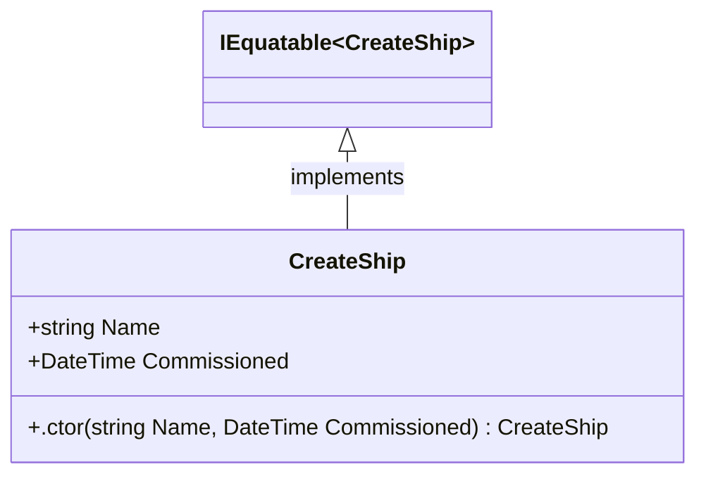

<div id="ShipDepartureDto-class-diagram"></div>

##### `ShipDepartureDto` class diagram

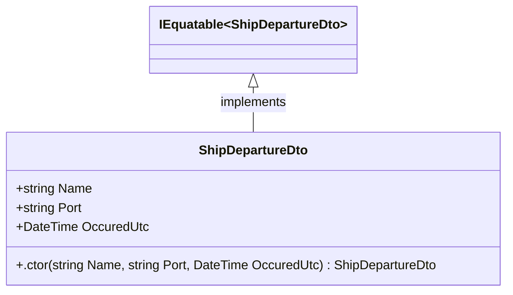

<div id="ShipInfoDto-class-diagram"></div>

##### `ShipInfoDto` class diagram

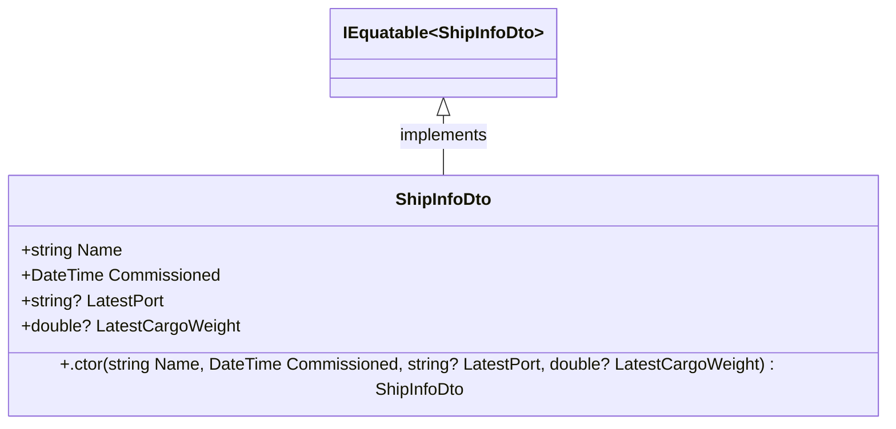

<div id="ShipEvents.Departed-class-diagram"></div>

##### `ShipEvents.Departed` class diagram

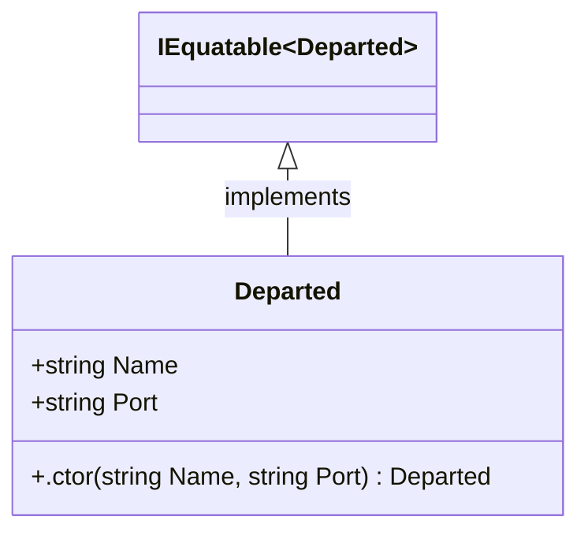

<div id="ShipEvents.DockedInPort-class-diagram"></div>

##### `ShipEvents.DockedInPort` class diagram

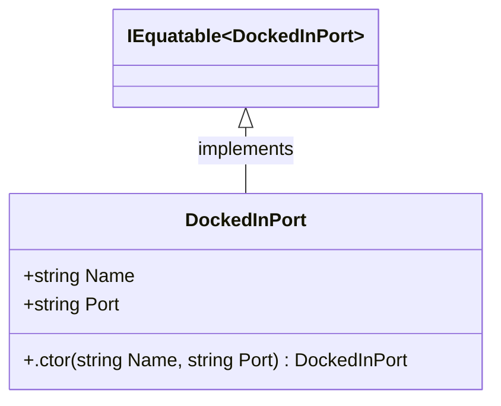

<div id="IShipRepository-class-diagram"></div>

##### `IShipRepository` class diagram

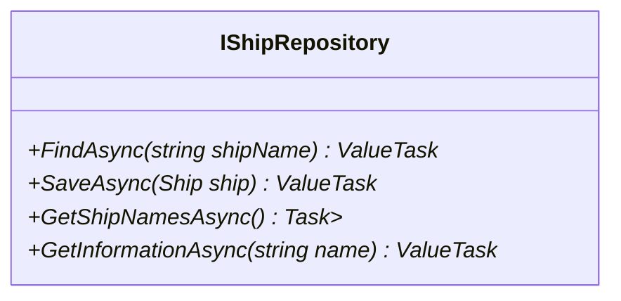

<div id="ShipEvents.Loaded-class-diagram"></div>

##### `ShipEvents.Loaded` class diagram

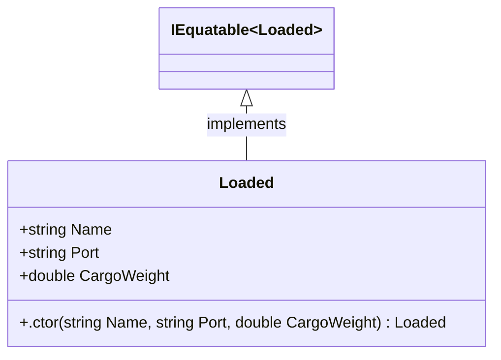

<div id="ShipEvents.Loading-class-diagram"></div>

##### `ShipEvents.Loading` class diagram

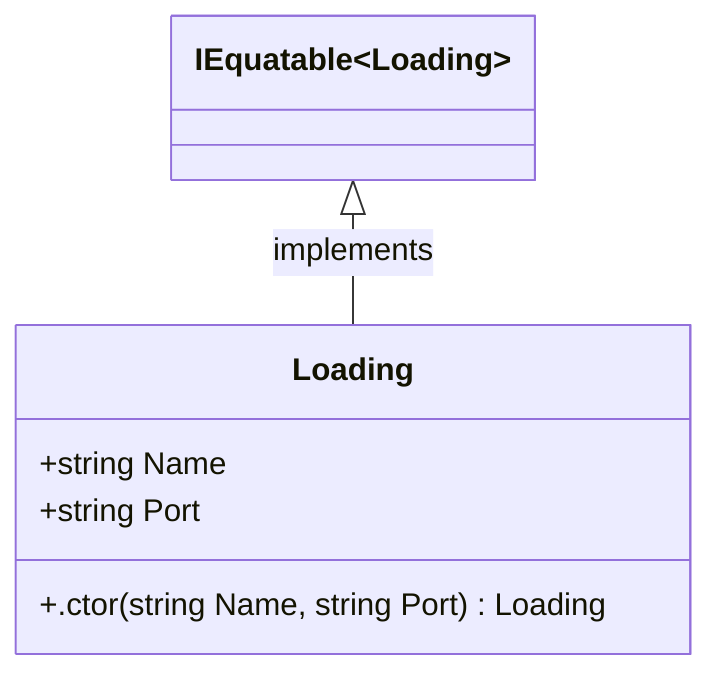

<div id="Ship-class-diagram"></div>

##### `Ship` class diagram

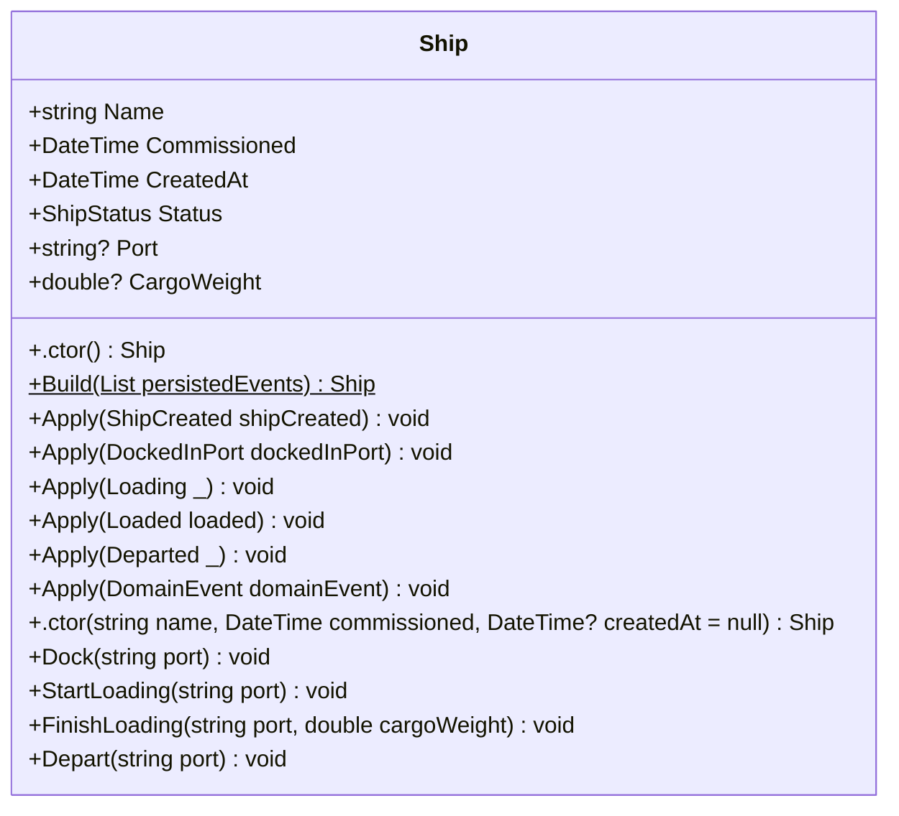

<div id="ShipEvents.ShipCreated-class-diagram"></div>

##### `ShipEvents.ShipCreated` class diagram

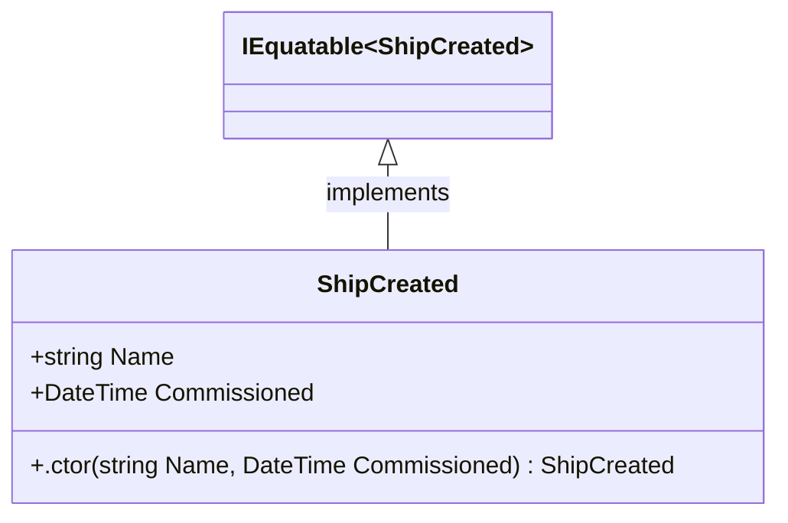

<div id="ShipEvents-class-diagram"></div>

##### `ShipEvents` class diagram

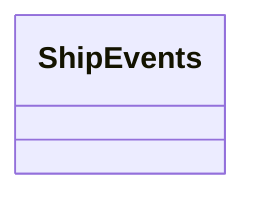

<div id="ShipStatus-class-diagram"></div>

##### `ShipStatus` class diagram

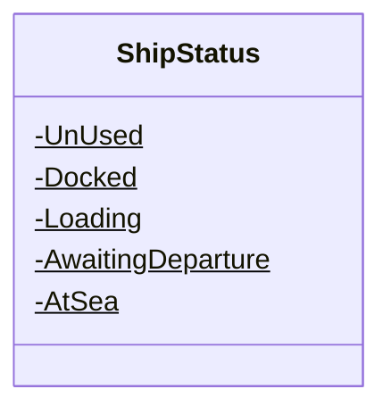

<div id="ShipEventItem-class-diagram"></div>

##### `ShipEventItem` class diagram

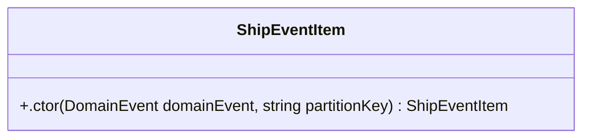

<div id="ShipRepository-class-diagram"></div>

##### `ShipRepository` class diagram

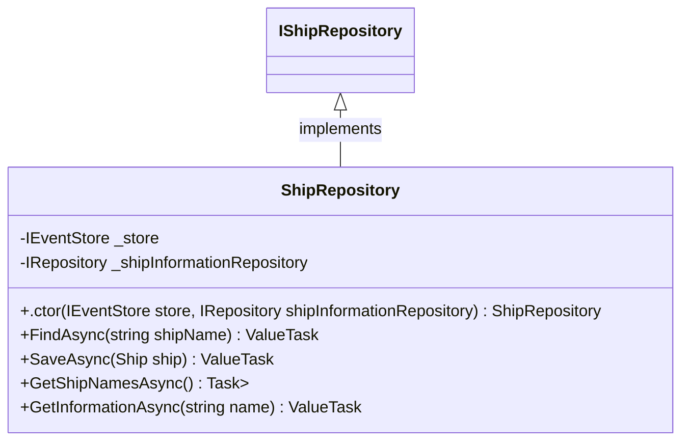

<div id="ShipInformation-class-diagram"></div>

##### `ShipInformation` class diagram

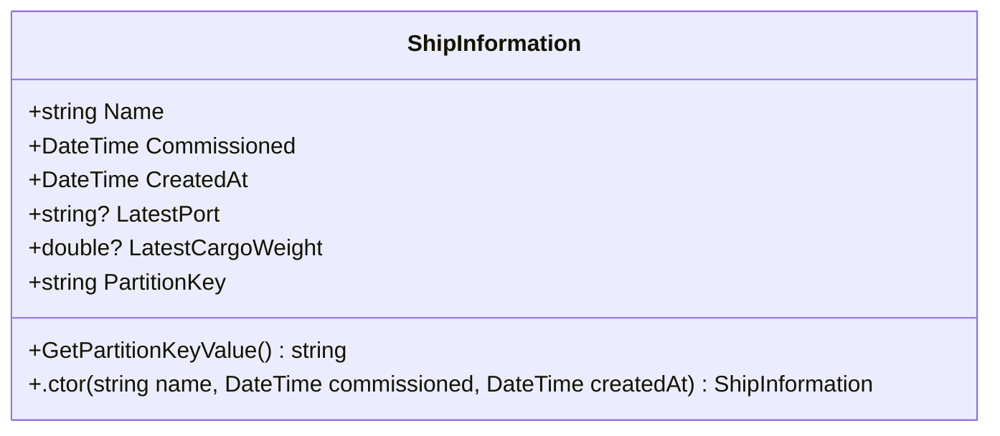

<div id="ShipInformationProjections.ShipCreated-class-diagram"></div>

##### `ShipInformationProjections.ShipCreated` class diagram

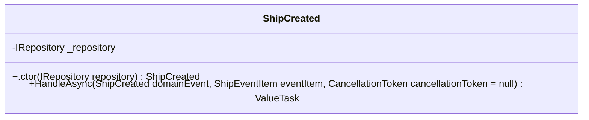

<div id="ShipInformationProjections.ShipDocked-class-diagram"></div>

##### `ShipInformationProjections.ShipDocked` class diagram

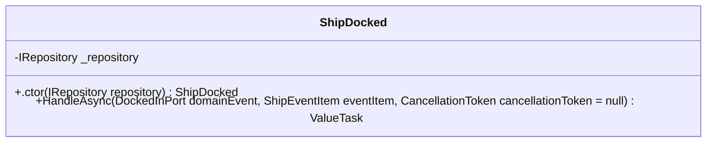

<div id="ShipInformationProjectionKey-class-diagram"></div>

##### `ShipInformationProjectionKey` class diagram

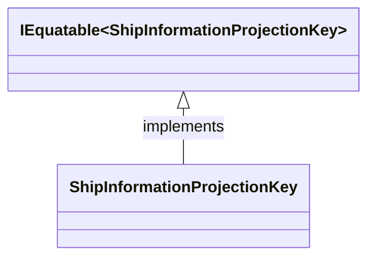

<div id="ShipInformationProjections-class-diagram"></div>

##### `ShipInformationProjections` class diagram

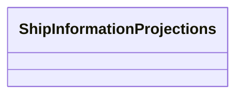

<div id="ShipInformationProjections.ShipLoaded-class-diagram"></div>

##### `ShipInformationProjections.ShipLoaded` class diagram

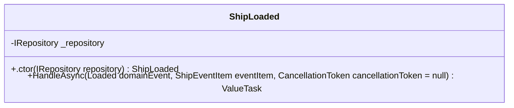

<div id="CustomerAccount-class-diagram"></div>

##### `CustomerAccount` class diagram

```mermaid
classDiagram
class CustomerAccount{
    +string Username
    +string Email
    +string FirstName
    +string Surname
    +CustomerAddress? Address
    +.ctor(string username, string email, string firstName, string surname) CustomerAccount
    +AssignAddress(string addressLine1, string addressLine2, string city, string country, string postCode) void
    +Apply(DomainEvent domainEvent) void
    +Apply(CustomerAccountAddressAssigned addressAssigned) void
    +Apply(CustomerAccountCreated created) void
    +Replay(List<DomainEvent> events)$ CustomerAccount
    +.ctor() CustomerAccount
}

```

<div id="CustomerAccountAddressAssigned-class-diagram"></div>

##### `CustomerAccountAddressAssigned` class diagram

```mermaid
classDiagram
IEquatable~CustomerAccountAddressAssigned~ <|-- CustomerAccountAddressAssigned : implements
class CustomerAccountAddressAssigned{
    +string Username
    +string AddressLine1
    +string AddressLine2
    +string City
    +string Country
    +string PostCode
    +.ctor(string Username, string AddressLine1, string AddressLine2, string City, string Country, string PostCode) CustomerAccountAddressAssigned
}

```

<div id="CustomerAccountCreated-class-diagram"></div>

##### `CustomerAccountCreated` class diagram

```mermaid
classDiagram
IEquatable~CustomerAccountCreated~ <|-- CustomerAccountCreated : implements
class CustomerAccountCreated{
    +string Username
    +string Email
    +string FirstName
    +string Surname
    +.ctor(string Username, string Email, string FirstName, string Surname) CustomerAccountCreated
}

```

<div id="CustomerAccountEventItem-class-diagram"></div>

##### `CustomerAccountEventItem` class diagram

```mermaid
classDiagram
class CustomerAccountEventItem{
    +.ctor(string username, DomainEvent domainEvent) CustomerAccountEventItem
}

```

<div id="CustomerAccountReadItem-class-diagram"></div>

##### `CustomerAccountReadItem` class diagram

```mermaid
classDiagram
class CustomerAccountReadItem{
    +string Username
    +string Email
    +string FirstName
    +string Surname
    +CustomerAddress? Address
    +GetPartitionKeyValue() string
    +.ctor(string username, string email, string firstName, string surname) CustomerAccountReadItem
}

```

<div id="CustomerAddress-class-diagram"></div>

##### `CustomerAddress` class diagram

```mermaid
classDiagram
IEquatable~CustomerAddress~ <|-- CustomerAddress : implements
class CustomerAddress{
    +string AddressLine1
    +string AddressLine2
    +string City
    +string Country
    +string PostCode
    +.ctor(string AddressLine1, string AddressLine2, string City, string Country, string PostCode) CustomerAddress
}

```

<div id="CustomerAccountReadProjection-class-diagram"></div>

##### `CustomerAccountReadProjection` class diagram

```mermaid
classDiagram
class CustomerAccountReadProjection{
    -IRepository<CustomerAccountReadItem> _repository
    +.ctor(IRepository<CustomerAccountReadItem> repository) CustomerAccountReadProjection
    +ProjectAsync(CustomerAccountEventItem eventItem, CancellationToken cancellationToken = null) ValueTask
    +CreateProjection(CustomerAccountCreated created) Task
    +AssignAddressToProjection(CustomerAccountAddressAssigned addressAssigned) Task
}

```

<div id="ReadProjectionKey-class-diagram"></div>

##### `ReadProjectionKey` class diagram

```mermaid
classDiagram
IEquatable~ReadProjectionKey~ <|-- ReadProjectionKey : implements
class ReadProjectionKey{
}

```

<div id="WelcomeLetterProjection-class-diagram"></div>

##### `WelcomeLetterProjection` class diagram

```mermaid
classDiagram
class WelcomeLetterProjection{
    -IReadOnlyRepository<CustomerAccountReadItem> _repository
    -IPostalService _postalService
    +.ctor(IReadOnlyRepository<CustomerAccountReadItem> repository, IPostalService postalService) WelcomeLetterProjection
    +ProjectAsync(CustomerAccountEventItem eventItem, CancellationToken cancellationToken = null) ValueTask
}

```

<div id="WelcomeLetterProjectionKey-class-diagram"></div>

##### `WelcomeLetterProjectionKey` class diagram

```mermaid
classDiagram
IEquatable~WelcomeLetterProjectionKey~ <|-- WelcomeLetterProjectionKey : implements
class WelcomeLetterProjectionKey{
}

```

<div id="AssignCustomersAccountAddressRequest-class-diagram"></div>

##### `AssignCustomersAccountAddressRequest` class diagram

```mermaid
classDiagram
IEquatable~AssignCustomersAccountAddressRequest~ <|-- AssignCustomersAccountAddressRequest : implements
class AssignCustomersAccountAddressRequest{
    +string Username
    +string AddressLine1
    +string AddressLine2
    +string City
    +string Country
    +string PostCode
    +.ctor(string Username, string AddressLine1, string AddressLine2, string City, string Country, string PostCode) AssignCustomersAccountAddressRequest
}

```

<div id="CreateCustomerAccountRequest-class-diagram"></div>

##### `CreateCustomerAccountRequest` class diagram

```mermaid
classDiagram
IEquatable~CreateCustomerAccountRequest~ <|-- CreateCustomerAccountRequest : implements
class CreateCustomerAccountRequest{
    +string Username
    +string Email
    +string FirstName
    +string Surname
    +.ctor(string Username, string Email, string FirstName, string Surname) CreateCustomerAccountRequest
}

```

<div id="DefaultPostalService-class-diagram"></div>

##### `DefaultPostalService` class diagram

```mermaid
classDiagram
IPostalService <|-- DefaultPostalService : implements
class DefaultPostalService{
    -ILogger<DefaultPostalService> _logger
    +.ctor(ILogger<DefaultPostalService> logger) DefaultPostalService
    +SendWelcomeLetterAsync(string firstName, string surname, CustomerAddress customerAddress) ValueTask
}

```

<div id="IPostalService-class-diagram"></div>

##### `IPostalService` class diagram

```mermaid
classDiagram
class IPostalService{
    +SendWelcomeLetterAsync(string firstName, string surname, CustomerAddress customerAddress)* ValueTask
}

```

<div id="JobsList-class-diagram"></div>

##### `JobsList` class diagram

```mermaid
classDiagram
class JobsList{
    -List<Job> _jobs
    +Guid Id
    +string Name
    +string Category
    +string Username
    +JobListInfo JobListInfo
    +.ctor(string name, string category, string username) JobsList
    +AddJob(string title, DateTime due) void
    +CompleteJob(Guid id) void
    +Apply(JobListCreatedEvent evt) void
    +Apply(JobAddedEvent evt) void
    +Apply(JobCompletedEvent evt) void
    +Apply(DomainEvent domainEvent) void
    +Replay(List<DomainEvent> domainEvents)$ JobsList
    +.ctor() JobsList
}

```

<div id="JobDto-class-diagram"></div>

##### `JobDto` class diagram

```mermaid
classDiagram
IEquatable~JobDto~ <|-- JobDto : implements
class JobDto{
    +string Id
    +string Title
    +DateTime Due
    +DateTime? CompletedAt
    +bool IsComplete
    +.ctor(string Id, string Title, DateTime Due, DateTime? CompletedAt = null) JobDto
}

```

<div id="JobsListDto-class-diagram"></div>

##### `JobsListDto` class diagram

```mermaid
classDiagram
IEquatable~JobsListDto~ <|-- JobsListDto : implements
class JobsListDto{
    +string Id
    +string Username
    +string Category
    +DateTime Created
    +.ctor(string Id, string Username, string Category, DateTime Created) JobsListDto
}

```

<div id="JobEndpoints-class-diagram"></div>

##### `JobEndpoints` class diagram

```mermaid
classDiagram
class JobEndpoints{
    -string Tag$
    +MapJobEndpoints(IEndpointRouteBuilder builder)$ IEndpointRouteBuilder
}

```

<div id="JobsListsEndpoints-class-diagram"></div>

##### `JobsListsEndpoints` class diagram

```mermaid
classDiagram
class JobsListsEndpoints{
    -string Tag$
    +MapJobsListsEndpoints(IEndpointRouteBuilder builder)$ IEndpointRouteBuilder
}

```

<div id="Job-class-diagram"></div>

##### `Job` class diagram

```mermaid
classDiagram
class Job{
    +Guid Id
    +string Title
    +DateTime Due
    +DateTime? CompletedAt
    +bool IsComplete
    +.ctor(Guid id, string title, DateTime due) Job
    +Complete(DateTime at) void
}

```

<div id="JobAddedEvent-class-diagram"></div>

##### `JobAddedEvent` class diagram

```mermaid
classDiagram
IEquatable~JobAddedEvent~ <|-- JobAddedEvent : implements
class JobAddedEvent{
    +Guid Id
    +string Title
    +DateTime Due
    +JobListInfo JobListInfo
    +.ctor(Guid Id, string Title, DateTime Due, JobListInfo JobListInfo) JobAddedEvent
}

```

<div id="JobCompletedEvent-class-diagram"></div>

##### `JobCompletedEvent` class diagram

```mermaid
classDiagram
IEquatable~JobCompletedEvent~ <|-- JobCompletedEvent : implements
class JobCompletedEvent{
    +Guid Id
    +string Title
    +JobListInfo JobListInfo
    +.ctor(Guid Id, string Title, JobListInfo JobListInfo) JobCompletedEvent
}

```

<div id="JobListCreatedEvent-class-diagram"></div>

##### `JobListCreatedEvent` class diagram

```mermaid
classDiagram
IEquatable~JobListCreatedEvent~ <|-- JobListCreatedEvent : implements
class JobListCreatedEvent{
    +Guid Id
    +string Name
    +string Category
    +string Username
    +.ctor(Guid Id, string Name, string Category, string Username) JobListCreatedEvent
}

```

<div id="IJobListRepository-class-diagram"></div>

##### `IJobListRepository` class diagram

```mermaid
classDiagram
class IJobListRepository{
    +SaveAsync(JobsList jobList)* ValueTask
    +ReadAsync(Guid jobListId)* ValueTask<JobsList>
}

```

<div id="JobItem-class-diagram"></div>

##### `JobItem` class diagram

```mermaid
classDiagram
class JobItem{
    +string Title
    +DateTime Due
    +DateTime? CompletedAt
    +string PartitionKey
    +GetPartitionKeyValue() string
    +.ctor(string id, string jobListId, string title, DateTime due, DateTime? completedAt = null) JobItem
    +Complete(DateTime at) void
}

```

<div id="JobsListEventItem-class-diagram"></div>

##### `JobsListEventItem` class diagram

```mermaid
classDiagram
class JobsListEventItem{
    +.ctor(DomainEvent domainDomainEvent, Guid id) JobsListEventItem
    +.ctor() JobsListEventItem
}

```

<div id="JobsListReadItem-class-diagram"></div>

##### `JobsListReadItem` class diagram

```mermaid
classDiagram
class JobsListReadItem{
    +string Name
    +string Username
    +string Category
    +string PartitionKey
    +GetPartitionKeyValue() string
    +.ctor(string id, string name, string username, string category) JobsListReadItem
}

```

<div id="JobsListProjectionKey-class-diagram"></div>

##### `JobsListProjectionKey` class diagram

```mermaid
classDiagram
IEquatable~JobsListProjectionKey~ <|-- JobsListProjectionKey : implements
class JobsListProjectionKey{
}

```

<div id="JobsListJobAddedProjection-class-diagram"></div>

##### `JobsListJobAddedProjection` class diagram

```mermaid
classDiagram
class JobsListJobAddedProjection{
    -IWriteOnlyRepository<JobItem> _repository
    +.ctor(IWriteOnlyRepository<JobItem> repository) JobsListJobAddedProjection
    +HandleAsync(JobAddedEvent domainEvent, JobsListEventItem eventItem, CancellationToken cancellationToken = null) ValueTask
}

```

<div id="JobsListJobCompletedProjection-class-diagram"></div>

##### `JobsListJobCompletedProjection` class diagram

```mermaid
classDiagram
class JobsListJobCompletedProjection{
    -IRepository<JobItem> _repository
    +.ctor(IRepository<JobItem> repository) JobsListJobCompletedProjection
    +HandleAsync(JobCompletedEvent domainEvent, JobsListEventItem eventItem, CancellationToken cancellationToken = null) ValueTask
}

```

<div id="UsersJobsListProjection-class-diagram"></div>

##### `UsersJobsListProjection` class diagram

```mermaid
classDiagram
class UsersJobsListProjection{
    -IWriteOnlyRepository<JobsListReadItem> _repository
    +.ctor(IWriteOnlyRepository<JobsListReadItem> repository) UsersJobsListProjection
    +HandleAsync(JobListCreatedEvent domainEvent, JobsListEventItem eventItem, CancellationToken cancellationToken = null) ValueTask
}

```

<div id="DefaultJobListRepository-class-diagram"></div>

##### `DefaultJobListRepository` class diagram

```mermaid
classDiagram
IJobListRepository <|-- DefaultJobListRepository : implements
class DefaultJobListRepository{
    -IEventStore<JobsListEventItem> _eventStore
    +.ctor(IEventStore<JobsListEventItem> eventStore) DefaultJobListRepository
    +SaveAsync(JobsList jobList) ValueTask
    +ReadAsync(Guid jobListId) ValueTask<JobsList>
}

```

<div id="CompleteJob-class-diagram"></div>

##### `CompleteJob` class diagram

```mermaid
classDiagram
IEquatable~CompleteJob~ <|-- CompleteJob : implements
class CompleteJob{
    +Guid JobListId
    +Guid JobId
    +.ctor(Guid JobListId, Guid JobId) CompleteJob
}

```

<div id="CreateJob-class-diagram"></div>

##### `CreateJob` class diagram

```mermaid
classDiagram
IEquatable~CreateJob~ <|-- CreateJob : implements
class CreateJob{
    +Guid JobListId
    +string Title
    +DateTime Due
    +.ctor(Guid JobListId, string Title, DateTime Due) CreateJob
}

```

<div id="CreateJobList-class-diagram"></div>

##### `CreateJobList` class diagram

```mermaid
classDiagram
IEquatable~CreateJobList~ <|-- CreateJobList : implements
class CreateJobList{
    +string Name
    +string Category
    +string Username
    +.ctor(string Name, string Category, string Username) CreateJobList
}

```

<div id="DefaultJobsTrackerService-class-diagram"></div>

##### `DefaultJobsTrackerService` class diagram

```mermaid
classDiagram
IJobsTrackerService <|-- DefaultJobsTrackerService : implements
class DefaultJobsTrackerService{
    -IJobListRepository _jobListRepository
    +.ctor(IJobListRepository jobListRepository) DefaultJobsTrackerService
    +CreateJobListAsync(string name, string category, string username) ValueTask<Guid>
    +AddJobAsync(Guid jobListId, string title, DateTime due) ValueTask
    +CompleteJobAsync(Guid jobListId, Guid jobId) ValueTask
}

```

<div id="DefaultJobTrackerReadService-class-diagram"></div>

##### `DefaultJobTrackerReadService` class diagram

```mermaid
classDiagram
IJobTrackerReadService <|-- DefaultJobTrackerReadService : implements
class DefaultJobTrackerReadService{
    -IReadOnlyRepository<JobsListReadItem> _jobsListRepository
    -IReadOnlyRepository<JobItem> _jobsRepository
    +.ctor(IReadOnlyRepository<JobsListReadItem> jobsListRepository, IReadOnlyRepository<JobItem> jobsRepository) DefaultJobTrackerReadService
    +FindJobsListAsync(Guid id, string username) ValueTask<JobsListDto?>
    +FindJobsForJobsListAsync(Guid jobListId) ValueTask<IEnumerable<JobDto>>
    +FindJobsListAsync(string username) Task<IEnumerable<JobsListDto>>
}

```

<div id="IJobsTrackerService-class-diagram"></div>

##### `IJobsTrackerService` class diagram

```mermaid
classDiagram
class IJobsTrackerService{
    +CreateJobListAsync(string name, string category, string username)* ValueTask<Guid>
    +AddJobAsync(Guid jobListId, string title, DateTime due)* ValueTask
    +CompleteJobAsync(Guid jobListId, Guid jobId)* ValueTask
}

```

<div id="IJobTrackerReadService-class-diagram"></div>

##### `IJobTrackerReadService` class diagram

```mermaid
classDiagram
class IJobTrackerReadService{
    +FindJobsListAsync(Guid id, string username)* ValueTask<JobsListDto?>
    +FindJobsForJobsListAsync(Guid jobListId)* ValueTask<IEnumerable<JobDto>>
    +FindJobsListAsync(string username)* Task<IEnumerable<JobsListDto>>
}

```

<div id="JobListInfo-class-diagram"></div>

##### `JobListInfo` class diagram

```mermaid
classDiagram
IEquatable~JobListInfo~ <|-- JobListInfo : implements
class JobListInfo{
    +Guid Id
    +string Name
    +string Category
    +string Username
    +.ctor(Guid Id, string Name, string Category, string Username) JobListInfo
}

```

<div id="Book-class-diagram"></div>

##### `Book` class diagram

```mermaid
classDiagram
class Book{
    +string Name
    +string Author
    +string Category
    +string PartitionKey
    +bool HasBeenUpdated
    +.ctor(string name, string author, string category) Book
    +.ctor(string name, string author, string category, string partitionKey) Book
    +GetPartitionKeyValue() string
}

```

<div id="BookByIdReference-class-diagram"></div>

##### `BookByIdReference` class diagram

```mermaid
classDiagram
class BookByIdReference{
    +string Category
    +string PartitionKey
    +.ctor(string id, string category) BookByIdReference
    +.ctor(string id, string category, string partitionKey) BookByIdReference
}

```

<div id="BookChangeFeedProcessor-class-diagram"></div>

##### `BookChangeFeedProcessor` class diagram

```mermaid
classDiagram
class BookChangeFeedProcessor{
}

```

<div id="BookDemoConstants-class-diagram"></div>

##### `BookDemoConstants` class diagram

```mermaid
classDiagram
class BookDemoConstants{
    -string Container$
    -string PartitionKey$
}

```

<div id="BookDto-class-diagram"></div>

##### `BookDto` class diagram

```mermaid
classDiagram
IEquatable~BookDto~ <|-- BookDto : implements
class BookDto{
    +string Id
    +string Name
    +string Author
    +string Category
    +.ctor(string Id, string Name, string Author, string Category) BookDto
}

```

<div id="BookMappingExtensions-class-diagram"></div>

##### `BookMappingExtensions` class diagram

```mermaid
classDiagram
class BookMappingExtensions{
    +ToBook(CreateBookDto createBookDto)$ Book
    +ToBookDto(Book book)$ BookDto
}

```

<div id="CreateBookDto-class-diagram"></div>

##### `CreateBookDto` class diagram

```mermaid
classDiagram
IEquatable~CreateBookDto~ <|-- CreateBookDto : implements
class CreateBookDto{
    +string Name
    +string Author
    +string Category
    +.ctor(string Name, string Author, string Category) CreateBookDto
}

```

<div id="BookRouteExtensions-class-diagram"></div>

##### `BookRouteExtensions` class diagram

```mermaid
classDiagram
class BookRouteExtensions{
    +MapBookRoutes(IEndpointRouteBuilder routes)$ IEndpointRouteBuilder
    +CreateBook(CreateBookDto createBookDto, IRepository<Book> bookRepository)$ Task<BookDto>
    +GetBooksForAuthor(HttpContext context, IRepository<Book> bookRepository, string category)$ Task<IEnumerable<BookDto>>
    +GetBookById(string id, IRepository<Book> bookRepository, IRepository<BookByIdReference> bookByIdReferenceRepository)$ Task<IResult>
}

```

<div id="Startup-class-diagram"></div>

##### `Startup` class diagram

```mermaid
classDiagram
class Startup{
    +Configure(IFunctionsHostBuilder builder) void
}

```

<div id="UsersApi-class-diagram"></div>

##### `UsersApi` class diagram

```mermaid
classDiagram
class UsersApi{
    -IRepository<User> _repository
    +.ctor(IRepositoryFactory factory) UsersApi
    +GetUsers(HttpRequest req, ILogger log, CancellationToken hostCancellationToken) Task<IActionResult>
    +GetAllUsers(HttpRequest req, ILogger log, CancellationToken hostCancellationToken) Task<IActionResult>
    +PostUser(HttpRequest req, ILogger log, CancellationToken hostCancellationToken) Task<IActionResult>
}

```

<div id="PostUserRequest-class-diagram"></div>

##### `PostUserRequest` class diagram

```mermaid
classDiagram
class PostUserRequest{
    +string FirstName
    +string LastName
    +string EmailAddress
    +stUserRequest postUserRequest)$ PostUserRequest.implicit
}

```

<div id="User-class-diagram"></div>

##### `User` class diagram

```mermaid
classDiagram
class User{
    +string Nickname
    +string FirstName
    +string LastName
    +string FullName
    +string EmailAddress
    +GetPartitionKeyValue() string
}

```

<div id="ParcelController-class-diagram"></div>

##### `ParcelController` class diagram

```mermaid
classDiagram
class ParcelController{
    -IRepository<Parcel> _repository
    +.ctor(IRepository<Parcel> repository) ParcelController
    +GetParcels() ValueTask<IEnumerable<Parcel>>
    +GetParcel(string id) ValueTask<Parcel>
    +CreateParcels(params Parcel[] parcels) ValueTask<IEnumerable<Parcel>>
    +UpdateParcel(Parcel parcel) ValueTask<Parcel>
    +DeleteParcel(string id) ValueTask
}

```

<div id="Startup-class-diagram"></div>

##### `Startup` class diagram

```mermaid
classDiagram
class Startup{
    +ConfigureServices(IServiceCollection services) void
    +Configure(IApplicationBuilder app, IWebHostEnvironment env) void
}

```

<div id="Parcel-class-diagram"></div>

##### `Parcel` class diagram

```mermaid
classDiagram
class Parcel{
    +Guid CustomerId
    +DateTime PromisedBy
    +List<ParcelItem> Items
}

```

<div id="ParcelItem-class-diagram"></div>

##### `ParcelItem` class diagram

```mermaid
classDiagram
class ParcelItem{
    +string Upos
    +string Sku
    +string Description
}

```

<div id="BankAccount-class-diagram"></div>

##### `BankAccount` class diagram

```mermaid
classDiagram
class BankAccount{
    +string Name
    +double Balance
    +Withdraw(double amount) void
    +Deposit(double amount) void
    +ToString() string
}

```

<div id="Person-class-diagram"></div>

##### `Person` class diagram

```mermaid
classDiagram
class Person{
    +string Name
    +int Age
    +ToString() string
}

```

<div id="ExampleService-class-diagram"></div>

##### `ExampleService` class diagram

```mermaid
classDiagram
IExampleService <|-- ExampleService : implements
class ExampleService{
    -IRepository<Person> _personRepository
    +.ctor(IRepository<Person> personRepository) ExampleService
    +AddPeopleAsync(IEnumerable<Person> people) ValueTask<IEnumerable<Person>>
    +AddPersonAsync(Person person) ValueTask<Person>
    +DeletePersonAsync(Person person) ValueTask
    +ReadPeopleAsync(Expression<Func<Person, bool>> matches) ValueTask<IEnumerable<Person>>
    +ReadPersonByIdAsync(string id, string partitionKey) ValueTask<Person>
    +UpdatePersonAsync(Person person) ValueTask<Person>
}

```

<div id="IExampleService-class-diagram"></div>

##### `IExampleService` class diagram

```mermaid
classDiagram
class IExampleService{
    +AddPersonAsync(Person person)* ValueTask<Person>
    +AddPeopleAsync(IEnumerable<Person> people)* ValueTask<IEnumerable<Person>>
    +ReadPersonByIdAsync(string id, string partitionKey)* ValueTask<Person>
    +ReadPeopleAsync(Expression<Func<Person, bool>> matches)* ValueTask<IEnumerable<Person>>
    +UpdatePersonAsync(Person person)* ValueTask<Person>
    +DeletePersonAsync(Person person)* ValueTask
}

```

<div id="Person-class-diagram"></div>

##### `Person` class diagram

```mermaid
classDiagram
class Person{
    +DateTime BirthDate
    +string FirstName
    +string? MiddleName
    +string LastName
    +int AgeInYears
    +string SyntheticPartitionKey
    +GetPartitionKeyValue() string
    +ToString() string
}

```

<div id="Widget-class-diagram"></div>

##### `Widget` class diagram

```mermaid
classDiagram
class Widget{
    +string Name
    +DateTimeOffset CreatedOrUpdatedOn
    +ToString() string
}

```

<div id="Person-class-diagram"></div>

##### `Person` class diagram

```mermaid
classDiagram
class Person{
    +string Name
    +int Age
    +ToString() string
}

```

<div id="SpecificationFilterSamples.AllPersonsOlderThanSpecifciation-class-diagram"></div>

##### `SpecificationFilterSamples.AllPersonsOlderThanSpecifciation` class diagram

```mermaid
classDiagram
class AllPersonsOlderThanSpecifciation{
    +.ctor(int age) AllPersonsOlderThanSpecifciation
}

```

<div id="SpecificationFilterSamples.AllPersonsWithNameSpecification-class-diagram"></div>

##### `SpecificationFilterSamples.AllPersonsWithNameSpecification` class diagram

```mermaid
classDiagram
class AllPersonsWithNameSpecification{
    +.ctor(string name) AllPersonsWithNameSpecification
}

```

<div id="FullSpecificationSamples-class-diagram"></div>

##### `FullSpecificationSamples` class diagram

```mermaid
classDiagram
class FullSpecificationSamples{
    -IRepository<Person> _repository
    +.ctor(IRepository<Person> repository) FullSpecificationSamples
    +FullContinuationTokenSpecificationAsync(int age) Task
    +FullPageNumberSpecificationAsync(int age) Task
}

```

<div id="SpecificationOrderSamples.OrderByMultipleFieldsSpecification-class-diagram"></div>

##### `SpecificationOrderSamples.OrderByMultipleFieldsSpecification` class diagram

```mermaid
classDiagram
class OrderByMultipleFieldsSpecification{
    +.ctor() OrderByMultipleFieldsSpecification
}

```

<div id="SpecificationOrderSamples.OrderByNameSpecification-class-diagram"></div>

##### `SpecificationOrderSamples.OrderByNameSpecification` class diagram

```mermaid
classDiagram
class OrderByNameSpecification{
    +.ctor() OrderByNameSpecification
}

```

<div id="SpecificationFilterSamples-class-diagram"></div>

##### `SpecificationFilterSamples` class diagram

```mermaid
classDiagram
class SpecificationFilterSamples{
    -IRepository<Person> _repository
    +.ctor(IRepository<Person> repository) SpecificationFilterSamples
    +FilterSamples() Task
}

```

<div id="SpecificationOrderSamples-class-diagram"></div>

##### `SpecificationOrderSamples` class diagram

```mermaid
classDiagram
class SpecificationOrderSamples{
    -IRepository<Person> _repository
    +.ctor(IRepository<Person> repository) SpecificationOrderSamples
    +BasicOrderAsync() Task
    +MultipleOrderByAsync() Task
}

```

<div id="SpecificationPagingSamples-class-diagram"></div>

##### `SpecificationPagingSamples` class diagram

```mermaid
classDiagram
class SpecificationPagingSamples{
    -IRepository<Person> _repository
    +.ctor(IRepository<Person> repository) SpecificationPagingSamples
    +BasicPageAsync() Task
    +BasicScrollingAsync() Task
}

```

<div id="FullSpecificationSamples.UsersOrderByAgeOffsetSpecification-class-diagram"></div>

##### `FullSpecificationSamples.UsersOrderByAgeOffsetSpecification` class diagram

```mermaid
classDiagram
class UsersOrderByAgeOffsetSpecification{
    +.ctor(int age) UsersOrderByAgeOffsetSpecification
}

```

<div id="FullSpecificationSamples.UsersOrderByAgeSpecification-class-diagram"></div>

##### `FullSpecificationSamples.UsersOrderByAgeSpecification` class diagram

```mermaid
classDiagram
class UsersOrderByAgeSpecification{
    +.ctor(int age) UsersOrderByAgeSpecification
}

```

<div id="WebTierApplicationFactory-class-diagram"></div>

##### `WebTierApplicationFactory` class diagram

```mermaid
classDiagram
class WebTierApplicationFactory{
    +ConfigureWebHost(IWebHostBuilder builder) void
}

```

<div id="LanguageDto-class-diagram"></div>

##### `LanguageDto` class diagram

```mermaid
classDiagram
class LanguageDto{
    +string Id
    +string Name
    +string[] Aliases
    +string Description
    +ProgrammingStyle PrimaryStyle
    +DateTime InitialReleaseDate
}

```

<div id="LanguagesControllerTests-class-diagram"></div>

##### `LanguagesControllerTests` class diagram

```mermaid
classDiagram
class LanguagesControllerTests{
    -HttpClient _client
    -IRepositoryFactory _repositoryFactory
    +.ctor(WebTierApplicationFactory factory) LanguagesControllerTests
    +Post_Always_Creates_A_Language() Task
}

```

<div id="LanguageController-class-diagram"></div>

##### `LanguageController` class diagram

```mermaid
classDiagram
class LanguageController{
    -IRepository<Language> _repository
    +.ctor(IRepositoryFactory factory) LanguageController
    +GetLanguages() ValueTask<IEnumerable<Language>>
    +GetLanguageById(string id) ValueTask<Language>
    +PostLanguages(params Language[] languages) ValueTask<IEnumerable<Language>>
    +PutLanguage(Language language) ValueTask<Language>
    +UpdateName(string id, string name) ValueTask<IActionResult>
    +DeleteLanguage(string id) ValueTask
}

```

<div id="Language-class-diagram"></div>

##### `Language` class diagram

```mermaid
classDiagram
class Language{
    +string Name
    +string[] Aliases
    +string Description
    +ProgrammingStyle PrimaryStyle
    +DateTime InitialReleaseDate
}

```

<div id="ProgrammingStyle-class-diagram"></div>

##### `ProgrammingStyle` class diagram

```mermaid
classDiagram
class ProgrammingStyle{
    -Functional$
    -ObjectOriented$
    -Procedural$
    -Script$
    -Modular$
}

```

<div id="Program-class-diagram"></div>

##### `Program` class diagram

```mermaid
classDiagram
class Program{
    +Main(string[] args)$ Task
    +CreateHostBuilder(string[] args)$ IHostBuilder
}

```

<div id="Startup-class-diagram"></div>

##### `Startup` class diagram

```mermaid
classDiagram
class Startup{
    +ConfigureServices(IServiceCollection services) void
    +Configure(IApplicationBuilder app, IWebHostEnvironment env) void
}

```

<div id="AggregateRoot-class-diagram"></div>

##### `AggregateRoot` class diagram

```mermaid
classDiagram
IAggregateRoot <|-- AggregateRoot : implements
class AggregateRoot{
    -List<DomainEvent> _events
    -List<DomainEvent> _newEvents
    -AtomicEvent? _atomicEvent
    +IReadOnlyList<DomainEvent> NewEvents
    +IReadOnlyList<DomainEvent> Events
    +AtomicEvent AtomicEvent
    +AddEvent(DomainEvent domainEvent) void
    +Apply(List<DomainEvent> domainEvents) void
    +Apply(DomainEvent domainEvent)* void
    +CreateAtomicMarkerEvent() void
    +UpdateAtomicMarkerEvent() void
}

```

<div id="IAggregateRoot-class-diagram"></div>

##### `IAggregateRoot` class diagram

```mermaid
classDiagram
class IAggregateRoot{
    +IReadOnlyList<DomainEvent> NewEvents*
    +IReadOnlyList<DomainEvent> Events*
    +AtomicEvent AtomicEvent*
}

```

<div id="IAggregateRootMapper&lt;TAggregateRoot, TEventItem&gt;-class-diagram"></div>

##### `IAggregateRootMapper<TAggregateRoot, TEventItem>` class diagram

```mermaid
classDiagram
class IAggregateRootMapper<TAggregateRoot, TEventItem>{
    +MapFrom(TAggregateRoot aggregateRoot)* IEnumerable<TEventItem>
    +MapTo(IEnumerable<TEventItem> events)* TAggregateRoot
}

```

<div id="EventItemPartitionKeyAttribute-class-diagram"></div>

##### `EventItemPartitionKeyAttribute` class diagram

```mermaid
classDiagram
class EventItemPartitionKeyAttribute{
}

```

<div id="DefaultCosmosEventSourcingBuilder-class-diagram"></div>

##### `DefaultCosmosEventSourcingBuilder` class diagram

```mermaid
classDiagram
class DefaultCosmosEventSourcingBuilder{
}

```

<div id="EventItemProjectionBuilder&lt;TEventItem, TProjectionKey&gt;-class-diagram"></div>

##### `EventItemProjectionBuilder<TEventItem, TProjectionKey>` class diagram

```mermaid
classDiagram
class EventItemProjectionBuilder<TEventItem, TProjectionKey>{
}

```

<div id="ICosmosEventSourcingBuilder-class-diagram"></div>

##### `ICosmosEventSourcingBuilder` class diagram

```mermaid
classDiagram
class ICosmosEventSourcingBuilder{
    +SourcingBuilder.AddEventItemProjection<TEventItem, TProjectionKey, TProjection>(Action<EventSourcingProcessorOptions<TEventItem, TProjectionKey>>? optionsAction = null)* IEventItemProjectionBuilder<TEventItem,
    +AddDefaultDomainEventProjection<TEventItem, TProjectionKey>(Action<EventSourcingProcessorOptions<TEventItem, TProjectionKey>>? optionsAction = null)* ICosmosEventSourcingBuilder
    +AddDomainEventTypes(params Assembly[] assemblies)* ICosmosEventSourcingBuilder
    +AddDomainEventProjectionHandlers(params Assembly[] assemblies)* ICosmosEventSourcingBuilder
    +AddCosmosRepository(Action<RepositoryOptions>? setupAction = null, Action<CosmosClientOptions>? additionSetupAction = null)* ICosmosEventSourcingBuilder
}

```

<div id="IEventItemProjectionBuilder&lt;TEventItem, TProjectionKey&gt;-class-diagram"></div>

##### `IEventItemProjectionBuilder<TEventItem, TProjectionKey>` class diagram

```mermaid
classDiagram
class IEventItemProjectionBuilder<TEventItem, TProjectionKey>{
    +ICosmosEventSourcingBuilder EventSourcingBuilder*
    +TProjectionKey>.WithDeadLetterDecorator(Action<DeadLetterOptions<TEventItem, TProjectionKey>>? optionsAction = null)* IEventItemProjectionBuilder<TEventItem,
}

```

<div id="DefaultEventSourcingProcessor&lt;TSourcedEvent, TProjectionKey&gt;-class-diagram"></div>

##### `DefaultEventSourcingProcessor<TSourcedEvent, TProjectionKey>` class diagram

```mermaid
classDiagram
class DefaultEventSourcingProcessor<TSourcedEvent, TProjectionKey>{
}

```

<div id="DefaultEventSourcingProvider-class-diagram"></div>

##### `DefaultEventSourcingProvider` class diagram

```mermaid
classDiagram
class DefaultEventSourcingProvider{
}

```

<div id="IEventSourcingProcessor-class-diagram"></div>

##### `IEventSourcingProcessor` class diagram

```mermaid
classDiagram
IContainerChangeFeedProcessor <|-- IEventSourcingProcessor : implements
class IEventSourcingProcessor{
}

```

<div id="IsExternalInit-class-diagram"></div>

##### `IsExternalInit` class diagram

```mermaid
classDiagram
class IsExternalInit{
}

```

<div id="DefaultContextService-class-diagram"></div>

##### `DefaultContextService` class diagram

```mermaid
classDiagram
IContextService <|-- DefaultContextService : implements
class DefaultContextService{
    +string? CorrelationId
}

```

<div id="IContextService-class-diagram"></div>

##### `IContextService` class diagram

```mermaid
classDiagram
class IContextService{
    +string? CorrelationId*
}

```

<div id="DomainEventConverter-class-diagram"></div>

##### `DomainEventConverter` class diagram

```mermaid
classDiagram
class DomainEventConverter{
    +HashSet<Type> ConvertableTypes$
    +WriteJson(JsonWriter writer, object value, JsonSerializer serializer) void
    +ReadJson(JsonReader reader, Type objectType, object existingValue, JsonSerializer serializer) object
    +CanConvert(Type objectType) bool
}

```

<div id="DeadLetterProjectionDecorator&lt;TEventItem, TProjectionKey&gt;-class-diagram"></div>

##### `DeadLetterProjectionDecorator<TEventItem, TProjectionKey>` class diagram

```mermaid
classDiagram
class DeadLetterProjectionDecorator<TEventItem, TProjectionKey>{
}

```

<div id="-class-diagram"></div>

##### `` class diagram

```mermaid
classDiagram
IEquatable~~ <|--  : implements
class {
}

```

<div id="AtomicEvent-class-diagram"></div>

##### `AtomicEvent` class diagram

```mermaid
classDiagram
class AtomicEvent{
    +string ETag
    +.ctor(string eventId, string eTag) AtomicEvent
}

```

<div id="DomainEvent-class-diagram"></div>

##### `DomainEvent` class diagram

```mermaid
classDiagram
IDomainEvent <|-- DomainEvent : implements
IEquatable~DomainEvent~ <|-- DomainEvent : implements
class DomainEvent{
    +string EventId
    +string EventName
    +int Sequence
    +DateTime OccuredUtc
}

```

<div id="IDomainEvent-class-diagram"></div>

##### `IDomainEvent` class diagram

```mermaid
classDiagram
class IDomainEvent{
    +string EventId*
    +string EventName*
    +int Sequence*
    +DateTime OccuredUtc*
}

```

<div id="NonDeserializableEvent-class-diagram"></div>

##### `NonDeserializableEvent` class diagram

```mermaid
classDiagram
IEquatable~NonDeserializableEvent~ <|-- NonDeserializableEvent : implements
class NonDeserializableEvent{
    +string Name
    +JObject Payload
    +Exception? Exception
    +JsonReader? JsonReader
}

```

<div id="AtomicEventEtagRequiredException-class-diagram"></div>

##### `AtomicEventEtagRequiredException` class diagram

```mermaid
classDiagram
class AtomicEventEtagRequiredException{
    +.ctor() AtomicEventEtagRequiredException
}

```

<div id="AtomicEventRequiredException-class-diagram"></div>

##### `AtomicEventRequiredException` class diagram

```mermaid
classDiagram
class AtomicEventRequiredException{
    +.ctor(Type aggregateRootType) AtomicEventRequiredException
    +.ctor() AtomicEventRequiredException
}

```

<div id="DomainEventsRequiredException-class-diagram"></div>

##### `DomainEventsRequiredException` class diagram

```mermaid
classDiagram
class DomainEventsRequiredException{
}

```

<div id="EventItemPartitionKeyAttributeRequiredException-class-diagram"></div>

##### `EventItemPartitionKeyAttributeRequiredException` class diagram

```mermaid
classDiagram
class EventItemPartitionKeyAttributeRequiredException{
}

```

<div id="InvalidEventItemPartitionKeyAttributeCombinationException-class-diagram"></div>

##### `InvalidEventItemPartitionKeyAttributeCombinationException` class diagram

```mermaid
classDiagram
class InvalidEventItemPartitionKeyAttributeCombinationException{
}

```

<div id="InvalidPartitionKeyValueException-class-diagram"></div>

##### `InvalidPartitionKeyValueException` class diagram

```mermaid
classDiagram
class InvalidPartitionKeyValueException{
}

```

<div id="ReplayMethodNotDefinedException-class-diagram"></div>

##### `ReplayMethodNotDefinedException` class diagram

```mermaid
classDiagram
class ReplayMethodNotDefinedException{
}

```

<div id="EventItemExtensions-class-diagram"></div>

##### `EventItemExtensions` class diagram

```mermaid
classDiagram
class EventItemExtensions{
    +GetEventPayload<TEvent>(EventItem eventItem)$ TEvent
    +TryGetEventPayload<TEvent>(EventItem eventItem)$ TEvent?
}

```

<div id="ExpressionExtensions-class-diagram"></div>

##### `ExpressionExtensions` class diagram

```mermaid
classDiagram
class ExpressionExtensions{
    +Compose<T>(Expression<T> first, Expression<T> second, Func<Expression, Expression, Expression> merge)$ Expression<T>
}

```

<div id="ItemContainerBuilderExtensions-class-diagram"></div>

##### `ItemContainerBuilderExtensions` class diagram

```mermaid
classDiagram
class ItemContainerBuilderExtensions{
    +ConfigureEventItemStore<TEventItem>(IItemContainerBuilder containerBuilder, string containerName, Action<ContainerOptionsBuilder>? containerOptionsBuilder = null)$ IItemContainerBuilder
    +ConfigureProjectionStore<TProjection>(IItemContainerBuilder containerBuilder, string containerName, string partitionKey = null, Action<ContainerOptionsBuilder>? containerOptionsBuilder = null)$ IItemContainerBuilder
    +ConfigureDeadLetteredEventItemStore<TEventItem, TDeadLetteredEventItem>(IItemContainerBuilder containerBuilder, string containerName, string partitionKey = null, Action<ContainerOptionsBuilder>? containerOptionsBuilder = null)$ IItemContainerBuilder
}

```

<div id="ExpressionExtensions.ParameterReBinder-class-diagram"></div>

##### `ExpressionExtensions.ParameterReBinder` class diagram

```mermaid
classDiagram
class ParameterReBinder{
    -Dictionary<ParameterExpression, ParameterExpression> _map
    +.ctor(Dictionary<ParameterExpression, ParameterExpression> map) ParameterReBinder
    +ReplaceParameters(Dictionary<ParameterExpression, ParameterExpression> map, Expression exp)$ Expression
    +VisitParameter(ParameterExpression parameter) Expression
}

```

<div id="ServiceCollectionExtensions-class-diagram"></div>

##### `ServiceCollectionExtensions` class diagram

```mermaid
classDiagram
class ServiceCollectionExtensions{
    +AddCosmosEventSourcing(IServiceCollection services, Action<ICosmosEventSourcingBuilder> eventSourcingBuilder)$ IServiceCollection
}

```

<div id="CosmosEventSourcingPartitionKeys-class-diagram"></div>

##### `CosmosEventSourcingPartitionKeys` class diagram

```mermaid
classDiagram
class CosmosEventSourcingPartitionKeys{
    -string Default$
}

```

<div id="DeadLetteredEventItem&lt;TEventItem&gt;-class-diagram"></div>

##### `DeadLetteredEventItem<TEventItem>` class diagram

```mermaid
classDiagram
class DeadLetteredEventItem<TEventItem>{
    +TEventItem EventItem
    +DateTime FailedAtUtc
    +string ProcessorName
    +string InstanceName
    +string ProjectionKeyName
    +string PartitionKey
    +ExceptionDetails Exception
    +GetPartitionKeyValue() string
    +etteredEventItem(TEventItem eventItem, string processorName, string instanceName, string projectionKeyName, ExceptionDetails exception) void
}

```

<div id="EventItem-class-diagram"></div>

##### `EventItem` class diagram

```mermaid
classDiagram
IItemWithTimeToLive <|-- EventItem : implements
class EventItem{
    -int? _timeToLive
    -DomainEvent _domainEvent
    -string? _etag
    +DomainEvent DomainEvent
    +string Id
    +string Type
    +string PartitionKey
    +string EventName
    +string? Etag
    +TimeSpan? TimeToLive
    +string? CorrelationId
    +.ctor() EventItem
}

```

<div id="ExceptionDetails-class-diagram"></div>

##### `ExceptionDetails` class diagram

```mermaid
classDiagram
IEquatable~ExceptionDetails~ <|-- ExceptionDetails : implements
class ExceptionDetails{
    +string Type
    +string Message
    +.ctor(string Type, string Message) ExceptionDetails
}

```

<div id="DeadLetterOptions&lt;TEventItem, TProjectionKey&gt;-class-diagram"></div>

##### `DeadLetterOptions<TEventItem, TProjectionKey>` class diagram

```mermaid
classDiagram
class DeadLetterOptions<TEventItem, TProjectionKey>{
}

```

<div id="EventSourcingProcessorOptions&lt;TEventItem, TProjectionKey&gt;-class-diagram"></div>

##### `EventSourcingProcessorOptions<TEventItem, TProjectionKey>` class diagram

```mermaid
classDiagram
class EventSourcingProcessorOptions<TEventItem, TProjectionKey>{
    +string InstanceName
    +TimeSpan? PollInterval
    +string ProcessorName
}

```

<div id="DefaultDomainEventProjection&lt;TEventItem, TProjectionKey&gt;-class-diagram"></div>

##### `DefaultDomainEventProjection<TEventItem, TProjectionKey>` class diagram

```mermaid
classDiagram
class DefaultDomainEventProjection<TEventItem, TProjectionKey>{
}

```

<div id="IDomainEventProjection&lt;TEvent, TEventItem, TProjectionKey&gt;-class-diagram"></div>

##### `IDomainEventProjection<TEvent, TEventItem, TProjectionKey>` class diagram

```mermaid
classDiagram
class IDomainEventProjection<TEvent, TEventItem, TProjectionKey>{
    +HandleAsync(TEvent domainEvent, TEventItem eventItem, CancellationToken cancellationToken = null)* ValueTask
}

```

<div id="IEventItemProjection&lt;TEventItem, TProjectionKey&gt;-class-diagram"></div>

##### `IEventItemProjection<TEventItem, TProjectionKey>` class diagram

```mermaid
classDiagram
class IEventItemProjection<TEventItem, TProjectionKey>{
    +ProjectAsync(TEventItem eventItem, CancellationToken cancellationToken = null)* ValueTask
}

```

<div id="IProjectionKey-class-diagram"></div>

##### `IProjectionKey` class diagram

```mermaid
classDiagram
class IProjectionKey{
}

```

<div id="DefaultEventStore&lt;TEventItem&gt;-class-diagram"></div>

##### `DefaultEventStore<TEventItem>` class diagram

```mermaid
classDiagram
class DefaultEventStore<TEventItem>{
    +ReadAsync(string partitionKey, CancellationToken cancellationToken = null) ValueTask<IEnumerable<TEventItem>>
    +ReadAggregateAsync<TAggregateRoot>(string partitionKey, CancellationToken cancellationToken = null) ValueTask<TAggregateRoot>
    +ReadAggregateAsync<TAggregateRoot>(string partitionKey, IAggregateRootMapper<TAggregateRoot, TEventItem> rootMapper, CancellationToken cancellationToken = null) ValueTask<TAggregateRoot>
    +ReadAsync(string partitionKey, Expression<Func<TEventItem, bool>> predicate, CancellationToken cancellationToken = null) ValueTask<IEnumerable<TEventItem>>
    +StreamAsync(string partitionKey, int chunkSize = 25, CancellationToken cancellationToken = null) IAsyncEnumerable<TEventItem>
    +PersistAsync(IEnumerable<TEventItem> items, CancellationToken cancellationToken = null) ValueTask
    +PersistAsync(IAggregateRoot aggregateRoot, CancellationToken cancellationToken = null) ValueTask
    +PersistAsync<TAggregateRoot>(TAggregateRoot aggregateRoot, IAggregateRootMapper<TAggregateRoot, TEventItem> mapper, CancellationToken cancellationToken = null) ValueTask
    +PersistAsync(IAggregateRoot aggregateRoot, string partitionKeyValue, CancellationToken cancellationToken = null) ValueTask
    +SetCorrelationId(IContextService contextService, IEnumerable<TEventItem> eventItems)$ IEnumerable<TEventItem>
    +BuildEvents(IAggregateRoot aggregateRoot, string partitionKey)$ IEnumerable<TEventItem>
    +GetEventItemPartitionKeyValue<TAggregate>(TAggregate aggregate)$ string
}

```

<div id="IEventStore&lt;TEventItem&gt;-class-diagram"></div>

##### `IEventStore<TEventItem>` class diagram

```mermaid
classDiagram
IReadOnlyEventStore~TEventItem~ <|-- IEventStore<TEventItem> : implements
IWriteOnlyEventStore~TEventItem~ <|-- IEventStore<TEventItem> : implements
class IEventStore<TEventItem>{
}

```

<div id="IReadOnlyEventStore&lt;TEventItem&gt;-class-diagram"></div>

##### `IReadOnlyEventStore<TEventItem>` class diagram

```mermaid
classDiagram
class IReadOnlyEventStore<TEventItem>{
    +ReadAsync(string partitionKey, CancellationToken cancellationToken = null)* ValueTask<IEnumerable<TEventItem>>
    +ReadAggregateAsync<TAggregateRoot>(string partitionKey, CancellationToken cancellationToken = null)* ValueTask<TAggregateRoot>
    +ReadAggregateAsync<TAggregateRoot>(string partitionKey, IAggregateRootMapper<TAggregateRoot, TEventItem> rootMapper, CancellationToken cancellationToken = null)* ValueTask<TAggregateRoot>
    +ReadAsync(string partitionKey, Expression<Func<TEventItem, bool>> predicate, CancellationToken cancellationToken = null)* ValueTask<IEnumerable<TEventItem>>
    +StreamAsync(string partitionKey, int chunkSize = 25, CancellationToken cancellationToken = null)* IAsyncEnumerable<TEventItem>
}

```

<div id="IWriteOnlyEventStore&lt;TEventItem&gt;-class-diagram"></div>

##### `IWriteOnlyEventStore<TEventItem>` class diagram

```mermaid
classDiagram
class IWriteOnlyEventStore<TEventItem>{
    +PersistAsync(IEnumerable<TEventItem> items, CancellationToken cancellationToken = null)* ValueTask
    +PersistAsync(IAggregateRoot aggregateRoot, CancellationToken cancellationToken = null)* ValueTask
    +PersistAsync<TAggregateRoot>(TAggregateRoot aggregateRoot, IAggregateRootMapper<TAggregateRoot, TEventItem> mapper, CancellationToken cancellationToken = null)* ValueTask
    +PersistAsync(IAggregateRoot aggregateRoot, string partitionKeyValue, CancellationToken cancellationToken = null)* ValueTask
}

```

<div id="CosmosRepositoryChangeFeedHostedService-class-diagram"></div>

##### `CosmosRepositoryChangeFeedHostedService` class diagram

```mermaid
classDiagram
class CosmosRepositoryChangeFeedHostedService{
}

```

<div id="ServiceCollectionExtensions-class-diagram"></div>

##### `ServiceCollectionExtensions` class diagram

```mermaid
classDiagram
class ServiceCollectionExtensions{
    +AddCosmosRepositoryChangeFeedHostedService(IServiceCollection services)$ IServiceCollection
    +AddCosmosRepositoryItemChangeFeedProcessors(IServiceCollection services, params Assembly[] assemblies)$ IServiceCollection
}

```

<div id="ContainerAttribute-class-diagram"></div>

##### `ContainerAttribute` class diagram

```mermaid
classDiagram
class ContainerAttribute{
}

```

<div id="PartitionKeyPathAttribute-class-diagram"></div>

##### `PartitionKeyPathAttribute` class diagram

```mermaid
classDiagram
class PartitionKeyPathAttribute{
}

```

<div id="UniqueKeyAttribute-class-diagram"></div>

##### `UniqueKeyAttribute` class diagram

```mermaid
classDiagram
class UniqueKeyAttribute{
}

```

<div id="IOrderedSpecificationBuilder&lt;TItem, TResult&gt;-class-diagram"></div>

##### `IOrderedSpecificationBuilder<TItem, TResult>` class diagram

```mermaid
classDiagram
ISpecificationBuilder~TItem,TResult~ <|-- IOrderedSpecificationBuilder<TItem, TResult> : implements
class IOrderedSpecificationBuilder<TItem, TResult>{
    +TResult>.ThenBy(Expression<Func<TItem, object>> orderExpression)* IOrderedSpecificationBuilder<TItem,
    +TResult>.ThenByDescending(Expression<Func<TItem, object>> orderExpression)* IOrderedSpecificationBuilder<TItem,
}

```

<div id="ISpecificationBuilder&lt;TItem, TResult&gt;-class-diagram"></div>

##### `ISpecificationBuilder<TItem, TResult>` class diagram

```mermaid
classDiagram
class ISpecificationBuilder<TItem, TResult>{
    +BaseSpecification<TItem, TResult> Specification*
    +TResult>.Where(Expression<Func<TItem, bool>> expression)* ISpecificationBuilder<TItem,
    +TResult>.OrderBy(Expression<Func<TItem, object>> orderExpression)* IOrderedSpecificationBuilder<TItem,
    +TResult>.OrderByDescending(Expression<Func<TItem, object>> orderExpression)* IOrderedSpecificationBuilder<TItem,
    +TResult>.PageSize(int pageSize)* ISpecificationBuilder<TItem,
    +TResult>.PageNumber(int pageNumber)* ISpecificationBuilder<TItem,
    +TResult>.ContinuationToken(string continuationToken)* ISpecificationBuilder<TItem,
}

```

<div id="OrderedSpecificationBuilder&lt;TItem, TResult&gt;-class-diagram"></div>

##### `OrderedSpecificationBuilder<TItem, TResult>` class diagram

```mermaid
classDiagram
IOrderedSpecificationBuilder~TItem,TResult~ <|-- OrderedSpecificationBuilder<TItem, TResult> : implements
class OrderedSpecificationBuilder<TItem, TResult>{
    +edSpecificationBuilder(BaseSpecification<TItem, TResult> specification) void
    +TResult>.ThenBy(Expression<Func<TItem, object>> orderExpression) IOrderedSpecificationBuilder<TItem,
    +TResult>.ThenByDescending(Expression<Func<TItem, object>> orderExpression) IOrderedSpecificationBuilder<TItem,
}

```

<div id="SpecificationBuilder&lt;TItem, TResult&gt;-class-diagram"></div>

##### `SpecificationBuilder<TItem, TResult>` class diagram

```mermaid
classDiagram
class SpecificationBuilder<TItem, TResult>{
}

```

<div id="ContainerOptionsBuilder-class-diagram"></div>

##### `ContainerOptionsBuilder` class diagram

```mermaid
classDiagram
class ContainerOptionsBuilder{
}

```

<div id="DefaultItemContainerBuilder-class-diagram"></div>

##### `DefaultItemContainerBuilder` class diagram

```mermaid
classDiagram
IItemContainerBuilder <|-- DefaultItemContainerBuilder : implements
class DefaultItemContainerBuilder{
    -List<ContainerOptionsBuilder> _options
    +IReadOnlyList<ContainerOptionsBuilder> Options
    +Configure<TItem>(Action<ContainerOptionsBuilder> containerOptions) IItemContainerBuilder
}

```

<div id="IItemContainerBuilder-class-diagram"></div>

##### `IItemContainerBuilder` class diagram

```mermaid
classDiagram
class IItemContainerBuilder{
    +IReadOnlyList<ContainerOptionsBuilder> Options*
    +Configure<TItem>(Action<ContainerOptionsBuilder> containerOptions)* IItemContainerBuilder
}

```

<div id="IPatchOperationBuilder&lt;TItem&gt;-class-diagram"></div>

##### `IPatchOperationBuilder<TItem>` class diagram

```mermaid
classDiagram
class IPatchOperationBuilder<TItem>{
    +IReadOnlyList<PatchOperation> PatchOperations*
    +Replace<TValue>(Expression<Func<TItem, TValue>> expression, TValue? value)* IPatchOperationBuilder<TItem>
}

```

<div id="PatchOperationBuilder&lt;TItem&gt;-class-diagram"></div>

##### `PatchOperationBuilder<TItem>` class diagram

```mermaid
classDiagram
IPatchOperationBuilder~TItem~ <|-- PatchOperationBuilder<TItem> : implements
class PatchOperationBuilder<TItem>{
    -List<PatchOperation> _patchOperations
    -NamingStrategy _namingStrategy
    -List<InternalPatchOperation> _rawPatchOperations
    +IReadOnlyList<PatchOperation> PatchOperations
    +OperationBuilder() void
    +OperationBuilder(CosmosPropertyNamingPolicy? cosmosPropertyNamingPolicy) void
    +Replace<TValue>(Expression<Func<TItem, TValue>> expression, TValue? value) IPatchOperationBuilder<TItem>
    +GetPropertyToReplace(MemberInfo propertyInfo) string
}

```

<div id="ChangeFeedOptions-class-diagram"></div>

##### `ChangeFeedOptions` class diagram

```mermaid
classDiagram
class ChangeFeedOptions{
    +Type ItemType
    +string InstanceName
    +TimeSpan? PollInterval
    +string ProcessorName
    +.ctor(Type itemType) ChangeFeedOptions
    +IsTheSameAs(ChangeFeedOptions? options) bool
}

```

<div id="DefaultChangeFeedService-class-diagram"></div>

##### `DefaultChangeFeedService` class diagram

```mermaid
classDiagram
class DefaultChangeFeedService{
}

```

<div id="DefaultContainerChangeFeedProcessor-class-diagram"></div>

##### `DefaultContainerChangeFeedProcessor` class diagram

```mermaid
classDiagram
IContainerChangeFeedProcessor <|-- DefaultContainerChangeFeedProcessor : implements
class DefaultContainerChangeFeedProcessor{
    -ICosmosContainerService _containerService
    -ILeaseContainerProvider _leaseContainerProvider
    -ChangeFeedOptions _changeFeedOptions
    -ILogger<DefaultContainerChangeFeedProcessor> _logger
    -IServiceProvider _serviceProvider
    -ChangeFeedProcessor? _processor
    -ConcurrentDictionary<Type, Type> Handlers$
    +IReadOnlyList<Type> ItemTypes
    +.ctor(ICosmosContainerService containerService, IReadOnlyList<Type> itemTypes, ILeaseContainerProvider leaseContainerProvider, ChangeFeedOptions changeFeedOptions, ILogger<DefaultContainerChangeFeedProcessor> logger, IServiceProvider serviceProvider) DefaultContainerChangeFeedProcessor
    +StartAsync() Task
    +OnChangesAsync(IReadOnlyCollection<JObject> changes, string containerName, CancellationToken cancellationToken) Task
    +InvokeHandlerAsync(Type itemType, JObject instance, CancellationToken cancellationToken) Task
    +OnErrorAsync(Exception exception, string containerName) Task
    +StopAsync() Task
}

```

<div id="IChangeFeedService-class-diagram"></div>

##### `IChangeFeedService` class diagram

```mermaid
classDiagram
class IChangeFeedService{
    +StartAsync(CancellationToken cancellationToken)* Task
    +StopAsync()* Task
}

```

<div id="IContainerChangeFeedProcessor-class-diagram"></div>

##### `IContainerChangeFeedProcessor` class diagram

```mermaid
classDiagram
class IContainerChangeFeedProcessor{
    +IReadOnlyList<Type> ItemTypes*
    +StartAsync()* Task
    +StopAsync()* Task
}

```

<div id="IItemChangeFeedProcessor&lt;TItem&gt;-class-diagram"></div>

##### `IItemChangeFeedProcessor<TItem>` class diagram

```mermaid
classDiagram
class IItemChangeFeedProcessor<TItem>{
    +HandleAsync(TItem item, CancellationToken cancellationToken)* ValueTask
}

```

<div id="DefaultRepository&lt;TItem&gt;-class-diagram"></div>

##### `DefaultRepository<TItem>` class diagram

```mermaid
classDiagram
class DefaultRepository<TItem>{
    +UpdateAsBatchAsync(IEnumerable<TItem> items, CancellationToken cancellationToken = null) ValueTask
    +CreateAsBatchAsync(IEnumerable<TItem> items, CancellationToken cancellationToken = null) ValueTask
    +DeleteAsBatchAsync(IEnumerable<TItem> items, CancellationToken cancellationToken = null) ValueTask
    +GetPartitionKeyValue(List<TItem> items)$ string
    +CountAsync(CancellationToken cancellationToken = null) ValueTask<int>
    +CountAsync<TResult>(ISpecification<TItem, TResult> specification, CancellationToken cancellationToken = null) ValueTask<Response<int>>
    +CountAsync(Expression<Func<TItem, bool>> predicate, CancellationToken cancellationToken = null) ValueTask<int>
    +CreateAsync(TItem value, CancellationToken cancellationToken = null) ValueTask<TItem>
    +CreateAsync(IEnumerable<TItem> values, CancellationToken cancellationToken = null) ValueTask<IEnumerable<TItem>>
    +DeleteAsync(TItem value, CancellationToken cancellationToken = null) ValueTask
    +DeleteAsync(string id, string? partitionKeyValue = null, CancellationToken cancellationToken = null) ValueTask
    +DeleteAsync(string id, PartitionKey partitionKey, CancellationToken cancellationToken = null) ValueTask
    +ExistsAsync(string id, string? partitionKeyValue = null, CancellationToken cancellationToken = null) ValueTask<bool>
    +ExistsAsync(string id, PartitionKey partitionKey, CancellationToken cancellationToken = null) ValueTask<bool>
    +ExistsAsync(Expression<Func<TItem, bool>> predicate, CancellationToken cancellationToken = null) ValueTask<bool>
    +PageAsync(Expression<Func<TItem, bool>>? predicate = null, int pageSize = 25, string? continuationToken = null, bool returnTotal = false, CancellationToken cancellationToken = null) ValueTask<IPage<TItem>>
    +PageAsync(Expression<Func<TItem, bool>>? predicate = null, int pageNumber = 1, int pageSize = 25, bool returnTotal = false, CancellationToken cancellationToken = null) ValueTask<IPageQueryResult<TItem>>
    +TryGetAsync(string id, string? partitionKeyValue = null, CancellationToken cancellationToken = null) ValueTask<TItem?>
    +GetAsync(string id, string? partitionKeyValue = null, CancellationToken cancellationToken = null) ValueTask<TItem>
    +GetAsync(string id, PartitionKey partitionKey, CancellationToken cancellationToken = null) ValueTask<TItem>
    +GetAsync(Expression<Func<TItem, bool>> predicate, CancellationToken cancellationToken = null) ValueTask<IEnumerable<TItem>>
    +GetByQueryAsync(string query, CancellationToken cancellationToken = null) ValueTask<IEnumerable<TItem>>
    +GetByQueryAsync(QueryDefinition queryDefinition, CancellationToken cancellationToken = null) ValueTask<IEnumerable<TItem>>
    +QueryAsync<TResult>(ISpecification<TItem, TResult> specification, CancellationToken cancellationToken = null) ValueTask<TResult>
    +UpdateAsync(TItem value, bool ignoreEtag = false, CancellationToken cancellationToken = null) ValueTask<TItem>
    +UpdateAsync(IEnumerable<TItem> values, bool ignoreEtag = false, CancellationToken cancellationToken = null) ValueTask<IEnumerable<TItem>>
    +UpdateAsync(string id, Action<IPatchOperationBuilder<TItem>> builder, string? partitionKeyValue = null, string? etag = null, CancellationToken cancellationToken = null) ValueTask
}

```

<div id="DefaultRepositoryFactory-class-diagram"></div>

##### `DefaultRepositoryFactory` class diagram

```mermaid
classDiagram
class DefaultRepositoryFactory{
}

```

<div id="EtagItem-class-diagram"></div>

##### `EtagItem` class diagram

```mermaid
classDiagram
IItemWithEtag <|-- EtagItem : implements
class EtagItem{
    +string Etag
    +.ctor() EtagItem
    +.ctor(string etag) EtagItem
}

```

<div id="FullItem-class-diagram"></div>

##### `FullItem` class diagram

```mermaid
classDiagram
IItemWithEtag <|-- FullItem : implements
IItemWithTimeToLive <|-- FullItem : implements
IItemWithTimeStamps <|-- FullItem : implements
class FullItem{
    -int? _timeToLive
    +string? Etag
    +TimeSpan? TimeToLive
    +DateTime LastUpdatedTimeUtc
    +long LastUpdatedTimeRaw
    +DateTime? CreatedTimeUtc
    +.ctor() FullItem
    +.ctor(string etag) FullItem
}

```

<div id="IBatchRepository&lt;TItem&gt;-class-diagram"></div>

##### `IBatchRepository<TItem>` class diagram

```mermaid
classDiagram
class IBatchRepository<TItem>{
    +UpdateAsBatchAsync(IEnumerable<TItem> items, CancellationToken cancellationToken = null)* ValueTask
    +CreateAsBatchAsync(IEnumerable<TItem> items, CancellationToken cancellationToken = null)* ValueTask
    +DeleteAsBatchAsync(IEnumerable<TItem> items, CancellationToken cancellationToken = null)* ValueTask
}

```

<div id="IItem-class-diagram"></div>

##### `IItem` class diagram

```mermaid
classDiagram
class IItem{
    +string Id*
    +string Type*
    +string PartitionKey*
}

```

<div id="IItemWithEtag-class-diagram"></div>

##### `IItemWithEtag` class diagram

```mermaid
classDiagram
IItem <|-- IItemWithEtag : implements
class IItemWithEtag{
    +string? Etag*
}

```

<div id="IItemWithTimeStamps-class-diagram"></div>

##### `IItemWithTimeStamps` class diagram

```mermaid
classDiagram
IItem <|-- IItemWithTimeStamps : implements
class IItemWithTimeStamps{
    +DateTime? CreatedTimeUtc*
    +DateTime LastUpdatedTimeUtc*
    +long LastUpdatedTimeRaw*
}

```

<div id="IItemWithTimeToLive-class-diagram"></div>

##### `IItemWithTimeToLive` class diagram

```mermaid
classDiagram
IItem <|-- IItemWithTimeToLive : implements
class IItemWithTimeToLive{
    +TimeSpan? TimeToLive*
}

```

<div id="InMemoryRepository&lt;TItem&gt;-class-diagram"></div>

##### `InMemoryRepository<TItem>` class diagram

```mermaid
classDiagram
IRepository~TItem~ <|-- InMemoryRepository<TItem> : implements
class InMemoryRepository<TItem>{
    -ISpecificationEvaluator _specificationEvaluator
    -Name? item
    +long CurrentTs
    +ConcurrentDictionary<string, string> Items
    +Action<ChangeFeedItemArgs<TItem>>? Changes
    +CreateAsBatchAsync(IEnumerable<TItem> items, CancellationToken cancellationToken = null) ValueTask
    +UpdateAsBatchAsync(IEnumerable<TItem> items, CancellationToken cancellationToken = null) ValueTask
    +DeleteAsBatchAsync(IEnumerable<TItem> items, CancellationToken cancellationToken = null) ValueTask
    +CountAsync(CancellationToken cancellationToken = null) ValueTask<int>
    +CountAsync(Expression<Func<TItem, bool>> predicate, CancellationToken cancellationToken = null) ValueTask<int>
    +CreateAsync(TItem value, CancellationToken cancellationToken = null) ValueTask<TItem>
    +CreateAsync(IEnumerable<TItem> values, CancellationToken cancellationToken = null) ValueTask<IEnumerable<TItem>>
    +CreateAsync(TItem value, bool raiseChanges = false) ValueTask<TItem>
    +oryRepository() void
    +oryRepository(ISpecificationEvaluator specificationEvaluator) void
    +NotFound() void
    +Conflict() void
    +DeleteAsync(TItem value, CancellationToken cancellationToken = null) ValueTask
    +DeleteAsync(string id, string? partitionKeyValue = null, CancellationToken cancellationToken = null) ValueTask
    +DeleteAsync(string id, PartitionKey partitionKey, CancellationToken cancellationToken = null) ValueTask
    +ExistsAsync(string id, string? partitionKeyValue = null, CancellationToken cancellationToken = null) ValueTask<bool>
    +ExistsAsync(string id, PartitionKey partitionKey, CancellationToken cancellationToken = null) ValueTask<bool>
    +ExistsAsync(Expression<Func<TItem, bool>> predicate, CancellationToken cancellationToken = null) ValueTask<bool>
    +PageAsync(Expression<Func<TItem, bool>>? predicate = null, int pageSize = 25, string? continuationToken = null, bool returnTotal = false, CancellationToken cancellationToken = null) ValueTask<IPage<TItem>>
    +PageAsync(Expression<Func<TItem, bool>>? predicate = null, int pageNumber = 1, int pageSize = 25, bool returnTotal = false, CancellationToken cancellationToken = null) ValueTask<IPageQueryResult<TItem>>
    +TryGetAsync(string id, string? partitionKeyValue = null, CancellationToken cancellationToken = null) ValueTask<TItem?>
    +GetAsync(string id, string? partitionKeyValue = null, CancellationToken cancellationToken = null) ValueTask<TItem>
    +GetAsync(string id, PartitionKey partitionKey, CancellationToken cancellationToken = null) ValueTask<TItem>
    +SerializeItem(TItem item, string? etag = null, long? ts = null) string
    +DeserializeItem(string jsonItem) TItem
    +DeserializeItem<TDeserializeTo>(string jsonItem) TDeserializeTo
    +QueryAsync<TResult>(ISpecification<TItem, TResult> specification, CancellationToken cancellationToken = null) ValueTask<TResult>
    +UpdateAsync(TItem value, bool raiseChanges, bool ignoreEtag = false) ValueTask<TItem>
    +UpdateAsync(TItem value, bool ignoreEtag = false, CancellationToken cancellationToken = null) ValueTask<TItem>
    +UpdateAsync(IEnumerable<TItem> values, bool ignoreEtag = false, CancellationToken cancellationToken = null) ValueTask<IEnumerable<TItem>>
    +UpdateAsync(string id, Action<IPatchOperationBuilder<TItem>> builder, string? partitionKeyValue = null, string? etag = null, CancellationToken cancellationToken = null) ValueTask
    +MismatchedEtags() void
}

```

<div id="IQueryResult&lt;TItem&gt;-class-diagram"></div>

##### `IQueryResult<TItem>` class diagram

```mermaid
classDiagram
class IQueryResult<TItem>{
    +IReadOnlyList<TItem> Items*
    +double Charge*
}

```

<div id="IReadOnlyRepository&lt;TItem&gt;-class-diagram"></div>

##### `IReadOnlyRepository<TItem>` class diagram

```mermaid
classDiagram
class IReadOnlyRepository<TItem>{
    +TryGetAsync(string id, string? partitionKeyValue = null, CancellationToken cancellationToken = null)* ValueTask<TItem?>
    +GetAsync(string id, string? partitionKeyValue = null, CancellationToken cancellationToken = null)* ValueTask<TItem>
    +GetAsync(string id, PartitionKey partitionKey, CancellationToken cancellationToken = null)* ValueTask<TItem>
    +GetAsync(Expression<Func<TItem, bool>> predicate, CancellationToken cancellationToken = null)* ValueTask<IEnumerable<TItem>>
    +GetByQueryAsync(string query, CancellationToken cancellationToken = null)* ValueTask<IEnumerable<TItem>>
    +GetByQueryAsync(QueryDefinition queryDefinition, CancellationToken cancellationToken = null)* ValueTask<IEnumerable<TItem>>
    +ExistsAsync(string id, string? partitionKeyValue = null, CancellationToken cancellationToken = null)* ValueTask<bool>
    +ExistsAsync(string id, PartitionKey partitionKey, CancellationToken cancellationToken = null)* ValueTask<bool>
    +ExistsAsync(Expression<Func<TItem, bool>> predicate, CancellationToken cancellationToken = null)* ValueTask<bool>
    +CountAsync(CancellationToken cancellationToken = null)* ValueTask<int>
    +CountAsync(Expression<Func<TItem, bool>> predicate, CancellationToken cancellationToken = null)* ValueTask<int>
    +PageAsync(Expression<Func<TItem, bool>>? predicate = null, int pageSize = 25, string? continuationToken = null, bool returnTotal = false, CancellationToken cancellationToken = null)* ValueTask<IPage<TItem>>
    +QueryAsync<TResult>(ISpecification<TItem, TResult> specification, CancellationToken cancellationToken = null)* ValueTask<TResult>
    +PageAsync(Expression<Func<TItem, bool>>? predicate = null, int pageNumber = 1, int pageSize = 25, bool returnTotal = false, CancellationToken cancellationToken = null)* ValueTask<IPageQueryResult<TItem>>
}

```

<div id="IRepository&lt;TItem&gt;-class-diagram"></div>

##### `IRepository<TItem>` class diagram

```mermaid
classDiagram
IReadOnlyRepository~TItem~ <|-- IRepository<TItem> : implements
IWriteOnlyRepository~TItem~ <|-- IRepository<TItem> : implements
IBatchRepository~TItem~ <|-- IRepository<TItem> : implements
class IRepository<TItem>{
}

```

<div id="IRepositoryFactory-class-diagram"></div>

##### `IRepositoryFactory` class diagram

```mermaid
classDiagram
class IRepositoryFactory{
    +RepositoryOf<TItem>()* IRepository<TItem>
}

```

<div id="Item-class-diagram"></div>

##### `Item` class diagram

```mermaid
classDiagram
IItem <|-- Item : implements
class Item{
    +string Id
    +string Type
    +string PartitionKey
    +.ctor() Item
    +GetPartitionKeyValue() string
}

```

<div id="IWriteOnlyRepository&lt;TItem&gt;-class-diagram"></div>

##### `IWriteOnlyRepository<TItem>` class diagram

```mermaid
classDiagram
class IWriteOnlyRepository<TItem>{
    +CreateAsync(TItem value, CancellationToken cancellationToken = null)* ValueTask<TItem>
    +CreateAsync(IEnumerable<TItem> values, CancellationToken cancellationToken = null)* ValueTask<IEnumerable<TItem>>
    +UpdateAsync(TItem value, bool ignoreEtag = false, CancellationToken cancellationToken = null)* ValueTask<TItem>
    +UpdateAsync(IEnumerable<TItem> values, bool ignoreEtag = false, CancellationToken cancellationToken = null)* ValueTask<IEnumerable<TItem>>
    +UpdateAsync(string id, Action<IPatchOperationBuilder<TItem>> builder, string? partitionKeyValue = null, string? etag = null, CancellationToken cancellationToken = null)* ValueTask
    +DeleteAsync(TItem value, CancellationToken cancellationToken = null)* ValueTask
    +DeleteAsync(string id, string? partitionKeyValue = null, CancellationToken cancellationToken = null)* ValueTask
    +DeleteAsync(string id, PartitionKey partitionKey, CancellationToken cancellationToken = null)* ValueTask
}

```

<div id="QueryResult&lt;T&gt;-class-diagram"></div>

##### `QueryResult<T>` class diagram

```mermaid
classDiagram
class QueryResult<T>{
}

```

<div id="TimeStampedItem-class-diagram"></div>

##### `TimeStampedItem` class diagram

```mermaid
classDiagram
IItemWithTimeStamps <|-- TimeStampedItem : implements
class TimeStampedItem{
    +DateTime? CreatedTimeUtc
    +DateTime LastUpdatedTimeUtc
    +long LastUpdatedTimeRaw
}

```

<div id="TimeToLiveItem-class-diagram"></div>

##### `TimeToLiveItem` class diagram

```mermaid
classDiagram
IItemWithTimeToLive <|-- TimeToLiveItem : implements
class TimeToLiveItem{
    -int? _timeToLive
    +TimeSpan? TimeToLive
}

```

<div id="ServiceCollectionExtensions-class-diagram"></div>

##### `ServiceCollectionExtensions` class diagram

```mermaid
classDiagram
class ServiceCollectionExtensions{
    +AddCosmosRepository(IServiceCollection services, Action<RepositoryOptions>? setupAction = null, Action<CosmosClientOptions>? additionSetupAction = null)$ IServiceCollection
    +AddInMemoryCosmosRepository(IServiceCollection services)$ IServiceCollection
    +RemoveCosmosRepositories(IServiceCollection services)$ IServiceCollection
}

```

<div id="IEvaluator-class-diagram"></div>

##### `IEvaluator` class diagram

```mermaid
classDiagram
class IEvaluator{
    +bool IsFilterEvaluator*
    +GetQuery<TItem, TResult>(IQueryable<TItem> query, ISpecification<TItem, TResult> specification)* IQueryable<TItem>
}

```

<div id="ISpecificationEvaluator-class-diagram"></div>

##### `ISpecificationEvaluator` class diagram

```mermaid
classDiagram
class ISpecificationEvaluator{
    +GetQuery<TItem, TResult>(IQueryable<TItem> query, ISpecification<TItem, TResult> specification, bool evaluateCriteriaOnly = false)* IQueryable<TItem>
    +GetResult<TItem, TResult>(IReadOnlyList<TItem> res, ISpecification<TItem, TResult> specification, int totalCount, double charge, string continuationToken)* TResult
}

```

<div id="OrderEvaluator-class-diagram"></div>

##### `OrderEvaluator` class diagram

```mermaid
classDiagram
IEvaluator <|-- OrderEvaluator : implements
class OrderEvaluator{
    +bool IsFilterEvaluator
    +GetQuery<TItem, TResult>(IQueryable<TItem> query, ISpecification<TItem, TResult> specification) IQueryable<TItem>
}

```

<div id="PagingEvaluator-class-diagram"></div>

##### `PagingEvaluator` class diagram

```mermaid
classDiagram
IEvaluator <|-- PagingEvaluator : implements
class PagingEvaluator{
    +bool IsFilterEvaluator
    +GetQuery<TItem, TResult>(IQueryable<TItem> query, ISpecification<TItem, TResult> specification) IQueryable<TItem>
}

```

<div id="SpecificationEvaluator-class-diagram"></div>

##### `SpecificationEvaluator` class diagram

```mermaid
classDiagram
ISpecificationEvaluator <|-- SpecificationEvaluator : implements
class SpecificationEvaluator{
    -IEnumerable<IEvaluator> Evaluators$
    +GetQuery<TItem, TResult>(IQueryable<TItem> query, ISpecification<TItem, TResult> specification, bool evaluateCriteriaOnly = false) IQueryable<TItem>
    +GetResult<TItem, TResult>(IReadOnlyList<TItem> res, ISpecification<TItem, TResult> specification, int totalCount, double charge, string continuationToken) TResult
}

```

<div id="WhereEvaluator-class-diagram"></div>

##### `WhereEvaluator` class diagram

```mermaid
classDiagram
IEvaluator <|-- WhereEvaluator : implements
class WhereEvaluator{
    +bool IsFilterEvaluator
    +GetQuery<T, TResult>(IQueryable<T> query, ISpecification<T, TResult> specification) IQueryable<T>
}

```

<div id="BatchOperationException&lt;TItem&gt;-class-diagram"></div>

##### `BatchOperationException<TItem>` class diagram

```mermaid
classDiagram
class BatchOperationException<TItem>{
}

```

<div id="InvalidEtagConfigurationException-class-diagram"></div>

##### `InvalidEtagConfigurationException` class diagram

```mermaid
classDiagram
class InvalidEtagConfigurationException{
}

```

<div id="MissMatchedChangeFeedOptionsException-class-diagram"></div>

##### `MissMatchedChangeFeedOptionsException` class diagram

```mermaid
classDiagram
class MissMatchedChangeFeedOptionsException{
}

```

<div id="MissMatchedTypeDiscriminatorException-class-diagram"></div>

##### `MissMatchedTypeDiscriminatorException` class diagram

```mermaid
classDiagram
class MissMatchedTypeDiscriminatorException{
}

```

<div id="ConfigurationExtensions-class-diagram"></div>

##### `ConfigurationExtensions` class diagram

```mermaid
classDiagram
class ConfigurationExtensions{
    +GetCosmosRepositoryConnectionString(IConfiguration configuration)$ string?
    +GetCosmosRepositoryDatabaseId(IConfiguration configuration)$ string?
}

```

<div id="ExpressionExtensions-class-diagram"></div>

##### `ExpressionExtensions` class diagram

```mermaid
classDiagram
class ExpressionExtensions{
    +Compose<T>(Expression<T> first, Expression<T> second, Func<Expression, Expression, Expression> merge)$ Expression<T>
    +AndAlso<T>(Expression<Func<T, bool>> first, Expression<Func<T, bool>> second)$ Expression<Func<T, bool>>
    +And<T>(Expression<Func<T, bool>> first, Expression<Func<T, bool>> second)$ Expression<Func<T, bool>>
    +Or<T>(Expression<Func<T, bool>> first, Expression<Func<T, bool>> second)$ Expression<Func<T, bool>>
    +GetPropertyInfo<TSource, TProperty>(Expression<Func<TSource, TProperty>> propertyLambda)$ PropertyInfo
}

```

<div id="ParameterRebinder-class-diagram"></div>

##### `ParameterRebinder` class diagram

```mermaid
classDiagram
class ParameterRebinder{
    -Dictionary<ParameterExpression, ParameterExpression> _map
    +.ctor(Dictionary<ParameterExpression, ParameterExpression> map) ParameterRebinder
    +ReplaceParameters(Dictionary<ParameterExpression, ParameterExpression> map, Expression exp)$ Expression
    +VisitParameter(ParameterExpression parameter) Expression
}

```

<div id="TypeExtensions-class-diagram"></div>

##### `TypeExtensions` class diagram

```mermaid
classDiagram
class TypeExtensions{
    +IsItem(Type type)$ void
    +AreAllItems(IReadOnlyList<Type> types)$ void
}

```

<div id="ValueTaskExtensions-class-diagram"></div>

##### `ValueTaskExtensions` class diagram

```mermaid
classDiagram
class ValueTaskExtensions{
    +ToListAsync<T>(ValueTask<IEnumerable<T>> valueTask)$ ValueTask<List<T>>
    +FirstOrDefaultAsync<T>(ValueTask<IEnumerable<T>> valueTask)$ ValueTask<T?>
    +FirstAsync<T>(ValueTask<IEnumerable<T>> valueTask)$ ValueTask<T>
    +LastOrDefaultAsync<T>(ValueTask<IEnumerable<T>> valueTask)$ ValueTask<T?>
    +LastAsync<T>(ValueTask<IEnumerable<T>> valueTask)$ ValueTask<T>
}

```

<div id="-class-diagram"></div>

##### `` class diagram

```mermaid
classDiagram
class {
}

```

<div id="ChangeFeedItemArgs&lt;TItem&gt;-class-diagram"></div>

##### `ChangeFeedItemArgs<TItem>` class diagram

```mermaid
classDiagram
class ChangeFeedItemArgs<TItem>{
    +IEnumerable<TItem> ItemChanges
    +eFeedItemArgs(IEnumerable<TItem> itemChanges) void
    +eFeedItemArgs(TItem item) void
}

```

<div id="InMemoryChangeFeed&lt;TItem&gt;-class-diagram"></div>

##### `InMemoryChangeFeed<TItem>` class diagram

```mermaid
classDiagram
class InMemoryChangeFeed<TItem>{
}

```

<div id="CosmosClientOptionsManipulator-class-diagram"></div>

##### `CosmosClientOptionsManipulator` class diagram

```mermaid
classDiagram
class CosmosClientOptionsManipulator{
    +Action<CosmosClientOptions> Configure
    +.ctor(Action<CosmosClientOptions>? configure) CosmosClientOptionsManipulator
}

```

<div id="InternalPatchOperation-class-diagram"></div>

##### `InternalPatchOperation` class diagram

```mermaid
classDiagram
class InternalPatchOperation{
}

```

<div id="EventIds-class-diagram"></div>

##### `EventIds` class diagram

```mermaid
classDiagram
class EventIds{
    -EventId CosmosItemRead$
    -EventId CosmosPointReadStarted$
    -EventId CosmosPointReadExecuted$
    -EventId CosmosQueryConstructed$
    -EventId CosmosQueryExecuted$
    -EventId ItemNotFoundHandled$
}

```

<div id="LoggerExtensions-class-diagram"></div>

##### `LoggerExtensions` class diagram

```mermaid
classDiagram
class LoggerExtensions{
    +LogItemRead<TItem>(ILogger logger, TItem item)$ void
    +LogPointReadStarted<TItem>(ILogger logger, string id, string partitionKey)$ void
    +LogPointReadExecuted<TItem>(ILogger logger, double ruCharge)$ void
    +LogQueryConstructed<TItem>(ILogger logger, IQueryable<TItem> queryable)$ void
    +LogQueryExecuted<TItem>(ILogger logger, IQueryable<TItem> queryable, double charge)$ void
    +LogItemNotFoundHandled<TItem>(ILogger logger, string id, string partitionKey, CosmosException e)$ void
}

```

<div id="LoggerMessageDefinitions-class-diagram"></div>

##### `LoggerMessageDefinitions` class diagram

```mermaid
classDiagram
class LoggerMessageDefinitions{
    -Action<ILogger, string, Exception?> ItemRead$
    -Action<ILogger, string, string, string, Exception?> PointReadStarted$
    -Action<ILogger, string, double, Exception?> PointReadExecuted$
    -Action<ILogger, string, string?, Exception?> QueryConstructed$
    -Action<ILogger, string, double, string?, Exception?> QueryExecuted$
    -Action<ILogger, string, string, string, Exception?> ItemNotFoundHandled$
}

```

<div id="ItemConfiguration-class-diagram"></div>

##### `ItemConfiguration` class diagram

```mermaid
classDiagram
class ItemConfiguration{
}

```

<div id="RepositoryOptions-class-diagram"></div>

##### `RepositoryOptions` class diagram

```mermaid
classDiagram
class RepositoryOptions{
    -string CosmosConnectionStringConfigKey$
    -string DatabaseIdConfigKey$
    +string? CosmosConnectionString
    +string? AccountEndpoint
    +string DatabaseId
    +string ContainerId
    +bool OptimizeBandwidth
    +bool ContainerPerItemType
    +bool AllowBulkExecution
    +bool SyncAllContainerProperties
    +RepositorySerializationOptions? SerializationOptions
    +TokenCredential? TokenCredential
    +IItemContainerBuilder ContainerBuilder
    +bool IsAutoResourceCreationIfNotExistsEnabled
    +IReadOnlyList<ContainerOptionsBuilder> ContainerOptions
    +GetContainerOptions<TItem>() ContainerOptionsBuilder?
    +GetContainerOptions(Type itemType) ContainerOptionsBuilder?
    +GetContainerSharedContainerOptions<TItem>() IEnumerable<ContainerOptionsBuilder>
    +GetContainerSharedContainerOptions(Type itemType) IEnumerable<ContainerOptionsBuilder>
}

```

<div id="RepositorySerializationOptions-class-diagram"></div>

##### `RepositorySerializationOptions` class diagram

```mermaid
classDiagram
class RepositorySerializationOptions{
    +bool IgnoreNullValues
    +bool Indented
    +CosmosPropertyNamingPolicy PropertyNamingPolicy
    +ializationOptions(RepositorySerializationOptions? options)$ CosmosSerializationOptions
    +SerializerOptions(RepositorySerializationOptions? options)$ CosmosLinqSerializerOptions
}

```

<div id="IPage&lt;T&gt;-class-diagram"></div>

##### `IPage<T>` class diagram

```mermaid
classDiagram
IQueryResult~T~ <|-- IPage<T> : implements
class IPage<T>{
    +int? Total*
    +int Size*
    +string? Continuation*
}

```

<div id="IPageQueryResult&lt;T&gt;-class-diagram"></div>

##### `IPageQueryResult<T>` class diagram

```mermaid
classDiagram
IPage~T~ <|-- IPageQueryResult<T> : implements
class IPageQueryResult<T>{
    +int? TotalPages*
    +int? PageNumber*
    +bool? HasNextPage*
    +bool HasPreviousPage*
    +int PreviousPageNumber*
    +int? NextPageNumber*
}

```

<div id="Page&lt;T&gt;-class-diagram"></div>

##### `Page<T>` class diagram

```mermaid
classDiagram
IPage~T~ <|-- Page<T> : implements
class Page<T>{
    +int? Total
    +int Size
    +IReadOnlyList<T> Items
    +double Charge
    +string? Continuation
    +int? total, int size, IReadOnlyList<T> items, double charge, string? continuation = null) void
}

```

<div id="PageQueryResult&lt;T&gt;-class-diagram"></div>

##### `PageQueryResult<T>` class diagram

```mermaid
classDiagram
IPageQueryResult~T~ <|-- PageQueryResult<T> : implements
class PageQueryResult<T>{
    +int? TotalPages
    +int? PageNumber
    +bool HasPreviousPage
    +bool? HasNextPage
    +int PreviousPageNumber
    +int? NextPageNumber
    +ueryResult(int? total, int size, IReadOnlyList<T> items, double charge, string? continuation = null) void
    +ueryResult(int? total, int? pageNumber, int size, IReadOnlyList<T> items, double charge, string? continuation = null) void
    +GetNextPageNumber() int?
    +GetTotalPages() int?
    +GetPreviousPageNumber() int
}

```

<div id="DefaultCosmosQueryableProcessor-class-diagram"></div>

##### `DefaultCosmosQueryableProcessor` class diagram

```mermaid
classDiagram
ICosmosQueryableProcessor <|-- DefaultCosmosQueryableProcessor : implements
class DefaultCosmosQueryableProcessor{
    +IterateAsync<TItem>(IQueryable<TItem> queryable, CancellationToken cancellationToken = null) ValueTask<(IEnumerable<TItem> items, double charge)>
    +CountAsync<TItem>(IQueryable<TItem> queryable, CancellationToken cancellationToken = null) ValueTask<int>
    +IterateAsync<TItem>(Container container, QueryDefinition queryDefinition, CancellationToken cancellationToken = null) ValueTask<IEnumerable<TItem>>
}

```

<div id="ICosmosQueryableProcessor-class-diagram"></div>

##### `ICosmosQueryableProcessor` class diagram

```mermaid
classDiagram
class ICosmosQueryableProcessor{
    +IterateAsync<TItem>(IQueryable<TItem> queryable, CancellationToken cancellationToken = null)* ValueTask<(IEnumerable<TItem> items, double charge)>
    +CountAsync<TItem>(IQueryable<TItem> queryable, CancellationToken cancellationToken = null)* ValueTask<int>
    +IterateAsync<TItem>(Container container, QueryDefinition queryDefinition, CancellationToken cancellationToken = null)* ValueTask<IEnumerable<TItem>>
}

```

<div id="DefaultChangeFeedContainerProcessorProvider-class-diagram"></div>

##### `DefaultChangeFeedContainerProcessorProvider` class diagram

```mermaid
classDiagram
class DefaultChangeFeedContainerProcessorProvider{
}

```

<div id="DefaultChangeFeedOptionsProvider-class-diagram"></div>

##### `DefaultChangeFeedOptionsProvider` class diagram

```mermaid
classDiagram
class DefaultChangeFeedOptionsProvider{
}

```

<div id="DefaultLeaseContainerProvider-class-diagram"></div>

##### `DefaultLeaseContainerProvider` class diagram

```mermaid
classDiagram
ILeaseContainerProvider <|-- DefaultLeaseContainerProvider : implements
class DefaultLeaseContainerProvider{
    -ICosmosClientProvider _cosmosClientProvider
    -Lazy<Task<Container>> _lazyContainer
    -RepositoryOptions _repositoryOptions
    -string LeaseContainerName$
    -string LeastContainerPartitionKey$
    +.ctor(ICosmosClientProvider cosmosClientProvider, IOptionsMonitor<RepositoryOptions> optionsMonitor) DefaultLeaseContainerProvider
    +GetLeaseContainerAsync() Task<Container>
    +BuildLeaseContainer() Task<Container>
}

```

<div id="IChangeFeedContainerProcessorProvider-class-diagram"></div>

##### `IChangeFeedContainerProcessorProvider` class diagram

```mermaid
classDiagram
class IChangeFeedContainerProcessorProvider{
    +GetProcessors()* IEnumerable<IContainerChangeFeedProcessor>
}

```

<div id="IChangeFeedOptionsProvider-class-diagram"></div>

##### `IChangeFeedOptionsProvider` class diagram

```mermaid
classDiagram
class IChangeFeedOptionsProvider{
    +GetOptionsForItems(IReadOnlyList<Type> items)* ChangeFeedOptions
}

```

<div id="ILeaseContainerProvider-class-diagram"></div>

##### `ILeaseContainerProvider` class diagram

```mermaid
classDiagram
class ILeaseContainerProvider{
    +GetLeaseContainerAsync()* Task<Container>
}

```

<div id="DefaultContainerSyncContainerPropertiesProvider-class-diagram"></div>

##### `DefaultContainerSyncContainerPropertiesProvider` class diagram

```mermaid
classDiagram
class DefaultContainerSyncContainerPropertiesProvider{
}

```

<div id="DefaultCosmosClientOptionsProvider-class-diagram"></div>

##### `DefaultCosmosClientOptionsProvider` class diagram

```mermaid
classDiagram
ICosmosClientOptionsProvider <|-- DefaultCosmosClientOptionsProvider : implements
class DefaultCosmosClientOptionsProvider{
    -Lazy<CosmosClientOptions> _lazyClientOptions
    +CosmosClientOptions ClientOptions
    +.ctor(IServiceProvider serviceProvider, IConfiguration configuration) DefaultCosmosClientOptionsProvider
    +CreateCosmosClientOptions(IServiceProvider serviceProvider, IConfiguration configuration) CosmosClientOptions
    +ClientFactory(IServiceProvider serviceProvider)$ HttpClient
}

```

<div id="DefaultCosmosClientProvider-class-diagram"></div>

##### `DefaultCosmosClientProvider` class diagram

```mermaid
classDiagram
ICosmosClientProvider <|-- DefaultCosmosClientProvider : implements
IDisposable <|-- DefaultCosmosClientProvider : implements
class DefaultCosmosClientProvider{
    -Lazy<CosmosClient> _lazyCosmosClient
    -CosmosClientOptions _cosmosClientOptions
    -RepositoryOptions _options
    +.ctor(CosmosClientOptions cosmosClientOptions, IOptions<RepositoryOptions> options) DefaultCosmosClientProvider
    +GetCosmoClient() CosmosClient
    +.ctor(ICosmosClientOptionsProvider cosmosClientOptionsProvider, IOptions<RepositoryOptions> options) DefaultCosmosClientProvider
    +UseClientAsync<T>(Func<CosmosClient, Task<T>> consume) Task<T>
    +Dispose() void
}

```

<div id="DefaultCosmosContainerDefaultTimeToLiveProvider-class-diagram"></div>

##### `DefaultCosmosContainerDefaultTimeToLiveProvider` class diagram

```mermaid
classDiagram
class DefaultCosmosContainerDefaultTimeToLiveProvider{
}

```

<div id="DefaultCosmosContainerNameProvider-class-diagram"></div>

##### `DefaultCosmosContainerNameProvider` class diagram

```mermaid
classDiagram
class DefaultCosmosContainerNameProvider{
}

```

<div id="DefaultCosmosContainerProvider&lt;TItem&gt;-class-diagram"></div>

##### `DefaultCosmosContainerProvider<TItem>` class diagram

```mermaid
classDiagram
class DefaultCosmosContainerProvider<TItem>{
}

```

<div id="DefaultCosmosItemConfigurationProvider-class-diagram"></div>

##### `DefaultCosmosItemConfigurationProvider` class diagram

```mermaid
classDiagram
class DefaultCosmosItemConfigurationProvider{
}

```

<div id="DefaultCosmosPartitionKeyPathProvider-class-diagram"></div>

##### `DefaultCosmosPartitionKeyPathProvider` class diagram

```mermaid
classDiagram
class DefaultCosmosPartitionKeyPathProvider{
}

```

<div id="DefaultCosmosStrictTypeCheckingProvider-class-diagram"></div>

##### `DefaultCosmosStrictTypeCheckingProvider` class diagram

```mermaid
classDiagram
class DefaultCosmosStrictTypeCheckingProvider{
}

```

<div id="DefaultCosmosThroughputProvider-class-diagram"></div>

##### `DefaultCosmosThroughputProvider` class diagram

```mermaid
classDiagram
class DefaultCosmosThroughputProvider{
}

```

<div id="DefaultCosmosUniqueKeyPolicyProvider-class-diagram"></div>

##### `DefaultCosmosUniqueKeyPolicyProvider` class diagram

```mermaid
classDiagram
ICosmosUniqueKeyPolicyProvider <|-- DefaultCosmosUniqueKeyPolicyProvider : implements
class DefaultCosmosUniqueKeyPolicyProvider{
    -Type s_attributeType$
    +GetUniqueKeyPolicy<TItem>() UniqueKeyPolicy?
    +GetUniqueKeyPolicy(Type itemType) UniqueKeyPolicy?
}

```

<div id="DefaultRepositoryExpressionProvider-class-diagram"></div>

##### `DefaultRepositoryExpressionProvider` class diagram

```mermaid
classDiagram
class DefaultRepositoryExpressionProvider{
}

```

<div id="ICosmosClientOptionsProvider-class-diagram"></div>

##### `ICosmosClientOptionsProvider` class diagram

```mermaid
classDiagram
class ICosmosClientOptionsProvider{
    +CosmosClientOptions ClientOptions*
}

```

<div id="ICosmosClientProvider-class-diagram"></div>

##### `ICosmosClientProvider` class diagram

```mermaid
classDiagram
class ICosmosClientProvider{
    +UseClientAsync<T>(Func<CosmosClient, Task<T>> consume)* Task<T>
}

```

<div id="ICosmosContainerDefaultTimeToLiveProvider-class-diagram"></div>

##### `ICosmosContainerDefaultTimeToLiveProvider` class diagram

```mermaid
classDiagram
class ICosmosContainerDefaultTimeToLiveProvider{
    +GetDefaultTimeToLive<TItem>()* int
    +GetDefaultTimeToLive(Type itemType)* int
}

```

<div id="ICosmosContainerNameProvider-class-diagram"></div>

##### `ICosmosContainerNameProvider` class diagram

```mermaid
classDiagram
class ICosmosContainerNameProvider{
    +GetContainerName<TItem>()* string
    +GetContainerName(Type itemType)* string
}

```

<div id="ICosmosContainerProvider&lt;TItem&gt;-class-diagram"></div>

##### `ICosmosContainerProvider<TItem>` class diagram

```mermaid
classDiagram
class ICosmosContainerProvider<TItem>{
    +GetContainerAsync()* Task<Container>
}

```

<div id="ICosmosContainerSyncContainerPropertiesProvider-class-diagram"></div>

##### `ICosmosContainerSyncContainerPropertiesProvider` class diagram

```mermaid
classDiagram
class ICosmosContainerSyncContainerPropertiesProvider{
    +GetWhetherToSyncContainerProperties<TItem>()* bool
    +GetWhetherToSyncContainerProperties(Type itemType)* bool
}

```

<div id="ICosmosItemConfigurationProvider-class-diagram"></div>

##### `ICosmosItemConfigurationProvider` class diagram

```mermaid
classDiagram
class ICosmosItemConfigurationProvider{
    +GetItemConfiguration<TItem>()* ItemConfiguration
    +GetItemConfiguration(Type itemType)* ItemConfiguration
}

```

<div id="ICosmosPartitionKeyPathProvider-class-diagram"></div>

##### `ICosmosPartitionKeyPathProvider` class diagram

```mermaid
classDiagram
class ICosmosPartitionKeyPathProvider{
    +GetPartitionKeyPath<TItem>()* string
    +GetPartitionKeyPath(Type itemType)* string
}

```

<div id="ICosmosStrictTypeCheckingProvider-class-diagram"></div>

##### `ICosmosStrictTypeCheckingProvider` class diagram

```mermaid
classDiagram
class ICosmosStrictTypeCheckingProvider{
    +UseStrictTypeChecking<TItem>()* bool
    +UseStrictTypeChecking(Type itemType)* bool
}

```

<div id="ICosmosThroughputProvider-class-diagram"></div>

##### `ICosmosThroughputProvider` class diagram

```mermaid
classDiagram
class ICosmosThroughputProvider{
    +GetThroughputProperties<TItem>()* ThroughputProperties?
    +GetThroughputProperties(Type itemType)* ThroughputProperties?
}

```

<div id="ICosmosUniqueKeyPolicyProvider-class-diagram"></div>

##### `ICosmosUniqueKeyPolicyProvider` class diagram

```mermaid
classDiagram
class ICosmosUniqueKeyPolicyProvider{
    +GetUniqueKeyPolicy<TItem>()* UniqueKeyPolicy?
    +GetUniqueKeyPolicy(Type itemType)* UniqueKeyPolicy?
}

```

<div id="IRepositoryExpressionProvider-class-diagram"></div>

##### `IRepositoryExpressionProvider` class diagram

```mermaid
classDiagram
class IRepositoryExpressionProvider{
    +Build<TItem>(Expression<Func<TItem, bool>> predicate)* Expression<Func<TItem, bool>>
    +Default<TItem>()* Expression<Func<TItem, bool>>
    +CheckItem<TItem>(TItem item)* TItem
}

```

<div id="DefaultCosmosContainerService-class-diagram"></div>

##### `DefaultCosmosContainerService` class diagram

```mermaid
classDiagram
ICosmosContainerService <|-- DefaultCosmosContainerService : implements
class DefaultCosmosContainerService{
    -ICosmosItemConfigurationProvider _cosmosItemConfigurationProvider
    -ICosmosClientProvider _cosmosClientProvider
    -ILogger<DefaultCosmosContainerService> _logger
    -RepositoryOptions _options
    -Dictionary<string, DateTime> _containerSyncLog
    +.ctor(ICosmosItemConfigurationProvider cosmosItemConfigurationProvider, ICosmosClientProvider cosmosClientProvider, IOptions<RepositoryOptions> options, ILogger<DefaultCosmosContainerService> logger, IRepositoryOptionsValidator repositoryOptionsValidator) DefaultCosmosContainerService
    +GetContainerAsync<TItem>(bool forceContainerSync = false) Task<Container>
    +GetContainerAsync(Type itemType, bool forceContainerSync = false) Task<Container>
    +GetContainerAsync(IReadOnlyList<Type> itemTypes) Task<Container>
}

```

<div id="DefaultCosmosContainerSyncService-class-diagram"></div>

##### `DefaultCosmosContainerSyncService` class diagram

```mermaid
classDiagram
class DefaultCosmosContainerSyncService{
}

```

<div id="ICosmosContainerService-class-diagram"></div>

##### `ICosmosContainerService` class diagram

```mermaid
classDiagram
class ICosmosContainerService{
    +GetContainerAsync<TItem>(bool forceContainerSync = false)* Task<Container>
    +GetContainerAsync(IReadOnlyList<Type> itemTypes)* Task<Container>
}

```

<div id="ICosmosContainerSyncService-class-diagram"></div>

##### `ICosmosContainerSyncService` class diagram

```mermaid
classDiagram
class ICosmosContainerSyncService{
    +SyncContainerPropertiesAsync<TItem>()* Task
}

```

<div id="BaseSpecification&lt;TItem, TResult&gt;-class-diagram"></div>

##### `BaseSpecification<TItem, TResult>` class diagram

```mermaid
classDiagram
ISpecification~TItem,TResult~ <|-- BaseSpecification<TItem, TResult> : implements
class BaseSpecification<TItem, TResult>{
    -List<WhereExpressionInfo<TItem>> _whereExpressions
    -List<OrderExpressionInfo<TItem>> _orderExpressions
    +ISpecificationBuilder<TItem, TResult> Query
    +IReadOnlyList<WhereExpressionInfo<TItem>> WhereExpressions
    +IReadOnlyList<OrderExpressionInfo<TItem>> OrderExpressions
    +string? ContinuationToken
    +int? PageNumber
    +int PageSize
    +bool UseContinuationToken
    +pecification() void
    +Add(WhereExpressionInfo<TItem> expression) void
    +Add(OrderExpressionInfo<TItem> expression) void
    +PostProcessingAction(IReadOnlyList<TItem> queryResult, int totalCount, double charge, string? continuationToken)* TResult
}

```

<div id="ContinuationTokenSpecification&lt;TItem&gt;-class-diagram"></div>

##### `ContinuationTokenSpecification<TItem>` class diagram

```mermaid
classDiagram
class ContinuationTokenSpecification<TItem>{
    +nuationTokenSpecification() void
    +nuationTokenSpecification(string continuationToken, int pageSize) void
    +UpdateContinuationToken(string continuationToken) void
    +PostProcessingAction(IReadOnlyList<TItem> queryResult, int totalCount, double charge, string? continuationToken) IPage<TItem>
}

```

<div id="DefaultSpecification&lt;TItem&gt;-class-diagram"></div>

##### `DefaultSpecification<TItem>` class diagram

```mermaid
classDiagram
class DefaultSpecification<TItem>{
    +PostProcessingAction(IReadOnlyList<TItem> queryResult, int totalCount, double charge, string? continuationToken) IQueryResult<TItem>
}

```

<div id="ISpecification&lt;TItem, TResult&gt;-class-diagram"></div>

##### `ISpecification<TItem, TResult>` class diagram

```mermaid
classDiagram
class ISpecification<TItem, TResult>{
    +IReadOnlyList<WhereExpressionInfo<TItem>> WhereExpressions*
    +IReadOnlyList<OrderExpressionInfo<TItem>> OrderExpressions*
    +string? ContinuationToken*
    +int? PageNumber*
    +int PageSize*
    +bool UseContinuationToken*
    +PostProcessingAction(IReadOnlyList<TItem> queryResult, int totalCount, double charge, string? continuationToken)* TResult
}

```

<div id="OffsetByPageNumberSpecification&lt;TItem&gt;-class-diagram"></div>

##### `OffsetByPageNumberSpecification<TItem>` class diagram

```mermaid
classDiagram
class OffsetByPageNumberSpecification<TItem>{
    +tByPageNumberSpecification(int pageNumber = 1, int pageSize = 25) void
    +NextPage() void
    +PreviousPage() void
    +PostProcessingAction(IReadOnlyList<TItem> queryResult, int totalCount, double charge, string? continuationToken) IPageQueryResult<TItem>
}

```

<div id="OrderExpressionInfo&lt;TItem&gt;-class-diagram"></div>

##### `OrderExpressionInfo<TItem>` class diagram

```mermaid
classDiagram
class OrderExpressionInfo<TItem>{
    -Lazy<Func<TItem, object>> _keySelectorFunc
    +Expression<Func<TItem, object>> KeySelector
    +OrderTypeEnum OrderType
    +Func<TItem, object> KeySelectorFunc
    +ExpressionInfo(Expression<Func<TItem, object>> keySelector, OrderTypeEnum orderType) void
}

```

<div id="OrderTypeEnum-class-diagram"></div>

##### `OrderTypeEnum` class diagram

```mermaid
classDiagram
class OrderTypeEnum{
    -OrderBy$
    -OrderByDescending$
    -ThenBy$
    -ThenByDescending$
}

```

<div id="WhereExpressionInfo&lt;TItem&gt;-class-diagram"></div>

##### `WhereExpressionInfo<TItem>` class diagram

```mermaid
classDiagram
class WhereExpressionInfo<TItem>{
}

```

<div id="DefaultRepositoryOptionsValidator-class-diagram"></div>

##### `DefaultRepositoryOptionsValidator` class diagram

```mermaid
classDiagram
IRepositoryOptionsValidator <|-- DefaultRepositoryOptionsValidator : implements
class DefaultRepositoryOptionsValidator{
    -string SingularErrorMessage$
    -string PluralErrorMessage$
    +ValidateForContainerCreation(IOptions<RepositoryOptions> options) void
}

```

<div id="IRepositoryOptionsValidator-class-diagram"></div>

##### `IRepositoryOptionsValidator` class diagram

```mermaid
classDiagram
class IRepositoryOptionsValidator{
    +ValidateForContainerCreation(IOptions<RepositoryOptions> options)* void
}

```

<div id="TodoListAggregate-class-diagram"></div>

##### `TodoListAggregate` class diagram

```mermaid
classDiagram
class TodoListAggregate{
    -List<TodoItem> _items
    +IReadOnlyList<TodoItem> Items
    +string Name
    +.ctor(string name) TodoListAggregate
    +AddItem(string title) void
    +CompleteItem(int id) void
    +.ctor() TodoListAggregate
    +Replay(List<DomainEvent> domainEvents)$ TodoListAggregate
    +Apply(DomainEvent domainEvent) void
    +Apply(TodoListCreated created) void
    +Apply(TodoItemAdded added) void
    +Apply(TodoItemCompleted completed) void
}

```

<div id="IsExternalInit-class-diagram"></div>

##### `IsExternalInit` class diagram

```mermaid
classDiagram
class IsExternalInit{
}

```

<div id="AcceptanceTests-class-diagram"></div>

##### `AcceptanceTests` class diagram

```mermaid
classDiagram
class AcceptanceTests{
    -string[] _names
    -TodoListMapper _mapper
    -List<string> _atomicEventIds
    -AsyncPolicy _defaultPolicy
    -string DatabaseName$
    -IServiceProvider _provider
    -ILogger<AcceptanceTests> _logger
    -IEventStore<TodoListEventItem> _todoListItemEventStore
    -IReadOnlyRepository<TodoListItem> _todoListItemRepository
    -IChangeFeedService _changeFeedService
    -IReadOnlyRepository<TodoCosmosItem> _todoItemsRepository
    +string ConnectionString
    +string ConnectionStringDynamic
    +Execute() Task
    +CreateAndVerifyTodoItemLists() Task
    +AddItemToAllListsAndVerify(string title) Task
    +CompleteTaskForItems(int taskId) Task
    +CheckTodoListsProjectionBuilder() Task
    +CheckTodoItemsProjectionBuilders(string taskTitle) Task
    +.ctor(ITestOutputHelper outputHelper) AcceptanceTests
    +CosmosEventSourcingTest() Task
}

```

<div id="CosmosClientExtensions-class-diagram"></div>

##### `CosmosClientExtensions` class diagram

```mermaid
classDiagram
class CosmosClientExtensions{
    +DeleteDatabaseIfExistsAsync(CosmosClient client, string databaseName, ILogger logger)$ Task<bool>
}

```

<div id="TodoItem-class-diagram"></div>

##### `TodoItem` class diagram

```mermaid
classDiagram
class TodoItem{
    +int Id
    +string Title
    +DateTime? CompletedAt
    +.ctor(int id, string title) TodoItem
    +Completed(DateTime at) void
}

```

<div id="TodoItemAdded-class-diagram"></div>

##### `TodoItemAdded` class diagram

```mermaid
classDiagram
IEquatable~TodoItemAdded~ <|-- TodoItemAdded : implements
class TodoItemAdded{
    +int Id
    +string Title
    +.ctor(int Id, string Title) TodoItemAdded
}

```

<div id="TodoItemCompleted-class-diagram"></div>

##### `TodoItemCompleted` class diagram

```mermaid
classDiagram
IEquatable~TodoItemCompleted~ <|-- TodoItemCompleted : implements
class TodoItemCompleted{
    +int Id
    +string Title
    +.ctor(int Id, string Title) TodoItemCompleted
}

```

<div id="TodoListCreated-class-diagram"></div>

##### `TodoListCreated` class diagram

```mermaid
classDiagram
IEquatable~TodoListCreated~ <|-- TodoListCreated : implements
class TodoListCreated{
    +string Name
    +.ctor(string Name) TodoListCreated
}

```

<div id="TodoCosmosItem-class-diagram"></div>

##### `TodoCosmosItem` class diagram

```mermaid
classDiagram
class TodoCosmosItem{
    +string Title
    +DateTime CreatedUtc
    +string PartitionKey
    +DateTime? CompletedAt
    +bool IsComplete
    +GetPartitionKeyValue() string
    +.ctor(int id, string title, DateTime createdUtc, string listName) TodoCosmosItem
}

```

<div id="TodoListEventItem-class-diagram"></div>

##### `TodoListEventItem` class diagram

```mermaid
classDiagram
class TodoListEventItem{
    +.ctor(DomainEvent domainEvent, string name) TodoListEventItem
}

```

<div id="TodoListItem-class-diagram"></div>

##### `TodoListItem` class diagram

```mermaid
classDiagram
class TodoListItem{
    +string Name
    +string PartitionKey
    +GetPartitionKeyValue() string
    +.ctor(string name) TodoListItem
}

```

<div id="TodoListMapper-class-diagram"></div>

##### `TodoListMapper` class diagram

```mermaid
classDiagram
class TodoListMapper{
    +MapFrom(TodoListAggregate aggregateRoot) IEnumerable<TodoListEventItem>
    +MapTo(IEnumerable<TodoListEventItem> events) TodoListAggregate
}

```

<div id="TodoItemProjections.Added-class-diagram"></div>

##### `TodoItemProjections.Added` class diagram

```mermaid
classDiagram
class Added{
    -IWriteOnlyRepository<TodoCosmosItem> _repository
    -ILogger<Added> _logger
    +.ctor(IWriteOnlyRepository<TodoCosmosItem> repository, ILogger<Added> logger) Added
    +HandleAsync(TodoItemAdded domainEvent, TodoListEventItem eventItem, CancellationToken cancellationToken = null) ValueTask
}

```

<div id="TodoItemProjections.Completed-class-diagram"></div>

##### `TodoItemProjections.Completed` class diagram

```mermaid
classDiagram
class Completed{
    -IRepository<TodoCosmosItem> _repository
    -ILogger<Completed> _logger
    +.ctor(IRepository<TodoCosmosItem> repository, ILogger<Completed> logger) Completed
    +HandleAsync(TodoItemCompleted domainEvent, TodoListEventItem eventItem, CancellationToken cancellationToken = null) ValueTask
}

```

<div id="CompletedProjections-class-diagram"></div>

##### `CompletedProjections` class diagram

```mermaid
classDiagram
class CompletedProjections{
    -ILogger<CompletedProjections> _logger
    +int Invocations$
    +.ctor(ILogger<CompletedProjections> logger) CompletedProjections
    +HandleAsync(TodoItemCompleted domainEvent, TodoListEventItem eventItem, CancellationToken cancellationToken = null) ValueTask
}

```

<div id="CompletedProjectionsKey-class-diagram"></div>

##### `CompletedProjectionsKey` class diagram

```mermaid
classDiagram
IEquatable~CompletedProjectionsKey~ <|-- CompletedProjectionsKey : implements
class CompletedProjectionsKey{
}

```

<div id="DefaultKey-class-diagram"></div>

##### `DefaultKey` class diagram

```mermaid
classDiagram
IEquatable~DefaultKey~ <|-- DefaultKey : implements
class DefaultKey{
}

```

<div id="TodoItemProjections-class-diagram"></div>

##### `TodoItemProjections` class diagram

```mermaid
classDiagram
class TodoItemProjections{
}

```

<div id="TodoItemProjectionsKey-class-diagram"></div>

##### `TodoItemProjectionsKey` class diagram

```mermaid
classDiagram
IEquatable~TodoItemProjectionsKey~ <|-- TodoItemProjectionsKey : implements
class TodoItemProjectionsKey{
}

```

<div id="TodoListEventItemProjection-class-diagram"></div>

##### `TodoListEventItemProjection` class diagram

```mermaid
classDiagram
class TodoListEventItemProjection{
    -IWriteOnlyRepository<TodoListItem> _repository
    -ILogger<TodoListEventItemProjection> _logger
    +.ctor(IWriteOnlyRepository<TodoListItem> repository, ILogger<TodoListEventItemProjection> logger) TodoListEventItemProjection
    +ProjectAsync(TodoListEventItem eventItem, CancellationToken cancellationToken = null) ValueTask
}

```

<div id="AggregateTests.AggregateRootEvent-class-diagram"></div>

##### `AggregateTests.AggregateRootEvent` class diagram

```mermaid
classDiagram
IEquatable~AggregateRootEvent~ <|-- AggregateRootEvent : implements
class AggregateRootEvent{
    +string Message
    +.ctor(string Message) AggregateRootEvent
}

```

<div id="AggregateTests-class-diagram"></div>

##### `AggregateTests` class diagram

```mermaid
classDiagram
class AggregateTests{
    +Ctor_NewEvent_AddsEventToNewEvents() void
    +Ctor_FirstEvent_CreatesAtomicEvent() void
    +Replay_ExistingEvents_AppliesCorrectly() void
    +Replay_ExistingEvents_AppliesInCorrectSequence() void
    +Replay_ExistingEventsWithNoAtomicEvent_ThrowsAtomicEventRequiredException() void
    +Replay_NoEvents_ThrowsDomainEventsRequiredException() void
    +AddNewEvent_AggregateRootHasBeenReplayedExistingEvents_AddsNewEventAndSetsAtomicEventProperty() void
}

```

<div id="AggregateTests.OrderedRootEvent-class-diagram"></div>

##### `AggregateTests.OrderedRootEvent` class diagram

```mermaid
classDiagram
IEquatable~OrderedRootEvent~ <|-- OrderedRootEvent : implements
class OrderedRootEvent{
    +string Message
    +.ctor(string Message) OrderedRootEvent
}

```

<div id="AggregateTests.SampleAggregateRoot-class-diagram"></div>

##### `AggregateTests.SampleAggregateRoot` class diagram

```mermaid
classDiagram
class SampleAggregateRoot{
    -List<string> _messages
    +IReadOnlyList<string> Messages
    +string FinalMessage
    +Apply(DomainEvent domainEvent) void
    +Replay(List<DomainEvent> domainEvents)$ SampleAggregateRoot
    +AddMessage(string message) void
    +.ctor() SampleAggregateRoot
    +.ctor(string message) SampleAggregateRoot
}

```

<div id="IsExternalInit-class-diagram"></div>

##### `IsExternalInit` class diagram

```mermaid
classDiagram
class IsExternalInit{
}

```

<div id="Testing.SampleEvent-class-diagram"></div>

##### `Testing.SampleEvent` class diagram

```mermaid
classDiagram
IEquatable~SampleEvent~ <|-- SampleEvent : implements
class SampleEvent{
    +string FirstProp
    +string SecondProp
    +.ctor(string FirstProp = "A", string SecondProp = "B") SampleEvent
}

```

<div id="Testing.SampleEventItem-class-diagram"></div>

##### `Testing.SampleEventItem` class diagram

```mermaid
classDiagram
class SampleEventItem{
    +.ctor(DomainEvent domainEvent, string partitionKey) SampleEventItem
}

```

<div id="Testing.TestAggregateWithMultiplePk-class-diagram"></div>

##### `Testing.TestAggregateWithMultiplePk` class diagram

```mermaid
classDiagram
class TestAggregateWithMultiplePk{
    +string FirstProp
    +string SecondProp
    +SetEvents(IReadOnlyList<SampleEvent> domainEvents) void
    +Apply(DomainEvent domainEvent) void
}

```

<div id="Testing.TestAggregateWithNoPk-class-diagram"></div>

##### `Testing.TestAggregateWithNoPk` class diagram

```mermaid
classDiagram
class TestAggregateWithNoPk{
    +string FirstProp
    +string SecondProp
    +SetEvents(IReadOnlyList<DomainEvent> domainEvents) void
    +Apply(DomainEvent domainEvent) void
}

```

<div id="Testing.TestAggregateWithSinglePk-class-diagram"></div>

##### `Testing.TestAggregateWithSinglePk` class diagram

```mermaid
classDiagram
class TestAggregateWithSinglePk{
    +string FirstProp
    +string SecondProp
    +SetEvents(IReadOnlyList<DomainEvent> domainEvents) void
    +AddEvent(DomainEvent domainEvent) void
    +Apply(DomainEvent domainEvent) void
}

```

<div id="Testing-class-diagram"></div>

##### `Testing` class diagram

```mermaid
classDiagram
class Testing{
}

```

<div id="DeadLetterProjectionBuilderDecoratorTests-class-diagram"></div>

##### `DeadLetterProjectionBuilderDecoratorTests` class diagram

```mermaid
classDiagram
class DeadLetterProjectionBuilderDecoratorTests{
    +Handle_FailedProjection_WritesToDeadLetterDb() Task
}

```

<div id="DeadLetterProjectionBuilderDecoratorTests.DecoratorDeadLetteredEventItem-class-diagram"></div>

##### `DeadLetterProjectionBuilderDecoratorTests.DecoratorDeadLetteredEventItem` class diagram

```mermaid
classDiagram
class DecoratorDeadLetteredEventItem{
    +.ctor(DecoratorEventItem eventItem, string processorName, string instanceName, string projectionKeyName, ExceptionDetails exception) DecoratorDeadLetteredEventItem
}

```

<div id="DeadLetterProjectionBuilderDecoratorTests.DecoratorEventItem-class-diagram"></div>

##### `DeadLetterProjectionBuilderDecoratorTests.DecoratorEventItem` class diagram

```mermaid
classDiagram
class DecoratorEventItem{
}

```

<div id="DeadLetterProjectionBuilderDecoratorTests.DecoratorProjection-class-diagram"></div>

##### `DeadLetterProjectionBuilderDecoratorTests.DecoratorProjection` class diagram

```mermaid
classDiagram
class DecoratorProjection{
    +ProjectAsync(DecoratorEventItem eventItem, CancellationToken cancellationToken = null) ValueTask
}

```

<div id="DeadLetterProjectionBuilderDecoratorTests.DecoratorProjectionKey-class-diagram"></div>

##### `DeadLetterProjectionBuilderDecoratorTests.DecoratorProjectionKey` class diagram

```mermaid
classDiagram
IEquatable~DecoratorProjectionKey~ <|-- DecoratorProjectionKey : implements
class DecoratorProjectionKey{
}

```

<div id="DeadLetterProjectionBuilderDecoratorTests.SampleDecoratorEvent-class-diagram"></div>

##### `DeadLetterProjectionBuilderDecoratorTests.SampleDecoratorEvent` class diagram

```mermaid
classDiagram
IEquatable~SampleDecoratorEvent~ <|-- SampleDecoratorEvent : implements
class SampleDecoratorEvent{
}

```

<div id="ObjectExtensions-class-diagram"></div>

##### `ObjectExtensions` class diagram

```mermaid
classDiagram
class ObjectExtensions{
    +SetPrivatePropertyValue<T>(object obj, string propName, T val)$ void
}

```

<div id="EventItemTests-class-diagram"></div>

##### `EventItemTests` class diagram

```mermaid
classDiagram
class EventItemTests{
    -JsonSerializerSettings _jsonSerializerSettings
    +Ctor_ValidValues_CreatesSource() void
    +EventItem_Serialization_WorksCorrectly() void
    +EventItem_AtomicEventSerialization_WorksCorrectlyWithNullTimeToLive() void
    +EventItem_AtomicEventSerialization_WorksCorrectlyWithPopulatedTimeToLive() void
    +EventItem_AtomicEventDeserialization_WorksCorrectly() void
    +EventItem_AtomicEventPass_WorksCorrectly() void
}

```

<div id="EventStoreTests.AggregateWithNoReplayMethod-class-diagram"></div>

##### `EventStoreTests.AggregateWithNoReplayMethod` class diagram

```mermaid
classDiagram
class AggregateWithNoReplayMethod{
    +Apply(DomainEvent domainEvent) void
}

```

<div id="EventStoreTests-class-diagram"></div>

##### `EventStoreTests` class diagram

```mermaid
classDiagram
class EventStoreTests{
    -AutoMocker _autoMocker
    -Mock<IBatchRepository<SampleEventItem>> _batchRepository
    -Mock<IReadOnlyRepository<SampleEventItem>> _readonlyRepository
    -Mock<IContextService> _contextService
    -string Pk$
    -List<SampleEvent> _events
    -List<SampleEventItem> _eventItems
    -List<SampleEventItem> _eventItemsWithAtomicEvents
    +.ctor() EventStoreTests
    +CreateSut() IEventStore<SampleEventItem>
    +PersistAsync_Events_SavesAllEvents() Task
    +PersistAsync_EventsAndCorrelationId_SavesAllEventsWithCorrelationId() Task
    +PersistAsync_NoEvents_DoesNotSaveBatch() Task
    +PersistAsync_EventsWithAtomicEvent_ThrowAtomicEventRequiredExceptions() Task
    +GetAsync_EventsInDb_GetsAllEvents() Task
    +StreamAsync_EventsInDb_StreamsAllEvents() Task
    +PersistAsync_AggregateWithAttribute_SavesAllEvents() Task
    +PersistAsync_AggregateWithAttributeAndNullPk_ThrowsInvalidPartitionKeyValueException() Task
    +PersistAsync_Aggregate_SavesAllEvents() Task
    +PersistAsync_AggregateWhenCorrelationIdIsSet_SavesAllEventsWithCorrelationId() Task
    +PersistAsync_AggregateWithTwoAttributes_ThrowsInvalidEventItemPartitionKeyAttributeCombinationException() Task
    +PersistAsync_AggregateWithNoAttributes_ThrowsEventItemPartitionKeyAttributeRequiredException() Task
    +ReadAggregateAsync_AggregateWithReplayMethod_ReplaysEvents() Task
    +ReadAggregateAsync_AggregateMapper_MapsAggregateCorrectly() Task
    +ReadAggregateAsync_AggregateWithNoReplayMethod_ThrowsReplayMethodNotDefinedException() Task
}

```

<div id="EventStoreTests.ReplayableEvent-class-diagram"></div>

##### `EventStoreTests.ReplayableEvent` class diagram

```mermaid
classDiagram
IEquatable~ReplayableEvent~ <|-- ReplayableEvent : implements
class ReplayableEvent{
}

```

<div id="EventStoreTests.ReplayableEventItem-class-diagram"></div>

##### `EventStoreTests.ReplayableEventItem` class diagram

```mermaid
classDiagram
class ReplayableEventItem{
    +.ctor(DomainEvent domainEvent, string partitionKey) ReplayableEventItem
}

```

<div id="EventStoreTests.TestAggregate-class-diagram"></div>

##### `EventStoreTests.TestAggregate` class diagram

```mermaid
classDiagram
class TestAggregate{
    +int ReplayedEvents
    +Apply(DomainEvent domainEvent) void
    +Replay(List<DomainEvent> domainEvents)$ TestAggregate
    +.ctor() TestAggregate
}

```

<div id="EventStoreTests.TestAggregateRootMapper-class-diagram"></div>

##### `EventStoreTests.TestAggregateRootMapper` class diagram

```mermaid
classDiagram
class TestAggregateRootMapper{
    +MapFrom(TestAggregate aggregateRoot) IEnumerable<ReplayableEventItem>
    +MapTo(IEnumerable<ReplayableEventItem> domainEvents) TestAggregate
}

```

<div id="CosmosRepositoryChangeFeedHostedServiceTests-class-diagram"></div>

##### `CosmosRepositoryChangeFeedHostedServiceTests` class diagram

```mermaid
classDiagram
class CosmosRepositoryChangeFeedHostedServiceTests{
    +ExecuteAsync_ChangeFeedService_StartsChangeFeedService() Task
}

```

<div id="Processor1-class-diagram"></div>

##### `Processor1` class diagram

```mermaid
classDiagram
class Processor1{
    +HandleAsync(TestItem1 rating, CancellationToken cancellationToken) ValueTask
}

```

<div id="Processor2-class-diagram"></div>

##### `Processor2` class diagram

```mermaid
classDiagram
class Processor2{
    +HandleAsync(TestItem2 rating, CancellationToken cancellationToken) ValueTask
}

```

<div id="ServiceCollectionExtensionsTests-class-diagram"></div>

##### `ServiceCollectionExtensionsTests` class diagram

```mermaid
classDiagram
class ServiceCollectionExtensionsTests{
    +AddCosmosRepositoryItemChangeFeedProcessors_AssemblyAddsProcessors() void
}

```

<div id="TestItem1-class-diagram"></div>

##### `TestItem1` class diagram

```mermaid
classDiagram
class TestItem1{
}

```

<div id="TestItem2-class-diagram"></div>

##### `TestItem2` class diagram

```mermaid
classDiagram
class TestItem2{
}

```

<div id="RatingByCategoryChangeFeedProcessor-class-diagram"></div>

##### `RatingByCategoryChangeFeedProcessor` class diagram

```mermaid
classDiagram
class RatingByCategoryChangeFeedProcessor{
    -ILogger<RatingByCategoryChangeFeedProcessor> _logger
    -IRepository<RatingByCategory> _ratingByCategoryRepository
    +.ctor(ILogger<RatingByCategoryChangeFeedProcessor> logger, IRepository<RatingByCategory> ratingByCategoryRepository) RatingByCategoryChangeFeedProcessor
    +HandleAsync(Rating rating, CancellationToken cancellationToken) ValueTask
}

```

<div id="ChangeFeedBasicTests-class-diagram"></div>

##### `ChangeFeedBasicTests` class diagram

```mermaid
classDiagram
class ChangeFeedBasicTests{
    -Action<RepositoryOptions> ChangeFeedTestOptions$
    -AsyncPolicy _readCountPolicy
    -IRepository<RatingByCategory> _ratingsByCategoryRepository
    -IChangeFeedService _changeFeedService
    +.ctor(ITestOutputHelper testOutputHelper) ChangeFeedBasicTests
    +Create_Rating_For_Product_Is_Replicated_To_Be_Partitioned_By_Category() Task
}

```

<div id="ContainerCreationTests-class-diagram"></div>

##### `ContainerCreationTests` class diagram

```mermaid
classDiagram
class ContainerCreationTests{
    -string UniquePolicyDb$
    -string UniqueKeyPolicyContainerName$
    +UniqueKeyOptionsBuilder(RepositoryOptions options)$ void
    +.ctor(ITestOutputHelper testOutputHelper) ContainerCreationTests
    +Startup_ContainerWithUniqueKeyPolicy_CreatesContainerCorrectly() Task
}

```

<div id="CosmosRepositoryAcceptanceTest-class-diagram"></div>

##### `CosmosRepositoryAcceptanceTest` class diagram

```mermaid
classDiagram
class CosmosRepositoryAcceptanceTest{
    -string ProductsInfoContainer$
    -string DefaultPartitionKey$
    -string TechnologyCategoryId$
    -string AcceptanceTestsDatabaseSuffix$
    -ServiceProvider _provider
    -IRepository<Product> _productsRepository
    -IRepository<Rating> _ratingsRepository
    -ILogger<CosmosRepositoryAcceptanceTest> _logger
    -Action<RepositoryOptions> DefaultTestRepositoryOptions$
    -Action<RepositoryOptions> ConfigureDatabaseSettings$
    -Action<RepositoryOptions> ConfigureProducts$
    -Action<RepositoryOptions> ConfigureRatings$
    +DefaultProductEquivalencyOptions(EquivalencyAssertionOptions<Product> options) EquivalencyAssertionOptions<Product>
    +.ctor(ITestOutputHelper testOutputHelper, Action<RepositoryOptions>? builderOptions = null) CosmosRepositoryAcceptanceTest
    +GetClient() ICosmosClientProvider
    +GetCosmosConnectionString()$ string
    +PruneDatabases(CosmosClient client) Task<ContainerProperties?>
    +GetContainerProperties(Database database, string containerName)$ Task<ContainerProperties?>
    +BuildDatabaseName(string prefix)$ string
}

```

<div id="DisabledOffer-class-diagram"></div>

##### `DisabledOffer` class diagram

```mermaid
classDiagram
class DisabledOffer{
    +.ctor(string offerType, string createdBy) DisabledOffer
}

```

<div id="DisabledStrictTypeCheckingTests-class-diagram"></div>

##### `DisabledStrictTypeCheckingTests` class diagram

```mermaid
classDiagram
class DisabledStrictTypeCheckingTests{
    -string OffersDatabaseName$
    -string OffersContainerName$
    -string OffersPartitionKeyPath$
    -Action<RepositoryOptions> DisabledStrictTypeCheckingOptions$
    +GetAsync_BaseClassSetupWithoutStrictTypeChecking_ReturnSubClassesOnlyDeserializedIntoBaseType() Task
    +.ctor(ITestOutputHelper testOutputHelper) DisabledStrictTypeCheckingTests
}

```

<div id="EnabledOffer-class-diagram"></div>

##### `EnabledOffer` class diagram

```mermaid
classDiagram
class EnabledOffer{
    +.ctor(string offerType, string createdBy) EnabledOffer
}

```

<div id="EnabledStrictTypeCheckingTests-class-diagram"></div>

##### `EnabledStrictTypeCheckingTests` class diagram

```mermaid
classDiagram
class EnabledStrictTypeCheckingTests{
    -string OffersDatabaseName$
    -string OffersContainerName$
    -string OffersPartitionKeyPath$
    -Action<RepositoryOptions> EnabledStrictTypeCheckingOptions$
    +GetAsync_BaseClassSetupWithStrictTypeChecking_ReturnSubClassesOnlyDeserializedIntoBaseType() Task
    +.ctor(ITestOutputHelper testOutputHelper) EnabledStrictTypeCheckingTests
}

```

<div id="SpecificationQueryTests.ProductsInCategoryLowestToHighestPagedUsingTokens-class-diagram"></div>

##### `SpecificationQueryTests.ProductsInCategoryLowestToHighestPagedUsingTokens` class diagram

```mermaid
classDiagram
class ProductsInCategoryLowestToHighestPagedUsingTokens{
    +.ctor(string category, int pageSize = 2) ProductsInCategoryLowestToHighestPagedUsingTokens
}

```

<div id="SpecificationQueryTests.ProductsPriceHighestToLowest-class-diagram"></div>

##### `SpecificationQueryTests.ProductsPriceHighestToLowest` class diagram

```mermaid
classDiagram
class ProductsPriceHighestToLowest{
    +.ctor() ProductsPriceHighestToLowest
}

```

<div id="SpecificationQueryTests.ProductsPriceLowestToHighest-class-diagram"></div>

##### `SpecificationQueryTests.ProductsPriceLowestToHighest` class diagram

```mermaid
classDiagram
class ProductsPriceLowestToHighest{
    +.ctor() ProductsPriceLowestToHighest
}

```

<div id="SpecificationQueryTests.ProductsPriceLowestToHighestInCategory-class-diagram"></div>

##### `SpecificationQueryTests.ProductsPriceLowestToHighestInCategory` class diagram

```mermaid
classDiagram
class ProductsPriceLowestToHighestInCategory{
    +.ctor(string categoryId) ProductsPriceLowestToHighestInCategory
}

```

<div id="RepositoryBasicsTests-class-diagram"></div>

##### `RepositoryBasicsTests` class diagram

```mermaid
classDiagram
class RepositoryBasicsTests{
    +.ctor(ITestOutputHelper testOutputHelper) RepositoryBasicsTests
    +ProductRepository_BasicCRUDOperations_WorksCorrectly() Task
    +Upsert_WithEtag_WorksCorrectly() Task
}

```

<div id="SpecificationQueryTests.SimplePagingProductsOrderedByName-class-diagram"></div>

##### `SpecificationQueryTests.SimplePagingProductsOrderedByName` class diagram

```mermaid
classDiagram
class SimplePagingProductsOrderedByName{
    +.ctor() SimplePagingProductsOrderedByName
}

```

<div id="SpecificationQueryTests-class-diagram"></div>

##### `SpecificationQueryTests` class diagram

```mermaid
classDiagram
class SpecificationQueryTests{
    -List<Product> _products
    +Stock(int count = 2)$ StockInformation
    +.ctor(ITestOutputHelper testOutputHelper) SpecificationQueryTests
    +Query_SpecificationWithOrderByDescending_OrdersItemsCorrectly() Task
    +Query_SpecificationWithOrderBy_OrdersItemsCorrectly() Task
    +Query_SpecificationWithOrderByAndFilter_OrdersItemsCorrectly() Task
    +Query_SpecificationWithOrderByAndFilterAndPagingUsingContinuationTokens_BehavesCorrectly() Task
    +Query_SpecificationSkipTakePaging_PagesCorrectly() Task
}

```

<div id="TransactionalBatchTests-class-diagram"></div>

##### `TransactionalBatchTests` class diagram

```mermaid
classDiagram
class TransactionalBatchTests{
    +.ctor(ITestOutputHelper testOutputHelper) TransactionalBatchTests
    +BatchRepository_Items_BehavesCorrectlty() Task
}

```

<div id="BuyOneGetOneFreeOffer-class-diagram"></div>

##### `BuyOneGetOneFreeOffer` class diagram

```mermaid
classDiagram
class BuyOneGetOneFreeOffer{
    +.ctor(string createdBy) BuyOneGetOneFreeOffer
}

```

<div id="DiscountOf20Percent-class-diagram"></div>

##### `DiscountOf20Percent` class diagram

```mermaid
classDiagram
class DiscountOf20Percent{
    +.ctor(string createdBy) DiscountOf20Percent
}

```

<div id="Offer-class-diagram"></div>

##### `Offer` class diagram

```mermaid
classDiagram
class Offer{
    +string OfferType
    +string CreatedBy
    +string PartitionKey
    +GetPartitionKeyValue() string
    +.ctor(string offerType, string createdBy) Offer
}

```

<div id="Product-class-diagram"></div>

##### `Product` class diagram

```mermaid
classDiagram
class Product{
    +string Name
    +string CategoryId
    +string PartitionKey
    +double Price
    +StockInformation Stock
    +GetPartitionKeyValue() string
    +ApplySaleDiscount(double salePercentage) void
    +.ctor(string name, string categoryId, double price, StockInformation stock) Product
    +.ctor(string name, string categoryId, string partitionKey, double price, StockInformation stock) Product
}

```

<div id="Rating-class-diagram"></div>

##### `Rating` class diagram

```mermaid
classDiagram
class Rating{
    +string ProductId
    +string PartitionKey
    +int Stars
    +string Text
    +string CategoryId
    +GetPartitionKeyValue() string
    +.ctor(string productId, int stars, string text, string categoryId) Rating
    +.ctor(string productId, string partitionKey, int stars, string text, string categoryId) Rating
}

```

<div id="RatingByCategory-class-diagram"></div>

##### `RatingByCategory` class diagram

```mermaid
classDiagram
class RatingByCategory{
    +string ProductId
    +string PartitionKey
    +int Stars
    +string Text
    +string CategoryId
    +GetPartitionKeyValue() string
    +.ctor(string productId, int stars, string text, string categoryId) RatingByCategory
    +.ctor(string productId, string partitionKey, int stars, string text, string categoryId) RatingByCategory
}

```

<div id="StockInformation-class-diagram"></div>

##### `StockInformation` class diagram

```mermaid
classDiagram
IEquatable~StockInformation~ <|-- StockInformation : implements
class StockInformation{
    +int Count
    +DateTime LastReplenishedUtc
    +DateTime? DueReplenishmentUtc
    +.ctor(int Count, DateTime LastReplenishedUtc, DateTime? DueReplenishmentUtc = null) StockInformation
}

```

<div id="UniqueKeyPolicyItem-class-diagram"></div>

##### `UniqueKeyPolicyItem` class diagram

```mermaid
classDiagram
class UniqueKeyPolicyItem{
    +string FirstName
    +int Age
    +string County
    +string FavouriteColor
    +GetPartitionKeyValue() string
    +.ctor(string firstName, int age, string county, string favouriteColor) UniqueKeyPolicyItem
}

```

<div id="WithRepositoryOptions-class-diagram"></div>

##### `WithRepositoryOptions` class diagram

```mermaid
classDiagram
class WithRepositoryOptions{
    -Mock<IOptions<RepositoryOptions>> _options
    -RepositoryOptions _repositoryOptions
    +.ctor() WithRepositoryOptions
}

```

<div id="Item1-class-diagram"></div>

##### `Item1` class diagram

```mermaid
classDiagram
class Item1{
    +string TestProperty
    +int TestIntProperty
}

```

<div id="PatchOperationBuilderTests-class-diagram"></div>

##### `PatchOperationBuilderTests` class diagram

```mermaid
classDiagram
class PatchOperationBuilderTests{
    +ReplaceGivenPropertyValueWithJsonAttributeSetsCorrectReplaceValue() void
    +ReplaceGivenPropertyWithNoAttributesSetsCorrectPatchOperation() void
    +ReplaceGivenPropertyWithRequiredAttributeSetsCorrectPatchOperation() void
    +ReplaceGivenPropertyWithRequiredAndJsonAttributesSetsCorrectPatchOperation() void
    +AcknowledgeRepositorySerializationSettingForRetrievingPatchOperation(CosmosPropertyNamingPolicy? propertyNamingPolicy, string expectedPropertyName) void
    +GetTestCases()$ IEnumerable<object?[]>
}

```

<div id="RequiredAndJsonItem-class-diagram"></div>

##### `RequiredAndJsonItem` class diagram

```mermaid
classDiagram
class RequiredAndJsonItem{
    +string TestProperty
}

```

<div id="RequiredItem-class-diagram"></div>

##### `RequiredItem` class diagram

```mermaid
classDiagram
class RequiredItem{
    +string TestProperty
}

```

<div id="DefaultChangeFeedContainerProcessorProviderTests-class-diagram"></div>

##### `DefaultChangeFeedContainerProcessorProviderTests` class diagram

```mermaid
classDiagram
class DefaultChangeFeedContainerProcessorProviderTests{
    -RepositoryOptions _repositoryOptions
    -Mock<ICosmosContainerService> _containerService
    -Mock<ILeaseContainerProvider> _leaseContainerProvider
    -Mock<ILoggerFactory> _loggerFactory
    -Mock<IServiceProvider> _serviceProvider
    -Mock<IChangeFeedOptionsProvider> _changeFeedOptionsProvider
    +CreateSut() IChangeFeedContainerProcessorProvider
    +GetProcessors_ItemSetupForTheChangeFeed_ReturnsCorrectProcessors() void
}

```

<div id="DefaultChangeFeedOptionsProviderTests-class-diagram"></div>

##### `DefaultChangeFeedOptionsProviderTests` class diagram

```mermaid
classDiagram
class DefaultChangeFeedOptionsProviderTests{
    -RepositoryOptions _repositoryOptions
    +CreateSut() IChangeFeedOptionsProvider
    +GetOptionsForItems_ItemTypes_GetsChangeFeedOptions() void
    +GetOptionsForItems_ItemTypesWithDifferentChangeFeedOptions_ThrowsMissMatchedChangeFeedOptionsException() void
}

```

<div id="TestItemChangeFeedProcessor-class-diagram"></div>

##### `TestItemChangeFeedProcessor` class diagram

```mermaid
classDiagram
class TestItemChangeFeedProcessor{
    +int InvocationCount
    +List<TestItem> ChangedItems
    +HandleAsync(TestItem rating, CancellationToken cancellationToken) ValueTask
}

```

<div id="AndACustomEntity-class-diagram"></div>

##### `AndACustomEntity` class diagram

```mermaid
classDiagram
class AndACustomEntity{
}

```

<div id="AndAnotherItem-class-diagram"></div>

##### `AndAnotherItem` class diagram

```mermaid
classDiagram
class AndAnotherItem{
}

```

<div id="AnotherTestItem-class-diagram"></div>

##### `AnotherTestItem` class diagram

```mermaid
classDiagram
class AnotherTestItem{
}

```

<div id="CustomEntityBase-class-diagram"></div>

##### `CustomEntityBase` class diagram

```mermaid
classDiagram
class CustomEntityBase{
    +string Id
    +string Type
    +string Name
    +string Quest
    +string FavoriteColor
    +string PartitionKey
    +.ctor() CustomEntityBase
    +GetPartitionKeyValue() string
}

```

<div id="DefaultRepositoryFactoryTests-class-diagram"></div>

##### `DefaultRepositoryFactoryTests` class diagram

```mermaid
classDiagram
class DefaultRepositoryFactoryTests{
    +RepositoryFactoryCorrectlyGetsRepositoryUsingConnectionStringTest() void
    +RepositoryFactoryCorrectlyGetsRepositoryUsingTokenCredentialAuthenticationTest() void
}

```

<div id="DefaultRepositoryTests-class-diagram"></div>

##### `DefaultRepositoryTests` class diagram

```mermaid
classDiagram
class DefaultRepositoryTests{
    -Mock<ICosmosContainerProvider<TestItemWithEtag>> _containerProviderForTestItemWithETag
    -Mock<ICosmosContainerProvider<TestItem>> _containerProviderForTestItem
    -Mock<ICosmosQueryableProcessor> _queryableProcessor
    -Mock<IOptionsMonitor<RepositoryOptions>> _options
    -RepositoryOptions _repositoryOptions
    -Mock<Container> _container
    -IRepositoryExpressionProvider _expressionProvider
    -ISpecificationEvaluator _specificationEvaluator
    +DefaultRepository<TestItemWithEtag> RepositoryForItemWithETag
    +DefaultRepository<TestItem> RepositoryForItemWithoutETag
    +.ctor() DefaultRepositoryTests
    +GetAsyncGivenExpressionQueriesContainerCorrectly() Task
    +ExistsAsyncGivenExpressionQueriesContainerCorrectly() Task
    +CreateAsync_SingleItemWithTimeStamps_WhenCreatedTimeStampHasNotBeenSet_ShouldSetCreatedTimeStamp() Task
    +CreateAsync_SingleItemWithTimeStamps_WhenCreatedTimeStampHasAlreadyBeenSet_ShouldNotSetCreatedTimeStamp() Task
    +UpdateAsync_SingleItem_WhenIgnoreEtagIsFalseAndEtagIsProvided_UseEtagInUpsertOptions() Task
    +UpdateAsync_SingleItem_WhenIgnoreEtagIsFalseAndItemTypeIsNotAssignableToIItemWithEtag_UseDefaultEtagValueInUpsertOptions() Task
    +UpdateAsync_SingleItem_WhenIgnoreEtagIsFalseAndEtagIsNull_UseDefaultEtagValueInUpsertOptions() Task
    +UpdateAsync_SingleItem_WhenIgnoreEtagIsTrueAndEtagIsNull_UseDefaultEtagValueInUpsertOptions() Task
    +UpdateAsync_MultipleItems_WhenIgnoreEtagIsFalseAndEtagIsProvided_UseEtagInUpsertOptions() Task
    +UpdateAsync_MultipleItems_WhenIgnoreEtagIsTrueAndItemTypeIsNotAssignableToIItemWithEtag_UseDefaultEtagValueInUpsertOptions() Task
    +UpdateAsync_MultipleItems_WhenIgnoreEtagIsFalseAndItemTypeIsNotAssignableToIItemWithEtag_UseDefaultEtagValueInUpsertOptions() Task
    +UpdateAsync_MultipleItems_WhenIgnoreEtagIsTrueAndEtagIsNull_UseDefaultEtagValueInUpsertOptions() Task
    +UpdateAsync_MultipleItems_WhenIgnoreEtagIsFalseAndAEtagIsNull_UseDefaultEtagValueInUpsertOptions() Task
    +UpdateAsync_Patch_WhenEtagIsDefault_UseDefaultEtagValueInPatchOptions() Task
    +UpdateAsync_Patch_WhenEtagIsEmpty_UseDefaultEtagValueInPatchOptions() Task
    +UpdateAsync_Patch_WhenEtagIsWhiteSpace_UseDefaultEtagValueInPatchOptions() Task
    +UpdateAsync_Patch_WhenEtagIsSet_UseSetEtagValueInPatchOptions() Task
}

```

<div id="Dog-class-diagram"></div>

##### `Dog` class diagram

```mermaid
classDiagram
class Dog{
    +string Breed
    +string Name
    +GetPartitionKeyValue() string
    +.ctor(string breed, string name = "dasher") Dog
}

```

<div id="DogComparer-class-diagram"></div>

##### `DogComparer` class diagram

```mermaid
classDiagram
class DogComparer{
    +Equals(Dog? x, Dog? y) bool
    +GetHashCode(Dog? obj) int
}

```

<div id="InMemoryRepositoryTests.DogSpecification-class-diagram"></div>

##### `InMemoryRepositoryTests.DogSpecification` class diagram

```mermaid
classDiagram
class DogSpecification{
    +.ctor(string breed, int pageNumber, int pageSize) DogSpecification
}

```

<div id="InMemoryRepositoryTests-class-diagram"></div>

##### `InMemoryRepositoryTests` class diagram

```mermaid
classDiagram
class InMemoryRepositoryTests{
    -InMemoryRepository<Person> _personRepository
    -InMemoryRepository<Dog> _dogRepository
    -InMemoryRepository<RootObject> _rootObjectRepository
    -InMemoryRepository<InvalidSerialisable> _invalidSerialisableRepository
    +.ctor() InMemoryRepositoryTests
    +GetAsync_InvalidSerializable_ThrowsNullException() Task
    +GetAsync_IdThatDoesNotExist_ThrowsCosmosException() Task
    +GetAsync_IdAndPartitionKeyStringNotFound_ThrowsCosmosException() Task
    +GetAsync_IdAndPartitionKeyObjectNotFound_ThrowsCosmosException() Task
    +GetAsync_IdThatExists_GetsItem() Task
    +GetAsync_IdAndPartitionKeyStringExists_GetsItem() Task
    +GetAsync_IdAndPartitionKeyObjectExists_GetsItem() Task
    +GetAsync_PredicateThatDoesNotMatch_ReturnsEmptyList() Task
    +GetAsync_PredicateThatDoesMatch_ReturnsItemInList() Task
    +CreateAsync_WhenTypeCannotBeDeserialised_StoresTheRecordAndThrowsCosmosException() Task
    +CreateAsync_ItemWhereIdAlreadyExists_ThrowsCosmosException() Task
    +CreateAsync_SingleItemWithTimeStamps_WhenCreatedTimeStampHasNotBeenSet_ShouldSetCreatedTimeStamp() Task
    +CreateAsync_SingleItemWithTimeStamps_WhenCreatedTimeStampHasAlreadyBeenSet_ShouldNotSetCreatedTimeStamp() Task
    +CreateAsync_Item_CreatesItem() Task
    +CreateAsync_ManyItems_CreatesAllItems() Task
    +CreateAsync_ManyItemsWhereOneHasIdThatAlreadyExists_CreatesInitalItemsThenThrowsCosmosException() Task
    +DeleteAsync_IdThatDoesNotExist_ThrowsCosmosException() Task
    +DeleteAsync_IdPartitionKeyThatDoesNotExist_ThrowsCosmosException() Task
    +DeleteAsync_ItemWithIdThatExists_DeletesItem() Task
    +DeleteAsync_ItemWithIdAndPartitionKeyThatExists_DeletesItem() Task
    +UpdateAsync_ItemThatDoesNotExist_AddsItem() Task
    +UpdateAsync_WhereEtagsMatch_Updates() Task
    +UpdateAsync_WhereEtagsDontMatch_ThrowsCosmosException() Task
    +UpdateAsync_WhereValueEtagIsNull_Updates() Task
    +UpdateAsync_ManyItems_UpdatesAllItems() Task
    +UpdateAsync_ManyItemsWhereEtagsDontMatch_ThrowsCosmosException() Task
    +UpdateAsync_ItemThatExists_UpdatesItem() Task
    +ExistsAsync_PointReadWhenItemsExists_ReturnsTrue() Task
    +ExistsAsync_PointReadWithPartitionKeyItemsExists_ReturnsTrue() Task
    +ExistsAsync_PointReadWhenDoesNotItemsExists_ReturnsFalse() Task
    +ExistsAsync_CountQueryWithItemsThatMatch_ReturnsTrue() Task
    +CountAsync_CountAllItems_ReturnsTotal() Task
    +CountAsync_CountAllOnEmptyContainer_ReturnsZero() Task
    +CountAsync_CountQueryWithItemsThatMatch_ReturnsTotal() Task
    +CountAsync_CountQueryWithItemsThatDoNotMatch_ReturnsZero() Task
    +UpdateAsync_PropertiesToPatch_UpdatesValues() Task
    +UpdateAsync_PropertiesToPatch_WhenEtagMatches_UpdatesValues() Task
    +UpdateAsync_PropertiesToPatch_WhenEtagIsNull_UpdatesValues() Task
    +UpdateAsync_PropertiesToPatch_WhenEtagIsEmpty_UpdatesValues() Task
    +UpdateAsync_PropertiesToPatch_WhenEtagIsWhiteSpace_UpdatesValues() Task
    +UpdateAsync_PropertiesToPatch_WhenEtagDoesNotMatch_ThrowsCosmosException() Task
    +UpdateAsync_NestedObjectToPatch_UpdatesValues() Task
    +PageAsync_PredicateThatDoesNotMatch_ReturnsEmptyList() Task
    +PageAsync_ReturnTotalIsFalse_ReturnsCorrectItemsAndTotalIsNullAndCountHasNotBeenCalled() Task
    +PageAsync_ReturnTotalIsTrue_ReturnsCorrectItemsAndTotalIsNotNull() Task
    +PageAsync_SpecificationThatDoesNotMatch_ReturnsEmptyList() Task
    +PageAsync_SpecificationThatDoesMatch_ReturnsItemInList() Task
}

```

<div id="InvalidSerialisable-class-diagram"></div>

##### `InvalidSerialisable` class diagram

```mermaid
classDiagram
class InvalidSerialisable{
    +string Property1
    +.ctor(InvalidSerialisableArguments args) InvalidSerialisable
}

```

<div id="InvalidSerialisableArguments-class-diagram"></div>

##### `InvalidSerialisableArguments` class diagram

```mermaid
classDiagram
class InvalidSerialisableArguments{
    +string PartitionKey
    +string Property1
    +.ctor(string partitionKey, string property1) InvalidSerialisableArguments
}

```

<div id="InvalidSerialisableBase-class-diagram"></div>

##### `InvalidSerialisableBase` class diagram

```mermaid
classDiagram
class InvalidSerialisableBase{
    +string PartitionKey
    +.ctor(string id) InvalidSerialisableBase
}

```

<div id="MockExpressionProvider-class-diagram"></div>

##### `MockExpressionProvider` class diagram

```mermaid
classDiagram
class MockExpressionProvider{
    +Build<TItem>(Expression<Func<TItem, bool>>? predicate) Expression<Func<TItem, bool>>
    +Default<TItem>() Expression<Func<TItem, bool>>
    +CheckItem<TItem>(TItem item) TItem
}

```

<div id="NestedObject-class-diagram"></div>

##### `NestedObject` class diagram

```mermaid
classDiagram
class NestedObject{
    +string Property1
    +int Property2
}

```

<div id="Person-class-diagram"></div>

##### `Person` class diagram

```mermaid
classDiagram
IItemWithEtag <|-- Person : implements
class Person{
    +string Etag
    +string Name
    +.ctor(string name) Person
}

```

<div id="RootObject-class-diagram"></div>

##### `RootObject` class diagram

```mermaid
classDiagram
class RootObject{
    +string Type1
    +NestedObject NestedObject
}

```

<div id="ValidInvalidSerialisable-class-diagram"></div>

##### `ValidInvalidSerialisable` class diagram

```mermaid
classDiagram
class ValidInvalidSerialisable{
    +string Property1
    +.ctor(string partitionKey, string property1) ValidInvalidSerialisable
}

```

<div id="ConcurrentDictionaryExtensions-class-diagram"></div>

##### `ConcurrentDictionaryExtensions` class diagram

```mermaid
classDiagram
class ConcurrentDictionaryExtensions{
    +TryAddAsJson<TItem>(ConcurrentDictionary<string, string> items, string id, TItem item)$ bool
}

```

<div id="ExpressionExtensionTests-class-diagram"></div>

##### `ExpressionExtensionTests` class diagram

```mermaid
classDiagram
class ExpressionExtensionTests{
    +IEnumerable<object[]> CompositionInput$
    +ComposeCorrectlyAccountsForBothExpressions(DateTime arg, bool expected) void
}

```

<div id="ServiceCollectionExtensionsTests-class-diagram"></div>

##### `ServiceCollectionExtensionsTests` class diagram

```mermaid
classDiagram
class ServiceCollectionExtensionsTests{
    +AddCosmosRepositoryThrowsWithNullServiceCollection() void
    +AddInMemoryCosmosRepositoryThrowsWithNullServiceCollection() void
}

```

<div id="InMemoryChangeFeedTests-class-diagram"></div>

##### `InMemoryChangeFeedTests` class diagram

```mermaid
classDiagram
class InMemoryChangeFeedTests{
    -TestItemChangeFeedProcessor _testItemChangeFeedProcessor
    -IRepository<TestItem> _testItemRepository
    +.ctor() InMemoryChangeFeedTests
    +CreateAsync_Item_InvokesChangeFeedProcessor() Task
    +CreateAsync_ItemThatConflicts_DoesNotInvokesChangeFeedProcessor() Task
    +CreateAsync_CollectionOfItems_InvokesChangeFeedProcessor() Task
    +UpdateAsync_Item_InvokesChangeFeedProcessor() Task
    +UpdateAsync_ItemThatExists_InvokesChangeFeedProcessor() Task
    +UpdateAsync_CollectionOfItemWhereSomeExist_InvokesChangeFeedProcessor() Task
    +UpdateAsync_PatchUpdate_InvokesChangeFeedProcessor() Task
}

```

<div id="FullItemTests-class-diagram"></div>

##### `FullItemTests` class diagram

```mermaid
classDiagram
class FullItemTests{
    -JsonSerializerSettings _jsonSerializerSettings
    +FullItem_WithNullTimeToLive_SerializesCorrectly() void
    +FullItem_WithPopulatedTimeToLive_SerializesCorrectly() void
}

```

<div id="Product-class-diagram"></div>

##### `Product` class diagram

```mermaid
classDiagram
class Product{
}

```

<div id="RepositoryOptionsTests-class-diagram"></div>

##### `RepositoryOptionsTests` class diagram

```mermaid
classDiagram
class RepositoryOptionsTests{
    +RepositoryOptionsBuilderConfiguresItemCorrectly() void
    +RepositoryOptionsBuilderThrowsArgumentNullExceptionWhenContainerNameIsNull() void
    +RepositoryOptionsBuilderThrowsArgumentNullExceptionWhenPartitionKeyIsNull() void
    +RepositoryOptionsBuilderThrowsArgumentNullExceptionWhenContainerBuilderActionIsNull() void
    +RepositoryOptionsBuilderThrowsOutOfRangeExceptionWhenAutoscaleThroughputIsOutOfRange(int throughput) void
    +RepositoryOptionsBuilderThrowsInvalidOperationExceptionWhenAutoscaleThroughputNotAMultipleOf1000(int throughput) void
    +RepositoryOptionsBuilderThrowsOutOfRangeExceptionWhenManualThroughputIsOutOfRange(int throughput) void
}

```

<div id="Dog-class-diagram"></div>

##### `Dog` class diagram

```mermaid
classDiagram
class Dog{
    +string Breed
    +string Name
    +GetPartitionKeyValue() string
    +.ctor(string breed, string name = "dasher") Dog
}

```

<div id="PagingTests-class-diagram"></div>

##### `PagingTests` class diagram

```mermaid
classDiagram
class PagingTests{
    +Page_InitializedConstructorWithRequiredValues_FillProperties() void
    +Page_InitializedConstructorWithRequiredAndNonRequiredValues_FillProperties() void
    +PageExtended_InitializedConstructorWithRequiredValues_FillProperties() void
    +PageExtended_InitializedConstructorWithRequiredAndNonRequiredValues_FillProperties() void
    +PageExtended_InitializedConstructorWithFirstPage_FillProperties() void
    +PageExtended_InitializedConstructorWithLastPage_FillProperties() void
    +PageExtended_InitializedConstructorWithIntermediatePage_FillProperties() void
    +PageExtended_InitializedConstructorWithWithoutPageNumber_NextPageIsLastPageAndPreviousPageIsFirstPage() void
}

```

<div id="DefaultChangeFeedContainerProcessorTests-class-diagram"></div>

##### `DefaultChangeFeedContainerProcessorTests` class diagram

```mermaid
classDiagram
class DefaultChangeFeedContainerProcessorTests{
    -Mock<ICosmosContainerService> _containerService
    -Mock<ILeaseContainerProvider> _leaseContainerProvider
    -IServiceProvider _serviceProvider
    -List<Type> _itemTypes
    -TestItemChangeFeedProcessor _testItemChangeFeedChangeFeedProcessor
    -ChangeFeedOptions _changeFeedOptions
    +.ctor() DefaultChangeFeedContainerProcessorTests
    +CreateSut() DefaultContainerChangeFeedProcessor
    +OnChanges_ItemThatHasChanged_InvokesHandler() Task
    +OnChanges_ItemThatHasNoRegisteredType_DoesNotInvokesHandler() Task
    +OnChanges_TypeFieldNotFound_DoesNotInvokesHandler() Task
}

```

<div id="AnotherPerson-class-diagram"></div>

##### `AnotherPerson` class diagram

```mermaid
classDiagram
class AnotherPerson{
}

```

<div id="CustomContainerNameItem-class-diagram"></div>

##### `CustomContainerNameItem` class diagram

```mermaid
classDiagram
class CustomContainerNameItem{
}

```

<div id="CustomTypeOverridenByOptions-class-diagram"></div>

##### `CustomTypeOverridenByOptions` class diagram

```mermaid
classDiagram
class CustomTypeOverridenByOptions{
}

```

<div id="DefaultContainerSyncContainerPropertiesProviderTests-class-diagram"></div>

##### `DefaultContainerSyncContainerPropertiesProviderTests` class diagram

```mermaid
classDiagram
class DefaultContainerSyncContainerPropertiesProviderTests{
    -DefaultContainerSyncContainerPropertiesProvider _provider
    +.ctor() DefaultContainerSyncContainerPropertiesProviderTests
    +GetWhetherToSyncContainerPropertiesWhenSyncAllContainerPropertiesIsSetReturnsTrue() void
    +GetWhetherToSyncContainerPropertiesWhenNoOptionsForItemReturnsFalse() void
    +GetWhetherToSyncContainerPropertiesWhenOptionsToSyncIsTrue() void
    +GetWhetherToSyncContainerPropertiesWhenOptionsToSyncIsFalse() void
}

```

<div id="DefaultCosmosClientProviderTests-class-diagram"></div>

##### `DefaultCosmosClientProviderTests` class diagram

```mermaid
classDiagram
class DefaultCosmosClientProviderTests{
    +DefaultCosmosClientProviderCorrectlyDisposesOverloadWithConnectionString() void
    +DefaultCosmosClientProviderCorrectlyDisposesOverloadWithTokenCredential() void
}

```

<div id="DefaultCosmosContainerDefaultTimeToLiveProviderTests-class-diagram"></div>

##### `DefaultCosmosContainerDefaultTimeToLiveProviderTests` class diagram

```mermaid
classDiagram
class DefaultCosmosContainerDefaultTimeToLiveProviderTests{
    -DefaultCosmosContainerDefaultTimeToLiveProvider _provider
    +.ctor() DefaultCosmosContainerDefaultTimeToLiveProviderTests
    +GetDefaultTimeToLiveItemWithNoOptionsReturnsMinus1() void
    +GetDefaultTimeToLiveItemWithOptionsUsesThatTimeToLive() void
    +GetDefaultTimeToLiveItemWithOptionsThatShareAContainerNameWithEqualValues() void
    +GetDefaultTimeToLiveItemWithOptionsThatShareAContainerNameAndHaveConflictingValuesThrows() void
}

```

<div id="DefaultCosmosContainerNameProviderTests-class-diagram"></div>

##### `DefaultCosmosContainerNameProviderTests` class diagram

```mermaid
classDiagram
class DefaultCosmosContainerNameProviderTests{
    -Mock<IOptions<RepositoryOptions>> _options
    -RepositoryOptions _repositoryOptions
    +.ctor() DefaultCosmosContainerNameProviderTests
    +CosmosContainerNameProviderGetsNameFromAttribute() void
    +CosmosContainerNameProviderGetsNameFromType() void
    +CosmosContainerNameProviderGetsNameForTypeWhenProvidedByOptions() void
    +CosmosContainerNameProviderGetsNameForTypeWhenEmptyStringProvidedByOptions() void
}

```

<div id="DefaultCosmosContainerProviderTests-class-diagram"></div>

##### `DefaultCosmosContainerProviderTests` class diagram

```mermaid
classDiagram
class DefaultCosmosContainerProviderTests{
    -Mock<ICosmosContainerService> _cosmosContainerService
    -Mock<Container> _container
    +GetContainerAsyncGetsCorrectContainer() Task
}

```

<div id="DefaultCosmosItemConfigurationProviderTests-class-diagram"></div>

##### `DefaultCosmosItemConfigurationProviderTests` class diagram

```mermaid
classDiagram
class DefaultCosmosItemConfigurationProviderTests{
    -Mock<ICosmosContainerNameProvider> _containerNameProvider
    -Mock<ICosmosPartitionKeyPathProvider> _partitionKeyPathProvider
    -Mock<ICosmosUniqueKeyPolicyProvider> _uniqueKeyPolicyProvider
    -Mock<ICosmosContainerDefaultTimeToLiveProvider> _defaultTimeToLiveProvider
    -Mock<ICosmosContainerSyncContainerPropertiesProvider> _syncContainerPropertiesProvider
    -Mock<ICosmosThroughputProvider> _throughputProvider
    -Mock<ICosmosStrictTypeCheckingProvider> _strictTypeCheckingProvider
    +GetOptionsAlwaysGetOptionsForItem() void
}

```

<div id="DefaultCosmosPartitionKeyPathProviderTests-class-diagram"></div>

##### `DefaultCosmosPartitionKeyPathProviderTests` class diagram

```mermaid
classDiagram
class DefaultCosmosPartitionKeyPathProviderTests{
    -Mock<IOptions<RepositoryOptions>> _options
    -RepositoryOptions _repositoryOptions
    +.ctor() DefaultCosmosPartitionKeyPathProviderTests
    +CosmosCosmosPartitionKeyPathProviderCorrectlyGetsPathWhenOptionsAreDefined() void
    +CosmosCosmosPartitionKeyPathProviderCorrectlyGetsPathWhenOptionsAreDefinedButNull() void
    +CosmosPartitionKeyPathProviderCorrectlyGetsPathWhenAttributeIsDefined() void
}

```

<div id="DefaultCosmosThroughputProviderTests-class-diagram"></div>

##### `DefaultCosmosThroughputProviderTests` class diagram

```mermaid
classDiagram
class DefaultCosmosThroughputProviderTests{
    -DefaultCosmosThroughputProvider _provider
    +.ctor() DefaultCosmosThroughputProviderTests
    +GetThroughputPropertiesGivenItemWithNoSettingsReturnManualThroughputPropertiesSetTo400RUs() void
    +GetThroughputPropertiesItemAutoscaleThroughputProperties() void
    +GetThroughputPropertiesItemManualThroughputProperties() void
    +GetThroughputPropertiesItemsWithConflictingAutoScaleValues() void
    +GetThroughputPropertiesItemsWithConflictingManualValues() void
    +GetThroughputPropertiesContainerWithServerlessConfiguration() void
}

```

<div id="DefaultCosmosUniqueKeyPolicyProviderTests-class-diagram"></div>

##### `DefaultCosmosUniqueKeyPolicyProviderTests` class diagram

```mermaid
classDiagram
class DefaultCosmosUniqueKeyPolicyProviderTests{
    +CosmosUniqueKeyPolicyProviderCorrectlyGetsOneUniqueKey() void
    +CosmosUniqueKeyPolicyProviderCorrectlyGetsUniqueKeysWithTwoPaths() void
    +CosmosUniqueKeyPolicyProviderCorrectlyGetsTwoUniqueKeys() void
    +CosmosUniqueKeyPolicyProviderCorrectlyGetsNullWhenNoAttributesAreApplied() void
    +CosmosUniqueKeyPolicyProviderCorrectlyGetsOneUniqueKeyAndPropertyPath() void
}

```

<div id="DefaultCosmosItemConfigurationProviderTests.Item1-class-diagram"></div>

##### `DefaultCosmosItemConfigurationProviderTests.Item1` class diagram

```mermaid
classDiagram
class Item1{
}

```

<div id="Person-class-diagram"></div>

##### `Person` class diagram

```mermaid
classDiagram
class Person{
}

```

<div id="PickleChipsItem-class-diagram"></div>

##### `PickleChipsItem` class diagram

```mermaid
classDiagram
class PickleChipsItem{
    +string PartitionBits
    +GetPartitionKeyValue() string
}

```

<div id="SomeInterestingClass-class-diagram"></div>

##### `SomeInterestingClass` class diagram

```mermaid
classDiagram
class SomeInterestingClass{
    +string Street
    +string HouseNumber
    +string Name
}

```

<div id="SomeInterestingClass2-class-diagram"></div>

##### `SomeInterestingClass2` class diagram

```mermaid
classDiagram
class SomeInterestingClass2{
    +string Street
    +string HouseNumber
    +string Name
}

```

<div id="SomeInterestingClass3-class-diagram"></div>

##### `SomeInterestingClass3` class diagram

```mermaid
classDiagram
class SomeInterestingClass3{
    +string Street
    +string HouseNumber
    +string Name
}

```

<div id="SomeInterestingClass4-class-diagram"></div>

##### `SomeInterestingClass4` class diagram

```mermaid
classDiagram
class SomeInterestingClass4{
    +string Street
    +string HouseNumber
    +string Name
}

```

<div id="SomeInterestingClass5-class-diagram"></div>

##### `SomeInterestingClass5` class diagram

```mermaid
classDiagram
class SomeInterestingClass5{
    +string Street
    +string HouseNumber
    +string Name
}

```

<div id="SomeOtherItem-class-diagram"></div>

##### `SomeOtherItem` class diagram

```mermaid
classDiagram
class SomeOtherItem{
}

```

<div id="SomethingItem-class-diagram"></div>

##### `SomethingItem` class diagram

```mermaid
classDiagram
class SomethingItem{
}

```

<div id="DefaultCosmosContainerServiceTests-class-diagram"></div>

##### `DefaultCosmosContainerServiceTests` class diagram

```mermaid
classDiagram
class DefaultCosmosContainerServiceTests{
    -Mock<IOptions<RepositoryOptions>> _options
    -Mock<ICosmosItemConfigurationProvider> _itemConfigurationProvider
    -Mock<IRepositoryOptionsValidator> _repositoryOptionsValidator
    -Mock<CosmosClient> _cosmosClient
    -Mock<Database> _database
    -Mock<Container> _container
    -Mock<DatabaseResponse> _databaseResponse
    -Mock<ContainerResponse> _containerResponse
    -RepositoryOptions _repositoryOptions
    +.ctor() DefaultCosmosContainerServiceTests
    +GetClientProvider() ICosmosClientProvider
    +CreateDefaultCosmosContainerService() DefaultCosmosContainerService
    +GetContainerAsyncWhenContainerPerItemTypeIsNotSetGetsCorrectContainer() Task
    +GetContainerAsyncWhenContainerPerItemTypeIsSetGetsCorrectContainer() Task
    +GetContainerAsyncWhenSyncContainerPropertiesIsSetReplacesContainerProperties() Task
    +GetContainerAsyncWhenSyncContainerPropertiesIsFalseButForceIsSetContainerProperties() Task
    +GetContainerAsyncWhenSyncContainerPropertiesIsSetAndConatinerHasAlreadyBeenSyncDoesNotSyncContainerAgain() Task
    +GetContainerAsyncWhenSyncContainerPropertiesIsSetAndContainerHasAlreadyBeenSyncByItemSharingTheContainerDoesNotSyncContainerAgain() Task
    +ValidateContainerProperties(ContainerProperties properties)$ bool
}

```

<div id="DefaultCosmosContainerSyncServiceTests-class-diagram"></div>

##### `DefaultCosmosContainerSyncServiceTests` class diagram

```mermaid
classDiagram
class DefaultCosmosContainerSyncServiceTests{
    -Mock<ICosmosContainerService> _containerService
    -DefaultCosmosContainerSyncService _syncService
    +.ctor() DefaultCosmosContainerSyncServiceTests
    +SyncContainerPropertiesAsync_Item_SyncsItem() Task
}

```

<div id="SpecificationBuilderTests-class-diagram"></div>

##### `SpecificationBuilderTests` class diagram

```mermaid
classDiagram
class SpecificationBuilderTests{
    +SpecificationBuilder_Query_BuildsCorrectExpressions() void
    +SpecificationBuilder_QueryWithOrderByAndThenBy_BuildsCorrectExpressions() void
}

```

<div id="AnotherTestItem-class-diagram"></div>

##### `AnotherTestItem` class diagram

```mermaid
classDiagram
class AnotherTestItem{
}

```

<div id="TestCosmosClientProvider-class-diagram"></div>

##### `TestCosmosClientProvider` class diagram

```mermaid
classDiagram
class TestCosmosClientProvider{
    -CosmosClient _cosmosClient
    +.ctor(CosmosClient cosmosClient) TestCosmosClientProvider
    +UseClientAsync<T>(Func<CosmosClient, Task<T>> consume) Task<T>
}

```

<div id="TestItem-class-diagram"></div>

##### `TestItem` class diagram

```mermaid
classDiagram
class TestItem{
    +string Property
    +int Number
    +.ctor() TestItem
    +.ctor(string etag) TestItem
}

```

<div id="TestItemWithEtag-class-diagram"></div>

##### `TestItemWithEtag` class diagram

```mermaid
classDiagram
IItemWithEtag <|-- TestItemWithEtag : implements
class TestItemWithEtag{
    +string Etag
}

```

<div id="TestTokenCredential-class-diagram"></div>

##### `TestTokenCredential` class diagram

```mermaid
classDiagram
class TestTokenCredential{
    +GetToken(TokenRequestContext requestContext, CancellationToken cancellationToken) AccessToken
    +GetTokenAsync(TokenRequestContext requestContext, CancellationToken cancellationToken) ValueTask<AccessToken>
}

```

<div id="DefaultRepositoryOptionsValidatorTests-class-diagram"></div>

##### `DefaultRepositoryOptionsValidatorTests` class diagram

```mermaid
classDiagram
class DefaultRepositoryOptionsValidatorTests{
    -Mock<IOptions<RepositoryOptions>> _options
    -RepositoryOptions _repositoryOptions
    -DefaultRepositoryOptionsValidator _validator
    +NullCosmosConnectionStringThrowsAggregateException() void
    +NullTokenCredentialThrowsAggregateException() void
    +NullCosmosConnectionStringAndTokenCredentialThrowsAggregateException() void
    +NullCosmosConnectionStringAndNullTokenCredentialAndNullAccountEndpointProvidedThrowsAggregateException() void
    +NotNullConnectionStringAndNotNullTokenCredentialAndNotNullAccountEndpointProvidedThrowsAggregateException() void
    +NotNullConnectionStringAndNullTokenCredentialAndNotNullAccountEndpointProvidedThrowsAggregateException() void
    +NotNullConnectionStringAndNotNullTokenCredentialAndNullAccountEndpointProvidedThrowsAggregateException() void
    +NotNullAccountEndpointProvidedWithNullTokenCredentialThrowsAggregateException() void
    +NotNullTokenCredentialProvidedWithNullAccountEndpointThrowsAggregateException() void
    +NullAccountEndpointWhenUsingTokenCredentialAuthenticationThrowsAggregateException() void
    +ValidSettingsUsingConnectionStringAuthenticationWithItemPerContainerTimeDoesNotThrow() void
    +ValidSettingsUsingConnectionStringAuthenticationWithoutItemPerContainerTimeDoesNotThrow() void
    +ValidSettingsUsingTokenCredentialAuthenticationWithItemPerContainerTimeDoesNotThrow() void
    +ValidSettingsUsingTokenCredentialAuthenticationWithoutItemPerContainerTimeDoesNotThrow() void
}

```

*This file is maintained by a bot.*

<!-- markdownlint-restore -->
