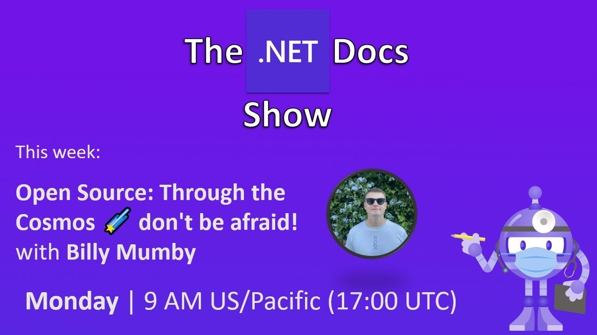

  [](https://www.nuget.org/packages/IEvangelist.Azure.CosmosRepository)  [](https://github.com/IEvangelist/azure-cosmos-dotnet-repository/actions/workflows/code-metrics.yml) [](https://discord.com/invite/qMXrX4shAv)

 <!-- ALL-CONTRIBUTORS-BADGE:START - Do not remove or modify this section -->
[](#contributors-)
<!-- ALL-CONTRIBUTORS-BADGE:END -->

# Azure Cosmos DB Repository .NET SDK

This package wraps the [NuGet: Microsoft.Azure.Cosmos package](https://www.nuget.org/packages/Microsoft.Azure.Cosmos),
exposing a simple dependency-injection enabled `IRepository<T>` interface.

## Documentation

The core library `IEvangelist.Azure.CosmosRepository` and `IEvangelist.Azure.CosmosEventSourcing` both host there own documentation site. See below:

* [`IEvangelist.Azure.CosmosRepository Documentation`](https://ievangelist.github.io/azure-cosmos-dotnet-repository/1-getting-started/)
* [`IEvangelist.Azure.CosmosEventSourcing Documentation`](https://mumby0168.github.io/cosmos-event-sourcing-docs/)


The repository is responsible for all of the create, read, update, and delete (CRUD) operations on objects `where T : Item`. The `Item` type adds
several properties, one which is a globally unique identifier defined as:

```csharp
[JsonProperty("id")]
public string Id { get; set; } = Guid.NewGuid().ToString();
```

Additionally, a type property exists which indicates the subclass name (this is used for filtering implicitly on your behalf):

```csharp
[JsonProperty("type")]
public string Type { get; set; }
```

Finally, a partition key property is used internally to manage partitioning on your behalf. This can optionally be overridden on an item per item basis.

📣 [Azure Cosmos DB - Official Blog](https://devblogs.microsoft.com/cosmosdb/azure-cosmos-db-repository-net-sdk-v-1-0-4)


## Getting started

1. Create an Azure Cosmos DB SQL resource.
1. Obtain the resource connection string from the **Keys** blade, be sure to get a connection string and not the key - these are different. The connection string is a compound key and endpoint URL.
1. Call `AddCosmosRepository`:

   ```csharp
   public void ConfigureServices(IServiceCollection services)
   {
       services.AddCosmosRepository();
   }
   ```

   The optional `setupAction` allows consumers to manually configure the `RepositoryOptions` object:

   ```csharp
   public void ConfigureServices(IServiceCollection services)
   {
       services.AddCosmosRepository(
           options =>
           {
               options.CosmosConnectionString = "< connection string >";
               options.ContainerId = "data-store";
               options.DatabaseId = "samples";
           });
   }
   ```

1. Define your object graph, objects must inherit `Item`, for example:

   ```csharp
   using Microsoft.Azure.CosmosRepository;

   public class Person : Item
   {
       public string FirstName { get; set; }
       public string LastName { get; set; }
   }
   ```

1. Ask for an instance of `IRepository<TItem>`, in this case the `TItem` is `Person`:

   ```csharp
   using Microsoft.Azure.CosmosRepository;

   public class Consumer
   {
       readonly IRepository<Person> _repository;

       public Consumer(IRepository<Person> repository) =>
           _repository = repository;

       // Use the repo...
   }
   ```

1. Perform any of the operations on the `_repository` instance, create `Person` records, update them, read them, or delete.
1. Enjoy!

<!--
Notes for tagging releases:
  https://rehansaeed.com/the-easiest-way-to-version-nuget-packages/#minver

git tag -a 2.1.3 -m "Build v2.1.3"
git push upstream --tags
dotnet build
-->

## Samples

Visit the `Microsoft.Azure.CosmosRepository.Samples` [directory](https://github.com/IEvangelist/azure-cosmos-dotnet-repository/tree/main/samples) for samples on how to use the library with:

- [Azure Functions](https://github.com/IEvangelist/azure-cosmos-dotnet-repository/tree/main/samples/Microsoft.Azure.CosmosRepository/AzureFunctionTier)
- [Services](https://github.com/IEvangelist/azure-cosmos-dotnet-repository/tree/main/samples/Microsoft.Azure.CosmosRepository/ServiceTier)
- [Controllers (web apps)](https://github.com/IEvangelist/azure-cosmos-dotnet-repository/tree/main/samples/Microsoft.Azure.CosmosRepository/WebTier)
- [Paging](https://github.com/IEvangelist/azure-cosmos-dotnet-repository/tree/main/samples/Microsoft.Azure.CosmosRepository/Paging)

## Deep-dive video

[](https://www.youtube.com/watch?v=izdnmBrTweA)

[](https://www.youtube.com/watch?v=_rsVwc4n8Ps)

## Discord

Get extra support on our dedicated Discord channel.

[](https://discord.com/invite/qMXrX4shAv)

## Contributors ✨

Thanks goes to these wonderful people ([emoji key](https://allcontributors.org/docs/en/emoji-key)):

<!-- ALL-CONTRIBUTORS-LIST:START - Do not remove or modify this section -->
<!-- prettier-ignore-start -->
<!-- markdownlint-disable -->
<table>
  <tbody>
    <tr>
      <td align="center" valign="top" width="14.28%"><a href="https://www.microsoft.com"><br /><sub><b>David Pine</b></sub></a><br /><a href="https://github.com/IEvangelist/azure-cosmos-dotnet-repository/commits?author=IEvangelist" title="Code">💻</a> <a href="https://github.com/IEvangelist/azure-cosmos-dotnet-repository/commits?author=IEvangelist" title="Tests">⚠️</a> <a href="#example-IEvangelist" title="Examples">💡</a> <a href="https://github.com/IEvangelist/azure-cosmos-dotnet-repository/pulls?q=is%3Apr+reviewed-by%3AIEvangelist" title="Reviewed Pull Requests">👀</a></td>
      <td align="center" valign="top" width="14.28%"><a href="https://twitter.com/invvard"><br /><sub><b>Invvard</b></sub></a><br /><a href="https://github.com/IEvangelist/azure-cosmos-dotnet-repository/commits?author=Invvard" title="Tests">⚠️</a> <a href="https://github.com/IEvangelist/azure-cosmos-dotnet-repository/commits?author=Invvard" title="Code">💻</a></td>
      <td align="center" valign="top" width="14.28%"><a href="http://richmercer.com/"><br /><sub><b>Richard Mercer</b></sub></a><br /><a href="https://github.com/IEvangelist/azure-cosmos-dotnet-repository/commits?author=RichMercer" title="Code">💻</a></td>
      <td align="center" valign="top" width="14.28%"><a href="http://www.planetgeek.ch"><br /><sub><b>Daniel Marbach</b></sub></a><br /><a href="https://github.com/IEvangelist/azure-cosmos-dotnet-repository/commits?author=danielmarbach" title="Code">💻</a></td>
      <td align="center" valign="top" width="14.28%"><a href="https://manuel.sidler.io"><br /><sub><b>Manuel Sidler</b></sub></a><br /><a href="https://github.com/IEvangelist/azure-cosmos-dotnet-repository/commits?author=manuelsidler" title="Code">💻</a></td>
      <td align="center" valign="top" width="14.28%"><a href="http://daveabrock.com"><br /><sub><b>Dave Brock</b></sub></a><br /><a href="https://github.com/IEvangelist/azure-cosmos-dotnet-repository/commits?author=daveabrock" title="Documentation">📖</a> <a href="https://github.com/IEvangelist/azure-cosmos-dotnet-repository/commits?author=daveabrock" title="Code">💻</a></td>
      <td align="center" valign="top" width="14.28%"><a href="http://www.develoopers.co.uk"><br /><sub><b>Cagdas Erman Afacan</b></sub></a><br /><a href="https://github.com/IEvangelist/azure-cosmos-dotnet-repository/commits?author=afacanerman" title="Code">💻</a> <a href="#example-afacanerman" title="Examples">💡</a></td>
    </tr>
    <tr>
      <td align="center" valign="top" width="14.28%"><a href="https://github.com/dcuccia"><br /><sub><b>dcuccia</b></sub></a><br /><a href="https://github.com/IEvangelist/azure-cosmos-dotnet-repository/commits?author=dcuccia" title="Code">💻</a></td>
      <td align="center" valign="top" width="14.28%"><a href="https://github.com/VeryCautious"><br /><sub><b>VeryCautious</b></sub></a><br /><a href="https://github.com/IEvangelist/azure-cosmos-dotnet-repository/commits?author=VeryCautious" title="Code">💻</a> <a href="https://github.com/IEvangelist/azure-cosmos-dotnet-repository/commits?author=VeryCautious" title="Tests">⚠️</a></td>
      <td align="center" valign="top" width="14.28%"><a href="https://github.com/mumby0168"><br /><sub><b>Billy Mumby</b></sub></a><br /><a href="https://github.com/IEvangelist/azure-cosmos-dotnet-repository/commits?author=mumby0168" title="Code">💻</a> <a href="https://github.com/IEvangelist/azure-cosmos-dotnet-repository/commits?author=mumby0168" title="Documentation">📖</a> <a href="#ideas-mumby0168" title="Ideas, Planning, & Feedback">🤔</a></td>
      <td align="center" valign="top" width="14.28%"><a href="https://github.com/zhangzunke"><br /><sub><b>Michael Zhang</b></sub></a><br /><a href="#ideas-zhangzunke" title="Ideas, Planning, & Feedback">🤔</a> <a href="https://github.com/IEvangelist/azure-cosmos-dotnet-repository/commits?author=zhangzunke" title="Code">💻</a></td>
      <td align="center" valign="top" width="14.28%"><a href="http://www.roji.org"><br /><sub><b>Shay Rojansky</b></sub></a><br /><a href="https://github.com/IEvangelist/azure-cosmos-dotnet-repository/pulls?q=is%3Apr+reviewed-by%3Aroji" title="Reviewed Pull Requests">👀</a></td>
      <td align="center" valign="top" width="14.28%"><a href="https://www.linkedin.com/in/junior-wellemen-de-macedo-mba-mcp-ms-49282643/?locale=en_US"><br /><sub><b>Junior Macedo</b></sub></a><br /><a href="https://github.com/IEvangelist/azure-cosmos-dotnet-repository/commits?author=jrwmacedo" title="Code">💻</a> <a href="#ideas-jrwmacedo" title="Ideas, Planning, & Feedback">🤔</a></td>
      <td align="center" valign="top" width="14.28%"><a href="http://emrekara.me"><br /><sub><b>Emre KARA</b></sub></a><br /><a href="https://github.com/IEvangelist/azure-cosmos-dotnet-repository/commits?author=emrekara37" title="Code">💻</a></td>
    </tr>
    <tr>
      <td align="center" valign="top" width="14.28%"><a href="http://www.bradwestness.com"><br /><sub><b>Brad Westness</b></sub></a><br /><a href="https://github.com/IEvangelist/azure-cosmos-dotnet-repository/pulls?q=is%3Apr+reviewed-by%3Abradwestness" title="Reviewed Pull Requests">👀</a></td>
      <td align="center" valign="top" width="14.28%"><a href="https://github.com/BeigeBadger"><br /><sub><b>Matt Stannett</b></sub></a><br /><a href="https://github.com/IEvangelist/azure-cosmos-dotnet-repository/commits?author=BeigeBadger" title="Code">💻</a> <a href="https://github.com/IEvangelist/azure-cosmos-dotnet-repository/commits?author=BeigeBadger" title="Documentation">📖</a> <a href="https://github.com/IEvangelist/azure-cosmos-dotnet-repository/commits?author=BeigeBadger" title="Tests">⚠️</a></td>
      <td align="center" valign="top" width="14.28%"><a href="https://github.com/mustafarabie"><br /><sub><b>mustafarabie</b></sub></a><br /><a href="https://github.com/IEvangelist/azure-cosmos-dotnet-repository/commits?author=mustafarabie" title="Code">💻</a> <a href="https://github.com/IEvangelist/azure-cosmos-dotnet-repository/commits?author=mustafarabie" title="Tests">⚠️</a></td>
      <td align="center" valign="top" width="14.28%"><a href="https://www.linkedin.com/in/robertobennett"><br /><sub><b>Robert Bennett</b></sub></a><br /><a href="https://github.com/IEvangelist/azure-cosmos-dotnet-repository/commits?author=robertbennett1998" title="Tests">⚠️</a> <a href="https://github.com/IEvangelist/azure-cosmos-dotnet-repository/commits?author=robertbennett1998" title="Code">💻</a></td>
      <td align="center" valign="top" width="14.28%"><a href="https://github.com/Rabosa616"><br /><sub><b>Rabosa616</b></sub></a><br /><a href="https://github.com/IEvangelist/azure-cosmos-dotnet-repository/commits?author=Rabosa616" title="Code">💻</a> <a href="https://github.com/IEvangelist/azure-cosmos-dotnet-repository/commits?author=Rabosa616" title="Tests">⚠️</a> <a href="https://github.com/IEvangelist/azure-cosmos-dotnet-repository/commits?author=Rabosa616" title="Documentation">📖</a></td>
      <td align="center" valign="top" width="14.28%"><a href="http://www.adamstorr.co.uk"><br /><sub><b>Adam Storr</b></sub></a><br /><a href="https://github.com/IEvangelist/azure-cosmos-dotnet-repository/commits?author=WestDiscGolf" title="Code">💻</a> <a href="https://github.com/IEvangelist/azure-cosmos-dotnet-repository/commits?author=WestDiscGolf" title="Tests">⚠️</a></td>
      <td align="center" valign="top" width="14.28%"><a href="https://www.linkedin.com/in/krbenton"><br /><sub><b>Kevin Benton</b></sub></a><br /><a href="https://github.com/IEvangelist/azure-cosmos-dotnet-repository/commits?author=kevin-benton" title="Code">💻</a> <a href="https://github.com/IEvangelist/azure-cosmos-dotnet-repository/commits?author=kevin-benton" title="Tests">⚠️</a></td>
    </tr>
    <tr>
      <td align="center" valign="top" width="14.28%"><a href="https://github.com/filipmhpersson"><br /><sub><b>Filip Persson</b></sub></a><br /><a href="https://github.com/IEvangelist/azure-cosmos-dotnet-repository/commits?author=filipmhpersson" title="Code">💻</a> <a href="https://github.com/IEvangelist/azure-cosmos-dotnet-repository/commits?author=filipmhpersson" title="Tests">⚠️</a></td>
      <td align="center" valign="top" width="14.28%"><a href="https://www.fffffatah.tech"><br /><sub><b>A.F.M. Noorullah</b></sub></a><br /><a href="https://github.com/IEvangelist/azure-cosmos-dotnet-repository/commits?author=fffffatah" title="Documentation">📖</a></td>
      <td align="center" valign="top" width="14.28%"><a href="https://github.com/idormenco"><br /><sub><b>Ion Dormenco</b></sub></a><br /><a href="https://github.com/IEvangelist/azure-cosmos-dotnet-repository/commits?author=idormenco" title="Code">💻</a></td>
      <td align="center" valign="top" width="14.28%"><a href="https://github.com/MO2k4"><br /><sub><b>Martin Oehlert</b></sub></a><br /><a href="https://github.com/IEvangelist/azure-cosmos-dotnet-repository/commits?author=MO2k4" title="Code">💻</a></td>
      <td align="center" valign="top" width="14.28%"><a href="http://evancjohnson.com"><br /><sub><b>Evan Johnson</b></sub></a><br /><a href="https://github.com/IEvangelist/azure-cosmos-dotnet-repository/commits?author=evancjohnson" title="Code">💻</a> <a href="https://github.com/IEvangelist/azure-cosmos-dotnet-repository/commits?author=evancjohnson" title="Tests">⚠️</a></td>
      <td align="center" valign="top" width="14.28%"><a href="https://github.com/philip-reed"><br /><sub><b>Phil Reed</b></sub></a><br /><a href="https://github.com/IEvangelist/azure-cosmos-dotnet-repository/commits?author=philip-reed" title="Tests">⚠️</a> <a href="https://github.com/IEvangelist/azure-cosmos-dotnet-repository/commits?author=philip-reed" title="Code">💻</a> <a href="https://github.com/IEvangelist/azure-cosmos-dotnet-repository/commits?author=philip-reed" title="Documentation">📖</a></td>
      <td align="center" valign="top" width="14.28%"><a href="https://github.com/dnitsch"><br /><sub><b>dnitsch</b></sub></a><br /><a href="#ideas-dnitsch" title="Ideas, Planning, & Feedback">🤔</a></td>
    </tr>
    <tr>
      <td align="center" valign="top" width="14.28%"><a href="https://github.com/SeanFarrow"><br /><sub><b>Sean Farrow</b></sub></a><br /><a href="#ideas-SeanFarrow" title="Ideas, Planning, & Feedback">🤔</a></td>
      <td align="center" valign="top" width="14.28%"><a href="https://github.com/stormbringer766"><br /><sub><b>stormbringer766</b></sub></a><br /><a href="https://github.com/IEvangelist/azure-cosmos-dotnet-repository/commits?author=stormbringer766" title="Code">💻</a> <a href="https://github.com/IEvangelist/azure-cosmos-dotnet-repository/commits?author=stormbringer766" title="Tests">⚠️</a></td>
      <td align="center" valign="top" width="14.28%"><a href="https://github.com/joelsteventurner"><br /><sub><b>Joel Turner</b></sub></a><br /><a href="https://github.com/IEvangelist/azure-cosmos-dotnet-repository/commits?author=joelsteventurner" title="Code">💻</a></td>
      <td align="center" valign="top" width="14.28%"><a href="https://github.com/r0ss88"><br /><sub><b>Ross</b></sub></a><br /><a href="https://github.com/IEvangelist/azure-cosmos-dotnet-repository/issues?q=author%3Ar0ss88" title="Bug reports">🐛</a></td>
      <td align="center" valign="top" width="14.28%"><a href="https://github.com/mrfootoyou"><br /><sub><b>John Belcher</b></sub></a><br /><a href="https://github.com/IEvangelist/azure-cosmos-dotnet-repository/commits?author=mrfootoyou" title="Documentation">📖</a></td>
      <td align="center" valign="top" width="14.28%"><a href="https://github.com/victormarante"><br /><sub><b>Victor Marante</b></sub></a><br /><a href="https://github.com/IEvangelist/azure-cosmos-dotnet-repository/commits?author=victormarante" title="Code">💻</a></td>
      <td align="center" valign="top" width="14.28%"><a href="https://github.com/mateuszkumpf"><br /><sub><b>Mateusz Kumpf</b></sub></a><br /><a href="https://github.com/IEvangelist/azure-cosmos-dotnet-repository/commits?author=mateuszkumpf" title="Code">💻</a> <a href="https://github.com/IEvangelist/azure-cosmos-dotnet-repository/commits?author=mateuszkumpf" title="Tests">⚠️</a></td>
    </tr>
  </tbody>
</table>

<!-- markdownlint-restore -->
<!-- prettier-ignore-end -->

<!-- ALL-CONTRIBUTORS-LIST:END -->

This project follows the [all-contributors](https://github.com/all-contributors/all-contributors) specification. Contributions of any kind welcome!
