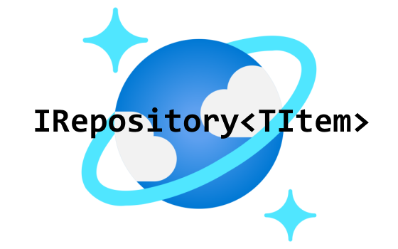
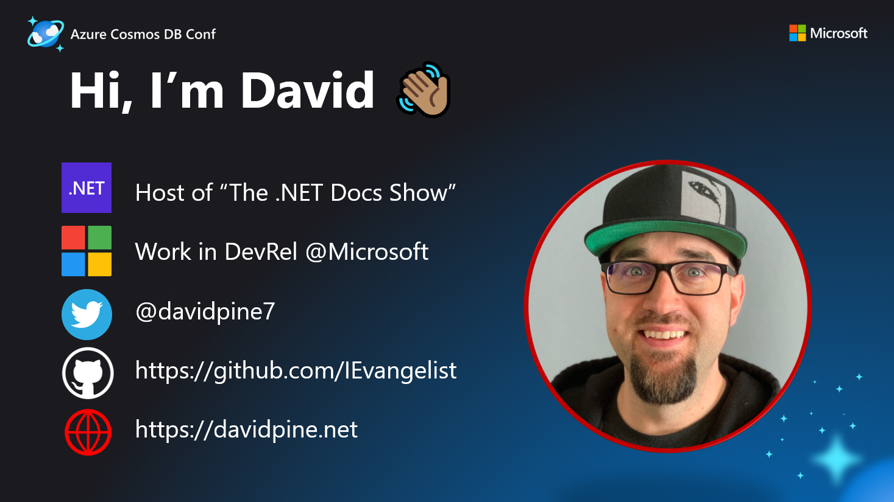

  [](https://www.nuget.org/packages/IEvangelist.Azure.CosmosRepository) [](https://github.com/IEvangelist/azure-cosmos-dotnet-repository/actions/workflows/code-metrics.yml) [](https://discord.com/invite/qMXrX4shAv)

 <!-- ALL-CONTRIBUTORS-BADGE:START - Do not remove or modify this section -->
[](#contributors-)
<!-- ALL-CONTRIBUTORS-BADGE:END -->

# Azure Cosmos DB Repository .NET SDK

This package wraps the [NuGet: Microsoft.Azure.Cosmos package](https://www.nuget.org/packages/Microsoft.Azure.Cosmos),
exposing a simple dependency-injection enabled `IRepository<T>` interface.



The repository is responsible for all of the create, read, update, and delete (CRUD) operations on objects `where T : Item`. The `Item` type adds
several properties, one which is a globally unique identifier defined as:

```csharp
[JsonProperty("id")]
public string Id { get; set; } = Guid.NewGuid().ToString();
```

Additionally, a type property exists which indicates the subclass name (this is used for filtering implicitly on your behalf):

```csharp
[JsonProperty("type")]
public string Type { get; set; }
```

Finally, a partition key property is used internally to manage partitioning on your behalf. This can optionally be overridden on an item per item basis.

📣 [Azure Cosmos DB - Official Blog](https://devblogs.microsoft.com/cosmosdb/azure-cosmos-db-repository-net-sdk-v-1-0-4)

## Getting started

1. Create an Azure Cosmos DB SQL resource.
1. Obtain the resource connection string from the **Keys** blade, be sure to get a connection string and not the key - these are different. The connection string is a compound key and endpoint URL.
1. Call `AddCosmosRepository`:

   ```csharp
   public void ConfigureServices(IServiceCollection services)
   {
       services.AddCosmosRepository();
   }
   ```

   The optional `setupAction` allows consumers to manually configure the `RepositoryOptions` object:

   ```csharp
   public void ConfigureServices(IServiceCollection services)
   {
       services.AddCosmosRepository(
           options =>
           {
               options.CosmosConnectionString = "< connection string >";
               options.ContainerId = "data-store";
               options.DatabaseId = "samples";
           });
   }
   ```

1. Define your object graph, objects must inherit `Item`, for example:

   ```csharp
   using Microsoft.Azure.CosmosRepository;

   public class Person : Item
   {
       public string FirstName { get; set; }
       public string LastName { get; set; }
   }
   ```

1. Ask for an instance of `IRepository<TItem>`, in this case the `TItem` is `Person`:

   ```csharp
   using Microsoft.Azure.CosmosRepository;

   public class Consumer
   {
       readonly IRepository<Person> _repository;

       public Consumer(IRepository<Person> repository) =>
           _repository = repository;

       // Use the repo...
   }
   ```

1. Perform any of the operations on the `_repository` instance, create `Person` records, update them, read them, or delete.
1. Enjoy!

### Configuration

When `OptimizeBandwidth` is `true` (its default value), the repository SDK reduces networking and
CPU load by not sending the resource back over the network and serializing it to the client. This is specific to writes,
such as create, update, and delete. For more information, see [Optimizing bandwidth in the Azure Cosmos DB .NET SDK](https://devblogs.microsoft.com/cosmosdb/enable-content-response-on-write).

There is much debate with how to structure your database and corresponding containers. Many developers with relational
database design experience might prefer to have a single container per item type, while others understand that Azure Cosmos DB
will handle things correctly regardless. By default, the `ContainerPerItemType` option is `false` and
all items are persisted into the same container. However, when it is `true`, each distinct subclass of
`Item` gets its own container named by the class itself.

#### Well-known keys

Depending on the [.NET configuration provider](https://docs.microsoft.com/dotnet/core/extensions/configuration-providers?WC.m_id=dapine) your app is using, there are several well-known keys that map to the repository options that configure your usage of the repository SDK. When using environment variables, such as those in Azure App Service configuration or Azure Key Vault secrets, the following keys map to the `RepositoryOptions` instance:

| Key                                                           | Data type                  | Default value                          |
| ------------------------------------------------------------- | -------------------------- | -------------------------------------- |
| RepositoryOptions\_\_CosmosConnectionString                   | string                     | `null`                                 |
| RepositoryOptions\_\_AccountEndpoint                          | string                     | `null`                                 |
| RepositoryOptions\_\_DatabaseId                               | string                     | `"database"`                           |
| RepositoryOptions\_\_ContainerId                              | string                     | `"container"`                          |
| RepositoryOptions\_\_OptimizeBandwidth                        | boolean                    | `true`                                 |
| RepositoryOptions\_\_ContainerPerItemType                     | boolean                    | `false`                                |
| RepositoryOptions\_\_AllowBulkExecution                       | boolean                    | `false`                                |
| RepositoryOptions**SerializationOptions**IgnoreNullValues     | boolean                    | `false`                                |
| RepositoryOptions**SerializationOptions**Indented             | boolean                    | `false`                                |
| RepositoryOptions**SerializationOptions**PropertyNamingPolicy | CosmosPropertyNamingPolicy | `CosmosPropertyNamingPolicy.CamelCase` |

#### Example `appsettings.json`

```json
{
  "Logging": {
    "LogLevel": {
      "Default": "Information",
      "Microsoft": "Warning",
      "Microsoft.Hosting.Lifetime": "Information"
    }
  },
  "AllowedHosts": "*",
  "RepositoryOptions": {
    "CosmosConnectionString": "<Your-CosmosDB-ConnectionString>",
    "AccountEndpoint": "<Your-CosmosDB-URI>"
    "DatabaseId": "<Your-CosmosDB-DatabaseName>",
    "ContainerId": "<Your-CosmosDB-ContainerName>",
    "OptimizeBandwidth": true,
    "ContainerPerItemType": true,
    "AllowBulkExecution": true,
    "SerializationOptions": {
      "IgnoreNullValues": true,
     "PropertyNamingPolicy": "CamelCase"
    }
  }
}
```

For more information, see [JSON configuration provider](https://docs.microsoft.com/dotnet/core/extensions/configuration-providers?WC.m_id=dapine#json-configuration-provider).

#### Example `appsettings.json` with Azure Functions

```json
{
  "Logging": {
    "LogLevel": {
      "Default": "Information",
      "Microsoft": "Warning",
      "Microsoft.Hosting.Lifetime": "Information"
    }
  },
  "AllowedHosts": "*",
  "Values": {
    "RepositoryOptions:CosmosConnectionString": "<Your-CosmosDB-ConnectionString>",
    "RepositoryOptions:AccountEndpoint": "<Your-CosmosDB-URI>",
    "RepositoryOptions:DatabaseId": "<Your-CosmosDB-DatabaseName>",
    "RepositoryOptions:ContainerId": "<Your-CosmosDB-ContainerName>",
    "RepositoryOptions:OptimizeBandwidth": true,
    "RepositoryOptions:ContainerPerItemType": true,
    "RepositoryOptions:AllowBulkExecution": true,
    "RepositoryOptions:SerializationOptions:IgnoreNullValues": true,
    "RepositoryOptions:SerializationOptions:PropertyNamingPolicy": "CamelCase"
  }
}
```

For more information, see [Customizing configuration sources](https://docs.microsoft.com/azure/azure-functions/functions-dotnet-dependency-injection?WC.m_id=dapine#customizing-configuration-sources).

#### Authenticating using an identity

The Azure Cosmos DB .NET SDK also supports authentication using identities, which are considered superior from an audit and granularity of permissions perspective. Authenticating using a connection string essentially provides full access to perform operations within the [data plane](https://docs.microsoft.com/en-us/azure/cosmos-db/role-based-access-control)
of your Cosmos DB Account. More information on the Azure control plane and data plane is available [here](https://docs.microsoft.com/en-us/azure/azure-resource-manager/management/control-plane-and-data-plane).

This libary also supports authentication using an identity. To authenticate using an identity (User, Group, Application Registration, or Managed Identity) you will need to set the `AccountEndpoint` and `TokenCredential` options that are available on the `RepositoryOptions` class.

In a basic scenario, there are three steps that need to be completed:

1. If the identity that you would like to use, does not exist in Azure Active Directory, create it now.

1. Use the Azure CLI to [assign](https://docs.microsoft.com/en-us/cli/azure/cosmosdb/sql/role/assignment?view=azure-cli-latest#az_cosmosdb_sql_role_assignment_create) the appropriate role to your identity at the desired scope. - In most cases, using the [built-in roles](https://docs.microsoft.com/en-us/azure/cosmos-db/how-to-setup-rbac#built-in-role-definitions) will be sufficient. However, there is support for creating custom role definitions using the Azure CLI, you can read more on this [here](https://docs.microsoft.com/en-us/azure/cosmos-db/how-to-setup-rbac#role-definitions).
1. Configure your application using the `AddCosmosRepository` method in your `Startup.cs` file:

   ```csharp
   using Azure.Identity;

   public void ConfigureServices(IServiceCollection services)
   {
       DefaultAzureCredential credential = new();

       services.AddCosmosRepository(
           options =>
           {
               options.TokenCredential = credential;
               options.AccountEndpoint = "< account endpoint URI >";
               options.ContainerId = "data-store";
               options.DatabaseId = "samples";
           });
   }
   ```

The example above is using the `DefaultAzureCredential` object provided by the [Azure Identity](https://www.nuget.org/packages/Azure.Identity) NuGet package, which provides seamless integration with Azure Active Directory. More information on this package is available [here](https://docs.microsoft.com/en-us/dotnet/api/overview/azure/identity-readme).

## Advanced partitioning strategy

As a consumer of Azure Cosmos DB, you can choose how to partition your data. By default, this repository SDK will partition items using their `Item.Id` value as the `/id` partition in the storage container. However, you can override this default behavior by:

1. Declaratively specifying the partition key path with `PartitionKeyPathAttribute`
1. Override the `Item.GetPartitionKeyValue()` method
1. Ensure the the property value of the composite or synthetic key is serialized to match the partition key path
1. Set `RepositoryOptions__ContainerPerItemType` to `true`, to ensure that your item with explicit partitioning is correctly maintained

As an example, considering the following:

```csharp
using Microsoft.Azure.CosmosRepository;
using Microsoft.Azure.CosmosRepository.Attributes;
using Newtonsoft.Json;
using System;

namespace Example
{
    [PartitionKeyPath("/synthetic")]
    public class Person : Item
    {
        public string FirstName { get; set; } = null!;
        public string? MiddleName { get; set; }
        public string LastName { get; set; } = null!;

        [JsonProperty("synthetic")]
        public string SyntheticPartitionKey =>
            $"{FirstName}-{LastName}"; // Also known as a "composite key".

        protected override string GetPartitionKeyValue() => SyntheticPartitionKey;
    }
}
```

<!--
Notes for tagging releases:
  https://rehansaeed.com/the-easiest-way-to-version-nuget-packages/#minver

git tag -a 2.1.3 -m "Build v2.1.3"
git push upstream --tags
dotnet build
-->

## In-memory Repository

This library also includes an in-memory version of `IRepository<T>`. To use it swap out the normal
`services.AddCosmosRepository()` for
`services.AddInMemoryCosmosRepository()` and have all of your items stored in memory. This is a great tool for running integration tests using a package such as `Microsoft.AspNetCore.Mvc.Testing`, and not having to incur the cost of data stored in an Azure Cosmos DB resource.

## Optimistic Concurrency Control with Etags

The default repository now supports etags and will pass them when `IItemWithEtag` is implemented correctly or the base classes `EtagItem` or `FullItem` are used. The etag check is enforced on all updates when `TItem` is of the correct type. It can however be bypassed by setting the `ignoreEtag` optional parameter in the relevant async methods. The InMemory repository also supports OCC with Etags. The [OptimisticCurrencyControl sample](https://github.com/IEvangelist/azure-cosmos-dotnet-repository/tree/main/Microsoft.Azure.CosmosRepository.Samples/OptimisticConcurrencyControl) shows these features.

### Getting the new etag

When creating a new object, if storing in memory, it is important to store the result from the create call to ensure you have the correct etag for future updated.

For example your code should look something like this:

```csharp
TItem currentItem = new TItem(...);
currentItem = _repository.CreateAsync(currentItem);
```

### Sequential updates

When doing sequential updates to the same item it is important to use the result from the update method (when OptimizeBandwith is false) or refetch the updated data each time (when OptimizeBandwith is true) otherwise the etag value will not be updated. The following code shows what to do in each case:

#### Optimize Bandwith Off

```csharp
TItem currentItem = _repository.CreateAsync(itemConfig);
currentItem = _repository.UpdateAsync(currentItem);
currentItem = _repository.UpdateAsync(currentItem);
```

#### Optimize Bandwith On

```csharp
TItem currentItem = _repository.CreateAsync(itemConfig);
_repository.UpdateAsync(currentItem);
currentItem = _repository.GetAsync(currentItem.Id);
_repository.UpdateAsync(currentItem);
currentItem = _repository.GetAsync(currentItem);
currentItem = _repository.UpdateAsync(currentItem);
```

### Catching mismatched etag errors

The following code shows how to catch the error when the etags do not match.

```csharp
  try
  {
      currentBankAccount = await repository.UpdateAsync(currentBankAccount);
      Console.WriteLine($"Updated bank account: {currentBankAccount}.");
  }
  catch (CosmosException exception) when (exception.StatusCode == HttpStatusCode.PreconditionFailed)
  {
      Console.WriteLine("Failed to update balance as the etags did not match.");
  }
```

### Ignoring the etag

The following code shows how to ignore the etag when doing an update.

```csharp
await repository.UpdateAsync(currentBankAccount, ignoreEtag: true);
```

### Passing the etag to a patch update

The following code shows how to pass the etag when doing a update to specific properties.

```csharp
await repository.UpdateAsync(currentBankAccount.Id,
  builder => builder.Replace(account => account.Balance, currentBankAccount.Balance - 250), etag: currentBankAccount.Etag);
```

## Time To Live

The time to live property can be set at both an item and container level. At a container level this can be done through the container options builder:

```csharp
options.ContainerBuilder.Configure<BankAccount>(
  x => x.WithContainerDefaultTimeToLive(TimeSpan.FromHours(2)));
```

In the above example the container would have a default item lifespan of 2 hours. This can be overriden at the item level by using the `TimeToLive` property when correctly implemented. This is available through the `FullItem` and `TimeToLiveItem` base classes. The example below shows this been overriden so the item has a lifespan of 4 hours rather than the default of 2:

```csharp
BankAccount currentBankAccount = await repository.CreateAsync(
  new BankAccount()
    {
        Name = "Current Account",
        Balance = 500.0,
        TimeToLive = TimeSpan.FromHours(4)
    });
```

If you didn't want that specific item to ever expire the following code can be used:

```csharp
BankAccount currentBankAccount = await repository.CreateAsync(
  new BankAccount()
    {
        Name = "Current Account",
        Balance = 500.0,
        TimeToLive = TimeSpan.FromSeconds(-1)
    });
```

The demo `BankAccount` class can be found in the [OptimisticCurrencyControl sample](https://github.com/IEvangelist/azure-cosmos-dotnet-repository/tree/main/Microsoft.Azure.CosmosRepository.Samples/OptimisticConcurrencyControl) and its implementation looks like the following:

```csharp
using Microsoft.Azure.CosmosRepository;
using Microsoft.Azure.CosmosRepository.Attributes;

namespace OptimisticConcurrencyControl;

[Container("accounts")]
[PartitionKeyPath("/id")]
public class BankAccount : FullItem
{
    public string Name { get; set; } = string.Empty;
    public double Balance { get; set; }

    public void Withdraw(double amount)
    {
        if (Balance - amount < 0.0) throw new InvalidOperationException("Cannot go overdrawn");

        Balance -= amount;
    }

    public void Deposit(double amount)
    {
        Balance += amount;
    }

    public override string ToString() =>
        $"Account (Name = {Name}, Balance = {Balance}, Etag = {Etag})";
}
```

This [page](https://docs.microsoft.com/en-us/azure/cosmos-db/sql/time-to-live) goes into more detail about the various combinations.

## Created and Last Updated

The last updated value is retrieved from the \_ts property that Cosmos DB sets; as documented [here](https://docs.microsoft.com/en-us/rest/api/cosmos-db/documents#:~:text=the%20document%20resource.-,_ts,updated%20timestamp%20of%20the%20resource.%20The%20value%20is%20a%20timestamp.,-_self). This property is deserialised and is available in the raw seconds (`LastUpdatedTimeRaw`) since epoch and a human readable format (`LastUpdatedTimeUtc`). Both the base classes `FullItem` and `TimeStampedItem` contain these properties.

The `CreatedTimeUtc` time property available in both the base classes `FullItem` and `TimeStampedItem` is set when `CreateAsync` is called on the repository. However, this property can be set prior to calling `CreateAsync` in which case it wont be overwritten; allowing you to set your own `CreatedTimeUtc` value. This does mean that when using existing date the `CreatedTimeUtc` property will be null.

## Samples

Visit the `Microsoft.Azure.CosmosRepository.Samples` [directory](https://github.com/IEvangelist/azure-cosmos-dotnet-repository/tree/main/Microsoft.Azure.CosmosRepository.Samples) for samples on how to use the library with:

- [Azure Functions](https://github.com/IEvangelist/azure-cosmos-dotnet-repository/tree/main/Microsoft.Azure.CosmosRepository.Samples/AzureFunctionTier)
- [Services](https://github.com/IEvangelist/azure-cosmos-dotnet-repository/tree/main/Microsoft.Azure.CosmosRepository.Samples/ServiceTier)
- [Controllers (web apps)](https://github.com/IEvangelist/azure-cosmos-dotnet-repository/tree/main/Microsoft.Azure.CosmosRepository.Samples/WebTier)
- [Paging](https://github.com/IEvangelist/azure-cosmos-dotnet-repository/tree/main/Microsoft.Azure.CosmosRepository.Samples/Paging)
## Deep-dive video

[](https://www.youtube.com/watch?v=izdnmBrTweA)

## Discord

Get extra support on our dedicated Discord channel.

[](https://discord.com/invite/qMXrX4shAv)

## Contributors ✨

Thanks goes to these wonderful people ([emoji key](https://allcontributors.org/docs/en/emoji-key)):

<!-- ALL-CONTRIBUTORS-LIST:START - Do not remove or modify this section -->
<!-- prettier-ignore-start -->
<!-- markdownlint-disable -->
<table>
  <tr>
    <td align="center"><a href="https://www.microsoft.com"><br /><sub><b>David Pine</b></sub></a><br /><a href="https://github.com/IEvangelist/azure-cosmos-dotnet-repository/commits?author=IEvangelist" title="Code">💻</a> <a href="https://github.com/IEvangelist/azure-cosmos-dotnet-repository/commits?author=IEvangelist" title="Tests">⚠️</a> <a href="#example-IEvangelist" title="Examples">💡</a> <a href="https://github.com/IEvangelist/azure-cosmos-dotnet-repository/pulls?q=is%3Apr+reviewed-by%3AIEvangelist" title="Reviewed Pull Requests">👀</a></td>
    <td align="center"><a href="https://twitter.com/invvard"><br /><sub><b>Invvard</b></sub></a><br /><a href="https://github.com/IEvangelist/azure-cosmos-dotnet-repository/commits?author=Invvard" title="Tests">⚠️</a> <a href="https://github.com/IEvangelist/azure-cosmos-dotnet-repository/commits?author=Invvard" title="Code">💻</a></td>
    <td align="center"><a href="http://richmercer.com/"><br /><sub><b>Richard Mercer</b></sub></a><br /><a href="https://github.com/IEvangelist/azure-cosmos-dotnet-repository/commits?author=RichMercer" title="Code">💻</a></td>
    <td align="center"><a href="http://www.planetgeek.ch"><br /><sub><b>Daniel Marbach</b></sub></a><br /><a href="https://github.com/IEvangelist/azure-cosmos-dotnet-repository/commits?author=danielmarbach" title="Code">💻</a></td>
    <td align="center"><a href="https://manuel.sidler.io"><br /><sub><b>Manuel Sidler</b></sub></a><br /><a href="https://github.com/IEvangelist/azure-cosmos-dotnet-repository/commits?author=manuelsidler" title="Code">💻</a></td>
    <td align="center"><a href="http://daveabrock.com"><br /><sub><b>Dave Brock</b></sub></a><br /><a href="https://github.com/IEvangelist/azure-cosmos-dotnet-repository/commits?author=daveabrock" title="Documentation">📖</a> <a href="https://github.com/IEvangelist/azure-cosmos-dotnet-repository/commits?author=daveabrock" title="Code">💻</a></td>
    <td align="center"><a href="http://www.develoopers.co.uk"><br /><sub><b>Cagdas Erman Afacan</b></sub></a><br /><a href="https://github.com/IEvangelist/azure-cosmos-dotnet-repository/commits?author=afacanerman" title="Code">💻</a> <a href="#example-afacanerman" title="Examples">💡</a></td>
  </tr>
  <tr>
    <td align="center"><a href="https://github.com/dcuccia"><br /><sub><b>dcuccia</b></sub></a><br /><a href="https://github.com/IEvangelist/azure-cosmos-dotnet-repository/commits?author=dcuccia" title="Code">💻</a></td>
    <td align="center"><a href="https://github.com/VeryCautious"><br /><sub><b>VeryCautious</b></sub></a><br /><a href="https://github.com/IEvangelist/azure-cosmos-dotnet-repository/commits?author=VeryCautious" title="Code">💻</a> <a href="https://github.com/IEvangelist/azure-cosmos-dotnet-repository/commits?author=VeryCautious" title="Tests">⚠️</a></td>
    <td align="center"><a href="https://github.com/mumby0168"><br /><sub><b>Billy Mumby</b></sub></a><br /><a href="https://github.com/IEvangelist/azure-cosmos-dotnet-repository/commits?author=mumby0168" title="Code">💻</a> <a href="https://github.com/IEvangelist/azure-cosmos-dotnet-repository/commits?author=mumby0168" title="Documentation">📖</a> <a href="#ideas-mumby0168" title="Ideas, Planning, & Feedback">🤔</a></td>
    <td align="center"><a href="https://github.com/zhangzunke"><br /><sub><b>Michael Zhang</b></sub></a><br /><a href="#ideas-zhangzunke" title="Ideas, Planning, & Feedback">🤔</a> <a href="https://github.com/IEvangelist/azure-cosmos-dotnet-repository/commits?author=zhangzunke" title="Code">💻</a></td>
    <td align="center"><a href="http://www.roji.org"><br /><sub><b>Shay Rojansky</b></sub></a><br /><a href="https://github.com/IEvangelist/azure-cosmos-dotnet-repository/pulls?q=is%3Apr+reviewed-by%3Aroji" title="Reviewed Pull Requests">👀</a></td>
    <td align="center"><a href="https://www.linkedin.com/in/junior-wellemen-de-macedo-mba-mcp-ms-49282643/?locale=en_US"><br /><sub><b>Junior Macedo</b></sub></a><br /><a href="https://github.com/IEvangelist/azure-cosmos-dotnet-repository/commits?author=jrwmacedo" title="Code">💻</a> <a href="#ideas-jrwmacedo" title="Ideas, Planning, & Feedback">🤔</a></td>
    <td align="center"><a href="http://emrekara.me"><br /><sub><b>Emre KARA</b></sub></a><br /><a href="https://github.com/IEvangelist/azure-cosmos-dotnet-repository/commits?author=emrekara37" title="Code">💻</a></td>
  </tr>
  <tr>
    <td align="center"><a href="http://www.bradwestness.com"><br /><sub><b>Brad Westness</b></sub></a><br /><a href="https://github.com/IEvangelist/azure-cosmos-dotnet-repository/pulls?q=is%3Apr+reviewed-by%3Abradwestness" title="Reviewed Pull Requests">👀</a></td>
    <td align="center"><a href="https://github.com/BeigeBadger"><br /><sub><b>Matt Stannett</b></sub></a><br /><a href="https://github.com/IEvangelist/azure-cosmos-dotnet-repository/commits?author=BeigeBadger" title="Code">💻</a> <a href="https://github.com/IEvangelist/azure-cosmos-dotnet-repository/commits?author=BeigeBadger" title="Documentation">📖</a> <a href="https://github.com/IEvangelist/azure-cosmos-dotnet-repository/commits?author=BeigeBadger" title="Tests">⚠️</a></td>
    <td align="center"><a href="https://github.com/mustafarabie"><br /><sub><b>mustafarabie</b></sub></a><br /><a href="https://github.com/IEvangelist/azure-cosmos-dotnet-repository/commits?author=mustafarabie" title="Code">💻</a> <a href="https://github.com/IEvangelist/azure-cosmos-dotnet-repository/commits?author=mustafarabie" title="Tests">⚠️</a></td>
    <td align="center"><a href="https://www.linkedin.com/in/robertobennett"><br /><sub><b>Robert Bennett</b></sub></a><br /><a href="https://github.com/IEvangelist/azure-cosmos-dotnet-repository/commits?author=robertbennett1998" title="Tests">⚠️</a> <a href="https://github.com/IEvangelist/azure-cosmos-dotnet-repository/commits?author=robertbennett1998" title="Code">💻</a></td>
    <td align="center"><a href="https://github.com/Rabosa616"><br /><sub><b>Rabosa616</b></sub></a><br /><a href="https://github.com/IEvangelist/azure-cosmos-dotnet-repository/commits?author=Rabosa616" title="Code">💻</a> <a href="https://github.com/IEvangelist/azure-cosmos-dotnet-repository/commits?author=Rabosa616" title="Tests">⚠️</a> <a href="https://github.com/IEvangelist/azure-cosmos-dotnet-repository/commits?author=Rabosa616" title="Documentation">📖</a></td>
    <td align="center"><a href="http://www.adamstorr.co.uk"><br /><sub><b>Adam Storr</b></sub></a><br /><a href="https://github.com/IEvangelist/azure-cosmos-dotnet-repository/commits?author=WestDiscGolf" title="Code">💻</a> <a href="https://github.com/IEvangelist/azure-cosmos-dotnet-repository/commits?author=WestDiscGolf" title="Tests">⚠️</a></td>
    <td align="center"><a href="https://www.linkedin.com/in/krbenton"><br /><sub><b>Kevin Benton</b></sub></a><br /><a href="https://github.com/IEvangelist/azure-cosmos-dotnet-repository/commits?author=kevin-benton" title="Code">💻</a> <a href="https://github.com/IEvangelist/azure-cosmos-dotnet-repository/commits?author=kevin-benton" title="Tests">⚠️</a></td>
  </tr>
</table>

<!-- markdownlint-restore -->
<!-- prettier-ignore-end -->

<!-- ALL-CONTRIBUTORS-LIST:END -->

This project follows the [all-contributors](https://github.com/all-contributors/all-contributors) specification. Contributions of any kind welcome!
